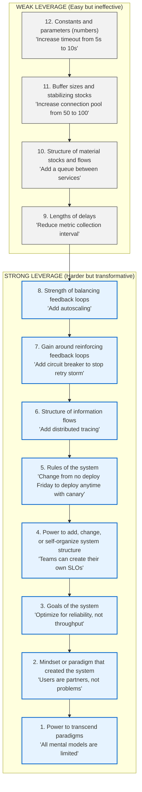
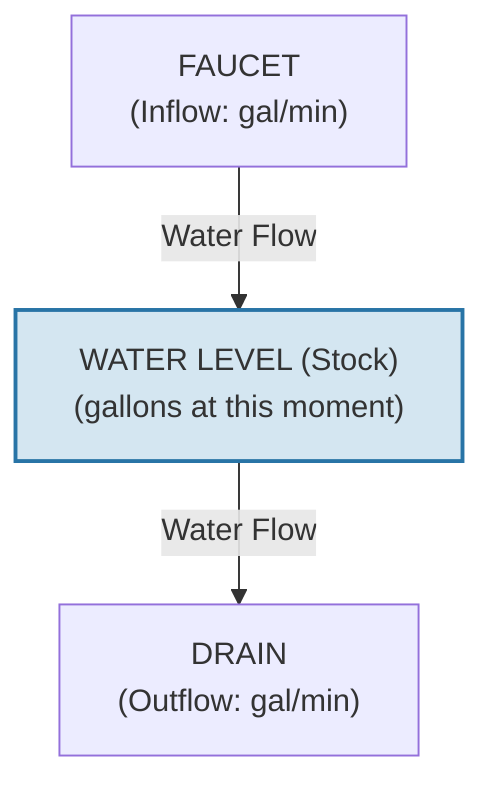
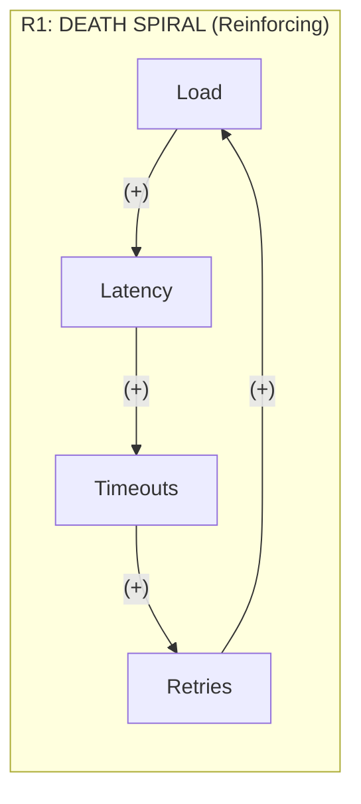
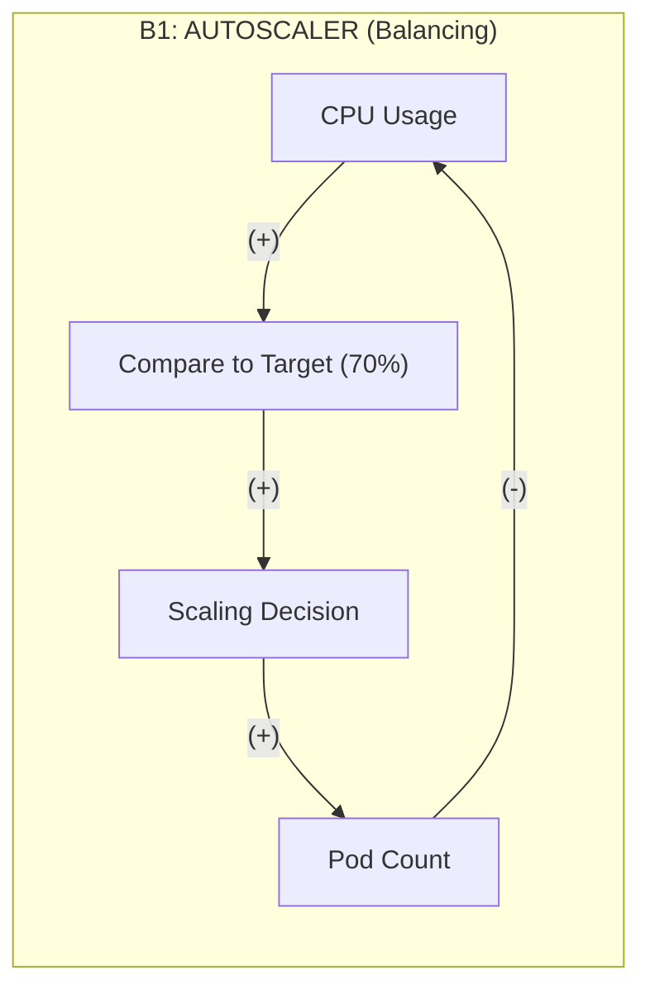
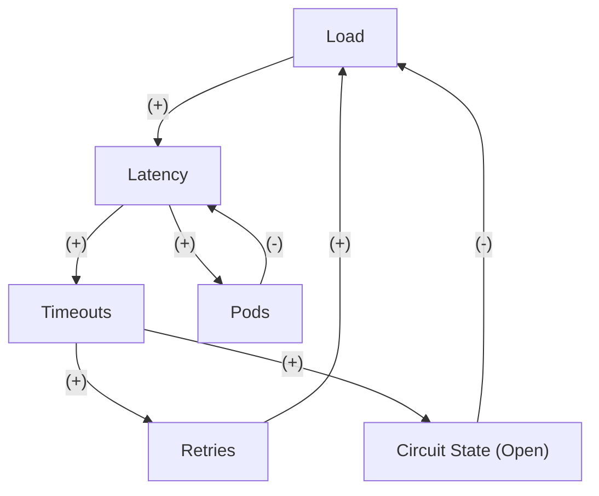
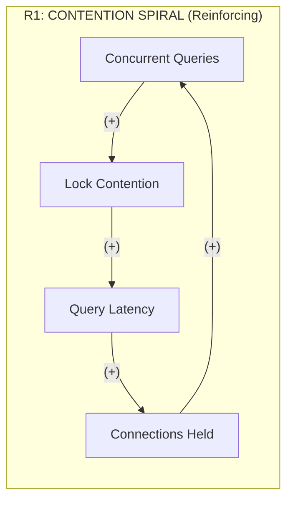
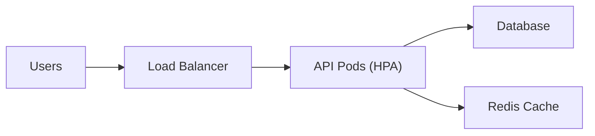

> **Complexity**: `[MEDIUM]`
>
> **Time to Complete**: 35-40 minutes
>
> **Prerequisites**: [Module 1.2: Feedback Loops](../module-1.2-feedback-loops/)
>
> **Track**: Foundations

## What You'll Be Able to Do

1. **Apply** the three core operational mental models — leverage points, stock-and-flow diagrams, and causal loop diagrams — to decisions during live incidents
2. **Evaluate** which mental model best fits a given incident scenario and explain why others fall short
3. **Diagnose** production incidents faster by selecting the appropriate reasoning framework before diving into logs
4. **Compare** competing hypotheses during incidents using structured mental models rather than intuition alone

---

## The Incident That Revealed Everything

**Hypothetical scenario:**

*A mid-afternoon outage at a production e-commerce platform. Checkout is down. The incident channel is flooded. Engineers stare at dashboards showing conflicting signals. Management is asking for status every few minutes. Multiple theories are flying—database connections maxed out, cache miss rate spiking, a recent deploy rolled back. Someone suggests restarting everything, but that has already been tried twice without effect.*

Hours into the incident, a team member asks a question nobody had considered: "What is *supposed* to happen when checkout gets slow?"

The answer reveals the entire failure chain. The frontend retries on timeout. Each retry adds load. More load means more timeouts. More timeouts mean more retries. The database was never the root cause—it was being crushed by a retry storm that had been amplifying since the initial trigger.

The fix is nearly instantaneous once the loop is identified: disable retries. The outage persisted because nobody had the right mental model to see the feedback structure governing the system's behavior.

> **Stop and think**: If the database was perfectly healthy, what system behavior actually brought it down in this scenario?

---

## Why This Module Matters

You have twenty metrics dashboards, hundreds of alerts, and a production system doing something unexpected. Where do you focus? What do you change? How do you know whether your fix will help or make things catastrophically worse? Raw telemetry data does not give you answers—it gives you measurements. The gap between measurement and effective action is bridged by mental models.

Mental models are compressed representations of how complex systems behave. They are thinking tools, distilled patterns that help you navigate situations where the full detail of the system exceeds what any one person can hold in their head at once. They are not the territory—your actual production system contains orders of magnitude more detail—but they are maps that let you orient quickly, identify leverage, and avoid the most common traps. The right mental model lets you see patterns others overlook and find solutions that address the structural cause rather than the surface symptom.

This module equips you with three essential frameworks drawn from the systems thinking tradition, each addressing a distinct operational need. First, Donella Meadows' hierarchy of leverage points provides a ranked ordering of where to intervene in a system for maximum effect relative to effort. Understanding this hierarchy counteracts the instinct to reach for the most obvious (and usually weakest) intervention during an incident. Second, stock-and-flow diagrams give you a visual language for understanding accumulation—why queues grow, why memory fills up, and why error budgets deplete over time. Third, causal loop diagrams reveal the feedback structures that make systems resistant to change or prone to runaway amplification.

These are not abstract academic constructs. The best SREs and platform engineers use these frameworks—whether explicitly drawn on a whiteboard or implicitly internalized—to understand production systems under pressure, to design interventions that last, and to communicate their reasoning to others during incidents. When you cannot see the feedback loops driving your system's behavior, you are flying blind regardless of how many dashboards you have.

> **The Map Analogy**
>
> A transit map is not geographically accurate—it is schematically useful. The iconic London Underground map deliberately distorts distances and directions, compressing outer stations and expanding the dense central core, yet it is exactly the right tool for planning a journey across the network. A topographically precise map would overwhelm you with irrelevant detail and make route planning significantly harder.
>
> Mental models work the same way. A stock-and-flow diagram of your request pipeline does not capture every configuration knob, every network hop, or every caching layer. But it does help you see where work accumulates and why. The statistician George Box captured this tradeoff precisely: "All models are wrong, but some are useful." Your professional judgment lies in knowing which simplified model is useful for the problem at hand, and when to switch to a different one.

---

## What You'll Learn

- Donella Meadows' leverage points for system intervention
- Stock-and-flow diagrams for operational analysis
- Causal loop diagrams for visualizing feedback
- How to choose the right model for the situation
- Practical application to real incidents

---

## Part 1: Leverage Points—Where Small Changes Create Big Results

### 1.1 The Counterintuitive Truth

When a production system degrades, there is almost always an obvious fix waiting to be applied: add more replicas, increase the timeout, bump the memory limit, scale out the database. These fixes feel productive because they are fast, they are tangible, and they produce an immediate, visible change in a dashboard number. They are also, in the majority of cases, the wrong intervention—or at least a dramatically suboptimal one. Understanding why requires grappling with the concept of leverage.

Leverage points are places in a system where a modest change can produce a disproportionately large result. Donella Meadows, the systems thinker and lead author of the landmark "Limits to Growth" study, identified twelve such points and ordered them from least to most effective in her 1997 essay "Places to Intervene in a System." Her framework has become foundational across disciplines from ecology to economics to software operations because it provides a ranking that is simultaneously intuitive in hindsight and almost never followed in practice. The central counterintuitive insight of her hierarchy is this: the most obvious and accessible interventions are almost always the weakest, while the most transformative interventions require questioning assumptions so fundamental that most organizations never consider them.

The accompanying diagram organizes the twelve leverage points into two tiers—weak interventions that feel productive but rarely solve the underlying problem, and strong interventions that require more effort but produce lasting structural change:


```mermaid
flowchart TD
    classDef weak fill:#f2f2f2,stroke:#333,stroke-width:1px;
    classDef strong fill:#e6f3ff,stroke:#0066cc,stroke-width:2px;

    subgraph Weak ["WEAK LEVERAGE (Easy but ineffective)"]
        direction TB
        L12["12. Constants and parameters (numbers)<br/>'Increase timeout from 5s to 10s'"]
        L11["11. Buffer sizes and stabilizing stocks<br/>'Increase connection pool from 50 to 100'"]
        L10["10. Structure of material stocks and flows<br/>'Add a queue between services'"]
        L9["9. Lengths of delays<br/>'Reduce metric collection interval'"]
    end

    subgraph Strong ["STRONG LEVERAGE (Harder but transformative)"]
        direction TB
        L8["8. Strength of balancing feedback loops<br/>'Add autoscaling'"]
        L7["7. Gain around reinforcing feedback loops<br/>'Add circuit breaker to stop retry storm'"]
        L6["6. Structure of information flows<br/>'Add distributed tracing'"]
        L5["5. Rules of the system<br/>'Change from no deploy Friday to deploy anytime with canary'"]
        L4["4. Power to add, change, or self-organize system structure<br/>'Teams can create their own SLOs'"]
        L3["3. Goals of the system<br/>'Optimize for reliability, not throughput'"]
        L2["2. Mindset or paradigm that created the system<br/>'Users are partners, not problems'"]
        L1["1. Power to transcend paradigms<br/>'All mental models are limited'"]
    end

    L12 --> L11 --> L10 --> L9 --> L8 --> L7 --> L6 --> L5 --> L4 --> L3 --> L2 --> L1
    
    class L12,L11,L10,L9 weak;
    class L8,L7,L6,L5,L4,L3,L2,L1 strong;
```

The weak tier—levels 12 through 9—corresponds to interventions that change numbers, sizes, flows, and delays. These are the parameters of the system, the quantities you can adjust with a configuration change or a resource allocation. They are weak because they operate within the existing structure of the system rather than changing that structure. Increasing a timeout from five to ten seconds does not change the fact that timeouts exist and that slow responses will accumulate; it merely changes the threshold at which accumulation begins. Increasing a connection pool from fifty to a hundred connections does not change the fact that connections are a finite resource subject to contention; it merely changes the ceiling.

The strong tier—levels 8 through 1—operates differently. These interventions change the feedback structure, the information flows, the rules, the goals, and ultimately the paradigms that govern the system. Adding a circuit breaker changes the system's feedback dynamics by introducing a mechanism that detects and responds to failure patterns. Adding distributed tracing changes what information the system reveals about itself, enabling entirely new categories of diagnosis and improvement. Changing a team's goal from "ship features quickly" to "ship features that meet their reliability SLO" does not change any parameter at all, yet it fundamentally alters every decision the team makes. The pattern is consistent across every domain where the hierarchy has been applied: the highest-leverage interventions change what the system is trying to do and how it perceives itself, not just how fast or how large it operates.

> **Did You Know?**
>
> - Most incident response stays at leverage point 12—tweaking numbers. "Increase replicas." "Raise the timeout." "Bump the memory limit." These interventions are easy to apply and easy to justify, but they rarely solve the underlying structural problem. They buy time, not solutions, and the bill for that time compounds with every recurrence.
>
> - **Netflix's Chaos Engineering** program operates at level 6 (information): by intentionally injecting failures into production, they reveal how their system actually behaves under stress—information that would otherwise remain hidden until a real outage forces the revelation. The chaos experiments are not the intervention; the information they produce is.
>
> - **Google's SRE model** operates at level 3: by making reliability a shared goal between development and operations, enforced through error budgets, it changes what the entire organization optimizes for. This is not a parameter tweak—it is a redefinition of what success means.

### 1.2 Leverage Points in Action

Applying the hierarchy to a concrete operational scenario makes the ranking tangible. Consider the recurring problem: **"The API is consistently slow."** Engineers have been living with this for weeks, applying quick fixes that help temporarily but do not last. The table below evaluates potential interventions at each leverage level for this scenario:

| Leverage Level | Intervention | Why This Level | Effectiveness |
|----------------|--------------|----------------|---------------|
| **12** (Numbers) | Increase timeout from 5s to 10s | Just changing a number | Masks the problem, users still wait |
| **11** (Buffers) | Increase connection pool from 20 to 50 | Adding capacity | Delays the problem, doesn't solve it |
| **10** (Structure) | Add a cache layer | Changes how data flows | Moderate—reduces load on slow path |
| **9** (Delays) | Faster metrics collection (60s → 15s) | Reduces response time | Moderate—see problems faster |
| **8** (Balancing loops) | Add autoscaling | Adds stabilizing mechanism | Moderate—matches capacity to demand |
| **7** (Reinforcing loops) | Add circuit breaker | Breaks amplification | **Strong—stops cascades** |
| **6** (Information) | Add distributed tracing | Reveals where time goes | **Strong—enables root cause fix** |
| **5** (Rules) | "All queries must have timeout" | Changes the game | **Strong—prevents accumulation** |
| **3** (Goals) | "Optimize for P99, not throughput" | Changes what matters | **Very strong—realigns all decisions** |

Notice the pattern that emerges from this analysis: **interventions at levels 12–11 are what everyone reaches for first, because they are low-risk and immediately visible, but levels 7–5 are where the real solutions reside.** The gap between these tiers explains why so many incident postmortems produce action items like "increased the timeout" and "added monitoring for X" while the underlying pattern recurs predictably. The team applied a weak-leverage intervention and mistook the temporary relief for a solution. Organizational incentives often reinforce this trap: a parameter change can be deployed in minutes with minimal review, while changing a rule or adding an information flow requires coordination, design, and sometimes uncomfortable conversations about why the current approach is insufficient.

A systems-thinking approach to incident response means consciously pausing before applying the obvious fix and asking: at what leverage level am I about to intervene, and is there a higher-leverage alternative worth the additional effort? The answer is not always to reach for the highest level—sometimes a parameter tweak is exactly what the moment demands. But the question must be asked explicitly, because the default instinct under pressure is to reach for what is easy, not what is effective.

### 1.3 Finding High-Leverage Interventions

When you are in the middle of an incident or designing a system, a structured question sequence can surface higher-leverage interventions that intuition alone would overlook. Work through these questions in order, from most urgent to most fundamental:

### The High-Leverage Question Sequence

1. **REINFORCING LOOPS (Level 7)**: *"Where's the amplification?"* Is there a retry storm feeding on itself? Is something filling up and making the situation progressively worse? Is success breeding more success, or is failure breeding more failure in a way that accelerates? Breaking an active reinforcing loop is almost always the highest-leverage immediate action because it stops the damage from compounding. In the retry storm scenario from the opener, the reinforcing loop was the only thing sustaining the outage—the database was healthy, but the loop made it appear broken.

2. **INFORMATION GAPS (Level 6)**: *"Who does not have the information they need to act correctly?"* Can the on-call engineer see what is actually happening, or are they guessing from aggregate metrics? Does the autoscaler know about the real load arriving at each pod, or is it reacting to a lagging indicator? Can developers see the production impact of the code they are shipping? Adding information flow enables every other improvement because it replaces assumptions with evidence.

3. **RULES (Level 5)**: *"What rule prevents the obvious solution from being implemented?"* Why can the fix not be deployed right now? Why does every error trigger a retry? Why is there no circuit breaker in place? Often the barrier is a rule that was established long ago for a context that no longer applies—a deployment freeze policy from a previous incident, a retry-everything default from a library, or a standard operating procedure that nobody has questioned.

4. **GOALS (Level 3)**: *"What is the system actually optimizing for, as measured by what gets rewarded and what gets penalized?"* Is the team measured primarily on features shipped or on reliability sustained? Does the business prioritize speed to market or stability of the existing service? What behaviors are celebrated in team meetings, and what behaviors lead to uncomfortable conversations? Changing the goal changes everything downstream because it redirects every individual decision toward a different objective.

**Worked Example:**

> **SCENARIO: Frequent production incidents disrupting the team's velocity**
>
> * **Team's first instinct (Level 12)**: "Add more on-call engineers"
>   * **Problem**: More people responding to the same broken processes. The incidents continue at the same underlying rate while the response team grows larger, burning out more engineers over time.
> * **Better intervention (Level 8)**: "Add structured escalation policies and incident commander rotation"
>   * **Improvement**: A stronger balancing loop for incident response coordination and handoff.
>   * **Problem**: Does nothing to prevent incidents from occurring—only handles them more smoothly once they are underway.
> * **High-leverage intervention (Level 6)**: "Replay production traffic patterns against staging before every deploy"
>   * **Impact**: A new information flow catches regressions before they reach production. Incidents that would have been discovered by users are instead discovered by automated testing, dramatically reducing the frequency of unplanned work.
> * **Highest-leverage intervention (Level 3)**: "Team goal redefined from 'ship features rapidly' to 'ship features that meet their reliability SLO, with the error budget as the mechanism for deciding when to prioritize velocity over stability'"
>   * **Impact**: Changes what the entire team optimizes for at a fundamental level. Preventing incidents becomes valued work rather than overhead. The quality of every decision—from architecture to code review to testing investment—improves because the goal structure now incentivizes reliability.

---

## Part 2: Stock-and-Flow Diagrams—What's Accumulating and Why

### 2.1 The Bathtub Model

The simplest and most powerful starting point for stock-and-flow thinking is an everyday object: a bathtub. The water level in the tub at any moment is the **stock**—a quantity you can measure at a point in time, expressed in gallons. The faucet is the **inflow**—water entering the tub at a certain rate, expressed in gallons per minute. The drain is the **outflow**—water leaving the tub, also a rate. The fundamental dynamic is elegantly simple: if inflow exceeds outflow, the stock rises. If outflow exceeds inflow, the stock falls. If they are equal, the stock is stable.


```mermaid
flowchart TD
    Faucet["FAUCET<br/>(Inflow: gal/min)"] -->|Water Flow| WaterLevel["WATER LEVEL (Stock)<br/>(gallons at this moment)"]
    WaterLevel -->|Water Flow| Drain["DRAIN<br/>(Outflow: gal/min)"]

    classDef stock fill:#d4e6f1,stroke:#2874a6,stroke-width:2px;
    class WaterLevel stock;
```

This model is disarmingly trivial to describe and yet profoundly underutilized in operational practice. It explains why queue depths grow unboundedly, why memory fills up and triggers OOM kills, why connection pools exhaust, and why incidents cascade when a reinforcing loop amplifies an inflow. The insight that transforms bathtub thinking from obvious to operationally useful is recognizing that stocks, flows, and the relationships between them are what your monitoring dashboards are actually measuring—you are simply not accustomed to reading them through this lens. Queue depth is a stock. Request rate is an inflow. Processing rate is an outflow. Latency is the stock divided by the outflow rate. Every metric in your observability stack can be classified as a stock or a flow, and understanding which is which tells you what to watch when the system degrades.

A critical property of stock-and-flow systems is that **stocks change the time shape of flows**. A large stock acts as a buffer, absorbing fluctuations in inflow so that outflow can remain steady. If your request queue can hold a thousand items, a brief spike in incoming requests does not immediately translate to dropped traffic—the queue absorbs the excess and drains gradually. This buffering property is simultaneously a design tool and a diagnostic hazard: it smooths out problems, which means the system can be degrading for minutes or hours before any alert fires, because the stock level is rising silently within the buffer zone. When the alert finally triggers, the degradation has been underway for far longer than the alert duration suggests.

### 2.2 Stocks and Flows in Operations

Translating the bathtub model into operational terms yields a diagnostic lens that applies across virtually every subsystem you manage. The table below maps common operational stocks to their inflows and outflows:

| Stock (What accumulates) | Inflow (What adds) | Outflow (What removes) | Why It Matters |
|--------------------------|-------------------|----------------------|----------------|
| **Request queue** | Incoming requests | Processed requests | Queue depth = latency |
| **Connection pool usage** | New connections | Released connections | Full pool = blocked requests |
| **Memory usage** | Allocations | GC collections | Memory full = OOM kills |
| **Error budget** | Time passing (SLO met) | Incidents (SLO violated) | Budget exhausted = no deploys |
| **Technical debt** | Shortcuts taken | Refactoring done | Debt grows → velocity shrinks |
| **On-call fatigue** | Alerts, pages | Rest time | Fatigue → burnout → turnover |
| **Backlog items** | Feature requests | Completed features | Backlog bloat → priority chaos |

The error budget row deserves particular attention because it is a deliberately designed stock-and-flow system. The stock of budget accumulates steadily during periods of reliable operation—the SLO is being met, so time passing adds to the available budget. Incidents draw down the budget, and if the drawdown rate exceeds the accumulation rate over the SLO's measurement window, the budget is exhausted. When the budget is exhausted, deployments stop. This mechanism transforms an abstract reliability target into a concrete, accumulating quantity that both development and operations teams can reason about. It is an information-flow intervention (level 6) embedded in a stock-and-flow structure, and it works precisely because it makes the accumulation of risk visible and quantifiable.

> **Stop and think**: Where does "technical debt" fit in the stock-and-flow model? What is the inflow, and what is the outflow? The inflow is every shortcut, every skipped test, every "we'll fix it later" decision made under schedule pressure. The outflow is the deliberate refactoring and remediation work that reduces the accumulated debt. The stock of debt rises whenever inflow outpaces outflow, and the stock itself has a compounding effect: the more debt accumulates, the slower every subsequent change becomes, which in turn reduces the rate at which outflow (remediation) can occur. This is a reinforcing feedback loop embedded within what initially appears to be a simple stock-and-flow structure.

### 2.3 Drawing Stock-and-Flow Diagrams

Drawing the system explicitly, even in a rough sketch, surfaces dynamics that are invisible when you stare at individual metric dashboards. The following diagram models a request processing pipeline as a stock-and-flow system:

```mermaid
flowchart TD
    Incoming["Incoming requests<br/>Rate: 100/s"] --> Queue["REQUEST QUEUE<br/>Stock Level: Currently 50 items<br/>Max Capacity: 1000 items<br/>(If max -> HTTP 503)"]
    Queue -->|Processed requests<br/>Rate: 100/s (healthy)<br/>Rate: 40/s (DB slow)| Processed{"Outcome"}
    
    Processed -->|95/s| Successes["Successes"]
    Processed -->|5/s| Failures["Failures"]
    
    Failures -->|60% retry| Retries["Retries<br/>3/s"]
    Retries -.->|Adds to inflow!| Incoming
    
    classDef stock fill:#d4e6f1,stroke:#2874a6,stroke-width:2px;
    class Queue stock;
```

**What This Diagram Reveals:**

The diagram exposes four dynamics that a raw request-rate dashboard would not communicate. First, when incoming rate (100/s) equals processing rate (100/s), the queue is stable at its current level—a steady-state equilibrium that can persist indefinitely. Second, when the downstream database slows and processing drops to 40/s, the queue grows by 60 items per second, reaching its maximum capacity of 1000 in approximately sixteen seconds, after which requests begin receiving 503 responses. Third, the retry path introduces a hidden inflow: 5/s of requests fail, 60% of those retry (adding 3/s to inflow), making the effective inflow 103/s even when the nominal arrival rate has not changed. Fourth, the queue itself is a buffer whose size represents a deliberate tradeoff between resilience (larger buffers absorb larger spikes) and latency (items waiting in the queue experience additional delay proportional to queue depth divided by processing rate). Selecting the right buffer size is not a capacity-planning exercise—it is an SLO-level design decision that shapes how the system degrades under load.

The retry path in this diagram is especially instructive because it shows how a stock-and-flow diagram can reveal a reinforcing loop that would otherwise be hidden. The retry arrow feeds back into the inflow, meaning that failures increase the effective arrival rate, which increases failures, and so on. This is the same pattern from the opening scenario, now rendered as a visual structure rather than a narrative. When you draw stock-and-flow diagrams, trace every connection back to its source and ask whether it might create a feedback path. Loops that emerge from supposedly linear pipelines are among the most dangerous failure modes in production systems precisely because nobody drew the diagram.

### 2.4 Using Stock-and-Flow for Incident Diagnosis

The stock-and-flow lens provides a systematic approach to diagnosing the most common incident pattern: a metric that is growing over time, such as climbing latency, an expanding queue, or rising memory consumption.

### Stock-and-Flow Incident Diagnosis

When a stock is growing—queue depth expanding, latency climbing, memory consumption trending upward—the diagnosis always reduces to a single question with exactly two possibilities. The symptom is straightforward: queue depth (the stock) is growing, and latency equals queue depth divided by processing rate, so a growing queue means growing latency. The diagnosis is equally straightforward: inflow exceeds outflow. This framework guarantees there are no other branches to consider, which means you can eliminate entire categories of hypotheses rapidly and focus your investigation on the remaining possibilities.

**Possibility A: Inflow has increased.** The rate at which work arrives has gone up. Check whether there has been a traffic spike by consulting the load balancer request rate and comparing it to the baseline for this time of day—common causes include a marketing campaign driving unexpected traffic, viral content sharing, or a deliberate attack. Check for a retry storm by examining error rate and retry rate metrics simultaneously; if errors triggered retries which triggered more errors, the inflow increase is being generated internally rather than externally. Check whether a scheduled batch job has started by examining cron schedules and job queue metrics; nightly ETL jobs and report generation are frequent culprits in periodic latency spikes. Check whether the system is catching up after a period of downtime by looking for a recent gap in processing metrics; recovering systems often face a backlog that looks like an inflow spike.

**Possibility B: Outflow has decreased.** The rate at which work is being processed has dropped. Check whether there are fewer workers available by examining pod counts, node status, and recent deployment events—evictions, failed deployments, and node failures all reduce processing capacity. Check whether individual requests are taking longer to process by examining request latency breakdowns; a slow database, a degraded dependency, or CPU throttling will increase per-request duration, which reduces effective throughput even if no workers are lost. Check for resource contention by examining CPU, memory, network, and disk I/O saturation; a noisy neighbor on shared infrastructure or a resource limit being hit can throttle processing without triggering a clear failure signal. Check for lock contention by examining database lock metrics and mutex wait times; blocking queries and deadlocks can stall processing at near-zero throughput while every metric except the lock wait time looks normal.

> **Hypothetical scenario: The Invisible Stock**
>
> A team spent weeks debugging intermittent latency spikes that appeared on no standard dashboard. CPU was within limits. Memory was stable. Network throughput was unremarkable. Database query times were normal. Every observable metric said the system was healthy, and yet clients were experiencing failures that left no trace in the application logs.
>
> Eventually, someone checked the operating system level. Linux maintains a **listen queue**—a stock of pending TCP connections waiting to be accepted by the application process. When the application accepts connections more slowly than they arrive during a traffic burst, this queue fills up. The kernel parameter `net.core.somaxconn` controls its maximum size, and the default on many systems is modest. When the queue fills completely, the kernel silently drops new connection attempts. No application-level error. No log entry. No metric in the standard observability stack. Just clients experiencing connection failures that the server never saw.
>
> Once the team recognized the problem as a stock-and-flow dynamic—a hidden stock with an inflow exceeding its outflow and a hard ceiling—the solution became clear. First, increase the buffer ceiling by raising `net.core.somaxconn` to provide headroom during bursts. Second, increase the outflow rate by configuring additional accept workers or tuning the application's accept loop. Third, and most importantly, add monitoring for the queue depth that had previously been invisible, so the next time the stock began to rise, the team would see it before it hit the ceiling.
>
> **Lesson**: Every production system contains stocks you are not currently measuring. Stock-and-flow thinking helps you hypothesize their existence and find them before they find you.

---

## Part 3: Causal Loop Diagrams—Seeing the Invisible Connections

### 3.1 The Grammar of Causation

Causal loop diagrams provide a visual notation for representing how variables in a system influence one another. Where dashboards show you isolated metrics, causal loop diagrams show you the structure of causation that connects those metrics. They are the X-ray vision of systems thinking, revealing the feedback architecture that determines whether a disturbance will be dampened, amplified, or ignored by the system.

Before you can map a real system, you need the notation itself—a small grammar that, once learned, lets you diagram any feedback structure you encounter in production:

### Causal Loop Notation

The grammar of causal loop diagrams consists of exactly two link types and two loop types, and mastering this small vocabulary unlocks the ability to model any feedback structure encountered in production.

The first link type is the **positive (+) link**, which describes variables that move in the same direction. When variable A increases, variable B increases; when A decreases, B decreases. Operations examples abound: higher load produces higher latency (Load (+)→ Latency), more users generate more revenue (Users (+)→ Revenue), and more failures trigger more retries (Failures (+)→ Retries). The positive sign describes the mathematical relationship between the variables, not whether the resulting outcome is desirable—a reinforcing death spiral is composed entirely of positive links.

The second link type is the **negative (−) link**, which describes variables that move in opposite directions. When variable A increases, variable B decreases; when A decreases, B increases. In operations: more pods reduce the CPU load per pod (Pods (−)→ CPU per pod), higher cache hit rates reduce database load (Cache hits (−)→ DB load), and an open circuit breaker reduces the number of requests reaching the protected service (Circuit open (−)→ Requests). Each negative link represents a dampening or opposing force within the system.

The behavior of an entire loop—whether it amplifies change or resists it—is determined by a simple parity check applied to the closed path. Count the number of negative links in the loop. If the count is even (zero, two, four, and so on), the loop is **reinforcing (R)**: it amplifies change in whatever direction it is currently moving, producing exponential growth or collapse, and it is unstable by nature because it has no self-limiting mechanism. If the count is odd (one, three, five, and so on), the loop is **balancing (B)**: it opposes change, driving the system toward a goal state or equilibrium, creating stability but also risking oscillation if significant delays are present. This counting rule is deterministic; given any closed loop of causal links, its polarity can be established by counting the negative signs without ambiguity or judgment. Causal loop diagrams are therefore testable models whose implications can be checked against observed system behavior, not subjective opinion diagrams.

### 3.2 Mapping Real Systems

**Example 1: The Retry Storm**


```mermaid
flowchart TD
    subgraph R1 ["R1: DEATH SPIRAL (Reinforcing)"]
        direction TB
        Load["Load"] -- "(+)" --> Latency["Latency"]
        Latency -- "(+)" --> Timeouts["Timeouts"]
        Timeouts -- "(+)" --> Retries["Retries"]
        Retries -- "(+)" --> Load
    end
```

Reading the loop from any starting point reveals the same dynamic: Load increases → Latency increases → Timeouts increase → Retries increase → Load increases further. Every link is positive, meaning the variables move together at each step. With zero negative links (an even number), the loop is reinforcing. It has no natural limit and no internal mechanism to stop itself. Left unchecked, it accelerates until an external limit is encountered—typically a resource ceiling at which the system fails rather than merely degrading. This is why circuit breakers exist: they insert a negative link into the reinforcing loop, converting it from a self-amplifying spiral into a structure that can detect runaway behavior and break the cycle.

**Example 2: Autoscaling (the Savior)**


```mermaid
flowchart TD
    subgraph B1 ["B1: AUTOSCALER (Balancing)"]
        direction TB
        CPU["CPU Usage"] -- "(+)" --> Compare["Compare to Target (70%)"]
        Compare -- "(+)" --> Decision["Scaling Decision"]
        Decision -- "(+)" --> Pods["Pod Count"]
        Pods -- "(-)" --> CPU
    end
```

This loop operates differently. When CPU usage rises, the comparison against the target triggers a decision to scale up, which increases the pod count. More pods reduce the CPU usage per pod. The loop contains one negative link (Pods (−)→ CPU), making the count odd and the loop balancing. It opposes change rather than amplifying it—high CPU triggers corrective action that brings CPU back down. However, the word "balancing" should not be mistaken for "benign." Balancing loops with delays can overshoot and oscillate. If the autoscaler takes two minutes to detect the CPU change and three minutes to bring new pods online, it may add capacity after the spike has passed and then remove it just as the next spike arrives, creating a cycle of overcorrection and undercorrection that is entirely predictable from the loop structure.

**Example 3: The Complex Reality.** Real production systems combine multiple loops that interact, and the combined behavior can differ dramatically from what any individual loop would produce in isolation. Consider a system that simultaneously contains a retry storm, an autoscaler, and a circuit breaker—three loops whose interactions determine whether the system degrades gracefully or collapses:


```mermaid
flowchart TD
    Load["Load"] -- "(+)" --> Latency["Latency"]
    Latency -- "(+)" --> Timeouts["Timeouts"]
    Timeouts -- "(+)" --> Retries["Retries"]
    Retries -- "(+)" --> Load
    
    Latency -- "(+)" --> Pods["Pods"]
    Pods -- "(-)" --> Latency
    
    Timeouts -- "(+)" --> CircuitState["Circuit State (Open)"]
    CircuitState -- "(-)" --> Load
```

*Three Loops Interacting:* The retry storm loop R1 (Load → Latency → Timeouts → Retries → Load) is reinforcing with no negative links, and its natural behavior is exponential growth toward failure—it represents the failure mode the system is vulnerable to whenever retry logic is present without adequate protection. The autoscaler loop B2 (Load → Latency → Pods → Latency) is balancing with one negative link where Pods negatively affects Latency, adding capacity in response to increased load as the system's primary adaptive mechanism for handling sustained traffic growth, though its response is subject to delays that can cause oscillation. The circuit breaker loop B3 (Timeouts → Circuit opens → Load drops → Latency drops) is also balancing with one negative link where Circuit State negatively affects Load, and it acts faster than the autoscaler because it operates on immediate failure signals rather than lagging utilization metrics—its action of shedding load is instantaneous once the breaker trips.

*Combined analysis: B3 (circuit breaker) directly counteracts R1 (retry storm) by inserting negative feedback where R1 has only positive feedback. B2 (autoscaler) handles sustained load growth but responds too slowly to prevent a retry storm from overwhelming the system. Without B3, R1 can accelerate faster than B2 can respond, consuming all available resources before additional pods come online. This interaction pattern—a fast reinforcing loop overwhelming a slow balancing loop—is one of the most common failure architectures in production systems and can be identified during design review simply by drawing the loops and comparing their response times.*

### 3.3 Using Causal Loops for Design

Before implementing any feature that involves feedback—retry logic, autoscaling, caching, rate limiting, circuit breaking, load shedding—draw the causal loop diagram. A few minutes of diagramming will surface interactions that would take hours of incident debugging to discover empirically:

### Causal Loop Design Checklist

1. **IDENTIFY ALL LOOPS**: What feedback mechanisms exist in the design, and what feedback mechanisms might emerge from interactions between components that were designed independently? Are the loops reinforcing or balancing? Are there hidden loops—paths through the system that connect back to earlier stages in ways the component designers did not anticipate?

2. **ASSESS EACH LOOP**: What conditions trigger each loop into action? What delays exist between when the trigger condition occurs and when the loop's corrective action takes effect? What limits exist on the loop's behavior—resource ceilings, rate limits, saturation points? What happens when the loop encounters those limits—does it degrade gracefully, oscillate, or fail catastrophically?

3. **CHECK LOOP INTERACTIONS**: Can a reinforcing loop overpower a co-existing balancing loop by acting faster? Can multiple balancing loops, each correct in isolation, fight each other by pulling the system toward different goal states? Is there a sequence in which loops activate that produces a different outcome than any loop would produce alone?

4. **DESIGN SAFETY MECHANISMS**: Every reinforcing loop needs a circuit breaker—a mechanism that detects runaway behavior and inserts a negative link to dampen it before it reaches a resource ceiling. Every balancing loop needs delays that are short enough relative to the dynamics it is controlling to prevent sustained oscillation. Every loop needs observability—metrics and traces that reveal whether it is behaving as designed, because loops that operate silently are loops that will surprise you.

> **Hypothetical scenario: Fighting Autoscalers**
>
> A team deployed two autoscaling mechanisms. The Horizontal Pod Autoscaler (HPA) scaled the service on CPU utilization using the standard Kubernetes metrics pipeline. A custom controller scaled the same service on queue depth, monitoring the pending request count and adding pods when the queue grew beyond a configurable threshold. Both mechanisms were balancing loops. Both were "correct" in the sense that each, operating alone, would converge to its respective target.
>
> In production, they fought each other. When traffic increased, the queue grew, triggering the custom controller to add pods. Additional pods drained the queue rapidly, which caused per-pod CPU utilization to drop below the HPA's target threshold. The HPA, seeing low CPU, removed pods. Fewer pods meant the queue grew again, restarting the cycle. The system oscillated continuously—not because either loop was wrong, but because they had different goal states (queue depth versus CPU utilization) and different response times, creating a tug-of-war that neither could win.
>
> **Lesson**: When designing systems with multiple feedback mechanisms, map the complete set of loops and verify that they do not have conflicting goal states. Individual loops can be correct in isolation and dysfunctional in combination. The only way to detect this before production is to draw the complete diagram and trace the interactions.

---

## Part 4: Applying Mental Models to Real Incidents

### 4.1 The Unified Framework

The three mental models presented in this module are not alternatives from which you choose one. They are layers of analysis that build on each other, providing a structured sequence for approaching any incident that involves system degradation. The framework orders them by the questions they answer, moving from what is happening to why it is happening to what to do about it:

### Mental Model Incident Framework

**STEP 1: STOCK-AND-FLOW (What's accumulating?)**

*"Something is growing that should not be growing, or depleting faster than it should."* Begin by identifying the stocks that are changing: queue depths, connection pool usage, memory consumption, error counts, error budget remaining. For each stock that is trending in an undesirable direction, determine whether the cause is increased inflow, decreased outflow, or both. Locate the bottleneck—the point in the system where inflow exceeds outflow capacity, causing accumulation upstream. This step answers the most operationally urgent question: what is the immediate dynamic driving the degradation, and what metrics confirm or refute each hypothesis?

**STEP 2: CAUSAL LOOPS (Why is it accumulating?)**

*"What feedback structure is driving and sustaining the accumulation identified in Step 1?"* Draw the loops connecting the affected stocks and flows. Is there a reinforcing loop amplifying the problem? Is a balancing loop that normally maintains stability broken, overwhelmed, or fighting another balancing loop? What feedback is missing—what information would a component need to avoid making the situation worse, and who does not have it? This step moves from description to explanation, revealing the structural cause beneath the surface symptom.

**STEP 3: LEVERAGE POINTS (Where to intervene?)**

*"What is the highest-leverage intervention given the loop structure revealed in Step 2?"* Can you break a reinforcing loop immediately by inserting a negative link, such as enabling a circuit breaker or disabling retries? Can you add an information flow that reveals the problem earlier, such as a dashboard for a previously unmonitored queue? Can you change a rule that prevents the system from self-correcting? The leverage hierarchy provides a clear priority order: aim as high as the incident's urgency permits, starting from level 7 (breaking reinforcing loops) and moving upward toward level 3 (changing goals) for long-term remediation.

This sequence is cumulative. Stock-and-flow analysis identifies the candidate culprits. Causal loop analysis confirms or eliminates structural explanations. Leverage point analysis ranks the available interventions. Together, they form a complete reasoning chain from observation to action, one that can be communicated to and debated with other engineers because each step is transparent and the model at each step is explicit.

### 4.2 Worked Example: Database Connection Exhaustion

**Incident**: "All pods reporting database connection timeouts. The connection pool is saturated."

> **Stop and think**: Before jumping to a fix, what is the highest leverage point you can affect in this system?

**Step 1: Stock-and-Flow Analysis**

```mermaid
flowchart TD
    Incoming["New queries<br/>Rate: 50/s"] --> Pool["ACTIVE CONNECTIONS<br/>Stock: 200 (AT MAX!)<br/>Max: 200"]
    Pool -->|Rate: 20/s (!!)| Completed["Completed queries"]
    
    classDef stock fill:#d4e6f1,stroke:#2874a6,stroke-width:2px;
    class Pool stock;
```

The stock is active connections, and it has hit its ceiling. Inflow (50 queries per second requesting connections) exceeds outflow (20 queries per second completing and releasing connections). The outflow is abnormally low because individual queries are taking far longer to execute than normal—a query that should complete in 100ms is instead taking several seconds. The connections are being held open for the duration of these slow queries, saturating the pool and blocking new work. The immediate mechanism is clear: slow queries → connections held longer → pool fills → new requests blocked. But the mechanism does not explain why queries are slow, which is what causal loop analysis addresses.

**Step 2: Causal Loop Analysis**


```mermaid
flowchart TD
    subgraph R1 ["R1: CONTENTION SPIRAL (Reinforcing)"]
        direction TB
        Queries["Concurrent Queries"] -- "(+)" --> Contention["Lock Contention"]
        Contention -- "(+)" --> Latency["Query Latency"]
        Latency -- "(+)" --> Held["Connections Held"]
        Held -- "(+)" --> Queries
    end
```

The root cause is a reinforcing loop. More concurrent queries increase lock contention within the database. Increased contention slows every query, which means connections are held longer. Longer-held connections mean more concurrent queries are active at any given moment. This drives more contention, and the cycle accelerates. All four links are positive, yielding zero negative links and a reinforcing polarity. The loop has no internal braking mechanism—once contention passes a threshold, the database degrades progressively until it is effectively unavailable. The latency increase is not caused by a single slow query; it is caused by the interaction of all queries competing for the same locks, a systemic effect invisible to per-query analysis.

**Step 3: Leverage Point Analysis**

| Leverage Level | Option | Effectiveness |
|----------------|--------|---------------|
| **12** (Parameters) | Increase pool size (200 → 500) | **Terrible**—more concurrent queries = more contention = even slower |
| **11** (Buffers) | Increase connection timeout | Makes users wait longer, doesn't fix root cause |
| **9** (Delays) | Faster query timeout (kill after 5s) | **Moderate**—releases connections faster |
| **8** (Balancing) | Add read replicas | **Good for reads**—distributes load |
| **7** (Break reinforcing) | Circuit breaker on slow queries | **High**—breaks the contention spiral |
| **6** (Information) | Add slow query logging + APM | **High**—shows which queries are slow |
| **5** (Rules) | "All queries must have timeout" | **Very high**—prevents accumulation |

Notice that the most obvious intervention—increasing the pool size (level 12)—is the worst possible action. More concurrent connections would increase lock contention, making every query slower and accelerating the death spiral. This is a general property of the leverage hierarchy: low-level interventions applied to problems driven by reinforcing loops are not merely ineffective; they are often actively harmful because they increase the load on the very mechanism that is failing.

**Action Plan**:

**IMMEDIATE (next 5 minutes):**

Terminate the longest-running queries to break the contention loop now. The command to kill queries running beyond a threshold (e.g., 30 seconds) immediately frees connections and reduces contention, allowing the system to recover. Counterintuitively, consider temporarily reducing the connection pool size: fewer concurrent queries means less lock contention, which means faster query completion for the remaining connections. A smaller pool operating at higher throughput can outperform a larger pool paralyzed by contention.

**SHORT-TERM (next hour):**

Add mandatory query timeouts at the application level: every query receives a deadline (e.g., 5 seconds), and queries that exceed it are cancelled rather than allowed to hold connections indefinitely. This is a rule change (level 5) that prevents any single query from saturating a connection for longer than the timeout duration. Identify the specific slow queries by enabling the database's slow query log with a threshold of 500ms, providing the information (level 6) needed to determine whether the fix is a missing index, a suboptimal query plan, or a schema design issue.

**MEDIUM-TERM (next sprint):**

Add a circuit breaker on database calls: if a configurable number of failures or timeouts occurs within a window, the circuit opens and subsequent calls return a cached or default response rather than adding to the database's load. This breaks the reinforcing loop at level 7. Add a read replica for reporting and analytics queries that do not require real-time consistency, structurally separating heavy read traffic from the write path (level 10).

**LONG-TERM (next quarter):**

Build a dedicated database observability dashboard showing active connections, query latency distribution, lock wait times, and connection pool saturation. This information flow (level 6) makes the contention spiral visible before it reaches the connection pool ceiling. Change the team's development goal: "Every query introduced in a pull request must be explainable and have an appropriate index, verified during code review." This is a goal change (level 3) that prevents the accumulation of un-indexed queries rather than reacting to their effects after deployment.

---

## Did You Know?

- **Donella Meadows** was the lead author of "Limits to Growth" (1972), which used system dynamics computer models to simulate global resource depletion under different policy scenarios. Her leverage points framework—distilled into a short article decades later—came from a career spent modeling complex systems and observing that interventions at different points in a system's structure produce radically different outcomes for the same amount of effort.

- **Jay Forrester**, who invented the field of system dynamics at MIT in the 1950s, originally developed the methodology to understand a puzzle at General Electric: why their factories experienced cycles of labor shortage and oversupply despite stable product demand. He discovered that the delays built into hiring and layoff decisions were creating an oscillating feedback loop—the exact same mathematical structure that causes modern autoscalers to oscillate when their response delays exceed the natural frequency of traffic variation.

- **The London cholera epidemic of 1854** was resolved by John Snow using what we would now recognize as stock-and-flow reasoning. He mapped the stock of deaths geographically, traced the inflow pathway to a contaminated water pump on Broad Street, and convinced authorities to remove the pump handle. The epidemic stopped. Snow did not know about bacteria—germ theory was decades away—but his map of accumulation made the cause visible.

- **Modern epidemiology** is built on stock-and-flow mathematics. The classic SIR model—Susceptible, Infected, Recovered—tracks how populations move between these stocks at rates determined by infection probability and recovery time. The differential equations governing these transitions are structurally identical to the mathematics governing queue depth, error budget accumulation, and connection pool dynamics in production systems.

---

## Common Mistakes

| Mistake | Problem | Solution |
|---------|---------|----------|
| Jumping to parameter tuning | Low leverage, treats symptoms | First identify loops, then find highest leverage |
| Ignoring delays | Causes oscillation or surprise | Map delays explicitly, design around them |
| Missing feedback loops | Unexpected behavior | Draw causal loop diagram before debugging |
| Optimizing one stock | May harm another | Consider all affected stocks |
| Not validating the model | Model may be wrong | Test predictions against reality |
| Ignoring loop interactions | Autoscalers fight each other | Map ALL loops, check for conflicts |
| Treating symptoms as causes | Retry storm vs. its trigger | Trace loops back to root cause |

---

## Quiz

1. **An e-commerce platform experiences a checkout outage during a high-traffic sales event. The on-call engineer's first instinct is to quadruple the connection pool size to handle the surge. The incident commander instead proposes immediately enabling a circuit breaker that will shed 10% of all incoming traffic for the next five minutes. Using the leverage points hierarchy, explain why the incident commander's approach is likely the higher-leverage intervention and what makes the engineer's approach potentially harmful in this scenario.**
   <details>
   <summary>Answer</summary>

   The incident commander is operating at level 7 by breaking the reinforcing loop that is likely causing the outage—a retry storm or contention spiral where each failed request generates additional load that causes more failures. The circuit breaker inserts a negative link into this reinforcing loop, immediately reducing the effective load on the system and giving it space to recover. The engineer's approach of quadrupling the connection pool operates at level 11 (buffer sizing), which is a weak intervention in Meadows' hierarchy. Worse, it can be actively harmful: if the root cause is a contention spiral, more concurrent connections will increase lock contention inside the database, making every query slower and accelerating the death spiral rather than stopping it. This counterintuitive property—that the obvious fix worsens the problem—is characteristic of reinforcing loops and is precisely why the leverage hierarchy ranks parameter changes at the bottom.
   </details>

2. **Your monitoring alerts for a payment processing service: the active request queue has grown from a steady baseline of approximately 50 items to over 700 items in the span of four minutes, and latency is climbing in proportion. Diagnose this incident faster by selecting the appropriate reasoning framework before diving into the logs: walk through the complete stock-and-flow diagnostic branching process you would use to determine the root cause, specifying which metrics you would check for each branch and what each finding would imply.**
   <details>
   <summary>Answer</summary>

   Use stock-and-flow analysis, but measure inflow and outflow together: more arrivals and fewer departures can happen at the same time. First define the stock. If it counts waiting requests, starting service is an exit; if it includes requests in service, completion is an exit. Compare entries and exits across that same boundary and time window. Include retries that re-enter it and cancellations or dropped requests that leave it. Queue growth establishes a net imbalance over the interval, not its cause.

   Compare arrival and retry rates with baseline, then inspect departures even if arrivals have increased. Check available workers, deployment changes and per-request dependency latency for evidence of reduced processing capacity. A load balancer's request count is useful only if you account for requests that never enter this queue. Use both measurements to test combined explanations rather than ruling out a slowdown after finding a traffic spike.
   </details>

   **Hypothetical calculation:** Start with 50 requests waiting or in service. Before the incident, entries and completions both average 200 requests/minute. Assume constant rates for the next four minutes, no other entries or exits, and enough waiting work to sustain the stated completion rates. Predict the final stock for each case before opening the answer.

   | Case | Entries (requests/minute) | Completions (requests/minute) |
   |---|---:|---:|
   | More entries only | 250 | 200 |
   | Fewer completions only | 200 | 80 |
   | Both changes | 250 | 80 |

   <details>
   <summary>Check the calculation and your diagnosis</summary>

   Final stock = initial stock + (entry rate − completion rate) × elapsed time. The three results are **250**, **530**, and **730 requests**. In the combined case, `50 + (250 − 80) × 4 = 730`: the observed growth is compatible with both changes together. These invented rates illustrate the calculation; they do not identify the cause of the quiz's incident. If your measured flows do not explain the stock change, recheck the boundary, missing flows and aligned sampling intervals before choosing a repair.

   Source for the accumulation relationship: [MIT OpenCourseWare, Systems Thinking, slide 28 (PDF page 29)](https://ocw.mit.edu/courses/res-15-004-system-dynamics-systems-thinking-and-modeling-for-a-complex-world-january-iap-2020/65a2dc7433fcb6cce64b55da0342f0c0_MITRES15_004IAP20_slides.pdf#page=29). The request counts above are a teaching example, not MIT measurements.
   </details>

3. **Your team implements a new caching layer in front of a database. During normal operation, cache hit rates are high, which reduces database load, which speeds up cache population queries, which encourages even more cache usage. However, after a cache flush, the database is immediately overwhelmed, which makes cache population queries fail, which keeps the cache cold, which means all queries continue to hit the overloaded database. Classify this feedback structure using causal loop notation: draw the links, count the polarities, and determine whether the loop is reinforcing or balancing. Explain what makes the system stable in one direction and fragile in the other.**
   <details>
   <summary>Answer</summary>

   The loop is reinforcing, and the clean way to prove it is to count the negative links around the cycle. Trace it as Cache Hit Rate → DB Load → Cache Population Speed → Cache Hit Rate. More cache hits *reduce* database load, so that link is negative; lower database load lets population queries run *faster*, so that link is also negative (load down, speed up); and faster cache population *raises* the cache hit rate, a positive link. Two negative links is an even number, so the loop is reinforcing. You can confirm the result by tracing the same structure in the failure direction: more cache misses raise database load, higher load makes population queries fail, and failed population keeps the cache cold and misses high—every link positive, zero negatives, still reinforcing. The loop is symmetric: it amplifies in whichever direction it is currently moving. During normal operation, high cache hit rates create a virtuous reinforcing cycle of low database load and fast cache population. After a flush, the same loop becomes a vicious cycle of database overload and cache population failures. This symmetry is characteristic of reinforcing loops—they do not have a preferred direction, they amplify whatever momentum the system currently has. Stability in one direction does not guarantee stability in the other; in fact, the same loop structure that produces excellent steady-state performance creates catastrophic fragility when disturbed.
   </details>

4. **A team facing recurring database incidents is debating how to choose the right mental model for diagnosing their problem. One engineer wants to apply stock-and-flow analysis by examining connection pool metrics. Another argues they should use causal loop diagrams because the issue might involve feedback dynamics. A third suggests starting with the leverage points hierarchy to identify where to intervene. Using what you have learned about when each mental model is most appropriate, explain which model (or combination) you would apply first to this situation and justify why the order matters for effective diagnosis.**
   <details>
   <summary>Answer</summary>

   The correct approach is to apply the models in sequence rather than choosing one in isolation: start with stock-and-flow analysis because it answers the most operationally urgent question—what is accumulating and why is the connection pool saturating? This step identifies the immediate dynamic (inflow exceeding outflow) and the metric to watch. Then apply causal loop analysis to determine whether the saturation is driven by a reinforcing feedback loop such as a contention spiral, which would explain why the problem escalates rather than stabilizes. Only after understanding the stock-and-flow dynamic and the causal structure should you apply the leverage points hierarchy to rank possible interventions—because the hierarchy's effectiveness depends on knowing which loops are active and what level of intervention the loop structure demands. Choosing the right model at the right time is essential: using stock-and-flow alone risks treating a symptom without understanding the feedback that will recreate it, and using causal loops alone risks identifying a loop structure without knowing which stock to monitor during remediation. The models are complementary layers of analysis, not competing alternatives, and the situation dictates the sequence.
   </details>

5. **Apply the mental models from this module to a practical incident scenario. You are designing a new service that will call a downstream payment gateway with a known characteristic: under load, it slows down progressively rather than failing cleanly, and its response time can stretch from a typical 200ms to over 30 seconds during peak periods. Draw the causal loop that would develop if your service implements simple timeout-and-retry logic without additional protection. Then propose two design-level interventions at different leverage levels and explain which is higher leverage and why this analysis would change how you approach similar real-world integration risks.**
   <details>
   <summary>Answer</summary>

   The timeout-and-retry loop: Load on gateway (+)→ Gateway Latency (+)→ Timeouts in your service (+)→ Retries (+)→ Load on gateway. All links are positive, making this a reinforcing loop with no natural limiting mechanism. During peak periods, the gateway's progressive slowdown triggers timeouts, which trigger retries, which add more load to an already overloaded gateway, driving latency even higher and triggering more timeouts. The loop accelerates until either the gateway collapses completely or your service exhausts its own resources. Two interventions at different levels: first, a circuit breaker (level 7) that monitors the failure rate and opens when it exceeds a threshold, stopping all calls to the gateway for a configurable cooldown period. This breaks the reinforcing loop by inserting a negative link. Second, information flow (level 6) in the form of latency histogram metrics with attribution by calling endpoint, so the team can see which specific operations are driving the retry load. The circuit breaker is the higher-leverage intervention for immediate protection because it directly counteracts the amplification mechanism. The information intervention is higher leverage for long-term improvement because it enables root-cause fixes—and unlike the circuit breaker, which only protects during incidents, the information is valuable during normal operation as well. This analysis has practical application to real integration design: whenever you connect to a service that degrades rather than fails, you must design the interaction as a feedback system rather than a simple call, anticipating the reinforcing loop that retry logic will create and inserting a balancing mechanism before the first incident.
   </details>

6. **During an incident review, a team identifies that their Kubernetes Horizontal Pod Autoscaler and a custom queue-depth autoscaler were fighting each other: the queue scaler added pods when the queue grew, draining the queue and dropping CPU, which caused the HPA to remove pods, which made the queue grow again. Both scalers were individually correctly configured. Classify this as a systems dynamics failure pattern and explain what property of the system design—independent of the specific scaler configurations—caused the conflict.**
   <details>
   <summary>Answer</summary>

   This is a case of two balancing loops with different, fixed goal states competing to control the same variable—a recognized failure pattern in control systems, and distinct from instability inside a single loop. The HPA's goal state is a target CPU utilization; the queue scaler's goal state is a target queue depth. These goals are correlated but not identical—a system with low CPU can still have a growing queue if requests are I/O-bound, and a system with high CPU can have a draining queue if workers are CPU-saturated. Because the scalers optimize for different metrics, their corrective actions pull the system in opposing directions. The structural cause is not misconfiguration but the presence of two independent control loops operating on the same controlled variable (pod count) with different setpoints. This pattern cannot be fixed by tuning either scaler's parameters because the conflict is architectural, not parametric. The solution is either to consolidate into a single scaling mechanism with a unified metric (such as scaling on a composite signal) or to establish a hierarchy where one scaler defers to the other when their recommendations conflict.
   </details>

7. **An observability platform team adds a new metric: the fill level of the operating system's TCP listen queue (whose maximum size is set by `net.core.somaxconn`). No application-level dashboards previously showed this metric, and no alert was configured for it. Two weeks later, the metric reveals that the queue fills to capacity during every deployment rollout, silently dropping client connections for approximately 30 seconds each time. Using the leverage points hierarchy, explain what category of intervention the addition of this metric represents, and why it enables higher-leverage interventions that were previously impossible.**
   <details>
   <summary>Answer</summary>

   Adding the TCP listen queue depth metric is a level 6 intervention: it adds an information flow where none previously existed. Before the metric was available, the connection drops during deployments were invisible to the operations team—the kernel was silently discarding connections with no application-level error, log entry, or alert. The addition of this single metric enables a cascade of higher-leverage interventions that were previously impossible because the problem was undetectable. With the metric in place, the team can now configure an alert on queue saturation (level 8, strengthening a balancing feedback loop that notifies humans when the stock approaches its ceiling). They can tune kernel parameters like `somaxconn` and `tcp_max_syn_backlog` (level 12) with confidence because they can observe the effect. They can redesign the deployment process to drain connections gracefully before shutting down old pods (level 10, changing the structure of flows). And they might reconsider their deployment SLO to include a "no dropped connections" objective (level 3, changing goals). The metric itself is modest, but it unlocks the entire leverage hierarchy above it by converting an invisible system behavior into visible evidence.
   </details>

8. **A platform team is debating whether to invest effort in adding distributed tracing or in writing a comprehensive runbook for every known failure mode. Applying the leverage points hierarchy and the stock-and-flow framework, argue which investment provides higher leverage and why, considering both immediate incident response and long-term system improvement.**
   <details>
   <summary>Answer</summary>

   Distributed tracing is a level 6 intervention (information flows), while runbooks are essentially documentation of known procedures—valuable but operating at the level of response tactics rather than system structure. Tracing provides higher leverage for two reasons. First, it addresses unknown failure modes: a runbook can only document what the team already knows about, while tracing reveals patterns and dependencies that were previously invisible, enabling the discovery of failure modes the team has not yet encountered. Second, tracing changes the system's information architecture permanently: once instrumented, every future incident benefits from richer observability without additional investment, and every team member gains the ability to trace a request end-to-end regardless of their familiarity with the specific service. Runbooks decay as the system evolves and must be continuously maintained; tracing instrumentation, properly implemented, becomes part of the system's self-description. From a leverage perspective, the runbook is a low-leverage intervention—it improves the response to a known problem without changing the system's ability to detect or prevent similar problems. The tracing investment moves the system up the leverage hierarchy and compounds in value over time, while the runbook's value erodes.
   </details>

---

## Hands-On Exercise

This exercise has two parts. Part A lets you observe stock-and-flow dynamics directly in a live Kubernetes cluster by creating and draining a job queue. Part B asks you to apply all three mental models—stock-and-flow, causal loops, and leverage points—to analyze a realistic web application architecture with known issues. Together they provide concrete practice in translating the conceptual frameworks from this module into operational reasoning.

### Part A: Observe Stocks and Flows in Kubernetes (15 minutes)

The objective of this exercise is to see stocks and flows in action using a Kubernetes Job queue as a simplified model of a production work pipeline. You will need a running Kubernetes cluster—kind, minikube, or any accessible cluster will work. The exercise proceeds through five steps that each illustrate a different aspect of stock-and-flow dynamics.

**Step 1: Create a job processing system.** Start by creating a dedicated namespace and submitting ten Kubernetes Jobs that will serve as the work queue. These jobs simulate variable-duration work items by sleeping for a random interval:

```bash
# Create namespace
kubectl create namespace stocks-lab

# Create a series of jobs (the "queue")
for i in {1..10}; do
cat <<EOF | kubectl apply -f -
apiVersion: batch/v1
kind: Job
metadata:
  name: task-$i
  namespace: stocks-lab
spec:
  template:
    spec:
      containers:
      - name: worker
        image: busybox
        command: ["sh", "-c", "echo Processing task $i; sleep \$((RANDOM % 10 + 5))"]
      restartPolicy: Never
  backoffLimit: 2
EOF
done
```

**Step 2: Watch the stock drain as jobs are processed.** With the jobs submitted, monitor the queue (the stock of pending work) and the pods (the workers processing that work). Open two terminal windows and run these watch commands simultaneously:

```bash
# Watch jobs - this shows the "stock" of work
kubectl get jobs -n stocks-lab -w

# In another terminal, watch pods (the workers processing the queue)
kubectl get pods -n stocks-lab -w
```

**Step 3: Observe the dynamics by counting stock levels over time.** Use a watch loop that reports pending and completed job counts each second, giving you a real-time view of how the stock drains as workers process the queue:

```bash
# Count pending vs completed (stock levels)
watch -n 1 'echo "Pending: $(kubectl get jobs -n stocks-lab --no-headers 2>/dev/null | grep -c "0/1"); echo "Completed: $(kubectl get jobs -n stocks-lab --no-headers 2>/dev/null | grep -c "1/1")"'
```

As you watch the numbers change, identify each element in the stock-and-flow model: the pending job count is your stock, job creation is the inflow, and job completion is the outflow. Note how the flow rate determines how fast the stock drains and how the random sleep durations introduce variability in the outflow rate.

**Step 4: Create a flow imbalance by spiking the inflow.** With the original jobs still processing, add ten more jobs quickly to overwhelm the processing capacity and observe the pending stock grow as inflow exceeds outflow:

```bash
# Add 10 more jobs quickly (spike in inflow)
for i in {11..20}; do
kubectl create job task-$i -n stocks-lab --image=busybox -- sh -c "echo Processing task $i; sleep 8"
done
```

Watch the pending count climb until the new jobs begin completing, at which point the stock should peak and then resume draining. This is the exact dynamic that occurs in production when a traffic spike arrives faster than the system can process it.

**Step 5: Clean up by deleting the namespace.** Remove all resources created during the exercise:

```bash
kubectl delete namespace stocks-lab
```

---

### Part B: Analyze a System Using All Three Models (25 minutes)

This part asks you to work through a realistic operational scenario using all three frameworks from the module in sequence. You operate a web application with users routed through a load balancer to API pods managed by a Horizontal Pod Autoscaler, backed by a database and a Redis cache. The system exhibits three recurring issues: latency spikes that occur every hour on the hour, occasional cascading failures during traffic spikes, and periodic drops in cache hit rate from 95% down to 60%.


```mermaid
flowchart LR
    Users["Users"] --> LB["Load Balancer"]
    LB --> API["API Pods (HPA)"]
    API --> DB["Database"]
    API --> Redis["Redis Cache"]
```

**Section 1: Stock-and-Flow Diagram (10 minutes).** Draw a diagram that includes at least two stocks—consider the request queue, the database connection pool, and the cache entry set—along with their inflows and outflows, and show how these stocks are connected through the request processing path. Then answer two diagnostic questions: which stock is most likely related to the hourly latency spikes (think about what resets on an hourly cycle), and what happens to each stock when traffic spikes?

**Section 2: Causal Loop Diagram (10 minutes).** Draw a diagram that includes at least three feedback loops: the retry storm loop (reinforcing), the autoscaling loop (balancing), and the cache behavior loop that explains the hit rate fluctuations. Mark each link as (+) or (−) and label each loop as R or B. Then identify which loop interactions explain the cascading failures—specifically, how a reinforcing loop can overwhelm the protective balancing loops.

**Section 3: Leverage Point Analysis (5 minutes).** For the cascading failure scenario, list at least one intervention at each of the following leverage levels and explain the expected impact of each:

| Level | Intervention | Expected Impact |
|-------|--------------|-----------------|
| 12 | | |
| 8 | | |
| 7 | | |
| 6 | | |
| 5 | | |

**Success criteria for this exercise.** Complete Part A by creating the job queue, observing it drain, and watching what happens when inflow exceeds outflow capacity. For Part B, produce a stock-and-flow diagram with clearly labeled accumulation points, a causal loop diagram with at least two identified loops and correct polarity markings, a leverage point analysis with interventions ranked at the correct levels, and an explanation of why the hourly latency spikes occur—the hint is that cache entries have a time-to-live that expires on a regular cycle.
- [ ] Part A: Created and observed job queue draining
- [ ] Part A: Observed what happens when inflow > outflow
- [ ] Part B: Stock-and-flow diagram with clear accumulation points
- [ ] Part B: Causal loop diagram with at least 2 loops identified
- [ ] Part B: Leverage point interventions ranked correctly
- [ ] Part B: Can explain why the hourly spikes happen (hint: cache TTL)

---

## Sources

1. [Places to Intervene in a System](https://donellameadows.org/archives/leverage-points-places-to-intervene-in-a-system/) — Donella Meadows, 1997. The original essay defining the twelve leverage points and their hierarchy.
2. [Thinking in Systems: A Primer](https://www.chelseagreen.com/product/thinking-in-systems/) — Donella Meadows, 2008. The posthumously published book-length treatment, with detailed chapters on leverage points and system traps.
3. [Handling Overload](https://sre.google/sre-book/handling-overload/) — Chapter from the Google SRE Book covering retry storms, circuit breakers, load shedding, and the feedback dynamics of overloaded systems.
4. [Embracing Risk](https://sre.google/sre-book/embracing-risk/) — Chapter from the Google SRE Book introducing error budgets as a mechanism for balancing reliability and velocity through measurable risk tolerance.
5. [Business Dynamics: Systems Thinking and Modeling for a Complex World](https://www.mhprofessional.com/business-dynamics-9780072389152) — John Sterman, 2000. Comprehensive textbook on stock-and-flow modeling with applications across engineering, management, and public policy.
6. [The Fifth Discipline](https://en.wikipedia.org/wiki/The_Fifth_Discipline) — Peter Senge, 1990. Foundational text applying causal loop diagrams to organizational behavior and team dynamics, introducing the concept of the learning organization.
7. [System Dynamics](https://en.wikipedia.org/wiki/System_dynamics) — Jay Forrester originated this discipline at MIT in the 1950s. The methodology emerged from studying factory hiring cycles at General Electric, where Forrester discovered that feedback delays were causing oscillation—the same pattern seen in modern autoscalers.
8. [Principles of Chaos Engineering](https://principlesofchaos.org/) — Community-authored reference defining the practice of using controlled failure injection to reveal information about system behavior under stress, an application of leverage point 6 (information flows).
9. [Drift into Failure: From Hunting Broken Components to Understanding Complex Systems](https://www.routledge.com/Drift-into-Failure-From-Hunting-Broken-Components-to-Understanding-Complex-Systems/Dekker/p/book/9781409422211) — Sidney Dekker, 2011. Applies systems thinking to incident analysis, arguing that failures emerge from normal system dynamics rather than component breakage.
10. [Resilience Engineering: Concepts and Precepts](https://www.routledge.com/Resilience-Engineering-Concepts-and-Precepts/Hollnagel-Woods-Leveson/p/book/9780754649045) — Hollnagel, Woods, and Leveson, 2006. Foundational text on designing systems that sustain required capability under both expected and unexpected conditions.
11. [Resilience Engineering in Practice: A Guidebook](https://www.routledge.com/Resilience-Engineering-in-Practice-A-Guidebook/Hollnagel-Paries-Woods-Wreathall/p/book/9781472420749) — Hollnagel, Pariès, Woods, and Wreathall, 2013. Practitioner-oriented follow-up with operational patterns for applying resilience engineering principles to production systems.
12. [An Introduction to General Systems Thinking](https://leanpub.com/generalsystemsthinking) — Gerald Weinberg, 1975. Classic text connecting systems thinking principles to software engineering practice, with particular emphasis on the limits of models.

---

## Further Reading

- **"Thinking in Systems: A Primer"** - Donella Meadows. Chapters 5-6 on leverage points and system traps are essential. Short, clear, and will permanently change how you interpret system behavior.
- **"Places to Intervene in a System"** - Donella Meadows (original article). Available online at the Donella Meadows Project. Even shorter than the book and denser with actionable insight.
- **"Business Dynamics"** - John Sterman. The definitive academic text on stock-and-flow modeling and system dynamics, with extensive operational examples.
- **"An Introduction to Systems Thinking"** - Barry Richmond. A practical guide with numerous diagram examples and exercises for building systems thinking fluency.
- **"The Fifth Discipline"** - Peter Senge. Applies systems thinking to organizational behavior and team dynamics. Relevant for engineers who need to influence how their organization makes decisions about reliability investment.

---

## Next Module

[Module 1.4: Complexity and Emergent Behavior](../module-1.4-complexity-and-emergent-behavior/) - The Cynefin framework for decision-making, why complex systems fail unpredictably, and how to design for resilience in environments you can't fully understand.
