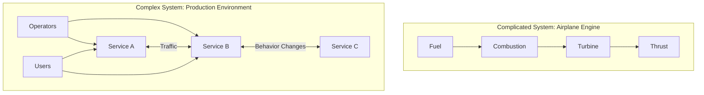
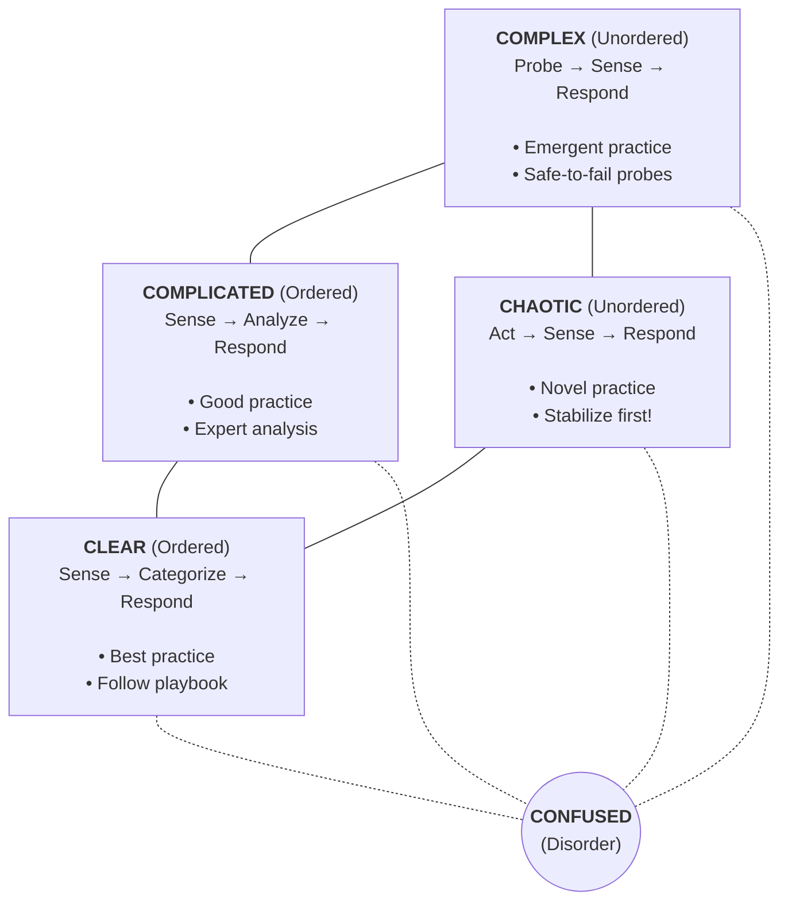
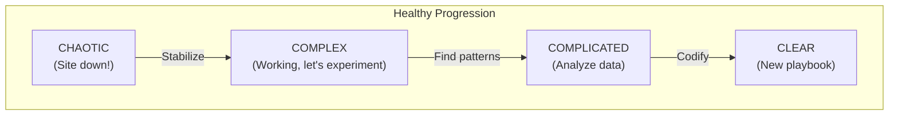
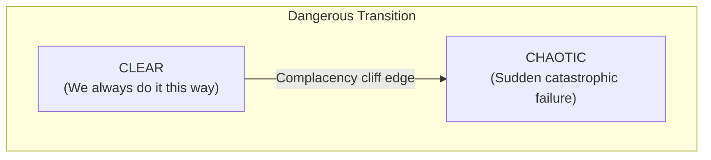
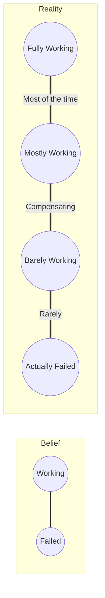
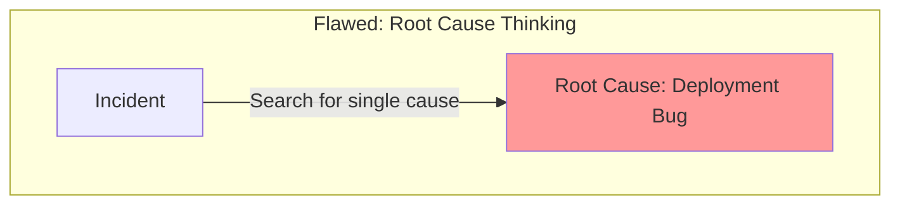
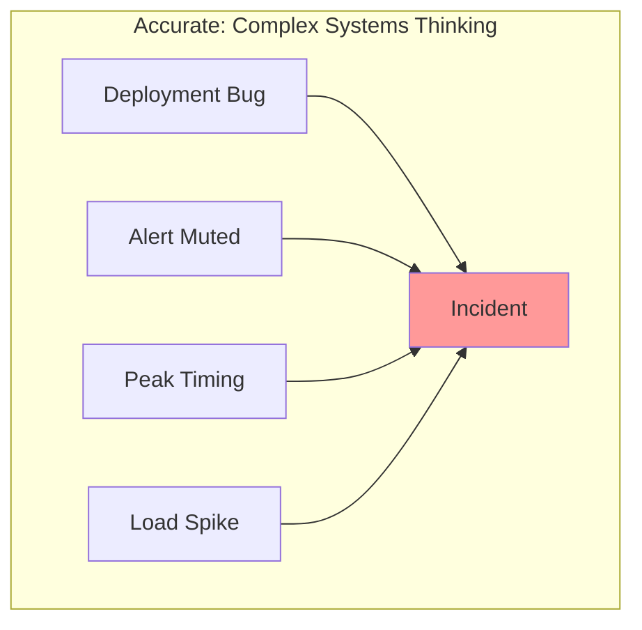
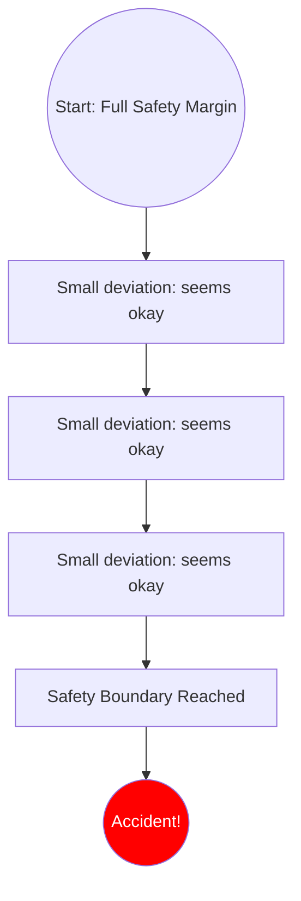
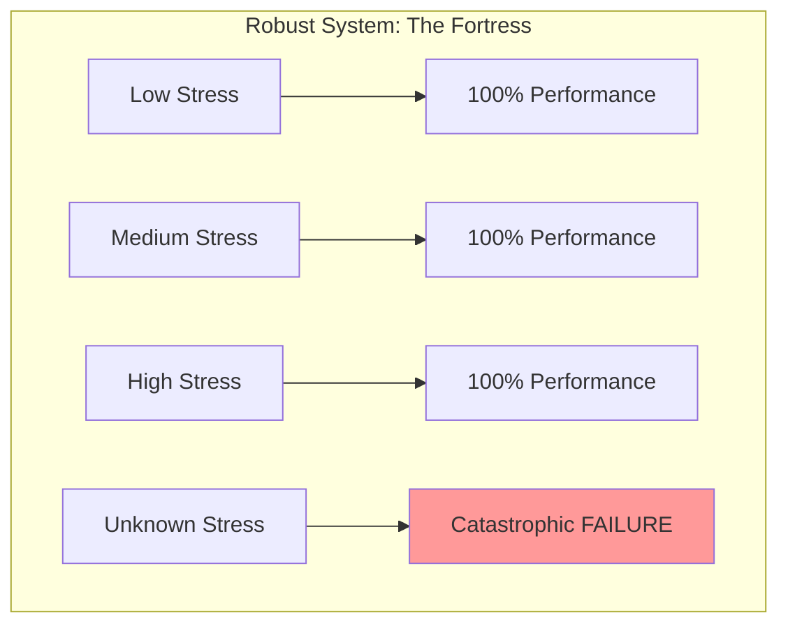
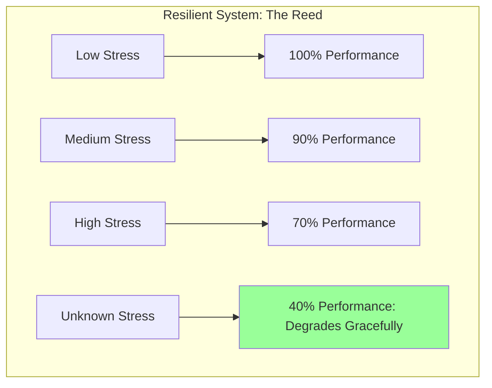

> **Complexity**: `[COMPLEX]`
>
> **Time to Complete**: 40-45 minutes
>
> **Prerequisites**: [Module 1.3: Mental Models for Operations](../module-1.3-mental-models-for-operations/)
>
> **Track**: Foundations

### What You'll Be Able to Do

After completing this module, you will be able to:

1. **Distinguish** between complicated systems (predictable, decomposable) and complex systems (emergent, non-linear) in real infrastructure
2. **Analyze** how simple component interactions produce emergent behaviors that cannot be predicted from specifications alone
3. **Design** observability and safeguards for systems operating at the edge of chaos where emergent failures are most likely
4. **Evaluate** architectural decisions through the lens of complexity theory to reduce the blast radius of unexpected interactions

---

## The Perfect Storm That Nobody Saw Coming

*July 8, 2015. The New York Stock Exchange halts trading at 11:32 AM.*

Engineers scramble. Is it a cyberattack? A hardware failure? The systems look... fine. Dashboards green. No errors. No crashes.

Meanwhile, United Airlines grounds all flights nationwide. Same morning. Different company. Different systems. Complete coincidence.

And The Wall Street Journal's website goes down. Same morning.

Three unrelated failures, all hitting within hours of each other, creating a day the internet will never forget. Conspiracy theories explode. "China is attacking!" "This is coordinated!"

The truth was stranger: each failure was independently caused by mundane issues. NYSE had a software glitch during a routine update. United had a network router problem. WSJ had a technical issue with their content delivery. No coordination. No attack. Just three independent complex systems failing in ways that seemed impossible—until they happened.

> **Stop and think**: Before reading further, consider the last major incident you experienced. Did it have one clear cause, or was it a combination of seemingly unrelated, small factors?

**This is how complex systems work.** They don't fail in the ways you predict. They fail in ways that seem obvious only in hindsight. They create coincidences that look like conspiracies. And they resist all attempts to make them "safe."

---

## Why This Module Matters

You've done everything right. Code is tested. Deployment is automated. Monitoring is in place. Runbooks are written. And yet, the system fails in ways nobody predicted.

This isn't a failure of engineering—it's the **nature of complex systems**. They behave in ways that can't be predicted from their components alone. They adapt, they surprise, and they fail in novel ways.

Understanding complexity changes how you approach operations:
- You stop trying to prevent all failures (impossible)
- You start building systems that handle failure gracefully
- You stop asking "why did this fail?"
- You start asking "how did this ever work?"

> **The Weather Analogy**
>
> Weather is complex. You can model every air molecule perfectly, but you still can't predict weather beyond ~10 days. A butterfly's wingbeat in Brazil might cause a tornado in Texas—or might not. This isn't a measurement problem—it's fundamental to how complex systems behave.
>
> Your distributed system is the same. Perfect knowledge of each service, each container, each network packet doesn't give you perfect prediction of the whole system. New behaviors emerge from interactions that nobody designed.

---

## What You'll Learn

- The crucial difference between complicated and complex systems
- The Cynefin framework for decision-making in different domains
- Richard Cook's essential insights on how complex systems fail
- Why your system is always partially broken (and that's normal)
- How to design for resilience instead of robustness

---

## Part 1: Complicated vs Complex—The Distinction That Changes Everything

### 1.1 The Two Types of Hard Problems

Not all difficult problems are the same. A Boeing 747 is **complicated**. A flock of birds is **complex**. Understanding the difference will transform how you approach production systems.

| Complicated | Complex |
|-------------|---------|
| Many parts, **knowable** relationships | Many parts, **unknowable** relationships |
| Cause and effect **predictable** | Cause and effect only **visible in hindsight** |
| Experts **can** understand fully | No one **can** understand fully |
| **Best practice** exists | **Good practice** emerges |
| Can be **designed** top-down | Must be **evolved** |
| Example: Airplane engine | Example: Air traffic control system |



**Complicated Systems (Airplane Engine):**
- Relationships are FIXED
- Expert mechanics can predict every behavior
- Same input = Same output (always)
- Built from a blueprint
- Can be disassembled, understood, and reassembled
- Failure modes are KNOWN and FINITE
- **You CAN fully understand a complicated system.**

**Complex Systems (Your Production Environment):**
- Relationships change DYNAMICALLY
- No one understands full system behavior
- Same input ≠ Same output (depends on state)
- Emerges from evolution, not design
- Cannot be fully modeled or predicted
- Failure modes are UNKNOWN and INFINITE
- **You CANNOT fully understand a complex system. And that's not a failure—it's fundamental.**

### 1.2 Why Production Systems Are Complex

Your Kubernetes cluster is complex, not just complicated. Here's why:

**1. Non-linear interactions**

A slow database doesn't just make database queries slow—it causes connection pool exhaustion, which causes timeouts, which causes retries, which makes the database slower. The effect is wildly disproportionate to the cause.

**2. Feedback loops everywhere**

Autoscalers respond to load. Retries respond to failures. Circuit breakers respond to errors. Caches respond to traffic patterns. Each feedback loop interacts with others in ways nobody designed.

**3. Constant adaptation**

Users change behavior. Traffic patterns shift. Code changes daily. Dependencies update. Team members join and leave. The system you have today isn't the system you had yesterday.

**4. Human-system coupling**

Operators make decisions that affect the system. The system's behavior affects operator decisions. Alerts change behavior. Dashboards focus attention. The humans are part of the system.

**5. Multiple timescales**

Millisecond network issues interact with second-level retries, minute-level autoscaling, hourly batch jobs, daily deployment patterns, weekly maintenance windows, and quarterly infrastructure changes. All happening simultaneously.

> **Did You Know?**
>
> - **The 2003 Northeast Blackout** (55 million people without power) started with a software bug in an alarm system. The bug meant operators didn't see warnings. But the same bug had existed for years without causing blackouts. What changed? A combination of factors—high temperatures, tree branches touching power lines, operator shift changes—that had never occurred together before. This is complex system failure: multiple small issues combining in novel ways.
>
> - **Ant colonies** build bridges, farm fungus, wage wars, and manage complex supply chains—without any ant understanding the bigger picture. Each ant follows simple rules; complexity emerges. Your microservices work the same way: simple services creating complex system behavior that nobody designed.
>
> - **The 2010 Flash Crash** (stock market dropped 9% in 5 minutes, then recovered) was caused by algorithmic trading systems interacting in unexpected ways. Each algorithm was "correct." Together, they created chaos.

---

## Part 2: The Cynefin Framework—Knowing What Kind of Problem You Have

### 2.1 The Five Domains

**Cynefin** (pronounced "kuh-NEV-in," Welsh for "habitat") is a sense-making framework created by Dave Snowden. It helps you recognize what kind of situation you're in and respond appropriately.

The most dangerous mistake isn't being in a complex domain—it's treating a complex problem like a complicated one, or treating chaos like complexity.



### 2.2 Why the Order of Actions Matters

Each domain requires a different approach. Using the wrong approach is worse than doing nothing.

| Domain | Characteristics | Response Strategy | Common Mistake |
|--------|-----------------|-------------------|----------------|
| **Clear** | Cause-effect obvious to everyone | Sense → Categorize → Respond (use the playbook) | Complacency—"we always do it this way" |
| **Complicated** | Cause-effect discoverable by experts | Sense → Analyze → Respond (study then act) | Analysis paralysis—waiting too long |
| **Complex** | Cause-effect only visible in hindsight | Probe → Sense → Respond (experiment then learn) | Premature convergence—jumping to conclusions |
| **Chaotic** | No perceivable cause-effect | Act → Sense → Respond (stabilize first) | Continued analysis while burning |
| **Confused** | Don't know which domain | Break down and gather information | Acting without knowing the domain |

> **Pause and predict**: If your system goes completely down and you have no idea why, what should your first action be? Analyze the logs, or restart the system? (Hint: You are in the Chaotic domain).

### 2.3 Cynefin in Operations: Real Examples

**CLEAR: Disk Space Alert**
* **Sense:** See the alert.
* **Categorize:** This is a known issue with a known fix.
* **Respond:** Run the disk cleanup playbook.
> **Danger:** Don't overcomplicate it! If you start analyzing why logs grew so much, you're treating a clear problem as complicated. First: fix it. Then: investigate (separate action).

**COMPLICATED: Performance Degradation**
* **Sense:** Gather data (metrics, traces, logs).
* **Analyze:** Have experts examine the evidence (profile code paths, check query plans, examine network latency).
* **Respond:** Implement the fix that analysis reveals.
> **Danger:** Analysis paralysis! If you're still analyzing after 30 minutes while users are affected, you've waited too long. Set a time limit. Act with the best available information.

**COMPLEX: Mystery Failures** (Users complain checkout fails but metrics look fine)
* **Probe:** Run safe-to-fail experiments (Canary with verbose logging, test different user segments).
* **Sense:** Observe patterns that emerge ("Oh, it only happens on mobile Safari" or "It correlates with CDN cache age").
* **Respond:** Amplify what works, dampen what doesn't.
> **Danger:** Premature convergence! Saying "I bet it's the database" and attempting an immediate fix is treating a complex problem as complicated. Run experiments first. Let patterns emerge.

**CHAOTIC: Complete Outage** (Site is completely down, everything is red)
* **Act:** Do something immediately to stabilize (Roll back the last deployment, restart critical services, fail over to backup region).
* **Sense:** What effect did the action have?
* **Respond:** Iterate until stable.
> **Danger:** Analysis during chaos! "Let's understand what's happening first..." NO. The site is down. Users are angry. Revenue is lost. ACT FIRST. Understand later. A wrong action that provides information is better than perfect analysis while everything burns.

> **War Story: The 45-Minute Analysis Meeting**
>
> A team treated every incident as "complicated"—spending time analyzing before acting. During a major outage, they gathered for 45 minutes examining dashboards, discussing theories, debating root causes. The CTO finally walked in and asked, "Is the site still down?" Yes. "What have you tried?" Nothing. "Why?" "We're still analyzing."
>
> The fix? Restart a crashed process. Five seconds. The analysis had revealed the process was crashed in minute three. They'd spent 42 more minutes confirming it was definitely crashed.
>
> **They treated a chaotic situation (site down) as complicated (analyze then act).** Domain misrecognition is dangerous. When the building is on fire, don't form a committee to study fire.

### 2.4 Domain Transitions

Situations can shift between domains. Understanding these transitions helps you respond appropriately.





**Common stuck states:**
* **COMPLICATED → still COMPLICATED**: "We need more data" (forever). Set time limits. Decide with imperfect information.
* **COMPLEX → forced to COMPLICATED**: Management demands a single "root cause" when there isn't one. Educate stakeholders on complexity.
* **CHAOTIC → still CHAOTIC**: Stabilize one thing, something else breaks. Triage. Fix the biggest impact first.

---

## Part 3: How Complex Systems Fail—Richard Cook's Essential Insights

### 3.1 The 18 Principles Every Operator Must Know

Dr. Richard Cook's "How Complex Systems Fail" is three pages that will change how you think about operations. Here are the key insights, applied to production systems:

**PRINCIPLE 1: Complex systems are intrinsically hazardous**
Your production system is inherently dangerous. Not because you built it wrong—because it's complex. This isn't failure. This is physics. Accept it. Don't fight it. Design for it.

**PRINCIPLE 2: Complex systems are heavily defended against failure**
Your system has multiple layers of defense: redundancy, monitoring, alerting, failover, backups, circuit breakers, retries. These defenses work—that's why catastrophic failures are rare.

**PRINCIPLE 3: Catastrophe requires multiple failures**
Single points of failure are myths. The real danger is multiple defenses failing simultaneously in ways nobody anticipated.


*The Swiss Cheese Model: Each defense layer has holes. Most days, they don't align. Some days, they do.*

**PRINCIPLE 4: Complex systems contain changing mixtures of latent failures**
Your system has bugs right now. It has misconfigurations. It has race conditions. It has capacity limits waiting to be hit. It works **despite** these problems, not because they're absent.


*The question isn't "is anything wrong?" but "what's wrong that we're compensating for?"*

> **Stop and think**: If your system is currently running without active incidents, does that mean it is completely healthy? Or is it just compensating for hidden failures?

**PRINCIPLE 5: Complex systems run in degraded mode**
"Normal operation" includes partial failures. The metrics you're seeing right now probably include a slow query, a flaky connection, a service that's about to run out of memory. The system works because humans and automated systems compensate.

**PRINCIPLE 6: Catastrophe is always just around the corner**
Safety margins exist. But they erode. Small pressures—ship faster, cut costs, do more with less—gradually consume safety margins until there's none left.

**PRINCIPLE 7: Post-accident attribution is fundamentally wrong**
"Root cause" is a myth. Assigning blame to a single cause obscures the system conditions that allowed the incident.

### 3.2 The Myth of Root Cause

Complex system failures don't have a single "root cause." They have multiple contributing factors that combine in novel ways.




*Individually harmless factors combine to create catastrophe.*

The deployment bug existed for weeks. The alert was muted months ago. The timing was random. The load spike was normal for that time. NONE of these alone would cause an incident. TOGETHER, they did.

### 3.3 Drift into Failure

Sidney Dekker's crucial concept: systems don't fail suddenly. They **drift** toward failure through small, locally rational decisions.



**Common drift patterns in tech:**

| Small Decision | Rational Justification | Eventual Consequence |
|----------------|----------------------|---------------------|
| "Skip tests for this PR" | "It's a small change" | Test coverage erodes |
| "Silence this alert" | "It's noisy" | Real issues ignored |
| "Don't update that runbook" | "Everyone knows how it works" | Knowledge lost, incident prolonged |
| "Postpone the security patch" | "We'll do it next sprint" | Years pass, vulnerability remains |
| "Increase timeout from 5s to 30s" | "It fixes the immediate problem" | Slow failures propagate |
| "Add one more feature before the refactor" | "Just this once" | Technical debt compounds |

Each decision seems small. Each is locally rational. Together, they erode safety margins until failure is inevitable.

---

## Part 4: Designing for Resilience

### 4.1 Resilience vs Robustness—A Critical Distinction

**Robustness** = Resist known failures
**Resilience** = Adapt to any failure





Robustness handles known failures perfectly, but collapses on the unknown. Resilience handles everything imperfectly, surviving what you didn't anticipate. **For complex systems: ALWAYS choose resilience.**

### 4.2 The Four Resilience Capabilities

Resilience engineering identifies four capabilities that enable systems to adapt:

**1. RESPOND: Address disturbances as they occur**
* **Question:** "What can we do when things go wrong?"
* **Good:** Circuit breakers, graceful degradation, failover.
* **Bad:** Rigid systems with no alternatives (e.g., throwing a Timeout Error when the DB is slow instead of returning cached data).

**2. MONITOR: Know what's happening in the system**
* **Question:** "What should we look for?"
* **Good:** Business metrics, user experience, leading indicators.
* **Bad:** Only infrastructure metrics (CPU, memory, disk).

**3. ANTICIPATE: Identify potential future issues**
* **Question:** "What might go wrong?"
* **Good:** Chaos engineering, load testing, gamedays, threat modeling.
* **Bad:** "It's never failed before."

**4. LEARN: Improve from experience**
* **Question:** "How do we get better?"
* **Good:** Blameless postmortems, systemic analysis, studying successes (Safety-II).
* **Bad:** Categorizing issues as "human error" and moving on.

### 4.3 Chaos Engineering—Practicing Failure Before It Happens

Chaos Engineering deliberately introduces failures to discover weaknesses before real incidents.

> **Stop and think**: What would happen if your primary database instances were suddenly terminated right now? Would the system recover automatically, or require human intervention?

1. **Start with a hypothesis**: "If we kill 30% of API pods, latency should stay under 200ms." This lets you learn regardless of outcome.
2. **Use production-like conditions**: Real chaos happens in production because staging lacks real user behavior and data volumes.
3. **Minimize blast radius**: Start small. Build confidence. Expand gradually.
4. **Run experiments continuously**: Systems drift. Regular chaos experiments detect this drift.
5. **Build confidence, not heroics**: The goal is a boring incident response because you've seen it before.

**Common Chaos Experiments:**

| Experiment | What It Tests | Tools |
|------------|--------------|-------|
| **Pod failure** | Auto-restart, replication | Chaos Mesh, Litmus |
| **Node failure** | Pod rescheduling, affinity | kube-monkey, Chaos Mesh |
| **Network partition** | Retry logic, timeouts, failover | tc, Chaos Mesh |
| **Latency injection** | Timeout handling, circuit breakers | Toxiproxy |
| **CPU/memory stress** | Autoscaling, resource limits, throttling | stress-ng |
| **DNS failure** | Fallback mechanisms, caching | Block DNS queries |

> **Did You Know?**
>
> Netflix's **Chaos Monkey** was one of the first chaos engineering tools (2011). It randomly terminates production instances. The logic: if engineers know their instances will be killed randomly, they design systems that survive instance death. The tool doesn't test resilience—it **forces** resilient design.

### 4.4 Safety-I vs Safety-II

Traditional safety (**Safety-I**) focuses on what goes wrong. It counts errors, eliminates causes, and asks "Why did this fail?"

Resilience engineering (**Safety-II**) also studies what goes right. It recognizes that most operations succeed despite latent failures. Operators constantly work around issues to keep the system running. By asking "Why does this usually work?" we can learn from successful adaptations and amplify them.

---

## Did You Know?

- **The term "emergence"** was coined by philosopher G.H. Lewes in 1875. He observed that water's properties (wetness, transparency) can't be predicted from hydrogen's and oxygen's properties alone. The whole has properties that the parts don't.

- **Cynefin** comes from the Welsh word meaning "habitat" or "place"—but with connotations of multiple factors influencing us in ways we can never fully understand.

- **Traffic jams** are emergent behavior. No driver wants a traffic jam. No traffic engineer designs them. They emerge from simple rules (follow car ahead, slow when crowded) interacting. Your cascading failures work the same way.

- **Richard Cook** was an anesthesiologist before becoming a safety researcher. He studied how surgical teams avoid killing patients despite working in complex, high-stakes environments. His insights apply directly to operations.

---

## Common Mistakes

| Mistake | Problem | Solution |
|---------|---------|----------|
| Treating complex as complicated | Applying "best practices" where they don't work | Use Cynefin to identify domain first |
| Searching for "root cause" | Oversimplifies, misses contributing factors, enables blame | Look for multiple contributing factors |
| Assuming safety from testing | Tests find known issues, not emergent behavior | Add chaos engineering, observe production |
| Blaming individuals | Misses systemic issues, creates fear, prevents learning | Blameless postmortems, focus on systems |
| Preventing all failures | Impossible, creates brittleness, false confidence | Design for recovery, not just prevention |
| Ignoring near-misses | Loses learning opportunities, waits for disaster | Study near-misses as seriously as incidents |
| Only studying failures | Misses what makes systems work | Apply Safety-II, study successes |

---

## Quiz

1. **A team is managing a fleet of self-driving delivery robots. When a robot's battery degrades, it predictably runs out of power sooner. When a robot encounters an unexpected construction zone, it gets confused, stops, and causes other robots to reroute, creating a massive traffic jam that brings the whole fleet to a halt. Which of these issues is complicated and which is complex?**
   <details>
   <summary>Answer</summary>

   The battery degradation is a complicated problem, while the traffic jam is a complex problem. **WHY?** A complicated problem (battery) has fixed, knowable relationships. An expert can calculate exactly when it will fail based on chemistry and usage. A complex problem (traffic jam) involves dynamic interactions where cause-and-effect are only visible in hindsight. The traffic jam emerged from simple rerouting rules interacting in unexpected ways, a hallmark of complex systems. You cannot predict the system-wide traffic jam simply by looking at the code for one robot.
   </details>

2. **During Black Friday, your payment gateway suddenly drops 100% of transactions. The dashboard is a sea of red. Your senior engineer says, "Let's gather the logs and spend 30 minutes analyzing the query plans before we touch anything." Which Cynefin domain are you in, and is this the right approach?**
   <details>
   <summary>Answer</summary>

   You are in the Chaotic domain, and this is the wrong approach. **WHY?** When 100% of transactions are dropping during a critical business event, cause-and-effect is currently imperceptible and the priority is stopping the bleeding. In the Chaotic domain, the correct pattern is Act → Sense → Respond. You should immediately attempt to stabilize (e.g., rollback the last deploy, failover to a backup gateway, restart the service) rather than analyzing logs, which is the strategy for the Complicated domain. Perfect analysis is useless if the business burns down while you do it.
   </details>

3. **After a major database outage, management demands a "Root Cause Analysis" (RCA) document that identifies the single exact reason for the failure so they can fire the responsible person. Based on Richard Cook's principles, why is this request fundamentally flawed?**
   <details>
   <summary>Answer</summary>

   The request is flawed because complex systems do not fail due to a single "root cause." **WHY?** In complex systems, catastrophe requires multiple defenses to fail simultaneously (the Swiss Cheese model). The incident was likely caused by a combination of individually harmless factors (e.g., a latent bug in a recent PR, a muted alert from last month, a peak load spike, and random timing) that happened to align perfectly. Searching for a single root cause, especially to assign blame, ignores the systemic conditions that made the failure possible and guarantees the real vulnerabilities will remain unaddressed. Blameless postmortems that seek to understand how the system allowed the failure are required to genuinely improve resilience.
   </details>

4. **Team A builds an API that rigidly rejects any request taking longer than 500ms, causing the entire frontend to crash with a 500 Error when the database slows down. Team B builds an API that returns cached, slightly stale data if the database takes longer than 500ms, allowing the user to continue using the app. Which team built a robust system and which built a resilient system?**
   <details>
   <summary>Answer</summary>

   Team A built a robust system, while Team B built a resilient system. **WHY?** A robust system (Team A) is designed like a fortress to resist known failures up to a specific threshold, but when it encounters unexpected stress (like a database slow down that pushes past its rigid limits), it fails catastrophically (crashing the frontend). A resilient system (Team B) is designed to adapt and bend like a reed; it accepts that failures will happen and degrades gracefully (returning stale data) rather than collapsing completely. For complex systems, resilience is always preferred over robustness. This allows users to keep interacting with the application, preserving trust even during degraded operations.
   </details>

---

## Hands-On Exercise

### Part A: Simple Chaos Experiment (15 minutes)

**Objective**: Experience how a resilient system handles failure and observe emergence.

**Prerequisites**: A running Kubernetes v1.35+ cluster (kind, minikube, or managed)

**Step 1: Create a resilient deployment**

```bash
# Create a namespace for this experiment
kubectl create namespace chaos-lab

# Create a deployment with multiple replicas
cat <<EOF | kubectl apply -f -
apiVersion: apps/v1
kind: Deployment
metadata:
  name: resilience-test
  namespace: chaos-lab
spec:
  replicas: 3
  selector:
    matchLabels:
      app: resilience-test
  template:
    metadata:
      labels:
        app: resilience-test
    spec:
      containers:
      - name: web
        image: nginx:alpine
        ports:
        - containerPort: 80
        readinessProbe:
          httpGet:
            path: /
            port: 80
          initialDelaySeconds: 2
          periodSeconds: 3
        livenessProbe:
          httpGet:
            path: /
            port: 80
          initialDelaySeconds: 5
          periodSeconds: 5
---
apiVersion: v1
kind: Service
metadata:
  name: resilience-test
  namespace: chaos-lab
spec:
  selector:
    app: resilience-test
  ports:
  - port: 80
    targetPort: 80
EOF
```

**Step 2: Verify all pods are running**

```bash
kubectl get pods -n chaos-lab -w
# Wait until all 3 pods show Running and 1/1 Ready
# Press Ctrl+C to stop watching
```

**Step 3: In a second terminal, watch pod events continuously**

```bash
# Keep this running to observe the emergent behavior
kubectl get pods -n chaos-lab -w
```

**Step 4: Inject chaos—kill a pod**

```bash
# Delete a pod (the first one in the list)
POD=$(kubectl get pod -n chaos-lab -l app=resilience-test -o jsonpath='{.items[0].metadata.name}')
echo "Killing pod: $POD"
kubectl delete pod -n chaos-lab $POD --wait=false
```

**Observe in terminal 2:**
- The pod enters Terminating state
- A new pod is created almost immediately (by the Deployment controller)
- The new pod progresses: Pending → ContainerCreating → Running

**Step 5: Inject more chaos—kill multiple pods**

```bash
# Delete 2 pods simultaneously
kubectl delete pod -n chaos-lab -l app=resilience-test --wait=false \
  $(kubectl get pod -n chaos-lab -l app=resilience-test -o jsonpath='{.items[0].metadata.name} {.items[1].metadata.name}')
```

**Step 6: Observe emergent behavior**

Notice how:
- The system maintains desired state (3 replicas) without human intervention
- Pod recreation time varies (depends on scheduler, node resources, image cache)
- You can't predict exactly which pods will be created when
- The system-level behavior (self-healing) emerges from component interactions

**Step 7: Clean up**

```bash
kubectl delete namespace chaos-lab
```

**What You Experienced:**
- **Emergence**: System-level self-healing that no single pod possesses
- **Feedback loop**: Deployment controller detects actual ≠ desired → creates pods
- **Complexity**: Exact recovery timing is unpredictable
- **Resilience**: System degrades (fewer pods) but recovers automatically

---

### Part B: Complex Systems Analysis (25 minutes)

**Task**: Apply complex systems thinking to a recent incident (or use the provided scenario).

**Scenario** (if you don't have a recent incident):
> "Users report checkout is failing intermittently. Error rates are elevated but below the alert threshold. Some team members can reproduce it, others can't. The issue started sometime in the last few days but nobody knows exactly when."

**Section 1: Cynefin Classification (10 minutes)**

Answer these questions:

1. What domain is this scenario in initially? Why?

   ```text
   ┌─────────────────────────────────────────────────────────────┐
   │ Domain: ________________                                    │
   │                                                             │
   │ Evidence:                                                   │
   │ - Cause-effect is: clear / analyzable / only in hindsight   │
   │ - Experts can: definitely solve it / might need experiments │
   │ - The urgency is: low / medium / critical                   │
   └─────────────────────────────────────────────────────────────┘
   ```

2. What specific actions would help move to a better-understood domain?

3. What signals would indicate the situation has shifted domains?

**Section 2: Contributing Factors Analysis (10 minutes)**

Instead of finding "root cause," list all potential contributing factors:

| Factor | Category | Was It New? | Was It Known? |
|--------|----------|-------------|---------------|
| | Software (code, config) | | |
| | Infrastructure (compute, network) | | |
| | Process (deployment, review) | | |
| | Human (knowledge, attention) | | |
| | Environment (load, time, dependencies) | | |
| | Timing (sequence, coincidence) | | |

Answer:
- Which factors individually seem harmless?
- What combination might have created the incident?
- What latent failures might still exist even after "fixing" this?

**Section 3: Resilience Improvements (5 minutes)**

For the scenario, identify one improvement for each resilience capability:

| Capability | Current Gap | Proposed Improvement |
|------------|-------------|---------------------|
| **Respond** | | |
| **Monitor** | | |
| **Anticipate** | | |
| **Learn** | | |

**Success Criteria**:
- [ ] Part A: Successfully killed and observed pod recovery
- [ ] Part A: Can explain what "emergence" you observed
- [ ] Part B: Correct Cynefin domain identification with reasoning
- [ ] Part B: At least 5 contributing factors identified across categories
- [ ] Part B: Recognized that "individually harmless" factors combine
- [ ] Part B: Resilience improvements for all 4 capabilities

---

## Further Reading

- **"How Complex Systems Fail"** - Richard Cook. Free online, 3 pages. Read it today. It will change how you think about operations.

- **"Drift into Failure"** - Sidney Dekker. How systems gradually migrate toward catastrophe through locally rational decisions.

- **"Thinking, Fast and Slow"** - Daniel Kahneman. Understanding cognitive biases helps explain operator decisions during incidents.

- **"Chaos Engineering"** - Casey Rosenthal & Nora Jones. Practical guide to building resilience through controlled experiments.

- **"The Field Guide to Understanding Human Error"** - Sidney Dekker. Why "human error" is the start of the investigation, not the conclusion.

- **"Cynefin Framework Introduction"** - Dave Snowden (videos on YouTube). Best explained by its creator.

---

## Systems Thinking: What's Next?

Congratulations! You've completed the Systems Thinking foundation.

**You now have:**
- A vocabulary for discussing complex systems
- Mental models for analyzing system behavior
- Frameworks for deciding how to respond to different situations
- Understanding of why complex systems fail and how to design for resilience

**Where to go from here:**

| Your Interest | Next Track |
|---------------|------------|
| Building reliable systems | [Reliability Engineering](/platform/foundations/reliability-engineering/) |
| Understanding system behavior | [Observability Theory](/platform/foundations/observability-theory/) |
| Operating in production | [SRE Discipline](/platform/disciplines/core-platform/sre/) |
| Designing for failure | [Distributed Systems](/platform/foundations/distributed-systems/) |

---

## Track Summary

| Module | Key Takeaway |
|--------|--------------|
| **1.1** | Systems are more than components; behavior emerges from interactions |
| **1.2** | Feedback loops drive system behavior; delays cause oscillation |
| **1.3** | Mental models (leverage points, stocks/flows, causal loops) help navigate complexity |
| **1.4** | Complex systems fail in novel ways; design for resilience, not just prevention |

> *"The purpose of a system is what it does."* — Stafford Beer
>
> Not what you intended. Not what you documented. What it actually does.
> Complex systems teach humility.