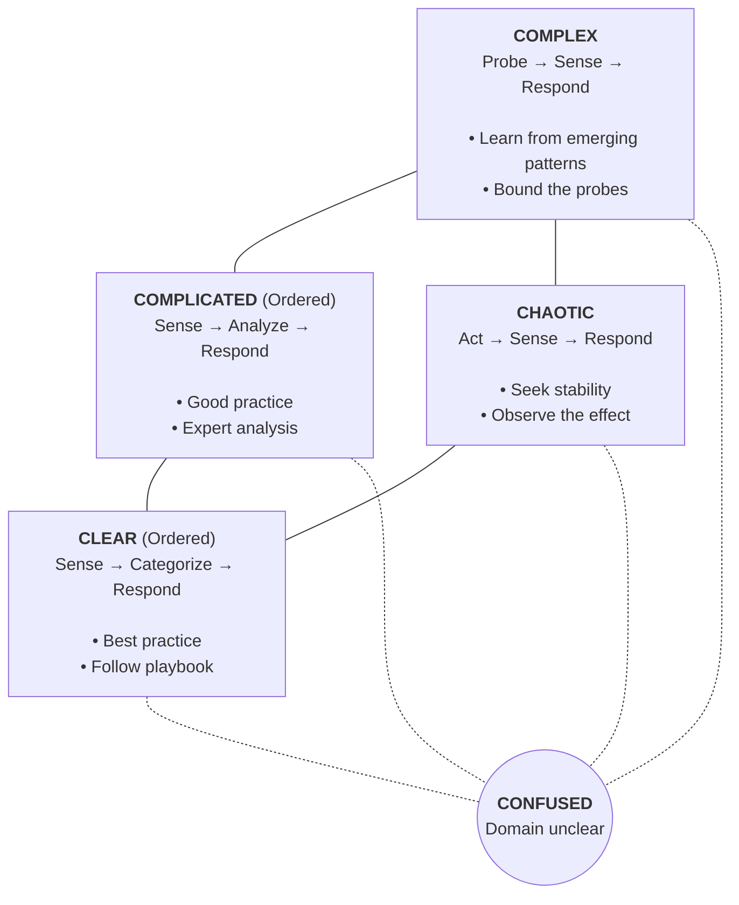
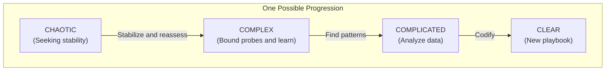
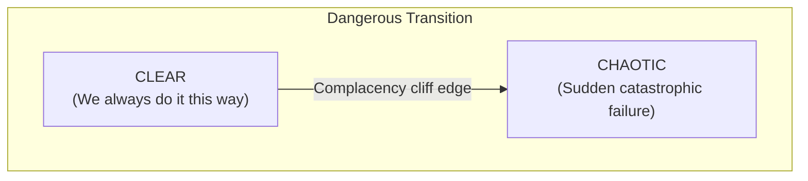
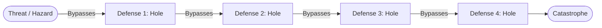
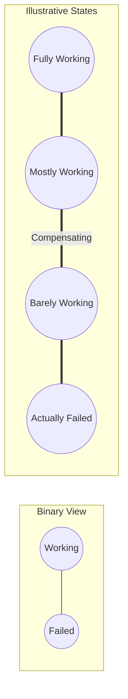
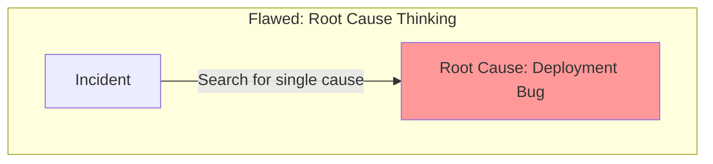
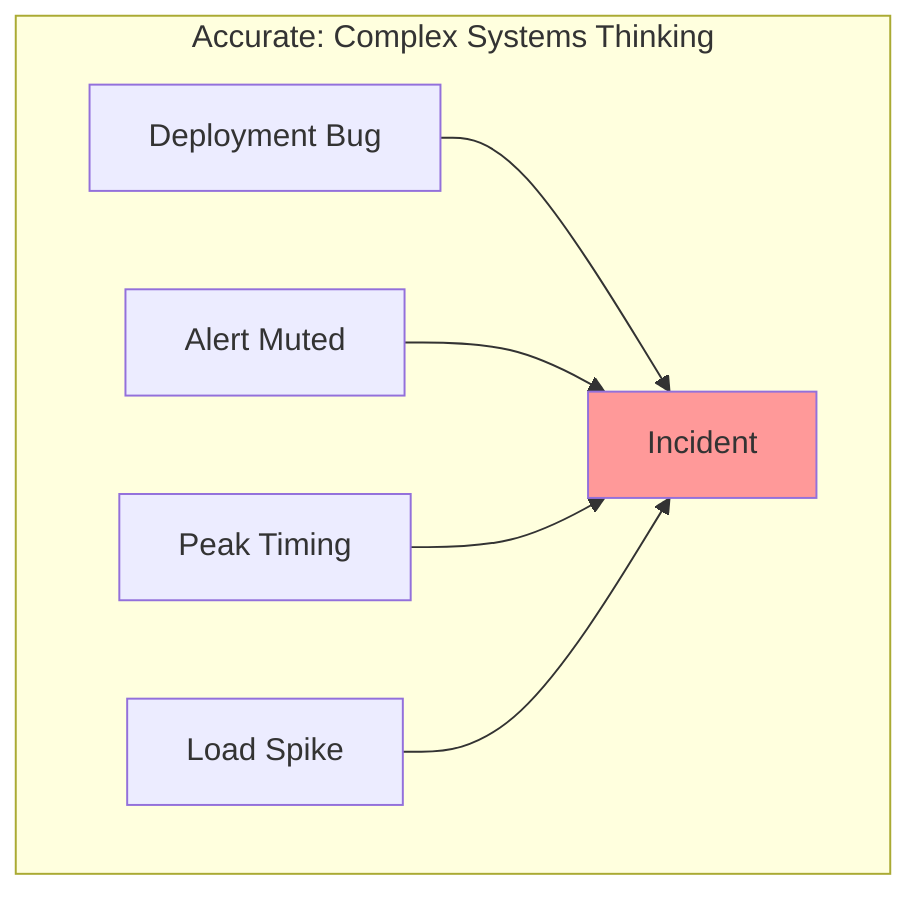
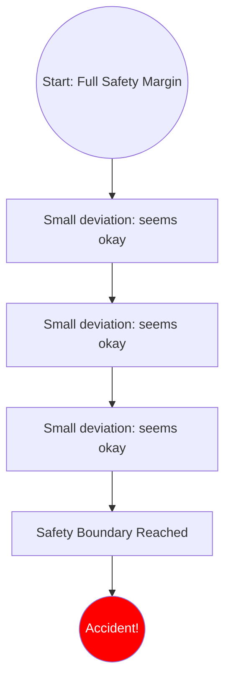

> **Complexity**: `[COMPLEX]`
>
> **Time to Complete**: 40-45 minutes
>
> **Prerequisites**: [Module 1.3: Mental Models for Operations](../module-1.3-mental-models-for-operations/)
>
> **Track**: Foundations

## What You'll Be Able to Do

After completing this module, you will be able to apply complexity thinking to production systems in four concrete ways:

1. **Distinguish** between complicated systems (predictable, decomposable) and complex systems (emergent, non-linear) in real infrastructure
2. **Analyze** how simple component interactions produce emergent behaviors that cannot be predicted from specifications alone
3. **Design** observability that connects service symptoms with retry, queue, and resource interactions, and propose safeguards to test
4. **Evaluate** architectural decisions through the lens of complexity theory to reduce the blast radius of unexpected interactions

---

## Three Outages, an Unfinished Explanation

At a CSIS forum on July 8, 2015, Homeland Security Secretary Jeh Johnson discussed reported malfunctions affecting United Airlines, the New York Stock Exchange, and The Wall Street Journal. His assessment was provisional: the information then available did not point to a malicious actor at United or the NYSE, and he said less was known about The Wall Street Journal. [Read the contemporaneous transcript, PDF page 3](https://csis-website-prod.s3.amazonaws.com/s3fs-public/event/150708_Statesmens_Forum_DHS_Johnson_Transcript.pdf#page=3).

**Try the diagnosis:** does that assessment establish a shared technical dependency, establish three independent technical causes, or leave the relationship unresolved? Choose an answer and identify what evidence would distinguish the alternatives before opening the explanation.

<details>
<summary>Check what the evidence supports</summary>

It leaves the technical relationship unresolved. An assessment about malicious activity is not a dependency analysis. This transcript records a public statement made with limited information; it is not a set of completed technical investigations. It supports neither a shared-dependency conclusion nor a claim of three independently established root causes.

Service-impact timelines could clarify whether disruptions overlapped and which services were affected. Change records could identify candidate triggers. A dependency map could expose a shared component worth investigating. None alone would prove causation: you would still need evidence connecting a proposed failure to the observed effects.

</details>

This is a reader exercise in evaluating evidence, not a reconstruction of the incident teams' actions. The source does not tell us what their dashboards showed or how they reached their eventual diagnoses. The useful operational habit is to keep an explanation provisional until the evidence supports it.

---

## Why This Module Matters

You've done everything right. Code is tested. Deployment is automated. Monitoring is in place. Runbooks are written. And yet, the system fails in ways nobody predicted.

This isn't a failure of engineering—it's the **nature of complex systems**. They behave in ways that can't be predicted from their components alone. They adapt, they surprise, and they fail in novel ways.

Understanding complexity changes how you approach operations. You stop trying to prevent all failures, because that goal is impossible in coupled systems with humans in the loop. You start building systems that handle failure gracefully, measuring success by recovery time and customer impact rather than by a fantasy of zero incidents. You stop asking only "why did this fail?" as if a single story could capture the whole mechanism. You start asking "how did this ever work?"—which surfaces latent dependencies, unwritten compensations, and adaptations that were carrying the system until they could not.

> **The Weather Analogy**
>
> Weather forecasting offers a useful example of prediction under uncertainty. [ECMWF explains](https://www.ecmwf.int/en/research/modelling-and-prediction/quantifying-forecast-uncertainty) that uncertainty in starting conditions and approximations in a numerical model both contribute to errors that grow with time. Better measurements matter, but they do not remove every limitation of a model.
>
> Be careful with the comparison. [Lorenz's 1969 study](https://wind.mit.edu/~emanuel/Lorenz/EdLorenz/Predictability_Flow_Which_Possesses_1969.pdf#page=1) explores conditional limits at different scales in a simplified fluid model; it does not establish a universal ten-day cutoff or a theorem about distributed systems. Use this as a teaching analogy: before predicting an operational outcome, ask what you know about the starting state and which interactions your model leaves out.

---

## What You'll Learn

- The crucial difference between complicated and complex systems
- The Cynefin framework for decision-making in different domains
- Richard Cook's essential insights on how complex systems fail
- Why your system is always partially broken (and that's normal)
- How robustness and resilience complement each other in complex systems

---

## Part 1: Complicated vs Complex—The Distinction That Changes Everything

### 1.1 The Two Types of Hard Problems

Not all difficult problems call for the same response. Can expertise reveal a relationship you do not yet understand, or must you learn through interactions whose outcomes are uncertain? The **Cynefin framework** offers a way to discuss that distinction. The table is a teaching summary of [Kurtz and Snowden's 2003 account, pp. 468–469](https://thecynefin.co/wp-content/uploads/2026/02/Sense-making-in-a-complex-and-complicated-world.pdf#page=7), using the later Clear and Complicated labels explained below.

| Clear | Complicated | Complex |
|-------|-------------|---------|
| Relevant cause and effect are evident | Relationships require expertise or analysis | Interactions produce patterns that cannot reliably be predicted in advance |
| Apply an appropriate established practice | Investigate with relevant experts | Use bounded probes and learn from emerging patterns |
| Best practice within its conditions | Good practice informed by analysis | A pattern understood afterward may not repeat |


```mermaid
graph TD
    subgraph Complicated [Complicated System: Jet Engine]
        direction LR
        A[Fuel] --> B[Combustion] --> C[Turbine] --> D[Thrust]
    end

    subgraph Complex [Illustrative Interactions in a Production Environment]
        direction LR
        O[Operators] --> S1[Service A]
        O --> S2[Service B]
        S1 <-->|Traffic| S2
        S2 <-->|Behavior Changes| S3[Service C]
        U[Users] --> S1
        U --> S2
    end
```

**Complicated work** can reward analysis even when the answer is not immediately apparent. In the original article this domain is called *knowable*: relevant knowledge may require time, resources, or specialist expertise. That does not establish that every failure mode of an engineered system has been enumerated. The jet-engine diagram above is a simplified illustration, not a complete engineering model.

**Complex work** involves learning from interacting agents and emerging patterns. Kurtz and Snowden describe retrospective coherence: an explanation afterward does not guarantee that the pattern will recur. Applying that idea to production, ask which interactions your current model leaves out. The operators, users, and services in the diagram are an illustrative application; a production environment need not occupy one domain permanently.

### 1.2 Why Production Systems Are Complex

To look for complex behavior in a Kubernetes environment, consider these five illustrative patterns of production coupling. They are prompts for investigation, not a test that assigns every cluster to one domain.

Non-linear interactions mean a slow database does not merely make queries slower—it can exhaust connection pools, trigger timeouts, provoke retries, and thereby make the database slower still until the effect is wildly disproportionate to the original trigger. Feedback loops are everywhere: autoscalers respond to load, retries respond to failures, circuit breakers respond to errors, caches respond to traffic shapes, and each loop interacts with the others in ways nobody fully designed ahead of time. Constant adaptation is unavoidable because users change behavior, traffic shifts, code ships daily, dependencies update, and teams rotate; the system you operate today is not the system you operated yesterday even if the architecture diagram stayed the same.

Human-system coupling means operators are not outside observers. Their decisions change the system, and the system's alerts and dashboards change which decisions feel urgent. Humans are part of the control loop, which is why runbooks, on-call fatigue, and incident rituals matter as much as CPU limits. Multiple timescales stack on top of one another: millisecond network jitter interacts with second-level retries, minute-level autoscaling, hourly batch work, daily deploy rhythms, weekly maintenance, and quarterly capacity plans—all simultaneously—so an incident that looks like a "database problem" may be a cross-scale interaction problem. A latency spike that lasts two hundred milliseconds can trigger retry logic measured in seconds, which changes queue depth over minutes, which changes autoscaling decisions over tens of minutes, which changes cost and capacity over days. Operators who debug only one timescale often fix a symptom while the cross-scale interaction remains.

### 1.3 Worked Example: From Slow Query to Site-Wide Degradation

Consider a payment API backed by a relational database that begins running ten percent slower because of a missing index after a migration. At first, nothing pages. Latency dashboards show a gentle upward slope. Error rates remain below the alert threshold because most requests still complete within the configured timeout. This is the dangerous middle phase of complex failure: the system is already compensating, and your green dashboards are recording the compensation rather than the underlying stress.

The next link in the chain is connection pooling. Slower queries hold connections longer, so the pool saturates even though query throughput has not doubled. Upstream services start waiting for pool slots, which increases their latency, which triggers client retries configured to improve reliability. Retries multiply load on the database at the exact moment the database is least able to absorb it. A cache layer that was masking read pressure now sees more write-related invalidation traffic because checkout attempts are being retried. An autoscaler adds pods to stateless services, which increases concurrent database connections and makes pool exhaustion worse.

No single team owns this story end to end. The database team sees slow queries. The application team sees timeouts. The platform team sees elevated pod counts. The business team sees checkout complaints that do not align cleanly with error-rate graphs. That fragmentation is not an organizational accident; it is what complexity looks like in a microservice architecture. The emergent behavior—checkout feels broken while many service-level indicators look merely elevated—is not written in any one repository.

The operator move is not to ask which chart is "wrong." It is to trace interactions: pool wait time, retry rate, downstream concurrency, and user-visible success rate must be interpreted together. Complexity-aware debugging starts from the hypothesis that several individually understandable mechanisms are amplifying one another.

### 1.4 Decision Framework: Complicated or Complex?

When you face a production surprise, the first architectural question is not "which service is broken?" but "what kind of problem is this?" The table below is a practical decision aid. It is not a personality test for your organization; it is a way to avoid applying a blueprint where you need experiments, or running experiments while the site is fully down.

| Signal | Lean complicated | Lean complex |
|--------|------------------|--------------|
| Relationship between change and effect | Repeatable in staging | Changes with load, time, or user segment |
| Expert analysis | Converges on one mechanism | Produces multiple plausible stories |
| Fix confidence | Patch or rollback should work | Need safe-to-fail probes first |
| Metric pattern | One dominant anomaly | Several mild anomalies that correlate oddly |
| Human role | Implement known fix | Coordinate learning across teams |

If the situation is complicated, invest in analysis and controlled change. If the situation is complex, invest in observability for learning, bounded experiments, and explicit time limits so you do not confuse learning with infinite data gathering. If the situation is chaotic, stabilize first—then classify again, because chaos often collapses into complex or complicated once the immediate bleeding stops.

### 1.5 Historical Anchor: When Many Small Failures Align

The [2003 Northeast blackout](https://en.wikipedia.org/wiki/Northeast_blackout_of_2003) left tens of millions of people without power after a sequence of equipment and software issues interacted across multiple utilities. A software bug in an alarm system meant operators did not see some warnings they needed. That bug had existed for years without causing catastrophe on its own. What changed was context: high load, vegetation contact with lines, maintenance timing, and operator handoffs combined into a pattern the system had never experienced before. This is the Swiss Cheese pattern in the wild—many layers with latent holes, usually misaligned, occasionally aligned all at once.

That incident is useful for platform engineers even if you never touch power grids, because it demonstrates how "we knew about that bug" is not the same as "that bug was safe." Latent failures wait for partners. Your muted alert, your oversized timeout, your skipped integration test, and your deferred capacity purchase are often harmless—until the day they are not.


### 1.6 Coupling Budgets and Architectural Tradeoffs

Platform architects sometimes talk about "blast radius" as if it were a property of a single service. In complex systems, blast radius is an emergent property of coupling choices: synchronous chains, shared mutable state, global caches, and implicit dependencies all increase the number of pathways through which a local fault becomes a customer-visible surprise. A coupling budget is the intentional limit on how many hidden dependencies a feature may introduce before it must be redesigned with explicit boundaries, contracts, and degradation behavior.

Evaluating architectural decisions through a complexity lens asks different questions than a feature checklist. Instead of only "Can we ship it this quarter?" ask "What new interaction loops does this create?" and "If this dependency slows by ten times, what amplifies?" and "Which metrics will show emergent failure before users abandon checkout?" These questions do not slow good engineering—they prevent the kind of fast shipping that later produces slow, scary incidents whose narratives only make sense in hindsight.

---

## Part 2: The Cynefin Framework—Knowing What Kind of Problem You Have

### 2.1 The Five Domains

**Cynefin** is a sense-making framework associated with Dave Snowden and developed in work including the article with Cynthia Kurtz cited above. Its labels have changed: the 2003 figure uses *known* and *knowable*, while the [institutional account identified as the February 2021 framework](https://cynefin.io/index.php?title=Cynefin_Domains&oldid=5763) uses *Clear* and *Complicated*. That later account reserves best practice for Clear and good practice for Complicated; it describes Complex practice as *exaptive*, repurposing existing capability.

The diagram below is a simplified teaching summary of response patterns, using later domain names. It is not a reproduction of either complete framework. The authors emphasize context: use the framework to question your choice of approach, and reconsider it as evidence changes.


```mermaid
graph TD
    Complex["<b>COMPLEX</b><br/>Probe → Sense → Respond<br/><br/>• Learn from emerging patterns<br/>• Bound the probes"]
    Complicated["<b>COMPLICATED</b> (Ordered)<br/>Sense → Analyze → Respond<br/><br/>• Good practice<br/>• Expert analysis"]
    Chaotic["<b>CHAOTIC</b><br/>Act → Sense → Respond<br/><br/>• Seek stability<br/>• Observe the effect"]
    Clear["<b>CLEAR</b> (Ordered)<br/>Sense → Categorize → Respond<br/><br/>• Best practice<br/>• Follow playbook"]
    Confused(("<b>CONFUSED</b><br/>Domain unclear"))

    Complex --- Complicated
    Chaotic --- Clear
    Complex --- Chaotic
    Complicated --- Clear
    Complex -.- Confused
    Complicated -.- Confused
    Chaotic -.- Confused
    Clear -.- Confused
```

### 2.2 Why the Order of Actions Matters

The framework suggests different response patterns. Treat a domain assignment as a working interpretation, not a diagnosis established by an alert's severity. In an incident, explain the evidence behind your approach and what would make you change it.

| Domain | Characteristics | Response Strategy | Common Mistake |
|--------|-----------------|-------------------|----------------|
| **Clear** | Relevant cause-effect is evident | Sense → Categorize → Respond (check the playbook applies) | Complacency—"we always do it this way" |
| **Complicated** | Cause-effect discoverable by experts | Sense → Analyze → Respond (study then act) | Analysis paralysis—waiting too long |
| **Complex** | Patterns become intelligible afterward but may not repeat | Probe → Sense → Respond (bound experiments and learn) | Premature convergence—jumping to conclusions |
| **Chaotic** | No perceivable cause-effect | Act → Sense → Respond (stabilize first) | Continued analysis while burning |
| **Confused** | Don't know which domain | Break down and gather information | Acting without knowing the domain |

**Hypothetical decision exercise:** Checkout is unavailable. You have an approved rollback procedure for the latest release, but have not checked whether its database changes are reversible. A teammate proposes restarting everything. What evidence would you seek immediately, and what conditions would make a stabilization action reasonable? Does “we do not know why” establish the domain?

<details>
<summary>Compare your reasoning</summary>

Unknown cause alone does not establish chaos. Check the rollback's compatibility and prerequisites, the affected scope, and available recovery procedures. Choose an authorized action whose risks and effects the team can assess; monitor it and keep investigating in parallel where possible. If the rollback could damage data, its availability on a checklist is not enough. Restarting everything is not justified by the framework. These are conditions for reasoning about the hypothetical case, not an instruction to operate a real cluster.

</details>

### 2.3 Cynefin in Operations: Illustrative Applications

For a **clear** disk-space problem, a verified playbook might identify disposable files and the conditions for removing them. Check that those conditions hold before acting. An unfamiliar full disk containing unknown data is not automatically a clear problem.

For **complicated** performance degradation, use relevant experts and measurements to test explanations. Agree on review points while user impact persists; a deadline is a reason to reassess the plan, not evidence that an untested fix is safe.

For potentially **complex** behavior, such as checkout complaints that do not match aggregate metrics, consider bounded observations or probes that distinguish competing explanations. A canary with additional tracing is one possible illustration, provided its exposure, resource costs, data handling, and stop conditions are acceptable. Do not treat a suspected pattern as an established cause.

For a situation interpreted as **chaotic**, the framework emphasizes seeking stability and then observing what changes. In operations, a rollback, failover, or traffic reduction is only a candidate action: each needs appropriate authority, prerequisites, and risk assessment. Neither red dashboards nor urgency alone selects the domain or the action.

These examples apply the framework for teaching. They are not incidents reported by Kurtz and Snowden, and their proposed actions are not guaranteed remedies.

### 2.4 Domain Transitions

Situations can shift between domains. This diagram illustrates one possible learning path, not a required sequence; restoring availability does not itself prove a move into a particular domain.


```mermaid
graph LR
    subgraph One Possible Progression
        direction LR
        H_Chaotic["CHAOTIC<br/>(Seeking stability)"] -->|Stabilize and reassess| H_Complex["COMPLEX<br/>(Bound probes and learn)"]
        H_Complex -->|Find patterns| H_Complicated["COMPLICATED<br/>(Analyze data)"]
        H_Complicated -->|Codify| H_Clear["CLEAR<br/>(New playbook)"]
    end
```


```mermaid
graph LR
    subgraph Dangerous Transition
        direction LR
        D_Clear["CLEAR<br/>(We always do it this way)"] -->|Complacency cliff edge| D_Chaotic["CHAOTIC<br/>(Sudden catastrophic failure)"]
    end
```


### 2.5 Operating Cynefin Under Incident Pressure

Use domain language to explain a working approach without turning the incident bridge into a classification debate. The following suggestions are operational applications of the framework, not empirical claims about how all teams behave.

For Clear work, check that the established procedure still fits the environment. A familiar task name, such as certificate renewal, does not establish that its dependencies and preconditions are unchanged. Rehearsing procedures can help expose stale assumptions.

For Complicated work, ask what evidence the relevant expert needs and when the team will reassess progress. Choose review intervals appropriate to the impact and available options; elapsed time alone neither changes the domain nor establishes a universal twenty-minute rule.

For Complex work, make the proposed learning and exposure explicit before a probe: what observation would distinguish explanations, who or what can be affected, and when will you stop? Changing one variable may help interpret a particular experiment, but it is not a definition of every complex-domain probe. Record observations as well as the intervention; a result can challenge the hypothesis without identifying a complete cause.

For Chaotic work, seek an intervention that can establish enough stability to observe and reassess. The framework does not remove operational constraints or guarantee that a coarse intervention improves matters. After acting, check effects and reconsider the approach instead of assuming a fixed progression through domains.

### 2.6 Communicating Uncertainty to Stakeholders

Communicate what is observed, what remains uncertain, and what happens next. Give a recovery estimate only when evidence supports it, and state its assumptions. If a bounded probe or stabilization action is underway, report its purpose and the next checkpoint without presenting the working hypothesis as a confirmed cause.

A suggested update template is: **impact**, **stabilization status**, **working hypotheses**, **next action and its limits**, **decision time**. Use it to make uncertainty and responsibility visible; it cannot guarantee a good outcome.


**Reflection:** Which observation would make your team change its current approach? If no answer comes to mind, revisit the hypothesis, the proposed action, and the evidence you are collecting. A domain label should invite that discussion rather than end it.

---

## Part 3: How Complex Systems Fail—Richard Cook's Essential Insights

### 3.1 Read Cook's Principles as Questions About Your System

Richard Cook's [*How Complex Systems Fail*, Revision D](https://www.adaptivecapacitylabs.com/HowComplexSystemsFail.pdf#page=1) is a short treatise with 18 principles. The following discussion separates his account of hazardous systems from this module's applications to platform operations; it is not a measured failure model for every software service.

Cook's first three principles describe hazards, extensive defenses, and accidents arising from combinations of failures. He includes technical, human, organizational, institutional, and regulatory defenses. Applying those ideas to a platform, ask which safeguards protect a customer operation, and which dependencies they share. Backups, failover, monitoring, and retry policies are examples to examine, not a guarantee that adding more mechanisms creates independent protection.

A related analogy appears in James Reason's [“Human error: models and management,” in the section on the Swiss Cheese model](https://pmc.ncbi.nlm.nih.gov/articles/PMC1070929/). Reason describes layers of defense whose weaknesses change; an accident opportunity can pass through weaknesses in multiple layers. The diagram below is our simplified teaching illustration after Reason, not a figure from Cook's treatise.


```mermaid
graph LR
    Start([Threat / Hazard]) --> |Bypasses| L1[Defense 1: Hole]
    L1 --> |Bypasses| L2[Defense 2: Hole]
    L2 --> |Bypasses| L3[Defense 3: Hole]
    L3 --> |Bypasses| L4[Defense 4: Hole]
    L4 --> End([Catastrophe])
```
*Illustration after Reason: a possible path through weaknesses in several defenses. The drawing supplies no frequency estimate and does not depict every accident pathway.*

**Principle 4** describes changing mixtures of latent flaws. **Principle 5** emphasizes continued operation despite degradation, with redundancy and human activity helping keep the system functioning. Bugs, misconfigurations, and capacity limits are platform examples to investigate; these principles alone do not establish which problems exist in your current service.


```mermaid
graph LR
    subgraph Binary View
        W1((Working)) --- F1((Failed))
    end
    subgraph Illustrative States
        W2((Fully Working)) === M2((Mostly Working))
        M2 ===|Compensating| B2((Barely Working))
        B2 === F2((Actually Failed))
    end
```

This second diagram is an author-created illustration, not Cook's classification or a measured distribution. To apply the idea, look for evidence of what keeps an operation working and what could remove that support.

**Hypothetical exercise:** A backup job reports success, but nobody has tested restoring its output. Which claim can you support: “the job reported success,” “the data can be restored,” or “the service has no latent failures”? What observation would strengthen the next claim?

<details>
<summary>Separate the observation from the inference</summary>

You can support the reported job status. A controlled restore test would provide evidence about recovery for the data and conditions tested. Neither observation proves the absence of all latent failures. This is a teaching application of Cook's distinction between ongoing operation and underlying flaws, not an incident reported in his treatise.

</details>

In [principles 6–8](https://www.adaptivecapacitylabs.com/HowComplexSystemsFail.pdf#page=2), Cook discusses persistent catastrophic potential, argues against reducing an accident to an isolated root cause, and warns about hindsight bias. For platform investigations, distinguish an identified contributing fault from a complete explanation of how the outcome became possible. The source does not establish that a particular team's shipping pressure caused its incident.

### 3.2 The Myth of Root Cause

Complex system failures rarely have a single root cause; they accumulate through multiple contributing factors that only look inevitable after the fact, which is why post-incident learning must widen the lens instead of narrowing it to the last change deployed.


```mermaid
graph TD
    subgraph Flawed: Root Cause Thinking
        I[Incident] -->|Search for single cause| R[Root Cause: Deployment Bug]
        style R fill:#ff9999
    end
```


```mermaid
graph TD
    subgraph Accurate: Complex Systems Thinking
        DB[Deployment Bug] --> I2[Incident]
        AM[Alert Muted] --> I2
        PT[Peak Timing] --> I2
        LS[Load Spike] --> I2
        style I2 fill:#ff9999
    end
```

Individually harmless factors can combine through ordinary coupling to produce catastrophe that no single team would have shipped on purpose.

The deployment bug existed for weeks without triggering pages, the alert had been muted months earlier during a noisy weekend, the traffic spike was normal for that hour, and the timing aligned so that none of these factors looked harmful in isolation yet together they produced customer-visible failure.

### 3.3 Drift into Failure

Sidney Dekker's crucial concept: systems don't fail suddenly. They **drift** toward failure through small, locally rational decisions.


```mermaid
graph TD
    Start((Start: Full Safety Margin)) --> D1[Small deviation: seems okay]
    D1 --> D2[Small deviation: seems okay]
    D2 --> D3[Small deviation: seems okay]
    D3 --> Boundary[Safety Boundary Reached]
    Boundary --> Accident((Accident!))
    
    style Accident fill:#f00,color:#fff
```

**Common drift patterns in tech:**

| Small Decision | Rational Justification | Eventual Consequence |
|----------------|----------------------|---------------------|
| "Skip tests for this PR" | "It's a small change" | Test coverage erodes |
| "Silence this alert" | "It's noisy" | Real issues ignored |
| "Don't update that runbook" | "Everyone knows how it works" | Knowledge lost, incident prolonged |
| "Postpone the security patch" | "We'll do it next sprint" | Years pass, vulnerability remains |
| "Increase timeout from 5s to 30s" | "It fixes the immediate problem" | Slow failures propagate |
| "Add one more feature before the refactor" | "Just this once" | Technical debt compounds |


### 3.4 Principles 8 Through 18: Cook's Remaining Insights

Cook's remaining principles are short on the page and enormous in operations practice. **Hindsight biases post-accident assessments of human performance** (Principle 8) warns that knowing the outcome poisons how investigators reconstruct what practitioners could reasonably have seen. **Human operators have dual roles: as producers and as defenders against failure** (Principle 9) explains why outsiders overemphasize either shipping or safety depending on whether an accident just happened. **All practitioner actions are gambles** (Principle 10) reminds you that successful outcomes are also uncertain bets, not proof that risk was absent.

**Actions at the sharp end resolve all ambiguity** (Principle 11) means production pressure, incomplete policy, and organizational ambiguity get resolved by whoever is on call—not by the architecture diagram. **Human practitioners are the adaptable element of complex systems** (Principle 12) is why runbook workarounds, alert fatigue, and "temporary" firewall rules persist for years: people continuously restructure work to keep production moving. **Human expertise in complex systems is constantly changing** (Principle 13) means your team always mixes veterans, trainees, and turnover; expertise is a resource, not a fixed asset.

**Change introduces new forms of failure** (Principle 14) is the principle most relevant to platform engineering teams shipping controllers, operators, and autoscaling policies. New automation can eliminate familiar failure modes while creating rare, high-consequence pathways nobody designed for—controllers that reconcile every few seconds can amplify a misconfiguration into a cluster-wide event before a human finishes reading the first page of symptoms. **Views of "cause" limit the effectiveness of defenses against future events** (Principle 15) argues that blame-focused remedies often increase coupling without reducing the next accident's likelihood.

**Safety is a characteristic of systems and not of their components** (Principle 16) means you cannot buy safety as a feature bolted onto one service. **People continuously create safety** (Principle 17) describes how routine compensations and well-rehearsed adaptations keep operations failure-free most of the time. **Failure free operations require experience with failure** (Principle 18) closes the loop: near-misses, game days, and calibrated exposure to hazard teach operators where the edge of tolerable performance lies.

Treat Cook's paper as a checklist during post-incident review, not as philosophy. Ask: which defenses were supposed to catch this, which were bypassed, which latent conditions existed before the trigger, and which adaptations made the incident harder to see? Those four questions consistently produce systemic improvements that "find the bug and patch it" misses.

### 3.5 Emergence in Distributed Platforms

Emergence is not mysticism; it is what happens when components follow local rules and global behavior is not a simple sum. Kubernetes desired-state reconciliation is a canonical example. No single Pod object "knows" about cluster health, yet the cluster exhibits self-healing behavior when controllers, schedulers, kubelet, and CNI plugins interact. That emergence is valuable until it emergently works against you: for example, rapid pod restart loops that increase load on a failing dependency, or autoscaling that adds replicas that all hammer the same broken backend.

Observability for emergent behavior requires **system-level signals**, not only component greens. User journeys, saturation, queue depth, retry rates, and cross-service correlation often reveal emergent failure earlier than per-service CPU graphs. When symptoms appear in user experience before they appear in infrastructure metrics, you are often watching complexity rather than a simple component fault.

### 3.6 Tradeoffs: How Much Complexity Can You Afford?

Every feature coupling, shared library, synchronous call, and global cache increases the interaction surface where emergence can hide. Platform teams sometimes reduce complexity by enforcing asynchronous boundaries, idempotent interfaces, bulkheads, and explicit ownership of failure modes. Those patterns do not eliminate complexity—users, data, and time still interact—but they channel interactions into places where probes and circuit breakers can operate.

The tradeoff is velocity versus interaction density. Tight coupling ships features faster until the day emergent failure makes every change feel risky. Loose coupling feels slower until the day a dependency fails and only one domain degrades. Complexity thinking helps you choose where to pay coupling costs intentionally rather than accidentally.


Each decision seems small. Each is locally rational. Together, they erode safety margins until failure is inevitable.

---

## Part 4: Designing for Resilience

### 4.1 Robustness, Resilience, and Operating Limits

Start with the operation you need to preserve. Does a catalog page still show useful information when its database slows? Does a payment operation still meet its correctness requirements? Calling either system "robust" becomes useful only when you specify the property, the disturbance, and what counts as acceptable performance.

In [*Four concepts for resilience* (2015), sections 2.2–2.3 of this manuscript copy](https://maritimesafetyinnovationlab.org/wp-content/uploads/2021/06/4sensesofresiliencepublic.pdf#page=3), David Woods distinguishes effective responses within a system's operating envelope from the capacity to stretch when events challenge that envelope. He calls the latter **graceful extensibility**. Boundaries can move as conditions and capabilities change; success within a prepared range does not settle what happens beyond it.

Woods organizes uses of *resilience* into four concepts: recovery after disruption, robustness, graceful extensibility, and sustained adaptability over time. He critiques treating these as interchangeable. This is his conceptual account; the platform questions below are teaching applications.

| Question to investigate | Evidence to look for |
|---|---|
| Which operation must continue, under which disturbances? | Explicit correctness, latency, or availability requirements and observations under the specified conditions. |
| What does the prepared fallback actually preserve? | The response users receive, its freshness and correctness, and the conditions under which the fallback itself stops meeting requirements. |
| What happens when prepared responses are insufficient? | How people and systems mobilize additional capacity or change their response, including where that adaptation runs out. |

**Try this thought exercise:** a team proposes serving cached data during database delays. Before praising or rejecting it, name the operation. A product description and a payment authorization can have different correctness requirements. Ask which requirements the proposed response preserves and which it compromises. Then identify what observation would show that the fallback is failing its purpose.

Woods distinguishes graceful extensibility from graceful degradation: adaptation at a boundary can create new capacity to succeed, beyond accepting a reduced service. A planned fallback demonstrates its specified behavior when tested; broader claims about adaptability need broader evidence. Neither the label *resilient* nor a successful fallback implies unlimited capacity to handle unknown stress.

### 4.2 The Four Resilience Capabilities

Erik Hollnagel's [2010 introduction to the Resilience Analysis Grid, printed pp. 2–4](https://hal.science/hal-00613986/document#page=3), describes four abilities: respond, monitor, anticipate, and learn. He proposes assessing them through questions tailored to the organization. This is broader than collecting telemetry. The following platform examples are teaching applications of that framework.

**Respond:** What can the team and system do when conditions change, and are the necessary resources available? In platform work, candidate mechanisms include circuit breakers, degradation paths, and failover. Assess whether each preserves the required operation under the conditions at hand; a cached or partial response is not appropriate for every request.

**Monitor:** What changes should the team look for in the system and its environment? User-journey outcomes, saturation, and retry rates are possible observations. Hollnagel warns against mistaking correlations for valid leading indicators: naming a metric does not establish that it reliably precedes the event you want to detect.

**Anticipate:** What developments beyond current operations could change the demands, resources, or conditions the system faces? A load test, game day, or threat-model discussion can explore a particular possibility. State what it covers and what it leaves uncertain; no single exercise establishes readiness for every future condition.

**Learn:** What changes because of experience? Hollnagel includes learning from successful activity as well as failures. For a platform team, an incident review or examination of everyday work can identify assumptions to revise. Closing a ticket with a label alone does not show that the contributing conditions have changed; it also does not prove the incident must recur.

### 4.3 Chaos Engineering—Practicing Failure Before It Happens

The [Principles of Chaos Engineering](https://principlesofchaos.org/) describes controlled experiments intended to uncover systemic weaknesses and build confidence in behavior under turbulent production conditions. Variables include faults and non-failure events such as traffic spikes or scaling. Treat the following as guidance for designing an experiment, not an instruction to disrupt a running service.

**Hypothetical planning exercise:** In a disposable training environment, you propose stopping one API replica while sending a fixed test workload. You can observe latency, errors, and whether the replica returns. Before running anything, what baseline, hypothesis, stop condition, and recovery procedure would you write down? What would this exercise leave unknown about production?

<details>
<summary>Compare your experiment plan</summary>

Record baseline measurements for the stated workload, define the behavior you expect during the intervention, and choose measurable stop conditions before acting. Check that the intervention targets only the training environment and that recovery is understood. Compare the observations with the hypothesis. The result supplies evidence for those conditions; it does not establish behavior under production traffic, different dependencies, or every combination of failures. This is an authored planning example, not a reported experiment.

</details>

1. **Define the hypothesis:** The Principles begins with a measurable steady state and comparison between control and experimental groups. Choose measurements and thresholds for the particular system; example numbers are not universal targets.
2. **Choose the environment deliberately:** The Principles strongly prefers production traffic for representative behavior. That preference does not require every exercise to run in production. Explain how your chosen environment and workload limit the conclusions.
3. **Contain the effects:** The Principles explicitly requires minimizing and containing fallout. For an operational application, identify the authorized scope, observations, abort conditions, and recovery procedure before introducing a disturbance.
4. **Treat automation as an advanced practice:** Continuous automated experiments are an advanced recommendation in the Principles. Automation retains the need for containment and reassessment; it does not guarantee detection of all drift.
5. **Use results to revise a claim:** An experiment can challenge a hypothesis or reveal a weakness. Neither repetition nor a successful run guarantees future recovery.

Instance loss is one possible variable, not the definition of the discipline. The value comes from the question, observations, and resulting changes rather than from random termination itself. Continue with [Chaos Principles](../../disciplines/reliability-security/chaos-engineering/module-1.1-chaos-principles/) for the discipline in more depth.

**Common Chaos Experiments:**

| Experiment | What It Tests | Tools |
|------------|--------------|-------|
| **Pod failure** | Auto-restart, replication | Chaos Mesh, Litmus |
| **Node failure** | Pod rescheduling, affinity | kube-monkey, Chaos Mesh |
| **Network partition** | Retry logic, timeouts, failover | tc, Chaos Mesh |
| **Latency injection** | Timeout handling, circuit breakers | Toxiproxy |
| **CPU/memory stress** | Autoscaling, resource limits, throttling | stress-ng |
| **DNS failure** | Fallback mechanisms, caching | Block DNS queries |

### 4.4 Safety-I vs Safety-II

Traditional safety (**Safety-I**) focuses on what goes wrong. It counts errors, eliminates causes, and asks "Why did this fail?"

Resilience engineering (**Safety-II**) also studies what goes right. It recognizes that most operations succeed despite latent failures. Operators constantly work around issues to keep the system running. By asking "Why does this usually work?" we can learn from successful adaptations and amplify them.

### 4.5 Observe Symptoms, Investigate Interactions

Start with what users experience, then investigate the mechanisms behind it. Google's [Monitoring Distributed Systems](https://sre.google/sre-book/monitoring-distributed-systems/) distinguishes symptoms from causes and recommends watching latency, traffic, errors, and saturation. Latency distributions can expose slow requests hidden by an average; internal signals can reveal failures masked by retries. These are useful starting points, not proof that a particular dashboard will predict the next incident.

Google's [Addressing Cascading Failures](https://sre.google/sre-book/addressing-cascading-failures/) explains how retries add load and how insufficient capacity can increase queue latency. For a service you operate, consider comparing original requests with downstream attempts, queue waiting time, and constrained-resource use. Choose signals your instrumentation can actually measure. A correlation gives you a hypothesis to investigate; it does not establish a cause by itself.

As an operational application, tie urgent response to user impact and actionable symptoms under your incident process. Include relevant diagnostic context, but do not let a “complex” label postpone containment. Investigations and proposed experiments need an owner and appropriate change controls; a Cynefin category alone does not decide whether to page someone or open a learning ticket.

**Hypothetical diagnostic exercise:** users report slower responses. Your observations show unchanged incoming request volume, more downstream attempts per original request, and longer queue waits. No measurements from a real incident are implied. What would you inspect next, and what safeguard would you propose testing in a disposable training environment?

<details>
<summary>Compare your diagnostic plan</summary>

A retry loop is one candidate explanation; the observations do not prove it initiated the slowdown. Separate original requests from retries and compare their timing with errors and queue waits. Check whether the downstream service slowed before retry traffic rose. Propose a bounded retry-budget or backoff experiment with an explicit hypothesis, baseline, stop condition, and recovery check. Describe what evidence would challenge your hypothesis before running the experiment.

</details>

### 4.6 Game Days and Organizational Learning

Chaos engineering is not only tooling; it is a social technology for building shared mental models. Game days that include product, support, and leadership participants often teach more about complexity than engineering-only drills, because customer communication and business tradeoffs are part of the system. Scenarios should include partial failures where metrics disagree, latent misconfigurations that only appear under load, and dependencies that are "healthy" by health check but unusable by real traffic.

Document outcomes as **conditions**, not hero stories. "We discovered retries doubled write load during simulated partition" is reusable. "Alice saved the day" is not a control. Safety-II thinking applies: study why routine operations succeed despite latent flaws, and encode those successful adaptations into guardrails without punishing the people who improvised responsibly.

### 4.7 Putting It Together: An Edge-of-Chaos Checklist

Before you leave this module, walk through a checklist on a service you operate today. First, classify recent surprises with Cynefin: which were clear, complicated, complex, or chaotic, and did the team's actions match the domain? Second, list latent partners: muted alerts, retry policies changed under pressure, undeployed fixes, documentation drift, and dependencies nobody owns on-call. Third, identify one respond/monitor/anticipate/learn gap you could close this sprint without waiting for a major rewrite. Fourth, choose one architectural coupling you would not add again if you were designing the service fresh. Complexity thinking is not an excuse for fatalism; it is a disciplined way to prioritize where surprise will hurt most and where learning will pay the highest interest.

---

## Did You Know?

- **The term "emergence"** was coined by philosopher G.H. Lewes in 1875. He observed that water's properties (wetness, transparency) can't be predicted from hydrogen's and oxygen's properties alone. The whole has properties that the parts don't.

- **Cynefin** comes from the Welsh word meaning "habitat" or "place"—but with connotations of multiple factors influencing us in ways we can never fully understand.

- **Traffic jams** are emergent behavior. No driver wants a traffic jam. No traffic engineer designs them. They emerge from simple rules (follow car ahead, slow when crowded) interacting. Your cascading failures work the same way.

- **Richard Cook** was an anesthesiologist before becoming a safety researcher. He studied how surgical teams avoid killing patients despite working in complex, high-stakes environments. His insights apply directly to operations.

---

## Common Mistakes

| Mistake | Problem | Solution |
|---------|---------|----------|
| Treating complex as complicated | Applying "best practices" where they don't work | Use Cynefin to identify domain first |
| Searching for "root cause" | Oversimplifies, misses contributing factors, enables blame | Look for multiple contributing factors |
| Assuming safety from testing | Passing checks establish evidence only for the scenarios and properties covered | Examine coverage and unresolved interactions; choose appropriate observations or bounded experiments |
| Blaming individuals | Misses systemic issues, creates fear, prevents learning | Blameless postmortems, focus on systems |
| Preventing all failures | Impossible, creates brittleness, false confidence | Design for recovery, not just prevention |
| Ignoring near-misses | Loses learning opportunities, waits for disaster | Study near-misses as seriously as incidents |
| Only studying failures | Misses what makes systems work | Apply Safety-II, study successes |

---

## Quiz

1. **Hypothetical scenario: a team manages self-driving delivery robots. Battery degradation predictably shortens a robot's operating time. An unexpected construction zone causes robots to stop and reroute, creating a fleet-wide traffic jam. Which observations suggest expert analysis, and which suggest investigating interactions?**
   <details>
   <summary>Answer</summary>

   The predictable battery behavior suggests a complicated-domain approach: use relevant expertise and measurements to estimate operating time. **WHY?** Expertise can reveal useful cause-and-effect relationships without guaranteeing an exact failure time. The rerouting interaction suggests a complex-domain interpretation worth investigating: examine how robots influence one another rather than treating each robot's behavior as a sufficient explanation of the fleet outcome. These are working interpretations of the scenario, not permanent classifications of batteries or fleets. A pattern reconstructed after an event need not repeat in the next situation.
   </details>

2. **Hypothetical scenario: during Black Friday, your payment gateway drops all transactions and the dashboard turns red. An engineer proposes spending 30 minutes analyzing query plans before considering any action. What can you conclude about the Cynefin domain, and what should the team establish before choosing a response?**
   <details>
   <summary>Answer</summary>

   The scenario establishes severe user impact, but not a Cynefin domain. **WHY?** Red dashboards do not tell you whether cause-and-effect is already understood, requires expert analysis, or cannot currently be discerned. Establish what the team knows, which containment actions it is authorized to take, and what risks those actions introduce. A compatible, rehearsed rollback might be suitable; a rollback that could damage data is not justified merely by urgency. If the situation is interpreted as chaotic, Act → Sense → Respond prioritizes establishing stability and observing the result. That interpretation must be revisited as evidence arrives. Neither a fixed 30-minute delay nor a blanket restart follows from the alert's severity.
   </details>

3. **Hypothetical scenario: after a database outage, management asks for a report naming one responsible person as the complete explanation. How do Cook's principles 7–8 challenge that request, and what should the investigation establish?**
   <details>
   <summary>Answer</summary>

   Cook argues against treating an isolated contributor as the complete accident explanation and warns that knowing the outcome distorts judgments about what people could recognize beforehand. **WHY?** Naming someone does not reconstruct the conditions, interactions, and decisions that produced the outcome. Applying those principles here, investigate the event sequence, available defenses, and information participants had at the time. Separate established contributors from hypotheses and seek evidence that could challenge the emerging account. The question supplies no incident trace: it does not establish a bug, muted alert, load spike, or anyone's responsibility. Cook's framework guides the inquiry; it does not diagnose this outage or guarantee that a particular report format will prevent another one.
   </details>

4. **Hypothetical scenario: both teams set a 500ms database timeout. Team A's timeout produces a frontend error; Team B returns cached data and keeps the page usable. What do these observations establish, and what would you need to know before judging robustness or adaptability?**
   <details>
   <summary>Answer</summary>

   The scenario establishes two different responses to a prepared latency limit: an error and continued display using cached data. **WHY?** Neither observation alone measures robustness of a specified property across a range of disturbances. Establish what the operation requires, whether stale data meets those requirements, and how each response behaves as conditions vary. Team B's planned fallback may preserve a useful function, but this vignette does not demonstrate Woods's graceful extensibility when prepared capabilities become insufficient. Team A's error likewise does not establish that the system lacks every robust property. Evaluate the required behavior and its limits before assigning a whole-system label or selecting a design.
   </details>

5. **Hypothetical design review: a checkout service can call five dependencies synchronously for fresh data (A), or introduce asynchronous boundaries, bulkheads, and cached responses that may include stale prices (B). What requirements and failure behavior would you investigate before recommending either design?**
   <details>
   <summary>Answer</summary>

   Start with what a correct checkout must do: which dependencies are essential, which data must be current, and what the user should receive if those requirements cannot be met. Then examine timeouts, actual retry behavior, and resource use when dependencies slow or fail. **WHY?** Google's [cascading-failures chapter](https://sre.google/sre-book/addressing-cascading-failures/) describes retries adding load after failures; synchronous calls alone do not establish that feedback. Its [overload chapter](https://sre.google/sre-book/handling-overload/) offers cheaper, degraded responses as one option, but does not establish that stale prices satisfy this checkout's requirements. Treat B's isolation and fallback mechanisms as proposals to validate: which failure would each contain, and what happens when the fallback itself cannot meet requirements? Compare observed behavior against correctness and user-impact criteria before selecting a design. The scenario supplies neither that evidence nor a reason to rank freshness or continued responses above the operation's requirements.
   </details>

6. **Hypothetical scenario: database CPU stays at normal levels, yet checkout latency spikes and support tickets rise. An engineer proposes, "Database looks fine—must be frontend." What investigation steps should come next instead of jumping to that conclusion?**
   <details>
   <summary>Answer</summary>

   Keep the explanation open and assess containment of user impact while investigating. **WHY?** Normal CPU does not establish that the database is healthy, and these symptoms alone do not select a Cynefin domain. Trace checkout end-to-end, inspect pool wait time and retry rates, compare affected segments, and check the timing of deploys or flag changes. Lock contention, connection starvation, and frontend behavior are candidate explanations to test, not diagnoses supplied by this question. Use the evidence to choose and revise the investigative approach; neither frontend blame nor a default complex label is justified yet.
   </details>

7. **A leadership sponsor asks for a guarantee that chaos testing will prevent the next outage. What honest answer aligns with Safety-I and Safety-II thinking?**
   <details>
   <summary>Answer</summary>

   No experiment guarantees prevention of the next outage. **WHY?** Its observations concern a particular hypothesis, workload, environment, and intervention. Use the result to identify supported conclusions and unresolved questions. In Hollnagel's framework, ask how the work supports responding, monitoring, anticipating, and learning; do not promise that applying those labels necessarily produces faster recovery. Studying successful operations can also reveal useful adaptations, but it is evidence to investigate rather than proof of immunity.
   </details>

8. **Hypothetical scenario: during an outage investigation, you find a muted alert, a previously increased retry limit, and a changed traffic mix. You have not yet established their effects or timing relative to the outage. How can Cook's principles and Reason's Swiss Cheese model guide the investigation without supplying its conclusion?**
   <details>
   <summary>Answer</summary>

   Use Cook to ask about interacting contributors and Reason's model to examine defensive layers and their weaknesses. These are investigative prompts, not proof that the three observations caused the outage. **WHY?** A higher retry limit does not show how many retries actually occurred, and a muted alert does not establish whether an actionable signal was lost. Reconstruct the timing; inspect actual retry attempts and load, the alert's triggering and delivery conditions, and what responders knew. Compare these observations with user impact and test competing explanations. Changes to alerts or retry limits should address evidenced problems and have their effects checked. Finding these settings alone neither proves they were previously harmless nor justifies a prediction that changing them will prevent recurrence.
   </details>

---

## Hands-On Exercise

### Part A: Simple Chaos Experiment (15 minutes)

This exercise uses a minimal Kubernetes deployment so you can observe emergent self-healing without reproducing a full production stack. You need a running Kubernetes v1.35+ cluster (kind, minikube, or managed). The learning goal is to experience how controllers, schedulers, and replicated pods produce system-level recovery behavior that no individual Pod manifest encodes explicitly.

1. **Create a resilient deployment** by applying the manifest below, which creates three nginx replicas with readiness and liveness probes in a dedicated namespace.

```bash
# Create a namespace for this experiment
kubectl create namespace chaos-lab

# Create a deployment with multiple replicas
cat <<EOF | kubectl apply -f -
apiVersion: apps/v1
kind: Deployment
metadata:
  name: resilience-test
  namespace: chaos-lab
spec:
  replicas: 3
  selector:
    matchLabels:
      app: resilience-test
  template:
    metadata:
      labels:
        app: resilience-test
    spec:
      containers:
      - name: web
        image: nginx:alpine
        ports:
        - containerPort: 80
        readinessProbe:
          httpGet:
            path: /
            port: 80
          initialDelaySeconds: 2
          periodSeconds: 3
        livenessProbe:
          httpGet:
            path: /
            port: 80
          initialDelaySeconds: 5
          periodSeconds: 5
---
apiVersion: v1
kind: Service
metadata:
  name: resilience-test
  namespace: chaos-lab
spec:
  selector:
    app: resilience-test
  ports:
  - port: 80
    targetPort: 80
EOF
```

2. **Verify all pods are running** and wait until each replica reports `Running` and `1/1 Ready`.

```bash
kubectl get pods -n chaos-lab -w
# Wait until all 3 pods show Running and 1/1 Ready
# Press Ctrl+C to stop watching
```

3. **In a second terminal, watch pod events continuously** so you can observe recovery dynamics while injecting failure.

```bash
# Keep this running to observe the emergent behavior
kubectl get pods -n chaos-lab -w
```

4. **Inject chaos by deleting one pod** and watch how the Deployment controller recreates capacity.

```bash
# Delete a pod (the first one in the list)
POD=$(kubectl get pod -n chaos-lab -l app=resilience-test -o jsonpath='{.items[0].metadata.name}')
echo "Killing pod: $POD"
kubectl delete pod -n chaos-lab $POD --wait=false
```

In terminal 2 you should see the pod enter `Terminating`, a replacement pod appear almost immediately, and the new pod progress through `Pending`, `ContainerCreating`, and `Running` without manual intervention.

5. **Inject stronger chaos by deleting two pods at once** to see how the same control loop responds under larger perturbation.

```bash
# Delete 2 pods simultaneously
kubectl delete pod -n chaos-lab --wait=false \
  $(kubectl get pod -n chaos-lab -l app=resilience-test -o jsonpath='{.items[0].metadata.name} {.items[1].metadata.name}')
```

6. **Observe emergent behavior** across both experiments: the cluster maintains desired replica count without human action, recreation timing varies with scheduler and node conditions, and you cannot predict exactly which pod names will appear even though the system-level outcome stabilizes.

7. **Clean up** when finished so the experiment does not consume cluster resources.

```bash
kubectl delete namespace chaos-lab
```

What you experienced is emergence in miniature: system-level self-healing that no single pod possesses, a feedback loop where the Deployment controller detects actual state diverging from desired state and creates replacements, unpredictable timing at the pod level coupled with reliable recovery at the service level, and resilience that tolerates brief degradation while converging back toward the declared replica count.

---

### Part B: Complex Systems Analysis (25 minutes)

Apply complex systems thinking to a recent incident from your organization, or use the hypothetical scenario below if you do not have a suitable recent example. **Hypothetical scenario:** users report checkout failing intermittently; error rates are elevated but remain below alert thresholds; some engineers reproduce the issue while others cannot; symptoms began within the last few days but the exact start time is unclear.

**Section 1: Choose an Investigative Approach (10 minutes)**

Answer these questions:

1. Separate the reported observations from what you still need to establish. Which response approach does the current evidence support?

   > **Working interpretation**: ________________
   >
   > **Evidence and limits**:
   > - What is observed, and how was it recorded?
   > - Which cause-and-effect relationships are established, and which are hypotheses?
   > - What user impact requires attention while you investigate?

2. Use Cynefin to explain your choice of approach. If the information does not support a domain interpretation yet, state what you need to learn. The symptoms alone do not require a particular label.

3. Identify a next step and the evidence that could change your interpretation. For a proposed intervention, state its authorization, prerequisites and possible effects before treating it as suitable.

**Section 2: Build an Evidence Ledger (10 minutes)**

Apply Cook's distinction between contributors and a complete explanation. Record observations separately from candidate explanations; an empty evidence cell is a research task, not permission to invent a result.

| Observation and its source | Candidate explanation | Evidence that would support it | Evidence that would challenge it |
|---|---|---|---|
| | | | |
| | | | |

Compare two plausible hypotheses without declaring either a demonstrated cause. For the supplied hypothetical scenario, list the records or observations you would seek; do not fabricate logs or outcomes. Explain how timing and the information available to responders would affect your account. Avoid assuming that a configuration was harmless before the incident merely because no earlier impact was reported.

**Section 3: Questions for the Four Abilities (5 minutes)** — use Hollnagel's framework to ask what the team can establish about responding, monitoring, anticipating and learning. Identify evidence needed before diagnosing a gap or recommending an improvement. You may leave a gap unresolved when the scenario does not supply enough information.

| Ability | Question to investigate | Evidence needed before a change |
|---------|-------------------------|---------------------------------|
| **Respond** | | |
| **Monitor** | | |
| **Anticipate** | | |
| **Learn** | | |

Complete Part B with a justified working interpretation, an evidence ledger comparing hypotheses, and questions for all four abilities. Choose one next step and explain what its result could establish, what would remain uncertain, and how you would check any proposed change. These are teaching applications of the frameworks, not a diagnosis supplied by them.

**Success Criteria**:
- [ ] Part A: Successfully killed and observed pod recovery
- [ ] Part A: Can explain what "emergence" you observed
- [ ] Part B: Working interpretation justified by evidence, with unknowns stated
- [ ] Part B: Observations separated from two candidate explanations and their evidence needs
- [ ] Part B: No invented causes, logs or outcomes; timing and responder knowledge considered
- [ ] Part B: Questions for all four abilities and one justified next step

---

## Sources

- [How Complex Systems Fail](https://how.complexsystems.fail/) — Richard Cook's eighteen principles on safety and failure in complex socio-technical systems.
- [Drift into Failure (Sidney Dekker)](https://www.routledge.com/Drift-into-Failure-From-Hunting-Broken-Components-to-Understanding-Complex-Systems/Dekker/p/book/9781409422211) — Dekker's account of how systems drift toward failure through locally rational decisions.
- [The Cynefin Framework](https://cynefin.io/wiki/Cynefin) — Dave Snowden's sense-making model for matching response strategy to context.
- [Thinking in Systems: A Primer](https://www.chelseagreen.com/product/thinking-in-systems/) — Donella Meadows on stocks, flows, feedback, and leverage points in complex systems.
- [Google SRE Book — Handling Overload](https://sre.google/sre-book/handling-overload/) — Client-side throttling, load shedding, and protecting dependencies under stress.
- [Google SRE Book — Addressing Cascading Failures](https://sre.google/sre-book/addressing-cascading-failures/) — Retry amplification, cascading failure patterns, and mitigation patterns for production.
- [Principles of Chaos Engineering](https://principlesofchaos.org/) — Foundational chaos-engineering principles for building confidence in turbulent production conditions.
- [2015 NYSE trading suspension](https://www.nyse.com/market-status/history) — NYSE market-status history documenting the July 8, 2015 trading suspension discussed in the module opener.
- [United Airlines ground stop (2015)](https://www.bbc.co.uk/news/technology-33449693) — Reporting on the same-day United Airlines computer disruption from independent infrastructure failure.
- [Northeast blackout of 2003](https://en.wikipedia.org/wiki/Northeast_blackout_of_2003) — Overview of the multi-factor cascade referenced in the module's historical anchor section.
- [Safety-II (Erik Hollnagel)](https://www.hollnagel.com/safety-ii) — Foundational Safety-II perspective on studying everyday success in safety-critical work.
- [Emergence (Stanford Encyclopedia of Philosophy)](https://plato.stanford.edu/entries/properties-emergent/) — Philosophical and scientific background on emergent properties in complex wholes.

## Further Reading

For book-length depth beyond the canonical sources above, seek full texts on resilience engineering, human factors, and organizational learning. Cook's three-page essay remains the highest leverage starting point; Dekker and Meadows provide complementary lenses on drift and system structure; Rosenthal and Jones extend chaos engineering from philosophy into practice.

---

## Next Module

You have completed the Systems Thinking foundation sequence. Continue into [Reliability Engineering](/platform/foundations/reliability-engineering/) to translate complexity awareness into measurable reliability practice—failure modes, redundancy, SLOs, and error budgets—or explore [Observability Theory](/platform/foundations/observability-theory/) if understanding system behavior through signals is your immediate need.

---

## Systems Thinking: What's Next?

Congratulations—you have completed the Systems Thinking foundation. You now have a vocabulary for discussing complex systems, mental models for analyzing behavior under pressure, frameworks such as Cynefin for choosing response strategies, and a practical understanding of why complex systems fail and how to design for resilience instead of brittle perfection.

Use the table below to choose your next track based on what you want to practice first.

| Your Interest | Next Track |
|---------------|------------|
| Building reliable systems | [Reliability Engineering](/platform/foundations/reliability-engineering/) |
| Understanding system behavior | [Observability Theory](/platform/foundations/observability-theory/) |
| Operating in production | [SRE Discipline](/platform/disciplines/core-platform/sre/) |
| Designing for failure | [Distributed Systems](/platform/foundations/distributed-systems/) |

---

## Track Summary

| Module | Key Takeaway |
|--------|--------------|
| **1.1** | Systems are more than components; behavior emerges from interactions |
| **1.2** | Feedback loops drive system behavior; delays cause oscillation |
| **1.3** | Mental models (leverage points, stocks/flows, causal loops) help navigate complexity |
| **1.4** | Complex systems fail in novel ways; design for resilience, not just prevention |

> *"The purpose of a system is what it does."* — Stafford Beer
>
> Not what you intended. Not what you documented. What it actually does.
> Complex systems teach humility.
