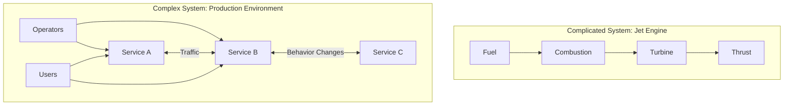
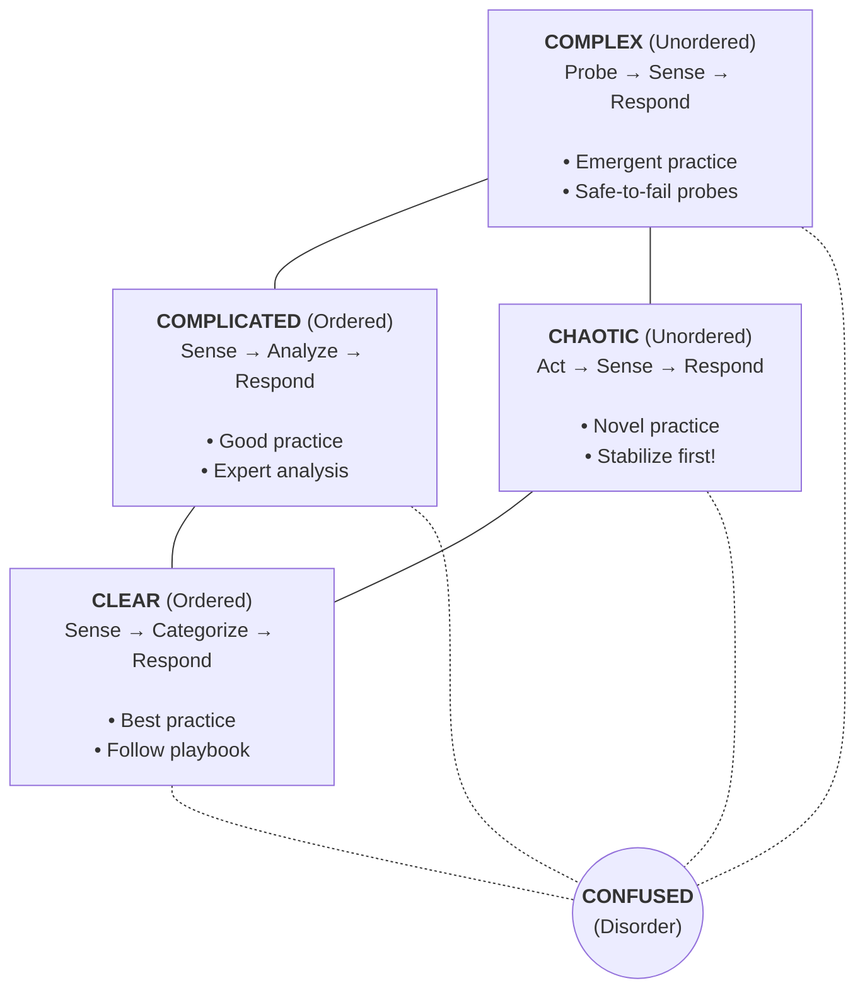
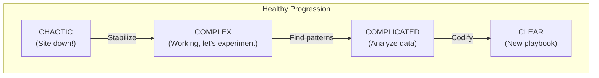
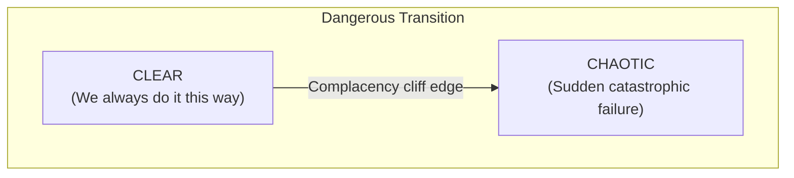
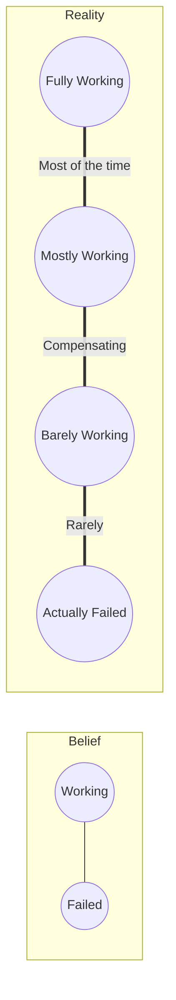
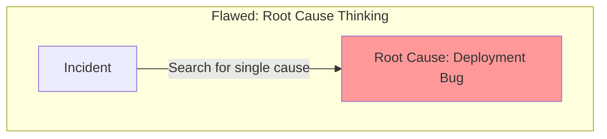
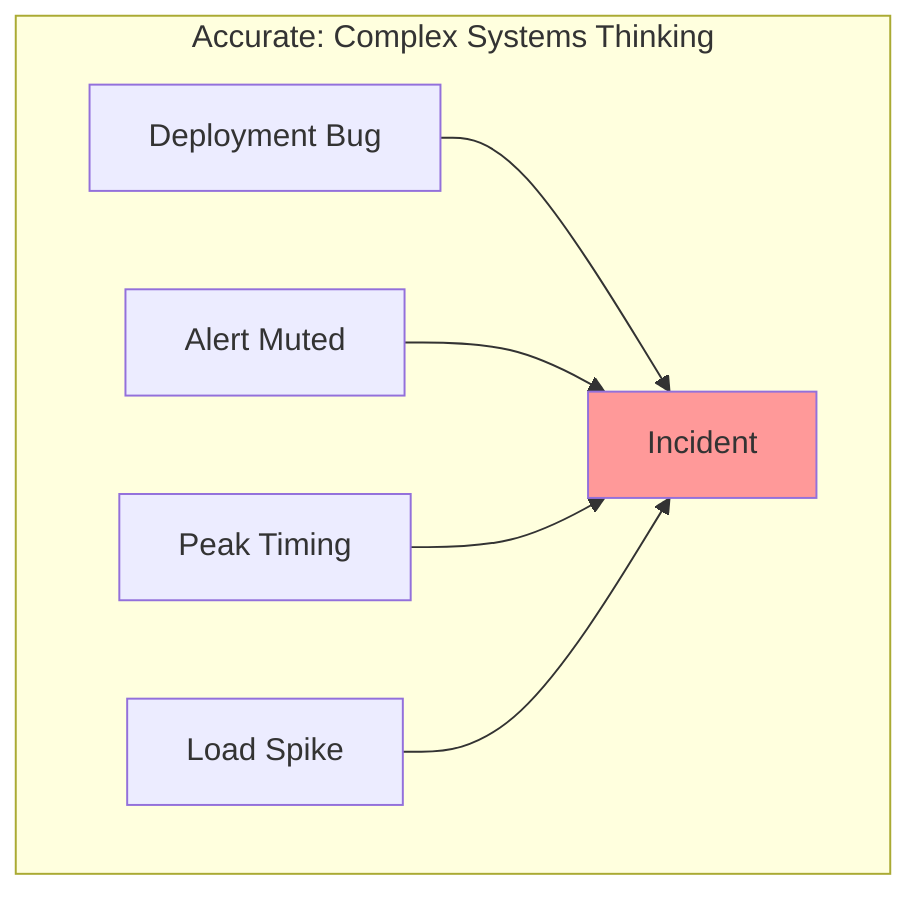
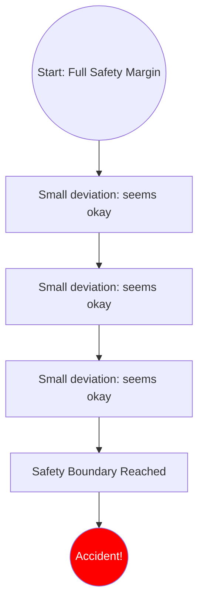
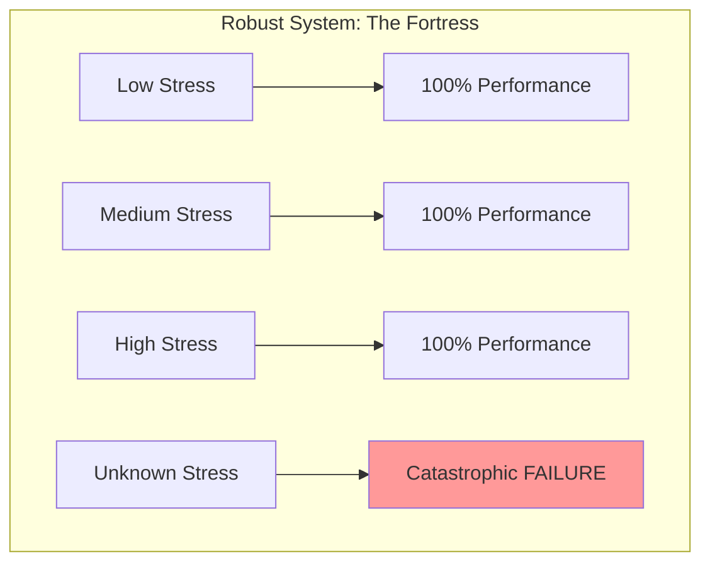
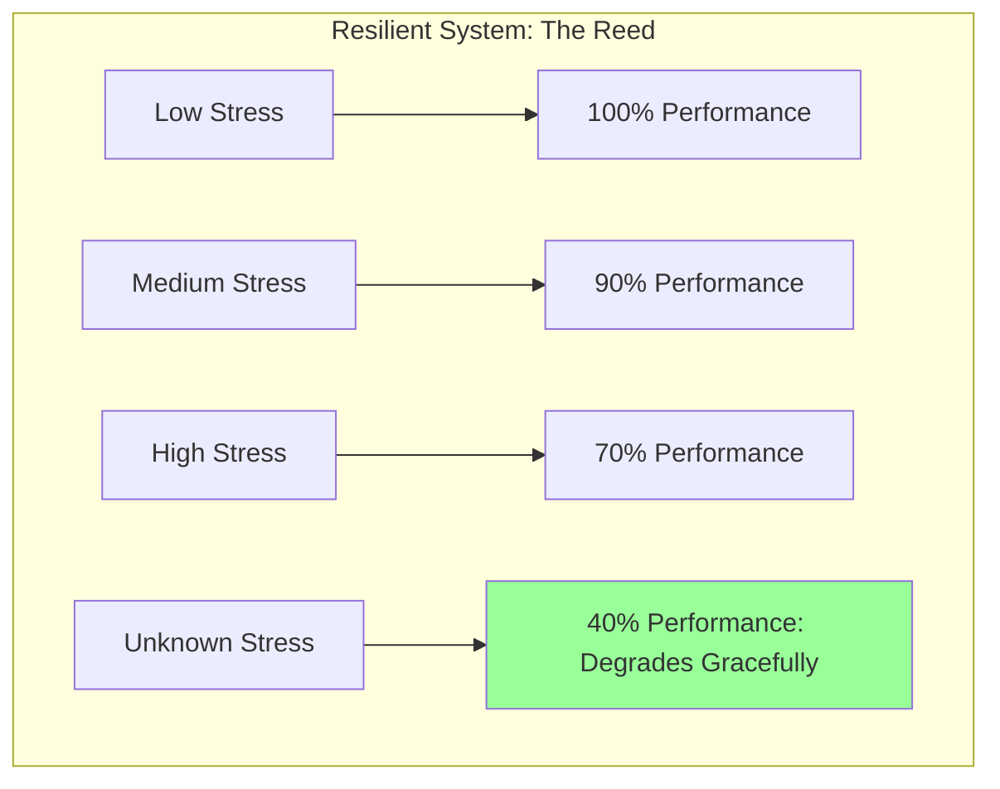

> **Complexity**: `[COMPLEX]`
>
> **Time to Complete**: 40-45 minutes
>
> **Prerequisites**: [Module 1.3: Mental Models for Operations](../module-1.3-mental-models-for-operations/)
>
> **Track**: Foundations

## What You'll Be Able to Do

After completing this module, you will be able to apply complexity thinking to production systems in four concrete ways:

1. **Distinguish** between complicated systems (predictable, decomposable) and complex systems (emergent, non-linear) in real infrastructure
2. **Analyze** how simple component interactions produce emergent behaviors that cannot be predicted from specifications alone
3. **Design** observability and safeguards for systems operating at the edge of chaos where emergent failures are most likely
4. **Evaluate** architectural decisions through the lens of complexity theory to reduce the blast radius of unexpected interactions

---

## The Perfect Storm That Nobody Saw Coming

On [July 8, 2015](https://www.nyse.com/market-status/history), the New York Stock Exchange suspended trading for several hours after a software configuration problem during a routine deployment. That same morning, [United Airlines grounded flights nationwide](https://www.bbc.co.uk/news/technology-33449693) because of a failed network router, and the Wall Street Journal website suffered a separate technical outage. Three high-profile failures within hours looked coordinated to observers watching social media, even though post-incident reporting from each organization described independent causes with no shared attacker or shared root dependency.

Engineers at each company faced a familiar pattern: dashboards that looked mostly healthy, symptoms that did not map cleanly to a single broken component, and public pressure to name one villain quickly. The NYSE incident involved software behavior during an update. United's outage traced to router configuration. The WSJ disruption involved its own delivery stack. None of these stories required a conspiracy to be terrifying—they required only the ordinary complexity of large socio-technical systems failing in parallel while humans searched for narrative simplicity.

This clustering effect is one reason operators study complexity theory instead of treating every incident as an isolated bug hunt. When several critical systems wobble on the same day, your brain wants one explanation. Complex systems often deliver many small explanations that combine into a day that feels impossible until you read the timelines carefully.

> **Stop and think**: Before reading further, consider the last major incident you experienced. Did it have one clear cause, or was it a combination of seemingly unrelated, small factors?

**This is how complex systems work.** They don't fail in the ways you predict. They fail in ways that seem obvious only in hindsight. They create coincidences that look like conspiracies. And they resist all attempts to make them "safe."

---

## Why This Module Matters

You've done everything right. Code is tested. Deployment is automated. Monitoring is in place. Runbooks are written. And yet, the system fails in ways nobody predicted.

This isn't a failure of engineering—it's the **nature of complex systems**. They behave in ways that can't be predicted from their components alone. They adapt, they surprise, and they fail in novel ways.

Understanding complexity changes how you approach operations. You stop trying to prevent all failures, because that goal is impossible in coupled systems with humans in the loop. You start building systems that handle failure gracefully, measuring success by recovery time and customer impact rather than by a fantasy of zero incidents. You stop asking only "why did this fail?" as if a single story could capture the whole mechanism. You start asking "how did this ever work?"—which surfaces latent dependencies, unwritten compensations, and adaptations that were carrying the system until they could not.

> **The Weather Analogy**
>
> Weather is complex. You can model every air molecule perfectly, but you still can't predict weather beyond ~10 days. A butterfly's wingbeat in Brazil might cause a tornado in Texas—or might not. This isn't a measurement problem—it's fundamental to how complex systems behave.
>
> Your distributed system is the same. Perfect knowledge of each service, each container, each network packet doesn't give you perfect prediction of the whole system. New behaviors emerge from interactions that nobody designed.

---

## What You'll Learn

- The crucial difference between complicated and complex systems
- The Cynefin framework for decision-making in different domains
- Richard Cook's essential insights on how complex systems fail
- Why your system is always partially broken (and that's normal)
- How robustness and resilience complement each other in complex systems

---

## Part 1: Complicated vs Complex—The Distinction That Changes Everything

### 1.1 The Two Types of Hard Problems

Not all difficult problems are the same. A commercial jet engine is **complicated**. A flock of birds is **complex**. Understanding the difference will transform how you approach production systems.

| Complicated | Complex |
|-------------|---------|
| Many parts, **knowable** relationships | Many parts, **unknowable** relationships |
| Cause and effect **predictable** | Cause and effect only **visible in hindsight** |
| Experts **can** understand fully | No one **can** understand fully |
| **Best practice** exists | **Good practice** emerges |
| Can be **designed** top-down | Must be **evolved** |
| Example: Jet engine | Example: Air traffic control system |


```mermaid
graph TD
    subgraph Complicated [Complicated System: Jet Engine]
        direction LR
        A[Fuel] --> B[Combustion] --> C[Turbine] --> D[Thrust]
    end

    subgraph Complex [Complex System: Production Environment]
        direction LR
        O[Operators] --> S1[Service A]
        O --> S2[Service B]
        S1 <-->|Traffic| S2
        S2 <-->|Behavior Changes| S3[Service C]
        U[Users] --> S1
        U --> S2
    end
```

**Complicated systems** like a commercial jet engine have fixed relationships among parts that expert mechanics can model with high fidelity. The same input produces the same output under equivalent conditions, failure modes are enumerable, and the artifact can be disassembled, inspected, and reassembled from a blueprint. You can fully understand a complicated system in the operational sense that matters for maintenance: there is a right answer discoverable by analysis.

**Complex systems** such as your production environment change relationships dynamically as code, traffic, configuration, and human behavior shift. No one understands full system behavior in advance, identical inputs can produce different outcomes depending on hidden state, and failure modes are open-ended rather than finite. Complexity emerges from evolution and interaction, not from a single design document. You cannot fully understand a complex system—and that limitation is fundamental physics of coupling, not a personal failure of your team.

### 1.2 Why Production Systems Are Complex

Your Kubernetes cluster is complex, not just complicated, because production coupling shows up in five recurring patterns that reinforce one another.

Non-linear interactions mean a slow database does not merely make queries slower—it can exhaust connection pools, trigger timeouts, provoke retries, and thereby make the database slower still until the effect is wildly disproportionate to the original trigger. Feedback loops are everywhere: autoscalers respond to load, retries respond to failures, circuit breakers respond to errors, caches respond to traffic shapes, and each loop interacts with the others in ways nobody fully designed ahead of time. Constant adaptation is unavoidable because users change behavior, traffic shifts, code ships daily, dependencies update, and teams rotate; the system you operate today is not the system you operated yesterday even if the architecture diagram stayed the same.

Human-system coupling means operators are not outside observers. Their decisions change the system, and the system's alerts and dashboards change which decisions feel urgent. Humans are part of the control loop, which is why runbooks, on-call fatigue, and incident rituals matter as much as CPU limits. Multiple timescales stack on top of one another: millisecond network jitter interacts with second-level retries, minute-level autoscaling, hourly batch work, daily deploy rhythms, weekly maintenance, and quarterly capacity plans—all simultaneously—so an incident that looks like a "database problem" may be a cross-scale interaction problem. A latency spike that lasts two hundred milliseconds can trigger retry logic measured in seconds, which changes queue depth over minutes, which changes autoscaling decisions over tens of minutes, which changes cost and capacity over days. Operators who debug only one timescale often fix a symptom while the cross-scale interaction remains.

### 1.3 Worked Example: From Slow Query to Site-Wide Degradation

Consider a payment API backed by a relational database that begins running ten percent slower because of a missing index after a migration. At first, nothing pages. Latency dashboards show a gentle upward slope. Error rates remain below the alert threshold because most requests still complete within the configured timeout. This is the dangerous middle phase of complex failure: the system is already compensating, and your green dashboards are recording the compensation rather than the underlying stress.

The next link in the chain is connection pooling. Slower queries hold connections longer, so the pool saturates even though query throughput has not doubled. Upstream services start waiting for pool slots, which increases their latency, which triggers client retries configured to improve reliability. Retries multiply load on the database at the exact moment the database is least able to absorb it. A cache layer that was masking read pressure now sees more write-related invalidation traffic because checkout attempts are being retried. An autoscaler adds pods to stateless services, which increases concurrent database connections and makes pool exhaustion worse.

No single team owns this story end to end. The database team sees slow queries. The application team sees timeouts. The platform team sees elevated pod counts. The business team sees checkout complaints that do not align cleanly with error-rate graphs. That fragmentation is not an organizational accident; it is what complexity looks like in a microservice architecture. The emergent behavior—checkout feels broken while many service-level indicators look merely elevated—is not written in any one repository.

The operator move is not to ask which chart is "wrong." It is to trace interactions: pool wait time, retry rate, downstream concurrency, and user-visible success rate must be interpreted together. Complexity-aware debugging starts from the hypothesis that several individually understandable mechanisms are amplifying one another.

### 1.4 Decision Framework: Complicated or Complex?

When you face a production surprise, the first architectural question is not "which service is broken?" but "what kind of problem is this?" The table below is a practical decision aid. It is not a personality test for your organization; it is a way to avoid applying a blueprint where you need experiments, or running experiments while the site is fully down.

| Signal | Lean complicated | Lean complex |
|--------|------------------|--------------|
| Relationship between change and effect | Repeatable in staging | Changes with load, time, or user segment |
| Expert analysis | Converges on one mechanism | Produces multiple plausible stories |
| Fix confidence | Patch or rollback should work | Need safe-to-fail probes first |
| Metric pattern | One dominant anomaly | Several mild anomalies that correlate oddly |
| Human role | Implement known fix | Coordinate learning across teams |

If the situation is complicated, invest in analysis and controlled change. If the situation is complex, invest in observability for learning, bounded experiments, and explicit time limits so you do not confuse learning with infinite data gathering. If the situation is chaotic, stabilize first—then classify again, because chaos often collapses into complex or complicated once the immediate bleeding stops.

### 1.5 Historical Anchor: When Many Small Failures Align

The [2003 Northeast blackout](https://en.wikipedia.org/wiki/Northeast_blackout_of_2003) left tens of millions of people without power after a sequence of equipment and software issues interacted across multiple utilities. A software bug in an alarm system meant operators did not see some warnings they needed. That bug had existed for years without causing catastrophe on its own. What changed was context: high load, vegetation contact with lines, maintenance timing, and operator handoffs combined into a pattern the system had never experienced before. This is the Swiss Cheese pattern in the wild—many layers with latent holes, usually misaligned, occasionally aligned all at once.

That incident is useful for platform engineers even if you never touch power grids, because it demonstrates how "we knew about that bug" is not the same as "that bug was safe." Latent failures wait for partners. Your muted alert, your oversized timeout, your skipped integration test, and your deferred capacity purchase are often harmless—until the day they are not.


### 1.6 Coupling Budgets and Architectural Tradeoffs

Platform architects sometimes talk about "blast radius" as if it were a property of a single service. In complex systems, blast radius is an emergent property of coupling choices: synchronous chains, shared mutable state, global caches, and implicit dependencies all increase the number of pathways through which a local fault becomes a customer-visible surprise. A coupling budget is the intentional limit on how many hidden dependencies a feature may introduce before it must be redesigned with explicit boundaries, contracts, and degradation behavior.

Evaluating architectural decisions through a complexity lens asks different questions than a feature checklist. Instead of only "Can we ship it this quarter?" ask "What new interaction loops does this create?" and "If this dependency slows by ten times, what amplifies?" and "Which metrics will show emergent failure before users abandon checkout?" These questions do not slow good engineering—they prevent the kind of fast shipping that later produces slow, scary incidents whose narratives only make sense in hindsight.

---

## Part 2: The Cynefin Framework—Knowing What Kind of Problem You Have

### 2.1 The Five Domains

**Cynefin** (pronounced "kuh-NEV-in," Welsh for "habitat") is a sense-making framework created by Dave Snowden. It helps you recognize what kind of situation you're in and respond appropriately.

The most dangerous mistake isn't being in a complex domain—it's treating a complex problem like a complicated one, or treating chaos like complexity.


```mermaid
graph TD
    Complex["<b>COMPLEX</b> (Unordered)<br/>Probe → Sense → Respond<br/><br/>• Emergent practice<br/>• Safe-to-fail probes"]
    Complicated["<b>COMPLICATED</b> (Ordered)<br/>Sense → Analyze → Respond<br/><br/>• Good practice<br/>• Expert analysis"]
    Chaotic["<b>CHAOTIC</b> (Unordered)<br/>Act → Sense → Respond<br/><br/>• Novel practice<br/>• Stabilize first!"]
    Clear["<b>CLEAR</b> (Ordered)<br/>Sense → Categorize → Respond<br/><br/>• Best practice<br/>• Follow playbook"]
    Confused(("<b>CONFUSED</b><br/>(Disorder)"))

    Complex --- Complicated
    Chaotic --- Clear
    Complex --- Chaotic
    Complicated --- Clear
    Complex -.- Confused
    Complicated -.- Confused
    Chaotic -.- Confused
    Clear -.- Confused
```

### 2.2 Why the Order of Actions Matters

Each domain requires a different response pattern, and using the wrong pattern is often worse than doing nothing because it burns time while the system state evolves. The table above is a map, not a mandate: your job during incidents is to reclassify quickly as evidence arrives, then announce the domain shift to the bridge so everyone stops arguing from incompatible playbooks.

| Domain | Characteristics | Response Strategy | Common Mistake |
|--------|-----------------|-------------------|----------------|
| **Clear** | Cause-effect obvious to everyone | Sense → Categorize → Respond (use the playbook) | Complacency—"we always do it this way" |
| **Complicated** | Cause-effect discoverable by experts | Sense → Analyze → Respond (study then act) | Analysis paralysis—waiting too long |
| **Complex** | Cause-effect only visible in hindsight | Probe → Sense → Respond (experiment then learn) | Premature convergence—jumping to conclusions |
| **Chaotic** | No perceivable cause-effect | Act → Sense → Respond (stabilize first) | Continued analysis while burning |
| **Confused** | Don't know which domain | Break down and gather information | Acting without knowing the domain |

> **Pause and predict**: If your system goes completely down and you have no idea why, what should your first action be? Analyze the logs, or restart the system? (Hint: You are in the Chaotic domain).

### 2.3 Cynefin in Operations: Real Examples

For a **clear** disk-space alert, sense the signal, categorize it against a known playbook, and respond with the documented cleanup steps. The danger is overcomplicating a solved problem: if you launch a deep log-growth investigation before freeing space, you are borrowing complicated-domain latency for a clear-domain task. Fix first, learn second as a separate deliberate action.

For **complicated** performance degradation, gather metrics, traces, and logs; analyze with domain experts who can interpret query plans, profiles, and network paths; then implement the fix the evidence supports. The danger is analysis paralysis while users remain impacted—set explicit time boxes and be willing to act on the best current hypothesis when the clock expires.

For **complex** mystery failures where checkout complaints do not match global error rates, run safe-to-fail probes such as canaries with verbose tracing or segment-specific tests, sense the patterns that emerge (mobile Safari only, CDN cache age correlation, specific region skew), and respond by amplifying what works while dampening what fails. The danger is premature convergence: declaring "it must be the database" and shipping a risky change without learning context treats complexity as if it were merely complicated.

For **chaotic** complete outage when the site is down and indicators are red everywhere, act immediately to stabilize—rollback, restart critical paths, failover, or shed load—then sense the effect, then iterate. The danger is analysis during chaos: waiting for perfect understanding while customers and revenue burn converts an urgent stabilization problem into a prolonged disaster. A coarse action that produces observable learning beats elegant analysis with no remediation attempt.

> **Hypothetical scenario: The analysis meeting during a total outage**
>
> A team treats every incident as "complicated" and spends the first phase of response gathering evidence before acting. During a major outage, they convene a bridge call and spend most of an hour examining dashboards, debating theories, and asking for one more chart. A leader finally asks whether the customer-facing site is still down. It is. They ask what remediation has been attempted. Nothing yet—the team is still analyzing. The crashed process was visible in monitoring within the first few minutes, but the group kept treating uncertainty as a reason to delay action rather than as a signal to stabilize first.
>
> The eventual fix is restarting a single process and takes seconds. The expensive part was domain misrecognition: they treated a chaotic situation (total outage, unclear cause, high urgency) with a complicated-domain playbook (analyze thoroughly, then respond). **When the building is on fire, you extinguish or evacuate first; the architectural review can wait.**

### 2.4 Domain Transitions

Situations can shift between domains as stabilization progresses, and recognizing those transitions prevents the common failure mode of applying yesterday's correct strategy to today's changed context.


```mermaid
graph LR
    subgraph Healthy Progression
        direction LR
        H_Chaotic["CHAOTIC<br/>(Site down!)"] -->|Stabilize| H_Complex["COMPLEX<br/>(Working, let's experiment)"]
        H_Complex -->|Find patterns| H_Complicated["COMPLICATED<br/>(Analyze data)"]
        H_Complicated -->|Codify| H_Clear["CLEAR<br/>(New playbook)"]
    end
```


```mermaid
graph LR
    subgraph Dangerous Transition
        direction LR
        D_Clear["CLEAR<br/>(We always do it this way)"] -->|Complacency cliff edge| D_Chaotic["CHAOTIC<br/>(Sudden catastrophic failure)"]
    end
```


### 2.5 Operating Cynefin Under Incident Pressure

During incidents, domain classification is a leadership skill as much as a technical one. Teams under stress gravitate toward familiar habits: senior engineers want to analyze, managers want a single owner, executives want a confident sentence for status page updates. Cynefin gives you language to resist those defaults when they do not fit the situation. The goal is not to win a framework debate on the bridge call; the goal is to pick a response pattern that matches how much certainty you actually have.

In the Clear domain, speed and standardization win. Disk cleanup, certificate renewal, and known dependency version bumps should not spawn novel investigation every time. The danger is complacency: a playbook written three years ago may assume architecture that no longer exists. Schedule periodic playbook drills, not because the task is hard, but because the environment changed while the document stayed still.

In the Complicated domain, expertise and measurement win, but time bounds matter. Analysis that continues for an hour while user impact persists is often a sign that you have slipped from complicated toward complex or chaotic without updating your strategy. A practical rule many teams adopt is to alternate between twenty-minute investigation windows and explicit decision points: what will we try next if this window does not produce an actionable hypothesis?

In the Complex domain, experiments must be safe-to-fail. That phrase is overloaded in industry slides, so make it concrete. A safe-to-fail probe changes one variable, has a reversible or bounded blast radius, produces observable learning even when it "fails," and is documented so the next responder is not guessing what you tried. Canary traffic with extra tracing, shadow reads against a new dependency, or temporarily routing internal users through an alternate path are probes. "Restart everything in production and see" is not a probe; it is a high-risk gamble that destroys learning context.

In the Chaotic domain, the first obligation is stabilization, not understanding. Stabilization actions include rollback, failover, feature disablement, traffic shedding, and capacity isolation. These actions may feel crude. They are supposed to. Chaotic domains reward coarse moves that reduce the number of simultaneous unknowns. Once user-visible function returns, you almost always transition into Complex or Complicated work: now you can run probes, compare timelines, and rebuild a narrative with fewer moving parts.

### 2.6 Communicating Uncertainty to Stakeholders

Complex systems create a communication trap: leadership asks for certainty because certainty is comforting, and engineers provide narrow technical facts because those are the only statements they can defend. The gap between "we do not know yet" and "the database is slow" is where incidents go politically wrong. Practice translating domains into business language. Clear and Complicated updates can include expected time-to-recover ranges when the fix path is known. Complex updates should emphasize what you are learning, what you ruled out, and what bounded experiment runs next. Chaotic updates should state what stabilization action is in flight and when the next customer-facing checkpoint will occur.

A useful template for complex incidents is: **impact**, **stabilization status**, **working hypotheses**, **next safe experiment**, **decision time**. That template prevents the two worst failure modes: false confidence early, and endless "still investigating" language with no decision clock.


**Common stuck states** appear in almost every long-running organization. Teams can remain in complicated mode forever by insisting they "need more data" without time limits or decision clocks. Leaders can force complex incidents into complicated RCA templates that demand a single root cause when several contributing factors remain visible only in hindsight. Incident bridges can remain chaotic because each stabilization attempt fixes one symptom while another dependency fails, which means triage must explicitly prioritize customer impact over completeness.

---

## Part 3: How Complex Systems Fail—Richard Cook's Essential Insights

### 3.1 The 18 Principles Every Operator Must Know

Dr. Richard Cook's "How Complex Systems Fail" is three pages that will change how you think about operations. Here are the key insights, applied to production systems:

Cook's first three principles establish the baseline. **Complex systems are intrinsically hazardous**—not because your team built them incorrectly, but because coupling, humans, and time create inherent risk that must be designed for rather than denied. **Complex systems are heavily defended against failure** through redundancy, monitoring, alerting, failover, backups, circuit breakers, retries, and operational habit; those defenses usually work, which is why catastrophes are rare and therefore surprising. **Catastrophe requires multiple failures** aligning: the popular single-root-cause story hides the Swiss Cheese reality that several layers must fail together in a way nobody anticipated.


```mermaid
graph LR
    Start([Threat / Hazard]) --> |Bypasses| L1[Defense 1: Hole]
    L1 --> |Bypasses| L2[Defense 2: Hole]
    L2 --> |Bypasses| L3[Defense 3: Hole]
    L3 --> |Bypasses| L4[Defense 4: Hole]
    L4 --> End([Catastrophe])
```
*The Swiss Cheese Model: Each defense layer has holes. Most days, they don't align. Some days, they do.*

**Principle 4** states that complex systems contain changing mixtures of latent failures—bugs, misconfigurations, race conditions, and capacity cliffs that exist right now while the service appears healthy because compensations and margins absorb them.


```mermaid
graph LR
    subgraph Belief
        W1((Working)) --- F1((Failed))
    end
    subgraph Reality
        W2((Fully Working)) ===|Most of the time| M2((Mostly Working))
        M2 ===|Compensating| B2((Barely Working))
        B2 ===|Rarely| F2((Actually Failed))
    end
```

The useful post-incident question is not whether anything is wrong right now, but which latent problems are currently being compensated for by automation, operator habit, or slack capacity that could disappear during the next change window.

> **Stop and think**: If your system is currently running without active incidents, does that mean it is completely healthy? Or is it just compensating for hidden failures?

**Principles 5 through 7** describe lived operations. Systems run in degraded mode where "normal" includes partial failures that humans and automation continuously work around. Catastrophe remains nearby because safety margins erode under everyday pressures to ship faster, spend less, and defer cleanup. Post-accident attribution to a single root cause is fundamentally misleading because it hides the system conditions, incentives, and adaptations that made the outcome possible.

### 3.2 The Myth of Root Cause

Complex system failures rarely have a single root cause; they accumulate through multiple contributing factors that only look inevitable after the fact, which is why post-incident learning must widen the lens instead of narrowing it to the last change deployed.


```mermaid
graph TD
    subgraph Flawed: Root Cause Thinking
        I[Incident] -->|Search for single cause| R[Root Cause: Deployment Bug]
        style R fill:#ff9999
    end
```


```mermaid
graph TD
    subgraph Accurate: Complex Systems Thinking
        DB[Deployment Bug] --> I2[Incident]
        AM[Alert Muted] --> I2
        PT[Peak Timing] --> I2
        LS[Load Spike] --> I2
        style I2 fill:#ff9999
    end
```

Individually harmless factors can combine through ordinary coupling to produce catastrophe that no single team would have shipped on purpose.

The deployment bug existed for weeks without triggering pages, the alert had been muted months earlier during a noisy weekend, the traffic spike was normal for that hour, and the timing aligned so that none of these factors looked harmful in isolation yet together they produced customer-visible failure.

### 3.3 Drift into Failure

Sidney Dekker's crucial concept: systems don't fail suddenly. They **drift** toward failure through small, locally rational decisions.


```mermaid
graph TD
    Start((Start: Full Safety Margin)) --> D1[Small deviation: seems okay]
    D1 --> D2[Small deviation: seems okay]
    D2 --> D3[Small deviation: seems okay]
    D3 --> Boundary[Safety Boundary Reached]
    Boundary --> Accident((Accident!))
    
    style Accident fill:#f00,color:#fff
```

**Common drift patterns in tech:**

| Small Decision | Rational Justification | Eventual Consequence |
|----------------|----------------------|---------------------|
| "Skip tests for this PR" | "It's a small change" | Test coverage erodes |
| "Silence this alert" | "It's noisy" | Real issues ignored |
| "Don't update that runbook" | "Everyone knows how it works" | Knowledge lost, incident prolonged |
| "Postpone the security patch" | "We'll do it next sprint" | Years pass, vulnerability remains |
| "Increase timeout from 5s to 30s" | "It fixes the immediate problem" | Slow failures propagate |
| "Add one more feature before the refactor" | "Just this once" | Technical debt compounds |


### 3.4 Principles 8 Through 18: Cook's Remaining Insights

Cook's remaining principles are short on the page and enormous in operations practice. **Hindsight biases post-accident assessments of human performance** (Principle 8) warns that knowing the outcome poisons how investigators reconstruct what practitioners could reasonably have seen. **Human operators have dual roles: as producers and as defenders against failure** (Principle 9) explains why outsiders overemphasize either shipping or safety depending on whether an accident just happened. **All practitioner actions are gambles** (Principle 10) reminds you that successful outcomes are also uncertain bets, not proof that risk was absent.

**Actions at the sharp end resolve all ambiguity** (Principle 11) means production pressure, incomplete policy, and organizational ambiguity get resolved by whoever is on call—not by the architecture diagram. **Human practitioners are the adaptable element of complex systems** (Principle 12) is why runbook workarounds, alert fatigue, and "temporary" firewall rules persist for years: people continuously restructure work to keep production moving. **Human expertise in complex systems is constantly changing** (Principle 13) means your team always mixes veterans, trainees, and turnover; expertise is a resource, not a fixed asset.

**Change introduces new forms of failure** (Principle 14) is the principle most relevant to platform engineering teams shipping controllers, operators, and autoscaling policies. New automation can eliminate familiar failure modes while creating rare, high-consequence pathways nobody designed for—controllers that reconcile every few seconds can amplify a misconfiguration into a cluster-wide event before a human finishes reading the first page of symptoms. **Views of "cause" limit the effectiveness of defenses against future events** (Principle 15) argues that blame-focused remedies often increase coupling without reducing the next accident's likelihood.

**Safety is a characteristic of systems and not of their components** (Principle 16) means you cannot buy safety as a feature bolted onto one service. **People continuously create safety** (Principle 17) describes how routine compensations and well-rehearsed adaptations keep operations failure-free most of the time. **Failure free operations require experience with failure** (Principle 18) closes the loop: near-misses, game days, and calibrated exposure to hazard teach operators where the edge of tolerable performance lies.

Treat Cook's paper as a checklist during post-incident review, not as philosophy. Ask: which defenses were supposed to catch this, which were bypassed, which latent conditions existed before the trigger, and which adaptations made the incident harder to see? Those four questions consistently produce systemic improvements that "find the bug and patch it" misses.

### 3.5 Emergence in Distributed Platforms

Emergence is not mysticism; it is what happens when components follow local rules and global behavior is not a simple sum. Kubernetes desired-state reconciliation is a canonical example. No single Pod object "knows" about cluster health, yet the cluster exhibits self-healing behavior when controllers, schedulers, kubelet, and CNI plugins interact. That emergence is valuable until it emergently works against you: for example, rapid pod restart loops that increase load on a failing dependency, or autoscaling that adds replicas that all hammer the same broken backend.

Observability for emergent behavior requires **system-level signals**, not only component greens. User journeys, saturation, queue depth, retry rates, and cross-service correlation often reveal emergent failure earlier than per-service CPU graphs. When symptoms appear in user experience before they appear in infrastructure metrics, you are often watching complexity rather than a simple component fault.

### 3.6 Tradeoffs: How Much Complexity Can You Afford?

Every feature coupling, shared library, synchronous call, and global cache increases the interaction surface where emergence can hide. Platform teams sometimes reduce complexity by enforcing asynchronous boundaries, idempotent interfaces, bulkheads, and explicit ownership of failure modes. Those patterns do not eliminate complexity—users, data, and time still interact—but they channel interactions into places where probes and circuit breakers can operate.

The tradeoff is velocity versus interaction density. Tight coupling ships features faster until the day emergent failure makes every change feel risky. Loose coupling feels slower until the day a dependency fails and only one domain degrades. Complexity thinking helps you choose where to pay coupling costs intentionally rather than accidentally.


Each decision seems small. Each is locally rational. Together, they erode safety margins until failure is inevitable.

---

## Part 4: Designing for Resilience

### 4.1 Resilience vs Robustness—A Critical Distinction

**Robustness** means resisting known failures within designed limits, while **resilience** means adapting when the failure mode was not predicted or when multiple stresses combine in novel ways.


```mermaid
graph TD
    subgraph Robust System: The Fortress
        R_Low[Low Stress] --> R_Perf1[100% Performance]
        R_Med[Medium Stress] --> R_Perf2[100% Performance]
        R_High[High Stress] --> R_Perf3[100% Performance]
        R_Unk[Unknown Stress] --> R_Fail[Catastrophic FAILURE]
        style R_Fail fill:#ff9999
    end
```


```mermaid
graph TD
    subgraph Resilient System: The Reed
        Re_Low[Low Stress] --> Re_Perf1[100% Performance]
        Re_Med[Medium Stress] --> Re_Perf2[90% Performance]
        Re_High[High Stress] --> Re_Perf3[70% Performance]
        Re_Unk[Unknown Stress] --> Re_Perf4[40% Performance: Degrades Gracefully]
        style Re_Perf4 fill:#99ff99
    end
```

Robustness handles known failures well within designed limits, but can collapse when stress exceeds those limits. Resilience adapts imperfectly to novel or combined stresses, preserving partial function rather than all-or-nothing failure. **For complex systems, you need both:** robust controls for known failure modes (timeouts, validation, capacity limits) plus resilient adaptation for the unknown (graceful degradation, fallbacks, learning loops). Neither alone is sufficient.

### 4.2 The Four Resilience Capabilities

Resilience engineering identifies four capabilities that enable systems to adapt under uncertainty, and mature teams instrument all four instead of treating resilience as a synonym for redundancy.

**Respond** addresses disturbances as they occur by asking what the system can do when things go wrong. Good implementations include circuit breakers, graceful degradation, and failover paths; weak implementations throw hard errors to users when a dependency slows, even though a cached or partial response would preserve core function.

**Monitor** asks what signals reveal emerging trouble before catastrophe. Business metrics, user-journey success, saturation, and retry rates are leading indicators; CPU-only dashboards often stay green while customers suffer.

**Anticipate** asks what might go wrong before customers discover it. Chaos experiments, load tests, game days, and threat modeling surface latent interactions; assuming "it never failed before" is not anticipation—it is hope.

**Learn** asks how the organization improves after surprises. Blameless postmortems, systemic contributing-factor analysis, and Safety-II study of everyday success encode adaptation into culture; labeling incidents "human error" and closing tickets guarantees repetition.

### 4.3 Chaos Engineering—Practicing Failure Before It Happens

Chaos Engineering deliberately introduces failures to discover weaknesses before real incidents.

> **Stop and think**: What would happen if your primary database instances were suddenly terminated right now? Would the system recover automatically, or require human intervention?

1. **Start with a hypothesis**: "If we kill 30% of API pods, latency should stay under 200ms." This lets you learn regardless of outcome.
2. **Use production-like conditions**: Real chaos happens in production because staging lacks real user behavior and data volumes.
3. **Minimize blast radius**: Start small. Build confidence. Expand gradually.
4. **Run experiments continuously**: Systems drift. Regular chaos experiments detect this drift.
5. **Build confidence, not heroics**: The goal is a boring incident response because you've seen it before.

Netflix's Chaos Monkey, described in the [Principles of Chaos Engineering](https://principlesofchaos.org/), was among the early tools that randomly terminates production instances so teams design for survivability rather than assuming instance permanence. The tool does not merely test resilience—it forces resilient design by making instance loss routine. For a deeper KubeDojo treatment, see [Chaos Principles](../../disciplines/reliability-security/chaos-engineering/module-1.1-chaos-principles/).

**Common Chaos Experiments:**

| Experiment | What It Tests | Tools |
|------------|--------------|-------|
| **Pod failure** | Auto-restart, replication | Chaos Mesh, Litmus |
| **Node failure** | Pod rescheduling, affinity | kube-monkey, Chaos Mesh |
| **Network partition** | Retry logic, timeouts, failover | tc, Chaos Mesh |
| **Latency injection** | Timeout handling, circuit breakers | Toxiproxy |
| **CPU/memory stress** | Autoscaling, resource limits, throttling | stress-ng |
| **DNS failure** | Fallback mechanisms, caching | Block DNS queries |

### 4.4 Safety-I vs Safety-II

Traditional safety (**Safety-I**) focuses on what goes wrong. It counts errors, eliminates causes, and asks "Why did this fail?"

Resilience engineering (**Safety-II**) also studies what goes right. It recognizes that most operations succeed despite latent failures. Operators constantly work around issues to keep the system running. By asking "Why does this usually work?" we can learn from successful adaptations and amplify them.

### 4.5 Observability for Edge-of-Chaos Operations

Systems at the "edge of chaos" sit between rigid order and total disorder: enough structure to function, enough coupling that small perturbations can produce large effects. That is where many revenue-critical platforms live during growth phases. Observability design for this regime prioritizes **leading indicators** and **interaction metrics** over static thresholds on individual machines.

Leading indicators include retry amplification, pool wait time, queue age, error budget burn relative to traffic, and saturation of shared resources such as connection pools, thread pools, and API rate limits. Interaction metrics include cross-service traces that show fan-out depth, correlation between deploy times and tail latency shifts, and segment-specific failure rates when global aggregates look acceptable. Dashboards that only turn red when a single service crosses a threshold will systematically miss complex degradation.

Alert design should encode domain thinking. Clear-domain alerts can page with runbook links. Complicated-domain alerts should attach recent change context and key dependency graphs. Complex-domain alerts should often route to learning workflows: ticket plus experiment template, not only "fix immediately" paging, because premature fixes can worsen emergent loops. This does not mean ignoring user pain; it means pairing customer-impact alerts with explicit stabilization timers.

### 4.6 Game Days and Organizational Learning

Chaos engineering is not only tooling; it is a social technology for building shared mental models. Game days that include product, support, and leadership participants often teach more about complexity than engineering-only drills, because customer communication and business tradeoffs are part of the system. Scenarios should include partial failures where metrics disagree, latent misconfigurations that only appear under load, and dependencies that are "healthy" by health check but unusable by real traffic.

Document outcomes as **conditions**, not hero stories. "We discovered retries doubled write load during simulated partition" is reusable. "Alice saved the day" is not a control. Safety-II thinking applies: study why routine operations succeed despite latent flaws, and encode those successful adaptations into guardrails without punishing the people who improvised responsibly.

### 4.7 Putting It Together: An Edge-of-Chaos Checklist

Before you leave this module, walk through a checklist on a service you operate today. First, classify recent surprises with Cynefin: which were clear, complicated, complex, or chaotic, and did the team's actions match the domain? Second, list latent partners: muted alerts, retry policies changed under pressure, undeployed fixes, documentation drift, and dependencies nobody owns on-call. Third, identify one respond/monitor/anticipate/learn gap you could close this sprint without waiting for a major rewrite. Fourth, choose one architectural coupling you would not add again if you were designing the service fresh. Complexity thinking is not an excuse for fatalism; it is a disciplined way to prioritize where surprise will hurt most and where learning will pay the highest interest.

---

## Did You Know?

- **The term "emergence"** was coined by philosopher G.H. Lewes in 1875. He observed that water's properties (wetness, transparency) can't be predicted from hydrogen's and oxygen's properties alone. The whole has properties that the parts don't.

- **Cynefin** comes from the Welsh word meaning "habitat" or "place"—but with connotations of multiple factors influencing us in ways we can never fully understand.

- **Traffic jams** are emergent behavior. No driver wants a traffic jam. No traffic engineer designs them. They emerge from simple rules (follow car ahead, slow when crowded) interacting. Your cascading failures work the same way.

- **Richard Cook** was an anesthesiologist before becoming a safety researcher. He studied how surgical teams avoid killing patients despite working in complex, high-stakes environments. His insights apply directly to operations.

---

## Common Mistakes

| Mistake | Problem | Solution |
|---------|---------|----------|
| Treating complex as complicated | Applying "best practices" where they don't work | Use Cynefin to identify domain first |
| Searching for "root cause" | Oversimplifies, misses contributing factors, enables blame | Look for multiple contributing factors |
| Assuming safety from testing | Tests find known issues, not emergent behavior | Add chaos engineering, observe production |
| Blaming individuals | Misses systemic issues, creates fear, prevents learning | Blameless postmortems, focus on systems |
| Preventing all failures | Impossible, creates brittleness, false confidence | Design for recovery, not just prevention |
| Ignoring near-misses | Loses learning opportunities, waits for disaster | Study near-misses as seriously as incidents |
| Only studying failures | Misses what makes systems work | Apply Safety-II, study successes |

---

## Quiz

1. **A team is managing a fleet of self-driving delivery robots. When a robot's battery degrades, it predictably runs out of power sooner. When a robot encounters an unexpected construction zone, it gets confused, stops, and causes other robots to reroute, creating a massive traffic jam that brings the whole fleet to a halt. Which of these issues is complicated and which is complex?**
   <details>
   <summary>Answer</summary>

   The battery degradation is a complicated problem, while the traffic jam is a complex problem. **WHY?** A complicated problem (battery) has fixed, knowable relationships. An expert can calculate exactly when it will fail based on chemistry and usage. A complex problem (traffic jam) involves dynamic interactions where cause-and-effect are only visible in hindsight. The traffic jam emerged from simple rerouting rules interacting in unexpected ways, a hallmark of complex systems. You cannot predict the system-wide traffic jam simply by looking at the code for one robot.
   </details>

2. **During Black Friday, your payment gateway suddenly drops 100% of transactions. The dashboard is a sea of red. Your senior engineer says, "Let's gather the logs and spend 30 minutes analyzing the query plans before we touch anything." Which Cynefin domain are you in, and is this the right approach?**
   <details>
   <summary>Answer</summary>

   You are in the Chaotic domain, and this is the wrong approach. **WHY?** When 100% of transactions are dropping during a critical business event, cause-and-effect is currently imperceptible and the priority is stopping the bleeding. In the Chaotic domain, the correct pattern is Act → Sense → Respond. You should immediately attempt to stabilize (e.g., rollback the last deploy, failover to a backup gateway, restart the service) rather than analyzing logs, which is the strategy for the Complicated domain. Perfect analysis is useless if the business burns down while you do it.
   </details>

3. **After a major database outage, management demands a "Root Cause Analysis" (RCA) document that identifies the single exact reason for the failure so they can fire the responsible person. Based on Richard Cook's principles, why is this request fundamentally flawed?**
   <details>
   <summary>Answer</summary>

   The request is flawed because complex systems do not fail due to a single "root cause." **WHY?** In complex systems, catastrophe requires multiple defenses to fail simultaneously (the Swiss Cheese model). The incident was likely caused by a combination of individually harmless factors (e.g., a latent bug in a recent PR, a muted alert from last month, a peak load spike, and random timing) that happened to align perfectly. Searching for a single root cause, especially to assign blame, ignores the systemic conditions that made the failure possible and guarantees the real vulnerabilities will remain unaddressed. Blameless postmortems that seek to understand how the system allowed the failure are required to genuinely improve resilience.
   </details>

4. **Team A builds an API that rigidly rejects any request taking longer than 500ms, causing the entire frontend to crash with a 500 Error when the database slows down. Team B builds an API that returns cached, slightly stale data if the database takes longer than 500ms, allowing the user to continue using the app. Which team built a robust system and which built a resilient system?**
   <details>
   <summary>Answer</summary>

   Team A built a robust system, while Team B built a resilient system. **WHY?** A robust system (Team A) is designed like a fortress to resist known failures up to a specific threshold, but when it encounters unexpected stress (like a database slow down that pushes past its rigid limits), it fails catastrophically (crashing the frontend). A resilient system (Team B) is designed to adapt and bend like a reed; it accepts that failures will happen and degrades gracefully (returning stale data) rather than collapsing completely. For complex systems, robustness and resilience are complementary: Team A's rigid timeout is a reasonable robust guard for known latency bounds, while Team B's fallback adds resilient adaptation when those bounds are exceeded. The best design combines both—strict limits where you understand the failure mode, graceful degradation where you do not.
   </details>

5. **Your platform team must evaluate two architectural decisions for a new checkout service through the lens of complexity theory. Design A synchronously calls five downstream services on every request to maximize data freshness. Design B uses asynchronous boundaries, bulkheads, and cached fallbacks that may serve slightly stale prices during dependency trouble. Which design better reduces blast radius of unexpected interactions, and why?**
   <details>
   <summary>Answer</summary>

   Design B better reduces blast radius of emergent failures when you **evaluate architectural decisions** using **complexity theory**. **WHY?** Synchronous fan-out creates dense interaction graphs where one slow or failing dependency can stall the entire request path and amplify retries across the mesh. Asynchronous boundaries and bulkheads constrain how failures propagate, while cached fallbacks preserve partial user value during degradation. Design A may look simpler and fresher in demos, but it increases coupling density—the number of ways simple local rules can interact to produce surprising global outcomes. Complexity-aware architecture prefers controlled coupling and explicit degradation paths over maximal freshness with hidden interdependence.
   </details>

6. **During an incident, metrics show database CPU at normal levels, yet checkout latency spikes and support tickets rise. An engineer proposes, "Database looks fine—must be frontend." What complexity-aware investigation steps should come next instead of jumping to that conclusion?**
   <details>
   <summary>Answer</summary>

   Treat the situation as complex until proven otherwise. **WHY?** Emergent degradation often appears first in user journeys while component greens remain misleading. Next steps should include tracing checkout end-to-end, measuring pool wait time and retry rates, comparing segments (device, region, account type), and correlating with recent deploys or flag changes. The database may be "fine" by CPU while suffering lock contention, connection starvation, or hot keys. Premature convergence on frontend blame repeats the complicated-domain mistake on a complex symptom set.
   </details>

7. **A leadership sponsor asks for a guarantee that chaos testing will prevent the next outage. What honest answer aligns with Safety-I and Safety-II thinking?**
   <details>
   <summary>Answer</summary>

   Chaos testing cannot guarantee prevention of novel emergent failures. **WHY?** Safety-I methods reduce known failure modes, but complex systems generate new interaction patterns as code, traffic, and human behavior change. Chaos experiments and game days improve anticipation and learning—they reveal latent weaknesses, train response, and validate degradation paths—but resilience is continuous adaptation, not a one-time certificate. The honest promise is faster learning, smaller blast radius, and better recovery, not permanent immunity from surprise.
   </details>

8. **Two latent conditions exist in production: an alert muted last month and a retry policy doubled during a previous incident. Neither alone caused customer impact until today's traffic mix shifted. Which models from this module explain why the incident occurred, and what remediation style fits?**
   <details>
   <summary>Answer</summary>

   Swiss Cheese, latent failure mixtures, and drift into failure explain the incident. **WHY?** Each condition was harmless alone but aligned today: muted alert removed early signal, elevated retries amplified load under a new traffic shape. Remediation should address systemic conditions—restore alert hygiene, revisit retry budgets with load testing, document contributing factors without single-blame RCA, and add monitors on retry amplification and user-journey success. Fixing only today's trigger without treating the latent partners invites recurrence when another alignment occurs.
   </details>

---

## Hands-On Exercise

### Part A: Simple Chaos Experiment (15 minutes)

This exercise uses a minimal Kubernetes deployment so you can observe emergent self-healing without reproducing a full production stack. You need a running Kubernetes v1.35+ cluster (kind, minikube, or managed). The learning goal is to experience how controllers, schedulers, and replicated pods produce system-level recovery behavior that no individual Pod manifest encodes explicitly.

1. **Create a resilient deployment** by applying the manifest below, which creates three nginx replicas with readiness and liveness probes in a dedicated namespace.

```bash
# Create a namespace for this experiment
kubectl create namespace chaos-lab

# Create a deployment with multiple replicas
cat <<EOF | kubectl apply -f -
apiVersion: apps/v1
kind: Deployment
metadata:
  name: resilience-test
  namespace: chaos-lab
spec:
  replicas: 3
  selector:
    matchLabels:
      app: resilience-test
  template:
    metadata:
      labels:
        app: resilience-test
    spec:
      containers:
      - name: web
        image: nginx:alpine
        ports:
        - containerPort: 80
        readinessProbe:
          httpGet:
            path: /
            port: 80
          initialDelaySeconds: 2
          periodSeconds: 3
        livenessProbe:
          httpGet:
            path: /
            port: 80
          initialDelaySeconds: 5
          periodSeconds: 5
---
apiVersion: v1
kind: Service
metadata:
  name: resilience-test
  namespace: chaos-lab
spec:
  selector:
    app: resilience-test
  ports:
  - port: 80
    targetPort: 80
EOF
```

2. **Verify all pods are running** and wait until each replica reports `Running` and `1/1 Ready`.

```bash
kubectl get pods -n chaos-lab -w
# Wait until all 3 pods show Running and 1/1 Ready
# Press Ctrl+C to stop watching
```

3. **In a second terminal, watch pod events continuously** so you can observe recovery dynamics while injecting failure.

```bash
# Keep this running to observe the emergent behavior
kubectl get pods -n chaos-lab -w
```

4. **Inject chaos by deleting one pod** and watch how the Deployment controller recreates capacity.

```bash
# Delete a pod (the first one in the list)
POD=$(kubectl get pod -n chaos-lab -l app=resilience-test -o jsonpath='{.items[0].metadata.name}')
echo "Killing pod: $POD"
kubectl delete pod -n chaos-lab $POD --wait=false
```

In terminal 2 you should see the pod enter `Terminating`, a replacement pod appear almost immediately, and the new pod progress through `Pending`, `ContainerCreating`, and `Running` without manual intervention.

5. **Inject stronger chaos by deleting two pods at once** to see how the same control loop responds under larger perturbation.

```bash
# Delete 2 pods simultaneously
kubectl delete pod -n chaos-lab --wait=false \
  $(kubectl get pod -n chaos-lab -l app=resilience-test -o jsonpath='{.items[0].metadata.name} {.items[1].metadata.name}')
```

6. **Observe emergent behavior** across both experiments: the cluster maintains desired replica count without human action, recreation timing varies with scheduler and node conditions, and you cannot predict exactly which pod names will appear even though the system-level outcome stabilizes.

7. **Clean up** when finished so the experiment does not consume cluster resources.

```bash
kubectl delete namespace chaos-lab
```

What you experienced is emergence in miniature: system-level self-healing that no single pod possesses, a feedback loop where the Deployment controller detects actual state diverging from desired state and creates replacements, unpredictable timing at the pod level coupled with reliable recovery at the service level, and resilience that tolerates brief degradation while converging back toward the declared replica count.

---

### Part B: Complex Systems Analysis (25 minutes)

Apply complex systems thinking to a recent incident from your organization, or use the hypothetical scenario below if you do not have a suitable recent example. **Hypothetical scenario:** users report checkout failing intermittently; error rates are elevated but remain below alert thresholds; some engineers reproduce the issue while others cannot; symptoms began within the last few days but the exact start time is unclear.

**Section 1: Cynefin Classification (10 minutes)**

Answer these questions:

1. What domain is this scenario in initially? Why?

   > **Domain**: ________________
   >
   > **Evidence**:
   > - Cause-effect is: clear / analyzable / only in hindsight
   > - Experts can: definitely solve it / might need experiments
   > - The urgency is: low / medium / critical

2. What specific actions would help move to a better-understood domain?

3. What signals would indicate the situation has shifted domains?

**Section 2: Contributing Factors Analysis (10 minutes)**

Instead of finding "root cause," list all potential contributing factors:

| Factor | Category | Was It New? | Was It Known? |
|--------|----------|-------------|---------------|
| | Software (code, config) | | |
| | Infrastructure (compute, network) | | |
| | Process (deployment, review) | | |
| | Human (knowledge, attention) | | |
| | Environment (load, time, dependencies) | | |
| | Timing (sequence, coincidence) | | |

Write short answers explaining which factors individually seem harmless, which combination might have created the incident, and which latent failures might remain even after a narrow fix.

**Section 3: Resilience Improvements (5 minutes)** — for the scenario, identify one improvement for each resilience capability in the table below and note which capability gap would have made the intermittent checkout failure visible earlier.

| Capability | Current Gap | Proposed Improvement |
|------------|-------------|---------------------|
| **Respond** | | |
| **Monitor** | | |
| **Anticipate** | | |
| **Learn** | | |

Complete Part B successfully when you can explain the Cynefin domain with evidence, name at least five contributing factors across categories, and propose resilience improvements for all four capabilities.

**Success Criteria**:
- [ ] Part A: Successfully killed and observed pod recovery
- [ ] Part A: Can explain what "emergence" you observed
- [ ] Part B: Correct Cynefin domain identification with reasoning
- [ ] Part B: At least 5 contributing factors identified across categories
- [ ] Part B: Recognized that "individually harmless" factors combine
- [ ] Part B: Resilience improvements for all 4 capabilities

---

## Sources

- [How Complex Systems Fail](https://how.complexsystems.fail/) — Richard Cook's eighteen principles on safety and failure in complex socio-technical systems.
- [Drift into Failure (Sidney Dekker)](https://www.routledge.com/Drift-into-Failure-From-Hunting-Broken-Components-to-Understanding-Complex-Systems/Dekker/p/book/9781409422211) — Dekker's account of how systems drift toward failure through locally rational decisions.
- [The Cynefin Framework](https://cynefin.io/wiki/Cynefin) — Dave Snowden's sense-making model for matching response strategy to context.
- [Thinking in Systems: A Primer](https://www.chelseagreen.com/product/thinking-in-systems/) — Donella Meadows on stocks, flows, feedback, and leverage points in complex systems.
- [Google SRE Book — Handling Overload](https://sre.google/sre-book/handling-overload/) — Client-side throttling, load shedding, and protecting dependencies under stress.
- [Google SRE Book — Addressing Cascading Failures](https://sre.google/sre-book/addressing-cascading-failures/) — Retry amplification, cascading failure patterns, and mitigation patterns for production.
- [Principles of Chaos Engineering](https://principlesofchaos.org/) — Foundational chaos-engineering principles for building confidence in turbulent production conditions.
- [2015 NYSE trading suspension](https://www.nyse.com/market-status/history) — NYSE market-status history documenting the July 8, 2015 trading suspension discussed in the module opener.
- [United Airlines ground stop (2015)](https://www.bbc.co.uk/news/technology-33449693) — Reporting on the same-day United Airlines computer disruption from independent infrastructure failure.
- [Northeast blackout of 2003](https://en.wikipedia.org/wiki/Northeast_blackout_of_2003) — Overview of the multi-factor cascade referenced in the module's historical anchor section.
- [Safety-II (Erik Hollnagel)](https://www.hollnagel.com/safety-ii) — Foundational Safety-II perspective on studying everyday success in safety-critical work.
- [Emergence (Stanford Encyclopedia of Philosophy)](https://plato.stanford.edu/entries/properties-emergent/) — Philosophical and scientific background on emergent properties in complex wholes.

## Further Reading

For book-length depth beyond the canonical sources above, seek full texts on resilience engineering, human factors, and organizational learning. Cook's three-page essay remains the highest leverage starting point; Dekker and Meadows provide complementary lenses on drift and system structure; Rosenthal and Jones extend chaos engineering from philosophy into practice.

---

## Next Module

You have completed the Systems Thinking foundation sequence. Continue into [Reliability Engineering](/platform/foundations/reliability-engineering/) to translate complexity awareness into measurable reliability practice—failure modes, redundancy, SLOs, and error budgets—or explore [Observability Theory](/platform/foundations/observability-theory/) if understanding system behavior through signals is your immediate need.

---

## Systems Thinking: What's Next?

Congratulations—you have completed the Systems Thinking foundation. You now have a vocabulary for discussing complex systems, mental models for analyzing behavior under pressure, frameworks such as Cynefin for choosing response strategies, and a practical understanding of why complex systems fail and how to design for resilience instead of brittle perfection.

Use the table below to choose your next track based on what you want to practice first.

| Your Interest | Next Track |
|---------------|------------|
| Building reliable systems | [Reliability Engineering](/platform/foundations/reliability-engineering/) |
| Understanding system behavior | [Observability Theory](/platform/foundations/observability-theory/) |
| Operating in production | [SRE Discipline](/platform/disciplines/core-platform/sre/) |
| Designing for failure | [Distributed Systems](/platform/foundations/distributed-systems/) |

---

## Track Summary

| Module | Key Takeaway |
|--------|--------------|
| **1.1** | Systems are more than components; behavior emerges from interactions |
| **1.2** | Feedback loops drive system behavior; delays cause oscillation |
| **1.3** | Mental models (leverage points, stocks/flows, causal loops) help navigate complexity |
| **1.4** | Complex systems fail in novel ways; design for resilience, not just prevention |

> *"The purpose of a system is what it does."* — Stafford Beer
>
> Not what you intended. Not what you documented. What it actually does.
> Complex systems teach humility.