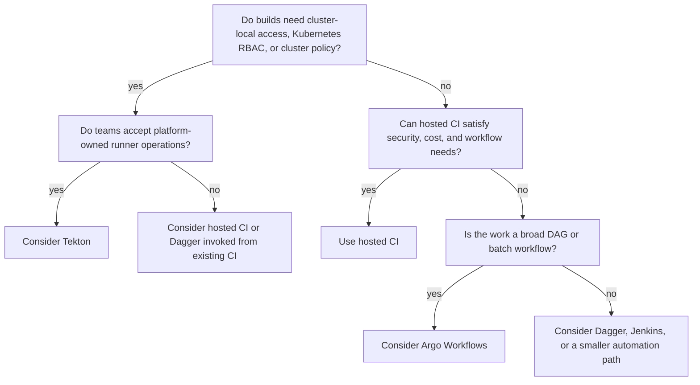

> **Toolkit Track** | Complexity: `[COMPLEX]` | Time: 65-80 min

## What You'll Be Able to Do

After completing this module, you will be able to:

- **Model** Kubernetes-native CI/CD as declarative custom resources reconciled into Pods, rather than as jobs scheduled on a separate CI worker fleet.
- **Compose** reusable Tekton `Task`, `Pipeline`, `TaskRun`, and `PipelineRun` resources with parameters, results, and workspaces that make pipeline behavior explicit.
- **Connect** repository events to `PipelineRun` creation with Tekton Triggers, including `EventListener`, `TriggerBinding`, `TriggerTemplate`, and interceptor responsibilities.
- **Secure** build outputs with signed provenance by explaining how Tekton Chains relates to image digests, SLSA attestations, Cosign, and downstream admission policy.
- **Choose** when Tekton, Argo Workflows, Dagger, hosted CI, or Jenkins fits a delivery problem without turning tool selection into a popularity contest.

## Why This Module Matters

Hypothetical scenario: a platform team supports 20 product teams that all deploy into Kubernetes. The teams already use a hosted CI service for pull request checks, but their release builds need private network access, cluster-local test dependencies, consistent service accounts, and the same admission policies that protect runtime workloads. The hosted workers can reach those systems only through brittle network exceptions, while a cluster-local runner can use Kubernetes scheduling, secrets, storage, RBAC, and policy directly.

Tekton matters because it treats CI/CD as Kubernetes API design. A build is not a hidden script on a long-lived worker; it is a `TaskRun` or `PipelineRun` object with status, ownership, labels, service accounts, resource requests, and Pods that you can inspect with normal Kubernetes tools. That is the durable capability to learn: delivery work becomes declarative cluster work, and the controller reconciles the desired execution into short-lived Pods.

This does not make Tekton automatically simpler than hosted CI. It moves responsibility from a provider-managed runner pool into your platform. You gain control over where builds run, which identities they use, what storage they mount, how network policy applies, and how provenance is produced. You also accept the operational burden of controller upgrades, CRD compatibility, cluster capacity, pod startup latency, workspace cleanup, RBAC design, webhook exposure, and support for teams that now depend on your CI control plane.

The useful mental model is an assembly line inside a governed building. Hosted CI gives you an external workshop with convenient tools and managed staff, which is often exactly the right answer for ordinary pull request automation. Tekton lets you build the workshop inside your Kubernetes facility, with your own doors, badges, cameras, storage rooms, and safety rules. That control is valuable when the work must touch internal systems, run with cluster-native identity, or emit supply-chain evidence tied to the same platform that later deploys the artifact.

You should already understand Pods, Services, CRDs, container images, Kubernetes secrets, and YAML before using this module. The examples target current KubeDojo Kubernetes practice and use Tekton `tekton.dev/v1` pipeline resources, plus `triggers.tekton.dev/v1beta1` trigger resources. The goal is not to memorize every field. The goal is to understand why the fields exist and how to reason about a pipeline that is also a set of Kubernetes objects.

## Kubernetes-Native CI/CD: The Durable Spine

Tekton's core idea is simple but far-reaching: define CI/CD primitives as custom resources, then let a controller create Pods to perform the work. A `Task` describes ordered container steps. A `Pipeline` describes how tasks depend on each other. A `TaskRun` or `PipelineRun` is an execution object. The controller watches these objects, resolves references, creates Pods, records status, and continues reconciling until the run succeeds, fails, times out, or is cancelled.

That architecture changes the operating model. In a hosted CI product, the central abstraction is usually a workflow file interpreted by a service that owns the runner lifecycle. In Tekton, the central abstraction is an API object inside the cluster. The difference matters because an API object participates in Kubernetes ownership, admission, audit, namespace isolation, RBAC, labels, events, quotas, and scheduling. You can ask the cluster what happened instead of searching through a separate runner backend.

```text
Repository event or manual command
        |
        v
PipelineRun custom resource
        |
        v
Tekton Pipelines controller
        |
        v
TaskRun objects and Pods
        |
        v
Container steps using Kubernetes RBAC, secrets, volumes, quotas, and scheduling
```

The upside is locality. If your build must run integration tests against private cluster services, mount internal certificates, or push to a registry reachable only from the cluster network, Tekton can reduce special-case plumbing. The same network policy model that governs applications can govern build Pods. The same namespace quota model that protects teams from each other can protect pipeline workloads. The same service-account model that grants deployment rights can also prevent a lint job from becoming a production deployer.

The downside is that Kubernetes becomes the CI substrate, including all of its sharp edges. Slow image pulls slow builds. Pending PVCs block pipelines. Overly broad service accounts become supply-chain risk. A controller upgrade can affect every team that submits `PipelineRun` resources. If your cluster has no spare CPU during a production incident, your release pipeline competes with workloads unless you deliberately isolate capacity. Kubernetes-native CI/CD is powerful because it inherits Kubernetes, and it is demanding for the same reason.

This is why Tekton is best taught as a capability, not as a product tour. The durable question is not "Should everyone migrate to Tekton?" The better question is "Which delivery work benefits from being represented as cluster-native API objects?" When the answer is strong, Tekton gives platform teams a clean way to standardize build, test, package, provenance, and deployment handoff behavior without operating a separate VM runner fleet. When the answer is weak, hosted CI may be simpler and cheaper to support.

## Core Primitives: Tasks, Pipelines, Runs, Workspaces, Params, and Results

A `Task` is a reusable template for one unit of work. Its steps are containers that execute in order. Each step can use a different image, command, working directory, environment, and script. Because the steps are part of one task execution, they share the task's declared workspaces and can cooperate through the mounted filesystem. This makes `Task` a good boundary for work that is tightly related, such as preparing source code, running a focused validation, or building an image from an already prepared workspace.

A `TaskRun` is the execution of a `Task`. This template-versus-run distinction is central to Tekton. A `Task` says what can be done; a `TaskRun` says do it now with these parameter values, this service account, these workspaces, and this namespace context. When debugging, you should inspect the run object rather than only the template. The run has status, Pod references, events, start time, completion time, and failure reason.

```yaml
apiVersion: tekton.dev/v1
kind: Task
metadata:
  name: say-message
spec:
  params:
    - name: message
      type: string
      default: "hello from Tekton"
  steps:
    - name: print
      image: alpine:3.20
      script: |
        set -eu
        printf '%s\n' "$(params.message)"
```

```yaml
apiVersion: tekton.dev/v1
kind: TaskRun
metadata:
  name: say-message-run
spec:
  taskRef:
    name: say-message
  params:
    - name: message
      value: "the run supplies the execution-time value"
```

A `Pipeline` composes tasks into a directed dependency graph. It does not need to re-describe every container step; it can reference tasks and pass values into them. A task can start after another task through `runAfter`, or it can be ordered by consuming another task's result. This is where Tekton begins to feel like CI/CD rather than a generic job runner: clone source, validate it, build an artifact, emit a digest, sign provenance, and hand the immutable output to a deploy system.

A `PipelineRun` is the execution of a `Pipeline`. It supplies concrete parameters and workspace bindings, and Tekton creates child `TaskRun` objects for the pipeline tasks. This layered object model is more verbose than a single hosted CI YAML file, but it gives platform teams separate control points. Shared tasks can be versioned and reviewed. Team pipelines can compose them. Individual runs can be labelled, retained, cancelled, retried, or inspected without rewriting the template.

Workspaces are how Tekton moves files between steps and tasks. A task declares that it needs a workspace, and the run binds that workspace to a concrete volume source such as an `emptyDir`, `Secret`, `ConfigMap`, existing PVC, or `volumeClaimTemplate`. The design is intentionally explicit because file movement is one of the hardest parts of Kubernetes-native CI. A source checkout, a compiled binary, a test report, and a container build context are not the same kind of data, and treating all of them as one giant persistent directory creates cost and cleanup problems.

Parameters and results handle small values. Parameters flow into tasks and pipelines, often as strings such as repository URL, Git revision, image name, branch name, or deployment environment. Results flow out of tasks, often as image digest, computed version, artifact URL, or a boolean-like decision value. Use results for small facts that later tasks need to reference; use workspaces or artifact storage for files. If you put large data into results, you are fighting the API instead of designing with it.

```yaml
apiVersion: tekton.dev/v1
kind: Task
metadata:
  name: read-version
spec:
  workspaces:
    - name: source
  results:
    - name: version
      description: Application version read from a VERSION file.
  steps:
    - name: read
      image: alpine:3.20
      workingDir: $(workspaces.source.path)
      script: |
        set -eu
        test -f VERSION
        tr -d '\n' < VERSION | tee "$(results.version.path)"
```

Reuse comes from parameterized tasks, disciplined naming, and catalog ownership. Tekton Hub and catalog-style repositories are useful places to find patterns, but a platform team should not treat remote task YAML as invisible executable dependency. A shared `git-clone` task, an image-build task, or a deploy task should be pinned, reviewed, tested in your cluster, and versioned like any other platform API. The reusable unit is not just YAML; it is a contract with inputs, outputs, required permissions, resource shape, failure behavior, and support expectations.

The most important design habit is to draw the pipeline boundary before writing YAML. If a task needs source files and emits an image digest, make that explicit. If a deployment step needs only the digest and a target environment, do not give it the whole source workspace. If a scan needs read-only access to the built image, do not reuse the builder service account. Tekton gives you the primitives to separate duties, but the separation only appears if you model it deliberately.

## Event-Driven Triggering

Manual `kubectl create -f pipelinerun.yaml` commands are useful for learning, but delivery systems are normally event driven. A Git provider sends a webhook when code is pushed, a pull request is opened, a tag is created, or a release is approved. The durable pattern is webhook to validation to parameter extraction to run creation. Tekton Triggers implements that pattern with `EventListener`, `TriggerBinding`, `TriggerTemplate`, and optional interceptors.

An `EventListener` is the network-facing receiver. It exposes a Kubernetes Service and listens for incoming HTTP events. A `TriggerBinding` extracts fields from the payload and maps them to named parameters. A `TriggerTemplate` defines the resource to create, usually a `PipelineRun`. An interceptor sits before binding and template creation so the platform can verify signatures, filter event types, reject unwanted branches, or transform payloads. These pieces are separate because receiving a webhook, trusting a webhook, parsing a webhook, and creating cluster work are different responsibilities.

```text
Git provider webhook
        |
        v
EventListener Service
        |
        v
Interceptor validates signature and filters event type
        |
        v
TriggerBinding extracts repo URL, revision, and branch
        |
        v
TriggerTemplate creates a PipelineRun
```

The security boundary is easy to underestimate. A webhook endpoint is an external door into your cluster's delivery system. If an unauthenticated request can create a `PipelineRun`, then anyone who can reach the endpoint can consume build capacity and possibly trigger privileged tasks. A production trigger should verify a shared secret or provider signature, restrict event types, bind only the fields the pipeline needs, and run under a service account with the narrowest useful permissions.

```yaml
apiVersion: v1
kind: Secret
metadata:
  name: github-webhook-secret
type: Opaque
stringData:
  secretToken: replace-with-a-real-shared-secret
---
apiVersion: v1
kind: ServiceAccount
metadata:
  name: tekton-triggers-sa
---
apiVersion: rbac.authorization.k8s.io/v1
kind: Role
metadata:
  name: tekton-triggers-create-runs
rules:
  - apiGroups: ["tekton.dev"]
    resources: ["pipelineruns"]
    verbs: ["create", "get", "list", "watch"]
  - apiGroups: ["triggers.tekton.dev"]
    resources: ["triggerbindings", "triggertemplates"]
    verbs: ["get", "list", "watch"]
  - apiGroups: [""]
    resources: ["configmaps", "secrets"]
    verbs: ["get", "list", "watch"]
---
apiVersion: rbac.authorization.k8s.io/v1
kind: RoleBinding
metadata:
  name: tekton-triggers-create-runs
subjects:
  - kind: ServiceAccount
    name: tekton-triggers-sa
roleRef:
  apiGroup: rbac.authorization.k8s.io
  kind: Role
  name: tekton-triggers-create-runs
---
apiVersion: triggers.tekton.dev/v1beta1
kind: TriggerBinding
metadata:
  name: github-push-binding
spec:
  params:
    - name: repo-url
      value: $(body.repository.clone_url)
    - name: revision
      value: $(body.after)
    - name: branch
      value: $(body.ref)
---
apiVersion: triggers.tekton.dev/v1beta1
kind: TriggerTemplate
metadata:
  name: github-push-template
spec:
  params:
    - name: repo-url
    - name: revision
    - name: branch
  resourcetemplates:
    - apiVersion: tekton.dev/v1
      kind: PipelineRun
      metadata:
        generateName: webhook-build-
        labels:
          delivery.kubedojo.io/source: github-webhook
      spec:
        pipelineRef:
          name: build-container-image
        params:
          - name: repo-url
            value: $(tt.params.repo-url)
          - name: revision
            value: $(tt.params.revision)
          - name: image
            value: ttl.sh/tekton-webhook-demo:1h
        workspaces:
          - name: shared-source
            volumeClaimTemplate:
              spec:
                accessModes:
                  - ReadWriteOnce
                resources:
                  requests:
                    storage: 1Gi
---
apiVersion: triggers.tekton.dev/v1beta1
kind: EventListener
metadata:
  name: github-listener
spec:
  serviceAccountName: tekton-triggers-sa
  triggers:
    - name: github-push
      interceptors:
        - ref:
            name: github
          params:
            - name: secretRef
              value:
                secretName: github-webhook-secret
                secretKey: secretToken
            - name: eventTypes
              value:
                - push
      bindings:
        - ref: github-push-binding
      template:
        ref: github-push-template
```

The example is intentionally not an ingress recipe. Exposing an `EventListener` depends on your cluster's ingress controller, TLS policy, DNS model, and provider webhook configuration. The durable design rule is to keep the public endpoint boring and the trust decision explicit. A webhook should not smuggle deployment authority into a pipeline; it should submit a run with a small set of verified parameters, and the pipeline service account should decide what that run is allowed to do.

## Supply-Chain Security with Tekton Chains

Modern delivery systems are judged not only by whether they build software, but by whether they can explain what they built. A container image tag is not enough evidence. Tags can move, build scripts can change, dependencies can shift, and a registry can hold multiple artifacts that look similar to a human. The durable security concept is signed provenance: for each build, produce authenticated metadata that ties the artifact digest to the build inputs, builder identity, and execution record.

Tekton Chains extends the pipeline model by observing completed `TaskRun` and `PipelineRun` objects, generating signed records, and storing signatures or attestations according to its configuration. The important idea is not a single command-line flag. The important idea is that the CI system can emit evidence as a normal part of the build, and that evidence can later be checked by policy engines, release tooling, or incident responders. A platform should make provenance routine, not heroic.

SLSA provenance is a common shape for that evidence. In plain language, provenance answers questions such as: which builder ran, which source revision was used, which parameters influenced the build, which artifact digest came out, and which system signed the statement. Tekton Chains can generate SLSA-style provenance for Tekton executions when the pipeline exposes enough information for Chains to understand the relevant inputs and outputs. The most practical design habit is to make image URL and image digest explicit task results.

Image signing and provenance signing are related but not identical. Cosign can sign an image digest so a verifier knows the image came from a trusted signer. Provenance attestation can describe how the image was produced. Admission policy can then ask stronger questions: is this exact digest signed, was it built by the approved pipeline, did it come from the expected repository, and does the attestation satisfy the required predicate? Tekton does not replace policy; it gives policy better evidence.

This is where Tekton connects to the security-tooling modules rather than duplicating them. A delivery platform can build an image with Tekton, sign or attest the result with Tekton Chains and Sigstore-compatible tooling, scan it with a vulnerability scanner, and later enforce deployment rules with an admission controller. Each tool owns one part of the chain. The CI/CD lesson is to preserve the artifact digest and provenance link across the handoff, because a deployment pipeline that reverts to mutable tags discards the evidence it just created.

Supply-chain security also raises uncomfortable permission questions. A build Pod often needs source access and registry push access, but it should not automatically have production deployment rights. A signing component needs access to signing material or keyless identity, but ordinary test steps should not. A trigger service account needs permission to create `PipelineRun` objects, but it should not be able to edit arbitrary secrets. Tekton's Kubernetes-native model gives you RBAC boundaries; you still have to draw them.

## Worked Example: Clone Source and Build an Image

The worked example uses two tasks: one clones source into a workspace, and one builds and pushes a container image from that workspace. It uses Buildah as the builder because the stale utility image in the stub was not relevant to this build path, and the current Buildah project publishes `quay.io/buildah/stable:v1.43.0` images. Docker manifest checks during authoring verified `quay.io/buildah/stable:v1.43.0`, `alpine:3.20`, and `node:22-alpine` as pullable image references.

This example is intentionally small, but it teaches the production shape. The pipeline takes `repo-url`, `revision`, and `image` parameters. The clone task writes source files into a shared workspace. The build task reads the workspace, creates a fallback Dockerfile if the repository does not include one, builds the image, pushes it to the registry named by the `image` parameter, and writes `IMAGE_URL` plus `IMAGE_DIGEST` results. Those result names are chosen to make the supply-chain handoff obvious.

```yaml
apiVersion: tekton.dev/v1
kind: Task
metadata:
  name: clone-repository
spec:
  params:
    - name: URL
      type: string
    - name: REVISION
      type: string
      default: main
  workspaces:
    - name: output
  steps:
    - name: clone
      image: alpine:3.20
      script: |
        set -eu
        apk add --no-cache ca-certificates git
        rm -rf "$(workspaces.output.path)/source"
        git clone --depth=1 --branch "$(params.REVISION)" "$(params.URL)" "$(workspaces.output.path)/source"
        git -C "$(workspaces.output.path)/source" rev-parse HEAD
---
apiVersion: tekton.dev/v1
kind: Task
metadata:
  name: build-image-buildah
spec:
  params:
    - name: IMAGE
      type: string
    - name: CONTEXT
      type: string
      default: source
    - name: DOCKERFILE
      type: string
      default: Dockerfile
  workspaces:
    - name: source
  results:
    - name: IMAGE_URL
      description: Image reference pushed by this task.
    - name: IMAGE_DIGEST
      description: Registry digest returned by the push.
  steps:
    - name: build-and-push
      image: quay.io/buildah/stable:v1.43.0
      workingDir: $(workspaces.source.path)
      securityContext:
        privileged: true
      script: |
        set -eu
        cd "$(params.CONTEXT)"
        if [ ! -f "$(params.DOCKERFILE)" ]; then
          cat > "$(params.DOCKERFILE)" <<'DOCKERFILE'
        FROM alpine:3.20
        RUN echo "built by a Tekton PipelineRun" > /message.txt
        CMD ["cat", "/message.txt"]
        DOCKERFILE
        fi
        buildah --storage-driver=vfs bud --isolation=chroot -f "$(params.DOCKERFILE)" -t "$(params.IMAGE)" .
        buildah --storage-driver=vfs push --digestfile "$(results.IMAGE_DIGEST.path)" "$(params.IMAGE)" "docker://$(params.IMAGE)"
        printf '%s' "$(params.IMAGE)" | tee "$(results.IMAGE_URL.path)"
```

The privileged setting is not decoration. Container builds inside containers depend on your builder, storage driver, kernel features, and cluster policy. Some clusters allow privileged Buildah in a controlled namespace; others require rootless configuration, a different builder, or an external build service. The point is to make that choice visible. If a build task needs elevated privileges, isolate it behind namespace policy, a dedicated service account, explicit resource limits, and a reviewed task definition rather than hiding the requirement in a generic shell step.

```yaml
apiVersion: tekton.dev/v1
kind: Pipeline
metadata:
  name: build-container-image
spec:
  params:
    - name: repo-url
      type: string
    - name: revision
      type: string
      default: main
    - name: image
      type: string
  workspaces:
    - name: shared-source
  tasks:
    - name: fetch-source
      taskRef:
        name: clone-repository
      params:
        - name: URL
          value: $(params.repo-url)
        - name: REVISION
          value: $(params.revision)
      workspaces:
        - name: output
          workspace: shared-source
    - name: build-image
      runAfter:
        - fetch-source
      taskRef:
        name: build-image-buildah
      params:
        - name: IMAGE
          value: $(params.image)
        - name: CONTEXT
          value: source
      workspaces:
        - name: source
          workspace: shared-source
```

```yaml
apiVersion: tekton.dev/v1
kind: PipelineRun
metadata:
  name: build-demo-run
  labels:
    app.kubernetes.io/part-of: tekton-module
spec:
  pipelineRef:
    name: build-container-image
  params:
    - name: repo-url
      value: https://github.com/tektoncd/pipeline.git
    - name: revision
      value: main
    - name: image
      value: ttl.sh/tekton-kubedojo-demo:1h
  workspaces:
    - name: shared-source
      volumeClaimTemplate:
        spec:
          accessModes:
            - ReadWriteOnce
          resources:
            requests:
              storage: 1Gi
```

The equivalent Argo Workflows shape would usually be a `Workflow` with templates for clone and build, useful when the same delivery graph is part of a larger DAG that fans out into many jobs. The equivalent Dagger shape would usually be code that clones, builds, and pushes through a programmable pipeline that can run locally or in a CI system. Tekton's distinctive angle is that the reusable CI/CD primitives themselves are Kubernetes resources, so the platform can govern tasks, runs, identities, and evidence with cluster-native controls.

## Designing Task Boundaries and Shared Catalogs

Task boundaries are where many Tekton designs either become clear platform APIs or turn into YAML sprawl. A task should have a reason to exist as a unit: it needs a distinct permission set, it owns a reusable capability, it consumes and produces a clear data contract, or it represents a failure boundary that operators will understand. Splitting a pipeline merely because a shell script has many commands creates extra Pods and extra objects without improving governance. Combining clone, test, build, sign, and deploy into one task goes too far in the other direction because it hides identity and evidence boundaries.

Start by naming the contract in plain language. A clone task takes a repository URL and revision, writes source files into a workspace, and should not need registry push credentials. A build task takes a source workspace and image reference, pushes an image, and emits the pushed digest. A signing task takes an image digest and signing identity, then produces an attestation or signature. A deployment handoff task takes an approved digest and environment target. Those contracts give you a principled reason to separate tasks because each unit has different inputs, outputs, secrets, and blast radius.

This contract-first approach also keeps shared catalogs healthy. A platform catalog should not be a landfill of every task anyone has ever written. It should be a curated set of supported building blocks with version labels, changelogs, examples, and deprecation policy. If a task changes its result name, required workspace, image, or service account expectations, every downstream pipeline can break. Treat catalog tasks like internal APIs: review changes, test backward compatibility, and give teams time to migrate when behavior must change.

Parameter design is part of that API. A good task parameter exposes a decision the caller legitimately owns, such as repository URL, revision, image reference, test command, or deployment environment. A weak parameter exposes implementation clutter, such as a dozen flags that mirror a tool's entire command-line surface. Too many parameters make the task hard to support because every team can create a unique behavior combination. Too few parameters force teams to fork the task. The platform goal is a narrow contract that supports real variation without exposing accidental complexity.

Results deserve the same discipline. A task result should be a small, named fact that another step can trust and use. Image digest, computed semantic version, generated artifact URL, and test summary location are good result candidates. Large reports, dependency directories, and build outputs belong in workspaces or artifact storage. When a task emits a result, document whether the value is authoritative, informational, or advisory. A deployment gate should not treat an untrusted script's free-form text as an approval signal unless the platform has defined who can run that script and how the result is verified.

Versioning is the final catalog habit. Some teams pin task versions by copying reviewed YAML into a platform namespace and referring to it by name. Others use resolvers or catalog mechanisms to fetch tasks from Git or hub-style sources. Either approach can work, but the operational question is the same: can you reproduce yesterday's pipeline run and explain which task definition it used? If a task reference floats silently, incident response becomes guesswork. Pinning and review may feel slower during setup, but they make the platform supportable after adoption.

## Failure Modes and Debugging Mindset

Tekton debugging becomes easier when you remember that every failure has both a pipeline layer and a Kubernetes layer. The pipeline layer explains orchestration: which task was waiting, skipped, cancelled, timed out, or failed. The Kubernetes layer explains execution: whether the Pod could be admitted, scheduled, pulled, started, mounted, and allowed to reach dependencies. New users often stare at the `PipelineRun` status while the real clue is in Pod events, or they stare at container logs while the run never created a Pod because RBAC denied it.

Pending runs usually point to capacity, storage, or policy. If a task declares a workspace backed by a `volumeClaimTemplate`, the PVC must bind before the Pod can run. If the namespace has no quota left, the run may sit behind an admission or provisioning problem. If a build task asks for privileged mode and the namespace enforces restricted Pod Security, the controller may create an object that Kubernetes refuses to run. Those are not Tekton mysteries; they are cluster scheduling and admission facts surfaced through a pipeline workflow.

Failed runs usually point to task contract mismatches. A clone task may write source to `$(workspaces.output.path)/source`, while a build task expects the Dockerfile at the workspace root. A result may be referenced before the producing task runs. A trigger may pass `refs/heads/main` when the clone task expects `main`. A registry push may fail because the build service account has no pull secret or because network policy blocks egress. The fastest diagnosis is to compare the task's declared contract with the concrete values in the `TaskRun` that failed.

Skipped runs require a different mindset. Tekton supports conditional execution through `when` expressions and dependency rules, so a missing task may be correct behavior. A task can be skipped because a branch filter did not match, because a previous result value did not satisfy the condition, or because a dependency failed. Operators should avoid treating every skipped task as a platform bug. The better question is whether the skip condition is visible enough for the team to understand why the pipeline chose that path.

Timeouts should be designed, not merely raised. A short timeout on a quick lint task prevents stuck jobs from consuming cluster resources. A longer timeout on integration tests may be reasonable if the test environment is slow. An unlimited build pipeline is usually a smell because it turns accidental hangs into capacity leaks. Put timeouts at the level where the owner can take action: task timeouts for bounded units of work, pipeline timeouts for the overall delivery expectation, and alerting for repeated timeout patterns that indicate a systemic issue.

Observability should preserve the execution story. Labels that include team, repository, pipeline, environment, and run purpose make it possible to query runs during incidents. Logs should identify the input revision and output image digest without printing secrets. Events should be retained long enough for normal support windows. Provenance should be stored somewhere more durable than the live run object if it is part of compliance or release evidence. Tekton gives you objects to observe; the platform still needs naming, retention, and export conventions.

## Operating Tekton as a Platform Capability

A learning pipeline is easy to create; an internal CI/CD platform is a service. The first operational concern is workspace lifecycle. A `volumeClaimTemplate` is often a good default because each run gets its own PVC and Kubernetes ownership can clean it up with the run. A shared static PVC can be useful for caches, but it also creates concurrency, contamination, and cleanup risks. A pipeline that writes source code, build layers, test output, and credentials into one long-lived volume is not merely messy; it can become a data isolation problem.

The second concern is pod-per-step and pod-per-task overhead. Tekton runs each task as Kubernetes work, and each task execution normally creates a Pod. That gives you scheduling, isolation, and observability, but it also means every run pays image-pull and pod-startup costs. Ten small shell commands split into ten tasks may be slower and harder to debug than one coherent task with ten steps. Conversely, one giant task can hide permission boundaries and make reuse impossible. Good design chooses task boundaries around data contracts, permissions, and failure handling, not around every line of shell.

The third concern is retention. `PipelineRun`, `TaskRun`, Pod, PVC, and log retention all need an answer. If you keep too little, debugging and audit suffer. If you keep everything forever, the API server, storage layer, and human search experience degrade. Most teams need a tiered policy: keep recent run objects and logs for normal debugging, export important provenance and audit evidence to durable storage, and prune routine run resources after a defined window. Retention should be a platform policy, not an afterthought left to each repository.

The fourth concern is the support surface. Tekton Dashboard and the `tkn` CLI can make runs easier to inspect, while `kubectl` remains the universal fallback. A support runbook should teach engineers to inspect the `PipelineRun`, then the child `TaskRun`, then the Pod events and container logs. Many Tekton failures are ordinary Kubernetes failures wearing CI/CD clothes: image pull errors, pending PVCs, denied service account permissions, insufficient CPU, admission rejection, or network policy blocking the registry.

```bash
kubectl get pipelinerun -n tekton-lab
kubectl describe pipelinerun build-demo-run -n tekton-lab
kubectl get taskrun -n tekton-lab -l tekton.dev/pipelineRun=build-demo-run
kubectl get pods -n tekton-lab -l tekton.dev/pipelineRun=build-demo-run
kubectl logs -n tekton-lab -l tekton.dev/pipelineRun=build-demo-run --all-containers=true --tail=100
```

The fifth concern is tenant design. A single shared Tekton control plane can serve many namespaces, but the team boundary should live in namespaces, service accounts, quotas, network policies, and task ownership. A platform-managed catalog namespace can hold reviewed tasks. Team namespaces can hold team pipelines and runs. Secrets should usually stay near the team or environment that owns them. If every team receives cluster-wide pipeline admin permissions, Tekton becomes another path around the platform's own guardrails.

Hosted CI is still the better call in many cases. If your pipelines only run unit tests on public repositories, if the team has no Kubernetes platform staff, if build isolation requirements are satisfied by a managed provider, or if developers need a familiar low-friction pull request experience, a hosted service may deliver more value with less operational load. Tekton earns its keep when cluster-native execution, explicit supply-chain evidence, internal network access, reusable governed tasks, or platform-owned isolation are more important than outsourcing runner operations.

## Landscape Snapshot and Rosetta

> **Landscape snapshot - as of 2026-06. This changes fast; verify against vendor docs before relying on specifics.**
>
> Tekton previously reached graduated status within the Continuous Delivery Foundation in 2022. Official CNCF and CDF announcements published on 2026-03-24 state that the CNCF Technical Oversight Committee accepted Tekton as a CNCF incubating project and that Tekton is moving from the CDF context into the CNCF context. This module therefore treats "CDF graduated" as historical status and "CNCF incubating" as the current foundation snapshot, not as interchangeable maturity labels.

| Durable capability | Tekton | Argo Workflows | Dagger | GitHub Actions | Jenkins |
|--------------------|--------|----------------|--------|----------------|---------|
| Kubernetes-native execution | Primary model: CRDs reconciled into Pods | Primary model for workflows on Kubernetes | Can run against containers from local, CI, or cloud contexts | Hosted or self-hosted runners; Kubernetes is optional | Controller and agents can run many places, including Kubernetes |
| Definition format | YAML custom resources: `Task`, `Pipeline`, runs, triggers | YAML `Workflow` resources with templates and DAG or steps | Program code and Dagger functions/modules | Repository workflow YAML | Jenkinsfile Groovy pipeline plus plugins |
| Triggering | Tekton Triggers receives events and creates runs | Often submitted by CLI, API, sensors, or another event layer | Invoked from local shell or another CI system | Native repository events | Webhooks, polling, plugin events, and manual runs |
| Supply-chain provenance | Tekton Chains observes runs and can sign provenance | Usually paired with separate signing and policy tooling | Can be integrated with external signing workflows | Artifact attestations and OIDC patterns are available in GitHub ecosystem | Plugin-dependent; usually assembled from multiple components |
| Reusable catalog | Tasks and pipelines can be shared through Hub or internal catalogs | WorkflowTemplates and ClusterWorkflowTemplates | Reusable modules and functions | Actions and reusable workflows | Shared libraries and plugins |
| Runs off-cluster | Not its normal operating model | Not its normal operating model | Yes, by design | Yes, through hosted runners | Yes, through agents |

This Rosetta table is a translation aid, not a ranking. Tekton and Argo Workflows both run on Kubernetes, but their center of gravity differs. Tekton is purpose-built around CI/CD primitives such as tasks, pipelines, triggers, and Chains. Argo Workflows is a more general DAG and workflow engine, which you will study in the next module. Dagger's strength is portable programmable pipelines. GitHub Actions optimizes for repository-integrated automation. Jenkins remains broad and extensible, especially where plugin ecosystems and existing installations matter.

## Patterns & Anti-Patterns

The first good pattern is the governed task catalog. A platform team maintains a small set of tasks for clone, test, image build, scan, sign, and deployment handoff. Each task has a documented interface, version labels, resource defaults, and a clear permission model. Product teams compose those tasks into pipelines without copying implementation details into every repository. This pattern reduces drift because the shared task is the supported API, not a pasted shell fragment.

The second good pattern is digest-first delivery. The build task emits an image digest result, the signing step signs or attests that digest, and the deployment handoff uses the digest rather than a mutable tag. This pattern makes rollback, audit, and policy checks more reliable because every later stage refers to the exact artifact that was built. It also makes failures easier to reason about because a digest either has the required evidence or it does not.

The third good pattern is namespace-scoped tenancy. Teams submit pipelines in namespaces that carry quotas, network policies, service accounts, secrets, and retention labels. Shared platform tasks live in a reviewed namespace or catalog, but team-specific secrets do not. This pattern keeps the control plane shared while preserving boundaries between teams. It is especially important when build tasks can push images, reach internal services, or request elevated build privileges.

The fourth good pattern is explicit trigger trust. The webhook listener verifies the provider signature, filters the event type, extracts only necessary fields, and creates a `PipelineRun` under a narrow service account. The pipeline still performs its own branch, revision, and policy checks rather than trusting every payload field blindly. This pattern recognizes that webhook data is an input to be validated, not an authority to deploy.

| Pattern | Why it works | Tekton design move |
|---------|--------------|--------------------|
| Governed task catalog | Reduces copy-paste CI drift while preserving team composition | Version shared `Task` resources and document params/results |
| Digest-first delivery | Keeps artifact identity stable across signing, policy, and deployment | Emit `IMAGE_DIGEST` results and pass digests downstream |
| Namespace-scoped tenancy | Gives teams autonomy without cluster-wide CI permissions | Use namespaces, RBAC, quotas, and dedicated service accounts |
| Explicit trigger trust | Prevents webhook endpoints from becoming unaudited run creation APIs | Use interceptors, secrets, event filters, and narrow trigger RBAC |

The first anti-pattern is "one giant privileged pipeline service account." It is tempting because every pipeline starts working quickly, but it destroys the value of Kubernetes-native control. Lint, unit test, image build, signing, and deployment do not need the same permissions. When a compromised test dependency can use the same identity as a production deploy step, the pipeline has become a privilege-escalation path.

The second anti-pattern is "workspace as junk drawer." Teams mount one persistent volume everywhere, leave source trees and credentials behind, and use path conventions instead of contracts. That may work during a demo, but it fails under concurrency and makes data ownership unclear. Workspaces should be scoped to data that tasks truly need to share, and sensitive material should use secrets or short-lived credentials rather than leftover files.

The third anti-pattern is "webhook equals deployment approval." A push event should not automatically carry the authority to deploy to a protected environment. It can start validation, build artifacts, and produce evidence, but promotion should still pass through the release policy appropriate for the environment. Tekton can participate in that flow; it should not erase the distinction between code arrival and release authorization.

The fourth anti-pattern is "Tekton for every automation task." A Kubernetes-native pipeline framework is not always the lowest-friction tool. If a workflow must run locally on laptops, Dagger may fit better. If it is a complex scientific or ML DAG, Argo Workflows may fit better. If it is a simple repository check and the hosted CI provider already meets security and cost needs, adding a cluster CI platform can be operational ceremony without enough benefit.

| Anti-pattern | Why it fails | Better approach |
|--------------|--------------|-----------------|
| One giant privileged service account | Any compromised step inherits excessive power | Split service accounts by task responsibility |
| Workspace as junk drawer | Data leaks across tasks and runs, and cleanup becomes unreliable | Use scoped workspaces, secrets, results, and retention policy |
| Webhook equals deployment approval | External events bypass environment governance | Treat webhooks as run requests and keep promotion policy explicit |
| Tekton for every automation task | Platform burden can exceed the value of cluster-native execution | Choose Tekton only where its Kubernetes-native model matters |

### Decision Framework



Use the framework as a forcing function. If the only argument for Tekton is "it runs on Kubernetes," that is not enough. If the argument is "our release builds need private cluster dependencies, restricted identities, consistent provenance, and shared governed tasks," Tekton has a strong rationale. Good platform decisions name the capability they need, the tradeoff they accept, and the operational owner who will support it.

## Did You Know?

- **Tekton came from Knative Build lineage**: the project history traces back through Knative Build and Knative Pipeline before Tekton became its own project.
- **Tekton uses ordinary Kubernetes visibility**: a failed pipeline usually leaves `PipelineRun`, `TaskRun`, Pod, event, and container log evidence that platform engineers can inspect with Kubernetes tooling.
- **Tekton Chains observes completed runs**: Chains is designed to capture information after `TaskRun` and `PipelineRun` execution, then format, sign, and store evidence according to configuration.
- **Triggers are not just webhooks**: the durable concept is event-to-resource creation, so interceptors, bindings, templates, and RBAC matter as much as the HTTP endpoint.

## Common Mistakes

| Mistake | Problem | Solution |
|---------|---------|----------|
| Treating Tekton like a hosted CI clone | Teams expect a managed runner service while the platform owns cluster capacity, upgrades, and support | Explain the Kubernetes-native operating model before adoption and assign an owner |
| Copying remote catalog tasks directly into production | Unreviewed task YAML can change permissions, images, or behavior in ways teams do not notice | Pin, review, test, and version shared tasks as platform APIs |
| Giving every task the same service account | Test and build steps inherit deployment or signing authority they do not need | Use separate service accounts for clone, build, sign, and deploy responsibilities |
| Using one static PVC for all runs | Concurrent builds can contaminate each other and leave expensive or sensitive residue | Prefer run-scoped workspaces with `volumeClaimTemplate` unless a shared cache is deliberate |
| Ignoring image digests | Mutable tags weaken signing, audit, and rollback because the artifact identity can move | Emit and pass image digest results, then sign or attest the digest |
| Exposing EventListeners without verification | Anyone who can reach the endpoint may create expensive or privileged runs | Use provider signature verification, event filtering, TLS, and narrow trigger RBAC |
| Splitting every shell line into a separate task | Pod startup overhead and YAML noise hide the real data contract | Use steps for tightly related commands and tasks for meaningful permission or data boundaries |
| Keeping unlimited run history in the cluster | API objects, Pods, logs, and PVCs accumulate until troubleshooting and storage degrade | Define retention and export durable evidence outside the live cluster |

## Quiz

### Question 1

A team wants to **model** Kubernetes-native CI/CD for release builds that need private cluster services and strict RBAC. Why is Tekton a stronger fit than a hosted worker for this specific problem, and what operational burden does the team accept?

<details><summary>Answer</summary>

Tekton is a stronger fit when the release build benefits from being a Kubernetes API object reconciled into Pods that use cluster-native identity, scheduling, secrets, network policy, and storage. That model lets the team **model** CI/CD with the same controls that govern application workloads instead of punching special network holes from hosted workers. The accepted burden is that the platform team now operates the CI substrate: controllers, CRDs, capacity, upgrades, retention, and support. Hosted CI may still be better for simple repository checks that do not need those cluster-local properties.

</details>

### Question 2

You need to **compose** a reusable clone-build pipeline. Source files must move from clone to build, while the image digest must move from build to signing. Which Tekton primitive should carry each kind of data, and why?

<details><summary>Answer</summary>

Use a workspace for source files because a checkout is file data that the build task must read from a mounted filesystem. Use a result for the image digest because it is a small value that later tasks can reference directly. This lets you **compose** tasks with clear contracts: the workspace carries build context, and the result carries artifact identity. Putting the digest in a workspace would hide an important value, while putting source files in results would misuse the API.

</details>

### Question 3

A repository push should **connect** to a `PipelineRun`, but only after the webhook signature is verified and the event type is confirmed as a push. Which Tekton Triggers components are involved?

<details><summary>Answer</summary>

An `EventListener` receives the HTTP event, and an interceptor verifies the signature and filters the event type before the payload is trusted. A `TriggerBinding` extracts fields such as repository URL, revision, and branch from the payload. A `TriggerTemplate` uses those bound parameters to create the `PipelineRun`. This separation lets you **connect** webhooks to pipeline execution without treating every incoming request as authorized cluster work.

</details>

### Question 4

A security team wants to **secure** image promotion by allowing only images built by the approved pipeline. Why is a mutable image tag insufficient, and how do Tekton Chains and Cosign-style signing help?

<details><summary>Answer</summary>

A mutable tag is insufficient because it can point to different image digests over time, so it does not permanently identify the artifact that was built. Tekton Chains can produce signed provenance from completed `TaskRun` or `PipelineRun` records, while image signing can authenticate the digest itself. Together, they help **secure** the path from build to promotion by giving policy engines evidence about both artifact identity and build process. The deploy policy should evaluate digests and attestations, not just friendly tag names.

</details>

### Question 5

Your platform has CPU shortages during business hours, and Tekton build Pods sometimes wait behind production workloads. What design choices would you review before blaming Tekton itself?

<details><summary>Answer</summary>

First review whether pipeline workloads have resource requests, limits, quotas, and node placement that reflect their priority. Then check whether build Pods should use dedicated nodes, taints, tolerations, or separate clusters to avoid competing with runtime workloads. Also inspect image pull time, PVC provisioning, and the number of tasks per run, because pod startup overhead may be a major contributor. Tekton exposes the work as Kubernetes Pods, so the diagnosis should follow Kubernetes scheduling evidence.

</details>

### Question 6

A team wants one workflow engine for CI builds, nightly ML training, and large fan-out batch jobs. How would you **choose** between Tekton and Argo Workflows without claiming one is universally better?

<details><summary>Answer</summary>

Start by naming the dominant workload shape. Tekton is a strong fit for CI/CD primitives such as reusable tasks, pipelines, triggers, and build provenance, while Argo Workflows is often a stronger fit for general DAG orchestration and large fan-out job graphs. If the same platform needs both, Tekton can build and attest artifacts while Argo handles broader workflow orchestration. The right way to **choose** is by capability and operational tradeoff, not by treating either tool as a universal winner.

</details>

### Question 7

A platform team wants to let product teams customize pipelines while keeping build and signing behavior governed. What resource ownership model would you recommend?

<details><summary>Answer</summary>

Keep reviewed shared tasks in a platform-owned catalog or namespace, and let product teams compose those tasks into pipelines inside their own namespaces. Use namespace-scoped RBAC, quotas, secrets, and service accounts so each team has autonomy without inheriting cluster-wide CI permissions. Version the shared tasks and document their parameters, results, and permission expectations. This ownership model gives teams flexibility while keeping sensitive build and signing behavior under platform governance.

</details>

## Hands-On

This lab creates a local cluster, installs Tekton Pipelines, applies the two-task pipeline from the worked example, and runs a build. The Buildah task uses privileged mode for the lab because container image builds inside Kubernetes depend on kernel and storage-driver behavior. In a production cluster, validate your builder isolation model with your security team before allowing privileged build Pods.

```bash
kind create cluster --name tekton-lab

kubectl apply --filename https://storage.googleapis.com/tekton-releases/pipeline/latest/release.yaml

kubectl -n tekton-pipelines wait \
  --for=condition=available deployment/tekton-pipelines-controller \
  --timeout=180s

kubectl create namespace tekton-lab
kubectl label namespace tekton-lab pod-security.kubernetes.io/enforce=privileged --overwrite
```

Save the `Task`, `Pipeline`, and `PipelineRun` YAML from the worked example into a file named `tekton-build-demo.yaml`, then apply it in the lab namespace.

```bash
kubectl apply -n tekton-lab -f tekton-build-demo.yaml

kubectl wait -n tekton-lab \
  --for=condition=Succeeded pipelinerun/build-demo-run \
  --timeout=10m

kubectl get pipelinerun build-demo-run -n tekton-lab
kubectl get taskrun -n tekton-lab -l tekton.dev/pipelineRun=build-demo-run
kubectl logs -n tekton-lab -l tekton.dev/pipelineRun=build-demo-run --all-containers=true --tail=100
```

If the run fails, inspect it as Kubernetes work first and Tekton work second. A pending Pod usually points to scheduling, image pull, PVC, or admission policy. A failed step usually points to the script, registry access, source checkout, or builder configuration. The useful debugging path is `PipelineRun` to `TaskRun` to Pod to events and logs, because each layer narrows the failure from orchestration to execution.

```bash
kubectl describe pipelinerun build-demo-run -n tekton-lab
kubectl describe taskrun -n tekton-lab -l tekton.dev/pipelineRun=build-demo-run
kubectl get events -n tekton-lab --sort-by=.lastTimestamp
```

Success criteria:

- [ ] Tekton Pipelines controller is available in the `tekton-pipelines` namespace.
- [ ] The `clone-repository` and `build-image-buildah` tasks exist in the `tekton-lab` namespace.
- [ ] The `build-container-image` pipeline creates a `build-demo-run` `PipelineRun`.
- [ ] The run produces child `TaskRun` objects for clone and build.
- [ ] The build task writes `IMAGE_URL` and `IMAGE_DIGEST` results or fails with a clearly diagnosed registry or builder policy reason.

Clean up the lab when you are done.

```bash
kind delete cluster --name tekton-lab
```

## Sources

- [Tekton Overview](https://tekton.dev/docs/concepts/overview/)
- [Tekton Concept Model](https://tekton.dev/docs/concepts/concept-model/)
- [Tekton Tasks](https://tekton.dev/docs/pipelines/tasks/)
- [Tekton Pipelines](https://tekton.dev/docs/pipelines/pipelines/)
- [Tekton TaskRuns](https://tekton.dev/docs/pipelines/taskruns/)
- [Tekton PipelineRuns](https://tekton.dev/docs/pipelines/pipelineruns/)
- [Tekton Workspaces](https://tekton.dev/docs/pipelines/workspaces/)
- [Tekton Triggers](https://tekton.dev/docs/triggers/)
- [Tekton Interceptors](https://tekton.dev/docs/triggers/interceptors/)
- [Tekton Chains](https://tekton.dev/docs/chains/)
- [Tekton SLSA Provenance](https://tekton.dev/docs/chains/slsa-provenance/)
- [tektoncd/pipeline GitHub repository](https://github.com/tektoncd/pipeline)
- [tektoncd/triggers GitHub repository](https://github.com/tektoncd/triggers)
- [tektoncd/chains GitHub repository](https://github.com/tektoncd/chains)
- [Tekton Graduation within CDF](https://tekton.dev/blog/2022/10/26/tekton-graduation/)
- [Tekton Moves to the CNCF](https://cd.foundation/announcement/2026/03/24/tekton-moves-to-the-cncf/)
- [Tekton Becomes a CNCF Incubating Project](https://www.cncf.io/blog/2026/03/24/tekton-becomes-a-cncf-incubating-project/)
- [SLSA Provenance v1.2](https://slsa.dev/spec/v1.2/provenance)
- [Sigstore Cosign Documentation](https://docs.sigstore.dev/cosign/)
- [Argo Workflows Core Concepts](https://argo-workflows.readthedocs.io/en/latest/workflow-concepts/)
- [Dagger Documentation](https://docs.dagger.io/)
- [GitHub Actions Documentation](https://docs.github.com/en/actions)
- [Jenkins Pipeline Documentation](https://www.jenkins.io/doc/book/pipeline/)
- [Buildah Release Announcements](https://buildah.io/releases/)

## Next Module

Continue to [Module 3.3: Argo Workflows](module-3.3-argo-workflows/) to compare Tekton's CI/CD-focused primitives with a general Kubernetes-native workflow engine for DAGs, batch orchestration, and fan-out workloads.
