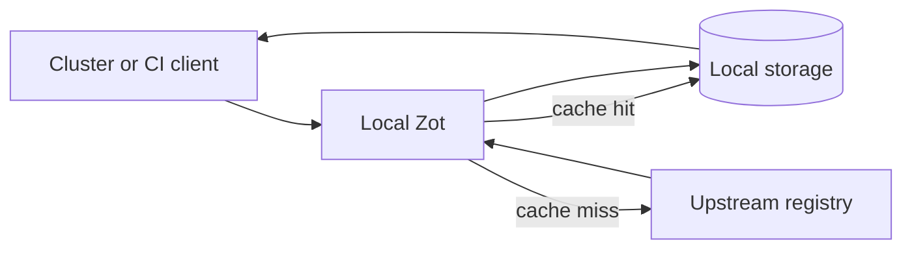

> **Toolkit Track** | Complexity: `[MEDIUM]` | Time: 50-60 minutes | Kubernetes: 1.35+

## Prerequisites

Before starting this module, you should be comfortable building and tagging container images, pushing images to a registry, reading basic JSON configuration, and using Kubernetes Deployments, Services, and PersistentVolumeClaims. You do not need to be a registry specialist, but you should already understand why a cluster pulls images before Pods can start and why a failed image pull can block an application rollout.

You should also know the difference between a container image and an OCI artifact. If that distinction is still fuzzy, think of OCI as the packaging model and the registry as the storage and delivery service. Container images are the most common artifact, but Helm charts, signatures, SBOMs, and attestations can use the same manifest-and-blob pattern.

## Learning Outcomes

After completing this module, you will be able to:

- **Evaluate** whether Zot, Harbor, or a managed registry best fits an edge, development, cache, or enterprise registry scenario.
- **Design** a Zot deployment that uses the right storage, authentication, mirroring, and operational settings for a constrained environment.
- **Debug** common Zot failures by tracing the request path from client command to OCI API endpoint to storage backend.
- **Implement** a runnable Zot proxy cache in Kubernetes and verify that images and OCI artifacts move through it correctly.
- **Compare** on-demand mirroring, scheduled synchronization, and direct push workflows using concrete trade-offs instead of tool preference.

## Why This Module Matters

The release manager was not trying to build a registry platform. She was trying to ship a security fix to a fleet of small warehouse clusters before the night shift started. The central registry was healthy, the CI pipeline had produced the image, and the deployment manifest was correct. The rollout still failed because each warehouse tried to pull the same large base image across a slow shared link, and half the sites timed out before the first Pod became ready.

The first proposed fix was to install the same enterprise registry used at headquarters. That looked reasonable on an architecture diagram, but it collapsed under operational reality. The warehouse devices had limited memory, no database administrator, and intermittent connectivity. A registry with several services, a database, a job runner, and a web UI was more platform than the edge needed. The teams needed local OCI distribution, not another system to babysit.

Zot matters because it gives you a different shape of answer. It is a small, OCI-native registry that can run as one process, store content on a filesystem or object store, mirror upstream registries, expose metrics, and handle common artifact types without requiring a database. That simplicity is not a toy property. In constrained locations, development clusters, air-gapped staging environments, and CI cache layers, fewer moving parts can mean faster recovery, clearer debugging, and lower operational cost.

This module does not teach Zot as a magic replacement for every registry. Harbor, cloud registries, and enterprise artifact platforms still make sense when you need project-level governance, deep UI workflows, integrated policy management, or managed durability. The goal is to help you choose deliberately, deploy Zot correctly, and operate it with enough confidence that "minimal" does not become "unmanaged."

## 1. Decide When a Minimal Registry Is the Right Tool

Zot is easiest to understand if you start with the problem it refuses to solve. It does not try to become a complete artifact management suite with every workflow built in. It focuses on the OCI Distribution API, local or remote storage, optional extensions, and a single configuration file. That narrower scope is why it can be attractive in places where a large registry stack would be technically impressive but operationally fragile.

The first design question is not "Can Zot store an image?" because the answer is yes for normal OCI workflows. The better question is "What failure mode am I trying to reduce?" If the failure mode is slow pulls from an upstream registry, Zot as a pull-through cache is a strong option. If the failure mode is an overloaded operations team at the edge, Zot's single-process model matters. If the failure mode is compliance reporting across hundreds of projects, a larger registry platform may still be a better primary system.

```ascii
REGISTRY DECISION MODEL
──────────────────────────────────────────────────────────────────────────────

        ┌──────────────────────────────────────────────────────────┐
        │               What problem must the registry solve?       │
        └──────────────────────────────────────────────────────────┘
                                  │
          ┌───────────────────────┼────────────────────────┐
          │                       │                        │
          ▼                       ▼                        ▼
┌──────────────────┐    ┌──────────────────────┐   ┌──────────────────────┐
│ Local pull speed │    │ Edge survivability   │   │ Enterprise workflow  │
│ and cache reuse  │    │ and low maintenance  │   │ and governance       │
└────────┬─────────┘    └──────────┬───────────┘   └──────────┬───────────┘
         │                         │                          │
         ▼                         ▼                          ▼
┌──────────────────┐    ┌──────────────────────┐   ┌──────────────────────┐
│ Zot proxy cache  │    │ Zot with persistent  │   │ Harbor, cloud        │
│ or local mirror  │    │ storage and sync     │   │ registry, or suite   │
└──────────────────┘    └──────────────────────┘   └──────────────────────┘
```

A useful mental model is to treat Zot as an OCI distribution appliance. An appliance is not less serious because it does fewer things; it is serious because the things it does are bounded and predictable. You still have to design storage, authentication, backup, and monitoring, but you do not have to operate a database, cache service, and multiple registry-side workers just to serve images.

| Scenario | Zot fit | Why the fit is strong or weak |
|----------|---------|-------------------------------|
| Developer laptop cache | Strong | Fast startup, low memory, and local filesystem storage make it easy to run and discard. |
| Edge Kubernetes cluster | Strong | A single process with persistent storage is easier to recover when staff and bandwidth are limited. |
| CI pull-through cache | Strong | On-demand mirroring can reduce repeated pulls from Docker Hub, GHCR, or an internal upstream. |
| Enterprise registry of record | Conditional | Zot can serve OCI content, but governance-heavy organizations may need Harbor or a managed service. |
| Multi-team UI workflow | Conditional | Zot has optional UI capability, but it is not primarily a project-management registry suite. |
| Compliance evidence hub | Weak alone | You usually need surrounding policy, signing, audit retention, and reporting systems. |

> **Pause and predict:** A remote site has one small server, a slow link to headquarters, and only needs a dozen application images plus their signatures. Before reading on, decide whether you would deploy a full Harbor stack at the site, a Zot mirror at the site, or no local registry at all. Write down the failure you are optimizing for, because that answer matters more than the tool name.

The decision table should push you toward a concrete operating model. If the site must keep running while disconnected, a local cache that only fetches content on first use may not be enough unless you pre-warm it. If the site receives frequent new releases, scheduled mirroring becomes more attractive. If the site only needs emergency fallback for already-used images, on-demand caching may be sufficient and cheaper to operate.

This is the first senior-level lesson: minimal components do not remove architecture decisions. They expose those decisions more clearly. You still decide what is authoritative, what is cached, what survives disk failure, who can push, who can delete, and how you know the registry is healthy. Zot simply gives you a smaller mechanism to reason about.

## 2. Trace Zot from Client Request to Storage

Zot implements the OCI Distribution API, which means standard clients such as Docker, containerd, nerdctl, skopeo, oras, Helm, and cosign can talk to it using familiar registry operations. A push is not one magical upload. It is a sequence of blob checks, blob uploads, and manifest writes. A pull is a sequence of manifest lookup, layer existence checks, and blob downloads. When you can trace that path, registry debugging becomes much less mysterious.

```ascii
ZOT REQUEST PATH
──────────────────────────────────────────────────────────────────────────────

┌────────────────┐      HTTPS       ┌──────────────────────────────────────┐
│ docker / helm  │ ───────────────▶ │              Zot process              │
│ oras / cosign  │                  │                                      │
└────────────────┘                  │  ┌────────────────────────────────┐  │
                                    │  │ OCI Distribution API handler   │  │
                                    │  │ /v2, manifests, blobs, tags    │  │
                                    │  └───────────────┬────────────────┘  │
                                    │                  │                   │
                                    │  ┌───────────────▼────────────────┐  │
                                    │  │ Policy, auth, logging, metrics │  │
                                    │  └───────────────┬────────────────┘  │
                                    │                  │                   │
                                    │  ┌───────────────▼────────────────┐  │
                                    │  │ Storage driver and extensions  │  │
                                    │  │ gc, scrub, search, sync, lint  │  │
                                    │  └───────────────┬────────────────┘  │
                                    └──────────────────┼───────────────────┘
                                                       │
                             ┌─────────────────────────┼────────────────────┐
                             ▼                         ▼                    ▼
                    ┌────────────────┐        ┌────────────────┐   ┌────────────────┐
                    │ Filesystem     │        │ S3-compatible  │   │ Other object   │
                    │ local volume   │        │ object store   │   │ storage modes  │
                    └────────────────┘        └────────────────┘   └────────────────┘
```

The `/v2/` endpoint is the registry handshake. Clients call it to confirm that the registry speaks the Distribution API and to discover authentication requirements. If that endpoint fails, do not start by debugging image tags. Start with network reachability, TLS, service routing, and whether Zot is reading the expected configuration. A registry that cannot answer `/v2/` cannot successfully complete a pull.

| Endpoint pattern | Typical method | What it means during operation |
|------------------|----------------|--------------------------------|
| `/v2/` | `GET` | The client is checking whether the registry API is reachable and whether auth is required. |
| `/v2/_catalog` | `GET` | A human or tool is listing repositories, usually for inspection or automation. |
| `/v2/{repo}/tags/list` | `GET` | A client is discovering named references under a repository. |
| `/v2/{repo}/manifests/{ref}` | `GET` or `PUT` | Pulls read manifests, while pushes write the final manifest after blobs exist. |
| `/v2/{repo}/blobs/{digest}` | `GET` or `HEAD` | Pulls fetch layers and configs by content digest rather than by tag. |
| `/v2/{repo}/blobs/uploads/` | `POST` | A push is starting an upload session for a missing blob. |
| `/v2/{repo}/blobs/uploads/{uuid}` | `PATCH` or `PUT` | A push is sending bytes and then committing the blob to a digest. |
| `/v2/_zot/ext/search` | `GET` | Zot extensions are being used for image, tag, referrer, or vulnerability queries. |

Zot's storage model follows the OCI idea that content is addressed by digest. Tags are convenient names, but the registry ultimately stores manifests and blobs by cryptographic identity. This matters when two repositories share a base layer. With deduplication enabled and a compatible filesystem, Zot can avoid storing identical content repeatedly. The operational benefit appears when many teams use the same base images or when an edge cache repeatedly receives related images.

```ascii
FILESYSTEM STORAGE SHAPE
──────────────────────────────────────────────────────────────────────────────

/var/lib/zot/
├── apps/
│   └── payment-api/
│       ├── blobs/
│       │   └── sha256/
│       │       ├── 0a1b2c...        # layer blob addressed by digest
│       │       ├── 3d4e5f...        # config blob addressed by digest
│       │       └── 6a7b8c...        # manifest content addressed by digest
│       └── index.json               # tag annotations point names to digests
├── base/
│   └── alpine/
│       ├── blobs/
│       │   └── sha256/
│       │       └── 9d0e1f...
│       └── index.json
└── _uploads/
    └── upload-session-id/
        └── data                     # temporary bytes before digest commit
```

A worked example makes the mechanism concrete. Suppose CI pushes `registry.example.net/apps/payment-api:2026.04.26`. The client first checks whether each layer blob already exists by digest. Zot only needs to receive missing blobs, so a rebuilt application image that reuses the same base image may upload only the new application layer and config. After the blobs are present, the client writes a manifest that references those digests, and the tag becomes a human-readable pointer to that manifest.

The same logic explains many confusing failures. If blob upload succeeds but manifest write fails with an authorization error, the user may have permission to create blobs but not update repository references. If a pull finds the manifest but fails on a layer, suspect storage corruption, an incomplete upload, or a broken backend. If a tag points to an unexpected digest, the problem is not "the layer changed by itself"; someone pushed a new manifest under the same tag.

> **Active check:** You push an image and see successful blob uploads followed by a `403` on the manifest `PUT`. Which part of the request path should you inspect first: storage capacity, access control actions, or Trivy database updates? The best first check is access control, because the final manifest write is the operation that turns uploaded content into a visible tag.

Zot also stores non-image OCI artifacts through the same underlying pattern. Helm charts, cosign signatures, SBOMs, and attestations are not special side databases. They are manifests, blobs, tags, annotations, and referrers. That uniformity is one reason Zot works well as a small artifact registry. The learner's mistake is to assume "minimal" means "image-only"; the registry is minimal in architecture, not in OCI artifact shape.

## 3. Deploy Zot from the Smallest Useful Configuration

A minimal Zot deployment has four decisions: which version to run, where to store content, which address and port to bind, and which clients are allowed to reach it. Everything else is an extension of those decisions. Starting small is not just convenient. It gives you a baseline that you can verify before adding TLS, authentication, mirroring, search, vulnerability scanning, or policies.

The following local run uses an explicit release variable instead of a moving `latest` tag. In production, pinning a version gives you rollback control and lets you test upgrades deliberately. The command uses `127.0.0.1` for local access because this repository standard avoids ambiguous `localhost` examples.

```bash
ZOT_VERSION="v2.1.14"

curl -fsSL -o zot "https://github.com/project-zot/zot/releases/download/${ZOT_VERSION}/zot-linux-amd64"
chmod +x zot

mkdir -p ./zot-data

cat > ./zot-config.json <<'EOF'
{
  "distSpecVersion": "1.1.0",
  "storage": {
    "rootDirectory": "./zot-data",
    "gc": true,
    "gcDelay": "1h",
    "gcInterval": "6h",
    "dedupe": true
  },
  "http": {
    "address": "127.0.0.1",
    "port": "5000"
  },
  "log": {
    "level": "info"
  }
}
EOF

./zot serve ./zot-config.json
```

In a second terminal, verify the registry handshake and push a small image. Docker treats loopback registries as local development registries, which makes this a practical first test before adding TLS. If your Docker daemon is configured more strictly, you may need to configure an insecure registry only for `127.0.0.1:5000` in your local daemon settings.

```bash
curl -fsS http://127.0.0.1:5000/v2/

docker pull alpine:3.20
docker tag alpine:3.20 127.0.0.1:5000/demo/alpine:3.20
docker push 127.0.0.1:5000/demo/alpine:3.20

curl -fsS http://127.0.0.1:5000/v2/_catalog | jq .
curl -fsS http://127.0.0.1:5000/v2/demo/alpine/tags/list | jq .
```

The Docker form is similarly direct when you want an isolated process and a named volume. This is useful for CI runners, ephemeral development machines, and quick integration tests. The trade-off is that you still need to decide how the container receives configuration, storage, TLS material, and credentials.

```bash
docker volume create zot-data

docker run --rm -d \
  --name zot \
  -p 127.0.0.1:5000:5000 \
  -v zot-data:/var/lib/zot \
  ghcr.io/project-zot/zot:v2.1.14

curl -fsS http://127.0.0.1:5000/v2/
```

A Kubernetes deployment should be only slightly more complicated than the local version. The registry needs a ConfigMap, a Deployment, a persistent volume, and a Service. For a real cluster, you would add an Ingress or Gateway with TLS, storage class selection, resource sizing, and authentication. The base object layout below is intentionally readable so that the request path and storage choices stay visible.

```yaml
apiVersion: v1
kind: Namespace
metadata:
  name: zot
---
apiVersion: v1
kind: ConfigMap
metadata:
  name: zot-config
  namespace: zot
data:
  config.json: |
    {
      "distSpecVersion": "1.1.0",
      "storage": {
        "rootDirectory": "/var/lib/zot",
        "gc": true,
        "gcDelay": "1h",
        "gcInterval": "6h",
        "dedupe": true
      },
      "http": {
        "address": "0.0.0.0",
        "port": "5000"
      },
      "log": {
        "level": "info"
      },
      "extensions": {
        "metrics": {
          "enable": true,
          "prometheus": {
            "path": "/metrics"
          }
        },
        "search": {
          "enable": true
        },
        "scrub": {
          "enable": true,
          "interval": "24h"
        }
      }
    }
---
apiVersion: apps/v1
kind: Deployment
metadata:
  name: zot
  namespace: zot
spec:
  replicas: 1
  selector:
    matchLabels:
      app.kubernetes.io/name: zot
  template:
    metadata:
      labels:
        app.kubernetes.io/name: zot
    spec:
      containers:
        - name: zot
          image: ghcr.io/project-zot/zot:v2.1.14
          args:
            - serve
            - /etc/zot/config.json
          ports:
            - name: registry
              containerPort: 5000
          resources:
            requests:
              cpu: 100m
              memory: 128Mi
            limits:
              cpu: 500m
              memory: 512Mi
          readinessProbe:
            httpGet:
              path: /v2/
              port: registry
            initialDelaySeconds: 5
            periodSeconds: 10
          livenessProbe:
            httpGet:
              path: /v2/
              port: registry
            initialDelaySeconds: 15
            periodSeconds: 20
          volumeMounts:
            - name: config
              mountPath: /etc/zot
            - name: data
              mountPath: /var/lib/zot
      volumes:
        - name: config
          configMap:
            name: zot-config
        - name: data
          persistentVolumeClaim:
            claimName: zot-data
---
apiVersion: v1
kind: PersistentVolumeClaim
metadata:
  name: zot-data
  namespace: zot
spec:
  accessModes:
    - ReadWriteOnce
  resources:
    requests:
      storage: 20Gi
---
apiVersion: v1
kind: Service
metadata:
  name: zot
  namespace: zot
spec:
  selector:
    app.kubernetes.io/name: zot
  ports:
    - name: registry
      port: 5000
      targetPort: registry
```

Apply the manifest and verify from both the Kubernetes control plane and your workstation. These commands use full `kubectl` for clarity. If your local workflow defines `alias k=kubectl`, you can use `k` after you confirm the alias exists, but the module keeps the full command in copyable examples.

```bash
kubectl apply -f zot-kubernetes.yaml
kubectl -n zot rollout status deployment/zot
kubectl -n zot get pod,svc,pvc

kubectl -n zot port-forward svc/zot 5000:5000 &
PF_PID=$!

curl -fsS http://127.0.0.1:5000/v2/
curl -fsS http://127.0.0.1:5000/metrics | head

kill "${PF_PID}"
```

> **Stop and think:** Why does this Kubernetes example use a PersistentVolumeClaim instead of `emptyDir`? If Zot is only a disposable cache in a test cluster, `emptyDir` may be acceptable. If it is an edge registry or a pre-warmed CI cache, losing the Pod should not erase the registry state, so a PVC is the safer default.

The important point is not that every Zot deployment looks exactly like this. The important point is that the deployment is easy to inspect. One Pod owns one registry process, one mounted configuration file, one storage path, and one Service. When something fails, you can usually find the failing layer without chasing a web of internal services.

## 4. Configure Storage, Authentication, and Policy Deliberately

Zot configuration is JSON, and the shape of the file mirrors the registry responsibilities: storage, HTTP behavior, logging, and extensions. A configuration file can be small, but production configuration should not be careless. The absence of a database does not remove the need for durable storage, access control, TLS termination, retention thinking, or observability.

```json
{
  "distSpecVersion": "1.1.0",
  "storage": {
    "rootDirectory": "/var/lib/zot",
    "dedupe": true,
    "gc": true,
    "gcDelay": "1h",
    "gcInterval": "6h",
    "commit": true,
    "subPaths": {
      "/production": {
        "rootDirectory": "/mnt/fast-ssd/production",
        "dedupe": true
      },
      "/cache": {
        "rootDirectory": "/mnt/capacity-disk/cache",
        "dedupe": false
      }
    }
  },
  "http": {
    "address": "0.0.0.0",
    "port": "5000",
    "realm": "zot",
    "tls": {
      "cert": "/certs/tls.crt",
      "key": "/certs/tls.key"
    },
    "auth": {
      "htpasswd": {
        "path": "/etc/zot/htpasswd"
      }
    },
    "accessControl": {
      "repositories": {
        "**": {
          "anonymousPolicy": ["read"],
          "policies": [
            {
              "users": ["registry-admin"],
              "actions": ["read", "create", "update", "delete"]
            },
            {
              "users": ["ci-writer"],
              "actions": ["read", "create", "update"]
            }
          ]
        },
        "production/**": {
          "policies": [
            {
              "users": ["release-manager"],
              "actions": ["read", "create", "update", "delete"]
            },
            {
              "users": ["developer"],
              "actions": ["read"]
            }
          ]
        }
      }
    }
  },
  "log": {
    "level": "info",
    "output": "/var/log/zot/zot.log",
    "audit": "/var/log/zot/audit.log"
  },
  "extensions": {
    "metrics": {
      "enable": true,
      "prometheus": {
        "path": "/metrics"
      }
    },
    "search": {
      "enable": true,
      "cve": {
        "updateInterval": "2h",
        "trivy": {
          "DBRepository": "ghcr.io/aquasecurity/trivy-db"
        }
      }
    },
    "scrub": {
      "enable": true,
      "interval": "24h"
    },
    "lint": {
      "enable": true,
      "mandatoryAnnotations": [
        "org.opencontainers.image.source",
        "org.opencontainers.image.licenses"
      ]
    }
  }
}
```

Storage is the first production decision because it defines durability and performance. A local filesystem is simple and fast, but it ties registry state to the volume lifecycle. Object storage can fit larger or shared deployments, but it introduces network dependency and backend-specific operational work. Subpaths let you route repository prefixes to different storage roots, which can be useful when production images deserve faster or more durable storage than disposable cache content.

Authentication answers "who are you?" while access control answers "what may you do here?" For small teams, htpasswd can be a pragmatic starting point. For larger organizations, LDAP or OpenID Connect may fit existing identity systems better. The policy model should be designed around repository prefixes and actions rather than around vague roles, because registry actions are concrete: read, create, update, and delete.

```bash
mkdir -p ./auth

htpasswd -Bbn registry-admin 'replace-with-a-long-secret' > ./auth/htpasswd
htpasswd -Bbn ci-writer 'replace-with-another-long-secret' >> ./auth/htpasswd
htpasswd -Bbn developer 'replace-with-a-read-secret' >> ./auth/htpasswd
```

| Policy action | What the user can do | Risk if granted too broadly |
|---------------|----------------------|-----------------------------|
| `read` | Pull manifests and blobs from matching repositories. | Private images, signatures, or SBOMs may leak to unintended users. |
| `create` | Create new repositories or upload new content where no tag exists yet. | Users may introduce unreviewed images into trusted namespaces. |
| `update` | Move or replace tags by writing new manifests. | Mutable tags can be overwritten and deployments may pull unexpected content. |
| `delete` | Remove manifests or blobs according to registry behavior and garbage collection. | A mistaken delete can break rollouts or remove evidence needed for audit. |

Here is a worked example. A platform team wants developers to pull all images, CI to publish to `staging/**`, and release managers to publish to `production/**`. A weak policy would give CI delete access everywhere because "CI needs to push." A better policy gives CI `read`, `create`, and `update` only where it publishes, leaves delete to a small release group, and treats production as a separate namespace with stricter permissions.

```json
{
  "http": {
    "accessControl": {
      "repositories": {
        "**": {
          "anonymousPolicy": [],
          "policies": [
            {
              "users": ["developer"],
              "actions": ["read"]
            }
          ]
        },
        "staging/**": {
          "policies": [
            {
              "users": ["ci-writer"],
              "actions": ["read", "create", "update"]
            },
            {
              "users": ["developer"],
              "actions": ["read"]
            }
          ]
        },
        "production/**": {
          "policies": [
            {
              "users": ["release-manager"],
              "actions": ["read", "create", "update", "delete"]
            },
            {
              "users": ["developer", "ci-writer"],
              "actions": ["read"]
            }
          ]
        }
      }
    }
  }
}
```

> **Active check:** Your team asks for a "CI user that can publish releases." Before granting broad access, map the exact repository prefix and the exact actions. If the CI system should never remove production images, its policy should not include `delete`, even if deleting would make cleanup scripts easier.

Operational extensions should be treated as control loops. Garbage collection reclaims unreferenced content after tags or manifests are removed. Scrub checks stored content for integrity problems. Metrics make request volume, status codes, and storage behavior visible. Search and CVE scanning add useful inspection capabilities, but they also consume resources and may require database updates. Turning on every extension without a purpose is not maturity; it is an untested configuration.

A senior operator also plans backup and restore before the first incident. If Zot uses filesystem storage, the backup unit is the configured storage root plus the configuration and authentication material. If Zot uses object storage, the backup and versioning strategy may belong partly to the object store. In both cases, test a restore by starting a separate Zot instance against restored data and pulling a known digest, not merely by checking that backup files exist.

## 5. Mirror, Cache, and Move OCI Artifacts

Mirroring is where Zot often earns its place. The registry can operate as a pull-through cache, a scheduled mirror, or a downstream replica of another registry. These modes sound similar, but they answer different operational questions. On-demand caching optimizes bandwidth by fetching only what clients request. Scheduled mirroring optimizes readiness by fetching content before clients ask for it. Zot-to-Zot replication can place content closer to clusters while keeping an upstream registry authoritative.



An on-demand cache is useful when the requested set of images is not known in advance or when storage is constrained. The first pull pays the upstream cost, and later pulls use local storage. The trap is assuming that on-demand cache automatically solves outages. If the image has not been requested before the outage, the local registry cannot invent it. For disconnected sites, pre-warming important images or combining on-demand and polling is usually safer.

```json
{
  "extensions": {
    "sync": {
      "enable": true,
      "registries": [
        {
          "urls": ["https://registry-1.docker.io"],
          "onDemand": true,
          "pollInterval": "6h",
          "tlsVerify": true,
          "maxRetries": 3,
          "retryDelay": "5m",
          "content": [
            {
              "prefix": "library/**"
            }
          ]
        },
        {
          "urls": ["https://ghcr.io"],
          "onDemand": true,
          "tlsVerify": true,
          "content": [
            {
              "prefix": "**"
            }
          ]
        }
      ]
    }
  }
}
```

Scheduled mirroring is useful when the registry must be ready before clients pull. You choose specific repositories and tags, then Zot polls the upstream and synchronizes matching content. This mode can consume more storage because it downloads content whether or not a local client has requested it. In return, it reduces surprise during maintenance windows, emergency rollouts, and network outages.

```json
{
  "extensions": {
    "sync": {
      "enable": true,
      "registries": [
        {
          "urls": ["https://registry-1.docker.io"],
          "onDemand": false,
          "pollInterval": "6h",
          "tlsVerify": true,
          "content": [
            {
              "prefix": "library/nginx",
              "tags": {
                "regex": "^1\\.2[0-9].*"
              }
            },
            {
              "prefix": "library/alpine",
              "tags": {
                "regex": "^3\\.(19|20).*"
              }
            }
          ]
        }
      ]
    }
  }
}
```

```ascii
ZOT-TO-ZOT EDGE REPLICATION
──────────────────────────────────────────────────────────────────────────────

┌──────────────────────────────────────┐
│ Headquarters                          │
│                                      │
│  ┌────────────────────────────────┐  │
│  │ Authoritative registry         │  │
│  │ Harbor, cloud registry, or Zot  │  │
│  └────────────────┬───────────────┘  │
└───────────────────┼──────────────────┘
                    │ scheduled or on-demand sync
        ┌───────────┼───────────────────────────────┐
        │           │                               │
        ▼           ▼                               ▼
┌────────────┐ ┌────────────┐                 ┌────────────┐
│ Site A Zot │ │ Site B Zot │                 │ Site N Zot │
│ local PVC  │ │ local PVC  │                 │ local PVC  │
└─────┬──────┘ └─────┬──────┘                 └─────┬──────┘
      │              │                              │
      ▼              ▼                              ▼
┌────────────┐ ┌────────────┐                 ┌────────────┐
│ Edge K8s   │ │ Edge K8s   │                 │ Edge K8s   │
│ pulls here │ │ pulls here │                 │ pulls here │
└────────────┘ └────────────┘                 └────────────┘
```

> **Pause and predict:** A site has never pulled `library/postgres:16` through its local Zot cache. The upstream network link fails, and a deployment now tries to pull that tag from the local cache. Predict whether the deployment starts, then explain which mirroring mode would have changed the outcome.

OCI artifacts beyond images use the same distribution foundation, but each tool has its own command shape. Helm stores charts as OCI artifacts. Cosign stores signatures and attestations as OCI-related content. SBOM tools can attach documents to images. Zot's job is to store and serve the artifacts according to OCI distribution behavior; your job is to make sure the client workflow and access policy allow the right writes.

```bash
helm create payment-chart
helm package payment-chart

helm registry login 127.0.0.1:5000
helm push payment-chart-0.1.0.tgz oci://127.0.0.1:5000/charts

helm pull oci://127.0.0.1:5000/charts/payment-chart --version 0.1.0
curl -fsS http://127.0.0.1:5000/v2/charts/payment-chart/tags/list | jq .
```

```bash
cosign generate-key-pair

docker pull alpine:3.20
docker tag alpine:3.20 127.0.0.1:5000/demo/alpine:3.20
docker push 127.0.0.1:5000/demo/alpine:3.20

COSIGN_PASSWORD="" cosign sign --key cosign.key 127.0.0.1:5000/demo/alpine:3.20
COSIGN_PASSWORD="" cosign verify --key cosign.pub 127.0.0.1:5000/demo/alpine:3.20
```

```bash
syft 127.0.0.1:5000/demo/alpine:3.20 -o spdx-json > alpine-sbom.spdx.json
COSIGN_PASSWORD="" cosign attach sbom --sbom alpine-sbom.spdx.json 127.0.0.1:5000/demo/alpine:3.20
cosign download sbom 127.0.0.1:5000/demo/alpine:3.20 > downloaded-sbom.spdx.json
```

These commands also show why registry policy needs to account for referrers and related artifacts. If CI can push an image but cannot push its signature or SBOM, the release may appear complete to Kubernetes but incomplete to your supply-chain controls. When you design repository prefixes, think about the image and its evidence as a bundle. The bundle must move together, be retained together, and be discoverable during an incident.

## 6. Operate Zot Under Failure

Operating Zot well starts with a simple runbook: check the API, check the logs, check storage, check policy, and check upstream dependencies. Because the deployment has fewer components, you can keep the diagnostic path short. The discipline is to avoid jumping straight to the most interesting explanation. Many registry incidents are ordinary: expired certificates, full disks, incorrect repository prefixes, missing credentials, or upstream rate limits.

```ascii
ZOT TROUBLESHOOTING FLOW
──────────────────────────────────────────────────────────────────────────────

┌───────────────────────────────┐
│ Client pull or push fails      │
└───────────────┬───────────────┘
                │
                ▼
┌───────────────────────────────┐
│ Does /v2/ respond successfully?│
└───────┬─────────────────┬─────┘
        │ yes             │ no
        ▼                 ▼
┌──────────────────┐  ┌─────────────────────────────┐
│ Check auth and   │  │ Check Pod, Service, Ingress, │
│ repository policy│  │ TLS, network, and config     │
└────────┬─────────┘  └─────────────────────────────┘
         │
         ▼
┌───────────────────────────────┐
│ Does the manifest exist?       │
└───────┬─────────────────┬─────┘
        │ yes             │ no
        ▼                 ▼
┌──────────────────┐  ┌─────────────────────────────┐
│ Check blob fetch,│  │ Check tag, sync rules, push  │
│ storage, scrub   │  │ completion, and upstream     │
└──────────────────┘  └─────────────────────────────┘
```

The first command in most investigations is the registry handshake. If this fails, the client cannot proceed. In Kubernetes, combine `kubectl` object status with a direct port-forward to remove Ingress or Gateway complexity from the first pass. Once `/v2/` works through port-forward but not through the external route, you have narrowed the problem to routing, TLS, DNS, or edge proxy configuration.

```bash
kubectl -n zot get deploy,pod,svc,pvc
kubectl -n zot logs deploy/zot --tail=80

kubectl -n zot port-forward svc/zot 5000:5000 &
PF_PID=$!

curl -v http://127.0.0.1:5000/v2/
curl -fsS http://127.0.0.1:5000/v2/_catalog | jq .

kill "${PF_PID}"
```

For push failures, inspect whether the error occurs during blob upload or manifest write. Blob upload errors often point to storage capacity, upload limits, network interruption, or backend write permissions. Manifest errors often point to repository policy, tag immutability expectations, or a client pushing to a repository prefix that does not match the configured policy. This distinction saves time because the final error line from a client may hide several successful earlier steps.

For pull failures, inspect whether the manifest is missing or whether a referenced blob cannot be retrieved. A missing manifest usually means wrong tag, wrong repository name, unsuccessful sync, or failed push. A missing blob after the manifest exists is more serious because the registry has metadata that points to content it cannot serve. That is where scrub results, storage logs, and recent deletion or garbage collection activity become important.

Metrics make this operational model visible. A healthy registry should show successful request rates, expected storage growth, and predictable error patterns during normal client use. Sudden increases in `401`, `403`, `404`, or `5xx` responses point to different failure classes. Authentication failures are not the same as missing tags, and missing tags are not the same as storage backend errors.

```bash
curl -fsS http://127.0.0.1:5000/metrics | grep -E 'zot_|http_' | head -n 30

curl -fsS -G \
  --data-urlencode 'query={ ImageList { Name Tags } }' \
  http://127.0.0.1:5000/v2/_zot/ext/search | jq .
```

A realistic edge design also needs a recovery story. If a warehouse registry runs on a single small server, high availability may be less important than quick replacement. The operational question becomes: can a technician restore the configuration, attach or restore the storage, start Zot, and verify known images without understanding every registry detail? Zot's small footprint helps, but only if the team has tested that recovery path.

Consider the warehouse story from the opening. The successful design used a central registry as the source of truth and local Zot instances as site caches. Critical images were pre-warmed before planned rollouts, and on-demand mirroring handled less common images. The local clusters pulled from the local registry so that repeated restarts did not repeatedly cross the wide-area link. When a site lost connectivity, existing workloads could still restart because the needed images were already local.

The lesson is not that every remote site should run Zot. The lesson is that registry architecture should match the operational constraint. A headquarters platform may need enterprise workflow features. A warehouse may need a small, restartable, observable cache. A CI runner may need a disposable registry that speeds up repeated pulls. Treat Zot as a tool for those shapes, then design the missing pieces around it instead of pretending minimal software removes operational responsibility.

## Did You Know?

- **OCI referrers make evidence discoverable**: Signatures, attestations, and SBOMs can be associated with an image digest, which helps tooling find supply-chain evidence without inventing a separate naming convention.
- **Tags are not content identity**: A tag can move to a different manifest, but a digest identifies specific content, which is why incident response and release promotion should record digests.
- **On-demand cache is not the same as offline readiness**: A pull-through cache only serves content it has already fetched, so critical images should be pre-warmed before planned disconnection.
- **A small registry can still need serious backups**: Zot has fewer services to recover, but the stored blobs, indexes, configuration, credentials, and TLS material are still production state.

## Common Mistakes

| Mistake | Problem | Better approach |
|---------|---------|-----------------|
| Treating Zot as disposable when it is the site registry | A Pod restart or node failure can erase the only local copy of needed images. | Use a PersistentVolumeClaim, backup the storage root, and test restore with a known digest. |
| Enabling on-demand sync and assuming outages are solved | Images that were never requested are not present when the upstream link disappears. | Pre-warm critical repositories or combine scheduled polling with on-demand caching. |
| Granting CI `delete` because CI needs to push | A compromised or misconfigured pipeline can remove production references or evidence artifacts. | Grant only `read`, `create`, and `update` on the exact repository prefixes CI owns. |
| Debugging every pull failure as a network issue | Auth failures, missing manifests, and missing blobs have different causes and fixes. | Trace `/v2/`, manifest lookup, blob fetch, and policy decisions separately. |
| Leaving TLS out of a shared environment | Credentials and image metadata can cross the network unprotected. | Terminate TLS at Zot, an Ingress, or a trusted gateway before exposing the registry. |
| Ignoring metrics until an incident | You cannot distinguish normal cache misses from growing error rates without baselines. | Scrape `/metrics`, alert on error classes, and track storage growth. |
| Forgetting that signatures and SBOMs are part of the release | Images may deploy while supply-chain checks fail because evidence artifacts were not pushed or retained. | Push, verify, and retain image digests, signatures, attestations, and SBOMs as one release bundle. |

## Quiz

<details>
<summary>1. Your edge cluster uses Zot as an on-demand cache. During an internet outage, a Deployment using an image pulled last week starts successfully, but a new Deployment using a different image fails. What do you check and what design change would reduce this risk next time?</summary>

The successful Deployment used content that was already cached locally, while the new Deployment requested content Zot had never fetched. Check the local catalog, the requested repository and tag, Zot sync logs, and whether the upstream was reachable when the first request occurred. To reduce the risk, pre-warm critical images with scheduled mirroring or a release-time pull job before the outage window, and record the digests that must exist at the site.
</details>

<details>
<summary>2. CI can upload layers to `production/payment-api`, but the final push fails when writing the manifest. Storage has free space and Zot is healthy. Which configuration area is most likely wrong, and why?</summary>

The most likely issue is access control for the repository prefix. Blob upload and manifest write are separate registry operations, and the final manifest write is what creates or updates the visible tag. Inspect the policy for `production/**` and confirm the CI user has the required `create` or `update` action. Do not start by changing storage settings when the failure occurs at the authorization boundary.
</details>

<details>
<summary>3. A team wants one Zot instance to store production releases on fast storage and cache content on cheaper storage. How would you design the storage layout, and what operational risk remains?</summary>

Use storage `subPaths` so a prefix such as `/production` points to the faster and more durable storage root while `/cache` points to capacity-oriented storage. Keep dedupe and garbage collection settings appropriate for each path. The remaining risk is operational complexity: backup, restore, monitoring, and capacity alerts must cover both storage roots, and repository naming must consistently route content to the intended path.
</details>

<details>
<summary>4. Developers can pull `staging/app:latest`, but a production rollout fails with `403` when pulling `production/app:2026.04.26`. The same user credentials are used in both cases. What should you compare before changing the Deployment?</summary>

Compare the Zot access-control rules for `staging/**`, `production/**`, and the catch-all pattern. A `403` means the registry understood the request and rejected the action, so the repository policy is the first suspect. The Deployment image name may still be correct. Changing tags or restarting Pods will not help if the user or group lacks `read` on the production prefix.
</details>

<details>
<summary>5. A vulnerability scan shows a fixed base image is available upstream, but local pulls through Zot still return the older digest. What cache and sync behavior should you investigate?</summary>

Investigate whether the local registry is serving a cached tag and whether polling is configured to refresh cached content. On-demand caching fetches content when requested, but it does not automatically guarantee immediate freshness for mutable tags. Check `pollInterval`, sync logs, upstream tag digest, and the local manifest digest. For release-critical workflows, prefer immutable digests or promotion tags that are updated deliberately.
</details>

<details>
<summary>6. Your organization signs images and attaches SBOMs, but only the image is visible after a release push to Zot. The image deploys, yet the policy gate fails. What workflow gap do you look for?</summary>

Look for missing push permissions or missing client steps for the related OCI artifacts. Signatures and SBOMs are separate artifacts associated with the image digest, so the release pipeline must push them and the registry policy must allow those writes. Verify cosign or SBOM attachment commands, inspect referrers or tags as supported by the tooling, and make sure retention rules do not remove evidence before the policy gate reads it.
</details>

<details>
<summary>7. A single-node Zot registry at a warehouse has a corrupted disk. The Pod restarts, `/v2/` responds, but several known image pulls fail on blob download. What is the correct recovery posture?</summary>

Treat this as a storage integrity incident rather than a generic registry restart issue. Check scrub results, storage backend logs, and whether the affected digests exist in the storage root. Restore from backup if the blobs are damaged or missing, then verify by pulling known digests. If the registry is a downstream cache and the upstream is reachable, re-syncing may repair cached content, but production releases should still have a tested backup path.
</details>

## Hands-On Exercise: Deploy and Inspect Zot as a Proxy Cache

### Objective

Deploy Zot into a local Kubernetes cluster as a small proxy cache, verify the OCI API path, pull an image through the cache, inspect metrics, and reason about what would fail during an upstream outage. This exercise is intentionally focused on the registry behavior rather than on Ingress, TLS automation, or production identity integration.

### Lab assumptions

The commands assume you have `kind`, `kubectl`, `docker`, `curl`, and `jq` installed on your workstation. They use `127.0.0.1:5000` through a port-forward so that Docker can talk to the registry from the host. For a production cluster, you would expose Zot through a proper internal DNS name and TLS endpoint instead of relying on port-forwarding.

### Step 1: Create a fresh kind cluster

```bash
kind create cluster --name zot-lab

kubectl cluster-info --context kind-zot-lab
kubectl get nodes
```

### Step 2: Deploy Zot with on-demand sync and metrics

```bash
cat > zot-lab.yaml <<'EOF'
apiVersion: v1
kind: Namespace
metadata:
  name: zot
---
apiVersion: v1
kind: ConfigMap
metadata:
  name: zot-config
  namespace: zot
data:
  config.json: |
    {
      "distSpecVersion": "1.1.0",
      "storage": {
        "rootDirectory": "/var/lib/zot",
        "gc": true,
        "gcDelay": "1h",
        "gcInterval": "6h",
        "dedupe": true
      },
      "http": {
        "address": "0.0.0.0",
        "port": "5000"
      },
      "log": {
        "level": "info"
      },
      "extensions": {
        "metrics": {
          "enable": true,
          "prometheus": {
            "path": "/metrics"
          }
        },
        "search": {
          "enable": true
        },
        "sync": {
          "enable": true,
          "registries": [
            {
              "urls": ["https://registry-1.docker.io"],
              "onDemand": true,
              "pollInterval": "6h",
              "tlsVerify": true,
              "maxRetries": 3,
              "retryDelay": "5m",
              "content": [
                {
                  "prefix": "library/**"
                }
              ]
            }
          ]
        }
      }
    }
---
apiVersion: apps/v1
kind: Deployment
metadata:
  name: zot
  namespace: zot
spec:
  replicas: 1
  selector:
    matchLabels:
      app.kubernetes.io/name: zot
  template:
    metadata:
      labels:
        app.kubernetes.io/name: zot
    spec:
      containers:
        - name: zot
          image: ghcr.io/project-zot/zot:v2.1.14
          args:
            - serve
            - /etc/zot/config.json
          ports:
            - name: registry
              containerPort: 5000
          readinessProbe:
            httpGet:
              path: /v2/
              port: registry
            initialDelaySeconds: 5
            periodSeconds: 10
          livenessProbe:
            httpGet:
              path: /v2/
              port: registry
            initialDelaySeconds: 15
            periodSeconds: 20
          resources:
            requests:
              cpu: 100m
              memory: 128Mi
            limits:
              cpu: 500m
              memory: 512Mi
          volumeMounts:
            - name: config
              mountPath: /etc/zot
            - name: data
              mountPath: /var/lib/zot
      volumes:
        - name: config
          configMap:
            name: zot-config
        - name: data
          emptyDir: {}
---
apiVersion: v1
kind: Service
metadata:
  name: zot
  namespace: zot
spec:
  selector:
    app.kubernetes.io/name: zot
  ports:
    - name: registry
      port: 5000
      targetPort: registry
EOF

kubectl apply -f zot-lab.yaml
kubectl -n zot rollout status deployment/zot
kubectl -n zot get pod,svc
```

### Step 3: Verify the registry API and keep a port-forward open

```bash
kubectl -n zot port-forward svc/zot 5000:5000 &
PF_PID=$!

sleep 3

curl -fsS http://127.0.0.1:5000/v2/
curl -fsS http://127.0.0.1:5000/v2/_catalog | jq .
```

### Step 4: Pull through the cache and compare repeated pulls

```bash
docker image rm 127.0.0.1:5000/library/alpine:3.20 || true
docker image rm alpine:3.20 || true

echo "First pull through Zot. This may fetch from Docker Hub."
time docker pull 127.0.0.1:5000/library/alpine:3.20

echo "Catalog after first pull."
curl -fsS http://127.0.0.1:5000/v2/_catalog | jq .
curl -fsS http://127.0.0.1:5000/v2/library/alpine/tags/list | jq .

docker image rm 127.0.0.1:5000/library/alpine:3.20

echo "Second pull through Zot. This should be served from local cache if the content is present."
time docker pull 127.0.0.1:5000/library/alpine:3.20
```

### Step 5: Inspect metrics, logs, and searchable content

```bash
curl -fsS http://127.0.0.1:5000/metrics | grep -E 'zot_|http_' | head -n 30

kubectl -n zot logs deploy/zot --tail=80

curl -fsS -G \
  --data-urlencode 'query={ ImageList { Name Tags } }' \
  http://127.0.0.1:5000/v2/_zot/ext/search | jq .
```

### Step 6: Reason about offline behavior before changing anything

Before simulating network loss, answer this in your notes: which images can Zot serve if Docker Hub becomes unreachable right now? Your answer should name the repository, tag, and whether the content has already been pulled through the cache. If you cannot prove the image exists locally through the catalog, tag list, or a successful pull, you should not assume it is outage-ready.

```bash
curl -fsS http://127.0.0.1:5000/v2/_catalog | jq .
curl -fsS http://127.0.0.1:5000/v2/library/alpine/tags/list | jq .
docker pull 127.0.0.1:5000/library/alpine:3.20
```

### Step 7: Optional extension for senior practice

Modify the ConfigMap to add a second mirrored repository rule for `library/nginx`, restart the Deployment, and pre-warm the image by pulling it once through Zot. Then explain whether that design is still on-demand caching or whether you have created a manual pre-warm process on top of on-demand caching. The best answer distinguishes the registry configuration from the release process that intentionally fills the cache before a failure.

```bash
docker pull 127.0.0.1:5000/library/nginx:1.27-alpine

curl -fsS http://127.0.0.1:5000/v2/library/nginx/tags/list | jq .
```

### Success Criteria

- [ ] The `zot` Namespace, Deployment, Service, and Pod exist in the `zot-lab` kind cluster.
- [ ] `curl http://127.0.0.1:5000/v2/` succeeds through the port-forward.
- [ ] Pulling `127.0.0.1:5000/library/alpine:3.20` succeeds through Zot.
- [ ] The catalog or tag list shows the cached repository after the pull.
- [ ] `/metrics` returns registry metrics that can be scraped by Prometheus-compatible tooling.
- [ ] You can explain why an image that was never pulled may fail during an upstream outage.
- [ ] You can identify whether a future failure is more likely to involve routing, policy, storage, or sync behavior.

### Cleanup

```bash
kill "${PF_PID}" || true
kind delete cluster --name zot-lab
rm -f zot-lab.yaml
```

## Next Module

Continue to [Module 13.3: Dragonfly](../module-13.3-dragonfly/) to learn how peer-to-peer image distribution changes the design problem when the bottleneck is massive fan-out rather than local registry simplicity.
