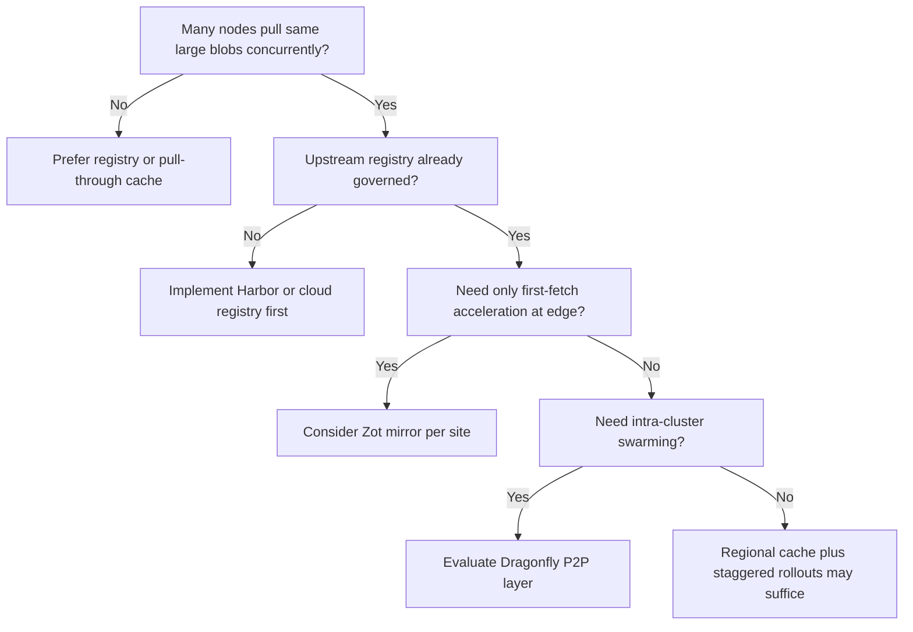

> **Toolkit Track** | Complexity: `[COMPLEX]` | Time: 45-50 minutes | Kubernetes: 1.35+

## Prerequisites

Before starting this module, you should understand what a container registry does and how image pulls fit into a Kubernetes rollout. If you have not yet worked through the registry modules in this toolkit, read [Module 13.1: Harbor](../module-13.1-harbor/) for enterprise registry governance and [Module 13.2: Zot](../module-13.2-zot/) for minimal OCI-native storage. You should also be comfortable with Kubernetes DaemonSets, Services, and basic cluster networking, because Dragonfly installs node agents and changes how pull traffic flows across your fleet.

## What You'll Be Able to Do

After completing this module, you will be able to:

- **Deploy Dragonfly's P2P distribution layer to accelerate container image pulls across large clusters**
- **Configure peer-to-peer scheduling policies and seed node strategies for optimal distribution**
- **Integrate Dragonfly with existing registries (Harbor, Zot, ECR) as a transparent distribution layer**
- **Monitor P2P distribution metrics and optimize cache hit rates for large-scale deployments**

## Why This Module Matters

**Hypothetical scenario:** A platform team schedules a rolling update of a payment service across eight hundred worker nodes during a maintenance window. The new container image is modest by modern standards—roughly six hundred megabytes of layer content once dependencies are counted—but every node must fetch it before Pods become ready. The central Harbor registry in [Module 13.1](../module-13.1-harbor/) is healthy, vulnerability scanning completed, and CI promoted the digest correctly. Within minutes, registry ingress saturates, pull latencies spike past two minutes, and three hundred nodes still report `ImagePullBackOff` when the window closes. The failure is not bad image content; it is physics. Eight hundred nodes multiplied by six hundred megabytes is nearly half a terabyte of duplicate transfer aimed at a single origin unless something reshapes the traffic pattern.

That scenario is the thundering herd problem in registry clothing. Harbor and Zot solve **where** images live, who may push them, and how you govern supply-chain evidence. Dragonfly solves **how** those images reach many nodes without repeatedly crushing the origin. It is a distribution layer, not a replacement registry. The registry remains authoritative for storage, scanning, signing, and policy. Dragonfly sits between the container runtime and that upstream, intercepting blob downloads, splitting content into pieces, and coordinating peer-to-peer transfers so the registry sees a small number of back-to-source pulls instead of one per node.

This matters because large fleets, bursty rollouts, edge clusters on constrained links, and AI platforms moving multi-gigabyte model artifacts all share the same structural risk: duplicate downloads scale linearly with node count while registry capacity does not. A pull-through cache at each site helps, as described in the Zot module, but a cache still centralizes fetch work the first time content appears. Peer-to-peer distribution spreads that first-fetch work across the cluster itself. Dragonfly is the CNCF Graduated project that implements this pattern for cloud native environments, and understanding it helps you decide when P2P acceleration belongs in your architecture versus when simpler mirroring is enough.

The hypothetical numbers are intentionally round so you can reason about orders of magnitude without pretending a fictional company donated telemetry. What matters is the multiplication: nodes times layer bytes times synchronization factor. When that product routinely exceeds origin throughput during planned change windows, you need a distribution strategy rather than only a larger registry VM. Dragonfly does not remove the need for registry capacity planning upstream; it prevents every worker from exercising that capacity simultaneously for identical content.

## 1. Separate the Registry from the Distribution Layer

The most expensive misunderstanding in this space is treating Dragonfly as another registry competing with Harbor or Zot. Registries implement the [OCI Distribution specification](https://github.com/opencontainers/distribution-spec/blob/main/spec.md): repositories, manifests, blobs, authentication, and garbage collection semantics. Harbor adds enterprise workflow, scanning, replication, and RBAC. Zot offers a compact OCI-native server for edge and cache scenarios. Dragonfly does not replace those responsibilities. It accelerates delivery of content that already exists upstream, whether that upstream is Harbor at headquarters, Zot at a warehouse, Amazon ECR, Google Artifact Registry, or a public hub.

Think of the split in terms of authority versus acceleration. The registry is authoritative: it decides which digests exist, which credentials may read them, and which policies apply before content is promoted. The distribution layer is accelerative: it decides how bytes move from authority to runtime with minimal duplicate work. When you integrate the two correctly, security properties remain anchored at the registry while performance properties improve across the fleet. When you confuse them, teams either duplicate storage unnecessarily or bypass governance trying to make a P2P mesh act like a source of truth.

Dragonfly's transparent integration model is what preserves that boundary. Container runtimes continue to request images by familiar registry hostnames. Dfdaemon on each node proxies those requests, participates in piece scheduling, and falls back to direct upstream pulls when peers cannot satisfy a request. Operators do not re-tag images into a separate P2P namespace, and developers do not change Dockerfiles for basic acceleration. The mental model should feel similar to a registry mirror, except the mirror fans out through peers instead of only through local disk on one cache host.

Supply-chain reviewers sometimes worry that P2P sharing weakens immutability guarantees. In a well-designed deployment it does not, because manifests and digests still originate from the trusted registry APIs. Dfdaemon verifies piece integrity within its protocol and hands containerd the same blob a direct pull would have produced. Your scanning and admission policies should continue to reference digests promoted in Harbor projects, not informal tags observed on worker disks. Dragonfly changes transport economics, not the definition of what constitutes an approved artifact.

Cross-linking the toolkit modules makes the design choice concrete. If your primary need is project RBAC, vulnerability gates, and replication between regions, start with Harbor. If your primary need is a small OCI cache that survives intermittent connectivity at the edge, start with Zot. If your primary need is reducing duplicate bytes during simultaneous pulls across hundreds or thousands of nodes that already trust an upstream registry, add Dragonfly as a layer in front of that upstream. Many production platforms use all three shapes in different places: Harbor as system of record, Zot as site cache, Dragonfly as intra-cluster accelerator during large rollouts.

Platform engineers who skip this separation often recreate storage silos. They configure Dragonfly to proxy public hub content, then quietly promote the mesh cache into an informal registry of record because teams discover images there first. That shortcut collapses provenance trails: nobody knows which digest Harbor authoritative storage holds versus which digest happened to linger on a worker SSD. The durable pattern keeps promotion, scanning, and signing at the registry while Dragonfly caches and shares bytes that already passed those gates. Runtime teams get faster rollouts without asking security teams to accept a second source of truth.

## 2. Diagnose the Thundering Herd Before Adding Complexity

Peer-to-peer distribution is powerful, but it is not free complexity. Before you install mesh agents on every node, quantify whether your environment actually exhibits thundering herd behavior or merely occasional slow pulls. The signature of a herd is concurrency: many nodes requesting the same large blobs within a short interval, typically during Deployment rollouts, node repairs, autoscaling events, or DaemonSet upgrades. The symptom on the registry side is sustained egress saturation and rising latency histograms even though per-request authentication and manifest resolution remain healthy.

A useful back-of-the-envelope model helps platform engineers justify infrastructure to skeptical teams. Suppose five hundred nodes each need a six hundred megabyte layer set during a rollout and the registry can sustain roughly two gigabits per second of useful egress to that cluster. Serializing five hundred independent downloads implies three hundred gigabytes of origin traffic. At two gigabits per second, draining that volume takes many minutes even before retries, TLS overhead, and manifest chatter are counted. Meanwhile kubelet retry loops increase concurrency further, which is why incidents feel sudden: the registry was fine at steady state and collapses only when coordination spikes.

Latency fairness is another hidden cost. When registry CPU spends time serving identical blobs, authenticated manifest lookups for unrelated teams slow down as well. That cross-tenant coupling is why large organizations centralize registries for governance yet still need distribution mechanics that do not serialize through one hostname during fleet events. Observability teams should tag rollout windows in metrics systems so egress spikes correlate with Kubernetes change records instead of appearing as mysterious infrastructure noise.

Not every cluster needs P2P to solve that math. A small staging cluster with twenty nodes may be adequately served by a single pull-through cache or generous registry quotas. A single-region fleet with staggered rollouts and modest image sizes may never saturate origin bandwidth. Multi-zone production fleets rolling out identical versions to hundreds of workers at once are a different class. Edge clusters where the upstream link is tens of megabits are another. AI inference platforms prefetching multi-gigabyte model weights to many GPU nodes simultaneously are a third. Dragonfly targets the cases where duplicate bytes dominate operational risk.

The decision is also about failure modes. Without P2P, the registry or its ingress becomes a hard choke point: if it degrades, every node suffers. With P2P, degradation tends to be partial: peers that already hold pieces continue sharing, and nodes can still back off to origin pulls when the mesh is unhealthy. That graceful degradation is valuable, but it only helps if you monitor back-to-source rates and peer participation. Otherwise you may run an expensive mesh that silently reverts to direct pulls without anyone noticing until the next major rollout.

You can gather evidence before buying hardware. Capture registry egress metrics during your last large DaemonSet upgrade. Count how many nodes pulled within the same five-minute bucket. Measure median and tail pull latency for the largest layer in that image. Interview application teams about how they roll out: synchronized `maxUnavailable` percentages, node repair storms, and cluster autoscaling all create herds even when individual services look calm. If those signals are weak, document why P2P is deferred and revisit after the next growth milestone. If they are strong, you already have the incident narrative finance and infrastructure reviewers expect when you request dfdaemon exceptions in pod security policy.

## 3. Map Dragonfly's Control Plane and Data Plane Components

Dragonfly v2 organizes work into a small number of cooperating services documented in the [project documentation](https://d7y.io/docs/) and [upstream repository](https://github.com/dragonflyoss/dragonfly). The **manager** is the administrative control plane. It exposes APIs and UI for cluster configuration, peer visibility, preheat jobs, and scheduler coordination when multiple schedulers participate in one deployment. The **scheduler** is the regional brain for download tasks. It decides how pieces flow, which peers should serve which segments, and when to fetch missing content from upstream. **Seed peers** are specialized schedulers or dedicated peers that guarantee an initial copy of content exists inside the mesh before worker nodes begin wide fan-out. **Dfdaemon** is the data-plane agent that runs on each node, typically as a DaemonSet in Kubernetes environments.

```ascii
DRAGONFLY ARCHITECTURE (SIMPLIFIED)
──────────────────────────────────────────────────────────────────────────────

                         ┌─────────────────────────────────────┐
                         │              Manager                │
                         │  APIs, console, scheduler registry  │
                         └────────────────┬────────────────────┘
                                          │
                    ┌─────────────────────┼─────────────────────┐
                    ▼                     ▼                     ▼
           ┌────────────────┐    ┌────────────────┐    ┌────────────────┐
           │   Scheduler    │    │   Seed peer    │    │   Scheduler    │
           │  piece tasks   │    │  warm content  │    │  (optional HA) │
           └───────┬────────┘    └───────┬────────┘    └───────┬────────┘
                   │                     │                     │
          ┌────────┴────────┐   ┌────────┴────────┐   ┌────────┴────────┐
          ▼                 ▼   ▼                 ▼   ▼                 ▼
     ┌─────────┐      ┌─────────┐      ┌─────────┐      ┌─────────┐
     │ Dfdaemon│◄────▶│ Dfdaemon│◄────▶│ Dfdaemon│◄────▶│ Dfdaemon│
     │ (node)  │      │ (node)  │      │ (node)  │      │ (node)  │
     └────┬────┘      └────┬────┘      └────┬────┘      └────┬────┘
          ▼                ▼                ▼                ▼
     ┌─────────┐      ┌─────────┐      ┌─────────┐      ┌─────────┐
     │containerd│     │containerd│     │containerd│     │containerd│
     └─────────┘      └─────────┘      └─────────┘      └─────────┘
```

Dfdaemon fulfills three simultaneous roles on the node. It acts as a **registry proxy** so containerd can keep using familiar mirror endpoints. It acts as a **peer client** that downloads missing pieces from schedulers or neighboring peers. It acts as a **peer server** that uploads pieces it already holds to other nodes that need them. Local disk cache on the node is what makes repeated pod starts cheap after the first successful population. Redis and MySQL in Helm deployments back manager metadata; treat them as operational dependencies with the same seriousness as any other control-plane datastore.

> **Landscape snapshot — as of 2026-06. This changes fast; verify against vendor docs before relying on specifics.** Dragonfly reached [CNCF Graduated](https://www.cncf.io/projects/dragonfly/) status with maturity dated October 28, 2025 on the project page, and the foundation published the [graduation announcement](https://www.cncf.io/announcements/2026/01/14/cloud-native-computing-foundation-announces-dragonflys-graduation/) on January 14, 2026. The project originated at Alibaba and entered CNCF as a sandbox project before evolving into the v2 architecture described here. Component names, default chart values, and metrics labels continue to move between releases, so always confirm against your installed chart version.

Understanding which component owns which failure helps on-call rotation. Manager outages typically impact visibility APIs, preheat submission, and multi-scheduler coordination more than they stop in-flight piece transfers already coordinated by schedulers. Scheduler outages push nodes toward back-to-source behavior for net-new content while existing local caches still serve restarts on the same node. Dfdaemon outages on a subset of nodes isolate those nodes to direct pulls without necessarily affecting neighbors that continue sharing among themselves. Document these partial-failure modes in runbooks so incident commanders do not assume an all-or-nothing blast radius.

## 4. Configure Scheduling Policies and Seed Peer Strategies

Piece scheduling is the heart of Dragonfly's performance story. When a node requests a large blob, the scheduler divides the content into fixed-size pieces—commonly on the order of a few megabytes—and assigns download tasks across peers that already hold subsets. The scheduler tracks which peers possess which piece ranges and prioritizes assignments that shorten remaining work globally, not merely on the requesting node. This is why Dragonfly behaves differently from a simple HTTP cache: it parallelizes within a single object, similar in spirit to BitTorrent-style swarming, but integrated with registry pull semantics.

Seed peers exist to answer the cold-start question. If no node yet holds pieces for a blob, someone must fetch from upstream first. Seed peers are provisioned with better network paths to the registry and more generous disk budgets so they accept that responsibility predictably. In Helm values, the `seedPeer` stanza configures these endpoints. For regional clusters, operators often deploy schedulers and seeds per zone so cross-zone traffic pays only once per zone rather than once per node. For smaller lab clusters, a single seed is enough to demonstrate behavior even though production would isolate seeds from noisy neighbor workloads.

Configuration levers belong in both scheduler and dfdaemon YAML. Scheduler settings such as `backToSourceCount` and retry intervals define how aggressively the system returns to origin when peers fail. Dfdaemon download settings such as `pieceSize`, `concurrentPieceCount`, and rate limits define how hard a single node hammers its neighbors. Tuning is workload dependent: high-latency wide-area links favor larger pieces and fewer connections, while dense rack-local networks tolerate smaller pieces and higher concurrency. The wrong tuning shows up quickly as either elevated back-to-source rates or LAN congestion during rollouts.

```yaml
# scheduler fragment (representative)
scheduler:
  algorithm: default
  backToSourceCount: 3
  retryLimit: 10
  retryInterval: 1s
```

Document baseline metrics before changing tuning knobs. Capture back-to-source ratio, piece latency percentiles, and rollout duration for a known test image. Change one variable per rehearsal week so you can attribute improvements or regressions. Scheduling policy is not a fire-once YAML dump; it is a living configuration tied to fleet size, NIC speed, and application rollout culture.

Scheduling policies also interact with security boundaries. Peers exchange pieces only within the trust domain you configure. If you run multiple tenant clusters, you do not want one tenant's nodes seeding another tenant's layers unless storage isolation policies explicitly allow it. NetworkPolicy around dfdaemon gRPC and proxy ports must align with your platform segmentation model. Scheduling is therefore not a performance-only topic; it is part of your multi-tenant safety story.

Piece size interacts with storage fragmentation on worker nodes. Very small pieces increase metadata overhead and scheduler chatter; very large pieces reduce scheduling flexibility when only a subset of peers finish early. Start from chart defaults, then adjust after observing piece cost histograms during a controlled rollout rehearsal. Seed peers should sit on hosts with stable hostnames and taints that prevent application Pods from evicting them during node pressure. Treat seeds like infrastructure, not like generic worker capacity, because their absence converts an otherwise warm mesh into a synchronized origin stampede.

## 5. Deploy Dragonfly's P2P Distribution Layer with Helm

For most teams, Helm is the fastest credible path to a working mesh. The [Dragonfly Helm charts repository](https://github.com/dragonflyoss/helm-charts) packages manager, scheduler, seed peer, dfdaemon, and optional dependencies such as MySQL and Redis. The commands below target a local kind cluster with multiple workers so you can observe peer behavior without borrowing production hardware. They intentionally request modest CPU and memory because the goal is architectural learning, not maximum throughput benchmarking.

```bash
# Create kind cluster with enough nodes to demonstrate P2P
cat <<EOF | kind create cluster --name dragonfly-lab --config -
kind: Cluster
apiVersion: kind.x-k8s.io/v1alpha4
nodes:
- role: control-plane
- role: worker
- role: worker
- role: worker
EOF

kubectl get nodes
```

```bash
helm repo add dragonfly https://dragonflyoss.github.io/helm-charts/
helm repo update

kubectl create namespace dragonfly-system

cat > dragonfly-values.yaml <<EOF
manager:
  replicas: 1
  resources:
    requests:
      cpu: 100m
      memory: 256Mi
    limits:
      cpu: 500m
      memory: 512Mi
  metrics:
    enable: true

scheduler:
  replicas: 1
  resources:
    requests:
      cpu: 100m
      memory: 256Mi
    limits:
      cpu: 500m
      memory: 512Mi
  config:
    verbose: true

seedPeer:
  replicas: 1
  resources:
    requests:
      cpu: 100m
      memory: 256Mi
    limits:
      cpu: 500m
      memory: 512Mi
  config:
    verbose: true

dfdaemon:
  resources:
    requests:
      cpu: 100m
      memory: 256Mi
    limits:
      cpu: 500m
      memory: 512Mi
  config:
    verbose: true
    proxy:
      registryMirror:
        dynamic: true
        url: https://index.docker.io
      proxies:
        - regx: blobs/sha256.*

containerRuntime:
  containerd:
    enable: true
    injectConfigPath: true
    registries:
      - hostNamespace: docker.io
        serverAddr: https://index.docker.io
        capabilities: ["pull", "resolve"]

jaeger:
  enable: false

mysql:
  enable: true
  primary:
    resources:
      requests:
        cpu: 100m
        memory: 256Mi

redis:
  enable: true
  master:
    resources:
      requests:
        cpu: 100m
        memory: 256Mi
EOF

helm install dragonfly dragonfly/dragonfly \
  --namespace dragonfly-system \
  -f dragonfly-values.yaml \
  --wait

kubectl -n dragonfly-system get pods
```

After `helm install`, confirm that manager, scheduler, seed peer, dfdaemon DaemonSet, and dependency pods reach Ready. Dfdaemon must run on every node you expect to participate; missing DaemonSet pods on tainted workers is a common reason rollouts still hit origin directly. Version pins matter for supportability: chart defaults move with upstream releases, and manual manifests in older guides may reference earlier tags such as `v2.1.0`. For lab reproducibility, align manager, scheduler, dfdaemon, and seed peer images to the same minor release family—for example `v2.4.0`—before you promote configurations into long-lived environments.

Manual manifests remain valuable when you need to understand security contexts. Dfdaemon typically requires host network or elevated privileges to integrate with containerd sockets and node networking. That is not a reason to avoid Dragonfly, but it is a reason to document exceptions in your pod security standards. Platform teams should treat dfdaemon like other node-level agents—CNI plugins, CSI drivers, or observability collectors—with explicit exception review rather than silent cluster-admin installs.

```yaml
# Illustrative manual dfdaemon image pin (lab only)
containers:
- name: dfdaemon
  image: dragonflyoss/dfdaemon:v2.4.0
```

Upgrade strategy should pin all Dragonfly images to the same release train and roll nodes in waves. Mixed minor versions between scheduler and dfdaemon sometimes manifest as subtle piece protocol mismatches rather than clean crash loops. Keep Helm values in Git, snapshot `kubectl -n dragonfly-system get pods` health after each upgrade, and rehearse rollback by reapplying the previous chart revision before you touch production maintenance windows.

## 6. Integrate Containerd Through hosts.toml Mirror Endpoints

Transparent runtime integration is what keeps Dragonfly adoptable. Containerd resolves registry hosts using mirror configuration documented in [containerd hosts.md](https://github.com/containerd/containerd/blob/main/docs/hosts.md). Instead of teaching kubelet about a new registry protocol, you point mirrors for `docker.io`, `ghcr.io`, or internal Harbor hostnames at the local dfdaemon proxy endpoint, with the real upstream as fallback. Helm can inject these paths when `containerRuntime.containerd.enable` is true, which is why the values file above enables injection for Docker Hub.

```toml
# /etc/containerd/certs.d/docker.io/hosts.toml (conceptual layout)
server = "https://index.docker.io"

[host."http://127.0.0.1:65001"]
  capabilities = ["pull", "resolve"]
```

```toml
# Legacy mirrors table still appears in many clusters
[plugins."io.containerd.grpc.v1.cri".registry.mirrors."docker.io"]
  endpoint = ["http://127.0.0.1:65001", "https://index.docker.io"]
```

The ordering semantics matter operationally. Containerd tries mirror endpoints first. Dfdaemon answers when it can satisfy the blob from cache or peers. If dfdaemon cannot complete the transfer, containerd continues to the upstream entry, preserving availability. This is the integration contract operators must verify after upgrades: a misconfigured mirror leaves Dragonfly idle while still appearing healthy, because pods pull directly from origin without touching the mesh.

Authentication flows deserve explicit testing. Manifest pulls often carry repository credentials or token exchanges that differ from anonymous blob redirects. Many deployments therefore proxy **blob** paths while letting manifests resolve directly, which is why the Helm values example includes `regx: blobs/sha256.*` under `proxies`. The pattern reduces authentication surprises while still accelerating the large payload portion of pulls. After changing proxy rules, run controlled pulls of private Harbor images and confirm that dfdaemon logs show peer activity rather than only back-to-source tasks.

Kind clusters and managed Kubernetes diverge in socket paths. Kind often requires chart adjustments or post-install hooks that differ from cloud node images using containerd with standardized `/etc/containerd/certs.d` layouts. When something fails, compare `crictl pull` behavior on the node with and without mirror entries before blaming registry credentials. A quick A/B pull test saves hours of misdirected Harbor debugging when the real issue is simply that kubelet never contacted dfdaemon.

## 7. Integrate Dragonfly with Harbor, Zot, and Cloud Registries Transparently

Upstream choice does not change Dragonfly's role. Harbor remains the authoritative registry for signed production images in many enterprises. Zot may serve as a lightweight mirror at a remote site. Amazon ECR, Google Artifact Registry, and Azure Container Registry expose the same OCI blob semantics Dragonfly already proxies. Integration work is primarily credential and URL configuration in dfdaemon rather than image format translation.

```yaml
# dfdaemon fragment for Harbor upstream authentication
proxy:
  registryMirror:
    dynamic: true
    url: https://harbor.example.com
  registries:
    - url: https://harbor.example.com
      host: harbor.example.com
      username: robot$dragonfly
      password: ${HARBOR_ROBOT_PASSWORD}
      insecure: false
  proxies:
    - regx: blobs/sha256.*
      useHTTPS: true
```

Harbor robot accounts with pull-only scope are a practical pattern. The scheduler or seed peer authenticates once, retrieves blobs, and fans out inside the cluster. Application namespaces never receive Harbor credentials broadly, because nodes talk to dfdaemon locally. This preserves Harbor RBAC and scanning gates while still allowing large parallel rollouts. When teams also use Zot as an edge cache, Dragonfly can sit behind Zot or in parallel depending on link economics: Zot minimizes cross-site repeats; Dragonfly minimizes intra-site repeats during burst events.

Cloud registry integration adds IAM complexity. ECR and similar providers issue short-lived tokens. Dfdaemon must refresh credentials or rely on node/instance roles where supported. Test token expiry paths explicitly, because P2P meshes fail quietly when seeds can no longer authenticate even though cached public layers still flow. Document which components hold secrets and rotate them with the same discipline as any pull secret mounted in application namespaces.

Replication patterns from Harbor complicate mental models in helpful ways. Harbor may replicate an image from headquarters to a regional Harbor instance first; Dragonfly then prevents that regional instance from serving five hundred parallel worker pulls without peer assistance. Zot may mirror upstream content overnight; Dragonfly still helps when Monday morning autoscaling requests the same digest simultaneously across a dense node pool. The integration lesson is consistent: identify the authoritative upstream URL dfdaemon should treat as origin for a given cluster, then map robot accounts or cloud IAM roles to that URL only on schedulers and seeds.

## 8. Accelerate Startup with Nydus Lazy Loading

Container startup latency is not only about download bytes; it is also about how quickly a runtime can mount root filesystem content. [Nydus](https://github.com/dragonflyoss/nydus), maintained as a Dragonfly subproject, implements lazy loading of image layers so containers begin executing before entire filesystems are local. Dragonfly distributes Nydus blobs using the same piece scheduler, which ties together two separate optimizations: P2P reduces origin load, while Nydus reduces time-to-first-process.

The combination matters for bursty scale-out scenarios. A service that adds hundreds of replicas during an incident may be network-bound on full layer downloads even when P2P is healthy. Nydus changes the unit of work: nodes fetch critical metadata and initial blocks first, then hydrate remaining filesystem ranges on demand. Operators still need cache capacity planning, because lazy loading shifts pressure from upfront bandwidth to ongoing block fetches during runtime I/O.

Adopting Nydus is not automatic with a stock Helm install. Image build pipelines must produce Nydus-formatted artifacts, and runtimes must enable the appropriate snapshotter integration. Treat Nydus as a coordinated change across build, registry, distribution, and node configuration rather than a toggle on dfdaemon alone. When it fits, the user-visible effect is faster cold starts on large images; when it does not fit, standard OCI layers with Dragonfly P2P alone still deliver most bandwidth savings.

Teams frequently ask whether Nydus replaces P2P. It does not. Nydus changes how runtimes consume layers after bytes arrive; Dragonfly changes how bytes traverse the network. A Nydus image without P2P still bottlenecks origin when hundreds of nodes fetch bootstrap chunks at once. P2P without Nydus still wins when images are multi-gigabyte tar layers that must be fully present before main processes start. Together they address different parts of the latency budget, which is why the Nydus subproject lives under the Dragonfly ecosystem rather than as an unrelated utility.

## 9. Extend P2P Distribution to AI Models and Large Artifacts

Dragonfly's design goal has always been broader than container images. The [CNCF blog on AI model distribution](https://www.cncf.io/blog/2026/04/06/peer-to-peer-acceleration-for-ai-model-distribution-with-dragonfly/) describes how the same piece scheduler moves large model weights to inference nodes without repeatedly saturating a central artifact store. The problem shape matches image layers: a large immutable blob, many parallel consumers, and costly origin bandwidth if every consumer downloads independently.

Model distribution introduces operational nuances images sometimes hide. Models may live in object storage with different authentication headers, exceed tens of gigabytes, and update less frequently but with higher blast radius when wrong. Preheat APIs become essential: platform teams trigger manager jobs to seed known model versions across peers before traffic shifts. Monitoring must track piece completion percent per model version, not only container image tags. Governance teams also care about provenance: Dragonfly accelerates delivery of bytes that remain subject to the same signing and approval processes as the upstream store.

Treat model artifacts as release trains, not as anonymous files. Record digest, origin URL, preheat job identifier, and completion timestamp in change-management tickets the same way you record container image promotions. When auditors ask whether inference nodes executed against an approved weight snapshot, your distribution logs should corroborate registry metadata rather than contradict it.

Kubernetes-native AI platforms scheduling many GPU nodes should evaluate Dragonfly alongside registry mirrors and object storage CDNs. None of those options alone solves intra-cluster fan-out when hundreds of nodes on the same high-speed fabric need identical weights immediately. Dragonfly targets exactly that fan-out layer, provided you size seeds and disk caches for multi-gigabyte objects rather than assuming image-sized footprints.

FinOps teams should model AI distribution separately from microservice rollouts. Egress charges for moving a thirty-gigabyte model out of object storage into every GPU node can dwarf the compute cost of a short inference burst if the mesh is cold. Preheat jobs look like optional polish until you multiply gigabytes by node count in a spreadsheet. Dragonfly does not eliminate storage bills, but it converts repeated full-origin downloads into one seeded copy plus peer exchanges inside the datacenter fabric you already pay for.

## 10. Operate Seeds, Cache Eviction, Network Policy, and Know When to Skip P2P

Running Dragonfly well is mostly operational discipline. Seed peers need predictable network paths to upstream registries, sufficient SSD capacity, and monitoring identical to other data-plane choke points. Dfdaemon caches require garbage collection thresholds so rolling deploys of large images do not exhaust node disks silently. Configure `diskGCThreshold` and `taskExpireTime` with eyes open: aggressive eviction improves safety but reduces peer hit rates during repeated rollbacks.

Network policy defaults in secure clusters often block node-to-node traffic that dfdaemon requires. Document allowed ports between peers and schedulers, and test policies in staging with deliberate rollout storms. Without that test, production policies may allow DNS and kube-apiserver traffic while accidentally isolating P2P piece uploads, which manifests as elevated back-to-source rates rather than explicit connection errors.

```yaml
# dfdaemon cache and rate limits (representative)
storage:
  taskExpireTime: 6h
  diskGCThreshold: 50Gi
  diskGCThresholdPercent: 0.8

download:
  totalRateLimit: 2Gi
  perPeerRateLimit: 512Mi
```

**Monitor P2P distribution metrics and optimize cache hit rates** by treating upload-versus-download ratios as first-class indicators. Dragonfly exposes Prometheus metrics from manager, scheduler, and dfdaemon components. A ServiceMonitor integrates with Prometheus Operator stacks.

```yaml
apiVersion: monitoring.coreos.com/v1
kind: ServiceMonitor
metadata:
  name: dragonfly
  namespace: dragonfly-system
spec:
  selector:
    matchLabels:
      app.kubernetes.io/name: dragonfly
  endpoints:
  - port: metrics
    interval: 30s
```

| Metric | Operational meaning |
|--------|---------------------|
| `dragonfly_dfdaemon_upload_traffic_total` | Bytes served to peers; low values imply weak mesh sharing |
| `dragonfly_dfdaemon_download_traffic_total` | Bytes acquired by the node; compare against upload for ratio |
| Back-to-source task rate | Direct origin pulls; should spike only on cold starts |
| `dragonfly_scheduler_download_piece_cost_seconds` | Piece latency; sustained high values hint at tuning issues |

The manager console, highlighted in the [v2.1.0 release notes](https://www.cncf.io/blog/2023/08/07/dragonfly-v2-1-0-is-released/), helps operators visualize active peers and tasks during incidents. Port-forward the manager Service when debugging a rollout, then correlate console task states with Prometheus trends rather than relying on either alone.

SLO thinking applies to distribution the same way it applies to API latency. Define an internal objective for rollout completion time during maintenance windows and track how often registry egress limits threaten that objective. When Dragonfly is installed, add companion SLOs for peer upload ratio and seed availability so regressions surface before customer-facing services miss their deadlines. Optimization work should target measurable cache hit improvements rather than vanity bandwidth charts that ignore application-level readiness gates.

Not every environment should deploy P2P. Small clusters, images under a few hundred megabytes with staggered rollouts, or teams already satisfied with regional pull-through caches may not justify dfdaemon on every node. P2P shines when duplicate bytes during concurrent pulls dominate incident history. If your pain is scanning policy, retention governance, or multi-tenant RBAC, invest in Harbor first. If your pain is edge survivability with minimal components, invest in Zot first. If your pain is origin saturation during synchronized pulls, Dragonfly belongs in the conversation.

Capacity planning should include rollback scenarios. If a deployment fails and Kubernetes retries image pulls across a large fraction of nodes, cache hit rates temporarily drop while old and new digests compete for disk on dfdaemon stores. Size caches for at least two large digests per active application family if you support rapid rollbacks. Pair that sizing with aggressive monitoring of node disk pressure alerts, because image distribution agents are easy to overlook when dashboards only track application PVC usage.

```bash
# Preheat example (adjust URL and auth for your environment)
curl -fsS -X POST "http://dragonfly-manager.dragonfly-system.svc:8080/api/v1/preheat" \
  -H "Content-Type: application/json" \
  -d '{"type":"image","url":"harbor.example.com/production/api:v3.2.1"}'
```

Finally, rehearse disaster recovery with the same discipline as registry outages. If manager data is lost but peer caches remain, behavior depends on what metadata must be reconstructed before new content can schedule. Back up manager databases, document Helm reinstallation order, and keep robot credentials for upstream registries in your secrets manager so rebuilt clusters can seed quickly after region failures.

## Patterns and Anti-Patterns

### Patterns

**Registry authority with P2P acceleration.** Keep Harbor or cloud registry as the signing and policy system of record while Dragonfly handles burst distribution. Teams preserve auditability without accepting rollout-induced registry outages.

**Blob-only proxying.** Configure dfdaemon to intercept large `blobs/sha256` paths while manifests resolve with standard registry auth flows. This pattern avoids digest mismatches and reduces token churn during pulls.

**Preheat before peak events.** Use manager preheat jobs for base images and AI model versions hours before expected demand. Cold caches during incidents convert P2P into expensive origin storms.

**Regional seeds and schedulers.** Place seeds close to upstream registry egress and schedulers close to worker populations. This contains cross-region charges and keeps piece traffic on high-bandwidth fabrics.

**Explicit back-to-source alerting.** Alert when back-to-source ratios exceed baseline for more than a few minutes. Silent fallback to direct pulls is a feature for availability but a bug if it becomes the steady state.

### Anti-Patterns

**Treating Dragonfly as the primary registry.** Without upstream governance you lose centralized scanning workflows, project RBAC, and reproducible promotion trails that Harbor and enterprise registries provide.

**Disabling disk garbage collection.** Uncapped local caches eventually fill node disks and cause unrelated Pod evictions that are hard to correlate with image distribution.

**Uniform piece tuning everywhere.** Globally tiny pieces on high-latency networks amplify connection overhead, while oversized pieces on lossy networks reduce scheduling flexibility.

**Ignoring NetworkPolicy during install.** Default-deny meshes that block peer uploads force origin pulls and create a false sense that Dragonfly is installed but ineffective.

**Proxying manifests without testing private repos.** Manifest interception can break authentication flows or signing verification if credentials and redirect headers differ from blob paths.

**Skipping observability because P2P is best-effort.** Best-effort delivery still needs metrics; otherwise operators cannot distinguish healthy swarms from clusters that silently reverted to registry meltdown.

## Decision Framework

| Capability | Dragonfly | Kraken | Spegel | Pull-through cache (Zot/Harbor) |
|------------|-----------|--------|--------|----------------------------------|
| P2P distribution | Piece scheduler with dfdaemon mesh | Uber-origin P2P design | Kubernetes-aware peer discovery | None; central cache serves clients |
| Registry mirror integration | Transparent containerd hosts.toml proxy | Registry fronting components | Mirrors registry content paths in-cluster | Native OCI pull-through or replication |
| Lazy loading | Nydus subproject integration | Not primary focus | Not primary focus | Depends on client runtime; not built-in |
| AI model focus | Documented CNCF AI distribution patterns | Container image heritage | Container image focus | General OCI artifacts if configured |
| Kubernetes-native install | Helm DaemonSet-first deployment | Helm/kubernetes manifests available | Lightweight in-cluster daemonset | Helm for Zot; Harbor kubernetes installer |



Use the matrix comparatively, not as a scorecard. Kraken and Spegel are legitimate peers with different integration assumptions; see [Kraken](https://github.com/uber/kraken) and [Spegel](https://github.com/spegel-org/spegel) upstream docs when their deployment models fit your fleet constraints better than dfdaemon's proxy model.

Pull-through caches remain the right default when operational simplicity outweighs burst bandwidth optimization. They are easier to reason about in security reviews because traffic looks like standard HTTPS registry pulls terminated at a known service. Dragonfly earns its complexity when empirical evidence shows peer sharing materially shortens rollout tail latency or prevents recurring registry saturation incidents. Revisit the decision after major fleet growth milestones rather than treating P2P as a permanent install-once choice.

## Did You Know?

- **CNCF Graduated status**: Dragonfly is listed as a Graduated project on the [CNCF project page](https://www.cncf.io/projects/dragonfly/), with maturity dated October 28, 2025 and a public [graduation announcement](https://www.cncf.io/announcements/2026/01/14/cloud-native-computing-foundation-announces-dragonflys-graduation/) on January 14, 2026.
- **Alibaba origin**: CNCF materials attribute Dragonfly's creation to Alibaba engineering efforts to improve large-scale file and image distribution before the project joined the foundation ecosystem.
- **Beyond container images**: The [upstream repository](https://github.com/dragonflyoss/dragonfly) documents distribution of large files generally, including AI and ML artifacts that do not fit classic image-only mental models.
- **Console visibility**: The [Dragonfly v2.1.0 release article](https://www.cncf.io/blog/2023/08/07/dragonfly-v2-1-0-is-released/) describes console features for observing peers and tasks, which remain a practical incident debugging path alongside Prometheus metrics.

## Common Mistakes

| Mistake | Problem | Solution |
|---------|---------|----------|
| Installing dfdaemon without verifying containerd mirrors | Nodes pull directly from origin; Dragonfly appears unused | Confirm `hosts.toml` or injected mirror endpoints reference the local dfdaemon proxy |
| Proxying manifests and blobs identically | Auth token or digest mismatches break private pulls | Restrict proxy `regx` to blob paths unless you have tested manifest flows end-to-end |
| Undersized seed peer disk | Cold content evicts before rollouts finish | Size seeds for largest expected images plus headroom; monitor cache occupancy |
| No rate limits on dfdaemon | Rollouts saturate node NICs and hurt latency-sensitive workloads | Set `totalRateLimit` and `perPeerRateLimit` per node class |
| Single scheduler for multi-zone fleets | Cross-zone piece traffic increases cost and latency | Deploy schedulers and seeds per zone or region |
| Ignoring back-to-source metrics | Mesh silently degrades to registry overload | Alert on sustained back-to-source spikes and investigate peer connectivity |
| Skipping preheat for critical digests | First wave of replicas behaves like a thundering herd | Preheat base images and models before maintenance windows |
| Treating P2P as a registry replacement | Governance and scanning bypass creep into production | Keep Harbor or equivalent as authority; use Dragonfly only for acceleration |

## Quiz

<details>
<summary>1. Scenario: A 600-node rollout saturates Harbor ingress despite healthy scans and correct digests. Pods show slow pulls but not `ImagePullBackOff`. Where does Dragonfly fit, and what must remain at Harbor?</summary>

Harbor should remain the authoritative registry for vulnerability results, RBAC, signing, and promotion workflows described in [Module 13.1](../module-13.1-harbor/). Dragonfly belongs between containerd and Harbor to reduce duplicate blob transfers during the concurrent rollout. Deploy dfdaemon as a DaemonSet, configure seeds to perform the limited back-to-source pulls, and verify mirrors route blob traffic through the mesh. Harbor still stores content and enforces policy; Dragonfly reshapes delivery economics without replacing registry governance.
</details>

<details>
<summary>2. Scenario: After Helm install, dfdaemon pods are healthy but Prometheus shows near-zero upload traffic during a large nginx rollout. What configuration areas do you inspect first?</summary>

Start with containerd mirror integration because healthy dfdaemon pods can still be bypassed if `hosts.toml` endpoints do not point kubelet pulls at the proxy. Confirm Helm `containerRuntime.containerd` injection or manual mirrors list dfdaemon before upstream. Next inspect proxy `regx` rules to ensure blob paths are intercepted. Finally verify NetworkPolicy allows peer piece uploads; otherwise nodes may back-to-source for every piece and upload metrics stay flat.
</details>

<details>
<summary>3. How do piece scheduling and seed peers interact during a cold pull of a 1.2GB layer?</summary>

The scheduler breaks the layer into fixed-size pieces and assigns download tasks. Seed peers—or the first peers seeded by them—perform initial back-to-source fetches so at least one mesh member holds each piece range. Other nodes request pieces from peers with partial completion, increasing parallelism as more nodes join. Configure seed count and `backToSourceCount` so cold starts remain bounded while peer sharing dominates warm phases.
</details>

<details>
<summary>4. Scenario: A platform team uses Zot at edge sites and Harbor at headquarters. Should Dragonfly replace Zot?</summary>

Usually not. Zot in [Module 13.2](../module-13.2-zot/) minimizes repeated cross-site fetch of OCI content and survives constrained operations with a single process. Dragonfly minimizes duplicate intra-cluster transfers when many nodes on the same site pull simultaneously. A common pattern keeps Harbor authoritative, uses Zot for site caching across the WAN, and adds Dragonfly inside large clusters during burst rollouts. Integrate credentials so seeds authenticate upstream without widening application pull secrets.
</details>

<details>
<summary>5. Why is blob-only proxying a default recommendation for dfdaemon?</summary>

Manifests are small and participate directly in authentication and digest verification flows. Proxying them adds latency without meaningful bandwidth savings and can break private registry token exchanges if headers differ. Blobs carry the bulk of bytes and benefit from piece scheduling. Restricting `proxies` to `blobs/sha256.*` therefore captures most acceleration while preserving registry semantics for metadata resolution.
</details>

<details>
<summary>6. Scenario: GPU nodes need a 30GB model artifact before inference autoscaling kicks in. Which Dragonfly capabilities matter beyond standard image pulls?</summary>

Large single artifacts amplify thundering herd math, so seeds and preheat jobs matter more than for typical microservice images. Use manager preheat APIs to seed known versions before scale events, size disk caches for multi-gigabyte retention, and monitor piece completion metrics. The [CNCF AI distribution article](https://www.cncf.io/blog/2026/04/06/peer-to-peer-acceleration-for-ai-model-distribution-with-dragonfly/) describes this pattern explicitly. Integrate upstream object-store authentication on seeds rather than distributing cloud credentials to every node.
</details>

<details>
<summary>7. Which metrics best indicate healthy P2P cache hit behavior versus silent fallback?</summary>

Compare dfdaemon upload traffic to download traffic: healthy meshes show meaningful upload bytes as nodes serve peers. Monitor back-to-source task rates and piece download latency histograms; sustained back-to-source dominance means peers are not satisfying requests. Manager peer counts help confirm registration. Optimize hit rates by tuning eviction, preheating popular digests, and fixing NetworkPolicy blocks that prevent piece uploads.
</details>

<details>
<summary>8. When should a team decline Dragonfly and stay with pull-through cache only?</summary>

If node counts are modest, rollouts are staggered, and image sizes stay small, a pull-through cache or Zot mirror may solve pain without node-level agents. If regulatory concerns prohibit peer-to-peer sharing across tenancy boundaries, or if network policy cannot safely allow mesh traffic, direct caching is simpler. Dragonfly earns its operational cost when concurrent duplicate bytes—not registry feature gaps—dominate incident timelines.
</details>

## Hands-On Exercise: Deploy Dragonfly and Observe P2P Behavior

### Objective

Deploy Dragonfly on a multi-node kind cluster, integrate containerd mirrors, trigger parallel image pulls, and observe whether dfdaemon upload metrics indicate peer sharing. This exercise reinforces deploy, integrate, and monitor outcomes from the learning list.

### Step 1: Create the lab cluster

```bash
kind create cluster --name dragonfly-lab --config - <<EOF
kind: Cluster
apiVersion: kind.x-k8s.io/v1alpha4
nodes:
- role: control-plane
- role: worker
- role: worker
- role: worker
EOF

kubectl get nodes
```

### Step 2: Install Dragonfly with Helm

```bash
helm repo add dragonfly https://dragonflyoss.github.io/helm-charts/
helm repo update
kubectl create namespace dragonfly-system

helm install dragonfly dragonfly/dragonfly \
  --namespace dragonfly-system \
  --set containerRuntime.containerd.enable=true \
  --wait

kubectl -n dragonfly-system get pods -o wide
```

### Step 3: Trigger parallel pulls

```bash
kubectl apply -f - <<EOF
apiVersion: apps/v1
kind: DaemonSet
metadata:
  name: p2p-pull-test
spec:
  selector:
    matchLabels:
      app: p2p-pull-test
  template:
    metadata:
      labels:
        app: p2p-pull-test
    spec:
      containers:
      - name: nginx
        image: nginx:1.25
        resources:
          requests:
            memory: 64Mi
            cpu: 50m
EOF

kubectl rollout status daemonset/p2p-pull-test --timeout=300s
kubectl get pods -l app=p2p-pull-test -o wide
```

### Step 4: Inspect logs and metrics

```bash
kubectl -n dragonfly-system logs -l component=dfdaemon --tail=40 | grep -E 'peer|piece|download'

kubectl -n dragonfly-system port-forward svc/dragonfly-scheduler 8002:8002 &
sleep 2
curl -fsS http://127.0.0.1:8002/metrics | grep dragonfly_dfdaemon_upload_traffic_total | head
```

### Step 5: Cleanup

```bash
pkill -f 'port-forward.*dragonfly-scheduler' || true
kubectl delete daemonset p2p-pull-test --ignore-not-found
helm uninstall dragonfly -n dragonfly-system
kind delete cluster --name dragonfly-lab
```

### Success Criteria

- [ ] Dragonfly manager, scheduler, seed peer, and dfdaemon pods reach Ready in `dragonfly-system`
- [ ] DaemonSet `p2p-pull-test` pods schedule on all worker nodes without `ImagePullBackOff`
- [ ] Dfdaemon logs show piece or peer download activity during the parallel pull test
- [ ] Scheduler metrics endpoint exposes `dragonfly_dfdaemon_upload_traffic_total` samples

## Sources

- [Dragonfly upstream repository](https://github.com/dragonflyoss/dragonfly) — Source code, architecture overview, and component boundaries for manager, scheduler, seed peer, and dfdaemon.
- [CNCF Dragonfly project page](https://www.cncf.io/projects/dragonfly/) — Official maturity status, timeline, and project scope within the foundation landscape.
- [CNCF Dragonfly graduation announcement](https://www.cncf.io/announcements/2026/01/14/cloud-native-computing-foundation-announces-dragonflys-graduation/) — Graduation news and context on production adoption claims.
- [Peer-to-Peer Acceleration for AI Model Distribution with Dragonfly](https://www.cncf.io/blog/2026/04/06/peer-to-peer-acceleration-for-ai-model-distribution-with-dragonfly/) — CNCF guidance on applying Dragonfly to large model artifacts.
- [Dragonfly v2.1.0 release article](https://www.cncf.io/blog/2023/08/07/dragonfly-v2-1-0-is-released/) — Console and operational feature discussion for v2 era deployments.
- [Dragonfly documentation site](https://d7y.io/docs/) — Installation, configuration, and operations reference maintained by the project.
- [containerd registry hosts configuration](https://github.com/containerd/containerd/blob/main/docs/hosts.md) — Authoritative mirror and credential path behavior for runtime integration.
- [Nydus image acceleration repository](https://github.com/dragonflyoss/nydus) — Lazy loading snapshotter project associated with Dragonfly distribution.
- [Spegel upstream repository](https://github.com/spegel-org/spegel) — Comparative in-cluster P2P mirror implementation for Kubernetes.
- [Kraken upstream repository](https://github.com/uber/kraken) — Comparative P2P registry distribution system from Uber.
- [OCI Distribution specification](https://github.com/opencontainers/distribution-spec/blob/main/spec.md) — Manifest and blob semantics Dragonfly proxies without replacing.
- [Dragonfly Helm charts repository](https://github.com/dragonflyoss/helm-charts) — Chart sources and default values for Kubernetes deployment.

## Next Module

Continue to [Module 14.1: k3s](../../infrastructure-networking/k8s-distributions/module-14.1-k3s/) in the Kubernetes Distributions toolkit to study lightweight cluster provisioning patterns that often pair with edge registry and distribution designs.

Lightweight distributions and P2P acceleration frequently appear together at edge sites where bandwidth and operational headcount are both constrained.
