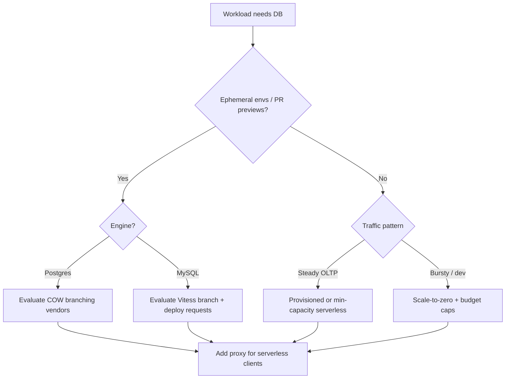

## Complexity: `[MEDIUM]`
## Time to Complete: 40-45 minutes

---

## Prerequisites

Before starting this module, you should have completed:
- [Module 15.1: CockroachDB](../module-15.1-cockroachdb/) - Distributed database concepts
- [Module 15.2: CloudNativePG](../module-15.2-cloudnativepg/) - PostgreSQL fundamentals
- Basic Git workflow (branches, merges)
- Understanding of development environments and CI/CD

---

## What You'll Be Able To Do

After completing this module, you will be able to:

- **Deploy serverless database solutions (Neon, PlanetScale, CockroachDB Serverless) for Kubernetes applications**
- **Configure connection pooling and autoscaling database access patterns for serverless workloads**
- **Implement database branching workflows for development and testing with instant schema cloning**
- **Evaluate serverless database pricing models and latency trade-offs for different application patterns**

## Why This Module Matters

> **Hypothetical scenario:** A platform team maintains a production PostgreSQL database holding roughly 500 GB of relational data. Staging holds a trimmed 50 GB copy refreshed monthly, while local developers seed roughly 1 GB of hand-crafted fixtures. A schema migration passes every automated test in staging, then locks a hot table for twenty minutes in production because the migration duration scales with row count, not with the small staging dataset. Incident review surfaces the same root cause teams rediscover every quarter: environments did not share production-shaped data, and spinning up another full copy would cost thousands of dollars per month in storage and engineering time.

Serverless databases attack that economics problem from two directions at once. Compute–storage separation lets idle environments suspend compute while durable pages remain addressable, which makes scale-to-zero and consumption billing technically possible. Copy-on-write branching lets a preview environment reference the same underlying history as production and diverge only where writes occur, which makes “test on production volume” feasible without cloning half a terabyte for every pull request.

The durable capability you are learning is not a single vendor feature. It is an architectural model: elastic compute over independently scaled durable storage, short-lived connection patterns in front of long-lived database processes, and metadata-level forks that behave like Git branches for data. Neon, PlanetScale, CockroachDB Basic, Aurora Serverless v2, Cloud SQL, and AlloyDB each implement slices of that model with different wire protocols, pooling layers, and control planes. Your job as a platform engineer is to recognize which slice a workload needs and which tradeoffs you are accepting when you choose managed cloud versus operator-managed Kubernetes.

When you connect a serverless function fleet or a bursty preview-environment pipeline to a database, two failure modes appear immediately. First, connection storms: each Lambda invocation may open a new TCP session, and PostgreSQL memory per connection makes that expensive fast. Second, cold-start latency: if compute scaled to zero, the first query after idle waits for a process to attach to existing storage history. Connection poolers and proxy tiers exist precisely because the serverless application topology and the serverful database process model disagree about how long a session should live.

Database branching closes the loop between application Git workflows and data workflows. A feature branch in Git without a matching data branch still forces developers to guess how migrations behave at scale. When branching is copy-on-write, creating `feature/auth` is a metadata operation pointing at an existing log sequence or storage snapshot, not a multi-hour dump and restore. That shift changes review culture: schema diffs run against realistic cardinalities, preview URLs hit real distributions, and destructive experiments happen on disposable branches instead of on shared staging that everyone fears to touch.

---

## Compute–Storage Separation: The Durable Spine

Traditional PostgreSQL on a single VM or in a Kubernetes StatefulSet colocates the query executor, buffer cache, and durable files on one machine. You scale by resizing the VM or adding read replicas that each carry their own copy of the dataset. Idle capacity still burns money because the instance stays provisioned even when nobody runs queries at three in the morning.

Serverless-style systems split the problem into an ephemeral compute tier and a durable storage tier connected by a replication log. In Neon’s architecture, compute nodes run unmodified PostgreSQL while WAL streams to safekeepers that form a quorum; a pageserver materializes page versions and object storage holds long-term history. The compute node does not own durable state, so it can restart, resize, or disappear without moving data files. Aurora Serverless v2 and AlloyDB describe the same separation in managed-cloud language: storage grows automatically across zones while ACUs or vCPU-sized compute endpoints scale within a configured min/max band.

Why separation enables scale-to-zero is mechanical, not marketing. If durability lives in shared storage, suspending compute is pausing a stateless process, not powering down the only copy of your data. When traffic returns, a new compute endpoint attaches to the same history and replays metadata rather than restoring from backup. The tradeoff is latency: the first attachment after idle incurs wake time plus any cache coldness on the new node. Production OLTP that must answer in single-digit milliseconds often sets a non-zero minimum capacity; development databases and preview branches accept wake latency in exchange for near-zero idle cost.

Separation also enables branching without copying bytes. A branch is a new pointer into shared history plus an isolated write path. Reads can be satisfied from pages already materialized for the parent; writes accumulate in branch-specific storage. That is the same copy-on-write idea as filesystem snapshots, applied at database semantics so each branch still speaks normal SQL on its own connection string.

On Kubernetes, operators such as CloudNativePG manage colocated PostgreSQL clusters by default: each pod owns its PVC for `PGDATA`. You can approximate serverless economics by scaling replicas to zero only for non-production namespaces, pairing the operator with PgBouncer, and using volume snapshots for clones—but you still orchestrate compute and storage lifecycle yourself. Managed serverless offerings hide the pageserver/safekeeper/control-plane complexity in exchange for less tunability and egress constraints.

```
TRADITIONAL VS SEPARATED ARCHITECTURE
─────────────────────────────────────────────────────────────────

COLOCATED (many K8s operators, classic RDS)
┌──────────────────────────────────────────┐
│  PostgreSQL process + local disk/PVC     │
│  Scale instance = move or resize data    │
│  Idle instance still bills full CPU/RAM   │
└──────────────────────────────────────────┘

SEPARATED (Neon, Aurora, AlloyDB pattern)
┌─────────────┐   WAL / pages   ┌─────────────────────┐
│  Compute    │ ◀──────────────▶ │  Durable storage    │
│  (elastic)  │                  │  (shared, branched) │
└─────────────┘                  └─────────────────────┘
```

---

## Scale-to-Zero, Autoscaling, and Billing Models

Autoscaling in serverless databases usually refers to compute endpoints growing or shrinking within bounds, not to storage shrinking when you delete rows. Storage billing remains tied to allocated or consumed bytes, often with compression and retention policies you must read in the vendor snapshot. Compute billing shifts to per-second or per-request units when activity is intermittent. CockroachDB Basic measures activity in Request Units that scale toward zero when the cluster is idle; Aurora Serverless v2 measures Aurora Capacity Units with configurable minimum and maximum.

Scale-to-zero is a win when workloads are bursty or ephemeral. Preview databases per pull request, developer sandboxes, and batch analytics that run twice a day fit the model well. Scale-to-zero is a liability when tail latency dominates your SLO: the first query after suspend pays wake cost, and connection setup may compound the delay. Mitigations include minimum capacity floors, periodic keep-alive queries, and placing a pooler in front so applications reuse warm server sessions even when client processes are short-lived.

Consumption billing rewards right-sizing ex post, but it punishes surprise traffic spikes if you capped spend limits too aggressively. CockroachDB Basic lets organizations set RU and storage ceilings; Neon and cloud providers expose similar budget alerts. Provisioned models remain appropriate for steady, predictable OLTP where reserved capacity is cheaper than pay-per-use at high baselines. Hybrid teams often run production on provisioned or minimum-capacity serverless while branching dev/test at true zero minimum.

Cold starts interact with ORM connection pools in subtle ways. A pool in the application process assumes the database endpoint is always reachable; when compute wakes on demand, health checks must tolerate brief refusal windows. Platform teams sometimes run a tiny “always on” compute size in production while allowing zero in non-production projects, which is an explicit economic trade rather than a universal default.

---

## The Serverless Connection Problem

PostgreSQL allocates substantial memory per backend connection for buffers and catalog state. MySQL behaves similarly at scale. A serverless function that opens one connection per invocation can exhaust `max_connections` on a small instance even when concurrent queries are low, because sessions linger until the function runtime reclaims them.

The durable mitigation is a connection pooler or proxy tier that multiplexes many client sessions onto fewer server backends. PgBouncer in transaction pooling mode returns a server connection to the pool after each transaction, which suits stateless HTTP handlers but breaks session-scoped features such as prepared statements tied to a single backend for the whole session. RDS Proxy pools and multiplexes for Amazon RDS and Aurora, integrates with Secrets Manager and IAM authentication, and queues clients when the pool is saturated instead of failing instantly. Neon and PlanetScale expose managed proxy endpoints so serverless clients talk to a stable hostname that understands their scaling model.

Vitess, underlying PlanetScale’s MySQL layer, routes through VTGate which also constrains connection fan-out to tablets. The pattern is the same indirection: short-lived clients, longer-lived pooled paths to storage engines. When you self-host on Kubernetes, the CloudNativePG documentation describes pairing the operator-managed cluster with a PgBouncer deployment for the same reason.

Design checklist for serverless + database: cap client-side pool size per function instance, use a central proxy where possible, prefer transaction-scoped work, avoid idle-in-transaction sessions that pin pool slots, and monitor `max_connections` plus proxy queue depth as first-class metrics. Failure to plan this layer is the most common production outage when teams lift a laptop-sized Postgres config into Lambda without changing connection semantics.

PgBouncer’s transaction pooling mode returns server backends to the pool after each transaction completes, which dramatically increases density for stateless HTTP handlers that run single-statement queries. The tradeoff appears when applications rely on session-scoped state: temporary tables that survive across statements, certain `SET` parameters, or prepared statements bound to a single backend for the whole session may break or behave inconsistently. RDS Proxy documents similar pinning behavior when statements exceed size thresholds or when session state must remain stable. Read the pooling mode matrix in PgBouncer documentation before choosing the most aggressive pool setting in production.

Managed vendors embed pooling in the proxy hostname you already use, which reduces moving parts but also reduces visibility. Self-hosted Kubernetes teams often deploy PgBouncer as a Deployment fronting CloudNativePG or a RDS instance outside the cluster. In both cases, teach application developers that “serverless” describes the client topology, not an excuse to disable connection limits in the ORM. Framework defaults tuned for long-lived Puma or Gunicorn workers will overwhelm a database if copied verbatim into function handlers.

---

## Database Branching and Copy-on-Write Workflows

Branching treats database state like version control: a parent line of history, named branches that diverge with commits (writes), and merges or deletes when work completes. Relational databases historically made that metaphor expensive because physical copies required dump/restore or storage-level clones tied to one engine.

Copy-on-write branching instead records a new branch as a pointer to a parent snapshot or log sequence number. Reads resolve through shared storage layers; writes append to branch-specific extents. Neon documents branches as first-class resources containing databases, roles, and compute endpoints. PlanetScale models branches for MySQL with safe migrations and deploy requests that promote schema from a development branch to production without blocking DDL on the primary.

Workflow integration mirrors Git pull requests. On pull request open, CI creates `preview/pr-123`, runs migrations against that branch, and injects the branch connection string into the preview deployment. On merge or close, automation deletes the branch so storage for divergent writes can be reclaimed. Schema testing benefits because `ALTER TABLE` duration and lock behavior on millions of rows surfaces on the branch before production cutover.

Point-in-time branch creation adds forensic value: a branch anchored at a timestamp before a bad migration reproduces state for analysis without overwriting production. This is not a substitute for backup retention policies—branches are operational tools, while backups satisfy compliance and disaster recovery—but the operational speed difference changes how teams practice failure drills.

Schema merge semantics differ by vendor in ways that matter for platform design. PlanetScale promotes schema from branches to production through deploy requests that may use online migration machinery with optional gated cutover, whereas Neon branches more often pair with application migration tools that run SQL against each branch connection string independently. Neither approach removes the need for backward-compatible application deployments when columns are added or renamed. Branching gives you a safe place to run the DDL; application code still must tolerate rolling deploys unless you coordinate single-cutover releases.

Preview data governance deserves explicit policy. A branch created from production inherits production rows unless you run masking jobs on the branch after creation. Some teams maintain a `staging-parent` branch rebuilt weekly from anonymized exports and fork previews from that parent instead of from `main`, trading freshness for compliance. Document the parent choice in your platform handbook so new services do not accidentally expose regulated fields in public preview URLs.

```
DATABASE BRANCHING (CONCEPTUAL)
─────────────────────────────────────────────────────────────────

main (production history)
████████████████████████████████  shared durable pages
        │              │
        │ COW fork     │ COW fork
        ▼              ▼
   feature/auth    preview/pr-42
   + small delta   + tiny delta
```

---

## Serverless Databases on Kubernetes

Kubernetes does not magically make PostgreSQL serverless. A StatefulSet with fixed replicas is the opposite of scale-to-zero unless you build automation around it. The operator pattern adds declarative clusters, failover, backups, and optional pooler sidecars, but you still choose when pods run and how PVCs grow.

CloudNativePG runs highly available PostgreSQL with native replication, continuous backup to object storage, and optional PgBouncer integration. That stack gives you GitOps-friendly databases on your cluster, yet elasticity is yours to implement: HPA on connection metrics, scheduled scale-down of dev namespaces, and VolumeSnapshot cloning for environment copies. Each clone is heavier than Neon-style metadata branching but stays fully under your control for air-gapped or data-residency regimes.

CockroachDB can run self-hosted with Helm or as CockroachDB Basic in cloud with consumption billing. The cloud Basic plan separates request-metered compute from storage billing in documentation aimed at variable workloads. Choosing cloud versus in-cluster is a trade between operational burden and fine-grained infrastructure ownership, not a purity contest.

Managed serverless Postgres or MySQL from hyperscalers fits when your applications already live in that cloud’s VPC and you want RDS Proxy or IAM integration without maintaining pooler Helm charts. Multi-cloud application tiers often standardize on a portable serverless Postgres vendor for branching ergonomics while keeping stateless compute on Kubernetes elsewhere.

---

## Capacity Planning and Economic Tradeoffs

Serverless database invoices reward teams that measure workload shape before choosing minimum capacity. Start by graphing queries per second, connection count, and bytes stored over a full business cycle including end-of-quarter batch jobs and marketing events. Compare that curve to the vendor’s scaling granularity: Aurora Serverless v2 adjusts in half-ACU steps, CockroachDB Basic throttles against Request Unit ceilings, and Neon bills compute active time separately from storage gigabytes that accumulate regardless of query activity.

Budget caps are a feature, not an embarrassment. Consumption models let you set monthly limits with alerts at eighty and ninety percent thresholds so a runaway script cannot silently spend five figures. When limits trigger, understand whether the vendor degrades performance, rejects writes, or only notifies—behavior differs and belongs in your incident playbooks. Provisioned instances avoid that surprise at the cost of paying for Saturday night capacity you do not use.

Storage growth often dominates long-term cost after compute optimizes. Branching reduces duplicate storage for reads but every migration that rewrites a large table still creates write amplification on the branch and parent history. Retention policies for old branches, preview environments left open after merge, and forgotten PITR anchors are the usual leaks. Automate branch deletion and schedule reviews of storage dashboards the same way you review orphaned load balancers.

Latency budgeting should be explicit when you enable autosuspend. Measure wake time plus first-query duration after idle periods representative of your ORM and connection pool settings. If P99 exceeds product SLO, raise minimum compute or add a synthetic canary query every few minutes in production only—accepting that canary cost as part of SLO insurance. Development environments rarely need that insurance.

---

## Security, Networking, and Compliance

Serverless control planes still terminate TLS and hold connection credentials. Store API keys and database URLs in CI secret managers with rotation policies; preview pipelines that echo `DATABASE_URL` into public build logs have caused real data exposures even when the branch was disposable. Prefer short-lived credentials or IAM-authenticated proxy paths where the vendor supports them, such as RDS Proxy with Secrets Manager integration documented by AWS.

Network placement determines whether Kubernetes workloads in a private cluster can reach a managed branch. Vendor docs describe private link, VPC peering, or IP allow lists. Egress from Kubernetes to a SaaS database is a common platform ticket—plan it before advertising instant previews to every product team. Self-hosted operators avoid that egress path but inherit patching, backup encryption, and key management for PVCs.

Compliance teams ask whether preview branches copy regulated data. Branching from production may replicate personal identifiable information into environments with weaker access controls. Masking pipelines, synthetic data branches, or parent branches built from anonymized snapshots may be required before enabling copy-on-write previews for healthcare or financial workloads. The architecture enables fast environments; governance decides what data may flow into them.

Audit logging should cover branch create/delete events and deploy request approvals with the same retention as application deployments. PlanetScale deploy requests and Neon branch APIs are control-plane actions that change production schema or expose production-shaped data—your change management policy should record who approved them.

---

## Observability and Operations

Traditional database monitoring assumes a stable hostname and steady process list. Serverless endpoints may change compute attachment behind the same proxy hostname, which makes process-level metrics less meaningful than request latency, connection pool saturation, proxy queue depth, and vendor-reported compute active time. Export those metrics into the same Prometheus or cloud monitoring stack you use for application golden signals.

Alert on `max_connections` proximity, proxy borrow timeouts, and migration duration anomalies on branches before promoting DDL to production. Branch migrations that suddenly take ten times longer than the previous release candidate often indicate a missing index on production scale that staging seeds never triggered. Treat branch CI migration timing as a release gate comparable to integration test failure.

Runbooks should document how to detach a preview environment during a vendor incident without dropping production traffic. That usually means isolating the production connection string in secrets, verifying pooler configuration points at the production branch or cluster only, and disabling CI branch creation temporarily. Keeping production paths boring and well labeled reduces panic during partial outages.

Log correlation across Git pull request identifiers, branch names, and deployment URLs helps post-incident review connect a schema change to a specific preview lifecycle. Structured fields such as `branch_name`, `pr_number`, and `deploy_request_id` in application logs pay off the first time you debug which preview wrote unexpected rows.

---

## GitOps and Platform Engineering Integration

Platform teams frequently orchestrate databases alongside application GitOps repositories. A clean pattern stores application schema migrations in git, runs them against automatically created branches in CI, and promotes the same migration files to production only after merge. The database branch is ephemeral infrastructure; the migration files remain the contract reviewed in pull requests. This mirrors how Kubernetes manifests promote while pods are disposable.

Helm or Terraform modules can wrap vendor API tokens and project identifiers, but avoid putting branch-specific connection strings into long-lived Terraform state for previews—generate those per pipeline run instead. For Kubernetes-hosted apps using External Secrets Operator, map CI outputs into namespaced secrets keyed by pull request label selectors where your delivery stack supports it.

When multiple product teams share one Neon project or PlanetScale database, namespace isolation moves from Kubernetes to branch naming conventions and RBAC on the vendor organization. Document required prefixes such as `team-a/preview/` and enforce deletion quotas so one team cannot leave hundreds of branches open after a hackathon week.

Progressive delivery patterns pair branching with gated schema deploys. Ship application code behind feature flags while schema changes sit on a branch until metrics look healthy, then merge deploy requests during a staffed window. PlanetScale’s gated deployment option exists for operators who want cutover control after shadow tables finish synchronizing—useful when migrations run for hours on large MySQL tables.

When you evaluate vendors, bring a checklist rather than a brand preference: Does the workload need Postgres or MySQL wire compatibility? How often are environments idle? Must previews branch from production-shaped data? Are functions opening connections without a proxy? Do regulators forbid SaaS control planes? The answers map to rows in the Rosetta table instead of a single “winner.” Revisit the landscape snapshot quarterly because scale-to-zero minimums, branching APIs, and consumption units change more often than the durable spine does.

Document your chosen patterns in the platform service catalog: connection string injection for previews, minimum capacity per environment tier, branch parent policy, and proxy ownership. New teams onboard faster when defaults are coded in Terraform modules and CI templates rather than repeated from this module’s prose. Treat those templates as living documentation that changes whenever the landscape snapshot changes, and link each template to the vendor doc URLs in the Sources section.

---

## Worked Examples (Illustrative, Not Endorsements)

The following sections walk concrete CLIs so commands stay runnable. Products evolve quickly; verify flags and pricing in the landscape snapshot before production reliance.

### Neon: Serverless PostgreSQL with Branching

We use Neon here because its public architecture docs describe separated compute, safekeepers, pageserver, and branching primitives explicitly—useful for teaching the spine. Equivalent managed Postgres offerings provide branching or PITR with different ergonomics; see the Rosetta table.

```bash
# Install Neon CLI
brew install neonctl
# or: npm install -g neonctl

neonctl auth
neonctl projects create --name branching-demo
neonctl connection-string --project-id <project-id>
```

```bash
# Branch lifecycle
neonctl branches create \
  --project-id <project-id> \
  --name feature/add-phone \
  --parent main

FEATURE_URL=$(neonctl connection-string --project-id <project-id> --branch feature/add-phone)
psql "$FEATURE_URL" -c "ALTER TABLE users ADD COLUMN phone VARCHAR(20);"

neonctl branches delete --project-id <project-id> --name feature/add-phone
```

Neon’s compute endpoints scale down after configurable idle intervals; storage for the project remains billed while data exists. Integrate branching into CI with the official GitHub Actions for create/delete branch so preview apps receive a fresh connection string per pull request.

```yaml
# .github/workflows/preview.yml (excerpt)
- name: Create Neon branch
  id: neon
  uses: neondatabase/create-branch-action@v4
  with:
    project_id: ${{ secrets.NEON_PROJECT_ID }}
    branch_name: preview/pr-${{ github.event.number }}
    api_key: ${{ secrets.NEON_API_KEY }}
```

### PlanetScale: Branching MySQL with Deploy Requests

PlanetScale builds on Vitess for MySQL-compatible routing, sharding, and online schema workflows. Branches hold schema changes; deploy requests review diffs and apply non-blocking migrations to production when approved.

```bash
brew install planetscale/tap/pscale
pscale auth login
pscale database create my-app --region us-east
pscale branch create my-app feature/new-schema
pscale connect my-app feature/new-schema --port 3306
```

Deploy requests add governance: teammates review generated DDL, lint checks flag incompatible changes, and gated deployments let operators choose cutover timing after shadow tables synchronize. That workflow teaches safer schema evolution even if you later self-host Vitess per Module 15.4.

### CockroachDB Basic: Consumption-Metered Distributed SQL

CockroachDB Cloud’s Basic plan documents Request Units scaling with activity and storage billed per GiB, with free monthly allotments documented on the pricing page. It illustrates serverless economics applied to distributed SQL rather than single-node Postgres. Use `ccloud quickstart` for a guided cluster when evaluating connection patterns from Kubernetes jobs or services.

Distributed storage changes branching metaphors: you gain survivability and horizontal scale, but instant Git-style branch names are not the primary workflow. Teams often clone clusters from backups or use export/import pipelines when they need isolated environments. Evaluate CockroachDB when your durable requirement is multi-region survival with consumption billing, and evaluate Neon or PlanetScale when your durable requirement is developer branching ergonomics on a single logical database.

### Aurora Serverless v2 and RDS Proxy (AWS-shaped example)

If your compute already lives on AWS Lambda or EKS with tight IAM integration, Aurora Serverless v2 plus RDS Proxy is a common peer implementation of the same ideas. Aurora separates storage from ACU-scaled compute; RDS Proxy pools connections and sheds load when clients exceed configured limits. Branch-like workflows appear as Aurora cloning and point-in-time restore rather than named branches per pull request, so platform engineers automate clone creation in CI when they want preview parity. Read AWS documentation for minimum ACU settings and pause behavior because they change across engine versions and affect whether true idle savings materialize.

---

## Landscape Snapshot and Rosetta

> **Landscape snapshot — as of 2026-06. This changes fast; verify against vendor docs before relying on specifics.**
>
> | Product | Scale-to-zero / min capacity | Branching or PITR fork | Pooling story | Consumption billing unit |
> |---------|------------------------------|------------------------|---------------|---------------------------|
> | Neon | Compute auto-suspend after idle; storage always billed | Instant branches + PITR branch anchors | Managed proxy; serverless driver docs | Compute hours + storage GB-month |
> | PlanetScale | Plan-dependent; verify console for current autosleep | Database branches + deploy requests | VTGate / PlanetScale proxy | Per-row reads/writes + storage (see pricing page) |
> | CockroachDB Basic | RU usage scales down with idle cluster | Backup/restore cloning; not Git-style COW branches | SQL load balancers; connection guidance in docs | Request Units + storage GiB |
> | Aurora Serverless v2 | Min ACU can be >0; pause/resume features vary by engine version | Clone/Aurora copy; not PR-style branches | RDS Proxy recommended for Lambda | ACU-seconds + storage |
> | Cloud SQL | Instances run until stopped; no scale-to-zero in classic model | Clone instance operations | Auth proxy sidecar pattern | Instance vCPU/RAM + storage |
> | AlloyDB | Separated compute/storage; basic instances for lower cost dev | Clone cluster PITR | Managed service connections via private IP | vCPU/RAM + storage + egress |

**Rosetta — durable capability × product (peers, not rankings)**

| Capability | Neon | PlanetScale | CockroachDB Basic | Aurora Serverless v2 | Cloud SQL / AlloyDB |
|------------|------|-------------|-------------------|----------------------|---------------------|
| Compute–storage separation | Yes (pageserver model) | Vitess/MySQL stack | Distributed storage layer | Aurora shared storage | AlloyDB yes; Cloud SQL traditional instance |
| Scale-to-zero or aggressive idle savings | Compute suspend | Verify plan | RU scales toward idle | Min ACU configurable | Manual stop/start; AlloyDB basic tier for dev |
| Branch-like environments | Native COW branches | Native branches | Backup/restore workflows | Clone/PITR | Clone/PITR |
| Consumption billing | Usage-based tiers | Usage-based tiers | RU + storage | ACU-based | Provisioned + storage (AlloyDB flex storage) |
| Connection pooling for serverless clients | Proxy layer | VTGate/proxy | Pool settings + guidance | RDS Proxy | Auth proxy / managed connectors |
| Self-hostable equivalent | Open-source Neon components (complex) | Vitess on K8s | CockroachDB self-hosted | Aurora only on AWS | AlloyDB Omni / Postgres operators |

---

## Patterns, Anti-Patterns, and Decision Framework

Branch-per-preview with automated teardown ties Neon or PlanetScale branch creation to pull request open events and deletes branches when pull requests close. You pay for divergent writes during the pull request lifetime instead of maintaining parallel full copies that each bill storage independently. Teams that adopt this pattern report fewer migration surprises because schema changes exercise realistic cardinalities before merge, and reviewers can click a preview URL backed by data that actually resembles production shape rather than a sanitized miniature.

Proxy-first connectivity from functions places PgBouncer, RDS Proxy, Neon’s proxy endpoint, or VTGate between serverless workers and the database engine so thousands of ephemeral clients multiplex onto a bounded set of server backends. Combine the proxy with conservative per-instance pool limits in Lambda, Cloud Functions, or Knative configurations so a traffic spike cannot multiply connections by concurrent execution count alone. Treat the proxy as part of your data plane chart, not as an optional performance tweak you add after the first outage.

Minimum capacity for latency-sensitive production accepts idle compute cost on the production project while allowing zero or near-zero minimums in development and preview projects. Document the economic rationale for finance stakeholders so they understand why production and development lines differ on the same vendor invoice. The goal is intentional heterogeneity: optimize dollars where idle time is guaranteed, optimize milliseconds where user-facing services measure tail latency.

Test migrations on branches and promote through a pipeline by running DDL on a branch, validating application compatibility against that branch URL, then applying the same migration artifact to production through a controlled deployment job rather than by mutating production manually from a laptop. The pipeline should fail closed if branch linting or integration tests fail, mirroring how application code promotion already behaves in mature platform teams.

One connection per invocation without a proxy exhausts database memory and produces thundering herds during traffic spikes, which is the fastest path to `too many connections` errors that appear unrelated to business logic changes. Treat that configuration as a load test you accidentally run in production. The fix is architectural and must ship before you scale function concurrency, not after incident review recommends it.

Treating branches as backups creates compliance gaps because branches lack the retention locks, legal holds, and off-site replication paths that backup products document for auditors. Use vendor backup APIs and off-site object storage for disaster recovery while branches serve engineering workflow and preview environments. The mental model is branches for agility, backups for survivability; conflating them invites data loss when someone deletes a branch assuming a snapshot policy covers it.

Long-lived idle transactions on scale-to-zero databases block vacuuming, pin pool slots, and prevent compute suspension, which defeats the cost model that justified serverless in the first place. Application frameworks that open a transaction at the start of a request and close it at the end interact poorly with transaction pooling and with autosuspend timers. Set aggressive statement and idle-in-transaction timeouts in preview environments to train developers before those habits reach production connection strings.

Ignoring cold-start SLO impact is reasonable for batch jobs and nightly ETL that can tolerate multi-second wake time, but user-facing APIs often cannot. Pick minimum capacity, scheduled warm-up probes, or a small always-on compute size for production while keeping preview branches aggressive about suspend. Measure P99 after idle periods rather than assuming vendor marketing figures apply to your query mix and ORM behavior.

Hardcoding branch connection strings into container images guarantees preview applications will eventually talk to the wrong database after a rebuild or promotion. Inject branch URLs from CI-generated secrets per environment so the running preview pod always matches the branch the pipeline created for that pull request number. The same discipline you apply to `DATABASE_URL` in twelve-factor apps applies doubly when the URL changes every pull request.

**Decision framework**

| Your situation | Favor | Watch out for |
|----------------|-------|----------------|
| Postgres + PR previews + many ephemeral envs | Neon-style COW branching | Cold starts; extension support vs vanilla Postgres |
| MySQL + online DDL governance | PlanetScale branches + deploy requests | Vitess compatibility constraints for MySQL features |
| Multi-region distributed SQL + variable traffic | CockroachDB Basic | Not the same instant branching UX; verify RU limits |
| Already on AWS Lambda + Aurora | Aurora Serverless v2 + RDS Proxy | Min ACU cost; branch-like workflows need clone automation |
| Data must stay in your VPC on Kubernetes | CloudNativePG + PgBouncer + snapshots | You operate elasticity; no managed scale-to-zero |
| GCP-native Postgres with separated storage | AlloyDB | Branch metaphor is clone/PITR, not Git-style branch names |



---

## Did You Know?

- **Neon’s architecture docs describe quorum-replicated WAL to safekeepers before compute considers a transaction committed**, which is how durability survives compute restarts without local disk fsync being the sole correctness anchor.

- **PlanetScale deploy requests can revert schema deployments within a documented window**, preserving rows written during the deployment—a different safety net than simply keeping a branch open.

- **PgBouncer transaction pooling can break session-scoped features** such as certain prepared statement modes; serverless apps must choose pooling mode deliberately rather than enabling the most aggressive default.

- **Aurora Serverless v2 documentation emphasizes sub-second scaling granularity in 0.5 ACU steps**, which matters when workloads grow gradually rather than in doubling steps of fixed instance sizes.

---

## Common Mistakes

| Mistake | Why It's Bad | Better Approach |
|---------|--------------|-----------------|
| Not deleting preview branches | Divergent storage accrues per branch | Automate delete on PR close in CI |
| Using branches as compliance backups | Branches lack retention/legal holds | Use vendor backup + off-site copy |
| Hardcoding production URLs in preview apps | Previews hit prod accidentally | Inject branch URL from CI secrets |
| Long idle transactions | Blocks scale-to-zero and pool reuse | Keep transactions short; set timeouts |
| Ignoring cold-start latency | Violates SLO on first request after idle | Set minimum compute or warm-up probes |
| Skipping proxy with Lambda | Exhausts `max_connections` | RDS Proxy, PgBouncer, or vendor proxy |
| Testing migrations only on tiny seeds | Locks and duration surprises in prod | Run DDL on branch with parent prod data |
| Disabling deploy request review | Schema bypasses team visibility | Require approval for production DDL |

---

## Quiz

### Question 1

Your platform team operates fifty AWS Lambda functions behind API Gateway, and each invocation currently opens a dedicated PostgreSQL connection through the public RDS endpoint. During a marketing event, concurrent invocations climb into the thousands and RDS begins rejecting sessions with `too many connections` even though CPU utilization looks healthy. Operators suspect connection fan-out rather than query cost. What architectural change should you prioritize first, and what application-side guardrails belong in the same change set?

<details>
<summary>Answer</summary>
Add a connection pooler or managed database proxy between the functions and PostgreSQL so thousands of short client sessions multiplex onto a smaller set of server backends. PgBouncer, RDS Proxy, or a vendor proxy tier is designed for this mismatch. Also cap per-function pool sizes so a single cold start cannot open unbounded sessions. Direct connections might work in development but fail abruptly in production when `max_connections` is exhausted.
</details>

### Question 2

Product engineering asks for pull-request preview environments against production-scale row counts without provisioning another 500 GB RDS instance per pull request. Finance rejected a budget line for five full database clones in addition to production. Which serverless database capability addresses the economics problem, and how does copy-on-write differ from dump-and-restore cloning in operational terms?

<details>
<summary>Answer</summary>
Copy-on-write database branching lets a preview branch reference shared durable storage and store only divergent writes. Neon and PlanetScale expose this as named branches with independent connection strings. Dump/restore cloning would take hours and multiply storage cost per environment. Branching turns environment creation into a metadata operation suitable for CI pipelines that create and delete branches per pull request.
</details>

### Question 3

An architect argues that “serverless database” is only a billing feature because storage still bills when compute sleeps. You respond that compute–storage separation enables a specific operational behavior beyond invoices. Which behavior is the strongest technical justification, and why is it impossible on a classic single-node PostgreSQL VM without externalizing storage?

<details>
<summary>Answer</summary>
Separating durable storage from ephemeral compute allows compute endpoints to suspend while data remains available, which makes scale-to-zero and fast re-attach possible without copying files. The WAL or storage service holds correctness; compute is replaceable. Without separation, powering down the database process would mean losing or freezing the only copy of live data on that node.
</details>

### Question 4

A migration finishes in two seconds against a 1 GB developer seed but takes twenty minutes and holds locks on a hot table in production. Post-incident review shows staging held only ten percent of production rows and was refreshed monthly. Where should the team have exercised the migration before production cutover, and what metric should have blocked the release?

<details>
<summary>Answer</summary>
On a branch forked from production or another source with production-scale data, so duration, locking, and rewrite behavior reflect real cardinalities. Staging subsets often hide sequential scan costs and lock contention that appear only at full size. Branching exists precisely so that test is affordable: you pay for the migration’s writes on the branch, not for duplicating the entire dataset first.
</details>

### Question 5

Leadership mandates scale-to-zero on every database to minimize cloud spend, including the customer-facing checkout API dependency. SREs object that tail latency SLOs were written for sub-100 ms database round trips. Under what workload conditions is scale-to-zero appropriate, and what compromise preserves SLOs without abandoning separated storage?

<details>
<summary>Answer</summary>
When tail latency SLOs require consistently warm connections and predictable query times, because the first request after idle pays compute wake and cache coldness. Batch jobs, developer sandboxes, and preview databases tolerate that trade. Production OLTP often sets a non-zero minimum capacity or uses keep-alive health checks while still using separated storage for branching and backups.
</details>

### Question 6

A MySQL team currently runs blocking `ALTER TABLE` in maintenance windows because past migrations queued application traffic. They evaluate PlanetScale and ask what process change deploy requests introduce compared with shared-staging DDL. What governance and technical benefits should you highlight without claiming zero risk?

<details>
<summary>Answer</summary>
They provide reviewable, non-blocking schema promotion from a branch with linting and optional gated cutover, reducing the chance of locking production unexpectedly. Operators inspect diffs like code review before deployment. The workflow encodes organizational governance rather than relying on a single DBA running manual DDL during a maintenance window.
</details>

### Question 7

Regulators require all customer data to remain in a private Kubernetes cluster with no SaaS database control plane. Developers still want faster environment copies than nightly `pg_dump`. What self-hosted pattern is realistic, and what capability will they likely sacrifice compared with Neon-style branching?

<details>
<summary>Answer</summary>
Use an operator such as CloudNativePG with volume snapshots or continuous backup restore to seed namespaces, plus PgBouncer for connection control. You will not get vendor-style instant COW branches unless you adopt storage engines that support them. The trade is more operations work in exchange for data residency and control plane ownership inside your cluster.
</details>

### Question 8

FinOps asks why the development Neon project costs almost nothing while production Aurora still bills a meaningful minimum every weekend despite low traffic. Explain how consumption billing differs mentally from provisioned instances and why hybrid tiers across environments are rational rather than inconsistent policy.

<details>
<summary>Answer</summary>
Consumption billing charges for active compute units, request tokens, or ACU-seconds and stored bytes as measured, which rewards idle or sparse workloads but requires budget caps and alerts. Provisioned instances charge for reserved CPU/RAM whether or not queries run, which is simpler to predict at high steady utilization. Hybrid teams often provision production baselines and branch dev environments on consumption tiers.
</details>

---

## Hands-On

This exercise uses the Neon CLI to prove copy-on-write isolation: schema changes on a child branch must not appear on `main` until you promote them deliberately. Complete the steps in order and record the branch connection strings your CI would inject into a preview deployment.

```bash
npm install -g neonctl
neonctl auth
neonctl projects create --name branching-demo
export PROJECT_ID=<project-id-from-output>

MAIN_URL=$(neonctl connection-string --project-id "$PROJECT_ID")
psql "$MAIN_URL" <<'EOF'
CREATE TABLE users (
    id SERIAL PRIMARY KEY,
    name VARCHAR(100) NOT NULL,
    email VARCHAR(255) NOT NULL UNIQUE,
    created_at TIMESTAMP DEFAULT NOW()
);
INSERT INTO users (name, email) VALUES
    ('Alice', 'alice@example.com'),
    ('Bob', 'bob@example.com');
EOF

neonctl branches create --project-id "$PROJECT_ID" --name feature/add-phone --parent main
FEATURE_URL=$(neonctl connection-string --project-id "$PROJECT_ID" --branch feature/add-phone)
psql "$FEATURE_URL" -c "ALTER TABLE users ADD COLUMN phone VARCHAR(20);"
psql "$MAIN_URL" -c "\d users"   # phone column should be absent on main

neonctl branches delete --project-id "$PROJECT_ID" --name feature/add-phone
```

When you finish, confirm the feature branch accepted the `ALTER TABLE` while `main` remained unchanged until you inspected it deliberately. That isolation property is what allows preview applications to experiment without risking production schema state.

- [ ] A Neon project exists with a `main` branch containing the `users` table and seed rows
- [ ] A child branch accepts `ALTER TABLE` adding `phone` while `main` remains without that column
- [ ] Listing branches shows the feature branch before deletion and only `main` afterward

---

## Next Module

Continue to [Module 15.4: Vitess](../module-15.4-vitess/) to learn how to self-host the MySQL sharding layer that powers PlanetScale-style scale-out on your own Kubernetes clusters.

---

## Sources

- [Neon architecture overview](https://neon.tech/docs/introduction/architecture-overview) — Separated compute, safekeepers, pageserver, and object storage roles.
- [Neon branching](https://neon.tech/docs/manage/branches) — Branch lifecycle, PITR anchors, and compute endpoints per branch.
- [PlanetScale deploy requests](https://docs.planetscale.com/concepts/deploy-requests) — Non-blocking schema promotion, revert window, and gated deployments.
- [CockroachDB Basic plan](https://www.cockroachlabs.com/docs/cockroachcloud/plan-your-cluster-basic) — Request Units, storage billing, and scale-to-zero behavior.
- [Aurora Serverless v2](https://docs.aws.amazon.com/AmazonRDS/latest/AuroraUserGuide/aurora-serverless-v2.html) — Autoscaling ACUs, use cases, and pause/resume concepts.
- [Amazon RDS Proxy](https://docs.aws.amazon.com/AmazonRDS/latest/UserGuide/rds-proxy.html) — Pooling, multiplexing, and surge protection for serverless clients.
- [PgBouncer features](https://www.pgbouncer.org/features.html) — Session versus transaction pooling tradeoffs.
- [AlloyDB overview](https://cloud.google.com/alloydb/docs/overview) — Disaggregated compute and storage on Google Cloud.
- [Cloud SQL for PostgreSQL](https://cloud.google.com/sql/docs/postgres) — Managed Postgres baseline for comparison with separated-storage designs.
- [CloudNativePG](https://cloudnative-pg.io/) — Kubernetes operator patterns, pooling, and backups for self-hosted Postgres.
- [Vitess documentation](https://vitess.io/docs/) — VTGate routing and sharding underlying MySQL scale-out platforms.
- [Neon open-source repository](https://github.com/neondatabase/neon) — Upstream description of serverless Postgres components.
