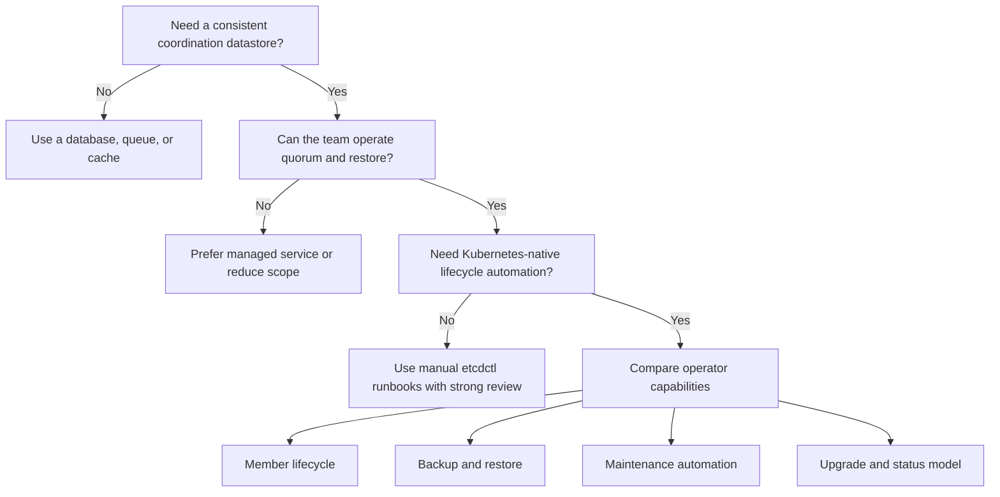

> **Complexity**: `[MEDIUM]`
>
> **Time to Complete**: 55-65 minutes
>
> **Prerequisites**: Kubernetes CRDs and controllers, StatefulSets, persistent volumes, basic etcd backup and restore concepts, and the reliability foundations behind quorum-based systems.
>
> **Track**: Toolkits

## What You'll Be Able to Do

After completing this module, you will be able to:

- **Explain** how Raft quorum, leader election, and linearizable reads shape the daily operating limits of an etcd cluster that runs as a Kubernetes workload.
- **Operate** member lifecycle changes safely by adding, replacing, promoting, and removing members one step at a time instead of treating pods as interchangeable replicas.
- **Design** backup, restore, and disaster-recovery runbooks that distinguish a recoverable minority failure from quorum loss that requires a snapshot-based restore.
- **Maintain** etcd storage health by connecting compaction, defragmentation, backend quotas, and scheduled operator tasks to the failure modes they prevent.
- **Evaluate** current etcd operator choices by comparing durable capabilities and tradeoffs rather than treating any one project name as a permanent recommendation.

## Why This Module Matters

Hypothetical scenario: your platform team runs a small internal metadata service on a three-member etcd cluster because the application needs consistent coordination and fast watch notifications. A node drain removes one member, a storage volume for another member becomes unavailable, and the team discovers that the cluster is no longer just "one pod down." Writes stop because the remaining member cannot form quorum, the last snapshot is older than the recovery objective, and the on-call engineer now has to decide whether to repair membership, restore from backup, or hold the system read-only while evidence is collected.

That scenario is not a Kubernetes scheduling problem with an etcd flavor. It is a distributed systems problem wearing Kubernetes clothes. A Deployment can replace a stateless pod and call the job finished, but etcd membership is part of the data system itself. Each member has a persistent identity in the Raft configuration, each write depends on a majority, and a new pod does not become a safe voting member merely because the kubelet started a container.

An operator helps when it encodes the boring, dangerous parts of the runbook into a reconcile loop. It can create the StatefulSet, configure peer URLs, attach storage, watch member health, request member changes, schedule snapshots, and surface status in Kubernetes-native objects. The important lesson is not "install an etcd operator and relax." The important lesson is that a good operator turns operational knowledge into software, while still leaving the platform team responsible for understanding the invariants that the software is trying to preserve.

Think of operator-managed etcd like a railway signaling system. The trains are still heavy, they still need tracks, and they still cannot occupy the same unsafe section at the same time. The signaling system reduces human coordination mistakes by encoding safe transitions, but it does not repeal physics. In etcd, quorum, log replication, disk latency, and restore semantics are the physics.

This module is about running etcd as a managed datastore or platform service on Kubernetes. It is distinct from the kubeadm-managed control-plane etcd that backs a Kubernetes API server, and it is also distinct from the introductory question of what etcd is. You already know etcd is a strongly consistent key-value store. Here, the focus is how to operate that store when Kubernetes is the substrate and an operator is the automation boundary.

## Operating a Consensus Store as a Kubernetes Workload

The first mindset shift is that an etcd cluster is not a replica set in the usual application sense. A three-pod stateless application can usually lose one pod, create another, and route around the failure without caring which old instance disappeared. A three-member etcd cluster can also tolerate one failed member, but only because the two remaining voting members still form a majority and can commit new log entries. The replacement path must respect the membership configuration that Raft uses to decide who counts as a voter.

Kubernetes gives you useful building blocks for that path. StatefulSets provide stable network identity, persistent volume claims preserve member data, Services give peers and clients predictable endpoints, and PodDisruptionBudgets can prevent voluntary disruptions from removing too many members at once. Those primitives are necessary, but they are not sufficient. They do not know when it is safe to remove a failed member from etcd's internal member list, when a learner has caught up, or when a snapshot restore should replace recovery by incremental repair.

The operator pattern exists because the missing layer is procedural knowledge. Human operators learn to check quorum before changing membership, to replace one member at a time, to verify snapshot integrity before an emergency, and to defer defragmentation when latency-sensitive clients are already struggling. A controller can watch the desired state expressed in a CRD, compare it with actual Kubernetes objects and actual etcd health, and make one bounded change per reconcile cycle.

That bounded-change property matters. A naive automation script that deletes two broken pods and creates two new pods can accidentally turn a recoverable degradation into a quorum-loss incident. A conservative operator should prefer small transitions, status conditions, and refusal states over heroic bulk action. The goal is not maximum automation at all costs; the goal is a machine-enforced runbook that keeps the cluster inside the safe region.

There is also an ownership boundary to keep clear. If you use a managed Kubernetes service, you usually do not manage the provider's control-plane etcd. Deploying an etcd operator into that cluster creates a separate application datastore, not a new way to operate the provider's API server database. That separate datastore can be useful for application coordination, a platform control plane, a test environment, or a self-managed Kubernetes design, but it should not be confused with the managed control plane's hidden backing store.

etcd is attractive for platform components because it offers a compact API, watches, leases, and consistency semantics that are difficult to reproduce correctly. It is also unforgiving when teams treat it like a generic cache. The values are small, the write path is consensus-bound, and the disk is part of the latency budget. Before selecting an operator, make sure the workload genuinely needs etcd's consistency and watch model rather than a database, queue, or cache with a friendlier operational profile.

## Raft Fundamentals That Drive Operations

Raft divides the cluster into a leader and followers. Clients can connect through different endpoints, but the write path is centered on the leader because the leader proposes log entries and coordinates replication. A write is committed when a majority of voting members have accepted it. For a cluster of `N` voting members, that majority is `floor(N/2) + 1`, which is why a three-member cluster needs two members and a five-member cluster needs three members to make progress.

The quorum rule is the reason odd-sized clusters are the normal shape. A four-member cluster also needs three members for majority, so it tolerates the same single-member failure as a three-member cluster while adding another member that can fail and another peer that participates in replication. Moving from three to five can improve failure tolerance because the cluster can lose two members and still keep three voters. Moving from five to seven can improve tolerance again, but it also adds more replication work and more cross-zone latency exposure.

That tradeoff is easy to hide behind a table, but operators feel it during incidents. A three-member cluster across three zones is usually a practical default because it tolerates one zone or member failure while keeping the write quorum small. A five-member cluster may be justified when the failure domain model requires two simultaneous member losses, but only if the network and disks can keep the larger quorum healthy. More members are not a free availability button.

Leader election is another operational constraint. When the leader disappears, followers need to elect a new leader before writes can continue. That election is normally fast, but it is not magic. Slow disks, stalled networking, overloaded CPU, or repeated restarts can stretch the disruption. If your clients treat any brief write failure as data corruption, the client design is wrong. If your monitoring cannot tell leader changes from storage failures, the platform diagnosis will be slow.

Linearizable reads are part of etcd's value, but they also explain why latency matters. A linearizable read observes the latest committed state and may require coordination with the current leader. That property is useful for lock-like coordination and control-plane state, but it is not the cheapest possible read path. A system that sends large volumes of casual read traffic to etcd because it is convenient can harm the same strong-consistency path that made etcd attractive.

The healthy mental model is "small, important metadata with strict ordering," not "high-volume document store." Kubernetes itself uses etcd for cluster state, but that does not mean every platform service should copy the pattern. An operator can help keep the cluster available, yet it cannot make etcd a substitute for a general-purpose database. The workload shape still needs to fit the consensus engine.

Raft also explains why pod placement matters. If three members land on one physical node, one node failure can remove all voters. If two members share one zone and the third member is elsewhere, a zone failure can remove the majority side. Kubernetes scheduling constraints, anti-affinity, topology spread, persistent volume topology, and disruption budgets are not optional decoration for etcd. They are how the cluster's failure-tolerance math becomes real infrastructure.

The operator should make those placement rules easier to express, but the team still needs to review the resulting pods and volumes. Reconciliation can create resources exactly as requested, even when the request encodes a poor topology. A production review should ask whether the declared cluster size, storage class, node labels, and disruption policy match the quorum design. If they do not, the YAML is only syntactically correct.

## Member Lifecycle: Safe Change Before Fast Change

Member lifecycle is where etcd operations most clearly diverge from ordinary pod replacement. A failed pod might restart with the same persistent data and keep the same member identity. A failed disk may require removing the old member from the cluster and adding a fresh member. A scale-out changes the voting set. A restore may create a new cluster identity from a snapshot. These are different operations, and a safe operator must not blur them.

The conservative rule is to change membership one member at a time. If the cluster still has quorum, remove or replace a failed member, wait for the new state to become healthy, and only then consider the next change. That pacing is not bureaucracy. During a membership change, the cluster is updating the set of voters that define majority. Combining multiple uncertain changes can make it hard to know which configuration the surviving members agree on and can reduce the remaining safety margin.

Learner members help reduce risk during replacement and scale-out. A learner receives replicated log entries but does not count as a voting member until it catches up and is promoted. That lets a new member synchronize data without immediately changing quorum requirements. Promotion should happen only after the learner is close enough to the leader's log. If the learner is slow because storage or networking is weak, the right answer is to fix the bottleneck rather than forcing it into the voting set.

An operator can automate the observe-diff-act loop around this process. It can notice that the desired cluster size is three, observe that two members are healthy and one member is absent, create a replacement pod, add it through the etcd membership API, and update status as the new member catches up. A stronger operator will also stop when preconditions are not met, because refusing to act is safer than pretending a broken cluster is a normal scaling event.

The danger point is quorum loss. If a three-member cluster loses two voting members permanently, the remaining member cannot safely accept writes by itself. At that point, adding pods is not the same as adding members, because the cluster cannot commit the configuration change. Recovery moves from member repair to disaster recovery. You either restore from a snapshot or follow a carefully documented quorum-loss recovery procedure that reconstitutes the cluster around known data.

This distinction is a good interview question for your own runbooks. Ask the team what they do when one member fails, then ask what they do when two members fail, and listen for whether the answers differ. If both answers are "restart the pods," the runbook is incomplete. If both answers are "restore immediately," the runbook may throw away recoverable data. Good operations begin by classifying the failure before choosing the procedure.

Kubernetes events and status fields are useful but not enough by themselves. A pod can be Running while the etcd member is not healthy, and a PersistentVolumeClaim can be Bound while the member's data is stale or corrupt. Operators that expose member health, learner state, leader identity, backup status, and last operation status give the platform team better evidence. The evidence then drives the decision: wait, repair one member, restore from snapshot, or deliberately stop automation for manual recovery.

## Backup, Restore, and Disaster Recovery

Backups are not a checkbox for etcd; they are the boundary between a difficult repair and unrecoverable state loss. A snapshot captures a consistent view of the keyspace at a point in time. If a minority of members fails and quorum remains, you usually prefer member replacement because the live cluster still contains newer committed data. If quorum is gone and cannot be repaired, a snapshot becomes the source of truth for a new cluster.

The practical recovery objective is determined by snapshot cadence, snapshot durability, and restore rehearsal. A snapshot that exists only on the same node as the failed disk is not disaster recovery. A snapshot that was never restored in a test environment is an assumption. A snapshot that is old may be better than nothing, but it still creates data loss relative to the last committed write after the snapshot. The operator can schedule snapshots, yet humans define the acceptable recovery point.

Point-in-time recovery is more nuanced than "restore the latest file." Some systems store full snapshots plus incremental or delta snapshots. That can reduce recovery-point loss, but it also means the restore procedure must know which sequence to apply and how to verify it. If the platform only tests full snapshots, the first emergency involving deltas becomes a live experiment. Treat incremental recovery as a separate capability with its own drill.

Restoring etcd also has an identity dimension. A restored cluster is typically initialized with a new cluster configuration, new data directories, and explicit peer URLs. In a Kubernetes operator model, the controller may create or reconcile the StatefulSet, Services, Secrets, and ConfigMaps required to make that restored topology real. The operational risk is that old members, old volumes, or old peer URLs accidentally rejoin or confuse the new cluster. Cleanup and fencing are part of the restore.

For Kubernetes control-plane etcd, the restore procedure also requires coordination with API server instances. For application etcd, the same idea applies at the client layer. Clients need to stop writing during a restore, reconnect to the restored endpoints, and handle the fact that recent keys may no longer exist. A restore plan that ignores clients is only a storage plan, not a service recovery plan.

Operators can help by making backup status and restore tasks visible as Kubernetes resources. Gardener's etcd-druid, for example, uses an `Etcd` custom resource for cluster intent and an `EtcdOpsTask` custom resource for one-time tasks such as on-demand snapshots. That CRD shape is useful because the task has a lifecycle: accepted, in progress, succeeded, failed, or rejected. A task that is rejected because backups are not configured is a valuable failure during a drill and a dangerous surprise during an incident.

The team should also define when not to restore. If one member is down in a three-member cluster and the remaining two are healthy, restoring from yesterday's snapshot would lose data unnecessarily. If the cluster has quorum but one member is corrupt, the safer path is usually to remove the bad member and let a new one catch up from the healthy voters. Restore is the right tool when the live cluster can no longer serve as the authority.

Hypothetical scenario: a team schedules full snapshots every twenty-four hours and delta snapshots every five minutes for an application coordination store. During a storage incident, two members are lost from a three-member cluster. The team restores the latest full snapshot and then replays deltas to a recent point, accepting a small amount of possible coordination-state loss because the application can rebuild ephemeral locks. Those numbers are illustrative, but the reasoning is the important part: recovery choices must match the data's meaning.

## Maintenance: Compaction, Defragmentation, and Quotas

etcd uses multi-version concurrency control, so updates create revision history. That history enables watches and consistent reads, but it also consumes backend space. Compaction discards old revisions before a chosen revision or retention window. After compaction, clients cannot read compacted revisions, and watchers that fall too far behind must recover. This is why compaction is not just a disk cleanup job; it is part of the API contract with clients.

Defragmentation is related but different. Compaction removes old logical revisions from the keyspace, while defragmentation rewrites the backend database to reclaim physical space. After many writes and deletes, the file on disk can remain large even when the live keyspace is smaller. Defragmentation closes that gap, but it can block a member while the backend is rebuilt. A good maintenance plan spaces defragmentation across members rather than pausing the whole cluster at once.

The `mvcc: database space exceeded` error is the maintenance failure learners should recognize. etcd has a backend quota that protects the cluster from uncontrolled growth. In current upstream documentation, the default storage size limit is two GiB and the quota is configurable with `--quota-backend-bytes`; the same documentation suggests eight GiB as a normal-environment maximum before etcd warns. When the quota is exceeded, etcd raises a NOSPACE alarm and restricts writes until space is reclaimed and the alarm is disarmed.

Operators can schedule maintenance, but they cannot decide the correct retention policy without workload context. A high-churn workload with many watches may need careful auto-compaction settings, larger backend headroom, and client logic that handles compacted revisions. A quiet coordination store may tolerate conservative compaction and infrequent defragmentation. The platform team should choose settings from observed write rate, watch behavior, restore objectives, and disk performance rather than copying a sample value.

Maintenance also belongs in monitoring. You want alerts for leader changes, failed proposals, disk sync latency, backend database size, database size in use, quota alarms, snapshot failures, and member health. A dashboard that only shows pods as Running will miss the important failure modes. etcd can be unhealthy while Kubernetes reports the containers alive, especially when disk latency or quorum instability is the real issue.

The operator's job is to expose maintenance state in places the platform already watches. That can mean CRD status fields, Kubernetes events, Prometheus metrics, or task objects. The human job is to connect the signal to a runbook. A quota alarm should lead to compaction, defragmentation, data reduction, and alarm disarm. It should not lead first to deleting random keys without understanding whether those keys are current, historical, or application-owned.

Maintenance is the least glamorous part of this module, but it is often the difference between a quiet service and a late-night outage. Backups protect against catastrophic loss, but compaction and defragmentation prevent the slow path to write refusal. Quorum protects consistency, but monitoring tells you whether the cluster is close to losing it. The operator ties these tasks together only when the team has already decided what good looks like.

## The Operator Pattern Applied to etcd

A Kubernetes operator has two halves: an API and a controller. The API is the CRD that lets a user declare intent, such as "run a three-member etcd cluster with this version, these resources, this backup store, and this compaction policy." The controller is the reconcile loop that turns that intent into Kubernetes resources and etcd member operations. The useful phrase is "encoded operational knowledge," because the controller is valuable only when it knows the runbook better than a generic deployment script.

For etcd, the encoded runbook has several domains. Provisioning creates Services, StatefulSets, Secrets, ConfigMaps, volumes, and member configuration. Scaling changes membership safely and waits for readiness. Recovery distinguishes pod restart, member replacement, and quorum-loss restore. Backup automation schedules snapshots and records status. Upgrade automation checks supported version transitions and rolls members one at a time. Maintenance automation handles compaction, defragmentation, and alarms.

The reconcile loop should be idempotent. If it observes that a Service already exists and matches the desired shape, it leaves it alone. If a pod is missing but the member still exists in etcd, it should reason about whether the same identity can return. If a task is already in progress, it should avoid starting another task that conflicts with it. Idempotence is what lets controllers survive restarts and repeated watches without amplifying incidents.

Status is part of the product, not a decorative field. A useful operator tells you whether the cluster is ready, whether it is quorate, whether all members are ready, whether backups are ready, what the current replicas are, and what the last operation did. That status lets platform teams make decisions without reverse-engineering every child object. It also lets automation such as GitOps health checks or alerting rules consume a stable signal.

Finalizers and protection webhooks are another important operator technique. They can prevent a user from deleting the CR while leaving orphaned data resources, or from editing generated child objects in a way that the controller will later overwrite. These protections can be annoying during debugging, so mature operators often include explicit escape hatches. The key is that the escape hatch should be deliberate, visible, and temporary.

The operator boundary should not hide every detail. If you cannot explain what happens to quorum during a node drain, you are not ready to trust the automation during a real failure. If you cannot restore a snapshot into a fresh environment, a green backup status is weak evidence. If you cannot identify the current leader and member health, a Running controller pod tells you very little. Operators reduce toil, not responsibility.

That is the durable capability this module wants you to retain. Project names and versions will change. A CRD field may be renamed, a repository may be archived, and a new controller may become more complete. The stable skill is recognizing the lifecycle that any serious etcd operator must cover: declare, provision, observe, change membership safely, back up, restore, maintain, upgrade, and refuse unsafe action.

## Runbook Design: Evidence Before Action

The safest etcd runbooks are organized around evidence gates. Before changing anything, collect enough evidence to classify the failure. Is the cluster quorate, which member is leader, which members are healthy, whether any member is a learner, whether backup storage is ready, and whether a quota or disk alarm exists. Without that evidence, an operator action can look like progress while actually moving the system into a less recoverable state.

The second gate is intent review. A command that deletes a pod, removes a member, scales a custom resource, starts a snapshot, or suspends reconciliation should have a clear reason and an expected observation afterward. This is where operators help by turning intent into declarative objects. A task resource is easier to review than a shell session because the target, timeout, namespace, and desired operation are visible before execution.

The third gate is blast-radius control. For etcd, that usually means one member, one maintenance operation, or one restore phase at a time. If a team cannot explain what happens after the next single action, it should not queue several actions together. This applies even when an operator supports automatic reconciliation. Automation should compress tedious steps, not hide the sequence of safety checks that makes those steps valid.

The fourth gate is verification from multiple layers. Kubernetes should say the pods and volumes exist, the operator should say the custom resource is ready, etcd should say endpoints are healthy, and clients should prove that the service still behaves as expected. A mismatch between layers is useful information. For example, Running pods with non-quorate status point away from scheduling and toward consensus or member health.

The fifth gate is fallback choice. If member repair does not converge, decide whether to keep waiting, remove and replace one member, suspend reconciliation for manual inspection, or move to restore. The fallback should be written before the incident. During an outage, people are tempted to escalate from safe repair to destructive cleanup too quickly, especially when dashboards are red and stakeholders are waiting for updates.

The sixth gate is post-action learning. Every snapshot drill should record whether the restored cluster was usable, not only whether the task finished. Every member replacement should record whether the new member caught up as a learner before voting. Every quota alarm should record what created the growth and whether retention settings need adjustment. Operator-managed systems improve when the runbook learns from the controller's real behavior.

This evidence-first style also fits GitOps. The desired cluster spec can live in Git, while emergency tasks can be created from reviewed runbook snippets. After the incident, the durable configuration change goes back through normal review. That separation keeps one-time recovery tasks from becoming permanent drift, and it keeps permanent policy from being changed under outage pressure.

The platform team's goal is therefore not to memorize every command. The goal is to know which evidence makes a command safe. If a future operator changes the CRD names, the evidence gates still apply. You still need quorum status before member work, backup status before restore confidence, maintenance status before quota recovery, and client verification before declaring the service healthy.

## Landscape Snapshot and Rosetta

> **Landscape snapshot — as of 2026-06. This changes fast; verify against vendor docs before relying on specifics.**
>
> The upstream etcd project is a CNCF Graduated project. The old CoreOS `etcd-operator` repository is archived and should be treated as historical material, not a current recommendation. The `etcd-io/etcd-operator` repository is active and describes itself as the official Kubernetes operator for etcd; its `v0.2.0` release is marked prerelease and adds TLS, scaling, and upgrade support, while backup and restore remain roadmap items. Gardener `etcd-druid` is an active operator used in the Gardener ecosystem and exposes richer backup and maintenance workflows through its Etcd and EtcdOpsTask APIs.

The snapshot is intentionally narrow. It avoids ranking projects or implying a universal default for every platform. It says which capability surface was visible in the primary sources at authoring time. For durable platform design, choose the capability you need first, then verify the current project status, CRD schema, image tags, and release notes before you write production manifests.

| Durable capability | etcd-io/etcd-operator | etcd-druid | CoreOS etcd-operator | Manual `etcdctl` and Kubernetes primitives |
|---|---|---|---|---|
| Member lifecycle | Active project; `v0.2.0` release notes include cluster size changes. | Active project; Etcd status exposes readiness and quorum-oriented state. | Historical implementation only; repository is archived. | Possible, but the human runbook must preserve quorum and membership order. |
| Backup and restore | Roadmap item after `v0.2.0`; verify current release before assuming CRD support. | Backup sidecar, scheduled snapshots, object-store support, and `EtcdOpsTask` on-demand snapshots are documented. | Historical backup and restore CRDs existed, but the project is archived. | `etcdctl snapshot save` and `etcdutl snapshot restore` are durable primitives, but scheduling and status are on you. |
| Defrag and compaction automation | Verify current CRD and controller support before relying on it. | Etcd spec and backup-restore sidecar document scheduled defragmentation and compaction-related settings. | Historical behavior only; do not start new designs from it. | Fully possible with commands and cron-like automation, but safety sequencing is manual. |
| Kubernetes CRD model | `EtcdCluster` in `operator.etcd.io/v1alpha1` with `spec.size` and `spec.version`. | `Etcd` and `EtcdOpsTask` in `druid.gardener.cloud/v1alpha1`. | Older CRDs from an archived repository. | No custom API unless you build one; StatefulSets and scripts carry the intent. |
| Project status | Active repository, prerelease `v0.2.0` as of this snapshot. | Active repository, release `v0.36.4` as of this snapshot. | Archived read-only repository. | Upstream etcd remains the core project; the operator behavior is your runbook. |

## Worked Example: Declaring, Backing Up, and Recovering

The worked example uses etcd-druid because its current documented API exposes a cluster CRD, scheduled backup settings, and an on-demand snapshot task. That does not make it a universal recommendation. It simply lets us demonstrate the full durable lifecycle with current CRD fields. If you use another operator, translate the same runbook into that operator's API: declare desired cluster state, verify quorum, trigger a backup, simulate a safe member restart, and inspect recovery evidence.

First, install the operator with the verified OCI chart in a namespace dedicated to the controller. In a real platform, you would review the chart values, decide whether automatic reconciliation fits your change-control model, and provide production webhook certificates if your policy requires them. The command below installs the published chart and CRDs; it assumes your kubeconfig points at a disposable or lab cluster.

```bash
helm upgrade --install etcd-druid \
  oci://europe-docker.pkg.dev/gardener-project/releases/charts/gardener/etcd-druid \
  --version v0.36.4 \
  --namespace etcd-druid-system \
  --create-namespace
```

```bash
kubectl wait deployment/etcd-druid \
  --namespace etcd-druid-system \
  --for=condition=Available \
  --timeout=180s
```

Next, create a namespace and a backup secret compatible with the project's LocalStack-backed sample. This is still a lab pattern, not a production credential pattern. Production clusters should use a real object store, real credentials, encryption controls, retention policy, and restore drills. The key point is that an on-demand snapshot task requires backup storage to be configured; otherwise the task should be rejected rather than pretending a backup exists.

```bash
kubectl create namespace etcd-lab
```

```bash
kubectl apply -n etcd-lab -f - <<'YAML'
apiVersion: v1
kind: Secret
metadata:
  name: etcd-backup-aws
type: Opaque
data:
  accessKeyID: QUNDRVNTS0VZQVdTVVVTRVI=
  secretAccessKey: c0VjcmVUS2V5
  bucketName: ZXRjZC1idWNrZXQK
  region: dXMtZWFzdC0y
  s3ForcePathStyle: dHJ1ZQ==
YAML
```

Declare the etcd cluster through the operator API. The manifest uses three replicas because that is the smallest production-shaped quorum cluster, sets periodic compaction retention, schedules defragmentation, and defines backup behavior. The `endpointOverride` assumes a service named `localstack` is reachable in the namespace; replace that with your object-store endpoint in a real environment. Do not leave an object-store placeholder in production and assume snapshots are protected.

```bash
kubectl apply -n etcd-lab -f - <<'YAML'
apiVersion: druid.gardener.cloud/v1alpha1
kind: Etcd
metadata:
  name: etcd-test
  labels:
    app: etcd-statefulset
    role: test
spec:
  labels:
    app: etcd-statefulset
    role: test
  annotations:
    app: etcd-statefulset
    role: test
  replicas: 3
  etcd:
    metrics: basic
    defragmentationSchedule: "0 */24 * * *"
    resources:
      requests:
        cpu: 100m
        memory: 200Mi
      limits:
        cpu: 500m
        memory: 1Gi
    clientPort: 2379
    serverPort: 2380
    quota: 8Gi
  backup:
    port: 8080
    fullSnapshotSchedule: "0 */24 * * *"
    deltaSnapshotPeriod: 300s
    deltaSnapshotMemoryLimit: 1Gi
    garbageCollectionPolicy: Exponential
    garbageCollectionPeriod: 43200s
    store:
      provider: S3
      container: etcd-bucket
      prefix: etcd-test
      endpointOverride: http://localstack.etcd-lab:4566
      secretRef:
        name: etcd-backup-aws
    compression:
      enabled: true
      policy: gzip
    leaderElection:
      reelectionPeriod: 5s
      etcdConnectionTimeout: 5s
    resources:
      requests:
        cpu: 23m
        memory: 128Mi
      limits:
        cpu: 200m
        memory: 1Gi
  sharedConfig:
    autoCompactionMode: periodic
    autoCompactionRetention: "30m"
YAML
```

Verify readiness from the custom resource rather than only from pods. The wide output is useful because a serious operator should expose readiness, quorum, backup readiness, cluster size, and replica counts in one place. If the backup column is not ready, treat that as a failed backup prerequisite, not as a cosmetic warning.

```bash
kubectl get etcd etcd-test -n etcd-lab -o wide
```

Trigger an on-demand full snapshot with an `EtcdOpsTask`. This is a good example of the operator pattern applied to a one-time operation: the task is a Kubernetes object, it references the target Etcd resource, it has a timeout, and it exposes status. A platform team can put the manifest in a runbook, execute it during a drill, and then inspect the task's terminal state.

```bash
kubectl apply -n etcd-lab -f - <<'YAML'
apiVersion: druid.gardener.cloud/v1alpha1
kind: EtcdOpsTask
metadata:
  name: exercise-ondemand-full-snapshot
spec:
  etcdName: etcd-test
  config:
    onDemandSnapshot:
      type: full
      timeoutSecondsFull: 900
  ttlSecondsAfterFinished: 3600
YAML
```

```bash
kubectl get etcdopstask exercise-ondemand-full-snapshot \
  -n etcd-lab \
  -o yaml
```

Now simulate a safe member restart by deleting one member pod and watching the operator reconcile it. This is not a quorum-loss drill and it is not a disk-loss drill. It is the first, safer exercise: one member becomes unavailable, the cluster should remain quorate, and the operator should bring the member back while the CR status returns to ready. Practice this before practicing permanent failures.

```bash
kubectl delete pod etcd-test-0 -n etcd-lab
```

```bash
kubectl get pods -n etcd-lab \
  -l app.kubernetes.io/part-of=etcd-test \
  --watch
```

```bash
kubectl get etcd etcd-test -n etcd-lab -o wide
```

The important verification step is not that a pod name reappeared. The important verification is that the Etcd CR says the cluster is ready, quorate, and backed by the expected number of ready replicas. For a deeper lab, write a key before the restart and read it after recovery with an etcd client image that matches an upstream etcd tag. The image below resolves through the upstream registry at authoring time.

```bash
ETCD_ENDPOINTS="http://etcd-test-client.etcd-lab:2379"
kubectl run etcd-client \
  -n etcd-lab \
  --restart=Never \
  --rm \
  --attach \
  --image=gcr.io/etcd-development/etcd:v3.5.21 \
  -- etcdctl --endpoints="${ETCD_ENDPOINTS}" endpoint health
```

If a lab step fails, classify the failure before changing anything. A Pending pod points toward scheduling or storage. A rejected snapshot task points toward backup preconditions. A non-quorate Etcd status points toward consensus availability. A quota alarm points toward maintenance. The operator gives you evidence, but you still need to choose the right branch in the runbook.

## Patterns & Anti-Patterns

### Patterns

| Pattern | Why it works | Operational proof |
|---|---|---|
| Quorum-first maintenance | Every voluntary disruption is checked against the remaining voting members before action is taken. | Drains, upgrades, and member replacement preserve a majority throughout the runbook. |
| Backup plus restore drill | Snapshots are treated as useful only after a restore has been rehearsed in a separate environment. | The team can show a restored cluster, not only a successful upload. |
| Status-driven automation | GitOps health checks and alerts consume operator status, not only pod phase. | The team can distinguish ready pods from ready, quorate, backed-up etcd. |
| One-member-at-a-time change | Membership changes are serialized so each new state is observed before the next change begins. | Replacement, scale-out, and upgrade logs show bounded transitions. |

### Anti-Patterns

| Anti-pattern | Why it is dangerous | Better approach |
|---|---|---|
| Treating etcd pods like stateless replicas | Pod replacement does not automatically repair Raft membership or quorum. | Use an operator or runbook that changes etcd membership intentionally. |
| Restoring while quorum still exists | A restore can discard committed data that the live majority still has. | Prefer member repair when a healthy majority remains. |
| Backups without object-store verification | A green schedule is weak evidence if snapshots never leave the failure domain. | Verify storage credentials, retention, and restore from the remote copy. |
| Defragmenting every member at once | Live defragmentation can block a member, and concurrent pauses can harm availability. | Defragment one member at a time and watch latency and quorum. |
| Scaling to even cluster sizes for comfort | Even sizes can add cost and failure surface without improving majority tolerance. | Use three, five, or seven voters based on failure-domain requirements. |

### Decision Framework

Use the decision framework as a guardrail, not a product selector. If your need is a self-managed application datastore with strict coordination semantics, an operator can be appropriate. If your need is only Kubernetes control-plane etcd on a managed service, the provider owns that layer. If your need is a large general-purpose database, etcd is usually the wrong abstraction no matter how good the operator is.



The final choice should come from a capability checklist. Can the operator create a topology that matches your failure domains? Can it back up to your required storage target? Can it restore in a drill? Can it expose quorate status to monitoring? Can it refuse unsafe changes? A project that lacks one of those capabilities may still be useful for a lab or narrow use case, but you should not pretend the missing runbook has been automated.

## Did You Know?

- **etcd's quorum rule makes cluster size an operational design choice, not a capacity slider.** A three-member cluster needs two voters, a five-member cluster needs three voters, and even-sized clusters often add coordination cost without improving failure tolerance.
- **Compaction and defragmentation solve different storage problems.** Compaction removes old logical revisions from the keyspace, while defragmentation rewrites the backend file so disk space can actually be reclaimed.
- **A learner member can reduce replacement risk because it catches up before becoming a voter.** That distinction matters when a new member is slow or the cluster is already close to its failure limit.
- **The archived CoreOS operator is not the same thing as the active etcd-io operator effort.** Many older tutorials still point at the archived repository, so verify repository status before copying manifests.

## Common Mistakes

| Mistake | Problem | Solution |
|---|---|---|
| Using `spec.replicas` with the etcd-io `EtcdCluster` API | The current etcd-io CRD documents `spec.size`, so the manifest does not express the desired cluster size. | Read the installed CRD with `kubectl explain` and verify examples against the release you deploy. |
| Running all members on one node or zone | A single infrastructure failure can remove quorum even though the cluster has multiple pods. | Use anti-affinity, topology spread, storage topology, and disruption budgets that match the quorum model. |
| Taking snapshots but never restoring them | Backup success only proves that a file was created, not that the service can recover. | Run scheduled restore drills into an isolated cluster and record recovery time and recovery point evidence. |
| Replacing multiple members at once | Bulk replacement can destroy the remaining safety margin and make membership state ambiguous. | Replace or add one member, wait for health, then move to the next operation. |
| Confusing minority loss with quorum loss | A repairable one-member failure and a non-quorate cluster require different procedures. | Classify the failure first, then choose member repair or snapshot restore. |
| Ignoring backend quota alarms | The cluster may stop accepting writes until space is reclaimed and the alarm is cleared. | Compact, defragment, reduce data growth, and disarm the NOSPACE alarm only after the quota condition is resolved. |
| Trusting pod phase as etcd health | A Running pod can still be unhealthy as an etcd member or unable to participate in consensus. | Monitor endpoint health, member status, leader changes, proposal failures, and operator CR status. |
| Treating operator status as a substitute for knowledge | Automation can refuse, fail, or encode assumptions that do not match your incident. | Keep human-readable runbooks and practice manual evidence gathering alongside operator workflows. |

## Quiz

1. **Scenario: a three-member etcd cluster loses one pod during a node drain, and the Etcd CR still reports the cluster as quorate. Should you restore from the latest snapshot?**
   <details>
   <summary>Answer</summary>
   No, not as the first response, because the cluster still has a healthy majority and should retain committed data newer than the snapshot. You should operate the member lifecycle by letting the operator or runbook repair the missing member while preserving quorum. A restore is appropriate when the live cluster can no longer serve as the authority or when data corruption makes the majority untrustworthy. This answer demonstrates why the backup runbook and the member-repair runbook must remain separate.
   </details>

2. **Scenario: your platform lead wants to scale a three-member cluster to four members because "more pods means more availability." How do you evaluate that request?**
   <details>
   <summary>Answer</summary>
   Evaluate the request through quorum math rather than pod count. A four-member etcd cluster needs three voters for majority, so it tolerates only one failed member, the same as a three-member cluster, while adding another member that can fail. If the real requirement is tolerating two member failures, discuss a five-member topology and the added latency and cost. This answer explains how Raft quorum shapes the operating limit.
   </details>

3. **Scenario: an on-demand snapshot task is rejected because backup storage is not configured on the Etcd resource. Is that an operator bug?**
   <details>
   <summary>Answer</summary>
   Usually no, because a rejected task can be the operator correctly enforcing a precondition. A backup task needs a configured storage target so the snapshot has somewhere durable to go. The right fix is to configure and verify the backup store, then rerun the task and inspect status. This is part of designing a disaster-recovery runbook that proves the backup path before an incident.
   </details>

4. **Scenario: endpoint health is green, but the backend database is close to its quota and old revisions are piling up. Which maintenance actions should you consider?**
   <details>
   <summary>Answer</summary>
   You should maintain the cluster by reviewing compaction policy, then defragmenting members in a controlled sequence after compaction has removed old revisions. If a NOSPACE alarm appears, remove the cause of growth, compact, defragment, and disarm the alarm only after the quota condition is resolved. You should also check whether clients are falling behind watches and whether retention settings fit their behavior. Healthy endpoints do not eliminate storage-maintenance risk.
   </details>

5. **Scenario: a new member is added as a learner and remains unpromoted for a long time. What should you inspect before forcing any change?**
   <details>
   <summary>Answer</summary>
   Inspect whether the learner is catching up to the leader's Raft log, and check disk latency, network latency, resource limits, and member logs. A learner should become a voting member only after it is sufficiently synchronized. Forcing unsafe promotion would weaken the operate-one-change-at-a-time discipline that protects quorum. The operator should surface enough status to explain whether the delay is expected catch-up or a real bottleneck.
   </details>

6. **Scenario: your team runs EKS and asks whether installing an etcd operator will improve the managed Kubernetes control plane. How do you answer?**
   <details>
   <summary>Answer</summary>
   Installing an operator inside a managed Kubernetes cluster creates a separate etcd workload; it does not give you control over the provider-managed control-plane datastore. You should evaluate whether an application or platform component needs its own strongly consistent coordination store. If the question is about the managed API server's backing store, the provider's documented control-plane reliability and backup model are the relevant surface. This answer evaluates the operator choice by ownership boundary, not by tool enthusiasm.
   </details>

7. **Scenario: you inherited manifests that reference the archived CoreOS etcd-operator. What is the safe modernization path?**
   <details>
   <summary>Answer</summary>
   Start by treating the old repository as historical and inventory the actual CRDs, etcd versions, storage, TLS, and backup behavior in the running cluster. Take and verify a snapshot before any migration, then choose a current operator or manual rebuild path based on required capabilities. Do not assume CRD compatibility between the archived project and newer operators. The safe path is a tested migration plan, not a search-and-replace of API names.
   </details>

8. **Scenario: an operator successfully recreates a deleted pod after a simulated failure. What extra evidence proves the cluster recovered correctly?**
   <details>
   <summary>Answer</summary>
   You need evidence that the Etcd CR reports ready and quorate, all expected members are healthy, the leader is stable, and a client can read or write through the expected endpoint. If backups are part of the design, backup readiness and recent snapshot status should also be checked. Pod recreation proves that Kubernetes scheduled a container; it does not by itself prove consensus health. This is why status-driven verification is part of operating operator-managed etcd.
   </details>

## Hands-On

Use a disposable Kubernetes cluster for this exercise, because you will install CRDs, create persistent state, and delete a member pod. The objective is not to become an etcd-druid specialist. The objective is to practice the durable runbook shape: declare a cluster through a CRD, inspect operator status, trigger a backup task, simulate one safe member failure, and verify recovery without confusing pod health for consensus health.

Success criteria:

- [ ] You can show an Etcd custom resource whose status reports a ready, quorate cluster with the expected number of ready replicas after the member-restart simulation.
- [ ] You can create an on-demand snapshot task and explain from its status whether it succeeded, failed, or was rejected because backup prerequisites were missing.
- [ ] You can explain why deleting one pod is a minority-failure exercise, not a quorum-loss disaster-recovery exercise, and identify what evidence would change that classification.
- [ ] You can identify where compaction retention, defragmentation schedule, backend quota, and backup schedule are declared in the CRD-based workflow.
- [ ] You can map each operator action back to the human runbook step it automates, including at least one action the operator should refuse when preconditions are not met.

Cleanup should remove the lab cluster and operator resources after you finish. If you created real object-store buckets or credentials, delete the test data through the object-store provider as well. Backup cleanup matters because stale snapshots from a lab can later be mistaken for recovery assets, especially when bucket names and prefixes look production-like.

```bash
kubectl delete etcdopstask exercise-ondemand-full-snapshot -n etcd-lab --ignore-not-found
kubectl delete etcd etcd-test -n etcd-lab --ignore-not-found
helm uninstall etcd-druid -n etcd-druid-system
kubectl delete namespace etcd-lab etcd-druid-system --ignore-not-found
```

## Sources

- [etcd CNCF project page](https://www.cncf.io/projects/etcd/) - Primary source for etcd's CNCF project status and graduation timeline.
- [etcd FAQ](https://etcd.io/docs/v3.6/faq/) - Primary source for quorum, cluster size, and failure-tolerance guidance.
- [etcd runtime reconfiguration](https://etcd.io/docs/v3.6/op-guide/runtime-configuration/) - Primary source for live membership operations and learner-member behavior.
- [etcd runtime reconfiguration design](https://etcd.io/docs/v3.6/op-guide/runtime-reconf-design/) - Primary source for why membership changes require safe sequencing.
- [etcd maintenance guide](https://etcd.io/docs/v3.6/op-guide/maintenance/) - Primary source for compaction, defragmentation, NOSPACE alarms, and quota recovery workflow.
- [etcd disaster recovery guide](https://etcd.io/docs/v3.6/op-guide/recovery/) - Primary source for snapshot and restore mechanics.
- [etcd system limits](https://etcd.io/docs/v3.6/dev-guide/limit/) - Primary source for default backend storage quota and request-size limits.
- [Raft paper](https://raft.github.io/raft.pdf) - Primary consensus paper explaining the replicated-log model behind etcd's quorum behavior.
- [Kubernetes: operating etcd clusters](https://kubernetes.io/docs/tasks/administer-cluster/configure-upgrade-etcd/) - Primary Kubernetes documentation for etcd operational considerations in Kubernetes environments.
- [etcd-io/etcd-operator repository](https://github.com/etcd-io/etcd-operator) - Primary source for the active upstream operator repository and project description.
- [etcd-io/etcd-operator v0.2.0 release](https://github.com/etcd-io/etcd-operator/releases/tag/v0.2.0) - Primary source for the prerelease status and current release capabilities.
- [etcd-io/etcd-operator API references](https://github.com/etcd-io/etcd-operator/blob/main/docs/api-references/docs.md) - Primary source for current `EtcdCluster` fields such as `spec.size` and `spec.version`.
- [etcd-io/etcd-operator roadmap](https://github.com/etcd-io/etcd-operator/blob/main/docs/roadmap.md) - Primary source for release-scope context around backup, restore, and future features.
- [Gardener etcd-druid repository](https://github.com/gardener/etcd-druid) - Primary source for etcd-druid status and documented operator capabilities.
- [etcd-druid managing clusters](https://github.com/gardener/etcd-druid/blob/master/docs/usage/managing-etcd-clusters.md) - Primary source for Etcd CR operations, status columns, and scaling guidance.
- [etcd-druid EtcdOpsTask usage](https://github.com/gardener/etcd-druid/blob/master/docs/usage/using-etcdopstask.md) - Primary source for on-demand snapshot task behavior and prerequisites.
- [etcd-druid recovery guide](https://github.com/gardener/etcd-druid/blob/master/docs/usage/recovering-etcd-clusters.md) - Primary source for quorum-loss recovery procedure boundaries.
- [CoreOS etcd-operator archived repository](https://github.com/coreos/etcd-operator) - Primary source for the archived status of the older CoreOS operator.

## Next Module

[Back to the Cloud-Native Databases Toolkit overview](../) to compare this operator-managed consensus-store pattern with the other database approaches in this toolkit.
