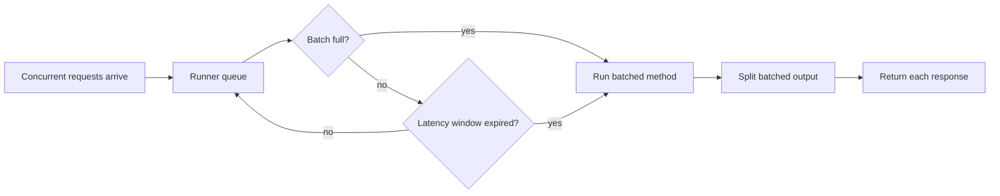
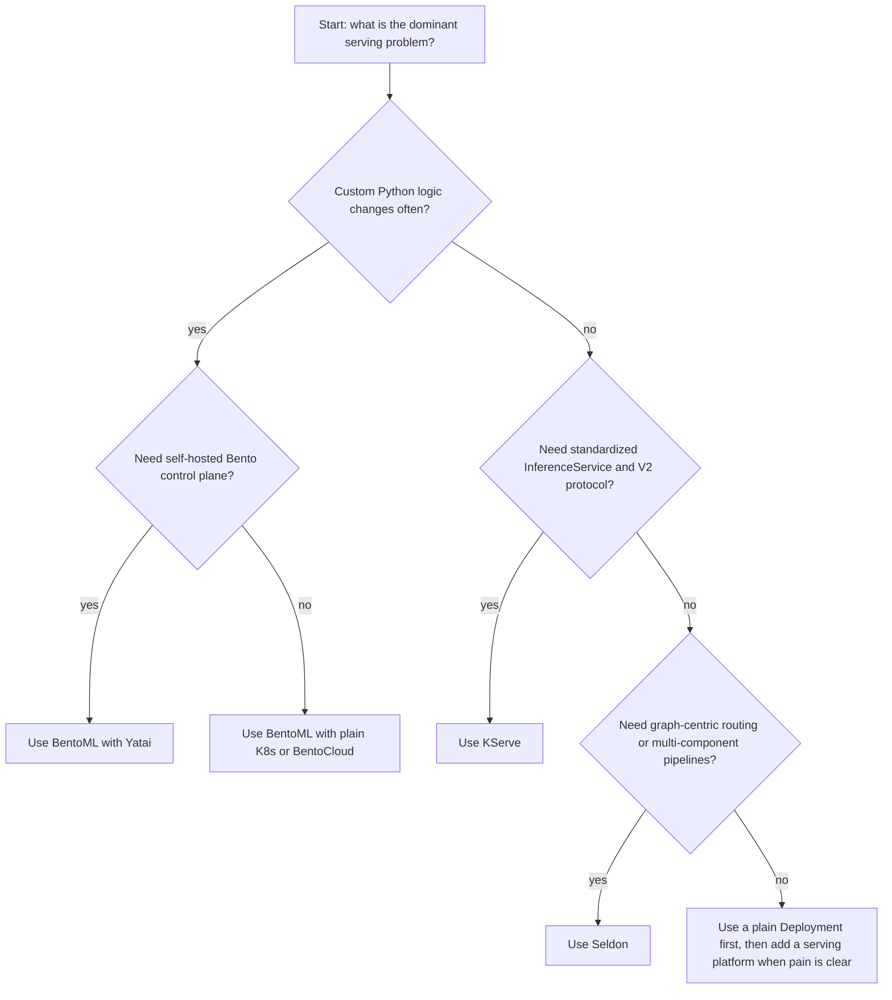

# Module 9.10: BentoML — Python-First Model Packaging and Serving

## Complexity: [COMPLEX]

**Time to Complete**: 50-60 min

**Prerequisites**: K8s basics, Python ML model serving fundamentals; KServe (Module 9.8) or Seldon Core (Module 9.9) helpful for context but not required

## Learning Outcomes

After completing this module, you will be able to:

- **Design** a BentoML Service that separates API logic from model runners while keeping serving behavior close to Python training code.
- **Implement** a reproducible Bento package with model artifacts, service code, dependency metadata, and container build settings.
- **Debug** a BentoML deployment by following requests from a Kubernetes Service through the API server, runner pods, HPAs, and model store references.
- **Evaluate** whether BentoML, KServe, or Seldon is the right serving layer for a team based on developer workflow, protocol needs, scaling shape, and operations burden.
- **Compare** adaptive micro-batching settings by measuring latency, throughput, queueing, and batch-size metrics under concurrent load.

## Why This Module Matters

A retail fraud team trained a model that caught suspicious transactions during a live shopping event. The notebook looked ordinary: a scikit-learn classifier, a text embedding step, a few feature transforms, and a threshold chosen with the risk team. The production path did not look ordinary.

The platform team first wrapped the model in a generic web service, then copied preprocessing logic from the notebook into another repository, then asked the ML team to describe model input and output shapes in YAML. One small preprocessing mismatch caused a weekend rollback. For several hours, the service silently sent poorly normalized features to the classifier.

The incident did not bankrupt the company, but it forced manual review of more than 18,000 transactions and cost roughly $62,000 in review labor, delayed shipments, and customer support credits. No one had made a reckless engineering decision. They had simply split the serving system across too many layers too early.

The people who understood the model did not own the request path. The people who owned Kubernetes did not understand the feature transforms. In practice, that ownership split turned every serving change into a translation exercise. The result was a serving architecture where every change required translation.

BentoML matters because many ML teams live in Python first. They train in Python, validate in Python, and write preprocessing logic in Python. When the serving layer asks them to express behavior through a Kubernetes custom resource first, the tool may be powerful but the feedback loop slows down. BentoML starts from the Python service and then packages it for local serving, containerization, and Kubernetes scale-out. This module teaches how that flow works, where it shines, where it gets operationally complicated, and how to deploy it responsibly on K8s 1.35+.

## BentoML's Python-First Serving Model

BentoML's central idea is simple: model-serving logic should be written where model engineers already work. Instead of starting with a cluster resource and asking Python code to fit inside it later, BentoML starts with a Python Service. The Service describes the public API, the input and output shape, and the runner calls that perform inference.

That sounds small, but it changes the daily workflow. A model engineer can run the service locally with almost no cluster setup. They can test preprocessing, model calls, and response formatting before a Kubernetes operator ever sees the workload.

Only after the service behaves correctly does the team package it into a Bento and containerize it. That ordering matters because it keeps the first feedback loop close to the code that changes most often. This is different from a CRD-driven tool such as KServe or Seldon. In KServe and Seldon, the Kubernetes resource is often the first production artifact.

The CRD describes a model server, predictor, graph, storage URI, traffic rule, or runtime. That approach works well for platform-standardized serving, especially when many teams agree on common model formats and protocols. BentoML solves a different problem: Python-native teams need to package custom serving behavior without losing the fast edit-run-debug loop.

Think of the difference like a restaurant kitchen. A CRD-driven platform is a structured order ticket system. It is excellent when every dish has a known station and clear routing.

BentoML is the chef's prep bench first. It lets the person who knows the recipe assemble the dish, test it, and then send it to the production line. The production line still matters, but the recipe starts in the right place.

The classic BentoML serving model has four abstractions that learners should recognize. The first is `bentoml.Service`. A Service is the API boundary.

It names the service, declares runners, and exposes one or more API functions. Each API function accepts an input descriptor and returns an output descriptor. It is not just a FastAPI wrapper.

It is also metadata that BentoML uses when building a Bento, generating API definitions, serving locally, and preparing container runtime behavior. The second abstraction is the runner. A runner is the execution unit for model inference.

It wraps a model or custom callable and lets BentoML run it outside the API server process. That separation is important because model inference has different resource needs than request parsing. An API server may need light CPU and high concurrency.

An embedding model may need a GPU, more memory, and batching. A classifier may need CPU but scale independently. With runners, those stages can have separate queues, processes, and in Yatai deployments, separate Kubernetes Deployments. The third abstraction is the IO descriptor.

`bentoml.io.JSON` describes JSON request and response payloads, which makes it the right fit for structured metadata, text lists, scores, labels, or mixed fields. `bentoml.io.Image` describes image inputs and handles image decoding at the API boundary when clients send images and the model expects PIL images or arrays. `bentoml.io.NumpyNdarray` describes array payloads for tensors, embeddings, numerical feature arrays, and protocol-compatible clients that already speak array shapes. The descriptor is both documentation and runtime behavior because it tells BentoML how to parse the request, what validation path to use, and how to expose the endpoint.

The fourth abstraction is the Bento. A Bento is the packaged artifact produced from service code, model references, dependency specifications, and runtime configuration. You can run it locally, containerize it, push it, or deploy it with a control plane.

That artifact boundary is what makes BentoML more than a web framework. It gives Python-first development a packaging step with enough metadata to operate the service later. Here is the smallest useful shape of a two-runner Service. The example uses the classic `bentoml.Service` and `bentoml.io` style because many installed BentoML systems still teach and operate through this model.

```python
# service.py
from __future__ import annotations

import bentoml
import numpy as np
from bentoml.io import JSON

embedding_runner = bentoml.picklable_model.get("support_embedder:latest").to_runner(
    name="EmbeddingRunner",
)

classifier_runner = bentoml.sklearn.get("support_classifier:latest").to_runner(
    name="ClassifierRunner",
)

svc = bentoml.Service(
    "support_ticket_intelligence",
    runners=[embedding_runner, classifier_runner],
)


@svc.api(input=JSON(), output=JSON())
async def classify(payload: dict) -> dict:
    texts = payload.get("texts", [])
    if not texts:
        return {"labels": [], "scores": []}

    vectors = await embedding_runner.encode.async_run(texts)
    labels = await classifier_runner.predict.async_run(np.asarray(vectors))
    probabilities = await classifier_runner.predict_proba.async_run(np.asarray(vectors))

    return {
        "labels": labels.tolist(),
        "scores": probabilities.max(axis=1).round(4).tolist(),
    }
```

The API function stays small on purpose. It validates the request shape, calls the embedding runner, passes vectors to the classifier runner, and formats the response. The heavy work is not embedded in the API handler.

That separation lets BentoML schedule the model work differently from the HTTP parsing work. It also gives Yatai enough information to split runners into separate Kubernetes resources. The Service is still normal Python.

That means a model engineer can put familiar checks around the request, call helper functions, import shared preprocessing modules, and write unit tests. The platform team does not need to teach every model engineer a new CRD language before they can run a local endpoint. Local development is usually this direct:

```bash
.venv/bin/pip install bentoml scikit-learn sentence-transformers numpy
bentoml serve service:svc --reload
```

The `--reload` flag keeps the loop short during development. Save the file, send another request, and the local server reloads. That is the zero-config local development promise in practical terms. It does not mean production is config-free. It means the first correct serving behavior can be built without waiting for a cluster.

**Pause and predict:** if `EmbeddingRunner` becomes slow during a traffic spike, should you first scale the API server, the embedding runner, or the classifier runner?

The right first move is to inspect runner-specific queue and latency metrics, then scale the component where work is waiting. Scaling the API server may accept more requests, but it does not add embedding capacity. Scaling the classifier runner may help only if classifier queueing is the measured bottleneck.

This is the first architectural insight of BentoML: serving logic is written as Python, but execution can still be decomposed into independently managed pieces. That gives the learner a bridge between notebooks and Kubernetes. The bridge is not magic. The service still needs dependency control, model versioning, resource requests, security, and rollout discipline. BentoML simply lets the ML team define the serving behavior first, then lets the platform team decide how to run it.

## Bento Packaging and Reproducibility

A Bento package is the deployable unit. It is not only a Python wheel, not only a Docker image, and not only a model file. It is a structured artifact that binds together the service code, model references, dependency environment, and runtime settings.

When a team says a Bento is reproducible, they mean an operator can rebuild or run the serving unit with the same service code, the same model artifacts, and the same dependency intent. That does not remove the need for supply-chain controls. It gives the team a single artifact boundary to inspect.

A Bento typically contains source files selected from the build context. It contains API metadata generated from the Service definition. It contains environment files derived from `bentofile.yaml`, `pyproject.toml`, or newer BentoML runtime settings.

It references or includes model artifacts pulled from the local BentoML model store. It can also include Docker build instructions such as Python version, OS distro, system packages, and setup scripts. That packaging layer is why BentoML can feel lighter than Docker-first development.

In a Docker-first flow, a model engineer often edits Python code, edits a Dockerfile, rebuilds a whole image, and then discovers that model weights or dependency layers changed the cache shape. In a Bento-first flow, the team builds a Bento from the Python service and model store, then containerizes that Bento. BentoML can generate container instructions that separate dependencies, source code, and model payloads in a way that is friendlier to iterative development.

The container image still exists. It is just not the first design surface the learner has to master. A `bentofile.yaml` is the most explicit way to teach this packaging boundary.

The following example is intentionally production-like. It includes only the files needed for serving. It excludes training data, notebooks, caches, local credentials, and tests that should not ship in an inference image. It pins Python package ranges where appropriate. It also overrides the Docker base behavior enough for a platform team to audit the image.

```yaml
# bentofile.yaml
service: "service:svc"
labels:
  owner: "ml-platform"
  use-case: "support-ticket-intelligence"
include:
  - "service.py"
  - "src/**/*.py"
  - "configs/label_map.json"
exclude:
  - "tests/"
  - "notebooks/"
  - "training_data/"
  - ".env"
  - "*.staging.md"
python:
  packages:
    - "bentoml>=1.1,<1.5"
    - "scikit-learn==1.5.2"
    - "sentence-transformers==3.2.1"
    - "numpy==2.1.3"
  lock_packages: true
docker:
  distro: "debian"
  python_version: "3.11"
  system_packages:
    - "libgomp1"
    - "curl"
  setup_script: "./scripts/image-setup.sh"
```

This file answers a few questions before the first production deployment. Which service object is the entry point? Which files become part of the package?

Which local files are excluded? Which Python packages are expected? Which OS-level libraries are needed?

Which Python version should the container use? That clarity matters during incidents. When a model behaves differently in production, the team needs to know whether code, dependencies, model artifacts, or runtime configuration changed.

A Bento is not a substitute for Git, model registry policy, or image scanning. It is the point where those concerns meet. Build commands are direct:

```bash
bentoml build
bentoml list
bentoml get support_ticket_intelligence:latest
```

In newer BentoML projects, teams may also use `bentoml.build()` from Python configuration code. That can be useful when build settings are generated from a release script. For curriculum work, `bentofile.yaml` is clearer because the learner can inspect the packaging intent in one file. To inspect the Bento contents, use the Bento store path.

```bash
cd "$(bentoml get support_ticket_intelligence:latest -o path)"
find . -maxdepth 2 -type f | sort
```

You should expect to see service source, generated API metadata, environment files, and model references. If you see notebooks, raw training data, or local `.env` files, stop and fix the build context. The artifact should be rich enough to serve, but narrow enough to audit.

A practical example: one team accidentally shipped a 2.8 GB CSV training sample inside a serving image. The image built successfully. The deployment worked.

The problem appeared only when autoscaling pulled several replicas at once and node image pulls saturated the cluster network. The fix was not a Kubernetes tuning change. The fix was an `exclude` rule and a review habit around `bentoml get ... -o path`.

Packaging is also where model store discipline begins. BentoML model APIs save model artifacts under names and versions. The Service retrieves them by tag.

The Bento build records what the service needs. That means the serving package can be recreated by resolving the same model tags, instead of depending on a notebook path on someone's laptop. The model store is local by default.

That is good for learning and small development loops. In team settings, the model store needs a shared remote such as BentoCloud or a Yatai-backed workflow so that builds and deployments do not depend on one engineer's workstation. Here are the CLI operations learners should recognize:

```bash
bentoml models list
bentoml models get support_embedder:latest
bentoml models push support_embedder:latest
bentoml models pull support_embedder:latest
```

The `push` and `pull` commands make sense only after a remote is configured. For local-only work, `models list` and `models get` are enough to confirm the saved artifact exists. For shared delivery, model tags must be treated like release inputs.

Do not rely on `latest` in production manifests. Use an immutable versioned tag or a release process that resolves `latest` before deployment. That one habit prevents many "it worked yesterday" investigations.

## Model Store, Yatai, and BentoCloud Control Planes

BentoML's local model store is a developer convenience and an artifact boundary. It is where framework-specific save functions put model binaries, metadata, signatures, labels, and custom objects. For scikit-learn, `bentoml.sklearn.save_model()` records a model in a form the sklearn runner can load.

For generic Python objects, `bentoml.picklable_model.save_model()` can store Python objects that are serializable and suitable for serving. For custom runtimes, a team can define a `bentoml.Runnable` and control method signatures directly. The model store should not be confused with an experiment tracker.

MLflow, Weights & Biases, or a feature platform may still record training runs, parameters, datasets, and evaluation metrics. BentoML's model store is focused on the serving artifact. It answers "what model object will this runner load?" rather than "which experiment produced the best validation curve?"

That distinction helps teams avoid tool overlap. A healthy ML platform often uses both an experiment tracker and a serving package store. The save step in a training pipeline might look like this:

```python
# train_and_save.py
from __future__ import annotations

import bentoml
from sentence_transformers import SentenceTransformer
from sklearn.linear_model import LogisticRegression

embedder = SentenceTransformer("sentence-transformers/all-MiniLM-L6-v2")
classifier = LogisticRegression(max_iter=300)

# The classifier would normally be fitted on labeled embeddings before saving.

bentoml.picklable_model.save_model(
    "support_embedder",
    embedder,
    signatures={
        "encode": {
            "batchable": True,
            "batch_dim": 0,
        }
    },
    labels={"stage": "exercise"},
)

bentoml.sklearn.save_model(
    "support_classifier",
    classifier,
    signatures={
        "predict": {
            "batchable": True,
            "batch_dim": 0,
        },
        "predict_proba": {
            "batchable": True,
            "batch_dim": 0,
        },
    },
    labels={"stage": "exercise"},
)
```

The signatures are not decoration. They tell BentoML which methods are callable and whether calls can be batched. Therefore, the model-save step directly affects runtime behavior later. Without batchable signatures, adaptive batching cannot safely group requests for that method.

That is a common source of "batching is configured but nothing changes" confusion. For a single developer, the local store is enough. For a platform, model artifacts need a control plane.

Yatai is the self-hosted Kubernetes-oriented control plane in the BentoML ecosystem. It runs in a cluster, provides APIs and a dashboard, and coordinates Bentos, models, image building, and deployments. Its architecture includes a relational database such as PostgreSQL and object storage such as S3-compatible storage or GCS-like backends for Bento and model objects. Yatai also has add-on components.

`yatai-image-builder` handles `BentoRequest` resources and builds OCI images from Bentos.

`yatai-deployment` handles `BentoDeployment` resources and reconciles them into Kubernetes workloads.

The important operational idea is that Yatai is not one binary replacing Kubernetes. It is a set of controllers and backing services that let BentoML artifacts move through a Kubernetes-native workflow.

```ascii
+----------------------------------------------------------------------------+
|                         Yatai-Based BentoML Platform                        |
|                                                                            |
|  Developer Workstation                                                     |
|  +--------------------------+                                              |
|  | Service code + models    |                                              |
|  +-------------+------------+                                              |
|                |  build / push                                             |
|                v                                                           |
|  +--------------------------+      +----------------------------------+    |
|  | Yatai API + dashboard    |----->| PostgreSQL metadata store         |    |
|  +-------------+------------+      +----------------------------------+    |
|                |                                                           |
|                v                                                           |
|  +--------------------------+      +----------------------------------+    |
|  | Object storage           |<---->| Bento and model artifacts         |    |
|  +-------------+------------+      +----------------------------------+    |
|                |                                                           |
|                v                                                           |
|  +--------------------------+      +----------------------------------+    |
|  | yatai-image-builder      |----->| OCI registry image                |    |
|  +-------------+------------+      +----------------------------------+    |
|                |                                                           |
|                v                                                           |
|  +--------------------------+      +----------------------------------+    |
|  | yatai-deployment         |----->| API server + runner Deployments   |    |
|  +--------------------------+      +----------------------------------+    |
+----------------------------------------------------------------------------+
```

BentoCloud is the managed SaaS path. It removes much of the database, storage, builder, and controller operation from your team. That is attractive for teams that want to ship model APIs and avoid running another platform stack.

The tradeoff is dependency on a managed service, pricing model, region availability, and whatever governance process your organization requires for SaaS. Self-hosted Yatai makes sense when your organization needs air-gapped or tightly controlled clusters. In that environment, platform ownership is often a feature rather than a burden. It also makes sense when platform engineers already operate PostgreSQL, object storage, registries, ingress, cert-manager, and Prometheus.

The cost is operational responsibility. If Yatai's object store credentials break, Bento builds and deployments can fail. If controller versions drift, CRD behavior can surprise application teams.

If the image builder is underprovisioned, releases slow down. BentoCloud makes sense when the team is small, the compliance model allows it, and speed matters more than platform ownership. It is especially appealing for early production usage, proof-of-value work, or teams that do not want to operate a model-serving control plane. The decision is not ideological. It is a staffing and risk decision.

| Situation | Prefer self-hosted Yatai | Prefer BentoCloud |
|---|---|---|
| Air-gapped cluster | Yes | Usually no |
| Strict data residency | Often yes | Depends on region and policy |
| Team has K8s platform staff | Yes | Maybe |
| Team has two ML engineers and no platform team | Usually no | Yes |
| Need custom internal registry and storage | Yes | Maybe |
| Need fastest path to hosted endpoint | Usually no | Yes |
| Cost model favors existing infrastructure | Maybe | Maybe |

The model store commands are the same mental model either way. Local commands inspect local state. Remote commands synchronize artifacts after authentication.

```bash
bentoml models list
bentoml models get support_classifier:2026-05-01
bentoml models push support_classifier:2026-05-01
bentoml models pull support_classifier:2026-05-01
```

The version tag in this example is a release tag, not a timestamp requirement. Use whatever tagging scheme your platform can audit. The important point is that deployments should reference stable artifacts. When an incident starts, "which model did this pod load?" must be answerable without guessing.

## Containerization and Kubernetes Deployment

This is the central fork in the module. After you have a working Service and a built Bento, you can deploy it in two broad ways. The first path is Yatai-driven.

Yatai understands Bento metadata, runner definitions, deployment CRDs, and image-building workflows. The second path is plain Kubernetes. You containerize the Bento yourself, push the image to a registry, and write normal `Deployment` and `Service` resources.

Both paths are valid. They optimize for different teams. The Yatai path gives you Bento-aware deployment resources.

It can split runner workloads into their own Kubernetes Deployments. It can assign different resources and autoscaling rules to API server and runners. It lets platform teams work through `BentoDeployment` objects instead of hand-writing every pod shape.

The plain Kubernetes path gives you fewer moving parts. It is easier to understand in a small cluster. It is also easier to integrate into teams that already have a standard workload template and do not want another controller. You lose Bento-aware runner decomposition unless you build that pattern yourself. Start with containerization.

`bentoml containerize` takes a Bento and builds an OCI image.

The generated container instructions are designed to preserve useful cache layers. Dependency installation, Bento environment files, service source, and model payloads should not all invalidate together when a learner edits one handler. That matters because model images can be large. If every source edit forces the image builder to re-copy model weights before installing packages, iteration becomes painful.

```bash
bentoml build
bentoml containerize support_ticket_intelligence:latest \
  --image-tag 127.0.0.1:5001/support-ticket-intelligence:bento-2026-05-01
```

To inspect the generated container file without building, use the container utility when your BentoML version supports it.

```bash
.venv/bin/python - <<'PY'
import bentoml

print(
    bentoml.container.get_containerfile(
        "support_ticket_intelligence:latest",
        enable_buildkit=True,
    )
)
PY
```

Look for the order of dependency setup, Bento copy steps, and service entrypoint. You are not expected to edit the generated file for normal work. You inspect it to understand cache behavior and to debug image build surprises.

Before using Yatai, install the deployment controller with Helm. The full Yatai stack has more components, but the deployment piece is the one that reconciles `BentoDeployment`. The examples below introduce the `k` alias once. From here onward, `k` means `kubectl`.

```bash
alias k=kubectl

k create ns yatai-deployment

helm upgrade --install yatai-deployment-crds yatai-deployment-crds \
  --repo https://bentoml.github.io/helm-charts \
  -n yatai-deployment

helm upgrade --install yatai-deployment yatai-deployment \
  --repo https://bentoml.github.io/helm-charts \
  -n yatai-deployment \
  --set layers.network.ingressClass=nginx

k -n yatai-deployment get pods
k get crd | grep bentodeployments
```

A complete Yatai production setup also needs a Yatai component, object storage, database, image builder, registry access, ingress, and certificate management. The exact install shape depends on your cluster. For the module, focus on what the deployment resource expresses. Here is a full `BentoDeployment` example. It gives the API server modest CPU, gives the embedding runner larger memory and optional GPU, gives the classifier runner CPU-focused resources, and assigns separate autoscaling ranges.

```yaml
apiVersion: serving.yatai.ai/v2alpha1
kind: BentoDeployment
metadata:
  name: support-ticket-intelligence
  namespace: ml-serving
  labels:
    app.kubernetes.io/name: support-ticket-intelligence
    app.kubernetes.io/part-of: support-ai
spec:
  bento: support-ticket-intelligence-bento
  ingress:
    enabled: true
  envs:
    - name: LOG_LEVEL
      value: "INFO"
  resources:
    requests:
      cpu: "500m"
      memory: "1Gi"
    limits:
      cpu: "1"
      memory: "2Gi"
  autoscaling:
    minReplicas: 2
    maxReplicas: 6
    metrics:
      cpu:
        target: "70"
  runners:
    - name: EmbeddingRunner
      resources:
        requests:
          cpu: "1"
          memory: "4Gi"
        limits:
          cpu: "2"
          memory: "8Gi"
      autoscaling:
        minReplicas: 1
        maxReplicas: 8
        metrics:
          cpu:
            target: "65"
      envs:
        - name: TOKENIZERS_PARALLELISM
          value: "false"
    - name: ClassifierRunner
      resources:
        requests:
          cpu: "500m"
          memory: "1Gi"
        limits:
          cpu: "1"
          memory: "2Gi"
      autoscaling:
        minReplicas: 1
        maxReplicas: 5
        metrics:
          cpu:
            target: "60"
```

The `spec.bento` field points at a Bento resource known to Yatai. The API server settings live at the top level. Runner settings live under `spec.runners`.

This mirrors the BentoML Service structure. The Service code declared runners, and the deployment spec gives those runners operational shape. Yatai then translates the resource into Kubernetes objects.

You should expect an API server Deployment, runner Deployments, Services, HPAs, and supporting objects. The exact generated names vary by Yatai version, naming settings, and chart configuration. The inspection pattern is stable:

```bash
k -n ml-serving apply -f bentodeployment.yaml
k -n ml-serving get bentodeployment
k -n ml-serving describe bentodeployment support-ticket-intelligence
k -n ml-serving get deploy
k -n ml-serving get hpa
k -n ml-serving get svc
k -n ml-serving get pods -l app.kubernetes.io/part-of=support-ai
```

Follow the request path from the outside inward. The Ingress or Service routes traffic to the Bento API server. The API server receives JSON, validates it, and calls runners.

Each runner has its own queue and worker process. When Yatai splits runners into separate Deployments, those queues and workers can scale separately. That is the architectural insight to keep: runners are independently scalable micro-services, not merely functions inside one serving pod.

```ascii
+----------------------------------------------------------------------------+
|                       BentoDeployment Runtime Shape                         |
|                                                                            |
|  Client                                                                    |
|    |                                                                       |
|    v                                                                       |
|  +----------------------+       +--------------------------------------+   |
|  | Kubernetes Service   |------>| Bento API Server Deployment          |   |
|  +----------------------+       | replicas: 2 to 6                     |   |
|                                 +---------------+----------------------+   |
|                                                 | runner RPC                |
|                    +----------------------------+---------------------+    |
|                    |                                                  |    |
|                    v                                                  v    |
|  +----------------------------------+        +--------------------------+  |
|  | EmbeddingRunner Deployment        |        | ClassifierRunner         |  |
|  | replicas: 1 to 8                  |        | Deployment replicas: 1-5 |  |
|  | queue + adaptive batching         |        | queue + adaptive batch   |  |
|  +----------------------------------+        +--------------------------+  |
|                    |                                                  |    |
|                    v                                                  v    |
|  +----------------------------------+        +--------------------------+  |
|  | Optional GPU / high memory nodes  |        | CPU worker nodes          |  |
|  +----------------------------------+        +--------------------------+  |
+----------------------------------------------------------------------------+
```

This layout makes scale-out more precise. If embeddings are expensive and classifiers are cheap, the embedding runner can grow without multiplying API server replicas. If classifier CPU becomes the limit, the classifier runner can scale without buying more embedding capacity.

If request parsing is the limit, the API server can scale without loading more model copies. That is difficult to achieve with a monolith serving pod. There is a cost.

More Deployments mean more network hops, more objects to monitor, and more version coordination. Small services may not need that complexity. Use the split when model stages have meaningfully different resource profiles or queueing behavior.

The non-Yatai path is normal Kubernetes. Containerize the Bento, push the image, and run it with a Deployment and Service. This path is a good starting point for kind, minikube, or a platform that already has templates.

```yaml
apiVersion: apps/v1
kind: Deployment
metadata:
  name: support-ticket-intelligence
  namespace: ml-serving
  labels:
    app: support-ticket-intelligence
spec:
  replicas: 2
  selector:
    matchLabels:
      app: support-ticket-intelligence
  template:
    metadata:
      labels:
        app: support-ticket-intelligence
    spec:
      containers:
        - name: bento
          image: 127.0.0.1:5001/support-ticket-intelligence:bento-2026-05-01
          imagePullPolicy: IfNotPresent
          ports:
            - name: http
              containerPort: 3000
          env:
            - name: BENTOML_CONFIG
              value: /home/bentoml/bentoml_configuration.yml
          resources:
            requests:
              cpu: "1"
              memory: "4Gi"
            limits:
              cpu: "2"
              memory: "8Gi"
          readinessProbe:
            httpGet:
              path: /readyz
              port: http
            initialDelaySeconds: 10
            periodSeconds: 5
          livenessProbe:
            httpGet:
              path: /livez
              port: http
            initialDelaySeconds: 30
            periodSeconds: 10
---
apiVersion: v1
kind: Service
metadata:
  name: support-ticket-intelligence
  namespace: ml-serving
spec:
  selector:
    app: support-ticket-intelligence
  ports:
    - name: http
      port: 80
      targetPort: http
```

This plain Deployment is simpler to read. It also collapses the API server and runner resource shape into one pod template. That may be acceptable for the first production service. It becomes limiting when one runner needs GPU and another runner does not, or when one queue becomes hot while the rest of the service is idle. Inspect the plain path with ordinary commands:

```bash
k create ns ml-serving
k -n ml-serving apply -f k8s-plain.yaml
k -n ml-serving rollout status deploy/support-ticket-intelligence
k -n ml-serving port-forward svc/support-ticket-intelligence 3000:80
curl -s http://127.0.0.1:3000/classify \
  -H 'content-type: application/json' \
  -d '{"texts":["refund needed","cannot log in"]}' | jq
```

**Before running this, what output do you expect?**

You should expect a JSON object with a label per input text and a score per input text. If you get one label for two texts, inspect batching and output formatting. If you get a server error, inspect runner logs before changing Kubernetes settings.

```bash
k -n ml-serving logs deploy/support-ticket-intelligence --tail=120
k -n ml-serving describe pod -l app=support-ticket-intelligence
```

The debug order matters. First confirm the pod is running and ready. Then confirm the API endpoint exists.

Then confirm the runner methods load the expected model tags. Then confirm request shape and output shape. Only after that should you tune HPA or resource requests. That order prevents Kubernetes from becoming a distraction when the failure is actually Python serialization, model loading, or input validation.

## Adaptive Micro-Batching at the Runner Level

Many inference workloads are faster per item when several inputs are processed together. A vector embedding model can often encode 16 sentences more efficiently than it can encode one sentence 16 separate times. A classifier over numerical arrays can benefit from vectorized NumPy or BLAS operations.

The challenge is that online requests arrive one at a time. Adaptive micro-batching groups concurrent runner calls within a small latency window. Instead of immediately sending each request to the model, the runner waits briefly, forms a batch up to `max_batch_size`, and executes one batched call. The two key knobs are `max_batch_size` and `max_latency_ms`.

`max_batch_size` is the largest batch the runner will form.

`max_latency_ms` is the maximum waiting time before the runner gives up waiting for more inputs.

Larger batches may improve throughput. Larger waiting windows may increase tail latency. The goal is not to make the biggest batch.

The goal is to find the point where throughput improves while user-visible latency remains inside the service objective. BentoML's batching is runner-level. That differs from KServe-style batching, where batching behavior is often expressed at the serving resource or sidecar level.

Runner-level batching is close to the Python method that knows whether batching is valid. The model signature says which method is batchable and which dimension represents the batch. That is useful when one runner can batch but another runner should not.

For example, an embedding method may batch text lists safely. A custom business rule runner that calls an external service may need strict one-at-a-time behavior. Python's Global Interpreter Lock makes this especially relevant.

The GIL can limit CPU-bound Python bytecode from running in true parallel threads. Well-written numerical libraries release the GIL during native compute. Batching helps move work into vectorized native operations where possible.

It also reduces per-request Python overhead, serialization overhead, and scheduling overhead. Batching does not fix every performance problem. If the model is memory-bound, larger batches may slow everything down.

If inputs have highly variable sizes, one large input can delay a batch. If user latency requirements are strict, the batching window may need to stay tiny. Configure batching at the runner level. In BentoML configuration, individual runner settings override aggregate settings.

```yaml
# bentoml_configuration.yml
runners:
  EmbeddingRunner:
    batching:
      enabled: true
      max_batch_size: 32
      max_latency_ms: 10
  ClassifierRunner:
    batching:
      enabled: true
      max_batch_size: 32
      max_latency_ms: 10
```

The runner methods must still be declared batchable in the saved model signature or custom `Runnable` method. Configuration alone cannot safely batch a method that does not accept batched input. For custom runners, the method declaration makes batching explicit.

```python
class EmbeddingRunnable(bentoml.Runnable):
    SUPPORTED_RESOURCES = ("cpu", "nvidia.com/gpu")
    SUPPORTS_CPU_MULTI_THREADING = True

    def __init__(self):
        from sentence_transformers import SentenceTransformer

        self.model = SentenceTransformer("sentence-transformers/all-MiniLM-L6-v2")

    @bentoml.Runnable.method(batchable=True, batch_dim=0)
    def encode(self, texts: list[str]):
        return self.model.encode(texts, normalize_embeddings=True)


EmbeddingRunner = bentoml.Runner(
    EmbeddingRunnable,
    name="EmbeddingRunner",
    max_batch_size=32,
    max_latency_ms=10,
)
```

A real benchmark should compare several windows under the same load. The following scenario is realistic for a CPU embedding-plus-classifier service. The service receives short support-ticket texts.

The load generator sends 80 concurrent clients for 90 seconds. Each request has one text item. The embedding runner uses `all-MiniLM-L6-v2` on a 4 vCPU node. The classifier runner is a logistic regression model over the embedding vector.

| Batching window | Approx throughput | p50 latency | p95 latency | What it means |
|---|---:|---:|---:|---|
| Disabled | 85 req/s | 42 ms | 180 ms | Low waiting, repeated overhead |
| 5 ms, batch 16 | 155 req/s | 55 ms | 165 ms | Better throughput with similar tail |
| 10 ms, batch 32 | 205 req/s | 72 ms | 190 ms | Good tradeoff for batchable text |
| 25 ms, batch 32 | 218 req/s | 96 ms | 260 ms | Small gain, worse tail |
| 50 ms, batch 64 | 224 req/s | 145 ms | 390 ms | Throughput plateaus, latency suffers |

The exact numbers will vary by CPU, model, input length, and container limits. The shape of the curve is the lesson. Throughput climbs quickly when batching removes overhead.

Then it plateaus. Latency continues to rise as requests wait for batches. The best setting is usually near the bend in the curve, not at the largest batch size.



**Pause and predict:** if p95 latency rises after enabling batching but CPU usage drops, what does that suggest?

It suggests the service is waiting longer to form batches than users can tolerate. The runner may be more efficient, but the latency window is too wide for the traffic pattern. Try reducing `max_latency_ms` before adding replicas.

If throughput is still too low, then test both a smaller window and more runner replicas. Batching and autoscaling interact. More replicas can reduce queue depth, which can make batches smaller.

Fewer replicas can form bigger batches, but may raise latency. That is why benchmark results must include both latency and batch-size metrics. Throughput alone can mislead you into choosing a setting that users experience as slow.

## Observability for BentoML Serving

Observability starts before dashboards. A BentoML service has several places where time can disappear. The API server can spend time parsing input.

The request can wait in a runner queue. The runner can wait to form a batch. The model can spend time in compute.

The response can spend time serializing output. If the service is deployed through Yatai, network hops between API server and runner pods add another layer. BentoML exposes Prometheus-friendly metrics and supports custom metrics.

The exact metric names can vary by version and configuration, so learners should always inspect `/metrics` in their own service. Useful families usually include request counts, latency histograms, in-progress requests, runner activity, and custom metrics you define in the Service or runner. For this module, treat these as the operational questions:

How many requests are arriving? How long do API calls take? How long do runner calls take?

How deep are runner queues? What batch sizes are actually forming? How many errors occur per endpoint and runner? Start by port-forwarding and reading metrics directly.

```bash
k -n ml-serving port-forward svc/support-ticket-intelligence 3000:80
curl -s http://127.0.0.1:3000/metrics | head -80
```

Do not write PromQL before seeing the real labels. Metrics are only useful when you know the label set. A label such as endpoint, runner name, method name, or status code changes the query shape. Prometheus scraping can be configured directly when you run your own Prometheus.

```yaml
scrape_configs:
  - job_name: "bentoml-support-ticket"
    scrape_interval: 15s
    metrics_path: /metrics
    kubernetes_sd_configs:
      - role: endpoints
        namespaces:
          names:
            - ml-serving
    relabel_configs:
      - source_labels: [__meta_kubernetes_service_name]
        action: keep
        regex: support-ticket-intelligence
      - source_labels: [__meta_kubernetes_endpoint_port_name]
        action: keep
        regex: http
```

If your cluster uses the Prometheus Operator, a `ServiceMonitor` is usually cleaner.

```yaml
apiVersion: monitoring.coreos.com/v1
kind: ServiceMonitor
metadata:
  name: support-ticket-intelligence
  namespace: ml-serving
spec:
  selector:
    matchLabels:
      app: support-ticket-intelligence
  endpoints:
    - port: http
      path: /metrics
      interval: 15s
```

A useful Grafana dashboard for BentoML should be organized by request path, not by pod first. Start with top-row service indicators: request rate, error rate, p50 latency, p95 latency, and p99 latency. Then add runner panels: queue depth, runner call latency, batch size distribution, runner replica count, and CPU or GPU utilization.

Then add deployment panels: pod restarts, HPA desired replicas, memory working set, and image version. The dashboard should let an on-call engineer answer one question quickly: is the problem at the API boundary, a specific runner, model compute, or cluster scheduling? Alerting should be tied to service objectives. For example, alert when p95 latency for the classify endpoint exceeds 250 ms for 10 minutes and request rate is non-trivial. That avoids waking people for a single slow request during an idle period.

```yaml
groups:
  - name: bentoml-support-ticket
    rules:
      - alert: BentoMLHighP95Latency
        expr: |
          histogram_quantile(
            0.95,
            sum by (le) (
              rate(bentoml_request_duration_seconds_bucket{endpoint="classify"}[5m])
            )
          ) > 0.25
          and
          sum(rate(bentoml_request_total{endpoint="classify"}[5m])) > 5
        for: 10m
        labels:
          severity: page
        annotations:
          summary: "BentoML classify endpoint p95 latency is above SLO"
          description: "Check API latency, runner queue depth, batch size, and HPA behavior."
```

The metric names in this alert are illustrative. Use the names exposed by your installed BentoML version. The structure of the alert is more important than the literal name.

It combines latency and traffic so a quiet service does not create false urgency. OpenTelemetry tracing complements metrics. Metrics tell you that latency rose.

Traces show where one request spent time. BentoML supports OpenTelemetry exporters such as OTLP, Jaeger, and Zipkin depending on installed extras and configuration. In a runner-split deployment, trace context helps correlate the API server span with runner work. That is valuable when the API server looks healthy but downstream runner calls are slow.

```python
svc = bentoml.Service(
    "support_ticket_intelligence",
    runners=[embedding_runner, classifier_runner],
    tracing={
        "exporter_type": "otlp",
        "sample_rate": 0.2,
        "timeout": 5,
        "otlp": {
            "endpoint": "http://otel-collector.observability.svc:4318/v1/traces",
        },
    },
)
```

Access logs are the fastest first check. They tell you whether clients are reaching the API server, which route they call, what status code they receive, and how long the request took at the HTTP boundary. For Yatai runner pods, inspect both API server logs and runner logs.

```bash
k -n ml-serving logs deploy/support-ticket-intelligence-api-server --tail=100
k -n ml-serving logs deploy/support-ticket-intelligence-embeddingrunner --tail=100
k -n ml-serving logs deploy/support-ticket-intelligence-classifierrunner --tail=100
```

The names are examples. Use `k -n ml-serving get deploy` to find the generated names in your cluster. A practical debugging story: a team saw p95 latency jump after enabling batching.

CPU dropped, and throughput improved, so the first guess was that the service was healthier. Customer complaints increased anyway. Metrics showed average batch size climbing from 1.4 to 18, but the trace waterfall showed each request waiting nearly the full batching window before model compute.

The team reduced the window from 25 ms to 8 ms. Throughput stayed much higher than the unbatched baseline, and p95 returned inside the product SLO. That is why observability must include both efficiency and user latency.

## Production Concerns

Production BentoML is still production Kubernetes. Bento packaging does not remove scheduling, credentials, rollout, resource isolation, cost, or incident-response work. It changes the artifact and service model, but the platform responsibilities remain.

GPU sharing is one of the first hard decisions for model-serving teams. An embedding runner may benefit from a GPU, but it may not need a whole physical GPU. Kubernetes normally allocates whole GPU devices through the NVIDIA device plugin.

To share GPUs, teams use NVIDIA MIG on supported hardware or time-slicing through the GPU Operator. MIG partitions supported GPUs into isolated slices. Time-slicing presents multiple schedulable replicas of a GPU but does not provide the same hardware isolation. For runner-based BentoML deployments, the benefit is precise placement. The embedding runner can request GPU resources while the classifier runner stays CPU-only.

```yaml
runners:
  - name: EmbeddingRunner
    resources:
      requests:
        cpu: "2"
        memory: "8Gi"
        nvidia.com/gpu: "1"
      limits:
        cpu: "4"
        memory: "12Gi"
        nvidia.com/gpu: "1"
  - name: ClassifierRunner
    resources:
      requests:
        cpu: "500m"
        memory: "1Gi"
      limits:
        cpu: "1"
        memory: "2Gi"
```

Fractional GPU allocation is a platform feature, not a BentoML feature. If your cluster exposes MIG resources, request the resource name your platform advertises. If your cluster uses time-slicing, understand that memory pressure from one workload can affect others on the same physical device.

Use time-slicing for lower-risk inference and development. Use MIG when isolation and predictable memory are required. Secrets management is another boundary to keep clean.

Do not put credentials in `bentofile.yaml`. Build-time package indexes, cloud tokens, and model-access credentials need a managed path. In Yatai, environment variables can be specified in deployment settings, but sensitive values should come from Kubernetes Secrets when possible.

```yaml
apiVersion: v1
kind: Secret
metadata:
  name: support-ticket-secrets
  namespace: ml-serving
type: Opaque
stringData:
  MODEL_API_TOKEN: "your-api-token-here"
---
apiVersion: apps/v1
kind: Deployment
metadata:
  name: support-ticket-intelligence
  namespace: ml-serving
spec:
  template:
    spec:
      containers:
        - name: bento
          env:
            - name: MODEL_API_TOKEN
              valueFrom:
                secretKeyRef:
                  name: support-ticket-secrets
                  key: MODEL_API_TOKEN
```

Traffic shaping is more manual than in KServe's `InferenceService` rollout model. BentoML and Yatai can run deployments, but they do not give you the same built-in canary abstraction as KServe. You can still do blue/green and canary releases with standard Kubernetes routing. For blue/green, run two Deployments with different version labels and switch the Service selector.

```yaml
apiVersion: v1
kind: Service
metadata:
  name: support-ticket-intelligence
  namespace: ml-serving
spec:
  selector:
    app: support-ticket-intelligence
    version: blue
  ports:
    - name: http
      port: 80
      targetPort: 3000
```

Switch traffic after green is healthy:

```bash
k -n ml-serving get deploy -l app=support-ticket-intelligence
k -n ml-serving rollout status deploy/support-ticket-intelligence-green
k -n ml-serving patch service support-ticket-intelligence \
  -p '{"spec":{"selector":{"app":"support-ticket-intelligence","version":"green"}}}'
k -n ml-serving get endpoints support-ticket-intelligence
```

For canary traffic, use an ingress controller that supports weighted routing. The annotation style depends on the controller. With NGINX Ingress, a common pattern is to create a canary Ingress for the green service and assign a weight.

```yaml
apiVersion: networking.k8s.io/v1
kind: Ingress
metadata:
  name: support-ticket-green-canary
  namespace: ml-serving
  annotations:
    nginx.ingress.kubernetes.io/canary: "true"
    nginx.ingress.kubernetes.io/canary-weight: "10"
spec:
  ingressClassName: nginx
  rules:
    - host: support-ticket.example.com
      http:
        paths:
          - path: /
            pathType: Prefix
            backend:
              service:
                name: support-ticket-intelligence-green
                port:
                  number: 80
```

Blue/green is simpler to reason about. Canary is better when you need gradual exposure. Both require metrics and rollback commands.

Do not roll traffic by hope. Roll traffic when the new version has passed readiness, smoke tests, and early metrics checks. Production also needs resource requests that match runner behavior.

Embedding models often need more memory than classifiers. Image models may need larger request bodies and longer timeouts. Classifier runners may scale on CPU. GPU runners may scale on queue depth or custom metrics rather than CPU. The reason BentoML runners matter is that those differences are visible in the service design instead of hidden in one generic pod.

## Patterns & Anti-Patterns

Patterns are repeatable designs that reduce operational surprise. Anti-patterns are designs that feel faster in the moment but create debugging and ownership problems later.

| Pattern | When to Use It | Why It Works | Scaling Considerations |
|---|---|---|---|
| Python Service first, cluster manifest second | The ML team owns preprocessing and model invocation logic | The serving code can be tested locally before platform rollout | Keep service functions small so runners remain the scaling unit |
| One runner per distinct resource profile | Embedding, ranking, and classification stages need different CPU, memory, or GPU | Yatai or runtime config can scale bottlenecks separately | Watch network overhead and trace cross-runner latency |
| Versioned model tags in release manifests | Production deployments must be reproducible | Incident review can identify the exact model artifact | Automate tag resolution in CI so humans do not hand-edit versions |
| Bento inspection before image push | Images unexpectedly grow or include local files | `bentoml get ... -o path` exposes package contents early | Add review checks for excluded directories and model size |
| Batch tuning with p95 and batch-size metrics | Throughput is important but users notice latency | The team sees both efficiency and waiting time | Tune batching and replica count together, not separately |

| Anti-Pattern | Why Teams Fall Into It | Better Alternative |
|---|---|---|
| Put all model stages inside one giant API handler | It is quick and looks like normal Python | Move heavy inference into runners and keep API logic thin |
| Use `latest` directly in production rollout files | It is convenient during demos | Resolve immutable tags during release and record them in manifests |
| Scale API replicas when a runner queue is hot | The API Deployment is the most visible object | Inspect runner metrics and scale the runner that owns the queue |
| Ship notebooks and training data in the Bento | The build context includes everything by default | Use `include`, `exclude`, and `.bentoignore` with explicit review |
| Treat BentoCloud and Yatai as interchangeable | Both deploy Bentos, so they look equivalent at first | Decide based on control-plane ownership, compliance, and staffing |
| Tune batching from average latency only | Average latency hides tail waiting | Use p50, p95, p99, throughput, queue depth, and batch distribution |

The patterns and anti-patterns have a common theme. BentoML works best when you preserve the Python-native development path without hiding operational reality. If the service boundary is clear, runners are explicit, model tags are stable, and metrics show the real queues, BentoML gives teams a strong path from notebook logic to Kubernetes serving. If everything is collapsed into one process and one image with vague tags, BentoML becomes just another web container.

## Decision Framework

Choosing between BentoML, KServe, and Seldon is not about picking the tool with the most features. It is about matching the serving layer to the team's dominant problem. BentoML is strongest when Python developer experience and custom serving logic are the center of gravity. KServe is strongest when Kubernetes-native standardized inference, autoscaling, and protocol consistency are the center of gravity. Seldon is strongest when inference graphs, protocol-aware runtimes, and model operations patterns across multiple components are the center of gravity.

| Dimension | BentoML | KServe | Seldon |
|---|---|---|---|
| Python-first developer experience | Excellent for custom Python Services and local serving | Moderate; model runtime and CRD shape lead | Good when using Python servers, but graph CRDs remain central |
| K8s operator maturity | Yatai adds Bento-aware deployment, but operating it is a choice | Very strong Kubernetes-native `InferenceService` model | Strong operator history, especially for graph-style deployments |
| Protocol support | REST-first, with gRPC and OpenAPI options depending on version | Strong V1/V2 inference protocol support | Strong REST/gRPC and V2 protocol support through runtimes such as MLServer |
| Multi-framework graph support | Possible through runners and Services | Supports predictors, transformers, explainers, and inference graphs | Strong graph and pipeline orientation |
| Autoscaling granularity | API server and runners can scale separately with Yatai | InferenceService and runtime scaling, often Knative or KEDA based | Component and graph-aware scaling depending on deployment model |
| Observability built-in | Prometheus metrics, custom metrics, OpenTelemetry tracing support | Integrates with Kubernetes, Knative, Prometheus, and platform tools | Strong model monitoring ecosystem and runtime metrics |
| Learning curve | Low for Python teams, medium for Yatai operations | Medium to high for CRDs, Knative/KEDA, storage, runtimes | Medium to high for graphs, runtimes, and operator concepts |
| Production readiness | Strong for Python-native services with disciplined packaging | Strong for standardized model serving platforms | Strong for graph-centric and protocol-centered ML serving |

Use BentoML when the hard part is custom Python serving behavior. Use it when preprocessing, postprocessing, multiple model calls, or framework-specific logic must stay close to model engineers. Use it when local development speed is a serious productivity constraint.

Use it when runner-level batching and runner-level scale match the service's shape. Use KServe when the hard part is standardizing inference across teams. Use it when platform engineers want a common `InferenceService` abstraction, storage URI workflows, protocol compatibility, and built-in traffic-splitting patterns.

Use it when the organization can absorb the CRD and controller model because the payoff is platform consistency. Use Seldon when the hard part is graph-oriented serving. Use it when requests must flow through routers, ensembles, explainers, outlier detectors, or multiple model components with clear graph semantics. Use it when the team values Seldon's runtime ecosystem and inference graph model more than a pure Python-first packaging loop.



Which approach would you choose here and why? Your team has five data scientists, one platform engineer, a text model with custom preprocessing, and no existing serving CRD standard. BentoML is probably the first tool to evaluate because it lets the data scientists own the serving behavior and lets the platform engineer start with a plain Deployment before adding Yatai.

If the same company later standardizes dozens of framework-compatible models with strict protocol requirements, KServe may become the better platform layer. The decision can change as the organization changes. That is not failure. It is platform evolution.

## Did You Know?

- BentoML 1.0 was announced in 2022, after the project had already been used by Python ML teams that wanted a packaging layer between notebooks and production services.
- The `all-MiniLM-L6-v2` sentence-transformers model produces 384-dimensional embeddings, which is small enough for quick CPU exercises but realistic enough to show batching behavior.
- NVIDIA MIG can split supported A100 and H100 GPUs into multiple hardware-isolated GPU instances, which is why runner-level resource separation matters for mixed inference services.
- A 10 ms batching window sounds tiny, but at 200 requests per second it can collect several concurrent requests without making most users perceive a long pause.

## Common Mistakes

| Mistake | Why It Happens | How to Fix It |
|---|---|---|
| Saving a model without batchable signatures and then expecting batching to work | The batching config looks complete, but the model method metadata says single input | Add `signatures` with `batchable: True` and `batch_dim: 0`, then rebuild the Bento |
| Putting preprocessing in a notebook and different preprocessing in `service.py` | Teams copy code during productionization and small differences appear | Move shared preprocessing into an importable module and test it from training and serving |
| Using `latest` in `BentoDeployment` or image tags | It keeps examples short but hides what actually shipped | Promote immutable Bento, model, and image tags through CI |
| Scaling the wrong layer during a latency incident | The visible Deployment gets changed before runner queues are checked | Inspect endpoint latency, runner latency, queue depth, and HPA status in that order |
| Shipping extra files inside the Bento | The build context is broad and excludes are missing | Use explicit `include`, explicit `exclude`, and inspect `bentoml get ... -o path` |
| Treating Yatai as a free add-on | The first demo hides database, storage, registry, ingress, and controller operations | Choose Yatai only when the platform team will own its dependencies |
| Increasing `max_latency_ms` until throughput looks good | Throughput graphs reward waiting, but users experience tail latency | Tune against p95 and p99 latency while watching actual batch-size distribution |
| Putting credentials directly in build files | It is convenient during local testing | Use Kubernetes Secrets, deployment environment injection, or a managed secret provider |

## Quiz

<details><summary>Your BentoML service has an API server at 30% CPU, an embedding runner at 95% CPU, and a classifier runner at 20% CPU. p95 latency is above the SLO. What should you change first?</summary>

Scale or tune the embedding runner first, because the measured bottleneck is there. Adding API server replicas would accept more incoming work but would not add embedding capacity. Scaling the classifier runner would probably waste resources because it is not saturated. Before changing replica counts, also inspect embedding runner queue depth and batch-size metrics to decide whether batching or replicas are the better first adjustment.

</details>

<details><summary>A team builds a Bento successfully, but the container image is several gigabytes larger than expected. The service still runs. What do you inspect, and what fix is most likely?</summary>

Inspect the Bento contents with `bentoml get BENTO_TAG -o path` before investigating Kubernetes. The likely issue is that the build context included notebooks, raw datasets, caches, or extra artifacts. Fix `include`, `exclude`, or `.bentoignore`, then rebuild and compare the package contents. This is a packaging problem first, not a cluster scheduling problem.

</details>

<details><summary>Your organization has one platform team, many product teams, and a requirement that all models expose the V2 inference protocol through a common Kubernetes API. Should BentoML be the default serving platform?</summary>

Probably not as the default platform abstraction. KServe is likely a stronger first choice because it centers standardized Kubernetes resources and protocol-compatible serving. BentoML may still be useful for specific Python-heavy services, but the stated organization need is standardization across many teams. The decision should optimize for the common operating model, not only the easiest local developer experience.

</details>

<details><summary>After enabling a 25 ms batch window, throughput improves by 8%, but p95 latency rises by 70 ms and customer-facing calls time out more often. What should you do next?</summary>

Reduce the batch latency window and retest under the same load. The small throughput gain does not justify the tail-latency regression for a user-facing service. Also compare actual batch-size distribution; if batches are already large at a smaller window, the wider window is simply adding waiting time. If throughput remains insufficient after reducing the window, test additional runner replicas.

</details>

<details><summary>A Yatai `BentoDeployment` creates separate runner Deployments. One runner keeps restarting while the API server remains ready. How do you debug without masking the failure?</summary>

Inspect the runner Deployment and pod logs directly, rather than only the API server logs. Check model loading errors, missing environment variables, memory limits, and resource scheduling for that runner. Do not scale the API server as a workaround because the failed runner is the component that owns the broken model work. The separated deployment shape is useful precisely because it reveals which runner is unhealthy.

</details>

<details><summary>Your security team rejects a `bentofile.yaml` because it contains a private package token in a pip index URL. The ML team says the image cannot build without it. What is the better release design?</summary>

Move the secret out of the build file and into a controlled secret path used by the build system. Depending on the environment, that may be a CI secret, a private package mirror, BuildKit secret mounting, or a managed image builder setting. The source file should describe dependency intent without exposing credentials. This preserves reproducibility while keeping sensitive values out of Git and package artifacts.

</details>

<details><summary>Your team has a simple CPU-only sklearn model with no custom preprocessing and very low traffic. Should you introduce Yatai immediately?</summary>

Probably not. A plain BentoML container running as a normal Kubernetes Deployment may be enough at first. Yatai becomes more attractive when runner-level scaling, shared Bento artifact management, image-building workflows, or multiple teams justify the control-plane overhead. Start with the simpler operating model and add Yatai when it solves a real coordination problem.

</details>

## Hands-On Exercise

In this exercise, you will build a Bento with two runners: a vector embedding runner and a text classifier runner. You will containerize the Bento, deploy it to K8s with adaptive micro-batching enabled on both runners, and observe latency and throughput change as the batch window grows. The exercise uses plain Kubernetes first so the request path is visible.

Yatai is intentionally discussed in the core lesson, but the hands-on path avoids requiring a full Yatai control plane. You need a local virtual environment, Docker or another OCI builder supported by your BentoML version, kind, and a local registry reachable by the cluster. The examples assume K8s 1.35+ and a shell where `k` is already aliased to `kubectl`. If it is not, run this once:

```bash
alias k=kubectl
```

### Task 1: Install BentoML and Save Two Models

Start by creating a clean project directory and installing only the serving dependencies needed for the exercise. Keeping this environment small makes later Bento inspection easier because stray training tools and notebooks are less likely to leak into the build context.

```bash
mkdir -p bentoml-two-runner-demo
cd bentoml-two-runner-demo
.venv/bin/pip install bentoml scikit-learn sentence-transformers numpy
```

Next, create `train_and_save.py` so the exercise has two model artifacts with batchable signatures. The script intentionally trains a tiny classifier from embeddings because the goal is to practice the serving workflow, not to optimize model quality.

```python
from __future__ import annotations

import bentoml
import numpy as np
from sentence_transformers import SentenceTransformer
from sklearn.linear_model import LogisticRegression

texts = [
    "my payment failed",
    "refund the duplicate charge",
    "cannot access my account",
    "password reset link expired",
    "shipping address is wrong",
    "where is my package",
    "invoice has the wrong tax",
    "billing contact changed",
]

labels = np.array([
    "billing",
    "billing",
    "account",
    "account",
    "shipping",
    "shipping",
    "billing",
    "account",
])

embedder = SentenceTransformer("sentence-transformers/all-MiniLM-L6-v2")
vectors = embedder.encode(texts, normalize_embeddings=True)

classifier = LogisticRegression(max_iter=300)
classifier.fit(vectors, labels)

bentoml.picklable_model.save_model(
    "demo_embedder",
    embedder,
    signatures={"encode": {"batchable": True, "batch_dim": 0}},
)

bentoml.sklearn.save_model(
    "demo_classifier",
    classifier,
    signatures={
        "predict": {"batchable": True, "batch_dim": 0},
        "predict_proba": {"batchable": True, "batch_dim": 0},
    },
)
```

Run the training script with the project virtual environment and then inspect the BentoML model store. This check confirms that the Service code later can retrieve both artifacts by tag instead of depending on local notebook state.

```bash
.venv/bin/python train_and_save.py
bentoml models list
```

<details><summary>Solution and success check for Task 1</summary>

You should see `demo_embedder` and `demo_classifier` in `bentoml models list`. If the classifier training fails, check that `sentence-transformers`, `scikit-learn`, and `numpy` installed in the same virtual environment. If the model save step fails, confirm that the script is using `.venv/bin/python` and not a system Python. The success criterion is that both models have tags visible in the local BentoML model store.

</details>

### Task 2: Write a Two-Runner Service and Test Locally

Create `service.py` with one API function and two runners. The API handler should stay thin, while the embedding and classifier runners own the model work that you will later tune through batching and Kubernetes resources.

```python
from __future__ import annotations

import bentoml
import numpy as np
from bentoml.io import JSON

embedding_runner = bentoml.picklable_model.get("demo_embedder:latest").to_runner(
    name="EmbeddingRunner",
)

classifier_runner = bentoml.sklearn.get("demo_classifier:latest").to_runner(
    name="ClassifierRunner",
)

svc = bentoml.Service(
    "demo_text_intelligence",
    runners=[embedding_runner, classifier_runner],
)


@svc.api(input=JSON(), output=JSON())
async def classify(payload: dict) -> dict:
    texts = payload.get("texts", [])
    if not isinstance(texts, list):
        return {"error": "texts must be a list"}
    if not texts:
        return {"labels": [], "scores": []}

    vectors = await embedding_runner.encode.async_run(texts)
    matrix = np.asarray(vectors)
    labels = await classifier_runner.predict.async_run(matrix)
    probabilities = await classifier_runner.predict_proba.async_run(matrix)

    return {
        "labels": labels.tolist(),
        "scores": probabilities.max(axis=1).round(4).tolist(),
    }
```

Serve the Service locally before building a Bento so Python errors, missing model tags, and response-shape mistakes appear in the shortest feedback loop. A local request should prove that both runners load and that the response contains one prediction per input text.

```bash
bentoml serve service:svc --reload
```

In another terminal, send a small request against the local endpoint while the development server is still running. This separates server logs from client output, which makes it easier to notice whether a failure is request parsing, runner loading, or response formatting.

```bash
curl -s http://127.0.0.1:3000/classify \
  -H 'content-type: application/json' \
  -d '{"texts":["refund my payment","my login link expired"]}' | jq
```

<details><summary>Solution and success check for Task 2</summary>

You should receive two labels and two scores. If the endpoint is missing, confirm that the API function is named `classify` and that the server logs show the Service loaded. If model loading fails, rerun `bentoml models list` and confirm the expected model names. The success criterion is a local HTTP response that classifies both input strings.

</details>

### Task 3: Build the Bento and Inspect Container Layers

Create `bentofile.yaml` to describe the package boundary explicitly. The file names the Service entry point, includes the runtime configuration, excludes local-only material, and pins dependency intent so the container build is reviewable.

```yaml
service: "service:svc"
include:
  - "service.py"
  - "bentoml_configuration.yml"
exclude:
  - "tests/"
  - "notebooks/"
  - ".env"
python:
  packages:
    - "bentoml>=1.1,<1.5"
    - "scikit-learn==1.5.2"
    - "sentence-transformers==3.2.1"
    - "numpy==2.1.3"
docker:
  distro: "debian"
  python_version: "3.11"
  system_packages:
    - "libgomp1"
```

Add a first batching configuration before the initial build so the Bento records the runner behavior you want to evaluate. Both runners are enabled here to make the mechanics visible, even though a real service might batch one method and leave another unbatched.

```yaml
# bentoml_configuration.yml
runners:
  EmbeddingRunner:
    batching:
      enabled: true
      max_batch_size: 32
      max_latency_ms: 10
  ClassifierRunner:
    batching:
      enabled: true
      max_batch_size: 32
      max_latency_ms: 10
```

Build the Bento and inspect its stored files before containerizing it. This is the moment to catch accidental notebooks, raw data, credentials, or missing configuration while the artifact is still easy to rebuild.

```bash
bentoml build
bentoml list
cd "$(bentoml get demo_text_intelligence:latest -o path)"
find . -maxdepth 2 -type f | sort
cd -
```

Containerize the Bento and inspect the generated build output as an operational artifact. The important lesson is the layer order and packaged content, because those details affect image size, rebuild speed, and release debugging.

```bash
bentoml containerize demo_text_intelligence:latest \
  --image-tag 127.0.0.1:5001/demo-text-intelligence:bento-v1 \
  --progress plain
```

<details><summary>Solution and success check for Task 3</summary>

The Bento should build and appear in `bentoml list`. The Bento path should contain service source, environment metadata, and generated API files. The container build output should show dependency and Bento copy steps rather than a hand-written Dockerfile from your project. The success criterion is a local image tagged `127.0.0.1:5001/demo-text-intelligence:bento-v1`.

</details>

### Task 4: Push to a Local Registry and Deploy with Plain Kubernetes

For kind, create or reuse a local registry that the cluster can reach. The exact registry setup varies by workstation. One common pattern is to run a registry on `127.0.0.1:5001`, connect it to the kind network, and configure the cluster to use it. Push the image.

```bash
docker push 127.0.0.1:5001/demo-text-intelligence:bento-v1
```

Create `k8s-plain.yaml` with a Namespace, Deployment, and Service so the first cluster deployment uses ordinary Kubernetes objects. This keeps the request path visible before introducing a Yatai control plane or runner-split deployment.

```yaml
apiVersion: v1
kind: Namespace
metadata:
  name: ml-serving
---
apiVersion: apps/v1
kind: Deployment
metadata:
  name: demo-text-intelligence
  namespace: ml-serving
spec:
  replicas: 2
  selector:
    matchLabels:
      app: demo-text-intelligence
  template:
    metadata:
      labels:
        app: demo-text-intelligence
    spec:
      containers:
        - name: bento
          image: 127.0.0.1:5001/demo-text-intelligence:bento-v1
          ports:
            - name: http
              containerPort: 3000
          resources:
            requests:
              cpu: "1"
              memory: "4Gi"
            limits:
              cpu: "2"
              memory: "8Gi"
          readinessProbe:
            httpGet:
              path: /readyz
              port: http
            initialDelaySeconds: 10
            periodSeconds: 5
---
apiVersion: v1
kind: Service
metadata:
  name: demo-text-intelligence
  namespace: ml-serving
spec:
  selector:
    app: demo-text-intelligence
  ports:
    - name: http
      port: 80
      targetPort: http
```

Deploy the manifest and verify the rollout before testing the API through the Service. If the response fails, use the rollout status and pod logs to distinguish image pull problems from BentoML startup or model-loading errors.

```bash
k apply -f k8s-plain.yaml
k -n ml-serving rollout status deploy/demo-text-intelligence
k -n ml-serving port-forward svc/demo-text-intelligence 3000:80
curl -s http://127.0.0.1:3000/classify \
  -H 'content-type: application/json' \
  -d '{"texts":["where is my invoice","cannot sign in"]}' | jq
```

<details><summary>Solution and success check for Task 4</summary>

The Deployment should reach ready state and the port-forwarded request should return labels and scores. If the pod cannot pull the image, fix local registry connectivity before changing BentoML code. If the pod starts but readiness fails, check container logs and model loading errors. The success criterion is a working response through the Kubernetes Service.

</details>

### Task 5: Compare Batching Windows Under Load

Run a baseline with batching disabled before comparing any latency windows. Edit `bentoml_configuration.yml`, rebuild, retag, push, and redeploy so every measurement comes from a fresh image whose batching behavior is known.

```yaml
runners:
  EmbeddingRunner:
    batching:
      enabled: false
  ClassifierRunner:
    batching:
      enabled: false
```

Use `hey` or `wrk` to apply concurrent load against the port-forwarded Service. Keep the payload, concurrency, and duration stable across runs, because changing the load shape at the same time as the batching window makes the results hard to interpret.

```bash
cat > payload.json <<'EOF'
{"texts":["refund my duplicate payment"]}
EOF

hey -z 60s -c 80 -m POST \
  -H 'content-type: application/json' \
  -D payload.json \
  http://127.0.0.1:3000/classify
```

Now test windows of 5 ms, 10 ms, and 25 ms with `max_batch_size: 32`. For each run, rebuild the Bento, containerize, push, restart the Deployment, and record throughput, p50, and p95.

```yaml
runners:
  EmbeddingRunner:
    batching:
      enabled: true
      max_batch_size: 32
      max_latency_ms: 10
  ClassifierRunner:
    batching:
      enabled: true
      max_batch_size: 32
      max_latency_ms: 10
```

<details><summary>Solution and success check for Task 5</summary>

You should see throughput improve when small batching windows are enabled, especially for the embedding runner. You may also see p95 latency rise as the window grows. The best setting is the one that meets the latency objective while improving throughput enough to matter. The success criterion is a small benchmark table comparing disabled batching, 5 ms, 10 ms, and 25 ms windows.

</details>

### Task 6: Scrape Metrics and Query Batch Behavior

Confirm metrics are exposed.

```bash
curl -s http://127.0.0.1:3000/metrics | head -80
```

Add a Prometheus scrape configuration or a `ServiceMonitor`, depending on your cluster. Then query request latency and batch behavior. Metric names vary by BentoML version, so first search for runner and batch labels.

```bash
curl -s http://127.0.0.1:3000/metrics | grep -i batch | head -20
curl -s http://127.0.0.1:3000/metrics | grep -i runner | head -20
```

Example PromQL shapes:

```promql
histogram_quantile(
  0.95,
  sum by (le) (
    rate(bentoml_request_duration_seconds_bucket{endpoint="classify"}[5m])
  )
)
```

```promql
sum(rate(bentoml_runner_batch_size_sum[5m]))
/
sum(rate(bentoml_runner_batch_size_count[5m]))
```

<details><summary>Solution and success check for Task 6</summary>

The exact batch metric may differ in your BentoML version, so the first success condition is finding the real exported metric. If no batch metric exists, add a custom metric in the runner or service and record batch length when the method runs. The second success condition is a PromQL query that changes when you increase or decrease the batching window. The final success criterion is a short note explaining the tradeoff you observed between latency and throughput.

</details>

### Exercise Success Criteria

- [ ] `bentoml models list` shows both the embedding model and classifier model.
- [ ] `bentoml serve service:svc --reload` returns labels and scores for two input texts.
- [ ] `bentoml build` creates a Bento that contains only serving-relevant files.
- [ ] `bentoml containerize` creates a runnable image and pushes it to the local registry.
- [ ] A plain Kubernetes Deployment and Service expose the Bento through `k port-forward`.
- [ ] Adaptive micro-batching is enabled on both runners and benchmarked with at least three latency windows.
- [ ] Prometheus can scrape `/metrics`, and you have a query for latency plus a query or custom metric for batch size.

## Sources

- https://docs.bentoml.com/en/latest/
- https://github.com/bentoml/BentoML
- https://docs.bentoml.org/en/latest/reference/bentoml/bento-build-options.html
- https://docs.bentoml.org/en/latest/reference/bentoml/cli.html
- https://docs.bentoml.org/en/latest/build-with-bentoml/model-loading-and-management.html
- https://docs.bentoml.org/en/1.1/concepts/runner.html
- https://docs.bentoml.org/en/latest/build-with-bentoml/observability/tracing.html
- https://docs.bentoml.org/en/1.1/guides/metrics.html
- https://github.com/bentoml/Yatai
- https://docs.yatai.io/en/latest/
- https://docs.yatai.io/en/latest/concepts/architecture.html
- https://docs.yatai.io/en/latest/concepts/bentodeployment_crd.html
- https://docs.yatai.io/en/latest/installation/yatai_deployment.html
- https://opentelemetry.io/docs/languages/python/
- https://kserve.github.io/website/docs/concepts/architecture/data-plane/v2-protocol
- https://kserve.github.io/website/docs/concepts/resources/inferencegraph
- https://docs.seldon.ai/seldon-core-1/concepts/overview
- https://docs.seldon.ai/seldon-core-1/configuration/routing/inference-graph
- https://kubernetes.io/docs/concepts/services-networking/service/
- https://docs.nvidia.com/datacenter/cloud-native/gpu-operator/latest/gpu-sharing.html

## Next Module

Next: bare-metal MLOps recipe (Module 9.11)
