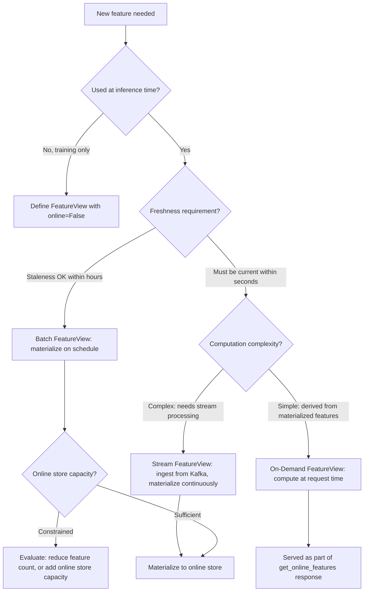

> **Toolkit Track** | Complexity: `[MEDIUM]` | Time: 50-60 minutes
>
> **Prerequisites**: Basic ML concepts, Python familiarity, Kubernetes fundamentals. The [MLOps Discipline](/platform/disciplines/data-ai/mlops/) module provides useful context on the broader ML lifecycle that feature stores plug into.

## What You'll Be Able to Do

After completing this module, you will be able to:

- **Deploy a feature store to serve ML features consistently between training and inference, eliminating the training-serving skew that silently degrades model performance in production**
- **Configure feature definitions, data sources, and materialization jobs that keep online and offline stores in sync across batch and real-time serving patterns**
- **Implement point-in-time-correct historical feature retrieval that prevents future-data leakage when building training datasets from time-series sources**
- **Evaluate feature store architectures across the OSS and managed landscape, selecting the right tradeoffs for your team's scale, latency budget, and infrastructure constraints**

## Why This Module Matters

Every team that runs ML in production eventually hits the same wall. The model that scored beautifully during training produces bafflingly wrong predictions when serving real traffic. The root cause, more often than not, is not a model architecture problem or a hyperparameter bug. It is that the features fed to the model during training were computed one way, and the features fed during inference were computed a different way. Different SQL, different aggregation windows, different handling of nulls and late-arriving data. The model sees two different realities, and the gap between them — training-serving skew — is one of the hardest problems in operational ML because it is silent. Your monitoring dashboards look fine. Your training loss curves are textbook. Only your users notice, and by then the damage is done.

The problem compounds as organizations grow. Data scientists on different teams independently re-implement the same features: user engagement scores, transaction aggregates, text embeddings, geospatial bucketing. Each implementation has slightly different semantics, and none of them are documented in a place anyone else can find. A feature store solves both problems at once by making features first-class, governed artifacts: defined once, implemented once, and served consistently whether you are pulling two years of history for a training job or a single vector in under ten milliseconds for a real-time prediction. It is not a database. It is not a feature engineering library. It is the central switchboard that guarantees every model in your organization reads the same signal from the same source, at the right point in time.

> **Hypothetical scenario:** A payments company builds a fraud model that achieves outstanding precision in offline evaluation. The critical feature is `avg_transaction_amount_7d`, computed as a rolling window from a data warehouse. During training, the data scientists run a Spark job that processes the full transaction table with a seven-day trailing window anchored to each transaction's timestamp. Six months later, the ML engineering team deploys the model behind a real-time endpoint. They re-implement `avg_transaction_amount_7d` as a Redis sorted-set query that expires entries after exactly seven days. The two implementations diverge: the warehouse version includes the current day (window end is inclusive), the Redis version excludes it; the warehouse handles weekends with adjusted business-day logic, the Redis version does not. The model's precision drops by roughly 15 percentage points in production. No alert fires because the model's confidence scores remain high — it is confidently wrong. The investigation takes three weeks because nobody considered that the same feature name meant two different things.

This module teaches the durable architecture of feature stores: the concepts, the data-plane separation, the point-in-time join, and the operational patterns that keep skew at bay. We use Feast, the open-source feature store governed by LF AI & Data, as the running worked example. The ideas transfer across every feature store in the landscape, whether you ultimately choose an OSS self-hosted deployment or a managed cloud offering.

## The Core Problem: Training-Serving Skew

Training-serving skew is the difference between the feature values a model sees during training and the feature values it encounters during inference. It is not a single bug with a single fix. It is a class of failure modes that arise whenever the feature computation pipeline has two independent implementations — one for batch training, one for online serving — and those implementations drift apart over time. Skew is especially dangerous because it does not manifest as an obvious crash or an error log. The model continues to produce predictions at normal latency. Those predictions simply become less accurate, gradually and invisibly, until someone compares production outcomes against a fresh holdout set and discovers that the model is no better than a heuristic.

Three distinct mechanisms produce skew, and a well-designed feature store addresses all three. The first is **implementation divergence**, where the same logical feature is computed with different code paths for training and serving. A data scientist writes a Python function that runs in a notebook against Parquet files; an ML engineer re-implements the same logic in a Java microservice against a Redis cache. Even when both implementations start identical, they evolve independently — a bug fix applied to one, a performance optimization added to the other, a schema change handled in one path but not the other. The second mechanism is **temporal mismatch**, where training uses stale batch features computed at the start of a nightly ETL window while serving uses features that reflect the latest streaming state. A feature like `items_in_cart` is meaningless if the training snapshot is always twelve hours old but inference sees the user's current session. The third is **data leakage through time**, where training datasets inadvertently include information that would not have been available at prediction time — a join against a table that includes rows written after the target event occurred. This is the point-in-time problem we treat in depth below, and it is the subtlest and most damaging form of skew because it makes your model look better in evaluation than it could ever be in reality.

> **Landscape snapshot — as of 2026-06. This changes fast; verify against vendor docs before relying on specifics.** Feast is at GitHub release v0.64.0 (docs.feast.dev), governed by LF AI & Data (lfaidata.foundation/projects/feast). Published Docker images on Docker Hub (feastdev/feature-server) lag at 0.46.0 as the latest numbered tag; the `latest` floating tag tracks the most recent published build. Feast supports Python 3.10-3.12, provides SDKs for defining entities, feature views, and feature services as code, and runs its online serving layer as a gRPC service deployable on Kubernetes. Offline stores include BigQuery, Snowflake, Redshift, and file-based (Parquet). Online stores include Redis, DynamoDB, Bigtable, and more. Materialization jobs move features from offline to online stores on a schedule or incrementally.

## Architecture: The Two-Store Design

Every feature store worthy of the name separates storage into two distinct tiers — an offline store for training data generation and an online store for inference serving — and provides a controlled mechanism for moving data between them. This separation is not an implementation detail. It is the architectural insight that makes consistent feature serving possible, because the two stores are optimized for fundamentally different access patterns.

### The Offline Store

The offline store is a high-latency, high-throughput data system designed to answer the question "what was the state of the world at an arbitrary point in the past?" It typically sits on top of a data warehouse (BigQuery, Snowflake, Redshift) or a data lake (S3 with Parquet, Delta Lake, Iceberg), and it stores the full time-series history of every feature. When a data scientist builds a training dataset, they specify a set of entity keys and the timestamps at which predictions would have been made. The feature store queries the offline store, performs a point-in-time join to select the correct historical feature values, and returns a DataFrame ready for model training. The offline store must handle scans over billions of rows with join logic that respects temporal boundaries, and it trades latency — queries take seconds to minutes — for completeness and correctness.

What distinguishes an offline store from a plain data warehouse is that the feature definitions are stored separately from the raw data, and the join logic understands the temporal semantics of each feature. A `user_total_orders` feature view might pull from a BigQuery table of order events, aggregate counts by user, and store the results as a time-series materialization. When a training query arrives for `user_id = 5` at `2026-03-15 14:30:00`, the feature store does not simply pull the latest row from the feature table. It retrieves the feature value as it existed at that exact timestamp, using the feature view's declared timestamp column and TTL to find the correct version. This logic is executed by the feature store's retrieval engine, not by hand-written SQL in a notebook.

### The Online Store

The online store is a low-latency key-value system optimized for the inference path, where a model endpoint must retrieve feature vectors in single-digit milliseconds to avoid adding unacceptable overhead to the prediction response time. It stores only the latest value of each feature for each entity, and it is queried by entity key: "give me the current feature values for `user_id = 5`." The online store does not maintain history. Its sole job is to serve the freshest available value as fast as possible. Redis, DynamoDB, and Bigtable are the most common backing stores because they provide consistent sub-millisecond reads at scale.

The online store is provisioned separately from the offline store for an important reason beyond latency. The offline store is shared across the entire data organization and may be under heavy analytical load from non-ML workloads. If model inference depended directly on the warehouse for feature retrieval, a poorly-timed dashboard refresh or an ETL backfill could spike warehouse latency and cascade into prediction timeouts across every model in production. Isolating the online store behind a dedicated feature server — a thin gRPC or REST service that accepts entity keys and returns feature vectors — decouples inference performance from analytical workload, and it also means you can scale the online tier independently: more Redis replicas as traffic grows, without touching the warehouse configuration.

### Materialization

Materialization is the bridge between the two stores. It is the process of reading the latest feature values from the offline store and writing them into the online store, and it runs on a schedule — every hour, every five minutes, or incrementally after each new batch of source data lands. A materialization job is essentially a parameterized query: "for feature view `user_features`, for every entity with data fresher than the last materialization watermark, compute the current feature value and upsert it into Redis." Scheduled materialization means the online store always lags the offline store by at most one materialization interval. If your materialization runs hourly, features in the online store can be up to one hour stale. If that staleness window is unacceptable for a given feature — for example, a `clicks_last_5min` counter that must reflect the user's current session — you have two options: shorten the materialization interval, or use an on-demand feature view that computes the value at request time by reading directly from a stream or an external API. The materialization architecture makes the staleness tradeoff explicit and configurable per feature.

Materialization is also where the operational and cost model of a feature store becomes visible. A materialization job that scans the entire offline store on every run wastes compute and slows down feature freshness, but an incremental materialization that only processes newly-arrived source data requires the offline store to expose a reliable watermark column or change-data-capture feed. Feast's `materialize-incremental` command implements the latter by tracking the latest materialization timestamp and only processing source rows with timestamps after that watermark. The tradeoff is that incremental materialization requires the source data to carry a monotonically-increasing timestamp that the feature store can checkpoint — a property that most data warehouses satisfy but that streaming sources may not, depending on their ordering guarantees. Understanding this dependency is critical when designing a materialization schedule, because a materialization job that silently skips rows due to a timestamp ordering issue is producing online features that are correct from the store's perspective but stale from the model's perspective.

```
THE TWO-STORE ARCHITECTURE
════════════════════════════════════════════════════════════════════

                    ┌───────────────────────────┐
                    │      Feature Registry     │
                    │  (entities, views, svcs)  │
                    └─────────────┬─────────────┘
                                  │ defines
              ┌───────────────────┼───────────────────┐
              │                   │                   │
              ▼                   ▼                   ▼
    ┌─────────────────┐  ┌───────────────┐  ┌─────────────────┐
    │   Data Sources  │  │ Materialize   │  │  Feature Server │
    │ (BQ, Kafka,     │─▶│ (batch job)   │─▶│  (gRPC, REST)  │
    │  Parquet, etc)  │  │               │  │                 │
    └────────┬────────┘  └───────┬───────┘  └────────┬────────┘
             │                   │                    │
             ▼                   ▼                    ▼
    ┌─────────────────┐  ┌───────────────┐  ┌─────────────────┐
    │  Offline Store  │  │ Online Store  │  │  ML Model       │
    │ (warehouse/lake)│  │  (Redis/DDB)  │◀─│  (inference)    │
    │                 │  │               │  │                 │
    └────────┬────────┘  └───────────────┘  └─────────────────┘
             │
             ▼
    ┌─────────────────┐
    │ Training Data   │
    │ (point-in-time) │
    └─────────────────┘
```

## Point-in-Time Correctness

Point-in-time correctness is the defining capability of a feature store, and it is worth understanding in detail because it is the problem that naive feature pipelines almost always get wrong. The scenario is deceptively simple: you want to train a model to predict whether a user will make a purchase within seven days of visiting your site. For each historical visit, you need the user's feature values as they existed at the moment of that visit — not the values as they exist today, after months of additional activity that the model could not have known about.

A naive approach joins the visit table against the user profile table on `user_id` and selects the most recent row. This produces exactly the wrong answer. A user who visited on March 1st and subsequently made twenty purchases throughout March and April now shows `total_purchases = 20` in the training data for the March 1st event. The model learns that users with twenty purchases tend to purchase again — a pattern that only exists because the training data leaked future information. When the model is deployed, it sees users at prediction time with their actual purchase counts up to that moment, and its predictions collapse.

The feature store's point-in-time join solves this by treating every feature retrieval as an "as-of" query. Each row in the entity DataFrame carries an `event_timestamp`. When `get_historical_features` executes, the retrieval engine finds, for each entity and each requested feature, the feature value whose timestamp is the greatest value less than or equal to the event timestamp. This is exactly the information that would have been available at prediction time, and nothing more. The implementation is not simply a SQL `WHERE timestamp <= event_timestamp ORDER BY timestamp DESC LIMIT 1` — though that is the conceptual model — because the engine must also respect each feature view's TTL (time-to-live). If a feature's most recent value before the event timestamp is older than the TTL, the engine returns null rather than serving stale data, which ensures that training datasets never silently consume data that was too old to be useful even at the time.

This as-of join semantics also solves a subtler problem: label leakage through time alignment. In the purchase prediction example above, the label — "did the user purchase within seven days" — is computed from events that occur after the prediction point. If your training pipeline computes features from a snapshot of the user's state at the time the label was determined (seven days after the visit) rather than at the time of the visit itself, you introduce the same class of leakage. Point-in-time joins anchor every feature to the prediction timestamp, not the label timestamp, so the model learns the true relationship between pre-prediction features and post-prediction outcomes.

## Feature Registry: Definitions as Code

Every feature store maintains a registry — the authoritative catalog of every entity, feature view, data source, and feature service in the organization. The registry is the single source of truth that answers "what features exist, where do they come from, and which models use them?" It is typically serialized as a protocol buffer and stored in a cloud object store (S3, GCS) or a relational database, and it is read by every Feast component at startup to know what features are available and how to serve them.

The registry is not just a lookup table. It is the contract between the data engineering team that manages source data pipelines and the ML team that consumes features in models. When a data engineer changes the schema of an upstream table — adding a column, changing a partition key, altering a timestamp format — the feature view definition absorbs that change in one place. Every model that references the feature view picks up the updated definition automatically on its next training run or server restart, without coordinated changes across every model repository. This contract through the registry is what makes feature stores a platform primitive rather than a point solution: the registry decouples feature producers from feature consumers, so each can evolve independently as long as the feature definition contract is honored.

The registry also provides the foundation for feature lineage and governance. Because every feature view declaration includes tags, descriptions, and ownership metadata, the registry can answer questions that are otherwise painfully expensive to answer in a large organization: which models depend on the `user_credit_score` feature, who owns its definition, when was it last changed, and what upstream data source feeds it? These are not academic questions. When a regulatory audit requires tracing a model's predictions back to their input features, or when a data pipeline migration forces every downstream consumer to update, the registry is the only place where that lineage exists in executable form rather than in a wiki page that went stale six months ago.

Features are defined declaratively, in Python, as code that lives in a version-controlled feature repository. An entity represents the domain object that features describe — `user_id`, `product_id`, `driver_id` — and provides the join key that ties features together across views. A feature view groups related features that share a common data source and entity. It declares the schema (field names and types), the source (a file, a BigQuery table, a Kafka topic), the TTL, and whether the features should be materialized to the online store. A feature service groups feature views into a named bundle for a specific model or use case, so that the model's serving code can request a single logical unit rather than enumerating individual features.

The registry-as-code approach has significant operational advantages over a UI-driven or database-driven catalog. Changes go through code review and CI before they affect production serving. Feature definitions can be validated, tested, and rolled back. New data scientists can read the feature repository to discover what already exists rather than re-implementing the same logic. And because the registry is a compiled artifact (a `.pb` file), it can be loaded atomically: a `feast apply` regenerates the registry from the current state of the Python definitions, and the feature server picks up the new registry on its next restart or refresh cycle. There is no window where half a feature view update is visible to serving traffic.

```python
# feature_repo/features.py — feature definitions as code
from datetime import timedelta
from feast import Entity, FeatureView, FeatureService, FileSource, Field
from feast.types import Float32, Int64, String

# Entities represent the domain objects features describe
user = Entity(
    name="user_id",
    description="Unique user identifier",
    join_keys=["user_id"],
)

# Data sources point to the raw data
user_stats_source = FileSource(
    name="user_stats",
    path="s3://data-lake/user_stats.parquet",
    timestamp_field="event_timestamp",
    created_timestamp_column="created_timestamp",
)

# Feature views group related features with shared source and TTL
user_features = FeatureView(
    name="user_features",
    entities=[user],
    ttl=timedelta(days=1),
    schema=[
        Field(name="total_orders", dtype=Int64),
        Field(name="total_spend", dtype=Float32),
        Field(name="avg_order_value", dtype=Float32),
        Field(name="days_since_last_order", dtype=Int64),
        Field(name="favorite_category", dtype=String),
    ],
    source=user_stats_source,
    online=True,  # Materialize to online store
    tags={"team": "growth", "version": "v1"},
)

# Feature services bundle views for specific model use cases
recommendation_features = FeatureService(
    name="recommendation_features",
    features=[
        user_features[["total_orders", "favorite_category"]],
    ],
    tags={"model": "recommendation-v2"},
)
```

## Feature Serving: Two Read Paths

A feature store exposes two distinct read paths that correspond to the two phases of the ML lifecycle. Understanding when to use each, and what guarantees each provides, is the practical skill that separates teams that use feature stores effectively from those that treat them as yet another data catalog.

### Historical Retrieval for Training

`get_historical_features` is the training-time API. It accepts an entity DataFrame — a table of entity keys with associated timestamps — and a list of feature references, and it returns a DataFrame where each row is enriched with the point-in-time-correct feature values for that entity at that timestamp. The result is ready to be joined with labels and fed directly into a training framework. Under the hood, the retrieval engine constructs a point-in-time join query against the offline store, using each feature view's declared data source and timestamp column to select the correct historical values. The operation is batch-oriented and can process millions of entity-timestamp pairs in a single invocation, though the latency is measured in seconds to minutes depending on data volume and warehouse performance.

The entity DataFrame is the critical input, and getting its timestamps right is where most teams stumble on their first attempt. The `event_timestamp` column must reflect the moment at which a prediction would have been made — not the moment the label was observed, not the moment the data was logged, and certainly not the current time. If you are training a model to predict churn at the start of each calendar month, your entity DataFrame should have one row per user per month with the timestamp set to midnight on the first of that month. If you instead use the timestamp when churn was actually observed (which could be weeks later), you are feeding the model future information and your point-in-time correctness guarantee evaporates.

```python
from feast import FeatureStore
import pandas as pd

store = FeatureStore(repo_path=".")

# Entity DataFrame: who and when
entity_df = pd.DataFrame({
    "user_id": [1, 2, 3, 4, 5],
    "event_timestamp": pd.to_datetime([
        "2026-03-15 10:00:00",
        "2026-03-15 11:00:00",
        "2026-03-15 12:00:00",
        "2026-03-15 13:00:00",
        "2026-03-15 14:00:00",
    ]),
})

# Point-in-time-correct retrieval
training_df = store.get_historical_features(
    entity_df=entity_df,
    features=[
        "user_features:total_orders",
        "user_features:total_spend",
        "user_features:favorite_category",
    ],
).to_df()

# Result: each row enriched with feature values AS OF the event_timestamp
print(training_df.head())
```

### Online Serving for Inference

`get_online_features` is the inference-time API. It accepts a list of entity rows (dictionaries mapping entity names to keys) and a list of feature references, and it returns the latest feature values for those entities from the online store. The latency target is under ten milliseconds at typical deployment scales, and the API is exposed through the feature server's gRPC endpoint so that model serving containers can retrieve features with a single network round-trip.

The online API makes an important guarantee: it returns the most recently materialized value for every requested feature, or null if no value is available. It does not fall back to the offline store for missing data, because that fallback would introduce unpredictable latency and violate the serving SLA. This means the online store must be kept populated through regular materialization, and the ops team must monitor materialization job health as a production concern. A failed materialization job does not cause errors — `get_online_features` still returns 200 with whatever data is available — but it causes the model to serve predictions based on increasingly stale features, which is exactly the silent degradation pattern that feature stores are designed to prevent.

```python
from feast import FeatureStore

store = FeatureStore(repo_path=".")

# Online retrieval: latest values from the online store
feature_vector = store.get_online_features(
    features=[
        "user_features:total_orders",
        "user_features:total_spend",
    ],
    entity_rows=[
        {"user_id": 123},
        {"user_id": 456},
    ],
).to_dict()

print(feature_vector)
# {'user_id': [123, 456], 'total_orders': [42, 15], 'total_spend': [1250.0, 450.0]}
```

### On-Demand Feature Views

Not every feature can or should be pre-materialized. Some features depend on request-time context — the user's current location, the time of day, the specific item being recommended — that cannot be computed in advance. Others are simple transformations of pre-materialized features that do not justify their own storage. On-demand feature views address this by executing a user-defined transformation function at request time during online serving, with access to the pre-materialized feature values that the function declares as its inputs. The transformation runs inside the feature server process, so there is no additional network hop, and the result is returned as part of the same `get_online_features` response.

The key design constraint for on-demand features is that they must be fast and deterministic. A transformation that queries an external API or performs a heavy computation will add latency to every inference request that depends on it, and because the transformation runs on the feature server's thread pool, it can become a bottleneck under load. Use on-demand features for arithmetic combinations of existing features, request-parameter lookups, and lightweight computations that complete in microseconds. Anything heavier should be pre-computed and materialized, even if the materialization interval is short.

```python
from feast import on_demand_feature_view, Field
from feast.types import Float64
import pandas as pd

@on_demand_feature_view(
    sources=[user_features],
    schema=[Field(name="spend_per_order", dtype=Float64)],
)
def user_derived_features(inputs: pd.DataFrame) -> pd.DataFrame:
    df = pd.DataFrame()
    df["spend_per_order"] = inputs["total_spend"] / inputs["total_orders"]
    return df
```

## Feature Stores on Kubernetes

Operating a feature store on Kubernetes means running three workloads: the feature server that handles online serving, the online store (commonly Redis) that backs it, and the materialization jobs that keep the online store populated. Each workload has distinct scheduling, scaling, and resilience requirements that Kubernetes is well-suited to address, but only if you treat them as separate concerns rather than lumping them into a single pod.

The feature server is a stateless gRPC service. It loads the registry at startup from an object store (S3, GCS) and begins serving requests. Statelessness means you can run multiple replicas behind a load balancer for throughput and availability. A typical deployment places three replicas across different nodes, uses a Kubernetes Service of type ClusterIP for internal routing, and exposes health and readiness probes on the gRPC port. The feature server does not cache feature values itself — every request hits the online store — so replica count scales linearly with serving throughput.

The online store is the stateful component, and its deployment requires more care. Redis in single-instance mode is the simplest starting point: one pod with persistent storage, exposed as a headless Service so the feature server can connect by DNS name. For production, a Redis Cluster or a managed service (ElastiCache, Memorystore) provides higher availability and removes the operational burden of managing Redis persistence and failover. The critical configuration parameter is memory sizing: the online store must hold the latest value of every feature for every active entity. If your feature set has 200 features across 10 million entities, and each value averages 50 bytes, the working set is approximately 100 GB, plus Redis overhead. Provision memory accordingly and set `maxmemory` with an eviction policy (`allkeys-lru` or `volatile-lru`) so that the store degrades gracefully rather than crashing under memory pressure.

Materialization jobs are batch workloads. They run to completion, write results to the online store, and exit. A Kubernetes CronJob that invokes `feast materialize-incremental` on a schedule — every hour is a reasonable default — is the standard deployment pattern. The CronJob should run in the same namespace as the feature server and online store, with network access to both the offline store (for reading source data) and the online store (for writing results). Monitor materialization job completion and latency: a job that takes longer than its scheduling interval will stack up and fall behind, and a job that fails silently will cause the online store to grow progressively staler.

```yaml
# feature-server.yaml — Feast online serving on Kubernetes
apiVersion: apps/v1
kind: Deployment
metadata:
  name: feast-feature-server
  namespace: feast
spec:
  replicas: 3
  selector:
    matchLabels:
      app: feast-server
  template:
    metadata:
      labels:
        app: feast-server
    spec:
      containers:
      - name: feast
        image: feastdev/feature-server:latest
        command: ["feast", "serve", "--host=0.0.0.0", "--port=6566"]
        ports:
        - containerPort: 6566
          name: grpc
        env:
        - name: FEAST_REGISTRY
          value: "s3://feast-bucket/registry.pb"
        - name: FEAST_ONLINE_STORE_TYPE
          value: "redis"
        - name: FEAST_REDIS_HOST
          value: "redis.feast.svc.cluster.local:6379"
        readinessProbe:
          exec:
            command: ["grpc_health_probe", "-addr=:6566"]
          initialDelaySeconds: 10
        resources:
          requests:
            memory: 512Mi
            cpu: 500m
          limits:
            memory: 1Gi
            cpu: 1000m
---
apiVersion: v1
kind: Service
metadata:
  name: feast-server
  namespace: feast
spec:
  selector:
    app: feast-server
  ports:
  - port: 6566
    targetPort: 6566
    name: grpc
```

```yaml
# materialize-cronjob.yaml — scheduled materialization
apiVersion: batch/v1
kind: CronJob
metadata:
  name: feast-materialize
  namespace: feast
spec:
  schedule: "0 * * * *"   # Every hour
  concurrencyPolicy: Forbid
  jobTemplate:
    spec:
      template:
        spec:
          containers:
          - name: feast
            image: feastdev/feature-server:latest
            command:
            - feast
            - materialize-incremental
            - $(date -Iseconds)
            env:
            - name: FEAST_REGISTRY
              value: "s3://feast-bucket/registry.pb"
          restartPolicy: OnFailure
          resources:
            requests:
              memory: 1Gi
              cpu: 500m
```

## The Feature Store Landscape

Feature stores exist across a spectrum from pure open-source libraries to fully managed cloud services. The choice between them is not about which tool is "best" in absolute terms, because each occupies a different point in the tradeoff space between operational control, integration breadth, and operational overhead. The table below maps the durable capabilities across the major options, treating them as peers with different strengths rather than competitors in a ranking.

### Rosetta: Capability Comparison

| Capability | Feast (OSS) | Tecton | Hopsworks | Databricks Feature Store | Vertex AI Feature Store |
|---|---|---|---|---|---|
| **Offline store** | BigQuery, Snowflake, Redshift, File, custom | Tecton-managed (Spark/Dask) | Hopsworks-managed (Hudi/Delta) | Databricks Delta Lake | BigQuery |
| **Online store** | Redis, DynamoDB, Bigtable, Datastore, custom | Tecton-managed (DynamoDB-backed) | RonDB (in-cluster) | Aurora, DynamoDB, Bigtable | Bigtable (managed) |
| **Point-in-time join** | Core API (`get_historical_features`) | Built-in; streaming and batch | Built-in; time-travel on Hudi/Delta | Time-travel on Delta; `create_training_set` | Built-in; `batch_serve_to_bq` |
| **On-demand transforms** | Python UDF (`@on_demand_feature_view`) | Python UDF + streaming transforms | Python UDF + Spark UDF | Pandas UDF | Streaming ingestion transforms |
| **Registry** | Declarative Python (`.pb` in S3/GCS) | Managed (Tecton UI + SDK) | Managed (Hopsworks UI + Python SDK) | Managed (Unity Catalog integration) | Managed (Vertex Metadata) |
| **OSS / self-hostable** | Yes (Apache 2.0) | No (managed only) | Yes (AGPL, with managed option) | No (part of Databricks platform) | No (part of GCP) |

### Choosing a Path

Organizations typically begin with Feast because it is self-hostable, has no licensing cost, and integrates with infrastructure they already run. The operational burden is real: you manage the feature server deployment, the online store, and the materialization schedule yourself. Teams that already operate Kubernetes clusters and are comfortable running stateful workloads find this burden manageable, and many choose Feast because the alternative — coupling feature store availability to a vendor's SLA — introduces a dependency whose blast radius grows with every feature view that is added to the catalog.

Managed feature stores reduce operational toil at the cost of vendor coupling. Tecton provides a purpose-built feature platform with streaming support that handles materialization, monitoring, and scaling as a service. Hopsworks bundles its feature store with model registry, model serving, and a collaborative notebook environment, making it suitable for teams that want an integrated AI platform rather than assembling components themselves. Databricks Feature Store and Vertex AI Feature Store are the natural choices for teams deeply invested in their respective cloud data ecosystems, because the feature store inherits the identity, networking, and storage primitives of the platform it sits on. The capabilities are converging — every option now provides point-in-time correctness, online and offline stores, and a declarative feature definition interface — so the decision usually comes down to whether you value infrastructure control and portability (Feast) over reduced operational toil, and whether you need deep integration with a specific data platform that a managed offering provides out of the box.

## Patterns and Anti-Patterns

### Patterns

**Define features once, serve everywhere.** Every feature view should have exactly one definition in the feature repository. If a feature is used by three different models, all three reference the same feature view — they do not each create their own copy with slightly different semantics. The registry enforces this at the organizational level, but it relies on team discipline: when a data scientist needs a new feature, they must check the registry before writing new code. This pattern is the primary mechanism by which feature stores eliminate implementation divergence.

**Materialize on a schedule, serve from the online store.** For features that change at predictable intervals (daily aggregates, hourly rollups), run materialization on a matching schedule and serve inference requests from the online store only. Never route inference traffic directly to the offline store, even for "occasional" queries — that path introduces variable latency and couples production serving to warehouse load. If a feature must be fresher than the materialization interval allows, shorten the interval or use an on-demand feature view; do not fall back to the warehouse at request time.

**Treat the entity DataFrame timestamp as a first-class contract.** The `event_timestamp` column is the single most important field in any training data pipeline that uses a feature store. It must represent the exact moment a prediction would have been made. Establish a naming convention, validate timestamps in CI (reject DataFrames where timestamps are null, in the future, or suspiciously clustered at midnight), and never use `datetime.now()` as a training timestamp.

**Version feature views with tags, not copy-paste.** When a feature's computation logic changes — a new aggregation window, a different data source, a corrected null-handling rule — create a new version of the feature view and tag it. Old models continue to reference the old tag; new models adopt the new tag. This preserves reproducibility without cluttering the registry with ad-hoc duplicate views.

### Anti-Patterns

| Anti-Pattern | Why It Is Harmful | Better Approach |
|---|---|---|
| **Serving training data directly from the warehouse** | Introduces variable latency, couples model serving to analytical workload, and provides no point-in-time guarantees for current requests | Always serve inference from the online store; use the offline store only for batch training data generation |
| **Using the same timestamp for all training rows** | Destroys point-in-time correctness; every row gets the current feature values regardless of when the event occurred | Set `event_timestamp` to the actual prediction time for each row; if you do not have that information, you cannot build a point-in-time-correct dataset |
| **Materializing all features to the online store regardless of usage** | Wastes online store memory and materialization compute; the online store grows linearly with entity count times feature count | Set `online=False` on feature views that are only used for training; reserve online storage for features that are actually served at inference time |
| **Setting excessively long TTLs** | Masks data staleness; the system serves features that are days or weeks old without alerting anyone | Set TTL to the maximum acceptable staleness for each feature; if a materialization job fails, features go stale and are dropped rather than served silently |
| **Embedding business logic in the serving layer** | Recreates the training-serving skew problem within the feature store itself; the serving path computes features differently from the training path | Keep all feature logic in the feature repository definitions; use on-demand views for request-time computation that must be consistent across paths |
| **Running materialization less frequently than the TTL** | Features expire from the online store before the next materialization runs, causing serving to return nulls for valid entities | Set the materialization interval to be shorter than the shortest TTL among materialized features; monitor for TTL expiration events |

## Decision Framework

Choosing the right serving strategy for each feature is the most frequent design decision in a feature store deployment. The following decision tree captures the durable logic that applies regardless of which feature store product you use.



## Did You Know?

- **The term "feature store" was popularized by Uber's Michelangelo platform (2017), but the underlying idea — a central catalog of reusable ML features with consistent serving — appeared in LinkedIn's FeatureFu framework as early as 2015.** The pattern became widely recognized after Uber published their Michelangelo blog post and open-sourced parts of their infrastructure, spurring the creation of Feast as a standalone open-source project in 2018.
- **Point-in-time joins are not natively supported by standard SQL or DataFrame libraries.** A correct as-of join requires handling of TTL expiration, entity key serialization, and feature view-level timestamp column resolution — logic that spans multiple tables and metadata lookups. Feature stores encapsulate this complexity so that data scientists can request features without writing temporal join logic by hand.
- **Feast is governed by LF AI & Data, not the CNCF.** While many infrastructure projects in the MLOps ecosystem fall under CNCF governance (Kubeflow, Argo, etc.), Feast chose the Linux Foundation's AI-specific umbrella, reflecting its identity as a data/AI project rather than a cloud-native infrastructure project. This governance path shapes Feast's integration priorities and community.
- **The online store is often the smallest component of a feature store deployment, but it carries the highest operational criticality.** A warehouse outage delays training jobs; an online store outage causes model predictions to fail or return null features, which directly impacts user-facing applications. Teams that are meticulous about offline store reliability sometimes underestimate the need for online store replication, monitoring, and failover testing.

## Common Mistakes

| Mistake | Problem | Solution |
|---|---|---|
| **No TTL on feature views** | Stale features are served indefinitely; a failed materialization job goes undetected because old values never expire | Set an explicit TTL for every materialized feature view; shorter TTLs for rapidly-changing features, longer for slowly-changing aggregates |
| **Ignoring point-in-time correctness during training** | Training datasets leak future information, inflating evaluation metrics and producing models that underperform in production | Always use `get_historical_features` with correct per-row event timestamps; never join feature tables directly in SQL |
| **Too many feature views with overlapping features** | Queries become complex and slow as the retrieval engine joins across dozens of fragmented views; feature lineage becomes untraceable | Group related features into a single feature view per entity-source pair; use feature services to create model-specific subsets |
| **No feature documentation or tags** | Features become undiscoverable; new team members re-implement features that already exist because they cannot find them | Use the `description`, `tags`, and `owner` fields on every entity, feature view, and feature service definition |
| **Skipping materialization validation** | The online store is empty or out of date; inference requests return null features and the model degrades silently | Monitor materialization job completion and freshness; alert on job failures and on feature staleness exceeding TTL |
| **Same feature logic implemented differently across training and serving** | Training-serving skew; the model sees one version of the feature during training and a different version during inference | Define feature logic once in the feature repository; use on-demand views for transformations; never re-implement feature logic in the model serving code |
| **Setting materialization intervals longer than feature TTLs** | Features expire from the online store before the next refresh, creating windows where serving returns null | Ensure `materialization_interval < min(TTL)` for all materialized features; use incremental materialization to reduce the processing window |
| **Running the online store without persistence or replication** | A Redis pod restart wipes the entire online store; recovery requires a full backfill that can take hours | Enable Redis AOF persistence or use a managed service with replication; the online store is production infrastructure, not a cache |

## Quiz

### Question 1
A data scientist builds a training dataset by joining user features from a BigQuery table against a churn label table. The features include `total_purchases_30d`, computed from a table that is updated daily. The training evaluation shows strong AUC. After deployment, the model's precision drops significantly in production. What is the most likely root cause?

<details>
<summary>Answer</summary>

The most likely cause is point-in-time leakage in the training data. If the data scientist joined features using the current state of the `total_purchases_30d` table rather than the state as of each user's churn prediction timestamp, the training data included purchases that occurred after the prediction point. The model learned that users with high purchase counts tend to churn, but in production it only sees purchase counts up to the current moment, which are lower on average. A feature store's `get_historical_features` with correct event timestamps prevents this by retrieving feature values as of the exact moment each prediction would have been made, using the feature view's declared timestamp column and TTL to select the correct historical row.
</details>

### Question 2
Your team runs Feast on Kubernetes with hourly materialization. The online store is Redis, and the feature server has three replicas. You notice that `get_online_features` calls occasionally return null for features that should exist. The materialization job completed successfully ten minutes ago, and Redis shows the expected keys. What should you investigate first?

<details>
<summary>Answer</summary>

Investigate the feature TTL configuration. If the TTL on a feature view is shorter than the materialization interval, features can expire from the online store before the next materialization run refreshes them. A materialization run ten minutes ago does not guarantee that all features are still valid — Redis may have expired keys whose TTLs were set during the previous materialization cycle. Check the `ttl` parameter on the affected feature views and compare it against the materialization schedule. The fix is either to increase the TTL, decrease the materialization interval, or both. Additionally, verify that the feature server pods are all pointing to the same Redis instance and that no network partition is causing a subset of replicas to read from a stale or empty cache.
</details>

### Question 3
You are designing a recommendation model that needs three features: `user_lifetime_purchases` (aggregated nightly), `items_in_cart` (must reflect the user's current session), and `category_affinity_score` (computed from `user_lifetime_purchases` divided by `user_total_views`). How should each feature be served?

<details>
<summary>Answer</summary>

`user_lifetime_purchases` should be a standard batch feature view materialized to the online store on a nightly schedule, since it changes slowly and staleness of up to 24 hours is acceptable. `items_in_cart` depends on the user's current session state and must be fresh within seconds; this should be either an on-demand feature view that reads from a session store at request time, or a stream feature view backed by a Kafka topic that continuously materializes cart state to the online store. `category_affinity_score` is a pure transformation of two pre-materialized features and should be implemented as an on-demand feature view with `user_lifetime_purchases` and `user_total_views` as sources — it computes the ratio at request time without needing its own materialization slot. This design keeps the online store small (two features instead of three) and ensures `items_in_cart` does not go stale between materialization intervals.
</details>

### Question 4
A teammate proposes writing a FastAPI microservice that queries BigQuery directly for features at inference time, arguing that "BigQuery is fast enough for our traffic." What specific failure modes should you raise in response?

<details>
<summary>Answer</summary>

Three failure modes make this approach dangerous at production scale. First, latency coupling: BigQuery query latency varies with warehouse load, and a concurrent ETL job or dashboard refresh can push response times from hundreds of milliseconds to multiple seconds, causing prediction timeouts that cascade into user-facing errors. Second, no point-in-time semantics: a `SELECT * FROM features WHERE user_id = 5 ORDER BY timestamp DESC LIMIT 1` query does not handle TTL expiration and may return a value that is weeks old without any indication of staleness. Third, cost amplification: every inference request that hits BigQuery consumes query slots and scan bytes, which at production traffic volumes can multiply your warehouse bill by orders of magnitude compared to the Redis-based online store that a feature server uses. The online store exists precisely to decouple inference latency and cost from warehouse workload — bypassing it reintroduces the problems the architecture was designed to solve.
</details>

### Question 5
What is the relationship between an entity, a feature view, and a feature service in Feast's data model?

<details>
<summary>Answer</summary>

An entity is the domain object that features describe — a user, a product, a driver, a transaction — and it provides the join key that links features across views. A feature view groups together a set of related features that share a common entity and data source, and it declares how those features are computed, how long they remain valid (TTL), and whether they should be materialized to the online store. A feature service is a logical grouping of feature views — or subsets of feature views — that together form the feature set for a specific model or use case. The same feature view can appear in multiple feature services. The entity defines what you are describing, the feature view defines a coherent set of descriptions, and the feature service defines what a particular model needs.
</details>

### Question 6
You inherit a Feast deployment where every feature view has `online=True` and the Redis instance is running at 90 percent memory utilization. New features cannot be added without provisioning a larger Redis instance. What refactoring strategy should you apply, and what information do you need before executing it?

<details>
<summary>Answer</summary>

The strategy is to audit which features are actually consumed at inference time and set `online=False` on everything else. Before making changes, gather three pieces of information: which feature views are referenced by active feature services (these are the ones models actually request at serving time), which feature views are only queried through `get_historical_features` for training (these do not need online storage), and the per-entity storage size of each feature view to prioritize the largest savings. Remove `online=True` from training-only feature views, re-apply the registry with `feast apply`, and run a full materialization to clear the now-unnecessary keys from Redis. This preserves the feature definitions for training use while freeing online store capacity. If models reference feature services, the serving path is unaffected because feature services only include the features they explicitly list.
</details>

### Question 7
A materialization CronJob has been failing silently for two days because of a permissions change on the offline store bucket. The feature server continues to serve requests normally, returning feature values without errors. Why is this situation more dangerous than a hard outage, and what monitoring would have caught it?

<details>
<summary>Answer</summary>

This is the silent degradation failure mode — more dangerous than a hard outage because there is no immediate signal that anything is wrong. The feature server returns 200 OK on every request, and the model continues producing predictions, but those predictions are based on features that are two days stale. The business impact accumulates gradually: recommendations become less relevant, fraud detection misses new patterns, and churn predictions lag behind user behavior. A hard outage forces investigation and remediation; silent staleness can go undetected for weeks. The monitoring that would have caught it includes: materialization job success/failure alerts (the CronJob exit code), feature freshness metrics (comparing the latest feature timestamp in the online store against the current wall-clock time, per feature view), and a canary query that retrieves a known entity's features after each materialization window and asserts that the value has updated as expected.
</details>

### Question 8
Compare the tradeoffs of running Feast as a self-hosted OSS deployment on your own Kubernetes cluster versus using a managed feature store like Tecton or Vertex AI Feature Store. Focus on the operational and organizational factors, not pricing.

<details>
<summary>Answer</summary>

A self-hosted Feast deployment gives you full control over the infrastructure, data residency, and upgrade cadence. You choose the online store backend, the offline store, and the registry storage, and you can customize any component because the code is open-source. The tradeoff is operational burden: your team is responsible for feature server uptime, Redis replication and failover, materialization job scheduling and monitoring, registry backup, and version upgrades. A managed feature store eliminates that operational toil — the vendor runs the feature server, manages the online store scaling, and handles materialization as a platform primitive — but it constrains your choices to the backends the platform supports and couples your feature store availability to the vendor's SLA. Organizationally, a managed store can accelerate adoption because there is no infrastructure to provision before the first feature view can be defined, but it also introduces a vendor dependency that becomes harder to unwind as the feature catalog grows. The decision typically hinges on whether your team already operates Kubernetes at production scale (favoring Feast) or prefers to focus ML engineering effort on model development rather than infrastructure operation (favoring managed).
</details>

## Hands-On Exercise

### Objective
Deploy Feast locally with file-based offline and online stores, define features for a retail analytics use case, materialize them, and query both historical and online paths to verify point-in-time correctness.

### Steps

1. **Create a Feast feature repository:**

   ```bash
   pip install feast
   feast init retail_features
   cd retail_features/feature_repo
   ```

2. **Define entities and feature views** (create `features.py`):

   ```python
   from datetime import timedelta
   from feast import Entity, FeatureView, FeatureService, FileSource, Field
   from feast.types import Float32, Int64

   customer = Entity(name="customer_id", join_keys=["customer_id"])

   customer_source = FileSource(
       name="customer_stats",
       path="data/customer_stats.parquet",
       timestamp_field="event_timestamp",
   )

   customer_features = FeatureView(
       name="customer_features",
       entities=[customer],
       ttl=timedelta(days=1),
       schema=[
           Field(name="total_purchases", dtype=Int64),
           Field(name="avg_purchase_amount", dtype=Float32),
           Field(name="days_since_last_purchase", dtype=Int64),
       ],
       source=customer_source,
       online=True,
   )

   churn_model_features = FeatureService(
       name="churn_model_features",
       features=[customer_features],
   )
   ```

3. **Generate sample data with timestamps spanning two weeks** (create `generate_data.py`):

   ```python
   import pandas as pd
   import os

   os.makedirs("data", exist_ok=True)

   df = pd.DataFrame({
       "customer_id": [1, 2, 3, 1, 2, 3],
       "total_purchases": [10, 5, 20, 12, 7, 22],
       "avg_purchase_amount": [50.0, 100.0, 25.0, 55.0, 95.0, 30.0],
       "days_since_last_purchase": [3, 7, 1, 1, 5, 0],
       "event_timestamp": pd.to_datetime([
           "2026-01-01", "2026-01-01", "2026-01-01",
           "2026-01-15", "2026-01-15", "2026-01-15",
       ]),
       "created_timestamp": pd.to_datetime(["2026-01-01"] * 6),
   })
   df.to_parquet("data/customer_stats.parquet")
   print(f"Created {len(df)} rows")
   ```

   ```bash
   python generate_data.py
   ```

4. **Apply the feature definitions and materialize:**

   ```bash
   feast apply
   feast materialize 2026-01-01T00:00:00 2026-01-16T00:00:00
   ```

5. **Verify point-in-time correctness** (create `verify_pit.py`):

   ```python
   from feast import FeatureStore
   import pandas as pd

   store = FeatureStore(repo_path=".")

   # Query as of January 10 — should see January 1 values (latest before Jan 10)
   entity_df = pd.DataFrame({
       "customer_id": [1, 2, 3],
       "event_timestamp": pd.to_datetime(["2026-01-10"] * 3),
   })
   historical = store.get_historical_features(
       entity_df=entity_df,
       features=["customer_features:total_purchases", "customer_features:days_since_last_purchase"],
   ).to_df()

   print("=== Historical (as of Jan 10) ===")
   print(historical[["customer_id", "total_purchases", "days_since_last_purchase"]])

   # Online features should reflect January 15 values (latest materialized)
   online = store.get_online_features(
       features=["customer_features:total_purchases", "customer_features:days_since_last_purchase"],
       entity_rows=[{"customer_id": 1}, {"customer_id": 2}, {"customer_id": 3}],
   ).to_dict()

   print("\n=== Online (latest materialized) ===")
   for i, cid in enumerate(online["customer_id"]):
       print(f"customer {cid}: purchases={online['total_purchases'][i]}, days_since_last={online['days_since_last_purchase'][i]}")
   ```

   ```bash
   python verify_pit.py
   ```

### Success Criteria

- [ ] Feast feature repository initialized with a defined entity and feature view
- [ ] Sample data generated with at least two distinct timestamps to demonstrate point-in-time behavior
- [ ] Features applied to the registry and materialized to the online store
- [ ] Historical retrieval returns January 1 values when queried as of January 10 (point-in-time correctness)
- [ ] Online retrieval returns January 15 values (latest materialized state)
- [ ] The historical and online results differ for the same customer, confirming the two read paths operate correctly

### Bonus Challenge
Add an on-demand feature view that computes `purchase_velocity` as `total_purchases / (days_since_last_purchase + 1)`, register it, and verify it appears in both historical and online retrieval output.

## Sources

- [Feast Documentation](https://docs.feast.dev/) — Primary documentation covering architecture, concepts, and API reference for Feast v0.64.
- [Feast Concepts Overview](https://docs.feast.dev/getting-started/concepts/) — Canonical explanation of entities, feature views, data sources, feature retrieval, and point-in-time joins.
- [Feast Architecture](https://docs.feast.dev/getting-started/architecture/) — High-level system design showing the offline/online store separation, registry, and feature server components.
- [Feast Offline Stores Reference](https://docs.feast.dev/reference/offline-stores/overview) — Detailed semantics of point-in-time joins, historical retrieval, and materialization across supported offline store backends.
- [Feast Online Stores Reference](https://docs.feast.dev/reference/online-stores/overview) — Configuration and operational guidance for Redis, DynamoDB, Bigtable, and other online store backends.
- [Feast Feature Servers Reference](https://docs.feast.dev/reference/feature-servers) — Feature server deployment, gRPC API, and performance tuning documentation.
- [Feast Registries Reference](https://docs.feast.dev/reference/registries/) — Registry storage backends, schema, and the `feast apply` workflow.
- [Feast on Kubernetes](https://docs.feast.dev/how-to-guides/feast-on-kubernetes) — Operational guide for deploying Feast components on Kubernetes, including the feature server, online store, and materialization CronJobs.
- [Running Feast in Production](https://docs.feast.dev/how-to-guides/running-feast-in-production/) — Production deployment topologies and operational recommendations.
- [Feast GitHub Repository](https://github.com/feast-dev/feast) — Source code, issue tracker, and community contributions for the Feast open-source project.
- [Feast Quickstart](https://github.com/feast-dev/feast/blob/master/docs/getting-started/quickstart.md) — Step-by-step guide covering feature definition, application, materialization, and retrieval in a local environment.
- [LF AI & Data — Feast](https://lfaidata.foundation/projects/feast/) — Governance and project status page for Feast under the LF AI & Data Foundation.
- [Tecton Blog — What Is a Feature Store](https://www.tecton.ai/blog/what-is-a-feature-store/) — Industry perspective on feature store architecture and the training-serving skew problem.
- [Hopsworks Feature Store](https://www.hopsworks.ai/feature-store) — Managed feature store platform integrating feature, model, and serving layers.
- [Databricks Feature Store Documentation](https://docs.databricks.com/en/machine-learning/feature-store/index.html) — Reference for Databricks' native feature store, including Unity Catalog integration and Delta Lake time-travel.
- [Vertex AI Feature Store Documentation](https://cloud.google.com/vertex-ai/docs/featurestore) — Google Cloud's managed feature store, including online serving and BigQuery integration.
- [Feature Store Summit](https://www.featurestoresummit.com/) — Community conference covering feature store research, case studies, and ecosystem developments.

## Next Module

Continue to [Module 9.4: Model Serving](/platform/toolkits/data-ai-platforms/ml-platforms/module-9.4-model-serving/) to learn how trained models are deployed behind production endpoints and how feature stores connect to the serving layer.
