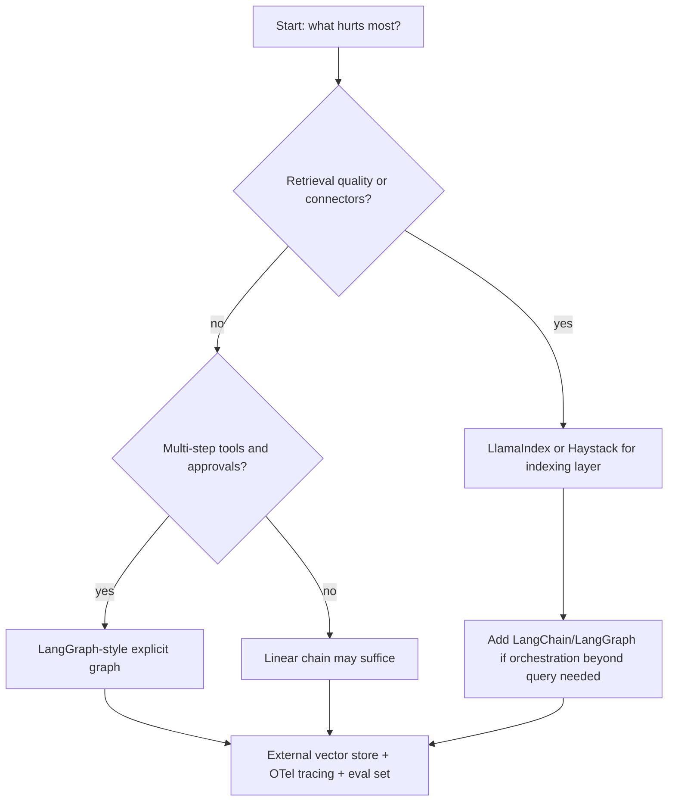

## Complexity: `[COMPLEX]`

**Time to Complete**: 90 minutes

**Prerequisites**: Module 9.4 (vLLM), basic Python, familiarity with HTTP APIs and Kubernetes Deployments, and comfort reading Pod logs during failures

## What You'll Be Able to Do

After completing this module, you will be able to:

- **Deploy LangChain and LlamaIndex applications on Kubernetes with scalable RAG pipeline architectures** that separate stateless inference pods from durable vector storage and model endpoints.
- **Configure vector database integrations (Qdrant, Weaviate, Milvus) for retrieval-augmented generation** so ingestion, metadata filtering, and similarity search behave consistently across environments.
- **Implement LLM application monitoring with trace collection and evaluation metrics for production quality** using OpenTelemetry conventions and framework-native tracing hooks.
- **Optimize RAG pipeline performance with chunking strategies, embedding models, and retrieval tuning** by measuring retrieval precision before you blame the generator model.

## Why This Module Matters

Raw large language models are powerful generalists, yet they are poor custodians of your private operational knowledge. They cannot read your internal runbooks at inference time unless you build a pipeline that loads, indexes, retrieves, and grounds answers in that material. They also struggle to take reliable actions in your environment unless you compose model calls with tools, state, and guardrails. Platform teams that treat an LLM endpoint as "just another microservice" discover quickly that nondeterminism, token cost, and missing observability create a different class of production incident than a stateless REST API.

**Hypothetical scenario:** A platform team ships an internal documentation assistant for Kubernetes operators. In staging, answers look crisp because testers ask short, well-scoped questions against a tiny corpus. On launch day, three thousand engineers query overlapping topics about networking, storage classes, and pod security. Latency spikes past ten seconds, cloud embedding bills jump by roughly $8,000 in the first week, and the top answer for "debug CrashLoopBackOff" cites a deprecated beta API because chunk boundaries split the version note away from the procedure. Nobody can explain which retrieval path produced the bad context because traces were never wired. The team did not fail because LLMs are useless; they failed because they had no durable orchestration layer, no retrieval quality discipline, and no production instrumentation around a nondeterministic dependency.

LangChain and LlamaIndex are peer frameworks that help teams implement those missing layers without reinventing document loaders, embedding clients, vector store adapters, and agent loops on every project. This module teaches the durable patterns—RAG pipelines, orchestration primitives, and Kubernetes operating concerns—using those frameworks as worked examples. For conceptual agent theory, see the AI/ML engineering track; here the platform-engineering question is how to choose, deploy, observe, and operate these toolkits in a cluster next to vLLM, Ray Serve, and your existing observability stack.

Platform ownership should be explicit on a RACI chart before the first production namespace is created. Application teams often own prompt templates, evaluation sets, and business logic inside the service repository. Platform teams own cluster policies, secret management, allowed egress, cost dashboards, and the runbooks for vector store backup. Shared ownership of embedding model upgrades prevents the scenario where application engineers change models Friday afternoon while nobody told the team operating Milvus storage quotas. Treat the LLM application as two deployables—indexing pipeline plus query API—even when one monorepo builds both images.

## The RAG Pipeline: A Durable Backbone

Retrieval-augmented generation is not a LangChain feature or a LlamaIndex feature. It is a systems pattern that survived multiple framework generations because it solves a structural mismatch: parametric knowledge baked into model weights is static, expensive to refresh, and opaque to audit, while your organization's procedures, tickets, and architecture decisions change weekly. RAG externalizes knowledge into a retrieval path you can version, test, and replace independently from the generator model.

The durable pipeline has two phases that should stay mentally separate even when one codebase implements both. The offline indexing phase ingests source documents, normalizes them into text, splits them into chunks, embeds each chunk into a vector representation, and writes vectors plus metadata into a store. The online query phase embeds the user question, searches the store for nearest neighbors, optionally reranks candidates, assembles a grounded prompt, and calls the generator model. Every production incident in RAG eventually maps to one of those stages misbehaving: bad ingestion, bad chunking, bad embeddings, bad retrieval, bad prompting, or a good retrieval undermined by a hallucinating generator.

Chunking is the most under-invested lever because it feels mundane compared to picking a frontier model. Chunk size trades specificity against context: tiny chunks align tightly with narrow questions but lose surrounding definitions; huge chunks preserve narrative but dilute similarity scores so the retriever returns vaguely related paragraphs. Overlap between adjacent chunks exists specifically to stop sentences from being orphaned at boundaries—if a procedure step and its prerequisite land in different chunks with no overlap, the retriever may return the step without the prerequisite and the model will improvise. Metadata is the second silent lever: source path, document version, namespace, severity, and last-updated timestamps let you filter retrieval to the subset of knowledge that is actually valid for the questioner's context.

Embeddings translate text into vectors such that semantic similarity approximates geometric closeness. The embedding model choice is a platform decision with long-lived consequences because re-embedding a large corpus is not a casual deploy-time task. Teams often start with a general-purpose text embedding model, then discover domain drift when internal acronyms and component names cluster poorly. Evaluating embeddings requires a labeled set of question–document pairs or at least human-reviewed queries where you know which chunk should rank first. If that evaluation set does not exist, you are flying blind no matter how polished the demo UI looks.

Vector stores expose similarity search, hybrid keyword-plus-vector search, filtering, and persistence. The store should be treated as infrastructure with its own backup, upgrade, and capacity plan—not an in-process Python dictionary that evaporates when a pod restarts. On Kubernetes, that usually means a StatefulSet or managed service fronted by a stable DNS name, while application pods remain stateless and horizontally scalable. The diagram below is the mental model to keep on a whiteboard during design reviews; the frameworks change names, but the boxes remain.

```
┌─────────────────────────────────────────────────────────────────────────┐
│              RAG (Retrieval-Augmented Generation)                       │
│                                                                         │
│  ┌─────────────────────────────────────────────────────────────────┐   │
│  │                    1. INDEXING (Offline)                         │   │
│  │  Documents → Chunks → Embeddings → Vector Store                 │   │
│  └─────────────────────────────────────────────────────────────────┘   │
│  ┌─────────────────────────────────────────────────────────────────┐   │
│  │                    2. RETRIEVAL (Online)                         │   │
│  │  Query → Embed → Search → Top-K Chunks (+ optional rerank)      │   │
│  └─────────────────────────────────────────────────────────────────┘   │
│  ┌─────────────────────────────────────────────────────────────────┐   │
│  │                    3. GENERATION (Online)                         │   │
│  │  Context + Query → LLM → Answer (+ citations)                   │   │
│  └─────────────────────────────────────────────────────────────────┘   │
└─────────────────────────────────────────────────────────────────────────┘
```

Retrieval quality gates belong in CI, not in postmortems. Before you tune prompts, measure whether the correct chunk appears in the top five results for representative queries. When retrieval fails, prompt engineering only teaches the model to apologize more eloquently. When retrieval succeeds and answers still fail, you have a generator or grounding-format problem. That diagnostic split saves weeks of thrashing.

Hybrid retrieval combines dense vectors with sparse keyword signals such as BM25. Pure vector search excels at paraphrase and conceptual similarity, yet it can miss exact identifiers—CVE numbers, error codes, internal service names—that keyword search retrieves reliably. Many vector databases now expose hybrid modes or companion inverted indexes; LlamaIndex and LangChain both provide retriever abstractions that fuse ranked lists. The engineering cost is worth paying when your corpus mixes narrative prose with logs, YAML snippets, and ticket IDs. Tune fusion weights on the same golden evaluation set you use for chunking changes rather than accepting library defaults.

Reranking is a second retrieval stage that trades compute for precision. Bi-encoder embeddings score every chunk quickly but approximate relevance; cross-encoder rerankers score query-chunk pairs jointly and reorder the top candidates before prompt assembly. In latency-sensitive chat interfaces you might rerank only when the bi-encoder margin between first and fifth results is small, signaling ambiguity. For batch analytics or internal tools with higher latency budgets, always-on reranking materially reduces wrong-context answers without touching the generator model at all.

## Orchestration Primitives: Chains, Graphs, and Agents

Once retrieval returns context, you still need to orchestrate calls: format prompts, enforce output schemas, call tools, branch on confidence, and stop when budgets exhaust. Frameworks express that orchestration through three durable primitives that appear under different names in every generation of tooling.

A chain is a mostly linear composition: output of step A feeds step B, often with a fixed template. Chains are easy to reason about, easy to test, and easy to put behind a REST endpoint. They struggle when the workflow needs conditional branching, parallel fan-out, or explicit recovery after a tool failure. A graph is an explicit state machine: nodes perform work, edges declare allowed transitions, and state is a first-class object you can persist between steps. LangGraph, built alongside LangChain, popularized graph-shaped orchestration for production because it makes control flow visible instead of hiding it inside an opaque loop. An agent is a pattern where the model proposes actions—often function calls—and a runtime executes tools until a stop condition is met. Agents are flexible for exploratory tasks but risky as unmetered production loops unless you cap iterations, spending, and tool scope.

Composition patterns recur regardless of framework branding. The "router" pattern classifies an incoming request and sends it to specialized subchains—billing questions versus Kubernetes questions—so retrieval corpora stay smaller and metrics stay interpretable. The "rewrite-then-retrieve" pattern asks a cheap model to expand acronyms or add synonyms before embedding the query, which helps internal jargon without retraining embeddings. The "self-critique" pattern runs a second pass that checks whether cited chunks actually support the draft answer; it costs extra tokens but catches grounding failures before users do. Document which patterns you use in architecture decision records so future maintainers know which steps are safety-critical versus nice-to-have.

Tool calling is the bridge between language reasoning and systems of record. The durable contract is not "the model runs kubectl"; it is "the runtime exposes a schema-bounded function, validates arguments, executes with least privilege, and returns structured results the model must interpret." Platform teams should treat every tool like a micro-API with authorization, rate limits, and audit logs. Memory is the other half of orchestration: conversation history, retrieved documents, and intermediate plans are not magically remembered by the model between HTTP requests. You store them in Redis, a SQL table, or a checkpoint store when using graph persistence, then pass the relevant slice back on each turn.

Middleware is the under-discussed layer that separates demo chains from operable services. Input middleware can redact secrets, truncate oversized uploads, and reject prompt-injection patterns before they reach the model. Output middleware can enforce JSON schema validation, strip disallowed URLs, and attach citation blocks required by compliance. LangChain documents middleware hooks around the agent harness; graph frameworks let you insert nodes that perform deterministic checks between nondeterministic model steps. Investing in middleware early prevents the anti-pattern of growing a thousand-line system prompt that tries to substitute for real validation.

Human-in-the-loop checkpoints belong in the same architectural family as middleware. When a proposed tool call mutates production infrastructure—scaling a Deployment, deleting a namespace, merging a pull request—the graph should pause, persist state, surface an approval ticket, and resume only after an authorized principal approves. That pattern is tedious to hand-roll with raw SDK calls but maps naturally onto graph nodes with interrupt semantics. Agents without checkpoints may execute the right steps in demos yet remain undeployable in regulated environments regardless of model quality.

For production controllability, prefer explicit graphs over free-form agent loops when stakes are high. A graph can force "retrieve → cite → answer" ordering, require human approval on sensitive tool calls, and record which node executed last when a workflow stalls. Agents shine when the path is genuinely unknown—research assistants, triage bots with broad toolboxes—provided you still enforce budgets. The ai-ml-engineering track explores agent theory in depth; platform engineers should focus on where state lives, how retries work, and what happens when the model proposes an invalid tool call at 2 a.m.

## LangChain and LlamaIndex: Division of Labor

LangChain and LlamaIndex overlap in 2026 more than their early marketing suggested, yet their centers of gravity remain different enough that platform teams benefit from a deliberate pairing strategy rather than a winner-takes-all bake-off. LangChain's historical strength is orchestration: composing models, tools, middleware, and increasingly graph-based agents with a model-agnostic interface. LlamaIndex's historical strength is data ingestion and indexing: connectors, node parsing, indices, retrievers, query engines, and workflow-style composition over retrieval-centric applications.

In practice, many production systems use LlamaIndex—or an equivalent indexing layer—to own "how knowledge enters the system and how queries fetch it," while LangChain or LangGraph owns "what happens around that retrieval in a larger product flow." The opposite also works for smaller services: a LangChain retrieval chain with a community vector store integration may be sufficient without adding a second framework. The decision should be driven by where your team's pain concentrates. If connectors, hierarchical indices, and reranking dominate engineering time, start from the indexing-first toolkit. If multi-step tool workflows, human-in-the-loop checkpoints, and agent middleware dominate, start from the orchestration-first toolkit.

Neither framework removes your obligation to pin versions, run integration tests, and read release notes. Both ecosystems reorganize packages frequently—LangChain's `create_agent` entry point and LangGraph persistence APIs, LlamaIndex's `llama-index-core` split and workflow modules—so treat method names in this module as illustrations tied to the dated snapshot below, not as eternal API scripture. When two frameworks interoperate, standardize on one owner's embedding model and chunk schema so you are not double-paying to maintain incompatible vector payloads.

Build-versus-buy for orchestration is a platform decision distinct from model procurement. A thin FastAPI wrapper around a vendor SDK is valid when requirements are a single completion endpoint with no retrieval and no tools. The moment you need chunked ingestion, vector migrations, evaluation harnesses, and multi-step tool flows, framework code pays rent by reducing bespoke glue. The rent is real: dependency upgrades, breaking import paths, and training engineers on abstractions. Platform leaders should document the trigger conditions that justify frameworks—typically more than one production LLM workflow sharing retrieval and tracing requirements—so experimental scripts do not accrete into undeclared product surfaces without review.

> **The Orchestra Analogy**
>
> LlamaIndex is the librarian: cataloging sources, shelving chunks, and fetching the right folios when asked. LangChain is the conductor: deciding which movements play, when soloists (tools) enter, and how the performance ends. You can hire a virtuoso soloist, but without a librarian the sheet music is scattered; without a conductor the musicians play simultaneously and call it jazz.

## Landscape Snapshot and Framework Rosetta

> **Landscape snapshot — as of 2026-06. This changes fast; verify against vendor docs before relying on specifics.**

| Topic | LangChain + LangGraph | LlamaIndex |
|---|---|---|
| Primary Python packages | `langchain`, `langchain-openai`, `langgraph` | `llama-index`, `llama-index-core`, integration packages per vector store and model |
| Agent entry point (illustrative) | `langchain.agents.create_agent` with model string and tools list | Agent and workflow APIs documented under Agents and Workflows |
| Graph orchestration | LangGraph `StateGraph` with checkpointing | Workflow modules with event-driven steps |
| Local OpenAI-compatible LLM | `ChatOpenAI` with custom `openai_api_base` pointing at vLLM | `OpenAILike` or provider-specific LLM classes |
| Tracing hooks | LangSmith environment variables (`LANGSMITH_TRACING`, API key) | Integrations with observability vendors; OTel via platform instrumentation |

The Rosetta below compares durable capabilities across peers. No column is universally superior; each trades ergonomics, control, and operational surface area.

| Capability | LangChain + LangGraph | LlamaIndex | Haystack | DSPy | Direct model SDK |
|---|---|---|---|---|---|
| Ingestion and indexing | Good via document loaders; often paired with external indexers | Deep connectors, node parsers, indices | Strong pipelines for search-centric apps | Minimal; assumes you bring data | None; you implement |
| Retrieval and reranking | Retriever interfaces, community integrations | Rich retriever and postprocessor model | Built-in retriever components | Programmatic via signatures | Manual vector search |
| Agent and graph orchestration | LangGraph state machines; `create_agent` harness | Workflows and agents over tools | Agent and pipeline graphs | Optimization-focused modules | DIY loops |
| Tool and function calling | First-class tool schemas | Tool exposure in agents | Tool nodes in pipelines | Wrapped in signatures | Native vendor APIs |
| Tracing and evaluation | LangSmith integration | Pluggable observability | OpenTelemetry support | Experiment-oriented | Vendor consoles only |
| Model agnostic | Yes, via provider packages | Yes, via integration packages | Yes | Yes | Locked to one vendor |

Haystack remains a solid peer when search pipelines and component graphs are already familiar to your team. DSPy is a peer when you want to optimize prompts and small programs with measurable metrics rather than hand-tuning chain templates. Direct SDK usage is appropriate for thin wrappers, but you will rebuild retrieval, tracing, and tool orchestration that frameworks already standardized.

Release engineering for LLM services should version three artifacts together even when they deploy separately: application container image, embedding model identifier, and vector collection schema generation. Tag releases in git with the collection name suffix when breaking metadata fields change. Roll back by repointing the API Deployment to the previous image while keeping the prior collection intact until you confirm the new index is healthy. Blue-green index cuts are safer than destructive migrations for teams without continuous evaluation pipelines yet.

## Vector Database Integrations for RAG on Kubernetes

Vector databases are the durable persistence layer behind most RAG services. Application pods should talk to them over the network using stable service names, connection pooling, and secrets for API keys where required. Qdrant, Weaviate, and Milvus are common peers in cloud-native environments; each exposes HTTP or gRPC APIs, supports metadata payloads alongside vectors, and can run inside Kubernetes with StatefulSets or as managed offerings outside the cluster.

Qdrant emphasizes performant filtered vector search with a straightforward collection model. Weaviate combines vector search with a schema-oriented API and modular vectorizers, which can simplify ingestion when you want the database to own embedding strategies for some classes. Milvus targets large-scale vector workloads with distributed storage options and a mature Kubernetes operator story for teams that expect billion-scale ambitions even if day-one corpora are smaller. pgvector, not shown as a column above but equally important, keeps vectors inside PostgreSQL when you already operate a reliable relational cluster and your nearest-neighbor counts fit single-node or modest replica topologies.

Configure integrations so ingestion and query paths share one embedding model revision recorded in metadata. When you upgrade embeddings, plan a background reindex job rather than mixing incompatible vectors in one collection. Namespace isolation matters on multi-tenant platforms: separate collections per team, or strict metadata filters enforced in application middleware, not merely suggested in prompts. Health checks for RAG services should include a lightweight vector query against a canary document; a pod can be "ready" while the vector backend is empty after a failed migration.

The illustrative LlamaIndex configuration below targets Chroma with explicit settings; the equivalent LangChain pattern uses `langchain_community.vectorstores` with the same remote host. Verify import paths against current docs before pinning in production Dockerfiles.

```python
from llama_index.core import VectorStoreIndex, SimpleDirectoryReader, StorageContext, Settings
from llama_index.core.node_parser import SentenceSplitter
from llama_index.embeddings.openai import OpenAIEmbedding
from llama_index.llms.openai import OpenAI
from llama_index.vector_stores.qdrant import QdrantVectorStore
import qdrant_client

Settings.llm = OpenAI(model="gpt-4o", temperature=0)
Settings.embed_model = OpenAIEmbedding(model="text-embedding-3-small")
Settings.node_parser = SentenceSplitter(chunk_size=512, chunk_overlap=64)

client = qdrant_client.QdrantClient(host="qdrant.llm-apps.svc.cluster.local", port=6333)
vector_store = QdrantVectorStore(client=client, collection_name="k8s_runbooks")
storage_context = StorageContext.from_defaults(vector_store=vector_store)

documents = SimpleDirectoryReader("./k8s_docs").load_data()
index = VectorStoreIndex.from_documents(documents, storage_context=storage_context)
query_engine = index.as_query_engine(similarity_top_k=5)
response = query_engine.query("How do I debug a pod in CrashLoopBackOff?")
print(response)
```

Milvus and Weaviate integrations follow the same spine: create a store client pointed at the Kubernetes Service, attach it to a storage context or LangChain vector store wrapper, ingest with a consistent chunk schema, and expose query interfaces that log retrieval scores for later evaluation.

Milvus ships with a Kubernetes operator oriented toward large collections and segmented storage; teams already running the operator for other AI workloads may standardize on it to reduce the number of stateful systems in play. Weaviate's modular vectorizer configuration can push embedding work closer to ingestion, which helps when application pods should stay thin and you accept database-side embedding coupling. Qdrant's collection and payload filter model is straightforward to reason about in code reviews, which matters when many teams share one platform cluster. None of these choices removes the need for backup jobs, restore drills, and capacity alerts on disk growth as embeddings accumulate across document versions.

## Deploying LangChain and LlamaIndex Services on Kubernetes

An LLM application on Kubernetes should look like any other twelve-factor service with one extra dependency graph: stateless HTTP or gRPC pods, secrets for model credentials, ConfigMaps for non-secret tuning parameters, and network policies that allow egress only to approved model endpoints and vector stores. Do not embed Chroma or Qdrant inside the same Deployment as your API unless you are building a deliberate single-node demo; production separates concerns so API replicas can scale while storage retains PVCs.

The container image should pin Python dependencies with a lockfile or hashed requirements, run as a non-root user, and expose `/health` and `/ready` endpoints that reflect real dependencies. Liveness can remain lightweight; readiness should fail when the vector store is unreachable or when model credentials are missing, preventing a rolling update from cutting traffic to broken pods. Resource requests need headroom for parsing large PDFs during ingestion jobs, which are often better as CronJobs or pipeline tasks than as inline upload handlers on the serving Deployment.

For model inference, reuse the cluster patterns from Module 9.4: point OpenAI-compatible clients at an in-cluster vLLM Service when you self-host, and enforce timeouts so a stalled GPU pod does not hold worker threads indefinitely. Horizontal Pod Autoscaling on CPU or custom metrics—request latency, queue depth, tokens per second—works when your app is stateless; conversation state belongs in Redis or a database, not pod memory. The Deployment manifest below is illustrative; replace image names with your registry and add PodDisruptionBudgets for multi-replica services.

Self-hosted inference changes capacity planning more than application code. vLLM exposes an OpenAI-compatible HTTP surface, which means LangChain `ChatOpenAI` and LlamaIndex `OpenAILike` clients can target the same internal URL with only model name and timeout changes. Platform teams should co-locate RAG API pods in zones with low latency to inference nodes, set aggressive client-side timeouts slightly below upstream gateway limits, and configure retry policies that do not amplify storms when GPUs are saturated. Embedding workloads may use smaller models on CPU nodes while generation stays on GPU; splitting those paths prevents a single HPA from scaling the wrong resource.

```yaml
apiVersion: apps/v1
kind: Deployment
metadata:
  name: rag-api
  namespace: llm-apps
spec:
  replicas: 2
  selector:
    matchLabels:
      app: rag-api
  template:
    metadata:
      labels:
        app: rag-api
    spec:
      containers:
        - name: api
          image: registry.example.com/platform/rag-api:1.4.0
          ports:
            - containerPort: 8080
          env:
            - name: OPENAI_API_KEY
              valueFrom:
                secretKeyRef:
                  name: model-credentials
                  key: api-key
            - name: QDRANT_URL
              value: "http://qdrant.llm-apps.svc.cluster.local:6333"
            - name: VLLM_BASE_URL
              value: "http://vllm.llm-apps.svc.cluster.local:8000/v1"
          readinessProbe:
            httpGet:
              path: /ready
              port: 8080
            periodSeconds: 10
          livenessProbe:
            httpGet:
              path: /health
              port: 8080
            periodSeconds: 20
          resources:
            requests:
              cpu: "250m"
              memory: "512Mi"
            limits:
              cpu: "1"
              memory: "2Gi"
```

Ingestion jobs should run as separate Kubernetes Jobs with shared PVCs or object storage credentials, writing finished collections before the API Deployment rolls. That separation prevents a large reindex from starving serving pods that only need query-time access.

Network policies should default-deny egress from LLM application namespaces, then allow only the model endpoint, vector store, Redis, and observability collectors required by the architecture diagram you submitted during design review. Secrets belong in Kubernetes Secrets or external secret operators, rotated on the same schedule as other production credentials, not in environment variables baked into images. Pod Security Standards or equivalent policy should prevent privileged containers unless a specific ingestion parser truly requires it—and that parser should still run in a separate Job sandbox.

Autoscaling LLM APIs on CPU alone misleads during token-heavy bursts because request threads may block waiting for model streams while CPU looks idle. Prefer custom metrics exported from your application—active requests, queue depth, time-to-first-token—or scale on concurrency limits per replica with a maximum replica cap tied to model rate limits. vLLM and hosted APIs publish throughput ceilings; exceeding them creates synchronized retries that resemble a DDoS you aimed at yourself. Coordinate HPA max replicas with provider quotas and with GPU memory available on inference nodes.

## Observability, Traces, and Evaluation in Production

LLM applications fail in ways traditional metrics miss: retrieval silently returns irrelevant chunks, tool calls succeed with empty payloads, models comply with format instructions only intermittently, and costs spike because an agent loop retries without a cap. Treat an LLM service as a distributed system with a nondeterministic dependency and instrument it accordingly. OpenTelemetry GenAI semantic conventions provide a cross-vendor vocabulary for model name, token usage, and operation type, which helps when you standardize dashboards across LangChain, LlamaIndex, and bespoke SDK paths.

LangSmith documents environment-variable configuration for tracing LangChain and LangGraph runs, including setting `LANGSMITH_TRACING=true` and supplying an API key. Langfuse documents self-hosted and cloud options for trace collection, cost accounting, and evaluation datasets. Either can coexist with your existing Prometheus and Grafana stack if you export aggregate metrics—p95 latency, tokens per request, retrieval hit rate, tool error ratio—to the same tenancy model as other platform services. The goal is not maximal trace volume; it is actionable spans tied to retrieval IDs, chunk hashes, and prompt template versions so an on-call engineer can replay a bad answer without guessing.

Evaluation belongs in the release process, not only in research notebooks. Maintain a golden set of questions with expected citation sources or keyword requirements, run it on every embedding or chunking change, and block deploys when recall drops. Online, sample live traffic for human review or LLM-as-judge scoring, but never let automated judges be the sole gate without periodic human calibration. When incidents occur, compare traces before and after the change window; regressions in retrieval score distributions often precede user-visible hallucination complaints by days.

Cost control is an observability problem wearing a finance hat. Token usage scales with retrieved context length, number of agent iterations, and choice of generator model. Cache embeddings for stable documents, cache answers only when inputs and corpus versions hash identically, and log per-tenant token totals so one noisy neighbor cannot silently exhaust a shared API key. Langfuse and LangSmith both surface cost-oriented aggregates in their documentation; export those numbers into the same chargeback dashboards your platform team already maintains for CPU and storage. Budget alerts belong next to latency alerts because the failure mode is equally abrupt.

## Tuning Chunking, Embeddings, and Retrieval Quality

Optimization should follow measurement, not intuition. Start by logging, for each query, the retrieved chunk IDs, similarity scores, and token counts injected into the prompt. If scores cluster tightly near zero, your embedding model may be mismatched to the domain or your chunks may be too large. If scores are high yet answers wrong, your chunks may be semantically similar but factually stale—metadata filtering fixes that more cheaply than swapping generators.

Chunking strategies should reflect document shape. Runbooks with numbered steps benefit from smaller chunks with generous overlap so a single step does not straddle vectors. Conceptual architecture guides benefit from larger chunks that preserve section headings in the same text as their explanations. Tables and code blocks often need specialized parsers so rows are not shredded into nonsense strings. LlamaIndex node parsers and LangChain text splitters both implement these patterns; choose based on which integration already owns your ingestion code path.

Parent-child chunking is a durable pattern for long manuals. Store small child chunks for precise retrieval while linking each child to a parent section chunk that supplies broader context during generation. The retrieval step fetches children for accuracy, then promotes parent text into the prompt so the model sees surrounding headings and prerequisites. Hierarchical indices in LlamaIndex and multi-vector retriever patterns in LangChain both approximate this idea; the implementation details vary by version, but the design goal remains stable across frameworks.

Query transformation is the online mirror of chunking decisions. Users ask vague questions; naive embedding of the raw string under-retrieves. A lightweight rewrite step—expanding "CRB" to "CrashLoopBackOff", or adding product names from session metadata—can lift recall without widening top-k so far that noise floods the prompt. Log both the original and transformed queries in traces so evaluators can tell whether rewrites help or hallucinate extra constraints.

Embedding model upgrades deserve migration plans: dual-write to a new collection, shadow-query both indices, compare recall metrics, then cut traffic. Retrieval tuning knobs include top-k, similarity thresholds, hybrid keyword weighting, and cross-encoder reranking. Rerankers add latency but rescue borderline cases where bi-encoder similarity alone confuses homonyms—"ingress" networking versus "ingress" legal documents. Prompt templates should enforce citations back to chunk metadata so users can verify answers, which also makes evaluation automatable.

Security for RAG is inseparable from data governance because user queries are not the only injection surface. Adversarial text embedded in tickets, wikis, or uploaded PDFs can instruct the model to ignore policies—classic prompt injection via corpus poisoning. Mitigations include separating trusted corpora from user uploads, scanning ingestion paths with allowlisted parsers, stripping HTML macros, and requiring that answers cite only chunks from trusted collections for high-risk workflows. Tool calls compound the risk: a retrieved chunk that says "run this curl command" must not become an automatic shell invocation without human approval. Graph checkpoints and tool sandboxing are security controls, not optional UX flourishes.

## Worked Example: Minimal RAG Service with Cross-Framework Mapping

The following LangChain-oriented service loads markdown runbooks, indexes them into an in-memory store for brevity, and answers questions through a retrieval chain. In production you would externalize the store and secrets; the structure is what matters. Verify imports against the snapshot date before copying into an image build.

```python
from langchain_openai import ChatOpenAI, OpenAIEmbeddings
from langchain_text_splitters import RecursiveCharacterTextSplitter
from langchain_community.document_loaders import DirectoryLoader
from langchain_community.vectorstores import Qdrant
from langchain.chains import create_retrieval_chain
from langchain.chains.combine_documents import create_stuff_documents_chain
from langchain_core.prompts import ChatPromptTemplate
import qdrant_client

loader = DirectoryLoader("./k8s_docs", glob="**/*.md")
docs = loader.load()
splitter = RecursiveCharacterTextSplitter(chunk_size=800, chunk_overlap=120)
chunks = splitter.split_documents(docs)

client = qdrant_client.QdrantClient(url="http://localhost:6333")
vectorstore = Qdrant.from_documents(
    chunks,
    OpenAIEmbeddings(model="text-embedding-3-small"),
    url="http://localhost:6333",
    collection_name="runbooks",
)
retriever = vectorstore.as_retriever(search_kwargs={"k": 4})

prompt = ChatPromptTemplate.from_template(
    "Answer using only the context below. Cite sources.\n\nContext:\n{context}\n\nQuestion: {input}"
)
llm = ChatOpenAI(model="gpt-4o", temperature=0)
doc_chain = create_stuff_documents_chain(llm, prompt)
rag_chain = create_retrieval_chain(retriever, doc_chain)

print(rag_chain.invoke({"input": "What is a Kubernetes Pod?"})["answer"])
```

The equivalent LlamaIndex path is `VectorStoreIndex.from_documents` followed by `as_query_engine`, optionally with `SimilarityPostprocessor` to drop low-scoring nodes. Keep chunking and embedding configuration in one shared module if you experiment with both frameworks during a migration spike. Label demos clearly when corpus size is tiny; retrieval metrics from five markdown files will not predict behavior on thousands of Confluence pages.

FastAPI remains a practical serving shell: wrap the chain or query engine in async endpoints, attach session IDs to conversation memory stored in Redis, and expose Prometheus metrics on `/metrics` if your platform standard requires it. Streaming responses improve perceived latency for long answers; both frameworks can stream tokens when the underlying model client supports it.

When wiring conversation memory, choose window sizes deliberately. Entire chat histories blow token budgets and reintroduce stale retrieved context from earlier turns. A sliding window of recent turns plus summarized older context is a durable compromise. Store memory externally keyed by session ID so horizontal pod scaling does not strand conversations on one replica. For compliance, define retention TTLs in Redis or your database layer and document them in the same runbook operators use for log retention.

## Patterns and Anti-Patterns

| Pattern | When to use it | Why it works | Operational note |
|---|---|---|---|
| Stateless API pods + external vector store | Any production RAG service | Scale and upgrade inference without copying gigabytes of vectors | Back up collections and test restore quarterly |
| Separate ingestion Jobs from query Deployments | Corpora update on schedules | Prevents reindex IO from starving interactive latency | Version collections and support blue/green index cuts |
| Graph-shaped workflows for regulated tool use | Financial, infra, or PII-adjacent automation | Explicit states beat opaque agent loops | Persist checkpoints for replay after crashes |
| Golden evaluation set in CI | Every embedding or chunker change | Catches retrieval regressions before users do | Include adversarial paraphrases, not only literal questions |
| Token and iteration budgets on agents | Any tool-using automation | Stops runaway spend and infinite loops | Alert when budgets exhaust frequently—signals bad tools |

| Anti-pattern | Why teams adopt it | Better approach |
|---|---|---|
| Monolithic pod with embedded vector DB | Fewer moving parts in demos | Managed store or StatefulSet service with stable DNS |
| Giant chunks "so we never miss context" | Simpler mental model | Tune chunk size; add overlap; measure recall |
| Prompt-only fixes for bad retrieval | Prompting is faster than reindexing | Fix retrieval metrics first; then adjust prompts |
| Unbounded agent loops | Agents feel magical in prototypes | Cap steps; require approvals for destructive tools |
| No citation requirements | Answers read fluently | Force chunk metadata into responses for auditability |
| Shared collections without metadata filters | One index is easier to operate | Enforce tenant filters in code and in store ACLs |

The patterns and anti-patterns share a theme: LLM applications reward explicit boundaries. If retrieval, orchestration, storage, and observability each have an owner and an interface, frameworks accelerate delivery. If those boundaries collapse into one opaque script, you inherit the worst properties of every layer without the operational hooks to debug them.

Incident response for RAG services should include a retrieval replay command that accepts a trace ID and re-runs search without calling the generator. That single tool shortens debates about whether the model or the index caused a bad answer. Store chunk text hashes in traces so engineers can detect silent corpus drift when object storage files change without a formal reindex job. Pair that tooling with runbooks that list which Kubernetes CronJob owns ingestion and which Secret version holds model credentials.

## Decision Framework

Choosing frameworks and stores is an exercise in matching capabilities to constraints, not picking a mascot. The decision should survive the departure of any single vendor model or any single vector database contract renewal.

| Dimension | Favor LangChain + LangGraph | Favor LlamaIndex | Consider Haystack or DSPy instead |
|---|---|---|---|
| Dominant pain | Tool orchestration, agents, multi-step flows with checkpoints | Connectors, indexing strategies, retrieval quality | Haystack: search pipelines; DSPy: optimized small programs |
| Team skills | Strong Python app engineers | Strong data engineering for corpora | Haystack: search engineers; DSPy: experimentation-focused ML |
| Kubernetes posture | Thin services calling external stores | Ingestion workers + query services | Similar; evaluate component fit |
| Observability needs | LangSmith hooks are first-class | Pluggable tracing; combine with OTel | Mature pipeline logging |
| Migration risk | Frequent package moves; pin versions | Frequent package moves; pin versions | Haystack stable for search; DSPy niche |

When two peers appear tied on paper, run a two-week spike with the same corpus, the same evaluation questions, and the same Kubernetes namespace policies. Measure engineering velocity, retrieval recall, p95 latency, and operational surprises such as secret handling or Helm chart maturity. The winner should be the stack your team can operate at 3 a.m., not the one with the flashiest README. Document the spike outcome in a short ADR so the next team does not repeat the comparison from scratch.

Capacity reviews for LLM platforms should include tokens per successful answer, not only QPS. A service that answers twice as fast but injects triple the context costs more and may retrieve noisier chunks. FinOps and platform engineering should share one dashboard fed by the same OpenTelemetry or Langfuse exports application teams already use for debugging.

Finally, treat prompt templates as configuration artifacts with the same review discipline as application code. Store them in git, version them with releases, and forbid hot-editing production templates without a rollback path. Templates that drift from the evaluation set are a common source of "it worked in staging" regressions that tracing alone cannot explain without comparing template versions side by side in your change ticket system of record.



## Did You Know?

- The term "retrieval-augmented generation" entered widespread use after [Lewis et al., 2020](https://arxiv.org/abs/2005.11401) demonstrated grounding generation with an external dense retriever; the pattern predates today's framework branding wars.
- LlamaIndex began life as "GPT Index" before rebranding to reflect broader data connectors beyond a single vendor model family.
- LangChain agents are built on LangGraph, which adds persistence and human-in-the-loop affordances that pure callback chains lacked.
- OpenTelemetry published [GenAI semantic conventions](https://opentelemetry.io/docs/specs/semconv/gen-ai/) so traces from mixed SDK and framework stacks can land in one observability backend.

## Common Mistakes

| Mistake | Problem | Solution |
|---|---|---|
| No chunk overlap | Boundary sentences disappear from both neighbors | Use meaningful overlap—often ten to twenty percent of chunk size |
| Chunks too large for the corpus | Similarity scores flatten; wrong paragraphs rank high | Reduce chunk size; add headings to metadata |
| Ignoring metadata filters | Retriever mixes deprecated and current docs | Store version, product, and locale; filter before search |
| Skipping reranking | Top-k vectors look plausible but misordered | Add a cross-encoder or LLM reranker for high-stakes answers |
| Stateless HTTP without session store | Follow-up questions lose context | Persist chat history externally keyed by session ID |
| Hard-coded embedding upgrades | Mixed vectors corrupt collections | Reindex into a new collection; dual-run before cutover |
| Agent without spend caps | Runaway tool and token usage | Enforce per-request and per-session budgets |
| Prompt injection via user docs | Untrusted text in corpus hijacks answers | Sanitize ingestion; separate trusted and user uploads |

## Quiz

<details><summary>**Scenario:** Your RAG assistant answers confidently but cites runbooks from last year's deprecated API. Retrieval logs show high similarity scores. Where should you intervene first?</summary>

Start with retrieval metadata and corpus freshness, not the generator temperature. High similarity with stale content usually means missing version filters, outdated chunks still indexed, or chunk boundaries that dropped the deprecation notice away from the procedure text. Add metadata filters for document version, run a reindex job after deprecations, and expand your evaluation set to include questions that should only match current docs. Prompting alone cannot remove wrong context that you keep injecting.

</details>

<details><summary>**Scenario:** A platform team must integrate Qdrant running as a StatefulSet while keeping API pods stateless. Which architectural outcome does this design support?</summary>

This is the standard pattern for deploying LangChain and LlamaIndex applications on Kubernetes with scalable RAG pipeline architectures. Stateless API Deployments can scale horizontally behind a Service, while Qdrant retains vector data on persistent volumes with its own lifecycle. Ingestion Jobs write collections; query pods only need network access and credentials. The split lets you roll application code without copying vectors and lets you scale inference replicas independently from storage capacity planning.

</details>

<details><summary>**Scenario:** Traces show retrieval completing in fifty milliseconds but end-to-end latency exceeds eight seconds. What layers should you inspect next?</summary>

Inspect generator latency, tool calls, serialization, and queueing before blaming the vector database. Implement LLM application monitoring with trace collection and evaluation metrics so spans separate embedding, retrieval, reranking, and generation token throughput. Compare p95 generator time across models, verify whether you are waiting on an overloaded vLLM Service, and check for synchronous agents issuing sequential tool calls. Without span boundaries, teams mis-scale vector stores while GPUs sit idle.

</details>

<details><summary>**Scenario:** After switching embedding models, answer quality drops even though prompts are unchanged. What is the most likely cause?</summary>

You are probably querying a collection that mixes vectors from incompatible embedding revisions or forgot to reindex entirely. Optimize RAG pipeline performance by treating embedding changes like database schema migrations: build a new collection, re-embed all chunks, shadow-test recall against a golden question set, then cut traffic. Chunking strategies and retrieval tuning cannot compensate for vectors that are not comparable in the same space.

</details>

<details><summary>When should you choose an explicit graph over a free-form agent loop for production workflows that can mutate infrastructure?</summary>

Choose a graph when control flow, approvals, and auditability matter as much as flexibility. Graphs make states visible—retrieve, validate, call tool, summarize—so on-call engineers can see which node failed and replay from checkpoints. Free-form agents suit exploratory workflows with loose toolboxes if you still enforce iteration and spend caps. Platform teams regulating infrastructure changes usually prefer graphs; open-ended research assistants may tolerate agents.

</details>

<details><summary>How do LangChain and LlamaIndex divide labor in a typical internal documentation assistant serving platform engineers?</summary>

LlamaIndex often owns ingestion, node parsing, indexing, and retrieval strategies where connector breadth and chunk schemas dominate engineering time. LangChain or LangGraph often owns orchestration around that retrieval—tool calls, branching, memory, and serving glue—when the product flow exceeds a single query engine call. The split is not mandatory; small services may use one framework end to end. Pick based on where your team's iteration speed is slowest, not based on branding.

</details>

<details><summary>**Scenario:** Milvus and Weaviate are both available in your cluster. What capability should drive the vector database integration choice?</summary>

Configure vector database integrations based on operational fit, not slogans. Compare metadata filtering ergonomics, Kubernetes operator maturity in your environment, backup tooling, expected vector cardinality, and whether you need hybrid keyword search native to the store. Milvus targets large-scale vector deployments; Weaviate emphasizes schema-rich APIs and modular vectorizers; Qdrant emphasizes filtered vector search with a compact operations profile. Run a proof of concept with your real corpus size and query mix.

</details>

<details><summary>What belongs in a continuous integration gate before promoting a chunking or embedding change to production?</summary>

Run a golden evaluation set that measures whether expected chunks appear in top-k results for representative queries, including paraphrases and edge cases near document boundaries. Track retrieval precision, citation correctness, and token footprint injected into prompts—smaller is not always better if recall collapses. Pair offline metrics with canary deploys that sample live traces into your observability system. Block promotion when recall drops beyond an agreed threshold, even if qualitative demos "look fine."

</details>

## Hands-On

Build a minimal RAG service locally, then sketch the Kubernetes objects you would need to run it with an external Qdrant instance and an optional vLLM endpoint from Module 9.4. The exercise reinforces vector persistence, citation correctness, and trace separation between retrieval and generation—the same signals you will alert on in production.

Create a virtual environment and install `langchain`, `langchain-openai`, `langchain-community`, `qdrant-client`, and `llama-index` packages pinned in a `requirements.txt` file. Download two Kubernetes documentation markdown files into `./k8s_docs` and ingest them with consistent chunk size and overlap settings shared between frameworks if you test both. Stand up Qdrant with Docker or kind, create a collection, and verify vectors persist across API pod restarts. Expose a FastAPI `/ask` endpoint that returns answers with source filenames in the JSON body. Enable tracing with LangSmith or Langfuse using environment variables and confirm spans appear for retrieval and generation separately.

**Success criteria:**

- [ ] Qdrant collection contains chunked vectors with metadata after ingestion completes
- [ ] `/ask` returns an answer that cites the correct source file for a held-out question
- [ ] Restarting the API process without wiping Qdrant still answers from persisted vectors
- [ ] Traces or exported metrics distinguish retrieval time from generation time

Verify the endpoint with curl once the server listens on port 8080:

```bash
curl -s -X POST http://127.0.0.1:8080/ask \
  -H 'Content-Type: application/json' \
  -d '{"question":"What is a Pod?"}' | jq .
```

## Sources

- [LangChain Python documentation](https://python.langchain.com/docs/) — Core concepts, `create_agent`, and integration overview.
- [LangGraph overview](https://docs.langchain.com/oss/python/langgraph/overview) — Graph orchestration, persistence, and human-in-the-loop patterns.
- [LlamaIndex developer documentation](https://docs.llamaindex.ai/en/stable/) — Indexing, query engines, agents, and workflows.
- [LangChain GitHub repository](https://github.com/langchain-ai/langchain) — Source, issues, and release history for package layout changes.
- [LlamaIndex GitHub repository](https://github.com/run-llama/llama_index) — Connectors, integrations, and migration notes across versions.
- [Retrieval-Augmented Generation for Knowledge-Intensive NLP Tasks (Lewis et al., 2020)](https://arxiv.org/abs/2005.11401) — Foundational RAG formulation with dense retriever plus generator.
- [Retrieval-Augmented Generation for Large Language Models: A Survey (Gao et al., 2023)](https://arxiv.org/abs/2312.10997) — Taxonomy of RAG variants, evaluation approaches, and failure modes.
- [Qdrant documentation](https://qdrant.tech/documentation/) — Collections, filtering, and deployment guidance for vector search.
- [Weaviate developers documentation](https://weaviate.io/developers/weaviate) — Schema, modules, and hybrid search configuration.
- [pgvector extension for PostgreSQL](https://github.com/pgvector/pgvector) — Embedding storage when PostgreSQL is already operational.
- [Langfuse documentation](https://langfuse.com/docs) — Tracing, evaluations, and cost analytics for LLM applications.
- [LangSmith documentation](https://docs.smith.langchain.com/) — Trace collection and evaluation for LangChain and LangGraph runs.
- [Haystack introduction](https://haystack.deepset.ai/overview/intro) — Pipeline-oriented retrieval and search alternative.
- [DSPy documentation](https://dspy.ai/) — Programmatic optimization peer for prompt-and-module tuning.
- [OpenTelemetry GenAI semantic conventions](https://opentelemetry.io/docs/specs/semconv/gen-ai/) — Cross-vendor span attributes for model operations and token usage.

## Next Module

Continue to [Module 9.7: GPU Scheduling & NVIDIA GPU Operator on Kubernetes](module-9.7-gpu-scheduling/) to schedule the GPU-backed inference and embedding workloads these LLM services depend on.
