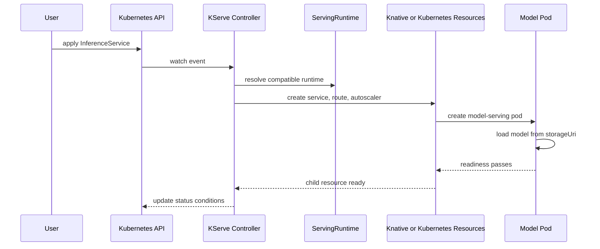
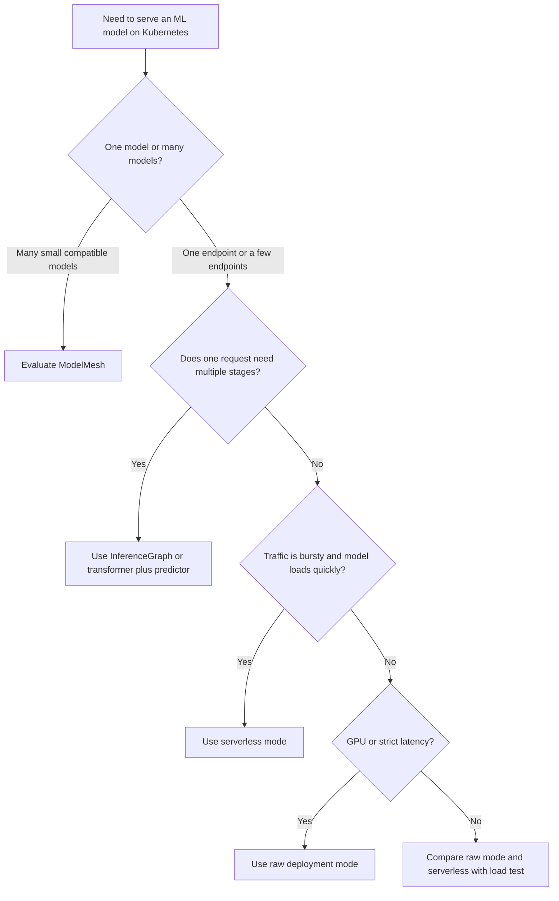

# Module 9.8: KServe — Production-Grade Model Inference on Kubernetes

> **Complexity**: `[COMPLEX]`
>
> **Time to Complete**: 55-65 minutes
>
> **Prerequisites**: Kubernetes basics (Pods, Services, Deployments), container fundamentals (images, registries), basic ML model serving concepts (what inference means, request/response lifecycle)

## Learning Outcomes

After completing this module, you will be able to:

- **Compare** KServe serverless mode and raw deployment mode for latency, cost, networking, rollout, and GPU tradeoffs.
- **Design** an `InferenceService` that connects model storage, runtime selection, transformers, explainers, autoscaling, and rollout policy.
- **Implement** a KServe deployment on Kubernetes 1.35+ and move it through first serving, canary rollout, raw mode, and autoscaling changes.
- **Diagnose** common KServe failures by following status conditions from `InferenceService` down to runtimes, storage credentials, pods, routes, and logs.
- **Evaluate** when KServe, ModelMesh, InferenceGraph, or a plain Kubernetes Deployment is the right serving pattern for an ML platform team.

## Why This Module Matters

A payments company had a fraud model that worked beautifully in notebooks.
The model cut manual review time by more than a third during offline testing.
The data science team exported it as a `joblib` file, the application team wrapped it in a small HTTP service, and the platform team deployed it with a normal Kubernetes Deployment and Service.
For the first week, the system looked boring in the best possible way.

Then the weekly model refresh arrived.
The new model needed a different preprocessing step, a new package version, and a slightly larger memory limit.
The application wrapper was rebuilt by hand.
The Deployment rolled all pods at once.
Half of the requests during the rollout used stale feature ordering, a small percentage timed out while the new image pulled, and the fraud team lost the ability to explain why the model rejected several high-value transactions.
No single team had made a reckless decision.
The problem was that the serving stack treated a model like an ordinary stateless web app.

KServe exists because production inference is not just "run a container with a model inside."
ML teams need model artifact loading, runtime selection, request transformation, explainability, traffic splitting, autoscaling based on inference behavior, and status that says why an endpoint is not ready.
Platform teams need those capabilities without asking every model team to reimplement the same sidecars, routes, probes, and rollout logic.
KServe gives Kubernetes a model-serving API that keeps the familiar reconciliation model while adding ML-specific behavior.

The practical skill in this module is not memorizing a CRD.
The skill is recognizing which layer should own each responsibility.
Kubernetes should schedule pods.
KServe should translate model-serving intent into working infrastructure.
Knative should handle request-driven serverless behavior when that mode is appropriate.
Istio or another gateway layer should manage ingress, mTLS, and traffic policy.
Your model runtime should load artifacts and answer inference requests.
When those boundaries are clear, model serving becomes operable instead of mysterious.

## KServe Architecture: Control Plane and Data Plane

KServe is a Kubernetes-native inference platform.
That means you declare desired state with Kubernetes custom resources, and controllers reconcile the cluster toward that state.
The most important custom resource is `InferenceService`.
It describes a model endpoint rather than a generic pod.
The controller then creates the lower-level objects needed to serve that model.

The control plane is the management side.
It watches `InferenceService`, `ServingRuntime`, `ClusterServingRuntime`, `InferenceGraph`, and related resources.
It validates specs, applies defaults, chooses runtimes, creates Deployments or Knative Services, configures routes, and updates status conditions.
If you apply a manifest and nothing becomes reachable, the control plane is where you start your diagnosis.

The data plane is the request-serving side.
It receives HTTP or gRPC inference traffic.
It routes traffic through optional transformers, predictors, explainers, and graph routers.
It loads model artifacts into runtime containers.
It returns predictions, explanations, or errors to clients.
If an endpoint is ready but slow or wrong, the data plane is where you start your diagnosis.

KServe can use two deployment modes.
In serverless mode, KServe creates Knative Serving resources.
Knative then creates revisions, routes traffic, adds queue proxies, and scales pods based on request demand.
Istio is commonly used as the networking layer for ingress, routing, and service mesh policy.
This mode gives scale-to-zero and revision-aware traffic management, but it adds moving parts and can introduce cold start latency.

In raw deployment mode, KServe creates standard Kubernetes resources such as Deployments, Services, Ingress or Gateway API routes, and HPAs.
This mode avoids the Knative dependency.
It is easier to inspect with normal Kubernetes commands.
It is often a better match for GPU inference, long-running model servers, and latency-sensitive workloads that should not scale to zero.

Raw Kubernetes Deployments and Services can serve a model, but they do not know what a model is.
They do not know how to download a `storageUri`.
They do not know that a `sklearn` model needs a compatible runtime.
They do not know how to expose a `:predict` endpoint consistently across runtimes.
They do not know how to attach an Alibi explainer or split model traffic by model revision.

KServe solves that gap by turning model-serving intent into Kubernetes resources.
The platform team can standardize runtimes, ingress, storage, observability, and policy.
The model team can declare the model format, artifact location, resources, and rollout behavior.
Both teams still use Kubernetes objects and normal GitOps workflows.

```ascii
┌────────────────────────────────────────────────────────────────────────────┐
│                         KServe Control Plane                               │
│                                                                            │
│  apply manifest                                                            │
│       │                                                                    │
│       ▼                                                                    │
│  ┌────────────────────┐       watches        ┌──────────────────────────┐  │
│  │ InferenceService   │◄────────────────────▶│ KServe Controller        │  │
│  └────────────────────┘                      └─────────────┬────────────┘  │
│                                                            │               │
│        ┌────────────────────┐                              │               │
│        │ ServingRuntime     │◄─────────────────────────────┤               │
│        └────────────────────┘                              │               │
│                                                            ▼               │
│  ┌───────────────────────────────┐      ┌───────────────────────────────┐  │
│  │ Serverless mode               │      │ Raw deployment mode            │  │
│  │ Knative Service + Route       │      │ Deployment + Service + HPA     │  │
│  │ Revisions + KPA               │      │ Ingress or Gateway route       │  │
│  └───────────────────────────────┘      └───────────────────────────────┘  │
└────────────────────────────────────────────────────────────────────────────┘
```

The control plane diagram shows why KServe feels familiar to Kubernetes operators.
There is no special deployment console required.
You apply a resource, a controller watches it, the controller creates owned resources, and status reflects progress.
The difference is that the resource expresses model-serving semantics instead of generic workload semantics.

```ascii
┌────────────────────────────────────────────────────────────────────────────┐
│                           KServe Data Plane                                │
│                                                                            │
│  Client                                                                    │
│    │                                                                       │
│    ▼                                                                       │
│  Gateway or Ingress                                                        │
│    │                                                                       │
│    ▼                                                                       │
│  ┌────────────────────┐     ┌────────────────────┐     ┌────────────────┐ │
│  │ Transformer        │────▶│ Predictor          │────▶│ Response       │ │
│  │ validate, reshape  │     │ model inference    │     │ prediction     │ │
│  └────────────────────┘     └─────────┬──────────┘     └────────────────┘ │
│                                       │                                    │
│                                       ▼                                    │
│                              ┌────────────────────┐                       │
│                              │ Explainer          │                       │
│                              │ why this outcome   │                       │
│                              └────────────────────┘                       │
└────────────────────────────────────────────────────────────────────────────┘
```

The data plane diagram is intentionally simple.
Every production inference system eventually has pre-processing, prediction, and post-processing.
Some systems also need explanation.
KServe gives those roles names so they can be declared, scaled, observed, and debugged.

The predictor is the required component.
It loads the model and returns predictions.
The transformer is optional.
It performs pre-processing before prediction and post-processing after prediction.
The explainer is optional.
It produces interpretation output for a prediction request.
Separating these roles matters when each role has a different scaling or resource profile.

KServe's relationship with Knative and Istio is practical rather than magical.
Knative Serving provides revisions, routes, request-based scaling, and scale-to-zero for serverless mode.
Istio can provide ingress, mTLS, authorization policy, and traffic management under the service mesh.
KServe coordinates with those systems when the deployment mode uses them.
If those systems are misconfigured, KServe may reconcile correctly but the endpoint may still fail at the network layer.

**Pause and predict:** If the `InferenceService` status says the predictor is ready, but external `curl` requests time out, which layer would you inspect first: the model runtime logs, the storage initializer, or the ingress and gateway path?
The best first check is the ingress and gateway path, because model readiness already suggests the runtime loaded and passed readiness checks.
After that, inspect service endpoints and mesh policy.

## InferenceService Anatomy and Reconciliation

An `InferenceService` is the main KServe API for serving one model endpoint.
It is a custom resource in the `serving.kserve.io/v1beta1` API group.
The resource normally contains a `predictor`.
It may also contain a `transformer` and an `explainer`.
It may include annotations for deployment mode, autoscaling, storage behavior, and routing behavior.

The important mental model is that `InferenceService` is not the pod.
It is the desired serving endpoint.
The controller turns it into the pod, service, route, revision, HPA, or Knative objects required by the selected mode.
That is why debugging starts with `k describe inferenceservice` and then follows owner references down to child resources.

In this module, `k` means `kubectl`.
Run `alias k=kubectl` once in your shell before using the commands.
The examples target Kubernetes 1.35+.

```bash
alias k=kubectl
k api-resources | grep -E 'inferenceservices|servingruntimes|inferencegraphs'
```

A minimal predictive inference service for the classic sklearn iris model looks like this.
This example uses serverless mode by default when KServe is installed with Knative mode.
Later in the module you will add raw deployment mode explicitly.

```yaml
apiVersion: serving.kserve.io/v1beta1
kind: InferenceService
metadata:
  name: sklearn-iris
  namespace: kserve-demo
spec:
  predictor:
    model:
      modelFormat:
        name: sklearn
      runtime: kserve-mlserver
      storageUri: gs://kfserving-examples/models/sklearn/1.0/model
      resources:
        requests:
          cpu: "250m"
          memory: "512Mi"
        limits:
          cpu: "1"
          memory: "1Gi"
```

The `apiVersion` and `kind` identify the custom resource.
The `metadata.name` becomes part of the service name, route name, and model endpoint.
The namespace should usually be owned by the application or model team.
Production clusters often add resource quotas and network policy at this namespace boundary.

The `spec.predictor.model.modelFormat.name` tells KServe what kind of model is being served.
The value `sklearn` lets the controller validate runtime compatibility.
The `runtime` field chooses a specific runtime.
If you omit it, KServe can auto-select a runtime when a matching runtime has auto-selection enabled.

The `storageUri` tells KServe where to load model artifacts from.
The storage initializer normally runs before the model server container.
It downloads or mounts the artifacts into the path expected by the runtime.
If credentials are missing, the model server may never start because the artifact never arrives.

The `resources` block is normal Kubernetes resource intent.
It affects scheduling, autoscaling, and capacity.
For CPU models, modest requests are fine for a lab.
For GPU models, resource requests also influence node placement and runtime image selection.

A fuller `InferenceService` can include a transformer and an explainer.
Do not add them just because the CRD supports them.
Add a transformer when request or response shaping belongs beside the model serving path.
Add an explainer when users, auditors, or operators need a supported explanation endpoint.

```yaml
apiVersion: serving.kserve.io/v1beta1
kind: InferenceService
metadata:
  name: fraud-score
  namespace: ml-prod
  annotations:
    serving.kserve.io/deploymentMode: Serverless
    autoscaling.knative.dev/min-scale: "1"
spec:
  predictor:
    scaleMetric: concurrency
    scaleTarget: 8
    model:
      modelFormat:
        name: sklearn
      runtime: kserve-mlserver
      storageUri: s3://ml-prod-models/fraud-score/v3
      resources:
        requests:
          cpu: "500m"
          memory: "1Gi"
        limits:
          cpu: "2"
          memory: "2Gi"
  transformer:
    containers:
      - name: kserve-container
        image: ghcr.io/example/fraud-transformer:v3
        args:
          - --model_name=fraud-score
        resources:
          requests:
            cpu: "250m"
            memory: "256Mi"
          limits:
            cpu: "1"
            memory: "512Mi"
  explainer:
    alibi:
      type: KernelShap
      storageUri: s3://ml-prod-models/fraud-score/explainer/v3
```

The transformer container name is commonly expected to be `kserve-container`.
That naming convention lets KServe wire the component predictably.
A transformer should be versioned together with the model when it changes feature order, tokenization, normalization, or output shape.
Many model incidents come from deploying a new model without the matching transformer.

The explainer block points at explanation artifacts and configuration.
For tabular models, Alibi can generate local explanations for individual predictions.
Explainers are not free.
They add latency and compute cost.
They are best used where interpretation has operational or compliance value.

Status conditions are the controller's progress report.
They are not decoration.
When an endpoint is stuck, conditions tell you whether the problem is configuration, routing, revision readiness, predictor readiness, or another child resource.
Use status before guessing.

```bash
k get inferenceservice sklearn-iris -n kserve-demo
k describe inferenceservice sklearn-iris -n kserve-demo
k get inferenceservice sklearn-iris -n kserve-demo -o jsonpath='{.status.conditions}'
```

A healthy service normally shows `Ready=True`.
In serverless mode, you may also see details about URL, latest ready revision, and traffic.
In raw mode, you will see readiness that maps more directly to Kubernetes Deployment and Service health.
The exact status shape changes across KServe versions, so read the condition names and messages rather than relying only on column position.

The reconciliation loop follows a useful sequence.
First, the API server accepts the object if the schema and admission webhooks allow it.
Second, the KServe controller observes the object.
Third, it resolves defaults and selects a compatible runtime.
Fourth, it creates or updates child resources for the selected deployment mode.
Fifth, the child resources create pods, routes, and autoscalers.
Finally, the controller reads back readiness and updates the `InferenceService` status.



This sequence is the map for troubleshooting.
If the resource is rejected, inspect schema and webhook errors.
If no child resources appear, inspect controller logs and runtime selection.
If pods appear but never start, inspect image pull, storage, resource, and scheduling events.
If pods are ready but the URL fails, inspect routes, gateway, mesh policy, and DNS.

## Model Storage and Runtime Selection

Model serving starts before the first request.
The runtime must find model artifacts, download or mount them, and load them into memory.
That path is often where KServe deployments fail first.
The `storageUri` field tells KServe where the artifact lives.
The storage initializer or storage container handles the transfer into the pod.

Common storage URI patterns include S3, Google Cloud Storage, Azure Blob Storage, HTTPS, Git, PVCs, Hugging Face paths, and OCI-backed model images.
The exact provider support depends on the KServe version and storage configuration installed in the cluster.
The production question is not only "does KServe support this URI."
The production question is "can this namespace authenticate to this storage path, can the artifact layout match the runtime, and can the pod pull it quickly enough."

| Storage pattern | Example | Good fit | Main risk |
|---|---|---|---|
| S3-compatible object storage | `s3://ml-models/iris/v2` | Cloud and on-prem object stores | Secret or IAM binding mismatch |
| Google Cloud Storage | `gs://team-models/sklearn/iris` | GKE and GCS-heavy teams | Workload identity or bucket policy issues |
| PVC | `pvc://model-pvc/path/to/model` | Air-gapped clusters and local artifacts | Manual lifecycle and stale files |
| HTTPS | `https artifact endpoint` | Simple public or internal artifact hosting | Slow pulls and weak version discipline |
| Hugging Face | `hf://org/model-name` | Transformer and LLM workflows | Egress, auth, and large download time |
| OCI model image | `oci://registry.example.com/models/iris:v2` | Repeatable artifact promotion | Registry auth and image size |

The runtime is the container that knows how to serve the model.
KServe ships or documents common runtimes for sklearn, XGBoost, LightGBM, TensorFlow, PyTorch, Triton, Hugging Face, PMML, and MLflow-style artifacts.
Some runtimes speak the V1 protocol.
Some speak the V2 Open Inference Protocol.
Some expose OpenAI-compatible routes for generative inference.
Your client and runtime must agree on protocol and payload shape.

`ClusterServingRuntime` and `ServingRuntime` define reusable runtime templates.
A `ClusterServingRuntime` is cluster-scoped and available to namespaces across the cluster.
A `ServingRuntime` is namespaced and only available in its namespace.
Both describe supported model formats, container images, arguments, ports, probes, resource defaults, and optional storage behavior.

Use `ClusterServingRuntime` when the platform team owns a blessed runtime for many teams.
This is common for standard sklearn, XGBoost, TensorFlow, Triton, and Hugging Face runtimes.
It keeps security scanning, image updates, and default resource policy centralized.
It also prevents every team from inventing a slightly different runtime image.

Use namespaced `ServingRuntime` when one team needs a custom runtime without exposing it to everyone.
This is useful for experiments, special framework versions, regulated workloads, or model servers with team-specific dependencies.
It keeps blast radius smaller.
It also lets the platform team review custom runtimes before they become cluster-wide defaults.

```yaml
apiVersion: serving.kserve.io/v1alpha1
kind: ServingRuntime
metadata:
  name: custom-sklearn-runtime
  namespace: kserve-demo
spec:
  supportedModelFormats:
    - name: sklearn
      version: "1"
      autoSelect: false
  containers:
    - name: kserve-container
      image: ghcr.io/example/sklearn-runtime:1.2.3
      args:
        - --model_name={{.Name}}
        - --model_dir=/mnt/models
        - --http_port=8080
      ports:
        - containerPort: 8080
          protocol: TCP
      resources:
        requests:
          cpu: "250m"
          memory: "512Mi"
        limits:
          cpu: "1"
          memory: "1Gi"
```

The `supportedModelFormats` list is more than documentation.
KServe uses it to match a model request to a runtime.
If the model declares `sklearn` but the runtime only supports `xgboost`, the service should not be considered valid.
If multiple runtimes auto-select the same format, priority and version fields become important.

The built-in runtimes cover many common cases, but production teams still create custom runtimes.
A custom runtime is appropriate when the model needs a special dependency, a custom protocol adapter, a different server, a GPU-optimized image, or a strict image hardening process.
The cost is ownership.
Once you create the runtime, you own image updates, compatibility testing, CVE response, and support for model teams using it.

Runtime mismatch errors usually show up as readiness failures, model loading failures, or confusing request errors.
For example, a PyTorch model served through a runtime expecting TensorFlow SavedModel layout may start the container but fail model load.
A V2 client sent to a V1-only runtime may return a route or payload error.
The fastest fix is to inspect the model format, runtime name, protocol version, and artifact layout together.

```bash
k get clusterservingruntime
k get servingruntime -n kserve-demo
k describe clusterservingruntime kserve-mlserver
k describe inferenceservice sklearn-iris -n kserve-demo
```

**Before running this in a real cluster, what output do you expect?**
If the platform team installed standard predictive runtimes, you should see runtimes for common formats such as sklearn, XGBoost, TensorFlow, and Triton.
If the list is empty, KServe may be installed without cluster resources, and `InferenceService` reconciliation can fail even though the controller is running.

## Serverless Mode Versus Raw Deployment Mode

The most important KServe design decision is deployment mode.
The mode changes which Kubernetes objects appear, how autoscaling works, how rollouts are represented, and how much infrastructure you must operate.
Treat this as an architecture decision, not a YAML detail.

Serverless mode uses Knative Serving.
KServe creates Knative Services and related routing objects.
Knative creates immutable revisions for changes, routes traffic across revisions, and uses the Knative Pod Autoscaler for request-driven scaling.
When configured, it can scale pods to zero when there is no traffic.
That is excellent for bursty CPU models, internal experiments, and many small endpoints that should not burn resources all day.

Serverless mode also has costs.
Knative adds controllers, queue proxies, activators, configuration, and networking expectations.
The first request after scale-to-zero can wait for a pod to start and a model to load.
That cold start can be tiny for a small sklearn model and painful for a large model.
If a model needs a GPU and takes minutes to load, scale-to-zero can save money but harm user experience.

Raw deployment mode uses ordinary Kubernetes primitives.
KServe creates a Deployment, Service, route or ingress object, and usually HPA-style scaling.
There are no Knative revisions.
There is no Knative scale-to-zero path.
Pods stay present according to replicas and autoscaling policy.
This mode is easier to debug with standard Kubernetes commands and is often the first choice for GPU serving.

Raw mode also has costs.
You lose Knative's native revision model and scale-to-zero behavior.
Traffic splitting depends on KServe support through Gateway API or the installed networking layer rather than Knative revision routing.
You need to be more explicit about rollout policy and capacity.
For many production inference systems, that explicitness is a benefit.

| Decision point | Serverless mode | Raw deployment mode |
|---|---|---|
| Underlying workload | Knative Service and revisions | Kubernetes Deployment and Service |
| Scale-to-zero | Native Knative capability | Not native |
| Cold starts | Possible after idle periods | Avoided when replicas stay warm |
| Traffic splitting | Strong revision-based support | Depends on KServe and gateway configuration |
| Debugging style | Inspect KServe plus Knative resources | Inspect KServe plus standard Kubernetes resources |
| GPU fit | Works, but cold starts and queue proxy overhead require care | Usually simpler for long-lived GPU pods |
| Networking | Knative ingress path, often Istio or Kourier | Standard Service, Ingress, or Gateway API path |
| Best fit | Bursty predictive models and many small endpoints | Latency-sensitive, GPU-heavy, or always-on endpoints |

Here is the same sklearn model in serverless mode.
The annotation is explicit for teaching clarity.
Some installations default to Knative mode without this annotation.

```yaml
apiVersion: serving.kserve.io/v1beta1
kind: InferenceService
metadata:
  name: sklearn-iris
  namespace: kserve-demo
  annotations:
    serving.kserve.io/deploymentMode: Serverless
spec:
  predictor:
    minReplicas: 0
    maxReplicas: 5
    scaleMetric: concurrency
    scaleTarget: 5
    model:
      modelFormat:
        name: sklearn
      runtime: kserve-mlserver
      storageUri: gs://kfserving-examples/models/sklearn/1.0/model
```

The key serverless fields are not only the annotation.
`minReplicas: 0` allows scale-to-zero.
`maxReplicas` protects the cluster from runaway scaling.
`scaleMetric` and `scaleTarget` tell the autoscaler what pressure signal to use.
The model still declares its format and storage URI in the normal way.

Here is the same model in raw deployment mode.
Only the annotation changes in the simplest case, but the operational behavior changes significantly.

```yaml
apiVersion: serving.kserve.io/v1beta1
kind: InferenceService
metadata:
  name: sklearn-iris
  namespace: kserve-demo
  annotations:
    serving.kserve.io/deploymentMode: RawDeployment
spec:
  predictor:
    minReplicas: 1
    maxReplicas: 5
    scaleMetric: cpu
    scaleTarget: 65
    model:
      modelFormat:
        name: sklearn
      runtime: kserve-mlserver
      storageUri: gs://kfserving-examples/models/sklearn/1.0/model
```

In raw mode, `minReplicas: 1` keeps a warm pod.
The autoscaling signal is often CPU or memory through HPA, although custom metrics and KEDA can be added for richer behavior.
The result is less surprising for traditional Kubernetes operators.
You can inspect the child Deployment, ReplicaSet, Pods, Service, and HPA directly.

```bash
k annotate inferenceservice sklearn-iris \
  -n kserve-demo \
  serving.kserve.io/deploymentMode=RawDeployment \
  --overwrite

k get inferenceservice sklearn-iris -n kserve-demo
k get deployment,service,hpa -n kserve-demo
k get ksvc -n kserve-demo
```

After the switch, expect standard Kubernetes resources to matter more.
In a pure raw-mode install, `k get ksvc` may show nothing for that service.
That absence is not a failure.
It is evidence that the endpoint is no longer represented as a Knative Service.

The central decision is about traffic shape and model loading cost.
If the model is small, CPU-bound, and idle most of the day, serverless mode can save capacity.
If the model is large, GPU-backed, latency-sensitive, or expensive to initialize, raw mode is usually easier to run.
If you need Knative revision routing for many canaries, serverless mode is attractive.
If your platform already standardizes on Gateway API, HPA, and KEDA, raw mode may align better.

## Rollout Strategies and Autoscaling

Model rollout is different from ordinary application rollout.
A new model can be syntactically healthy and statistically worse.
A new model can load successfully and still produce biased or malformed outputs.
A new transformer can be required even when the model artifact alone appears compatible.
Traffic shifting lets you expose a new model gradually while watching real inference behavior.

KServe supports canary rollout by adding a canary predictor and setting `canaryTrafficPercent`.
In serverless mode, this maps naturally to Knative revision traffic splitting.
With tag-based routing enabled, you can also target stable or canary revisions directly during testing.
That makes it possible to run validation traffic against the canary before sending much user traffic to it.

This manifest sends a small portion of traffic to a second sklearn model version.
The exact storage path is illustrative; in a real team it would point at a versioned model registry export.

```yaml
apiVersion: serving.kserve.io/v1beta1
kind: InferenceService
metadata:
  name: sklearn-iris
  namespace: kserve-demo
  annotations:
    serving.kserve.io/deploymentMode: Serverless
    serving.kserve.io/enable-tag-routing: "true"
spec:
  predictor:
    model:
      modelFormat:
        name: sklearn
      runtime: kserve-mlserver
      storageUri: gs://kfserving-examples/models/sklearn/1.0/model
  canaryTrafficPercent: 10
  canary:
    predictor:
      model:
        modelFormat:
          name: sklearn
        runtime: kserve-mlserver
        storageUri: gs://kfserving-examples/models/sklearn/1.0/model-v2
```

The important field is `canaryTrafficPercent`.
At `10`, most traffic still goes to the stable predictor.
The canary receives enough traffic to reveal obvious runtime or response issues.
If metrics look good, raise the percentage.
If metrics look bad, set the percentage back to zero or remove the canary block.

```bash
k apply -f sklearn-iris-canary-10.yaml
k get inferenceservice sklearn-iris -n kserve-demo

k patch inferenceservice sklearn-iris -n kserve-demo --type merge \
  -p '{"spec":{"canaryTrafficPercent":50}}'

k patch inferenceservice sklearn-iris -n kserve-demo --type merge \
  -p '{"spec":{"canaryTrafficPercent":100}}'
```

A 10 percent canary is not a statistical guarantee.
It is a production safety mechanism.
You still need model evaluation, offline validation, and business metrics.
The canary gives you a way to stop before the full user population depends on the new version.

Blue/green rollout is a stricter form of separation.
The blue version stays stable.
The green version is deployed and tested separately.
Traffic moves only when operators decide that green is ready.
In serverless mode, revision and tag routing can make this clean because a specific revision can be targeted.
In raw mode, you may prefer two separate `InferenceService` resources behind an explicit gateway route when strict separation is required.

Rollback should be boring.
If the canary is bad, set `canaryTrafficPercent` back to zero.
If the canary is already promoted, reapply the previous storage URI and runtime version.
If you use GitOps, rollback should be a revert of the manifest that changed model version, transformer image, or runtime version.
Do not rely on someone remembering the previous bucket path during an incident.

Autoscaling is the other half of rollout safety.
A healthy model can still fail if it cannot keep up with load.
KServe exposes autoscaling settings at the component level so predictors and transformers can scale differently.
A transformer that performs lightweight JSON shaping may need many small CPU replicas.
A predictor that loads a large model may need fewer larger replicas.

KPA, the Knative Pod Autoscaler, is used in serverless mode.
It can scale based on concurrency or requests per second.
It can scale down to zero when allowed by configuration.
It observes request pressure through Knative's serving path.
This works well when request volume is the right pressure signal.

HPA is the familiar Kubernetes Horizontal Pod Autoscaler path.
It usually scales raw deployments on CPU, memory, or custom metrics.
It is less directly aware of queued inference requests unless you feed it better metrics.
It is stable, well understood, and easy to inspect with standard Kubernetes tooling.

KEDA can extend autoscaling with event-driven or external metrics.
For GPU inference, KEDA is often useful when the right metric is not CPU.
Examples include queue length, Kafka lag, custom Prometheus metrics, pending inference jobs, or GPU utilization exposed by a metrics pipeline.
KEDA does not remove the need to size pods correctly.
It gives the autoscaler a better signal.

```yaml
apiVersion: serving.kserve.io/v1beta1
kind: InferenceService
metadata:
  name: sklearn-iris
  namespace: kserve-demo
  annotations:
    serving.kserve.io/deploymentMode: Serverless
spec:
  predictor:
    minReplicas: 0
    maxReplicas: 8
    scaleMetric: concurrency
    scaleTarget: 5
    model:
      modelFormat:
        name: sklearn
      runtime: kserve-mlserver
      storageUri: gs://kfserving-examples/models/sklearn/1.0/model
```

This configuration asks Knative to scale based on a concurrency target of five requests per replica.
If each pod can comfortably process that many concurrent requests, it is a reasonable target.
If each request is expensive, lower the target.
If each request is tiny, a higher target may be more efficient.

```yaml
apiVersion: serving.kserve.io/v1beta1
kind: InferenceService
metadata:
  name: triton-image-classifier
  namespace: ml-prod
  annotations:
    serving.kserve.io/deploymentMode: RawDeployment
spec:
  predictor:
    minReplicas: 1
    maxReplicas: 4
    scaleMetric: cpu
    scaleTarget: 70
    model:
      modelFormat:
        name: triton
      runtime: kserve-tritonserver
      storageUri: s3://ml-prod-models/image-classifier/triton/v5
      resources:
        requests:
          cpu: "2"
          memory: "8Gi"
          nvidia.com/gpu: "1"
        limits:
          cpu: "4"
          memory: "16Gi"
          nvidia.com/gpu: "1"
```

This raw-mode GPU example keeps at least one replica warm.
It requests a full GPU because Kubernetes device resources are allocated as explicit resources.
For GPU workloads, scaling from zero may save money but can mean waiting for scheduling, image pull, artifact download, model load, and warmup.
That chain is often too slow for interactive inference.

Autoscaling should be validated under load before production.
Use `hey`, `wrk`, or a team-approved load generator.
Watch pod count, request latency, error rate, queueing behavior, and model logs together.
Scaling is successful only if user-visible latency and error rate stay within your service target.

## Multi-Model Serving, InferenceGraph, and Production Operations

Serving one model per pod is simple.
It is also expensive when you have hundreds of small models or many tenant-specific variants.
ModelMesh addresses the density problem by allowing many models to share a pool of runtime pods.
Instead of pinning one pod to one model forever, the system loads and unloads models across shared capacity.

The economic reason is direct.
GPU and memory-heavy nodes are expensive.
If each small model owns a dedicated pod, most of the capacity may sit idle.
With multiplexing, many low-traffic models can share warm runtime capacity.
The platform spends money on the aggregate demand rather than the worst-case footprint of every individual model.

ModelMesh is not a universal default.
It adds another operational layer.
It works best when many models share compatible runtimes, model sizes are manageable, and request patterns benefit from caching.
It is less attractive when every model has a special environment, strict isolation requirements, or very high sustained traffic.

InferenceGraph solves a different problem.
It composes multiple inference steps into a declared request flow.
A graph can represent a sequence, a splitter, an ensemble, or a router-style decision.
That lets platform teams build pipelines such as preprocessing to prediction to explanation, or routing between several models based on request attributes.

KServe documentation commonly describes graph routing types such as Sequence, Splitter, Ensemble, and Router-style conditional routing.
The practical point is that a graph expresses how inference services relate to each other.
It is not a replacement for a model runtime.
Each node still needs a real serving endpoint behind it.

```yaml
apiVersion: serving.kserve.io/v1alpha1
kind: InferenceGraph
metadata:
  name: fraud-ensemble
  namespace: kserve-demo
spec:
  nodes:
    root:
      routerType: Sequence
      steps:
        - serviceName: feature-transformer
        - nodeName: score-models
    score-models:
      routerType: Splitter
      steps:
        - serviceName: fraud-model-a
          weight: 80
        - serviceName: fraud-model-b
          weight: 20
```

This example first sends traffic through a feature transformer.
Then it splits requests between two model services.
In a real production graph, you would tie this to metrics that compare model behavior, latency, and error rate.
The graph makes the routing explicit instead of hiding it in application code.

Production KServe also includes security, observability, and troubleshooting concerns.
For security, treat model endpoints like any other production API.
Use mTLS inside the mesh where the organization requires service identity.
Use authorization policy to limit which callers can invoke sensitive models.
Use separate namespaces and service accounts for model teams.
Use signed images and controlled artifact registries for runtimes and model assets.

mTLS is usually implemented below KServe through the mesh.
KServe creates the services and routes.
Istio can encrypt service-to-service traffic and enforce peer authentication.
That separation is useful.
The model team should not hand-roll TLS inside every runtime container.
The platform should provide a consistent security layer.

Request and response logging must be handled with care.
Inference payloads can contain personal data, regulated data, source code, credentials, images, or customer text.
KServe can integrate with eventing and logging paths, but the platform must decide what is logged, redacted, sampled, and retained.
For many systems, metadata and latency are safer defaults than full payload logging.

Explainability with Alibi is useful when a prediction needs interpretation.
For tabular models, an explainer can help answer why a particular input produced a particular output.
For operations, this can distinguish "the model is broken" from "the model is responding consistently to this feature pattern."
For governance, it can support review workflows.
For latency-sensitive endpoints, use it selectively.

Troubleshooting KServe is a layer-by-layer process.
If `InferenceService` stays `NotReady`, read conditions first.
If conditions mention runtime selection, inspect `ServingRuntime` and `ClusterServingRuntime`.
If conditions mention revision or deployment readiness, inspect child resources.
If pods are pending, inspect scheduler events and resource requests.
If model loading fails, inspect storage initializer logs and credentials.
If requests fail after readiness, inspect gateway, DNS, mesh policy, and protocol payload.

```bash
k describe inferenceservice sklearn-iris -n kserve-demo
k get events -n kserve-demo --sort-by=.lastTimestamp
k get pods -n kserve-demo
k logs -n kserve-demo deploy/sklearn-iris-predictor-default --all-containers=true
k get servingruntime -n kserve-demo
k get clusterservingruntime
```

Storage credential issues have a recognizable shape.
The pod may stay in init.
The storage initializer may log access denied, missing bucket, bad endpoint, or certificate errors.
The model server may start with an empty model directory and then fail readiness.
Fix the service account, secret annotation, IAM binding, or storage URI before changing runtime settings.

Runtime mismatch errors also have a recognizable shape.
The artifact downloads successfully, but the runtime cannot load it.
Logs mention missing files, unsupported framework versions, bad model layout, or protocol mismatch.
Fix model format, runtime, runtime version, or export layout.
Do not hide the error by increasing startup timeout unless the model truly needs more time to load.

### Worked Example: Diagnosing a NotReady Service

Imagine a model team applies an `InferenceService` named `risk-score`.
Five minutes later, the status is still `Ready=False`.
The team says the model worked in a notebook and asks the platform team to restart the controller.
Restarting the controller is almost never the best first move.

Start with the status conditions.
The condition message might say that the predictor failed to become ready.
That narrows the search.
You are now looking below the `InferenceService`, not at the whole platform.

Next, inspect owned resources.
In serverless mode, look for Knative Services, revisions, and routes.
In raw mode, look for Deployments, ReplicaSets, Services, and HPAs.
The child resource tells you whether reconciliation created infrastructure at all.

If no child resources exist, suspect admission, runtime selection, or controller reconciliation.
Check the runtime name in the manifest.
Check whether the runtime is namespaced or cluster-scoped.
Check controller logs only after the resource and runtime checks have narrowed the issue.

If child resources exist but pods do not start, move to Kubernetes events.
Image pull errors point at registry credentials or image names.
Scheduling errors point at resource requests, node selectors, taints, tolerations, or GPU availability.
Init container failures usually point at model artifact retrieval.

If the storage initializer fails, read its logs before changing the predictor image.
An access denied error is not fixed by increasing CPU.
A missing object is not fixed by switching deployment mode.
A certificate error is not fixed by changing `modelFormat`.
Each error belongs to a specific layer.

If the model downloads but the runtime fails, compare the artifact layout with runtime expectations.
A TensorFlow SavedModel directory has a different layout from a sklearn pickle or joblib export.
A Triton repository has its own model repository structure.
A runtime can be healthy as a container and still unable to load the specific artifact.

If pods are ready but requests fail, stop looking at storage.
The model is already loaded enough to pass readiness.
Now inspect service endpoints, gateway routes, host headers, mesh policy, and request protocol.
A missing `Host` header can look like a model outage from the client side.

If predictions return but values look wrong, move from platform debugging to model debugging.
Check transformer version, feature order, request schema, model version, and canary routing.
Kubernetes cannot know that petal width and sepal width were swapped.
The serving platform can only help you make that mismatch visible and reversible.

This sequence keeps incident response calm.
Each observation eliminates a class of causes.
Each command answers one question.
That is the difference between operating KServe and merely hoping the CRD eventually becomes ready.

## Patterns & Anti-Patterns

| Pattern | When to Use | Why It Works | Scaling Consideration |
|---|---|---|---|
| Platform-owned `ClusterServingRuntime` | Many teams serve common frameworks | Runtime images, probes, and security posture stay consistent | Version runtimes deliberately and publish upgrade windows |
| Namespaced custom `ServingRuntime` | One team has a special model server | Limits custom runtime impact to one namespace | Promote to cluster scope only after repeated use |
| Serverless for bursty CPU models | Models are small, traffic is intermittent, idle cost matters | Knative can scale to zero and route by revision | Measure cold starts with real model load time |
| Raw mode for GPU models | Models are large, latency matters, pods should stay warm | Standard Deployments are easier to keep ready and debug | Use HPA or KEDA with GPU-aware metrics |
| Canary every model refresh | Model behavior can change independently of API health | Traffic shifts reveal production behavior gradually | Track latency, error rate, and model quality metrics |
| Separate transformer ownership | Feature shaping changes with model versions | Pre/post-processing stays close to serving behavior | Version transformer and predictor together when coupled |

| Anti-pattern | What Goes Wrong | Better Alternative |
|---|---|---|
| Treating KServe as a black box | Teams guess instead of reading status and child resources | Follow conditions down to runtime, pod, route, and logs |
| One custom image per model | Every team owns a fragile mini-platform | Standardize runtimes and use model artifacts for model changes |
| Scaling GPU models to zero by default | Cold starts include scheduling, image pull, artifact load, and warmup | Keep minimum replicas for interactive GPU endpoints |
| Logging full inference payloads everywhere | Sensitive inputs leak into logs and retention systems | Log metadata by default and sample redacted payloads only when approved |
| Using canary without metrics | Traffic shifts happen without evidence | Define success metrics before raising traffic percentage |
| Ignoring storage credentials until deploy day | Endpoints fail in init containers or readiness | Test storage access with the same service account before rollout |

## Decision Framework

Start with the model's runtime cost and traffic shape.
If the model is small, CPU-bound, and idle for long periods, serverless mode is a strong candidate.
If the model is GPU-backed, slow to initialize, or tied to strict latency targets, raw mode is usually the first design to evaluate.
If you have hundreds of small models sharing similar runtimes, evaluate ModelMesh.
If one request needs several models, evaluate InferenceGraph.



| Scenario | Preferred Starting Point | Reason |
|---|---|---|
| Internal sklearn model used a few times per day | Serverless mode | Scale-to-zero can save resources with tolerable cold starts |
| Customer-facing fraud scoring API | Raw deployment mode | Predictable warm capacity matters more than idle savings |
| Dozens of tenant-specific XGBoost models | ModelMesh | Shared runtime capacity can reduce idle cost |
| Image classifier requiring Triton and GPUs | Raw deployment mode | GPU pods should usually stay warm and explicit |
| Pipeline with detector, classifier, and explainer | InferenceGraph | The request path is a graph, not one model call |
| A/B test between two model versions | Serverless canary or gateway split | Revision and traffic control simplify the rollout |

The current serving landscape has overlapping tools.
KServe is strongest when Kubernetes-native declarative serving, standard runtimes, serverless options, and model-specific CRDs matter.
Seldon Core is strong for inference graphs, enterprise patterns, and teams already invested in its ecosystem.
BentoML is strong for packaging model services and developer workflow.
Ray Serve is strong for Python-native distributed pipelines and heterogeneous compute.
Raw Kubernetes Deployments are still valid when the service is simple and the team does not need model-serving abstractions.

| Tooling choice | Best fit | Tradeoff |
|---|---|---|
| KServe | Kubernetes-native platform inference with common runtimes and CRDs | Requires learning KServe resources and deployment modes |
| Seldon Core | Advanced graph and enterprise serving workflows | Adds its own controller model and ecosystem |
| BentoML | Packaging and shipping model services from developer workflow | Kubernetes integration may be less platform-native than KServe |
| Ray Serve | Distributed Python inference pipelines | Requires Ray operational knowledge |
| Raw Deployments | Simple, stable HTTP model service | You build storage loading, rollout, explainability, and protocol behavior yourself |

The decision is rarely permanent.
Start with the simplest tool that satisfies the production requirement.
Move to KServe when repeated model-serving concerns appear across teams.
Move to ModelMesh when model density becomes the cost problem.
Move to InferenceGraph when request composition becomes the design problem.

## Did You Know?

1. KServe version 0.17 documents Kubernetes 1.32 as the minimum for its quickstart, while this curriculum targets Kubernetes 1.35+ so learners practice on a newer API baseline.
2. Knative serverless mode can scale a predictive model to zero replicas, but the first request after idle time must wait for pod startup and model loading.
3. KServe's `ServingRuntime` and `ClusterServingRuntime` split lets one runtime be scoped to a single namespace or shared across the whole cluster.
4. ModelMesh is designed for high-density serving where many models share runtime pods, which is often more economical than dedicating one pod per low-traffic model.

## Common Mistakes

| Mistake | Why It Happens | How to Fix It |
|---|---|---|
| Applying an `InferenceService` before runtimes are installed | The controller exists, but no compatible `ClusterServingRuntime` can serve the model format | Install KServe cluster resources and confirm `k get clusterservingruntime` shows the expected runtimes |
| Using serverless mode for a large GPU model without measuring cold starts | Scale-to-zero looks attractive on cost, but model load time dominates user latency | Set `minReplicas: 1` or use raw mode for interactive GPU endpoints |
| Forgetting storage credentials for `s3://` or `gs://` artifacts | The manifest contains the URI, but the pod service account cannot read the bucket | Bind the correct secret or workload identity to the namespace and test artifact access |
| Sending V2 payloads to a V1-only runtime | The client and runtime disagree on protocol shape | Match runtime protocol support and client route before debugging model logic |
| Promoting a canary based only on pod readiness | Readiness proves the server responds, not that the model is good | Watch model quality, latency, error rate, and business guardrail metrics before increasing traffic |
| Hiding transformer changes inside the predictor image | Preprocessing changes become hard to review and roll back | Version transformer and predictor changes explicitly in the `InferenceService` |
| Treating raw mode as a downgrade | Teams assume fewer serverless features means less production readiness | Use raw mode intentionally for predictable warm pods, simpler networking, and GPU-friendly operations |

## Quiz

<details>
<summary>Your `InferenceService` shows `Ready=False`, and the events mention that no runtime supports `modelFormat: sklearn`. What do you check first?</summary>

Check `k get clusterservingruntime` and `k get servingruntime -n <namespace>` to confirm that a runtime supporting sklearn is installed.
Then inspect whether the `InferenceService` specifies a runtime name that actually exists.
If the runtime exists, compare the supported model format version and protocol with the model spec.
This is a runtime selection problem before it is a pod debugging problem.

</details>

<details>
<summary>A GPU-backed model serves correctly in raw mode, but users see multi-minute latency after it idles in serverless mode. What design decision is causing the difference?</summary>

Serverless mode can scale to zero, so the next request may trigger scheduling, image startup, artifact loading, model initialization, and warmup.
Raw mode keeps replicas present when `minReplicas` is set above zero.
For an interactive GPU endpoint, warm capacity is often worth the cost.
The likely fix is to use raw mode or set a serverless minimum replica count that matches the latency target.

</details>

<details>
<summary>Your canary has `canaryTrafficPercent: 10`, pods are ready, and error rate is normal, but model-quality metrics drop for the canary tag. What should you do?</summary>

Do not promote the canary just because infrastructure health looks good.
Set canary traffic back to zero or keep it low while the model team investigates.
Infrastructure readiness and model correctness are different signals.
The rollout should advance only when both serving metrics and model-quality guardrails are acceptable.

</details>

<details>
<summary>A pod is stuck in init, and the storage initializer logs show access denied for an S3 path. Which KServe field is probably not the real problem?</summary>

The model format is probably not the first problem.
The failure happens before the runtime loads the artifact.
Inspect the `storageUri`, service account, secret annotation, IAM role, bucket policy, and S3 endpoint configuration.
After the artifact can be downloaded, then runtime compatibility becomes the next layer to verify.

</details>

<details>
<summary>A team wants to serve two hundred small XGBoost models with low average traffic and similar dependencies. Should each model get a dedicated pod?</summary>

Not as the first design.
Dedicated pods are simple, but they can waste CPU, memory, and GPU capacity when most models are idle.
ModelMesh is designed for high-density multi-model serving where compatible models share runtime pods.
You would still test cache behavior, isolation needs, and model load latency before adopting it broadly.

</details>

<details>
<summary>Your transformer needs to normalize input features differently for model v2. Where should that change be represented during rollout?</summary>

Represent it in the `InferenceService` rollout alongside the model version.
The canary should include the v2 transformer and v2 predictor together if they depend on each other.
If the model changes but traffic still passes through the old transformer, predictions can be wrong while all pods look healthy.
Versioning these components together makes rollback clear.

</details>

<details>
<summary>A platform team already has strong Gateway API, HPA, and KEDA standards, and most inference endpoints are always-on. Which KServe mode should they evaluate first?</summary>

Raw deployment mode is the natural starting point.
It maps to standard Kubernetes resources and fits existing HPA and KEDA operations.
Serverless mode may still be useful for bursty CPU models, but it adds Knative behavior the team may not need.
The final decision should be validated with load, rollout, and failure tests.

</details>

## Hands-On Exercise

This lab deploys KServe in a local kind cluster, serves an sklearn iris model, performs a canary rollout, switches to raw deployment mode, configures autoscaling, and optionally adds an Alibi explainer.
Use a disposable cluster.
The quick install path is intended for learning and testing, not a production installation.
The examples assume Kubernetes 1.35+, `kubectl`, `kind`, `helm`, `curl`, and either `hey` or `wrk`.

### Task 1: Install KServe in a kind cluster

Create a fresh cluster and install KServe in Knative mode so the first deployment demonstrates serverless behavior.
Then verify that KServe CRDs and runtimes exist.

```yaml
kind: Cluster
apiVersion: kind.x-k8s.io/v1alpha4
name: kserve-lab
nodes:
  - role: control-plane
    image: kindest/node:v1.35.0
    extraPortMappings:
      - containerPort: 30080
        hostPort: 8080
        protocol: TCP
```

```bash
kind create cluster --config kind-kserve.yaml
alias k=kubectl
k version

curl -fsSL https://github.com/kserve/kserve/releases/download/v0.17.0/kserve-knative-mode-full-install-with-manifests.sh | bash

k wait --for=condition=Available deployment/kserve-controller-manager \
  -n kserve \
  --timeout=300s

k get crd | grep serving.kserve.io
k get clusterservingruntime
```

Expected output includes `inferenceservices.serving.kserve.io`, `servingruntimes.serving.kserve.io`, `inferencegraphs.serving.kserve.io`, and several cluster serving runtimes.
If the install script changes in a newer KServe release, use the KServe quickstart page for the exact current command and keep the same verification checks.

<details>
<summary>Solution for Task 1</summary>

The key success signal is not that the script exits.
The key signal is that the controller Deployment is available and the CRDs are registered.
If CRDs are present but `clusterservingruntime` is empty, install the KServe cluster resources for the same release.
If the controller does not become available, inspect `k get pods -n kserve` and `k logs -n kserve deploy/kserve-controller-manager`.

</details>

### Task 2: Deploy the first sklearn iris InferenceService in serverless mode

Create a namespace and deploy the iris model.
Then wait for readiness and send a prediction request.

```bash
k create namespace kserve-demo
```

```yaml
apiVersion: serving.kserve.io/v1beta1
kind: InferenceService
metadata:
  name: sklearn-iris
  namespace: kserve-demo
  annotations:
    serving.kserve.io/deploymentMode: Serverless
spec:
  predictor:
    minReplicas: 1
    model:
      modelFormat:
        name: sklearn
      runtime: kserve-mlserver
      storageUri: gs://kfserving-examples/models/sklearn/1.0/model
      resources:
        requests:
          cpu: "250m"
          memory: "512Mi"
        limits:
          cpu: "1"
          memory: "1Gi"
```

```bash
k apply -f sklearn-iris.yaml
k wait --for=condition=Ready inferenceservice/sklearn-iris \
  -n kserve-demo \
  --timeout=300s

SERVICE_HOSTNAME=$(k get inferenceservice sklearn-iris \
  -n kserve-demo \
  -o jsonpath='{.status.url}' | sed 's#http://##')

INGRESS_HOST=$(k get svc -n istio-system istio-ingressgateway \
  -o jsonpath='{.status.loadBalancer.ingress[0].ip}')

INGRESS_PORT=$(k get svc -n istio-system istio-ingressgateway \
  -o jsonpath='{.spec.ports[?(@.name=="http2")].port}')

printf '{"instances":[[6.8,2.8,4.8,1.4]]}' > iris-input.json

curl -s \
  -H "Host: ${SERVICE_HOSTNAME}" \
  -H "Content-Type: application/json" \
  -d @iris-input.json \
  "http://${INGRESS_HOST}:${INGRESS_PORT}/v1/models/sklearn-iris:predict"
```

If your local ingress service has no external IP, use port forwarding or the address method documented by your local environment.
For kind, many teams port-forward the ingress gateway service to `127.0.0.1:8080` and set `INGRESS_HOST=127.0.0.1`.

<details>
<summary>Solution for Task 2</summary>

The service should reach `Ready=True`.
The prediction response should include a prediction array rather than a route error.
If the service is not ready, inspect `k describe inferenceservice sklearn-iris -n kserve-demo`.
If the service is ready but curl fails, inspect the `Host` header, ingress address, and gateway service.

</details>

### Task 3: Upgrade to a second model version and perform a canary rollout

Create a canary manifest with a second storage URI.
Start with 10 percent traffic.
Then send repeated requests and promote to 50 percent and 100 percent.

```yaml
apiVersion: serving.kserve.io/v1beta1
kind: InferenceService
metadata:
  name: sklearn-iris
  namespace: kserve-demo
  annotations:
    serving.kserve.io/deploymentMode: Serverless
    serving.kserve.io/enable-tag-routing: "true"
spec:
  predictor:
    model:
      modelFormat:
        name: sklearn
      runtime: kserve-mlserver
      storageUri: gs://kfserving-examples/models/sklearn/1.0/model
  canaryTrafficPercent: 10
  canary:
    predictor:
      model:
        modelFormat:
          name: sklearn
        runtime: kserve-mlserver
        storageUri: gs://kfserving-examples/models/sklearn/1.0/model-v2
```

```bash
k apply -f sklearn-iris-canary.yaml
k wait --for=condition=Ready inferenceservice/sklearn-iris \
  -n kserve-demo \
  --timeout=300s

for i in $(seq 1 20); do
  curl -s \
    -H "Host: ${SERVICE_HOSTNAME}" \
    -H "Content-Type: application/json" \
    -d @iris-input.json \
    "http://${INGRESS_HOST}:${INGRESS_PORT}/v1/models/sklearn-iris:predict"
  printf '\n'
done

k patch inferenceservice sklearn-iris -n kserve-demo --type merge \
  -p '{"spec":{"canaryTrafficPercent":50}}'

k patch inferenceservice sklearn-iris -n kserve-demo --type merge \
  -p '{"spec":{"canaryTrafficPercent":100}}'
```

If the sample v2 path is unavailable in your environment, use two known-good versioned model paths from your own bucket.
The rollout mechanics are the lesson.
The production requirement is that v1 and v2 are real, immutable model artifacts.

<details>
<summary>Solution for Task 3</summary>

At 10 percent, most requests should still route to the stable version.
At 50 percent, the split should become easier to observe over repeated requests if the two versions produce distinguishable responses or logs.
At 100 percent, traffic is fully promoted to canary.
Rollback is a patch back to zero or a Git revert to the previous stable manifest.

</details>

### Task 4: Switch the same InferenceService to raw deployment mode

Patch the deployment mode annotation and inspect what changes.
You should see standard Kubernetes resources matter more, and Knative revision resources matter less.

```bash
k annotate inferenceservice sklearn-iris \
  -n kserve-demo \
  serving.kserve.io/deploymentMode=RawDeployment \
  --overwrite

k wait --for=condition=Ready inferenceservice/sklearn-iris \
  -n kserve-demo \
  --timeout=300s

k get deployment,service,hpa -n kserve-demo
k get ksvc -n kserve-demo

curl -s \
  -H "Host: ${SERVICE_HOSTNAME}" \
  -H "Content-Type: application/json" \
  -d @iris-input.json \
  "http://${INGRESS_HOST}:${INGRESS_PORT}/v1/models/sklearn-iris:predict"
```

Observe whether the endpoint URL or routing path changes in your installed version.
If needed, refresh `SERVICE_HOSTNAME` from the updated `InferenceService` status before curling again.
The important observation is that the same model-serving intent can reconcile into a different underlying infrastructure shape.

<details>
<summary>Solution for Task 4</summary>

You should be able to find a Kubernetes Deployment and Service for the predictor.
You should not rely on Knative revisions for the raw-mode endpoint.
Inference should still work after the status returns to ready.
If the request fails, refresh the hostname from status and inspect the raw-mode Service and route.

</details>

### Task 5: Configure autoscaling with a concurrency target

Switch back to serverless mode for KPA behavior and configure a concurrency target of five.
Then generate load and watch pod count.

```yaml
apiVersion: serving.kserve.io/v1beta1
kind: InferenceService
metadata:
  name: sklearn-iris
  namespace: kserve-demo
  annotations:
    serving.kserve.io/deploymentMode: Serverless
spec:
  predictor:
    minReplicas: 1
    maxReplicas: 6
    scaleMetric: concurrency
    scaleTarget: 5
    model:
      modelFormat:
        name: sklearn
      runtime: kserve-mlserver
      storageUri: gs://kfserving-examples/models/sklearn/1.0/model
```

```bash
k apply -f sklearn-iris-autoscale.yaml
k wait --for=condition=Ready inferenceservice/sklearn-iris \
  -n kserve-demo \
  --timeout=300s

hey -z 60s -c 20 \
  -H "Host: ${SERVICE_HOSTNAME}" \
  -H "Content-Type: application/json" \
  -m POST \
  -D iris-input.json \
  "http://${INGRESS_HOST}:${INGRESS_PORT}/v1/models/sklearn-iris:predict"

k get pods -n kserve-demo -w
```

If you use `wrk`, provide a small Lua script for the POST body and headers.
The important observation is not the exact replica count.
The important observation is that the autoscaler reacts to request pressure and respects min and max bounds.

<details>
<summary>Solution for Task 5</summary>

During load, the number of predictor pods should increase if the target is exceeded and the cluster has capacity.
After load stops, the replica count should settle back toward the configured minimum.
If nothing scales, check whether the service is in serverless mode, whether requests actually reach the endpoint, and whether autoscaling conditions show metric collection.

</details>

### Task 6 Optional: Add an Alibi explainer and request an explanation

Add an explainer to the service.
Then call the explanation route for one input.
Use this task when your installed runtime and sample artifacts support the Alibi example.

```yaml
apiVersion: serving.kserve.io/v1beta1
kind: InferenceService
metadata:
  name: sklearn-iris
  namespace: kserve-demo
  annotations:
    serving.kserve.io/deploymentMode: Serverless
spec:
  predictor:
    model:
      modelFormat:
        name: sklearn
      runtime: kserve-mlserver
      storageUri: gs://kfserving-examples/models/sklearn/1.0/model
  explainer:
    alibi:
      type: KernelShap
      storageUri: gs://kfserving-examples/models/sklearn/1.0/explainer
```

```bash
k apply -f sklearn-iris-explainer.yaml
k wait --for=condition=Ready inferenceservice/sklearn-iris \
  -n kserve-demo \
  --timeout=300s

curl -s \
  -H "Host: ${SERVICE_HOSTNAME}" \
  -H "Content-Type: application/json" \
  -d @iris-input.json \
  "http://${INGRESS_HOST}:${INGRESS_PORT}/v1/models/sklearn-iris:explain"
```

Explanations can be slower than predictions.
Do not add explainers to every request path by default.
Use them where interpretation is required and measure their latency separately.

<details>
<summary>Solution for Task 6</summary>

The explanation endpoint should return explanation metadata for the request rather than a normal prediction response.
If the service stays unready, inspect the explainer pod logs and storage path.
If prediction works but explanation fails, focus on explainer artifacts, explainer image, and the `:explain` route.

</details>

### Success Criteria

- [ ] Task 1: KServe CRDs and cluster serving runtimes are registered in a Kubernetes 1.35+ kind cluster.
- [ ] Task 2: The sklearn iris `InferenceService` reaches `Ready=True` and returns a prediction through `curl`.
- [ ] Task 3: A canary rollout starts at 10 percent, is observed with repeated requests, and is promoted to 50 percent and 100 percent.
- [ ] Task 4: The same service is switched to `RawDeployment`, standard Kubernetes resources are observed, and inference still works.
- [ ] Task 5: KPA concurrency autoscaling is configured with target five, load is generated, and pod count changes are observed.
- [ ] Task 6: An optional Alibi explainer is added and the `:explain` route is tested for one request.

## Next Module

Next: Module 9.9: Seldon Core will compare another Kubernetes-native inference platform and its approach to model graphs, rollout, and enterprise serving operations.

## Sources

- https://kserve.github.io/website/docs/getting-started/quickstart-guide
- https://kserve.github.io/website/docs/concepts/architecture
- https://kserve.github.io/website/docs/concepts/architecture/control-plane
- https://kserve.github.io/website/docs/concepts/architecture/data-plane
- https://kserve.github.io/website/docs/concepts/resources
- https://kserve.github.io/website/docs/concepts/resources/servingruntime
- https://kserve.github.io/website/docs/model-serving/storage/overview
- https://kserve.github.io/website/docs/model-serving/predictive-inference/frameworks/overview
- https://kserve.github.io/website/docs/model-serving/predictive-inference/autoscaling/kpa-autoscaler
- https://kserve.github.io/website/docs/model-serving/predictive-inference/rollout-strategies/canary-example
- https://kserve.github.io/website/docs/concepts/resources/inferencegraph
- https://kserve.github.io/website/docs/admin-guide/modelmesh
- https://kserve.github.io/website/docs/model-serving/predictive-inference/explainers/overview
- https://kserve.github.io/website/docs/model-serving/predictive-inference/explainers/alibi/tabular-explainer
- https://kserve.github.io/website/docs/admin-guide/serverless
- https://kserve.github.io/website/docs/admin-guide/kubernetes-deployment
- https://github.com/kserve/kserve
- https://github.com/kserve/kserve/releases/download/v0.17.0/kserve-knative-mode-full-install-with-manifests.sh
- https://knative.dev/docs/serving/
- https://istio.io/latest/docs/tasks/security/authentication/mtls-migration/
- https://keda.sh/docs/2.17/concepts/scaling-deployments/
- https://cert-manager.io/docs/installation/helm/
