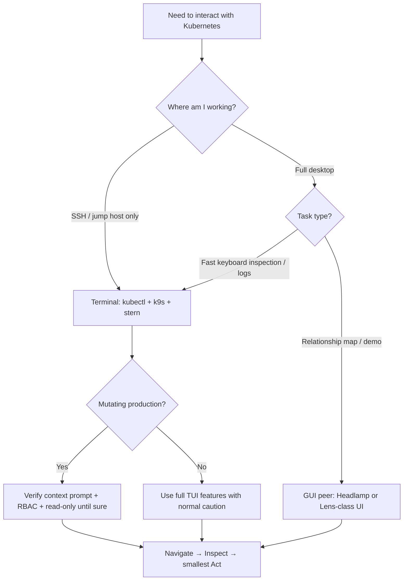

> **Toolkit Track** | Complexity: `[MEDIUM]` | Time: 45-50 minutes

## Prerequisites

Before starting this module, you should be comfortable opening a terminal, running basic `kubectl get` and `kubectl describe` commands, and reading Pod, Deployment, and Service objects in a small cluster. You do not need GUI dashboard experience, but you should understand namespaces, contexts, and how kubeconfig selects the cluster you are targeting. Examples assume Kubernetes **1.35** and a disposable cluster where you can install CLI tools locally without affecting production workloads.

---

## What You'll Be Able to Do

After completing this module, you will be able to:

- **Navigate** Kubernetes clusters using terminal UIs, resource views, filters, and the navigate-inspect-act debugging loop.
- **Configure** k9s skins, aliases, plugins, and read-only mode so daily cluster work stays fast without sacrificing production safety.
- **Tail** and multiplex logs across pod fleets with stern during rollouts, canary checks, and incident response.
- **Manage** kubectl plugins through krew and switch contexts or namespaces without hand-editing kubeconfig on every task change.
- **Apply** kubeconfig hygiene, prompt indicators, and operational guardrails that balance CLI speed with production safety.

---

## Why This Module Matters

Platform engineers live in the gap between what the control plane knows and what a human can act on quickly. Web consoles expose resources visually, yet they often lag behind the API. They may require extra authentication hops. They disappear the moment you are on a jump host with only SSH and a kubeconfig file. The durable capability this module teaches is **operating Kubernetes efficiently from the terminal**: navigate objects, inspect state, tail logs, exec into containers, and apply small fixes without rebuilding mental context on every keystroke.

**Hypothetical scenario:** A platform team responds to elevated 5xx rates on an API Deployment during a Friday evening change window. The on-call engineer has three kubeconfig contexts open across staging, pre-production, and production, and five terminal tabs already running stern sessions from an earlier investigation. A web console login times out behind corporate SSO, but SSH to the bastion succeeds immediately. Because the engineer standardized on k9s for navigation, krew-managed plugins for context switches, and kube-ps1 prompt markers that show `(context:namespace)` in every shell, they confirm the active cluster in under two seconds, filter crashing Pods in the payments namespace, tail logs across the new ReplicaSet with stern, and port-forward to a failing Pod for a local curl check—all without leaving the terminal. The incident lasts roughly twenty minutes instead of the hour they would have spent retyping long kubectl flag chains and second-guessing which window was pointed at production.

That speed is not magic; it is muscle memory built on the right abstractions. kubectl remains the universal baseline because every example, CI job, and runbook speaks it. k9s, stern, kubectx, krew, jq, and optional GUIs such as Headlamp are **peer form factors** that slot into categories. Those categories include TUI navigator, log multiplexer, context switcher, plugin manager, output filter, and desktop UI. They do not form a ranked toolchain where one tool wins. Your job is to pick the form factor that matches the task. Then enforce guardrails so speed never outruns verification.

---

## Why the Terminal Stays the Primary Cockpit

The terminal persists as the platform engineer's primary cockpit because it composes with everything else you already automate. Scripts, CI pipelines, incident runbooks, and SSH sessions all speak stdin and stdout. A workflow built around kubectl ports cleanly into Ansible, Terraform post-apply checks, and ad-hoc Python without a browser session or OAuth token refresh in the middle. When you are on a jump host inside a customer network, the terminal is often the **only** interface that reaches the API server. TUI and CLI fluency are reliability skills, not stylistic preferences.

Terminal workflows also reduce accidental RBAC expansion compared with shared dashboard installs. A web UI frequently needs its own service account, ingress, and long-lived credentials. Those become another surface to patch and audit. Local tools reuse the caller's kubeconfig identity. If your role can delete Deployments, the tool can too. That is why this module pairs speed with read-only modes, prompt indicators, and separate profiles per environment. The trade-off is cognitive: faster tools make mistakes faster unless you engineer friction back in for destructive actions.

Scriptability is the other durable advantage. `kubectl get pods -o json | jq ...` is a reproducible observation you can paste into a ticket. Clicking through a GUI tree is not. Platform teams eventually encode repeated inspections as aliases, plugins, or small scripts checked into git. Individual expertise becomes team capability. The terminal therefore remains the place where **exploration becomes automation** with the least translation loss.

Web consoles still matter for onboarding. They help when you trace relationships across many CRDs or compare YAML side by side. They also help when you pair with someone who does not yet know keyboard shortcuts. The durable lesson is form-factor fit. Reach for the terminal when you need composability, SSH reachability, or high-volume keyboard inspection. Reach for a GUI peer when visualization lowers cognitive load for a static object graph. Neither replaces kubectl. Both assume you can drop to raw commands when an abstraction hides too much.

Latency is another underappreciated factor. A TUI issues list calls and renders tables locally; a remote web UI may proxy through additional hops and session stores. During incidents, those seconds compound across dozens of lookups. Terminal tools also fail gracefully offline: your kubeconfig and binaries remain usable even when SaaS dashboards degrade. That resilience is why runbooks still show shell commands first and screenshots second.

---

## The Navigate-Inspect-Act Loop

Every effective Kubernetes debugging session follows the same loop, regardless of vendor branding on the tool that implements each step. **Navigate** to the object class that matches your hypothesis. Choose Pods if you suspect container crashes. Choose Services if traffic routing looks wrong. Choose Events if scheduling failures are likely. **Inspect** the object's current spec, status, conditions, and recent changes until the story matches telemetry or user reports. **Act** with the smallest reversible change. Examples include scaling a Deployment, deleting a stuck Pod, editing a ConfigMap, or port-forwarding for a local probe. Then re-enter the loop to see whether the cluster state converged.

k9s encodes this loop in muscle memory because the UI keeps context stable while you move between list views, YAML panes, log streams, and shell sessions. stern compresses the inspect step when logs are the fastest signal across many Pods. kubectl with `-o wide`, `-o yaml`, and `describe` remains the fallback when you need exact flags for a runbook. It also remains the fallback when a TUI feature lags a newly graduated API. The loop fails when engineers skip navigation and jump straight to act. They might delete a Pod without confirming namespace, or edit a Service in the wrong context. Modules on operational discipline treat **verification as part of navigate**, not a separate chore.

Treat each rotation through the loop as a hypothesis test rather than a random walk through resources. Start from symptoms. HTTP 502s suggest Ingress or Service endpoints. CrashLoopBackOff suggests container logs or probe configuration. Pending Pods suggest scheduling, quotas, or storage. Narrow the view before you inspect details; otherwise every cluster feels like noise. The CLI ecosystem gives you filters at every layer. k9s `/` filters, stern regex selectors, kubectl label selectors, and jq queries on JSON all help. Navigation is as much about **excluding** irrelevant objects as highlighting candidates.

When you act, prefer commands you can undo or that Kubernetes reconciles automatically. Scaling up, rolling back a Deployment revision, or removing a finalizer-less test object fits that mold. Force-deleting StatefulSet Pods or editing validating webhook configurations may not. The navigate-inspect-act loop therefore pairs naturally with read-only exploration phases. It also pairs with change windows where even fast TUIs run with `--readonly` until you deliberately escalate privileges.

Recording your loop in incident notes improves team learning. Write down which view surfaced the fault, which field confirmed it, and which action changed state. Over time, those notes reveal whether your team over-indexes on Pod logs when Events would be faster, or on describe output when metrics would suffice. The loop is a habit you can refine; the tools are interchangeable implementations of each step.

---

## k9s: A Terminal UI Worked Example

k9s is an open-source terminal UI for Kubernetes maintained in the [derailed/k9s](https://github.com/derailed/k9s) repository with user-facing documentation at [k9scli.io](https://k9scli.io/). It is **not** a CNCF project; it is a community tool that wraps client-go calls behind keyboard-driven views. We use k9s throughout this module as the worked example for **TUI navigation** because it makes the navigate-inspect-act loop visible: you stay inside one screen while switching resource kinds, tailing logs, opening shells, and port-forwarding without retyping resource names.

### Installation and startup modes

Install k9s with your platform package manager or the upstream release artifacts, then confirm the binary runs against a non-production cluster first. macOS users often install via Homebrew; Linux users can fetch release binaries from the project repository; Windows users frequently use Scoop or WSL with the Linux binary. After installation, `k9s version` should print client and build metadata so you can correlate behavior with release notes when shortcuts change.

```bash
# macOS
brew install k9s

# Linux (example amd64 install from GitHub releases)
curl -sL "https://github.com/derailed/k9s/releases/latest/download/k9s_Linux_amd64.tar.gz" | tar xz k9s
sudo install -m 0755 k9s /usr/local/bin/k9s

# Verify
k9s version
```

Launch k9s against the context and namespace you intend to work in, explicitly passing flags when defaults would hide mistakes. `k9s --context staging` binds the UI to one kubeconfig context; `k9s -n kube-system` scopes the initial namespace; `k9s -A` starts in all-namespaces mode for cluster-wide sweeps. For production clusters where exploration should not mutate objects, [`k9s --readonly`](https://k9scli.io/topics/commands/) disables destructive actions at the UI layer—this is a guardrail, not a substitute for RBAC, but it adds friction before accidental deletes during high-stress incidents.

### Resource views and command mode

The k9s interface centers on a table of resources with a header showing active context, cluster, user, and k9s version, a filter line, and a shortcut legend along the bottom. You switch resource kinds by entering **command mode** with `:` followed by an alias such as `:pods`, `:deploy`, `:svc`, `:no`, `:ns`, `:events`, or `:ctx`. This mirrors kubectl resource short names but keeps your place in the UI stack, so returning with `Esc` feels like popping a breadcrumb rather than losing shell history.

Fuzzy filtering with `/` narrows the current table without issuing a new API call semantics you must re-learn—`/api` keeps rows whose names match, `/!api` negates the match, and column-aware filters help when status fields cluster errors together. Sorting shortcuts such as `Shift+C` and `Shift+M` become invaluable when metrics-server is present because they turn the Pod list into a live utilization ranking; you still confirm with `kubectl top` in runbooks, but the TUI answer arrives while you are already positioned on the row you will inspect next.

Essential single-key actions map directly to navigate-inspect-act steps: `Enter` drills into details, `d` describes, `y` shows YAML, `l` tails logs, `s` opens a shell, `e` edits, `p` sets up port-forward, and `Ctrl+K` kills a resource when not in read-only mode. Multi-container Pods prompt for a container when you request logs or shells, which prevents the common kubectl mistake of tailing the wrong sidecar silently.

| Key | Action |
|-----|--------|
| `:` | Command mode (type resource alias) |
| `/` | Filter current view |
| `?` | Help / keyboard shortcuts |
| `Esc` | Back / clear filter |
| `Ctrl+A` | Show all aliases |
| `Enter` | View resource details |
| `d` | Describe resource |
| `y` | YAML view |
| `l` | View logs |
| `s` | Shell into container |
| `Ctrl+K` | Kill/delete resource |
| `e` | Edit resource |
| `p` | Port-forward |

### Skins, aliases, and plugins

k9s behavior is driven by YAML configuration under `$XDG_CONFIG_HOME/k9s` (typically `~/.config/k9s/config.yaml`) plus optional **skins** for color schemes and **plugins** that bind external commands to resource selections. Skins matter when you run k9s for hours during incidents—high-contrast themes reduce mis-clicks, and consistent colors for error statuses speed scanning. Aliases let teams encode opinionated views— for example, a `:pay` alias that jumps to a filtered Pod list in the payments namespace—so newcomers inherit navigation paths instead of reinventing filters.

Plugins extend k9s without forking the core binary: you define a command template with resource metadata injected as environment variables, then invoke it from a selected row. Typical plugin patterns wrap debugging helpers—opening a Git commit for an image tag, running a benchmark job, or invoking a controlled cleanup script against orphaned ConfigMaps. Treat plugins like any other production automation: pin versions, code-review templates, and avoid embedding cluster-admin credentials in shell snippets just because the UI makes launching them easy.

Configure read-only defaults for production contexts in config when your team frequently multitasks across environments. Pair that with separate kubeconfig files or `KUBECONFIG` includes per environment. Switching contexts should feel like a deliberate file swap, not an invisible mutation of the default cluster pointer.

### k9s workflows for recurring incidents

Image pull failures often appear first as Pods stuck in `ImagePullBackOff`. In k9s, navigate to `:pods`, filter `/ImagePull`, describe the row, and read Events for registry auth or typo hints. If the Deployment keeps recreating bad Pods, inspect the ReplicaSet generation in YAML view before editing the Deployment spec. Port-forward with `p` when you need a local curl against a Service backend without editing Ingress.

Probe failures show up as restart loops with small log windows. Tail logs with `l`, then inspect probe paths in YAML. Exec with `s` only when logs are empty but the process should still respond. Remember that exec requires RBAC distinct from log access; missing permissions look like tool bugs to newcomers.

Node pressure incidents benefit from `:no` navigation and metrics-server sorts. Find hot nodes, drill to `:pods` filtered by node field if your k9s version exposes it, or fall back to kubectl custom columns. Cordoning and draining remain kubectl-first operations in many runbooks because flags are explicit and auditable.

NetworkPolicy debugging rarely ends inside k9s alone. Start from `:svc` and `:endpoints` or EndpointSlice equivalents, confirm backends exist, then use kubectl or a CNI-specific CLI for policy traces. k9s accelerates the object confirmation steps; it does not replace specialized network tooling.

---

## kubectl Baseline Commands Worth Memorizing

k9s and plugins sit on top of kubectl semantics. If kubectl flags drift from your mental model, the TUI will mislead you quietly. Memorize a small **baseline set** that covers navigation and inspection without endless flag combinatorics.

`kubectl config current-context` and `kubectl config view --minify` answer "where am I?" faster than guessing from shell history. `kubectl get events -A --sort-by='.lastTimestamp'` surfaces scheduling and pull errors when Pod lists look vague. `kubectl describe` remains the richest single-object narrative; k9s `d` wraps the same API calls with keyboard ergonomics.

Watch mode matters for rollouts: `kubectl rollout status deploy/api -n payments` blocks until success or timeout; `kubectl get pods -w` shows transitions live when you are not inside k9s. For JSON automation, `kubectl get deploy api -o jsonpath='{.status.readyReplicas}'` prints a single number scripts can compare. These commands should feel boring; boring commands survive incidents when fancy tools are not installed yet.

Keep cheat-sheet aliases out of CI scripts. Scripts should spell full commands for readability; humans may alias interactively. The split prevents a copied alias from breaking a pipeline on a minimal image without your shell profile.

---

## Managing kubectl Plugins with krew

kubectl's plugin mechanism treats any executable named `kubectl-<name>` on your `PATH` as a subcommand `kubectl <name>`. That convention is simple and durable, but discovering, installing, and upgrading dozens of plugins manually does not scale. [**Krew**](https://krew.sigs.k8s.io/) is the official plugin manager maintained by Kubernetes SIG CLI; it indexes community plugins, verifies manifest signatures, and installs binaries into a dedicated root (`${KREW_ROOT:-$HOME/.krew}`) that you add to `PATH`.

Install krew following the [quickstart guide](https://krew.sigs.k8s.io/docs/user-guide/quickstart/), then confirm `kubectl krew version` works before installing plugins. The install script downloads a platform tarball, runs the krew bootstrap binary once, and leaves `kubectl-krew` available as `kubectl krew`. After installation, every plugin is a normal kubectl invocation, which keeps CI and laptop workflows aligned.

```bash
(
  set -x; cd "$(mktemp -d)" &&
  OS="$(uname | tr '[:upper:]' '[:lower:]')" &&
  ARCH="$(uname -m | sed -e 's/x86_64/amd64/' -e 's/\(arm\)\(64\)\?.*/\1\2/' -e 's/aarch64$/arm64/')" &&
  KREW="krew-${OS}_${ARCH}" &&
  curl -fsSLO "https://github.com/kubernetes-sigs/krew/releases/latest/download/${KREW}.tar.gz" &&
  tar zxvf "${KREW}.tar.gz" &&
  ./"${KREW}" install krew
)
export PATH="${KREW_ROOT:-$HOME/.krew}/bin:$PATH"
kubectl krew version
```

Search with `kubectl krew search`, install with `kubectl krew install <name>`, and upgrade periodically with `kubectl krew upgrade`. Plugins worth learning first include **ctx** and **ns** for context and namespace switching, **neat** for stripping managedFields noise from YAML, **tree** for ownerReference hierarchies, **images** for cluster-wide image inventory, and **who-can** for RBAC debugging. Each plugin teaches a category: navigation, output cleanup, relationship tracing, inventory, and authorization—categories that survive when individual plugin names change.

```bash
kubectl krew install ctx ns neat tree images who-can
kubectl ctx                    # list contexts
kubectl ctx production         # switch context
kubectl get deploy api -o yaml | kubectl neat
kubectl tree deploy api
kubectl who-can delete pods -n payments
```

The durable practice is to treat plugins like package dependencies: document them in team onboarding, pin acceptable versions in internal runbooks, and prefer plugins that wrap kubectl APIs rather than shell out to opaque binaries with cluster-wide side effects. When a plugin duplicates a core kubectl feature that graduated—such as built-in `--context` flags or server-side apply—re-evaluate whether the plugin still earns maintenance attention.

---

## Context and Namespace Switching with kubectx and kubens

Every kubectl command implicitly reads **current context** and **current namespace** from kubeconfig, yet those two pointers are the source of most "wrong cluster" incidents because they are invisible until something breaks. The durable capability is **fast, reversible context switching** with clear feedback, implemented either by standalone scripts ([ahmetb/kubectx](https://github.com/ahmetb/kubectx) and kubens) or krew plugins that ship the same binaries.

`kubectx` lists contexts, switches with `kubectx production`, and toggles back with `kubectx -` much like `cd -` for directories. `kubens` does the same for namespaces. When installed via krew, the commands appear as `kubectl ctx` and `kubectl ns`, which some teams prefer because they stay inside the kubectl muscle-memory namespace. Either form factor is fine; standardize one per team so pair debugging does not devolve into "which switcher are you using?"

Context switching tools do not replace kubeconfig hygiene—they amplify it. Merge kubeconfig files with explicit names. Avoid duplicate cluster entries that differ only by certificate authority bundles. Keep production credentials in a separate file loaded only when needed. Some engineers symlink `KUBECONFIG` through a wrapper script that prints the newly selected context loudly; others colorize terminal tabs. The through-line is that **switching must be observable**, not silent.

When onboarding a teammate, have them verbalize context and namespace before their first supervised delete in a lab cluster. The habit sounds awkward in calm moments and saves hours in tense ones. Pair that ritual with documented krew bundles so their first day matches the team playbook instead of a random blog toolchain. Revisit the ritual after major kubeconfig refactors so renamed contexts do not silently desync muscle memory. A printed cheat sheet near the bastion login message reinforces the same habit for contractors who rotate through quarterly. Small rituals cost seconds and repay themselves the first time someone catches a wrong-context delete before Enter.

Namespace defaults deserve the same discipline. kubectl 1.35 still honors `kubectl config set-context --current --namespace=...`, which persists until changed; forgetting that default causes "works in my shell" bugs for newcomers who inherit a shared profile. Document namespace defaults in runbooks and reset them after incidents that required `-n` overrides.

---

## Tail Multi-Pod Logs with stern

Single-pod `kubectl logs -f` breaks down the moment a Deployment rolls out, a Job fans out workers, or a microservice spans multiple Pods with hashed suffix names. [**stern**](https://github.com/stern/stern) tails logs from many Pods simultaneously using label selectors or regex arguments, color-codes streams by Pod, and reconnects when Pods restart—behaviors that map to the **log multiplexer** category in the CLI ecosystem.

Install stern from package managers or GitHub releases, then practice against a namespace with at least two Pods sharing a label prefix. `stern api -n payments` follows Pods whose names match the pattern; `--all-namespaces` expands scope; `--container` picks one container when sidecars clutter output; `--since 1h` bounds history for noisy services; `--exclude-container` drops istio-proxy or vault-agent streams that drown application signal.

```bash
brew install stern   # macOS example
stern "api-.*" -n payments
stern api --all-namespaces --timestamps
stern worker --exclude-container istio-proxy --since 30m
```

Compare stern with k9s log view deliberately. k9s excels when you already navigated to a Pod row and want quick introspection without remembering regex syntax. stern excels when you know the label vocabulary and need fleet-wide tailing during rollouts—watching old and new ReplicaSets simultaneously, for example. kubectl remains the portable baseline for runbooks that must run in minimal CI images without extra binaries.

Operational caution: log multiplexers increase data exposure. Tail production logs only with RBAC that justifies access. Redact sensitive fields at the application layer. Stop tails when incidents end so laptop disks do not accumulate PII. stern does not replace centralized logging. It complements logging for the first minutes when you need live bytes before Loki or Elasticsearch queries catch up.

During canaries, combine stern selectors with label changes on the new ReplicaSet. Watch both old and new templates until error rates stabilize. When sidecars dominate output, exclude them explicitly rather than squinting through service mesh noise. If timestamps matter for correlation with metrics, enable stern's timestamp flag and note time zone assumptions in your incident doc.

---

## Filtering Output with jq, yq, and kubectl Templates

Navigation finds objects; filtering extracts answers. kubectl ships structured output via `-o json`, `-o yaml`, `-o jsonpath`, and `-o custom-columns` as documented in the [kubectl quick reference](https://kubernetes.io/docs/reference/kubectl/quick-reference/) and [JSONPath guide](https://kubernetes.io/docs/reference/kubectl/jsonpath/). **jq** filters JSON streams; **yq** handles YAML when pipelines still speak text files; together they form the **output filter** category that makes CLI exploration scale to hundreds of objects.

A durable pattern is `kubectl get pods -A -o json | jq '.items[] | select(.status.phase!="Running") | {ns: .metadata.namespace, name: .metadata.name, phase: .status.phase}'`, which turns a cluster-wide list into a concise failure report you can attach to a ticket. Custom columns cover simpler cases without jq: `kubectl get pods -o custom-columns=NS:.metadata.namespace,NAME:.metadata.name,IP:.status.podIP,READY:.status.containerStatuses[*].ready`. JSONPath fits when you need one field for scripting: `kubectl get svc api -o jsonpath='{.spec.clusterIP}'`.

Learn three levels of filtering depth and stop when the answer is stable. Level one is kubectl built-ins for tabular answers. Level two is jq for cross-object queries. Level three is client-side caches like `kubectl get --raw` only when you understand API discovery paths. Avoid embedding huge JSON blobs into shell scripts without pinning apiVersion assumptions. CRDs evolve fields quickly, and silent schema drift breaks jq filters in ways that look like application bugs.

**kubecolor** ([kubecolor/kubecolor](https://github.com/kubecolor/kubecolor)) adds syntax highlighting to kubectl output. Some teams alias `kubectl=kubecolor` interactively while keeping plain kubectl in CI. Coloring is not vanity. It helps spot `Error` statuses and namespace columns when sleep-deprived, which indirectly supports safer navigation. Highlighting does not replace reading column headers; always confirm which namespace column you sorted.

When teaching jsonpath, start with field paths learners already know from YAML (`metadata.name`, `status.phase`). Then introduce array selectors sparingly. Complex jsonpath one-liners belong in saved scripts with comments, not in ephemeral shell history. Pair jsonpath lessons with `kubectl explain` so field paths track the live API schema for Kubernetes 1.35 rather than a stale blog post.

---

## Shell Integration: Aliases, Completion, and Prompts

Aliases compress repetitive kubectl flag chains into team vocabulary: `alias k=kubectl`, `alias kgp='kubectl get pods'`, `alias kctx='kubectl ctx'`, and watch variants for rollouts. The [official kubectl cheat sheet](https://kubernetes.io/docs/reference/kubectl/cheatsheet/) documents common patterns; teams that standardize aliases reduce miscommunication during incidents because "run kgp in payments" means the same flags for everyone.

Enable shell completion so resource names tab-complete after partial typing; bash and zsh users source `<(kubectl completion bash|zsh)`, and k9s ships its own completion generator for command mode shortcuts. Completion reduces typos in resource names, which matters because Kubernetes names are opaque strings where one character points at a different Pod.

Prompt integration with [kube-ps1](https://github.com/jonmosco/kube-ps1) embeds `(⎈|context:namespace)` into your PS1 prompt, making the invisible kubeconfig pointers visible on every command line, not only when you remember to run `kubectl config current-context`. Pair kube-ps1 with terminal color profiles or iTerm2 tab colors keyed to environment so production windows look visually distinct from staging without relying on memory alone.

```bash
# Example ~/.bashrc excerpt
alias k=kubectl
alias kgp='kubectl get pods'
source <(kubectl completion bash)
source /path/to/kube-ps1.sh
PS1='$(kube_ps1)'$PS1
```

Fuzzy finders such as fzf compose with kubectl for interactive picks. You might select a Pod, then exec or fetch logs. Treat them as personal accelerators unless scripted identically for the whole team. The durable practice is to check interactive helpers into shared scripts when they become incident steps. Private shell lore does not scale on-call rotation.

---

## Building a Team CLI Playbook

Individual tool fluency becomes organizational reliability when you encode it in a short, version-controlled playbook. The playbook is not a tool ranking; it is a **decision guide** that names categories (TUI, multiplexer, plugin manager, context switcher, filter, GUI) and lists approved implementations per category. New hires install the same krew bundle, inherit k9s alias files from git, and see kube-ps1 in the standard shell profile used by your bastion hosts.

Document mandatory pre-flight checks for mutating commands: confirm context, confirm namespace, confirm object name via describe output, and only then run delete or edit operations. Pair those checks with examples showing read-only k9s sessions versus escalation steps for break-glass roles. Include stern regex examples keyed to your label conventions so on-call engineers do not invent selectors under pressure.

Run a quarterly drill where engineers solve a simulated incident using only the bastion toolchain. Drills surface gaps—missing plugins, outdated k9s configs, or kubeconfig merges that duplicate context names. Update the landscape snapshot table after each drill when versions or CNCF statuses change. Churn lives in the table; the navigate-inspect-act spine stays stable.

Capture "escape hatches" explicitly: when to drop from k9s to raw kubectl for a documented flag, when to open Headlamp for a CRD relationship map, and when to stop tailing locally and pivot to centralized logs for compliance. Escape hatches prevent tool loyalty from blocking the fastest path.

Review plugin supply chain during drills. Remove krew plugins that duplicate upstream kubectl features or lack active maintenance. The goal is a **small, reviewed toolchain** that installs in minutes on a fresh laptop, not a maximal collection of every blog post recommendation.

---

## Composing Tools in End-to-End Workflows

Real shifts rarely stick to one binary. A typical investigation chains context confirmation, navigation, log multiplexing, and structured extraction. Imagine verifying `(⎈|staging:payments)` in kube-ps1, opening k9s read-only, filtering `/checkout`, describing a Pod with probe failures, then launching `stern checkout -n payments --since 15m` while a teammate watches Grafana dashboards. Each tool owns one step; the playbook owns the order.

Automation boundaries matter when composing tools. CI pipelines should call kubectl with pinned versions and avoid interactive TUIs entirely. Laptop sessions may alias kubectl to kubecolor and launch k9s freely. Document which steps are safe to alias and which must remain literal for copy-paste into tickets. When a postmortem action item says "run kubectl describe," do not hide the command behind an alias newcomers cannot decode.

Version skew is another composition hazard. k9s releases track Kubernetes client versions; stern and krew plugins follow their own cadence. Pin minimum versions in the team playbook and test upgrades on a kind cluster before rolling bastion images. A broken plugin index or expired krew certificate looks like an outage when every engineer updates simultaneously on Monday morning.

Teach newcomers the categories before the brands. Ask them to name the capability—"I need fleet logs"—before picking stern. Ask which capability—"I need a read-only map of Pods"—before opening k9s. Once categories stick, swapping tools becomes a minor inconvenience instead of a retraining project when your organization adopts a different GUI peer or log backend.

Finally, practice translating GUI clicks back to kubectl. If Headlamp shows an unexpected ownerReference chain, reproduce it with `kubectl tree` or jsonpath queries. If k9s YAML view reveals a field, confirm with `kubectl get -o yaml` in the ticket. Translation practice keeps your baseline sharp and prevents black-box dependence on any single interface.

Accessibility and ergonomics also belong in workflow design. Font size, color-blind-safe skins, and terminal latency on VPN paths affect whether k9s feels usable during a long bridge call. Standardize a minimum terminal width and a monospace font on bastions so columnar output aligns. Small ergonomics choices reduce misread namespaces when fatigue sets in during overnight incidents.

---

## GUI Peers: Headlamp and Lens on Form Factor

Terminal tools are not the only legitimate interface. **Headlamp** is an extensible open-source Kubernetes UI; the [CNCF project page](https://www.cncf.io/projects/headlamp/) lists it as a **Sandbox** project accepted on 2023-05-17. **Lens** (and compatible forks) represents the desktop IDE-style cluster browser category. Both are **peers** to k9s: they optimize spatial exploration, multi-cluster tabs, and clickable object graphs at the cost of extra local services, GPU/CPU use, and another update channel to track.

Choose a GUI when you are onboarding someone to object relationships. It also helps when you review YAML diffs visually or demo cluster state in a workshop. Choose the terminal when you are on a jump host, stitching commands into a runbook, or tailing logs at high volume with stern and k9s. Many engineers mix both. They use Headlamp for the map, k9s for the sprint, and kubectl for the exact flag documented in a postmortem action item.

Neither form factor removes RBAC obligations. A GUI uses your credentials. A TUI uses your credentials. Speed and visibility differ; authorization does not. Keep GUI installs off shared break-glass accounts unless your security model explicitly allows it. Document which interfaces are approved on regulated laptops versus shared bastions so audits stay straightforward.

> **Landscape snapshot — as of 2026-06. This changes fast; verify against vendor docs before relying on specifics.**

| Item | Snapshot detail |
|------|-----------------|
| k9s | Open-source TUI ([derailed/k9s](https://github.com/derailed/k9s)); not a CNCF project; install via OS packages or GitHub releases |
| Krew | SIG CLI plugin manager ([kubernetes-sigs/krew](https://github.com/kubernetes-sigs/krew)); index at [krew.sigs.k8s.io](https://krew.sigs.k8s.io/) |
| stern | Log multiplexer ([stern/stern](https://github.com/stern/stern)); selector/regex-based multi-pod tail |
| kubectx / kubens | Context/namespace switchers ([ahmetb/kubectx](https://github.com/ahmetb/kubectx)); also packaged as krew `ctx`/`ns` plugins |
| Headlamp | CNCF **Sandbox** Kubernetes UI ([headlamp.dev](https://headlamp.dev/docs/latest/)); verify maturity at [cncf.io/projects/headlamp](https://www.cncf.io/projects/headlamp/) |
| Lens-class desktop UI | Desktop cluster IDE form factor; vendor builds and release cadence vary—verify current docs before pinning features |
| kubectl JSONPath / custom-columns | Built into kubectl 1.35; see [kubernetes.io JSONPath](https://kubernetes.io/docs/reference/kubectl/jsonpath/) |

**CLI ecosystem Rosetta (capabilities × peers)**

| Capability | k9s | kubectl + krew | stern | kubectx + kubens | Headlamp (GUI peer) |
|------------|-----|----------------|-------|------------------|---------------------|
| TUI resource navigation | Primary strength | N/A (shell + aliases) | N/A | N/A | Partial (click navigation) |
| Multi-pod log tail | Per-Pod tail from UI | One Pod per invocation | Primary strength | N/A | Stream logs per Pod |
| Plugin manager | k9s plugins (local YAML) | krew indexes kubectl plugins | N/A | N/A | Extension hooks (verify per release) |
| Context / namespace switch | `:ctx`, `:ns` views | `kubectl ctx`, `kubectl ns` via krew | CLI flags only | Primary strength | UI cluster picker |
| Structured output filter | YAML view | json/jsonpath/custom-columns + jq | Label/regex selection | N/A | Field panels + YAML panes |

---

## Operational Discipline: Speed Versus Guardrails

Fast TUIs do not absolve you of change management. Read-only k9s mode, RBAC roles that forbid deletes in production, and break-glass accounts with extra logging are complementary layers. The durable practice is to **match tool power to environment**. Use read-only exploration on prod, full access on dev, and scripted automation in CI with scoped tokens.

Kubeconfig files deserve the same care as private keys. Restrict file modes with `chmod 600`. Avoid checking kubeconfig into git. Rotate credentials when engineers leave. Prefer cloud identity plugins over long-lived embedded certificates when your platform supports them. When multiple clusters merge into one kubeconfig, name contexts explicitly. Names like `prod-use1-payments` beat opaque cloud ARNs copied twice with ambiguous suffixes.

Separate terminal profiles or OS spaces for production versus non-production work. Some teams assign red backgrounds to prod tabs. Others require typing the context name before destructive wrappers run. The guardrail must be visible **before** Enter, not only in a post-incident review. Pair visual cues with short spoken confirmations during pair incidents: state the context aloud before any delete.

Document which tools are allowed on break-glass laptops versus CI runners. stern and k9s belong in many production incident kits. Arbitrary krew plugins might not until security reviews their behavior. Treat new plugins like new dependencies: review supply chain, maintainer activity, and least privilege before adding them to the approved bundle.

Change-management integration closes the loop. If your org requires tickets for production edits, the CLI speed stack must not bypass that policy informally. Read-only exploration can be ticketless; mutating commands should reference change IDs in shell history or scripted audit logs. Speed without traceability creates compliance debt that shows up during audits, not during drills.

**Hypothetical scenario:** An engineer intends to delete a stale Deployment in staging but still points at the production context from an earlier kubeconfig export. They open k9s without read-only mode, fuzzy-filter the name `api`, and press delete on the first matching row. Guardrails that would have helped include kube-ps1 showing `production` in the prompt, a prod tab color, read-only k9s until explicitly escalated, and RBAC that denies deletes to their default role. The UI makes deletion feel effortless; policy and prompts must make mistakes visible first.

Post-incident reviews for CLI mistakes rarely blame the tool alone. They reveal missing pre-flight habits: no context callout, no read-only default, no second engineer confirmation for destructive commands. Treat those habits as part of the toolchain implementation, equal to installing k9s itself. Tools amplify whatever discipline already exists; they do not create discipline on their own.

---

## Patterns and Anti-Patterns

### Patterns

1. **Standardize the navigate-inspect-act loop** — Teach everyone to list the right resource kind, describe or YAML inspect, then act with the smallest change, regardless of whether k9s, kubectl, or a GUI implements each step.
2. **Make context visible before commands** — Use kube-ps1 or equivalent prompt markers and require context confirmation in runbooks for mutating operations.
3. **Use read-only TUIs for production exploration** — Launch k9s with `--readonly` until you deliberately need edits; pair with RBAC that enforces least privilege.
4. **Encode team navigation in k9s aliases and krew plugins** — Check reviewed config into git so incident navigation is shared, not tribal.
5. **Pick the log tool for the shape of the problem** — k9s for single-Pod quick tails near navigation; stern for fleet rollouts; centralized logging for audit and long retention.

### Anti-Patterns

1. **Silent context switching** — Jumping contexts without prompt feedback invites wrong-cluster mutations; always make switches observable.
2. **Plugin sprawl without review** — Installing every krew plugin mentioned in a blog post expands supply-chain risk and confuses newcomers.
3. **GUI-only onboarding** — Engineers who never learn kubectl struggle on jump hosts and in CI; GUIs complement, not replace, baseline CLI fluency.
4. **Permanent `--all-namespaces` habits** — Cluster-wide views hide namespace defaults that later cause mistaken applies; scope deliberately.
5. **Alias drift across teammates** — Personal aliases that never sync to team docs make pair debugging slower than plain kubectl.

### Decision framework



| Situation | Prefer | Why |
|-----------|--------|-----|
| Incident log flood during rollout | stern + label selectors | Fleet-wide tail with pod-colored streams |
| Quick pod inspect after filter | k9s | Stay in one TUI stack |
| CI scriptable check | kubectl + jsonpath/jq | Reproducible, minimal deps |
| Onboarding object graph | Headlamp or GUI peer | Spatial layout lowers cognitive load |
| Prod exploratory look | k9s `--readonly` + kube-ps1 | Speed with guardrails |

---

## Did You Know?

- **k9s command mode** reuses kubectl resource short names behind `:` aliases, so learning kubectl shorthand directly improves k9s navigation speed.
- **Krew** installs plugins as `kubectl-<name>` binaries on your PATH, which means CI can invoke the same plugin commands as your laptop once `KREW_ROOT/bin` is exported.
- **stern** reconnects when Pods restart during Deployments, avoiding the silent disconnect common with single-pod `kubectl logs -f` sessions.
- **Headlamp** entered CNCF as a Sandbox project in May 2023; maturity status lives on the CNCF project page and should be re-checked before compliance discussions.

---

## Common Mistakes

| Mistake | Problem | Solution |
|---------|---------|----------|
| No context indicator | Commands target the wrong cluster silently | Use kube-ps1 or equivalent prompt markers |
| Forgetting namespace defaults | Applies hit unexpected namespaces | Run `kubectl config view --minify` and reset defaults after incidents |
| Verbose kubectl only | Slow navigation erodes focus | Learn k9s filters and team aliases |
| Single-pod logs during rollouts | Miss errors on new ReplicaSet members | Use stern with label or regex selectors |
| Skipping shell completion | Typos in long resource names | Enable bash/zsh completion for kubectl and k9s |
| Unreviewed krew plugins | Supply-chain and RBAC surprises | Maintain an approved plugin list |
| Full-access k9s on prod | Fast deletes during stress | Use `--readonly` until escalation is explicit |
| GUI-only skill set | Stuck on SSH-only incident bridges | Keep kubectl fluency as the portable baseline |

---

## Quiz

1. **Scenario:** You land on a bastion with kubeconfig access but no browser. Payments Pods are crashlooping after a rollout. Which tools and loop steps do you use first?

<details>
<summary>Answer</summary>

Start the **navigate-inspect-act** loop in the terminal because no GUI is available. **Navigate** with k9s `:pods` in the payments namespace or `kubectl get pods -n payments` if k9s is not installed. **Inspect** by describing a failing Pod, viewing YAML for probe or image changes, and **tail** logs—stern if multiple Pods match the Deployment, k9s `l` if you are already on one row. Postpone edits until context is confirmed with `kubectl config current-context` or kube-ps1. This scenario uses terminal form factors by necessity; stern covers fleet logs while kubectl remains the portable fallback.

</details>

2. **Scenario:** A teammate wants to delete an orphaned ConfigMap in staging but their prompt still shows a production context. What guardrails should be in place before they act?

<details>
<summary>Answer</summary>

They should **apply** visible context verification before any delete: kube-ps1 or an equivalent prompt marker, a deliberate `kubectl ctx staging` or `kubectx staging`, and ideally read-only exploration until the object is confirmed. k9s `--readonly` prevents accidental UI deletes during lookup. RBAC should make production deletes impossible with their default role even if the UI allows attempting them. Guardrails stack—prompt, context switcher, read-only mode, and RBAC—because no single layer catches every mistake.

</details>

3. How do you **configure** k9s for safer production use while keeping fast navigation in non-production clusters?

<details>
<summary>Answer</summary>

Use **`k9s --readonly`** for production sessions so destructive shortcuts are disabled at the UI layer, and encode that expectation in team runbooks. Maintain separate kubeconfig files or contexts with explicit names, and store skins or alias files in git so `:pay` or `:platform` shortcuts are reviewed. Configure plugins cautiously—only install templates that security has reviewed—and use non-production contexts for plugin experiments. **Configure** read-only defaults in `$XDG_CONFIG_HOME/k9s/config.yaml` when supported, pairing UI friction with RBAC least privilege rather than relying on either alone.

</details>

4. When should you **manage** logs with stern instead of k9s or kubectl alone?

<details>
<summary>Answer</summary>

**Tail** with stern when multiple Pods share a pattern during rollouts, Jobs, or sharded workers—cases where single-pod `kubectl logs` hides the failing replica. stern shines with regex or label selectors, color-coded streams, and reconnect behavior across Pod restarts. Prefer k9s log view when you already navigated to one Pod and need a quick peek, and prefer centralized logging when retention, search, or compliance requirements exceed live tailing. stern is the fleet multiplexer; kubectl is the portable single-pod baseline.

</details>

5. How does krew change how you **manage** kubectl extensions compared with manual installs?

<details>
<summary>Answer</summary>

Krew indexes signed plugin manifests, installs versioned binaries into `${KREW_ROOT}/bin`, and exposes them as `kubectl <plugin>` commands without manual PATH hunting. You **manage** upgrades with `kubectl krew upgrade` and discover tools with `kubectl krew search`, treating plugins like packages with explicit names (`ctx`, `ns`, `neat`, `tree`). Manual installs rot silently; krew makes drift visible. Teams should still curate an approved list—krew makes installation easy, not risk-free.

</details>

6. **Scenario:** You need JSON listing every Pod not in `Running` phase across all namespaces for a ticket attachment. Outline a kubectl + jq approach.

<details>
<summary>Answer</summary>

Run `kubectl get pods -A -o json` and pipe to jq to filter `.items[]` where `.status.phase != "Running"`, projecting namespace, name, and phase fields. This uses kubectl's structured output filter category documented on kubernetes.io rather than ad-hoc grep on wide tables. Verify RBAC allows cluster-wide pod list before running in production. For recurring checks, promote the query to a script in git so **navigate** and **inspect** steps stay reproducible for teammates.

</details>

7. Compare k9s `:ctx` navigation with **kubectx** for context switching—when is each appropriate?

<details>
<summary>Answer</summary>

k9s `:ctx` keeps you inside the TUI when you are mid-incident navigating resources; context switches refresh the UI stack without dropping log or describe panes you might reopen. **kubectx** (or `kubectl ctx` via krew) fits shell-first workflows, scripts, and prompts where you will run plain kubectl afterward. Both **manage** kubeconfig current-context pointers; choose based on whether your hands are already on k9s keys or on a shell prompt. Neither replaces verifying the prompt or kube-ps1 output after switching.

</details>

8. **Scenario:** Leadership asks whether to standardize on Headlamp or k9s. What capability-based answer avoids vendor bias?

<details>
<summary>Answer</summary>

Present them as peers on form factor: Headlamp fits GUI **navigation** and workshops; k9s fits SSH-reachable, keyboard-heavy **navigate-inspect-act** loops; kubectl remains the automation baseline. Compare rows in the Rosetta table—log tail, context switch, plugin model—rather than declaring a single winner. Many teams adopt k9s plus stern for incidents and a GUI for onboarding, with kubectl in CI. Maturity notes belong in the dated landscape snapshot (Headlamp CNCF Sandbox as of 2026-06; k9s upstream OSS).

</details>

---

## Hands-On

**Task:** Install and exercise k9s, krew, and stern against a disposable cluster, then wire shell guardrails you would trust during a real incident.

### Environment setup

```bash
brew install k9s stern kubecolor   # macOS example; use package manager or GitHub releases on Linux
# Install krew via https://krew.sigs.k8s.io/docs/user-guide/quickstart/
export PATH="${KREW_ROOT:-$HOME/.krew}/bin:$PATH"
kubectl krew install ctx ns neat
```

### Steps

1. Launch `k9s --readonly` against a non-production context, run `:pods`, filter with `/`, open logs with `l`, and describe with `d`.
2. Switch context with `kubectl ctx` or `kubectx`, confirm the change via `kubectl config current-context`, and install kube-ps1 so your prompt shows context and namespace.
3. Deploy a two-replica Deployment, roll an image change, and **tail** logs with `stern` across both ReplicaSets while the rollout progresses.
4. Run `kubectl get pods -A -o json | jq` to list non-Running Pods, and pipe one object through `kubectl neat` after fetching YAML.
5. Optional: open Headlamp or document which GUI peer your team uses, and note one task you would still do in k9s instead.

### Success criteria

- [ ] k9s launches in read-only mode and you can navigate, filter, and inspect a Pod without mutating cluster state
- [ ] kube-ps1 or an equivalent prompt shows context and namespace before you run mutating kubectl commands
- [ ] stern tails logs from multiple Pods during a Deployment rollout with distinct pod colors or prefixes visible

---

## Sources

- [k9s documentation](https://k9scli.io/)
- [k9s GitHub repository (derailed/k9s)](https://github.com/derailed/k9s)
- [Krew — kubectl plugin manager](https://krew.sigs.k8s.io/)
- [Krew quickstart install guide](https://krew.sigs.k8s.io/docs/user-guide/quickstart/)
- [Krew GitHub repository (kubernetes-sigs/krew)](https://github.com/kubernetes-sigs/krew)
- [kubectl plugins overview](https://kubernetes.io/docs/tasks/extend-kubectl/kubectl-plugins/)
- [kubectl quick reference](https://kubernetes.io/docs/reference/kubectl/quick-reference/)
- [kubectl JSONPath support](https://kubernetes.io/docs/reference/kubectl/jsonpath/)
- [stern multi-pod log tailer](https://github.com/stern/stern)
- [kubectx and kubens](https://github.com/ahmetb/kubectx)
- [kube-ps1 prompt helper](https://github.com/jonmosco/kube-ps1)
- [kubecolor](https://github.com/kubecolor/kubecolor)
- [Headlamp documentation](https://headlamp.dev/docs/latest/)
- [CNCF Headlamp project page (Sandbox)](https://www.cncf.io/projects/headlamp/)

---

## Next Module

Continue to [Module 8.2: Telepresence & Tilt](../module-8.2-telepresence-tilt/) to connect local development workflows with remote Kubernetes clusters and faster inner loops.
