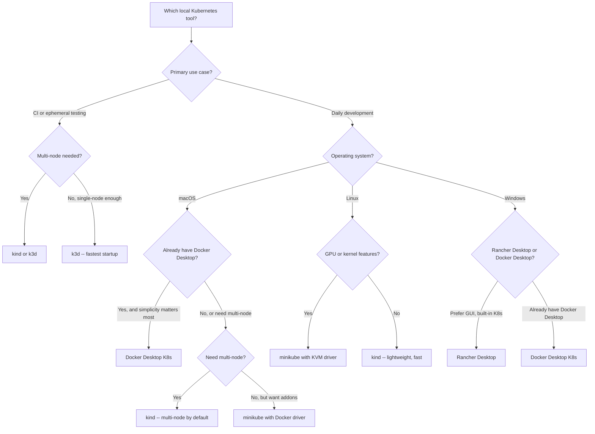

> **Toolkit Track** | Complexity: `[MEDIUM]` | Time: 50-60 minutes

## What You'll Be Able to Do

After completing this module, you will be able to:

- **Deploy local Kubernetes clusters using kind, minikube, k3d, Docker Desktop, and Rancher Desktop with configurations tuned to your development context**
- **Configure local clusters with ingress controllers, local image registries, and multi-node topologies that realistically approximate production behavior**
- **Implement local development workflows -- image loading, service exposure, version pinning, and teardown -- that transfer directly to CI pipelines and team environments**
- **Compare local Kubernetes tools across the durable architecture axis (container-node versus VM-node), startup speed, resource footprint, CI fit, and feature breadth, then select the right tool for each use case**

## Why This Module Matters

Every developer who works with Kubernetes needs a cluster to develop against. The first instinct is often to provision a cloud cluster -- spin up a GKE or EKS node group, configure kubectl, and start deploying. That works, but it brings friction that accumulates fast: latency on every kubectl command (200-800ms round-trip to the cloud API server is normal), dollars ticking on the cloud bill even when you are reading documentation or refactoring code, and the constant low-grade anxiety of accidentally leaving expensive resources running overnight. A cloud cluster for development is like renting a warehouse to store your notebook -- the scale is mismatched to the task.

Local Kubernetes eliminates all of that. It runs the full Kubernetes control plane and worker nodes on your own machine, which means sub-millisecond API latency, zero cloud cost, and complete isolation from other developers. You can break things without breaking anyone else's environment, you can work on a plane or in a basement with no internet, and you can spin up and tear down clusters in seconds rather than minutes. The development loop tightens from "commit, push, wait for CI, check cloud" to "build, load, deploy, verify" in a single local cycle. For anyone writing Kubernetes manifests, Helm charts, operators, or admission webhooks, a local cluster is not a nice-to-have -- it is a force multiplier that compresses minutes of waiting into seconds of doing, every single iteration.

There is a durable distinction worth making early: a local cluster is not the same thing as a remote shared development cluster. A shared dev cluster -- one GKE cluster that the whole team shares for integration testing -- still has latency, still costs money, and introduces contention when two developers deploy conflicting resources. A local cluster is truly personal, ephemeral, and disposable. You can create it, populate it with test data, run your experiments, and destroy it, leaving no trace and no bill. This disposability is the superpower. It means you never accumulate configuration drift because every cluster starts from a known-good config. It means you can test destructive operations -- node failures, network partitions, control-plane upgrades -- without filing a ticket. And it means your development environment is reproducible: if a bug reproduces on your local cluster, you can share the exact cluster config that triggered it, and your teammate can reproduce it on their machine in under a minute.

> **Hypothetical scenario:** A team of four platform engineers is building a new admission webhook for namespace labeling. Each engineer spins up a local kind cluster with the same config checked into the repo. One engineer discovers that the webhook deadlocks when the cluster has three worker nodes but not when it has one -- a scheduling race condition that would have surfaced weeks later in staging, after integration. Because they can create and destroy multi-node clusters locally in under 30 seconds, they isolate the bug in an afternoon. The fix lands before the webhook ever touches a shared environment. The alternative -- debugging this on a shared dev cluster -- would have required booking a maintenance window, coordinating with the team to avoid conflicting deploys, and waiting minutes between each cluster-rebuild cycle.

## The Architecture Axis: Container-Node versus VM-Node

Understanding how a local Kubernetes tool runs its nodes is the single most important concept for choosing and troubleshooting one. Every local K8s tool sits somewhere on a fundamental architectural spectrum, and that choice determines nearly everything else: startup speed, resource consumption, feature fidelity to a production cluster, and which operational workflows are natural versus awkward.

On one end of the spectrum is the container-node model. Tools in this category -- kind, k3d, and to some extent Docker Desktop -- run each Kubernetes node as a Docker container on your host machine. The API server, kubelet, containerd (or CRI-O), and all the control-plane components live inside that container, just as they would on a bare-metal node, but the container itself is a lightweight Linux process managed by your host's Docker daemon. Because containers start in milliseconds and share the host kernel, a container-node cluster can go from zero to ready in 20-60 seconds with a memory footprint as low as a few hundred megabytes per node. This is why kind has become the default choice for CI pipelines: GitHub Actions, GitLab CI, and Jenkins workers can spin up and tear down a full multi-node cluster inside a single job without the overhead of a hypervisor. The Kubernetes project's own CI -- sig-testing -- runs tens of thousands of kind clusters per day on this model.

The container-node model has tradeoffs, and the most important one is that the nodes are containers, not machines. Certain kernel features that a production kubelet expects -- cgroup v2 hierarchies, specific sysctl settings, filesystem mount options -- may behave differently inside a container, especially on macOS where Docker itself runs in a Linux VM. Storage is ephemeral by default because the node container is destroyed when the cluster is deleted. And networking is mediated by Docker's bridge or overlay networks, which means you have to think about port mappings and host-network reachability rather than assuming the node has its own routable IP on your LAN. These are not blockers for most development and testing workflows, but they are real differences from a VM-based or bare-metal cluster, and they explain why certain production behaviors -- CSI driver interactions with cloud block storage, for example -- cannot be faithfully reproduced on a container-node local cluster.

On the other end of the spectrum is the VM-node model, where each Kubernetes node runs inside a dedicated virtual machine with its own kernel, its own networking stack, and its own resource allocation. minikube pioneered this model and still supports it across multiple hypervisors (VirtualBox, HyperKit, KVM, QEMU), though it now also offers a Docker driver that blurs the line. Rancher Desktop runs a full VM (using Lima on macOS, or a WSL2 VM on Windows) and places Kubernetes inside it. The VM model provides stronger isolation: the node gets its own kernel, its own cgroup hierarchy, and its own network interface. This makes it a closer approximation of a production node, which matters when you are testing kernel-dependent features like eBPF programs, seccomp profiles, GPU device plugins, or CSI drivers that interact with the host filesystem. The cost is heavier resource usage. A VM-node cluster typically consumes 2-4 GB of memory and takes longer to start because the hypervisor must boot a full Linux kernel before the kubelet starts.

The practical consequence of this architectural split ripples through every operational decision. If you are iterating on a Helm chart and need to verify deployments 50 times in an afternoon, the 20-second startup of a container-node cluster versus the 90-second startup of a VM-node cluster compounds into a real productivity difference. If you are testing a PodSecurityPolicy that restricts kernel capabilities, the VM-node model gives you a truer environment because the kernel is the actual arbiter of those capabilities. If you are running on a CI worker that prohibits nested virtualization, the container-node model is your only option -- there is no hypervisor to run a VM. These tradeoffs are durable. They do not change when a new tool ships or a version increments, because they follow from the architectural choice, not the implementation details.

The hybrid reality is that the boundary has softened. minikube's Docker driver runs the node in a container (like kind) but retains minikube's addon system and feature surface. Docker Desktop bundles a single-node Kubernetes cluster that runs inside its embedded VM alongside the Docker daemon, so the node is effectively a container inside a VM. k3d deploys k3s -- a lightweight, CNCF-certified Kubernetes distribution -- as containers, giving you the CI-friendly speed of the container-node model with the reduced resource footprint of k3s itself. The taxonomy (container-node versus VM-node) remains the right durable lens, but the tools now populate intermediate points along the spectrum, and the right choice depends on which point best matches your testing fidelity requirements against your resource budget.

## Common Operational Concerns

Beyond the architectural choice, every local Kubernetes user faces the same set of operational questions. These are the workflows you will run every day, and understanding how each tool handles them determines whether your local cluster feels like a seamless part of your development loop or a constant friction point.

### Loading Local Images

The most common operational surprise for new local-cluster users is the image boundary. When you run `docker build -t myapp:dev .` on your host, the resulting image lands in your host's Docker daemon image store. But your local Kubernetes cluster has its own container runtime -- containerd, CRI-O, or Docker depending on the tool -- and that runtime has its own image store. The image you just built is not visible to the cluster by default. This is the most frequent source of `ImagePullBackOff` errors in local development, because the pod spec references an image tag that the cluster runtime cannot resolve.

Each tool has its own answer to this problem, and the answer follows from the architecture. kind provides `kind load docker-image`, which exports the image from the host Docker daemon and imports it into every node's containerd in a single command. It is fast (a few seconds for typical images) and works without a registry. minikube provides `minikube image load`, which does the same thing for its Docker driver, and `minikube cache add` for older versions. k3d offers `k3d image import`, which copies the image into the k3d cluster's internal registry or directly into the nodes. Docker Desktop has the simplest path: because the Kubernetes cluster and the Docker daemon share the same VM, images built with `docker build` are immediately visible to the cluster's runtime with no loading step. Rancher Desktop, using the `dockerd` container runtime for Kubernetes, similarly shares the image store when configured with the dockerd runtime (the default), but when switched to containerd the boundary reappears.

For workflows with many images or rapid iteration, a local registry is often a better pattern than repeated `load` commands. You run a registry container on your host, push images to it, and configure your cluster's containerd to pull from that registry. This avoids the per-image-load latency and works uniformly across all the local tools because you are using the standard OCI distribution protocol rather than a tool-specific loading mechanism. The relevant configuration is a containerd registry mirror or a Docker daemon insecure-registry entry.

### Exposing Services

A production Kubernetes cluster typically has a cloud load balancer that provisions an external IP for LoadBalancer services, or an ingress controller behind that load balancer that routes traffic by hostname. A local cluster has none of that infrastructure. You are running on a laptop, and there is no cloud controller to assign a public IP. Getting traffic from your browser or curl into a pod running on a local cluster requires explicit choices about how to bridge the host-to-cluster network boundary.

The simplest option is `kubectl port-forward`, which creates a TCP tunnel from a local port on your host to a pod, service, or deployment inside the cluster. It works regardless of the local-cluster tool, requires no configuration beyond kubectl access, and is ideal for one-off debugging. But it is per-connection and ties up a terminal, so it does not simulate a production traffic path.

NodePort services work on all local clusters: you define a Service of type NodePort, and the cluster assigns a port (typically in the 30000-32767 range) that is exposed on every node's IP. On a container-node cluster like kind, the node's IP is not directly reachable from the host because the node is a container on a Docker bridge network. You need the container's port to be mapped to a host port, which kind handles via `extraPortMappings` in the cluster config. On a VM-node cluster like minikube, the `minikube ip` address is reachable from the host because the VM has a host-only network interface. On Docker Desktop, the Kubernetes node shares the host network namespace, so `localhost:NodePort` just works.

For the closest local approximation of production ingress, kind's `extraPortMappings` combined with an ingress-nginx deployment is the standard recipe. You map host ports 80 and 443 to the control-plane container, deploy ingress-nginx configured for kind's specific networking, and then access services via `http://localhost` with host-based routing rules. This gives you a realistic ingress path (host header routing, TLS termination, path-based routing) without a cloud load balancer. minikube's `minikube tunnel` achieves a similar result for LoadBalancer services by creating a network route that assigns an external IP to LoadBalancer services and makes them reachable from the host.

### Multi-Node Topologies

A single-node cluster covers many development scenarios, but certain behaviors only surface with multiple nodes. Pod affinity and anti-affinity rules, which control pod placement relative to other pods across failure domains, are meaningless on a single-node cluster because every pod lands on the same node. Topology spread constraints, which distribute pods across zones or hosts for high availability, cannot be tested. Taints and tolerations that segregate workloads onto dedicated node pools -- GPU nodes, high-memory nodes, edge nodes -- require multiple nodes with distinct labels to exercise. And the scheduler itself behaves differently when it has placement choices: on a single node, scheduling is a trivial operation; on a multi-node cluster, resource fragmentation, pod priorities, and preemption logic become visible.

kind and k3d make multi-node clusters trivial: you list multiple nodes in the config YAML, and each becomes a Docker container running the appropriate Kubernetes components. A three-node kind cluster (one control-plane, two workers) starts in about the same time as a single-node cluster because the containers start in parallel. minikube supports multi-node clusters with `minikube start --nodes 3` and allows adding and removing nodes from a running cluster. Docker Desktop and Rancher Desktop (in its default configuration) are single-node only -- this is a durable limitation of the bundled-cluster model, where the Kubernetes distribution is tightly integrated with the desktop application and not designed for multi-node topologies.

Testing with multiple nodes also exercises the cluster networking layer. Pod-to-pod communication across nodes goes through the CNI plugin (kind uses kindnet by default; k3d uses flannel; minikube uses a choice of CNI plugins). If your application makes assumptions about pod IP reachability or uses hostNetwork mode, a multi-node local cluster catches those assumptions earlier than a single-node cluster ever would.

### Version Matching

The Kubernetes version running in your local cluster should match the version running in production, or at least fall within the supported skew (kubelet and kube-apiserver within one minor version of each other, per the Kubernetes version skew policy). Version mismatches cause silent behavioral differences: API versions that are deprecated in one release and removed in the next, changes in default values for fields, and scheduler or controller-manager behavior changes that affect pod placement and lifecycle.

All the local-cluster tools support version selection. kind pins versions via the node image tag: `kind create cluster --image kindest/node:v1.35.0`. minikube uses `minikube start --kubernetes-version=v1.35.0`. k3d maps to k3s releases: `k3d cluster create --image rancher/k3s:v1.35.0-k3s1`. Docker Desktop bundles a specific Kubernetes version and updates it with the Docker Desktop release cycle; you cannot independently choose a Kubernetes version without switching Docker Desktop versions. Rancher Desktop allows selecting the Kubernetes version from a dropdown in its preferences UI, pulling from the list of published k3s releases.

The durable practice is to pin the version explicitly, check it into the cluster config file in version control, and update it alongside your production cluster upgrades. An unpinned local cluster that drifts across Docker Desktop or Rancher Desktop auto-updates is a source of confounding bugs when a test passes locally but CI (which pins the version) reveals a regression.

Version pinning also forces a deliberate choice about how closely to track production. Some teams pin the local cluster to exactly the production version so every local test exercises the same API server binary that production runs. This maximizes fidelity but means the team discovers deprecations only when production upgrades -- there is no local early-warning signal. Other teams pin the local cluster one minor version ahead of production so deprecated API versions are caught locally before the production upgrade window opens. This creates a canary effect: a manifest that fails against v1.35 but production runs v1.34 surfaces the deprecation before it blocks a production change. The tradeoff is that the local cluster may accept API versions that production rejects (alpha features enabled in the cluster config but not yet GA), which creates the inverse false-positive risk. Both approaches are valid, and the right choice depends on whether your team's primary risk is upgrade-surprise (favors running ahead) or false-confidence in new features (favors exact matching).

Another durable version-management practice is to parameterize the Kubernetes version in a Makefile, a shell variable, or a CI matrix so that one environment variable controls the version across all cluster-creation commands. A `K8S_VERSION=v1.35.0` variable consumed by `kind create cluster --image kindest/node:${K8S_VERSION}` and `k3d cluster create --image rancher/k3s:${K8S_VERSION}-k3s1` ensures that every developer and every CI job uses the same version even if they prefer different local-cluster tools. When the production cluster upgrades, one variable change, one pull request, and every environment updates atomically.

## CI Usage: Ephemeral Per-Job Clusters

The "spin up, test, tear down" pattern with local Kubernetes tools inside CI pipelines has become the standard for testing Kubernetes-native applications. Instead of maintaining a persistent shared cluster for CI -- which accumulates state, requires garbage collection, and creates concurrency bottlenecks when multiple PRs queue for the same resource -- each CI job creates its own cluster, runs its tests, and destroys the cluster. The cluster is a disposable test fixture, not a persistent asset.

kind is a common choice for CI specifically because its architecture is purpose-built for it: the Kubernetes project's own CI (sig-testing) provisions kind clusters inside Prow jobs to run conformance tests, integration tests, and end-to-end tests. A typical CI job with kind follows this sequence: start Docker-in-Docker or bind-mount the host Docker socket, create a kind cluster with a known-good config, load any required container images, run the test suite (which may include deploying the application, running integration tests, and collecting logs), and then delete the cluster. The entire lifecycle fits inside a single CI job step and requires no external infrastructure beyond the CI runner's Docker daemon.

k3d offers a similar CI profile with a smaller resource footprint. Because k3s is lighter than a full kubeadm cluster -- it strips out in-tree cloud providers, replaces etcd with an embedded SQLite database (or etcd if you choose), and bundles fewer controllers -- a k3d cluster starts faster and uses less memory than an equivalent kind cluster. This matters in CI environments with constrained runners. A k3d cluster can reach readiness in 15-20 seconds on a modern CI runner, compared to 30-45 seconds for kind, which translates to real savings across hundreds of daily CI runs.

The CI pattern using these tools converges on a few durable practices. First, pin the cluster tool version and the Kubernetes version explicitly -- floating version references break reproducibility. Second, use a local image registry or a `load` step in the CI script rather than pushing images to an external registry, because that avoids authentication and network latency. Third, structure the CI job so that cluster creation and test execution are separate script phases with clear exit codes, so that a cluster-creation failure is distinguishable from a test failure. Fourth, always run cluster deletion in a cleanup trap or `finally` block so that a test failure does not leak runner resources.

minikube can run in CI, and it supports a `--driver=none` mode on Linux that runs Kubernetes directly on the host without a VM or container. This gives bare-metal performance and full kernel fidelity, but it also means the CI runner's host is modified -- kubelet, kube-apiserver, and etcd run as host processes, and a failed minikube start can leave orphaned processes and iptables rules. The `none` driver is powerful but not disposable in the way that kind and k3d are, because it cannot cleanly fence its side effects. For most CI use cases, the container-node model (kind or k3d) is the safer default because the cleanup boundary is clear: delete the Docker containers, and the host is clean.

## Worked Example: A Multi-Node kind Cluster

The following example creates a multi-node kind cluster, loads a local image, deploys a workload, exposes it via ingress, and then tears down the cluster. This is the core development loop. The example uses kind as the running tool; the equivalent commands for minikube and k3d are noted alongside each step.

### Cluster Creation

```bash
kind create cluster --name dev --config - <<EOF
kind: Cluster
apiVersion: kind.x-k8s.io/v1alpha4
nodes:
- role: control-plane
  kubeadmConfigPatches:
  - |
    kind: InitConfiguration
    nodeRegistration:
      kubeletExtraArgs:
        node-labels: "ingress-ready=true"
  extraPortMappings:
  - containerPort: 80
    hostPort: 8080
    protocol: TCP
  - containerPort: 443
    hostPort: 8443
    protocol: TCP
- role: worker
- role: worker
EOF
```

This creates a three-node cluster with one control-plane and two workers. The `extraPortMappings` forward host ports 8080 and 8443 to the control-plane node's ports 80 and 443, which is where the ingress controller will listen. The `ingress-ready=true` label marks the control-plane node as the target for the ingress controller pod -- without it, the ingress controller might land on a worker node and not be reachable through the port mapping.

**minikube equivalent:** `minikube start --nodes 3 --cni calico` (kindnet is kind's default CNI; minikube defaults to a different CNI). **k3d equivalent:** `k3d cluster create dev --servers 1 --agents 2 -p "8080:80@loadbalancer" -p "8443:443@loadbalancer"`.

### Deploying the Ingress Controller

```bash
kubectl apply -f https://raw.githubusercontent.com/kubernetes/ingress-nginx/main/deploy/static/provider/kind/deploy.yaml
kubectl wait --namespace ingress-nginx \
  --for=condition=ready pod \
  --selector=app.kubernetes.io/component=controller \
  --timeout=120s
```

The kind-specific deploy manifest patches the ingress-nginx controller with `hostNetwork: true` and a node selector targeting `ingress-ready=true`, so the controller pod lands on the control-plane node and binds directly to ports 80 and 443 inside the container -- which are the ports mapped to the host.

### Building and Loading an Image

```bash
docker build -t demo-app:v1 -f - . <<EOF
FROM nginx:alpine
RUN echo '<h1>Hello from local Kubernetes</h1>' > /usr/share/nginx/html/index.html
EOF

kind load docker-image demo-app:v1 --name dev
```

The `kind load` command copies the image from the host Docker daemon into every node's containerd. Verify it landed with `docker exec dev-control-plane crictl images | grep demo-app`.

### Deploying the Workload

```yaml
# deployment.yaml
apiVersion: apps/v1
kind: Deployment
metadata:
  name: demo
spec:
  replicas: 3
  selector:
    matchLabels:
      app: demo
  template:
    metadata:
      labels:
        app: demo
    spec:
      containers:
      - name: nginx
        image: demo-app:v1
        imagePullPolicy: Never
        ports:
        - containerPort: 80
      topologySpreadConstraints:
      - maxSkew: 1
        topologyKey: kubernetes.io/hostname
        whenUnsatisfiable: DoNotSchedule
        labelSelector:
          matchLabels:
            app: demo
---
apiVersion: v1
kind: Service
metadata:
  name: demo
spec:
  selector:
    app: demo
  ports:
  - port: 80
    targetPort: 80
---
apiVersion: networking.k8s.io/v1
kind: Ingress
metadata:
  name: demo
spec:
  ingressClassName: nginx
  rules:
  - host: demo.localhost
    http:
      paths:
      - path: /
        pathType: Prefix
        backend:
          service:
            name: demo
            port:
              number: 80
```

```bash
kubectl apply -f deployment.yaml
curl -H "Host: demo.localhost" http://localhost:8080
```

The `imagePullPolicy: Never` tells the kubelet to use the image already present in containerd -- skip the registry pull entirely. The `topologySpreadConstraints` exercises the multi-node topology: the scheduler spreads the three replicas across the three nodes, verifying that your affinity rules would behave correctly in a real multi-AZ deployment. The ingress routes by host header (`demo.localhost`), which is how the ingress-nginx controller on the control-plane node distinguishes between services.

### Teardown

```bash
kind delete cluster --name dev
```

Two seconds, and the cluster is gone. No lingering containers, no leftover iptables rules, no cloud resources to audit. This is the disposability promise: every development session starts from a clean slate, and there is no cleanup burden to carry between sessions.

**minikube equivalent:** `minikube delete`. **k3d equivalent:** `k3d cluster delete dev`. **Docker Desktop equivalent:** the Kubernetes tab in the Docker Desktop settings has a "Reset Kubernetes Cluster" button, and simply quitting Docker Desktop stops the cluster.

## Beyond the Worked Example: Testing with Multiple Local Tools

The kind-centric worked example above teaches the development loop, but a durable skill is being able to reproduce that loop across any of the local-cluster tools. A team standardizing on minikube, or a CI pipeline running k3d, uses the same durable pattern -- create cluster, load images, deploy, expose, verify, teardown -- with tool-specific syntax at each step. Practicing the loop with two different tools reveals which parts are K8s-native concepts (pod, service, ingress, deployment) and which are tool-specific mechanics (image loading, port mapping, cluster creation flags). The K8s-native parts are universal and transferable; the tool-specific parts are the Rosetta table made concrete.

When you switch from kind to minikube, the largest workflow change is image handling. Replace `kind load docker-image` with `minikube image load`, and the rest of the manifest and verification commands stay identical because they are kubectl operations against the same Kubernetes API. The ingress path differs: instead of kind's `extraPortMappings` plus a special ingress-nginx manifest, minikube provides `minikube addons enable ingress`, which deploys the ingress controller and wires up the host-to-cluster network in one command. The tradeoff is that the addon abstracts away the network configuration -- you get less visibility into how the port mapping works, but you also get less surface area for misconfiguration.

When you switch to k3d, the largest workflow change is cluster creation syntax and the built-in load balancer. k3d uses a `--servers` and `--agents` model rather than kind's `role: control-plane` and `role: worker` YAML, but the result is structurally identical: multiple Docker containers, each running Kubernetes components. k3d also ships with a built-in service load balancer (klipper) that assigns a host port to LoadBalancer services via the `-p` port mapping flag, which is more convenient than kind's manual `extraPortMappings` plus explicit port-forward loop. The image import command is `k3d image import`, and it works identically to `kind load docker-image` under the hood: tar export, container-import loop.

The value of testing with multiple tools is not about choosing a "best" one -- there is no best. It is about internalizing the separation between what Kubernetes does (the durable API) and what a particular local-cluster tool does (the volatile mechanics). When a new tool emerges in two years, you will recognize its surface syntax as a variation on the same durable pattern, and you will be productive with it in an afternoon because the underlying Kubernetes API has not changed.

## Debugging Local Cluster Issues

Local clusters fail in patterns that are predictable once you understand where the boundaries are. The most common failure domain -- the image boundary -- has been covered, but three other categories account for most of the remaining debugging hours, and knowing them upfront shortens the diagnostic cycle from frustration to fix.

The first category is the CPU and memory resource boundary. A local cluster shares the host machine with your editor, browser, Docker daemon, and other processes. A kind or k3d cluster with three nodes each requesting 512 MB of memory consumes 1.5 GB just for the kubelets and control-plane components, and that is before any application pods are scheduled. If the host runs low on memory, the OOM killer may terminate a node container, and the symptoms are confusing: `kubectl` commands time out with `connection refused` because the API server container has been killed and not restarted. The fix is to allocate explicit resource limits in the cluster config -- kind supports `kubeadmConfigPatches` that set `systemReserved` and `kubeReserved` for the kubelet, and all the container-based tools respect Docker's `--memory` and `--cpus` resource constraints on the node containers. Before creating a cluster, check available memory with `docker system df` or the host's resource monitor, and keep at least 2 GB free for the host OS and your development tools.

The second category is the port conflict boundary. kind's `extraPortMappings` and k3d's `-p` flag bind ports on the host. If port 8080 is already in use by another process -- a local development server, another kind cluster, a leftover k3d cluster -- the cluster creation silently succeeds but the port mapping fails, and `curl localhost:8080` returns either connection refused (the cluster's container is not listening on that host port) or unexpected content from the process that actually owns the port. The diagnostic is `docker port <container-name>` or `lsof -i :8080` to check which process holds the port. The fix is to use a non-conflicting host port range (many teams standardize on ports in the 8000-8999 range for local K8s services to avoid collisions with common development-server ports like 3000, 4000, 5000, and 8080) and to always `kind delete cluster` before creating a new one with the same name.

The third category is the Docker resource exhaustion boundary. On macOS, Docker Desktop runs inside a Linux VM with a fixed resource allocation (configurable in Docker Desktop Preferences). A multi-node kind cluster plus the Docker daemon itself plus any other containers on the system can exhaust the VM's allocated CPUs or memory, at which point Docker commands hang, container creation fails, and the cluster becomes unresponsive. The symptom is `kubectl` commands timing out with no error message, and `docker ps` either hanging or returning empty. The fix is to increase the Docker Desktop VM's resource allocation (at least 4 CPUs and 8 GB RAM for a three-node kind cluster plus application pods) and to be disciplined about deleting unused clusters. The `docker system prune` command is also a useful periodic cleanup to reclaim disk space consumed by dangling images and stopped containers that accumulate over weeks of local development.

## Patterns and Anti-Patterns

### Patterns

1. **Config-as-code for the cluster itself.** Commit the kind config YAML, the minikube start flags script, or the k3d create command to the repository. A teammate should be able to clone the repo and create an identical cluster with one command. This is the local equivalent of Infrastructure as Code, and it eliminates the "works on my machine" class of environment drift. If you discover a necessary configuration change -- a new admission controller flag, a different CNI plugin, an extra volume mount for a CSI test -- update the config file and it propagates to every developer on the next pull.

2. **Version-pin both the cluster tool and the Kubernetes image.** A floating `kind create cluster` pulls the latest node image, and a floating `brew upgrade` can change the kind binary. Both break reproducibility. Pin the exact image tag (`kindest/node:v1.35.0`) in the config and pin the tool version in a `.tool-versions` file or a CI matrix. When production upgrades to Kubernetes 1.35, update the pinned image tag in the same PR that updates the production cluster manifest, so the local environment stays synchronized by construction.

3. **Use a local registry for image-heavy workflows.** If you have more than two or three images to iterate on, the per-image `load` commands become friction. Running a local registry container (`docker run -d -p 5000:5000 registry:2`), pushing images to it, and configuring the cluster to pull from `localhost:5000` standardizes the image delivery path. All the local tools support registry-mirror configuration, and it works identically in CI because the registry is local to the runner.

4. **Test admission webhooks and CRDs on a local cluster before integration.** A local cluster gives you the exact same API server, webhook chain, and CRD lifecycle that production has. Deploy your webhook as a pod inside the cluster, register the `ValidatingWebhookConfiguration` or `MutatingWebhookConfiguration`, and submit resources that should trigger it. You catch certificate issues, timeout misconfigurations, and schema-validation failures instantly, with full control-plane logs, rather than waiting for a CI run or a staging deployment.

### Anti-Patterns

| Anti-Pattern | Why It Is Harmful | Better Approach |
|---|---|---|
| Using a long-lived local cluster as a persistent development environment | State accumulates: leftover PVCs, stale ConfigMaps, orphaned CRDs, and subtle environment drift. After weeks of use, the cluster no longer matches the config file that supposedly defines it. | Re-create the cluster daily or per-session. It takes 30 seconds and guarantees a clean state. |
| Running only single-node clusters and assuming behavior matches production | Scheduler decisions, topology-spread constraints, pod affinity/anti-affinity, and network routing across nodes are all invisible on a single-node cluster. Bugs in these areas ship to staging undetected. | Run a multi-node cluster (even 1 control-plane + 2 workers) as the default local topology. It costs a few hundred MB of extra memory and catches placement bugs immediately. |
| Using `imagePullPolicy: Always` with local images | The kubelet tries to pull from a registry even though the image only exists locally (loaded via `kind load` or `minikube image load`). This produces `ImagePullBackOff` errors that are confusing because the image tag looks valid. | Set `imagePullPolicy: IfNotPresent` or `Never` for local images. Use a Makefile target or a Helm value that sets this policy in development but not in production. |
| Hard-coding cloud-specific features in local dev configurations | A persistent volume claim that references an EBS `volumeHandle` or a LoadBalancer service that expects an AWS NLB will never work on a local cluster, and the resulting errors are cryptic. | Abstract cloud-specific configuration behind environment-specific overlays (Kustomize, Helm values per environment) so that the local overlay uses `hostPath` volumes and NodePort services while the production overlay uses cloud resources. |
| Running a local cluster and a remote cluster with the same kubectl context name | `kubectl config current-context` shows `dev`, but which "dev" is it -- the local kind cluster on the laptop or the shared dev cluster in the cloud? Commands accidentally target the wrong cluster. | Use distinct context names that encode the tool and the environment: `kind-dev`, `minikube-dev`, `gke-shared-dev`. The `kubectl config use-context` command is cheap; the time lost debugging after deploying to the wrong cluster is not. |

### Decision Framework

The following decision flow helps choose a local Kubernetes tool based on the durable attributes that differentiate them. Start at the top and follow the branch that matches your primary constraint.



This framework is intentionally tool-agnostic at the top level. It asks about your constraints -- CI versus interactive development, multi-node requirements, GPU needs, operating system -- and recommends a tool based on how its architecture aligns with those constraints. When a new local-Kubernetes tool emerges, it slots into this framework by how it answers the architecture questions: container-node or VM-node, multi-node support, addon breadth, and platform availability.

## Rosetta: Local Kubernetes Tools Compared by Capability

> **Landscape snapshot -- as of 2026-06. This changes fast; verify against project docs before relying on specifics.** The Kubernetes version target for this curriculum is 1.35.

| Capability | kind | minikube | k3d | Docker Desktop | Rancher Desktop |
|---|---|---|---|---|---|
| Node model | Container (Docker) | VM or container (driver choice) | Container (Docker) | Container inside VM | Container inside VM (Lima/WSL2) |
| Multi-node | Yes, via config YAML | Yes, `--nodes N` | Yes, `--servers / --agents` | Single-node only | Single-node (default) |
| Startup speed | 30-60s (container) | 60-120s (Docker driver) | 15-30s (k3s lightweight) | 5-15s (already running with Docker) | 30-90s (VM boot + k3s start) |
| Image loading | `kind load docker-image` | `minikube image load` | `k3d image import` | Automatic (shared daemon) | Automatic with dockerd; manual with containerd |
| Ingress | Manual (extraPortMappings + deploy) | Addon (`minikube addons enable ingress`) | Manual or with port mapping | Manual (kubectl apply ingress controller) | Manual (kubectl apply ingress controller) |
| Service exposure | port-forward, extraPortMappings, NodePort | `minikube tunnel`, NodePort, `minikube service` | port-forward, port mapping (`-p`) | `localhost` NodePort, port-forward | `localhost` NodePort, port-forward |
| Addon ecosystem | None (BYO everything) | 60+ addons (dashboard, registry, Istio, GPU) | None (BYO -- use Helm) | None | None |
| CI fit | Excellent (sig-testing default, ephemeral) | Good (Docker driver; `none` driver on Linux) | Excellent (fastest startup, low resource) | Poor (desktop app requirement, single-node) | Poor (desktop app requirement, single-node) |
| GPU support | No (container-node) | Yes (KVM driver + GPU passthrough) | No (container-node) | No | No |
| Persistence | Ephemeral (nodes are containers) | Persistent (VM survives stop) | Ephemeral (containers) | Persistent (VM reboots with Docker) | Persistent (VM reboots) |
| Kubernetes source | Official kubeadm images | Official kubeadm images | k3s (CNCF-certified lightweight distro) | Bundled by Docker | k3s (bundled) |
| CNI | kindnet (default; Calico, Cilium supported) | Choice (Calico, flannel, Cilium) | flannel (default) | Docker's bundled CNI | flannel (default; Calico optional) |

## Did You Know?

- **kind was built by the Kubernetes project to test itself.** The Kubernetes sig-testing infrastructure runs tens of thousands of kind clusters every day to validate every commit and pull request against a real multi-node cluster. The tool you use for local development is literally the same tool that gate-keeps Kubernetes releases. When a Kubernetes conformance test passes on your kind cluster, it passed the same way it passed in the Kubernetes CI pipeline.
- **k3s -- the distribution inside k3d -- strips the Kubernetes binary from 1.5 GB to under 100 MB** by removing in-tree cloud providers (AWS, GCE, Azure, OpenStack, vSphere), replacing etcd with an embedded SQLite database for single-server setups, and merging the API server, kubelet, and controller-manager into a single binary. It still passes the full CNCF conformance suite, so it is a certified Kubernetes distribution, just a leaner one.
- **minikube's `none` driver runs Kubernetes directly on your Linux host without containers or VMs.** There is no isolation layer -- the kubelet, kube-apiserver, and etcd run as host processes. This gives native performance (identical to a production bare-metal install) but at the cost of mutating the host: iptables rules, network interfaces, and systemd units are created, and an incomplete minikube stop can leave them orphaned. Use it when you need maximum fidelity and are comfortable managing the cleanup yourself.
- **Docker Desktop's Kubernetes cluster shares the Docker daemon's VM on macOS and Windows.** When you run `docker build` and then deploy the image to the Docker Desktop Kubernetes cluster, the image never leaves the VM -- it is visible to both Docker and Kubernetes instantly. This is the fastest image-build-to-deploy pipeline of any local Kubernetes tool, but it couples Kubernetes availability to Docker Desktop's uptime and single-node architecture.

## Common Mistakes

| Mistake | Problem | Solution |
|---|---|---|
| Forgetting to load images into the cluster | `ImagePullBackOff` because the image exists in host Docker but not in the cluster's containerd | Run `kind load docker-image` / `minikube image load` / `k3d image import` after every `docker build` |
| Using `imagePullPolicy: Always` with locally loaded images | The kubelet ignores the local image and tries to pull from a registry, which fails unless you pushed it there | Use `imagePullPolicy: IfNotPresent` or `Never` for images loaded into the local cluster |
| Exposing services without port mappings on kind | NodePort services are reachable inside the container network but not from the host | Add `extraPortMappings` to the kind config, or use `kubectl port-forward` |
| Running only a single node and assuming scheduler behavior matches production | Pod affinity, anti-affinity, topology spread constraints, and taint/toleration logic are invisible | Use at least 1 control-plane + 2 workers as the default local topology |
| Leaving clusters running for weeks | Accumulated state (PVCs, ConfigMaps, CRDs) drifts the cluster away from the config file that was supposed to define it | Re-create the cluster daily; it takes under a minute and guarantees a clean state |
| Not pinning the Kubernetes version | A floating version creates environment skew between teammates and between local and CI | Pin the exact image tag (`kindest/node:v1.35.0`) in the cluster config file checked into version control |
| Confusing kubectl contexts | Commands accidentally target a production cluster instead of the local one | Use distinct context names (e.g., `kind-dev`, `gke-prod`) and always check `kubectl config current-context` before destructive commands |
| Installing ingress-nginx without the kind-specific manifest | The standard ingress-nginx deployment does not bind to the mapped host ports and is unreachable from the host | Use the kind-specific deploy manifest at `kubernetes/ingress-nginx/deploy/static/provider/kind/deploy.yaml` |

## Quiz

### Question 1
A developer builds a Docker image with `docker build -t myapp:v1 .` and deploys it to a kind cluster via `kubectl apply -f deployment.yaml`. The pod stays in `ImagePullBackOff`. Why?

<details>
<summary>Answer</summary>

The image exists in the host's Docker daemon image store, but kind nodes run their own containerd instances inside Docker containers. Those containerd instances have their own image stores, and `myapp:v1` is not present in them. The kubelet on each kind node asks its containerd for the image; containerd does not find it and tries to pull it from a registry, which also fails because the image was never pushed to any registry. The fix is `kind load docker-image myapp:v1 --name <cluster>`, which exports the image from the host Docker daemon and imports it into every kind node's containerd.

</details>

### Question 2
A team uses a shared GKE development cluster for integration testing. Two developers push conflicting CRD definitions within seconds of each other, and both deployments fail with cryptic validation errors. How would a local-cluster workflow prevent this failure mode?

<details>
<summary>Answer</summary>

A shared cluster is a shared resource -- there is no isolation between developers, and conflicting changes race against each other. With local clusters, each developer has their own fully independent Kubernetes environment. They can deploy their CRD, run their tests, and validate behavior in complete isolation. The CRD conflict never happens because the two deployments never co-exist on the same cluster. When both PRs merge, the CI pipeline -- which also spins up an ephemeral cluster per PR -- catches the actual merge conflict at the CRD schema level. The local cluster eliminates contention as a failure mode while CI catches integration issues at the merge boundary, where they belong.

</details>

### Question 3
You are testing a GPU-accelerated ML inference pod on a local cluster. Which local Kubernetes tools can run this test, and what configuration is required?

<details>
<summary>Answer</summary>

GPU support requires the Kubernetes node to have access to a physical GPU through the container runtime's GPU plugin (typically NVIDIA's `nvidia-container-toolkit`). Among the local-cluster tools, minikube is the most capable for this: using the KVM driver on Linux with GPU passthrough, or the VirtualBox driver with PCI passthrough, you can expose a host GPU to the minikube VM, and then the NVIDIA device plugin surfaces it to pods. kind and k3d run nodes as containers, which do not have access to host GPU devices through Docker's default runtime. Docker Desktop and Rancher Desktop do not support GPU passthrough from the host to their embedded VMs. For GPU workloads that must be tested locally, minikube with a VM driver that supports GPU passthrough is the most viable path.

</details>

### Question 4
Why does the kind-specific ingress-nginx deployment use `hostNetwork: true` for the controller pod, and what happens if you deploy the standard ingress-nginx manifest instead?

<details>
<summary>Answer</summary>

kind runs nodes as Docker containers. When the ingress-nginx controller pod uses `hostNetwork: true`, it binds directly to ports 80 and 443 on the node container's network interface -- the same interface that the `extraPortMappings` in the kind config forward to the host. This creates a direct path: host port 8080 → control-plane container port 80 → ingress-nginx controller. If you deploy the standard ingress-nginx manifest instead, the controller pod gets a pod IP on the CNI network, and the host-to-container port mapping forwards traffic to the node's network namespace, not the pod's. The traffic never reaches the ingress controller, and `curl localhost:8080` hangs or gets a connection refused. The kind-specific manifest also uses a node selector matching the `ingress-ready=true` label so the controller lands on the node with the port mappings.

</details>

### Question 5
A CI pipeline runs 200 jobs per hour, each creating and destroying a local Kubernetes cluster. The team is choosing between kind and k3d for the CI runner. What tradeoff drives the decision?

<details>
<summary>Answer</summary>

The primary tradeoff is startup speed versus feature fidelity. k3d starts in 15-20 seconds because k3s is a stripped-down distribution with a smaller binary, SQLite instead of etcd for single-server mode, and fewer bundled controllers -- across 200 CI runs per hour, the 15-second delta per run saves roughly 50 minutes of cumulative CI wall-clock time. kind starts in 30-45 seconds but runs a full kubeadm-bootstrapped cluster with standard etcd, the full set of control-plane controllers, and the same component binaries as a production kubeadm cluster. If the application under test interacts with control-plane features that k3s modifies (a specific controller flag, an admission plugin that k3s disables by default), kind's full fidelity matters more than the startup speed. For most application-level testing -- deploying pods, services, ingresses, and verifying behavior -- k3d is the pragmatic choice because the application does not exercise the control-plane differences.

</details>

### Question 6
A developer uses Rancher Desktop on macOS and is switching from the default dockerd runtime to containerd for Kubernetes. What operational change should they anticipate regarding their local image workflow?

<details>
<summary>Answer</summary>

With the dockerd runtime (the default), Rancher Desktop shares a Docker daemon between the host and the Kubernetes cluster. Images built with `docker build` are immediately visible to Kubernetes pods because both access the same image store inside the same VM. When switching to containerd as the Kubernetes container runtime, the Kubernetes nodes use containerd's image store, which is separate from the Docker daemon's image store. Images built with `docker build` no longer appear in the cluster automatically. The developer must either push images to a local registry that containerd is configured to pull from, or use a tool-specific loading mechanism (`nerdctl load` into containerd's namespace, or `k3d image import` if using k3d to manage the cluster). The shared-image-store convenience is a feature of the dockerd runtime coupling, not a universal property of local Kubernetes.

</details>

### Question 7
A team's production cluster runs Kubernetes 1.34. Their local kind clusters run 1.35 because kind pulls the latest node image by default. What types of bugs could this version skew introduce?

<details>
<summary>Answer</summary>

Several categories of version-skew bugs are possible. API version removals are the most common: if the team's manifests use an API version that was deprecated in 1.34 and removed in 1.35 (e.g., an Ingress from `extensions/v1beta1` or a CronJob from `batch/v1beta1`), the manifests apply successfully locally but fail in production. Default value changes between versions can cause behavior drift: a field that defaults to `true` in 1.34 and `false` in 1.35 changes behavior silently. Scheduler changes -- new predicates, changed scoring weights, different default topology-spread policies -- can produce different pod placements between the two versions, masking a scheduling bug that only manifests in production. And the reverse is also dangerous: a manifest that uses a feature gated behind an alpha flag in 1.35 may work locally but be rejected by the 1.34 API server with an unrecognized-field error. The fix is to pin the kind node image to match production exactly: `kind create cluster --image kindest/node:v1.34.0`.

</details>

### Question 8
Describe the `kind load docker-image` operation in terms of the actual data flow: where does the image start, what steps happen, and where does it end up?

<details>
<summary>Answer</summary>

The image starts in the host's Docker daemon image store (typically `/var/lib/docker/overlay2` on Linux or inside the Docker Desktop VM on macOS). `kind load docker-image` first runs `docker save` to export the image layers and manifest as a tar stream from the host Docker daemon. It then identifies every node container in the target kind cluster (by Docker container name matching the cluster name). For each node container, it runs `docker exec` to invoke `crictl images` (or the equivalent containerd API call) to check if the image already exists, and if not, it streams the tar into the container and imports it into containerd using the OCI image import API. This is a sequential per-node operation: the image is loaded into the control-plane node first, then into each worker node in order. After the command completes, every node's containerd image store contains the image, and pods referencing the image tag can start on any node immediately.

</details>

## Hands-On Exercise

**Objective:** Create a multi-node kind cluster with ingress, deploy a sample application, and verify the full request path from host to pod.

**Prerequisites:** Docker installed and running, kind installed (`brew install kind` or equivalent), kubectl installed.

### Tasks

1. **Create a multi-node cluster with ingress support:**
   ```bash
   kind create cluster --name lab --config - <<EOF
   kind: Cluster
   apiVersion: kind.x-k8s.io/v1alpha4
   nodes:
   - role: control-plane
     kubeadmConfigPatches:
     - |
       kind: InitConfiguration
       nodeRegistration:
         kubeletExtraArgs:
           node-labels: "ingress-ready=true"
     extraPortMappings:
     - containerPort: 80
       hostPort: 8080
       protocol: TCP
   - role: worker
   - role: worker
   EOF
   ```

2. **Deploy the ingress controller:**
   ```bash
   kubectl apply -f https://raw.githubusercontent.com/kubernetes/ingress-nginx/main/deploy/static/provider/kind/deploy.yaml
   kubectl wait --namespace ingress-nginx --for=condition=ready pod --selector=app.kubernetes.io/component=controller --timeout=120s
   ```

3. **Build and load a custom image:**
   ```bash
   echo '<h1>Local K8s Lab</h1><p>Pod: '"$(hostname)"'</p>' > index.html
   echo 'FROM nginx:alpine' > Dockerfile
   echo 'COPY index.html /usr/share/nginx/html/index.html' >> Dockerfile
   docker build -t lab-app:v1 .
   kind load docker-image lab-app:v1 --name lab
   ```

4. **Deploy the application with multi-replica topology spread:**
   ```bash
   cat <<EOF | kubectl apply -f -
   apiVersion: apps/v1
   kind: Deployment
   metadata:
     name: lab-app
   spec:
     replicas: 3
     selector:
       matchLabels:
         app: lab-app
     template:
       metadata:
         labels:
           app: lab-app
       spec:
         containers:
         - name: nginx
           image: lab-app:v1
           imagePullPolicy: Never
           ports:
           - containerPort: 80
         topologySpreadConstraints:
         - maxSkew: 1
           topologyKey: kubernetes.io/hostname
           whenUnsatisfiable: DoNotSchedule
           labelSelector:
             matchLabels:
               app: lab-app
   ---
   apiVersion: v1
   kind: Service
   metadata:
     name: lab-app
   spec:
     selector:
       app: lab-app
     ports:
     - port: 80
   ---
   apiVersion: networking.k8s.io/v1
   kind: Ingress
   metadata:
     name: lab-app
   spec:
     ingressClassName: nginx
     rules:
     - host: lab.localhost
       http:
         paths:
         - path: /
           pathType: Prefix
           backend:
             service:
               name: lab-app
               port:
                 number: 80
   EOF
   ```

5. **Verify the full request path:**
   ```bash
   # Check that pods are distributed across nodes
   kubectl get pods -o wide -l app=lab-app

   # Access via ingress
   curl -H "Host: lab.localhost" http://localhost:8080

   # Verify the response contains the pod hostname (shows which pod served the request)
   # Send multiple requests to see load balancing across replicas
   for i in $(seq 1 5); do
     curl -s -H "Host: lab.localhost" http://localhost:8080 | grep Pod:
   done
   ```

6. **Tear down cleanly:**
   ```bash
   kind delete cluster --name lab
   rm -f Dockerfile index.html
   ```

### Success Criteria

- [ ] kind cluster created with 1 control-plane + 2 workers
- [ ] Ingress-nginx controller running and ready
- [ ] Custom image built and loaded into all nodes
- [ ] Three replicas running, distributed across nodes (verify with `kubectl get pods -o wide`)
- [ ] `curl -H "Host: lab.localhost" http://localhost:8080` returns the HTML page
- [ ] Multiple curl requests show different pod hostnames (ingress load-balancing verified)
- [ ] Cluster deleted cleanly with no leftover Docker containers (`docker ps --filter name=lab`)

## Sources

- [kind Documentation](https://kind.sigs.k8s.io/)
- [kind Quick Start](https://kind.sigs.k8s.io/docs/user/quick-start/)
- [kind GitHub Repository](https://github.com/kubernetes-sigs/kind)
- [minikube Start Guide](https://minikube.sigs.k8s.io/docs/start/)
- [minikube GitHub Repository](https://github.com/kubernetes/minikube)
- [k3d Documentation](https://k3d.io/)
- [k3d Stable Documentation](https://k3d.io/stable/)
- [k3d GitHub Repository](https://github.com/k3d-io/k3d)
- [Docker Desktop Kubernetes Documentation](https://docs.docker.com/desktop/kubernetes/)
- [Rancher Desktop Documentation](https://docs.rancherdesktop.io/)
- [Rancher Desktop Website](https://rancherdesktop.io/)
- [Kubernetes Install Tools](https://kubernetes.io/docs/tasks/tools/)
- [Ingress-NGINX kind Deploy Manifest](https://raw.githubusercontent.com/kubernetes/ingress-nginx/main/deploy/static/provider/kind/deploy.yaml)
- [CNCF Cloud Native Landscape](https://cncf.io/projects/)

## Next Module

[Module 8.4: DevPod -- Open Source Dev Environments](module-8.4-devpod/)
