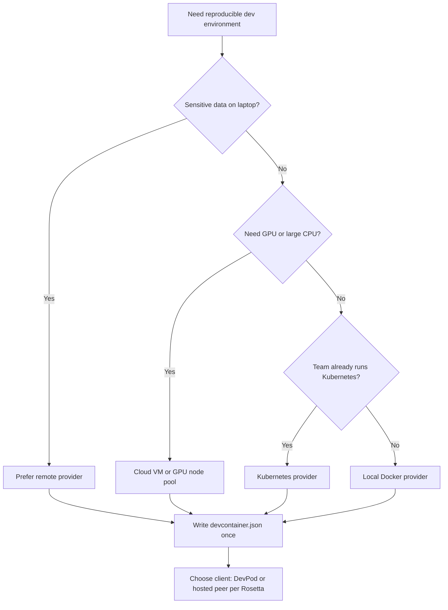

> **Toolkit Track** | Complexity: `[MEDIUM]` | Time: 40-45 minutes

## Prerequisites

Before starting this module, you should have completed [Module 8.3: Local Kubernetes](../module-8.3-local-kubernetes/). You should also be comfortable with container fundamentals (building and running images with Docker or a compatible runtime), basic Git workflows, and enough SSH familiarity to accept host keys and connect to a remote shell when an IDE asks you to.

---

## What You'll Be Able to Do

After completing this module, you will be able to:

- **Deploy DevPod workspaces from a repository or local path using provider-agnostic workspace management**
- **Configure devcontainer.json with images, features, ports, and IDE customizations that encode team standards**
- **Implement DevPod providers on local Docker and Kubernetes to match locality and infrastructure requirements**
- **Compare DevPod against GitHub Codespaces, Gitpod, and Coder using a capability Rosetta instead of product rankings**

---

## Why This Module Matters

**Hypothetical scenario:** A platform team supports forty application developers who each maintain a slightly different laptop stack. Onboarding still takes roughly two working days before a new hire can run the main service locally, and the internal support channel receives dozens of environment-related messages every week. Security policy then requires that regulated test data never rests on laptops, which pushes leadership toward remote development, but the team also wants to avoid locking every workflow to a single vendor control plane. The durable question is not which branded product wins a popularity contest; it is how to describe a development environment once, reproduce it reliably, and run it where policy and cost allow.

That question has a durable answer that outlives any single tool release cycle. The Development Containers specification, published at [containers.dev](https://containers.dev/) and maintained in the open [devcontainers/spec](https://github.com/devcontainers/spec) repository, defines a portable contract for describing a dev environment in `devcontainer.json`. Editors, hosted platforms, and client tools all consume the same fields: base image or build definition, feature packs, forwarded ports, lifecycle commands, and IDE customizations. When the contract lives in the repository beside the code, onboarding stops being a scavenger hunt through wiki pages and private dotfiles, because the environment becomes a versioned artifact reviewed like any other change.

DevPod, maintained by Loft Labs in the open-source [loft-sh/devpod](https://github.com/loft-sh/devpod) project, is one client implementation of that contract. Its architectural bet is deliberately simple: a local CLI or desktop application reads `devcontainer.json`, asks a pluggable **provider** to allocate compute (on your laptop, in a Kubernetes namespace, or on a cloud virtual machine), starts the containerized environment, and exposes it to your editor over SSH. There is no mandatory central DevPod server in the architecture described in the [What is DevPod?](https://devpod.sh/docs/what-is-devpod) documentation, which makes it a useful worked example for teams that want Codespaces-like ergonomics without surrendering provider choice. The sections below teach the durable spine first—declarative environments, provider locality, lifecycle operations, and operational guardrails—and use DevPod commands only where they make those ideas concrete.

> **The devcontainer.json Analogy**
>
> Think of `devcontainer.json` as a **recipe card** pinned inside the repository kitchen. The recipe does not care whether you cook on a home stove (local Docker), in a shared commissary kitchen (Kubernetes), or in a rented commercial kitchen (cloud VM). DevPod is the courier that reads the recipe, books the kitchen you chose, preps the ingredients, and hands your IDE a door key through SSH.

---

## The Onboarding Problem and Environment Drift

Every team that has shipped software for more than a few quarters has felt the same friction under different names: "works on my machine," "you need the other Node version," or "that integration test failure will not reproduce on my laptop." The underlying failure mode is **environment drift**, which is the slow divergence between what developers run locally, what continuous integration runs in pipelines, and what production actually executes. Drift is rarely malicious; it accumulates because laptops are personal, operating system upgrades land on different schedules, and helpful shortcuts become tribal knowledge that never reaches the next hire.

Drift creates two costs that platform engineers should treat as first-class metrics. The first cost is **calendar time**: a senior engineer donates hours to pairing on PATH variables, package managers, and local service topology instead of reviewing design or unblocking product work. The second cost is **incident risk**: a bug that disappears in CI but reproduces on a laptop—or the reverse—signals that your quality gates are measuring a different system than the one developers trust. Neither cost appears on a cloud invoice, which is why organizations rediscover the pain every hiring wave.

The durable goal is an environment that is **declarative**, **reproducible**, and **disposable**. Declarative means the desired state is written down, not improvised in chat. Reproducible means two developers checking out the same commit receive the same toolchain, services, and editor guidance. Disposable means you can throw away a broken environment and recreate it from the contract without treating the laptop as a precious snowflake. Containers are the usual implementation layer because they package userspace dependencies cleanly, but the container is not the standard—the `devcontainer.json` file is.

Platform teams sometimes try to solve drift with golden laptop images or configuration management tools aimed at bare metal. Those approaches can work for homogeneous fleets, yet they fight the reality that application repositories need different language stacks, different supporting services, and different resource footprints. A payments service and a batch analytics job should not share one static image just because they share an employer. Repository-scoped dev environments let each codebase carry the dependencies it actually needs while still presenting a uniform *workflow* to developers: clone, open workspace, run tests.

Teaching developers to treat the environment as cattle rather than pets also changes how teams respond to corruption. When a local database volume picks up bad migration state or a global npm cache serves stale artifacts, the recovery path should be "recreate the workspace" rather than a multi-hour archaeology session. That mindset shift is more important than any particular CLI flag, because it aligns daily practice with how cloud-native platforms already treat compute elsewhere in the stack.

Executive stakeholders sometimes ask for a return-on-investment narrative before funding remote development. Honest answers tie metrics to behaviors you can measure: median time from hire to first merged pull request, count of environment-tagged support tickets, and number of production incidents traced to configuration drift. DevPod itself is not a metric; it is an implementation option for reducing those counters while keeping the environment definition in Git next to the application. When you present numbers, label illustrative projections as hypothetical unless they come from your own telemetry.

---

## The Dev Container Standard as Durable Anchor

Before evaluating DevPod, GitHub Codespaces, Gitpod, Coder, or the [devcontainer CLI](https://github.com/devcontainers/cli), learn the shared anchor they implement. The Development Containers specification defines how tools should interpret a project-level configuration file, conventionally located at `.devcontainer/devcontainer.json`. Microsoft originated much of the ecosystem through VS Code Dev Containers, but the specification now lives under open governance; the [containers.dev](https://containers.dev/) site is the learner-facing entry point, while the schema and reference live beside the spec repository.

A minimal configuration can be image-driven, pointing at a maintained base such as `mcr.microsoft.com/devcontainers/javascript-node:20`, or build-driven, referencing a `Dockerfile` with build arguments for language versions. The **features** mechanism installs orthogonal tool packs—Docker-in-Docker, kubectl, cloud CLIs—without copying install scripts into every repository. Features are distributed as OCI artifacts and documented on [containers.dev/features](https://containers.dev/features); they behave like reusable apt layers for platform teams that want consistent tooling without maintaining one monolithic image.

Lifecycle hooks translate the static file into a running environment. `postCreateCommand` runs once after the container is created—ideal for dependency installation or database migrations. `postStartCommand` runs on every start—useful for launching local dependencies through Compose. `forwardPorts` and `portsAttributes` describe which processes should be reachable from the developer machine and how IDEs should label them. `customizations` carry editor-specific extension lists and settings so that opening the workspace feels intentional rather than bare.

The `hostRequirements` block expresses CPU, memory, storage, and optional GPU needs in a provider-neutral way. Providers that cannot satisfy the request should fail early with a clear message instead of silently running a starving environment that corrupts developer trust. Mounts deserve equal attention: binding the Docker socket enables Docker-in-Docker patterns for integration tests, while named volumes preserve language package caches across workspace recreation.

Reading a unfamiliar `devcontainer.json` is a skill platform engineers should coach explicitly. Start from the image or build section to learn the base operating system and runtime, scan features for cluster tooling, inspect lifecycle commands for hidden setup assumptions, and only then look at editor customizations. When you can narrate that file to a new hire in five minutes, you have achieved the documentation goal the standard enables.

Composition patterns help large organizations without forcing one mega-image. A platform team can publish an internal base feature bundle—cloud CLIs, certificate trust, corporate proxy settings—while application repositories declare only the language runtime and service-specific tools on top. That layering mirrors how production containers separate base OS from application JARs. When security revokes a deprecated CLI version, they update the shared feature pin once rather than opening fifty pull requests across microservices.

Schema validation in continuous integration catches mistakes before humans spend twenty minutes watching a workspace build fail. The devcontainer CLI can pack, build, and test configurations locally and in pipelines; wiring `devcontainer build` into pull request checks ensures broken JSON never merges. The check is especially valuable for subtle errors such as invalid mount syntax, incompatible feature versions, or `postCreateCommand` scripts that reference files not yet copied into the build context.

---

## DevPod Architecture and the Provider Model

DevPod's control plane is the developer workstation running the CLI or desktop application documented in the [installation guide](https://devpod.sh/docs/getting-started/install). That client performs orchestration steps described in [How it works](https://devpod.sh/docs/how-it-works/overview): discover or generate a dev container configuration, invoke the selected provider to allocate infrastructure, build or pull images, start the dev container, and configure SSH access so editors can attach remotely. Workspaces are named entities you can list, stop, rebuild, or delete; the [workspace concepts page](https://devpod.sh/docs/developing-in-workspaces/what-are-workspaces) explains how state is preserved across stops versus rebuilds.

Providers are the plug-in boundary that makes locality a conscious choice. The [providers overview](https://devpod.sh/docs/managing-providers/what-are-providers) describes providers as adapters to Docker, Kubernetes, hyperscaler virtual machines, or generic SSH hosts. Adding a provider is a one-time configuration step per machine; creating a workspace then reuses that provider until you override it per command. This separation mirrors how kubectl uses contexts: the user intent ("work on this repository") stays stable while the backing cluster changes.

```
DEVPOD CONTROL FLOW (conceptual)
─────────────────────────────────────────────────────────────────

 Developer laptop                Provider surface              Dev container
 ┌──────────────────┐           ┌─────────────────┐         ┌───────────────┐
 │ DevPod CLI / UI  │  allocate │ Docker / K8s / VM │  start  │ Toolchain +   │
 │ reads            │ ────────► │ creates machine │ ──────► │ repo checkout │
 │ devcontainer.json│           │ or pod          │         │ SSH endpoint  │
 └────────┬─────────┘           └─────────────────┘         └───────┬───────┘
          │                                                            │
          └──────────────────── SSH / IDE attach ◄─────────────────────┘
```

Because DevPod reuses the dev container specification, the same repository can open in VS Code Dev Containers on one machine, in DevPod on another, and in a hosted platform elsewhere without rewriting the environment contract. That portability is the main reason platform curricula anchor on the spec first and only secondarily on a client such as DevPod.

Machines, in DevPod vocabulary, are the compute endpoints providers manage—whether a Docker host, a Kubernetes cluster, or a cloud account. The [machines documentation](https://devpod.sh/docs/managing-machines/what-are-machines) separates the idea of *where providers run* from *how workspaces are named and stored*, which helps platform engineers reason about capacity planning. You might register one Kubernetes machine backing many developers while each developer still owns distinct workspace names derived from repositories. Understanding that split prevents conflating "add a provider" with "create a workspace," two steps newcomers often collapse into one confused command sequence.

---

## Locality, Cost, and Control Tradeoffs

The durable axis that survives product marketing is **where compute runs** versus **who operates the control plane**. A local Docker provider keeps data paths short and avoids cloud spend, which is excellent for airplane-mode development, quick config iteration, and learning exercises. It still consumes laptop CPU and RAM, which means running three heavyweight services locally can make fans spin during video calls. Kubernetes providers shift compute into a cluster you already operate, which helps security teams keep sensitive repositories and credentials off laptops while still giving developers powerful machines. Cloud VM providers trade operational toil for elasticity: you can request larger instance types for builds, attach GPUs for short experiments, and stop paying when the workspace stops.

Each placement choice carries policy implications that prose should not gloss over. Regulated data, license keys, and production-adjacent credentials belong in an environment whose network path and disk encryption you can explain to auditors. A local provider keeps code on the laptop disk unless you mount remote volumes; a remote provider centralizes secrets injection but requires SSH and image pull paths to be locked down. Neither option is universally safer; the correct answer follows from your data classification and network boundaries.

Cost is also multi-dimensional. Hosted development environments bill for compute minutes, storage, and egress. Self-managed DevPod shifts spend to the infrastructure you already run—cluster node capacity, VM hours, image registry storage—while avoiding per-seat SaaS markup. The total cost story must include engineer time to maintain providers, base images, and caching registries. A small team may prefer local Docker until onboarding pain or compliance triggers remote providers; a large team may standardize on Kubernetes providers with quotas and idle shutdown hooks.

Scale-to-zero behavior matters for budgets and security. Workspaces that keep running after the developer closes their laptop continue to consume CPU and memory somewhere. Teaching developers to `stop` workspaces when finishing a task is as important as teaching them to `git push`. Platform automation can enforce idle timeouts, but the durable practice is to treat remote workspaces like cloud instances: create quickly, use intentionally, stop explicitly.

Compliance conversations often start with data residency and end with screenshot policies. Remote development does not automatically solve either concern; it relocates them. A Kubernetes provider in the wrong region still violates residency, and an IDE that caches repository contents on a laptop reintroduces data paths security thought they eliminated. The productive framing is to list which assets must never leave controlled infrastructure—source code, customer fixtures, production credentials—and then trace each asset through clone, build, test, and debug steps for every provider under consideration. DevPod's value is making that trace repeatable because the same `devcontainer.json` runs in each place.

---

## Workspace Lifecycle from First Open to Rebuild

Creating a workspace is the moment the declarative contract meets reality. With DevPod installed, `devpod provider add docker` registers a local provider if you have not configured one yet. Running `devpod up github.com/org/service --ide vscode` clones the repository (for public Git URLs), builds or pulls the image described in `devcontainer.json`, executes lifecycle hooks, and opens VS Code against the SSH endpoint `WORKSPACE_NAME.devpod` as documented in [Create a workspace](https://devpod.sh/docs/developing-in-workspaces/create-a-workspace). Private repositories work when Git credentials on the workstation can be forwarded according to DevPod's documented Git integration behavior.

Local paths follow the same lifecycle with a different source: `devpod up . --ide vscode` uploads or syncs the working tree to the provider before building. This path is valuable when iterating on the dev container itself because you can edit `.devcontainer/devcontainer.json` locally, run `devpod up PROJECT --recreate`, and observe rebuild behavior without pushing commits.

Day-two operations separate **stop**, **recreate**, and **reset**. Stopping preserves the remote disk state while releasing active compute; starting again with `devpod up WORKSPACE` should feel like closing and reopening a laptop lid. Recreate applies changes to `devcontainer.json` or its Dockerfile by rebuilding the environment while preserving project paths and mounted volumes as described in DevPod's recreate documentation. Reset goes further, discarding local changes inside the workspace and re-syncing from Git or the local folder—useful when a poisoned cache or half-finished experiment needs a truly clean slate.

Deletion is the hygiene step teams forget until disks fill. `devpod delete WORKSPACE` removes the provider-side resources DevPod created. Platform runbooks should say when developers must delete versus stop, especially on shared Kubernetes clusters where orphaned persistent volume claims accumulate quietly.

Branch and pull-request workflows extend the same lifecycle to code review. DevPod accepts Git references appended to repository URLs—branches, commits, and for GitHub pull requests the `@pull/N/head` suffix documented in the create-workspace guide—so reviewers can spin up the proposed change set without manual checkout gymnastics. That pattern reduces the temptation to approve changes that were only tested on the author's laptop, because the reviewer workspace is constructed from the same `devcontainer.json` on the reviewed commit. The habit pairs naturally with repositories that already treat CI as mandatory: if tests run in a container on the server, reviewers should expect to reproduce them in a container locally or remotely.

Listing and debugging remain CLI skills even when developers prefer the desktop UI. `devpod list` shows active and stopped workspaces; `devpod ssh WORKSPACE` drops you into the container when an IDE connection misbehaves. Those commands are the equivalent of `kubectl get pods` for your personal factory floor.

---

## Authoring devcontainer.json for Team Standards

Platform engineering quality shows up in how gently a repository welcomes a stranger. A good `devcontainer.json` reads like onboarding documentation that machines can execute: it names the workspace, pins a maintained base image or documents a Dockerfile build, installs tools through features instead of curl pipes, forwards the ports the README already mentions, and runs setup commands that succeed on a clean checkout.

The basic Node example below is intentionally small so you can see every important field without scrolling through indirection. It uses a Microsoft-maintained JavaScript image, enables Docker-in-Docker for integration tests that need a daemon, installs common editor extensions, forwards port 3000, and runs `npm install` after creation.

```json
{
  "name": "Node.js Development",
  "image": "mcr.microsoft.com/devcontainers/javascript-node:20",
  "features": {
    "ghcr.io/devcontainers/features/docker-in-docker:2": {}
  },
  "customizations": {
    "vscode": {
      "extensions": [
        "dbaeumer.vscode-eslint",
        "esbenp.prettier-vscode"
      ],
      "settings": {
        "editor.formatOnSave": true
      }
    }
  },
  "forwardPorts": [3000],
  "postCreateCommand": "npm install",
  "remoteUser": "node"
}
```

Teams that need multiple language stacks or infrastructure tools should still resist copying a hundred-line Dockerfile on day one. Features exist precisely so shared platform teams can publish blessed combinations—kubectl, Helm, cloud CLIs—without every application repository forking install scripts. When you truly need bespoke OS packages, a Dockerfile with documented build arguments remains appropriate, but keep the Dockerfile focused on what features cannot express.

Dotfiles integration is another team-standard lever DevPod supports through documented configuration options for personalizing shells and Git identity after the workspace exists. The durable guidance is to separate **team invariants**—languages, services, linters—from **individual preferences**—prompt themes, alias files—so repositories do not become battlegrounds over editor themes. Platform baselines belong in `devcontainer.json`; personal touches belong in optional dotfile repos developers attach after the workspace is healthy.

Mounts encode performance and credential strategy. Binding `~/.aws` or `~/.kube` can accelerate credential reuse in lab settings, yet production-oriented platforms often prefer workload identity, OIDC, or short-lived tokens injected at runtime instead of long-lived files on shared nodes. Document the threat model beside the mount, not just the syntax.

`hostRequirements` should reflect realistic loads. Under-provisioning produces flappy language servers; over-provisioning wastes cluster quota. Start from measured usage on a representative service—CPU during test runs, memory during indexing—and adjust after watching a week of real workspaces.

---

## IDE Integration Through SSH

DevPod does not try to replace your editor; it exposes a remote environment editors already know how to reach. VS Code and VS Code-compatible editors attach through Remote-SSH using the host entry DevPod configures. JetBrains IDEs use Gateway with similar semantics. Browser-based flows such as OpenVSCode server remain valuable on locked-down corporate laptops that cannot install local IDEs, at the cost of another moving part to secure.

The integration lesson for platform teams is to standardize on **one remote connection pattern** in documentation. Developers should not learn three different networking stories for three repositories. When every internal repo says "run `devpod up . --ide vscode`," support teams can reuse the same troubleshooting tree: verify provider health, verify SSH config, verify port forwards, verify lifecycle commands.

Editor customizations in `devcontainer.json` reduce bikeshedding during code review. When ESLint, Go, or Terraform extensions are declared in the repository, reviewers see the same diagnostics the author saw. That alignment is pedagogy for quality gates: the environment is part of the definition of done.

Multi-repository products—mobile clients beside APIs beside infrastructure repos—can still present one workspace experience by scripting clones in `postCreateCommand` or by documenting a meta-repository that pins submodule versions. The anti-pattern is hiding clone logic only in a personal shell alias; if a new hire cannot derive the tree from committed files, onboarding debt returns. DevPod does not remove the need for thoughtful repository topology, but it gives you a single front door once that topology is decided.

---

## Operational Concerns: Caching, Secrets, Idle Spend, and Prebuilds

Image build time is the silent tax on remote development. Every `devpod up` that compiles dependencies from scratch teaches developers to avoid recreating workspaces—even when recreation would fix corruption. Platform teams should publish base images to an internal registry, use feature packs instead of ad hoc apt lines, and enable layer caching on builders wherever providers allow it. The goal is that a routine git pull triggers seconds of work, not a coffee break.

Secrets belong in the provider's identity systems, not in committed `.env` files. For Kubernetes providers, workload identity or mounted secret stores beat copying personal cloud keys into shared pods. For local providers, educate developers that bind-mounting `~/.ssh` carries different risk than using an ephemeral deploy key scoped to one repository. The dev container spec's `remoteEnv` and `containerEnv` fields set non-secret defaults; treat secret injection as a platform integration exercise.

Idle cost control is a joint responsibility. Developers should stop workspaces; platform teams should publish recommended stop hooks and monitor orphaned resources. On Kubernetes, namespaces with quotas and label selectors make audits possible: every DevPod workspace should be identifiable as such in `kubectl get pods` output for chargeback conversations.

Prebuilds are the hosted-platform technique for moving `postCreateCommand` work earlier in time. DevPod supports pointing at a prebuild repository in workspace creation flows documented on the create-workspace page; hosted peers implement similar ideas under different names. The durable pattern is unchanged: compute expensive setup once, store an image artifact, and let developers start from warm layers. Without prebuild discipline, cloud development feels slower than local laptops, and adoption stalls regardless of policy mandates.

Network paths deserve the same rigor as image builds. Remote providers imply SSH connectivity, registry pulls, and sometimes Git server access from inside the cluster or VM. Firewalls that block those paths produce vague "workspace failed to start" errors that waste afternoons. Platform teams should document the exact egress destinations—container registries, package mirrors, Git hosts, identity providers—and verify them from a test workspace before announcing general availability. Developers should not be the first people to discover that a corporate proxy strips WebSocket traffic required by an in-browser IDE.

Observability for dev environments is often neglected because they are not production services, yet they compete for the same clusters. Collect provider-side events: image pull latency, pod scheduling failures, OOM kills, and workspace start duration from `devpod up` to ready SSH. When median start time doubles after a base image bump, that regression is as real as a production deployment slowdown even if no customer-facing metric moves. Simple dashboards grouped by repository and provider prevent platform teams from flying blind.

---

## Rolling Out Dev Environments Without Surprise

Adoption fails when platform teams treat DevPod as a silent drop-in replacement for informal laptop setup. A rollout that succeeds in platform engineering slides but fails in hallway conversations usually skipped three human steps: explain the why, pilot with volunteers, and publish escape hatches. The why is drift reduction and faster onboarding, not "install this CLI because policy says so." Volunteers from application teams should represent both greenfield services and legacy monoliths so you learn where `devcontainer.json` needs extra memory or unusual mounts before mandating usage.

Start with a **golden path repository** that demonstrates the intended standard: features instead of curl scripts, explicit ports, automated tests in `postCreateCommand`, and README instructions that fit on one screen. Ask pilot developers to time first-time workspace creation and compare it to their previous setup ritual. Those measurements become the internal marketing that convinces skeptical staff engineers more effectively than architecture diagrams alone.

Escape hatches matter for credibility. Some workflows—mobile simulators, hardware dongles, or desktop GUI tools—may never fit a remote container gracefully. Document when local Docker remains appropriate and how to opt out without shame. Platform standards earn trust when they acknowledge edge cases instead of pretending one recipe fits every repository in a thousand-service estate.

Change management for `devcontainer.json` should mirror application code review. Platform teams can publish lint guidance or schema checks in CI, but application owners remain responsible for keeping lifecycle commands honest. A `postCreateCommand` that silently mutates global cluster state is a footgun regardless of which client launches it. Code review questions should include "what runs as root," "what secrets touch disk," and "what happens if this command fails halfway."

Training editors and support staff is as important as training developers. Internal support macros should list the same five troubleshooting commands—`devpod list`, `devpod up --recreate`, `devpod ssh`, `kubectl get pods -n devpod`, and checking registry pull errors—so first responders do not improvise. When support and platform use identical vocabulary, incidents stop bouncing between teams who each assume the other owns SSH host keys.

---

## Troubleshooting Workspaces Methodically

When a workspace fails to start, resist the urge to delete everything immediately. The failure class usually falls into one of four buckets: provider misconfiguration, image build errors, lifecycle command failures, or IDE connection issues after the container is healthy. Provider misconfiguration shows up early as Kubernetes RBAC denials, missing namespaces, or Docker socket permission errors on Linux workstations. Collect the DevPod logs from the CLI invocation before retrying, because the next attempt may garbage-collect useful stderr.

Image build errors often trace back to Dockerfile assumptions that made sense on a developer laptop but not in CI-like builds. Pin base images with digests when reproducibility matters, and avoid `apt-get update` without version pins in layers that rebuild constantly. Feature packs reduce this pain because maintainers test common combinations, but custom Dockerfile lines reintroduce fragility the moment someone needs an obscure system library.

Lifecycle command failures happen after the image exists. A `postCreateCommand` that assumes a database is already listening will race on cold starts unless `postStartCommand` or a wait loop handles ordering. Teach repository owners to make setup scripts idempotent: running `npm install` twice should be safe, and database migrations should tolerate partially applied states or document how to reset.

IDE connection issues frustrate users because the container may already be running. Verify SSH config entries DevPod writes, ensure no local VPN hijacks routes to the cluster network, and confirm port forwards for web previews are not blocked by corporate proxies. Browser-based IDEs add TLS and WebSocket constraints that terminal-only debugging bypasses; when VS Code desktop fails, `devpod ssh` isolates whether the problem is SSH itself or editor-specific integration.

Document a **clean reset path** in runbooks: stop the workspace, delete it, remove orphaned PVCs if the provider created them, then `devpod up` from a fresh clone. Knowing the reset path reduces fear of experimentation, which in turn increases the rate at which developers actually adopt standardized environments instead of clinging to bespoke laptops.

Finally, capture **lessons learned** after each incident. If three developers hit the same registry throttling error, the fix belongs in platform documentation and possibly in a shared mirror—not in a fourth private Slack thread. Dev environments generate the same organizational memory pressure as production outages; the teams that improve fastest treat workspace failures as signals about missing automation, not as evidence that developers should return to manual setup.

---

## Landscape Snapshot and Dev Environment Rosetta

> **Landscape snapshot — as of 2026-06. This changes fast; verify against vendor docs before relying on specifics.** DevPod is an Apache-2.0 licensed client maintained by Loft Labs with documentation at [devpod.sh/docs](https://devpod.sh/docs). The Development Containers specification is hosted at [containers.dev](https://containers.dev/) with schemas in [github.com/devcontainers/spec](https://github.com/devcontainers/spec). GitHub Codespaces is a GitHub-hosted product documented at [docs.github.com/codespaces](https://docs.github.com/en/codespaces). Gitpod documents its SaaS and self-managed offerings at [gitpod.io/docs](https://www.gitpod.io/docs). Coder documents its self-hosted development workspaces at [coder.com/docs](https://coder.com/docs). Pricing models, default machine sizes, and feature flags change frequently; compare live docs before financial planning.

| Durable capability | DevPod | GitHub Codespaces | Gitpod | Coder | devcontainer CLI |
|--------------------|--------|-------------------|--------|-------|------------------|
| Implements devcontainer.json | Yes | Yes | Yes | Yes | Yes (reference CLI) |
| Open-source client/server core | Client OSS | Hosted service | Mixed OSS/commercial | OSS server | OSS CLI |
| Self-host on your infra | Via providers you operate | Enterprise offering varies; verify current GitHub docs | Self-managed options documented | Primary deployment model | Local automation only |
| Provider-agnostic compute | Docker, Kubernetes, cloud VMs, SSH | GitHub-managed Azure VMs | Documented cloud and self-hosted paths | Kubernetes-focused | Local machine |
| Kubernetes as workspace backend | Native provider | Not applicable in default SaaS | Depends on deployment model | Common pattern | Not applicable |
| Prebuild / warm image flows | Prebuild repository option | Codespaces prebuilds | Gitpod prebuilds | Template snapshots | Build-only |
| Scale-to-zero / stop idle workspaces | `devpod stop` + provider behavior | Codespace stop window policies | Workspace autostop settings | Autostop templates | N/A |

Use the Rosetta as a decision aid, not a scoreboard. A team deeply invested in GitHub Enterprise may still choose Codespaces for native pull request integration while standardizing `devcontainer.json` so experiments with DevPod remain possible. A team with existing Kubernetes operations may prefer DevPod or Coder depending on how much control-plane UI they want. The specification alignment is the spine; the product choice is the skin.

When leadership asks for a single vendor answer, translate the question into capabilities instead. Do you need GitHub-native preview environments? Is self-hosting on existing Kubernetes mandatory? Must GPU workstations be billed hourly rather than amortized hardware? Are prebuilds non-negotiable for monorepo clone times? Answering those axes first narrows the column set in the Rosetta without pretending one product won a horse race. Platform engineers who frame evaluations this way keep curriculum and internal standards valid even when marketing sites rename SKUs or merge consoles.

---

## Worked Example: Same Repository on Docker and Kubernetes

This worked example assumes DevPod CLI is installed per the [installation guide](https://devpod.sh/docs/getting-started/install) and that you have either Docker Desktop or a working Docker engine locally. Create a lab directory with a minimal service and dev container file so you can observe provider differences without a large monorepo.

```bash
mkdir devpod-lab && cd devpod-lab
git init

cat > package.json << 'EOF'
{
  "name": "devpod-lab",
  "version": "1.0.0",
  "scripts": {
    "dev": "node server.js",
    "test": "node -e \"console.log('ok')\""
  },
  "dependencies": {
    "express": "^4.21.0"
  }
}
EOF

cat > server.js << 'EOF'
const express = require("express");
const app = express();
app.get("/", (_req, res) => res.json({ message: "Hello from DevPod" }));
app.listen(3000, () => console.log("listening on 3000"));
EOF

mkdir -p .devcontainer
cat > .devcontainer/devcontainer.json << 'EOF'
{
  "name": "DevPod Lab",
  "image": "mcr.microsoft.com/devcontainers/javascript-node:20",
  "forwardPorts": [3000],
  "postCreateCommand": "npm install",
  "remoteUser": "node"
}
EOF

git add .
git commit -m "Add devcontainer lab"
```

Start locally first:

```bash
devpod provider add docker
devpod up . --ide vscode
curl http://localhost:3000
devpod stop devpod-lab
```

When you have a development cluster available, register the Kubernetes provider with a dedicated namespace and service account limited to pod and PVC management in that namespace. Apply least-privilege RBAC rather than cluster-admin shortcuts that look convenient in labs but fail security review in production.

```bash
kubectl create namespace devpod-lab
devpod provider add kubernetes
devpod provider set-options kubernetes \
  --option KUBERNETES_NAMESPACE=devpod-lab

devpod up . --provider kubernetes --ide vscode
kubectl get pods -n devpod-lab
curl http://localhost:3000
```

The repository did not change between runs—only the provider did. That is the portability promise of anchoring on `devcontainer.json`. Teardown should be explicit: `devpod delete devpod-lab` plus `kubectl delete namespace devpod-lab` when you finish, so shared clusters do not accumulate orphaned volumes.

After you succeed with the lab, capture what differed subjectively between providers. Local Docker usually minimizes latency for file watchers and port forwarding, while Kubernetes shifts CPU fans quiet on the laptop at the cost of depending on cluster health and network paths. Neither observation is a universal verdict; they are inputs to the decision framework later in this module. Teams that document those tradeoffs beside internal runbooks help the next squad choose providers without repeating the experiment.

---

## Patterns & Anti-Patterns

### Patterns

| Pattern | Why it works | When to use it |
|---------|--------------|----------------|
| **Spec-first onboarding** | New hires follow one file in the repo | Every application team repository |
| **Feature packs over curl** | Shared tooling updates roll out centrally | Standardizing kubectl, cloud CLIs, linters |
| **Stop workspaces daily** | Remote compute stops billing | Kubernetes and cloud VM providers |
| **Recreate after devcontainer changes** | Image drift resets cleanly | After editing `.devcontainer` |
| **Documented host requirements** | Providers fail fast instead of hanging | Memory-heavy Java or ML services |

### Anti-Patterns

| Anti-Pattern | Why it hurts | Better approach |
|--------------|--------------|-----------------|
| **Wiki-only setup steps** | Drift returns immediately | Encode setup in `devcontainer.json` |
| **Mega Dockerfile fork** | Slow builds, stale security patches | Features + slim custom layers |
| **Shared long-lived workspaces** | Hidden state causes "ghost" bugs | Recreate or reset on schedule |
| **Mounting personal cloud keys** | Credential leakage on shared nodes | Short-lived identity per workspace |
| **Ignoring port forwards** | Services "run" but appear broken | Declare ports explicitly |

### Decision Framework



---

## Did You Know?

- **The Development Containers specification is the shared contract** — Tools consume the same `devcontainer.json` schema published at [containers.dev](https://containers.dev/), which means repository environments survive client churn better than wiki instructions.

- **DevPod deliberately avoids a mandatory control-plane server** — The [architecture overview](https://devpod.sh/docs/how-it-works/overview) describes a workstation client that talks to providers directly, which appeals to teams that want open-source clients without operating another SaaS.

- **Features are OCI-packaged install units** — The [features index](https://containers.dev/features) documents reusable tool bundles maintained separately from your application Dockerfile, which is how platform teams ship kubectl or Terraform versions without forking every repo.

- **Workspace recreate versus reset differs in what survives** — DevPod's [create workspace documentation](https://devpod.sh/docs/developing-in-workspaces/create-a-workspace) distinguishes rebuilding the dev container from re-syncing source trees, mirroring how platform engineers separate image updates from data wipes.

---

## Common Mistakes

| Mistake | Problem | Solution |
|---------|---------|----------|
| No `devcontainer.json` in repo | Every developer improvises tooling | Add and review `.devcontainer/devcontainer.json` |
| Giant bespoke Dockerfile | Slow rebuilds, stale packages | Prefer features and maintained base images |
| Missing `forwardPorts` | Services run but browsers cannot connect | Declare ports and labels explicitly |
| Skipping `postCreateCommand` | README steps never run automatically | Automate install and migration commands |
| Docker provider only on large team | Laptops overheat; environments still diverge on OS | Add Kubernetes or remote providers for standardization |
| No `hostRequirements` | Workspace starts undersized and flaky | Measure CPU/RAM needs; encode them |
| Never stopping remote workspaces | Idle cost and orphaned resources | Teach `devpod stop` as part of daily workflow |
| Bind-mounting personal secrets | Shared nodes inherit long-lived credentials | Use scoped identities and secret stores |

---

## Quiz

### Question 1
Your organization wants the same development environment on laptops and in a shared Kubernetes cluster without maintaining two setup guides. Which artifact should be canonical?

<details>
<summary>Answer</summary>

Standardize on `.devcontainer/devcontainer.json` checked into each repository. The Development Containers specification describes the portable fields—image or build, features, lifecycle commands, forwarded ports, and editor customizations—that DevPod, VS Code, and hosted platforms all consume. DevPod then becomes one client that provisions the same contract on different providers, which satisfies provider-agnostic workspace management without duplicating documentation.
</details>

### Question 2
A developer edits `.devcontainer/Dockerfile` to add a system package, pushes the change, and still sees the old environment after `devpod up`. What should they run instead?

<details>
<summary>Answer</summary>

They should recreate the workspace so DevPod rebuilds the image and reapplies lifecycle hooks—`devpod up WORKSPACE --recreate` per the workspace documentation. A plain `devpod up` after stop preserves the existing container filesystem, which is correct for daily restarts but wrong after Dockerfile changes. If they also need a fresh Git sync, `reset` is the stronger operation because it discards more local state.
</details>

### Question 3
Security asks that regulated test data never resides on laptops, but engineers still want VS Code ergonomics. How does DevPod help without mandating a specific Git host?

<details>
<summary>Answer</summary>

Configure a remote provider—Kubernetes or a cloud VM—so compute and persistent workspace disks live in infrastructure security already trusts. DevPod still exposes the environment to VS Code through SSH, which preserves the editing experience while moving execution off the laptop. The same `devcontainer.json` can be used locally for non-sensitive experiments and remotely for regulated work, making locality a provider choice rather than a separate setup guide.
</details>

### Question 4
Compare DevPod and GitHub Codespaces using capability language, not slogans. When might a team keep both options available?

<details>
<summary>Answer</summary>

Both implement `devcontainer.json`, but Codespaces is a GitHub-managed hosted product with tight repository integration, while DevPod is an open-source client that schedules workspaces on providers you configure. A team standardized on GitHub might use Codespaces for default flows while retaining DevPod for GitLab mirrors, air-gapped clusters, or custom Kubernetes quotas. The Rosetta table in this module lists the tradeoffs without declaring either tool universally superior.
</details>

### Question 5
Your Node service needs Docker during integration tests. Which devcontainer.json mechanism avoids copying custom install scripts into every repository?

<details>
<summary>Answer</summary>

Use the Docker-in-Docker feature from the devcontainers feature catalog, for example `ghcr.io/devcontainers/features/docker-in-docker:2`, declared under `features`. Features package maintained install logic as OCI artifacts, which platform teams can bless once and reuse across repositories. Combine the feature with `postCreateCommand` or Compose in `postStartCommand` to launch dependent services after the daemon is available.
</details>

### Question 6
A platform engineer notices orphaned persistent volumes in the `devpod` namespace weeks after engineers switched projects. What operational practice prevents recurrence?

<details>
<summary>Answer</summary>

Pair explicit `devpod delete` runbooks with namespace quotas and labels so every workspace is attributable to a user or team. Educate developers that `stop` preserves disks while `delete` should run when a project ends. Regular audits using Kubernetes object labels—and chargeback reports if available—turn idle environments into visible costs instead of silent storage drift.
</details>

### Question 7
When would you choose `hostRequirements` with four CPUs and eight gigabytes of memory?

<details>
<summary>Answer</summary>

Set `hostRequirements` when you have measured that default provider sizes cause OOM kills or intolerably slow language servers—common in JVM monorepos, TypeScript projects with large graphs, or services running multiple containers via Compose. Providers that honor the field can fail fast with a clear message instead of starting a broken workspace. Revisit the numbers after major dependency upgrades because memory profiles shift over time.
</details>

### Question 8
A teammate asks whether DevPod replaces Git. What is the accurate mental model?

<details>
<summary>Answer</summary>

DevPod orchestrates dev containers; it does not replace Git hosting or code review. It clones or syncs source from Git (or a local folder), builds the environment described in `devcontainer.json`, and connects editors over SSH. Credentials for private repositories still flow from the developer's Git configuration or platform identity integrations, which is why forwarding rules and deploy keys remain part of the security story.
</details>

---

## Hands-On

Build a DevPod-ready Node service, launch it on the Docker provider, verify connectivity, and document the commands you would change for a Kubernetes provider.

```bash
mkdir devpod-handson && cd devpod-handson
git init

cat > package.json << 'EOF'
{
  "name": "devpod-handson",
  "version": "1.0.0",
  "scripts": {
    "dev": "node server.js",
    "test": "node -e \"console.log('tests pass')\""
  },
  "dependencies": {
    "express": "^4.21.0"
  }
}
EOF

cat > server.js << 'EOF'
const express = require("express");
const app = express();
app.get("/", (_req, res) => res.json({ message: "Hello from DevPod hands-on" }));
app.listen(3000, () => console.log("listening on 3000"));
EOF

mkdir -p .devcontainer
cat > .devcontainer/devcontainer.json << 'EOF'
{
  "name": "DevPod Hands-On",
  "image": "mcr.microsoft.com/devcontainers/javascript-node:20",
  "forwardPorts": [3000],
  "postCreateCommand": "npm install",
  "postStartCommand": "npm run dev",
  "remoteUser": "node"
}
EOF

git add .
git commit -m "Add DevPod hands-on lab"

devpod provider add docker
devpod up . --ide vscode
```

Success criteria:

- [ ] `.devcontainer/devcontainer.json` exists and references the Node 20 devcontainer image
- [ ] `devpod list` shows the workspace in a running or stopped state after `devpod up`
- [ ] `curl http://localhost:3000` returns JSON containing `Hello from DevPod hands-on`
- [ ] You can explain which provider flag you would add to target Kubernetes instead of Docker
- [ ] `devpod stop` and `devpod delete` complete without leaving orphaned Docker resources you did not intend to keep

---

## Sources

- [DevPod Documentation](https://devpod.sh/docs) — Product documentation for installation, workspaces, and providers.
- [What is DevPod?](https://devpod.sh/docs/what-is-devpod) — High-level architecture and goals of the client.
- [DevPod GitHub Repository](https://github.com/loft-sh/devpod) — Source code, issues, and release artifacts.
- [How DevPod Works](https://devpod.sh/docs/how-it-works/overview) — Control flow from client to provider to dev container.
- [DevPod Providers](https://devpod.sh/docs/managing-providers/what-are-providers) — Provider model and configuration concepts.
- [Create a DevPod Workspace](https://devpod.sh/docs/developing-in-workspaces/create-a-workspace) — Workspace creation, recreate, and reset flows.
- [Development Containers](https://containers.dev/) — Learner-facing entry to the open specification.
- [Development Containers Specification](https://github.com/devcontainers/spec) — Schema and reference material for `devcontainer.json`.
- [Dev Container CLI](https://github.com/devcontainers/cli) — Reference CLI for building and running dev containers locally.
- [Dev Container Features](https://containers.dev/features) — Catalog of reusable feature packs for tooling installation.
- [VS Code Dev Containers](https://code.visualstudio.com/docs/devcontainers/containers) — Editor documentation for the same specification.
- [GitHub Codespaces Documentation](https://docs.github.com/en/codespaces) — Hosted peer that consumes `devcontainer.json` on GitHub.
- [Gitpod Documentation](https://www.gitpod.io/docs) — Hosted and self-managed peer documentation for comparison.
- [Coder Documentation](https://coder.com/docs) — Self-hosted development workspace platform documentation.

---

## Next Module

Continue to [Module 8.5: Gitpod & GitHub Codespaces](../module-8.5-gitpod-codespaces/) for a deeper comparison of managed cloud development environments that also implement the Development Containers specification.
