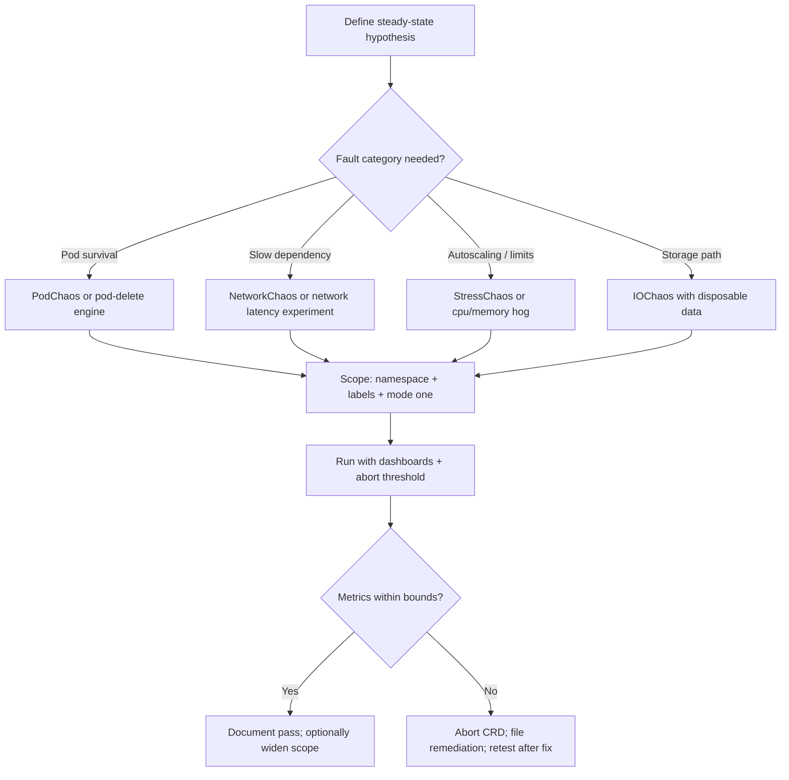

> **Toolkit Track** | Complexity: `[COMPLEX]` | Time: 50-60 minutes
>
> **Prerequisites**: Kubernetes Deployments, Services, labels, and namespaces; Helm and `kubectl`; [Module 1.1: Principles of Chaos Engineering & Resilience](/platform/disciplines/reliability-security/chaos-engineering/module-1.1-chaos-principles/) for the hypothesis-driven method; familiarity with Prometheus-style metrics is helpful but not required.

## What You'll Be Able To Do

After completing this module, you will be able to:

- **Deploy Chaos Mesh or LitmusChaos on Kubernetes with scoped RBAC, dedicated namespaces, and verified controller health before running any fault**
- **Configure chaos experiments that inject pod failures, network latency or loss, and CPU or memory stress using label selectors, duration limits, and reversible CRD lifecycles**
- **Implement steady-state hypothesis validation by pairing experiment CRDs with observability probes and explicit abort thresholds that halt injection when user-visible metrics breach bounds**
- **Integrate chaos tooling with Prometheus and Grafana so injected faults produce visible signals and auto-abort paths before an experiment becomes an incident**
- **Evaluate Kubernetes chaos engineering frameworks and design progressive chaos maturity programs that graduate from manual staging experiments to scheduled, scoped production GameDays**

## Why This Module Matters

**Hypothetical scenario:** A retail platform team ships a new checkout API behind three replicas, horizontal pod autoscaling, and a circuit breaker on the payment dependency. Staging tests pass, load tests look healthy, and Grafana dashboards stay green for two weeks. During a routine node drain, one replica moves while another pod is mid-restart, network latency to the payment service spikes to roughly 300 ms, and checkout error rates climb from near zero to about 8% for ten minutes before anyone connects the symptoms to infrastructure movement rather than application code. The team had monitoring, runbooks, and integration tests — but none of those exercises had injected the specific combination of partial capacity loss plus slow dependency behavior that production traffic eventually produced.

That gap is why chaos engineering exists as a practice, and why Kubernetes teams eventually need purpose-built chaos tooling rather than ad hoc shell scripts. The scientific method — steady state, hypothesis, bounded blast radius, abort conditions, documented learning — is taught in [Module 1.1: Principles of Chaos Engineering & Resilience](/platform/disciplines/reliability-security/chaos-engineering/module-1.1-chaos-principles/). This module covers the **tools layer**: how Chaos Mesh, LitmusChaos, and lighter-weight schedulers like kube-monkey translate fault intent into Kubernetes custom resources that operators can review, apply, pause, and delete through the same API machinery they already use for Deployments and NetworkPolicies.

The durable capability you are learning is **controlled fault injection on Kubernetes**: selecting targets safely, choosing fault categories that match real failure modes, scheduling experiments with explicit duration, and wiring observability so you can tell whether the system stayed within its steady-state bounds. Chaos Mesh and LitmusChaos are the running worked examples because both expose the Kubernetes-native CRD pattern clearly, both are listed as CNCF Incubating projects, and both support the fault categories — pod, network, stress, I/O, DNS, time — that appear repeatedly in production incidents. The goal is not to memorize YAML field names; it is to understand how any Kubernetes-native chaos tool turns a resilience question into a reversible, auditable API object.

Platform teams sometimes ask whether chaos belongs in the "developer experience" toolkit at all. The connection is indirect but real: unreliable internal platforms erode developer velocity faster than missing UI polish. When staging environments drift from production, when dependencies fail silently, or when autoscaling reacts minutes after queues back up, application teams burn time on incidents that look like application bugs but stem from resilience gaps. Chaos tooling gives platform engineers a repeatable way to **prove** that the paths developers rely on — deploy, scale, recover, observe — behave under stress. That proof reduces toil for everyone downstream.

> **The Circuit Breaker Analogy**
>
> A chaos tool is like a labeled breaker panel in a test lab. You still need a written test plan, safety goggles, and someone watching the gauges. Flipping breakers without a hypothesis and an abort switch is not engineering — it is how you learn about failure modes on your customers' schedule instead of your own.

## Fault Injection as a Durable Capability

Before comparing tools, learn the **fault taxonomy** that outlasts any vendor's CRD names. Production systems fail in recurring patterns, and mature chaos programs map each experiment to one of these categories rather than to "whatever fault the UI lists first." The categories are durable because they describe physics and platform behavior, not product marketing.

**Process and pod faults** test what happens when compute disappears or becomes unresponsive. A pod kill simulates kubelet eviction, node loss, or a failed deployment roll. A container kill targets one container inside a multi-container pod, which matters when sidecars, proxies, or log shippers must survive application restarts. These faults answer questions like "if we lose one replica, do remaining replicas accept traffic without error spikes?" and "does the platform replace the pod within the time our SLO allows?"

**Network faults** test distributed-system behavior under imperfect connectivity. Latency injection reveals timeout and retry misconfigurations that pod kills never surface, because slow partial failure is often worse than total failure. Packet loss, partition, bandwidth limits, and corruption each stress different client libraries and service meshes. DNS chaos tests name-resolution assumptions — a surprisingly common source of cascading failures when caches, search paths, or headless service records behave unexpectedly under load.

**Resource stress faults** test autoscaling, limits, and graceful degradation. CPU and memory pressure expose missing requests, missing limits, noisy-neighbor scheduling, and HPA rules that never trigger because they watch the wrong signal. These faults map to real events: a batch job lands on a shared node, a memory leak grows until the OOM killer intervenes, or a traffic spike pushes pods into CPU throttling.

**Storage and I/O faults** test persistence layers and stateful workloads. Delayed reads, failed writes, and errno injection surface backup gaps, incorrect fsync assumptions, and application code that treats storage as infinitely fast. Treat I/O chaos carefully in any environment with valuable data; start in disposable namespaces and scope to volumes you can rebuild.

**Time and kernel faults** test logic that depends on clocks, leases, certificates, or kernel behavior. Clock skew breaks token expiry, cache TTL math, and distributed lock timeouts. Kernel-level injection sits at the lowest layer and requires the strongest safety review, because the blast radius can extend beyond a single application's understanding of "failure."

**HTTP and application-protocol faults** sit above the network layer when tools support them. Delaying or aborting HTTP responses tests retry policies, idempotency keys, and user-facing timeouts without simulating the entire TCP stack incorrectly. These faults matter for services behind ingress controllers or service meshes where network-level and application-level failure modes diverge.

The tool-specific resource names — `PodChaos`, `NetworkChaos`, `ChaosEngine`, `pod-delete`, `pod-network-loss` — are just skins on this taxonomy. When you design an experiment, start from the failure mode your architecture actually fears, then pick the smallest fault in the matching category that can falsify your hypothesis. If the risk is "dependency slows down," network latency beats pod deletion every time.

Teams new to chaos often over-index on pod kill because it is visually dramatic — pods disappear, events fire, dashboards animate. That makes pod kill a good teaching fault, but a poor default for every experiment. Mature programs maintain a **fault menu** mapped to architecture concerns: stateless APIs start with pod kill and network delay; stateful systems add I/O latency on disposable volumes; batch pipelines add CPU stress and clock skew; multi-region designs add DNS failures and partition scenarios. The menu prevents reinventing fault selection for every GameDay while keeping experiments tied to real risks rather than convenience.

## The Kubernetes-Native Experiment Model

Kubernetes-native chaos tools represent experiments as **custom resources reconciled by operators**, following the same extension model documented in the [Kubernetes operator pattern](https://kubernetes.io/docs/concepts/extend-kubernetes/operator/). A human or GitOps pipeline submits a CRD manifest; the API server authenticates and authorizes the request; a controller-manager watches the object and coordinates execution; node-local agents perform injection; status fields and companion result objects record what happened. That pipeline matters because it embeds chaos in the operational surfaces your platform team already governs.

The declarative shape changes safety conversations. An imperative script that SSHes to a node and kills processes is difficult to review, impossible to audit consistently, and easy to run against the wrong target when someone mistypes a hostname. A CRD manifest names the namespace, label selectors, fault type, duration, and mode in a file you can diff in a pull request. RBAC can restrict who may create `PodChaos` objects in production. Admission policy can require labels like `chaos-approved=true` before injection CRDs reconcile. The experiment becomes an object with a lifecycle: create, observe `Running`, pause if supported, delete to abort.

**Selectors and blast radius** are the most important fields in any manifest. Namespace boundaries, label selectors, field selectors, and explicit pod lists determine which workloads may be affected. Mature tools also expose **mode** semantics: affect one random pod, a fixed count, a percentage, or all matching pods. Early experiments should almost always use the smallest mode that can answer the question — typically one pod in a non-production namespace — because `mode: all` on a mis-scoped selector is how chaos turns into an outage.

**Duration and scheduling** turn one-shot tests into repeatable practice. A duration field bounds how long injection continues if nobody is watching. Cron-style schedules and workflow CRDs let teams rerun validated experiments on a calendar or pipeline trigger. Chaos Mesh exposes `Schedule` and workflow resources; LitmusChaos integrates with Argo-style workflow objects and ChaosCenter scheduling in current documentation. The durable idea is identical: automation is valuable only after manual experiments pass with clear observability and abort paths.

**Pause and abort** are operational requirements, not nice-to-haves. Deleting the chaos CRD should stop injection and begin recovery, but teams should verify that behavior in staging before trusting it in production. Some platforms integrate abort with metrics — for example, halting an experiment when error rate or latency breaches a threshold. Even without automated hooks, runbooks should name the exact `kubectl delete` command, the dashboard button, or the workflow cancellation step that stops the fault.

LitmusChaos expresses the model through **`ChaosExperiment` templates**, **`ChaosEngine` bindings**, and **`ChaosResult` outcomes**, with experiment libraries published on [ChaosHub](https://hub.litmuschaos.io/). Chaos Mesh expresses it through typed chaos kinds (`PodChaos`, `NetworkChaos`, `StressChaos`, `IOChaos`, `Schedule`, `Workflow`) documented on [chaos-mesh.org](https://chaos-mesh.org/docs/). Different names, same spine: template or kind defines the fault; binding object attaches it to targets; controller executes; results feed back into your reliability program.

GitOps teams should treat chaos manifests like any other cluster change: pull request review, automated schema validation, optional policy checks that reject cluster-scoped experiments or production namespaces without approval labels, and recorded apply timestamps that correlate with observability annotations. The CRD model shines when experiment history lives next to Deployment history — auditors and new engineers can see not only what you run, but what you **tested** under failure.

Finally, understand reconciliation semantics. A chaos CRD in `Running` state should mean the controller actively maintains the fault until duration expires or the object is deleted. If someone manually removes a fault mechanism but leaves the CRD in place, behavior depends on the tool's reconcile loop — another reason to test abort paths in staging instead of assuming deletion is instant during a real incident.

## Chaos Mesh: Architecture and Worked Examples

Chaos Mesh separates **control-plane intent** from **node-local injection**. The chaos-controller-manager watches Chaos Mesh CRDs and coordinates lifecycle. The chaos-daemon DaemonSet runs on nodes and performs faults that require namespace, network, cgroup, or filesystem access. The chaos-dashboard provides a UI for teams that prefer visual experiment management. Understanding that split helps troubleshooting: if the CRD exists but nothing happens, you inspect RBAC and YAML first, then daemon health and runtime socket configuration on the target node.

Install Chaos Mesh in a dedicated namespace with Helm, matching container runtime settings to your cluster. The following commands follow the current [Chaos Mesh documentation](https://chaos-mesh.org/docs/run-a-chaos-experiment/) pattern for containerd-backed nodes:

```bash
helm repo add chaos-mesh https://charts.chaos-mesh.org
helm repo update

helm install chaos-mesh chaos-mesh/chaos-mesh \
  --namespace chaos-mesh \
  --create-namespace \
  --set chaosDaemon.runtime=containerd \
  --set chaosDaemon.socketPath=/run/containerd/containerd.sock \
  --wait

kubectl get pods -n chaos-mesh
kubectl create token account-chaos-mesh-manager -n chaos-mesh
```

After install, verify that controller and daemon pods are ready before applying experiments against application namespaces. Chaos daemons require elevated privileges to inject network and I/O faults; treat that service account and DaemonSet like any powerful node agent during security review.

When troubleshooting installs on kind or minikube, runtime socket paths and containerd versus docker settings cause most failures. If daemons crash loop, compare your Helm values with the node runtime reported by `kubectl get nodes -o wide` and the guidance in the current Chaos Mesh install docs. A cluster that runs workloads fine but cannot inject faults is a common lab outcome — fix the daemon before debating application resilience.

### PodChaos: testing replica survival

`PodChaos` with action `pod-kill` is the hello-world experiment for stateless services. It maps directly to the durable question "can we lose one instance without user-visible impact?" The manifest below scopes to `app: checkout-api`, kills one pod, and runs for thirty seconds:

```yaml
apiVersion: chaos-mesh.org/v1alpha1
kind: PodChaos
metadata:
  name: checkout-pod-kill
  namespace: staging
spec:
  action: pod-kill
  mode: one
  selector:
    namespaces:
      - staging
    labelSelectors:
      app: checkout-api
  duration: "30s"
```

Apply it, watch pod count and service metrics, then delete the object to confirm injection stops. Compare behavior against your steady-state hypothesis — for example, "error rate stays below 1% and p99 latency stays below 250 ms while one pod restarts." Detailed field semantics for actions like `pod-failure` versus `pod-kill` are documented in [Simulate Pod Faults](https://chaos-mesh.org/docs/simulate-pod-chaos-on-kubernetes/).

Pod-failure actions differ from pod-kill in how aggressively the kubelet treats termination and whether the container restarts in place versus disappearing entirely. Read the action table before choosing one for a GameDay — the wrong action can invalidate comparison with past experiments. Record action names in GameDay notes so trend lines stay meaningful quarter to quarter.

### NetworkChaos: testing slow dependencies

Network faults belong in every mature program because microservices fail more often from **slow dependencies** than from missing pods. `NetworkChaos` can delay, loss, partition, corrupt, or bandwidth-limit traffic between selected sources and targets. The example below adds 200 ms latency with jitter from frontend pods toward backend pods for one minute:

```yaml
apiVersion: chaos-mesh.org/v1alpha1
kind: NetworkChaos
metadata:
  name: checkout-network-delay
  namespace: staging
spec:
  action: delay
  mode: all
  selector:
    namespaces:
      - staging
    labelSelectors:
      app: checkout-api
  delay:
    latency: "200ms"
    jitter: "50ms"
    correlation: "25"
  direction: to
  target:
    selector:
      namespaces:
        - staging
      labelSelectors:
        app: payment-api
  duration: "60s"
```

While this experiment runs, watch client retry behavior, connection pool saturation, and circuit-breaker state — not just pod health. See [Simulate Network Faults](https://chaos-mesh.org/docs/simulate-network-chaos-on-kubernetes/) for partition and bandwidth actions. The Litmus equivalent typically uses a `pod-network-latency` or `pod-network-loss` experiment template bound through a `ChaosEngine`; the Rosetta table later in this module maps the pairs.

Network chaos exposes policy gaps that pod chaos hides. Sidecars, service mesh rules, and network policies may redirect traffic so the fault hits unexpected pods. After the first network experiment in a mesh-enabled cluster, inspect whether latency applied to the intended path or to health-check traffic shared with customer routes. Adjust selectors or mesh destination rules before repeating the test in a broader scope.

### StressChaos and IOChaos: resource and storage paths

`StressChaos` applies CPU or memory load inside selected containers, which helps validate HPA rules, limit enforcement, and degradation paths when nodes become noisy. `IOChaos` injects latency or errors on filesystem paths, which stateful systems need — but never on data you cannot restore. Consult [Simulate Heavy Stress](https://chaos-mesh.org/docs/simulate-heavy-stress-on-kubernetes/) and [Simulate IO Faults](https://chaos-mesh.org/docs/simulate-io-chaos-on-kubernetes/) for current field definitions. When stress experiments cause throttling or OOM kills, compare that behavior to your resource requests and limits; chaos often reveals mis-sized workloads faster than static YAML review.

### Schedules and workflows

One-off experiments prove a point; schedules and workflows build a **program**. Chaos Mesh `Schedule` objects cron-trigger experiments, and [Workflow](https://chaos-mesh.org/docs/create-chaos-mesh-workflow/) resources chain steps such as "inject latency, wait, run health check, roll back." That pattern mirrors how CI pipelines gate releases: the fault runs automatically, but only after humans validate the workflow in lower environments. Keep schedules disabled until observability and abort commands are tested; an unattended cron that targets production labels is a common foot-gun.

Workflows also encode **dependencies between faults** that manual GameDays struggle to repeat consistently. You might delay a dependency, verify that the checkout service remains within latency bounds, then escalate to packet loss only if the first step passes. Chaining avoids the temptation to apply the scariest fault first and hope dashboards explain the resulting crater. Treat each workflow step as its own hypothesis with its own abort threshold, even when a single YAML file defines the sequence.

When integrating workflows into CI, run them against ephemeral namespaces created for the pipeline job, not shared long-lived staging clusters other teams use concurrently. Ephemeral targets prevent pipeline chaos from colliding with manual QA and make cleanup as simple as deleting the namespace when the job finishes.

## LitmusChaos: Templates, Engines, and ChaosHub

LitmusChaos implements the same durable capability through a different object graph optimized for **experiment libraries and centralized visibility**. [What is Litmus?](https://docs.litmuschaos.io/docs/introduction/what-is-litmus/) describes the framework as Kubernetes-native chaos via custom resources, with cross-cloud experiment execution and a portal for design and observability. For toolkit purposes, remember three layers: fault definitions, execution bindings, and results.

**ChaosExperiment** objects (or ChaosHub chart templates) define fault types and default parameters — pod delete, network loss, CPU hog, DNS error, and dozens more. **ChaosEngine** binds a template to a target application identified by namespace, labels, and kind. **ChaosResult** records verdicts and probe outcomes so teams can track pass/fail trends over time. Litmus also supports **ChaosWorkflow** resources for multi-step scenarios, documented under [Chaos Workflow concepts](https://docs.litmuschaos.io/docs/concepts/chaos-workflow/).

Install Litmus with Helm into a dedicated namespace, then install generic experiment charts from ChaosHub:

```bash
helm repo add litmuschaos https://litmuschaos.github.io/litmus-helm/
helm repo update

helm install litmus litmuschaos/litmus \
  --namespace litmus \
  --create-namespace \
  --set portal.frontend.service.type=NodePort \
  --wait

kubectl get pods -n litmus

kubectl apply -f "https://hub.litmuschaos.io/api/chaos/3.9.0?file=charts/generic/experiments.yaml" \
  -n litmus
```

Verify chart version compatibility against your Litmus release before copying URLs from ChaosHub; the hub publishes versioned experiment bundles precisely because fault implementations evolve.

A pod-delete `ChaosEngine` for a deployment labeled `app=checkout-api` looks like this:

```yaml
apiVersion: litmuschaos.io/v1alpha1
kind: ChaosEngine
metadata:
  name: checkout-pod-delete
  namespace: staging
spec:
  appinfo:
    appns: staging
    applabel: "app=checkout-api"
    appkind: deployment
  engineState: active
  chaosServiceAccount: litmus-admin
  experiments:
    - name: pod-delete
      spec:
        components:
          env:
            - name: TOTAL_CHAOS_DURATION
              value: "30"
            - name: CHAOS_INTERVAL
              value: "10"
            - name: FORCE
              value: "false"
```

Inspect results with `kubectl get chaosresults -n staging` and `kubectl describe chaosresult`. A **Pass** verdict means probes matched your steady-state definition; a **Fail** means the experiment found a gap worth fixing. Litmus probes can include HTTP checks, command probes, and Prometheus queries depending on experiment configuration — tie those probes to user-visible signals, not only pod phase.

ChaosHub is Litmus's catalog of maintained experiments. Instead of authoring low-level fault YAML from scratch, teams import a chart bundle and bind it. That accelerates adoption but does not remove the need for hypothesis discipline. Importing `pod-delete` without defining expected metrics still tells you only that pods disappeared, not whether customers noticed.

Litmus's portal component (ChaosCenter in current releases) centralizes experiment design, execution history, and GitOps-friendly workflow storage for teams that prefer a UI over raw YAML. Platform engineers can still require that any workflow promoted to production namespaces originate from reviewed Git commits, using the portal for staging iteration only. The operational split mirrors other platform tooling: developers experiment visually; platform teams enforce promotion gates.

When comparing Litmus network experiments to Chaos Mesh `NetworkChaos`, examine how each tool selects traffic direction and targets. Both can express "delay traffic from service A toward service B," but field names and default directions differ enough that blind copy-paste between tools fails. Translate by drawing the dependency arrow on a whiteboard first — client to server, ingress to pod, pod to database — then map arrows to selector fields. That habit prevents experiments that accidentally delay health checks or control-plane traffic because a label matched too broadly.

## Steady-State Probes and Safety Controls in Tools

Tools inject faults; **chaos engineering** decides whether the outcome is acceptable. Cross-link the full method to [Module 1.1](/platform/disciplines/reliability-security/chaos-engineering/module-1.1-chaos-principles/) and [Module 1.3: Network Fault Injection](/platform/disciplines/reliability-security/chaos-engineering/module-1.3-network-fault-injection/) when you need deeper narrative on hypothesis design. Here, focus on how tools express safety mechanics.

Write the steady-state hypothesis as measurable output before creating CRDs. Good hypotheses reference traffic metrics, queue depth, or synthetic checks — not internal gauges alone. "All pods Running" is insufficient if HTTP errors spike while probes stay green. Both Chaos Mesh workflows and Litmus probes should align to the same external signals your SLO uses.

Define **abort thresholds** alongside the hypothesis: error rate above 5%, p99 latency above 500 ms, or checkout success below 99%. During early maturity, humans watch Grafana and delete CRDs when thresholds breach. Later, integrate Prometheus alerts or webhook receivers that call automation to delete chaos objects automatically. Chaos without abort criteria is indistinguishable from an incident you started on purpose.

Start in non-production namespaces with `mode: one` or single-replica staging clusters. Expand scope only after the same experiment passes twice with consistent observability. Production experiments require change control: GameDay calendar entries, on-call awareness, explicit rollback commands, and confirmation that no unrelated incident is active. Error budgets from [SRE: Error Budgets](/platform/disciplines/core-platform/sre/module-1.3-error-budgets/) apply — deliberate degradation consumes budget just like accidental downtime.

Probes deserve the same engineering attention as application health checks. A Litmus probe that curls an internal admin port may pass while customers cannot checkout. A Prometheus probe that averages latency across all routes may hide spikes on `/pay`. Align probe queries with SLI definitions your team already uses for SLO dashboards. When possible, reuse recording rules or synthetic checks maintained by the observability team instead of inventing chaos-only queries that drift over time.

Document **abort ownership**: who is allowed to delete CRDs during a GameDay, who can call automation webhooks, and what happens if that person loses connectivity. Chaos programs fail socially when six engineers have permission to start experiments but nobody knows who can stop them. Run a five-minute drill where the observer deletes the CRD while the applier watches metrics recover — that validates abort paths faster than any architecture diagram.

## Operational Concerns: RBAC, GameDays, and Change Control

Chaos CRDs are **weapons-grade RBAC objects**. Anyone who can create a cluster-scoped network partition experiment can hurt production without touching application Deployments directly. Restrict chaos permissions to dedicated service accounts, separate namespaces, and role bindings reviewed like cluster-admin grants. Run controllers in isolated namespaces (`chaos-mesh`, `litmus`) and never reuse application service accounts for fault injection.

GameDays structure chaos into a team exercise with a written hypothesis, scoped blast radius, communication plan, and postmortem template — even when the "environment" is staging. A practical GameDay agenda includes: confirm steady-state metrics baseline; apply CRD; narrate observations live; abort if thresholds breach; delete CRD; capture diffs between expected and actual behavior; file remediation tickets. The tool is secondary to the facilitation discipline.

**kube-monkey** and similar lightweight schedulers occupy a different niche: they randomly terminate pods on a schedule without rich fault typing. That is useful for extremely simple "survive pod loss" culture building, but it lacks the network, I/O, and observability integration of full platforms. Teams often outgrow random deletion quickly once they need dependency latency tests or audited CRD workflows.

Verify that observability catches injected faults **before** expanding automation. If pod kills do not increase restart counters or if network latency does not appear in service mesh metrics, fix telemetry gaps first. Chaos reveals blind spots in monitoring as often as blind spots in architecture.

Multi-tenant clusters need explicit **chaos tenancy rules**. Shared staging clusters are convenient cost-wise but dangerous without namespace quotas and RBAC that prevent one team's `ChaosEngine` from selecting another team's labels. Consider requiring `chaos.litmus.io/approved: "true"` or equivalent opt-in labels on workloads before controllers reconcile experiments against them. Opt-in beats opt-out because default-deny aligns with how platform teams already gate prod deploy permissions.

Record GameDay outcomes in a lightweight template: hypothesis, fault applied, metrics observed, pass/fail against steady state, tickets filed, follow-up experiment date. The template can live in a wiki or Git repo beside manifests. The habit matters more than the tool — without written outcomes, chaos devolves into adrenaline exercises that repeat the same pod kill monthly without improving design.

## Integrating Chaos Experiments with Observability

Chaos without observability is fault injection without learning. Before applying CRDs, open dashboards for request rate, error rate, latency histograms, saturation, and pod availability. Tail structured logs for the target service in a separate terminal. Confirm Prometheus rules or Grafana annotations mark experiment start and end — future you will need timestamps when correlating anomalies.

During the observation window, assign roles explicitly: an **applier** who owns the CRD lifecycle, an **observer** who watches metrics and calls abort, and a **scribe** who captures timestamps and screenshots. Small GameDays fail when everyone watches dashboards silently and nobody writes down what breached first. The roles mirror incident command without the pager stress; practicing them during chaos makes real incidents calmer.

Useful PromQL patterns during experiments include error-rate ratios, latency quantiles, and restart counters:

```promql
sum(rate(http_requests_total{status=~"5.."}[1m]))
/ sum(rate(http_requests_total[1m])) * 100

histogram_quantile(0.99, rate(http_request_duration_seconds_bucket[1m]))

sum(increase(kube_pod_container_status_restarts_total{namespace="staging"}[5m]))
```

If metrics breach abort thresholds, delete the chaos CRD first, confirm recovery, then investigate — do not restart random components unless the runbook demands it. File tickets for weaknesses discovered; a failed hypothesis is a successful experiment. Re-run after fixes to prove resilience improved.

Both Chaos Mesh and Litmus expose Kubernetes events and status fields you can scrape into metrics. Treat experiment objects like batch jobs: record duration, outcome, and target labels for trend analysis. Teams that store `ChaosResult` verdicts or workflow statuses in Git build a history of resilience work that survives personnel changes.

To **integrate chaos tooling with Prometheus and Grafana**, annotate experiment start/end in dashboards, create temporary recording rules for experiment windows, or use Grafana annotations fed by CI when manifests apply. Auto-abort paths can call Alertmanager webhooks or custom controllers that delete chaos CRDs when alert fires — but only after manual abort succeeded in staging. Grafana without abort automation still beats flying blind; automation without tested abort is worse than manual observation because it creates false confidence.

Service meshes and eBPF-based observability stacks may show latency injections more clearly than kube-state metrics alone. Compare mesh golden signals before and during `NetworkChaos`. If the mesh sees nothing while application logs show timeouts, your experiment validates observability gaps — valuable, but not the pass you hoped for. Fix tracing or mesh metrics, then rerun.

## Patterns and Anti-Patterns

### Patterns

**Hypothesis-first manifests.** Store experiment YAML in Git with a comment block or adjacent markdown describing steady state, expected impact, abort threshold, and rollback command. Reviewers evaluate the question before approving the fault.

**Label-scoped blast radius.** Require standard labels such as `app`, `team`, and `environment` on every workload, then write chaos selectors that refuse to match production unless `chaos-approved=true` is present. Narrow selectors beat heroic human discipline during incidents.

**Probe parity with SLOs.** Configure Litmus probes or workflow health checks to query the same HTTP endpoints or Prometheus metrics your SLO uses. Internal pod readiness without user-traffic signal creates false confidence.

**Progressive maturity tracks.** Document levels from manual staging kills → scheduled staging workflows → production GameDays with on-call → automated production schedules with metric aborts. Teams advance only when observability and rollback proofs exist at the current level.

**Cross-tool translation.** When evaluating a move from Litmus to Chaos Mesh or vice versa, translate experiments by fault category and selector scope, not by resource name alone. A pod-delete engine and a `PodChaos` pod-kill test the same durability question.

### Anti-Patterns

**Unscoped production CRDs.** Applying network partition or `mode: all` experiments against broad label selectors in production without review is indistinguishable from sabotage. Always make namespace and label scope explicit in manifests and pull requests.

**Alert silencing during chaos.** Muting all alerts to avoid noise hides real incidents that overlap with experiments. Acknowledge known experiment alerts, route them to a dedicated channel, and keep unrelated pages active.

**Dashboard-free experiments.** Running faults without watching metrics teaches nothing except that deletion APIs work. If nobody observes the steady state, do not call it chaos engineering.

**Permanent staging-only programs.** Staying in staging forever creates false confidence when production topology, traffic shape, and failure domains differ. Graduate deliberately after repeated passes, not never.

**Skipping RBAC audit.** Installing chaos controllers without reviewing daemon privileges and user-facing RBAC roles invites privilege escalation paths. Treat chaos namespaces like security tooling, not playground utilities.

**Equating tool install with program maturity.** Helm installing Chaos Mesh does not mean the organization practices chaos engineering. Without hypotheses, GameDays, and remediation loops, the tooling becomes shelfware.

**Copying production selectors from tutorials.** Example manifests use `app: nginx` in `default`; production services rarely match tutorial labels. Rewrite selectors for every environment and re-review when label standards change, or experiments silently no-op while teams believe resilience was tested.

**Running identical experiments forever.** Repeating the same pod kill quarterly without widening fault categories or scope creates ritual without learning. Rotate faults across the taxonomy as architecture evolves — new dependencies, mesh adoption, and stateful workloads each deserve their own hypothesis and recorded steady-state criteria.

## Decision Framework: Kubernetes Chaos Tools Compared

**Landscape snapshot — as of 2026-06. This changes fast; verify against vendor docs before relying on specifics.**

| Fact | Chaos Mesh | LitmusChaos | kube-monkey | Cloud fault injection (AWS/GCP/Azure) |
|------|------------|-------------|-------------|---------------------------------------|
| CNCF maturity (verify on cncf.io) | Incubating (since 2022-02-16) | Incubating (since 2022-01-11) | Not CNCF | N/A (cloud provider services) |
| Primary model | Typed chaos CRDs + controller/daemon | ChaosEngine + ChaosHub templates | Scheduled random pod kills | API-driven instance/network failure |
| Pod/process faults | Yes (`PodChaos`, container kill) | Yes (pod-delete, container-kill experiments) | Yes (delete only) | Yes (stop/terminate instances) |
| Network faults | Yes (latency, loss, partition, bandwidth) | Yes (network chaos experiments) | No | Yes (latency, packet loss at VPC level) |
| IO / stress faults | Yes (`IOChaos`, `StressChaos`) | Yes (cpu/memory/disk experiments) | No | Limited (CPU stress via load tools) |
| Scheduling / workflows | `Schedule`, `Workflow` CRDs | ChaosWorkflow, ChaosCenter scheduling | Cron-based pod kills | Automation via cloud APIs / EventBridge |
| Observability hooks | Dashboard, K8s events, workflow status | ChaosResult, probes, portal metrics | Minimal | CloudWatch / Cloud Monitoring / Azure Monitor |
| Kubernetes-native RBAC | Yes | Yes | Yes | No (cloud IAM separate from K8s RBAC) |
| Typical tradeoff | Rich fault types; daemon privileges | Experiment hub + portal; workflow-centric | Simplest adoption; least expressive | Tests cloud infrastructure; less pod-aware |

The Rosetta rows describe **capabilities**, not winners. Chaos Mesh and LitmusChaos both cover the core Kubernetes fault categories and both require privileged components for deep injection. kube-monkey trades expressiveness for simplicity — acceptable for pod-survival culture, insufficient for network or I/O programs. Cloud fault injection services help validate zone loss and VPC behavior but do not replace in-cluster experiments that target pod labels, sidecars, or service mesh routes.

Choose based on fault coverage your architecture needs, GitOps fit, and operational appetite for daemon privileges — not slogans about leadership. Many enterprises run cloud-level **and** in-cluster chaos because the failure domains differ: zone loss is not the same question as retry storms during 200 ms dependency latency.

Cloud provider fault-injection APIs (such as controlled instance stop or network impairment in AWS Fault Injection Simulator, GCP fault templates, or Azure Chaos Studio) excel at validating infrastructure assumptions: zone failure, load balancer behavior, managed service failover. They are weaker at pod-label-scoped faults inside a cluster without also running in-cluster tooling. The Rosetta table is a decision aid, not a mandate to buy every product — start where your last incident pointed, expand when hypotheses require new fault categories.

When **evaluating Kubernetes chaos engineering frameworks**, score each candidate on whether it supports the fault menu your architecture needs, how cleanly manifests fit GitOps, how results export into metrics or CRD status, and how painful privileged daemons will be in your security review. Maturity programs then layer process on top: manual GameDays, scheduled staging workflows, opt-in production labels, and finally automated schedules with metric aborts. Tools enable the program; they do not replace change management or hypothesis discipline taught in the discipline track.



## Did You Know?

- **Chaos Mesh and LitmusChaos share the same CNCF incubating tier but entered on different dates.** CNCF lists [Chaos Mesh](https://www.cncf.io/projects/chaosmesh/) as accepted 2020-07-14 and moved to Incubating 2022-02-16; [Litmus](https://www.cncf.io/projects/litmus/) was accepted 2020-06-25 and moved to Incubating 2022-01-11. Maturity labels change — always verify on cncf.io before planning compliance narratives.
- **Litmus publishes reusable experiments through ChaosHub**, a catalog of versioned experiment charts teams import instead of authoring faults from scratch. That design mirrors how application teams consume Helm charts — chaos intent becomes shareable, reviewable packages rather than one-off scripts.
- **Chaos Mesh workflows can chain multiple faults and health checks** in a single declarative pipeline, similar to CI stages. That pattern supports "inject → observe → rollback → report" without manual handoffs between engineers babysitting terminals.
- **The Principles of Chaos Engineering site remains the vendor-neutral anchor** for the scientific method regardless of which CRD implementation you choose. Teams that can recite steady state, blast radius, and rollback from [principlesofchaos.org](https://principlesofchaos.org/) adapt faster when tool APIs change than teams that memorize only YAML fields.

## Common Mistakes

| Mistake | Problem | Solution |
|---------|---------|----------|
| No steady-state hypothesis | You cannot tell pass from fail after injection | Write measurable user-visible criteria before creating CRDs |
| Starting in production | Uncontrolled blast radius and customer impact | Begin in dev/staging; graduate only after repeated staged passes |
| No rollback or abort path | Experiments continue past safe bounds | Predefine `kubectl delete` commands and metric thresholds; test abort in staging |
| Silencing all alerts during chaos | Real incidents hide inside experiment windows | Route experiment alerts to a dedicated channel; do not mute unrelated pages |
| Running chaos without dashboards | Faults happen but nobody learns | Open Grafana/Prometheus views before applying CRDs; assign an observer |
| Over-broad selectors or `mode: all` | One typo affects every matching pod | Explicit namespaces, narrow labels, start with `mode: one` |
| Ignoring RBAC on chaos CRDs | Any compromised user can inject dangerous faults | Restrict create/update on chaos kinds; audit daemon service accounts |
| Treating install as completion | Tooling exists but no hypotheses or GameDays | Pair Helm installs with documented experiments, results, and remediation tickets |

## Quiz

### Question 1

You need to deploy LitmusChaos into a shared staging cluster used by three application teams. What minimum operational checks should pass before anyone creates a `ChaosEngine` against application namespaces?

<details>
<summary>Answer</summary>

Verify the Helm release pods are healthy in the `litmus` namespace, confirm experiment CRDs and RBAC roles installed correctly, ensure application workloads carry consistent labels for selector scoping, and document which service accounts may create `ChaosEngine` objects in each namespace. **Deploy Chaos Mesh or LitmusChaos on Kubernetes** with scoped RBAC, dedicated namespaces, and verified controller health before running any fault against application workloads. **Configure chaos experiments** with explicit label selectors, duration limits, and reversible CRD lifecycles so pod failures, network latency, and resource stress tests stay scoped. Teams should also agree on steady-state metrics and abort thresholds before binding engines to shared services. Deployment alone does not prove it is safe to inject faults against teammate workloads.

</details>

### Question 2

A steady-state hypothesis states checkout p99 latency stays below 300 ms with error rate below 1%. During a `NetworkChaos` delay experiment, p99 rises to 520 ms but all pods remain Ready. Did the experiment pass or fail, and what should happen next?

<details>
<summary>Answer</summary>

It failed against the stated hypothesis even though Kubernetes probes look healthy. User-visible latency breached the bound, which means retries, timeouts, or dependency calls need hardening. **Implement steady-state hypothesis validation** by pairing the CRD with observability probes and explicit abort thresholds that halt injection when user-visible metrics breach bounds. Abort the experiment by deleting the CRD, confirm metrics recover, file remediation work, and rerun only after fixes land. Passing pod readiness while breaching SLO signals is a common false-negative teams must avoid.

</details>

### Question 3

How do `ChaosExperiment` and `ChaosEngine` differ in LitmusChaos, and why does the separation matter for platform teams?

<details>
<summary>Answer</summary>

`ChaosExperiment` defines the fault template and default parameters — the reusable "what fault" object. `ChaosEngine` binds that template to a specific application target with namespace, labels, kind, and overrides — the "where and when" object. Separation lets platform teams publish reviewed experiment catalogs while application teams instantiate engines scoped to their workloads, similar to how Pod templates differ from Deployments.

</details>

### Question 4

When would you choose a `NetworkChaos` delay experiment instead of a `PodChaos` pod-kill for the same microservice?

<details>
<summary>Answer</summary>

Choose network delay when the resilience question involves slow or flaky dependencies — timeouts, retries, circuit breakers, and queue backlog behavior — rather than pure instance loss. Pod-kill tests replica replacement and traffic shift; network delay tests partial failure modes that often cause worse user impact at lower infrastructure cost. Match fault category to the failure mode you fear in production.

</details>

### Question 5

Your team wants to design a progressive chaos maturity program for Kubernetes workloads. Describe three maturity levels and what evidence should exist before moving to the next level.

<details>
<summary>Answer</summary>

Level 1: manual staging experiments with written hypotheses, one-pod scope, and human observers — evidence is documented pass/fail notes. Level 2: scheduled staging workflows with probes tied to SLO metrics and tested abort commands — evidence is repeated automated passes without human panic. Level 3: production GameDays with on-call awareness, change control, and metric aborts — evidence is successful staging history plus rollback drills. To **evaluate Kubernetes chaos engineering frameworks** and **design progressive chaos maturity programs**, compare tools on fault taxonomy coverage and RBAC fit, then graduate teams from manual staging experiments to scheduled, scoped production GameDays only after each level's evidence exists. Skipping levels without observability and abort proof creates confidence without resilience.

</details>

### Question 6

Which Prometheus signals would you watch during a pod-kill chaos experiment on a Deployment-backed API, and why is each signal necessary?

<details>
<summary>Answer</summary>

**Integrate chaos tooling with Prometheus and Grafana** by opening dashboards before CRDs apply, plotting error rate, latency quantiles, request rate, restart counters, and saturation during the fault window. Injected faults should produce **visible signals** in those panels; if not, fix telemetry before expanding scope. Pair Grafana annotations with Alertmanager routes that trigger **auto-abort** controllers or runbooks to delete chaos CRDs when thresholds breach, so the experiment stops before it becomes an incident. Prometheus queries and Grafana views are the feedback loop that turns tooling into engineering.

</details>

### Question 7

A developer proposes running unscoped `StressChaos` against all pods labeled `app=payments` in production to "see what happens." What is wrong with this plan and what safer alternative achieves learning?

<details>
<summary>Answer</summary>

It lacks hypothesis, blast-radius control, abort thresholds, on-call coordination, and change approval — and `mode: all` stress in production can cause real financial harm. Safer alternative: run memory or CPU stress against one pod in staging with explicit limits, predefined metrics, duration caps, and a recorded hypothesis about autoscaling and latency. Production experiments, if ever approved, should follow successful staged runs and target one pod first.

</details>

### Question 8

How do Chaos Mesh workflows differ from single `PodChaos` objects when integrating chaos into a CI pipeline?

<details>
<summary>Answer</summary>

Workflows chain multiple steps — inject fault, wait, run health checks, optionally roll back — in one declarative pipeline suited to automation. A single `PodChaos` object runs one fault type and requires external scripting for sequencing. Workflows encode the experiment narrative CI needs, but should run only after manual experiments validated observability hooks and abort paths.

</details>

## Hands-On

Deploy a three-replica nginx deployment in a kind or minikube cluster, install Chaos Mesh, run a scoped `PodChaos` experiment, and validate a written steady-state hypothesis with `kubectl` and HTTP checks.

### Environment setup

```bash
kind create cluster --name chaos-lab

helm repo add chaos-mesh https://charts.chaos-mesh.org
helm repo update
helm install chaos-mesh chaos-mesh/chaos-mesh \
  --namespace chaos-mesh \
  --create-namespace \
  --set chaosDaemon.runtime=containerd \
  --set chaosDaemon.socketPath=/run/containerd/containerd.sock \
  --wait

kubectl create deployment web --image=nginx:1.27 --replicas=3
kubectl expose deployment web --port=80 --target-port=80
kubectl get pods -l app=web
```

### Tasks

Write a steady-state hypothesis before continuing: "The web Service responds HTTP 200 throughout a single pod kill, and replica count returns to three within 30 seconds."

```bash
kubectl get pods -l app=web -w
```

Apply pod chaos:

```yaml
apiVersion: chaos-mesh.org/v1alpha1
kind: PodChaos
metadata:
  name: web-pod-kill
  namespace: default
spec:
  action: pod-kill
  mode: one
  selector:
    namespaces:
      - default
    labelSelectors:
      app: web
  duration: "30s"
```

```bash
kubectl apply -f pod-kill-experiment.yaml
kubectl run curl-test --image=curlimages/curl --rm -it --restart=Never -- \
  curl -s -o /dev/null -w "%{http_code}" http://web.default.svc.cluster.local
kubectl get podchaos web-pod-kill -o yaml
kubectl delete podchaos web-pod-kill
kubectl get pods -l app=web
```

### Success criteria

- [ ] Chaos Mesh controller and daemon pods are Ready in `chaos-mesh`
- [ ] Exactly one `web` pod terminates and Kubernetes replaces it within 30 seconds
- [ ] HTTP checks return 200 during the experiment window
- [ ] You recorded whether observations matched the steady-state hypothesis and what you would change if they had not

### Bonus

Repeat the exercise using a Litmus `ChaosEngine` pod-delete manifest in a separate namespace and compare how each tool surfaces status and results.

## Sources

- [Principles of Chaos Engineering](https://principlesofchaos.org/) — vendor-neutral definition of steady state, blast radius, and experiment discipline
- [Chaos Mesh Documentation](https://chaos-mesh.org/docs/) — installation, architecture, and experiment types
- [Run a Chaos Experiment (Chaos Mesh)](https://chaos-mesh.org/docs/run-a-chaos-experiment/) — end-to-end experiment workflow
- [Simulate Pod Faults (Chaos Mesh)](https://chaos-mesh.org/docs/simulate-pod-chaos-on-kubernetes/) — `PodChaos` actions and fields
- [Simulate Network Faults (Chaos Mesh)](https://chaos-mesh.org/docs/simulate-network-chaos-on-kubernetes/) — `NetworkChaos` actions including delay and partition
- [Simulate Heavy Stress (Chaos Mesh)](https://chaos-mesh.org/docs/simulate-heavy-stress-on-kubernetes/) — CPU and memory stress injection
- [Simulate IO Faults (Chaos Mesh)](https://chaos-mesh.org/docs/simulate-io-chaos-on-kubernetes/) — filesystem latency and error injection
- [Create Chaos Mesh Workflows](https://chaos-mesh.org/docs/create-chaos-mesh-workflow/) — multi-step automated experiments
- [Chaos Mesh GitHub Repository](https://github.com/chaos-mesh/chaos-mesh) — source code and release artifacts
- [CNCF Chaos Mesh Project Page](https://www.cncf.io/projects/chaosmesh/) — maturity status and project history
- [What is Litmus?](https://docs.litmuschaos.io/docs/introduction/what-is-litmus/) — LitmusChaos architecture and Kubernetes-native model
- [Litmus ChaosHub Concepts](https://docs.litmuschaos.io/docs/concepts/chaoshub/) — experiment catalog and chart bundles
- [Litmus Chaos Workflow Concepts](https://docs.litmuschaos.io/docs/concepts/chaos-workflow/) — multi-step chaos scenarios
- [Litmus GitHub Repository](https://github.com/litmuschaos/litmus) — source code and helm charts
- [CNCF Litmus Project Page](https://www.cncf.io/projects/litmus/) — maturity status and acceptance timeline
- [ChaosHub Experiment Catalog](https://hub.litmuschaos.io/) — published Litmus experiment charts
- [kube-monkey GitHub Repository](https://github.com/asobti/kube-monkey) — lightweight scheduled pod-kill scheduler for Kubernetes
- [Kubernetes Operator Pattern](https://kubernetes.io/docs/concepts/extend-kubernetes/operator/) — control-loop model underlying chaos CRD controllers

## Next Module

Continue to [Module 6.6: Knative](/platform/toolkits/developer-experience/scaling-reliability/module-6.6-knative/) to learn how event-driven autoscaling and scale-to-zero workloads complement the reliability patterns you validated with chaos experiments. Knative addresses a different failure domain — cold starts, burst traffic, and queue-driven scaling — that pairs naturally with the pod and network faults you practiced in this module.
