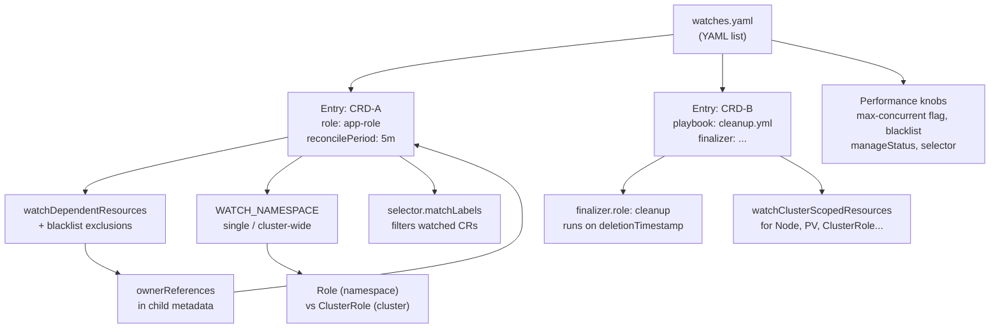

> **Complexity**: [COMPLEX]
>
> **Time to Complete**: ~100 minutes
>
> **Prerequisites**: [Module 7.12: Ansible Operator SDK Fundamentals](../module-7.12-ansible-operator-sdk/), familiarity with Kubernetes RBAC from [K8s Extending Module 1.3: Controllers and client-go](/k8s/extending/module-1.3-controllers-client-go/), owner references and garbage collection concepts, `operator-sdk`, `kubectl`, `kind`, `docker`, and `ansible` on your PATH

---

## Prerequisites

Module 7.12 gave you a working mental model of how the Operator SDK reconciliation loop connects a `watches.yaml` entry to an Ansible role. Before going further, you should be able to explain what happens between `kubectl apply` of a custom resource and the first Ansible task firing, understand what `manageStatus: true` writes to the CR status subresource, and have at least one operator project you scaffolded and ran locally on kind.

This module also requires comfort reading Kubernetes RBAC manifests. You need to know the difference between a `Role` and a `ClusterRole`, understand why `ClusterRoleBinding` grants permissions across all namespaces while `RoleBinding` confines them, and recognize an owner reference in `metadata.ownerReferences`. The exercises use the same toolchain as Module 7.12—kind, operator-sdk, kubectl, docker, and ansible. Confirm all five are available before starting.

---

## What You'll Be Able to Do

After completing this module, you will be able to:

- **Design** a `watches.yaml` file with multiple CRD entries, selecting role vs playbook dispatch, per-entry reconcile periods, and the correct `watchDependentResources` and `blacklist` controls per entry.
- **Implement** per-namespace operator scoping using the `WATCH_NAMESPACE` environment variable and articulate the RBAC boundary shift when switching between namespace-scoped and cluster-wide modes.
- **Diagnose** watch-related reconciliation failures by correlating operator logs, CR status conditions, RBAC denial events, and the specific watches.yaml field responsible for the behavior.
- **Configure** finalizer mappings in `watches.yaml` and evaluate whether a given cleanup scenario requires a dedicated finalizer role, a deletion-timestamp branch in the main role, or Kubernetes garbage collection alone.
- **Tune** operator reconciliation throughput by controlling worker concurrency with the manager's `--max-concurrent-reconciles` flag or the per-GVK `MAX_CONCURRENT_RECONCILES_<KIND>_<GROUP>` environment override, blacklisting high-churn child resource kinds, and choosing `reconcilePeriod` values appropriate to each resource's external drift rate.

---

## Why This Module Matters

Hypothetical scenario: a platform team builds their first Ansible Operator to manage a single `DatabaseBackup` custom resource. Everything works in staging. Six months later, the same operator binary needs to manage a second resource type (`BackupSchedule`), serve two product teams with separate namespace boundaries, clean up S3 prefixes when a CR is deleted, and stop burning API server quota on every pod scheduling event in a busy cluster. The single-entry out-of-the-box `watches.yaml` cannot carry any of that weight without deliberate configuration.

Advanced watch configuration is where operators grow from prototypes into production infrastructure. The choices you make in `watches.yaml`—whether to run cluster-wide or namespace-scoped, whether to enable `watchDependentResources` with a `blacklist` or disable it entirely, whether to attach a finalizer or rely on Kubernetes garbage collection alone—determine the operator's security blast radius, its behavior under deletion, and its performance envelope under load. Getting these wrong means either over-privileged controllers that are a compliance liability or under-configured controllers that miss configuration drift and leave orphaned cloud resources behind after CRs are deleted.

This module treats `watches.yaml` as a contract between your operator's control loop and the Kubernetes API server. Every field in that file is a deliberate engineering decision, not a default to leave untouched. You will leave with a complete mental model of how each field interacts with the others, a decision framework for scoping, performance, and cleanup that applies to any Ansible Operator project, and a hands-on lab that exercises all the patterns together on a real kind cluster.

---

## Concept Map



---

## Multiple CRDs, One Operator: Structuring watches.yaml at Scale

`watches.yaml` is a YAML list, and every element of that list is an independent watch specification. When the operator-sdk manager starts, it reads the file from top to bottom and registers a separate reconciler for each entry. Each entry has its own GVK (group, version, kind), its own Ansible dispatch target (a role or playbook), and its own set of behavioral flags. Two entries sharing a `watches.yaml` do not share execution context—they maintain separate reconciliation queues, separate variable scopes, and separate status writers.

The primary reason to bundle two CRDs in one operator rather than two separate operators is operational cohesion. When a `WebApp` custom resource always creates an `AppConfig` companion and both are maintained by the same platform team, a single operator deployment reduces the number of controller processes, simplifies RBAC management, and streamlines CRD lifecycle steps. The coupling cost is real: a bug in one reconciler affects the entire operator process, and a rollout of one role forces a restart that briefly interrupts reconciliation for every CRD the operator manages—not just the one being updated. In a multi-tenant platform where teams depend on the operator to provision their environments, even a ten-second restart during a busy deployment window can cause visible latency in environment creation pipelines. The right split depends on how tightly coupled the resource types are in production, how independently they need to evolve, and what the availability requirements of each resource type are. A CRD that gates a synchronous user-facing operation—a team waits for reconciliation to complete before their environment is usable—should be isolated in its own operator process from CRDs used in background maintenance paths, because the failure domain separation outweighs the operational overhead of running two controllers instead of one. Multi-tenant operators serving dozens of teams should also consider that one team's high CR throughput floods the shared reconciliation queue, delaying queue drain for all other tenants sharing the same operator process; per-team operator instances or per-team-group scoping with the `selector` field are the architecturally correct responses to that failure mode.

```yaml
---
- version: v1alpha1
  group: platform.example.com
  kind: WebApp
  role: webapp
  reconcilePeriod: 10m
  watchDependentResources: true
  manageStatus: true

- version: v1alpha1
  group: platform.example.com
  kind: AppConfig
  playbook: playbooks/appconfig.yml
  reconcilePeriod: 0s
  watchDependentResources: false
  manageStatus: false
```

Notice that the two entries use different dispatch strategies. `WebApp` dispatches to an Ansible role, which suits self-contained single-resource reconciliation where the role directory keeps tasks organized. `AppConfig` dispatches to a named playbook, which is better when reconciliation logic spans multiple roles or needs conditional includes that do not fit the single-role model. These are not stylistic preferences—choose `role` when the automation is self-contained and choose `playbook` when the automation is compositional, because the distinction affects how variables are scoped and how Ansible collections are resolved at runtime.

The `reconcilePeriod` values in the example differ deliberately. `WebApp` sets `10m` because it manages a Deployment that could drift if an engineer edits it manually with `kubectl`. `AppConfig` sets `0s` (effectively zero, meaning purely event-driven) because its managed resources are immutable ConfigMaps that nothing else writes to. Setting a non-zero reconcile period on every entry in a multi-CRD operator is a common performance mistake that compounds: five entries each configured with `reconcilePeriod: 2m` across a cluster with two thousand CRs generates approximately one thousand reconciliations per minute from timers alone, before any actual CR change events are counted.

Version management in `watches.yaml` adds a distinct failure mode that is easy to miss during CRD evolution. When a CRD progresses from `v1alpha1` to `v1beta1`, both versions may be served simultaneously during a migration window. A `watches.yaml` entry still declaring `v1alpha1` while the cluster stores CRs at `v1beta1` results in a silently broken operator: the informer registers for an API version that returns no objects, reconciliation stops, and no error appears in the manager logs. The correct diagnostic is `kubectl api-resources --api-group=<your-group>` to confirm which versions the API server currently serves and compare against every `version:` field in `watches.yaml`. During a version transition, maintain both entries temporarily—one for `v1alpha1`, one for `v1beta1`, both mapping to the same role—so no stored CRs are orphaned. Once all objects have been migrated and the old version is removed from the CRD's `spec.versions`, remove the old `watches.yaml` entry as well. An entry pointing at a non-existent API version does not cause a startup error, but it does register an informer that consumes a slot in the controller-manager's watch table without ever delivering events, which is wasted overhead in large operators managing many CRD versions simultaneously.

**Pause and predict:** what happens when someone adds a new field to `WebApp`'s `spec` but forgets to update the corresponding Ansible role to handle it? Consider carefully before reading on—the answer has implications for how you validate the contract between your CRD schema and your role tasks.

The answer: Ansible ignores unknown extra_vars by default. The new field is passed to the role as a variable but silently has no effect, because no task references it. The operator reconciles without error. This is invisible at the operator level and confusing to the user who set the field expecting behavior. In a multi-CRD operator where several roles evolve independently, this schema-to-role drift is particularly hard to audit. The mitigation is a validation task at the top of each role that fails explicitly when expected variables are missing or have unexpected types.

When `operator-sdk create api` adds a new entry to `watches.yaml`, it uses the kind name in lowercase as the role name and leaves `reconcilePeriod`, `watchDependentResources`, and `manageStatus` at their generated defaults. Those defaults favor simplicity over production suitability. Before committing a new entry, explicitly choose values for all three fields based on the specific resource type's behavior and environment. Treat the generated `watches.yaml` entry as a starting template, not a finished configuration.

---

## Namespace Scoping with WATCH_NAMESPACE

The `WATCH_NAMESPACE` environment variable is set on the operator's manager Pod, not inside `watches.yaml` itself, but it governs how every entry in `watches.yaml` behaves at runtime. The controller-manager reads this variable at startup to determine whether to build a namespace-scoped or cluster-wide informer cache. Getting this decision wrong before deploying to a shared cluster is the most common source of privilege escalation in platform team operators.

When `WATCH_NAMESPACE` is empty (the default generated by `operator-sdk init`), the operator watches all namespaces. The controller-manager uses a cluster-wide cache that receives events from every namespace. This requires a `ClusterRole` with `list`, `watch`, and `get` permissions on every resource kind the operator manages—both the watched CRDs and all dependent resources like Deployments, Services, and ConfigMaps. Most platform teams discover this when their security review flags the `ClusterRole` and asks why a per-team tool has cluster-wide read access to all Deployments.

When `WATCH_NAMESPACE` is set to a specific namespace name, the manager creates a namespace-scoped informer for each resource kind. Only events from that namespace enter the reconciliation queue, and the operator needs only a namespace-scoped `Role` rather than a `ClusterRole`. The RBAC boundary is now enforced by the Kubernetes API server, not by convention or trust in the operator author.

Here is how `WATCH_NAMESPACE` appears in the manager Deployment manifest:

```yaml
apiVersion: apps/v1
kind: Deployment
metadata:
  name: controller-manager
  namespace: platform-system
spec:
  template:
    spec:
      containers:
      - name: manager
        image: example.com/my-operator:v0.1.0
        env:
        - name: WATCH_NAMESPACE
          valueFrom:
            fieldRef:
              fieldPath: metadata.namespace   # watches only its own namespace
```

Using `fieldPath: metadata.namespace` makes the operator watch the namespace it is deployed in, which is the correct default for tenant-per-namespace models where each tenant's operator instance is co-located with their workloads. When the operator must watch a specific namespace that differs from its deployment namespace—a central platform controller in `platform-system` managing resources in a separate `platform-workloads` namespace, for example—set an explicit string value instead of the `fieldRef`. To watch all namespaces and accept the cluster-wide privilege requirement that implies, leave the value as an empty string. These three modes are the complete set; the Ansible operator manager has no partial-list mode, and changing the mode after initial deployment requires restarting the manager pod to rebuild the informer cache from the new scope.

```yaml
        env:
        - name: WATCH_NAMESPACE
          value: "tenant-alpha"
```

```yaml
        env:
        - name: WATCH_NAMESPACE
          value: ""
```

The namespace scope choice has a secondary effect on leader election. The manager uses a `Lease` object in its own deployment namespace as the leader election lock when running with multiple replicas. When multiple namespace-scoped operator instances are deployed—one per tenant—each instance elects its own leader independently within its own namespace, and the `Lease` objects do not conflict across instances. For operators distributed through OperatorHub, the ClusterServiceVersion (CSV) install mode—`OwnNamespace`, `SingleNamespace`, or `AllNamespaces`—must be aligned with the intended `WATCH_NAMESPACE` setting, because OLM generates RBAC based on the install mode. A CSV declaring `OwnNamespace` generates a `RoleBinding` only in the install namespace; if the operator's manager then reads `WATCH_NAMESPACE` pointing to a different namespace, the informer's `list-watch` call fails with 403 because the service account has no `Role` in the watched namespace. Validating the RBAC alignment between CSV install mode and `WATCH_NAMESPACE` before publishing to OperatorHub is a required pre-flight check that the SDK does not automate.

Multi-namespace scoping—watching two or three specific namespaces without watching all—requires the `MultiNamespacedCacheBuilder` in Go controller-runtime. Ansible operators generated by operator-sdk do not expose this through the `WATCH_NAMESPACE` variable; the built-in manager initialization supports one namespace or all namespaces, not an arbitrary bounded set. Watching a bounded set of namespaces in an Ansible operator requires deploying one operator instance per watched namespace, each scoped to its own namespace via the env variable. This is a known limitation relative to Go-based operators, which can pass a comma-separated list to build a multi-namespace cache directly.

The right scoping choice depends on deployment model and trust boundaries. Operators managing resources for a single product team should always be namespace-scoped. Platform operators that manage cluster-wide shared infrastructure—storage class provisioners, cluster-wide admission configurations, or DNS management—legitimately need cluster-wide watch. The migration path matters too: you cannot retrofit namespace scoping onto an operator that assumed cluster-wide access without updating its RBAC, replacing the `ClusterRoleBinding` with per-namespace `RoleBinding` objects, redeploying the operator, and verifying that existing CRs fall within the newly scoped namespace. Plan the scoping decision before deploying; retrofitting it is expensive.

---

## Cluster-Scoped Watches and RBAC Consequences

Some Kubernetes resources are cluster-scoped by definition: Nodes, PersistentVolumes, StorageClasses, ClusterRoles, ClusterRoleBindings, and any custom resource defined with `scope: Cluster` in its CRD. If your operator's Ansible role needs to read or create any of these, the corresponding `watches.yaml` entry must include `watchClusterScopedResources: true`, and the operator's service account needs a `ClusterRole` covering those resource kinds—regardless of whether `WATCH_NAMESPACE` is set to a specific namespace for other entries.

The `watchClusterScopedResources: true` flag tells the controller-manager to register an informer for cluster-scoped resource kinds using a cluster-scoped cache. This enables a hybrid architecture: the operator is namespace-scoped for most resources (controlled by `WATCH_NAMESPACE`) but cluster-scoped for specific child kinds when a particular CRD needs it. The two dimensions are orthogonal—you can have namespace-scoped CRD watching alongside cluster-scoped dependent resource watching in the same operator.

Here is an example entry for a CRD that provisions `StorageClass` objects as part of its reconciliation:

```yaml
- version: v1alpha1
  group: storage.platform.com
  kind: StorageProfile
  role: storage-profile
  watchClusterScopedResources: true
  watchDependentResources: true
```

The RBAC required for this entry extends beyond the CRD itself. The operator's `ClusterRole` must include rules for `storage.k8s.io/v1/storageclasses` with every verb the role uses. Failing to include these permissions causes the operator to start without error—the watches.yaml parse succeeds—but the Ansible role silently receives a 403 Forbidden when `kubernetes.core.k8s` attempts to create a `StorageClass`. The failure appears in operator pod logs as an Ansible task failure, often mistaken for a role logic bug rather than an RBAC gap.

```yaml
apiVersion: rbac.authorization.k8s.io/v1
kind: ClusterRole
metadata:
  name: storage-operator-manager-role
rules:
- apiGroups: ["storage.k8s.io"]
  resources: ["storageclasses"]
  verbs: ["get", "list", "watch", "create", "update", "patch", "delete"]
- apiGroups: ["storage.platform.com"]
  resources: ["storageprofiles", "storageprofiles/status", "storageprofiles/finalizers"]
  verbs: ["get", "list", "watch", "create", "update", "patch", "delete"]
```

Security reviewers will flag the `delete` verb on `storageclasses` as high risk, and they are correct to do so. A bug in the Ansible role—a variable interpolation error that generates the wrong storage class name, for example—could delete a production StorageClass used by hundreds of PersistentVolumeClaims. Production-grade cluster-scoped operators should separate read-only observation (for reconciliation decisions) from write operations, and the write path should be tested with realistic CR counts before being trusted without human review.

**Pause and predict:** your operator has `WATCH_NAMESPACE: "tenant-alpha"` set but also `watchClusterScopedResources: true` in one of its watches entries. Does the namespace scope apply to the cluster-scoped watch? Think through what each configuration controls before reading the answer.

The namespace scope does not apply to the cluster-scoped watch. `WATCH_NAMESPACE` controls which namespace the informer cache covers for namespaced resource kinds. `watchClusterScopedResources: true` registers a separate, always-cluster-wide informer for the specified cluster-scoped kinds. The operator will watch `tenant-alpha` for its namespace-scoped CRDs and watch all instances of the cluster-scoped resource kinds across the entire cluster. This means a `ClusterRole` is required even when the operator is otherwise namespace-scoped—the namespace boundary does not contain cluster-scoped resource access.

The practical guidance: treat `watchClusterScopedResources: true` as a privilege escalation flag that requires explicit justification in code review. Document in the watches entry comment precisely which cluster-scoped resource the role creates and why a namespace-scoped alternative cannot serve the same purpose. Any cluster-scoped permission that can be replaced with a namespace-scoped permission during normal operation should be replaced.

---

## Dependent Watches, Owner References, and reconcilePeriod

When an Ansible role creates child resources using `kubernetes.core.k8s`, the operator SDK can optionally watch those child resources and re-trigger the parent CR's reconciliation when they change. This is the purpose of `watchDependentResources: true`. The mechanism relies on owner references: when the operator creates a child resource, the SDK sets the parent CR as the owner in the child's `metadata.ownerReferences`. The controller-manager tracks all objects with that owner reference and enqueues the parent CR for reconciliation whenever the child is created, updated, or deleted.

This behavior is the source of both power and performance problems. The power is that if someone manually edits a Deployment that belongs to a `WebApp` CR, the operator automatically detects the drift and restores desired state on the next reconciliation. The performance problem is that every child resource event—including status updates written by other controllers—can trigger unnecessary reconciliation of the parent. A Deployment's pod count changing due to the Horizontal Pod Autoscaler generates multiple events. A ConfigMap getting annotated by a secrets management tool generates an event. On a cluster with a hundred CRs, each managing five children, this can mean several hundred spurious reconciliations per minute.

The `blacklist` field addresses this by excluding specific resource kinds from the dependent watch. Resources in the blacklist still receive owner references (for garbage collection), but changes to them do not trigger parent reconciliation:

```yaml
- version: v1alpha1
  group: platform.example.com
  kind: WebApp
  role: webapp
  watchDependentResources: true
  blacklist:
  - version: v1
    group: ""
    kind: Event
  - version: v1
    group: ""
    kind: Pod
```

Excluding `Event` and `Pod` from the dependent watch is almost always correct for operators managing Kubernetes workloads. Events are high-churn informational records written by many controllers. Pods cycle through status changes continuously during scheduling, image pulling, probe evaluation, and graceful termination. Neither kind represents configuration drift that the Ansible role needs to correct—the meaningful desired state lives in the Deployment spec, not in individual Pod status fields. Blacklisting both resources significantly reduces reconciliation frequency in busy clusters without changing the operator's behavior for any spec-level drift.

The `watchDependentResources` flag is boolean: `true` means watch ALL owned resources, `false` means watch none. There is no per-kind allowlist in `watches.yaml`—the SDK does not support specifying a subset of owned kinds to watch. The `blacklist` field is the only filtering mechanism available when `watchDependentResources: true`, and it operates by exclusion: you list kinds you do NOT want to trigger reconciliation, not kinds you do. For an operator where only Deployment and Service spec changes represent meaningful drift, the correct pattern is to enable the broad watch and then blacklist everything high-churn:

<!-- code-verified-against: https://sdk.operatorframework.io/docs/building-operators/ansible/reference/watches/ -->
```yaml
- version: v1alpha1
  group: platform.example.com
  kind: WebApp
  role: webapp
  watchDependentResources: true
  blacklist:
  - version: v1
    group: ""
    kind: Event
  - version: v1
    group: ""
    kind: Pod
  - version: v1
    group: ""
    kind: ConfigMap
  - version: v1
    group: ""
    kind: Secret
```

With this configuration, Deployment and Service changes owned by the CR still trigger reconciliation (they are not blacklisted), while Events, Pods, ConfigMaps, and Secrets are excluded. The trade-off versus a hypothetical allowlist is that any new child kind the role creates in a future version will trigger reconciliation until someone explicitly adds it to the blacklist. For an operator under active development, periodically auditing whether newly-added resource kinds belong in the blacklist is the correct discipline. Setting `watchDependentResources: false` entirely is appropriate only when the role creates no Kubernetes-native children whose spec drift the operator cares about—for example, a role that only manages external cloud resources.

The `reconcilePeriod` field serves a different concern entirely: detecting and correcting external drift that Kubernetes events cannot capture. If an Ansible role creates a managed resource in a cloud provider—an RDS instance, a Route 53 record, an IAM policy—changes to those cloud resources never generate Kubernetes events. Setting `reconcilePeriod: 15m` causes the operator to re-reconcile every 15 minutes regardless of events, detecting and correcting external drift within that window:

<!-- code-verified-against: https://sdk.operatorframework.io/docs/building-operators/ansible/reference/watches/ -->
```yaml
- version: v1alpha1
  group: platform.example.com
  kind: CloudDatabase
  role: cloud-database
  reconcilePeriod: 15m
  watchDependentResources: false
```

For purely Kubernetes-native resources where the watch covers all meaningful changes, `reconcilePeriod: 0s` is correct and wastes no reconciliation cycles. The choice of period should be driven by the external drift rate and the recovery time objective for that resource type—not by a desire to "be safe" with a short period across all entries. A 30-second reconcile period on a CRD with 500 instances generates 1,000 reconciliations per minute, which the Ansible runner process pool typically cannot sustain without queuing.

The telemetry signal that reveals a reconcile period is causing overload is a flat, clock-like reconciliation rate that does not correlate with cluster activity. If the operator exposes Prometheus metrics via `--metrics-bind-address`, the counter `controller_runtime_reconcile_total{controller="<kind>"}` should grow at a steady rate equal to `CR_count ÷ reconcilePeriod`. Deviations above this baseline indicate that dependent watch events or event storms are layering on top of the timer. The diagnostic procedure is to temporarily set `reconcilePeriod: 0s` on the suspect entry and observe whether the reconciliation rate drops toward zero; if the rate stays elevated, event-driven triggers rather than timers are the dominant source, and the fix is an expanded `blacklist` or setting `watchDependentResources: false`.

Scaling to ten thousand or more custom resources under timer-driven reconciliation requires explicit capacity planning that the default configuration does not provide. At 10,000 CRs with a `reconcilePeriod: 30m`, the timer generates 333 reconciliations per minute—one every 0.18 seconds—sustained continuously regardless of cluster activity. The SDK's default concurrency is `runtime.NumCPU()`, the logical CPU count visible to the manager process, so the exact baseline depends on the controller Pod's CPU environment. If you deliberately cap a lab or production rollout to `--max-concurrent-reconciles=1`, and the Ansible role takes 500 milliseconds per run, that single-worker scenario saturates at two reconciliations per second maximum, meaning the full CR population cycles in 83 minutes rather than the configured 30. The queue depth grows monotonically under those explicit conditions. The remediation has three levers: lengthen the period if the external drift rate allows, raise concurrency with `--max-concurrent-reconciles` or a per-GVK `MAX_CONCURRENT_RECONCILES_<KIND>_<GROUP>` override if CR reconciliations are independent of each other, or optimize the role's no-op path. A well-tuned no-op path—a single `kubernetes.core.k8s_info` task to read current state followed by `meta: end_play` when desired state already matches—can complete in under 100 milliseconds, delivering a five-times throughput improvement without touching worker count.

The interaction between `reconcilePeriod` and `watchDependentResources` compounds. Configuring both a non-zero period and `watchDependentResources: true` without a comprehensive `blacklist` means reconciliation fires from two independent sources: event-driven from child changes and timer-driven from the period. On a cluster with many CRs, the queues grow faster than the workers process them. The rule: use `reconcilePeriod` for resources with external state that cannot be observed through Kubernetes events; disable `watchDependentResources` for purely external operators where no Kubernetes-native drift needs event-driven detection; avoid combining a short period with broad dependent watches and a minimal blacklist.

---

## Finalizer Mapping for Safe Resource Cleanup

Kubernetes garbage collection handles cleanup of namespaced child resources automatically when their parent CR is deleted. Owner references cause the API server to cascade-delete owned objects in the same namespace. Three scenarios escape this mechanism entirely: cluster-scoped resources created by the role that cannot have a namespace-scoped owner; external resources outside Kubernetes altogether (S3 buckets, DNS records, cloud IAM roles); and resources that must be deleted in a specific order or with specific API calls before the parent disappears.

Finalizers are the mechanism Kubernetes provides for pre-delete hooks. When the operator first sees a CR, it adds a string identifier to `metadata.finalizers`. When a user runs `kubectl delete` on the CR, the API server sets `metadata.deletionTimestamp` but does not remove the object because the finalizers list is non-empty. The reconciler detects the deletion timestamp, runs the cleanup logic, and then removes its finalizer string. Only after the finalizers list is empty does the API server allow the object to disappear.

The `finalizer` field in `watches.yaml` maps this lifecycle to an Ansible role or playbook:

```yaml
- version: v1alpha1
  group: platform.example.com
  kind: WebApp
  role: webapp
  finalizer:
    name: platform.example.com/cleanup
    role: webapp-cleanup
    vars:
      cleanup_mode: graceful
      retention_days: 7
```

When the CR is first created, the SDK registers `platform.example.com/cleanup` in `metadata.finalizers`. When the CR is deleted, the SDK runs the `webapp-cleanup` role instead of the main `webapp` role, passing the `vars` block as extra variables alongside the normal CR spec and metadata. The cleanup role runs while the CR still exists in the API server, meaning it has access to the full CR spec via the `ansible_operator_meta` and spec variables—exactly what cleanup code needs to know which external resources to remove.

The `role` and `playbook` fields within the finalizer block are mutually exclusive and both optional. When neither is specified, the top-level role or playbook runs on deletion with `ansible_operator_meta.deletion_timestamp` set, allowing the same role to branch its behavior based on whether the CR is being created or deleted:

```yaml
- version: v1alpha1
  group: platform.example.com
  kind: WebApp
  role: webapp
  finalizer:
    name: platform.example.com/cleanup
```

Inside the role's `tasks/main.yml`:

```yaml
---
- name: Handle deletion
  when: ansible_operator_meta.deletion_timestamp is defined
  block:
  - name: Remove external configuration
    some.collection.external_resource:
      name: "{{ ansible_operator_meta.name }}"
      state: absent
    ignore_errors: true

  - name: Return early after cleanup
    meta: end_play

- name: Normal reconciliation tasks
  kubernetes.core.k8s:
    definition:
      apiVersion: apps/v1
      kind: Deployment
      # ...
```

Using the deletion-timestamp branch in the main role keeps cleanup colocated with creation logic, which is convenient for simple cleanup (a single idempotent delete task). Use a separate `finalizer.role` when the deletion path has more than three or four distinct tasks, when cleanup requires different collection dependencies than creation, or when you want to test the cleanup path independently.

The critical operational concern with finalizers is stuck objects. If the cleanup role fails repeatedly—because an external API is down, because a variable is undefined, because the external resource is already gone and the task does not handle that case—the CR stays in `Terminating` state indefinitely. The operator keeps re-enqueuing it, the role keeps failing, and the queue backs up. Every cleanup role must be written with idempotency as a first-class requirement: use `state: absent` with `ignore_errors: true` for external resource deletion, because the resource may already be gone on a retry. Document the emergency escape hatch in your team's runbook: `kubectl patch <crd-name> <cr-name> -n <namespace> --type=json -p='[{"op":"remove","path":"/metadata/finalizers"}]'` removes the finalizer without running cleanup, forcing deletion but bypassing the cleanup logic.

---

## Selector Filters, blacklist, and Performance Knobs

The `selector` field limits which custom resources of a given kind the operator watches, based on their labels. This is useful in multi-tenant environments where two operator instances share one CRD—one handling production-tier resources and another handling staging—without interfering with each other's reconciliation queues:

```yaml
- version: v1alpha1
  group: platform.example.com
  kind: WebApp
  role: webapp
  selector:
    matchLabels:
      tier: production
```

With this configuration, the operator ignores `WebApp` resources that do not carry `tier: production`. A staging operator instance uses `tier: staging`. The selector is evaluated by the controller-manager's informer before events reach the reconciliation queue, so non-matching resources consume no reconciliation worker capacity. The informer itself still receives all events for the CRD from the API server—the filtering happens client-side, not at the API server level—so network traffic between the API server and operator is not reduced by selectors, only the subsequent processing work.

This client-side architecture is the key difference between label selectors and field selectors. Field selectors on standard fields like `metadata.name` and `metadata.namespace` are evaluated server-side by the Kubernetes API before events are emitted; they genuinely reduce the watch stream. However, `watches.yaml` selector entries use label selectors exclusively, because the controller-runtime informer cache is designed around label-indexed in-memory stores and does not expose a field-selector abstraction at the informer registration layer for custom resources. The practical consequence for high-CR-count deployments: label-based filtering does not reduce the memory consumed by the operator's informer cache or the bandwidth consumed by the API server watch stream. Every CR of the watched kind—including the ones the selector discards—occupies space in the in-memory store. At 50,000 CRs with approximately 1–2 KB each in the informer cache, that is 50–100 MB of controller memory from CRD informer caches alone. When memory is a hard constraint and label selectors cannot provide the necessary isolation, the architectural alternative is per-tenant CRDs with separate API groups, where each CRD's informer only ever contains that tenant's objects by definition.

The typed versus untyped informer distinction adds a related pitfall. When `kubernetes.core.k8s_info` reads child resources from the local cache, it performs a typed lookup against a specific kind's in-memory store for fast local reads without API server round-trips. The `selector` in `watches.yaml` filters which parent CRs trigger reconciliation; it does not filter which secondary resource kinds enter the cache. A namespace-scoped operator with a narrow CR selector still caches every Deployment, ConfigMap, and Service in its watched namespace—not just those owned by selector-passing CRs—because the child resource informers are registered for the namespace, not for a subset of owning CRs. In a shared namespace where multiple teams deploy workloads, each operator independently caches the full namespace's resources, multiplying memory usage proportionally to the number of operators sharing that namespace.

The `selector` field supports the full Kubernetes label selector syntax, including `matchExpressions` for set-based matching:

```yaml
  selector:
    matchExpressions:
    - key: environment
      operator: In
      values:
      - production
      - canary
    - key: skip-operator
      operator: DoesNotExist
```

This selector watches resources in `production` or `canary` environments while excluding any resource labeled `skip-operator`—a useful pattern for emergency bypass when a CR needs to be pinned outside operator control temporarily without deleting it.

Ansible operator worker concurrency is controlled outside `watches.yaml`. The global lever is the `--max-concurrent-reconciles` flag passed to the manager process, and administrators can override a specific GVK with `MAX_CONCURRENT_RECONCILES_<KIND>_<GROUP>` on the manager Pod. The default is `runtime.NumCPU()`, meaning the controller starts with a concurrency value based on the logical CPUs available to the process rather than a fixed value of one. Raising concurrency is appropriate when CRs across different entries are demonstrably independent and reconciliation takes long enough—due to external API calls or long-running Ansible tasks—that queue latency becomes a bottleneck:

<!-- code-verified-against: https://sdk.operatorframework.io/docs/building-operators/ansible/reference/watches/ -->
```yaml
apiVersion: apps/v1
kind: Deployment
metadata:
  name: controller-manager
spec:
  template:
    spec:
      containers:
      - name: manager
        args:
        - "--max-concurrent-reconciles=3"
        env:
        - name: MAX_CONCURRENT_RECONCILES_WEBAPP_PLATFORM_EXAMPLE_COM
          value: "3"
```

The API server rate limit, not CPU, is almost always the binding constraint when raising worker count. Each concurrent reconcile issues Kubernetes API calls for every task that uses `kubernetes.core.k8s` or `kubernetes.core.k8s_info`. At three concurrent reconciles, API call frequency can roughly triple. Monitor the operator's API server request rate and watch for 429 `TooManyRequests` responses in the operator logs before raising the count above 3. A value above 5 rarely improves throughput in practice because the API server backpressure dominates.

The `manageStatus` field determines whether the SDK writes `status.conditions` after each Ansible runner invocation. When `manageStatus: true` (the default), the operator automatically records whether the run succeeded and when the last reconcile occurred. When `manageStatus: false`, the status subresource is untouched by the SDK; the Ansible role owns it entirely through explicit `kubernetes.core.k8s` tasks that update the status. Using both simultaneously—`manageStatus: true` and status-writing tasks in the role—creates a last-writer-wins conflict that produces inconsistent status conditions. Choose one ownership model per entry and document the decision in the watches.yaml comment for the team.

---

## Patterns and Anti-Patterns

| Pattern | When to Use | Why It Works |
|---------|-------------|--------------|
| Namespace-scoped with `WATCH_NAMESPACE` | Single-tenant operators, per-team deployments | Least-privilege RBAC; blast radius limited to one namespace |
| `watchDependentResources: false` for external-only operators | Roles managing only cloud API resources with no k8s-native children | Eliminates spurious event-driven reconciliation; drift detection handled entirely by `reconcilePeriod` |
| Separate finalizer role | Cleanup with more than three tasks or external resources | Separation of concerns; cleanup role tested independently |
| Non-zero `reconcilePeriod` for external resources | Resources with cloud API-managed state | Safety net for drift that Kubernetes events cannot capture |
| Selector-based operator segmentation | Multiple operator instances sharing one CRD | Independent operator deployments per tier; no cross-tier queue interference |
| Blacklist for `Event` and `Pod` | Any operator using `watchDependentResources: true` | Eliminates reconciliation churn from high-frequency informational resources |

| Anti-Pattern | Why It Fails | Better Alternative |
|--------------|-------------|-------------------|
| `watchDependentResources: true` without blacklist | Events and Pod status changes trigger constant reconciliation on busy clusters | Add `blacklist` for `Event` and `Pod`; expand blacklist as new high-churn child kinds are added |
| `reconcilePeriod: 30s` on every entry | Reconciliation storm proportional to CR count; API server throttles operator | Use `0s` for Kubernetes-native resources; non-zero period only where external drift exists |
| `ClusterRole` for a namespace-scoped operator | One bug or exploit has cluster-wide read access | Set `WATCH_NAMESPACE`; use a namespace-scoped `Role` with a `RoleBinding` |
| Finalizer without idempotent cleanup role | Network failures during cleanup cause the role to fail on retry; CR stuck in `Terminating` | Use `state: absent` with `ignore_errors: true`; verify cleanup tasks are safe to run multiple times |
| Both `manageStatus: true` and role-managed status | SDK and role write the same status fields; last-writer-wins produces inconsistent conditions | Pick one ownership model; set `manageStatus: false` when the role manages status |
| `--max-concurrent-reconciles=10` without rate limit testing | API server returns 429; operator enters exponential backoff; CR reconciliation lags | Start with a modest value such as 2–3; load test with realistic CR counts; monitor for 429 responses |
| Selector on a shared CRD without label enforcement | New CRs created without the required label are silently ignored forever | Enforce labels via a mutating admission webhook or CRD schema defaulting |

---

## Decision Framework

The central decision when configuring a `watches.yaml` entry is the trust and blast radius of that entry's controller. Answer the questions in order:

| Question | If Yes | If No |
|----------|--------|-------|
| Does the role create cluster-scoped resources (StorageClass, ClusterRole, PV)? | Add `watchClusterScopedResources: true`; add `ClusterRole` rules | Keep `watchClusterScopedResources: false`; namespace-scope is sufficient |
| Is the operator serving a single namespace or tenant? | Set `WATCH_NAMESPACE` to that namespace; use `Role` + `RoleBinding` | Leave `WATCH_NAMESPACE` empty; use `ClusterRole` + `ClusterRoleBinding` |
| Does the role create Kubernetes-native children whose spec drift the operator should correct? | Use `watchDependentResources: true` + `blacklist` for Event and Pod | Set `watchDependentResources: false`; rely solely on `reconcilePeriod` for drift detection |
| Does the role create external resources (S3, RDS, IAM, DNS)? | Set `reconcilePeriod` matching external drift rate (5–30m) | Set `reconcilePeriod: 0s` (purely event-driven) |
| Does deletion require cleanup of external resources or ordered teardown? | Add `finalizer.name` + `finalizer.role` for complex cleanup | Rely on Kubernetes garbage collection via owner references |
| Does the operator share this CRD with another operator instance? | Add `selector.matchLabels` with a labeling convention; enforce via admission | No selector needed |
| Is reconciliation latency a bottleneck (runs >30s for independent CRs)? | Set `--max-concurrent-reconciles=2` or `3`; monitor for 429 API errors | Keep the default `runtime.NumCPU()` value and revisit after profiling |
| Does the role manage status manually via `kubernetes.core.k8s`? | Set `manageStatus: false` | Leave `manageStatus: true` (default) |

---

## Did You Know?

1. The `watches.yaml` format is a translation layer over [controller-runtime](https://github.com/kubernetes-sigs/controller-runtime), the same Go library that powers Kubebuilder operators. Every field in `watches.yaml` maps to a configuration option in controller-runtime's `Manager` or `Builder` types. This means every performance characteristic and behavior documented for Go operators in the controller-runtime documentation applies equally to Ansible operators running on the same manager infrastructure.

2. The `blacklist` and `watchDependentResources` fields are the only knobs `watches.yaml` exposes for controlling which owned resource changes trigger reconciliation. There is no allowlist mechanism in the SDK—`watchDependentResources` is a boolean (all or none), and `blacklist` lets you exclude specific kinds from triggering re-queues while still granting them owner references for garbage collection. The implication: if you add a new high-churn child kind to a role, it automatically starts triggering reconciliation for every parent CR until someone explicitly adds it to the blacklist. Reviewing the blacklist whenever new resource kinds are added to a role is the correct discipline.

3. When a CR enters deletion (its `deletionTimestamp` is set), Kubernetes prevents the API server from processing further `DELETE` requests on the object until all finalizer strings are removed. If the finalizer role fails repeatedly and the operator crashes or cannot recover, the CR becomes permanently stuck in `Terminating` state. No amount of `kubectl delete` calls on a `Terminating` object makes it go away—only removing the finalizer string via `kubectl patch` does. Document this escape hatch explicitly in the runbook for every operator that uses finalizers, because the first time a production CR gets stuck is always during an incident.

4. The `selector` field in `watches.yaml` uses standard Kubernetes label selector semantics, but it filters at the controller-manager cache level—client-side, after events arrive from the API server. This is meaningfully different from a server-side `labelSelector` query parameter: the operator's informer still receives all watch events for the CRD from the API server, consuming network bandwidth and memory for objects it then discards. For extremely high-CR-count deployments where the selector filters out most objects, this client-side overhead can be significant; the architectural alternative is per-tenant CRDs rather than label-filtered shared CRDs.

---

## Common Mistakes

| Mistake | Why It Happens | How to Fix It |
|---------|---------------|---------------|
| Setting `watchDependentResources: true` without a `blacklist` in a busy cluster | Assuming the broad watch is harmless; not anticipating high-churn child kinds like Pod and Event | Add a `blacklist` for Event and Pod at minimum; audit whether other child kinds (ConfigMap, Secret) also need blacklisting |
| Leaving `WATCH_NAMESPACE` empty in production | `operator-sdk init` generates empty `WATCH_NAMESPACE` as a permissive default | Set a specific namespace for tenant operators; require the variable to be explicitly set in the Deployment manifest and fail fast at startup if missing |
| Forgetting `watchClusterScopedResources: true` for roles that create cluster-scoped children | Works in staging with `cluster-admin` credentials; fails with a least-privilege service account | Add the flag and corresponding `ClusterRole` rules; test with a restricted `ServiceAccount` that mirrors production |
| Finalizer cleanup role that does not handle already-deleted resources | External resources are gone after the first cleanup attempt; subsequent retries fail hard; CR stuck in `Terminating` | Use `state: absent` with `ignore_errors: true` on all deletion tasks; verify idempotency by running the role twice on a test CR |
| `manageStatus: true` with role-managed status tasks | SDK and role both write `status.conditions`; last-writer-wins produces unexpected conditions visible to users | Set `manageStatus: false` when the role writes any status field; ensure the role writes all status fields on every run |
| Non-zero `reconcilePeriod` on a high-CR-count namespace-scoped deployment | 500 CRs × 1-minute period = 500 reconciliations/minute from timers alone; API server throttles the operator | Audit all `watches.yaml` entries with non-zero periods; use periods matching actual external drift frequency, not a conservative safety margin |
| High `--max-concurrent-reconciles` values without 429 monitoring | API server rate limiting causes backoff that is invisible without log monitoring | Enable API server error logging in the operator; alert on 429 responses; validate worker count with a load test before production |
| Using a `selector` without enforcing labels at admission | CRs created without the required labels are silently ignored; users see no error and no reconciliation | Add a mutating admission webhook or CRD schema default values to ensure the label is always present on new CRs |

---

## Quiz

<details>
<summary>Your operator manages `DatabaseBackup` CRs with `watchDependentResources: true`. You notice the operator reconciles every 2–3 seconds for the same CR even when no user is touching it. The Deployment it created is healthy and not changing spec. What is the most likely cause, and how do you verify and fix it?</summary>

The most likely cause is that Pod and Event objects owned by the Deployment are generating high-frequency status updates that trigger reconciliation via the dependent watch. Every pod readiness probe check, pod scheduling decision, and controller-written Event generates a watch event that the operator receives and enqueues as a reconciliation request for the parent CR. To verify, look at the operator's reconciliation log messages for the triggering resource kind and name—the SDK logs which resource enqueued the request, so you will see something like `Reconciling DatabaseBackup triggered by Pod/...`. To fix, add a `blacklist` entry for `Event` and `Pod`. This eliminates the churn without changing drift detection for the resources that actually matter—Deployment spec changes remain unwatched (not blacklisted) and continue to trigger reconciliation.

</details>

<details>
<summary>You deploy an operator with `WATCH_NAMESPACE: "platform-alpha"` but the operator is not reconciling CRs created in that namespace. Describe three distinct possible causes and how to diagnose each.</summary>

First, verify the operator pod is reading `WATCH_NAMESPACE` correctly by running `kubectl describe pod <manager-pod> -n platform-system` and inspecting the env section. A misconfigured `fieldRef` or a typo in the variable name means the value is empty or wrong, causing the operator to watch all namespaces but not necessarily fail visibly. Second, check that the service account has a `RoleBinding` in `platform-alpha` granting access to the CRD's API group. Namespace-scoped operators need their `Role` and `RoleBinding` in the *watched* namespace, not just the operator's own deployment namespace; missing the `RoleBinding` causes silent 403 failures when the informer tries to list CRs. Third, confirm that the `group`, `version`, and `kind` in `watches.yaml` exactly match the installed CRD—a version mismatch (e.g., `v1alpha1` in `watches.yaml` vs `v1beta1` in the CRD) means the informer is registered for an API version that does not exist, so no events arrive.

</details>

<details>
<summary>A CR has been deleted but remains stuck in `Terminating` state for 20 minutes. The operator pod logs show the finalizer role completing successfully on the first attempt. What is the most likely explanation, and what are the correct immediate and long-term remediation steps?</summary>

The most likely explanation is that the finalizer role succeeded on the first attempt but the Ansible runner process crashed or was interrupted before the SDK could call the finalizer removal function. On the operator's next restart, it re-runs the finalizer role. If the role attempts to delete an external resource that was already removed on the first run, and the role does not handle the "already gone" case gracefully, it fails on this second attempt. The SDK does not remove the finalizer when the role fails, so the CR stays `Terminating` indefinitely. The immediate remediation is to manually remove the finalizer: `kubectl patch <crd-kind> <cr-name> -n <namespace> --type=json -p='[{"op":"remove","path":"/metadata/finalizers"}]'`. This forces deletion but bypasses cleanup—verify manually that the external resources are actually gone. The long-term fix is to make the cleanup role fully idempotent: use `state: absent` with `ignore_errors: true` on all deletion tasks so the role succeeds even when the target resource does not exist.

</details>

<details>
<summary>You have a `watches.yaml` with two entries: `AppService` (reconcilePeriod 0s, `watchDependentResources: true`, no blacklist) and `AppConfig` (reconcilePeriod 0s, `watchDependentResources: false`). During a batch creation of 50 `AppService` CRs, `AppConfig` CRs stop being reconciled for several minutes. Explain why, and propose a fix.</summary>

The Ansible runner process pool is shared across all entries in `watches.yaml`. When 50 `AppService` CRs are created simultaneously, they flood the reconciliation queue with creation events plus a cascade of Pod and Event events from `watchDependentResources: true`. If this operator was explicitly started with `--max-concurrent-reconciles=1` for a conservative rollout, only one reconciliation runs at a time, each taking several seconds. The queue grows faster than it drains, and because the queue is shared with `AppConfig` events, those events wait at the back of the combined queue. `AppConfig` reconciliation effectively pauses until the `AppService` burst clears. The fix has two parts: first, add a `blacklist` for `Event` and `Pod` in the `AppService` entry to eliminate the cascade of secondary events from the batch creation. Second, raise the manager to `--max-concurrent-reconciles=3` or set the matching per-GVK `MAX_CONCURRENT_RECONCILES_APPSERVICE_PLATFORM_EXAMPLE_COM=3` override to drain the reconciliation queue faster during bursts. Monitor API server error rates after the change to ensure the increased concurrency does not trigger 429 throttling.

</details>

<details>
<summary>You add a `selector.matchLabels: {tier: production}` to an existing `watches.yaml` entry and redeploy the operator. Shortly after, you discover that 30% of production CRs stopped being reconciled. What happened and how do you recover without deleting CRs?</summary>

The selector filtered out production CRs that were created before the labeling convention was established and never received the `tier: production` label. The operator now ignores those CRs at the informer cache level—it does not enqueue them, so they receive no reconciliation regardless of spec changes or the passage of time. Recovery requires adding the required label to all affected CRs: `kubectl label <crd-kind> --selector 'tier notin (production)' tier=production -n <namespace>`. Be careful to scope this command to avoid accidentally labeling test or staging CRs. After labeling, confirm the operator reconciles each previously-ignored CR. Going forward, enforce the label through a mutating admission webhook or a CRD schema `default` value so every new CR gets the label automatically without depending on the creator to add it manually.

</details>

<details>
<summary>Your cloud infrastructure operator creates Route 53 DNS records during reconciliation. The `reconcilePeriod` is 0s. A postmortem reveals that when someone manually deletes a DNS record through the AWS console, the operator never re-creates it even though the CR still exists and is healthy. Explain the root cause and propose the minimum configuration change, including any tradeoffs.</summary>

When `reconcilePeriod: 0s`, the operator reconciles only when a Kubernetes API event triggers it. Route 53 is an external system—deleting a DNS record through the AWS console generates no Kubernetes event. The operator has no mechanism to detect that external drift occurred, so the CR stays healthy from Kubernetes's perspective while the DNS record is missing in AWS. The minimum fix is to set `reconcilePeriod` to a value matching the acceptable recovery time objective—`10m` or `15m` is typical for DNS records, meaning the record is restored within that window. The tradeoff is that every Route 53 CR reconciles on that timer regardless of whether anything changed, increasing AWS API call volume proportionally to CR count. For an operator managing 200 DNS records with a 10-minute period, that is 200 Ansible runs every 10 minutes. Ensure the role is efficient and that AWS API rate limits are not exceeded; use `kubernetes.core.k8s_info` to check Kubernetes state before issuing AWS API calls so the role short-circuits quickly when nothing has drifted.

</details>

---

## Hands-On Lab: Multi-CRD Operator with Advanced Watch Configuration

### Scenario

Your platform team maintains a kind cluster for local development. A `PlatformApp` CRD represents a deployed application, and `PlatformConfig` represents shared configuration state. You will build an operator managing both CRDs in a dedicated namespace, configured with explicit dependent watches, a finalizer for cleanup, and a label selector for tiered operation.

### Setup

Before building the lab operator, confirm that all required tools are present on your PATH. A missing binary causes `make docker-build` or operator-sdk scaffold commands to fail midway through the build, which is harder to diagnose than catching it before starting:

```bash
kind --version
operator-sdk version
kubectl version --client=true
docker version --format '{{.Client.Version}}'
ansible --version
```

The lab uses two namespaces: `platform-system` for the operator's manager Deployment and `platform-tenants` for the custom resources the operator will watch. Creating them before installing the operator avoids 404 errors during RBAC binding creation:

```bash
kind create cluster --name watches-lab
kubectl create namespace platform-system
kubectl create namespace platform-tenants
```

### Task 1: Scaffold and configure a two-CRD operator

Scaffold a new operator project with the Ansible plugin, then create API resources for both CRD kinds. The `create api` command updates `watches.yaml`, creates a role directory skeleton, and generates a minimal CRD manifest for each kind:

```bash
mkdir watches-lab-operator && cd watches-lab-operator
operator-sdk init --domain platform.example.com --plugins ansible
operator-sdk create api --group apps --version v1alpha1 --kind PlatformApp
operator-sdk create api --group apps --version v1alpha1 --kind PlatformConfig
```

After scaffolding, confirm the generated `watches.yaml` contains one entry per kind before overwriting it. The generator uses the kind name in lowercase as the role name and sets permissive defaults that the next step replaces with production-tuned values:

```bash
cat watches.yaml
```

Overwrite the generated `watches.yaml` with a configuration that exercises the patterns from this module: explicit dependent watches, a finalizer, a label selector, and differentiated `reconcilePeriod` and `manageStatus` settings between the two entries:

```yaml
---
- version: v1alpha1
  group: apps.platform.example.com
  kind: PlatformApp
  role: platformapp
  reconcilePeriod: 5m
  watchDependentResources: true
  blacklist:
  - version: v1
    group: ""
    kind: Event
  - version: v1
    group: ""
    kind: Pod
  manageStatus: true
  selector:
    matchLabels:
      managed-by: watches-lab
  finalizer:
    name: apps.platform.example.com/cleanup
    role: platformapp-cleanup

- version: v1alpha1
  group: apps.platform.example.com
  kind: PlatformConfig
  role: platformconfig
  reconcilePeriod: 0s
  watchDependentResources: false
  manageStatus: false
```

<details>
<summary>Why these values for each entry?</summary>

`PlatformApp` uses `watchDependentResources: true` with a `blacklist` for Event and Pod. This means Deployment and Service changes (not blacklisted) still trigger reconciliation for drift detection, while the high-churn Event and Pod kinds do not. The 5-minute `reconcilePeriod` acts as a safety net for manual edits. The `selector` enables future multi-tier operation. The finalizer ensures the cleanup role runs before the CR disappears. `PlatformConfig` is purely Kubernetes-native with ConfigMap children; `reconcilePeriod: 0s` and `watchDependentResources: false` means it reconciles only on direct spec changes, consuming minimal reconciliation capacity.

</details>

**Success criteria**:
- [ ] `cat watches.yaml` shows both entries with the fields above

### Task 2: Write the reconciliation and cleanup roles

Write the main reconciliation task for `PlatformApp`. This task creates a Deployment owned by the CR using explicit owner references, enabling Kubernetes garbage collection to clean up the Deployment automatically if the finalizer role fails or is bypassed. The SDK injects CR spec fields as top-level Ansible variables, so the role first derives the same defaults used in Module 7.12: `replicas | default(1)` and `image | default('nginx:1.27-alpine')`.

```bash
cat > roles/platformapp/tasks/main.yml << 'EOF'
---
- name: Derive PlatformApp desired values
  ansible.builtin.set_fact:
    demoapp_name: "{{ ansible_operator_meta.name }}"
    demoapp_namespace: "{{ ansible_operator_meta.namespace }}"
    demoapp_replicas: "{{ replicas | default(1) | int }}"
    demoapp_image: "{{ image | default('nginx:1.27-alpine') }}"

- name: Deploy application
  kubernetes.core.k8s:
    definition:
      apiVersion: apps/v1
      kind: Deployment
      metadata:
        name: "{{ demoapp_name }}-app"
        namespace: "{{ demoapp_namespace }}"
        labels:
          app.kubernetes.io/name: demoapp
          app.kubernetes.io/instance: "{{ demoapp_name }}"
          app.kubernetes.io/managed-by: ansible-operator
        ownerReferences:
        - apiVersion: apps.platform.example.com/v1alpha1
          kind: PlatformApp
          name: "{{ demoapp_name }}"
          uid: "{{ ansible_operator_meta.uid }}"
          controller: true
          blockOwnerDeletion: true
      spec:
        replicas: "{{ demoapp_replicas }}"
        selector:
          matchLabels:
            app.kubernetes.io/name: demoapp
            app.kubernetes.io/instance: "{{ demoapp_name }}"
        template:
          metadata:
            labels:
              app.kubernetes.io/name: demoapp
              app.kubernetes.io/instance: "{{ demoapp_name }}"
              app.kubernetes.io/managed-by: ansible-operator
          spec:
            containers:
            - name: app
              image: "{{ demoapp_image }}"
EOF
```

Create the finalizer cleanup role that runs when a `PlatformApp` CR is deleted. The `ignore_errors: true` directive is mandatory here: if the Deployment is already absent when cleanup retries after a previous partial failure, the task must succeed rather than fail and leave the CR permanently stuck in `Terminating` state:

```bash
mkdir -p roles/platformapp-cleanup/tasks
cat > roles/platformapp-cleanup/tasks/main.yml << 'EOF'
---
- name: Remove owned deployment
  kubernetes.core.k8s:
    api_version: apps/v1
    kind: Deployment
    name: "{{ ansible_operator_meta.name }}-app"
    namespace: "{{ ansible_operator_meta.namespace }}"
    state: absent
  ignore_errors: true

- name: Confirm cleanup
  debug:
    msg: "Cleanup complete for {{ ansible_operator_meta.name }}"
EOF
```

**Success criteria**:
- [ ] `cat roles/platformapp/tasks/main.yml` shows the Deployment task
- [ ] `cat roles/platformapp-cleanup/tasks/main.yml` shows the delete task with `ignore_errors: true`

### Task 3: Configure namespace scoping and deploy

Restrict the operator to the `platform-tenants` namespace by setting `WATCH_NAMESPACE` in the manager Deployment. Find the `env:` block under the manager container and add both the namespace restriction and the Ansible gathering mode override, which prevents the slow implicit fact collection that runs at the start of every Ansible play by default:

```yaml
        env:
        - name: WATCH_NAMESPACE
          value: "platform-tenants"
        - name: ANSIBLE_GATHERING
          value: "explicit"
```

Build the operator image locally and load it into the kind cluster's container image cache. The `kind load` step is required because kind cannot pull from a local Docker registry—images must be pre-loaded into the cluster before the manager Deployment can start without an `ImagePullBackOff` error:

```bash
make docker-build IMG=localhost/watches-lab-op:v0.1.0
kind load docker-image localhost/watches-lab-op:v0.1.0 --name watches-lab
```

Install the CRD manifests into the cluster and deploy the manager Deployment with the configured image tag. The rollout status command blocks until the manager pod is healthy, providing clear confirmation that the deployment succeeded and the operator is ready to receive reconciliation events before you proceed to testing:

```bash
make install
make deploy IMG=localhost/watches-lab-op:v0.1.0
kubectl rollout status deployment/controller-manager -n platform-system --timeout=120s
```

<details>
<summary>If the manager pod fails to start</summary>

Check the manager pod logs:

```bash
kubectl logs -n platform-system -l control-plane=controller-manager --tail=50
```

Common failures: image pull errors (re-run `kind load`), missing `RoleBinding` in `platform-tenants` (the generated RBAC may only cover `platform-system`), or a `watches.yaml` parse error from indentation mistakes.

</details>

**Success criteria**:
- [ ] `kubectl get pods -n platform-system` shows the manager Pod in Running state

### Task 4: Test dependent watch reconciliation

Apply a `PlatformApp` CR carrying the selector label `managed-by: watches-lab` required by the `watches.yaml` selector configuration. Without this label the operator ignores the CR entirely—no reconciliation, no status conditions, and no error message anywhere in the system that explains why:

```bash
kubectl apply -f - << 'EOF'
apiVersion: apps.platform.example.com/v1alpha1
kind: PlatformApp
metadata:
  name: demo-app
  namespace: platform-tenants
  labels:
    managed-by: watches-lab
spec:
  replicas: 1
  image: nginx:1.27-alpine
EOF
```

Open a second terminal to stream the operator logs during the reconciliation test. The SDK logs the triggering resource kind and name for each enqueued reconciliation request, which is the primary diagnostic signal for verifying that dependent watches are firing as expected:

```bash
kubectl logs -n platform-system -l control-plane=controller-manager -f
```

Once the initial reconciliation completes and the Deployment appears in `platform-tenants`, simulate configuration drift by manually overriding the replica count. This is the exact scenario that `watchDependentResources: true` is designed to catch without waiting for the `reconcilePeriod` timer:

```bash
kubectl scale deployment demo-app-app -n platform-tenants --replicas=3
```

Verify that the operator restores the replica count. Because Deployment is not in the `blacklist`, the scale event triggers a reconciliation within seconds rather than waiting for the 5-minute `reconcilePeriod`—this is the core behavioral difference between event-driven and timer-driven reconciliation paths:

```bash
kubectl get deployment demo-app-app -n platform-tenants -o go-template='{{ index .spec "replicas" }}'
```

<details>
<summary>Expected behavior and timing</summary>

Because Deployment is not in the `blacklist` and `watchDependentResources: true`, the scale event triggers reconciliation quickly—usually within a few seconds. The operator re-applies the role with the CR's `replicas` variable still set to 1, restoring the Deployment to one replica. If you had set `watchDependentResources: false`, the operator would only detect the drift after the 5-minute `reconcilePeriod`.

</details>

**Success criteria**:
- [ ] Initial reconciliation creates the Deployment without errors
- [ ] Scaling the Deployment to 3 triggers reconciliation visible in the logs
- [ ] After reconciliation, the Deployment replica count returns to 1

### Task 5: Test the finalizer lifecycle

Delete the CR and observe the finalizer lifecycle in the operator logs. The API server sets `deletionTimestamp` and prevents physical deletion until the operator removes the finalizer string, giving the cleanup role time to run and confirm resource removal:

```bash
kubectl delete platformapp demo-app -n platform-tenants
```

Observe the sequence in the logs. You should see the cleanup role running (the `debug` message), after which the CR disappears:

```bash
kubectl get platformapp -n platform-tenants   # should disappear
kubectl get deployment demo-app-app -n platform-tenants   # should be absent
```

<details>
<summary>If the CR is stuck in Terminating</summary>

Check whether the cleanup role encountered an error. A missing variable, incorrect Ansible syntax, or a collection not installed in the image causes the role to fail, preventing finalizer removal. To unblock: `kubectl patch platformapp demo-app -n platform-tenants --type=json -p='[{"op":"remove","path":"/metadata/finalizers"}]'`. Fix the role, rebuild the image, and test again with a fresh CR.

</details>

**Success criteria**:
- [ ] Operator logs show the cleanup role running on deletion
- [ ] CR transitions through Terminating and is fully removed
- [ ] Deployment owned by the CR is absent after deletion

### Task 6: Stretch — verify selector filtering

Create a second CR that intentionally lacks the `managed-by: watches-lab` label to confirm the selector is working. This CR should exist in the API server but never appear in the operator's reconciliation logs or accumulate any status conditions:

```bash
kubectl apply -f - << 'EOF'
apiVersion: apps.platform.example.com/v1alpha1
kind: PlatformApp
metadata:
  name: ignored-app
  namespace: platform-tenants
spec:
  replicas: 1
  image: nginx:1.27-alpine
EOF
```

Allow 60 seconds for any pending reconciliation to complete, then compare the status of both CRs side by side. The labeled CR should show populated status conditions; the unlabeled CR should have an empty status, confirming that the selector filters at the cache layer before events ever reach the reconciliation queue:

```bash
kubectl get platformapp -n platform-tenants -o wide
```

The `ignored-app` CR should have no status conditions because the operator never reconciled it. The operator logs should show no reconciliation triggered for `ignored-app`.

**Success criteria**:
- [ ] A CR with `managed-by: watches-lab` label is reconciled and has a populated status
- [ ] A CR without the label is not reconciled and has no status conditions
- [ ] Operator logs show reconciliation activity only for the labeled CR

---

## Sources

- https://sdk.operatorframework.io/docs/building-operators/ansible/reference/watches/
- https://sdk.operatorframework.io/docs/building-operators/ansible/tutorial/
- https://sdk.operatorframework.io/docs/building-operators/ansible/reference/finalizers/
- https://sdk.operatorframework.io/docs/building-operators/ansible/
- https://sdk.operatorframework.io/docs/building-operators/ansible/quickstart/
- https://kubernetes.io/docs/reference/access-authn-authz/rbac/
- https://kubernetes.io/docs/concepts/extend-kubernetes/operator/
- https://kubernetes.io/docs/tasks/extend-kubernetes/custom-resources/custom-resource-definitions/
- https://kubernetes.io/docs/concepts/workloads/controllers/garbage-collection/
- https://kubernetes.io/docs/reference/using-api/api-concepts/
- https://docs.ansible.com/ansible/latest/collections/kubernetes/core/

---

## Next Module

[Module 7.14: Ansible Operator with AWX/AAP](../module-7.14-awx-aap-operator-integration/)
