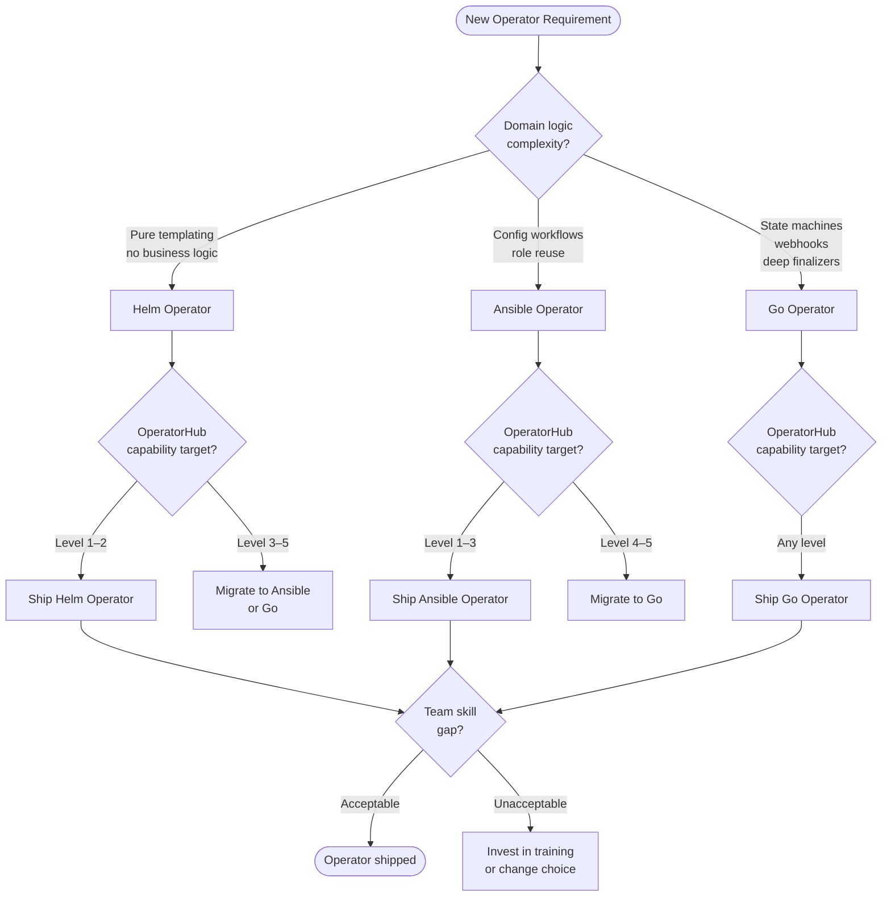

> **Complexity**: [COMPLEX]
>
> **Time to Complete**: ~90 minutes
>
> **Prerequisites**: [Module 7.12: Ansible Operator SDK Fundamentals](../module-7.12-ansible-operator-sdk/), [K8s Extending Module 1.3: Controllers and client-go](/k8s/extending/module-1.3-controllers-client-go/), basic familiarity with Helm charts, `operator-sdk`, `kubectl`, `kind`, and a working Docker daemon

---

## What You'll Be Able to Do

After completing this module, you will be able to:

- **Evaluate** which operator implementation style — Helm, Ansible, or Go — best fits a given workload by scoring it across twelve concrete decision axes.
- **Design** a minimum viable production operator for each style against the same custom resource definition, comparing line count, debuggability, and capability ceiling.
- **Diagnose** mismatches between operator implementation choice and operational requirements by identifying which axes were ignored at design time.
- **Compare** OperatorHub.io capability levels and determine what each level demands from the underlying implementation.
- **Plan** an incremental migration path that grows an operator from a simple Helm wrapper to a full Go controller as requirements evolve.

## Why This Module Matters

Hypothetical scenario: a platform team receives a ticket asking them to build a self-service operator so that application teams can deploy a company-standard web workload by submitting a single `WebApp` custom resource. The platform engineers spend two days with Operator SDK and ship a Go controller. Three months later, the operator has grown to four controllers, two webhooks, and a finalizer chain — and none of the three engineers who originally wrote it still work on the team. The engineers who inherited it cannot diagnose a stuck deletion without reading six hundred lines of Go they have never touched before.

A different platform team faces the same ticket. They spend half a day standing up a Helm Operator, ship it the same week, and update the underlying chart via the existing CI pipeline their team already owns. When requirements eventually outgrow Helm — when the operator needs to query an external secrets API before rendering — they migrate the control plane logic to Ansible. The total rewrite, when Go finally becomes necessary, is scoped to the pieces that genuinely need it rather than the entire codebase.

The three operator implementation styles are not a stack ranking from worse to better. They are three tools with different ceilings, different floors, and different failure modes. Choosing the wrong one does not usually fail immediately — it fails gradually, through escalating debugging pain, team knowledge drain, and a widening gap between what the operator does and what the business needs it to do. This module gives you the framework to make that choice deliberately, with evidence, before you write the first line.

## Concept Map

The decision flows through three primary gates: how complex is your domain logic, how well does your team already own the toolchain, and how high does your OperatorHub.io capability target sit? Together, these gates drive the choice with far more precision than any single-axis heuristic.



## The Three Operator Implementation Styles

Before scoring a specific requirement against the twelve axes, you need a clear mental model of what each implementation style actually is. All three styles share the same underlying scaffolding: Operator SDK generates a manager binary, CRD manifests, RBAC, a Dockerfile, and a kustomize deployment. The difference is entirely in what the reconcile loop does when it fires.

A **Helm Operator** replaces the reconcile function with a Helm release manager. When a watched custom resource changes, the operator calls Helm's `install` or `upgrade` logic against a bundled chart, passing the custom resource's `spec` fields as Helm values. The operator owns the lifecycle of the resulting Helm release: it tracks chart versions, diffs values between reconcile cycles, and runs Helm's built-in rollback if an upgrade fails. The advantage is that your entire business logic lives in a Helm chart — the same artifact your CI pipeline already tests, your security scanners already audit, and your team already understands. The ceiling is that Helm renders templates at reconcile time; it cannot query external APIs, run conditionals on live cluster state, or implement deletion logic that spans multiple API calls.

An **Ansible Operator** replaces the reconcile function with an ansible-runner invocation. When a watched resource changes, the operator runs an Ansible role or playbook, passing the custom resource's fields as extra vars. The role can use the `kubernetes.core.k8s` module to create, update, or delete any Kubernetes resource, and it can also make HTTP calls, read secrets, apply templated configs, and run shell commands — anything Ansible can do, the reconcile loop can do. The key advantage over Helm is that conditional logic, loops, and multi-step orchestration are all native to Ansible's task model. The ceiling is that Ansible's reconcile loop is measured in seconds per invocation, the execution model is procedural not event-driven, and implementing a true state machine with explicit phases requires awkward workarounds using status conditions as variables.

A **Go Operator** implements the reconcile function directly in Go using the controller-runtime library. The function receives an object reference, reads the current state from the API server, computes the desired state, and applies the diff — all in a few milliseconds, with full type safety, cache predicates, retry budgets, and sub-resource status management. The Go operator has no ceiling: it can implement state machines with explicit phases, conversion webhooks for CRD version upgrades, defaulting and validation webhooks, finalizers with multi-step cleanup, owner-reference chains across namespaced and cluster-scoped resources, and custom metrics. The floor is also the highest: you need Go engineers, you need to understand the controller-runtime event model, and every subtlety of the reconcile contract — including re-queuing, error backoff, and cache lag — must be handled explicitly in code.

Pause and predict: before reading the decision matrix, sketch which implementation style you would choose for an operator that watches a `DatabaseBackup` resource and calls an external backup API that may take up to ten minutes to complete. What constraint rules Helm out immediately? What forces you to choose between Ansible and Go?

## The 12-Axis Decision Matrix

No single axis is sufficient. The matrix below scores each axis on three levels. Evaluate your operator against all twelve before choosing.

| Axis | Helm Operator | Ansible Operator | Go Operator |
|------|--------------|-----------------|-------------|
| **1. Domain logic complexity** | Low: static templates only | Medium: conditional tasks, loops, external calls | High: any complexity, state machines, webhooks |
| **2. Reconciliation latency** | Seconds (helm render + apply) | Seconds to tens of seconds | Sub-second, event-driven |
| **3. State-machine fit** | None: no phase tracking | Weak: status conditions usable but awkward | Native: explicit phases, condition management |
| **4. Team skill baseline** | Helm/YAML | Ansible roles, Python not required | Go, controller-runtime |
| **5. Debugging ergonomics** | `helm template` + resource diff | ansible-runner task output, verbose logs | `dlv` attach, controller logs, event traces |
| **6. Status subresource richness** | Basic: limited to chart notes | Medium: set via `k8s_status` module | Full: typed conditions, observedGeneration |
| **7. Finalizer complexity** | None: no deletion logic | Simple: pre-delete task in role | Full: multi-step, ordered, re-queue on failure |
| **8. OLM tier ceiling** | Level 2 (Seamless Upgrades) | Level 3 (Full Lifecycle) | Level 5 (Auto Pilot) |
| **9. OperatorHub.io certification** | Community tier only | Community tier | All tiers including Red Hat certification |
| **10. RBAC complexity** | Low: chart RBAC only | Medium: ansible-runner SA + watched resources | High: per-resource, per-verb, webhook roles |
| **11. Multi-tenancy** | Limited: single namespace focus | Moderate: namespace-scoped by SA policy | Full: cluster-scoped, namespace isolation, impersonation |
| **12. Upgrade safety** | Helm's built-in diff and rollback | Manual pre-upgrade tasks in role | CRD schema conversion webhooks, migration controllers |

**Reading the matrix**: the axes are not equally weighted for every operator. An operator that will never be published to OperatorHub.io has low weight on axes 8 and 9. An operator for an internal microservice where the team already has ten Ansible roles has high weight on axes 4 and 5. Identify your top five axes — the ones where getting the wrong answer causes real operational pain — and let those drive the choice.

**Axis 1: Domain logic complexity** is usually the fastest tiebreaker. If the operator's entire job is to render a set of Kubernetes objects from a custom resource spec, Helm is sufficient. If the operator needs to make decisions based on the current state of external resources, talk to APIs outside the cluster, or apply different logic depending on conditions discovered at reconcile time, Ansible is the natural next step. If the operator needs to implement explicit phases with transitions, admission webhooks that mutate or validate resources before they are persisted, or deletion logic that must survive restarts and partial failures, Go is the only defensible choice.

**Axis 3: State-machine fit** is frequently underweighted at design time. Many operators start as pure config appliers and gradually grow into state machines because the underlying resource lifecycle is more complex than the initial design assumed. A `DatabaseCluster` resource moves through `Initializing → Primary Elected → Healthy → Degraded → Restoring`. Each phase has a different reconcile action. Helm cannot model this at all — it has no concept of operator-managed phase. Ansible can simulate it by reading the current status condition and branching on it, but the code becomes fragile as the number of phases grows. A Go operator models this as a switch statement over a typed phase field, which is idiomatic, testable, and easy to extend.

**Axis 7: Finalizer complexity** is the second most commonly underweighted axis. A finalizer is the mechanism by which a controller runs cleanup logic before a resource is actually deleted from the API server. Simple cleanup — removing a single child resource — is achievable in all three styles. Multi-step cleanup that might fail partway through and needs to be resumed on the next reconcile cycle — for example, revoking an external IAM role before deleting a cluster — is awkward in Ansible and natural in Go. If your operator will ever need to call an external API as part of deletion, plan for Go from the start or plan for a migration.

**Axis 12: Upgrade safety** deserves special attention for long-lived operators. A custom resource definition's schema can evolve over time: fields are added, deprecated, or restructured. Managing this evolution safely requires conversion webhooks when the change is not backwards-compatible. Helm Operators cannot implement conversion webhooks — they are defined outside the chart's reconcile scope. Ansible Operators can register a conversion webhook endpoint, but the implementation requires a sidecar process and is community-supported only. Go Operators implement conversion webhooks as first-class controller-runtime components with full test infrastructure.

Pause and predict: your team is building an operator for a `VaultSecret` resource that synchronizes an external Vault secret into a Kubernetes secret. The sync must complete within two seconds of the VaultSecret being created. The operator will never need upgrade webhooks, and your team owns a Vault Ansible collection already. Which axis tips the scale away from Ansible toward Go?

## OperatorHub.io Capability Levels

OperatorHub.io and the Operator Lifecycle Manager (OLM) define a five-level capability model that describes how much an operator can automate of its operand's lifecycle. This model is not just a marketing taxonomy — it has direct implications for which implementation style you can use, because higher levels require capabilities that only certain styles can implement.

```
Level 1: Basic Install
  The operator can deploy and configure the workload.
  Minimum: CRD + CSV + controller that creates Deployment, Service, ConfigMap.
  Reachable by: Helm, Ansible, Go.

Level 2: Seamless Upgrades
  The operator handles patch and minor version upgrades of the workload,
  including CRD schema upgrades, without data loss.
  Requires: upgrade logic, readiness probes, rollback on failure.
  Reachable by: Helm (via chart upgrade), Ansible (pre-upgrade task), Go.

Level 3: Full Lifecycle
  The operator automates backup, restore, and failure recovery.
  Requires: backup cronjobs, status tracking, restore controllers.
  Reachable by: Ansible (with effort), Go.

Level 4: Deep Insights
  The operator exposes metrics, alerting rules, and log aggregation
  for the workload via Prometheus and an integrated dashboard.
  Requires: metrics endpoint, PrometheusRule CR, grafana dashboard CR.
  Reachable by: Go (native), Ansible (with considerable effort).

Level 5: Auto Pilot
  The operator automatically scales, tunes, and self-heals the workload
  based on metrics and user-defined targets, without manual intervention.
  Requires: HPA/KEDA integration, vertical pod autoscaling, multi-resource
  reconciliation, admission control.
  Reachable by: Go only.
```

In practice, most production operators deployed to customer clusters target Level 2 or Level 3. Reaching Level 3 reliably with an Ansible Operator requires careful role design — backup and restore logic should be idempotent, the restore path should be tested in CI, and the status condition model should distinguish `BackupInProgress` from `RestoreInProgress` from `Ready`. These are achievable but they add significant role complexity.

Red Hat certification for OperatorHub.io, which unlocks placement in the Certified and Marketplace catalogs, requires a Go Operator in practice. The certification pipeline runs scorecard checks, preflight validation, and a suite of Operator SDK e2e tests that depend on controller-runtime idioms. Community operators built with Ansible or Helm are fully supported in the Community catalog and are legitimate production choices for teams not targeting the certified tiers.

The OLM tier also affects how your operator is installed. A ClusterServiceVersion (CSV) is required for any OLM-managed operator. Operator SDK generates a CSV for all three styles. The Helm Operator CSV is the simplest — it maps directly from the chart's values schema. The Ansible Operator CSV requires annotating the role's defaults for schema generation. The Go Operator CSV is generated from controller-runtime RBAC markers in the controller source code, which keeps the CSV in sync with the actual permissions the controller requests.

## Three Worked Examples

### When Helm Operator Wins: cert-manager and kube-prometheus-stack

The cert-manager project is installed by hundreds of thousands of clusters and is published as a Helm chart that has been battle-tested across every Kubernetes distribution. If your platform team's job is to build an operator that watches a `CertManagerDeployment` custom resource and installs cert-manager into the cluster with user-specified configuration — issuer classes, webhook port, leader election timeout — the domain logic is entirely expressed in Helm values. There is no phase management, no external API call, no custom finalizer. The reconcile loop needs exactly one action: reconcile the Helm release to match the current `spec`.

The kube-prometheus-stack Helm chart tells the same story. The chart deploys Prometheus Operator, Alertmanager, Grafana, and a set of default PrometheusRules and ServiceMonitors. If you need an operator that watches a `MonitoringStack` resource and installs this chart, the work is pure value mapping. The Helm Operator SDK handles chart rendering, value diffing between spec versions, and release rollback. Your implementation is a `watches.yaml` entry, a values template, and RBAC for the resources the chart creates.

Both examples succeed with a Helm Operator because the **invariant holds**: the desired state is fully expressible as a Helm release, the reconcile action is always `helm upgrade --install`, and the only feedback the operator needs to surface is the release status. The moment either operator needs to query cert-manager's webhook readiness before marking the CertManagerDeployment as ready — or to call the Prometheus API to verify that Alertmanager has received all the expected rules — the invariant breaks and the operator needs a richer implementation.

Estimated code volume for a minimum viable production Helm Operator covering both examples:
- `watches.yaml`: ~15 lines
- Chart templates (Deployment + Service + ConfigMap + RBAC): ~180–300 lines
- ClusterServiceVersion and RBAC: ~80 lines
- Dockerfile + Makefile targets: ~60 lines
- **Total: approximately 335–455 lines**

### When Ansible Operator Wins: NVIDIA Network Operator and MinIO

NVIDIA Network Operator manages the complete SR-IOV and RDMA networking stack on GPU nodes. The operator needs to apply kernel module parameters, load appropriate kernel modules, configure network interfaces, deploy device plugins, and install the OFED driver set. This is not pure templating — the configuration steps depend on the node's hardware capabilities, the kernel version, and the current state of the network stack. The logic is procedural: check hardware, configure kernel params, install driver, verify connectivity. That is exactly what Ansible tasks were designed to express.

The MinIO Operator is another strong Ansible case. MinIO manages distributed object storage with complex tenant lifecycle management, but the core reconciliation logic — create the StatefulSet, configure the tenant, update the pool configuration when the spec changes — is a series of idempotent configuration steps. Teams that already own Ansible roles for storage configuration, or that come from a VMware/traditional infrastructure background where Ansible is the automation lingua franca, will find an Ansible Operator dramatically easier to maintain than an equivalent Go controller. The ansible-runner task output is readable in plain English; debugging a failed reconcile is as simple as reading the task list and finding the first failure.

The key discriminator for both examples is **role reuse**: the NVIDIA and MinIO use cases have existing automation that is already written in Ansible. Rebuilding that logic in Go means duplicating work that is already tested, already reviewed, and already owned by engineers who do not write Go. The Ansible Operator lets the existing automation become the reconcile loop.

Estimated code volume for a minimum viable production Ansible Operator:
- `watches.yaml` + playbook entry point: ~25 lines
- Role `tasks/main.yml`, `defaults/main.yml`, `handlers/main.yml`: ~300–550 lines
- Status reporting (`k8s_status` calls): ~40 lines
- ClusterServiceVersion and RBAC: ~120 lines
- Dockerfile + molecule test skeleton: ~80 lines
- **Total: approximately 565–815 lines**

### When Go Operator Wins: Crossplane and Cluster API

Crossplane implements an extensible control plane for managing cloud infrastructure through Kubernetes-native APIs. When a user creates a `CompositePostgreSQLInstance`, Crossplane resolves a `Composition` to produce a set of managed resources, passes them through a `CompositionRevision`, applies them to cloud providers through provider-specific controllers, and tracks their readiness individually before reporting the composite as ready. This is not one reconcile action — it is a graph of dependent reconcile cycles with explicit readiness propagation, deletion ordering, and composition revision tracking. Helm and Ansible are not architecturally capable of this. Go is the only implementation style with the primitives to express it.

Cluster API provisions and manages Kubernetes clusters as first-class Kubernetes objects. A single `Cluster` resource triggers a cascade: a `Machine`, a `MachineSet`, infrastructure-specific `AWSMachine` or `GCPMachine` resources, kubeconfig secrets, and eventually a fully-functional cluster. Each step has a defined phase (`Pending → Provisioning → Provisioned → Deleting`), and transitions between phases must survive controller restarts. If the controller dies while a machine is provisioning, it must re-read the cloud provider state and resume from where it left off without double-provisioning. This requires explicit state persistence via status conditions, deterministic re-queue logic, and cloud provider API idempotency — all of which are first-class Go controller patterns with no equivalent in Helm or Ansible.

Both Crossplane and Cluster API also implement conversion webhooks. Crossplane CRD versions have evolved from v1alpha1 through v1beta1 to v1, requiring conversion webhooks that translate old objects to new schemas without data loss. Cluster API providers implement defaulting webhooks that set infrastructure-specific defaults before resources are persisted. Neither capability exists in the Helm or Ansible operator models.

Estimated code volume for a minimum viable production Go Operator comparable to a simplified Crossplane or Cluster API provider:
- `api/v1alpha1/` (types, groupversion, zz_generated deepcopy): ~200–350 lines
- `internal/controller/` (reconciler, predicates, status management): ~450–900 lines
- `cmd/main.go` (manager setup, scheme registration, metrics): ~80 lines
- Webhook implementations (defaulting + validation): ~150–250 lines
- RBAC markers and generated manifests: ~120 lines
- Suite and unit tests: ~250–500 lines
- **Total: approximately 1,250–2,100 lines**

These estimates reflect *minimum viable production* — enough to ship with reasonable test coverage and OLM packaging. They are not proof-of-concept line counts. Real operators at the scale of Crossplane or Cluster API run to tens of thousands of lines. The estimates illustrate the cost of entry for each style.

## Code Volume and Migration Paths

The line count estimates reveal a cost structure that shapes the migration decision. Starting with a Helm Operator means starting with 335–455 lines. If requirements evolve to need external API calls, you face a choice: hack around Helm's limitations by shelling out or using init containers, or migrate the control plane to Ansible. The migration is not a rewrite of everything — the Helm chart (the largest single artifact) can often be reused as a dependency called from within the Ansible role.

The Helm → Ansible migration path looks like this: you create a new Operator SDK project with the Ansible plugin, write a thin role that calls `community.general.helm` or `kubernetes.helm` to apply the existing chart, and add the new logic — external API calls, conditional config, richer status updates — as additional tasks after the chart installation. The existing chart is preserved; the new role wraps it. Total added code is typically 200–400 lines for the role and a refactored `watches.yaml`.

The Ansible → Go migration is more significant but still manageable when scoped correctly. Most Ansible Operators that grow into Go do so because a specific controller — usually the most complex one — needs state machine semantics or a webhook. The common pattern is the **hybrid operator**: keep the Ansible Operator for the controllers that map cleanly to Ansible roles, and add a Go controller only for the controllers that need explicit phase management or webhooks. Operator SDK supports this through separate manager registrations. The hybrid reduces the migration surface to the minimum required, rather than forcing a full rewrite.

The worst migration scenario is the full rewrite from Helm or Ansible to Go that is triggered by a production incident: a finalizer edge case causes a stuck deletion in a multi-tenant cluster, and the Ansible Operator's pre-delete task cannot express the required cleanup logic. That rewrite happens under time pressure, by engineers who did not write the original operator, with a production cluster waiting for the fix. The decision matrix exists to move that conversation to design time.

## Patterns and Anti-Patterns

### Patterns

**Pattern: Thin Helm Operator as scaffolding, chart as truth.** Keep the Helm chart as the sole source of rendered manifests. Never add raw `kubectl apply` calls to the watches configuration or inject manifests outside the chart. The Helm Operator is trustworthy precisely because Helm's release model tracks what was applied and what must be removed on a `spec` change. Bypassing the chart breaks that tracking and leads to orphaned resources.

**Pattern: Ansible role per controller, one watches entry per role.** In an Ansible Operator with multiple custom resource types, map each CRD to a dedicated role rather than branching inside a single monolithic role. A `WebApp` resource triggers the `webapp` role; a `WebAppConfig` resource triggers the `webapp_config` role. This keeps roles unit-testable with Molecule, keeps watches entries simple, and prevents a failure in one resource type from poisoning the reconciliation of another.

**Pattern: Status conditions as the Go operator's API surface.** Consumers of a Go Operator should never need to parse log lines to know whether an operator is healthy. Define typed `Condition` types — `Ready`, `Synced`, `Degraded` — on every managed resource and update them at the end of every reconcile cycle. Controllers in the same operator can observe these conditions as preconditions before acting. Monitoring systems can alert on them. This pattern eliminates log scraping from the operator's external API.

**Pattern: Start with a single CRD and expand.** Regardless of implementation style, begin with the narrowest possible custom resource. Add fields to `spec` only when the use case is clear and the field is consumed by the reconcile logic. Every field you add becomes a test case, a migration concern, and a documentation burden. The operators that are easiest to maintain are the ones whose schemas have been kept minimal.

### Anti-Patterns

**Anti-pattern: Choosing Go because it feels more serious.** Go is not inherently more production-worthy than Helm or Ansible. Crossplane and Cluster API are Go operators because their requirements demand it, not because the team wanted to write Go. An Ansible Operator that reliably reconciles a hundred resources per cluster and has full Molecule test coverage is more production-worthy than a Go Operator with no tests and a finalizer that deadlocks on certain deletion orders.

**Anti-pattern: Adding an Ansible Operator to replace Helm without adding logic.** If the operator's job is still "render these templates and apply them," and all you have done is wrap the Helm chart in an Ansible `kubernetes.core.helm` call, you have added maintenance cost — ansible-runner overhead, a larger operator image, more RBAC surface — without gaining any capability. Use Ansible when Ansible's task model adds something Helm cannot provide.

**Anti-pattern: Skipping the `observedGeneration` field in Go operators.** The `observedGeneration` field on a status subresource tells consumers which version of the spec the status reflects. Omitting it causes status and spec to appear out of sync to watching controllers and to the human operator reviewing the resource. Every managed resource's status should set `observedGeneration: metadata.generation` at the end of a successful reconcile.

**Anti-pattern: Using a Helm Operator for an operator that will be OperatorHub-certified.** Helm Operators can be published to the Community catalog on OperatorHub.io, but they cannot pass Red Hat's certification scorecard, which requires Go-native controller patterns. If your roadmap includes a certified operator, starting with Helm means planning a rewrite. Start with Go from day one if certification is a requirement, even if the initial implementation is simple.

## Did You Know?

1. The Operator Framework project, which includes Operator SDK, OLM, and OperatorHub.io, was originally created by CoreOS in 2016 and donated to the Cloud Native Computing Foundation after Red Hat acquired CoreOS in 2018. As of 2024 there are over 300 operators listed on OperatorHub.io across the Community, Certified, and Red Hat Marketplace catalogs.

2. Cluster API's phase model — `Pending`, `Provisioning`, `Provisioned`, `Deleting`, `Failed` — was directly influenced by the Kubernetes pod phase model defined in the original 2014 API conventions. The Cluster API team explicitly studied pod lifecycle semantics before designing the machine lifecycle to ensure that monitoring and alerting tooling built for pods would generalize to machine resources.

3. An Ansible Operator's reconcile loop is slower than a Go operator's by roughly two to three orders of magnitude — typical Ansible reconcile cycles complete in 10–30 seconds for moderate role complexity, while controller-runtime reconcile functions typically complete in under 100 milliseconds. This difference rarely matters for operators that manage slowly-changing infrastructure, but it is disqualifying for operators that need to react to high-frequency events.

4. cert-manager processes over one billion TLS certificate renewals annually across the clusters that report telemetry. Despite this scale, the cert-manager controller binary is under five thousand lines of core controller logic — the rest is generated code, tests, and supporting packages. This demonstrates that Go operator complexity scales with domain requirements, not with operational scale.

## Common Mistakes

| Mistake | Why It Happens | How to Fix It |
|---------|---------------|---------------|
| Building a Go Operator for a workload that needs pure config management | Go feels more production-credible; team wants to learn Go | Score the 12 axes before choosing; if no axis requires Go, default to Ansible or Helm and reserve Go for when requirements evolve |
| Using a Helm Operator when the reconcile logic needs external API calls | The initial requirements looked like pure templating | Add Ansible as the next tier when any non-Kubernetes API call appears in the spec; never add `exec` or init-container hacks to work around Helm's rendering model |
| Mixing Helm rendering and raw `kubectl apply` in the same operator | Quick fix to add a resource the chart doesn't cover | All resources must flow through one rendering path; add the resource to the chart, or migrate the control plane to Ansible |
| Skipping `observedGeneration` on Go Operator status updates | Developer forgets; controller-runtime does not enforce it | Add a linter rule or CI check that verifies `observedGeneration` is set in every status patch; treat it as a required field in code review |
| Writing monolithic Ansible roles that handle multiple CRD types with branching | Appears to reduce code volume; easier to start | One role per CRD type; use `watches.yaml` to dispatch; monolithic roles are impossible to test in isolation and fail silently when an unexpected resource type triggers the wrong branch |
| Targeting OperatorHub Level 5 with an Ansible Operator | Marketing requirement arrives after the Ansible implementation is complete | Validate OLM tier requirements at design time; Level 4+ requires Go; do not build toward a tier your implementation cannot reach |
| Not implementing finalizers on Go Operators that call external APIs | Finalizer logic is deferred as "nice to have" | Any operator that creates resources outside the cluster must implement a finalizer; identify all external side effects at design time and stub the finalizer skeleton before writing any other controller logic |
| Using `helm template | kubectl apply` inside an Ansible task instead of the Ansible Operator pattern | Engineers copy a familiar shell pattern | Use `kubernetes.core.helm` or the native Helm Operator; direct `helm` invocations bypass the operator's release tracking and leave the cluster in an unreconcilable state |

## Quiz

<details>
<summary>Your team has built an Ansible Operator for a `DatabaseTenant` resource that creates a PostgreSQL schema, a user, and a secret. Three months after shipping, application teams report that deleting a `DatabaseTenant` leaves the PostgreSQL user behind in the database. What is the root cause, and what is the correct fix?</summary>

The root cause is a missing finalizer. When a Kubernetes resource is deleted without a finalizer, the controller receives a delete event but the garbage collection runs before the controller can act. The Ansible role's pre-delete tasks never run because the resource is removed from the API server immediately. The correct fix is to add a finalizer to the `DatabaseTenant` resource in the `watches.yaml` entry using the `finalizer` field, and to write a pre-delete Ansible task that calls the PostgreSQL API to drop the user and schema before removing the finalizer. The Ansible Operator SDK handles finalizer registration and removal automatically when the `finalizer` key is set in `watches.yaml`; the operator sets the finalizer on resource creation and only removes it after the pre-delete tasks complete successfully.
</details>

<details>
<summary>You are designing an operator for a `GPUCluster` resource that provisions cloud-hosted GPU instances, configures them with a distributed training framework, and automatically scales the cluster up or down based on job queue depth from an external scheduler API. Which OperatorHub capability level does this requirement target, and which implementation style is the only viable choice?</summary>

This requirement targets Level 5: Auto Pilot. The auto-scaling logic requires reading an external scheduler API (outside the Kubernetes API server), computing a desired instance count, and reconciling the cluster to that count — which is the defining characteristic of Auto Pilot. Level 5 requires dynamic scaling decisions based on live metrics, which demands a reconcile loop that can query external state, evaluate thresholds, and issue scale commands, all within a control loop that restarts gracefully. Only a Go Operator can implement this with production reliability. The controller needs to embed an HTTP client for the scheduler API, implement exponential backoff for API failures, and manage the scaling state machine explicitly. Ansible's external API call capability is too coarse-grained and too slow for this use case. Helm cannot call external APIs at all.
</details>

<details>
<summary>A platform engineer tells you: "Our Helm Operator has been working great for eighteen months. Now product wants us to add a Level 3 OLM capability — automated backup triggered by a cron schedule. I'm thinking I can add an init container that runs the backup script." Why is this a dangerous approach, and what is the correct migration path?</summary>

Adding a backup init container to the Helm chart is dangerous for two reasons. First, init containers run at pod startup, not on a cron schedule — the engineer has confused the Kubernetes resource model with the desired behavior. Second, any attempt to graft backup logic onto a Helm chart that was designed for templating will require either a separate CronJob resource in the chart (which cannot interact with the operator's reconcile state) or a sidecar controller that runs outside OLM's lifecycle management. Neither approach reaches Level 3 reliability. The correct migration is to wrap the existing Helm chart in an Ansible Operator, add a `backup` task to the role that calls the backup API or runs the backup job, and surface the backup status via a status condition. The existing chart is preserved as a dependency; the Ansible role adds the lifecycle logic that Helm cannot express. This migration is typically 200–400 lines of new role code, not a rewrite.
</details>

<details>
<summary>You are reviewing a Go Operator written by a junior engineer. The reconcile function reads the `WebApp` resource, creates a Deployment if it does not exist, and returns `ctrl.Result{}` (no requeue). Six weeks after shipping, users report that if a user manually deletes the Deployment that the operator manages, the Deployment is never recreated. What is the bug and how do you fix it?</summary>

The bug is that the operator only reconciles on events from the `WebApp` resource, not on events from the `Deployment` resources it manages. When the Deployment is manually deleted, no event fires on the `WebApp` object, so the reconcile function never runs and the Deployment is never recreated. The fix is to add a `Watches` or `Owns` registration in the controller's `SetupWithManager` function so that events on Deployment objects owned by a `WebApp` trigger a reconcile of the owning `WebApp`. In controller-runtime, calling `Owns(&appsv1.Deployment{})` in the `SetupWithManager` function accomplishes this. The controller then reconciles the parent `WebApp` whenever an owned Deployment is created, updated, or deleted, which restores the self-healing property that makes operators valuable.
</details>

<details>
<summary>Your organization wants to publish an operator to the Red Hat OperatorHub Marketplace catalog. The current implementation is an Ansible Operator at Level 2 capability. The legal team confirms this is a commercial use case. What are the three gaps between the current state and Red Hat Marketplace certification?</summary>

The three gaps are: (1) Implementation style — Red Hat Marketplace certification requires a Go Operator. The certification scorecard and preflight tooling are designed around controller-runtime idioms, and the automated checks test for patterns that Ansible Operators cannot satisfy. The operator must be rewritten in Go before certification can proceed. (2) Capability level — Marketplace certification typically requires Level 3 or above in practice, even though the formal threshold is Level 2. Reviewers look for evidence of full lifecycle management: backup, restore, and upgrade are expected. (3) CSV and bundle quality — the ClusterServiceVersion must pass `operator-sdk bundle validate` with the `--select-optional suite=operatorframework` flag, which checks owned and required API declarations, icon requirements, maintainer fields, and scorecard test results. Ansible-generated CSVs frequently fail the icon and description field checks that the marketplace pipeline enforces.
</details>

<details>
<summary>A team is building an operator for a `MessageBroker` resource that creates RabbitMQ clusters. They have a mature Ansible collection for RabbitMQ configuration that is already used in their VM automation. They have no Go engineers. The OLM tier target is Level 2. An architect suggests they "just use Go because it's more standard." How do you evaluate this advice?</summary>

The architect's advice is not well-founded in this context. Score the decision against the 12 axes: the domain logic complexity is medium (config management, not state machines), the team skill baseline is Ansible (not Go), the OLM tier target is Level 2 (reachable with Ansible), and there is existing Ansible logic that can be reused directly. None of the high-weight axes favor Go. Switching to Go would require the team to learn controller-runtime from scratch, rewrite the existing RabbitMQ automation in Go, and accept a slower delivery timeline — all without gaining any capability the Ansible Operator cannot provide at Level 2. The correct answer is to build an Ansible Operator that wraps the existing collection, with a documented migration decision record noting that Go migration will be revisited if the operator needs to reach Level 4+ or if state machine requirements emerge. "More standard" is not a scoring axis; operational requirements are.
</details>

## Hands-On Lab: Three Operator Flavors, One CRD

This lab builds all three operator styles against the same `WebApp` custom resource. By the end, you will have three running operators, a line-count comparison, and direct experience with the debugging story for each style.

### Lab Setup

```bash
# Verify toolchain
operator-sdk version
ansible --version
go version
kind version
kubectl version --client=true

# Create a kind cluster
kind create cluster --name operator-lab

# Verify cluster is accessible
kubectl cluster-info --context kind-operator-lab
```

The `WebApp` CRD that all three operators will reconcile:

```yaml
apiVersion: apiextensions.k8s.io/v1
kind: CustomResourceDefinition
metadata:
  name: webapps.apps.kubedojo.io
spec:
  group: apps.kubedojo.io
  names:
    kind: WebApp
    listKind: WebAppList
    plural: webapps
    singular: webapp
  scope: Namespaced
  versions:
    - name: v1alpha1
      served: true
      storage: true
      schema:
        openAPIV3Schema:
          type: object
          properties:
            spec:
              type: object
              properties:
                replicas:
                  type: integer
                  minimum: 1
                  default: 1
                image:
                  type: string
                port:
                  type: integer
                  default: 8080
              required: ["image"]
            status:
              type: object
              x-kubernetes-preserve-unknown-fields: true
      subresources:
        status: {}
```

Save the CRD manifest to a file and apply it to the kind cluster. The `kubectl apply` command registers the CRD in the API server, and the `get crd` verifies the CRD is established before any operator attempts to watch it. All three operators in this lab will watch the same `webapps.apps.kubedojo.io` CRD, so establishing it once before any operator is deployed is intentional.

```bash
# Save the above YAML to /tmp/webapp-crd.yaml and apply
kubectl apply -f /tmp/webapp-crd.yaml
kubectl get crd webapps.apps.kubedojo.io
```

### Task 1: Helm Operator

Scaffold the Helm Operator project. The `--plugins helm` flag tells Operator SDK to generate a Helm-based manager rather than a Go controller. The manager binary, Dockerfile, RBAC manifests, and kustomize overlays are identical to a Go Operator scaffold — only the reconcile logic differs, pointing to a Helm chart directory instead of a compiled Go reconcile function.

```bash
mkdir helm-webapp-operator && cd helm-webapp-operator
operator-sdk init --plugins helm --domain kubedojo.io --group apps --version v1alpha1 --kind WebApp
```

<details>
<summary>Hint: What the scaffold generates</summary>

The scaffold creates a `helm-charts/webapp/` directory with a default chart. You will modify `templates/deployment.yaml` and `templates/service.yaml` to use values from the `WebApp` spec. The `watches.yaml` maps the CRD to the chart. The key value mapping: `spec.replicas` → `replicaCount`, `spec.image` → `image.repository`, `spec.port` → `service.port`.
</details>

Replace the scaffolded `deployment.yaml` template with a minimal version that maps `WebApp` spec fields to Helm values. The Helm Operator passes the custom resource's `spec` block as Helm values at reconcile time, so `spec.replicas` becomes available as `.Values.replicaCount` inside the template.

```yaml
apiVersion: apps/v1
kind: Deployment
metadata:
  name: {{ include "webapp.fullname" . }}
  labels:
    {{- include "webapp.labels" . | nindent 4 }}
spec:
  replicas: {{ .Values.replicaCount | default 1 }}
  selector:
    matchLabels:
      {{- include "webapp.selectorLabels" . | nindent 6 }}
  template:
    metadata:
      labels:
        {{- include "webapp.selectorLabels" . | nindent 8 }}
    spec:
      containers:
        - name: webapp
          image: {{ .Values.image.repository }}
          ports:
            - containerPort: {{ .Values.service.port | default 8080 }}
```

Update `values.yaml` with the defaults that the Helm Operator will use when no override is provided in the `WebApp` spec. These defaults mirror the `spec` fields defined in the CRD so that a minimal `WebApp` resource with only `image` set still produces a functional Deployment.

```yaml
replicaCount: 1
image:
  repository: nginx:1.27
service:
  port: 8080
```

Build the operator image locally, load it into the kind cluster (which avoids a registry push for local development), and deploy the operator using the kustomize overlay that Operator SDK generated. The manager pod will start in the `helm-webapp-operator-system` namespace and immediately begin watching for `WebApp` resources.

```bash
make docker-build IMG=helm-webapp-operator:v0.1.0
kind load docker-image helm-webapp-operator:v0.1.0 --name operator-lab
make deploy IMG=helm-webapp-operator:v0.1.0
```

Create a `WebApp` resource to trigger the first reconciliation. Watch the operator logs in a separate terminal while this resource is applied — you will see the Helm release lifecycle (install or upgrade) in the manager output as soon as the resource is persisted to the API server.

```bash
kubectl apply -f - <<EOF
apiVersion: apps.kubedojo.io/v1alpha1
kind: WebApp
metadata:
  name: test-helm
  namespace: default
spec:
  replicas: 2
  image: nginx:1.27
  port: 8080
EOF
```

Verify that the operator reconciled the `WebApp` into a running Deployment. The Helm Operator appends the chart name to the resource name by default, so the Deployment will appear as `test-helm-webapp`. The manager logs show Helm lifecycle events — look for `Installed release` or `Upgraded release` to confirm the reconcile ran successfully.

```bash
kubectl get webapp test-helm
kubectl get deployment test-helm-webapp
kubectl logs -n helm-webapp-operator-system deploy/helm-webapp-operator-controller-manager -c manager
```

Count the implementation lines to establish the Helm Operator baseline for the comparison you will run in Task 4. Exclude generated files — count only the chart templates, `values.yaml`, and `watches.yaml` since those represent the operator logic you wrote.

```bash
wc -l helm-charts/webapp/templates/*.yaml helm-charts/webapp/values.yaml watches.yaml
```

<details>
<summary>Expected output</summary>

The Deployment and Service templates together should be around 50–80 lines. `values.yaml` is under 20 lines. `watches.yaml` is under 10 lines. Total implementation lines are approximately 80–120 — far below the Ansible and Go equivalents.
</details>

Remove the Helm Operator from the cluster before deploying the next operator style. Both the Ansible and Go Operators will watch the same CRD in the same namespace, so having multiple operator managers running simultaneously would cause competing reconciliations and make the comparison unreliable.

```bash
make undeploy
cd ..
```

### Task 2: Ansible Operator

Scaffold the Ansible Operator project. The `--plugins ansible` flag generates the same manager scaffolding but wires the reconcile loop to ansible-runner rather than to a Go controller. Operator SDK generates a `roles/` directory with a skeleton role and a `watches.yaml` that maps the `WebApp` CRD to that role. Your job is to fill in the role tasks.

```bash
mkdir ansible-webapp-operator && cd ansible-webapp-operator
operator-sdk init --plugins ansible --domain kubedojo.io --group apps --version v1alpha1 --kind WebApp
```

The scaffold creates `roles/webapp/` with `tasks/main.yml`, `defaults/main.yml`, and `watches.yaml`. The `ansible_operator_meta` variable is automatically injected by ansible-runner and contains the `name` and `namespace` of the resource that triggered the reconcile. This lets the role use `{{ ansible_operator_meta.name }}` to name child resources without any additional plumbing. Edit the role files to implement the `WebApp` reconcile logic:

**`roles/webapp/defaults/main.yml`:**

```yaml
replicas: 1
image: nginx:1.27
port: 8080
```

**`roles/webapp/tasks/main.yml`:**

```yaml
- name: Create WebApp Deployment
  kubernetes.core.k8s:
    state: present
    definition:
      apiVersion: apps/v1
      kind: Deployment
      metadata:
        name: "{{ ansible_operator_meta.name }}-webapp"
        namespace: "{{ ansible_operator_meta.namespace }}"
      spec:
        replicas: "{{ replicas | int }}"
        selector:
          matchLabels:
            app: "{{ ansible_operator_meta.name }}"
        template:
          metadata:
            labels:
              app: "{{ ansible_operator_meta.name }}"
          spec:
            containers:
              - name: webapp
                image: "{{ image }}"
                ports:
                  - containerPort: "{{ port | int }}"

- name: Create WebApp Service
  kubernetes.core.k8s:
    state: present
    definition:
      apiVersion: v1
      kind: Service
      metadata:
        name: "{{ ansible_operator_meta.name }}-webapp"
        namespace: "{{ ansible_operator_meta.namespace }}"
      spec:
        selector:
          app: "{{ ansible_operator_meta.name }}"
        ports:
          - port: "{{ port | int }}"
            targetPort: "{{ port | int }}"

- name: Update status
  operator_sdk.util.k8s_status:
    api_version: apps.kubedojo.io/v1alpha1
    kind: WebApp
    name: "{{ ansible_operator_meta.name }}"
    namespace: "{{ ansible_operator_meta.namespace }}"
    status:
      phase: Ready
      replicas: "{{ replicas | int }}"
```

Build the Ansible Operator image and deploy it using the same pattern as the Helm Operator. The ansible-runner binary is bundled into the manager image during the Docker build, so the image will be larger than the Helm Operator's image — this is expected and reflects the cost of embedding Ansible's runtime.

```bash
make docker-build IMG=ansible-webapp-operator:v0.1.0
kind load docker-image ansible-webapp-operator:v0.1.0 --name operator-lab
make deploy IMG=ansible-webapp-operator:v0.1.0
```

Apply the same `WebApp` resource you used in Task 1, this time with the name `test-ansible` to distinguish it from the Helm-managed resource. Since the CRD is already registered, no additional setup is needed.

```bash
kubectl apply -f - <<EOF
apiVersion: apps.kubedojo.io/v1alpha1
kind: WebApp
metadata:
  name: test-ansible
  namespace: default
spec:
  replicas: 2
  image: nginx:1.27
  port: 8080
EOF
```

Watch the Ansible Operator logs as the reconcile runs. This is the most instructive comparison point between the Ansible and Helm Operator styles — the log output is fundamentally different, showing individual Ansible task names, changed/ok/skipped status, and optionally the variable values that drove each decision.

```bash
kubectl logs -n ansible-webapp-operator-system deploy/ansible-webapp-operator-controller-manager -c manager --follow
```

Notice the task-by-task output in the logs. Compare this to the Helm Operator's log format. The Ansible Operator logs individual task names, changed/ok status, and variable values when `verbosity` is set — making it easier to trace exactly which task failed and what value caused it.

```bash
kubectl get webapp test-ansible -o jsonpath='{.status}'
```

<details>
<summary>What should the status show?</summary>

The status should show `{"phase": "Ready", "replicas": 2}` after the role completes. The `k8s_status` module writes these fields to the `.status` subresource. Compare this to the Helm Operator, which does not populate custom status fields by default.
</details>

Remove the Ansible Operator from the cluster before scaffolding the Go Operator. The same undeploy target removes the manager Deployment, RBAC, and the namespace created by the operator SDK kustomize overlay.

```bash
make undeploy
cd ..
```

### Task 3: Go Operator

Scaffold the Go Operator using the default (no `--plugins`) mode, which generates a controller-runtime project with typed Go APIs. The two `operator-sdk create api` flags `--resource` and `--controller` generate both the CRD type scaffolding under `api/v1alpha1/` and the controller skeleton under `internal/controller/`. You will fill in the type fields and the reconcile function manually.

```bash
mkdir go-webapp-operator && cd go-webapp-operator
operator-sdk init --domain kubedojo.io --repo github.com/kubedojo/go-webapp-operator
operator-sdk create api --group apps --version v1alpha1 --kind WebApp --resource --controller
```

Define the `WebApp` spec and status types in the generated types file. The `Replicas` field uses a pointer (`*int32`) rather than a value so the controller can distinguish between "user explicitly set replicas to 1" and "user did not set replicas at all" — a pattern used throughout the Kubernetes API for optional fields with meaningful defaults.

```go
type WebAppSpec struct {
    Replicas *int32 `json:"replicas,omitempty"`
    Image    string `json:"image"`
    Port     int32  `json:"port,omitempty"`
}

type WebAppStatus struct {
    Phase              string `json:"phase,omitempty"`
    ObservedGeneration int64  `json:"observedGeneration,omitempty"`
}
```

Implement the reconcile function. The key pattern here is `controllerutil.CreateOrUpdate`, which reads the current state of the Deployment from the API server and compares it to the desired state before issuing an update. This is more efficient than always calling `Update` and avoids generating unnecessary API server write events. The `SetControllerReference` call sets an owner reference from the Deployment back to the `WebApp`, which tells Kubernetes to garbage-collect the Deployment when the `WebApp` is deleted and tells controller-runtime which parent to notify when the Deployment changes.

```go
func (r *WebAppReconciler) Reconcile(ctx context.Context, req ctrl.Request) (ctrl.Result, error) {
    log := log.FromContext(ctx)

    webapp := &appsv1alpha1.WebApp{}
    if err := r.Get(ctx, req.NamespacedName, webapp); err != nil {
        return ctrl.Result{}, client.IgnoreNotFound(err)
    }

    replicas := int32(1)
    if webapp.Spec.Replicas != nil {
        replicas = *webapp.Spec.Replicas
    }
    port := webapp.Spec.Port
    if port == 0 {
        port = 8080
    }

    deploy := &appsv1.Deployment{
        ObjectMeta: metav1.ObjectMeta{
            Name:      webapp.Name + "-webapp",
            Namespace: webapp.Namespace,
        },
    }

    _, err := controllerutil.CreateOrUpdate(ctx, r.Client, deploy, func() error {
        deploy.Spec = appsv1.DeploymentSpec{
            Replicas: &replicas,
            Selector: &metav1.LabelSelector{
                MatchLabels: map[string]string{"app": webapp.Name},
            },
            Template: corev1.PodTemplateSpec{
                ObjectMeta: metav1.ObjectMeta{Labels: map[string]string{"app": webapp.Name}},
                Spec: corev1.PodSpec{
                    Containers: []corev1.Container{{
                        Name:  "webapp",
                        Image: webapp.Spec.Image,
                        Ports: []corev1.ContainerPort{{ContainerPort: port}},
                    }},
                },
            },
        }
        return controllerutil.SetControllerReference(webapp, deploy, r.Scheme)
    })
    if err != nil {
        log.Error(err, "failed to reconcile Deployment")
        return ctrl.Result{}, err
    }

    patch := client.MergeFrom(webapp.DeepCopy())
    webapp.Status.Phase = "Ready"
    webapp.Status.ObservedGeneration = webapp.Generation
    if err := r.Status().Patch(ctx, webapp, patch); err != nil {
        return ctrl.Result{}, err
    }

    return ctrl.Result{}, nil
}
```

Register the Deployment as an owned resource in the controller's `SetupWithManager` function. The `Owns` call adds a watch on Deployment objects whose owner reference points to a `WebApp`. When a Deployment is deleted or modified outside the operator, controller-runtime fires a reconcile on the owning `WebApp`. This is the self-healing mechanism that distinguishes the Go Operator from the Helm and Ansible equivalents in this lab — the other two styles only react to changes on the `WebApp` resource itself.

```go
return ctrl.NewControllerManagedBy(mgr).
    For(&appsv1alpha1.WebApp{}).
    Owns(&appsv1.Deployment{}).
    Complete(r)
```

Build the Go Operator image. The Go binary is compiled inside the Docker build stage, so the resulting image is significantly smaller than the Ansible Operator image — typically under 50 MB compared to the Ansible Operator's 300+ MB. Load it and deploy it the same way as the previous operators.

```bash
make docker-build IMG=go-webapp-operator:v0.1.0
kind load docker-image go-webapp-operator:v0.1.0 --name operator-lab
make deploy IMG=go-webapp-operator:v0.1.0
```

Create the test `WebApp` resource and then immediately trigger the self-healing test by deleting the Deployment that the operator creates. Because the Go Operator registered `Owns(&appsv1.Deployment{})`, controller-runtime will fire a reconcile on the parent `WebApp` within milliseconds of the Deployment being deleted, and the controller will recreate it.

```bash
kubectl apply -f - <<EOF
apiVersion: apps.kubedojo.io/v1alpha1
kind: WebApp
metadata:
  name: test-go
  namespace: default
spec:
  replicas: 2
  image: nginx:1.27
  port: 8080
EOF

# Wait for reconciliation
kubectl get webapp test-go -o jsonpath='{.status}'

# Delete the managed Deployment manually — it should be recreated
kubectl delete deployment test-go-webapp
kubectl get deployment test-go-webapp --watch
```

<details>
<summary>Why does the Go Operator recreate the Deployment but the Ansible Operator does not (by default)?</summary>

The Go Operator's `Owns(&appsv1.Deployment{})` registration tells controller-runtime to watch Deployment events and trigger a reconcile on the owning `WebApp` whenever an owned Deployment changes or is deleted. When you delete the Deployment, controller-runtime fires a reconcile on `test-go`, which calls `CreateOrUpdate` and recreates the Deployment. The Ansible Operator does not have this by default — it only reconciles when the `WebApp` resource itself changes, not when child resources change. To get the same self-healing behavior in the Ansible Operator, you would need to add a separate `watches.yaml` entry for Deployment resources that triggers the `WebApp` role, which is non-trivial to implement correctly.
</details>

### Task 4: Comparison and Reflection

Run a line count across the implementation files for all three operators. Count only the files you authored — templates, role tasks, type definitions, and the controller — not generated code such as `zz_generated_deepcopy.go`, kustomize overlays, or Makefiles. The goal is to measure the complexity you own and maintain, not the scaffolding Operator SDK generated for you.

```bash
# Helm Operator implementation lines
wc -l ../helm-webapp-operator/helm-charts/webapp/templates/*.yaml \
       ../helm-webapp-operator/helm-charts/webapp/values.yaml \
       ../helm-webapp-operator/watches.yaml

# Ansible Operator implementation lines
wc -l ../ansible-webapp-operator/roles/webapp/tasks/main.yml \
       ../ansible-webapp-operator/roles/webapp/defaults/main.yml \
       ../ansible-webapp-operator/watches.yaml

# Go Operator implementation lines
wc -l ../go-webapp-operator/api/v1alpha1/webapp_types.go \
       ../go-webapp-operator/internal/controller/webapp_controller.go \
       ../go-webapp-operator/cmd/main.go
```

Before reading the solutions below, work through these questions using what you observed in Tasks 1–3. The goal is not to find the "correct" answer but to connect the abstract decision matrix from earlier in the module to the concrete behavior differences you just experienced.

1. Which operator would you need to change to add a status condition that tracks whether the Deployment is available (at least one replica ready)?
2. Which operator would you change to add a finalizer that calls an external API before deletion?
3. Which operator's debugging story relies on reading Kubernetes events versus reading structured logs?

<details>
<summary>Answers</summary>

1. **Status condition**: All three can add status fields, but the Go Operator's typed `Condition` array (using `apimachinery/pkg/api/meta.SetStatusCondition`) integrates with `kubectl wait --for=condition=Available` natively. The Ansible Operator can write conditions via `k8s_status` with the right structure. The Helm Operator requires a post-render hook or a separate controller job to write status conditions from Deployment availability — it is not naturally expressible in a chart. For deep status integration, Go wins.

2. **Finalizer for external API call**: The Go Operator adds `controllerutil.AddFinalizer` and checks for deletion in the reconcile function, implementing the full pre-delete sequence in typed Go with error handling and re-queuing. The Ansible Operator supports finalizers via the `finalizer` key in `watches.yaml` and a pre-delete task — this is the natural choice when the cleanup logic is procedural and the team already writes Ansible. The Helm Operator does not support finalizers for external API calls; the chart has no mechanism to run arbitrary pre-delete logic.

3. **Debugging story**: The Helm Operator relies on `helm history`, `helm status`, and Kubernetes Events from the Deployment — the operator's own logs are minimal. The Ansible Operator logs verbose task output including changed/ok status and variable values, which makes task-level failures readable without a debugger. The Go Operator's structured logs tell you which reconcile key was processed, what error occurred, and at what line — but reading them requires understanding the reconcile function's flow, which is code, not prose. The Go Operator's debugging story requires the most Go knowledge to interpret effectively.
</details>

### Success Criteria

- [ ] kind cluster `operator-lab` is running
- [ ] All three operators have been deployed and removed cleanly
- [ ] A `WebApp` resource was reconciled by each operator, creating a Deployment and Service
- [ ] Line counts have been recorded for all three implementations
- [ ] The self-healing test (deleting the Deployment) demonstrates the Go Operator's `Owns` registration
- [ ] You can articulate which of the twelve decision axes each operator failed on for this toy scenario

### Cleanup

```bash
kind delete cluster --name operator-lab
```

## Sources

- https://sdk.operatorframework.io/docs/
- https://sdk.operatorframework.io/docs/best-practices/
- https://olm.operatorframework.io/
- https://github.com/operator-framework/operator-lifecycle-manager
- https://book.kubebuilder.io/
- https://kubernetes.io/docs/concepts/extend-kubernetes/operator/
- https://github.com/cert-manager/cert-manager
- https://github.com/prometheus-operator/prometheus-operator
- https://github.com/kubernetes-sigs/cluster-api
- https://github.com/crossplane/crossplane
- https://github.com/minio/operator
- https://operatorhub.io/

## Next Module

The IaC Tools Toolkit is complete. Continue to the [Platform Engineering Disciplines](../../../disciplines/) for production-grade platform architecture, or explore the [Operators Toolkit](../../operators/) to go deeper on Go Operator patterns including webhooks, multi-version CRD management, and end-to-end testing with `envtest`.
