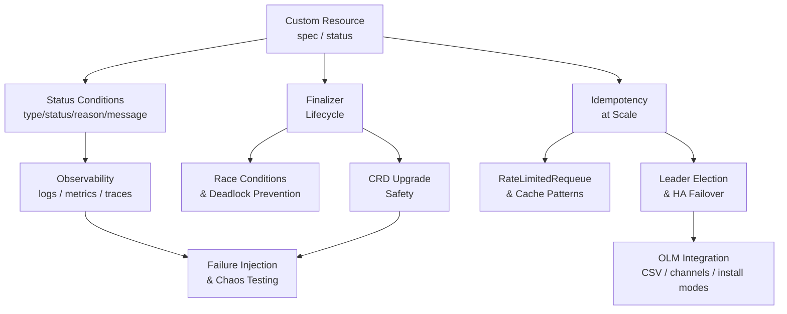

> **Complexity**: `[EXPERT]`
>
> **Time to Complete**: ~120 minutes
>
> **Prerequisites**: [Module 7.12: Ansible Operator SDK Fundamentals](../module-7.12-ansible-operator-sdk/) and Module 7.13: Advanced `watches.yaml` Patterns. You should be comfortable building and deploying an Ansible Operator, writing roles with `kubernetes.core.k8s`, and reading operator logs to diagnose reconciliation failures. Familiarity with Go controller concepts such as leader election and controller-runtime Manager is helpful but not required to complete the lab.

---

## Learner Check

Before continuing, confirm you can answer these questions from Module 7.12 without hesitation. If any feel unfamiliar, revisit that module before proceeding.

- What does `manageStatus: false` in `watches.yaml` tell the Ansible Operator to do differently from the default behavior?
- Why must every task in a reconciliation role be idempotent rather than run-once?
- What is the difference between CR `.spec` and CR `.status`, and which party owns each field?
- What happens to in-cluster child objects when a CR is deleted and no finalizer is in place?

If those are solid, continue. If not, Module 7.12 is a prerequisite, not background reading.

## Concept Map

The patterns in this module form an interconnected system. Status conditions feed observability alerting rules. Finalizer safety depends on correct leader election behavior during cleanup. Idempotency at scale informs both OLM upgrade safety and how the operator handles CRD version migrations. Failure injection tests the whole stack under realistic production conditions. Understanding these relationships as a system rather than as isolated techniques helps teams adopt these patterns incrementally, addressing the most critical dependencies — status correctness and finalizer safety — before tackling the more complex concerns of scale and upgrade safety.



## What You'll Be Able to Do

After completing this module, you will be able to:

- **Implement** a production-grade status conditions block on a custom resource that follows the Kubernetes API Conditions convention, distinguishing between a `status.conditions` array and scalar status fields, and preserving `lastTransitionTime` semantics correctly.
- **Diagnose** and resolve finalizer race conditions including interrupted reconciles, cross-CR ordering deadlocks, and the phantom-deletion pattern where cleanup runs succeed but the finalizer is never removed.
- **Design** an idempotency strategy for an Ansible Operator managing thousands of custom resource instances, applying `maxConcurrentReconciles`, `RateLimitedRequeue`, and early-exit patterns to bound API server load.
- **Configure** CRD upgrade paths and OLM bundle manifests for production operator releases, distinguishing when a conversion webhook is required from when backwards-compatible role field fallbacks suffice, and applying `Manual` approval channels for change-controlled environments.
- **Instrument** an Ansible Operator with structured JSON logs, controller-runtime Prometheus metrics, and OpenTelemetry span propagation, then verify reconciliation correctness by injecting controlled failures under leader loss, queue bursts, and task-level errors.

## Why This Module Matters

Hypothetical scenario: a platform team ships their first Ansible Operator into a staging cluster. It works for a week. Then the cluster grows. A hundred `DemoApp` resources become a thousand, then ten thousand. The controller begins requeuing slowly. Status fields stop updating consistently. A schema upgrade changes a field name and three hundred resources get stuck in an unknown state because the role references a field that no longer exists under the old path. A leader pod restarts during a bulk deletion run, and forty resources end up with stale finalizers that block their namespaces from terminating. The on-call engineer opens the operator documentation hoping to find guidance for these failure modes. They find a quickstart tutorial instead.

This module is the production runbook that does not exist in the official documentation. Every topic here corresponds to a category of real production incidents that Ansible Operators hit after the happy-path demos are over. Status conditions, finalizer safety, idempotency at scale, and upgrade safety are not exotic edge cases: they are the normal costs of running Kubernetes controllers on shared infrastructure, and they require deliberate design rather than retrofitted patches. An operator that does not address these properties early will pay a much higher price to fix them later, after users are depending on the API contract and changing semantics requires deprecation cycles.

The module assumes you have built and deployed an Ansible Operator through Module 7.12 and know the core architecture: `watches.yaml`, an Ansible role, `kubernetes.core.k8s`, a status update. What changes here is the operating environment — more instances, more concurrent reconciles, more opportunities for partial failure, and a requirement for a clear story about what happens when the operator process itself is upgraded, loses leadership, or encounters custom resources whose schema has drifted. This module provides that story in concrete terms with runnable examples. The Decision Framework section near the end distills the most common architectural forks into a structured checklist that can be applied during the operator's design phase rather than discovered under production pressure.

## Status Conditions vs. Status Fields

Every Kubernetes API has two kinds of status data, and confusing them is one of the most common quality gaps in first-generation operators. The first kind is a scalar field: `status.phase`, `status.endpoint`, `status.readyReplicas`. These fields are appropriate for simple, current-state summaries that a human or a quick dashboard can read at a glance. They answer "what is happening right now" and work well when there is only one concurrent observation to report. The second kind is a structured Conditions array, and it is the idiomatic Kubernetes mechanism for communicating multiple concurrent observations about an object's state, each with its own lifecycle, machine-parseable reason code, and timestamp.

The Conditions array convention is documented in the Kubernetes API Conventions specification and used consistently throughout the core API: Deployments carry `Available`, `Progressing`, and `ReplicaFailure` conditions; Nodes carry `Ready`, `DiskPressure`, and `MemoryPressure`; Jobs carry `Complete` and `Failed`. Each entry in the array carries six fields: `type` (a string identifier such as `"Ready"` or `"ReconcileFailed"`), `status` (one of `"True"`, `"False"`, or `"Unknown"`), `reason` (a machine-readable PascalCase token such as `"DeploymentUnavailable"`), `message` (a human-readable explanation suitable for `kubectl get` output and runbook links), `lastTransitionTime` (the RFC3339 timestamp of when the condition's `status` field last changed, not when the condition was last observed), and optionally `observedGeneration` (an `int64` recording the `.metadata.generation` the controller observed when it set this condition, which lets consumers detect stale conditions after a spec change).

<!-- code-verified-against: https://raw.githubusercontent.com/kubernetes/apimachinery/master/pkg/apis/meta/v1/types.go (type Condition struct) and https://github.com/kubernetes/community/blob/master/contributors/devel/sig-architecture/api-conventions.md — no severity field exists; observedGeneration is the optional field -->

```text
status:
  conditions:
    - type: Ready
      status: "False"
      observedGeneration: 3        # optional: generation the controller observed
      reason: DeploymentUnavailable
      message: "Deployment demoapp-sample has 0/3 ready replicas"
      lastTransitionTime: "2026-05-15T09:32:11Z"
    - type: ReconcileFailed
      status: "False"
      reason: ""
      message: ""
      lastTransitionTime: "2026-05-15T09:28:04Z"
```

When does an Ansible Operator surface conditions properly versus swallow them? By default, `manageStatus: true` in `watches.yaml` causes the Ansible Operator to publish a generic `Running` condition after each successful role run and an `AnsibleFailed` condition on role failure. This is better than nothing, but it loses the domain semantics that make conditions useful for automation. An external alerting rule cannot fire on `AnsibleFailed` with reason `"TaskFailed"` and distinguish "deployment is unavailable" from "external API rate-limited" without parsing the freeform message string. A well-designed conditions block expresses that distinction in the `reason` field, enabling consuming controllers and alertmanager rules to respond programmatically without fragile string matching.

The correct approach is to set `manageStatus: false` and publish conditions explicitly with `operator_sdk.util.k8s_status`. The role should maintain the full conditions array rather than overwriting it on each reconcile, preserving conditions set by previous passes or by external controllers. Most critically, the `lastTransitionTime` field must only change when `status` changes — not on every reconcile. If you update `lastTransitionTime` on every run, monitoring systems cannot measure how long a condition has been in its current state, which makes SLO tracking and alerting for stuck resources unreliable.

```yaml
# roles/demoapp/tasks/update_conditions.yml
---
- name: Read current DemoApp conditions before updating
  kubernetes.core.k8s_info:
    api_version: app.example.com/v1
    kind: DemoApp
    name: "{{ ansible_operator_meta.name }}"
    namespace: "{{ ansible_operator_meta.namespace }}"
  register: current_cr

- name: Compute new Ready condition values
  ansible.builtin.set_fact:
    ready_replicas: "{{ (deployment_result.resources | first | default({}, true)).status.readyReplicas | default(0) | int }}"
    desired_replicas: "{{ demoapp_replicas | int }}"

- name: Determine whether Ready status is changing
  ansible.builtin.set_fact:
    new_ready_status: "{{ 'True' if ready_replicas | int == desired_replicas | int else 'False' }}"
    existing_ready_status: >-
      {{
        (current_cr.resources | first | default({}, true))
        .status.conditions
        | selectattr('type', 'equalto', 'Ready')
        | map(attribute='status')
        | first
        | default('Unknown')
      }}
    existing_ready_transition: >-
      {{
        (current_cr.resources | first | default({}, true))
        .status.conditions
        | selectattr('type', 'equalto', 'Ready')
        | map(attribute='lastTransitionTime')
        | first
        | default(ansible_date_time.iso8601)
      }}

- name: Publish Ready condition with correct lastTransitionTime
  operator_sdk.util.k8s_status:
    api_version: app.example.com/v1
    kind: DemoApp
    name: "{{ ansible_operator_meta.name }}"
    namespace: "{{ ansible_operator_meta.namespace }}"
    status:
      conditions:
        - type: Ready
          status: "{{ new_ready_status }}"
          observedGeneration: "{{ ansible_operator_meta.generation | default(0) | int }}"
          reason: "{{ 'DeploymentReady' if new_ready_status == 'True' else 'DeploymentUnavailable' }}"
          message: >-
            {{
              'All ' ~ desired_replicas ~ ' replicas are ready'
              if new_ready_status == 'True'
              else 'Deployment has ' ~ ready_replicas ~ '/' ~ desired_replicas ~ ' ready replicas'
            }}
          lastTransitionTime: >-
            {{
              existing_ready_transition
              if new_ready_status == existing_ready_status
              else ansible_date_time.iso8601
            }}
```

The `lastTransitionTime` logic reads the current condition value before deciding whether to update the timestamp. If the `status` field is unchanged (still `"True"` or still `"False"`), the existing timestamp is preserved. Only when `status` flips does the role write a fresh timestamp. This is verbose, but it keeps the timestamp semantically correct and prevents each reconcile from appearing as a fresh event to monitoring pipelines. Teams that find this pattern too noisy in Ansible often encapsulate it in a custom collection role or move condition management to a lightweight Go sidecar while keeping the main reconcile logic in Ansible.

Pause and predict: if `manageStatus: true` remains enabled but the role also calls `operator_sdk.util.k8s_status` directly, what is the likely outcome? The two status-management paths will race. Operator SDK's automatic update runs after the role completes and may overwrite the conditions your role published, replacing them with the generic Ansible metadata conditions. The fix is to choose one path consistently: either use automatic management for trivial operators or take full ownership with `manageStatus: false`.

## Finalizer Race Conditions and Safe Deletion

Finalizers are the mechanism Kubernetes provides for controllers to run cleanup logic before a resource is permanently removed. When a user runs `kubectl delete`, the API server sets `metadata.deletionTimestamp` rather than removing the object immediately. The object remains visible and watchable until every finalizer string is removed from `metadata.finalizers`. A controller that owns a finalizer is responsible for performing its cleanup work and then patching the finalizer away.

The failure modes with finalizers appear at two levels: the task level and the ordering level. At the task level, an interrupted reconcile during deletion is the most common source of permanently stuck resources. If an Ansible role removes an external resource and then crashes before removing the finalizer, the next reconciliation must detect that the external cleanup already happened and not attempt it again. This requires the role to inspect actual external state rather than assume that "finalizer still present means cleanup is needed." An idempotent cleanup role handles the "cleanup ran twice" case gracefully by treating a 404 from the external API as a success, not an error.

```yaml
# roles/demoapp_delete/tasks/main.yml
---
- name: Check whether external DNS record still exists before attempting removal
  ansible.builtin.uri:
    url: "https://dns-api.internal/records/{{ demoapp_name }}.example.com"
    method: GET
    status_code: [200, 404]
  register: dns_check
  failed_when: false

- name: Remove external DNS record only if it is still present
  ansible.builtin.uri:
    url: "https://dns-api.internal/records/{{ demoapp_name }}.example.com"
    method: DELETE
    status_code: [200, 204, 404]
  when: dns_check.status == 200
  register: dns_delete
  failed_when: "dns_delete.status not in [200, 204, 404]"

- name: Remove finalizer after confirming external cleanup is complete
  kubernetes.core.k8s:
    api_version: app.example.com/v1
    kind: DemoApp
    name: "{{ demoapp_name }}"
    namespace: "{{ demoapp_namespace }}"
    definition:
      metadata:
        finalizers: []
```

The ordering level is subtler. Deadlocks happen when two resource types have circular finalizer dependencies. Resource A holds a finalizer that waits for Resource B to finalize before the A finalizer is removed. Resource B holds a finalizer that waits for Resource A. This scenario is common in operators that manage parent-child relationships between custom resources: a `DatabaseCluster` CR manages `DatabaseInstance` CRs, and both have finalizers that reference the other. The deadlock prevention rule is to establish a strict ownership hierarchy and ensure that cleanup flows in only one direction — children finalize before parents, and parents never wait for a child to exist before removing their own finalizer.

The phantom deletion pattern is a variant where the controller crashes or loses leadership between removing the external resource and patching the finalizer away. The resource reappears in the reconcile queue on the next watch event. The deletion path runs again, the external resource check returns 404 (it was already removed in the previous partial run), and the finalizer is successfully patched away. This behavior is correct only when the deletion check is idempotent. A deletion role that treats a 404 as a hard error will loop forever on a resource that was partially cleaned up. Always handle absence explicitly with `failed_when: false` and an explicit `when` guard on the cleanup task.

<!-- code-verified-against: controller-runtime workqueue semantics — the per-key exclusion guarantee means only ONE worker processes a given CR key at a time; the race is sequential (interrupted then retried), not concurrent -->
A related hazard is the interrupted-reconcile sequence. controller-runtime's workqueue guarantees that a given CR key is processed by at most one worker at a time — two workers cannot simultaneously run the cleanup role for the same CR. The real danger arises when a single worker runs the cleanup role, successfully removes the external resource, and then crashes or loses the leader lease before removing the finalizer. On the next watch event the same CR re-enters the queue, a fresh worker picks it up, and the cleanup role runs again. Because the external resource was already deleted in the previous pass, the second run encounters a 404. This sequential re-execution is expected and correct, but only if the cleanup role treats 404 as a success rather than an error. Defence requires idempotent cleanup logic, graceful 404 handling in every delete task, and the understanding that the cleanup role may legitimately run more than once for the same CR across sequential reconcile passes.

```yaml
# watches.yaml with finalizer and deletion role wired
---
- version: v1
  group: app.example.com
  kind: DemoApp
  role: demoapp
  manageStatus: false
  maxConcurrentReconciles: 4
  reconcilePeriod: 10m
  finalizer:
    name: app.example.com/cleanup
    role: demoapp_delete
```

The `finalizer.name` and `finalizer.role` keys in `watches.yaml` instruct the Ansible Operator to run a separate role during deletion instead of branching on `deletionTimestamp` inside the main role. This clean separation means the delete path can be tested independently, and the main reconcile path never needs to inspect deletion state unless a specific feature requires shared logic between create and delete passes.

## Idempotency at Scale: Operators Managing Thousands of CRs

A single-instance development operator that behaves correctly on five CRs may fail in subtle ways on five thousand. The failure modes differ in kind, not just in degree. When scale increases, the reconcile queue grows faster than it drains, per-run Ansible startup overhead compounds, the Kubernetes API server receives proportionally more traffic from the operator, and resource contention between concurrent reconcile workers becomes a real operational concern. Each of these is a design problem, not an infrastructure problem. Adding more CPU to the controller Pod does not fix an operator that makes three unnecessary API calls per reconcile or runs a full role even when all child resources are already converged.

The first principle at scale is aggressive cache use. Controller-runtime's informer cache is a local, in-memory snapshot of Kubernetes objects that the manager has registered to watch. When an Ansible Operator calls `kubernetes.core.k8s_info`, it reads from the Kubernetes API server by default rather than the local cache. At small scale, this is imperceptible. At ten thousand CRs each reconciling every ten minutes, the accumulated API reads become a measurable load on the API server. The fix is to ensure that informer-backed resource types are declared as dependent watches in `watches.yaml` so controller-runtime subscribes to them, and then to understand when module calls will use the cache versus bypass it.

```yaml
# watches.yaml with dependent watches for cache registration
---
- version: v1
  group: app.example.com
  kind: DemoApp
  role: demoapp
  manageStatus: false
  watchDependentResources: true
  dependentWatches:
    - version: v1
      kind: ConfigMap
    - apiVersion: apps/v1
      kind: Deployment
```

The second principle is rate-limited requeue. Controller-runtime provides exponential backoff on reconcile errors via `RateLimitedRequeue`, which defers the next reconcile by an increasing interval rather than immediately requeuing on failure. Without rate limiting, a single misbehaving CR can monopolize the worker queue by continuously failing and requeuing. With rate limiting, transient failures back off progressively, and healthy CRs continue to reconcile in parallel. The Ansible Operator exposes per-run requeue control through the `ANSIBLE_OPERATOR_PLUGINS_RECONCILE_PERIOD` environment variable and through the `reconcilePeriod` field in `watches.yaml`.

```yaml
# config/manager/manager.yaml excerpt — concurrency and requeue tuning
apiVersion: apps/v1
kind: Deployment
metadata:
  name: demoapp-operator-controller-manager
spec:
  template:
    spec:
      containers:
        - name: manager
          env:
            - name: ANSIBLE_OPERATOR_PLUGINS_MAX_CONCURRENT_RECONCILES
              value: "8"
            - name: ANSIBLE_OPERATOR_PLUGINS_RECONCILE_PERIOD
              value: "600s"
            - name: ANSIBLE_OPERATOR_PLUGINS_VERBOSITY
              value: "1"
```

The third principle is deduplication of work through early-exit. At scale, many CRs in similar states will trigger reconciles simultaneously — for example, after a cluster upgrade that generates watch events for all managed Deployments at once. Without an early-exit check, the worker queue fills with thousands of identical reconcile requests for objects whose state has not actually changed. The controller-runtime client automatically coalesces multiple events for the same object into a single queue entry, but only when those events arrive before the current entry is processed. When they arrive after, they still produce separate queue entries. Designing the reconcile role to return immediately for already-converged resources is the most effective way to bound CPU and API load under burst conditions.

```yaml
# Early-exit pattern: read observed state before deciding to write
- name: Read current Deployment to check whether reconcile is needed
  kubernetes.core.k8s_info:
    api_version: apps/v1
    kind: Deployment
    name: "{{ demoapp_name }}"
    namespace: "{{ demoapp_namespace }}"
  register: existing_deployment

- name: Skip remaining tasks if Deployment already matches desired state
  ansible.builtin.meta: end_play
  when:
    - existing_deployment.resources | length == 1
    - (existing_deployment.resources | first).spec.replicas | int == demoapp_replicas | int
    - (existing_deployment.resources | first).spec.template.spec.containers[0].image == demoapp_image
    - (existing_deployment.resources | first).status.readyReplicas | default(0) | int == demoapp_replicas | int
```

Cache invalidation at scale requires special attention when the operator manages external resources that do not produce Kubernetes events. An operator that creates a cloud load balancer for each CR cannot rely on watch events from the load balancer to trigger reconciles when external state drifts. Periodic reconciliation via `reconcilePeriod` fills this gap, but the period must be long enough that it does not flood the queue under normal operation. A useful guideline is to set `reconcilePeriod` to at least twice the expected maximum latency for external state changes to propagate, then add per-CR exponential backoff for resources that are actively failing reconciles.

The `maxConcurrentReconciles` setting controls how many `ansible-runner` processes execute in parallel. The optimal value depends on the controller Pod's CPU and memory limits, the cost of each role run (network calls, collection loading, Ansible startup time), and the rate of incoming events. Setting this too low serializes reconciles and creates queue backpressure at scale. Setting it too high creates CPU contention between workers and may cause API server throttling. A practical starting point for most operators is four to eight concurrent reconciles, measured under realistic load before deploying to production and adjusted based on observed queue depth and error rates.

Pause and predict: if you set `maxConcurrentReconciles: 100` for an operator managing 10,000 CRs that all need reconciliation after a cluster upgrade, what is likely to happen to the Kubernetes API server? One hundred simultaneous `ansible-runner` processes, each making several `k8s` and `k8s_info` calls, will generate a burst of hundreds of API requests per second from a single operator Pod. Most production API servers have admission rate limits that begin throttling the operator, causing reconcile failures that themselves trigger requeue events, amplifying the burst further. The correct response is a lower `maxConcurrentReconciles` combined with a jitter mechanism to spread the reconcile load after burst-inducing events.

## Upgrade Safety: CRD Schema Migrations

The CRD is a published API contract. Once users have created instances of a custom resource, the storage schema must be managed with the same care as a database migration. Unlike a database where you control both the schema and the queries, a CRD schema is read by multiple actors simultaneously: the API server validates new writes against it, existing stored objects in etcd may have been written against an older schema, and operator roles consume field values whose structure depends on when the CR was originally created.

The storage version mechanism is Kubernetes's solution to multi-version CRDs. A CRD can declare multiple served versions (for example `v1alpha1` and `v1`) but only one version has `storage: true`. All new writes go to the storage version. Older objects in etcd remain in their original format unless explicitly migrated. The API server can transparently serve older objects under a new version as long as conversion logic is in place — either through CRD defaulting and pruning for simple additions and removals, or through a conversion webhook for structural changes such as field renames, type changes, or reorganized nested objects.

```yaml
# CRD with two served versions and conversion webhook registered
apiVersion: apiextensions.k8s.io/v1
kind: CustomResourceDefinition
metadata:
  name: demoapps.app.example.com
spec:
  group: app.example.com
  names:
    kind: DemoApp
    plural: demoapps
  scope: Namespaced
  conversion:
    strategy: Webhook
    webhook:
      conversionReviewVersions: ["v1"]
      clientConfig:
        service:
          namespace: demoapp-operator-system
          name: demoapp-operator-webhook-service
          path: /convert
  versions:
    - name: v1alpha1
      served: true
      storage: false
      schema:
        openAPIV3Schema:
          type: object
          properties:
            spec:
              type: object
              properties:
                replicaCount:
                  type: integer
                  description: "Deprecated: use replicas"
    - name: v1
      served: true
      storage: true
      schema:
        openAPIV3Schema:
          type: object
          properties:
            spec:
              type: object
              properties:
                replicas:
                  type: integer
                  minimum: 1
                  maximum: 10
                  default: 1
```

When a conversion webhook is not in place, backwards-compatible schema changes are the only safe option. Backwards-compatible changes include adding new optional fields with defaults, adding new enum values, and relaxing minimum or maximum constraints. Backwards-incompatible changes include removing fields, renaming fields, changing field types, and tightening constraints. If the Ansible role references a field that was renamed between schema versions, it will fail silently on old CRs where the field is stored under the original name. The runtime effect is that role runs appear to succeed (because the field has a schema default) but write incorrect observed state, which may go undetected until a user notices that their configuration values are being ignored.

The safe upgrade pattern for Ansible Operators without a conversion webhook is to add the new field with appropriate defaults for one release cycle, update the role to read both the old and new field names using Ansible's fallback filter, then remove the old field in a follow-up release after all stored objects have been migrated or recreated. This is more conservative than schema-driven conversion, but it means the Ansible role handles mixed-version CRs in the queue without requiring a webhook that must be available before the CRD upgrade is applied.

```yaml
# Role handling old and new field names during a migration window
- name: Resolve replica count from either v1alpha1 or v1 schema
  ansible.builtin.set_fact:
    demoapp_replicas: >-
      {{
        replicas
        | default(replica_count | default(1))
        | int
      }}
```

The operator upgrade itself carries a separate risk. If the new operator version starts reconciling CRs before the CRD schema migration is applied, it may write status fields or child resources that conflict with what the old operator expects to observe. The recommended pattern is to apply CRD updates before deploying the new operator image, and to gate the new operator's rollout on a readiness probe that queries the CRD version from the API server. OLM handles this dependency ordering automatically for operators distributed through it. Standalone kustomize deployments require a deliberate apply sequence that the deployment runbook must document and enforce.

## Leader Election and High Availability

An Ansible Operator running in a production cluster typically deploys multiple replicas for availability. Kubernetes cannot allow two controller replicas to act as the primary reconciler simultaneously without coordination, because two workers writing to the same set of child resources would create conflicting patches. The controller-runtime Manager solves this with leader election backed by the Kubernetes `coordination.k8s.io/v1` Lease API: one pod holds the lease and performs reconciles, while the others are active but idle, watching the lease and ready to acquire it if the holder fails to renew.

Operator SDK wires leader election automatically when `--leader-elect=true` is passed to the manager binary. The lease is stored as a `Lease` object in the same namespace as the operator, named after the operator's `leader-election-id` argument. The holder renews the lease on a schedule derived from `leaseDuration` and `renewDeadline`. If the holder fails to renew within `renewDeadline`, the lease expires and any of the waiting pods can claim it. The default values in controller-runtime are `leaseDuration: 15s`, `renewDeadline: 10s`, `retryPeriod: 2s`, which means a failed leader will be replaced within approximately 15 seconds under normal network conditions.

What happens to a reconcile that is in progress when the leader loses its lease? The outgoing leader's manager receives a context cancellation signal. `ansible-runner` processes that are already executing are not immediately killed; they continue until they complete or until the manager's `terminationGracePeriodSeconds` elapses. If the Ansible role completes before the timeout, it will attempt to patch CR status and remove finalizers. Those API calls use optimistic concurrency via `resourceVersion`, so if the new leader has already patched the same fields, the outgoing leader's write will fail with a conflict error rather than silently overwriting the new leader's work. This is the correct behavior: the conflict error is logged, the resource is requeued, and the new leader reconciles it on the next pass.

```yaml
# config/manager/manager.yaml with HA and leader election settings
apiVersion: apps/v1
kind: Deployment
metadata:
  name: demoapp-operator-controller-manager
spec:
  replicas: 2
  template:
    spec:
      terminationGracePeriodSeconds: 30
      containers:
        - name: manager
          args:
            - "--leader-elect=true"
            - "--leader-election-id=demoapp-operator"
            - "--zap-log-level=info"
            - "--zap-encoder=json"
          resources:
            limits:
              cpu: 500m
              memory: 256Mi
            requests:
              cpu: 100m
              memory: 64Mi
```

The `terminationGracePeriodSeconds` value must be long enough for in-flight Ansible runs to complete cleanly. If the reconcile role typically takes 8 seconds and the grace period is 5 seconds, role runs will be interrupted mid-execution on every leader transition, potentially leaving CRs in partial states that require a full reconcile pass by the new leader to repair. Set the grace period to at least three times the p99 reconcile duration measured under realistic load. For Ansible Operators, the p99 is higher than it appears because `ansible-runner` startup time, collection loading, and Kubernetes API round-trip latency each add to the base task execution time.

Leader loss during bulk operations requires additional care. If the operator is reconciling a thousand CRs in response to a cluster event and the leader transitions at reconcile number 500, the new leader will reconstruct the queue from the watch cache and start from scratch. The reconstruction is fast, but the new leader will produce a burst of reconcile activity on acquisition. Design the reconcile role to handle this burst gracefully: be idempotent, return quickly for already-converged resources using the early-exit pattern, and do not treat repeated reconciles of healthy CRs as errors or log-worthy events.

## OLM Integration: Bundle Manifests and Install Modes

The Operator Lifecycle Manager is the production distribution mechanism for Kubernetes operators on clusters where it is installed, including all OpenShift deployments and any cluster where the OLM open-source project has been set up. OLM handles operator installation, upgrade orchestration, CRD dependency resolution, and namespace tenancy through a layer of custom resources. Publishing an operator through OLM means packaging it as a bundle, pushing that bundle image to a registry, building an index image that catalogs the bundle, and registering the index with OLM via a `CatalogSource`. Users install the operator by creating a `Subscription` resource that declares which channel and approval policy to follow.

The central artifact is the `ClusterServiceVersion` (CSV). A CSV is a structured YAML document that describes everything the operator needs: the Deployment template, ServiceAccounts, RBAC rules, CRDs it owns and depends on, install modes, human-readable description, upgrade graph, and the metadata that OperatorHub uses to render the operator listing. OLM uses the CSV to apply all Kubernetes resources in dependency order, replacing the manual `kubectl apply` sequences used in non-OLM deployments.

```yaml
# config/manifests/bases/demoapp-operator.clusterserviceversion.yaml (excerpt)
apiVersion: operators.coreos.com/v1alpha1
kind: ClusterServiceVersion
metadata:
  name: demoapp-operator.v1.0.0
  namespace: placeholder
  annotations:
    operators.operatorframework.io/builder: operator-sdk-v1.39.0
    operators.operatorframework.io/project_layout: ansible.sdk.operatorframework.io/v1
spec:
  displayName: DemoApp Operator
  description: |
    Manages DemoApp custom resources by reconciling Ansible roles
    that create Deployments and Services for application teams.
  version: 1.0.0
  replaces: demoapp-operator.v0.9.0
  installModes:
    - type: OwnNamespace
      supported: true
    - type: SingleNamespace
      supported: true
    - type: MultiNamespace
      supported: false
    - type: AllNamespaces
      supported: true
  customresourcedefinitions:
    owned:
      - name: demoapps.app.example.com
        version: v1
        kind: DemoApp
        displayName: DemoApp
        description: A managed web application instance
  minKubeVersion: "1.28.0"
```

The four install modes define where the operator watches for custom resources. `OwnNamespace` means the operator only watches the namespace it is deployed into, which is the safest default for multi-tenant clusters because it limits blast radius if the operator has a bug. `SingleNamespace` allows the operator to be deployed into one namespace and watch a different, specified namespace, which is useful for dedicated operator namespaces that manage tenant workloads in separate namespaces. `MultiNamespace` requires watching a configurable list of namespaces and is rarely implemented because the RBAC and configuration complexity is substantial. `AllNamespaces` gives the operator cluster-wide visibility and is used for infrastructure-level operators that must respond to CRs in any tenant namespace, but it carries the broadest permission requirements and deserves the most careful RBAC review.

Channels organize the upgrade graph. A channel named `stable` might include a lineage of versions each declaring the previous in its `replaces` field. A channel named `candidate` carries pre-release builds. OLM's `Automatic` approval policy moves a `Subscription` to the latest channel head whenever OLM detects a new version. The `Manual` approval policy pauses upgrades and waits for a human to approve the generated `InstallPlan`, which is the appropriate default for production operators in change-controlled environments where a new operator version should not roll out to tenant workloads without review.

```bash
# Generate the OLM bundle from the operator project
operator-sdk generate bundle \
  --version 1.0.0 \
  --channels stable \
  --default-channel stable \
  --package demoapp-operator

# Validate the bundle against OperatorHub requirements before publishing
operator-sdk bundle validate ./bundle \
  --select-optional name=operatorhub

# Build and push the bundle image
docker build -f bundle.Dockerfile \
  -t quay.io/YOUR_NAMESPACE/demoapp-operator-bundle:v1.0.0 .
docker push quay.io/YOUR_NAMESPACE/demoapp-operator-bundle:v1.0.0
```

The bundle validation step is not optional. OLM enforces structural rules that `kubectl apply` does not check. A CSV with missing RBAC, a mismatched deployment name, or an incorrect install mode will fail at OLM install time with a cryptic error that is much harder to diagnose than a local validation failure. Run `operator-sdk bundle validate` with the `operatorhub` optional suite to catch issues that would prevent listing, and with `--select-optional suite=operatorframework` for production cluster compatibility checks. Treat every validation warning as an error before publishing to any shared catalog.

## Observability: Logs, Metrics, and Traces

An Ansible Operator that only emits raw Ansible task output is invisible to the SRE tooling that manages production clusters. Production observability for an operator requires three signal types: structured logs that correlate reconcile events to specific CR instances, Prometheus metrics that quantify controller behavior over time and trigger alerting rules, and distributed traces that connect Ansible task execution to parent API server requests for latency attribution.

Controller-runtime emits structured JSON logs when the manager is started with `--zap-log-level=info` and `--zap-encoder=json`. These logs include the controller name, the reconcile request's namespace and name, reconcile duration, and error details. Ansible Operator wraps these with Ansible task output, and the combined output can be difficult to parse without explicit format configuration. Passing `--zap-encoder=json` ensures that all log lines are machine-parseable and can be indexed by log aggregators such as Loki, Elasticsearch, or Splunk without custom parsing rules. Set the log level to `info` for production and `debug` only during active incident investigation, because debug logging from `ansible-runner` includes full task variable output that can leak sensitive values.

```yaml
# config/manager/manager.yaml — structured logging configuration
containers:
  - name: manager
    args:
      - "--zap-log-level=info"
      - "--zap-encoder=json"
      - "--zap-stacktrace-level=error"
    env:
      - name: ANSIBLE_OPERATOR_PLUGINS_VERBOSITY
        value: "1"
```

Controller-runtime automatically registers Prometheus metrics for reconcile operations and exposes them on the `/metrics` endpoint. The key metrics are `controller_runtime_reconcile_total` (labeled by controller name and result: `success`, `error`, `requeue`, or `requeue_after`), `controller_runtime_reconcile_errors_total`, and `controller_runtime_reconcile_time_seconds` (a histogram of reconcile durations). These metrics require a `ServiceMonitor` or `PodMonitor` resource if the cluster runs the Prometheus Operator, or manual scrape configuration if Prometheus is managed directly. The most actionable alerting rule is on the reconcile error rate: if `controller_runtime_reconcile_errors_total` for a given controller exceeds a threshold over a five-minute window, a human should investigate, because that rate indicates the operator is repeatedly failing to converge resources for reasons it cannot handle automatically.

```yaml
# config/prometheus/monitor.yaml — ServiceMonitor for controller metrics
apiVersion: monitoring.coreos.com/v1
kind: ServiceMonitor
metadata:
  labels:
    control-plane: controller-manager
  name: demoapp-operator-metrics-monitor
  namespace: demoapp-operator-system
spec:
  endpoints:
    - path: /metrics
      port: https
      scheme: https
      bearerTokenFile: /var/run/secrets/kubernetes.io/serviceaccount/token
      tlsConfig:
        insecureSkipVerify: true
  selector:
    matchLabels:
      control-plane: controller-manager
```

OpenTelemetry tracing from Ansible runs is achieved by configuring an OTEL exporter through Ansible's `callback_plugins` mechanism. A callback plugin receives events from every task execution and can emit span data tagged with the CR name, namespace, role name, and task result. This allows distributed tracing systems to show which Ansible tasks contribute to reconcile latency and how often they breach latency thresholds. The spans can be correlated with controller-runtime trace IDs if the OTEL context is propagated from the manager process to the `ansible-runner` subprocess through environment variables.

```python
# callback_plugins/otel_trace.py (structure only — fill in your OTEL SDK init)
from ansible.plugins.callback import CallbackBase

class CallbackModule(CallbackBase):
    CALLBACK_NAME = 'otel_trace'
    CALLBACK_TYPE = 'aggregate'
    CALLBACK_NEEDS_ENABLED = True

    def v2_runner_on_ok(self, result):
        task_name = result.task_name
        cr_name = result._task_vars.get('ansible_operator_meta', {}).get('name', 'unknown')
        cr_namespace = result._task_vars.get('ansible_operator_meta', {}).get('namespace', 'unknown')
        changed = result._result.get('changed', False)
        # Emit span: task_name, cr_name, cr_namespace, changed
        # Use your OTEL SDK tracer here

    def v2_runner_on_failed(self, result, ignore_errors=False):
        # Emit error span with exception details
        pass
```

Connecting the three signals — logs, metrics, and traces — in a shared dashboard gives operators a complete picture of controller health. A spike in `controller_runtime_reconcile_errors_total` can be correlated with specific CR names from structured logs and with slow Ansible tasks from trace data, reducing mean time to diagnose from hours to minutes. Build this observability stack before the first production incident, not during it.

## Failure Injection and Chaos Testing

Testing an operator under normal conditions proves that the happy path works. Testing under failure conditions proves that the operator is safe to run in production, where partial failures, leader transitions, and external dependency outages are not exceptional but routine. Unlike stateless application deployments, Ansible Operators maintain reconcile state across partial failures, which means the consequences of an interrupted reconcile cycle can persist until the next successful pass explicitly repairs the diverged state. The discipline of failure injection for operators borrows from chaos engineering but applies it at the controller level rather than at the infrastructure level, targeting the specific failure modes that Ansible Operators are most likely to encounter.

The five most useful failure scenarios for Ansible Operators are: reconcile task failure mid-run, leader transition during active reconciles, API server rate throttling, external dependency outage, and CRD version mismatch. Each should be testable in a kind cluster before the operator is deployed to any shared environment. The test harness does not need to be elaborate: a combination of Kuttl for cluster-level assertions, targeted pod deletion or network policy injection for chaos, and the operator's own metrics for measuring recovery completeness is sufficient for most teams.

```bash
# Inject a leader transition by deleting the leader pod with minimal grace period
LEADER_POD=$(kubectl get lease demoapp-operator \
  -n demoapp-operator-system \
  -o jsonpath='{.spec.holderIdentity}' | cut -d_ -f1)

echo "Deleting current leader: ${LEADER_POD}"
kubectl delete pod "${LEADER_POD}" -n demoapp-operator-system --grace-period=5

# Watch the lease transition to the new holder
kubectl get lease demoapp-operator -n demoapp-operator-system -w
```

```bash
# Verify all CRs recover to Ready status after the leader transition
kubectl get demoapps.app.example.com --all-namespaces \
  -o jsonpath="{range .items[*]}{.metadata.namespace}/{.metadata.name}: {.status.phase}{'\n'}{end}" \
  | grep -v "Ready" | wc -l
```

API throttling can be simulated by adding a NetworkPolicy that rate-limits egress from the operator Pod to the API server's port, or by deploying a mock API server that returns `429 Too Many Requests` responses for a configured percentage of requests. The goal is to verify that the operator's retry logic in `kubernetes.core.k8s` handles throttled responses by backing off rather than crashing, and that the reconcile error rate in metrics rises and then recovers as the mock throttle is removed.

For CRD version mismatch testing, deploy an older version of the CRD schema, create a batch of CRs under that schema, then upgrade the CRD to the newer schema without running a data migration. Observe what happens when the operator role runs against the old CRs. This exercise reveals whether the role's field-access code handles missing or renamed fields gracefully with fallback defaults, or whether it fails loudly with an undefined variable error that produces a flood of reconcile errors in the metrics. Running this test before every schema change is a low-cost way to catch field compatibility issues that would otherwise surface only in production.

The Molecule testing framework supports scenario-based testing for Ansible Operator roles. A Molecule scenario can provision a kind cluster, apply the CRD and operator, create test CRs in various states, inject a failure condition such as a deliberately missing Service, run a reconcile pass, and assert the expected recovery behavior using Kubernetes resource assertions. Molecule tests are slower than role unit tests but they prove integration correctness and are the closest available analog to a controlled production failure drill in a reproducible environment.

## Patterns and Anti-Patterns

| Pattern | When to Use | Why It Works |
|---|---|---|
| Conditions array with machine-readable `reason` codes | Any operator going to production | Enables alertmanager rules and consuming controllers to respond to specific conditions without parsing message strings |
| Separate `finalizer.role` for deletion logic | Operators managing any external resources | Isolates deletion path for independent testing; prevents deletion logic from contaminating the create/update path |
| Early-exit on already-converged state | Operators managing more than 100 CRs | Reduces API write traffic and Ansible overhead for the common "nothing changed" case |
| `maxConcurrentReconciles` tuned under realistic load | All operators before production | Prevents queue serialization at scale without triggering API server throttling |
| OLM bundle with `Manual` upgrade approval | Production cluster deployments | Adds a change-control gate before new operator versions reach tenant workloads |
| `--zap-encoder=json` on the manager binary | All operators in shared clusters | Makes reconcile events queryable by Loki and Elasticsearch without custom log parsing |

| Anti-Pattern | Why It Happens | Better Approach |
|---|---|---|
| Overwriting `lastTransitionTime` on every reconcile | Simpler to write; avoids the read-before-write pattern | Read current condition status first; update `lastTransitionTime` only when `status` changes from one value to another |
| Circular finalizer dependencies between two CR types | Parent-child relationships invite mutual cleanup guards | Establish a strict ownership hierarchy; children always finalize before parents; parents never wait on children |
| Setting `reconcilePeriod: 30s` for "safety" | Assumption that frequent checks prevent drift | Use dependent watches for child resources; keep period at 10m or longer; rely on watch events for prompt reactions |
| Not setting `maxConcurrentReconciles` before scaling beyond 200 CRs | Default of 1 feels safe; nobody revisits defaults | Profile queue depth under realistic load at 50 CRs and set concurrency based on measured API throughput budget |
| Skipping `operator-sdk bundle validate` before publishing | Build succeeds; warnings seem cosmetic | OperatorHub rejects bundles with schema warnings; all validate output should be treated as errors before publishing |
| Using `wait: true` in `kubernetes.core.k8s` without a meaningful timeout | Module default of 120s seems conservative | A 120s block starves other reconciles; set timeout proportional to your SLO and handle `failed` results with rescue blocks |
| Assuming a "minor" field rename needs no conversion strategy | Rename feels like a backwards-compatible change | Any field name change breaks old CRs unless the role accepts both names; use `x-kubernetes-validations` or a conversion webhook |
| Treating absence of external resource as an error in the cleanup role | Simpler control flow; fail fast feels correct | A 404 during deletion means the resource is already gone; that is the success case; use `failed_when: false` with explicit absence handling |

## Decision Framework

A production Ansible Operator faces multiple architectural forks. This framework maps the most common decisions to the considerations that should drive them.

```
Does this operator create external resources (cloud APIs, DNS, databases)?
    YES → Finalizers are mandatory before shipping.
          Design the deletion role before writing the create role.
    NO  → Owner references plus Kubernetes garbage collection are sufficient.

Does the operator manage more than 50 CRs per cluster?
    YES → Profile reconcile duration; set maxConcurrentReconciles;
          add early-exit for already-converged resources.
    NO  → SDK defaults are adequate; revisit at 200+ CRs.

Will the CRD schema change in the next release cycle?
    YES (additive only) → Add new optional fields with defaults; update role to
                          accept both old and new field names for one release cycle.
    YES (rename/restructure) → Write conversion webhook or migration job before shipping.
    NO  → Standard CRD validation is sufficient.

Does the cluster run OLM?
    YES → Publish as a bundle with CSV; use Manual upgrade approval for production.
    NO  → Kustomize deploy with explicit CRD apply before operator rollout.

Is reconcile observability required for SLO tracking?
    YES → ServiceMonitor for metrics, --zap-encoder=json for logs,
          OTEL callback plugin for traces.
    NO  → Default controller-runtime metrics are available but not scraped
          without a ServiceMonitor; add one before SLOs are attached.
```

## Did You Know?

- The Kubernetes API Conventions specification states that `lastTransitionTime` on a condition must record when the condition's `status` field changed, not when it was last observed. Controllers that update this timestamp on every reconcile break tools such as `kubectl wait --for=condition=Ready` which use the timestamp to determine how long a condition has been in a given state, and they mislead alerting rules that compute staleness duration.

- Controller-runtime uses the Kubernetes `coordination.k8s.io/v1` Lease API for leader election rather than ConfigMap-based locking, which was deprecated in Kubernetes 1.13. The lease is named after the `--leader-election-id` argument. Two operators deployed in the same namespace with the same `leader-election-id` will compete for the same lease, causing one to remain permanently idle, which is a subtle misconfiguration that produces no obvious error but halves effective controller capacity.

- The OLM `ClusterServiceVersion` includes a `minKubeVersion` field that OLM enforces before installing the operator. Setting this to at least `1.28.0` prevents installation on clusters that lack the CRD features that modern Ansible Operators depend on, such as CEL-based validation rules and structured server-side apply semantics. Most clusters running OLM are on supported versions, but the field protects against misconfigured pre-production environments.

- The `operator_sdk.util.k8s_status` module writes to the `status` subresource endpoint (`/apis/app.example.com/v1/namespaces/{ns}/demoapps/{name}/status`) rather than the main object endpoint. This means the operator service account needs `update` permission on `demoapps/status` specifically. A ClusterRole that grants full `demoapps` access but omits `demoapps/status` will allow the main reconcile to succeed while silently failing every status update, producing a controller that creates correct child resources but never reports whether they are ready.

## Common Mistakes

| Mistake | Why It Happens | How to Fix It |
|---|---|---|
| Writing `lastTransitionTime: "{{ ansible_date_time.iso8601 }}"` unconditionally | Easier to write; avoids a read-before-write task | Read current condition status first; only update `lastTransitionTime` when `status` transitions between `True`, `False`, and `Unknown` |
| Embedding deletion logic in the main role with `when: demoapp_deleting` | Seems like fewer files to manage | Move deletion to a separate role via `finalizer.role` in `watches.yaml`; test it independently with a dedicated Molecule scenario |
| Omitting `demoapps/status` from the ClusterRole | Granting `demoapps` looks sufficient; subresource is easy to miss | Explicitly add `demoapps/status` and `demoapps/finalizers` as separate resources in the RBAC rules |
| Using the same `--leader-election-id` for two operators in one namespace | Copy-paste from an existing operator deployment template | Each operator must have a unique `leader-election-id` to avoid competing for the same Lease resource |
| Not profiling or tuning `maxConcurrentReconciles` before production | Default of 1 works fine at 10 CRs; nobody revisits defaults | Profile under realistic CR count and event rates; start at 4, measure API throughput and queue depth, adjust |
| Publishing an OLM bundle with `operator-sdk bundle validate` warnings | Build pipeline passes; warnings appear non-blocking | OperatorHub and many enterprise catalogs reject bundles with schema warnings; run `validate` with `--select-optional name=operatorhub` and treat all output as blocking |
| Setting `wait: true` without a bounded `wait_timeout` in `kubernetes.core.k8s` | Default seems conservative; explicit timeout feels like extra YAML | A 120s blocking call starves the worker for other CRs; set an explicit timeout matched to your p99 reconcile budget and add a `rescue` block for timeout failures |
| Treating 404 from an external API as an error in the deletion role | Fail-fast principle; absence seems like a problem | During deletion, 404 means the resource is already gone — that is the success state; use `failed_when: false` with `when: check.status == 200` on the delete task |

## Quiz

<details>
<summary>Your operator's status shows phase: Progressing for 20 minutes, but the Deployment has been fully ready for 18 of those minutes. Status fields are clearly being updated — you can see fresh timestamps on every reconcile. What is the most likely cause and how would you verify it?</summary>

The `lastTransitionTime` for the `Ready` condition is almost certainly being reset on every reconcile rather than being preserved from the previous state. The role is writing `ansible_date_time.iso8601` unconditionally instead of reading the current condition's `status` and only updating the timestamp when that status actually changes. Monitoring tools and `kubectl wait` compute condition age from `lastTransitionTime`, so a continuously-reset timestamp makes the condition appear perpetually fresh even though it has been `True` for 18 minutes. The `phase: Progressing` you observe in a separate scalar field suggests there is also a logic inconsistency between the two status representations — the conditions array says `Ready: True` while the scalar phase says `Progressing`. Verify by running `kubectl get demoapp <name> -o yaml` and comparing the conditions array against the scalar status fields, then check the role's condition-update task for the `lastTransitionTime` assignment.

</details>

<details>
<summary>A custom resource with finalizer `app.example.com/cleanup` has had `deletionTimestamp` set for 45 minutes. The resource is still present. Operator logs show no recent errors. What sequence of events should you investigate, and what commands would you run?</summary>

The most common explanation is that the cleanup role ran, handled the external resource (returning success on a 404), but never patched the finalizer away. This can happen if the role exits before reaching the finalizer-removal task due to a `failed_when` mismatch, or if the `kubernetes.core.k8s` task patching `finalizers: []` silently fails because the service account lacks `update` permission on `demoapps/finalizers`. Start by checking the operator service account's RBAC: run `kubectl auth can-i update demoapps/finalizers --as=system:serviceaccount:demoapp-operator-system:demoapp-operator-controller-manager -n <namespace>`. Then check whether the deletion role is being triggered at all by searching operator logs for the CR name around the `deletionTimestamp` time. Finally, verify that `watches.yaml` has a `finalizer.role` entry and that the deletion role includes the `kubernetes.core.k8s` task that patches `finalizers` to an empty list.

</details>

<details>
<summary>After upgrading the CRD from v1alpha1 (which used spec.replicaCount) to v1 (which uses spec.replicas), 200 existing CRs all report 1 replica regardless of their actual replicaCount values. Operator logs show no errors. What went wrong, and what is the fix?</summary>

The upgrade renamed the storage field without providing a conversion path. The 200 existing CRs in etcd still have `spec.replicaCount` stored under the v1alpha1 schema. When the API server serves them as v1, the old field does not exist in the v1 schema, so the API server omits it. The role receives `replicas` as undefined, falls back to the role's default of 1, and writes that value to the Deployment. No error appears because the default is valid — it is just wrong. The correct fix involves two parts. First, write a migration script or Job that reads each CR under v1alpha1, maps `replicaCount` to `replicas`, and patches each CR so the new value is stored in etcd. Second, add the backwards-compatible field-fallback pattern to the role for any deployment that cannot guarantee all CRs are migrated before the new operator version reaches them: use `replicas | default(replica_count | default(1)) | int`.

</details>

<details>
<summary>The operator runs with 2 replicas and leader election. During a rolling upgrade of the operator Deployment, users report that 12 CRs briefly show stale status. Status recovers within 90 seconds. A teammate calls this a bug that must be fixed. How would you evaluate that claim?</summary>

This behavior is expected during a rolling upgrade. When the leader pod is replaced, the new replica must win the Lease election and then process the reconcile queue for the CRs that were in flight. The 90-second recovery window is the sum of the lease expiry time, the new leader's startup and collection-loading time, and the first reconcile pass duration. Whether this constitutes a bug depends entirely on the operator's documented SLO for status freshness. If the SLO states that status must be current within 2 minutes, this behavior is compliant. If the SLO is 30 seconds, then the team needs to reduce `leaseDuration` and `renewDeadline`, reduce Ansible startup time, and verify that the reconcile role's happy-path duration is short enough to fit within the new constraints. The fix is not to add more replicas or to disable rolling upgrades, but to align the leader election timing, reconcile speed, and stated SLO with each other.

</details>

<details>
<summary>You are reviewing an OLM bundle for a new operator version. The CSV shows AllNamespaces install mode supported, and the operator role creates ServiceAccounts in the watched namespaces. What specific risks should you flag before approving the bundle?</summary>

Two distinct risks deserve explicit flags. First, `AllNamespaces` mode with ServiceAccount creation means the operator, when installed cluster-wide, will create ServiceAccounts in every namespace it watches. The ClusterRole must therefore permit ServiceAccount creation cluster-wide, which is a permission scope that escalates any operator compromise from namespace-local to cluster-wide. This should be reviewed against the cluster's least-privilege policy and documented in the CSV description so cluster administrators know what they are approving. Second, the accumulation of operator-created ServiceAccounts across potentially hundreds of tenant namespaces creates a cluster hygiene burden. If the deletion role does not clean them up, they persist after the managed CRs are deleted. Recommend restricting to `OwnNamespace` or `SingleNamespace` unless `AllNamespaces` is a hard product requirement, and if it is, require explicit ServiceAccount cleanup in the deletion role with a Molecule scenario that verifies it.

</details>

<details>
<summary>Your operator manages 8,000 DemoApp CRs with maxConcurrentReconciles set to 20. After a cluster version upgrade, all 8,000 CRs are requeued simultaneously. What do you expect to observe, and what changes would you make before the next planned upgrade?</summary>

With 8,000 CRs queued and 20 concurrent workers, and assuming each reconcile takes approximately 4 seconds, the queue drains at roughly 5 reconciles per second. Full queue drain takes over 26 minutes. During that window, CRs near the end of the queue have stale status, and the operator's status-update metric will show a sustained burst of activity that may look like an incident to any SLO alerts configured on status freshness. The API server will receive 20 simultaneous Ansible-runner processes each making several calls. Before the next upgrade, three changes are worth making: first, add a small random `requeue_after` value to spread the initial burst across the first few minutes instead of hitting the queue simultaneously; second, increase `maxConcurrentReconciles` from 20 to 40 after profiling that the API server can handle the increased throughput; third, add a Prometheus alert on `controller_runtime_reconcile_queue_length` so the team is notified when the queue grows unusually long and can distinguish a planned upgrade burst from an unexpected problem.

</details>

## Hands-On Lab: Leader Election Behavior and Reconciliation Latency Under Load

This lab deploys the DemoApp operator from Module 7.12 with a two-replica high-availability configuration, creates 100 custom resource instances to generate queue load, observes reconciliation throughput, and then injects a leader transition to measure recovery behavior. The lab requires kind, Docker, and the DemoApp operator project from Module 7.12.

### Prerequisites

Start with the DemoApp operator project from Module 7.12. This lab adds HA configuration and a load-generation step on top of the base operator from that module.

```bash
kind create cluster --name operator-ha-lab --config - <<'EOF'
kind: Cluster
apiVersion: kind.x-k8s.io/v1alpha4
nodes:
  - role: control-plane
  - role: worker
  - role: worker
EOF

kubectl cluster-info --context kind-operator-ha-lab
```

### Task 1: Enable Leader Election and Two-Replica Deployment

Edit `config/manager/manager.yaml` to set `replicas: 2` and add `--leader-elect=true` to the manager args. Also extend `terminationGracePeriodSeconds` to 30 to give in-flight reconciles time to complete on leader transitions.

```yaml
# config/manager/manager.yaml (key changes)
spec:
  replicas: 2
  template:
    spec:
      terminationGracePeriodSeconds: 30
      containers:
        - name: manager
          args:
            - "--leader-elect=true"
            - "--leader-election-id=demoapp-operator"
            - "--zap-log-level=info"
            - "--zap-encoder=json"
          env:
            - name: ANSIBLE_OPERATOR_PLUGINS_MAX_CONCURRENT_RECONCILES
              value: "4"
```

Build and deploy.

```bash
export IMG="demoapp-operator:v0.2.0-ha"
make docker-build IMG="${IMG}"
kind load docker-image "${IMG}" --name operator-ha-lab
make deploy IMG="${IMG}"

kubectl rollout status deployment/demoapp-operator-controller-manager \
  -n demoapp-operator-system --timeout=120s
kubectl get pods -n demoapp-operator-system
```

<details>
<summary>Solution guidance for Task 1</summary>

You should see two `Running` pods in `demoapp-operator-system`. If only one appears, check whether a kustomize overlay in `config/default/kustomization.yaml` has a replicas patch that overrides your manager.yaml change. Verify the actual replica count with `kubectl get deployment demoapp-operator-controller-manager -n demoapp-operator-system -o jsonpath='{.spec.replicas}'`. If leader election is not enabled, both pods will attempt to reconcile simultaneously, which will produce conflict errors in the logs rather than clean primary/standby behavior.

</details>

### Task 2: Observe the Leader Lease

Identify which pod holds the leader lease and record the lease metadata before the next task.

```bash
kubectl get lease -n demoapp-operator-system
kubectl get lease demoapp-operator \
  -n demoapp-operator-system \
  -o jsonpath='{.spec.holderIdentity}{"\n"}'
```

Note the holder pod name and the `spec.acquireTime` value. You will compare these after the leader transition in Task 4.

<details>
<summary>Solution guidance for Task 2</summary>

If no lease exists, leader election is not functioning. Verify that `--leader-elect=true` is in the manager args and that the operator service account has permission to create and update `coordination.k8s.io/v1` Lease objects. The generated `config/rbac/leader_election_role.yaml` should include these rules. Confirm they are applied with `kubectl get role demoapp-operator-leader-election-role -n demoapp-operator-system -o yaml`.

</details>

### Task 3: Create 100 DemoApp Resources and Measure Queue Drain Time

Create a load-test namespace and generate 100 DemoApp manifests using a Python one-liner. Record the time before and after applying all CRs.

```bash
kubectl create namespace demoapp-load-test

python3 -c "
for i in range(1, 101):
    print(f'''apiVersion: app.example.com/v1
kind: DemoApp
metadata:
  name: demoapp-load-{i:03d}
  namespace: demoapp-load-test
spec:
  replicas: 1
  image: nginx:1.27-alpine
  port: 80
---''')
" > /tmp/demoapp-100.yaml

time kubectl apply -f /tmp/demoapp-100.yaml
```

Monitor how quickly resources transition to `Ready` status.

```bash
watch -n 5 'kubectl get demoapps.app.example.com -n demoapp-load-test \
  -o jsonpath="{range .items[*]}{.status.phase}{\"\\n\"}{end}" \
  | sort | uniq -c'
```

Record the total time from first apply to last `Ready` phase. You will compare this after Task 5.

<details>
<summary>Solution guidance for Task 3</summary>

With `maxConcurrentReconciles: 4` and assuming each reconcile takes 3-6 seconds including Ansible startup, you should observe the 100 CRs drain over approximately 1.5-3 minutes. If all 100 show `Ready` near-simultaneously, your actual concurrency may be higher than the configured value — check whether the environment variable setting took effect in the deployed Pod. The `uniq -c` output lets you track how many CRs remain in each phase over time.

</details>

### Task 4: Inject a Leader Transition and Observe Recovery

Delete the leader pod while some CRs are still reconciling, or delete it after Task 3 completes to observe a clean recovery cycle. Use `grace-period=5` to simulate an abrupt failure rather than a graceful shutdown.

```bash
LEADER_POD=$(kubectl get lease demoapp-operator \
  -n demoapp-operator-system \
  -o jsonpath='{.spec.holderIdentity}' | cut -d_ -f1)

echo "Terminating current leader: ${LEADER_POD}"
kubectl delete pod "${LEADER_POD}" -n demoapp-operator-system --grace-period=5

# Watch the lease transition to the standby pod
kubectl get lease demoapp-operator -n demoapp-operator-system -w
```

After the lease transitions, check whether all CRs recover to `Ready`.

```bash
kubectl get demoapps.app.example.com -n demoapp-load-test \
  -o jsonpath="{range .items[*]}{.metadata.name}: {.status.phase}{'\n'}{end}" \
  | grep -v "Ready"

kubectl get events -n demoapp-operator-system \
  --sort-by='.metadata.creationTimestamp' | tail -20
```

<details>
<summary>Solution guidance for Task 4</summary>

The lease transition should occur within 10-15 seconds. After the new leader acquires the lease, you will see log lines from the replacement pod containing "Starting EventSource" and "Starting Controller" — these indicate that the new leader is rebuilding its watch cache and beginning to process the queue. Any CRs that were mid-reconcile at the deletion moment may show `Progressing` status temporarily. They should recover to `Ready` within one full reconcile pass from the new leader. If resources remain stuck, check whether the deletion pod left in-flight processes that wrote partial status without removing a finalizer.

</details>

### Task 5: Increase Concurrency and Compare Drain Time

Update `ANSIBLE_OPERATOR_PLUGINS_MAX_CONCURRENT_RECONCILES` to 10, redeploy, and create another 100 CRs in a new namespace to compare drain time against the measurement from Task 3.

```bash
kubectl set env deployment/demoapp-operator-controller-manager \
  -n demoapp-operator-system \
  ANSIBLE_OPERATOR_PLUGINS_MAX_CONCURRENT_RECONCILES=10

kubectl rollout status deployment/demoapp-operator-controller-manager \
  -n demoapp-operator-system --timeout=60s

kubectl create namespace demoapp-load-test-2

sed 's/namespace: demoapp-load-test/namespace: demoapp-load-test-2/' /tmp/demoapp-100.yaml \
  | kubectl apply -f -

time kubectl wait demoapps.app.example.com \
  --for=jsonpath='{.status.phase}'=Ready \
  -n demoapp-load-test-2 \
  --all \
  --timeout=600s
```

<details>
<summary>Solution guidance for Task 5</summary>

The drain time should be measurably shorter with 10 concurrent workers compared to 4, assuming the API server is not rate-limiting the operator. If you observe throttle-related errors in the operator logs (HTTP 429 responses from the API server), the optimal concurrency for this cluster is lower than 10. That measurement is the useful output of this task: you have identified both the improvement from higher concurrency and the ceiling imposed by the API server's rate limits. Document both numbers before making the change permanent.

</details>

### Success Criteria

- [ ] You deployed the operator with two replicas and confirmed leader election by reading `spec.holderIdentity` from the Lease object.
- [ ] You created 100 DemoApp CRs and measured the full queue drain time with `maxConcurrentReconciles: 4`.
- [ ] You deleted the leader pod and observed the Lease transition to the standby pod within the `leaseDuration` window.
- [ ] You verified that all CRs recovered to `Ready` status after the leader transition without manual intervention.
- [ ] You measured queue drain time again at `maxConcurrentReconciles: 10` and compared the result, noting whether API server throttling was a factor.
- [ ] You can explain why increasing concurrency beyond the API server's throughput budget produces worse drain times due to retry amplification, not better ones.

## Sources

- https://github.com/kubernetes/community/blob/master/contributors/devel/sig-architecture/api-conventions.md
- https://sdk.operatorframework.io/docs/building-operators/ansible/
- https://sdk.operatorframework.io/docs/building-operators/ansible/reference/watches/
- https://sdk.operatorframework.io/docs/building-operators/ansible/reference/finalizers/
- https://sdk.operatorframework.io/docs/building-operators/ansible/reference/status/
- https://sdk.operatorframework.io/docs/overview/operator-capabilities/
- https://olm.operatorframework.io/docs/getting-started/
- https://olm.operatorframework.io/docs/concepts/crds/clusterserviceversion/
- https://kubernetes.io/docs/tasks/extend-kubernetes/custom-resources/custom-resource-definitions/
- https://kubernetes.io/docs/reference/using-api/server-side-apply/
- https://github.com/operator-framework/operator-sdk
- https://github.com/ansible-collections/kubernetes.core
- https://docs.ansible.com/ansible/latest/collections/kubernetes/core/k8s_module.html
- https://docs.ansible.com/ansible/latest/collections/kubernetes/core/k8s_info_module.html
- https://github.com/operator-framework/ansible-operator-plugins
- https://kubernetes.io/docs/concepts/extend-kubernetes/api-extension/custom-resources/
- https://kubernetes.io/docs/concepts/architecture/controller/

## Next Module

Continue with **Module 7.17: Testing Ansible Operators with Molecule and Kuttl** to build automated test pipelines for your operator: local role testing with Molecule scenarios, cluster-level integration tests with Kuttl, and CI gates that verify operator correctness before every release.
