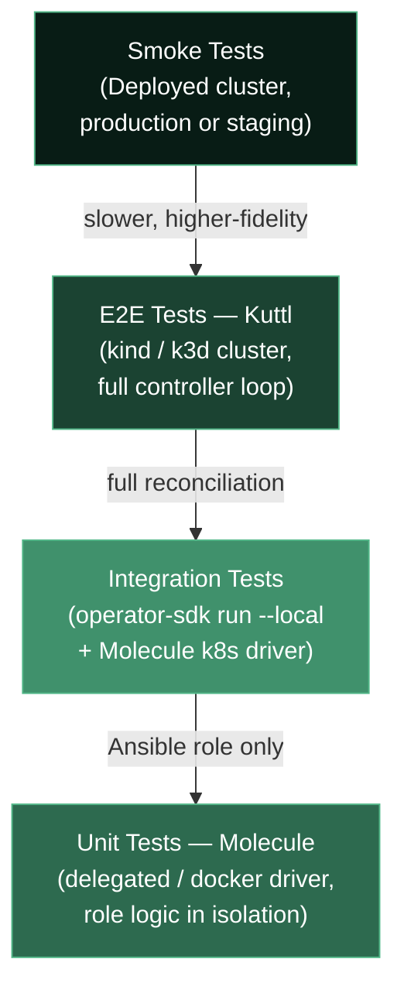

> **Complexity**: [COMPLEX]
>
> **Time to Complete**: ~100 minutes
>
> **Prerequisites**: [Module 7.12: Ansible Operator SDK Fundamentals](../module-7.12-ansible-operator-sdk/), `molecule`, `kuttl` (kubectl-kuttl plugin or standalone binary), `kind`, `kubectl`, `operator-sdk`, Docker, Python 3.11+, and a working `DemoApp` operator scaffold from Module 7.12

---

## What You'll Be Able to Do

After completing this module, you will be able to:

- **Design** a layered test strategy for an Ansible Operator that maps each tier of the test pyramid to the right tool: Molecule for role-level unit and integration tests, Kuttl for end-to-end CRD reconciliation, and the operator-sdk scorecard for OLM bundle validation.
- **Implement** Molecule scenarios that run your operator's Ansible role in isolation using the delegated, Docker, and Kubernetes drivers, and write verifiers in both Ansible and Testinfra.
- **Construct** Kuttl `TestStep`/`TestAssert` manifests that declaratively verify reconciliation outcomes on a live kind cluster, including parallel test suites and cleanup steps.
- **Evaluate** where the operator-sdk scorecard suite validates OLM bundle integrity and how to extend it with custom scorecard images.
- **Diagnose** flaky operator tests by distinguishing timing issues, missing teardown, improper status assertions, and controller log-string coupling.

## Why This Module Matters

Hypothetical scenario: a platform team ships a new version of their `DemoApp` Ansible Operator. The operator changes how it calculates the `replicas` field based on a new `scaling.tier` CR field. The logic looks correct in code review. The Ansible role is idempotent in manual testing. Two weeks later, production reports that a cluster running an older Kubernetes version silently silences the new field, and the Deployment never rescales. Nobody wrote a test that ran the actual controller against a real CRD and then asserted the observed replica count in the Deployment's `.status.availableReplicas`. The team had unit tests for individual Ansible tasks, but nothing between "Ansible task ran cleanly" and "new CR was deployed to staging and worked fine on the first try."

This testing gap is the norm, not the exception, for Ansible Operators. Molecule is well understood in the Ansible community for testing roles, but most Ansible teams use it only for the role layer and treat the Kubernetes integration layer as something that gets manually validated or discovered in staging. Kuttl — the Kubernetes Test Tool maintained under the CNCF umbrella and tightly integrated with the Operator SDK ecosystem — gives you a declarative, reproducible way to assert on live reconciliation outcomes: apply a CR, assert that specific child resources converge to expected state, optionally assert that the CR status reflects the outcome, and tear everything down cleanly. When those two layers combine with the operator-sdk scorecard bundle validator and a matrix CI pipeline, the result is an operator that can be refactored, upgraded, and handed off between teams without the anxious "let's test it in staging and see" step that signals a testing gap.

Operator testing deserves the same discipline as any other distributed system test. The challenge is that an operator is simultaneously a Kubernetes controller (requiring a live API server to behave like itself), an Ansible automation engine (requiring role logic to be sound and idempotent), and an OLM-installable bundle (requiring metadata to satisfy a strict schema). Each of those concerns belongs at a different test tier with different tooling and a different feedback cycle. This module shows you how to wire all three tiers together into a test pyramid that catches real bugs at the cheapest possible layer.

## Concept Map: The Operator Test Pyramid



The pyramid deliberately widens at the bottom. Unit tests (Molecule with a delegated or Docker driver) run in seconds, require no cluster, and give immediate feedback on Ansible task logic. Integration tests run the operator controller against a real API server but against a scoped, local scenario. End-to-end Kuttl tests spin up a full kind cluster and exercise the complete reconciliation loop, including watch events, status updates, and child resource ownership. Smoke tests on a real deployment environment cap the pyramid and run only on significant release milestones. Invert the pyramid — relying on smoke tests instead of unit and E2E coverage — and you pay for every refactor with a full staging cycle.

## Ansible Molecule for Role-Level Testing

### What Molecule Does and Why It Belongs Here

Molecule is a testing framework specifically built for Ansible roles. It manages the full lifecycle of a test scenario: provision a target environment (the driver), run a converge playbook that applies your role, optionally run a verify playbook that checks outcomes, run an idempotency check by running converge a second time, and tear down the environment. For an Ansible Operator's role, Molecule gives you the ability to run that role against a realistic environment without needing a Kubernetes controller in the loop at all.

The insight behind role-level testing is that the Ansible role in an Ansible Operator carries most of the reconciliation logic. It creates and patches child resources, evaluates `.spec` fields, writes `.status` updates, and handles deletion through finalizers. If the role logic is wrong — creating a Service with the wrong `targetPort`, miscalculating replica counts, skipping a label — the operator will produce bad outcomes regardless of how well the Kubernetes scaffolding is wired. Molecule catches those bugs cheaply, without a cluster, without the controller binary, and without the full reconciliation loop adding noise to the feedback cycle.

### Molecule Scenario Structure

A Molecule project lives in a `molecule/` directory inside your Ansible role. Each test scenario is a subdirectory with its own configuration:

```text
roles/demoapp/
├── defaults/
│   └── main.yml
├── tasks/
│   └── main.yml
└── molecule/
    ├── default/
    │   ├── molecule.yml        # scenario configuration: driver, platforms
    │   ├── converge.yml        # playbook that applies your role
    │   ├── verify.yml          # playbook that asserts outcomes
    │   └── prepare.yml         # optional: set up dependencies
    └── k8s/
        ├── molecule.yml        # driver: kubernetes
        ├── converge.yml
        └── verify.yml
```

The `default` scenario uses the delegated driver: Molecule delegates provisioning to your converge playbook and does not itself create an instance. This is the fastest scenario because it runs locally without Docker or a cluster, and it is appropriate for testing pure Ansible logic that does not depend on a real Kubernetes API (for example, variable computation, template rendering, or tasks that use mocked facts). The `k8s` scenario uses the Kubernetes driver, which provisions a namespace in a real cluster and runs the role against actual Kubernetes API calls — ideal for testing `kubernetes.core.k8s` task logic against a live API server without the full operator controller.

### The Delegated Driver Scenario

The delegated driver is the right starting point for a new operator role. Configure it in `molecule/default/molecule.yml`:

```yaml
---
dependency:
  name: galaxy
  options:
    requirements-file: requirements.yml

driver:
  name: delegated

platforms:
  - name: instance

provisioner:
  name: ansible
  env:
    ANSIBLE_ROLES_PATH: "${MOLECULE_PROJECT_DIRECTORY}/.."
  inventory:
    hosts:
      all:
        hosts:
          localhost:
            ansible_connection: local

verifier:
  name: ansible
```

The `converge.yml` applies your role against localhost with the Ansible connection set to local, which means it runs entirely on the host running Molecule — no container, no cluster:

```yaml
---
- name: Converge
  hosts: localhost
  connection: local
  gather_facts: false

  vars:
    _demoapp_replicas: 2
    _demoapp_image: "nginx:1.27-alpine"
    _demoapp_name: "test-app"
    _demoapp_namespace: "default"

  roles:
    - role: demoapp
```

Notice the variable names follow the operator convention: the Ansible Operator SDK passes CR fields as `_<kind_lowercase>_<field>` variables. Replicating that naming in your Molecule scenario means the same role runs identically in tests and in production reconciliation.

The `verify.yml` asserts the outcomes of the converge. For a delegated scenario, this often means checking rendered template files, checking output registers, or verifying that expected files were written. Since a delegated run does not have a real API server, your role tasks that call `kubernetes.core.k8s` will fail unless you mock the Kubernetes connection. There are two approaches: add `check_mode: true` to skip the actual API calls and only validate the task definitions, or use the `k8s` Molecule driver for the scenario that exercises Kubernetes tasks.

Choosing between the delegated, Docker, and Kubernetes drivers requires matching each driver's fidelity to what the role actually exercises. The delegated driver runs the playbook directly on the Molecule host with no container or cluster overhead, making it the right choice for roles that are heavy on variable computation, template rendering, and conditional task logic — anything that does not make network or API calls. The Docker driver starts a real container and suits roles that execute shell commands against a real filesystem or that test Ansible connection-level behavior such as user management or service control; for Ansible Operator roles, which are designed to run with `connection: local` and call `kubernetes.core` modules rather than shelling into remote hosts, the Docker driver's overhead rarely pays off. The Kubernetes driver is the integration tier: it provisions a real namespace in a running cluster and lets your role's API tasks make genuine API calls, providing the same validation semantics as production at the cost of cluster startup time and namespace lifecycle management.

Dependency management is the most common cause of Molecule CI failures that do not reproduce locally. The delegated driver runs on the CI runner's bare Python environment, so a converge failure logged as `ERROR! couldn't resolve module/action 'kubernetes.core.k8s'` means the `kubernetes.core` collection is not installed on the runner. Fix this by adding a `requirements.yml` to the scenario directory that lists all collection dependencies, and reference it in `molecule.yml` under `dependency.options.requirements-file`. Version pinning matters beyond just avoiding missing dependencies: the `kubernetes.core.k8s` module changed its default behavior for the `apply` parameter between major versions, and accepting the latest collection version at install time means an upstream release can silently alter how your role patches resources. Declare explicit version bounds (`kubernetes.core>=2.4,<3.0`) and update them intentionally during operator maintenance cycles rather than discovering breaking changes when a CI run unexpectedly reports `changed` tasks after a clean code commit.

### The Kubernetes Driver Scenario

For tasks that call `kubernetes.core.k8s`, the Kubernetes driver provisions a namespace in a real cluster and runs your role inside it. This is the integration tier of the Molecule pyramid. Configure `molecule/k8s/molecule.yml`:

```yaml
---
dependency:
  name: galaxy

driver:
  name: kubernetes

platforms:
  - name: demoapp-test
    namespace: molecule-test
    context: kind-kind

provisioner:
  name: ansible
  env:
    ANSIBLE_ROLES_PATH: "${MOLECULE_PROJECT_DIRECTORY}/.."
    KUBECONFIG: "${HOME}/.kube/config"
  inventory:
    hosts:
      all:
        hosts:
          localhost:
            ansible_connection: local

verifier:
  name: ansible
```

The `converge.yml` for the Kubernetes scenario applies the role with variables derived from a representative CR spec:

```yaml
---
- name: Converge
  hosts: localhost
  connection: local
  gather_facts: false

  vars:
    _demoapp_replicas: 2
    _demoapp_image: "nginx:1.27-alpine"
    _demoapp_name: "molecule-test-app"
    _demoapp_namespace: "molecule-test"

  roles:
    - role: demoapp
```

The `verify.yml` then uses `kubernetes.core.k8s_info` to read back the child resources and assert against their observed state:

```yaml
---
- name: Verify
  hosts: localhost
  connection: local
  gather_facts: false

  tasks:
    - name: Get Deployment
      kubernetes.core.k8s_info:
        api_version: apps/v1
        kind: Deployment
        name: molecule-test-app
        namespace: molecule-test
      register: dep_info

    - name: Assert Deployment exists with correct replicas
      ansible.builtin.assert:
        that:
          - dep_info.resources | length == 1
          - dep_info.resources[0].spec.replicas == 2
          - dep_info.resources[0].spec.template.spec.containers[0].image == "nginx:1.27-alpine"
        fail_msg: "Deployment not in expected state after converge"

    - name: Get Service
      kubernetes.core.k8s_info:
        api_version: v1
        kind: Service
        name: molecule-test-app
        namespace: molecule-test
      register: svc_info

    - name: Assert Service selector matches Deployment labels
      ansible.builtin.assert:
        that:
          - svc_info.resources | length == 1
          - svc_info.resources[0].spec.selector['app.kubernetes.io/name'] == 'molecule-test-app'
        fail_msg: "Service selector does not match expected labels"
```

Pause and predict: what happens if you run `molecule converge` twice with the same variables? The role should be idempotent — the second run should show no `changed` tasks for the Deployment and Service, because `kubernetes.core.k8s` computes a server-side diff and skips the API call when the observed state already matches the desired state. Molecule's default behavior runs converge a second time after verify and fails if any tasks are `changed`, which catches idempotency violations automatically.

### Testinfra as the Verifier

For scenarios where you want to write verifier logic in Python rather than Ansible, Molecule supports Testinfra as the verifier. This is particularly useful when you are checking Kubernetes API state and prefer the readability of Python assertions over YAML task chains:

```python
# molecule/k8s/tests/test_default.py
import pytest

def test_deployment_exists(host):
    dep = host.run(
        "kubectl get deployment molecule-test-app -n molecule-test -o jsonpath='{.spec.replicas}'"
    )
    assert dep.rc == 0
    assert dep.stdout.strip() == "2"

def test_service_selector(host):
    sel = host.run(
        "kubectl get service molecule-test-app -n molecule-test "
        "-o jsonpath='{.spec.selector.app\\.kubernetes\\.io/name}'"
    )
    assert sel.rc == 0
    assert sel.stdout.strip() == "molecule-test-app"
```

Configure Testinfra in `molecule.yml` by setting `verifier.name: testinfra`. Testinfra verifiers are especially convenient when your verification logic involves complex JSON path queries, comparisons across multiple resources, or checks that are awkward to express in Ansible's assertion syntax. The tradeoff is that Testinfra adds a Python dependency and requires the test runner to have `kubectl` access, so it is most appropriate for CI pipelines where both are guaranteed.

The choice between Ansible and Testinfra as verifier reflects how your team reads and maintains tests over time. Ansible verifiers stay in the same language as the role: verification tasks use the same modules, share the same variable namespace, and produce the familiar task output format that anyone familiar with the role will recognize immediately. When variable names or resource naming conventions change in the role, an Ansible verifier adapts naturally because it references the same variables. A Testinfra verifier that uses hardcoded resource names and `kubectl get` string parsing is a separate artifact that must be kept in sync with the role independently, which creates a quiet drift risk on active codebases. The clearest signal that Testinfra is the right choice is when your Ansible verify tasks accumulate more `set_fact` steps for massaging JSON response data into assertable form than actual `assert` tasks — at that point the verification logic has outgrown YAML's expressiveness and Python is meaningfully more readable. Teams that already maintain Python integration tests alongside their Ansible work also find Testinfra more natural, since it avoids a context switch between languages when authoring and reviewing different test tiers on the same operator.

## Kuttl for End-to-End CRD Reconciliation

### What Kuttl Is and What It Tests

Kuttl — the Kubernetes Test Tool, formerly `kudo-test` — is a declarative testing framework for Kubernetes operators that runs on a live cluster. It does not test individual Ansible tasks; it tests the behavior of the complete reconciliation loop: submit a CR, wait for the controller to run, assert that observed cluster state matches expectations. Kuttl is the right tool for questions that Molecule cannot answer: Does the watch event actually trigger the reconcile? Does the CRD status field get updated? Does the Deployment get owner-referenced to the CR? Does the controller clean up child resources when the CR is deleted?

Kuttl tests are defined as YAML manifests inside numbered step directories. Each step directory contains files that kuttl applies (resources to create or update) and assert files that kuttl polls until they match or until a timeout expires. The numbering defines execution order within a test suite. This structure is intentionally similar to how you would describe a test case by hand: "first apply these resources, then assert that these conditions are true, then apply this change, then assert this new state."

### kuttl-test.yaml Configuration

The top-level configuration file controls how kuttl discovers test suites, which cluster it connects to, and global settings like timeout and parallelism:

```yaml
# kuttl-test.yaml
apiVersion: kuttl.dev/v1beta1
kind: TestSuite
metadata:
  name: demoapp-operator-tests
startKIND: true
kindContext: kind-kuttl
kindConfig: kind-config.yaml
testDirs:
  - tests/e2e
timeout: 120
parallel: 4
```

Setting `startKIND: true` tells kuttl to create a local kind cluster for the test run and tear it down when tests finish. This is the recommended approach for CI pipelines because it guarantees a clean cluster state and removes any dependency on a pre-existing cluster. The `kindConfig` references a kind configuration file, which lets you pin the Kubernetes version for the test run — critical for validating operator behavior across the Kubernetes versions your users may be running. Setting `parallel: 4` allows kuttl to run up to four test cases concurrently, which reduces total wall-clock time when you have many independent test suites.

For local development where you already have a running kind cluster, you can omit `startKIND` and set `kindContext` to point at your existing cluster context. This trades startup time for the risk of test state leaking between runs if a previous test left resources behind, so local runs benefit from a `kubectl delete namespace` cleanup habit.

### TestStep and TestAssert Structure

A kuttl test case is a directory containing numbered step subdirectories. A minimal end-to-end test for the DemoApp operator looks like this:

```text
tests/e2e/
└── create-demoapp/
    ├── 00-install-crds.yaml         # assert: CRD exists after installation
    ├── 01-create-cr/
    │   ├── demoapp-cr.yaml          # apply: the DemoApp custom resource
    │   └── assert.yaml              # assert: expected state after creation
    ├── 02-scale-up/
    │   ├── demoapp-patch.yaml       # apply: patch replicas to 4
    │   └── assert.yaml              # assert: Deployment has 4 replicas
    └── 03-delete-cr/
        ├── delete-cr.yaml           # delete: the DemoApp custom resource
        └── assert.yaml              # assert: child resources are gone
```

The step 01 apply file creates the DemoApp custom resource with a small, representative spec — two replicas and a pinned nginx image. Keeping the spec minimal in tests is intentional: add complexity only when the test specifically exercises a feature of the more complex spec:

```yaml
# tests/e2e/create-demoapp/01-create-cr/demoapp-cr.yaml
apiVersion: app.example.com/v1
kind: DemoApp
metadata:
  name: e2e-test-app
  namespace: default
spec:
  replicas: 2
  image: nginx:1.27-alpine
```

The step 01 assert file describes the expected cluster state after the controller runs. Kuttl polls this assert against the live cluster until all conditions are satisfied or the timeout expires:

```yaml
# tests/e2e/create-demoapp/01-create-cr/assert.yaml
apiVersion: apps/v1
kind: Deployment
metadata:
  name: e2e-test-app
  namespace: default
spec:
  replicas: 2
status:
  availableReplicas: 2
---
apiVersion: v1
kind: Service
metadata:
  name: e2e-test-app
  namespace: default
spec:
  selector:
    app.kubernetes.io/name: e2e-test-app
---
apiVersion: app.example.com/v1
kind: DemoApp
metadata:
  name: e2e-test-app
status:
  conditions:
    - type: Running
      status: "True"
```

Every field you specify in the assert file is treated as a required match. Fields you omit are not checked — so the assert focuses on the semantically important state rather than requiring the entire resource spec to match. This is the critical difference between kuttl assertions and naive `kubectl get` checks in a shell script: kuttl retries until convergence, tolerates the time the controller takes to reconcile, and fails cleanly with a diff when the assertion never converges rather than racing against controller startup.

Pause and predict: step 03 asserts that child resources are gone after the CR is deleted. What must be true in your Ansible role for this assertion to pass? The role must manage deletion explicitly — either through finalizer logic or by relying on Kubernetes garbage collection via owner references. If the Deployment and Service are owner-referenced to the DemoApp CR, Kubernetes will delete them automatically when the CR is deleted. If they are not owner-referenced, the controller must handle deletion in a finalizer. An assert that child resources vanish after CR deletion is a clean test for whether your ownership model is wired correctly.

### Parallel Test Suites and Test Organization

Kuttl's `parallel` setting runs multiple top-level test case directories concurrently. Each test case should be isolated: it should create its own namespaced resources (or use distinct names to avoid collisions), and it should clean up after itself via `delete` steps or namespace deletion. A parallel test run with four workers is typically the right balance between speed and resource pressure on a kind cluster — higher parallelism can exhaust kind's CPU or memory on a developer laptop, while lower parallelism means slower CI feedback.

For an operator with several CRD types or multiple behavioral scenarios (create, update, delete, invalid spec, conflict), organize each scenario as its own test case directory rather than a long sequence of steps in one directory. This way, a failure in the scale-up scenario does not block the deletion scenario test from running, and CI output makes it immediately clear which scenario failed.

## operator-sdk scorecard Suite

### What the Scorecard Validates

The operator-sdk scorecard is a suite of tests that validates an operator bundle from the perspective of the Operator Lifecycle Manager (OLM). It runs against an operator bundle image — the packaged artifact that OLM uses to install an operator — and checks that the bundle is internally consistent, that the CRDs are valid, that required metadata fields are present, and that the operator behaves correctly in a minimal OLM-installed environment.

The scorecard runs in Kubernetes as a set of Pods, each executing a scorecard test image. The default suite includes two test classes: the basic and OLM suites. The basic suite checks that the bundle structure conforms to the expected layout, that all resources specified in the `metadata/manifests/` directory are syntactically valid, and that required annotations are present on the `ClusterServiceVersion`. The OLM suite deploys the operator via OLM and verifies that it installs cleanly, that the CRDs are created, and that the operator's readiness probe passes.

### Running the Scorecard

Before running the scorecard, you need a bundle image built with `make bundle-build` and an operator-sdk binary on your PATH. The bundle image packages the CRD, CSV, and metadata in the OCI layout that OLM expects, and the scorecard pulls that image and runs test containers against its contents:

```bash
# Build and push the bundle image
make bundle-build bundle-push \
  IMG=registry.example.com/demoapp-operator:v0.1.0 \
  BUNDLE_IMG=registry.example.com/demoapp-operator-bundle:v0.1.0

# Run the default scorecard suite against a local kind cluster
operator-sdk scorecard registry.example.com/demoapp-operator-bundle:v0.1.0 \
  --namespace scorecard-test \
  --kubeconfig ~/.kube/config \
  --wait-time 120s
```

The output reports each test as `pass` or `fail` with a human-readable description. A common early failure is `BundleValidation` failing because the `spec.icon` or `spec.maintainers` fields are missing from the ClusterServiceVersion — fields that developers typically skip during initial scaffolding. Another common failure is `CRValidation` flagging a CRD that uses `x-kubernetes-list-type` or `x-kubernetes-map-keys` incorrectly. These are mechanical issues that the scorecard catches before you attempt an OLM install against a real OperatorHub cluster.

### Custom Scorecard Images

The scorecard framework allows you to add your own test images alongside the default suite. A custom scorecard image is a container that receives a JSON-encoded scorecard bundle configuration via stdin and writes a scorecard results JSON to stdout. This mechanism lets you run domain-specific validations — for example, confirming that every CRD has an example object, that the operator's RBAC does not request wildcard cluster permissions, or that the CSV's `spec.installModes` field correctly reflects your operator's namespace scope:

```yaml
# config/scorecard/patches/custom.yaml
- op: add
  path: /stages/0/tests/-
  value:
    entrypoint:
    - /usr/local/bin/scorecard-rbac-auditor
    image: registry.example.com/demoapp-scorecard:v0.1.0
    labels:
      suite: custom
      test: no-wildcard-cluster-verbs
```

Custom scorecard images are most valuable once you have a library of operators and want to enforce org-wide standards — for example, "no operator in this organization should request `*` on `secrets` at the cluster scope" — that are not covered by the upstream OLM-focused suite.

The interface contract for a custom scorecard image is deliberately minimal: the container reads a `scorecard.operatorframework.io/v1alpha3.Configuration` JSON object from stdin and writes a `scorecard.operatorframework.io/v1alpha3.TestOutput` JSON object to stdout. The output contains a `results` array where each entry carries a `name`, a `state` field (`pass`, `fail`, or `skip`), a human-readable `description`, and an optional `log` field that the scorecard CLI surfaces when a test fails. A minimal Python implementation that reads bundle configuration from stdin, inspects a specific bundle property, and writes structured output is approximately 40 lines. The architecture scales because the same container image runs against any operator bundle that references it in the `stages` configuration patch, so org-wide policies need to be implemented and maintained only once regardless of how many operators your platform team manages. Common custom tests in practice include RBAC scope auditors (no wildcard cluster verbs), CSV completeness checkers (description, icon, and keywords all present and non-empty), CRD example validators (at least one example per declared CRD kind), and namespace scope verifiers (that `spec.installModes` correctly reflects whether the operator is `AllNamespaces` or `OwnNamespace`).

Understanding the bundle validation flow lets you sequence CI gates to fail fast on cheap checks before running expensive ones. Static bundle validation runs first and requires no cluster access: `operator-sdk bundle validate ./bundle --select-optional suite=operatorframework` inspects the directory structure, parses all manifests as valid Kubernetes YAML, and checks that CRD schema versions are correctly declared in `spec.versions`. This step catches structural errors — a missing `metadata/annotations.yaml`, a CRD with `spec.versions` entries that omit the required `served: true` field, or a CSV whose `metadata.name` does not match the file path convention — in seconds, before any container image is pulled or any Pod is scheduled. Running static validation as a dedicated pre-flight job in CI before the scorecard job saves significant time when bundle structure is broken, because scorecard failures on a structurally invalid bundle produce confusing error messages that require deep familiarity with OLM internals to interpret, whereas `bundle validate` outputs a clear, actionable error line pointing directly to the offending field.

## CI Integration

### GitHub Actions Matrix Pipeline

A production CI pipeline for an Ansible Operator runs multiple gates: lint the Ansible role, run Molecule unit tests, run Molecule integration tests against a kind cluster, run Kuttl E2E tests against a kind cluster, build the bundle, and run the scorecard. These gates should run in order of increasing cost, so a cheap lint failure does not waste a full Kuttl run.

```yaml
# .github/workflows/operator-tests.yml
name: Operator Tests

on:
  push:
    branches: [main]
  pull_request:

jobs:
  lint:
    runs-on: ubuntu-24.04
    steps:
      - uses: actions/checkout@11bd71901bbe5b1630ceea73d27597364c9af683  # v4.2.2
        with:
          persist-credentials: false
      - name: Install ansible-lint
        run: pip install ansible-lint
      - name: Lint role
        run: ansible-lint roles/demoapp/

  molecule-unit:
    runs-on: ubuntu-24.04
    needs: lint
    steps:
      - uses: actions/checkout@11bd71901bbe5b1630ceea73d27597364c9af683  # v4.2.2
        with:
          persist-credentials: false
      - name: Install Molecule
        run: pip install molecule molecule-plugins[docker] ansible kubernetes
      - name: Run default scenario
        run: cd roles/demoapp && molecule test -s default

  molecule-k8s:
    runs-on: ubuntu-24.04
    needs: lint
    strategy:
      matrix:
        k8s-version: ["1.33.1", "1.34.0", "1.35.0"]
    steps:
      - uses: actions/checkout@11bd71901bbe5b1630ceea73d27597364c9af683  # v4.2.2
        with:
          persist-credentials: false
      - name: Create kind cluster
        uses: helm/kind-action@a1b0e391336a6ee6713a0583f8f8240e8b95d580  # v1.12.0
        with:
          node_image: "kindest/node:v${{ matrix.k8s-version }}"
          cluster_name: molecule-test
      - name: Install dependencies
        run: pip install molecule molecule-plugins[kubernetes] ansible kubernetes
      - name: Run k8s scenario
        run: cd roles/demoapp && molecule test -s k8s

  kuttl-e2e:
    runs-on: ubuntu-24.04
    needs: molecule-k8s
    strategy:
      matrix:
        k8s-version: ["1.33.1", "1.35.0"]
    steps:
      - uses: actions/checkout@11bd71901bbe5b1630ceea73d27597364c9af683  # v4.2.2
        with:
          persist-credentials: false
      - name: Install kuttl
        run: |
          curl -LO "https://github.com/kudobuilder/kuttl/releases/download/v0.22.0/kubectl-kuttl_0.22.0_linux_x86_64"
          chmod +x kubectl-kuttl_0.22.0_linux_x86_64
          sudo mv kubectl-kuttl_0.22.0_linux_x86_64 /usr/local/bin/kubectl-kuttl
      - name: Build operator image
        run: make docker-build IMG=localhost/demoapp-operator:ci
      - name: Run kuttl tests
        run: kubectl kuttl test --config kuttl-test.yaml

  scorecard:
    runs-on: ubuntu-24.04
    needs: kuttl-e2e
    steps:
      - uses: actions/checkout@11bd71901bbe5b1630ceea73d27597364c9af683  # v4.2.2
        with:
          persist-credentials: false
      - name: Install operator-sdk
        run: |
          OPERATOR_SDK_DL_URL=https://github.com/operator-framework/operator-sdk/releases/download/v1.40.0
          curl -LO "${OPERATOR_SDK_DL_URL}/operator-sdk_linux_amd64"
          chmod +x operator-sdk_linux_amd64
          sudo mv operator-sdk_linux_amd64 /usr/local/bin/operator-sdk
      - name: Build bundle
        run: make bundle-build IMG=localhost/demoapp-operator:ci
      - name: Run scorecard
        run: |
          operator-sdk scorecard bundle \
            --namespace scorecard-test \
            --wait-time 120s
```

Several aspects of this pipeline deserve explanation. First, the `molecule-k8s` and `kuttl-e2e` jobs run a version matrix across multiple Kubernetes releases. This is the most important quality gate for an operator that will be deployed on clusters you do not control — a behavior difference between 1.33 and 1.35 in how the API server handles a CRD validation webhook, or a behavior change in garbage collection semantics, will show up as a matrix failure before it shows up as a customer incident. Second, the jobs are ordered by cost: lint fails fast and cheaply, Molecule unit tests add seconds, Molecule k8s and kuttl tests add minutes. The scorecard runs last because it requires a bundle image build, which is the most expensive gate. Third, all `uses:` references are pinned to full commit SHAs per the GitHub Actions supply chain security rule — tags are mutable.

### Argo Workflows for Long-Running Kuttl Tests

For operators with large test suites — say, 30 or more kuttl test cases covering many reconciliation scenarios — Argo Workflows provides better parallelism and observability than GitHub Actions. Each kuttl test case can be a separate Workflow step, and Argo's DAG template gives you fine-grained dependency control: setup steps must complete before test steps, but independent test suites run in parallel across separate Pods.

A minimal Argo Workflow for kuttl treats each test scenario as a separate parallel step, so independent scenarios do not block each other. The install step runs first to ensure the operator is deployed before any test scenario begins:

```yaml
# argo-kuttl-workflow.yaml
apiVersion: argoproj.io/v1alpha1
kind: Workflow
metadata:
  generateName: kuttl-e2e-
spec:
  entrypoint: kuttl-suite
  templates:
    - name: kuttl-suite
      steps:
        - - name: install-operator
            template: kubectl-apply
            arguments:
              parameters:
                - name: manifest
                  value: "config/default/kustomization.yaml"
        - - name: test-create
            template: kuttl-test
            arguments:
              parameters:
                - name: testdir
                  value: "tests/e2e/create-demoapp"
          - name: test-scale
            template: kuttl-test
            arguments:
              parameters:
                - name: testdir
                  value: "tests/e2e/scale-demoapp"
          - name: test-delete
            template: kuttl-test
            arguments:
              parameters:
                - name: testdir
                  value: "tests/e2e/delete-demoapp"

    - name: kuttl-test
      inputs:
        parameters:
          - name: testdir
      container:
        image: registry.example.com/kuttl-runner:0.22.0
        command: [kubectl, kuttl, test, "--test-dir", "{{inputs.parameters.testdir}}"]
        volumeMounts:
          - name: kubeconfig
            mountPath: /root/.kube
```

The advantage of Argo Workflows for large test suites is that each test step has its own log stream, retry policy, and resource quota. A flaky test in one suite does not block unrelated suites from completing, and Argo's UI makes it easy to identify which step in a 30-step test run was the first failure.

## Mocking the Kubernetes API in Unit Tests

### The envtest Pattern Adapted for Ansible

The `envtest` package from controller-runtime starts a real Kubernetes API server binary — without etcd data persistence, without nodes, without kubelet — and lets tests make real API calls against it. This pattern is standard in Go operator testing because it gives the same API semantics as a production cluster without requiring a full kind cluster to start and stop on every test run. For Ansible Operators, you can adapt this pattern by running `envtest` as a sidecar process that exposes a real API server endpoint, and pointing your Molecule scenario's `KUBECONFIG` at that endpoint.

This gives you a middle layer between the delegated driver (no API server) and the full Kubernetes driver (full kind cluster): a lightweight API server that speaks real Kubernetes semantics, accepts real CRD installations, and validates real YAML — at the startup cost of a single binary rather than a full multi-component cluster. The practical setup uses the `setup-envtest` CLI from the controller-runtime project:

```bash
# Install setup-envtest
go install sigs.k8s.io/controller-runtime/tools/setup-envtest@latest

# Download envtest binaries for K8s 1.35
setup-envtest use 1.35.x --bin-dir /tmp/envtest-bins

# Start the API server
export KUBEBUILDER_ASSETS=$(setup-envtest use 1.35.x --bin-dir /tmp/envtest-bins -p path)
```

In the Molecule scenario, set the `KUBECONFIG` to the config that `setup-envtest` generates, and run your converge and verify playbooks against that endpoint. The API server handles real resource creation and deletion, enforces schema validation, and triggers server-side apply — so your `kubernetes.core.k8s` tasks behave exactly as they would in production, at a fraction of the startup cost of a full cluster.

### Choosing Between envtest, kind, and a Shared Cluster

The right target for each Molecule scenario depends on what it is testing. The delegated driver (no API server) is correct when you are testing pure Ansible logic: variable computation, template rendering, conditional task execution, and fact derivation. The envtest API server is correct when you are testing Kubernetes API interaction — creating resources, patching them, reading them back — but do not need a full cluster with nodes, scheduling, and actual Pod execution. A full kind cluster is correct when you need Pods to actually run, when you need to test watch events triggered by child resource changes, or when you need to validate that owner references result in actual garbage collection. Using kind for every test is the common anti-pattern: it wastes minutes of cluster startup time on tests that only needed an API server.

Which approach would you choose for testing an Ansible role that creates a Deployment, reads it back with `kubernetes.core.k8s_info`, and updates the CR status based on the `availableReplicas` field? Consider: does this test need Pods to actually run and report readiness? If the status update depends on live `availableReplicas`, yes — you need real nodes scheduling real Pods. If the status update depends only on the `spec.replicas` value (desired, not observed), you can use envtest. This distinction drives your test scenario selection.

## Coverage Measurement and Reporting

### Measuring Operator Test Coverage

Test coverage for an Ansible Operator spans three dimensions that are hard to summarize in a single percentage. The first dimension is **role task coverage**: how many of the tasks in your Ansible role are exercised by at least one Molecule converge run. This is analogous to line coverage for code. You can measure it by enabling Ansible callback plugins that log task execution and correlating those logs against the role's task list. The second dimension is **scenario coverage**: how many of the CR spec configurations that users could submit are covered by at least one Molecule or Kuttl test. This is analogous to branch coverage. The third dimension is **reconciliation event coverage**: how many of the event types that trigger reconciliation (create, update, delete, dependent resource change) have a corresponding Kuttl test case.

For most operators, the highest-value coverage to add first is reconciliation event coverage. A team that has thorough Molecule tests for the role logic but no Kuttl test for CR deletion will discover the deletion behavior only in staging or production, which is exactly the failure mode described in the opening scenario.

A practical coverage report can be generated by combining Ansible's callback plugin output with a script that parses the kuttl test directory structure:

```bash
# Count distinct kuttl test scenarios
find tests/e2e -maxdepth 1 -type d | grep -v "^tests/e2e$" | wc -l

# List which reconciliation events are covered
grep -rl "kind: DemoApp" tests/e2e/ | xargs grep -l "spec:" | sort
```

## Did You Know?

- Molecule was originally created in 2015 by John Dewey as a framework for testing Ansible roles in isolation. It predates most Kubernetes tooling by several years and was designed for server-side configuration management long before `kubernetes.core` existed. The framework has been adopted by the Ansible community organization and is now the default test framework recommended by the Ansible Collections documentation.

- Kuttl was originally developed as part of the KUDO project (Kubernetes Universal Declarative Operator) at D2iQ, where it was used to test KUDO operators declaratively. After KUDO was archived in 2022, kuttl was separated into its own repository and became a general-purpose Kubernetes testing tool that works with any operator or Kubernetes application, regardless of how it was built.

- The operator-sdk scorecard's architecture is inspired by the Conformance Test Suite pattern used in the CNCF: each test is a standalone container image that receives a standardized input and emits a standardized result, which allows any organization to publish additional scorecard test images to an OCI registry and have them run by any operator pipeline that supports the scorecard format.

- Controller-runtime's `envtest` API server starts significantly faster than a full kind cluster — typically under 3 seconds versus 30–60 seconds for kind — because it skips etcd persistence, scheduler, and controller manager components. This startup time difference compounds significantly in a CI matrix: a 10-run matrix of Molecule k8s scenarios takes 5 minutes with envtest and over 15 minutes with kind, purely from cluster startup overhead.

## Patterns and Anti-Patterns

### Testing Patterns

| Pattern | When to Use | Why It Works |
|---------|-------------|--------------|
| **Delegated-first role testing** | Always: new role development, CI lint gate | Runs without a cluster in seconds; catches pure Ansible logic bugs before wasting cluster time |
| **Idempotency test in converge** | Every Molecule scenario | Molecule reruns converge by default; `changed` tasks on second run flag non-idempotent logic before it causes reconciliation loops |
| **CR spec matrix in Kuttl** | When the CR has optional or conditional spec fields | Covers branch behavior (scaling tiers, optional sidecar toggles) that create different reconciliation paths |
| **Deletion assert as final Kuttl step** | Every test case that creates a CR | Validates ownership model; catches missing finalizer logic and orphaned child resources |
| **Kubernetes version matrix in CI** | Operators targeting multiple cluster versions | Catches API deprecations, webhook validation behavior changes, and garbage collection semantic differences |
| **scorecard on every bundle build** | Before any OLM submission or OperatorHub listing | Catches CSV metadata gaps and CRD validation schema errors that OLM will reject silently |

### Anti-Patterns

| Anti-Pattern | Why Teams Fall Into It | Better Alternative |
|--------------|------------------------|-------------------|
| **Testing only with kind for everything** | Kind is the familiar local tool | Use delegated driver for pure Ansible logic, envtest for API tests, kind only for full E2E |
| **Asserting on operator log strings** | Easy to add `kubectl logs | grep "reconcile complete"` | Assert on CR status fields or child resource state — log strings change without notice |
| **Missing teardown in test cases** | Developers skip cleanup steps to save time locally | Always include a `delete` step or namespace cleanup; test pollution creates flaky failures |
| **Single-scenario Kuttl test for all cases** | Easier to write one long sequential test | Separate scenarios run in parallel and fail independently; one long test serializes all failure investigation |
| **Skipping idempotency verification** | Role logic "seems idempotent" | Molecule's second converge run is the cheapest idempotency gate; never skip it |
| **Not pinning K8s version in molecule.yml** | `context: default` points at whatever is running | Pin the kind context name and use a known-version kind cluster in CI; otherwise tests pass on one version and fail on another silently |

## Decision Framework: Which Test Tier for Which Bug?

When you discover or suspect a bug in your operator, choosing the right test tier to write a regression test determines how fast the test runs, how isolated the failure signal is, and how much cluster infrastructure you need to reproduce it:

```text
BUG TRIAGE: WHICH TEST TIER?
───────────────────────────────────────────────────────────────

Does the bug involve pure Ansible task logic
(wrong variable computation, wrong conditional, missing task)?
    YES → Molecule delegated scenario. No cluster needed.
    NO  → continue

Does the bug involve kubernetes.core.k8s API calls
(wrong resource definition, wrong patch strategy, missing labels)?
    YES → Molecule k8s scenario (envtest or kind namespace).
          Tests the API interaction without needing Pods to run.
    NO  → continue

Does the bug involve reconciliation event handling
(wrong behavior on CR update, delete, or child resource change)?
    YES → Kuttl E2E test case. Requires full controller loop + kind.
    NO  → continue

Does the bug involve OLM installation or bundle metadata?
    YES → operator-sdk scorecard. Requires bundle image + OLM.
    NO  → continue

Does the bug only reproduce in a specific cluster version
or with a specific storage class / networking plugin?
    YES → Smoke test on a target environment.
          Add a CI matrix entry for that version.
```

This triage tree keeps expensive infrastructure out of cheap test layers. A bug that manifests only in `kubernetes.core.k8s` task behavior does not belong in a Kuttl test that starts a full kind cluster for every PR — it belongs in a Molecule k8s scenario that runs in a shared namespace in under 30 seconds.

## Common Mistakes

| Mistake | Why It Happens | How to Fix It |
|---------|----------------|---------------|
| **Asserting on `.status.phase` before CR reconciles** | Kuttl asserts immediately after `kubectl apply` | Kuttl polls until the assert passes or timeout expires — but assertions need to match the actual status field your role writes, not a generic phase field the role does not produce |
| **Running `molecule test` in CI without `--destroy always`** | Default destroy behavior on failure can leave stale containers | Always pass `--destroy always` in CI: `molecule test --destroy always -s default` |
| **Molecule k8s scenario using `context: default`** | Developers test locally against a real cluster and forget to set context | Set `context: kind-<cluster-name>` explicitly in `molecule.yml`; otherwise a CI runner with no clusters fails on context resolution |
| **Kuttl timeout too short for image pull** | `timeout: 30` works when the image is cached; fails on cold CI runners | Set `timeout: 120` minimum for E2E scenarios; add `imagePullPolicy: IfNotPresent` to test CR specs to maximize cache hits |
| **Not installing CRDs before Kuttl test steps** | First test step tries to create a DemoApp but the CRD is not installed | Add a `00-install-crds` step that applies all CRDs; add an assert that the CRDs have `Established: True` condition before proceeding |
| **Molecule delegated scenario calling `kubernetes.core.k8s` without mocking** | Role has API calls mixed with pure logic tasks | Extract API calls into a separate task file; use `when: not molecule_no_k8s | default(false)` guards, or use `check_mode: true` in the scenario |
| **Using `kubectl logs` in Kuttl verify scripts** | Log scraping feels simpler than writing proper assertions | Write status-based assertions; log content changes without notice and causes false test failures on operator upgrades |
| **No matrix on Kubernetes version in CI** | Single-version CI passes; the operator ships broken on an older cluster | Add matrix: `k8s-version: ["1.33.1", "1.34.0", "1.35.0"]` to both Molecule k8s and Kuttl jobs |

## Quiz

<details>
<summary>Your Molecule k8s scenario runs cleanly on your local kind cluster but fails in CI with "context not found." The molecule.yml has `context: kind-kind`. What is the most likely cause and how do you fix it?</summary>

The most likely cause is that the CI runner creates the kind cluster with a different name than `kind`. When you run `kind create cluster` without `--name`, the default context name is `kind-kind`, but many CI setups use `kind create cluster --name molecule-test`, which creates a context named `kind-molecule-test`. The `molecule.yml` context field must match the actual context name used by the cluster creation step in CI. Fix this by either standardizing the cluster name across local and CI environments — for example, always using `kind create cluster --name molecule-test` — or by reading the context name dynamically: `context: "{{ lookup('env', 'KIND_CONTEXT') | default('kind-kind') }}"`. Also ensure the `kind-action` step in your GitHub Actions workflow specifies `cluster_name: molecule-test` to make the name deterministic.
</details>

<details>
<summary>You have a Kuttl E2E test that creates a DemoApp CR, asserts the Deployment exists, then deletes the CR and asserts the Deployment is gone. The delete assert fails intermittently — sometimes the Deployment is still present when kuttl checks. What should you investigate first?</summary>

The most likely cause is a missing or incomplete owner reference chain. Kubernetes garbage collection deletes owned resources asynchronously after the owner is deleted, but if the Deployment is not owner-referenced to the DemoApp CR, garbage collection never fires and the Deployment persists indefinitely. In your Ansible role, confirm that the `kubernetes.core.k8s` task creating the Deployment includes an `ownerReferences` block derived from the CR's `metadata.uid` and `metadata.resourceVersion`. A second possibility is that the deletion is working correctly but the kuttl timeout is too short — if the Deployment has running Pods, Kubernetes waits for them to terminate before deleting the Deployment, which can take longer than a 30-second timeout. Increase `timeout` in `kuttl-test.yaml` to 120 seconds and check that your test Pods terminate quickly. A third possibility is a finalizer on the Deployment itself that prevents immediate deletion — check `kubectl get deployment -o jsonpath='{.metadata.finalizers}'` in manual testing to rule this out.
</details>

<details>
<summary>The operator-sdk scorecard fails with "BundleValidation: spec.maintainers is required." Your CSV exists and the bundle builds successfully. Where do you add this field and why does the scorecard enforce it even though the operator installs cleanly without it?</summary>

The `spec.maintainers` field belongs in the `ClusterServiceVersion` YAML at `config/manifests/bases/<operator>.clusterserviceversion.yaml`, under the `spec:` section. Add it as a list with at least one entry containing `name` and `email`. The scorecard enforces it because the OLM scorecard validates the bundle against the OperatorHub metadata schema, not just against the fields required for a functional OLM installation. An operator can install and reconcile successfully without `spec.maintainers`, but OperatorHub rejects listings that lack required metadata. The scorecard catches these metadata gaps in CI so they do not surface as OperatorHub submission rejections — which have a slower feedback loop. After adding the field, regenerate the bundle with `make bundle` so the change propagates from the CSV base template into the versioned manifest directory under `bundle/manifests/`.
</details>

<details>
<summary>You run `molecule test -s k8s` and the verify playbook fails on the second run of converge (the idempotency check) with several "changed" tasks. All tasks create or patch Kubernetes resources using `kubernetes.core.k8s`. What does this signal and what is the likely root cause?</summary>

The idempotency failure signals that the role is applying changes on every run even when the cluster state already matches the desired state. For `kubernetes.core.k8s` tasks, the most common root cause is that the task definition includes dynamic fields that differ between runs — for example, `metadata.creationTimestamp`, `metadata.resourceVersion`, or computed annotation values based on `lookup('pipe', 'date')` or `ansible_date_time`. When the task sees these values differ from what is already on the cluster, it issues a patch and registers as `changed`. Fix this by ensuring all fields in your `kubernetes.core.k8s` task definitions are either static or deterministically derived from the CR spec fields passed as role variables. Use `state: present` (which uses server-side apply semantics) rather than `state: patched` with a full resource definition, as server-side apply only patches fields explicitly declared and avoids touching system-managed fields. Strip dynamic fields from your resource definitions and verify idempotency locally before pushing to CI.
</details>

<details>
<summary>Your Kuttl test suite has 20 test cases and takes 18 minutes in CI. The `kuttl-test.yaml` sets `parallel: 1`. What is the first thing you change, and what risk should you watch for when you increase parallelism?</summary>

The first change is increasing `parallel` to 4 or 6, which allows kuttl to run multiple test cases concurrently and should reduce wall-clock time roughly proportionally. Before doing this, audit the test cases for namespace isolation: each test case that creates a DemoApp named `e2e-test-app` in the `default` namespace will conflict with other test cases creating the same resource simultaneously. Fix this by either giving each test case a unique resource name (for example, using the test directory name as a suffix) or by having each test case create and use its own dedicated namespace. Also watch for CPU and memory pressure on the kind cluster: four concurrent test cases each running the operator reconciliation loop simultaneously may exhaust the kind worker node's available CPU, causing spurious timeout failures that are hard to distinguish from real test failures. Start with `parallel: 4`, observe CI timing and failure rates over a few runs, and only increase if resources allow.
</details>

<details>
<summary>A colleague says "we can skip Molecule and just use Kuttl for everything." What is your response, and what specific class of bugs would Kuttl miss that Molecule catches?</summary>

The response is that Kuttl is the wrong tool for role-level logic bugs because it only observes the final reconciled state, not the intermediate task behavior. Kuttl tells you whether the Deployment was created with the right spec; it does not tell you which Ansible tasks ran, whether they were idempotent, or how the role handles edge cases in variable computation. The class of bugs Kuttl misses includes: tasks that use incorrect `when` conditions and silently skip required work when a spec field is absent; tasks that use `ansible.builtin.template` with a Jinja2 expression that evaluates unexpectedly for certain input values; `changed_when` conditions that mask actual changes; and `rescue` blocks that suppress failures that should propagate. All of these bugs produce a reconciliation that succeeds on the happy path but fails silently for edge-case inputs — and Kuttl only tests the happy path unless you write a test case for every possible CR spec permutation. Molecule's delegated driver runs the role logic in complete isolation, gives you full Ansible task output, and makes idempotency verification automatic on every `molecule test` run.
</details>

## Hands-On Lab: Molecule + Kuttl for the DemoApp Operator

This lab wires Molecule and Kuttl tests onto the `DemoApp` operator scaffold from Module 7.12. You will write a Molecule delegated scenario, a Molecule k8s scenario, a two-step Kuttl test, and verify both pass in a local kind cluster.

### Setup

Verify that all required tools are installed at the minimum versions shown below before starting. Version mismatches are a common source of lab failures: `molecule` 6.x uses a different plugin package name than 5.x, and kuttl's assertion output format changed significantly between 0.19 and 0.22. Install any missing tools and confirm the version numbers match before proceeding:

```bash
molecule --version          # 6.0+
kubectl kuttl version       # 0.20.0+
kind version                # 0.24.0+
ansible --version           # 2.16+
operator-sdk version        # 1.37+
```

Clone or use your existing DemoApp operator from Module 7.12. The role should be at `roles/demoapp/` with tasks that create a `Deployment` and `Service` from CR spec fields.

Start a kind cluster if you do not have one running. The `kindest/node:v1.35.0` image pins the Kubernetes version for reproducibility, which matters because CRD validation behavior and garbage collection semantics can differ between Kubernetes minor versions and a pinned node image ensures the test environment matches the assumptions in this lab. If you have an existing kind cluster from earlier work, verify it is running a 1.33+ node image before proceeding, as the operator scaffold from Module 7.12 uses API group versions that require at least Kubernetes 1.33:

```bash
kind create cluster --name demoapp-test --image kindest/node:v1.35.0
kubectl cluster-info --context kind-demoapp-test
```

### Task 1 — Write the Delegated Molecule Scenario

Create the Molecule scenario directory structure. The `default` scenario name is a Molecule convention — when you run `molecule test` without `-s`, it selects the `default` scenario automatically, making it the fast feedback loop for local development:

```bash
mkdir -p roles/demoapp/molecule/default
```

Create `roles/demoapp/molecule/default/molecule.yml`. This file is the scenario configuration: it names the driver, defines the platform, and selects the verifier. The critical `provisioner.env.ANSIBLE_ROLES_PATH` setting tells Molecule where to look when the converge playbook references `role: demoapp` by name — it must point to the directory that contains the `demoapp` role directory, which is the parent of the `molecule/` directory you are currently writing into:

```yaml
---
dependency:
  name: galaxy
driver:
  name: delegated
platforms:
  - name: instance
provisioner:
  name: ansible
  env:
    ANSIBLE_ROLES_PATH: "${MOLECULE_PROJECT_DIRECTORY}/.."
  inventory:
    hosts:
      all:
        hosts:
          localhost:
            ansible_connection: local
verifier:
  name: ansible
```

Create `roles/demoapp/molecule/default/converge.yml`. This playbook is the test driver: it invokes the `demoapp` role with variables that replicate what the Ansible Operator SDK injects from a real CR spec at reconciliation time. The `_demoapp_` prefix convention is not arbitrary — the SDK generates these exact variable names from the CR's `spec` field names, so using the same prefix in the test scenario ensures the role runs with inputs identical to what it would receive from a live CR:

```yaml
---
- name: Converge
  hosts: localhost
  connection: local
  gather_facts: false
  vars:
    _demoapp_replicas: 2
    _demoapp_image: "nginx:1.27-alpine"
    _demoapp_name: "molecule-unit-app"
    _demoapp_namespace: "default"
    molecule_no_k8s: true
  roles:
    - role: demoapp
```

Add `molecule_no_k8s: true` as a guard variable in your role's `tasks/main.yml` to skip `kubernetes.core.k8s` tasks in the delegated scenario. The delegated driver has no cluster connection, so API calls would fail immediately without this guard. Wrapping each `kubernetes.core.k8s` task with `when: not (molecule_no_k8s | default(false))` keeps the role runnable in both the delegated (unit) and k8s (integration) scenarios without duplicating any task definitions:

```yaml
# In roles/demoapp/tasks/main.yml, wrap API tasks:
- name: Apply Deployment
  kubernetes.core.k8s:
    state: present
    definition: "{{ lookup('template', 'deployment.yaml.j2') }}"
  when: not (molecule_no_k8s | default(false))
```

Run the scenario with `molecule test`, which executes the full lifecycle in sequence: dependency resolution, create, converge, idempotency check (converge runs a second time and must produce no `changed` tasks), verify, and destroy. The `-s default` flag explicitly selects the scenario by name, though it is optional here since `default` is selected automatically when no `-s` is provided:

```bash
cd roles/demoapp && molecule test -s default
```

**Success criteria:**
- [ ] `molecule test` completes without errors
- [ ] The converge play shows no `changed` tasks on the second (idempotency) run
- [ ] Molecule reports `PASSED`

<details>
<summary>Hint: converge fails with "No module named kubernetes"</summary>

The delegated scenario runs the role on your local Python environment. Install the required collection: `pip install kubernetes && ansible-galaxy collection install kubernetes.core`. If the task still fails, check that `molecule_no_k8s` is correctly guarding the API tasks in `tasks/main.yml` — the delegated scenario should not be making real API calls.
</details>

### Task 2 — Write the Kubernetes Molecule Scenario

```bash
mkdir -p roles/demoapp/molecule/k8s
```

Create `roles/demoapp/molecule/k8s/molecule.yml`. This scenario uses the Kubernetes driver rather than delegated, so the `platforms` block specifies a real namespace and a kind context name instead of a local inventory host. The `KUBECONFIG` environment variable in the `provisioner.env` block points to your local kubeconfig so the `kubernetes.core` tasks can reach the API server:

```yaml
---
dependency:
  name: galaxy
driver:
  name: kubernetes
platforms:
  - name: demoapp-k8s-test
    namespace: molecule-k8s-test
    context: kind-demoapp-test
provisioner:
  name: ansible
  env:
    ANSIBLE_ROLES_PATH: "${MOLECULE_PROJECT_DIRECTORY}/.."
    KUBECONFIG: "${HOME}/.kube/config"
  inventory:
    hosts:
      all:
        hosts:
          localhost:
            ansible_connection: local
verifier:
  name: ansible
```

Create `roles/demoapp/molecule/k8s/converge.yml`. This converge playbook omits the `molecule_no_k8s: true` variable that Task 1 used to skip API calls, because the Kubernetes driver scenario IS connected to a real API server and expects `kubernetes.core.k8s` tasks to run. Using `replicas: 3` here (rather than the 2 in Task 1) lets you verify that the k8s scenario asserts a different state than the delegated scenario, which confirms the verifier is actually reading cluster state:

```yaml
---
- name: Converge
  hosts: localhost
  connection: local
  gather_facts: false
  vars:
    _demoapp_replicas: 3
    _demoapp_image: "nginx:1.27-alpine"
    _demoapp_name: "k8s-test-app"
    _demoapp_namespace: "molecule-k8s-test"
  roles:
    - role: demoapp
```

Create `roles/demoapp/molecule/k8s/verify.yml`. This verifier uses `kubernetes.core.k8s_info` to read back the Deployment and Service that the converge playbook created, then asserts specific field values with `ansible.builtin.assert`. Each assertion targets a semantically important property — replica count, container image, and selector label — rather than comparing the entire resource spec, which makes the test resilient to metadata fields that Kubernetes adds automatically:

```yaml
---
- name: Verify k8s scenario
  hosts: localhost
  connection: local
  gather_facts: false
  tasks:
    - name: Get Deployment
      kubernetes.core.k8s_info:
        api_version: apps/v1
        kind: Deployment
        name: k8s-test-app
        namespace: molecule-k8s-test
      register: dep

    - name: Assert Deployment spec
      ansible.builtin.assert:
        that:
          - dep.resources | length == 1
          - dep.resources[0].spec.replicas == 3
          - "'nginx:1.27-alpine' in dep.resources[0].spec.template.spec.containers[0].image"

    - name: Get Service
      kubernetes.core.k8s_info:
        api_version: v1
        kind: Service
        name: k8s-test-app
        namespace: molecule-k8s-test
      register: svc

    - name: Assert Service exists
      ansible.builtin.assert:
        that:
          - svc.resources | length == 1
```

Run the k8s scenario. The `kubectl create namespace` pre-flight command uses `--dry-run=client -o yaml | kubectl apply` rather than a plain `create` to make the step idempotent — if the namespace already exists, the apply is a no-op instead of an error:

```bash
kubectl create namespace molecule-k8s-test --dry-run=client -o yaml | kubectl apply -f -
cd roles/demoapp && molecule test -s k8s
```

**Success criteria:**
- [ ] `molecule test -s k8s` completes without errors
- [ ] `verify.yml` asserts pass — Deployment has 3 replicas, Service exists
- [ ] Idempotency check (second converge) shows no `changed` tasks
- [ ] Namespace is cleaned up by `molecule destroy`

<details>
<summary>Hint: verify fails with "resources: []" — the Deployment is not found</summary>

The converge playbook ran but the Deployment was not created. Most likely cause: the `kubernetes.core.k8s` task is still guarded by `molecule_no_k8s` from Task 1, or the namespace in the task definition does not match `molecule-k8s-test`. Check the converge output for any `skipped` tasks. If the task is skipped, remove the `when: not (molecule_no_k8s | default(false))` guard or ensure `molecule_no_k8s` is not set in the k8s scenario variables. Also verify the namespace exists in the cluster with `kubectl get ns molecule-k8s-test`.
</details>

### Task 3 — Write a Kuttl E2E Test

Create the kuttl test directory structure. The top-level `tests/e2e/` directory contains one subdirectory per test case, and each test case subdirectory contains numbered step subdirectories that kuttl processes in order:

```bash
mkdir -p tests/e2e/create-demoapp/01-create-cr
mkdir -p tests/e2e/create-demoapp/02-delete-cr
```

Create `kuttl-test.yaml` at the operator root. This file tells kuttl which cluster context to use, where to find the test case directories, how long to wait for each assertion to converge, and how many test cases to run in parallel:

```yaml
---
apiVersion: kuttl.dev/v1beta1
kind: TestSuite
metadata:
  name: demoapp-operator-tests
kindContext: kind-demoapp-test
testDirs:
  - tests/e2e
timeout: 120
parallel: 2
```

Create the DemoApp custom resource that step 01 will apply to the cluster. The name `kuttl-test-app` is distinct from any resource created by Molecule scenarios, which avoids cross-test pollution if both tools run against the same cluster:

```yaml
# tests/e2e/create-demoapp/01-create-cr/demoapp-cr.yaml
apiVersion: app.example.com/v1
kind: DemoApp
metadata:
  name: kuttl-test-app
  namespace: default
spec:
  replicas: 2
  image: nginx:1.27-alpine
```

Create the assert manifest for step 01. Kuttl polls the cluster continuously until every resource in this file matches the observed state, or until the configured timeout expires. Only the fields you explicitly specify are checked — kuttl ignores all other fields:

```yaml
# tests/e2e/create-demoapp/01-create-cr/assert.yaml
apiVersion: apps/v1
kind: Deployment
metadata:
  name: kuttl-test-app
  namespace: default
spec:
  replicas: 2
---
apiVersion: v1
kind: Service
metadata:
  name: kuttl-test-app
  namespace: default
```

Create the delete command manifest for step 02. A `TestStep` resource lets you run arbitrary `kubectl` commands as part of a step, rather than just applying manifests. The `--wait=true` flag ensures the command blocks until the CR's deletion is acknowledged by the API server:

```yaml
# tests/e2e/create-demoapp/02-delete-cr/delete.yaml
apiVersion: kuttl.dev/v1beta1
kind: TestStep
metadata:
  name: delete-cr
commands:
  - command: kubectl delete demoapp kuttl-test-app -n default --wait=true
```

Create the assert manifest for step 02. A `TestAssert` resource with a `collectors` block tells kuttl to gather Pod logs from the namespace if the assertion fails — useful for diagnosing why child resources did not get cleaned up. The absence assertion verifies that the previously created Deployment and Service are gone:

```yaml
# tests/e2e/create-demoapp/02-delete-cr/assert.yaml
apiVersion: kuttl.dev/v1beta1
kind: TestAssert
metadata:
  name: resources-gone
timeout: 60
collectors:
  - type: pod
    namespace: default
```

Deploy your operator to the kind cluster before running kuttl. The `make install` target applies the CRD, and `make deploy` creates the controller manager Deployment using kustomize. Loading the image into kind with `kind load` avoids an unnecessary registry push for local test runs:

```bash
# Build and load the operator image into kind
make docker-build IMG=localhost/demoapp-operator:kuttl
kind load docker-image localhost/demoapp-operator:kuttl --name demoapp-test

# Deploy the CRD and operator
make install  # installs CRD
make deploy IMG=localhost/demoapp-operator:kuttl

# Verify the operator Pod is running
kubectl get pods -n demoapp-operator-system

# Run kuttl
kubectl kuttl test --config kuttl-test.yaml
```

**Success criteria:**
- [ ] kuttl reports `CREATE-DEMOAPP: PASS`
- [ ] Step 01 assert passes — Deployment and Service exist with correct spec
- [ ] Step 02 completes — CR is deleted and child resources are removed (or assert shows deletion in progress)
- [ ] `kubectl kuttl test` exits with code 0

<details>
<summary>Hint: step 01 assert times out — "Deployment kuttl-test-app not found"</summary>

The operator is not reconciling the CR. Check three things in order: first, run `kubectl get demoapp kuttl-test-app -n default -o yaml` to confirm the CR was created. Second, run `kubectl logs -n demoapp-operator-system deploy/demoapp-operator-controller-manager` to see if the operator is running and producing reconcile logs. Third, check `kubectl describe demoapp kuttl-test-app -n default` for status conditions — an RBAC error or Ansible task failure often shows up there before it shows up in the Deployment. If the operator pod is crash-looping, the image was likely not loaded into kind correctly; re-run `kind load docker-image`.
</details>

### Task 4 — Stretch: Add a Molecule Testinfra Verifier

Swap the Ansible verifier for Testinfra in the `k8s` scenario. Install Testinfra: `pip install pytest-testinfra`. Change `verifier.name` to `testinfra` in `molecule/k8s/molecule.yml`. Write `molecule/k8s/tests/test_demoapp.py` that uses `host.run("kubectl get ...")` to assert the Deployment and Service state. Run `molecule verify -s k8s` to confirm the Testinfra verifier works.

**Transfer exercise**: The same Molecule + Kuttl pattern applies to any Kubernetes operator, not just Ansible Operators. Identify one operator you use in production (cert-manager, external-secrets, crossplane). Look up its repository — does it have a `molecule/` directory? A `kuttl-test.yaml`? A `scorecard` job in its CI? What testing gaps do you notice?

## Sources

- https://molecule.readthedocs.io/en/latest/
- https://github.com/kudobuilder/kuttl/tree/main/docs
- https://sdk.operatorframework.io/docs/testing/scorecard/
- https://sdk.operatorframework.io/docs/building-operators/ansible/testing/
- https://github.com/kudobuilder/kuttl
- https://github.com/ansible/molecule
- https://docs.ansible.com/projects/molecule/
- https://testinfra.readthedocs.io/en/latest/
- https://kind.sigs.k8s.io/docs/user/quick-start/
- https://pkg.go.dev/sigs.k8s.io/controller-runtime/pkg/envtest
- https://olm.operatorframework.io/docs/concepts/crds/clusterserviceversion/
- https://sdk.operatorframework.io/docs/cli/operator-sdk_scorecard/
- https://docs.github.com/en/actions/using-workflows/workflow-syntax-for-github-actions
- https://argoproj.github.io/argo-workflows/

## Next Module

The IaC Tools arc is complete. Apply everything in this toolkit — Terraform state management, Ansible Operators, and operator testing discipline — in the **[Platform Engineering Foundations](/platform/disciplines/)** track, which assembles these tools into the full platform delivery lifecycle.
