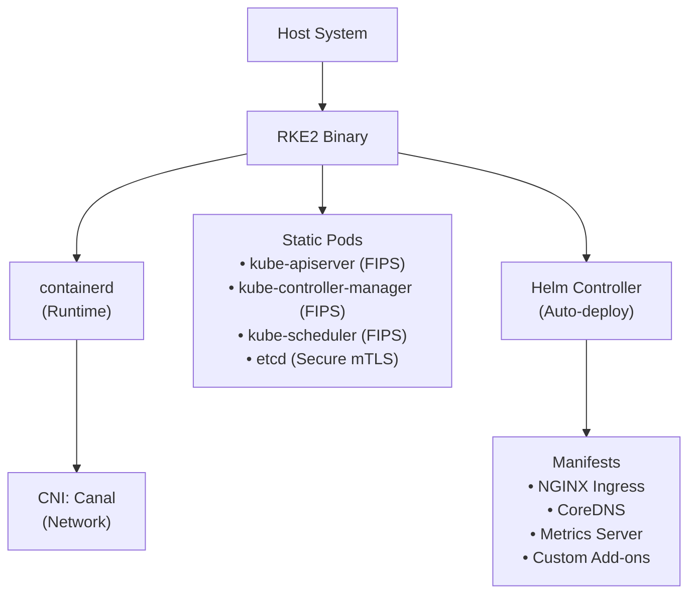
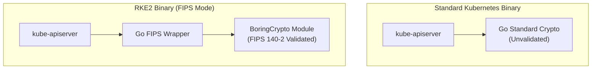

> **Toolkit Track** | Complexity: `[COMPLEX]` | Time: 50-55 minutes

## Overview

Welcome to the most secure corner of the Kubernetes ecosystem. While most distributions prioritize developer speed or resource efficiency, RKE2 (Rancher Kubernetes Engine 2) was built with a different goal in mind: **uncompromising security compliance.** 

Known in its early days as "RKE Government," RKE2 was specifically engineered to satisfy the stringent requirements of the U.S. Federal Government and the most regulated industries on Earth—defense, banking, healthcare, and critical infrastructure. It takes the operational simplicity of k3s (single-binary, automated lifecycle) and swaps out the lightweight components for enterprise-grade, FIPS-compliant, deeply hardened alternatives.

In this module, you will master the "armored vehicle" of Kubernetes. You will learn how to deploy FIPS-compliant clusters, enforce CIS benchmarks by default, navigate complex air-gapped environments, and troubleshoot the unique challenges of a distribution that is "secure by constraint."

## Learning Outcomes

After completing this module, you will be able to:

- **Design** air-gapped Kubernetes architectures using RKE2's self-contained artifact bundles and private registry overrides.
- **Implement** CIS Benchmark-compliant clusters by applying strict security profiles and verifying compliance with automated auditing tools.
- **Diagnose** SELinux policy violations and AppArmor profile blocks in strict, enterprise-hardened node environments.
- **Compare** the cryptographic boundaries of RKE2's `go-fips` binary against standard upstream Kubernetes binaries.
- **Evaluate** the trade-offs between Canal, Calico, and Cilium CNIs for high-security multi-tenant workloads.
- **Orchestrate** zero-downtime cluster upgrades using the System Upgrade Controller and declarative upgrade plans.
- **Restore** cluster state from encrypted etcd snapshots using RKE2's built-in disaster recovery CLI.
- **Configure** advanced etcd backup strategies including automated S3 off-site replication.
- **Manage** cluster add-ons using the RKE2 Helm Controller and `HelmChartConfig` resources.

## Why This Module Matters

**The $40 Million Compliance Trap**

It was 11:30 PM on a Tuesday, and the platform engineering team at "CyberShield Systems"—a major aerospace contractor—was finishing a "victory lap." They had just completed a massive migration of their satellite telemetry platform from legacy VMs to a state-of-the-art Kubernetes cluster built on standard `kubeadm`. The deployment was automated with Terraform, the performance was 3x faster than the old system, and the CTO was already drafting a press release about their "modernization journey."

The following Monday, a team of federal auditors arrived for a routine security review. Within four hours, the atmosphere had shifted from triumph to terror.

The lead auditor pointed to the API server binary. "Can you prove this was compiled using a FIPS 140-2 validated cryptographic module?" He then ran a scanner across the nodes. "Your kubelet allows anonymous authentication. Your etcd is accessible from the host network without mutual TLS. Your containers are running as root because you haven't enforced Pod Security Standards. You have 74 'FAIL' results on the CIS Kubernetes Benchmark."

Because CyberShield couldn't prove compliance with federal mandates for cryptographic boundaries and hardened defaults, their primary contract—worth $40 million annually—was placed on immediate hold. The team spent the next four months in a "war room," manually patching binaries, writing complex SELinux policies, and fighting with `kubeadm` to enforce strict mTLS.

**This is the problem RKE2 was built to solve.** 

If you use RKE2, you don't spend months "bolting on" security. RKE2 is **secure by design.** It comes out of the box with the FIPS-validated compiler, the CIS hardening profile, and the SELinux policies that take weeks to write manually. In this module, we will learn how to avoid the $40 million trap by using a distribution that treats security as a fundamental requirement, not a Day-2 task.

---

## 1. The Anatomy of a Hardened Distribution

RKE2 is often called "k3s for the enterprise," but that comparison can be misleading. While they share a single-binary installation philosophy, their internals represent two different philosophies.

### Analogy: The Dune Buggy vs. The Armored Personnel Carrier

- **k3s is a Dune Buggy:** It is stripped down for speed and efficiency. It has no doors, no windshield, and a lightweight engine. It is perfect for racing across the "dune" of a resource-constrained edge device (like a Raspberry Pi) where every megabyte of RAM counts.
- **RKE2 is an Armored Personnel Carrier (APC):** It is heavy. It has thick steel plating (FIPS binaries), bulletproof glass (CIS hardening), and a specialized engine built to survive an explosion (embedded etcd with strict mTLS). It is not the most efficient vehicle in the world, but it is the only one you want to be in when you are driving through a "warzone" of federal audits and high-stakes security threats.

### Component Differences: RKE2 vs. k3s vs. Upstream

| Feature | k3s | RKE2 | Upstream (kubeadm) |
|---------|-----|------|-------------------|
| **Primary Focus** | Resource Efficiency | **Security Compliance** | Flexibility/Standards |
| **Datastore** | SQLite (default) | **etcd (embedded)** | etcd (external/manual) |
| **Cryptography** | Standard Go | **go-fips (BoringCrypto)**| Standard Go |
| **Ingress** | Traefik | **NGINX** | Optional |
| **CNI** | Flannel | **Canal (Calico+Flannel)** | Optional |
| **CIS Profile** | Manual Hardening | **Native Profile Support** | Manual Hardening |
| **Runtime** | containerd | **containerd (Hardened)** | Optional |

---

## 2. RKE2 Architecture Deep Dive

Understanding RKE2 requires looking at how it bootstraps itself. Unlike `kubeadm`, which requires you to install a container runtime and then run a series of commands, RKE2 *is* the installer, the runtime, and the control plane all in one.

### The Bootstrap Sequence

When you run `rke2 server`, a complex orchestration of events occurs:

1. **Self-Extraction:** RKE2 extracts its internal binaries (`kubectl`, `crictl`, `containerd`, `etcd`) into a temporary directory if they aren't already present.
2. **Runtime Initialization:** RKE2 starts its internal instance of `containerd`, applying hardened configuration files that disable insecure features.
3. **Static Pod Generation:** RKE2 writes Pod manifests for the API Server, Scheduler, and Controller Manager to `/var/lib/rancher/rke2/agent/pod-manifests/`.
4. **Kubelet Bootstrap:** The internal kubelet starts up, sees the static pods, and begins running the control plane.
5. **Helm Controller:** Once the API Server is healthy, the RKE2 Helm Controller begins deploying bundled add-ons (Canal, CoreDNS, NGINX Ingress).



### Server vs. Agent Roles

- **Server Node:** Runs the full control plane (etcd, apiserver, etc.) and can also run workloads (though it can be tainted to prevent this). It acts as the source of truth for the cluster token.
- **Agent Node:** Runs only the `kubelet`, `kube-proxy`, and `containerd`. It joins the cluster by providing the secure token and the address of a Server node.

### Embedded etcd: The Quorum of Truth

Unlike k3s, which uses SQLite for single-node clusters to save memory, RKE2 **only** supports etcd. 
- In a single-node setup, it runs a single-member etcd.
- In a multi-node setup, you simply join new "Server" nodes using a token, and they automatically form an HA etcd quorum using Raft.

> **Pause and predict**: If RKE2 uses a single binary to manage everything from the CNI to the API Server, what happens to your cluster if the RKE2 binary file is accidentally deleted while the service is still running?
>
> *(Answer: The existing containers will continue to run because they are managed by the containerd child processes, but the control plane will become unresponsive. You won't be able to use `kubectl`, and if a node reboots, the cluster won't recover. The "all-in-one" binary is a convenience for installation, but it remains a single point of failure for management.)*

---

## 3. Security Pillar 1: FIPS 140-2 Compliance

FIPS 140-2 is the "gold standard" for cryptographic security. It isn't just about using long passwords; it's about the **implementation** of the math. 

### How `go-fips` Works

Standard Go uses its own internal library for cryptography. This library is fast, but it has not been validated by NIST (National Institute of Standards and Technology). 

RKE2 is compiled with a specialized version of Go that replaces these internal functions with calls to **BoringCrypto** (a FIPS-validated module maintained by Google). 



### Verifying the Boundary

How do you prove to an auditor that your cluster is actually FIPS-compliant? 

1. **Check the Binary:** You can use the `nm` tool to look for the BoringCrypto symbols inside the RKE2 binary.
   ```bash
   nm /usr/bin/rke2 | grep "_Cfunc__goboringcrypto_"
   ```
2. **Check the Kernel:** FIPS compliance is "Full Stack." The RKE2 binary will only operate in FIPS mode if the underlying Linux kernel is also in FIPS mode.
   ```bash
   cat /proc/sys/crypto/fips_enabled
   # Should return "1"
   ```

---

## 4. Security Pillar 2: CIS Hardening by Default

The CIS (Center for Internet Security) Kubernetes Benchmark contains over 100 pages of requirements for securing a cluster. On a standard `kubeadm` install, you typically start with a 40% pass rate. 

### The `profile` Flag

In RKE2, you don't manually tune 200 flags. You use a single configuration line in `/etc/rancher/rke2/config.yaml`:

```yaml
profile: "cis-1.8"
```

> **Stop and think**: If the CIS profile automatically forces the `restricted` Pod Security Standard, what will happen to a legacy application that requires root access if you migrate it to RKE2 without modifying its manifest?
>
> *(Answer: The API Server will block the deployment entirely. To run it, you would need to explicitly exempt the namespace from the Pod Security Admission controller, though doing so would violate the CIS benchmark for that specific workload.)*

When this profile is enabled, RKE2 automatically enforces:
1. **Pod Security Admissions (PSA):** It forces the `restricted` profile on all namespaces unless explicitly exempted. This means pods **cannot** run as root, **cannot** access host namespaces, and **cannot** mount host paths.
2. **Kubelet Hardening:** It disables anonymous authentication and sets `protectKernelDefaults: true`.
3. **Control Plane Isolation:** It configures the API Server to only use strong, NIST-approved ciphers.
4. **Audit Logging:** It enables verbose audit logging for all API requests, providing the "Who, What, When" trail required for compliance.

---

## 5. Networking: The CNI Landscape

RKE2 is unique in its CNI strategy. While k3s uses Flannel for simplicity, RKE2 defaults to **Canal**, but supports the "big three" enterprise options.

### CNI Comparison Matrix

| CNI | Components | Security Focus | Complexity | When to Use |
|-----|------------|----------------|------------|-------------|
| **Canal** | Flannel + Calico | Network Policy | [MEDIUM] | Default; best balance of ease and security. |
| **Calico** | Calico (pure) | BGP / Scalability | [COMPLEX] | Large clusters, hybrid Windows/Linux. |
| **Cilium** | eBPF | Deep Observability | [HIGH] | Zero-trust, high-performance, eBPF requirements. |
| **Multus** | Multiple | Multi-homing | [HIGH] | Telco / NFV where pods need multiple NICs. |

### Why Canal?

Canal is the "Goldilocks" of networking. 
- It uses **Flannel** for the VXLAN overlay (handling how packets get from node to node).
- It uses **Calico** for Network Policies (handling which pods can talk to which pods).

This gives you the simplicity of Flannel with the enterprise-grade security of Calico's policy engine.

---

## 6. Host-Level Hardening: SELinux and AppArmor

RKE2 integrates deeply with Mandatory Access Control (MAC) systems. Unlike `kubeadm`, where SELinux is often the first thing admins disable, RKE2 embraces it.

### The SELinux Labels

When `selinux: true` is enabled, `containerd` assigns specific labels to your pods:
- **`container_runtime_t`**: The context of the containerd process itself.
- **`container_t`**: The context of the running container.
- **`svirt_sandbox_file_t`**: The context required for a container to read/write a file on the host.

### Fix: Relabeling via Mount

In RKE2, you must ensure the `rke2-selinux` package is installed on the host. This package contains the "Targeted" policy that allows the RKE2 binary to bridge the gap between the host OS and the isolated container world.

---

## 7. Air-Gapped Operations

In defense and intelligence work, "Cloud Native" often means "Disconnected." Your servers have zero path to the internet. 

> **Stop and think**: If RKE2 is installed in a fully air-gapped environment with no internet access, how does the cluster handle pulling container images for new application deployments that aren't part of the core RKE2 bundle?
>
> *(Answer: You must configure RKE2 to use a private, internal container registry (like Harbor) using the `registries.yaml` file. You then need a separate process—often involving a secure cross-domain transfer—to manually move your application images from the outside world into that internal registry before the cluster can pull them.)*

### The Artifact-Driven Install

RKE2 is engineered for the "Data Diode" environment. You don't "pull" RKE2; you "carry" it.

1. **Download the Bundle:** On an internet-connected machine, download:
   - The RKE2 binary.
   - The installation script.
   - The **Images Tarball** (a ~800MB file).
2. **Sneakernet:** Transfer these files into the secure zone.
3. **Local Seeding:** Place the tarball in `/var/lib/rancher/rke2/agent/images/`.

### Configuring Registry Overrides

```yaml
# /etc/rancher/rke2/registries.yaml
mirrors:
  "docker.io":
    endpoint:
      - "https://harbor.internal.corp"
```

---

## 8. Helm Controller and Add-on Management

RKE2 includes a built-in Helm Controller that allows you to manage cluster add-ons declaratively.

> **Pause and predict**: If you manually edit the `rke2-ingress-nginx` Deployment using `kubectl edit`, what will happen to your changes after a few minutes?
>
> *(Answer: The RKE2 Helm Controller will detect that the live state of the Deployment has drifted from the state defined in the underlying Helm chart. It will automatically reconcile the resource and overwrite your manual changes. This is why you must use `HelmChartConfig` resources to apply persistent customizations.)*

### HelmChartConfig: The Power of Overrides

If you want to **override** the settings of a bundled add-on (like NGINX), you use a `HelmChartConfig`:

```yaml
apiVersion: helm.cattle.io/v1
kind: HelmChartConfig
metadata:
  name: rke2-ingress-nginx
  namespace: kube-system
spec:
  valuesContent: |-
    controller:
      metrics:
        enabled: true
```

This allows you to tune the ingress controller (e.g., enabling Prometheus metrics or custom certificates) without manually editing the deployment or breaking the automated upgrade path.

---

## 9. Troubleshooting and Log Analysis

Because RKE2 bundles everything, your troubleshooting workflow is different.

### The "Big Three" Log Locations

1. **The Orchestrator:** `journalctl -u rke2-server -f`
2. **The Control Plane (Static Pods):** Use `crictl` if kubectl is down.
   ```bash
   export CRI_CONFIG_FILE=/var/lib/rancher/rke2/agent/etc/crictl.yaml
   /var/lib/rancher/rke2/bin/crictl logs <pod-id>
   ```
3. **The Data Store (etcd):** Check for "disk latency" warnings in the `rke2-server` logs.

---

## 10. Lifecycle: Upgrades and Certificates

Upgrading an enterprise cluster is simplified via the **System Upgrade Controller (SUC)**.

### Declarative Upgrades

Instead of running an upgrade command, you deploy a `Plan` object to your cluster.

```yaml
apiVersion: upgrade.cattle.io/v1
kind: Plan
metadata:
  name: rke2-upgrade
spec:
  concurrency: 1
  version: v1.35.1+rke2r1
```

### Certificate Rotation

RKE2 certificates expire every 12 months. **RKE2 automatically rotates them** if they are within 90 days of expiry whenever the service restarts. This prevents the "hidden time bomb" of expired control plane certificates.

---

## Did You Know?

1. **The "k" Alias:** RKE2 stores its own version of kubectl in `/var/lib/rancher/rke2/bin/`.
2. **SELinux Policies:** RKE2 comes with its own `rke2-selinux` package.
3. **Windows is First-Class:** RKE2 supports Windows Server worker nodes.
4. **Helm is Built-in:** Use `/var/lib/rancher/rke2/server/manifests/` for auto-deployment.
5. **The Secret S3 Backup:** RKE2 can stream etcd snapshots to an S3 bucket automatically.
6. **FIPS is Holistic:** The RKE2 binary will only enter FIPS mode if the host OS kernel is also in FIPS mode.

---

## Common Mistakes

| Mistake | Why It Happens | How to Fix It |
|---------|----------------|---------------|
| **Forgetting `rke2-selinux`** | Assuming OS policies are enough. | Install the package before starting RKE2. |
| **Mixing FIPS and non-FIPS** | Non-FIPS kernel + FIPS binary. | Enable FIPS mode in the host GRUB. |
| **OOMing the API Server** | RKE2 needs more RAM (8GB+ for prod). | Provision nodes with sufficient memory. |
| **Token Exposure** | Storing the node-token in Git. | Use secrets management for the join token. |
| **Canal with Windows** | Default CNI doesn't suit hybrid. | Switch the CNI to pure Calico for Windows. |
| **Ignoring Snapshots** | Assuming auto-snapshots are enough. | Test your restore procedure regularly. |
| **Clock Drift** | TLS handshakes break. | Ensure NTP/Chrony is active on all nodes. |

---

## Quiz

<details>
<summary>1. A federal auditor has arrived on-site and demands proof that your newly deployed RKE2 cluster is actually utilizing FIPS 140-2 validated cryptographic modules, rather than just standard Go cryptography. How do you definitively demonstrate this boundary to the auditor?</summary>
You can prove this by inspecting the RKE2 binary itself for the presence of the BoringCrypto module. By running `nm /usr/bin/rke2 | grep "_Cfunc__goboringcrypto_"`, you demonstrate that the binary was compiled with the FIPS wrapper that intercepts standard cryptographic calls. This proves that the binary is physically capable of enforcing the required cryptographic boundaries. Furthermore, you must also show that the underlying Linux kernel has FIPS mode enabled (e.g., by checking `/proc/sys/crypto/fips_enabled`). RKE2's FIPS compliance is holistic; the binary will only operate in validated FIPS mode if it detects that the host operating system kernel is also strictly enforcing FIPS standards.
</details>

<details>
<summary>2. You deploy a monitoring DaemonSet that mounts a host directory (`/var/log/app`) with 777 permissions. However, the pod consistently crashes with "Permission Denied" errors when trying to read the files. What is the most likely cause in an RKE2 environment?</summary>
The most likely cause is an SELinux policy violation, as RKE2 embraces and enforces Mandatory Access Control by default. Even though the standard Linux file permissions (like 777) technically allow broad access, the SELinux context on the host directory likely lacks the `svirt_sandbox_file_t` label required for a confined container process to interact with it. To resolve this issue, you need to append the `:z` or `:Z` flag to your volume mount definition within the pod specification. This flag explicitly instructs the container runtime to automatically relabel the target directory with the correct SELinux context before the pod starts, allowing the container to read and write without being blocked by the kernel.
</details>

<details>
<summary>3. A developer attempts to deploy a legacy application pod that requests `privileged: true` and host network access. Your RKE2 cluster was bootstrapped with the `profile: "cis-1.8"` flag in its config file. What is the immediate result of this deployment attempt?</summary>
The Kubernetes API server will immediately reject the pod deployment request and return an error to the user. When the CIS profile is enabled in RKE2 via the config file, it automatically configures Pod Security Admissions (PSA) to enforce the `restricted` profile globally across the cluster. This strict enforcement proactively prevents any pod from running as the root user, utilizing host networking namespaces, or gaining privileged escalation capabilities. Because the developer's manifest explicitly requested `privileged: true`, the admission controller intercepts the request, blocks the creation of the pod, and issues a webhook denial message detailing the exact security standards that were violated.
</details>

<details>
<summary>4. Your team has written a custom security scanning tool packaged as a Helm chart. You need this tool to automatically deploy and reconcile itself during the initial bootstrap of every new RKE2 edge node, without requiring a separate CI/CD pipeline step. How do you achieve this?</summary>
You achieve this by leveraging RKE2's built-in Helm Controller and its dedicated static manifest directory. By placing your custom Helm chart and its corresponding `HelmChart` manifest directly into the `/var/lib/rancher/rke2/server/manifests/` directory on the server node, RKE2 will automatically detect the new files. The Helm Controller is designed to continuously monitor this directory, parse any valid manifests it finds, and seamlessly deploy the chart as part of the cluster bootstrap process. This mechanism guarantees that your custom security tool is fully running and active before any standard user workloads can be scheduled on the new edge node.
</details>

<details>
<summary>5. You inherit an RKE2 cluster that was deployed exactly 10 months ago. You are concerned because upstream Kubernetes clusters often suffer catastrophic outages when their 1-year control plane certificates expire. What action do you need to take to prevent this outage in RKE2?</summary>
In most operational scenarios, you simply need to restart the `rke2-server` service on your control plane nodes to trigger a renewal. RKE2 is intentionally designed to automatically check the expiration dates of its internal TLS certificates during its standard startup sequence. If the system detects that any control plane certificates are within 90 days of expiring, it will automatically rotate them and generate fresh credentials. This automated lifecycle management eliminates the need for complex, manual certificate generation procedures and prevents the "hidden time bomb" of cluster expiration, provided the service is restarted periodically during routine OS patching or maintenance windows.
</details>

<details>
<summary>6. Your enterprise architecture team dictates that your new RKE2 cluster must support both standard Linux microservices and legacy .NET applications running on Windows Server worker nodes. Which Container Network Interface (CNI) should you configure during installation?</summary>
You should configure the cluster to use pure Calico (`cni: calico`) rather than relying on the default Canal CNI during installation. While Canal is an excellent and simple choice for standard Linux-only deployments, its reliance on Flannel for VXLAN network encapsulation does not provide optimal or native support for complex hybrid Windows/Linux environments. Calico, on the other hand, offers first-class routing, robust network policy enforcement, and native dataplane integrations across both operating systems. Choosing Calico ensures seamless cross-platform communication and allows you to apply strict, unified security controls between your Linux microservices and Windows workloads.
</details>

---

## Hands-On Exercise: Deploying a Hardened RKE2 Cluster

### Task 1: Prepare the Host
Set sysctls for CIS compliance:
```bash
cat <<EOF | sudo tee /etc/sysctl.d/90-rke2.conf
vm.overcommit_memory = 1
kernel.panic = 10
EOF
sudo sysctl -p /etc/sysctl.d/90-rke2.conf
```

### Task 2: Configure and Install
Create `/etc/rancher/rke2/config.yaml`:
```yaml
profile: "cis-1.8"
selinux: true
write-kubeconfig-mode: "0644"
```
Install RKE2:
```bash
curl -sfL https://get.rke2.io | sudo sh -
sudo systemctl enable --now rke2-server
```

### Task 3: Verify Hardening
Attempt to run a root pod:
```bash
kubectl run root-test --image=alpine --overrides='{"spec":{"securityContext":{"runAsUser":0}}}'
```
Confirm the API server rejects it.

### Success Criteria
- [ ] RKE2 node status is `Ready`.
- [ ] Privileged pods are definitively rejected.
- [ ] Internal containerd logs show FIPS mode is active.

---

## Next Module

Next up: [Module 14.6: Managed Kubernetes](/platform/toolkits/infrastructure-networking/k8s-distributions/module-14.6-managed-kubernetes/) — exploring EKS, GKE, and AKS.