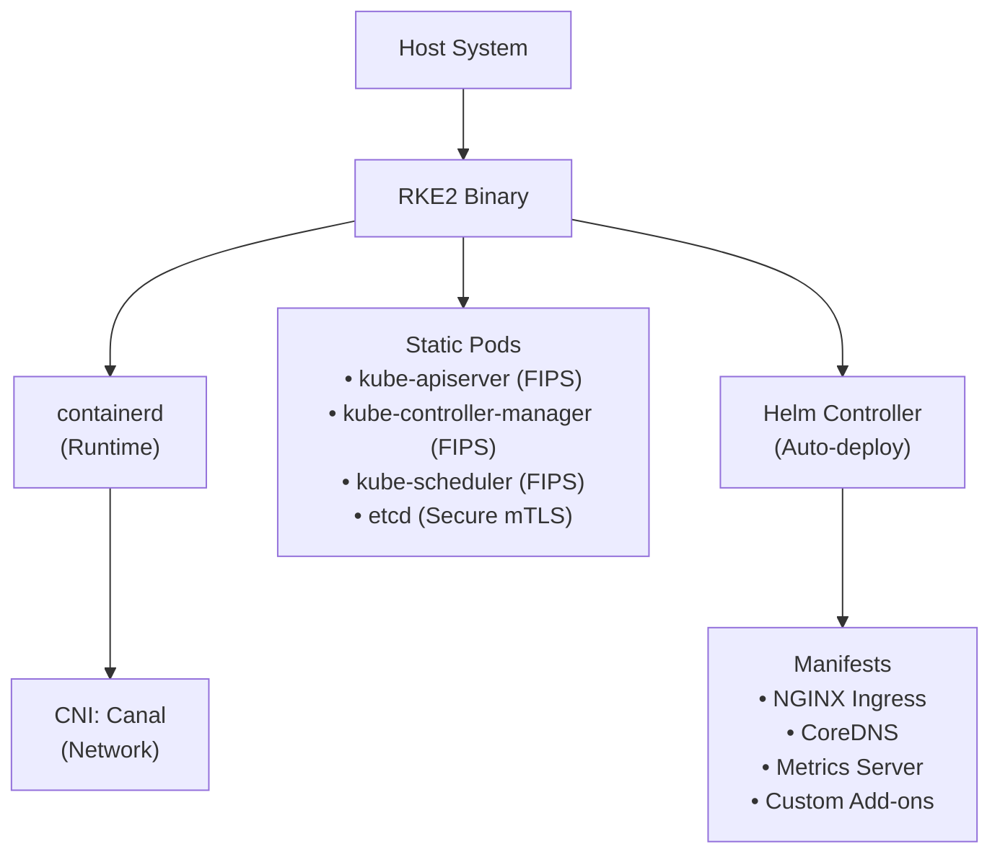
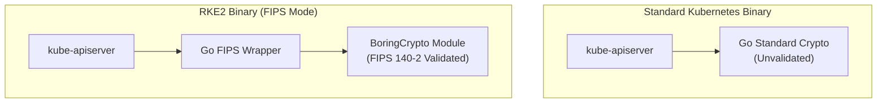

> **Toolkit Track** | Complexity: `[COMPLEX]` | Time: 50-55 minutes

## Overview

Welcome to the most secure corner of the Kubernetes ecosystem. While most distributions prioritize developer speed or resource efficiency, RKE2 (Rancher Kubernetes Engine 2) was built with an entirely different foundational goal in mind: **uncompromising security compliance from the moment of installation.**

Known in its early development lifecycle as "RKE Government," RKE2 was specifically engineered to satisfy the incredibly stringent regulatory requirements of the U.S. Federal Government, the Department of Defense, and the most heavily regulated industries on Earth—including banking, healthcare, and critical physical infrastructure. It takes the operational simplicity of k3s (a single-binary deployment model with automated lifecycle management) and systematically swaps out the lightweight edge components for enterprise-grade, FIPS-compliant, deeply hardened alternatives. 

In this comprehensive module, you will master the "armored vehicle" of the Kubernetes distribution landscape. You will learn how to deploy mathematically proven FIPS-compliant clusters, enforce Center for Internet Security (CIS) benchmarks by default, navigate complex fully air-gapped network environments, manage etcd disaster recovery to remote object storage, and troubleshoot the unique and often frustrating challenges of a system that is designed to be "secure by constraint."

## Learning Outcomes

After completing this module, you will be able to:

- **Design** air-gapped Kubernetes architectures utilizing RKE2's self-contained artifact bundles and internal private registry overrides.
- **Configure** advanced etcd disaster recovery operations, including automated S3 off-site replication and single-node quorum restoration.
- **Diagnose** complex host-level security blocks, specifically distinguishing between SELinux label violations and AppArmor profile restrictions.
- **Evaluate** the distinct cryptographic boundaries of RKE2's `go-fips` compiled binary in comparison to standard upstream Kubernetes releases.
- **Orchestrate** zero-downtime, declarative cluster upgrades across both the control plane and worker nodes using the System Upgrade Controller.

## Why This Module Matters

**The $40 Million Compliance Trap**

It was 11:30 PM on a Tuesday, and the platform engineering team at "CyberShield Systems"—a major Tier 1 aerospace contractor—was finishing what they thought was a victory lap. They had just finalized a massive, multi-month migration of their satellite telemetry processing platform from legacy virtual machines to a state-of-the-art Kubernetes cluster built on standard upstream `kubeadm`. The entire deployment was automated with Terraform, the system's processing performance was measured at 3x faster than the legacy architecture, and the company's CTO was already drafting a press release about their successful "modernization journey."

The following Monday, an external team of federal compliance auditors arrived on-site for a routine pre-contract security review. Within four hours, the atmosphere on the engineering floor had shifted from triumph to absolute terror.

The lead auditor pointed to the API server binary running on the control plane. "Can you provide cryptographic proof that this was compiled using a FIPS 140-2 validated module?" The engineers looked at each other in confusion. The auditor then ran an automated scanner across the cluster nodes. "Your kubelet allows anonymous authentication. Your etcd datastore is accessible from the host network without strict mutual TLS validation. Your container workloads are running as the root user because you haven't enforced Pod Security Standards. You have 74 separate 'FAIL' results on the baseline CIS Kubernetes Benchmark."

Because CyberShield Systems could not mathematically prove compliance with strict federal mandates for cryptographic boundaries, and because they lacked hardened defaults, their primary government contract—worth in excess of $40 million annually—was placed on immediate administrative hold. The remediation effort wasn't just a matter of flipping a few configuration switches. The team had to completely rebuild their base machine images, learn how to compile custom Go binaries, rewrite hundreds of lines of deployment manifests, and implement complex external admission controllers to handle the security standards they had initially ignored. Every hour the cluster was non-compliant was an hour of lost revenue and severe reputational damage. The engineering team was bogged down in a bureaucratic nightmare of compliance checklists and security exception requests for four agonizing months.

**This is the exact problem RKE2 was built to solve.** 

When you utilize RKE2, you do not spend months "bolting on" security after the fact. RKE2 is **secure by design.** It ships out of the box with the FIPS-validated compiler, the CIS hardening profiles, and the necessary SELinux policies that take security engineers weeks to write manually. In this module, you will learn how to avoid the $40 million compliance trap by deploying a distribution that treats baseline security as a fundamental prerequisite, rather than an optional Day-2 operational task.

---

## 1. The Anatomy of a Hardened Distribution

RKE2 is frequently referred to in casual engineering circles as "k3s for the enterprise," but accepting that comparison at face value can be highly misleading. While both distributions share a similar single-binary installation philosophy and are maintained by the same parent organization, their internal architectures represent two completely divergent engineering philosophies.

### Analogy: The Dune Buggy vs. The Armored Personnel Carrier

- **k3s is a Dune Buggy:** It is stripped down for maximum speed, agility, and resource efficiency. It has no doors, no windshield, and utilizes a lightweight engine. It is perfectly designed for racing across the "dunes" of a resource-constrained edge device (such as a remote point-of-sale system or a Raspberry Pi) where every single megabyte of RAM is fiercely contested.
- **RKE2 is an Armored Personnel Carrier (APC):** It is fundamentally heavy. It is constructed with thick steel plating (FIPS-validated binaries), bulletproof glass (native CIS benchmark hardening), and a specialized engine engineered to survive an explosion (an embedded etcd datastore configured with strict mTLS). It is deliberately not the most resource-efficient vehicle on the market, but it is unequivocally the only vehicle you want to be inside when you are driving through the "warzone" of federal compliance audits and high-stakes hostile network environments.

### Component Differences: RKE2 vs. k3s vs. Upstream

Understanding the architectural substitutions RKE2 makes is critical for operating it effectively. The following table illustrates the core differences across three distinct deployment methodologies:

| Feature | k3s | RKE2 | Upstream (kubeadm) |
|---------|-----|------|-------------------|
| **Primary Focus** | Resource Efficiency | **Security Compliance** | Flexibility/Standards |
| **Datastore** | SQLite (default) | **etcd (embedded)** | etcd (external/manual) |
| **Cryptography** | Standard Go | **go-fips (BoringCrypto)**| Standard Go |
| **Ingress** | Traefik | **NGINX** | Optional |
| **CNI** | Flannel | **Canal (Calico+Flannel)** | Optional |
| **CIS Profile** | Manual Hardening | **Native Profile Support** | Manual Hardening |
| **Runtime** | containerd | **containerd (Hardened)** | Optional |

---

## 2. RKE2 Architecture Deep Dive

To truly master RKE2, you must look under the hood at how the binary bootstraps itself from a single executable into a fully functional, multi-node distributed system. Unlike standard `kubeadm`, which expects you to manually install a container runtime, configure your host networking, and then execute a complex series of commands, RKE2 *is* the installer, the container runtime, and the control plane all wrapped into one self-orchestrating package.

### The Bootstrap Sequence

When an administrator executes the `rke2 server` command on a fresh host, a highly complex and deterministic sequence of events is triggered:

1. **Self-Extraction:** The RKE2 binary extracts its internal dependencies (`kubectl`, `crictl`, a dedicated `containerd` instance, and the `etcd` binary) into a temporary staging directory on the host filesystem if they are not already present.
2. **Runtime Initialization:** RKE2 launches its internal, embedded instance of `containerd`, specifically applying heavily hardened configuration files that disable insecure container features and restrict runtime capabilities.
3. **Static Pod Generation:** RKE2 dynamically renders and writes physical Pod manifests for the core control plane components (kube-apiserver, kube-scheduler, and kube-controller-manager) directly to the `/var/lib/rancher/rke2/agent/pod-manifests/` directory.
4. **Kubelet Bootstrap:** The internal kubelet daemon starts up, immediately scans the static pod directory, detects the manifests, and begins executing the control plane containers.
5. **Helm Controller Initialization:** Once the kube-apiserver achieves a healthy, responding state, the specialized RKE2 Helm Controller spins up and begins deploying bundled essential add-ons (such as Canal for networking, CoreDNS for service discovery, and the NGINX Ingress controller) directly from pre-packaged Helm charts.



### Server vs. Agent Roles

RKE2 utilizes specific terminology to differentiate node responsibilities, simplifying the mental model of cluster architecture:

- **Server Node:** This node executes the full Kubernetes control plane suite (etcd datastore, apiserver, scheduler, controller-manager). By default, Server nodes can also execute standard application workloads, though in production environments, they are typically heavily tainted to prevent standard pods from competing for resources with the control plane. The Server node acts as the cryptographic source of truth for the cluster join token.
- **Agent Node:** This node executes only the necessary worker components: the `kubelet`, the `kube-proxy`, and the local `containerd` runtime. An Agent node joins the cluster by establishing a secure TLS connection to a Server node, authenticating via the cluster token, and awaiting workload scheduling instructions.

### Embedded etcd: The Quorum of Truth

Unlike k3s, which controversially allows the use of a lightweight SQLite database for single-node clusters to radically decrease memory consumption, RKE2 **exclusively** supports etcd as its backing datastore. 

- In a single-node deployment (often used for staging or isolated edge locations), RKE2 spins up a single-member etcd cluster.
- In a production multi-node control plane setup, you simply join additional "Server" nodes to the cluster using the shared token. RKE2's internal logic detects the new control plane nodes and automatically orchestrates them into a highly available (HA) etcd quorum utilizing the Raft consensus algorithm, entirely without manual etcd administration.

> **Pause and predict**: If RKE2 uses a single binary to manage everything from the CNI to the API Server, what happens to your cluster if the RKE2 binary file is accidentally deleted while the service is still running?
>
> *(Answer: The existing containers will continue to run because they are managed by the containerd child processes, but the control plane will become unresponsive. You won't be able to use `kubectl`, and if a node reboots, the cluster won't recover. The "all-in-one" binary is a convenience for installation, but it remains a single point of failure for management.)*

---

## 3. Security Pillar 1: FIPS 140-2 Compliance

The Federal Information Processing Standard (FIPS) Publication 140-2 is widely considered the "gold standard" for cryptographic security across global enterprises. It is crucial to understand that FIPS compliance is not simply about utilizing long passwords or selecting AES-256 encryption; it is fundamentally about the mathematical **implementation** of the cryptography itself being rigorously tested and validated by a recognized laboratory.

### How `go-fips` Works

The standard Go programming language (which Kubernetes is written in) utilizes its own internal, highly optimized library for executing cryptographic operations. While this library is exceptionally fast and generally considered secure by the open-source community, it has **not** been formally validated by the National Institute of Standards and Technology (NIST). 

To solve this, RKE2 is uniquely compiled using a specialized fork of the Go compiler (`go-fips`). This compiler systematically intercepts standard cryptographic function calls and replaces them with direct calls to **BoringCrypto**—a dedicated cryptographic module originally developed by Google that has successfully achieved formal FIPS 140-2 validation.



### Verifying the Cryptographic Boundary

A major part of operating in high-security environments is the burden of proof. How do you definitively prove to an aggressive auditor that your running cluster is actually utilizing validated cryptography?

1. **Check the Binary Symbols:** You can utilize the standard Linux `nm` utility to inspect the RKE2 executable file itself. By searching the compiled symbols, you can verify the presence of the injected BoringCrypto functions.
   ```bash
   nm /usr/bin/rke2 | grep "_Cfunc__goboringcrypto_"
   ```

2. **Check the Kernel State:** FIPS compliance is a "Full Stack" requirement. It does not matter if your application binary is FIPS-compliant if the underlying operating system kernel is not enforcing the same rules. The RKE2 binary is intelligent; it will explicitly refuse to operate in FIPS mode unless it detects that the underlying Linux kernel has FIPS enforcement actively enabled at the bootloader level.
   ```bash
   cat /proc/sys/crypto/fips_enabled
   # Should return "1"
   ```

---

## 4. Security Pillar 2: CIS Hardening by Default

The Center for Internet Security (CIS) Kubernetes Benchmark is an exhaustive, heavily researched document containing over 100 pages of strict requirements for securing a cluster against modern threat vectors. On a standard, vanilla `kubeadm` installation, an organization typically achieves a dismal 30-40% pass rate right out of the box, necessitating weeks of complex remediation work.

### The `profile` Flag

RKE2 dramatically simplifies this operational nightmare. Instead of forcing administrators to manually tune hundreds of obscure command-line arguments across the API server, scheduler, and kubelet, RKE2 allows you to enforce the benchmark via a single declarative configuration line located in the `/etc/rancher/rke2/config.yaml` file:

```yaml
profile: "cis-1.8"
```

> **Stop and think**: If the CIS profile automatically forces the `restricted` Pod Security Standard, what will happen to a legacy application that requires root access if you migrate it to RKE2 without modifying its manifest?
>
> *(Answer: The API Server will block the deployment entirely. To run it, you would need to explicitly exempt the namespace from the Pod Security Admission controller, though doing so would violate the CIS benchmark for that specific workload.)*

When this specific profile is declared before the cluster bootstraps, RKE2's internal logic intercepts the startup sequence and automatically enforces a massive suite of security controls:

1. **Pod Security Admissions (PSA):** RKE2 forces the `restricted` PSA profile globally across all namespaces (unless an explicit, heavily audited exemption is created). This means containerized applications **cannot** execute as the root user, **cannot** access host network or process namespaces, and **cannot** mount sensitive host filesystem paths.
2. **Kubelet Hardening:** The internal kubelet daemon is locked down. Anonymous authentication is entirely disabled, and the `protectKernelDefaults: true` flag is enforced, ensuring the kubelet will refuse to start if the host operating system's sysctl parameters are not tuned correctly.
3. **Control Plane Isolation:** The Kubernetes API Server is reconfigured to reject weak legacy encryption and only negotiate TLS connections utilizing strong, NIST-approved cipher suites.
4. **Audit Logging:** Comprehensive, verbose audit logging is enabled by default for all API requests, satisfying the critical "Who, What, When, and Where" traceability requirements demanded by forensic investigators and compliance auditors alike.

---

## 5. Host-Level Hardening: SELinux and AppArmor Diagnostics

Operating Kubernetes in a highly regulated environment means acknowledging that container isolation is inherently imperfect. RKE2 relies heavily on Mandatory Access Control (MAC) systems built directly into the Linux kernel to provide a secondary, impenetrable layer of defense around container workloads. Unlike many development-focused distributions where disabling SELinux or AppArmor is the first step in the installation guide, RKE2 natively embraces and demands them.

### The SELinux Labels

When you set `selinux: true` in your RKE2 configuration, the embedded `containerd` runtime actively interacts with the host's SELinux policy engine. It dynamically assigns highly specific security contexts (labels) to every process and file associated with a pod:
- **`container_runtime_t`**: The restrictive context applied to the `containerd` management process itself.
- **`container_t`**: The severely confined context applied to the actual running container application.
- **`svirt_sandbox_file_t`**: The exact context required for a confined container to successfully read or write to a volume mounted from the underlying host filesystem.

If a developer attempts to mount a host directory (even one with `chmod 777` permissions) into a pod, the kernel will physically block the read operation because the file lacks the `svirt_sandbox_file_t` label, resulting in maddening "Permission Denied" errors that cannot be solved by standard Linux file permissions.

### AppArmor: Path-Based Confinement

While SELinux relies on labeling every file and process, AppArmor restricts individual program capabilities based on file paths. It dictates exactly what a specific executable is allowed to do (e.g., "The NGINX binary is only allowed to read from `/var/www/` and bind to port 8080"). 

RKE2 automatically applies default, highly restrictive AppArmor profiles to its internal components and dynamically generates profiles for standard workloads to ensure they cannot execute malicious binaries or write to sensitive kernel interfaces (like `/proc` or `/sys`).

### Diagnosing AppArmor Policy Violations

When a pod attempts an action that violates its assigned AppArmor profile (such as attempting to execute a shell inside a confined container), the Linux kernel forcefully intercepts and terminates the system call. Because this block occurs at the kernel level, the Kubernetes API simply sees the container crash or fail to start, often surfacing a vague `CreateContainerError` or a generic exit code.

To effectively diagnose an AppArmor denial in an RKE2 environment, you must bypass `kubectl logs` entirely and interrogate the host system's audit daemon. You must parse the kernel ring buffer or the audit logs for explicit `DENIED` events:

```bash
# Query the kernel ring buffer for AppArmor blocks
dmesg -T | grep -i apparmor | grep -i denied

# Alternatively, search the system audit logs for the exact process attempting the breach
sudo cat /var/log/audit/audit.log | grep apparmor="DENIED"
```
These logs will reveal the exact binary path that was blocked and the specific operation (e.g., `open`, `exec`, `ptrace`) that triggered the kernel's defensive response.

---

## 6. Networking: The CNI Landscape

RKE2 takes a highly opinionated approach to cluster networking, departing significantly from its lightweight sibling, k3s. While k3s utilizes Flannel purely for its operational simplicity, RKE2 defaults to **Canal**, but robustly supports the "big three" enterprise Container Network Interfaces natively.

### CNI Comparison Matrix

The decision of which CNI to deploy during the initial cluster bootstrap is permanent and critical to the cluster's lifecycle. Review the following options carefully:

| CNI | Components | Security Focus | Complexity | When to Use |
|-----|------------|----------------|------------|-------------|
| **Canal** | Flannel + Calico | Network Policy | [MEDIUM] | Default; best balance of ease and security. |
| **Calico** | Calico (pure) | BGP / Scalability | [COMPLEX] | Large clusters, hybrid Windows/Linux. |
| **Cilium** | eBPF | Deep Observability | [HIGH] | Zero-trust, high-performance, eBPF requirements. |
| **Multus** | Multiple | Multi-homing | [HIGH] | Telco / NFV where pods need multiple NICs. |

### Why Canal?

RKE2 selected Canal as its default CNI because it represents the "Goldilocks" zone of enterprise networking. 
- It leverages **Flannel** to handle the underlying VXLAN network encapsulation (efficiently managing the complex task of routing packets from node to node across physical subnets).
- It concurrently leverages **Calico** exclusively for its powerful Network Policy engine, enforcing strict micro-segmentation rules regarding which specific pods are permitted to communicate with one another.

This architecture grants administrators the operational simplicity of Flannel combined with the stringent, enterprise-grade security controls of Calico's policy enforcement layer.

---

## 7. Air-Gapped Operations

In the realms of national defense, intelligence, and critical infrastructure, the term "Cloud Native" frequently translates to "Physically Disconnected." In these environments, your host servers possess absolutely zero network routing paths to the public internet. `curl` commands to GitHub will time out, and `docker pull` commands to public registries will instantly fail.

> **Stop and think**: If RKE2 is installed in a fully air-gapped environment with no internet access, how does the cluster handle pulling container images for new application deployments that aren't part of the core RKE2 bundle?
>
> *(Answer: You must configure RKE2 to use a private, internal container registry (like Harbor) using the `registries.yaml` file. You then need a separate process—often involving a secure cross-domain transfer—to manually move your application images from the outside world into that internal registry before the cluster can pull them.)*

### The Artifact-Driven Install

RKE2 was explicitly engineered for the "Data Diode" operational model. You do not conceptually "pull" an RKE2 installation from the web; you physically "carry" it into the environment.

1. **Download the Bundle:** On an internet-connected, untrusted machine, you download three specific artifacts:
   - The compiled RKE2 binary executable.
   - The standardized installation shell script.
   - The massive **Images Tarball** (a heavily compressed file, often exceeding 800MB, containing every necessary control plane container image).
2. **Sneakernet:** You physically transfer these files across the network boundary (often via a secure USB drive or a managed cross-domain file transfer appliance) into the secure, air-gapped zone.
3. **Local Seeding:** You carefully place the compressed tarball directly into `/var/lib/rancher/rke2/agent/images/`. When RKE2 starts, its internal containerd runtime will automatically unpack these images directly into its local cache, entirely bypassing the need to contact a public registry.

### Configuring Registry Overrides

For deploying your own organizational applications in an air-gapped scenario, you must instruct the RKE2 runtime to permanently redirect all public image pull requests to your internal, highly secure image repository (such as VMware Harbor or JFrog Artifactory):

```yaml
# /etc/rancher/rke2/registries.yaml
mirrors:
  "docker.io":
    endpoint:
      - "https://harbor.internal.corp"
```
This configuration forces containerd to invisibly reroute any deployment requesting an image from `docker.io` directly to your local, trusted `harbor.internal.corp` endpoint.

---

## 8. Helm Controller and Add-on Management

RKE2 ships with a powerful, built-in Helm Controller. This component allows platform administrators to manage the lifecycle of complex cluster add-ons purely declaratively, treating them as native Kubernetes resources.

> **Pause and predict**: If you manually edit the `rke2-ingress-nginx` Deployment using `kubectl edit`, what will happen to your changes after a few minutes?
>
> *(Answer: The RKE2 Helm Controller will detect that the live state of the Deployment has drifted from the state defined in the underlying Helm chart. It will automatically reconcile the resource and overwrite your manual changes. This is why you must use `HelmChartConfig` resources to apply persistent customizations.)*

### HelmChartConfig: The Power of Overrides

The core add-ons packaged with RKE2 (such as the Canal CNI, CoreDNS, and the NGINX Ingress controller) are deployed via Helm. However, you should never edit these base Helm charts directly on the filesystem, as they will be mercilessly overwritten during the next RKE2 binary upgrade.

To safely **override** the default settings of a bundled add-on, RKE2 provides a Custom Resource Definition (CRD) known as a `HelmChartConfig`. 

```yaml
apiVersion: helm.cattle.io/v1
kind: HelmChartConfig
metadata:
  name: rke2-ingress-nginx
  namespace: kube-system
spec:
  valuesContent: |-
    controller:
      metrics:
        enabled: true
```

By submitting this manifest to the cluster, the RKE2 Helm Controller will intercept the deployment of the `rke2-ingress-nginx` chart, dynamically inject your custom YAML values into the template, and redeploy the resource safely. This methodology guarantees that your bespoke configuration (such as enabling Prometheus metric scraping or injecting custom TLS certificates) survives cluster upgrades untouched.

---

## 9. Troubleshooting and Log Analysis

Because RKE2 bundles the container runtime, the network interface, and the entire control plane into a single managed binary and its child processes, your traditional Kubernetes troubleshooting workflow must adapt.

### The "Big Three" Log Locations

When an RKE2 node fails, you must follow a specific triage methodology to locate the root cause:

1. **The Orchestrator Layer:** If the RKE2 service itself is crash-looping or failing to start the underlying runtime, inspect the primary systemd unit: `journalctl -u rke2-server -f`.
2. **The Control Plane Layer (Static Pods):** If the API server is down, `kubectl` will be completely useless. You must interact directly with the embedded runtime using the `crictl` utility to view the raw logs of the static control plane pods:
   ```bash
   export CRI_CONFIG_FILE=/var/lib/rancher/rke2/agent/etc/crictl.yaml
   /var/lib/rancher/rke2/bin/crictl logs <pod-id>
   ```
3. **The Data Store Layer (etcd):** Persistent storage performance is the Achilles heel of any Kubernetes cluster. Frequently check the `rke2-server` journal logs for explicit "disk latency" warnings, which indicate that the underlying storage IOPS are insufficient to maintain the etcd Raft consensus quorum.

---

## 10. Lifecycle: Upgrades and Certificates

Maintaining compliance requires keeping the cluster up to date with the latest CVE patches. Upgrading a highly secure, enterprise-grade cluster is radically simplified in RKE2 via the integration of the **System Upgrade Controller (SUC)**.

### Declarative Upgrades

Instead of painstakingly SSHing into every individual node to manually swap binaries and restart services, the SUC allows you to treat the cluster version itself as a declarative resource. You simply deploy a customized `Plan` object directly to the Kubernetes API.

```yaml
apiVersion: upgrade.cattle.io/v1
kind: Plan
metadata:
  name: rke2-upgrade
spec:
  concurrency: 1
  version: v1.35.1+rke2r1
```
The System Upgrade Controller automatically detects this plan, safely cordons and drains the nodes one by one according to your concurrency limits, hot-swaps the underlying RKE2 binary, and restarts the services with zero application downtime.

### Certificate Rotation Mechanics

A catastrophic failure point in many upstream Kubernetes clusters is the expiration of the internal control plane TLS certificates (which typically default to a 12-month lifespan). If these certificates expire, the cluster goes entirely dark and requires a painful, manual cryptographic regeneration process. 

RKE2 mitigates this risk through automated lifecycle management. The RKE2 supervisor process continually monitors the validity of its internal certificates. Whenever the `rke2-server` process is restarted, it checks the expiration dates. If any critical control plane certificate is within 90 days of expiring, RKE2 silently rotates the keys and generates fresh certificates, entirely averting the dreaded "hidden time bomb" of an expired cluster.

---

## 11. etcd Disaster Recovery and S3 Backup Strategies

RKE2 natively integrates robust etcd backup and restore capabilities directly into its monolithic binary, completely eliminating the architectural need to deploy and manage external backup operators (like Velero) simply to protect the cluster's core state. Etcd is the absolute brain of the cluster; if the quorum is corrupted or permanently lost due to a catastrophic hardware failure, the entire operational state of the cluster is destroyed.

RKE2 automatically performs routine snapshots of the etcd database, saving them locally by default to `/var/lib/rancher/rke2/server/db/snapshots`. However, relying on local backups is a fundamental disaster recovery anti-pattern. If a node suffers a catastrophic disk failure, both the active database and its backups are annihilated simultaneously. 

To achieve true enterprise resilience, RKE2 supports streaming these snapshots directly to any S3-compatible object storage service (such as AWS S3, local MinIO, or Ceph RGW) automatically.

You configure this automated off-site replication by appending these parameters to your `/etc/rancher/rke2/config.yaml` on the server nodes:
```yaml
etcd-s3: true
etcd-s3-bucket: "rke2-disaster-recovery"
etcd-s3-access-key: "YOUR_ACCESS_KEY"
etcd-s3-secret-key: "YOUR_SECRET_KEY"
etcd-s3-region: "us-east-1"
etcd-s3-folder: "prod-cluster-01"
```

When a total disaster strikes and the etcd quorum is permanently unrecoverable, you must perform a highly destructive operation known as a **cluster reset**. This procedure forces a single, surviving control plane node to abandon the previous broken quorum and unilaterally declare itself a brand new, single-node cluster, deliberately seeding its initial state from a recovered snapshot.

The restoration sequence involves halting the RKE2 supervisor, invoking the binary with explicit restore flags, and subsequently starting the service to rebuild the state:
```bash
sudo systemctl stop rke2-server
sudo rke2 server \
  --cluster-reset \
  --cluster-reset-restore-path=<path-to-snapshot-file>
sudo systemctl start rke2-server
```
Once this "seed" node is online and healthy, you must systematically purge the old data directories on all other server nodes and rejoin them to this newly restored cluster to re-establish high availability.

---

## Did You Know?

1. RKE2's first major production release (v1.18.4+rke2r1) dropped in August 2020, originally carrying the highly restricted moniker "RKE Government" before expanding to broader commercial enterprise use.
2. The core RKE2 installation tarball weighs in at an impressive ~800MB, packaging up all dependencies including containerd, etcd, and core network plugins to ensure absolute zero external downloads are required during an air-gapped installation.
3. According to published security audits, standard vanilla `kubeadm` deployments fail over 60 individual security checks within the CIS Kubernetes Benchmark upon initial deployment, requiring weeks of manual mitigation.
4. The built-in RKE2 etcd snapshot controller natively supports 4 distinct S3 storage tier classes, allowing automated lifecycle transitions from standard hot storage directly to cold Glacier storage for long-term compliance retention.

---

## Common Mistakes

| Mistake | Why It Happens | How to Fix It |
|---------|----------------|---------------|
| **Forgetting `rke2-selinux`** | Assuming standard OS policies are enough to protect the host. | Explicitly install the `rke2-selinux` package via yum/rpm before starting the RKE2 service. |
| **Mixing FIPS and non-FIPS** | Booting a non-FIPS kernel but expecting the RKE2 binary to enforce FIPS. | Enable FIPS mode at the host bootloader level (e.g., GRUB configuration) and reboot. |
| **OOMing the API Server** | Assuming RKE2 is lightweight like k3s and only provisioning 4GB RAM. | Provision server nodes with sufficient memory (minimum 8GB+ for production workloads). |
| **Token Exposure** | Hardcoding and storing the sensitive node-token in version controlled Git repositories. | Utilize an enterprise secrets management system (like HashiCorp Vault) to dynamically inject the join token. |
| **Canal with Windows** | The default Canal CNI relies heavily on Linux-specific Flannel mechanics, which doesn't suit hybrid clusters. | Switch the `cni` configuration strictly to pure Calico for all Windows Server deployments. |
| **Ignoring Snapshots** | Assuming that simply enabling auto-snapshots guarantees data survival. | Periodically perform physical, dry-run test restores of your cluster state to verify integrity. |
| **Clock Drift** | Virtual machine hypervisors cause the node's internal clock to drift, breaking strict TLS handshakes. | Ensure the NTP/Chrony service is aggressively active and synced on all nodes. |

---

## Quiz

<details>
<summary>1. A federal auditor has arrived on-site and demands proof that your newly deployed RKE2 cluster is actually utilizing FIPS 140-2 validated cryptographic modules, rather than just standard Go cryptography. How do you definitively demonstrate this boundary to the auditor?</summary>
You can prove this by inspecting the RKE2 binary itself for the presence of the BoringCrypto module. By running `nm /usr/bin/rke2 | grep "_Cfunc__goboringcrypto_"`, you demonstrate that the binary was compiled with the FIPS wrapper that intercepts standard cryptographic calls. This proves that the binary is physically capable of enforcing the required cryptographic boundaries. Furthermore, you must also show that the underlying Linux kernel has FIPS mode enabled (e.g., by checking `/proc/sys/crypto/fips_enabled`). RKE2's FIPS compliance is holistic; the binary will only operate in validated FIPS mode if it detects that the host operating system kernel is also strictly enforcing FIPS standards.
</details>

<details>
<summary>2. You deploy a monitoring DaemonSet that mounts a host directory (`/var/log/app`) with 777 permissions. However, the pod consistently crashes with "Permission Denied" errors when trying to read the files. What is the most likely cause in an RKE2 environment?</summary>
The most likely cause is an SELinux policy violation, as RKE2 embraces and enforces Mandatory Access Control by default. Even though the standard Linux file permissions (like 777) technically allow broad access, the SELinux context on the host directory likely lacks the `svirt_sandbox_file_t` label required for a confined container process to interact with it. To resolve this issue, you need to append the `:z` or `:Z` flag to your volume mount definition within the pod specification. This flag explicitly instructs the container runtime to automatically relabel the target directory with the correct SELinux context before the pod starts, allowing the container to read and write without being blocked by the kernel.
</details>

<details>
<summary>3. A developer attempts to deploy a legacy application pod that requests `privileged: true` and host network access. Your RKE2 cluster was bootstrapped with the `profile: "cis-1.8"` flag in its config file. What is the immediate result of this deployment attempt?</summary>
The Kubernetes API server will immediately reject the pod deployment request and return an error to the user. When the CIS profile is enabled in RKE2 via the config file, it automatically configures Pod Security Admissions (PSA) to enforce the `restricted` profile globally across the cluster. This strict enforcement proactively prevents any pod from running as the root user, utilizing host networking namespaces, or gaining privileged escalation capabilities. Because the developer's manifest explicitly requested `privileged: true`, the admission controller intercepts the request, blocks the creation of the pod, and issues a webhook denial message detailing the exact security standards that were violated.
</details>

<details>
<summary>4. Your team has written a custom security scanning tool packaged as a Helm chart. You need this tool to automatically deploy and reconcile itself during the initial bootstrap of every new RKE2 edge node, without requiring a separate CI/CD pipeline step. How do you achieve this?</summary>
You achieve this by leveraging RKE2's built-in Helm Controller and its dedicated static manifest directory. By placing your custom Helm chart and its corresponding `HelmChart` manifest directly into the `/var/lib/rancher/rke2/server/manifests/` directory on the server node, RKE2 will automatically detect the new files. The Helm Controller is designed to continuously monitor this directory, parse any valid manifests it finds, and seamlessly deploy the chart as part of the cluster bootstrap process. This mechanism guarantees that your custom security tool is fully running and active before any standard user workloads can be scheduled on the new edge node.
</details>

<details>
<summary>5. You inherit an RKE2 cluster that was deployed exactly 10 months ago. You are concerned because upstream Kubernetes clusters often suffer catastrophic outages when their 1-year control plane certificates expire. What action do you need to take to prevent this outage in RKE2?</summary>
In most operational scenarios, you simply need to restart the `rke2-server` service on your control plane nodes to trigger a renewal. RKE2 is intentionally designed to automatically check the expiration dates of its internal TLS certificates during its standard startup sequence. If the system detects that any control plane certificates are within 90 days of expiring, it will automatically rotate them and generate fresh credentials. This automated lifecycle management eliminates the need for complex, manual certificate generation procedures and prevents the "hidden time bomb" of cluster expiration, provided the service is restarted periodically during routine OS patching or maintenance windows.
</details>

<details>
<summary>6. Your enterprise architecture team dictates that your new RKE2 cluster must support both standard Linux microservices and legacy .NET applications running on Windows Server worker nodes. Which Container Network Interface (CNI) should you configure during installation?</summary>
You should configure the cluster to use pure Calico (`cni: calico`) rather than relying on the default Canal CNI during installation. While Canal is an excellent and simple choice for standard Linux-only deployments, its reliance on Flannel for VXLAN network encapsulation does not provide optimal or native support for complex hybrid Windows/Linux environments. Calico, on the other hand, offers first-class routing, robust network policy enforcement, and native dataplane integrations across both operating systems. Choosing Calico ensures seamless cross-platform communication and allows you to apply strict, unified security controls between your Linux microservices and Windows workloads.
</details>

<details>
<summary>7. You attempt to deploy an NGINX container, but the pod immediately crashes with a `CreateContainerError`. Inspection via `kubectl logs` yields no output. System logs show numerous `apparmor="DENIED"` events referencing the container process. What is causing this failure and how do you investigate?</summary>
The failure is caused by an AppArmor profile violation at the host's Linux kernel level, which intercepts and blocks the container process before it can fully execute. RKE2 enforces strict AppArmor confinement profiles by default to prevent malicious processes from altering kernel states or accessing protected host binaries. To thoroughly investigate this, you must bypass the Kubernetes API and directly query the host's audit subsystem using commands like `dmesg -T | grep -i apparmor` or by analyzing `/var/log/audit/audit.log` to identify the specific file path or system call (such as a forbidden `exec` command) that triggered the kernel's defensive block.
</details>

<details>
<summary>8. A catastrophic hardware failure destroys two out of three of your RKE2 server nodes, permanently shattering the etcd Raft quorum. The remaining node is healthy but the cluster is entirely unresponsive. How must you restore operational state?</summary>
You cannot simply restart the node; you must execute a destructive "cluster reset" operation on the single surviving server node. First, you halt the `rke2-server` service. Then, you execute the RKE2 binary with the `--cluster-reset` and `--cluster-reset-restore-path` flags, pointing it to your most recent verified etcd snapshot (either locally cached or downloaded from S3). This forces the node to abandon the dead quorum, seed a new internal etcd database from the snapshot, and declare itself a new single-node cluster. Once the API is responding, you must purge the databases on the failed nodes and rejoin them to the new quorum.
</details>

---

## Hands-On Exercise: Deploying a Hardened RKE2 Cluster

In this exercise, you will provision a secure RKE2 control plane, enforce strict CIS benchmarks, validate the security boundary, and configure automated S3 datastore backups.

### Task 1: Prepare the Host OS Parameters
Before RKE2 can successfully enforce the CIS profile, the underlying host operating system kernel must be prepared to accept stringent security restrictions. 
<details>
<summary>Solution: Set Kernel Sysctls</summary>
Write the required sysctl parameters to a dedicated configuration file and apply them:
```bash
cat <<EOF | sudo tee /etc/sysctl.d/90-rke2.conf
vm.overcommit_memory = 1
kernel.panic = 10
EOF
sudo sysctl -p /etc/sysctl.d/90-rke2.conf
```
</details>

### Task 2: Configure the RKE2 Supervisor
Create the declarative configuration file that will dictate the cluster's security posture upon bootstrap.
<details>
<summary>Solution: Create `config.yaml`</summary>
Create the `/etc/rancher/rke2/` directory and populate the configuration file:
```bash
sudo mkdir -p /etc/rancher/rke2/
cat <<EOF | sudo tee /etc/rancher/rke2/config.yaml
profile: "cis-1.8"
selinux: true
write-kubeconfig-mode: "0644"
EOF
```
</details>

### Task 3: Install and Bootstrap the Cluster
Execute the installation script and initiate the RKE2 supervisor daemon to build the control plane.
<details>
<summary>Solution: Install RKE2</summary>
Run the official curl-based installer and enable the systemd service:
```bash
curl -sfL https://get.rke2.io | sudo sh -
sudo systemctl enable --now rke2-server
```
*Note: This process may take several minutes as containerd pulls the core system images and etcd establishes quorum.*
</details>

### Task 4: Verify CIS Hardening Enforcement
Attempt to deploy a non-compliant workload to prove that the API server is actively enforcing the Pod Security Admission controller as mandated by the CIS profile.
<details>
<summary>Solution: Deploy a Root Pod</summary>
Attempt to run an Alpine container explicitly as the root user:
```bash
kubectl run root-test --image=alpine --overrides='{"spec":{"securityContext":{"runAsUser":0}}}'
```
You should immediately receive a webhook denial from the API server confirming that running as root is strictly forbidden by the enforced `restricted` profile.
</details>

### Task 5: Setup S3 etcd Backups
Configure the cluster to automatically stream its etcd snapshots to a remote S3 bucket for disaster recovery compliance.
<details>
<summary>Solution: Append S3 Config</summary>
Edit the `/etc/rancher/rke2/config.yaml` to include the S3 target and restart the service to apply the change:
```bash
cat <<EOF | sudo tee -a /etc/rancher/rke2/config.yaml
etcd-s3: true
etcd-s3-bucket: "rke2-disaster-recovery"
etcd-s3-access-key: "YOUR_ACCESS_KEY"
etcd-s3-secret-key: "YOUR_SECRET_KEY"
etcd-s3-region: "us-east-1"
EOF
sudo systemctl restart rke2-server
```
</details>

### Task 6: Perform a Dry-Run etcd Restoration
Simulate a catastrophic failure by manually triggering the cluster reset and restore sequence using a local snapshot.
<details>
<summary>Solution: Execute Cluster Reset</summary>
Stop the service, invoke the restore command, and bring the service back online:
```bash
# Locate your most recent snapshot
SNAPSHOT=$(sudo ls -1 /var/lib/rancher/rke2/server/db/snapshots/ | tail -n 1)

# Execute the reset sequence
sudo systemctl stop rke2-server
sudo rke2 server \
  --cluster-reset \
  --cluster-reset-restore-path=/var/lib/rancher/rke2/server/db/snapshots/$SNAPSHOT
sudo systemctl start rke2-server
```
</details>

### Success Criteria
- [ ] The `kubectl get nodes` command reports the server node status as `Ready`.
- [ ] The privileged `root-test` pod is definitively and successfully rejected by the API server.
- [ ] Internal `containerd` execution logs show that the FIPS cryptographic mode is actively engaged.
- [ ] A successful snapshot file is populated within the remote S3 bucket directory.

---

## Next Module

Next up: [Module 14.6: Managed Kubernetes](/platform/toolkits/infrastructure-networking/k8s-distributions/module-14.6-managed-kubernetes/) — exploring the architectural trade-offs of surrendering control plane management to AWS EKS, Google GKE, and Azure AKS.