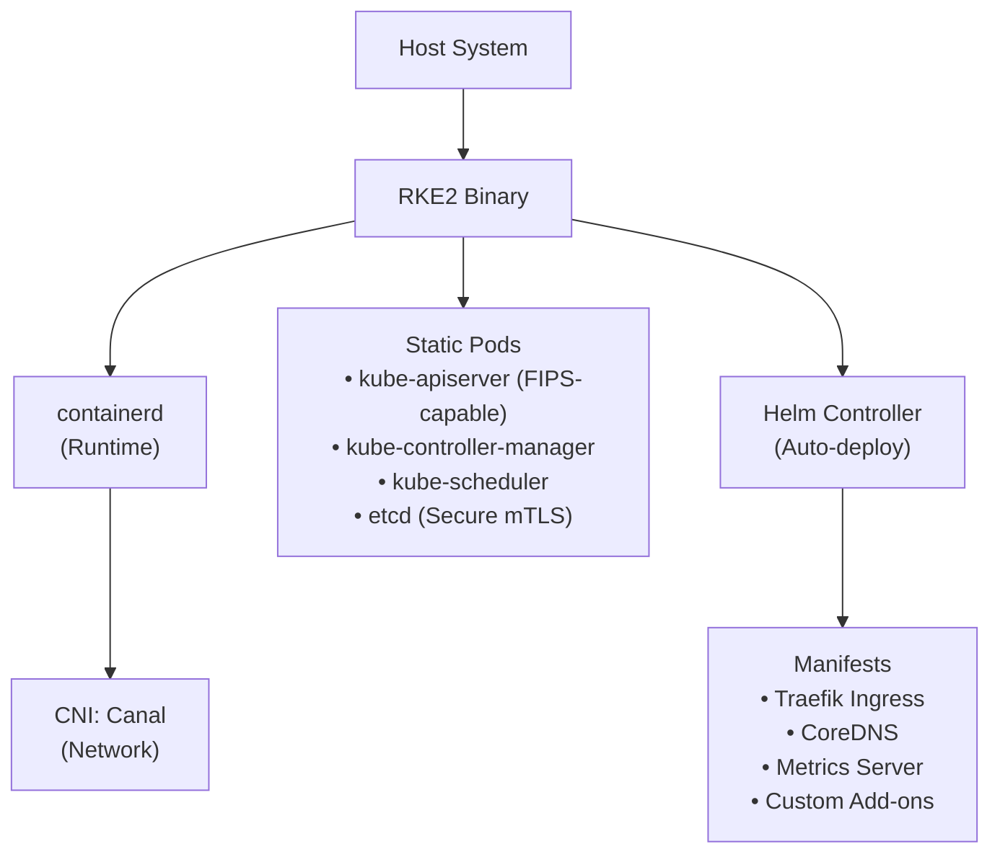
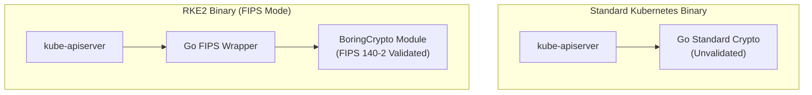

> **Toolkit Track** | Complexity: `[COMPLEX]` | Time: 50-55 minutes

## Overview

Welcome to the most security-conscious corner of the Kubernetes distribution landscape. While many distributions optimize for developer velocity or minimal resource footprint, RKE2 (Rancher Kubernetes Engine 2) was engineered with a different foundational goal: **uncompromising security compliance from the moment of installation.** That positioning shapes every architectural choice you will explore in the sections ahead, from embedded etcd to declarative upgrades.

Known in its early development lifecycle as "RKE Government," RKE2 is a **SUSE/Rancher distribution of upstream Kubernetes**. It is CNCF-conformant Kubernetes, but RKE2 itself is not a CNCF project—the CNCF project is Kubernetes, and RKE2 packages it with hardened defaults. RKE2 takes operational patterns from k3s (a single-binary deployment model with automated lifecycle management) and systematically swaps lightweight edge components for enterprise-grade, FIPS-capable, deeply hardened alternatives.

In this module you will master the "armored vehicle" of the distribution landscape. You will learn how to deploy FIPS-capable clusters, enforce Center for Internet Security (CIS) benchmarks by default, navigate fully air-gapped environments, manage etcd disaster recovery to remote object storage, and troubleshoot the unique challenges of a system designed to be secure by constraint. The focus stays on durable operational patterns—tokens, snapshots, MAC diagnostics, declarative upgrades—that remain relevant even when individual patch numbers change every quarter.

## What You'll Be Able to Do

After completing this module, you will be able to execute the following platform engineering tasks independently in regulated environments where evidence, repeatable install artifacts, and host-level security boundaries matter as much as cluster uptime.

- **Design** air-gapped Kubernetes architectures utilizing RKE2's self-contained artifact bundles and internal private registry overrides.
- **Configure** advanced etcd disaster recovery operations, including automated S3 off-site replication and single-node quorum restoration.
- **Diagnose** complex host-level security blocks, specifically distinguishing between SELinux label violations and AppArmor profile restrictions.
- **Evaluate** the distinct cryptographic boundaries of RKE2's `go-fips` compiled binary in comparison to standard upstream Kubernetes releases.
- **Orchestrate** zero-downtime, declarative cluster upgrades across both the control plane and worker nodes using the System Upgrade Controller.

## Why This Module Matters

**Hypothetical scenario: The Compliance Audit That Arrived Too Late** — the following narrative illustrates why hardened distributions exist; it is not a report of a specific customer incident.

It was late on a Tuesday evening, and the platform engineering team at a major aerospace contractor was finishing what they believed was a successful migration. They had moved a satellite telemetry processing platform from legacy virtual machines to a Kubernetes cluster built on standard upstream `kubeadm`. The deployment was automated with Terraform, processing performance improved substantially, and leadership was preparing an internal announcement about the modernization effort.

The following Monday, an external federal compliance audit team arrived for a routine pre-contract security review. Within hours, the engineering floor shifted from confidence to alarm. The lead auditor asked whether the API server binary was compiled with a FIPS 140-validated cryptographic module. The team could not produce proof. An automated scanner reported kubelet anonymous authentication enabled, etcd reachable without strict mutual TLS validation, and workloads running as root because Pod Security Standards were not enforced. CIS Kubernetes Benchmark checks failed across multiple control categories.

Because the organization could not demonstrate compliance with federal cryptographic and hardening mandates, a primary government contract was placed on administrative hold. Remediation required rebuilding base machine images, learning custom Go compilation workflows, rewriting deployment manifests, and implementing external admission controllers for standards they had initially deferred. The cluster remained under review for months while revenue and reputation pressure mounted.

**This is the exact problem RKE2 was built to solve.** When you utilize RKE2, you do not spend months bolting on security after the fact. RKE2 is **secure by design.** It ships with FIPS-capable compiler tooling, CIS hardening profiles, and SELinux integration that security teams often spend weeks writing manually. In this module you will learn how to avoid the compliance trap by deploying a distribution that treats baseline security as a prerequisite rather than an optional Day-2 task.

---

## The Secure Distribution Problem Space

Vanilla `kubeadm` is the reference assembly path for Kubernetes. It gives you maximum flexibility. You choose the container runtime, the CNI, the ingress controller, the certificate authority workflow, and every sysctl on every node. That flexibility is correct when a platform team owns the full stack and can document every decision in an architecture record. It is the wrong default when your problem statement includes regulated data, air-gapped networks, or auditors who expect evidence on day one rather than a remediation roadmap on day ninety.

Regulated and government environments impose requirements that upstream assembly does not satisfy out of the box. Cryptographic modules must be traceable to validated implementations. Host kernels must enforce FIPS mode before application binaries claim compliance. CIS benchmarks expect anonymous kubelet access disabled, audit logging enabled, and Pod Security Admission enforcing restricted profiles globally. Air-gapped sites cannot pull container images from public registries during bootstrap. SELinux or AppArmor must confine container processes even when Linux file permissions look permissive. Disaster recovery must include etcd snapshots stored off-node because local disk failure destroys both live state and local backups simultaneously.

A hardened distribution packages those guarantees into repeatable install artifacts. Instead of asking each cluster operator to become a security engineer, compiler expert, and etcd DBA, RKE2 ships a single self-contained binary, embeds etcd, bundles hardened containerd, applies CIS profiles through one configuration flag, streams etcd snapshots to S3-compatible storage, and seeds air-gapped installs from tarballs that contain every control-plane image. You still own operational decisions—CNI selection, ingress overrides, upgrade windows—but the distribution removes the blank-page problem that causes audit failures on freshly assembled kubeadm clusters.

The durable lesson is capability-based evaluation. Ask whether your environment requires FIPS-validated cryptography, offline artifact bundles, declarative rolling upgrades, or CIS enforcement at bootstrap. If several answers are yes, a hardened distribution like RKE2 belongs on your short list. If you need maximum component substitution freedom and already operate a dedicated security platform team, kubeadm or a lighter distribution may remain the better fit. Neither choice is morally superior; they optimize for different constraint profiles.

Kubernetes **1.35** remains the curriculum reference version for generic API behavior, while RKE2 release lines track their own Kubernetes minors on the v1.36 line as of mid-2026. When you compare lab exercises in this module to production planning, always read the vendor release notes for the exact `+rke2r` patch you intend to deploy rather than assuming feature parity with vanilla 1.35 documentation alone. Conformance means API compatibility, not identical bundled chart versions or ingress defaults.

---

## 1. The Anatomy of a Hardened Distribution

RKE2 is frequently referred to in casual engineering circles as "k3s for the enterprise," but accepting that comparison at face value can be highly misleading. Both distributions share a similar single-binary installation philosophy and are maintained under SUSE/Rancher, but their internal architectures represent divergent engineering philosophies.

### Analogy: The Dune Buggy vs. The Armored Personnel Carrier

Picture k3s as a dune buggy stripped for speed across open sand. It sheds weight everywhere it can because edge sites and developer laptops measure RAM in megabytes, not gigabytes. RKE2 is the armored personnel carrier following behind the convoy. It carries FIPS-capable binaries like steel plate, CIS defaults like laminated glass, and embedded etcd with strict mutual TLS like a engine compartment designed to survive blast pressure. The APC burns more fuel and needs wider roads, yet it is the vehicle you want when the environment includes compliance auditors, classified networks, or adversaries probing your control plane.

### Component Differences: RKE2 vs. k3s vs. Upstream

Understanding the architectural substitutions RKE2 makes is critical for operating it effectively, because day-two troubleshooting often traces back to which lightweight k3s component was replaced with an enterprise-hardened equivalent in the RKE2 build.

| Feature | k3s | RKE2 | Upstream (kubeadm) |
|---------|-----|------|-------------------|
| **Primary Focus** | Resource Efficiency | **Security Compliance** | Flexibility/Standards |
| **Datastore** | SQLite (default) | **etcd (embedded)** | etcd (external/manual) |
| **Cryptography** | Standard Go | **go-fips (BoringCrypto)**| Standard Go |
| **Ingress (new clusters)** | Traefik | **Traefik (v1.36+)** | Optional |
| **CNI** | Flannel | **Canal (Calico+Flannel)** | Optional |
| **CIS Profile** | Manual Hardening | **Native Profile Support** | Manual Hardening |
| **Runtime** | containerd | **containerd (Hardened)** | Optional |

> **Landscape snapshot — as of 2026-06. This changes fast; verify against vendor docs before relying on specifics.**
>
> | Attribute | Current upstream snapshot |
> |---|---|
> | Current release line | **v1.36.x** (latest patch **v1.36.1+rke2r2** on GitHub; **v1.36.2** upstream Kubernetes bump in progress per rancher/rke2 commit history) |
> | Go toolchain | **Go 1.26.x** (go-fips / BoringCrypto builds for FIPS environments) |
> | Default CNI | **Canal** (Calico network policy + Flannel overlay); **Calico** and **Cilium** selectable |
> | Default ingress (new clusters) | **Traefik** starting **v1.36**; **ingress-nginx** still available in v1.36, removed in **v1.37** after upstream EOL **March 2026** |
> | Upgrade mechanism | **System Upgrade Controller** with declarative `Plan` CRDs |
> | Air-gap artifacts | `rke2-images-core` tarball includes Traefik images; separate `rke2-images-ingress-nginx` tarball required if you retain nginx |

### Hardened-distro Rosetta

Compare distributions by capability, not marketing adjectives, because procurement slides rarely mention etcd quorum rules or air-gap tarball contents that operators live with for years.

| Capability | RKE2 | k3s | kubeadm / vanilla |
|---|---|---|---|
| Air-gap support | First-class artifact bundles + `registries.yaml` mirrors | Air-gap tarballs + mirror config | Manual image staging; you assemble |
| FIPS crypto path | `go-fips` / BoringCrypto compiled binaries + kernel FIPS mode | Standard Go crypto | Standard Go; you build custom |
| CIS defaults | Native `profile: cis-*` in config.yaml | Manual hardening | Manual hardening |
| Upgrade mechanism | System Upgrade Controller Plans | SUC + k3s-upgrade channel | kubeadm upgrade + OS restarts |
| Footprint | Heavier; embedded etcd mandatory | Lightest integrated binary | Depends on choices |

No row declares a winner. k3s optimizes edge footprint. RKE2 optimizes compliance packaging. kubeadm optimizes control. Map constraints first, then pick the row.

RKE2's relationship to Rancher Manager deserves a clarifying sentence because procurement teams conflate them. Rancher Manager is an optional multi-cluster UI and provisioning layer; RKE2 is the Kubernetes distribution that runs on the nodes themselves. You can install RKE2 with curl and systemd on bare metal or VMs without ever deploying Rancher Manager, and many regulated customers do exactly that to minimize attack surface. When Rancher Manager is present, it can import existing RKE2 clusters, but the distribution's security posture comes from the node binary and config.yaml rather than from the management server.

---

## 2. RKE2 Architecture Deep Dive

To master RKE2, you must understand how one binary bootstraps a multi-node distributed system. Unlike `kubeadm`, which expects you to install a container runtime and configure host networking separately, RKE2 **is** the installer, runtime supervisor, and control-plane orchestrator in one package. There is no host Docker dependency; static pods run the Kubernetes control plane under embedded containerd.

### The Bootstrap Sequence

When an administrator executes `rke2 server` on a fresh host, a deterministic sequence runs that differs sharply from kubeadm's multi-step assembly model where container runtime installation precedes control-plane initialization as separate administrative phases.

1. **Self-Extraction:** The RKE2 binary extracts internal dependencies (`kubectl`, `crictl`, dedicated `containerd`, and `etcd`) into staging directories if not already present.
2. **Runtime Initialization:** RKE2 launches embedded `containerd` with hardened configuration that disables insecure container features and restricts runtime capabilities.
3. **Static Pod Generation:** RKE2 renders Pod manifests for kube-apiserver, kube-scheduler, and kube-controller-manager into `/var/lib/rancher/rke2/agent/pod-manifests/`.
4. **Kubelet Bootstrap:** The internal kubelet scans static pod manifests and starts control plane containers.
5. **Helm Controller Initialization:** Once the API server is healthy, the RKE2 Helm Controller deploys bundled add-ons (Canal CNI, CoreDNS, Traefik ingress on new v1.36 clusters) from packaged Helm charts.


```mermaid
flowchart TD
    Host["Host System"] --> RKE2["RKE2 Binary"]
    RKE2 --> Containerd["containerd<br>(Runtime)"]
    Containerd --> CNI["CNI: Canal<br>(Network)"]
    
    RKE2 --> StaticPods["Static Pods<br>• kube-apiserver (FIPS-capable)<br>• kube-controller-manager<br>• kube-scheduler<br>• etcd (Secure mTLS)"]
    RKE2 --> HelmController["Helm Controller<br>(Auto-deploy)"]
    HelmController --> Manifests["Manifests<br>• Traefik Ingress<br>• CoreDNS<br>• Metrics Server<br>• Custom Add-ons"]
```

### Server vs. Agent Roles and the Token Join Model

RKE2 uses specific terminology for node responsibilities, and the words **server** and **agent** replace kubeadm's control-plane and worker vocabulary in documentation and systemd unit names throughout the cluster lifecycle.

- **Server Node:** Runs the full control plane (etcd, apiserver, scheduler, controller-manager). Server nodes can also run workloads by default, though production clusters typically taint them to reserve resources for control-plane stability. The first server generates the cluster join token.
- **Agent Node:** Runs kubelet, kube-proxy, and local containerd only. Agents join by connecting to a server URL with the shared token over TLS.

The token model is simpler than kubeadm's certificate-heavy bootstrap, but the token is a secret. Store it in a vault or secret manager, not in Git. Rotate tokens when nodes are decommissioned or when audit policy requires periodic credential refresh. For multi-server HA, additional servers join with the same token; RKE2 orchestrates etcd membership automatically.

### Embedded etcd: The Quorum of Truth

Unlike k3s, which allows SQLite for single-node clusters, RKE2 **exclusively** uses etcd as its backing datastore because regulated customers demanded the same Raft-backed consistency model as upstream Kubernetes without optional lightweight substitutes.

- Single-node deployments spin up a one-member etcd cluster suitable for staging or isolated edge locations.
- Multi-server HA joins additional server nodes via the shared token. RKE2 detects new control-plane members and expands the etcd Raft quorum without manual `etcdctl member add` ceremonies.

> **Pause and predict**: If RKE2 uses a single binary to manage everything from the CNI to the API server, what happens if the RKE2 binary file is accidentally deleted while the service is still running?
>
> *(Answer: Existing containers continue running because containerd child processes remain alive, but the control plane becomes unresponsive. You cannot use `kubectl`, and a node reboot prevents cluster recovery. The binary is convenient for installation but remains a management dependency you must protect.)*

### Private Registry Overrides with registries.yaml

Air-gapped and regulated environments rarely pull from Docker Hub directly. RKE2 reads `/etc/rancher/rke2/registries.yaml` (and the agent mirror path on workers) to redirect pulls, attach TLS credentials, and define insecure-registry exceptions when corporate policy allows. This file is the durable integration point between RKE2's embedded containerd and your internal Harbor, Artifactory, or cloud registry. Application teams still need a process to promote images into that registry; RKE2 only solves the runtime pull path.

Production HA topologies typically deploy three or five server nodes for etcd quorum and separate agent pools for workloads. Taint server nodes with `CriticalAddonsOnly` or custom taints so user pods never compete with apiserver latency spikes during etcd compaction. Load-balance agent join traffic across server endpoints using an internal TCP load balancer on port 9345 rather than pointing every agent at a single server IP that becomes a join bottleneck during fleet expansion. Document which server holds the bootstrap token generation responsibility and how you rotate tokens after security incidents without rebuilding the entire fleet.

---

## 3. Security Pillar 1: FIPS 140-2 Compliance

The Federal Information Processing Standard (FIPS) Publication 140-2 is widely considered a gold standard for cryptographic security in government and regulated industries. FIPS compliance is not about long passwords or selecting AES-256 in a config file. It is about the **implementation** of cryptography being tested and validated by a recognized laboratory.

### How `go-fips` Works

Standard Go (which Kubernetes uses) relies on its internal crypto library. That library is fast and widely trusted in open source, but it has **not** been formally validated by NIST for FIPS 140-2 purposes in the way auditors expect for federal systems.

RKE2 is compiled using a specialized Go toolchain (`go-fips`). This compiler intercepts standard cryptographic function calls and replaces them with calls to **BoringCrypto**—a module derived from BoringSSL that has achieved FIPS 140-2 validation.


```mermaid
flowchart TD
    subgraph Standard["Standard Kubernetes Binary"]
        API1["kube-apiserver"] --> Crypto1["Go Standard Crypto<br>(Unvalidated)"]
    end
    
    subgraph RKE2["RKE2 Binary (FIPS Mode)"]
        API2["kube-apiserver"] --> Wrapper["Go FIPS Wrapper"]
        Wrapper --> Boring["BoringCrypto Module<br>(FIPS 140-2 Validated)"]
    end
```

### Verifying the Cryptographic Boundary

Operating in high-security environments requires proof, not assertions, because assessors treat cryptographic claims as falsifiable hypotheses you must demonstrate with command output captured during controlled tests.

Demonstrate FIPS boundaries with host and binary evidence:

1. **Check the Binary Symbols:** Use `nm` to inspect the RKE2 executable for BoringCrypto symbols.
   ```bash
   nm /usr/bin/rke2 | grep "_Cfunc__goboringcrypto_"
   ```

2. **Check the Kernel State:** FIPS compliance is full-stack. The RKE2 binary refuses FIPS mode unless the Linux kernel has FIPS enforcement enabled.
   ```bash
   cat /proc/sys/crypto/fips_enabled
   # Should return "1"
   ```

Document both checks in your compliance evidence binder. Auditors frequently ask for command output captured during cluster acceptance testing, not merely architecture diagrams.

Building a compliance evidence package for RKE2 differs from documenting a kubeadm cluster because many controls are satisfied at install time rather than through post-hoc tickets. Capture the `/etc/rancher/rke2/config.yaml` file showing `profile: cis-1.8` and `selinux: true`. Archive `nm` output proving BoringCrypto symbols exist in the server binary. Store kernel FIPS state from `/proc/sys/crypto/fips_enabled` on every control-plane node after reboot. Export a sample of Kubernetes audit logs demonstrating API requests are recorded with user identity. Run the CIS benchmark scanner your assessor accepts and attach the report showing pass rates on controls RKE2 claims by default.

Operational evidence matters too. Show etcd snapshot objects in S3 with dated keys proving backups ran during the assessment window. Demonstrate a staged restore in a lab cluster and attach the runbook your team followed. Record System Upgrade Controller Plan objects in Git to prove patch cadence is declarative rather than ad hoc SSH sessions. When assessors ask whether ingress controllers are supported, cite release notes showing Traefik is the maintained default path after ingress-nginx retirement rather than claiming an unmaintained chart will persist indefinitely.

Finally, document who owns exceptions. CIS profiles and PSA restrictions inevitably collide with legacy vendor software that demands root or host paths. Maintain a living register of namespace exemptions with approver names, review dates, and compensating controls. Auditors treat undocumented exceptions as findings; they treat documented, time-bounded exceptions as managed risk. RKE2 gives you secure defaults, but organizational process still determines whether those defaults survive contact with real enterprise software portfolios. Revisit the register quarterly even when no new exemptions were requested, because stale approvals erode the same trust CIS enforcement was meant to establish.

---

## 4. Security Pillar 2: CIS Hardening by Default

The Center for Internet Security (CIS) Kubernetes Benchmark is an exhaustive document with strict requirements for securing clusters against modern threat vectors. On vanilla `kubeadm`, organizations often achieve low pass rates initially and spend weeks on remediation.

### The `profile` Flag

RKE2 simplifies CIS enforcement. Instead of tuning hundreds of command-line arguments across apiserver, scheduler, and kubelet, you declare a profile in `/etc/rancher/rke2/config.yaml`:

```yaml
profile: "cis-1.8"
```

> **Stop and think**: If the CIS profile automatically forces the `restricted` Pod Security Standard, what happens to a legacy application that requires root access if you migrate it to RKE2 without modifying its manifest?
>
> *(Answer: The API server blocks deployment. You must exempt the namespace from Pod Security Admission—doing so creates a documented exception that auditors will review.)*

When this profile is declared before bootstrap, RKE2 enforces a suite of controls that align with CIS Kubernetes Benchmark expectations without requiring you to hand-tune hundreds of apiserver flags across every server node.

1. **Pod Security Admission (PSA):** RKE2 forces the `restricted` PSA profile globally unless an audited exemption exists. Containers cannot run as root, use host network namespaces, or mount sensitive host paths without explicit policy changes.
2. **Kubelet Hardening:** Anonymous authentication is disabled. `protectKernelDefaults: true` ensures kubelet refuses to start if host sysctl parameters are incorrect.
3. **Control Plane Isolation:** The API server rejects weak legacy encryption and negotiates TLS with approved cipher suites.
4. **Audit Logging:** Verbose audit logging captures who changed what and when—critical for forensic investigations.

---

## 5. Host-Level Hardening: SELinux and AppArmor Diagnostics

Container isolation is imperfect. RKE2 relies on Mandatory Access Control (MAC) in the Linux kernel as a secondary defense layer. Unlike development-focused guides that disable SELinux first, RKE2 expects MAC enabled and configured.

### The SELinux Labels

When you set `selinux: true` in RKE2 configuration, embedded `containerd` assigns security contexts to pod processes and mounted volumes:

- **`container_runtime_t`**: Context for the `containerd` management process.
- **`container_t`**: Confined context for running container applications.
- **`svirt_sandbox_file_t`**: Context required for a container to read or write host-mounted volumes.

If a developer mounts a host directory with `chmod 777`, the kernel may still block access because the directory lacks `svirt_sandbox_file_t`. Standard Linux permissions cannot override MAC denial.

### AppArmor: Path-Based Confinement

AppArmor restricts program capabilities by executable path. RKE2 applies default AppArmor profiles to internal components and generates profiles for workloads to block execution of unexpected binaries or writes to sensitive kernel interfaces.

### Diagnosing SELinux vs. AppArmor Blocks

These failures look similar from Kubernetes (`CreateContainerError`, permission denied in logs) but require different fixes because SELinux labels objects while AppArmor profiles paths and capabilities independently of Unix permission bits.

| Signal | Likely MAC | Investigation | Typical Fix |
|--------|-----------|---------------|-------------|
| Volume mount fails despite 777 permissions | SELinux | `ausearch -m avc -ts recent` | Add `:z` or `:Z` to volumeMount |
| Binary exec denied inside container | AppArmor | `dmesg \| grep apparmor` | Adjust profile or use unconfined annotation (audited) |
| Pod starts on permissive host, fails on enforcing | SELinux | Compare `getenforce` output | Install `rke2-selinux` package; set enforcing |

Query AppArmor denials directly on the host when Kubernetes events and container logs stay empty despite repeated pod restart attempts during incident response.

```bash
dmesg -T | grep -i apparmor | grep -i denied
sudo cat /var/log/audit/audit.log | grep apparmor="DENIED"
```

The logs reveal the blocked path and syscall, which is why MAC troubleshooting belongs in host audit workflows rather than solely in kubectl-centric runbooks that assume container logs always exist.

When you **diagnose** host-level security blocks in RKE2, start by identifying which MAC system is active on the node. RHEL and derivatives often run SELinux enforcing with AppArmor absent, while Ubuntu may run AppArmor profiles with SELinux permissive or disabled. Run `getenforce` on RHEL and `aa-status` on Ubuntu before touching pod specs. Permission denied on a volume mount with world-writable Unix modes strongly suggests SELinux context mismatch; use `ausearch -m avc -ts recent` and look for `svirt_sandbox_file_t` denials. Exec failures with empty container logs and `apparmor="DENIED"` in audit output point to AppArmor path rules instead. Teaching your on-call runbook to **distinguish** these two failure modes saves hours of misapplied fixes like chmod or securityContext tweaks that cannot override MAC.

---

## 6. Networking: CNI and Ingress Landscape

RKE2 takes an opinionated networking approach. k3s defaults to Flannel alone for simplicity. RKE2 defaults to **Canal** while supporting Calico and Cilium for teams with advanced requirements.

### CNI Comparison Matrix

| CNI | Components | Security Focus | Complexity | When to Use |
|-----|------------|----------------|------------|-------------|
| **Canal** | Flannel + Calico | Network Policy | [MEDIUM] | Default; balance of ease and policy |
| **Calico** | Calico (pure) | BGP / Scalability | [COMPLEX] | Large clusters, hybrid Windows/Linux |
| **Cilium** | eBPF | Deep Observability | [HIGH] | Zero-trust, eBPF observability |
| **Multus** | Multiple | Multi-homing | [HIGH] | Telco / NFV multi-NIC pods |

Canal combines Flannel VXLAN overlay routing with Calico network policy enforcement. You get operational simplicity for pod networking plus micro-segmentation between workloads without installing two separate CNIs manually. Teams that later require eBPF observability can migrate toward Cilium by changing the `cni` setting at install time, understanding that CNI migration on live clusters is a planned outage project rather than a toggle. Windows worker nodes remain a special case: pure Calico is the documented path when Linux and Windows nodes must share policy semantics, because Canal's Flannel leg assumes Linux-centric overlay behavior that hybrid clusters outgrow quickly.

### Ingress: Traefik Becomes Default in v1.36

Upstream **ingress-nginx** reached end-of-life in **March 2026**. RKE2 responded by making **Traefik the default ingress controller for new clusters starting in v1.36**. Existing clusters upgraded to v1.36 retain their prior default ingress class to avoid breaking running services. ingress-nginx remains available in v1.36 for teams that supply images manually; it is scheduled for removal in **v1.37**.

For new greenfield clusters, plan on Traefik unless corporate standards mandate another controller. Disable bundled ingress with `ingress-controller: none` and install your approved controller if required. Customize Traefik via `HelmChartConfig` when you need debug logging, metrics scraping, or Gateway API integration documented in the RKE2 networking guide.

Teams migrating from ingress-nginx should schedule explicit cutover tests because default ingress class annotations on existing Ingress objects may still reference nginx after upgrade even though new defaults favor Traefik on fresh installs. Inventory Ingress and IngressClass resources before bumping to v1.36, update annotations or HelmChartConfig values deliberately, and validate TLS certificates terminate correctly through the new controller path in staging before production Plans execute.

```yaml
apiVersion: helm.cattle.io/v1
kind: HelmChartConfig
metadata:
  name: rke2-traefik
  namespace: kube-system
spec:
  valuesContent: |-
    logs:
      general:
        level: DEBUG
```

Air-gapped installs must note that `rke2-images-core` now ships Traefik images instead of ingress-nginx. Teams retaining nginx must add the separate `rke2-images-ingress-nginx` tarball to their artifact bundle.

Gateway API adopters should note that RKE2 documents Traefik as the path for Gateway API resources, with HelmChartConfig toggles for experimental channel features when your platform standards require TCPRoute or other pre-GA kinds. Read networking release notes before enabling experimental channels in production, because CRD lifecycle behavior changed across 2026 minor releases and disabling Traefik after enabling Gateway API can remove CRDs your teams already consume.

---

## 7. Air-Gapped Operations

In national defense, intelligence, and critical infrastructure, "cloud native" often means **physically disconnected**. Hosts have no route to the public internet. `curl` to GitHub times out. Public registry pulls fail immediately.

> **Stop and think**: If RKE2 runs fully air-gapped with no internet access, how does the cluster pull images for application deployments not bundled with RKE2?
>
> *(Answer: Configure a private registry via `registries.yaml` and promote application images into that registry through an approved cross-domain transfer process.)*

### The Artifact-Driven Install

RKE2 supports the "data diode" operational model. You do not pull an installation from the web inside the secure zone; you carry artifacts across the boundary.

1. **Download the Bundle:** On a connected staging machine, download the RKE2 binary, install script, and **images tarball** containing control-plane images.
2. **Sneakernet:** Transfer artifacts via approved media or cross-domain appliances into the secure zone.
3. **Local Seeding:** Place the tarball in `/var/lib/rancher/rke2/agent/images/`. RKE2 unpacks images into containerd local cache at startup.

### Configuring Registry Overrides

Direct all public registry references to internal mirrors so application teams cannot accidentally depend on registries that air-gapped nodes will never reach during normal operations or failure recovery.

```yaml
# /etc/rancher/rke2/registries.yaml
mirrors:
  "docker.io":
    endpoint:
      - "https://harbor.internal.corp"
configs:
  "harbor.internal.corp":
    tls:
      insecure_skip_verify: false
```

Test mirror connectivity from each node before declaring the cluster production-ready. Air-gap success is defined by reproducible installs, not by a single heroic bootstrap on one server.

### Designing an Air-Gapped RKE2 Reference Architecture

Platform teams that **design** air-gapped RKE2 clusters typically document three zones even when the physical network is a single enclave. The staging bastion sits in a connected enclave where engineers download RKE2 release artifacts, image tarballs, and chart versions from vendor release pages. The transfer zone implements whatever cross-domain solution your organization mandates, whether that is optical media, one-way diodes, or human-reviewed file drops. The production enclave hosts RKE2 servers and agents that never initiate outbound connections to public registries.

Within the production enclave, Harbor or an equivalent registry becomes the single source of truth for application images. RKE2's `registries.yaml` mirrors point containerd at that registry for every namespace. Bootstrap artifacts land on each node before `systemctl enable rke2-server` runs: the binary, the install script, the core images tarball, and any optional tarballs such as ingress-nginx if policy requires it on v1.36. Configuration management tools like Ansible or Puppet then lay down identical `config.yaml` files so every server enforces the same CIS profile and SELinux posture.

Change management in air-gap differs from connected clusters because you cannot `kubectl apply` a chart that references an image nobody promoted yet. Establish a promotion checklist: image scanned, signed where policy requires, copied into Harbor, digest recorded in Git, then manifest applied. RKE2's Helm Controller will happily reconcile a chart spec referencing a missing digest; the failure mode is silent pod events, not a friendly installer error. Your design must include observability for image pull failures on day one, because disconnected clusters hide dependency problems until the first deployment after cutover.

Long-running air-gapped fleets also need a versioned artifact vault internal to the enclave. Store every RKE2 patch tarball you might deploy during the next twelve months, not only the current production version, because emergency CVE response cannot wait for a cross-domain transfer if the connected staging network is down for maintenance. Pair artifact versioning with a written rollback policy that names who may execute cluster reset and under which incident categories. Air-gap excellence is logistics plus Kubernetes skills; teams that master only kubectl rarely survive their first offline CVE weekend.

---

## 8. Helm Controller and Add-on Management

RKE2 ships with a built-in Helm Controller that manages cluster add-ons declaratively, which means bundled charts reconcile continuously and treat manual kubectl edits as drift to be corrected.

> **Pause and predict**: If you manually edit the `rke2-traefik` Deployment with `kubectl edit`, what happens after a few minutes?
>
> *(Answer: The Helm Controller detects drift from the chart-defined state and reconciles your changes away. Use `HelmChartConfig` for persistent customization.)*

Bundled add-ons deploy via Helm charts. Do not edit chart files on disk; upgrades overwrite them. Override settings with `HelmChartConfig`:

```yaml
apiVersion: helm.cattle.io/v1
kind: HelmChartConfig
metadata:
  name: rke2-traefik
  namespace: kube-system
spec:
  valuesContent: |-
    metrics:
      prometheus:
        enabled: true
```

Custom organizational charts can land in `/var/lib/rancher/rke2/server/manifests/` as `HelmChart` manifests. The controller monitors that directory and deploys charts during bootstrap—useful for security scanners or policy engines that must exist before user workloads schedule.

Platform engineers often treat the manifests directory as a lightweight GitOps surface: commit HelmChart YAML to a configuration repository, render it through your pipeline, and lay the file on server nodes before join or upgrade. Because the Helm Controller reconciles continuously, a bad manifest can block cluster readiness entirely if the chart references unreachable registries or invalid values. Staging clusters exist partly to validate manifest directories before promotion, not merely to test application Helm releases.

---

## 9. Troubleshooting and Log Analysis

RKE2 bundles container runtime, networking, and control plane under one supervisor, so your triage workflow must span systemd journals, crictl, and etcd latency signals rather than assuming kubectl alone exposes root cause.

### The "Big Three" Log Locations

1. **Orchestrator Layer:** If `rke2-server` crash-loops, inspect `journalctl -u rke2-server -f`.
2. **Control Plane Layer (Static Pods):** If the API server is down, use embedded `crictl`:
   ```bash
   export CRI_CONFIG_FILE=/var/lib/rancher/rke2/agent/etc/crictl.yaml
   /var/lib/rancher/rke2/bin/crictl logs <pod-id>
   ```
3. **Datastore Layer (etcd):** Watch for disk latency warnings in `rke2-server` logs. etcd is sensitive to slow storage; NVMe or dedicated SSD tiers are not optional at scale.

Correlate timestamps across all three layers during incidents. API errors that appear application-level often originate from etcd latency or kubelet MAC denials two layers below.

When nodes report `NotReady` simultaneously after a maintenance window, suspect clock skew, expired certificates, or etcd quorum loss before debugging CNI overlays. RKE2's integrated model means systemd unit failures cascade quickly: a containerd socket permission problem surfaces as apiserver unavailability because static pods never start. Keep a laminated triage card near on-call workstations listing journalctl unit names, crictl config path, and snapshot directory locations so engineers do not grep documentation during outages.

---

## 10. Lifecycle: Upgrades and Certificates

Compliance requires patching CVEs promptly, and RKE2 integrates the **System Upgrade Controller (SUC)** so you can treat version bumps as Kubernetes resources instead of undocumented SSH sessions on every node.

### Declarative Upgrades with System Upgrade Controller

Instead of SSHing to every node to swap binaries manually, publish a `Plan` CRD that names the target version and concurrency limits explicitly in Git-backed manifests auditors can review.

```yaml
apiVersion: upgrade.cattle.io/v1
kind: Plan
metadata:
  name: rke2-upgrade
  namespace: cattle-system
spec:
  concurrency: 1
  version: v1.36.1+rke2r2
  nodeSelector:
    matchExpressions:
      - key: node-role.kubernetes.io/control-plane
        operator: Exists
```

The controller cordons nodes, drains workloads according to concurrency limits, replaces the RKE2 binary, and restarts services. Separate plans can target control-plane and worker nodes with different concurrency policies. Always read release notes before bumping `spec.version`; ingress defaults and bundled chart versions change between minor lines.

### Certificate Rotation Mechanics

Control-plane TLS certificates expiring silently destroy clusters. RKE2 mitigates this with automated lifecycle management. On `rke2-server` restart, the supervisor checks certificate expiry. Certificates within 90 days of expiration rotate automatically. Schedule maintenance restarts during patch windows so rotation never surprises you during an unrelated incident.

Upgrade planning for RKE2 should treat Kubernetes minor bumps as platform projects, not Tuesday-afternoon chores. Read SUSE and Rancher release notes for the target line before editing `spec.version` on a System Upgrade Controller Plan. Ingress defaults, bundled chart versions, and CIS profile identifiers can change between minors even when patch bumps feel routine. Maintain at least one staging cluster on the target version that mirrors production taints, registry mirrors, and CNI choice so you discover HelmChartConfig incompatibilities before production Plans execute.

**Orchestrate** upgrades by splitting control-plane and worker Plans when your change window requires it. A common pattern sets control-plane Plan concurrency to one so etcd maintains quorum while each server drains and restarts, then follows with a worker Plan at higher concurrency once API health checks pass. Capture Plan status conditions in your ticket system so auditors see declarative evidence of patch application. Rollback is not an in-place downgrade; keep the previous RKE2 binary artifacts in your air-gap bundle repository so you can publish a Plan targeting the last known good version if a CVE patch introduces regression.

---

## 11. etcd Disaster Recovery and S3 Backup Strategies

RKE2 integrates etcd backup and restore into its binary. Etcd holds all Kubernetes object state; losing quorum without backups means rebuilding the cluster from scratch.

RKE2 saves local snapshots to `/var/lib/rancher/rke2/server/db/snapshots` by default. Local-only backups fail when disk corruption destroys both live data and snapshot files. Stream snapshots to S3-compatible object storage:

```yaml
etcd-s3: true
etcd-s3-bucket: "rke2-disaster-recovery"
etcd-s3-access-key: "YOUR_ACCESS_KEY"
etcd-s3-secret-key: "YOUR_SECRET_KEY"
etcd-s3-region: "us-east-1"
etcd-s3-folder: "prod-cluster-01"
```

When quorum is permanently lost, perform a **cluster reset** on one surviving server using the latest verified snapshot:

```bash
sudo systemctl stop rke2-server
sudo rke2 server \
  --cluster-reset \
  --cluster-reset-restore-path=<path-to-snapshot-file>
sudo systemctl start rke2-server
```

After the seed node is healthy, wipe data directories on failed servers and rejoin them to rebuild HA. Test this sequence quarterly in a non-production environment. Backups you have never restored are assumptions, not controls.

Disaster recovery runbooks should name responsible roles explicitly because cluster reset is destructive. The platform owner approves snapshot selection and verifies object integrity in S3 before anyone runs `--cluster-reset`. The security officer confirms the incident is true quorum loss rather than a network partition that might recover if given more time. Communications pauses application deployments during reset because API identity and etcd member lists change underneath running controllers. After rejoin, validate that CustomResourceDefinitions, admission webhooks, and storage classes match pre-disaster outputs using a checklist stored beside the backup credentials.

---

## Patterns and Anti-Patterns

### Patterns That Work

Bootstrap with the CIS profile before the first pod schedules, because setting `profile: cis-1.8` in config.yaml before `systemctl enable rke2-server` avoids the painful retrofit cycle of exempting namespaces after workloads already run as root. Treat join tokens like root passwords by injecting them from secret managers at install time, rotating after node decommission events, and never committing tokens to Git even in private repositories. Automate upgrades via System Upgrade Controller Plans with concurrency one on the control plane so etcd preserves quorum while each server drains and restarts. Mirror registries before air-gap cutover and validate `registries.yaml` with test pulls of every image your platform charts require, because missing one image blocks Helm Controller reconciliation indefinitely.

### Anti-Patterns to Avoid

| Anti-Pattern | Why It Fails | Better Approach |
|--------------|--------------|-----------------|
| Disabling SELinux to "fix" mount errors | Removes MAC layer RKE2 assumes | Relabel volumes with `:z`/`:Z`; install `rke2-selinux` |
| Editing bundled Deployments manually | Helm Controller reverts drift | Use `HelmChartConfig` overrides |
| Local-only etcd snapshots | Disk loss destroys backups too | Enable `etcd-s3` with tested restore |
| Skipping FIPS kernel enablement | Binary checks fail; false compliance claims | Enable FIPS in GRUB, verify `/proc/sys/crypto/fips_enabled` |
| Assuming ingress-nginx forever | Removed v1.37; EOL upstream March 2026 | Plan Traefik or bring-your-own controller |

### Decision Framework: RKE2 vs. k3s vs. kubeadm vs. Managed

| If your priority is... | Consider... | Because... |
|------------------------|-------------|------------|
| FIPS + CIS + air-gap packaging | **RKE2** | Single binary, embedded etcd, artifact bundles, hardened defaults |
| Smallest footprint on edge ARM | **k3s** | SQLite option, minimal RAM, Traefik/ServiceLB bundled lightly |
| Maximum component choice | **kubeadm** | You own every layer; no bundled ingress/CNI |
| Zero control-plane ops | **Managed (EKS/GKE/AKS)** | Cloud provider patches apiserver; you trade autonomy for SLA |

Write the decision in an ADR and revisit it when ingress defaults, CIS profile versions, or contract requirements change, because distribution fit is a constraint problem rather than a permanent brand loyalty choice.

Managed Kubernetes remains the right choice when your organization values outsourcing control-plane patching over holding FIPS evidence for every apiserver binary. RKE2 fits when you must run on-premises or on disconnected enclaves yet still face federal or industry assessors. k3s fits when RAM and CPU are scarce and compliance depth is lighter. kubeadm fits when you already employ a platform team that enjoys assembling and auditing each layer. The decision framework is intentionally multi-axis because no single distribution wins every column in the Rosetta table. Capture the constraints you evaluated—FIPS, air-gap, staff skills, existing Rancher investments—in the ADR appendix so successors inherit reasoning instead of repeating debates from scratch during the next platform refresh cycle or contract renewal review.

---

## Did You Know?

- **Origins:** RKE2's first production release (v1.18.4+rke2r1) shipped in August 2020 under the "RKE Government" name before expanding to broader enterprise adoption.
- **Not a CNCF project:** RKE2 is a conformant **distribution** of Kubernetes; Kubernetes itself is the CNCF project RKE2 packages.
- **Ingress transition:** Upstream ingress-nginx retirement in March 2026 drove RKE2 v1.36 to default Traefik for new clusters while preserving existing nginx defaults on upgrades.
- **System Upgrade Controller:** RKE2 adopts the same declarative upgrade CRD pattern as k3s, letting you treat cluster version bumps like any other Kubernetes resource.

---

## Common Mistakes

| Mistake | Why It Happens | How to Fix It |
|---------|----------------|---------------|
| **Forgetting `rke2-selinux`** | Assuming standard OS policies protect container hosts | Install `rke2-selinux` via package manager before starting RKE2 |
| **Mixing FIPS and non-FIPS** | Booting non-FIPS kernel while expecting FIPS binary behavior | Enable FIPS at bootloader (GRUB) and reboot; verify `fips_enabled` |
| **OOMing the API Server** | Treating RKE2 like lightweight k3s on 4GB RAM nodes | Provision server nodes with 8GB+ RAM for production control planes |
| **Token Exposure** | Hardcoding node-token in Terraform/Git | Inject from Vault or cloud secret manager at runtime |
| **Canal with Windows** | Default Canal Flannel mechanics lack hybrid parity | Select `cni: calico` for Windows/Linux clusters |
| **Ignoring Snapshots** | Enabling auto-snapshots without testing restore | Quarterly dry-run restore in staging |
| **Clock Drift** | VM hypervisors desync time, breaking TLS | Enable chrony/NTP on every node |
| **Manual nginx assumption on v1.36** | Docs lag behind ingress default change | Read release notes; plan Traefik or supply nginx tarball explicitly |

---

## Quiz

<details>
<summary>1. A federal auditor demands proof that your RKE2 cluster uses FIPS 140-2 validated cryptographic modules. How do you demonstrate the boundary?</summary>
Inspect the RKE2 binary with `nm /usr/bin/rke2 | grep "_Cfunc__goboringcrypto_"` to show BoringCrypto symbols injected by the go-fips toolchain. Then verify kernel FIPS mode with `cat /proc/sys/crypto/fips_enabled` returning `1`. RKE2 refuses FIPS operation without kernel enforcement, so both checks together prove the full-stack boundary auditors expect. Capture command output during acceptance testing and attach it to your compliance evidence package.
</details>

<details>
<summary>2. A pod crashes with Permission Denied on a volume mount, but Unix permissions are 777. How do you diagnose whether SELinux or AppArmor is blocking the workload, and how do you distinguish the two?</summary>
Start on the node, not in kubectl. Check which MAC system is active: `getenforce` on RHEL for SELinux, `aa-status` on Ubuntu for AppArmor. Volume mount failures with permissive Unix modes and AVC denials referencing `svirt_sandbox_file_t` indicate SELinux; fix with `:z` or `:Z` relabel flags on the volumeMount. Exec failures with empty container logs plus `apparmor="DENIED"` in `dmesg` or audit.log indicate AppArmor path rules. The distinguishing signal is the audit log type: SELinux emits AVC records with security contexts, while AppArmor emits profile name and denied path operations. Document both investigation paths in your runbook so on-call engineers do not apply chmod fixes that MAC ignores.
</details>

<details>
<summary>3. A developer deploys a pod with `privileged: true` and hostNetwork on a cluster bootstrapped with `profile: "cis-1.8"`. What happens?</summary>
The API server rejects the pod at admission time. The CIS profile configures Pod Security Admission to enforce the `restricted` standard globally. Privileged pods and host networking violate restricted policy. The developer must refactor the workload, request a documented namespace exemption (which auditors will review), or deploy on a cluster segment explicitly designed for privileged workloads outside CIS enforcement.
</details>

<details>
<summary>4. Your architecture team must design an air-gapped RKE2 cluster where nodes cannot reach the public internet. Which artifacts and configuration files define the design, and how do application images reach the cluster?</summary>
The design centers on offline artifacts and registry mirrors rather than live pulls. Download the RKE2 binary, install script, and `rke2-images-core` tarball on a connected staging host, then transfer them across the security boundary. Seed images under `/var/lib/rancher/rke2/agent/images/` before starting the service. Configure `/etc/rancher/rke2/registries.yaml` to mirror `docker.io` and other upstream registries to an internal Harbor instance. Application teams promote scanned images into Harbor through an approved cross-domain process; RKE2's containerd then pulls from the mirror transparently. Document the three-zone model—staging, transfer, production—in your ADR so future engineers understand why missing tarballs or mirror entries block bootstrap.
</details>

<details>
<summary>5. You need to orchestrate a rolling RKE2 upgrade across three server nodes and ten agents without manual SSH. Which Kubernetes resource do you apply, and what fields control blast radius?</summary>
Apply a System Upgrade Controller `Plan` in the `cattle-system` namespace with `spec.version` set to the target release such as `v1.36.1+rke2r2`. Use `spec.concurrency` to limit simultaneous node upgrades—typically one for servers to protect etcd quorum, higher for agents once the API is healthy. Optional `nodeSelector` or `prepare` hooks cordon and drain nodes automatically. The controller replaces the RKE2 binary and restarts services declaratively, producing audit-friendly evidence in Plan status conditions rather than undocumented shell sessions on each host.
</details>

<details>
<summary>6. You need Linux microservices and Windows .NET workloads on the same RKE2 cluster. Which CNI should you select at install time?</summary>
Choose pure Calico (`cni: calico`) instead of default Canal. Canal's Flannel overlay is optimized for Linux-only simplicity. Calico provides unified network policy and routing across Linux and Windows nodes. Apply consistent NetworkPolicy resources so security rules span both operating systems without separate policy engines.
</details>

<details>
<summary>7. An NGINX pod crashes with `CreateContainerError` and no container logs, while the host shows `apparmor="DENIED"`. How do you investigate?</summary>
AppArmor blocked a syscall before the container fully started, so Kubernetes logs stay empty. Query the host directly: `dmesg -T | grep -i apparmor | grep denied` or search `/var/log/audit/audit.log`. Identify the blocked binary path and operation. Remediate by adjusting the profile, changing the container command, or applying an audited unconfined annotation if policy allows.
</details>

<details>
<summary>8. Two of three RKE2 server nodes are destroyed, etcd quorum is lost, but S3 snapshots exist. What recovery path restores the cluster?</summary>
Stop `rke2-server` on the surviving node. Run `rke2 server --cluster-reset --cluster-reset-restore-path=<snapshot>` using the latest verified S3 or local snapshot. Start the service to seed a new single-member etcd cluster from backup. Wipe data directories on replacement servers and rejoin them with the cluster token to rebuild HA. Never skip snapshot integrity verification before reset.
</details>

---

## Hands-On Exercise: Deploying a Hardened RKE2 Cluster

In this exercise you provision a secure RKE2 control plane, enforce CIS benchmarks, validate security boundaries, and configure S3 etcd backups. Complete each checkbox before moving to production workloads.

- [ ] Prepare host sysctls and verify FIPS kernel mode if your lab requires FIPS
- [ ] Create `/etc/rancher/rke2/config.yaml` with CIS profile and SELinux enabled
- [ ] Install RKE2, confirm node reaches Ready, and verify Traefik or chosen ingress is running
- [ ] Prove PSA enforcement by deploying a non-compliant root pod and observing rejection
- [ ] Enable etcd S3 snapshots and confirm a snapshot object appears in the bucket
- [ ] Perform a documented dry-run cluster reset restore from snapshot in a lab environment

### Task 1: Prepare the Host OS Parameters

Before RKE2 can enforce the CIS profile, the underlying host operating system kernel must expose sysctl values and optional FIPS mode that the distribution expects during kubelet and apiserver startup.

```bash
cat <<EOF | sudo tee /etc/sysctl.d/90-rke2.conf
vm.overcommit_memory = 1
kernel.panic = 10
EOF
sudo sysctl -p /etc/sysctl.d/90-rke2.conf
```

### Task 2: Configure the RKE2 Supervisor

Create the declarative configuration file in `/etc/rancher/rke2/config.yaml` so every server node bootstraps with identical CIS and SELinux posture rather than diverging through ad hoc command-line flags.

```bash
sudo mkdir -p /etc/rancher/rke2/
cat <<EOF | sudo tee /etc/rancher/rke2/config.yaml
profile: "cis-1.8"
selinux: true
write-kubeconfig-mode: "0644"
EOF
```

### Task 3: Install and Bootstrap the Cluster

Run the official install script and enable the systemd service, then confirm node readiness with the kubeconfig RKE2 writes to `/etc/rancher/rke2/rke2.yaml` before scheduling test workloads.

```bash
curl -sfL https://get.rke2.io | sudo sh -
sudo systemctl enable --now rke2-server
export KUBECONFIG=/etc/rancher/rke2/rke2.yaml
/var/lib/rancher/rke2/bin/kubectl get nodes
```

### Task 4: Verify CIS Hardening Enforcement

Attempt to deploy a non-compliant root workload and confirm the API server rejects it, which proves Pod Security Admission is enforcing the restricted profile tied to your CIS configuration.

```bash
/var/lib/rancher/rke2/bin/kubectl run root-test --image=alpine \
  --overrides='{"spec":{"securityContext":{"runAsUser":0}}}'
```

The API server should return an admission error confirming that running as root violates the enforced restricted Pod Security profile.

### Task 5: Setup S3 etcd Backups

Append S3 snapshot settings to config.yaml and restart the server so etcd streams backups off-node rather than relying on local disk copies alone.

```bash
sudo tee -a /etc/rancher/rke2/config.yaml <<EOF
etcd-s3: true
etcd-s3-bucket: "rke2-disaster-recovery"
etcd-s3-access-key: "YOUR_ACCESS_KEY"
etcd-s3-secret-key: "YOUR_SECRET_KEY"
etcd-s3-region: "us-east-1"
EOF
sudo systemctl restart rke2-server
```

### Task 6: Perform a Dry-Run etcd Restoration

Simulate catastrophic quorum loss in a lab cluster by restoring from the latest local snapshot using cluster reset flags documented in the RKE2 disaster recovery guide.

```bash
SNAPSHOT=$(sudo ls -1 /var/lib/rancher/rke2/server/db/snapshots/ | tail -n 1)
sudo systemctl stop rke2-server
sudo rke2 server \
  --cluster-reset \
  --cluster-reset-restore-path=/var/lib/rancher/rke2/server/db/snapshots/$SNAPSHOT
sudo systemctl start rke2-server
```

---

## Sources

- [RKE2 Documentation](https://docs.rke2.io/) — Official documentation homepage for installation, configuration, and operations.
- [RKE2 Configuration Reference](https://docs.rke2.io/install/configuration) — config.yaml options including CIS profiles, CNI selection, and ingress controller settings.
- [RKE2 Air-Gap Install](https://docs.rke2.io/install/airgap) — Offline artifact bundles, image tarballs, and private registry setup.
- [RKE2 Networking Services](https://docs.rke2.io/networking/networking_services) — Ingress controller options (Traefik, ingress-nginx), Gateway API notes, and HelmChartConfig examples.
- [RKE2 v1.36 Release Notes](https://docs.rke2.io/release-notes/v1.36.X) — Traefik default ingress transition and ingress-nginx retirement timeline.
- [SUSE RKE2 v1.36 Release Notes](https://documentation.suse.com/cloudnative/rke2/latest/en/release-notes/v1.36.X.html) — Enterprise documentation mirror of release changes and upgrade guidance.
- [RKE2 Security Hardening Guide](https://docs.rke2.io/security/hardening_guide) — CIS profile usage, SELinux integration, and host preparation requirements.
- [rancher/rke2 GitHub Repository](https://github.com/rancher/rke2) — Source code, issue tracker, and component version matrix.
- [RKE2 GitHub Releases](https://github.com/rancher/rke2/releases) — Published binaries, checksums, and release artifacts including air-gap image tarballs.
- [System Upgrade Controller](https://github.com/rancher/system-upgrade-controller) — Declarative cluster upgrade Plans used by RKE2 and k3s.
- [CIS Kubernetes Benchmark](https://www.cisecurity.org/benchmark/kubernetes) — Center for Internet Security benchmark that RKE2 CIS profiles implement.

---

## Next Module

Next up: [Module 14.6: Managed Kubernetes](/platform/toolkits/infrastructure-networking/k8s-distributions/module-14.6-managed-kubernetes/) — exploring the architectural trade-offs of surrendering control plane management to AWS EKS, Google GKE, and Azure AKS.
