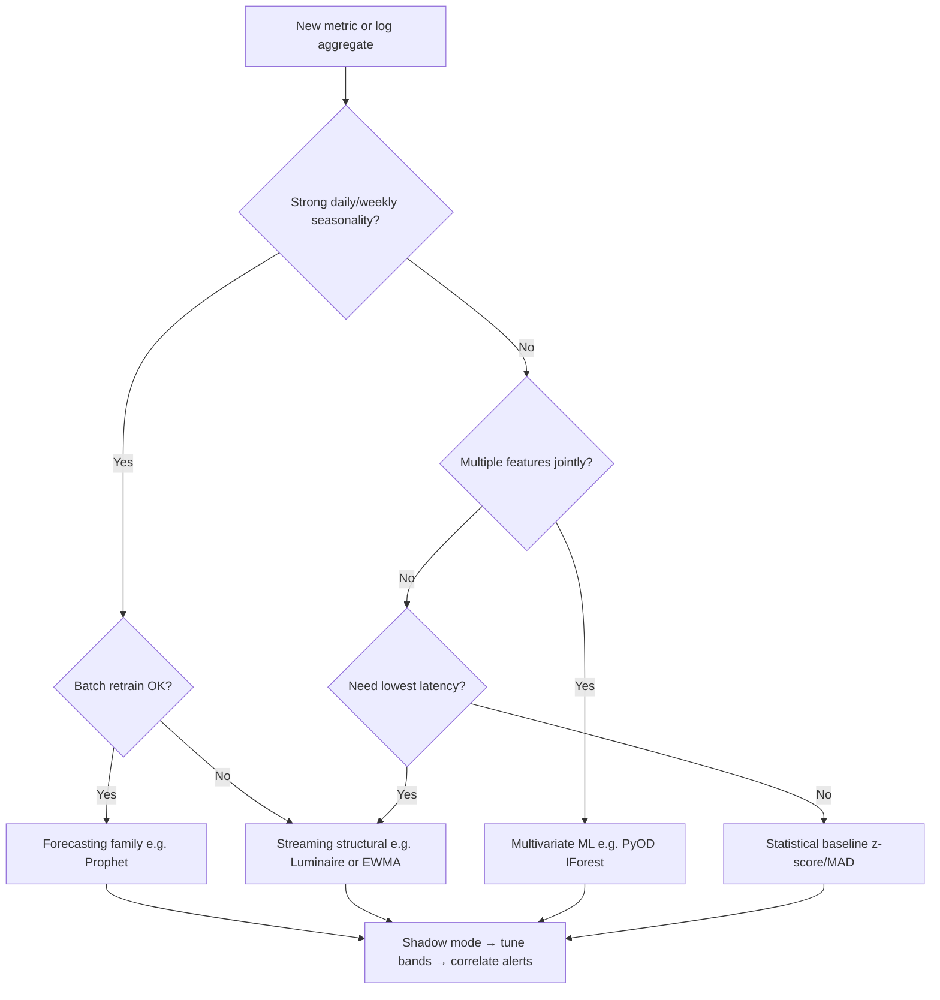

> **Toolkit Track** | Complexity: `[MEDIUM]` | Time: 50-60 min

## Prerequisites

Complete [Module 6.2: Anomaly Detection](/platform/disciplines/data-ai/aiops/module-6.2-anomaly-detection/) for the conceptual foundation, and bring comfortable Python skills plus basic time-series literacy before installing packages with pip or conda in a virtual environment.

## What You'll Be Able to Do

When you finish this module, you will be able to deploy learned detectors on Kubernetes telemetry, configure Prometheus-oriented scoring pipelines, correlate related anomaly alerts into actionable clusters, and choose among statistical, forecasting, multivariate-ML, and deep-learning families based on signal shape rather than library hype.

- **Deploy anomaly detection systems that identify unusual patterns in Kubernetes metrics and logs**
- **Configure machine learning models for time-series anomaly detection on Prometheus metrics**
- **Implement alert correlation to reduce noise and surface actionable anomaly clusters**
- **Evaluate anomaly detection approaches (statistical, ML, deep learning) for different observability data types**

## Why This Module Matters

You already understand what an anomaly is in observability data. The harder question is how to detect one reliably at scale without drowning responders in false pages. Static thresholds worked when you monitored a dozen hosts with predictable traffic. They fail when you operate thousands of Kubernetes pods whose baselines shift with deployments, autoscaling, marketing campaigns, and seasonal demand. Anomaly detection learns what normal looks like for each signal and flags meaningful deviations, which is the practical bridge between raw metrics and actionable AIOps.

The durable capability is not memorizing three Python libraries. It is choosing the right detection family for each signal shape, tuning sensitivity so precision and recall match your on-call budget, and wiring scores into an alerting pipeline that groups related symptoms instead of paging separately for every metric twitch. Prophet, PyOD, and Luminaire appear throughout this module as worked examples of forecasting-based, multivariate-ML, and streaming approaches—not as winners in a tool tournament. Each example maps to a row in the approach taxonomy you will reuse when the next library ships.

> **Hypothetical scenario:** A retail platform trains a forecasting model on a full year of hourly request traffic, including a major annual sale event where traffic roughly triples for twenty-four hours. When the next sale arrives, latency on the checkout service climbs because a connection pool is misconfigured, but error rates stay within the wide confidence band the model learned from last year's chaos. The detector stays quiet while customers time out. The team later maintains two models: one for ordinary weeks with tighter bands, and one for high-traffic windows with separate thresholds and human review. The lesson is that training data defines normal; if you teach the model that failure-shaped traffic is expected, it will not protect you when failure arrives during expected chaos.

## The Durable Problem: Why Static Thresholds Fail

Static thresholds encode a single number—CPU above eighty percent, error rate above one percent, latency above two hundred milliseconds—and fire whenever the line is crossed. That design assumes the boundary between healthy and unhealthy is constant over time. Real production systems violate that assumption constantly. Traffic grows, caches warm, deployments change memory profiles, and business cycles introduce seasonality that makes yesterday's peak look like today's trough. You either set thresholds loose enough to survive seasonal spikes and miss subtle regressions, or set them tight enough to catch small problems and generate hundreds of benign pages every week.

Anomaly detection reframes the question from "Is this value above a fixed line?" to "Is this value surprising given recent history and context?" That shift matters because observability signals are time series first and scalar alerts second. A request rate of five thousand per second might be perfectly normal at noon on a weekday and wildly high at three in the morning. A detector that understands daily seasonality evaluates the observation against an expected band for that hour, not against a global maximum from last quarter's load test.

The AIOps angle is operational: better detection reduces mean time to detect real incidents and reduces alert fatigue from false positives. Neither outcome appears automatically. A poorly tuned detector that fires on every Monday morning traffic ramp creates the same fatigue as a dumb threshold, just with more sophisticated math behind the page. The engineering work is matching approach to signal, validating on historical data, and building feedback loops so operators can mark false positives and improve the model over time.

Observability maturity also changes the goalposts. When you add exemplar traces and service graphs, anomaly alerts become more useful because correlation and drill-down paths exist. When you alert on raw container metrics without service labels, even perfect statistical detection produces orphan pages nobody can act on. Treat label completeness and ownership metadata as prerequisites co-equal with algorithm choice, because the best detector cannot route an alert to the right team if `service` and `team` labels are missing or inconsistent across scrapers.

```text
STATIC THRESHOLD VS LEARNED NORMAL
────────────────────────────────────────────────────────────────────────────

  Traffic (req/s)
       ▲
       │     ╱╲    ╱╲    ╱╲         ← seasonal peaks (normal)
       │    ╱  ╲  ╱  ╲  ╱  ╲
       │───●─────────────────── static threshold (fixed line)
       │      ╲╱    ╲╱    ╲╱
       │           ★ actual incident (missed — below static line during peak)
       └────────────────────────────────────────────▶ time

  Learned approach: expected band widens/narrows with seasonality; ★ falls outside band → alert
```

## Anomaly Detection Approach Taxonomy

Before choosing a library, choose a family. The taxonomy below is the durable mental model; individual packages implement one or more cells in the grid. Statistical methods compare each point to recent history using z-scores, median absolute deviation, exponentially weighted moving averages, or control charts. They are cheap, fast, and explainable, but they struggle when seasonality is strong because "recent history" may not represent the current hour's expectation.

Forecasting-based methods fit a model of expected value plus uncertainty—Prophet, Holt-Winters, ARIMA, and SARIMA belong here—and flag residuals that fall outside a confidence band. They excel when patterns repeat on daily or weekly cycles and when you can batch or micro-batch score points. Multivariate machine-learning methods treat each observation as a vector of features—latency, error rate, CPU, queue depth—and learn boundaries in high-dimensional space. Isolation Forest, Local Outlier Factor, one-class SVM, and autoencoders are common choices; PyOD packages many of them behind one API.

Deep and sequence models—LSTM or transformer reconstruction networks—target complex temporal dependencies when you have large labeled or semi-labeled histories and compute budget for training and inference. Streaming structural detectors focus on online scoring with minimal configuration when baselines shift abruptly. Luminaire illustrates that niche. None of these families replaces the others; they trade explainability, seasonality handling, dimensionality, latency, and operational cost on different axes.

Choosing a family is not a one-time architecture decision. Teams often layer statistical guards for ultra-fast rejection of obvious spikes, forecasting for seasonal traffic metrics, and multivariate scoring for golden-signal tuples on critical paths. The layering order matters: cheap filters first reduce load on expensive models downstream. Document which layer emitted each alert so tuning discussions do not confuse Prophet band breaches with IForest score spikes when both fire on related but distinct conditions.

| Family | Core idea | Strengths | Weaknesses | Typical signals |
|--------|-----------|-----------|------------|-----------------|
| Statistical / threshold | Compare to rolling mean or dispersion | Fast, transparent, low ops | Weak seasonality, univariate bias | Simple gauges, canary counts |
| Forecasting-based | Predict expected value + band | Daily/weekly seasonality, holidays | Batch latency, univariate focus | Request rate, queue depth |
| Multivariate ML | Outliers in feature space | Correlated dimensions together | Needs feature matrix, tuning | Latency + errors + CPU jointly |
| Deep / sequence | Learn temporal patterns | Complex long-range patterns | Data hunger, harder to explain | High-volume multivariate series |
| Streaming structural | Online level/shift detection | Low config, structural breaks | Less holiday modeling | Log volume, KPI streams |

## Seasonality, False Positives, and the Precision-Recall Tradeoff

Seasonality is the reason naive detectors fire every Black-Friday-style spike unless they decompose signal into trend, seasonal, and residual components. Decomposition asks whether the current value is unusual *for this time of week*, not whether it is the largest number seen this month. Holiday calendars and known events add another layer: some teams inject regressors for promotions, others exclude event windows from training and rely on separate runbooks. Both are valid; the failure mode is training on catastrophic traffic and teaching the model that catastrophe is normal.

False positives have a real cost measured in pager load, ignored alerts, and slower response when a genuine incident arrives amid noise. False negatives have a cost measured in customer impact and prolonged outages. Anomaly detection always sits on that precision-recall frontier. Tighter confidence bands and lower contamination settings increase precision at the expense of recall; wider bands do the opposite. Production systems usually start conservative—fewer pages, higher confidence—and loosen only after reviewing missed incidents in shadow mode.

Operational review should include a weekly sample of fired alerts labeled true incident, benign seasonality, deployment artifact, or detector bug. That label stream becomes the ground truth your team never gets for free from infrastructure metrics alone. Without it, you optimize math in a vacuum while on-call engineers learn to ignore the channel.

Escalation policy should define when anomaly alerts become pages versus tickets. A soft anomaly on a non-critical batch job might create a next-business-day task, while correlated anomalies on checkout latency and payment errors page immediately. Align detector thresholds with those policies instead of using one statistical confidence level everywhere.

## Landscape Snapshot and Rosetta

The table below is a landscape snapshot as of 2026-06; package versions, dependency constraints, and maintenance cadence change quickly, so verify against each project's GitHub repository and official documentation before relying on specifics in production planning. None of these libraries are CNCF projects—treat them as peer open-source tooling with independent release schedules rather than inferring foundation maturity from this curriculum module.

| Library / example | Latest activity (GitHub) | Python package | Primary family | Maintenance note |
|-------------------|-------------------------|----------------|----------------|------------------|
| Prophet | Active (facebook/prophet) | `prophet` | Forecasting-based | Meta-originated; docs at facebook.github.io/prophet |
| PyOD | Active (yzhao062/pyod) | `pyod` | Multivariate ML | Unified API over many classical detectors |
| Luminaire | Active (zillow/luminaire) | `luminaire` | Streaming structural | Check Python version constraints in repo README |
| scikit-learn IForest | Active (scikit-learn) | `sklearn` | Multivariate ML | Built-in IsolationForest for baselines |
| Holt-Winters / statsmodels | Active (statsmodels) | `statsmodels` | Forecasting-based | Classical alternative to Prophet |

The Rosetta matrix that follows compares durable capability rows against Prophet, PyOD, Luminaire, and simple statistical baselines so you can map a signal requirement to an approach family before picking an import statement.

| Durable capability | Prophet | PyOD (IForest/LOF/COPOD) | Luminaire | Statistical (z-score/EWMA) |
|--------------------|---------|--------------------------|-----------|----------------------------|
| Explainability to on-call | High (expected band) | Medium (scores) | Medium | High |
| Strong daily/weekly seasonality | Strong fit | Poor alone | Moderate | Poor |
| Multivariate correlation | No (univariate) | Strong fit | No (univariate) | Per-metric only |
| Streaming / low latency | Batch-oriented | Batch-oriented | Strong fit | Strong fit |
| Structural baseline shift | Via changepoints | Retrain needed | Strong fit | Slow adaptation |
| Setup complexity | Moderate | Moderate–high | Moderate | Low |

## Statistical and Threshold-Based Detection

Z-score detection subtracts a rolling mean and divides by rolling standard deviation, flagging points whose absolute z exceeds a threshold such as three. It is the right baseline when the series is roughly stationary, univariate, and cheap to compute at ingest time. Median absolute deviation and robust z-scores reduce sensitivity to outliers in the training window itself, which matters when past incidents contaminated the history you use for estimation.

Exponentially weighted moving averages emphasize recent points, so the baseline adapts faster than a simple rolling mean—useful after deployments but dangerous if the deployment introduced a sustained regression that the EWMA slowly accepts as normal. Control charts from statistical process control track upper and lower control limits derived from process variance; they remain valuable in manufacturing-inspired SRE dashboards when you need auditable limits for compliance or change review.

Use statistical methods as the first layer for simple gauges, as a fallback when ML training data is thin, and as a sanity check against black-box scores. Replace them when seasonality dominates or when decisions require joint behavior across multiple metrics that only move together during real failures.

Rolling-window statistics deserve explicit window length choices tied to scrape interval and seasonality period. A one-hour window on one-minute scrapes captures short bursts; a one-week window on hourly aggregates captures weekly seasonality poorly if not aligned to calendar boundaries. Document window choices in runbooks so the next engineer does not "fix" false positives by accidentally shrinking the window until everything looks smooth.

EWMA detectors update with a smoothing parameter alpha that controls memory half-life. Higher alpha tracks recent shifts faster—useful after rollouts—and lower alpha resists single-point spikes. Pair EWMA with minimum sample guards so cold-start periods after deploy do not generate nonsense variance estimates.

## Forecasting-Based Detection with Prophet

Prophet implements an additive model: trend plus seasonal components plus optional holiday regressors plus noise. You fit on historical timestamps and values, predict forward, and treat observations outside the predicted interval as anomalies. The library expects columns named `ds` and `y`; that convention is fixed. Interval width maps directly to sensitivity—a ninety-five percent interval is wider and fires less often than an eighty percent interval.

Prophet fits batch training workflows: pull history from Prometheus or a data warehouse, retrain on a schedule, cache forecasts for the next scoring window, and compare live samples to cached bounds. It is not a sub-second streaming scorer. For Kubernetes request rates, queue depths, or pod counts with clear diurnal patterns, the interpretability win is large: on-call engineers see expected value and band on a chart instead of a opaque score.

```bash
pip install prophet
```

```python
from prophet import Prophet
import pandas as pd
import numpy as np

n_points = 168 * 4  # four weeks of hourly data
base_traffic = 1000
daily_pattern = 500 * np.sin(np.arange(n_points) * 2 * np.pi / 24)
noise = np.random.normal(0, 50, n_points)

df = pd.DataFrame({
    'ds': pd.date_range('2024-01-01', periods=n_points, freq='h'),
    'y': base_traffic + daily_pattern + noise
})

model = Prophet(
    daily_seasonality=True,
    weekly_seasonality=True,
    interval_width=0.95
)
model.fit(df)

future = model.make_future_dataframe(periods=24, freq='h')
forecast = model.predict(future)

df_merged = df.merge(forecast[['ds', 'yhat', 'yhat_lower', 'yhat_upper']], on='ds')
df_merged['anomaly'] = (
    (df_merged['y'] < df_merged['yhat_lower']) |
    (df_merged['y'] > df_merged['yhat_upper'])
)
print(f"Found {df_merged['anomaly'].sum()} anomalies in history")
```

Production wrappers should track last train time, invalidate forecast cache after retrain intervals, and return explicit "retrain required" when scoring stale models. Changepoint prior scales control how aggressively trend shifts are absorbed—lower values yield smoother trends; higher values react faster to true baseline moves at the risk of overfitting short glitches.

Holiday regressors in Prophet accept a dataframe of event names and dates; use them for known marketing sends, daylight-saving-adjacent maintenance, or fiscal close batches. Mislabeled holidays create false expectations just as missing holidays do—validate the holiday table with product marketing quarterly. When events are rare, prefer holding them out of training entirely and switching to the event-specific model described in the hypothetical scenario rather than flooding the default model with a handful of extreme points.

Prophet's uncertainty intervals widen when history is noisy or short; treat wide bands as a signal to collect more data before paging on residual breaches. Visualization helps adoption: export `yhat`, `yhat_lower`, and `yhat_upper` alongside raw series to Grafana so reviewers see context instead of debating a boolean alone.

## Multivariate Machine Learning with PyOD

When failure modes appear only in the *relationship* between metrics—latency normal, CPU normal, error rate normal individually but impossible together—you need multivariate detection. PyOD provides a consistent interface: `fit`, `predict`, and `decision_function` across dozens of algorithms. Isolation Forest isolates points with fewer random splits; Local Outlier Factor compares local density; COPOD uses empirical copula estimates without heavy hyperparameter tuning for some workloads.

Contamination hyperparameters express expected anomaly proportion; they set score thresholds. Domain knowledge beats defaults: one percent contamination is arbitrary if your fleet truly sees one failure per thousand hours across thousands of series. Start with shadow scoring, histogram decision scores on held-out weeks, and pick thresholds that match your incident rate and pager budget.

```bash
pip install pyod
```

```python
from pyod.models.iforest import IForest
from pyod.models.copod import COPOD
import numpy as np

X = np.column_stack([latencies, error_rates, cpu_usage])

clf = IForest(contamination=0.01, random_state=42)
clf.fit(X)
labels = clf.predict(X)
scores = clf.decision_function(X)
print(f"Isolation Forest flagged {labels.sum()} points in training window")
```

Ensemble averaging across algorithms reduces variance: when IForest, COPOD, and LOF agree, precision usually rises at the cost of more compute and more complex deployment. Store training snapshots versioned by date so you can replay incidents and compare algorithm votes during postmortems.

Feature engineering still dominates algorithm choice for observability vectors. Raw CPU percentage plus latency plus error rate is a starting point; rates of change, saturation indicators, and queue lag deltas often separate benign load from failure. Normalize features with robust scalers fit on training windows only, never on live mixed incident data, or magnitude differences let large-unit metrics dominate distance calculations silently.

Local Outlier Factor highlights points in low-density neighborhoods; it can be sensitive to `n_neighbors` when fleet size is small. COPOD avoids some hyperparameter tuning but assumes copula suitability that may wobble on heavy-tailed latency distributions. Prototype both on the same labeled week before standardizing on one for production to avoid surprise behavior during the first real outage.

## Streaming and Structural Break Detection with Luminaire

Luminaire targets online scoring for series that experience level shifts—new product launch, traffic migration, configuration change—where a slow-retraining batch forecaster would label the post-shift normal as anomalous for days. Structural models estimate level and volatility online with hyperparameter optimization helpers in the package. The Zillow-originated project remains available on GitHub; verify Python version support in the repository README before pinning it in production images because dependency pins can lag current NumPy or pandas releases.

```bash
pip install luminaire
```

Use Luminaire when latency from batch retrain is unacceptable and when univariate streams dominate—log volume per service, error counts per namespace, business KPIs. Pair it with explicit deployment runbooks when Python environments must stay isolated from your main observability stack. For complex holiday seasonality, a forecasting family tool may still outperform; the Rosetta table exists to make that tradeoff explicit rather than ideological.

Structural break detection differs from point anomalies: the goal is recognizing that the process generating data changed regimes, not that a single point diverged within an old regime. After a confirmed break, reset or retrain explicitly instead of waiting for slow decay in exponential smoothers. Luminaire's hyperparameter optimization helpers explore window lengths and thresholds—use them in offline historical replay, then freeze parameters for online scoring to avoid unstable live tuning.

## Evaluating Anomaly Detection Approaches by Data Type

Evaluation begins with signal shape, not library popularity. Univariate metrics with strong seasonality and tolerant batch latency point toward forecasting. High-dimensional feature vectors captured at incident time—saturation across latency, errors, saturation, and queue depth—point toward multivariate ML. Sub-second scoring on a single stream with frequent baseline moves points toward streaming structural detectors or simple EWMA with careful tuning. Log-derived counts often behave like bursty count series where seasonality is weak but level shifts are common; test both statistical baselines and structural streaming before committing to deep models.

Deep learning enters when you have long histories, GPU budget, and failure modes that classical methods miss in offline benchmarks—but explainability and retrain cost rise sharply. Run every candidate in shadow mode: emit would-have-fired alerts to a dashboard without paging, compare against incident timeline and operator labels for at least two weeks. Accuracy percentages from vendor slides or synthetic demos are not transferable to your fleet; only labeled local evaluation counts.

Hold-out weeks that include known incidents, deployment windows, and holiday traffic when available. Report precision and recall separately to stakeholders instead of a single F1 number that hides whether you chose a noisy or a blind detector.

Cost-aware evaluation adds operational weight: a false page at three in the morning on a payment service may outweigh five false tickets on batch reporting. Weight precision/recall targets by service tier and time-of-day when negotiating sensitivity with product owners. Document those weights beside detector configuration so future tuning does not accidentally equalize priorities that were deliberately different.

## Deploying Anomaly Detection on Kubernetes Metrics and Logs

Deployment shape is repeatable regardless of library: extract time series from observability backends, score in a worker or sidecar, write results to a metric or event stream, and connect to Alertmanager or an incident platform. For Prometheus, pull series with PromQL range queries or use recording rules to pre-aggregate expensive expressions. For logs, aggregate counts or error rates into metric series before detection—raw log anomaly on unstructured text is a different module's scope.

Containerize scorers as CronJobs for batch retrain plus Deployments for online scoring, or run serverless functions triggered on schedule. Resource limits should reflect training peaks: Prophet fit on a year of one-minute data is memory-heavy; IForest on ten features and ten thousand rows is modest. Secrets for remote read endpoints live in Kubernetes secrets; never embed credentials in notebook code committed to git.

Label outputs with `service`, `namespace`, `cluster`, and `detector` so downstream correlation can group by topology. Emit both a boolean anomaly flag and a continuous score when possible—boolean alerts drive pages, scores drive dashboards and threshold tuning. Log volume pipelines mirror metrics: aggregate error lines per pod per minute, detect spikes on the aggregate, attach exemplar log lines in alert annotations for faster triage.

Health checks on the detector itself—last successful train, scoring lag, NaN rate—prevent silent failure where alerts stop because the worker crashed while dashboards still look green.

Network policies should allow the scorer to reach Prometheus or Thanos query endpoints and Alertmanager receivers without exposing training data stores broadly. Run training jobs with read-only access to historical object storage buckets where possible. For multi-cluster fleets, decide whether detection runs centrally with federated queries or per-cluster with aggregated incident correlation upstream; central training sees global seasonality, edge training respects data residency constraints.

## Configuring Machine Learning Models for Prometheus Time-Series Anomaly Detection

Prometheus stores metrics; it does not train Prophet or PyOD for you. The integration pattern is a Python or Go worker that queries `{__name__="http_requests_total", service="checkout"}`, resamples to a regular grid, fills gaps explicitly, and passes a dataframe to the model. Recording rules materialize heavy PromQL—histogram quantiles, burn rates—so the detector pulls stable series names instead of recomputing expensive queries every minute.

Alerting rules can consume exported anomaly scores: a gauge `anomaly_score{service="checkout"}` pushed via Pushgateway or written by a custom exporter. Alternatively, the worker calls Alertmanager's API with grouped labels when score exceeds threshold. Keep training windows and scrape intervals aligned: scoring every minute on data scraped every thirty seconds is fine; scoring every second on data updated hourly creates false stability.

```yaml
# recording rule example — materialize error rate for detection input
groups:
  - name: anomaly_inputs
    rules:
      - record: service:http_error_rate:5m
        expr: |
          sum by (service) (rate(http_requests_total{status=~"5.."}[5m]))
          /
          sum by (service) (rate(http_requests_total[5m]))
```

Sensitivity tuning belongs in configuration, not code: interval width for Prophet, contamination for PyOD, detection threshold for Luminaire. Store configs in Git, version them with deployment tags, and roll back when a tuning change explodes page volume. Shadow mode flags in config let the same binary write `anomaly_would_fire` without routing to PagerDuty until reviewers promote the change.

Treat PromQL cardinality as part of detector design: high-cardinality labels in recording rules explode training matrices and slow retrain jobs. Prefer aggregating to service or deployment level for anomaly scoring, then drill into pod-level metrics only after a correlated incident opens. Thanos or Cortex global views enable fleet-wide seasonality when traffic shifts between regions, but watch query latency budgets so scoring cron jobs finish before the next interval begins.

## Alert Correlation and Anomaly Clustering

Individual anomaly alerts on CPU, latency, errors, and queue depth often describe one underlying incident. Alert correlation groups related detections so responders see one enriched incident instead of four redundant pages. The durable steps are deduplication, time-window clustering, topology-aware grouping, and severity escalation based on cluster size and customer impact.

Deduplication collapses repeated fires of the same rule on the same series within a suppression window—Alertmanager `group_by` and `group_wait` implement a basic form. Time-window clustering merges anomalies that start within minutes on related labels, such as all services in a namespace during a rollout. Topology-aware grouping uses service dependency graphs: if the database detector and every API that calls it fire together, surface the database as probable root cause. That logic previewed in [Module 10.2: Event Correlation Platforms](../module-10.2-event-correlation-platforms/) at platform scale; here you implement a lightweight version in your scorer pipeline.

```text
ANOMALY → CORRELATED INCIDENT FLOW
────────────────────────────────────────────────────────────────────────────

  Per-metric scorers          Correlation layer              Responder view
  ─────────────────          ─────────────────              ──────────────

  Prophet (traffic)  ──┐
  IForest (SLO vec)  ──┼──▶  dedupe + time cluster  ──▶  one incident:
  Luminaire (logs)   ──┘      + topology labels          "checkout degraded,
                               + max severity               3 correlated anomalies"
```

Implement correlation in the worker before emitting to Alertmanager: assign a `correlation_id` UUID when anomalies share `namespace`, overlap in time within five minutes, and exceed score thresholds together. Attach child anomaly summaries as JSON annotations. Reduce noise by requiring at least two correlated signals for page-worthy severity while routing single-signal anomalies to tickets or daily digests. Feedback loops close when responders merge or split incidents in your ITSM tool—export those actions to retrain clustering distances or adjust time windows.

Correlation quality depends on consistent alert labels across detectors. If Prophet jobs emit `service=checkout` while log aggregators emit `app=checkout-api`, clustering heuristics must include normalization maps maintained as code. Invest in that map early instead of debugging mysterious duplicate incidents during the first major outage after rollout.

Cross-reference [Module 10.3: Observability AI Features](../module-10.3-observability-ai-features/) for vendor-native correlation and [Module 10.2](../module-10.2-event-correlation-platforms/) when you outgrow in-house grouping and need enterprise topology ingestion.

Cardinality-aware correlation avoids merging unrelated tenants: include `tenant` or `customer_tier` labels in grouping keys when metrics carry them. For shared infrastructure anomalies—cluster DNS failures, CNI blips—elevate severity when more than N distinct services correlate within the same node or availability zone, even if individual service scores are moderate.

## Operationalizing Detection: Feedback, Drift, and Retraining

Models drift when architecture, traffic mix, or business model changes. Schedule retraining—daily for fast-moving metrics, weekly for stable baselines—and monitor distribution shift statistics on input features. When deployment annotations exist, optionally pause scoring or widen bands during planned changes to avoid predictable false positives.

Human feedback is data: mark alerts false positive, true positive, or unknown in a structured store. Use true positives to verify recall; use false positives to tighten bands or add exceptions for known events. Automate retrain only after validating on hold-out data; automating without review recreates the "trained on Black Friday chaos" failure mode in software.

Document runbooks per detector family: how to retrain Prophet after a holiday, how to rotate PyOD training snapshots, how to reset Luminaire after a confirmed baseline shift. Ownership belongs to the team that owns the metrics, not a distant ML platform group, unless you centralize scoring as a shared service with explicit SLOs.

## Deep Learning and Sequence Models

Recurrent networks, temporal convolution, and transformer-based reconstruction models learn complex lag structures when you have long multivariate histories and sufficient compute for offline training and GPU inference. The pattern is encode normal sequences, measure reconstruction error on live windows, and threshold error spikes as anomalies. These approaches appear in research pipelines and some vendor AIOps features more often than in hand-rolled open-source stacks because they demand curated training data, careful handling of non-stationarity, and explainability work to satisfy incident reviewers who ask why a page fired.

Reach for deep sequence models only after simpler families fail in shadow evaluation on your own metrics, not because a blog post reports strong results on a public benchmark. When you do adopt them, budget for feature stores or consistent metric cardinality, versioned training datasets, and review UI that shows contributing dimensions rather than a single opaque score. Many platform teams stay with forecasting plus multivariate ensembles for years because the operational cost of neural sequence models exceeds the marginal detection gain on their fleet.

If your organization centralizes ML platforms, treat anomaly scoring as a batch or streaming inference service with model registry integration rather than embedding training code inside Prometheus sidecars. That separation keeps security patching for observability binaries independent from CUDA driver lifecycles on training hosts.

Sequence models excel when lagged dependencies span hours—queue backlog today predicting API latency tomorrow—but require consistent sampling intervals and careful handling of missing data imputation. Impute transparently in training logs and fail closed in live scoring when too many inputs are missing, rather than silently forwarding zeros that look like healthy idle states.

## Classical Forecasting Alternatives to Prophet

Prophet is not the only forecasting family worth knowing. Holt-Winters exponential smoothing captures level, trend, and seasonality with lighter dependencies than full Bayesian structural time series. ARIMA and SARIMA remain standard in statistics-heavy organizations that already operate R or Python statsmodels pipelines. The durable lesson is identical: predict an expected interval, score residuals, and retrain on a schedule that matches how fast your baseline moves.

Classical methods sometimes outperform black-box libraries on short histories because they expose fewer hyperparameters and fail more obviously when mis-specified. A misspecified ARIMA order produces visible forecast garbage; a misspecified holiday calendar in a higher-level API can look plausible while being wrong. Compare at least one classical baseline whenever you pilot a new seasonal metric—if z-score with hour-of-week buckets matches Prophet's precision in shadow mode, you may prefer the simpler operations story.

## Building a Production Prophet Scoring Service

A minimal production Prophet service separates ingest, train, score, and alert emit stages. Ingest pulls Prometheus range queries into a dataframe indexed by UTC timestamps with explicit handling for missing scrapes—forward-fill sparingly, never silently invent zeros that look like traffic drops. Train runs on a cron, persists the serialized model or forecast cache to object storage, and writes metadata rows with train start, train end, and interval width. Score loads the latest cache, compares live samples from a push or pull path, and emits structured JSON with value, expected, lower, upper, and boolean anomaly.

Wrap training in guards: minimum history length, maximum gap percentage, and abort when label cardinality explodes because someone removed a `service` label filter. Alert only when anomaly persists across two consecutive scoring intervals if your noise budget is tight—single-point spikes often reflect scrape glitches rather than customer impact. Expose a manual "widen bands" override configuration during known marketing events so on-call can temporarily reduce sensitivity without redeploying code.

Persist scorer outputs to a time-series database even when no alert fires. Those quiet rows become negative training examples that distinguish stable seasonality from near-miss breaches and help newcomers visualize band width decisions during onboarding reviews.

## Log-Derived Metrics and Count Series

Logs become detectable time series through deliberate aggregation: error lines per namespace per minute, authentication failures per gateway, or throttle events per API key. Extract with Loki metric queries, OpenTelemetry log processors, or batch ETL into Prometheus gauges. Count series are often bursty and over-dispersed relative to Gaussian assumptions, so robust methods—median-based baselines, Poisson-inspired thresholds, or Luminaire-style structural models—sometimes beat plain z-scores.

Keep detection on aggregates rather than individual log lines unless you operate a dedicated log-anomaly product. Aggregates align with SLO thinking and keep cardinality bounded. Attach exemplar log IDs in alert annotations so responders jump from a spike in `error_count` to representative stack traces without running expensive ad-hoc searches during an incident.

When log volume drops sharply during upstream outages, treat absence as a first-class signal: many pipelines alert on spikes but miss ingest failures that look like healthy quiet until dashboards empty entirely. Pair volume detectors with heartbeat metrics emitted by the log pipeline itself so ingest health and application error rates are scored independently. That split prevents a silent log agent failure from hiding behind an application that genuinely stopped emitting errors during an outage investigation.

## Alertmanager Routing and Inhibition

Alertmanager grouping keys should mirror your correlation design: cluster, namespace, service, and correlation_id when present. Use inhibition rules so child symptom alerts suppress when a parent infrastructure alert already fired—for example, suppress pod restart storms when the node NotReady alert is active. Route shadow-mode alerts to null receivers or dedicated Slack channels until reviewers promote configuration.

Timing parameters matter: `group_wait` batches related firings so a single notification arrives with multiple anomaly summaries; `group_interval` controls follow-ups while an incident remains open; `repeat_interval` caps reminder noise. Document these tunables alongside detector sensitivity because operators experience them as one system. When migrating from static thresholds, run old and new rules in parallel with different severity labels until confidence in the learned detector is established.

## Sensitivity Tuning as a Collaborative Workshop

Tuning is a cross-functional exercise, not a solo data-science task. Service owners know which seasonal spikes are benign; SRE knows pager budget; security may require tighter bands on authentication metrics regardless of seasonality. Run a ninety-minute workshop per critical service: review two weeks of shadow alerts, label each, adjust interval width or contamination, and agree on correlation windows.

Capture decisions in version-controlled YAML checked into the same repository as recording rules. Post-workshop, measure page count delta and mean time to acknowledge for true incidents. If pages drop but acknowledgment time rises, you may have over-tightened bands and missed subtle regressions—revisit recall, not only precision.

Run quarterly regression tests that replay archived incident windows through the current detector configuration. Incidents evolve: a detector tuned for monolithic APIs may miss failures in newly sharded services even when overall error budgets look stable. Archive Prometheus snapshots or recording-rule outputs for major incidents specifically to fuel these replays, redacting customer identifiers per policy.

## Patterns and Anti-Patterns

Production teams that succeed with anomaly detection usually adopt a small set of repeatable patterns, while teams that struggle often repeat the same anti-patterns despite changing library choices. The lists below name behaviors worth copying and failures worth designing against explicitly in design reviews.

### Patterns that work

1. **Shadow then page** — Run new detectors in log-only mode until precision is acceptable; promotes confidence and gives labeled data.
2. **Family per signal type** — Forecast seasonal request rates, multivariate-score SLO vectors, stream-detect log volume shifts; avoids one-size misfit.
3. **Correlation before escalation** — Group related anomaly scores into one incident with shared context and topology hints.
4. **Versioned training snapshots** — Keep dated model artifacts to replay incidents and audit why a detector fired or stayed silent.
5. **Explicit holiday and event calendars** — Feed known promotions into forecasting models or exclude them from training with documented rationale.

### Anti-patterns to avoid

1. **Training on unlabeled incident windows** — Teaches catastrophic traffic or error bursts as normal; produces silent failures during real outages.
2. **Global contamination defaults** — Using one percent anomaly expectation fleet-wide ignores that critical services need tighter thresholds than batch jobs.
3. **Prophet on sub-second streams** — Batch forecast latency mismatches real-time SLO needs; choose streaming or statistical layers instead.
4. **Alerting on scores without correlation** — Ten correlated metrics page ten times; responders mute the channel.
5. **Chasing accuracy claims from demos** — Synthetic datasets do not represent your seasonality; local labeled evaluation is mandatory.
6. **Ignoring detector health** — Stale models or crashed workers stop alerting while infrastructure dashboards look fine.

## Decision Framework



Use the flowchart as a starting point, not a verdict. When two families fit, prototype both in shadow mode for two weeks and compare labeled precision. Prefer the simpler family when performance is tied—operations cost matters as much as ROC curves in on-call environments.

Document the chosen path in an architecture decision record noting signal names, rejected alternatives, and review date. Detectors drift out of validity silently when architecture changes; ADRs give future you a checklist of assumptions to revalidate after major migrations.

## Did You Know?

- **Prophet** was open-sourced by Meta (formerly Facebook) to handle forecasting with multiple seasonalities and holiday effects; the documentation and repository remain actively maintained as of 2026.
- **Isolation Forest**, described by Liu, Ting, and Zhou, isolates anomalies in fewer random partitions than normal points—the algorithm was introduced at the 2008 IEEE International Conference on Data Mining (ICDM) in Pisa.
- **PyOD** bundles many classical and neural outlier algorithms behind one API; the project documentation at pyod.readthedocs.io tracks versions and model lists explicitly rather than requiring scattered imports.
- **Prometheus Alertmanager** supports grouping, inhibition, and silences—correlation logic you build in scorers should align with those primitives instead of fighting them.

## Common Mistakes

| Mistake | Problem | Solution |
|---------|---------|----------|
| Using Prophet for real-time sub-second scoring | Batch fit and predict cycles exceed SLO feedback needs | Use Luminaire, EWMA, or statistical streaming for low-latency paths |
| Training on known incident or sale windows without labeling | Model learns chaos as normal and misses failures during similar windows | Exclude or separately model event periods; document training exclusions |
| Same contamination or interval width fleet-wide | Critical services page too little; batch jobs page too much | Tune per metric class with shadow-mode histograms |
| Ignoring weekly seasonality on daily-only models | Monday ramps look anomalous every week | Enable weekly seasonality or use robust baselines |
| Over-engineering ensembles before a baseline | Complexity hides bugs and slows iteration | Start z-score or IForest; add ensemble only after baseline metrics |
| Skipping retrain after architecture changes | Baseline drift produces sustained false positives or negatives | Tie retrain schedules to deploy cadence and review drift stats |
| Emitting one alert per metric without correlation | Related failures page independently and fatigue on-call | Implement correlation IDs and Alertmanager grouping keys |
| No detector health monitoring | Silent scorer failures stop protection without obvious symptoms | Export last_train_timestamp, scoring_lag, and error counters |

## Quiz

<details>
<summary>1. Your checkout service shows strong daily and weekly traffic seasonality. Latency is evaluated every five minutes from Prometheus recording rules. Which approach family fits best initially, and why?</summary>

Forecasting-based detection fits best initially because the signal is univariate, exhibits repeating daily and weekly cycles, and is scraped on a five-minute cadence that tolerates batch retrain and predict cycles. Prophet or a classical Holt-Winters/SARIMA workflow models expected value plus a confidence band for each hour-of-week, so ordinary Monday ramps stay inside normal while genuine latency regressions outside the band surface. Multivariate ML is unnecessary until you need joint behavior across several metrics; pure z-scores will misfire on predictable peaks unless you maintain hour-specific thresholds manually.
</details>

<details>
<summary>2. Scenario: Three metrics—latency, error rate, and CPU—each stay within individual bounds, but together they indicate overload only during incidents. Which tool family addresses this, and what PyOD parameter most affects alert volume?</summary>

Multivariate machine-learning detection addresses joint outliers in feature space; PyOD's Isolation Forest or COPOD can score the three-dimensional vector per timestamp instead of three independent thresholds. The contamination parameter (or score percentile derived from it) most directly affects alert volume because it sets how many points the model treats as anomalies in the training reference; lower contamination yields fewer alerts. Validate contamination with shadow-mode histograms rather than accepting library defaults.
</details>

<details>
<summary>3. After deploying anomaly detection, on-call receives separate pages for CPU, latency, and errors on the same service within two minutes during a single database incident. What correlation steps reduce noise while preserving actionable context?</summary>

Implement deduplication so repeated scores on the same series within a suppression window collapse to one event, then time-window clustering to merge anomalies sharing namespace and service labels that start within a short interval. Add topology hints when database and dependent APIs fire together, promoting the shared dependency in the incident summary. Emit a single Alertmanager notification with correlation_id and child anomaly annotations listing each score, rather than three independent pages with identical timestamps.
</details>

<details>
<summary>4. What is the purpose of the contamination parameter in PyOD algorithms such as Isolation Forest?</summary>

Contamination specifies the expected proportion of outliers in the training reference, which determines the score threshold separating normal from anomalous classifications. It directly trades precision for recall: higher contamination increases alerts and may catch subtle incidents at the cost of false pages; lower contamination is conservative. Tune it using domain incident rates and shadow-mode evaluation, not a universal default such as one percent.
</details>

<details>
<summary>5. How does Isolation Forest differ from a z-score on a single metric?</summary>

Z-score measures deviation from a univariate mean in standard deviations and assumes roughly stable dispersion; it ignores correlations with other metrics and mis-handles strong seasonality unless you engineer time-aware baselines. Isolation Forest partitions the feature space randomly and flags points that require fewer splits to isolate, which scales to multiple dimensions without a Gaussian assumption. Choose z-score for quick stationary gauges; choose Isolation Forest when several metrics jointly define failure.
</details>

<details>
<summary>6. Scenario: A forecasting model trained on last year's major sale treats this year's sale traffic as normal while connection pool errors rise during the event. What training or operations change addresses the miss?</summary>

Separate ordinary operations from high-traffic event windows: either exclude past sale periods from the default model and rely on a dedicated event model with tighter bands and human review, or add explicit holiday regressors while still validating error-rate series independently. Never assume traffic-shaped normality protects SLO metrics—score errors with their own detector or require multiple correlated signals before suppressing alerts during known events. Document which model runs in which calendar window so on-call knows which bands apply.
</details>

<details>
<summary>7. When should Luminaire be preferred over Prophet for a univariate log-volume stream?</summary>

Prefer Luminaire when you need online scoring with structural baseline shifts—such as log volume after a new deployment changes normal levels—and sub-batch latency matters more than modeling long holiday calendars. Prophet remains stronger when seasonality is complex and batch retrain every few hours is acceptable. Verify Python environment compatibility for Luminaire before production commit because dependency pins may require isolated virtual environments.
</details>

<details>
<summary>8. What Prometheus integration pattern keeps detection workloads maintainable at scale?</summary>

Use recording rules to materialize expensive PromQL into stable metric names the scorer pulls on a fixed interval, resample to a regular grid, and pass to the model. Export anomaly scores or boolean flags as labeled metrics consumable by alerting rules, or post grouped notifications to Alertmanager with consistent label keys for service and namespace. Keep sensitivity parameters in version-controlled config, run shadow mode before paging, and monitor scorer health with last_train_timestamp and scoring lag metrics.
</details>

## Hands-On Exercise: Build a Multi-Tool Detector

Build a detector that routes each metric type to an appropriate family: Prophet for seasonal time series, Isolation Forest for multivariate SLO vectors, and z-score for simple gauges.

### Setup

```bash
mkdir anomaly-tools && cd anomaly-tools
python -m venv venv
source venv/bin/activate
pip install prophet pandas numpy scikit-learn pyod
```

### Implementation

```python
# multi_detector.py — see module body for full MultiToolDetector class
from prophet import Prophet
from pyod.models.iforest import IForest
import pandas as pd
import numpy as np

class MultiToolDetector:
    def __init__(self):
        self.prophet_models = {}
        self.iforest_model = None
        self.z_stats = {}

    def train_prophet(self, metric_name, df):
        model = Prophet(daily_seasonality=True, weekly_seasonality=True, interval_width=0.95)
        model.fit(df)
        self.prophet_models[metric_name] = model

    def train_iforest(self, X, feature_names):
        self.iforest_model = IForest(contamination=0.01, random_state=42)
        self.iforest_model.fit(X)
        self.feature_names = feature_names

    def detect_timeseries(self, metric_name, timestamp, value):
        future = pd.DataFrame({'ds': [timestamp]})
        forecast = self.prophet_models[metric_name].predict(future)
        lower, upper = forecast['yhat_lower'].iloc[0], forecast['yhat_upper'].iloc[0]
        return {'is_anomaly': value < lower or value > upper, 'expected': forecast['yhat'].iloc[0]}
```

Extend the skeleton with z-score stats, correlation IDs for simultaneous fires, and a shadow-mode flag that logs without paging.

### Success Criteria

- [ ] Trained Prophet on hourly traffic with daily seasonality and verified band breach on an injected spike
- [ ] Trained Isolation Forest on latency, error rate, and CPU jointly and detected a multivariate outlier row
- [ ] Implemented z-score fallback for a simple gauge metric with configurable threshold
- [ ] Grouped simultaneous anomaly results under one correlation_id before emitting alerts
- [ ] Ran the scorer in shadow mode and recorded precision notes for at least ten synthetic fires

## Sources

- [Prophet documentation](https://facebook.github.io/prophet/) — forecasting API, seasonality, and holiday regressors
- [Prophet GitHub repository](https://github.com/facebook/prophet) — source, issues, and release activity
- [Prophet quick start](https://facebook.github.io/prophet/docs/quick_start.html) — `ds`/`y` format and first model
- [PyOD documentation](https://pyod.readthedocs.io/en/latest/) — algorithm list and unified API
- [PyOD GitHub repository](https://github.com/yzhao062/pyod) — implementation and examples
- [Luminaire GitHub repository](https://github.com/zillow/luminaire) — streaming structural detection package
- [Luminaire documentation site](https://zillow.github.io/luminaire/) — model configuration and usage
- [Isolation Forest paper (Liu, Ting, Zhou)](https://cs.nju.edu.cn/zhouzh/zhouzh.files/publication/icdm08b.pdf) — canonical algorithm description
- [scikit-learn outlier detection guide](https://scikit-learn.org/stable/modules/outlier_detection.html) — IsolationForest and baselines
- [Prometheus alerting rules](https://prometheus.io/docs/prometheus/latest/configuration/alerting_rules/) — integrating scores with alerting
- [Prometheus Alertmanager documentation](https://prometheus.io/docs/alerting/latest/alertmanager/) — grouping, inhibition, and routing
- [Google SRE Book: Monitoring distributed systems](https://sre.google/sre-book/monitoring-distributed-systems/) — alerting philosophy and noise control
- [OpenTelemetry metrics concepts](https://opentelemetry.io/docs/concepts/signals/metrics/) — metric signals in modern observability pipelines

## Next Module

Continue to [Module 10.2: Event Correlation Platforms](../module-10.2-event-correlation-platforms/) to learn how enterprise platforms ingest heterogeneous events, apply topology-aware grouping, and route correlated incidents to responders.
