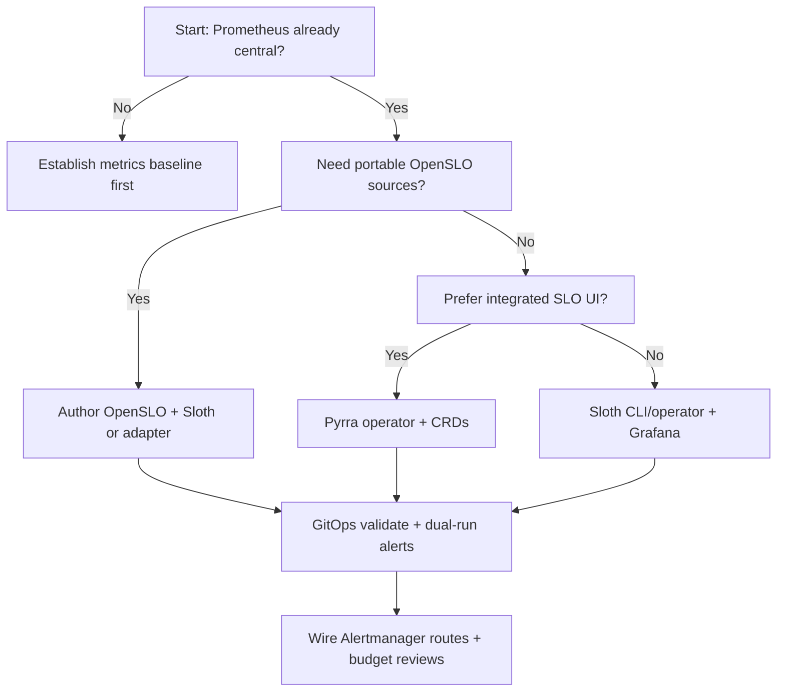

> **Toolkit Track** | Complexity: `[MEDIUM]` | Time: 40–45 min

**Prerequisites**: [SRE Module 1.2: SLOs](/platform/disciplines/core-platform/sre/module-1.2-slos/), [SRE Module 1.3: Error Budgets](/platform/disciplines/core-platform/sre/module-1.3-error-budgets/), [Module 1.1: Prometheus](../module-1.1-prometheus/)

---

## What You'll Be Able to Do

After completing this module, you will be able to:

- **Configure SLO definitions using Sloth or Pyrra with error budget calculations and burn rate alerts**
- **Implement multi-window burn rate alerting for reliable SLO breach detection without alert fatigue**
- **Deploy SLO dashboards that communicate service reliability status to engineering and business stakeholders**
- **Evaluate SLO tooling approaches and integrate them with existing Prometheus monitoring infrastructure**

---

## Why This Module Matters

**Hypothetical scenario:** A platform team at a mid-size payments company documents 99.9% availability and a 200ms p99 latency target in an internal wiki. Leadership signs an error-budget policy. Prometheus alerts exist, but someone wrote them by hand two releases ago, they only watch HTTP 5xx rates, and nobody can answer how much monthly error budget remains during a live incident. A deployment introduces a subtle correctness bug that returns HTTP 200 with wrong balances. Coarse availability metrics stay green while the team burns through roughly half of its monthly budget before anyone notices.

That gap is common when SLOs live in documents but not in the monitoring system that pages on-call engineers. Theory without tooling produces agreements that cannot defend production. SLO tooling closes the loop by turning a declarative reliability target into recording rules, multi-window burn-rate alerts, and dashboards that show budget consumption in real time. You still own the SLI design and the policy, but the repetitive PromQL and alert math moves into a generator that stays consistent across services.

The durable problem is not which logo appears on a dashboard. Hand-written Prometheus rules for SLOs are verbose, easy to get wrong, and diverge between teams. One service uses a ten-minute error-rate threshold while another copies a blog post with different windows. On-call engineers lose trust because alerts no longer map to the same error-budget language leadership uses in reviews. Codifying SLOs as specs that emit uniform rules is the practice that outlives any single generator or vendor release cycle.

This module teaches that practice first. Sloth and Pyrra appear as worked examples because both integrate with Prometheus and implement the multi-window multi-burn-rate pattern from the Google SRE Workbook. OpenSLO appears as the interchange format so definitions can move between compatible tools. By the end, you should be able to wire generated rules into Prometheus Operator, GitOps the specs, and explain to both engineers and product owners what a burn-rate alert actually means for customer impact.

---

## Why SLOs Belong in Code, Not Just Wikis

Reliability targets that only exist in Confluence or slide decks cannot page anyone, cannot appear on a dashboard, and cannot block a risky release when the error budget is exhausted. Production systems need the same rigor for SLOs that teams already apply to application manifests: version control, review, repeatable generation, and automated validation in continuous integration. When an SLO changes, the diff should show up next to the code that implements the service, not in a forgotten wiki edit from last quarter.

The shift from prose to code does not mean replacing judgment with YAML. You still decide what good means for customers, which events count as failures, and what happens when budget runs low. The spec captures those decisions in a structured form that a generator can turn into Prometheus recording rules for SLI ratios, metadata series for dashboards, and alert rules that encode burn-rate thresholds. That pipeline reduces transcription errors where an engineer copies a PromQL snippet incorrectly or uses a five-minute window in one place and one hour in another.

Teams that treat SLO specs as first-class artifacts also gain a shared vocabulary during incidents. Instead of debating whether a spike matters, responders look at burn rate relative to the agreed window and objective. Instead of rebuilding Grafana panels by hand for every service, they reuse the same generated metric names and alert labels. The tooling varies, but the durable shape is consistent: one declarative definition, many derived operational objects, one error-budget story from the SRE modules you completed earlier.

GitOps fits naturally because SLO specs are small text files that diff cleanly in pull requests. A reviewer can ask whether the SLI query includes canary traffic, whether the objective matches measured baseline, and whether page versus ticket severities align with the error-budget policy. Continuous integration can run validation commands so malformed specs never reach the cluster. That workflow turns reliability engineering from a quarterly documentation exercise into an everyday part of shipping software.

---

## The Error Budget Model and Burn Rate Math

Before touching any generator, you need the math that every tool implements underneath. A **service level indicator (SLI)** measures good events divided by valid events over a window — for example successful HTTP responses over all HTTP responses, or requests faster than 200ms over all requests. A **service level objective (SLO)** sets a target for that ratio across a rolling period such as thirty days, commonly written as 99.9% availability. The **error budget** is the complement: if the SLO allows 0.1% bad events, that 0.1% is the budget you may spend on imperfection before you have theoretically violated the objective for the window.

Burn rate expresses how fast you are spending that budget relative to the ideal pace. A burn rate of **1** means you are consuming budget exactly fast enough to exhaust it precisely at the end of the SLO window if the current rate continues unchanged. A burn rate of **2** means you are spending twice as fast and would exhaust the budget halfway through the window. A burn rate of **14.4** means you would exhaust roughly two percent of a thirty-day budget in one hour — the kind of sustained damage that warrants an immediate page for a critical service under the Google SRE Workbook starting recommendations.

The arithmetic stays simple on purpose so alerts remain explainable. For a ratio SLI, compute the error ratio over a chosen lookback window, compare it to the allowed error ratio `(1 − objective)`, and divide to get burn rate. If your SLO is 99.9% good, allowed errors are 0.001 of traffic. Observing a 1.44% error rate over the last hour means burn rate ≈ 1.44% / 0.1% ≈ 14.4. Tools like Sloth and Pyrra encode that division in recording rules so humans do not re-derive it under incident stress.

Error budgets also connect reliability work to product decisions in a way raw uptime graphs do not. When budget remains plentiful, teams can prioritize feature velocity and accept higher deployment risk within policy. When budget is nearly exhausted, the same policy might freeze launches or redirect effort to stability work. Dashboards that show **remaining budget percentage** translate PromQL into language executives understand without hiding the underlying SLI definitions engineers need for debugging.

Latency SLOs follow the same structure with different SLI queries. Instead of counting 5xx responses, you count requests above a threshold or use histogram buckets to approximate tail latency. The budget math does not change: good events over total events, objective over window, burn rate relative to allowed bad ratio. Many production services carry at least two SLOs — availability and latency — because customers experience both failure modes, and tooling should generate parallel rule sets rather than forcing everything into a single availability chart.

Correctness SLIs — responses that are HTTP 200 yet wrong — require business-aware good-event definitions OpenSLO and Sloth can express only if your metrics expose them. Payment APIs might increment a `payment_validation_failures_total` counter even when HTTP status stays 200; incorporating that counter into the error side of a ratio SLI closes the hypothetical gap from the introduction. Tooling cannot invent semantic correctness without instrumentation, but once metrics exist, codifying them in specs prevents correctness regressions from hiding behind green availability graphs.

---

## Multi-Window Multi-Burn-Rate Alerting

Alerting directly when the instantaneous error rate crosses the SLO threshold sounds precise but creates alert fatigue. A ten-minute blip at the threshold might consume a negligible fraction of a thirty-day budget yet wake an engineer at night. Alerting only on very long windows improves precision but delays detection and produces long reset times where alerts keep firing hours after recovery. The durable pattern from [Alerting on SLOs in the Google SRE Workbook](https://sre.google/workbook/alerting-on-slos/) combines **multiple burn rates**, **multiple notification severities**, and **paired short and long windows** so pages mean urgent budget threat while tickets capture slow leaks.

Single-threshold alerting fails because precision and recall pull in opposite directions for low-traffic and high-traffic services alike. A fixed error-rate alert pages on noise during spikes that do not threaten the monthly budget. A fixed long window hides fast outages until substantial budget has already disappeared. Burn-rate alerting reframes the question from “is the error rate high right now?” to “are we spending error budget fast enough that we will miss the SLO unless we act?” That reframing aligns notifications with the policy leadership already signed in the error-budget module.

The workbook’s recommended starting points for a 99.9% thirty-day SLO illustrate the pattern concretely. A **page-level** alert might fire when burn rate exceeds **14.4** over both a one-hour and a five-minute window, meaning roughly two percent of the monthly budget could disappear in an hour if the rate continues. A second page rule might use a six-hour and thirty-minute pair at burn rate **6**, catching somewhat slower damage. A **ticket-level** alert at burn rate **1** over three days catches gradual leaks that still consume ten percent of budget but do not require a midnight response. Sloth encodes these pairs as `page_alert` and `ticket_alert` stanzas; Pyrra generates multiple burn-rate alerts with different severities from its CRD.

Pairing short and long windows is the multi-window refinement that improves reset time without sacrificing detection. The long window confirms the burn is sustained enough to threaten budget; the short window confirms the burn is still active when the alert fires, so alerts stop soon after recovery instead of lingering for the entire long window. A common guideline uses a short window roughly one-twelfth the long window — five minutes paired with one hour, thirty minutes paired with six hours. This is the highest-value alerting concept in the module because it survives tool churn: even if you change generators, you still want fast-burn pages and slow-burn tickets with paired windows.

Alert suppression matters once multiple burn-rate rules exist. A severe outage might satisfy fast and slow page conditions simultaneously, producing duplicate notifications unless Alertmanager routes or inhibition rules collapse them intelligently. Design labels so severity, service, and SLO name route cleanly to the right on-call rotation. Document which alert means “drop everything” versus “create a ticket for the next business day.” Responders should not need to read generated PromQL during an incident; they should read human annotations that tie budget math back to customer impact.

Low-traffic services deserve explicit tuning rather than blindly copied thresholds. When request volume is small, error ratios swing wildly over short windows, which can page teams for failures that barely dent monthly budget. The workbook discusses compensating with longer windows, higher burn thresholds, or ticket-only severities until traffic supports tighter paging. Generators make experimentation cheap: adjust spec thresholds, regenerate, replay recent incident traffic in staging Prometheus, and observe whether alerts would have fired appropriately. Treat defaults as starting points tied to criticality, not immutable constants.

Testing alert behavior before production incidents separates healthy skepticism from blind trust in automation. Inject faults in staging — elevated 5xx rates, injected latency, or disabled dependencies — and verify that page alerts correlate with rapid budget consumption while ticket alerts catch slower leaks you might otherwise ignore until month-end reviews. Capture screenshots or exported Grafana/Pyrra views during drills so product partners learn what “two percent budget in one hour” looks like visually. Drills also reveal mislabeled metrics early, when fixing SLI queries is cheap.

---

## From Declarative Spec to Prometheus Rules

The generation pipeline is the durable spine that Sloth, Pyrra, Google’s slo-generator, and OpenSLO-aware adapters share at a high level. You begin with a declarative document describing the service, objective, SLI queries, alert severities, and labels. A generator emits **recording rules** that materialize SLI error ratios at several windows, **metadata recording rules** that attach objective and period labels for dashboards, and **alerting rules** that evaluate burn-rate expressions against thresholds derived from the objective. Prometheus evaluates those rules on its usual interval; Alertmanager routes firing alerts according to your existing configuration.

Recording rules matter because raw SLI queries over long windows are expensive and inconsistent when copied into many dashboards. Pre-recording `slo:error_ratio_rate5m`, `slo:error_ratio_rate1h`, and similar series gives alerts and panels a stable contract. When the SLI definition changes, you update the spec once, regenerate, and every downstream consumer picks up the same math. That stability is difficult to maintain when each team hand-rolls slightly different PromQL for the same service.

The spec also acts as documentation that executes. New engineers read the YAML to learn which labels define good versus bad events, what objective applies, and which alert severities exist. Reviewers see the same file in pull requests instead of hunting scattered Grafana JSON and Prometheus fragments. Validation commands — Sloth provides a `validate` subcommand suitable for CI — catch impossible objectives, malformed queries, or missing placeholders before merge.

Three input shapes appear frequently in Prometheus-native environments. **Sloth native `prometheus/v1` YAML** is optimized for Sloth’s generator and Kubernetes CRD. **`PrometheusServiceLevel` CRDs** let an in-cluster Sloth operator write `PrometheusRule` objects for Prometheus Operator. **OpenSLO documents** express the same semantics in a vendor-neutral schema so adapters can target multiple backends. Pyrra instead uses its **`ServiceLevelObjective` CRD**, which embeds ratio or latency indicators and lets the Pyrra operator manage rule generation plus UI state. The interchange goal is not one format to rule them all tomorrow; it is reducing lock-in by separating reliability intent from Prometheus rule syntax.

---

## Sloth: Generating Rules from a Declarative Spec

Sloth ([sloth.dev](https://sloth.dev), [slok/sloth](https://github.com/slok/sloth)) is our first worked example for the **spec → rules** pipeline. It accepts Sloth native YAML, Kubernetes `PrometheusServiceLevel` objects, and OpenSLO documents, then emits Prometheus recording and multi-window multi-burn-rate alerting rules aligned with Google SRE guidance. Sloth does not replace Prometheus; it delegates storage, evaluation, and notification to the stack you already run from Module 1.1.

A minimal Sloth spec stays readable on one screen because the generator expands it. You name the service, set labels for ownership, declare an objective, provide event-based SLI queries with a `{{.window}}` placeholder, and configure alert names plus page versus ticket labels. Sloth substitutes windows such as five minutes, thirty minutes, one hour, and six hours when building recording rules, which is how one SLI definition drives multiple burn-rate horizons without copy-paste.

```yaml
# sloth.yaml
version: "prometheus/v1"
service: "payment-api"
labels:
  owner: "platform-team"
  tier: "critical"
slos:
  - name: "requests-availability"
    objective: 99.9
    description: "Payment API requests succeed without 5xx errors."
    sli:
      events:
        error_query: sum(rate(http_requests_total{service="payment-api",code=~"5.."}[{{.window}}]))
        total_query: sum(rate(http_requests_total{service="payment-api"}[{{.window}}]))
    alerting:
      name: PaymentAPIHighErrorRate
      labels:
        severity: critical
      annotations:
        summary: "Payment API error budget burn rate is too high."
      page_alert:
        labels:
          severity: page
      ticket_alert:
        labels:
          severity: ticket
```

The `{{.window}}` placeholder is the hinge between readable specs and multi-window math. Hardcoding `[5m]` in the SLI would force you to duplicate queries for every horizon. Sloth expands the placeholder per rule so error ratios stay consistent at each window size. That detail is easy to miss during manual rule authoring and equally easy to get wrong when someone “fixes” a query during an incident without updating every copy.

Generate rules locally with the CLI, inspect them, then load them into Prometheus Operator or a file-based Prometheus configuration:

```bash
# Install Sloth (example: Homebrew on macOS)
brew install sloth

# Generate Prometheus rules from your SLO spec
sloth generate -i sloth.yaml -o prometheus-rules.yaml

# Validate before merge (GitOps-friendly)
sloth validate -i sloth.yaml

# Preview output without writing files
sloth generate -i sloth.yaml --dry-run
```

For a single availability SLO, Sloth typically emits multiple recording rules — SLI ratios at several windows, error budget remaining series, burn-rate helpers, and metadata — plus separate alert rules for fast page burns and slower ticket burns. The exact counts depend on objective and alert configuration, but the important operational fact is orders-of-magnitude less manual PromQL than writing equivalents by hand. Teams that already standardized on Grafana for dashboards often pair Sloth with imported community dashboards referenced in Sloth’s documentation rather than expecting Sloth itself to be the primary visualization surface.

### Running Sloth as a Kubernetes Operator

When SLO specs should live beside workloads in GitOps repositories, the Sloth operator watches `PrometheusServiceLevel` custom resources and writes `PrometheusRule` objects Prometheus Operator reconciles automatically. The spec fields mirror the CLI YAML closely, using camelCase in the CRD. Applying an SLO becomes the same workflow as applying a Deployment: merge request, review, apply, let controllers converge.

```bash
helm repo add sloth https://slok.github.io/sloth
helm install sloth sloth/sloth -n monitoring

kubectl apply -f - <<'EOF'
apiVersion: sloth.slok.dev/v1
kind: PrometheusServiceLevel
metadata:
  name: payment-api-slo
  namespace: monitoring
spec:
  service: "payment-api"
  labels:
    owner: "platform-team"
  slos:
    - name: "requests-availability"
      objective: 99.9
      sli:
        events:
          errorQuery: sum(rate(http_requests_total{service="payment-api",code=~"5.."}[{{.window}}]))
          totalQuery: sum(rate(http_requests_total{service="payment-api"}[{{.window}}]))
      alerting:
        name: PaymentAPIHighErrorRate
        pageAlert:
          labels:
            severity: page
        ticketAlert:
          labels:
            severity: ticket
EOF
```

Operator mode shines when many teams own their own SLO files in namespace-scoped repositories while platform engineering owns the Sloth deployment and Prometheus Operator permissions. The durable lesson is separation of concerns: service teams declare intent; the platform generator enforces uniform recording and alert shapes; Alertmanager enforces routing and inhibition policies you already maintain for non-SLO alerts.

Sloth also supports SLI **plugins** for shared patterns — gRPC availability, gRPC latency, HTTP availability, and HTTP latency appear in the upstream common plugin library — so platform teams publish vetted query templates once instead of letting every service reinvent label matchers. Plugins encode durable query structure while parameters capture service-specific label keys. When your organization standardizes metric names through OpenTelemetry semantic conventions, update plugins centrally and regenerate dependent SLO specs rather than editing dozens of copied queries by hand.

When Sloth emits optional Grafana dashboard JSON, treat it as a starting layout that still requires review for executive versus engineering audiences. Dashboards should reuse generated recording rule metric names rather than duplicating PromQL with slightly different windows, because duplicated math is how incident reviews lose trust. If you disable certain alert types in the spec — for example ticket burns while tuning — document that decision in the pull request so future readers know paging behavior is intentional rather than broken generation.

---

## Pyrra: Error Budget Dashboards and Operator-Managed SLOs

Pyrra ([pyrra.dev](https://pyrra.dev), [pyrra-dev/pyrra](https://github.com/pyrra-dev/pyrra)) is our second worked example, emphasizing **visibility and operator-managed SLO objects** rather than CLI-only generation. Pyrra ships a web UI, Kubernetes operator, optional generic rule generation for Grafana, and Prometheus recording plus multi-burn-rate alert rules derived from `ServiceLevelObjective` custom resources. It targets teams that want engineers and product owners to see remaining error budget without building every panel from scratch.

Where Sloth fits teams that prefer GitOps-first rule generation and already live in Grafana, Pyrra fits teams that want an integrated SLO list sorted by worst remaining budget, detail pages with burn-down graphs, and toggles between absolute and relative chart scales. Neither approach is universally superior; they differ in operational tradeoffs. Some organizations run Sloth for generation and still export Pyrra-compatible metrics, while others standardize on Pyrra CRDs end to end. Compare capabilities in the Rosetta table later rather than treating either tool as a default religion.

Deploy Pyrra against an existing Prometheus URL inside the cluster:

```bash
helm repo add pyrra https://pyrra.dev
helm install pyrra pyrra/pyrra -n monitoring \
  --set "prometheusUrl=http://prometheus-server.monitoring.svc:9090"
```

Define an SLO as a CRD with a ratio indicator Pyrra understands natively:

```yaml
apiVersion: pyrra.dev/v1alpha1
kind: ServiceLevelObjective
metadata:
  name: payment-api-availability
  namespace: monitoring
  labels:
    pyrra.dev/team: "platform"
spec:
  target: "99.9"
  window: 30d
  description: "Payment API returns successful responses."
  indicator:
    ratio:
      errors:
        metric: http_requests_total{service="payment-api",code=~"5.."}
      total:
        metric: http_requests_total{service="payment-api"}
```

After reconciliation, Pyrra exposes UI views for objective, current availability, remaining error budget, burn-rate tables, and underlying RED metrics. It also publishes Prometheus series such as `pyrra_objective_error_budget_remaining` and `pyrra_objective_burn_rate` you can reuse in Grafana if the built-in UI is not enough for executive summaries. Demo installations at [demo.pyrra.dev](https://demo.pyrra.dev) illustrate the experience without requiring a local cluster when you want a quick tour of the interaction model.

Engineering stakeholders typically need burn-rate charts, alert status, and links into traces or logs when an SLO degrades. Business stakeholders often need a single remaining-budget percentage tied to a customer journey name and a plain-language description of what failure means — failed payments, delayed shipments, stale dashboards. Pyrra’s sorted SLO list helps during weekly reliability reviews because the worst budgets float to the top without custom sorting in Grafana. Sloth can feed similar metrics once recording rules exist, but Pyrra centers that workflow in its UI by design.

Pyrra’s architecture splits a UI, an API, and a Kubernetes reconciler that reads `ServiceLevelObjective` objects and writes Prometheus rules the same way Sloth’s operator does, while also caching Prometheus query results to keep the UI responsive under load. For long-term metrics backends, Pyrra documents Thanos integration options such as disabling partial responses and downsampling to five-minute and one-hour resolutions when querying global views. Those details are volatile operational knobs, but the durable idea is that SLO visualization should respect the same Prometheus topology you already use rather than forcing a separate metrics store.

The `--generic-rules` flag mentioned in Pyrra’s documentation exports recording rules usable in Grafana when teams want Pyrra’s math with custom panel layouts. That hybrid pattern matters for organizations where executive dashboards live in Grafana folders with strict design standards, while SREs still want Pyrra’s detail pages for investigations. Compare export versus native UI based on who maintains dashboards long term — central observability teams often prefer Grafana, while product-aligned SRE groups sometimes prefer Pyrra’s defaults.

---

## OpenSLO: Portable Definitions Across Tools

OpenSLO ([openslo.com](https://openslo.com), [OpenSLO/OpenSLO](https://github.com/OpenSLO/OpenSLO)) is a vendor-neutral YAML specification for describing SLOs, SLIs, alert policies, services, and budgeting methods. It originated at Nobl9 and continues as a community project so organizations can separate **reliability intent** from any one generator or SaaS backend. Sloth documents OpenSLO support; other tools consume or export OpenSLO through adapters at different maturity levels. The durable goal is define once, generate anywhere compatible — not instant universal portability tomorrow.

An OpenSLO document names the service, objective, indicator queries, and rolling time window explicitly:

```yaml
apiVersion: openslo/v1
kind: SLO
metadata:
  name: payment-api-availability
spec:
  service: payment-api
  description: "Payment API serves requests successfully."
  budgetingMethod: Occurrences
  objectives:
    - displayName: Availability
      target: 0.999
      op: gte
  indicator:
    metadata:
      name: payment-api-success-rate
    spec:
      ratioMetric:
        counter: true
        good:
          metricSource:
            type: Prometheus
            spec:
              query: sum(rate(http_requests_total{service="payment-api",code!~"5.."}[5m]))
        total:
          metricSource:
            type: Prometheus
            spec:
              query: sum(rate(http_requests_total{service="payment-api"}[5m]))
  timeWindow:
    - duration: 30d
      isRolling: true
```

OpenSLO shines when multiple platforms must agree on definitions — for example platform engineering standardizing specs in Git while a commercial SLO product ingests the same files for executive reporting. Even if you deploy only Sloth today, storing OpenSLO-shaped sources reduces migration cost when adapters improve. Treat OpenSLO as the contract; treat Prometheus rule YAML as an emitted artifact rather than the authoritative description of customer expectations.

Validation against the OpenSLO schema in CI catches structural mistakes early, similar to Sloth’s validate command. Teams should still run SLI queries in Prometheus to confirm labels and traffic coverage because schema validity does not prove operational correctness. The interchange spec does not replace review; it makes review repeatable across tools that speak the same fields.

OpenSLO models alert policies as first-class objects separate from SLOs, which helps large organizations standardize notification intent even when different generators render Prometheus rules differently. An alert policy might describe burn-rate conditions in spec language while Sloth or another adapter translates to `expr` blocks Alertmanager understands. Keeping policies adjacent to SLO definitions in Git makes audit questions — who approved paging changes — answerable from history rather than from tribal memory of dashboard edits.

---

## Google slo-generator and Multi-Backend Generation

Google’s [slo-generator](https://github.com/google/slo-generator) is another open-source reference implementation worth knowing as a peer, especially when metrics live in both Prometheus and Google Cloud Monitoring. It accepts YAML or JSON configuration, computes SLO series, and emits backend-specific rules through pluggable exporters described in the upstream README. The durable lesson mirrors Sloth and Pyrra: encode objectives and indicators once, let software generate repetitive alert math, and keep human review focused on SLI semantics rather than copy-pasted thresholds.

Teams heavy on Google Cloud may already centralize metrics in Cloud Monitoring while Kubernetes workloads export Prometheus series in parallel. slo-generator’s multi-backend posture lets platform engineers experiment with consistent SLO definitions across those stores without insisting on a single metrics vendor. Even if you standardize on Sloth for Prometheus-only estates, understanding slo-generator clarifies why OpenSLO and other interchange efforts exist — organizations rarely have only one telemetry backend, and generators that pretend otherwise eventually accrue shadow spreadsheets.

---

## Integrating SLO Tooling with Prometheus and GitOps

Generated rules are useless until Prometheus loads them and Alertmanager routes them. With Prometheus Operator, generated manifests typically take the form of `PrometheusRule` objects labeled so existing `ServiceMonitor`-style selectors pick them up. Confirm that rule selectors on your Prometheus custom resource include the labels your generator emits; otherwise rules exist in etcd but never evaluate. After deployment, use the Prometheus rules UI and `ALERTS` time series to verify evaluation, not only `kubectl get prometheusrules`.

GitOps workflows treat SLO specs as source and generated rules as either committed artifacts or ephemeral CI outputs. Committing generated rules makes diffs visible when generator versions change; regenerating in CI keeps repositories free of duplicated logic but requires pipeline discipline. Either pattern works if teams agree where the source of truth lives. Pair merges with `sloth validate` or OpenSLO schema checks so broken objectives never reach production clusters.

Recording rule cardinality stays bounded when SLI queries aggregate away high-cardinality labels before ratio calculation. Avoid passing raw `path` or `user_id` labels into SLO recording rules; aggregate to service, route template, or tenant tier according to policy. SLO tooling will faithfully generate rules from whatever queries you supply, which means it can faithfully amplify cardinality mistakes at scale. Review SLI queries with the same skepticism you applied to raw application metrics in Module 1.1.

Alertmanager integration should reuse existing routing trees. Map page and ticket severities to receivers on-call rotations already trust. Add inhibition rules so child alerts suppress when parent fast-burn alerts fire, mirroring workbook guidance about duplicate notifications across burn-rate thresholds. Annotate alerts with remaining budget estimates and links to Pyrra or Grafana dashboards so responders jump directly from page to context.

For organizations evaluating tooling while keeping Prometheus central, start with one non-critical service, import baseline SLI queries from existing dashboards, generate rules, and compare alert behavior against prior hand-written alerts during staged fault injection. Measure precision anecdotally through incident drills rather than fabricated statistics. Once confidence exists, expand templates through internal scaffolding — cookiecutter repos, Helm wrappers, or platform catalog entries — so teams inherit correct defaults for windows, severities, and labels.

---

## Communicating Reliability to Engineering and Business Stakeholders

Engineering audiences want burn-rate charts, alert timelines, and the exact SLI queries backing a red panel. Business audiences want to know whether customers can still check out, file claims, or sync data this week, expressed as remaining budget on a journey they recognize. SLO tooling supports both when you design labels and descriptions deliberately in specs rather than leaving default metric names opaque.

Weekly reliability reviews benefit from a consistent table: service name, objective, remaining budget percentage, dominant burn window, owner, and planned remediation if budget trend continues downward. Pyrra’s sorted list view approximates that table out of the box; Grafana dashboards fed by Sloth or Pyrra recording rules approximate it when you invest in panel design. The practice matters more than the widget — meetings should end with explicit decisions about deploy freezes, capacity investments, or acceptance of risk.

During incidents, translate alerts into budget language before declaring all-clear. “Error rate returned to normal” differs from “we stopped burning budget fast enough to miss the monthly SLO.” Multi-window burn-rate alerts help because recovery on the short window drops pages while long-window series show whether you still owe follow-up work to repay borrowed budget. Document those narratives in post-incident reviews so product partners learn to read SLO tooling output without a Prometheus crash course.

Error-budget policies from Module 1.3 become real when dashboards show thresholds like fifty, twenty-five, and zero percent remaining triggering different actions. Tooling does not enforce policy automatically unless you wire alerts or automation to those thresholds, but visible budget makes policy conversations honest. Without visibility, teams debate anecdotes; with visibility, they debate tradeoffs with shared numbers — still estimates, but grounded in the same SLI definitions alerts use.

Executive summaries should avoid raw PromQL entirely. Translate remaining budget into customer-journey language — “checkout succeeded for roughly ninety-nine point nine percent of attempts this month, with about thirty percent of error budget remaining” — and link to engineering dashboards for depth. When tooling provides both absolute and relative chart scales, pick relative views for leadership reviews so small remaining budgets visually pop, and absolute views for engineers diagnosing whether a blip or sustained leak caused the drop.

---

## Evaluating SLO Tooling for Your Prometheus Stack

Evaluation should begin from capabilities your organization already committed to: Prometheus as metrics backbone, Prometheus Operator in Kubernetes, GitOps with pull-request review, Grafana for generic dashboards, and an error-budget policy with defined page versus ticket behavior. Score candidate tools against those constraints instead of feature checklists copied from vendor marketing pages. Ask whether a tool strengthens the declarative spec → uniform rules → budget-aware alerts pipeline or merely adds another UI silo.

Sloth emphasizes CLI and operator generation, OpenSLO ingestion, optional Grafana dashboards, and minimal runtime beyond Prometheus itself. Pyrra emphasizes an operator plus first-party UI, CRD-native workflows, generic rule export for Grafana, and built-in multi-burn-rate alert generation from its object model. Google’s [slo-generator](https://github.com/google/slo-generator) targets multi-backend emission including Stackdriver and Prometheus from YAML configs, which appeals when hybrid cloud metrics already split across systems. OpenSLO remains the specification layer any of them can converge on over time.

Proof-of-concept criteria stay practical: time to first working SLO on a real service, reviewer comprehension of diffs, on-call comprehension of alert annotations, operational cost of upgrades, and fit with namespace ownership boundaries. Prefer tools whose generated metric names and alert labels match conventions you want every team to follow. Prefer generators that validate specs in CI and document how alert thresholds map to workbook burn rates so you can explain pages without hand-waving.

Integration with existing Prometheus monitoring also means honoring discovery and relabeling conventions from Module 1.1. SLI queries must use the same `job`, `service`, and `namespace` labels your dashboards already filter on. When migrating from hand-written rules, run old and new alerts in parallel during a burn-in window if Alertmanager capacity allows, then disable legacy rules once responders trust the new annotations. Migration is a people process supported by tooling, not a flip-switch weekend unless traffic is trivial. Maintain a short internal decision record capturing which generator you chose, which spec format is canonical, how Alertmanager severities map to policy, and when you will revisit the choice. Revisit triggers include major generator upgrades, OpenSLO adapter maturity changes, or organizational moves toward multi-cloud metrics backends that slo-generator-style tools handle differently from Sloth-only workflows.

Ownership boundaries matter as much as feature lists. Platform teams often operate generators, Prometheus Operator permissions, and Alertmanager routes, while service teams own SLI correctness for their domains. Document escalation paths when a page fires but the SLI query no longer matches renamed metrics after a deploy — that operational failure mode appears in every tooling choice and is fixed by CI query validation, not by switching logos on a dashboard.

> **Landscape snapshot — as of 2026-06. This changes fast; verify against vendor docs before relying on specifics.**
>
> | Project | Role | Spec inputs | Notable extras |
> |---------|------|-------------|----------------|
> | Sloth | Prometheus SLO rule generator + K8s operator | Native `prometheus/v1`, `PrometheusServiceLevel` CRD, OpenSLO | CLI validate, optional Grafana dashboards, web UI on sloth.dev |
> | Pyrra | Prometheus SLO operator + UI | `ServiceLevelObjective` CRD | Built-in burn-down UI, generic Grafana rules, demo at demo.pyrra.dev |
> | OpenSLO | Vendor-neutral SLO YAML spec | OpenSLO schema | Community spec; originated at Nobl9 |
> | Google slo-generator | Multi-backend SLO rule generator | YAML/JSON config | Prometheus and Stackdriver backends per upstream README |
>
> None of these projects are CNCF graduated or incubating programs as of this snapshot; treat them as independent open-source tools with their own release cadences.

| Capability | Sloth | Pyrra | OpenSLO (spec) | Google slo-generator |
|------------|-------|-------|----------------|----------------------|
| Declarative SLO spec format | Native YAML + CRD | Pyrra CRD | Portable YAML schema | YAML/JSON config |
| Prometheus recording rules | Generated | Generated | Via adapters | Generated (Prometheus backend) |
| Multi-burn-rate alerts | Generated page/ticket pairs | Generated severities | Alert policies in spec | Generated per config |
| Built-in web UI | Limited / docs site tooling | First-class UI | N/A (spec only) | N/A |
| Kubernetes operator | Yes | Yes | N/A | Varies by deployment |
| GitOps-friendly sources | Yes | Yes | Yes | Yes |
| OpenSLO ingestion | Supported in Sloth | Adapter ecosystem; native CRD primary | Native | Not primary focus |

---

## Patterns, Anti-Patterns, and Decision Framework

**Patterns that age well**

1. **Spec as source of truth** — Store SLO intent in version control; treat Prometheus rules as generated artifacts with reviewed diffs.
2. **Workbook-aligned burn pairs** — Page on fast multi-window burns; ticket on slow burns; document thresholds relative to objective.
3. **Two SLOs per critical user journey** — Availability plus latency captures complementary failure modes customers actually feel.
4. **CI validation** — Run generator validate or OpenSLO schema checks on every pull request touching specs.
5. **Dashboards that show remaining budget** — Anchor incident and review conversations in budget language, not only instantaneous error rates.

**Anti-patterns to avoid**

| Anti-Pattern | Why It Fails | Better Approach |
|--------------|--------------|-----------------|
| Hand-written one-off SLO rules | Drift and math errors across teams | Generate from a shared spec with reviewed SLI queries |
| Single-window error-rate pages | Noise at low burn plus slow detection at high burn | Multi-window multi-burn-rate alerts with severities |
| SLI queries nobody validated in Prometheus | Silent empty rules that look green | Run queries against live metrics before merging specs |
| Tool-first adoption without policy | Alerts fire with no agreed response | Pair tooling with error-budget policy thresholds |
| High-cardinality labels in SLI ratios | Explodes series count and cost | Aggregate to bounded labels before ratio calculation |
| Competing dashboards with different math | Loses trust during incidents | Reuse generated recording rule names everywhere |



Use the diagram as a conversation starter, not a mandate. Hybrid approaches — Sloth-generated rules with Pyrra UI metrics, or OpenSLO sources with Sloth generation — remain valid when ownership splits between platform engineering and product teams.

---

## Did You Know?

- **Hand-written SLO recording rules drift quickly** — the Google SRE Workbook documents multi-window multi-burn-rate alerting precisely because manual PromQL copies diverge; generators encode that pattern once per spec.

- **Pyrra publishes first-class Prometheus metrics for budgets** — series such as `pyrra_objective_error_budget_remaining` let you reuse Pyrra’s math in Grafana executive panels without duplicating queries.

- **OpenSLO separates intent from implementation** — the spec describes objectives and indicators; Prometheus rule YAML becomes an emitted artifact rather than the authoritative customer promise.

- **Burn rate 1 equals budget-neutral pacing** — higher burn rates express how many times faster than sustainable you are spending budget; workbook page thresholds like 14.4× translate that into “act now” language for on-call.

---

## Common Mistakes

| Mistake | Why It Happens | How to Fix |
|---------|----------------|------------|
| SLI query does not match real traffic | Copy-pasted queries without label verification | Run SLI queries in Prometheus; confirm non-empty series on production-like labels |
| Objective set far above measured baseline | Ambition without baseline measurement | Measure two weeks of actual SLI performance; set objective slightly above baseline |
| Hardcoded windows instead of `{{.window}}` in Sloth | Treating generator specs like static PromQL | Use placeholders so every horizon stays consistent |
| Generated rules never loaded into Prometheus | Generate-only workflow without Operator wiring | Apply `PrometheusRule` objects or mount files; confirm in Prometheus UI |
| Availability-only SLOs on user-facing APIs | Availability is easiest to define | Add latency or correctness SLIs where customers feel tail latency or silent errors |
| One burn threshold for every severity | Single alert tries to page and ticket simultaneously | Separate page and ticket burns with workbook-inspired pairs |
| No error-budget policy linked to dashboards | Tooling works but response is undefined | Document actions at 50%, 25%, and 0% budget remaining |
| Cardinality explosion in SLI labels | Unbounded labels in ratio queries | Aggregate away user, request, and raw path labels before recording |

---

## Quiz

<details>
<summary>Answer</summary>

Sloth replaces `{{.window}}` with multiple horizons — commonly five minutes, thirty minutes, one hour, and six hours — when generating recording rules from a single SLI definition. That substitution is how one spec produces multi-window error ratios without duplicating queries. Those recorded series feed burn-rate alert rules that compare short and long windows. If you hardcode a single window, you lose the multi-window half of the workbook pattern and must maintain separate queries manually.
</details>

<details>
<summary>Answer</summary>

A simple error-rate threshold pages on brief spikes that consume negligible monthly budget, causing fatigue, while a single long window delays detection and stays fired long after recovery. Multi-window burn-rate alerting asks whether you are spending budget fast enough to miss the SLO, using paired short and long windows to improve precision and reset time. Page alerts target fast burns; ticket alerts target slow leaks. This aligns notifications with error-budget policy instead of raw instantaneous rates.
</details>

<details>
<summary>Answer</summary>

Choose Pyrra when you want an integrated web UI that lists SLOs by remaining budget, shows burn-down graphs, and surfaces multi-burn-rate alert status without building Grafana panels first. Choose Sloth when you prefer CLI or operator generation, OpenSLO inputs, and Grafana as the primary visualization layer. Many teams pick one primary workflow based on who owns reliability UX — platform engineers versus product-aligned SREs — and still export Prometheus metrics both tools generate for shared dashboards.
</details>

<details>
<summary>Answer</summary>

OpenSLO provides a vendor-neutral YAML schema for SLIs, objectives, time windows, and alert policies so definitions can move between compatible generators and services. It separates customer-facing reliability intent from Prometheus-specific rule syntax. Even if you standardize on one generator today, OpenSLO-shaped sources reduce migration cost when adapters or organizational requirements change. Schema validation in CI catches structural errors before deployment.
</details>

<details>
<summary>Answer</summary>

A Sloth page alert firing means burn rate exceeded the fast threshold on both short and long windows — for default 99.9% thirty-day objectives this often corresponds to workbook guidance around fourteen times sustainable burn, consuming on the order of two percent of monthly budget in an hour if sustained. That signals imminent SLO miss unless mitigated now, not a slow leak suitable for next-day tickets. Responders should treat it as budget defense, not merely elevated error ratio.
</details>

<details>
<summary>Answer</summary>

Integrate by ensuring Prometheus Operator selectors pick up generated `PrometheusRule` objects, Alertmanager routes page and ticket labels to appropriate receivers, and SLI queries use the same labels as existing service discovery. Store specs in Git with validate steps in CI, run staged fault injection to compare new alerts with legacy ones, and disable hand-written duplicates once on-call trusts annotations. Document metric names so Grafana and Pyrra panels reuse recording rules instead of reimplementing math.
</details>

<details>
<summary>Answer</summary>

Burn rate 1 means you are consuming error budget exactly fast enough to exhaust it at the end of the window if the rate continues. Burn rate 2 exhausts budget twice as fast — halfway through the window. Burn rate 14.4 means you would spend roughly two percent of a thirty-day budget in one hour at that pace. Expressing alerts as burn rates ties pages to budget impact rather than arbitrary error-percent thresholds.
</details>

<details>
<summary>Answer</summary>

Validate SLI queries in Prometheus for non-empty results, run generator validate or OpenSLO schema checks in CI, apply rules via Prometheus Operator, confirm evaluation in the Prometheus UI, inject faults to see burn rates move in Pyrra or Grafana, and verify Alertmanager routes page labels to the on-call receiver. Success means responders see budget-aware alerts with clear annotations and can trace firing rules back to the spec in Git. Skipping fault injection leaves you guessing whether ticket burns ever fire.
</details>

---

## Hands-On Exercise: SLO Tooling Pipeline

Define SLOs for a sample web service, generate Prometheus rules with Sloth, load them into Prometheus Operator, deploy Pyrra for visualization, and simulate budget burn. Use a disposable cluster because the exercise installs monitoring components and sample workloads.

### Setup

```bash
kind create cluster --name slo-lab

helm repo add prometheus-community https://prometheus-community.github.io/helm-charts
helm install kube-prometheus prometheus-community/kube-prometheus-stack \
  -n monitoring --create-namespace \
  --set grafana.enabled=true
```

### Step 1: Deploy a Sample Application

```bash
kubectl create namespace demo

kubectl apply -n demo -f - <<'EOF'
apiVersion: apps/v1
kind: Deployment
metadata:
  name: web-service
spec:
  replicas: 2
  selector:
    matchLabels:
      app: web-service
  template:
    metadata:
      labels:
        app: web-service
      annotations:
        prometheus.io/scrape: "true"
        prometheus.io/port: "8080"
    spec:
      containers:
        - name: web
          image: quay.io/brancz/prometheus-example-app:v0.5.0
          ports:
            - containerPort: 8080
---
apiVersion: v1
kind: Service
metadata:
  name: web-service
spec:
  selector:
    app: web-service
  ports:
    - port: 80
      targetPort: 8080
EOF
```

### Step 2: Define the SLO with Sloth

```bash
brew install sloth

cat > web-service-slo.yaml <<'EOF'
version: "prometheus/v1"
service: "web-service"
labels:
  owner: "platform-team"
  tier: "standard"
slos:
  - name: "availability"
    objective: 99.5
    description: "Web service responds without server errors."
    sli:
      events:
        error_query: sum(rate(http_requests_total{job="web-service",code=~"5.."}[{{.window}}]))
        total_query: sum(rate(http_requests_total{job="web-service"}[{{.window}}]))
    alerting:
      name: WebServiceAvailability
      page_alert:
        labels:
          severity: page
      ticket_alert:
        labels:
          severity: ticket
EOF

sloth validate -i web-service-slo.yaml
sloth generate -i web-service-slo.yaml -o web-service-rules.yaml
cat web-service-rules.yaml
```

### Step 3: Load Rules into Prometheus

```bash
kubectl apply -n monitoring -f web-service-rules.yaml
kubectl get prometheusrules -n monitoring
```

Open the Prometheus UI via port-forward and confirm recording groups appear for the web-service SLO.

### Step 4: Deploy Pyrra for Visualization

```bash
helm repo add pyrra https://pyrra.dev
helm install pyrra pyrra/pyrra -n monitoring \
  --set "prometheusUrl=http://kube-prometheus-prometheus.monitoring.svc:9090"

kubectl port-forward -n monitoring svc/pyrra 9099:9099
```

Visit `http://127.0.0.1:9099` and locate SLOs backed by the generated metrics once Pyrra objects or generic rules are configured for the demo service.

### Step 5: Simulate an Incident

```bash
kubectl run load-gen --image=busybox -n demo --restart=Never -- \
  sh -c 'while true; do wget -q -O- http://web-service/err 2>/dev/null; sleep 0.1; done'

kubectl get alerts -n monitoring
```

Watch burn rates rise in Pyrra or Grafana while errors continue, then stop the load generator and observe short-window burns recover before long-window series fully relax.

### Success Criteria

- [ ] Sloth validates and generates Prometheus recording and alert rules from your YAML spec
- [ ] A `PrometheusRule` resource loads in the monitoring namespace and appears in the Prometheus rules UI
- [ ] Pyrra or Grafana shows remaining error budget decreasing while fault traffic runs
- [ ] At least one burn-rate alert fires with page or ticket severity labels matching your Alertmanager routes

### Cleanup

```bash
kind delete cluster --name slo-lab
```

---

## Next Module

Continue the observability toolkit with [Module 1.11: eBPF Tracing Tools](../module-1.11-ebpf-tracing-tools/).

---

## Sources

- [Sloth documentation](https://sloth.dev/) — Overview of the Prometheus SLO generator, spec formats, and operator mode.
- [Sloth GitHub repository](https://github.com/slok/sloth) — Source, CLI usage, OpenSLO support, and Kubernetes CRD references.
- [Pyrra documentation site](https://pyrra.dev/) — Installation paths, demo links, and feature summary.
- [Pyrra GitHub repository](https://github.com/pyrra-dev/pyrra) — Operator architecture, CRD definitions, UI capabilities, and Grafana integration.
- [OpenSLO project site](https://openslo.com/) — Vendor-neutral SLO specification and community resources.
- [OpenSLO GitHub specification](https://github.com/OpenSLO/OpenSLO) — Schema, object types, and budgeting methods.
- [Google SRE Workbook: Alerting on SLOs](https://sre.google/workbook/alerting-on-slos/) — Multi-window multi-burn-rate alerting theory and recommended thresholds.
- [Google SRE Workbook: Implementing SLOs](https://sre.google/workbook/implementing-slos/) — SLI/SLO implementation guidance that informs spec design.
- [Prometheus recording rules documentation](https://prometheus.io/docs/prometheus/latest/configuration/recording_rules/) — How generated SLI recording rules execute in Prometheus.
- [Prometheus alerting rules documentation](https://prometheus.io/docs/prometheus/latest/configuration/alerting_rules/) — Alert evaluation semantics for generated burn-rate rules.
- [Google slo-generator repository](https://github.com/google/slo-generator) — Multi-backend SLO generation reference implementation from Google.
- [KubeDojo SRE Module 1.2: SLOs](/platform/disciplines/core-platform/sre/module-1.2-slos/) — Foundational SLO concepts referenced throughout this module.
- [KubeDojo SRE Module 1.3: Error Budgets](/platform/disciplines/core-platform/sre/module-1.3-error-budgets/) — Error budget policies that SLO tooling visualizes and enforces.
