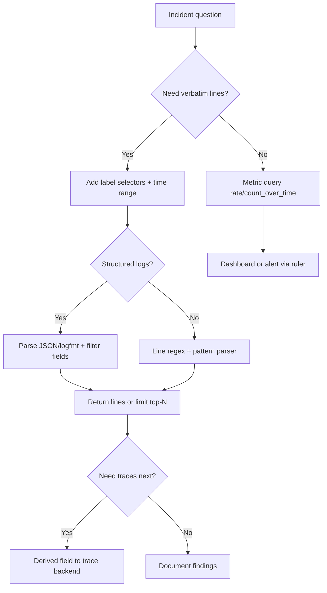

> **Toolkit Track** | Complexity: `[COMPLEX]` | Time: 40-45 min

## Prerequisites

Before starting this module, you should have completed [Module 1.1: Prometheus](../module-1.1-prometheus/) so that labels, selectors, and range-vector thinking feel familiar rather than foreign. [Module 1.3: Grafana](../module-1.3-grafana/) is also required because this lesson assumes you can open Explore, switch data sources, and correlate panels across telemetry types during an incident. You should be comfortable reading container logs with `kubectl logs` and understand why log volume grows faster than most teams expect once microservices, sidecars, and audit trails enter the picture.

Examples target Kubernetes 1.35+ and assume you can run commands against a disposable cluster where installing a monitoring namespace is acceptable. You do not need prior Elasticsearch or Splunk experience, but if you have used a full-text log search product, this module will explicitly contrast that indexing model with Loki's label-index approach so you can reason about tradeoffs instead of treating one backend as universally superior.

---

## What You'll Be Able to Do

After completing this module, you will be able to:

- **Deploy** Loki with label-based indexing and object-storage backends, choosing a topology that matches your ingest and query load instead of copying a demo config that collapses under production volume.
- **Write** LogQL queries that narrow streams, filter lines, parse structured fields, and derive time-series metrics from log patterns for dashboards and alerts.
- **Configure** Grafana Alloy (and understand legacy Promtail pipelines) for Kubernetes log collection with deliberate label enrichment that avoids cardinality explosions.
- **Optimize** retention, compaction, and per-tenant limits so high-volume environments stay within budget without sacrificing the log lines you actually need during investigations.
- **Correlate** Prometheus metric spikes with the exact log lines that explain them, using shared labels and Grafana's metrics-to-logs pivot workflow.

---

## Why This Module Matters

**Hypothetical scenario:** A platform team operating roughly two terabytes of logs per day discovers that its search-oriented logging stack costs more than its primary application databases once replication, hot-tier retention, and full-text indexing are accounted for. Leadership asks for a fifty percent reduction in logging spend within two quarters while keeping thirty days of searchable history for security and compliance. The team evaluates backends that store compressed chunks in object storage and index only a small, operator-chosen label set rather than every token in every line. The migration succeeds on cost, but three weeks later queries begin timing out because developers promoted request identifiers and pod IP addresses to labels. Ingesters restart under memory pressure, and the logging plane becomes its own incident. The lesson is not that cheap storage solves logging; it is that label discipline and query design are as operational as disk pricing.

Logs answer questions metrics cannot. A rising error ratio tells you that checkout is failing; logs tell you whether the failure is a database timeout, an upstream four-hundred response misclassified as success, or a deployment that changed a configuration path. At scale, however, the economics of logging flip from nuisance to strategy. Traditional stacks that index every field in every line deliver fast ad-hoc search at the price of index storage that often exceeds raw log volume by an order of magnitude. Teams that must retain months of history for audits feel this cost continuously, even when nobody runs queries against most stored lines.

Loki approaches the problem with a deliberate tradeoff inherited from Prometheus culture: [index labels, store compressed log lines in object storage, and scan content at query time](https://grafana.com/docs/loki/latest/get-started/architecture/). The durable capability is cost-efficient log aggregation through label-indexed streams, not the Loki binary itself. When you internalize that model, you can evaluate Elasticsearch, OpenSearch, ClickHouse-backed engines, and vendor SaaS offerings on the same axes—index shape, query language, agent ecosystem, and storage economics—rather than treating any single product name as synonymous with logging.

This module uses Loki as the running worked example because its architecture makes the tradeoffs visible. You will learn why index-light storage is cheaper, why high-cardinality labels destroy that advantage, how LogQL composes stream selection with line filters and parsers, how Grafana Alloy replaces Promtail as the supported collection agent, and how to pivot from a metric chart into correlated logs during an outage. The goal is durable practice you can transfer when tools change, not a product tour that expires on the next release note.

---

## Index-Light Logging: The Durable Cost Argument

Full-text indexing treats every searchable token as a first-class citizen in an inverted index. That design excels when analysts run unpredictable keyword searches across months of history without knowing which fields exist in advance. It also means storage and merge work grow with vocabulary size, field cardinality, and update frequency. Log lines are verbose, repetitive, and bursty; indexing all of them converts a streaming append workload into a random-write indexing workload that demands fast disks, large heaps, and careful shard planning.

Loki inverts the default assumption. Instead of indexing message bodies, it groups lines into streams defined by a label set, stores compressed chunks sequentially, and keeps a compact index that maps labels to chunk references. Queries first narrow the candidate streams with label selectors—an operation comparable to Prometheus series selection—then apply line filters and parsers over the matching chunks inside a time window. The durable pattern is grep plus metadata routing at scale, not instant full-text search across all history.

The cost advantage appears in two places. Ingest and long-term storage move toward object storage pricing because chunks are large, sequential, and highly compressible. Index storage stays comparatively small because only labels are indexed, not every word in every line. The price is query latency and operator discipline. A query that matches too many streams or spans too much time must read and decompress many chunks even if the final answer is a single line. Loki rewards teams that log with structure, choose low-cardinality labels deliberately, and treat exploratory search as a bounded operation with explicit time ranges.

Compare the mental model to metrics. Prometheus stores samples keyed by metric name and labels; Loki stores log lines keyed by stream labels. Neither system wants an unbounded label dimension. The difference is that metrics failures show up as memory pressure and slow PromQL, while logging failures show up as ingester out-of-memory kills, compactor backlogs, and query timeouts that feel like "Loki is broken" when the real issue is stream cardinality. Understanding index-light logging means accepting scan-heavy queries as a design consequence and compensating with label design, retention tiers, and metric derivations from logs when you need continuous alerting.

| Concern | Full-content index (typical search stack) | Label index + chunk store (Loki-style) |
|---------|-------------------------------------------|----------------------------------------|
| Primary index unit | Terms and fields in message bodies | Label sets pointing to compressed chunks |
| Storage cost driver | Index size + replica copies of hot shards | Chunk bytes in object storage + small label index |
| Best query shape | Ad-hoc keyword search across many fields | Narrow label selector + time-bounded line filter |
| Operational risk | Shard imbalance, merge throttling | Stream explosion from high-cardinality labels |
| Sweet spot | Investigative search with rich field maps | High-volume platform logs with stable dimensions |

None of this implies that full-text indexing is wrong. Many teams run both: a cost-efficient platform log backend for high-volume Kubernetes and application stdout, and a smaller indexed corpus for security or business analytics with strict field schemas. The engineering mistake is choosing a backend optimized for cheap ingest and then configuring it like a search engine by promoting every JSON field to a label.

---

## Labels, Streams, and Cardinality Discipline

In Loki, a stream is the combination of a label set and the ordered log lines belonging to that set. Labels are not decorative metadata; they are the primary access path. The querier uses labels to decide which chunks to load, and the ingester uses streams to partition in-memory structures before flushing to storage. If two lines share identical labels, they belong to the same stream. If labels differ, Loki treats them as separate streams even when the message text is identical.

Cardinality is the count of unique stream combinations produced by your label choices. Low-cardinality labels take a small number of values across the fleet: `namespace`, `cluster`, `app`, `container`, and `level` when log levels are bounded. High-cardinality labels take a value per request, user, pod IP, trace identifier, or build ID. Prometheus operators already learn that `user_id` must not become a metric label; Loki operators must learn the same lesson for log streams. The failure mode is faster in logging because request-heavy workloads generate far more lines per second than metric scrape intervals create samples.

Grafana documents explicit guidance: [labels should identify the source of logs, not duplicate fields that belong inside the line](https://grafana.com/docs/loki/latest/get-started/labels/bp-labels/). Structured logs should carry request identifiers, URLs, and error strings in JSON or logfmt payloads. Agents may parse those fields for filtering during ingest, but promoting them to labels creates a new stream per unique value. A service handling millions of requests per day can create millions of streams if `request_id` becomes a label. Ingesters track active streams in memory; compactions and queries multiply work with stream count. Costs rise and stability falls even though object storage itself remains cheap.

Label design should mirror how you expect to troubleshoot. Platform operators typically need `namespace`, `app`, `component`, and `node` to narrow incidents. Application teams may need `level` and `environment` when those values are bounded enums. Fields you filter on occasionally—HTTP paths with hundreds of routes, customer tiers with a dozen values—belong in parsed line filters at query time unless you have measured cardinality and retention impact. Fields you filter on rarely—individual request IDs—belong in line content and should be queried with parsers only when investigating a known identifier.

The agent pipeline is where cardinality mistakes are encoded. A JSON parsing stage that extracts `trace_id` is useful; a subsequent labels stage that promotes `trace_id` is dangerous unless trace IDs are bounded, which they never are in HTTP services. The correct pattern extracts dynamic values into the line, keeps stable dimensions as labels, and uses LogQL parsers during incidents. When you review a pull request that touches logging configuration, ask one question: how many unique label combinations will this create at peak traffic? If the answer scales with requests or users, reject the change.

> **Stop and think:** Your API gateway logs include `pod`, `namespace`, `app`, and a JSON field `request_id`. Which of these belong as Loki labels, and which belong only in the log line? What happens to ingester memory if `request_id` becomes a label at ten thousand requests per second?

The durable principle transfers to any label-indexed log backend: labels define partitions; partitions must be coarse enough to aggregate and fine enough to troubleshoot. Treat stream count as a capacity metric just like Prometheus series count. Alert on growth, document allowed label keys, and provide examples in service templates so application teams do not invent their own high-cardinality keys during an outage.

---

## Loki Architecture and the Ingest Path

Understanding Loki's components clarifies why certain failures appear where they do. Logs enter through distributors, which validate timestamps, enforce limits, and hash streams to ingesters. Ingesters buffer recent data in memory, append to a write-ahead log for durability, and flush compressed chunks to object storage on intervals or when cutoffs trigger. Queriers execute LogQL by consulting the index for chunk references, fetching chunks from ingesters and storage, and merging results. Compactors merge index files and apply retention deletes in the background. Optional rulers evaluate recording and alerting rules over LogQL, emitting alerts to Alertmanager similarly to Prometheus.

```
┌─────────────────────────────────────────────────────────────────┐
│                      LOKI ARCHITECTURE                           │
├─────────────────────────────────────────────────────────────────┤
│  LOG SOURCES          COLLECTION AGENT           LOKI CLUSTER    │
│  ┌──────────────┐     ┌─────────────────┐     ┌───────────────┐ │
│  │ App stdout   │────▶│ Grafana Alloy   │────▶│ Distributor   │ │
│  │ Node logs    │     │ discover/label  │     │ Ingester      │ │
│  │ K8s events   │     │ push batches    │     │ Querier       │ │
│  └──────────────┘     └─────────────────┘     │ Compactor     │ │
│                                                └───────┬───────┘ │
│                                                        │         │
│                                                        ▼         │
│                              OBJECT STORAGE (S3/GCS/Azure Blob)  │
│                              compressed chunks + label index     │
└─────────────────────────────────────────────────────────────────┘
```

The write path optimizes for throughput and sequential I/O. Ingesters accept pushes, enforce per-tenant limits, and cut chunks based on size or time. Recent data remains queryable from ingesters while also being persisted, which is why ingester memory and WAL disks matter even when long-term bytes live in S3. The read path optimizes for parallel chunk fetch. A LogQL query plans which streams intersect the selector, determines which time ranges overlap the query window, and schedules fetches across ingesters and object storage. Slow queries usually mean too many chunks matched, not that Loki lacks an inverted text index.

[Official architecture documentation](https://grafana.com/docs/loki/latest/get-started/architecture/) describes optional caching layers, query frontends, and schedulers used in larger deployments. The durable idea is separation of concerns: components that accept writes should scale independently from components that serve reads, and both should rely on object storage for durable bytes. When you hear "simple scalable" or "microservices" modes, translate them into which binaries run collocated versus separately, not into different products. Monolithic mode runs all targets in one process for small clusters. Simple scalable mode splits read, write, and backend paths. Full microservices mode decomposes further for very large multi-tenant fleets.

Each component exposes operational signals. Distributors reject lines when rates exceed limits. Ingesters report flush failures and WAL corruptions. Queriers log slow queries and chunk fetch errors. Compactors reveal retention backlog. During incidents, start from the symptom—dropped logs, timeouts, or missing recent data—and walk backward through the write path before assuming object storage loss. Most production issues trace to limits, label cardinality, or resource sizing rather than mysterious chunk corruption.

---

## Deployment Topologies and Scaling Read/Write Paths

Choosing a deployment topology is an capacity exercise, not a badge of maturity. A single binary with local filesystem storage is legitimate for lab clusters and small teams learning LogQL. Production fleets with terabytes per day need object storage, replicated ingesters, and queriers that can fan out without sharing fate with write-heavy components. The durable pattern is scale the read path and write path independently as query concurrency and ingest volume diverge.

Monolithic deployments run distributor, ingester, querier, compactor, and ruler targets together. Configuration stays simple, operational surface area is small, and node resources must satisfy combined peak write and read load. This fits development environments and early adopters proving value. Once ingest exceeds roughly a hundred gigabytes per day or multiple teams depend on logs during incidents, splitting write and read paths prevents troubleshooting queries from contending with bursty ingest during deploys.

Simple scalable deployments group components into write, read, and backend targets. Write nodes accept pushes and flush chunks. Read nodes serve queries. Backend nodes handle compactions and sometimes rule evaluation. Object storage holds chunks and index artifacts. Kubernetes manifests often map these targets to separate Deployments or StatefulSets with distinct resource requests. Ingesters remain StatefulSets because stable network identity and persistent WAL volumes matter for hash ring membership and recovery.

Microservices mode separates each target into its own pool for very large installations. You might run dozens of queriers fronted by a query scheduler while ingesters scale with ingest partitions. The complexity tax is real: more pods, more configuration, more dashboards. Adopt decomposition when measured bottlenecks justify it, not because Helm charts offer a microservices toggle.

The following manifest illustrates monolithic mode for learning environments. Production clusters should update image tags to current 3.x releases, replace filesystem storage with object storage, and enable authentication when more than one tenant exists.

```yaml
apiVersion: apps/v1
kind: Deployment
metadata:
  name: loki
  namespace: monitoring
spec:
  replicas: 1
  selector:
    matchLabels:
      app: loki
  template:
    metadata:
      labels:
        app: loki
    spec:
      containers:
        - name: loki
          image: grafana/loki:3.4.2
          args:
            - -config.file=/etc/loki/loki.yaml
          ports:
            - containerPort: 3100
          volumeMounts:
            - name: config
              mountPath: /etc/loki
            - name: storage
              mountPath: /loki
      volumes:
        - name: config
          configMap:
            name: loki-config
        - name: storage
          persistentVolumeClaim:
            claimName: loki-storage
```

Object storage configuration moves the durability bottleneck to S3-compatible APIs, GCS, or Azure Blob. Ingesters flush chunks; compactors merge indexes; queriers pull bytes over the network. Latency increases slightly compared to local NVMe, but cost per terabyte-month drops dramatically and replication becomes the cloud provider's problem. Teams standardize on a small label schema so compactions keep pace. Without label discipline, object storage savings disappear into compute spent decompressing chunks for overly broad queries.

StatefulSets for ingesters remain the Kubernetes norm because each ingester participates in a hash ring with owned stream ranges. Stable pod names help operators trace ring events. Persistent volumes protect WAL data across restarts. Deployments suit stateless queriers and distributors that can scale horizontally without sticky identity. When you upgrade Loki, roll ingesters carefully so the ring rebalances without double-writing or losing in-flight streams. Read release notes for version 3.x because storage schema and TSDB index changes may require planned migrations.

---

## LogQL: Grep, Extract, and Aggregate Over Time

LogQL is the durable face of Loki's query model even if future UIs rename the language. Think of it as four layers composed left to right: stream selectors that choose label sets, line filters that substring-match or regex-match raw text, parsers that extract structured fields from lines, and metric stages that turn log patterns into numeric time series over range windows. This pipeline mirrors how engineers already investigate: narrow the fleet, filter noise, parse structure, aggregate for dashboards.

Stream selectors use the same matcher intuition as PromQL label matchers. Curly braces enclose label predicates with exact match, negation, and regex variants. Multiple labels combine with implicit AND. The selector `{namespace="production", app="checkout"}` restricts work to checkout pods in production. Always start queries with the most selective labels your schema provides. Scanning an entire cluster because `app="checkout"` spans twenty namespaces is an self-inflicted outage during peak traffic.

Line filters operate on raw line bytes before parsers run. The operator `|=` performs substring search; `!=` excludes lines; `|~` and `!~` apply regular expressions. Filters are cheap relative to parsers but still require reading matched chunks. Combine filters with tight time ranges in Explore or embed ranges in metric queries. For log lines returned to humans, prefer additional label selectors over ever-wider regexes when possible.

Parsers extract fields from common formats. JSON and logfmt parsers map keys to temporary labels for downstream filters. Pattern and regexp parsers help semi-structured legacy lines. Label filters after parsing compare extracted fields: status codes, durations, levels. This is where structured logging pays rent. If applications emit JSON with stable keys, queries become precise without promoting those keys to ingest labels.

Metric queries append a range duration in square brackets and use functions such as `rate`, `count_over_time`, and `bytes_rate`. They enable alerts and dashboards derived from log content without maintaining a separate counter for every message template. The tradeoff is evaluation cost: metric queries scan the same chunks as log queries but aggregate internally. Use recording rules when a metric query powers multiple dashboards or alert thresholds.

```
{label="value"} |= "search term" | json | line_format "{{.field}}"
  └── stream    └── filter      └── parser └── formatter
      selector
```

Consider a practical investigation sequence. Step one selects streams with `{namespace="production", app="payments"}`. Step two filters errors with `|= "error"`. Step three parses JSON to access `status_code` and `provider`. Step four formats a readable line for humans. Step five, if building a dashboard panel, wraps `count_over_time` over five minutes grouped by `provider`. Each step reduces bytes examined by the next, which is the LogQL equivalent of efficient PromQL.

```logql
# Narrow streams, filter, parse, and aggregate error counts by provider
sum by (provider) (
  count_over_time(
    {namespace="production", app="payments"} |= "error"
      | json
      | status_code >= 500
      [5m]
  )
)
```

LogQL also supports line formatting, deduplication, and pattern filters for semi-structured messages. When queries timeout, the fix is rarely "add more CPU" alone. Expand label selectivity, shrink the time window, replace raw line returns with aggregations, or precompute expensive expressions as recording rules. The language is expressive; the storage model rewards disciplined questions.

---

## Collection Agents: Grafana Alloy and the Promtail Transition

Log collection agents solve the same durable problems regardless of vendor: discover sources, attach consistent labels, transform lines, batch and compress pushes, and handle backpressure when Loki is unavailable. On Kubernetes, agents watch the API or node filesystems, map pod metadata to labels, optionally parse formats, and ship stdout/stderr streams to remote backends. The agent is where platform conventions become concrete. If platform engineering standardizes allowed label keys here, applications inherit sane streams automatically.

Grafana Alloy is the supported agent for Loki as of the Promtail end-of-life date. Alloy is an OpenTelemetry Collector distribution extended with Grafana pipelines. It runs as a daemonset on nodes or as a centralized collector depending on architecture, and it can forward logs, metrics, and traces when teams consolidate telemetry agents. [Alloy documentation](https://grafana.com/docs/alloy/latest/) describes component graphs that replace Promtail's YAML pipeline stages with composable blocks.

Promtail reached long-term support in February 2025 and [end-of-life on 2026-03-02](https://grafana.com/docs/loki/latest/send-data/promtail/). Commercial support, security patches, and feature development stopped with EOL. Existing Promtail configurations remain readable as legacy examples, but new deployments should standardize on Alloy. Grafana provides [migration tooling to convert Promtail configs](https://grafana.com/docs/alloy/latest/set-up/migrate/from-promtail/) so teams can translate relabel and pipeline stages without rewriting operational knowledge from scratch.

The following Alloy snippet mirrors a Kubernetes pod log scrape with namespace and app labels. Syntax differs from Promtail, but the durable intent is identical: discover pods, enrich with metadata, push to Loki.

```hcl
loki.source.kubernetes "pods" {
  targets    = discovery.kubernetes.pods.targets
  forward_to = [loki.process.default.receiver]
}

loki.process "default" {
  stage.static_labels {
    values = {
      cluster = "lab",
    }
  }
  forward_to = [loki.write.default.receiver]
}

loki.write "default" {
  endpoint {
    url = "http://loki.monitoring.svc:3100/loki/api/v1/push"
  }
}
```

Promtail configurations remain valuable as historical reference. A typical Kubernetes scrape job used service discovery and relabel rules to map meta labels to Loki labels, then pipeline stages for JSON parsing and multiline stack traces. When reading older runbooks, translate Promtail stages to Alloy components and verify that no stage promotes high-cardinality fields to labels.

```yaml
# Legacy Promtail pattern — migrate to Alloy for supported deployments
scrape_configs:
  - job_name: kubernetes-pods
    kubernetes_sd_configs:
      - role: pod
    relabel_configs:
      - source_labels: [__meta_kubernetes_namespace]
        target_label: namespace
      - source_labels: [__meta_kubernetes_pod_label_app]
        target_label: app
    pipeline_stages:
      - json:
          expressions:
            level: level
            msg: message
      - labels:
          level:
      - multiline:
          firstline: '^\d{4}-\d{2}-\d{2}T'
          max_wait_time: 3s
          max_lines: 128
```

Multiline merging remains essential for JVM and Python stack traces. Without it, each stack frame becomes a separate line, breaking context and inflating line counts. Whether implemented in Alloy or legacy Promtail, the rule is the same: detect the first line of an event, buffer until timeout or max lines, emit one record. Timestamp parsing stages align log time with event time when applications emit embedded timestamps.

Agents should respect backpressure. When Loki distributors return rate-limit errors, agents must retry with jitter rather than buffering unbounded memory on nodes. Platform teams monitor agent send rates, dropped entries, and retry counts alongside Loki ingest metrics. A silent agent failure looks like "logs disappeared" to application owners even when pods still print to stdout locally.

---

## Storage, Retention, and Compaction

Long-term log retention is a cost conversation split across bytes stored, index size, query frequency, and compliance requirements. Loki stores compressed chunks and maintains a label index that compactors merge over time. Retention policies delete chunks older than configured thresholds. Object lifecycle rules can move cold data to cheaper tiers, but Loki's compactor must still understand deletion markers to keep indexes consistent.

Retention is not uniform across teams in multi-tenant deployments. Security operations may require ninety days online while application teams accept seven days for debug logs. Loki expresses retention via global limits and per-tenant overrides. Compactors apply deletes asynchronously; do not assume immediate disappearance from object storage listings. Plan compliance with legal holds outside Loki when immutability guarantees exceed what a log backend provides.

[Storage documentation](https://grafana.com/docs/loki/latest/operations/storage/) covers TSDB shipper schemas introduced in modern 3.x lines. Schema config pins how indexes and chunks are written. Upgrades may require dual-write or migration windows documented in release notes. Operators should read [version 3.0 release notes](https://grafana.com/docs/loki/latest/release-notes/v3-0/) before jumping major versions in production.

Sizing ingesters depends on peak megabytes per second, replication factor, and desired memory headroom for active streams. Sizing queriers depends on concurrent interactive queries and dashboard refresh rates. Object storage egress charges appear when queriers fetch large cold ranges repeatedly; recording rules and metrics derived from logs reduce repeated full scans. Track `bytes_received`, `discarded_samples_total`, and compactor queue depth as leading indicators.

The following configuration sketch shows authentication enabled, S3-backed chunks, and a seven-day retention default suitable as a teaching baseline. Replace credentials with cloud-native secret management and tune limits using measured ingest.

```yaml
auth_enabled: true

storage_config:
  aws:
    s3: s3://region/bucket-name
  tsdb_shipper:
    active_index_directory: /loki/index
    cache_location: /loki/cache

limits_config:
  retention_period: 168h
  ingestion_rate_mb: 10
  ingestion_burst_size_mb: 20
  max_streams_per_user: 10000

compactor:
  retention_enabled: true
  delete_request_store: s3
```

Optimization work starts with measurements, not guesses. Identify top namespaces by ingest volume, top label keys by stream count, and top queries by latency in query frontend logs. Reduce volume with sampling only when stakeholders accept blind spots; prefer dropping debug namespaces at the agent over sampling error logs. Extend retention only for label sets with documented justification.

---

## Multi-Tenancy and Tenant Isolation

Multi-tenancy separates ingest and query paths by tenant identifier so one cluster can serve platform, security, and application teams without sharing streams accidentally. Loki enables multi-tenancy by setting `auth_enabled: true` and passing the tenant header `X-Scope-OrgID` on pushes and queries. Grafana data sources configure the same header so Explore sessions stay scoped. The durable capability is logical isolation atop shared infrastructure, not perfect cryptographic separation; sensitive deployments still evaluate network policies, encryption at rest, and access control lists.

Tenant limits protect shared clusters from noisy neighbors. Ingestion rate limits, burst sizes, maximum streams per user, and query parallelism caps apply per tenant. Overrides tune individual teams when justified by measured load. Without limits, a misconfigured agent in one tenant can exhaust ingesters for everyone. Platform teams publish tenant onboarding docs that list allowed labels and rate expectations.

Agents set tenant identifiers in client configuration. Alloy and Promtail clients include `tenant_id` fields or headers on push endpoints. Query clients must mirror the same identifier or results look empty despite data existing in storage. This mismatch is a common post-migration incident when Grafana data sources still point at the default tenant.

```bash
curl -G -H "X-Scope-OrgID: team-payments" \
  --data-urlencode 'query={app="checkout"} |= "error"' \
  --data-urlencode 'limit=20' \
  http://loki.monitoring.svc:3100/loki/api/v1/query_range
```

Authentication at the Loki layer complements but does not replace enterprise SSO for Grafana. Even with Loki auth disabled in labs, practice tenant headers so production cutovers do not require rewiring mental models. Document which tenants exist, who owns overrides, and how to request retention exceptions.

---

## Metrics-to-Logs Correlation in Grafana

Correlation closes the gap between "something regressed" and "here is the log line explaining it." Metrics compress reality into time series suitable for alerting; logs preserve verbatim context with identifiers and stack traces. Effective incident response moves between these views with shared labels and consistent time windows. Loki does not automatically link to Prometheus, but consistent `namespace`, `app`, `pod`, and `container` labels make manual pivots fast and enable Grafana features that encode the pivot as a click.

In Grafana Explore, open a Prometheus query that shows an error-rate spike. Select the spike interval, choose "Show logs for this series," and switch to the Loki data source with the time range carried forward. The UI constructs a LogQL query using labels from the selected series where possible. Operators land on error lines during the spike instead of retyping selectors under stress. Service dashboards that link panel drilldowns to Explore URLs teach this behavior to the whole rotation.

Derived fields extend correlation beyond shared labels. Configure a Loki data source regular expression that extracts `trace_id` or `request_id` from log lines and links to Tempo or Jaeger URLs. When trace tooling exists, a single log line becomes an entry point into distributed traces. Without traces, request identifiers still narrow searches across services if applications log the same ID at boundaries.

LogQL metric queries also bridge signals. A panel can plot `sum(rate({app="checkout"} |= "error" [5m]))` next to Prometheus latency histograms. Discrepancies reveal instrumentation gaps: metrics report success while logs capture handled exceptions, or logs flood with timeouts while metrics count only five-hundred responses. Aligning both views during calm periods prevents distrust during outages.

```yaml
# Grafana datasource excerpt — tenant header + derived field link
apiVersion: 1
datasources:
  - name: Loki
    type: loki
    url: http://loki.monitoring.svc:3100
    jsonData:
      maxLines: 500
      httpHeaderName1: X-Scope-OrgID
      derivedFields:
        - name: TraceID
          matcherRegex: "trace_id=(\\w+)"
          url: "$${__value.raw}"
          datasourceUid: tempo
    secureJsonData:
      httpHeaderValue1: team-platform
```

Correlation discipline is part of label design. If Prometheus targets carry `service` while logs carry only `app`, pivots fail silently. Platform engineering should publish a label contract across metrics, logs, and traces. The contract belongs in documentation and scaffolding templates, not in tribal knowledge exchanged during Sev-1 calls.

---

## Alerting and Recording Rules from Logs

Metrics derived from logs let teams alert on patterns that were never exported as Prometheus counters. Loki rulers evaluate LogQL expressions on schedules, write recording rules into metric stores or internal caches, and forward alerting rules to Alertmanager. The durable pattern is treat log-derived signals like any other time series: define SLO-aligned thresholds, attach runbooks, and avoid flapping on bursty debug messages.

Recording rules precompute expensive LogQL for dashboards. Instead of every refresh scanning gigabytes for `count_over_time`, a rule materializes a series named `job:error_rate:5m` that dashboards and alerts reuse. Alerting rules compare derived rates to thresholds with `for` durations that damp noise. Keep label cardinality in recorded metrics as low as in native Prometheus metrics.

```yaml
groups:
  - name: checkout-log-alerts
    rules:
      - alert: CheckoutErrorBurst
        expr: |
          sum(rate({namespace="production", app="checkout"} |= "error" [5m])) > 10
        for: 5m
        labels:
          severity: warning
        annotations:
          summary: "Checkout error log rate elevated"
          description: "Investigate payments dependencies and recent deploys."

      - record: checkout:error_log_rate:5m
        expr: |
          sum(rate({namespace="production", app="checkout"} |= "error" [5m]))
```

Log-based alerts complement but do not replace application metrics. Logs excel when errors are textual, heterogeneous, or emitted only on failure paths that lack counters. They struggle when messages are ambiguous or when INFO-level noise includes the substring "error." Prefer structured levels and parsed filters (`| json | level="error"`) over naive substring matches for production paging.

Testing alert rules uses the same discipline as Prometheus. Inject known error lines in staging, verify series move within one evaluation interval, and confirm Alertmanager routes reach the correct receiver. Document expected false-positive scenarios—deployments that restart pods and spike transient errors—so on-call engineers do not silence valuable routes.

---

## Landscape Snapshot and Rosetta

> **Landscape snapshot — as of 2026-06. This changes fast; verify against vendor docs before relying on specifics.**

| Fact | Current value (verify in docs) |
|------|--------------------------------|
| Loki latest stable line | 3.x (3.4+ feature releases in 2026) |
| Loki license | AGPL-3.0-only (Grafana Labs) |
| CNCF status | Not a CNCF project; AGPL-licensed projects are ineligible under CNCF policy |
| Grafana Alloy license | Apache-2.0 distribution built on OpenTelemetry Collector |
| Promtail status | End-of-life 2026-03-02; migrate to Alloy |
| Primary collection path | Alloy agent pushing to Loki distributors |
| Typical production storage | Object storage (S3-compatible, GCS, Azure Blob) with TSDB index shipper |

The Rosetta table below compares durable capabilities across peer backends without ranking vendors. Rows describe what each class of system optimizes for; columns name representative implementations you may evaluate alongside Loki in architecture reviews.

| Capability | Loki | Elasticsearch / OpenSearch | ClickHouse-backed (e.g., Quickwit, SigNoz logs) | Vendor SaaS log platforms |
|------------|------|----------------------------|--------------------------------------------------|---------------------------|
| Index model | Label index + compressed chunks | Inverted full-text index on message fields | Columnar / SQL-oriented storage varies by product | Managed index strategies vary by vendor |
| Query language | LogQL (stream select + filter + parse + metrics) | Lucene query DSL / SQL plugins | SQL or product-specific query APIs | Vendor query interfaces |
| Collection agent | Grafana Alloy (Promtail legacy) | Elastic Agent / Fluent Bit / Beats ecosystem | OpenTelemetry + product agents | Vendor agents / OTLP endpoints |
| Object-storage native | First-class chunk target | Feasible with object-backed tiers in modern versions | Common in cloud-native designs | Abstracted by vendor |
| Multi-tenancy | `X-Scope-OrgID` header + limits | Index / space isolation patterns | Deployment-dependent | Account / org constructs |
| Tradeoff emphasis | Cheap high-volume ingest; scan-heavy queries | Rich ad-hoc search; higher index cost | Analytics-heavy workloads; ops complexity varies | Low ops burden; data residency and cost contracts |

Use the Rosetta to slot new products into capabilities instead of replacing modules when a vendor releases a minor version. Loki's row highlights label-index economics and Grafana integration; other columns highlight search flexibility or SQL analytics. Many enterprises operate more than one row intentionally.

---

## Patterns & Anti-Patterns

Good Loki operations look like boring infrastructure: predictable labels, bounded queries, and retention that matches actual investigative needs. The patterns below encode habits that keep ingest cheap and queries fast; the anti-patterns are shortcuts that recreate Elasticsearch-style costs inside a label-indexed backend.

1. **Label contract first** — Publish allowed label keys (`cluster`, `namespace`, `app`, `container`, bounded `level`) before agents ship logs. Contracts prevent stream explosion and make correlation predictable across metrics and logs.

2. **Structured logs in the line, dimensions in labels** — Applications emit JSON with dynamic identifiers inside the payload while agents attach stable Kubernetes metadata as labels. Parsing happens at query time unless cardinality is proven safe.

3. **Time-bounded investigations** — Default Explore and CLI queries to incident windows. Expand range deliberately when necessary rather than scanning full retention because storage is cheap.

4. **Metric derivations for paging** — Promote repeated LogQL scans to recording rules when alerts and dashboards share the same expression. Treat log-derived metrics with the same review process as Prometheus metrics.

5. **Agent migration with conversion tooling** — Move Promtail configs to Alloy using official conversion commands, run dual-ship in staging, and compare stream counts before cutover.

Anti-patterns usually begin as innocent debugging shortcuts: a temporary label promotion, a cluster-wide search during an incident, or a retention policy set to infinite because object storage looked cheap on a slide deck.

1. **Request IDs as labels** — Creates one stream per request, exhausting ingesters. Keep IDs in JSON and query with parsers.

2. **Cluster-wide regex searches** — Running `|~ "error"` across all namespaces without label selectors forces massive chunk scans. Always anchor selectors.

3. **Unbounded retention everywhere** — Storing debug logs for a year because storage is cheap ignores compactor work and query pain. Tier retention by log class.

4. **Ignoring dropped log metrics** — Distributors increment discard counters when limits hit. Failing to alert on discards guarantees silent blind spots.

5. **Paging on substring matches** — Alerting on `|= "error"` without level or status filters pages on benign lines containing the word "error" in URLs or usernames.

---

## Decision Framework

Start from the question you need answered, then choose the query shape and backend row that fits. If the question is "Which services emit the most five-hundred errors in the last hour?" narrow labels to production, parse JSON for `status_code`, aggregate with `count_over_time`, and dashboard the result. If the question is "Find every occurrence of a rare string anywhere in the fleet," recognize that label-index backends require explicit selectors; full-text indexes may fit better for that narrow analytics corpus even if platform logs live in Loki.



When ingest cost dominates, favor label-index storage with object backends and strict label contracts. When investigative search across arbitrary fields dominates, allocate a smaller full-text cluster or vendor SaaS for security analytics while keeping high-volume application stdout on Loki. When compliance requires immutability and legal hold, evaluate object locking and workflow outside the log query UI. Revisit the decision when stream counts, query latency, or spend cross thresholds documented with finance and security stakeholders.

Operational reviews should happen quarterly even when dashboards look flat. Stream counts creep upward as new microservices ship, and retention defaults survive long after debugging namespaces stop emitting useful lines. Treat Loki like any other data plane: measure ingest megabytes per second, top tenants by stream cardinality, p95 query latency, and compactor backlog before those metrics become incident symptoms.

---

## Did You Know?

- **Loki intentionally mirrors Prometheus labels** so operators reuse mental models between metrics and logs, even though log streams carry bytes instead of floating-point samples.
- **AGPL-3.0 licensing means Loki is not CNCF-eligible**, which matters when procurement standards require foundation-neutral governance; Alloy's Apache-2.0 license fits collector deployments with different compliance profiles.
- **LogQL metric queries enable hybrid dashboards** where log-derived rates sit beside Prometheus histograms without exporting every log line as a custom counter from application code.
- **Compactors apply retention asynchronously**, so deleting a retention policy does not instantly reclaim object storage listings; plan capacity with lag in mind.

---

## Common Mistakes

| Mistake | Problem | Solution |
|---------|---------|----------|
| High-cardinality labels (request IDs, IPs) | Stream explosion, ingester OOM, query timeouts | Keep dynamic values in log lines; parse at query time |
| Promoting every JSON field to labels | Index and memory behave like full-text search at ingest | Label only bounded dimensions; leave the rest structured inside lines |
| Querying without time bounds | Scans entire retention window | Use Explore time picker or explicit `[1h]` ranges |
| Substring error alerts | Pages on benign "error" tokens | Parse `level` or HTTP status fields before alerting |
| Single monolith at high ingest | Write and read paths contend | Split simple scalable targets; scale queriers independently |
| Ignoring per-tenant limits | One tenant can starve others | Configure `limits_config` and overrides with measured rates |
| Staying on Promtail after EOL | No security patches or fixes | Migrate to Alloy with conversion tooling and staged rollout |
| Mismatched labels vs Prometheus | Metric-to-log pivots fail silently | Publish a shared label contract across telemetry |

---

## Hypothetical scenario: Stream Explosion After a "Small" Pipeline Change

**Hypothetical scenario:** After migrating from a full-text stack to Loki, a team notices intermittent query timeouts within weeks. Ingesters restart under memory pressure during peak traffic. Investigation reveals a pipeline change that promoted `request_id` from JSON into labels "temporarily for debugging." At roughly one million requests per day and about five hundred baseline stream combinations from namespace, service, and pod labels, multiplying by unique request identifiers pushes active streams into hundreds of millions of theoretical combinations. Ingesters cannot hold that working set in memory, compactions fall behind, and queries time out even though object storage pricing looked excellent on spreadsheets.

The debugging change used a pipeline stage sequence that appeared harmless during low-traffic testing because operators focused on finding a single request quickly rather than measuring stream cardinality under peak load. The YAML excerpt below shows the anti-pattern: parsing `request_id` and then copying it into labels, which forces Loki to treat every request as a distinct stream partition.

The problematic pattern looked like innocent parsing:

```yaml
pipeline_stages:
  - json:
      expressions:
        request_id: request_id
  - labels:
      request_id:
```

The corrected pipeline still parses JSON so operators can filter on request identifiers at query time, but it stops short of label promotion. Lines remain grouped under stable namespace and application labels, which keeps ingester memory bounded and compactor work predictable even when traffic spikes during marketing events or batch jobs.

```yaml
pipeline_stages:
  - json:
      expressions:
        request_id: request_id
  - output:
      source: message
```

When investigators need one request, they combine narrow label selectors with parser filters rather than relying on a dedicated stream per identifier. That query pattern scans more bytes than a hypothetical perfect index, but it fails gracefully under load instead of taking the logging plane offline.

Runtime investigation uses precise selectors instead:

```logql
{app="api", namespace="production"} | json | request_id="abc123-def456"
```

The lesson transfers to every label-indexed backend: labels partition storage and memory; partitions must be coarse enough to aggregate. If a value exceeds roughly a hundred unique combinations per hour under normal traffic, treat it as a line field unless capacity review explicitly approves otherwise.

---

## Quiz

1. **Why does label-indexed storage reduce cost compared with full-text indexing for high-volume platform logs?**

<details>
<summary>Answer</summary>

Full-text indexing stores inverted structures for terms appearing in message bodies, which often grow larger than the raw logs themselves when fields are diverse and repetitive. Label-indexed designs store compressed chunks sequentially in object storage and maintain a smaller index that maps label sets to chunk references. Ingest and retention costs trend toward chunk bytes plus modest index overhead rather than multiplicative index growth. The tradeoff is that content searches must scan chunks within selected streams and time windows instead of jumping directly to arbitrary terms across all history. For platform logs with stable dimensions and predictable queries, that tradeoff is frequently acceptable.
</details>

2. **Given this LogQL query, explain what it returns:**

```logql
topk(3,
  sum by (pod) (
    count_over_time({namespace="prod", app="api"} |= "error" | json | status_code >= 500 [1h])
  )
)
```

<details>
<summary>Answer</summary>

The query returns the three pods with the highest count of error lines whose parsed JSON `status_code` is five hundred or greater during the last hour in the production namespace for the API application. Stream selectors narrow candidates, the line filter removes non-error text, JSON parsing exposes structured fields, and the label filter keeps server-side failures. `count_over_time` counts matching lines per series in one-hour windows, `sum by (pod)` aggregates across containers sharing pod labels, and `topk(3, ...)` keeps the busiest pods. This shape helps incident commanders prioritize replicas without reading every line manually.
</details>

3. **Why should ingesters run as StatefulSets in many Kubernetes deployments?**

<details>
<summary>Answer</summary>

When you deploy Loki for production ingest, ingesters participate in a hash ring that assigns stream ownership using stable identities. StatefulSets provide predictable pod names and persistent volumes for write-ahead logs, which protects recent data across restarts. Pair ingesters with object-storage backends so flushed chunks durably leave the node even though recent windows remain locally buffered. If ingesters were treated like fully ephemeral Deployments without volumes, ring membership churn could complicate handoffs and increase risk of unflushed data loss during node drains. Ordered rollout also lets the ring rebalance incrementally instead of facing simultaneous restarts that spike push failures. The pattern matches other clustered storage roles where identity and local durability matter even though long-term bytes live in object storage.
</details>

4. **How do you migrate log collection from Promtail after its end-of-life date?**

<details>
<summary>Answer</summary>

Standardize on Grafana Alloy, which Grafana develops as the OpenTelemetry Collector-based successor. Export existing Promtail YAML, run Alloy's conversion tooling to produce Alloy configuration, deploy Alloy alongside Promtail in staging, and compare stream counts and label sets before production cutover. Validate multiline rules, tenant headers, and Kubernetes discovery behavior under load. Decommission Promtail only after Alloy handles full ingest with acceptable resource usage. Official Promtail documentation marks EOL on 2026-03-02 and points to Alloy migration guides, so treat unmaintained agents as operational debt with security implications, not merely a rename exercise.
</details>

5. **Scenario: `{app="api"} |= "error"` returns millions of lines and times out. Describe three concrete steps to make investigation tractable.**

<details>
<summary>Answer</summary>

First, shrink the time window in Explore or add an explicit range such as `[15m]` so queriers scan fewer chunks. Second, add selective labels such as `namespace` and structured filters after JSON parsing (`| json | level="error"`) to avoid matching informational lines that mention the word error incidentally. Third, switch from returning raw lines to an aggregation like `sum by (route) (count_over_time(...[5m]))` or apply `| limit 200` once streams are narrow. If the query remains hot on dashboards, promote it to a recording rule. Root causes are almost always overly broad selectors or missing time bounds, not merely insufficient querier CPU.
</details>

6. **How do `count_over_time()`, `rate()`, and `bytes_rate()` differ in LogQL metric queries?**

<details>
<summary>Answer</summary>

`count_over_time({selector}[range])` counts matching log lines within each range window, useful for bar-style visualizations of event totals. `rate({selector}[range])` divides that count by window seconds to produce events per second, aligning with Prometheus rate conventions for alerting. `bytes_rate({selector}[range])` measures compressed or raw bytes ingested per second, helping capacity planning independent of line counts. All three require a log stream selector and range duration inside brackets. Pick count when totals matter, rate when comparing services over time, and bytes_rate when optimizing retention and compaction schedules because rising byte rates often precede object-storage invoices even when line counts look stable.
</details>

7. **Which labels should come from Kubernetes metadata versus application JSON when collecting pod logs?**

<details>
<summary>Answer</summary>

Kubernetes metadata labels such as `namespace`, `pod`, `container`, and bounded application labels like `app` identify where logs originate and should remain low-cardinality. Dynamic request fields—identifiers, URLs with IDs, client IPs—belong inside JSON payloads and should be parsed during queries or used in line filters. Mixing the two causes either missing correlation with metrics or stream explosion when JSON unique fields become labels. Platform templates should enforce metadata labels centrally while documenting JSON schemas application teams must emit. This division keeps ingest pipelines predictable and makes Grafana pivots from Prometheus charts reliable.
</details>

8. **How would you configure a log-based alert that pages when a specific fatal message appears more than ten times in five minutes?**

<details>
<summary>Answer</summary>

Create a Loki ruler rule group with an expression that counts matching lines over five minutes and compare against ten using `sum(count_over_time(...[5m])) > 10`. Include precise stream selectors (`namespace`, `app`) and a strict line or parsed filter for the fatal message to avoid substring false positives. Set `for` to zero or a short duration depending on whether transient bursts are acceptable, attach severity labels and runbook annotations, and route through Alertmanager receivers like any Prometheus alert. Test in staging by injecting known fatal lines and verifying notifications before enabling production paging.
</details>

---

## Hands-On

### Scenario: Correlate a Metric Spike with Loki Logs

You are on call when checkout error rates rise. Use Grafana, Prometheus, and Loki together to isolate the failing service and capture representative error lines.

### Setup

```bash
kind create cluster --name loki-lab

helm repo add grafana https://grafana.github.io/helm-charts
helm repo update

helm install loki grafana/loki-stack \
  --namespace monitoring \
  --create-namespace \
  --set grafana.enabled=true \
  --set prometheus.enabled=true \
  --set promtail.enabled=true

kubectl -n monitoring wait --for=condition=ready pod -l app.kubernetes.io/name=grafana --timeout=180s

kubectl -n monitoring get secret loki-grafana -o jsonpath="{.data.admin-password}" | base64 -d
echo

kubectl -n monitoring port-forward svc/loki-grafana 3000:80 &
```

The hands-on lab uses the community Helm chart with Promtail enabled for convenience in a disposable cluster; production deployments should plan Alloy agents and object-storage backends explicitly. After Grafana is reachable, deploy a sample workload that emits JSON logs with intermittent errors so you can practice correlation rather than reading empty streams.

```yaml
apiVersion: apps/v1
kind: Deployment
metadata:
  name: error-generator
spec:
  replicas: 2
  selector:
    matchLabels:
      app: error-generator
  template:
    metadata:
      labels:
        app: error-generator
    spec:
      containers:
        - name: app
          image: busybox:1.36
          command: ["/bin/sh", "-c"]
          args:
            - |
              while true; do
                echo '{"level":"info","msg":"ok","status_code":200,"path":"/api/orders"}'
                if [ $((RANDOM % 5)) -eq 0 ]; then
                  echo '{"level":"error","msg":"db timeout","status_code":500,"path":"/api/users"}'
                fi
                sleep 1
              done
```

```bash
kubectl apply -f error-generator.yaml
```

### Tasks

1. Build a Prometheus panel showing log-derived error rates alongside request traffic if exported, or HTTP error metrics from the demo app.
2. From the spike, pivot into Loki Explore with matching labels and a fifteen-minute window.
3. Parse JSON logs, filter `status_code >= 500`, and format lines for a postmortem note.
4. Author a recording rule or saved query that counts errors by `path` without returning raw lines.

### Success Criteria

- [ ] Narrow Loki queries using `namespace` and `app` labels before content filters
- [ ] Parse JSON logs with LogQL and filter by structured `level` or `status_code`
- [ ] Calculate error rates with `rate()` or `count_over_time()` over explicit ranges
- [ ] Pivot from a Prometheus panel to Loki logs with a shared time range

### Cleanup

```bash
kind delete cluster --name loki-lab
```

---

## Next Module

Continue to [Module 1.5: Distributed Tracing](../module-1.5-tracing/) to connect logs with traces using Tempo and Jaeger, extending the correlation patterns introduced here.

---

## Sources

- [Grafana Loki documentation](https://grafana.com/docs/loki/latest/) — Product overview, configuration entry points, and links to architecture, storage, and operations guides.
- [LogQL query language](https://grafana.com/docs/loki/latest/logql/) — Stream selectors, line filters, parsers, and metric queries over log ranges.
- [Loki architecture](https://grafana.com/docs/loki/latest/get-started/architecture/) — Distributors, ingesters, queriers, compactors, and storage interactions.
- [Label best practices](https://grafana.com/docs/loki/latest/get-started/labels/bp-labels/) — Cardinality guidance and label selection conventions.
- [Loki storage operations](https://grafana.com/docs/loki/latest/operations/storage/) — Chunk storage, TSDB shipper, retention, and compaction behavior.
- [Multi-tenancy and authentication](https://grafana.com/docs/loki/latest/operations/authentication/) — Tenant headers, limits, and auth-enabled deployments.
- [Loki 3.0 release notes](https://grafana.com/docs/loki/latest/release-notes/v3-0/) — Major version changes relevant to upgrades and schema planning.
- [Promtail agent (EOL)](https://grafana.com/docs/loki/latest/send-data/promtail/) — End-of-life timeline and migration expectations to Alloy.
- [Send logs with Grafana Alloy](https://grafana.com/docs/loki/latest/send-data/alloy/) — Supported agent path for Kubernetes and non-Kubernetes deployments.
- [Grafana Alloy documentation](https://grafana.com/docs/alloy/latest/) — Component model, pipelines, and OpenTelemetry Collector foundation.
- [Migrate from Promtail to Alloy](https://grafana.com/docs/alloy/latest/set-up/migrate/from-promtail/) — Conversion tooling and staged migration practices.
- [Grafana Loki data source](https://grafana.com/docs/grafana/latest/datasources/loki/) — Explore configuration, derived fields, and tenant headers.
- [Logs integration in Grafana Explore](https://grafana.com/docs/grafana/latest/explore/logs-integration/) — Metrics-to-logs correlation workflows in the UI.
- [Grafana Loki, Tempo, and Mimir relicensing (AGPLv3)](https://grafana.com/blog/2021/04/20/grafana-loki-tempo-relicensing-to-agplv3/) — License context relevant to CNCF eligibility and compliance discussions.
- [Grafana Loki GitHub repository](https://github.com/grafana/loki) — Source code, issues, and release artifacts for version verification.
