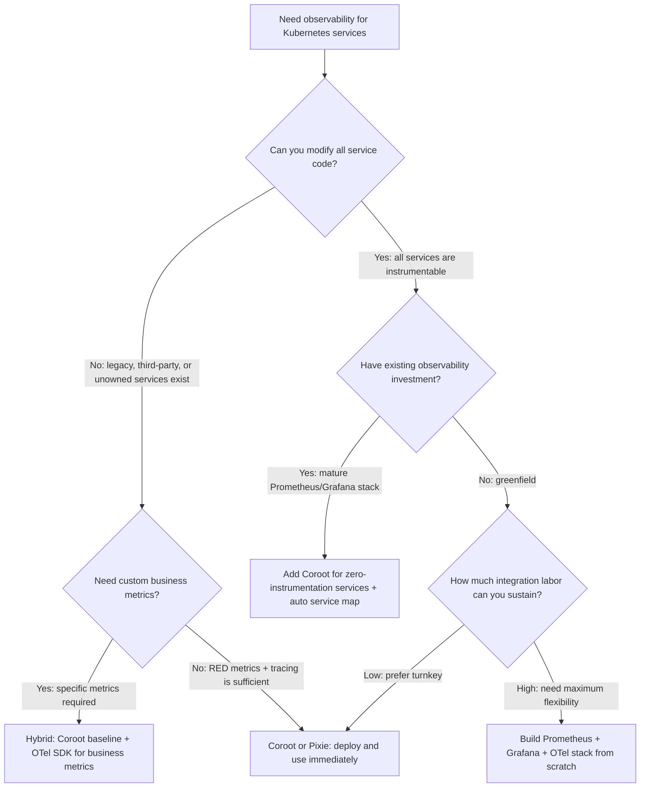

> **Complexity**: `[MEDIUM]` &nbsp; | &nbsp; **Time to Complete**: 90 minutes
>
> **Prerequisites**: Module 1.1 (Prometheus), Module 1.2 (OpenTelemetry), Basic Kubernetes concepts

---

## What You'll Be Able to Do

After completing this module, you will be able to:

- **Deploy Coroot for automated Kubernetes observability with eBPF-based service map discovery**
- **Configure Coroot's SLO monitoring with automatic latency, error rate, and availability tracking**
- **Implement Coroot's continuous profiling integration for performance bottleneck identification**
- **Compare Coroot's automated approach against manual Prometheus/Grafana setups for operational efficiency**

---

## Why This Module Matters

> **Hypothetical scenario:** A platform team inherits a production Kubernetes cluster running roughly fifty microservices across four languages and two runtime generations. Only a third of the services have OpenTelemetry instrumentation, and the tracing coverage stops dead at a legacy Java monolith the team cannot modify because the original development team has moved on. Every incident investigation requires correlating partial application metrics with raw infrastructure dashboards, and the mean time to diagnosis for cross-service failures runs to several hours.

This scenario is not unusual in organizations that adopted microservices before observability standards matured, or that maintain a mix of greenfield and legacy workloads. The promise of distributed tracing, RED metrics, and SLO-driven alerting breaks down when instrumentation coverage is inconsistent. Engineers spend hours chasing symptoms through services that are partially instrumented or not instrumented at all, and the gaps are often in the most critical legacy systems — the ones nobody wants to touch because they are fragile, undocumented, and essential to revenue.

The zero-instrumentation approach addresses this asymmetry directly. Instead of asking every service to emit telemetry through an SDK, zero-instrumentation observability observes the actual behavior of the system at the kernel boundary — the network packets, the system calls, the TCP connections, and the CPU and memory usage of every container. Since every application on Linux ultimately talks to the kernel to do its work, the kernel boundary is a universal observation point that works identically for Go microservices, Python monoliths, Java legacy systems, and third-party off-the-shelf containers alike. You do not need the application's cooperation to see what it is actually doing.

Coroot implements this approach using eBPF, a Linux kernel technology that allows safe, sandboxed programs to run inside the kernel and observe events without modifying kernel source code or loading kernel modules. A Coroot deployment consists of a node-level eBPF agent running as a DaemonSet on every Kubernetes node, a central server that aggregates the collected data and computes service maps, SLOs, and traces, and a ClickHouse database for time-series storage. Within minutes of deploying the Helm chart, the service map populates automatically from observed TCP traffic, latency percentiles appear for every service-to-service path, and distributed traces flow through every application — including the legacy monolith that has been a black box for years. There are no SDKs to install, no code changes to negotiate, and no per-service configuration to maintain.

The tradeoff is depth for breadth. eBPF observes the kernel boundary — it sees which service called which, how long the response took, whether the connection succeeded, and how much CPU and memory the process consumed. It does not see application-internal business logic such as which items were in a shopping cart or how many rows a query returned. When you need that level of detail, SDK-based instrumentation through OpenTelemetry remains the right tool. But for the universal baseline — service topology, RED metrics, SLO tracking, and distributed tracing across every service regardless of language or ownership — zero-instrumentation observability provides coverage that no amount of SDK rollout effort can match, because the rollout effort is precisely what creates the gap in the first place.

---

## Why Zero-Instrumentation Matters

The conventional path to observability in a microservice environment goes something like this: select an observability backend, instrument every service with the appropriate language SDK, configure context propagation headers for distributed tracing, set up metrics exporters, build dashboards, and maintain the instrumentation code through library upgrades and framework migrations. For a single service, this is an afternoon of work. For fifty services in five languages, it is a multi-quarter engineering initiative that competes with feature delivery for headcount. For an organization that runs third-party off-the-shelf containers or services maintained by teams that have moved on, it ranges from difficult to impossible.

Instrumentation debt accrues silently. A new service gets deployed without telemetry because the team is under launch pressure. A library upgrade breaks the tracing exporter and nobody notices until the next incident. A legacy service gets flagged for instrumentation during planning but never reaches the top of the backlog. Over time, the observability surface resembles Swiss cheese — some services have excellent coverage, others have none, and the gaps cluster around the oldest and most critical components because those are the hardest and riskiest to modify.

Zero-instrumentation observability short-circuits this dynamic by decoupling telemetry collection from application code entirely. The observation agent runs at the node level, independent of any particular pod or container, and it derives service identity, dependencies, latency, error rates, and traces by watching what the kernel sees. A service that has never been instrumented and whose developers have never heard of OpenTelemetry becomes visible the moment it sends its first TCP packet to another pod. This is not a replacement for deep application instrumentation — it is a universal baseline that establishes coverage everywhere first, so that you can then invest SDK effort where the additional depth justifies the cost.

The durable value proposition is not about a specific tool or vendor. It is about the architectural insight that the Linux kernel boundary is the one observation point every application must cross to do anything useful — send a network request, read a file, allocate memory, spawn a thread. Observing at that boundary captures the universal subset of telemetry that every application produces simply by running on Linux, regardless of whether it was written in Go, Python, Java, Rust, or C, and regardless of whether its authors ever thought about observability at all.

---

## What eBPF Captures at the Kernel Boundary

To understand what zero-instrumentation observability can and cannot deliver, it helps to work through the specific kernel events that an eBPF agent observes and what each event reveals about application behavior. The agent attaches eBPF programs to well-defined kernel hooks — tracepoints, kprobes, and socket filter points — and the programs execute each time the hook is reached, collecting structured data without affecting the application's execution path.

The richest source of observability data is the network stack. Every TCP connection establishment, every HTTP request and response, every DNS query, and every gRPC stream passes through the kernel's socket layer, and an eBPF program attached to the appropriate hook can extract the source and destination addresses, the protocol, the request and response sizes, the timing of each packet, and — critically — the HTTP headers that carry trace context. This is how zero-instrumentation tracing works: the eBPF agent reads the `traceparent` or `b3` header from incoming requests and the corresponding response header from outgoing requests, correlating spans across services without any application-side context propagation code. The result is a distributed trace that spans every service in the call chain, including services that have no tracing SDK installed.

At the transport layer, eBPF captures TCP-level metrics that application instrumentation cannot see because the application only knows about the socket abstraction, not the actual packet flow. TCP retransmission rates indicate network congestion or faulty NICs. Connection setup latency reveals DNS resolution delays or overloaded service endpoints. Round-trip time measurements at the TCP level are more precise than application-level latency because they exclude application processing time and isolate the network component. A spike in TCP retransmits between the API gateway and the database might be completely invisible to application metrics — the API reports normal latency because it is measuring end-to-end request time, which includes retries that mask the underlying network degradation — but the eBPF agent sees the retransmits directly and can flag the degradation before it manifests as user-facing errors.

Beyond networking, eBPF can sample CPU stack traces at a configurable frequency, producing continuous profiling data that shows which functions consume the most CPU time across all containers on a node. This is the same data a traditional profiler would produce, but without requiring a profiling agent inside each container or a debug symbol server. The eBPF program reads the instruction pointer from the kernel's process data structures and resolves symbols against the container's binary, producing flame graphs and function-level CPU attribution that works across languages and runtimes.

Memory observability through eBPF works differently from application-level heap metrics. The eBPF agent observes the container's actual memory footprint from the kernel's memory management data structures — the resident set size, the page cache usage, and the kernel slab allocations — rather than relying on the language runtime's self-reported heap statistics. This distinction matters when memory leaks occur outside the managed heap, as they often do: a C library linked through CGO in a Go service, a JNI call in a Java application, or a Python C extension can all allocate native memory that the language runtime's garbage collector does not track. The application reports stable heap usage while the container's RSS climbs toward the OOM-kill threshold, and only kernel-level observation reveals the discrepancy.

Finally, eBPF captures DNS resolution patterns — which services query which names, how long resolution takes, and whether queries return errors. DNS is a frequent silent contributor to tail latency, because a single slow or failing DNS query can delay every service that depends on the affected hostname, and application metrics rarely attribute latency to DNS specifically. The eBPF agent's DNS telemetry makes this dependency visible.

---

## The Coroot Model

Coroot packages these eBPF capabilities into a turnkey observability stack for Kubernetes. The architecture follows a standard agent-server-store pattern, but the agent's eBPF foundation is what distinguishes the data model from conventional monitoring tools.

### Architecture

```
┌─────────────────────────────────────────────────────────────────────────────┐
│                           Kubernetes Cluster                                 │
│                                                                             │
│  ┌─────────────────────────────────────────────────────────────────────┐   │
│  │                     Coroot Components                                │   │
│  │                                                                      │   │
│  │  ┌──────────────────┐     ┌──────────────────┐                      │   │
│  │  │   Coroot Server  │     │   ClickHouse     │                      │   │
│  │  │                  │────▶│   (Time-series)  │                      │   │
│  │  │  - API Server    │     │                  │                      │   │
│  │  │  - UI Dashboard  │     │  - Metrics       │                      │   │
│  │  │  - SLO Engine    │     │  - Traces        │                      │   │
│  │  │  - Alerting      │     │  - Logs          │                      │   │
│  │  └────────┬─────────┘     │  - Profiles      │                      │   │
│  │           │               └──────────────────┘                      │   │
│  │           │ Pull metrics                                             │   │
│  │           ▼                                                          │   │
│  │  ┌──────────────────┐                                               │   │
│  │  │    Prometheus    │◀─── Scrapes coroot-node-agent                 │   │
│  │  └──────────────────┘                                               │   │
│  └──────────────────────────────────────────────────────────────────────┘   │
│                                                                             │
│  ┌───────────────┐  ┌───────────────┐  ┌───────────────┐                  │
│  │    Node 1     │  │    Node 2     │  │    Node 3     │                  │
│  │  ┌─────────┐  │  │  ┌─────────┐  │  │  ┌─────────┐  │                  │
│  │  │ coroot  │  │  │  │ coroot  │  │  │  │ coroot  │  │                  │
│  │  │ node    │  │  │  │ node    │  │  │  │ node    │  │                  │
│  │  │ agent   │  │  │  │ agent   │  │  │  │ agent   │  │                  │
│  │  └────┬────┘  │  │  └────┬────┘  │  │  └────┬────┘  │                  │
│  │       │eBPF   │  │       │eBPF   │  │       │eBPF   │                  │
│  │  ┌────┴────┐  │  │  ┌────┴────┐  │  │  ┌────┴────┐  │                  │
│  │  │ Kernel  │  │  │  │ Kernel  │  │  │  │ Kernel  │  │                  │
│  │  │ Events  │  │  │  │ Events  │  │  │  │ Events  │  │                  │
│  │  └─────────┘  │  │  └─────────┘  │  │  └─────────┘  │                  │
│  └───────────────┘  └───────────────┘  └───────────────┘                  │
└─────────────────────────────────────────────────────────────────────────────┘
```

The `coroot-node-agent` DaemonSet runs one privileged pod on each node, attaching eBPF programs to the kernel and forwarding structured telemetry to the Coroot server. The server aggregates data across nodes, reconstructs the service map from observed TCP connections, computes SLO compliance from request success rates and latency percentiles, and serves a web dashboard for exploration and alerting. ClickHouse stores the time-series data — metrics, traces, logs, and profiles — in a columnar format optimized for the high-ingest, query-heavy workload of an observability backend.

### Components

| Component | Role | Description |
|-----------|------|-------------|
| **coroot-node-agent** | Data collection | DaemonSet running eBPF programs to capture kernel-level events |
| **Coroot Server** | Processing & UI | Aggregates data, calculates SLOs, serves dashboard |
| **ClickHouse** | Storage | Columnar database for metrics, traces, logs, profiles |
| **Prometheus** | Metrics pipeline | Optional—Coroot can scrape Prometheus or use its own |

### Automatic Service Map and SLO Tracking

The service map is not configured — it is derived. The node agent observes every TCP connection in the cluster: which source pod connected to which destination pod, on which port, with what protocol. The server aggregates these observations into a dependency graph that updates in near-real-time as pods scale up and down, deployments roll out, and traffic patterns shift. The service map answers the question every on-call engineer asks first during an incident: "What depends on what, and is the dependency healthy?"

```
┌─────────────────────────────────────────────────────────────────────────┐
│                         Coroot Service Map                               │
│                                                                         │
│    ┌──────────┐                                                         │
│    │ Internet │                                                         │
│    └────┬─────┘                                                         │
│         │                                                               │
│         ▼                                                               │
│    ┌──────────┐     ┌──────────┐     ┌──────────┐                      │
│    │ ingress  │────▶│ frontend │────▶│   api    │                      │
│    │  nginx   │     │  (React) │     │ (Node.js)│                      │
│    └──────────┘     └──────────┘     └────┬─────┘                      │
│                                           │                             │
│                     ┌─────────────────────┼─────────────────────┐      │
│                     │                     │                     │      │
│                     ▼                     ▼                     ▼      │
│               ┌──────────┐         ┌──────────┐         ┌──────────┐  │
│               │  users   │         │  orders  │         │ products │  │
│               │ (Python) │         │  (Go)    │         │ (Rust)   │  │
│               └────┬─────┘         └────┬─────┘         └────┬─────┘  │
│                    │                    │                    │        │
│                    ▼                    ▼                    ▼        │
│               ┌──────────┐         ┌──────────┐         ┌──────────┐  │
│               │ postgres │         │  redis   │         │ postgres │  │
│               └──────────┘         └──────────┘         └──────────┘  │
│                                                                         │
│  Legend: ──▶ HTTP  ─·─▶ TCP  Color: Green=Healthy  Red=Issues          │
└─────────────────────────────────────────────────────────────────────────┘
```

SLO tracking follows the same principle of derivation over configuration. For each discovered service, Coroot computes availability — the percentage of requests that succeeded, where success is defined by HTTP status codes in the 2xx–3xx range or the absence of TCP connection failures — and latency percentiles at P50, P95, and P99 from the observed request-response timing data. You can override the default SLO targets per service if your business requirements differ from the sensible defaults, but you do not have to configure anything to get a baseline SLO visibility. The SLO dashboard shows the current compliance window, the remaining error budget, and a burn-rate alert when the budget is depleting faster than the window allows.

```
┌─────────────────────────────────────────────────────────────────────────┐
│ Service: api-gateway                                                     │
├─────────────────────────────────────────────────────────────────────────┤
│                                                                         │
│  Availability SLO                    Latency SLO (P99)                  │
│  ┌───────────────────────────┐      ┌───────────────────────────┐      │
│  │ Target: 99.9%             │      │ Target: 100ms             │      │
│  │ Current: 99.95%    ✓     │      │ Current: 87ms      ✓     │      │
│  │ Budget remaining: 4h 32m  │      │ Budget remaining: 2h 15m  │      │
│  └───────────────────────────┘      └───────────────────────────┘      │
│                                                                         │
│  Error Rate (Last Hour)              Request Rate                       │
│  ┌───────────────────────────┐      ┌───────────────────────────┐      │
│  │    0.05%                  │      │    1,245 req/s            │      │
│  │ ▁▂▁▁▁▃▂▁▁▁▁▁▂▁▁▁▁▁▁     │      │ ▄▅▆▇▆▅▄▅▆▇▆▅▄▅▆▇▆▅▄     │      │
│  └───────────────────────────┘      └───────────────────────────┘      │
│                                                                         │
│  Latency Distribution                                                   │
│  ┌───────────────────────────────────────────────────────────────┐     │
│  │ P50: 12ms  P90: 45ms  P95: 67ms  P99: 87ms  Max: 234ms       │     │
│  └───────────────────────────────────────────────────────────────┘     │
│                                                                         │
└─────────────────────────────────────────────────────────────────────────┘
```

### eBPF-Based Distributed Tracing

The tracing implementation is the most technically sophisticated part of the Coroot data pipeline, and it is worth understanding how it works because the mechanism explains both the power and the limitations of zero-instrumentation tracing. The node agent attaches an eBPF program to the kernel's socket layer that intercepts every incoming and outgoing HTTP request. When an incoming request arrives, the agent reads the `traceparent` header from the HTTP frame, stores the trace ID and parent span ID in an in-kernel map keyed by the connection's socket identifier, and creates a new span record. When the application makes an outgoing request on the same or a related socket, the agent reads the map to find the trace context, emits a child span, and injects the updated `traceparent` header into the outbound request.

The effect is that the trace context propagates through every service in the call chain regardless of whether any of those services have tracing SDKs installed, because the propagation happens at the kernel boundary, not in application code. A Python service that has never heard of OpenTelemetry will have its incoming `traceparent` header read by the eBPF agent and its outgoing `traceparent` header injected by the eBPF agent, and the trace will continue seamlessly into the next service. The service itself is completely unaware that tracing is happening.

```
┌─────────────────────────────────────────────────────────────────────────┐
│ Trace: 7a8b9c0d-1234-5678-abcd-ef0123456789                             │
│ Duration: 234ms                                                          │
├─────────────────────────────────────────────────────────────────────────┤
│                                                                         │
│ frontend      │██████████████░░░░░░░░░░░░░░░░░░│ 45ms (GET /checkout)  │
│               └─────┬────────────────────────────                       │
│                     │                                                   │
│ api-gateway         │██████████████████████████│ 180ms                 │
│                     └──────┬─────────┬─────────                         │
│                            │         │                                  │
│ user-service               │█████░░░│ 23ms (validate token)            │
│                            │                                            │
│ order-service                       │████████████████│ 89ms            │
│                                     └──────┬─────────                   │
│                                            │                            │
│ postgres                                   │████████│ 34ms (SELECT)    │
│                                                                         │
│ Timeline: 0ms     50ms     100ms    150ms    200ms    234ms            │
└─────────────────────────────────────────────────────────────────────────┘
```

The limitation is scope: eBPF-based tracing works for protocols whose framing the agent understands — HTTP/1.1, HTTP/2, gRPC, and common database wire protocols. A custom binary protocol or an encrypted proprietary protocol will not yield trace context, because the agent cannot parse the headers. For those cases, SDK instrumentation remains necessary. But for the protocols that carry the vast majority of service-to-service traffic in a typical Kubernetes cluster, eBPF tracing provides universal coverage with zero application changes.

### Continuous Profiling

Coroot's continuous profiling capability samples CPU stack traces at a low, configurable frequency — typically 19 Hz or 49 Hz per core — and aggregates them into flame graphs and function-level attribution over configurable time windows. The sampling uses eBPF programs attached to the kernel's timer interrupt, which read the instruction pointer and stack pointer from the process running on each CPU core at each tick. Because the sampling happens in the kernel, not inside the container, it works identically for every language and runtime on the node.

```
┌─────────────────────────────────────────────────────────────────────────┐
│ CPU Profile: api-gateway (last 15 minutes)                               │
├─────────────────────────────────────────────────────────────────────────┤
│                                                                         │
│  Function                                        CPU %    Self %        │
│  ├── main.handleRequest                          45.2%    2.1%         │
│  │   ├── json.Unmarshal                          18.7%   18.7%         │
│  │   ├── db.Query                                15.3%    1.2%         │
│  │   │   └── net.(*conn).Read                    14.1%   14.1%         │
│  │   └── http.ResponseWriter.Write                8.9%    8.9%         │
│  └── runtime.gcBgMarkWorker                       5.4%    5.4%         │
│                                                                         │
│  Top CPU consumers: json.Unmarshal (18.7%), net.Read (14.1%)           │
│  Recommendation: Consider using faster JSON library (jsoniter, sonic)   │
│                                                                         │
└─────────────────────────────────────────────────────────────────────────┘
```

The value of continuous profiling in a production environment is that it captures behavior that never surfaces in development. A JSON deserialization function that is fast enough in testing becomes the bottleneck under production traffic volume. A garbage collection pause that is invisible on a development laptop causes tail latency spikes at scale. A C library called through FFI leaks memory slowly enough that unit tests never catch it. Continuous profiling catches these issues because it runs all the time, on the actual production workload, at the actual production scale, and the eBPF implementation means you do not have to install a profiler in every container or negotiate profiling overhead with every service team.

### Network-Level Insights

The TCP-level telemetry that eBPF captures — retransmission rates, round-trip times, connection setup latency, DNS resolution time, zero-window events — provides a view of network health that application metrics cannot replicate. Application code sees a socket abstraction: the connection succeeded or failed, the request returned or timed out. It does not see the packet-level story behind that outcome.

```
┌─────────────────────────────────────────────────────────────────────────┐
│ Network Health: api-gateway → postgres                                   │
├─────────────────────────────────────────────────────────────────────────┤
│                                                                         │
│  Connection Stats (Last Hour)                                           │
│  ├── Active connections: 25                                             │
│  ├── New connections/s: 12.4                                            │
│  ├── Failed connections: 3                                              │
│  └── Connection pool efficiency: 98.2%                                  │
│                                                                         │
│  TCP Quality Metrics                                                    │
│  ├── Round-trip time (P99): 1.2ms                                      │
│  ├── Retransmission rate: 0.02%                                        │
│  ├── Zero-window events: 0                                              │
│  └── Connection resets: 2                                               │
│                                                                         │
│  ⚠ Alert: 3 failed connections detected                                │
│    Cause: Connection timeout to postgres:5432                           │
│    Likely reason: Connection pool exhausted                             │
│                                                                         │
└─────────────────────────────────────────────────────────────────────────┘
```

This data is particularly valuable for diagnosing intermittent failures — the "it works most of the time" problems that are the hardest to reproduce and the most expensive in production. A TCP retransmission spike that lasts 30 seconds and then clears will never appear in application metrics aggregated over minutes, but the eBPF agent records it and the Coroot dashboard surfaces it as an anomaly on the network health timeline.

### Log Correlation

Coroot correlates logs with traces and metrics by observing log output from container stdout/stderr and associating log lines with the trace context that was active on the same connection at the time the log was emitted. This means that when you click on a slow span in the trace view, Coroot shows you the log lines that the service emitted during that span's execution, even though the service never explicitly correlated its logs with a trace ID in application code.

```bash
# Logs are automatically associated with traces
# Example log correlation in Coroot:

Trace: 7a8b9c0d... → Related Logs:
├── 14:23:01.123 [INFO]  api-gateway: Processing checkout request
├── 14:23:01.145 [INFO]  user-service: Token validated for user_id=12345
├── 14:23:01.189 [INFO]  order-service: Creating order
├── 14:23:01.223 [ERROR] order-service: Payment failed: insufficient funds
└── 14:23:01.234 [INFO]  api-gateway: Returning 402 Payment Required
```

---

## Coroot vs. the Manual Stack

Zero-instrumentation observability with Coroot represents a different design point from the conventional approach of assembling Prometheus, Grafana, Loki, Tempo, and a fleet of exporters and dashboards into a bespoke observability stack. Neither approach is universally superior — they optimize for different constraints and different organizational contexts. The decision should be driven by a clear-eyed assessment of which tradeoffs matter most for your specific environment.

The manual stack gives you maximum flexibility. You choose which metrics to collect, how to aggregate them, which dashboards to build, and how to correlate signals across tools. If you need a custom business metric — orders per minute by region, or login success rate by authentication provider — you instrument it in application code, expose it through a Prometheus endpoint, and build a Grafana panel. The manual stack is composable: you can swap Loki for Elasticsearch, Tempo for Jaeger, and Prometheus for VictoriaMetrics independently, because each component speaks standard protocols and the integration boundary is well-defined.

The cost of this flexibility is integration labor. Every new service requires instrumentation code, a Prometheus ServiceMonitor, a Grafana dashboard, and a documented alert runbook. Maintaining consistency across dozens or hundreds of services requires platform engineering discipline — shared instrumentation libraries, dashboard templates, and alert rule generators — and that discipline itself requires ongoing investment. When services are owned by different teams with different levels of observability maturity, the stack delivers uneven coverage: the teams that invest in instrumentation get great visibility, and the teams that do not become blind spots during incidents.

Coroot collapses this integration surface into a single deployment. The Helm chart installs the agent, server, and storage in one operation, and the service map, SLOs, traces, and profiles appear automatically from observed traffic. The operational burden shifts from per-service instrumentation to cluster-level deployment and resource planning. The tradeoff is that you accept the opinionated data model — Coroot decides what constitutes a service, how to compute RED metrics, and which percentiles to track — rather than defining those yourself. For organizations that need deep, customized observability for specific business-critical services, this opinionation can feel constraining. For organizations that need universal coverage across a diverse service portfolio with minimal per-service effort, it is precisely the right level of abstraction.

A pragmatic approach that many teams adopt is to run Coroot as the universal baseline — the layer that ensures every service, including legacy and third-party components, has basic observability — and to invest SDK-based instrumentation through OpenTelemetry for the subset of services where custom business metrics, detailed span attributes, or proprietary protocol tracing justify the additional effort. Coroot can ingest Prometheus metrics and OpenTelemetry data alongside its own eBPF-derived telemetry, so the two approaches compose rather than compete.

---

## The eBPF Observability Landscape

Coroot is one of several projects that apply eBPF to observability, and understanding where it fits in the broader landscape helps clarify when to reach for it versus when a different eBPF-based tool — or a non-eBPF approach — is the better fit.

**Pixie** (CNCF Sandbox) is another eBPF-based Kubernetes observability tool that automatically captures metrics, traces, and events without instrumentation. Pixie's architecture uses eBPF similarly — a DaemonSet on every node observes kernel events — but Pixie emphasizes an on-cluster edge compute model where data stays on the cluster and queries run through a scripting interface called Pxl. Pixie integrates natively with New Relic for long-term storage and alerting. Compared to Coroot, Pixie offers deeper protocol parsing — it can decode SQL queries, Redis commands, and Kafka messages from eBPF-captured network data — but its upstream development momentum has been closely tied to New Relic's roadmap since the acquisition. See Module 1.6 for Pixie's full treatment.

**Cilium Hubble** (CNCF Graduated as part of Cilium) provides eBPF-based network flow observability with a focus on network security and policy. Hubble captures every flow in the cluster — source, destination, protocol, port, bytes transferred, and verdict (allowed or dropped by network policy) — and provides a real-time flow log and a service dependency map. Hubble's strength is network-level visibility at enormous scale, because it builds on Cilium's eBPF data path, which processes every packet on every node. Its scope is narrower than Coroot's: Hubble focuses on network flows and does not provide application-level metrics, distributed tracing, or continuous profiling. For teams that already run Cilium as their CNI, Hubble is effectively free observability on top of the existing data path. See Module 1.7 for Hubble's full treatment.

**Grafana Beyla** is an eBPF-based auto-instrumentation tool that sits at a different point in the observability pipeline. Rather than providing its own backend for metrics, traces, and profiles, Beyla exports OpenTelemetry data — metrics and traces — to any OTel-compatible backend (Grafana Cloud, Tempo, Prometheus, or any other OTel consumer). Beyla runs as a sidecar or DaemonSet and uses eBPF to capture HTTP and gRPC requests, producing RED metrics and distributed traces that look exactly like what an OTel SDK would produce, but without the SDK. Beyla's approach is complementary to Coroot: Coroot provides an integrated turnkey experience (agent + server + storage + dashboard), while Beyla provides an eBPF-to-OTel bridge that slots into an existing OpenTelemetry pipeline.

**Parca** (Polar Signals; Apache-2.0, not a CNCF project) is a continuous profiling project that uses eBPF for CPU profiling, similar to Coroot's profiling capability, but as a standalone profiler rather than as part of an integrated observability stack. Parca stores profiles in an object store and provides a query interface for analyzing profiling data over time, and it integrates with Grafana for visualization. If the primary use case is continuous profiling and the rest of the observability stack is already in place, Parca may be a more focused choice than deploying Coroot's full stack.

The eBPF observability landscape rewards understanding the specific capability each tool provides and the integration model it assumes. A few durable patterns are emerging: tools that provide an integrated turnkey experience (Coroot, Pixie) trade flexibility for operational simplicity; tools that provide eBPF data as standards-compatible telemetry streams (Beyla) trade integration surface for composability; and tools that focus on a specific signal — network flows (Hubble) or profiling (Parca) — optimize depth over breadth. The right choice depends on which signals you are missing today, what your existing observability investments look like, and how much integration labor your organization can sustain.

---

### Landscape Snapshot — as of 2026-06

> **This changes fast; verify against vendor docs before relying on specifics.** Tool maturity claims, version numbers, and feature sets reflect what is publicly documented as of mid-2026.

| Tool | License | CNCF Status | Primary Signals | Deployment Model |
|------|---------|-------------|-----------------|------------------|
| **Coroot** | Apache-2.0 | Not a CNCF project | Metrics, traces, logs, profiles (integrated) | DaemonSet + server + ClickHouse |
| **Pixie** | Apache-2.0 | CNCF Sandbox | Metrics, traces, events (on-cluster) | DaemonSet + cloud or self-hosted control plane |
| **Cilium Hubble** | Apache-2.0 | CNCF Graduated (as part of Cilium) | Network flows, service map | Integrated into Cilium CNI data path |
| **Grafana Beyla** | Apache-2.0 | Not a CNCF project | RED metrics, traces (OTel export) | Sidecar or DaemonSet → OTel backend |
| **Parca** | Apache-2.0 | Not a CNCF project (Polar Signals) | Continuous profiling (CPU, memory) | DaemonSet + object store + query frontend |

---

### Rosetta: Capability Comparison

Each row represents a durable observability capability; each column shows how a specific tool delivers it. The capability is the durable concept — the tool is the current worked example.

| Capability | Coroot | Pixie | Hubble | Beyla + OTel | Manual Prometheus Stack |
|---|---|---|---|---|---|
| **Zero-instrumentation metrics** | eBPF TCP/HTTP → RED | eBPF + protocol parsing → RED | eBPF flow logs → throughput, latency | eBPF HTTP/gRPC → OTel metrics | Requires per-service instrumentation and exporters |
| **Automatic service map** | Derived from observed TCP connections | Derived from eBPF traffic | Derived from Cilium flow data | Not provided — relies on backend correlation | Manual (Grafana node graphs, ServiceMonitors) |
| **Zero-instrumentation tracing** | eBPF header injection/extraction | eBPF header injection/extraction | Not provided (flows only) | eBPF header injection → OTel traces | Manual SDK instrumentation required |
| **Continuous profiling** | Built-in eBPF CPU/memory sampling | Built-in eBPF CPU sampling | Not provided | Not provided | Separate tool required (Parca, Pyroscope) |
| **Automatic SLO tracking** | Built-in: availability + latency per service | Requires Pxl script or external tool | Not provided | Requires external SLO tool consuming OTel metrics | Manual (Prometheus rules + Grafana SLO dashboards) |
| **Network-level (TCP) visibility** | Retransmits, RTT, connection failures | Retransmits, connection tracking | Full flow visibility (every packet) | Limited (HTTP/gRPC only) | Application-level only unless node_exporter added |
| **Custom business metrics** | Not provided (eBPF-only baseline) | Pxl scripts can derive custom metrics | Not provided | Not provided — use OTel SDKs alongside | Full flexibility via Prometheus client libraries |

---

## Operational Considerations

Deploying eBPF-based observability in production requires attention to several operational dimensions that differ from conventional monitoring agents, because eBPF programs run inside the kernel and have different failure modes, resource profiles, and security implications than userspace agents.

### Kernel and eBPF Prerequisites

The coroot-node-agent requires a Linux kernel that supports eBPF and includes BTF (BPF Type Format) data — a description of the kernel's data structures that allows eBPF programs to be compiled once and run on different kernel versions without recompilation for each version's struct layout. This capability is called CO-RE (Compile Once, Run Everywhere), and it is the reason a single coroot-node-agent image works across different Linux distributions and kernel versions. BTF support was introduced in kernel 4.16 and became reliable for production eBPF workloads around kernel 5.4. Most modern cloud Kubernetes distributions — EKS optimized AMIs, GKE Container-Optimized OS, AKS Ubuntu nodes — ship kernels with BTF enabled by default.

You can verify BTF support on a node with a simple check: if the file `/sys/kernel/btf/vmlinux` exists and is readable, the kernel supports the CO-RE eBPF programs the agent uses. If this file is missing, the agent will fail to start, and the fix is to upgrade to a kernel that includes BTF or to install the BTF data package for your distribution.

```bash
# Check BTF support
cat /sys/kernel/btf/vmlinux >/dev/null 2>&1 && echo "BTF supported" || echo "BTF not supported"

# Most modern distributions (Ubuntu 20.04+, RHEL 8+, Debian 11+) support BTF
```

### Privileged DaemonSet and Security Surface

The coroot-node-agent runs as a privileged container because eBPF program loading requires elevated Linux capabilities — specifically `CAP_SYS_ADMIN`, `CAP_BPF`, and `CAP_NET_ADMIN` — that allow the agent to attach eBPF programs to kernel hooks and read kernel data structures. This privilege level expands the security surface relative to a non-privileged observability agent: a vulnerability in the eBPF program or the agent's Go runtime could, in principle, allow an attacker who compromises the agent pod to access data from all containers on the node or to interfere with kernel data structures.

In practice, the eBPF verifier — a component of the Linux kernel that analyzes every eBPF program before loading it — provides a strong safety guarantee: it rejects any program that could crash the kernel, access arbitrary memory, or loop indefinitely. The verifier statically analyzes the program's control flow, checks that every memory access is bounds-checked, and confirms that the program terminates within a bounded number of instructions. This makes eBPF programs substantially safer than kernel modules, which have unrestricted kernel access and are the traditional mechanism for kernel-level observability.

For production deployments, the standard hardening measures apply: run the Coroot components in a dedicated namespace with restrictive RBAC, use a network policy to limit the agent's egress to only the Coroot server, keep the agent image updated to the latest patch release, and if your organization's security policy prohibits privileged containers outright, evaluate whether the subset of eBPF features accessible with a less-privileged capabilities set — `CAP_BPF` alone, without `CAP_SYS_ADMIN` — is sufficient for your observability requirements on newer kernels (5.8+).

### Per-Node Resource Overhead

The coroot-node-agent's resource consumption scales primarily with the number of pods and the volume of network traffic on the node, not with the size of the cluster. Each eBPF program adds a small, fixed overhead to the kernel path it hooks — typically microseconds per event — and the user-space agent process consumes CPU to read and process the data the eBPF programs produce. The agent's resource footprint is small enough that it is rarely the bottleneck on a node, but on very dense nodes running hundreds of pods with high traffic volumes, monitoring the agent's resource usage is prudent.

```yaml
# Recommended resources for node agent
resources:
  coroot-node-agent:
    requests:
      cpu: 100m
      memory: 256Mi
    limits:
      cpu: 500m
      memory: 512Mi

  # For Coroot server (scales with cluster size)
  coroot:
    requests:
      cpu: 500m
      memory: 1Gi
    limits:
      cpu: 2000m
      memory: 4Gi

  # ClickHouse (scales with retention)
  clickhouse:
    requests:
      cpu: 1000m
      memory: 4Gi
    limits:
      cpu: 4000m
      memory: 16Gi
```

### Data Retention and Storage Planning

ClickHouse storage is the dominant cost in a Coroot deployment, and retention planning should account for the cardinality of your cluster's telemetry rather than applying a one-size-fits-all retention policy. Metrics generally consume the most storage because they are the highest-cardinality signal — every service, every endpoint, every pod generates its own time series — while traces and profiles are more bursty and event-driven. A typical retention configuration balances visibility against storage cost by retaining high-resolution metrics for a rolling window of roughly 30 days, traces for 7 days (enough to cover a typical incident review cycle), and profiles for 3 days (since profiling data is most useful for near-term performance investigations).

```yaml
# Configure retention in ClickHouse
clickhouse:
  retention:
    metrics: 30d
    traces: 7d
    logs: 14d
    profiles: 3d
```

### High Availability

The Coroot server and ClickHouse are stateful components, so high availability requires replicating both. Coroot server can be scaled horizontally by increasing the replica count, and ClickHouse supports a clustered deployment with ZooKeeper or ClickHouse Keeper for coordination. The node agent is stateless and runs as a DaemonSet, so it is inherently highly available — if a node agent pod restarts, it reattaches its eBPF programs and resumes data collection without data loss, because the data stream is continuous and the server is designed to handle gaps from transient agent unavailability.

```yaml
# HA setup
helm install coroot coroot/coroot \
  --namespace coroot \
  --set replicas=3 \
  --set clickhouse.replicas=3 \
  --set clickhouse.zookeeper.enabled=true
```

### Node Placement

The coroot-node-agent DaemonSet runs on every node by default, including control plane nodes and nodes running system workloads. On managed Kubernetes services where the control plane nodes are not accessible, the agent runs only on worker nodes, which is the correct behavior. If you run self-managed clusters and do not want the agent on control plane nodes, use a nodeSelector or taint/toleration to restrict the DaemonSet to worker nodes.

---

## Installing Coroot

### Prerequisites

```bash
# Coroot requires:
# - Kubernetes 1.21+
# - Linux kernel 4.16+ (for eBPF)
# - BTF (BPF Type Format) support in kernel

# Check BTF support
cat /sys/kernel/btf/vmlinux >/dev/null 2>&1 && echo "BTF supported" || echo "BTF not supported"

# Most modern distributions (Ubuntu 20.04+, RHEL 8+, Debian 11+) support BTF
```

### Installation with Helm

```bash
# Add Coroot Helm repository
helm repo add coroot https://coroot.github.io/helm-charts
helm repo update

# Create namespace
kubectl create namespace coroot

# Install Coroot with ClickHouse
helm install coroot coroot/coroot \
  --namespace coroot \
  --set clickhouse.enabled=true \
  --set clickhouse.persistence.size=50Gi

# Install node agent (DaemonSet)
helm install coroot-node-agent coroot/coroot-node-agent \
  --namespace coroot \
  --set coroot.url=http://coroot.coroot:8080
```

### Verify Installation

```bash
# Check all pods are running
kubectl get pods -n coroot

# Expected output:
# NAME                              READY   STATUS    RESTARTS   AGE
# coroot-0                          1/1     Running   0          2m
# coroot-clickhouse-0               1/1     Running   0          2m
# coroot-node-agent-xxxxx           1/1     Running   0          2m
# coroot-node-agent-yyyyy           1/1     Running   0          2m

# Check node agent is collecting data
kubectl logs -n coroot -l app.kubernetes.io/name=coroot-node-agent --tail=20

# Access the UI
kubectl port-forward -n coroot svc/coroot 8080:8080

# Open http://localhost:8080
```

---

## Advanced Configuration

### Custom SLO Definitions

```yaml
# coroot-config.yaml
apiVersion: v1
kind: ConfigMap
metadata:
  name: coroot-config
  namespace: coroot
data:
  config.yaml: |
    slo:
      # Custom availability targets
      availability:
        default: 99.9
        overrides:
          - service: "payment-*"
            target: 99.99
          - service: "internal-*"
            target: 99.0

      # Custom latency targets
      latency:
        default:
          p99: 100ms
        overrides:
          - service: "api-gateway"
            p99: 50ms
          - service: "batch-processor"
            p99: 5s
```

### Alerting Configuration

```yaml
# Alert rules
apiVersion: v1
kind: ConfigMap
metadata:
  name: coroot-alerts
  namespace: coroot
data:
  alerts.yaml: |
    alerts:
      - name: SLO Breach
        condition: slo.availability < target
        for: 5m
        severity: critical

      - name: High Error Rate
        condition: error_rate > 1%
        for: 5m
        severity: warning

      - name: Latency Degradation
        condition: latency.p99 > baseline * 2
        for: 10m
        severity: warning

      - name: Memory Pressure
        condition: container.memory.usage > 90%
        for: 5m
        severity: warning
```

### Integration with Prometheus

```yaml
# Use existing Prometheus as data source
helm upgrade coroot coroot/coroot \
  --namespace coroot \
  --set prometheus.enabled=false \
  --set prometheus.external.url=http://prometheus.monitoring:9090
```

### Integration with OpenTelemetry

```yaml
# Export Coroot data to OTel Collector
helm upgrade coroot coroot/coroot \
  --namespace coroot \
  --set opentelemetry.enabled=true \
  --set opentelemetry.endpoint=http://otel-collector:4317
```

---

## Patterns and Anti-Patterns

### Patterns

1. **Universal baseline first, deep instrumentation where it pays.** Deploy Coroot to establish observability coverage for every service in the cluster — including legacy, third-party, and unowned services. Then invest OpenTelemetry SDK instrumentation only for the subset of services where custom business metrics, detailed span attributes, or proprietary protocol tracing deliver enough additional value to justify the effort. The eBPF baseline ensures you are never completely blind during an incident, even for services where SDK work has not yet been prioritized.

2. **Co-deploy with an existing Prometheus stack rather than replacing it.** Coroot can scrape existing Prometheus endpoints and ingest OpenTelemetry data, so it functions as an additional lens rather than a replacement. Teams that already have well-instrumented services and mature Grafana dashboards can add Coroot for the zero-instrumentation coverage on un-instrumented services and for the automatic service map and SLO tracking, while keeping their existing dashboards and alerts intact.

3. **Size ClickHouse storage for the metrics cardinality, not the cluster size.** A cluster with ten services that each expose hundreds of high-cardinality labels can generate more storage pressure than a cluster with a hundred services that use low-cardinality labeling. Monitor ClickHouse storage growth during the first week of deployment and adjust retention and resource allocations before the storage fills, rather than reacting to a disk-full incident.

4. **Use the service map as the starting point for every incident investigation.** The automatic service map answers the first diagnostic question — "what talks to what?" — faster than any manually maintained dependency diagram, precisely because it is derived from actual traffic rather than from documentation that may have drifted. Train on-call engineers to open the Coroot service map first, identify the affected service and its dependencies, and then drill into the specific signal (metrics, traces, profiles, logs) that the incident symptoms suggest.

### Anti-Patterns

| Anti-Pattern | Why It Is a Problem | Better Approach |
|---|---|---|
| Deploying Coroot and immediately removing existing instrumentation | Loses custom business metrics and deep span attributes that eBPF cannot capture | Run both in parallel; sunset SDK instrumentation only for services where eBPF coverage is sufficient |
| Treating the default SLO targets as final without review | Default targets may not match your actual availability and latency requirements | Review and customize SLO targets per service based on business criticality and actual performance baselines |
| Ignoring the network health dashboard | Network-level issues (TCP retransmits, DNS failures) are invisible to application metrics but are frequent root causes of latency incidents | Include the network health view in your standard incident diagnostic workflow |
| Running the node agent on every node without resource limits | Under high traffic, the agent's resource consumption can grow and compete with application workloads | Apply resource requests and limits to the DaemonSet; monitor agent resource usage alongside application metrics |
| Expecting eBPF tracing to work for proprietary or encrypted protocols | eBPF header parsing requires readable HTTP/gRPC framing — custom binary protocols will not produce traces | Use OpenTelemetry SDK instrumentation for services using custom protocols; use eBPF tracing for standard protocol traffic |
| Skipping kernel/CO-RE prerequisite validation | Deploying on nodes without BTF support causes the agent to crash-loop with opaque errors | Validate BTF support on every node type before deploying; maintain a node image baseline that includes BTF-enabled kernels |
| Not configuring data retention | ClickHouse storage fills up, causing data loss and potentially crashing the Coroot deployment | Size storage for your retention window; monitor disk usage and configure alerts for storage above 80% utilization |

---

### Decision Framework

The following decision tree guides the choice between zero-instrumentation eBPF observability (Coroot, Pixie), manual SDK-based observability (Prometheus + Grafana + OpenTelemetry), and a hybrid approach.



---

## Hypothetical Scenario: The Invisible Memory Leak

> **Hypothetical scenario:** A platform team operates a payment-processing service written in Go that experiences periodic OOM-kills in production. The service runs without issue for several hours and then is suddenly terminated by the kubelet when its container memory exceeds the configured limit.

The team's initial investigation focuses on the Go heap, because the application exposes Prometheus metrics showing heap usage, and those metrics are stable — the heap hovers around roughly 500 MB, well within the container's 2 GB limit. Code review of the Go source finds no obvious memory leaks. Restarting the service resolves the issue temporarily, but the OOM-kills return within 6 to 8 hours. The team installs a traditional APM agent, which confirms the application heap is stable and reports no memory anomalies. The investigation stalls.

Coroot's continuous profiling, deployed as an additional diagnostic layer without modifying the application, reveals the discrepancy immediately. The CPU profile shows that the Go service calls a C encryption library through CGO — a common pattern for performance-sensitive cryptographic operations. The flame graph shows the C library's `malloc()` calls increasing over time, but the corresponding `free()` calls are absent. The Go garbage collector has no visibility into the C heap, so the application's self-reported heap metrics are accurate as far as they go — they just do not cover the native memory the C library is allocating and never releasing.

The container's RSS (resident set size) tells the full story: it starts at roughly 500 MB and climbs steadily to 2.1 GB over the 6–8 hour window before the OOM-kill fires. The Go heap stays at roughly 500 MB the entire time. The difference — about 1.6 GB of native memory — is entirely invisible to the application's own metrics and to the APM agent that relies on them. Coroot's kernel-level profiling sees the complete container memory footprint and surfaces the growing off-heap allocation as the outlier.

The remediation is straightforward: update the C encryption library to a version that fixes the leak. The preventive lesson is more durable. Memory leaks in native code called through FFI — CGO in Go, JNI in Java, C extensions in Python, NIFs in Elixir — are invisible to language-runtime memory metrics because the runtime's garbage collector does not manage native memory. Only kernel-level observation, which sees the container's actual RSS regardless of which allocator consumed the memory, can detect this class of leak reliably. Traditional application-level monitoring is architecturally blind to it.

The broader takeaway is not about any specific incident but about the category of failure that zero-instrumentation observability is uniquely positioned to detect: problems that manifest at the boundary between the application and the infrastructure, where application-level metrics report normal operation but kernel-level telemetry shows degradation. TCP retransmission storms, DNS resolution failures, off-heap memory leaks, and disk I/O saturation all fall into this category, and all are common enough in production to justify the modest operational cost of running an eBPF agent.

---

## Did You Know?

- **eBPF programs are verified before they run.** The Linux kernel's eBPF verifier performs a static analysis of every eBPF program before loading it, checking that the program terminates within a bounded number of instructions, never accesses memory outside its allowed region, and contains no unreachable or looping code paths. This makes eBPF substantially safer than kernel modules, which have unrestricted kernel access.

- **Zero-instrumentation tracing works by intercepting HTTP headers at the socket layer.** The eBPF agent reads the `traceparent` header (W3C Trace Context standard) from incoming requests and injects it into outgoing requests at the kernel boundary, propagating trace context across services that have no tracing code installed. This works for HTTP/1.1, HTTP/2, and gRPC traffic automatically.

- **Coroot automatically discovers services by watching TCP connections.** There is no configuration file or annotation that declares which pods form a service — the agent observes which pods connect to which other pods over TCP, and the server clusters them into services based on the Kubernetes labels and the traffic patterns. A new deployment appears on the service map the moment it sends its first request.

- **Continuous profiling captures production behavior that never surfaces in development.** A function that is fast under test traffic can become the bottleneck under production load; a garbage collection pause that is invisible on a laptop causes tail latency at scale. eBPF-based profiling runs continuously on the actual production workload with minimal overhead, catching these issues where they actually occur.

---

## Common Mistakes

| Mistake | Problem | Solution |
|---------|---------|----------|
| Kernel without BTF | Node agent fails to start with "failed to load BTF" error | Use kernel 5.4+ or install BTF data package for your distribution |
| Insufficient ClickHouse storage | Data loss after a few days when storage fills up | Size ClickHouse persistent volumes for your retention window; monitor disk usage and alert at 80% |
| Not customizing SLO targets | Default targets may not match your actual service requirements | Review default SLOs after deployment; adjust per service based on business criticality and measured baselines |
| Ignoring network health metrics | TCP-level issues like retransmits and DNS failures are invisible to application dashboards but are common root causes of latency | Include the network health tab in your standard incident diagnostic workflow |
| Running node agent on control plane nodes on self-managed clusters | Unnecessary eBPF overhead on nodes that do not run application workloads | Use nodeSelector or taints to restrict the DaemonSet to worker nodes |
| Not applying resource limits to the node agent | Under high traffic, agent resource consumption can grow and compete with application pods | Configure CPU and memory requests and limits for the DaemonSet pods |
| Expecting eBPF to capture in-process business logic | eBPF sees the kernel boundary, not application-internal state such as shopping cart contents or query result row counts | Use OpenTelemetry SDK instrumentation alongside Coroot for custom business metrics and deep span attributes |
| Deploying and immediately removing existing instrumentation | Loses custom metrics and dashboards that teams rely on for day-to-day operations | Run Coroot in parallel with existing tools; transition incrementally as teams validate that eBPF coverage meets their needs |

---

## Troubleshooting

### Node Agent Not Starting

```bash
# Check logs
kubectl logs -n coroot -l app.kubernetes.io/name=coroot-node-agent

# Common issues:
# 1. BTF not available
# Error: "failed to load BTF from /sys/kernel/btf/vmlinux"
# Fix: Upgrade kernel or install BTF

# 2. Insufficient permissions
# Error: "operation not permitted"
# Fix: Ensure privileged: true in securityContext
```

### No Data in Dashboard

```bash
# Verify node agent is collecting
kubectl exec -n coroot -it $(kubectl get pod -n coroot -l app.kubernetes.io/name=coroot-node-agent -o jsonpath='{.items[0].metadata.name}') -- /coroot-node-agent --test

# Check Prometheus scraping
kubectl port-forward -n coroot svc/coroot-prometheus 9090:9090
# Visit http://localhost:9090/targets
```

### High Memory Usage

```bash
# Check ClickHouse storage
kubectl exec -n coroot clickhouse-0 -- clickhouse-client -q "SELECT table, formatReadableSize(sum(bytes)) FROM system.parts GROUP BY table"

# Reduce retention if needed
# Or increase ClickHouse resources
```

---

## Quiz

### Question 1

What technology does Coroot use to capture observability data without modifying application code, and what makes this approach safe for production use?

<details>
<summary>Answer</summary>

Coroot uses **eBPF (Extended Berkeley Packet Filter)** to attach safe, sandboxed programs to kernel hooks that observe system calls, network traffic, and resource usage. These programs execute inside the kernel and collect structured telemetry — metrics, traces, and profiles — without any code running inside the application container. The kernel boundary is the universal observation point because every application must cross it to send network requests, allocate memory, or perform I/O, which means eBPF-based observability works identically for any language, runtime, or framework. The eBPF verifier statically analyzes every program before loading it, ensuring it terminates, stays within memory bounds, and cannot crash the kernel.
</details>

### Question 2

What are the main components of a standard Coroot deployment, and what specific role does each component play in the observability pipeline?

<details>
<summary>Answer</summary>

A Coroot deployment consists of three primary components. The **coroot-node-agent** runs as a DaemonSet on every Kubernetes node and attaches eBPF programs to the kernel to capture telemetry — network traffic, CPU profiles, memory footprints, and DNS queries — from all containers on the node. The **Coroot server** aggregates data from all node agents, reconstructs the service map from observed TCP connections, computes SLO compliance from request success rates and latency percentiles, correlates logs with traces, and serves the web dashboard for exploration and alerting. **ClickHouse** provides columnar time-series storage for metrics, traces, logs, and profiles, optimized for the high-ingest, query-heavy workload of an observability backend. An optional Prometheus component can scrape and store metrics if the team prefers a Prometheus-compatible query interface.
</details>

### Question 3

How does Coroot provide distributed tracing across services that have no tracing SDK installed, and where does the trace context propagation actually occur?

<details>
<summary>Answer</summary>

Coroot provides zero-instrumentation distributed tracing by intercepting HTTP headers at the kernel socket layer using eBPF. When an incoming request arrives at a pod, the node agent's eBPF program reads the `traceparent` header (from the W3C Trace Context standard) from the HTTP frame, stores the trace ID and parent span ID in an in-kernel map keyed by the socket identifier, and creates a span record. When the application makes an outgoing request, the agent reads the map to find the trace context, emits a child span, and injects the updated `traceparent` header into the outbound request at the kernel boundary. This means trace context propagates through every service in the call chain regardless of whether the services have any tracing code, because the propagation happens below the application layer, in the kernel's network stack. This works for HTTP/1.1, HTTP/2, and gRPC traffic and a growing set of common database wire protocols.
</details>

### Question 4

What specific kernel requirement must the coroot-node-agent satisfy to function, and why is this requirement architecturally necessary?

<details>
<summary>Answer</summary>

The node agent requires **BTF (BPF Type Format) support** in the Linux kernel, which was introduced in kernel 4.16 and became production-reliable around kernel 5.4. BTF is a description of the kernel's data structure layouts that allows eBPF programs to be compiled once and run on different kernel versions without recompilation for each version's specific struct offsets — a capability called CO-RE (Compile Once, Run Everywhere). Without BTF, the eBPF programs would need to be compiled for each specific kernel version, which is operationally impractical in a heterogeneous cluster. You can verify BTF support with `cat /sys/kernel/btf/vmlinux` — if the file exists and is readable, CO-RE eBPF programs will work. Most modern cloud Kubernetes node images (EKS, GKE, AKS) ship with BTF-enabled kernels by default.
</details>

### Question 5

What category of production issue can Coroot's kernel-level profiling detect that traditional application-level APM tools typically miss, and why are those tools architecturally blind to it?

<details>
<summary>Answer</summary>

Coroot can detect **off-heap memory leaks** — memory allocated outside the language runtime's managed heap, such as native memory allocated by C libraries called through FFI (CGO in Go, JNI in Java, C extensions in Python) — because it observes the container's actual RSS (resident set size) from the kernel's memory management data structures. Application-level APM tools report memory usage from the language runtime's perspective, which only covers the managed heap. When a C library called through CGO leaks memory, the Go garbage collector has no visibility into the C heap, so application heap metrics remain stable while the container's RSS grows until the kubelet OOM-kills it. Coroot's kernel-level profiling sees the complete container memory footprint — managed heap plus native allocations plus kernel slab usage — and surfaces the growing off-heap allocation as the outlier. The same architectural blind spot applies to TCP retransmissions, DNS resolution failures, and disk I/O saturation: they are visible at the kernel boundary but invisible to application metrics.
</details>

### Question 6

How does Coroot automatically calculate SLO compliance for every discovered service — including availability and latency — without any manual per-service configuration?

<details>
<summary>Answer</summary>

Coroot calculates SLO compliance automatically by measuring two signals from observed traffic for every discovered service. For **availability**, it compares the count of successful requests (HTTP 2xx and 3xx responses, or TCP connections that complete without error) against the total request count over the compliance window. For **latency**, it computes P50, P95, and P99 percentiles from the request-response timing data captured by the eBPF agent at the socket layer. The default SLO targets — typically 99.9% availability and a reasonable latency threshold derived from the observed baseline — are applied to every service automatically, so basic SLO visibility is available the moment the service appears on the service map. Teams can override the defaults per service through the Coroot configuration to align with actual business requirements and measured performance baselines. The SLO dashboard shows the current compliance rate, the remaining error budget for the window, and a burn-rate alert when the budget is depleting faster than the window allows.
</details>

### Question 7

What is the durable architectural tradeoff between zero-instrumentation eBPF observability and manual SDK-based observability, and when does each approach deliver the most value?

<details>
<summary>Answer</summary>

The durable tradeoff is **breadth versus depth**, and it maps directly to where the observation point sits in the stack. eBPF observes the kernel boundary — network packets, system calls, TCP connections, CPU, and memory — which provides universal coverage for every service, every language, and every runtime without any application changes, but it cannot see application-internal business logic such as which items were in a shopping cart, how many rows a database query returned, or whether a business rule validation passed. SDK-based instrumentation through OpenTelemetry observes from inside the application, which provides access to custom business metrics, detailed span attributes, and proprietary protocol tracing, but requires per-service instrumentation code that must be written, maintained, and kept consistent across services. The pragmatic approach for most organizations is to run eBPF observability as the universal baseline that ensures no service is completely invisible during an incident, and to invest SDK instrumentation for the subset of services where the additional depth justifies the per-service cost.
</details>

### Question 8

When would you NOT choose Coroot over a traditional Prometheus and Grafana stack, and what considerations drive that decision?

<details>
<summary>Answer</summary>

You would not choose Coroot as the primary observability stack when your organization has already made a substantial investment in a manual observability stack and that investment is delivering the coverage and depth you need. Specifically: when all of your services are well-instrumented with OpenTelemetry SDKs or Prometheus client libraries; when you require deep custom business metrics that eBPF cannot derive from kernel events (revenue per transaction, user signup conversion rates, feature flag exposure tracking); when you run services that communicate exclusively over proprietary or encrypted protocols that the eBPF agent cannot parse; when your nodes run kernels that lack BTF support and cannot be upgraded; or when your security policy strictly prohibits privileged containers and you cannot obtain an exception for eBPF workloads. In these cases, the manual stack's flexibility and composability — the ability to instrument exactly what you need, build exactly the dashboards you want, and swap components independently — outweighs the operational simplicity of a turnkey eBPF solution. Even in these scenarios, Coroot can still add value as a secondary lens for the zero-instrumentation coverage on legacy or third-party services, or as a network-level health monitor that complements application-level dashboards.
</details>

---

## Hands-On Exercise: Zero-Code Observability

The quiz questions you have just worked through focus on understanding the concepts, tradeoffs, and operational considerations that govern zero-instrumentation observability. The hands-on exercise that follows shifts the focus to practicing the deployment and diagnostic workflow directly, so that you can translate the conceptual understanding into the concrete experience of watching a service map populate, traces flow, and SLOs compute — all without touching a line of application instrumentation code.

**Objective**: Deploy Coroot and get full observability for a demo application without any instrumentation.

### Setup

```bash
# Create demo namespace
kubectl create namespace demo

# Deploy a sample application (no instrumentation)
kubectl apply -n demo -f - <<EOF
apiVersion: apps/v1
kind: Deployment
metadata:
  name: frontend
spec:
  replicas: 2
  selector:
    matchLabels:
      app: frontend
  template:
    metadata:
      labels:
        app: frontend
    spec:
      containers:
      - name: frontend
        image: nginx:alpine
        ports:
        - containerPort: 80
---
apiVersion: v1
kind: Service
metadata:
  name: frontend
spec:
  selector:
    app: frontend
  ports:
  - port: 80
---
apiVersion: apps/v1
kind: Deployment
metadata:
  name: api
spec:
  replicas: 3
  selector:
    matchLabels:
      app: api
  template:
    metadata:
      labels:
        app: api
    spec:
      containers:
      - name: api
        image: hashicorp/http-echo
        args: ["-text=Hello from API"]
        ports:
        - containerPort: 5678
---
apiVersion: v1
kind: Service
metadata:
  name: api
spec:
  selector:
    app: api
  ports:
  - port: 5678
---
apiVersion: apps/v1
kind: Deployment
metadata:
  name: database
spec:
  replicas: 1
  selector:
    matchLabels:
      app: database
  template:
    metadata:
      labels:
        app: database
    spec:
      containers:
      - name: redis
        image: redis:7-alpine
        ports:
        - containerPort: 6379
---
apiVersion: v1
kind: Service
metadata:
  name: database
spec:
  selector:
    app: database
  ports:
  - port: 6379
EOF

# Wait for pods
kubectl wait --for=condition=ready pod -l app=frontend -n demo --timeout=60s
kubectl wait --for=condition=ready pod -l app=api -n demo --timeout=60s
kubectl wait --for=condition=ready pod -l app=database -n demo --timeout=60s
```

### Task 1: Install Coroot

```bash
# Add Helm repo
helm repo add coroot https://coroot.github.io/helm-charts
helm repo update

# Install Coroot
kubectl create namespace coroot
helm install coroot coroot/coroot \
  --namespace coroot \
  --set clickhouse.enabled=true \
  --set clickhouse.persistence.size=10Gi

# Install node agent
helm install coroot-node-agent coroot/coroot-node-agent \
  --namespace coroot \
  --set coroot.url=http://coroot.coroot:8080

# Wait for Coroot
kubectl wait --for=condition=ready pod -l app.kubernetes.io/name=coroot -n coroot --timeout=120s
```

### Task 2: Generate Traffic

```bash
# In a separate terminal, generate traffic
kubectl run traffic-generator --rm -i --tty --image=curlimages/curl -- sh -c '
while true; do
  curl -s http://frontend.demo.svc.cluster.local
  curl -s http://api.demo.svc.cluster.local:5678
  sleep 0.5
done
'
```

### Task 3: Explore the Dashboard

```bash
# Port-forward Coroot UI
kubectl port-forward -n coroot svc/coroot 8080:8080

# Open http://localhost:8080
```

Once the dashboard loads, navigate to the **Service Map** and confirm that you see frontend, api, and database with their dependency arrows. Click on any service to inspect its automatic SLO metrics — request rate, error rate, and latency percentiles — all computed without any per-service configuration. Switch to the **Traces** view to see individual requests flowing through the service chain with span timing for each hop, then check **Logs** to see how log lines are automatically correlated with the trace they belong to. Every element of this dashboard was populated by the eBPF agent observing kernel events from your demo application — no SDKs, no code changes, no configuration files beyond the initial Helm install.

### Task 4: Verify Auto-Discovery

```bash
# Services discovered by Coroot (no configuration needed)
# Expected:
# - frontend (2 pods)
# - api (3 pods)
# - database (1 pod)
# - Dependencies automatically mapped
```

### Task 5: Simulate an Issue

```bash
# Scale down api to cause errors
kubectl scale deployment api -n demo --replicas=0

# Watch the dashboard — you should see:
# - Error rate spike
# - SLO breach
# - Service map showing api in red

# Scale back up
kubectl scale deployment api -n demo --replicas=3
```

### Success Criteria

- [ ] Coroot deployed and all components running
- [ ] All demo services discovered automatically in the service map
- [ ] Service map shows correct dependency arrows between frontend, api, and database
- [ ] SLO metrics displayed for each discovered service
- [ ] Distributed traces show the request flow through the service chain
- [ ] Simulated outage detected on the dashboard (error spike, SLO breach, red service map)

### Cleanup

```bash
kubectl delete namespace demo
kubectl delete namespace coroot
```

---

## Sources

- [Coroot GitHub Repository](https://github.com/coroot/coroot) — Primary source for Coroot's architecture, features, and Apache-2.0 licensing.
- [Coroot Overview](https://coroot.com/overview) — Official project overview covering the zero-instrumentation value proposition, service map, SLO tracking, and continuous profiling.
- [Coroot Documentation](https://docs.coroot.com/) — Official documentation for installation, configuration, and operations.
- [coroot-node-agent README](https://raw.githubusercontent.com/coroot/coroot-node-agent/main/README.md) — Node-agent architecture, kernel requirements, TCP tracing, service-map generation, and log discovery.
- [Coroot License (Apache-2.0)](https://github.com/coroot/coroot/blob/main/LICENSE) — Confirms the project is licensed under Apache-2.0.
- [eBPF.io — What is eBPF?](https://ebpf.io/) — Definitive introduction to eBPF technology, the verifier, CO-RE, and the kernel hooks used for observability.
- [Cilium Hubble Documentation](https://docs.cilium.io/en/stable/observability/hubble/) — Official documentation for Cilium Hubble (CNCF Graduated), providing eBPF-based network flow observability.
- [Pixie Documentation](https://docs.px.dev/) — Official documentation for Pixie (CNCF Sandbox), another eBPF-based Kubernetes observability tool with on-cluster edge compute.
- [Grafana Beyla Documentation](https://grafana.com/docs/beyla/v3.18.x/) — Official documentation for Grafana Beyla, an eBPF-based auto-instrumentation tool that exports OpenTelemetry data.
- [Prometheus Overview](https://prometheus.io/docs/introduction/overview/) — Background for understanding how Coroot relates to Prometheus-style metrics pipelines and scraping.
- [OpenTelemetry Traces](https://opentelemetry.io/docs/concepts/signals/traces/) — Baseline for comparing Coroot's eBPF-derived spans with conventional distributed tracing instrumentation.
- [CNCF Project List](https://www.cncf.io/projects/) — Authoritative source for CNCF project maturity status (graduated, incubating, sandbox).

---

## Next Module

Continue to [Module 2.1: ArgoCD](/platform/toolkits/cicd-delivery/gitops-deployments/module-2.1-argocd/) for GitOps continuous delivery, or explore [Module 1.6: Pixie](../module-1.6-pixie/) to compare another eBPF-based observability tool.
