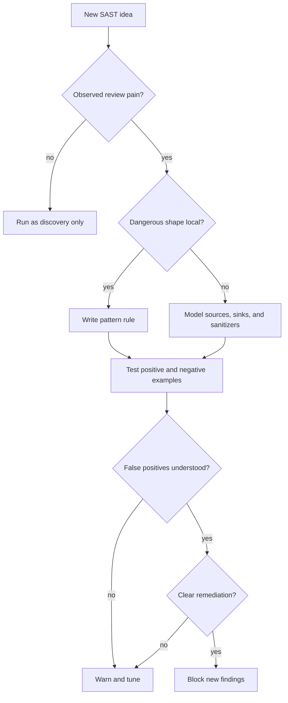

## Complexity: [MEDIUM]
## Time to Complete: 60-75 minutes

---

## Prerequisites

Before starting this module, you should have completed [Module 12.1: SonarQube](../module-12.1-sonarqube/) so the basic vocabulary of code quality gates, rule severity, and developer feedback loops is already familiar. You should also understand the [DevSecOps fundamentals](../../../disciplines/reliability-security/devsecops/module-4.1-devsecops-fundamentals/) because static analysis is one tool class inside a larger delivery practice, not a replacement for threat modeling, dependency review, runtime controls, or secure design. Basic programming experience in one language is enough; the lesson focuses on how scanners reason about code rather than on a specific framework.

---

## What You'll Be Able to Do

After completing this module, you will be able to:

- **Deploy Semgrep and configure custom rules for security-focused static analysis in CI/CD pipelines**
- **Implement Semgrep patterns for detecting OWASP vulnerabilities and insecure coding practices**
- **Configure Semgrep's autofix capabilities to automatically remediate detected code issues**
- **Compare Semgrep's pattern-based approach against CodeQL for security scanning speed and coverage trade-offs**

## Why This Module Matters

Hypothetical scenario: A platform team supports twenty application repositories, each with its own web framework, helper libraries, and deployment pipeline. A security reviewer notices the same unsafe pattern appearing in several pull requests: request parameters are being passed into command execution helpers with `shell=True`. The reviewer can keep commenting manually, but that turns security into a person-shaped bottleneck and leaves every future repository dependent on memory. A better response is to encode the lesson as a static rule, run it where developers already work, and make the unsafe pattern visible before it becomes a production incident.

Static Application Security Testing, usually shortened to SAST, matters because many dangerous mistakes are visible before an application ever runs. Source code can reveal hardcoded credentials, direct SQL string construction, unsafe deserialization calls, missing authorization wrappers, weak cryptographic APIs, and framework-specific footguns. The scanner does not need a deployed environment, test data, reachable service account, or staging cluster to see those patterns. It needs source, rules, and enough language understanding to distinguish code structure from plain text. That makes SAST one of the most practical "shift-left" controls in a DevSecOps program.

The word "left" can be misleading if it sounds like a calendar slogan. The real idea is feedback placement. A finding discovered while a developer is still editing the function is cheap to understand because the author has context loaded. The same finding discovered after release forces triage, reproduction, ownership discovery, risk acceptance, and possibly emergency patching. SAST is not valuable because earlier is morally superior; it is valuable because earlier feedback is more actionable and less disruptive. This module treats Semgrep as the worked example because its rule language is approachable, but the durable skill is learning how code-pattern analysis becomes a dependable platform control.

The useful analogy is a spell-checker for security-critical code structure. A spell-checker cannot prove that an essay is persuasive, historically accurate, or legally safe. It can still catch misspellings early enough that the author fixes them without a review meeting. SAST works the same way. It cannot prove that your authorization model is correct or that every business rule is safe, but it can catch repeatable code shapes that your organization has already decided are risky. The craft is deciding which shapes deserve automation, how loudly each finding should speak, and how developers can correct them without becoming scanner administrators.

## What SAST Is and Where It Fits

SAST analyzes source code, bytecode, intermediate representations, or configuration-like code artifacts without executing the application. The scanner parses files into a representation it can reason about, often an abstract syntax tree, then applies rules that describe unsafe syntax, unsafe API usage, missing context, or suspicious data movement. OWASP describes static code analysis as work performed on static, non-running source code and notes that taint and data-flow techniques are common parts of the practice. That framing is important because it separates SAST from dynamic application testing, which probes a running system, and from software composition analysis, which reasons about dependencies rather than first-party code.

In a healthy delivery system, SAST appears in several places with different expectations. In the IDE or pre-commit hook, it acts like fast coaching: findings should be narrow, clear, and unlikely to require debate. In pull-request CI, it acts like a guardrail: new high-confidence findings can block a merge, while noisy or legacy findings should be reported without stopping unrelated work. In scheduled full scans, it acts like inventory: the security team can study old debt, framework coverage gaps, and trend lines without putting every historical issue in the path of a single feature branch.

This maps directly to the DevSecOps tool-class taxonomy from the earlier discipline module. SAST is a code-stage control, meaning it helps while developers are still changing the artifact that contains the defect. It complements, rather than replaces, secrets scanning, dependency scanning, IaC scanning, container image scanning, admission policy, runtime detection, and incident response. The platform team's job is to make those controls feel like one coherent feedback system. Developers should not have to guess whether a finding belongs to Semgrep, CodeQL, SonarQube, Snyk Code, or another tool; they should see a clear message, an owner, a severity, and an expected action.

The classes of issues SAST catches well share a property: the dangerous shape is visible in code. Injection rules often look for untrusted input reaching a query or command sink. Hardcoded secret rules look for credential-like names assigned to literal strings. Unsafe API rules look for calls such as insecure deserialization, weak hashing, disabled certificate verification, debug mode in production entry points, or direct HTML injection in frontend code. Configuration rules can inspect YAML, Terraform, CI files, or Kubernetes manifests when those files express risk as text. These are not the only vulnerabilities that matter, but they are exactly the kind that automation can find repeatedly.

SAST also has inherent limits. It may not know which route requires an admin user, which tenant owns a record, which field is sensitive in your domain, or whether a feature flag prevents a code path from running in production. It may over-report because a pattern is syntactically suspicious but practically unreachable. It may under-report because a framework helper hides the real source or sink behind abstraction. It may struggle with generated code, dynamic dispatch, reflection, metaprogramming, and language features the analyzer has not modeled. Treating a scanner as a proof engine creates disappointment; treating it as a codified review assistant creates durable value.

The practical consequence is that SAST rollout is an operations problem as much as a rule-writing problem. You need a policy for which findings block, a baseline strategy for old findings, an exception process for justified deviations, a way to measure whether issues are being fixed, and a review loop for rules that create noise. Buying or installing a scanner is the smallest part of the work. The real platform capability is converting code knowledge into fast, trusted feedback that teams can live with every day.

## How Static Analysis Sees Code

A plain text search tool sees characters. A static analysis tool tries to see structure. If the source contains `cursor.execute("select * from users where id = " + user_id)`, a text search can find the word `execute`, but it does not know which part is a function call, which part is a string literal, and which part is a variable. A parser can turn the file into an abstract syntax tree, where calls, arguments, assignments, imports, classes, and blocks have relationships. Once the scanner has that structure, a rule can ask for "a call to this function with an argument shaped like string concatenation" instead of "a line containing this substring."

That distinction explains why code-pattern tools are more useful than raw regular expressions for security review. Whitespace differences, line wrapping, parentheses, import aliases, and language-specific syntax can defeat text matching while still representing the same program behavior. A syntax-aware pattern can often match the intent across those formatting differences. Semgrep's documentation describes rules as YAML specifications that tell the engine which patterns to match, and its glossary distinguishes search rules from taint rules. The exact implementation varies by tool, but the underlying move is the same: parse first, match against structure second, then report findings in a developer-consumable format.

The static analysis pipeline usually has five phases. First, the scanner discovers files and applies ignore rules so vendored code, generated files, and irrelevant paths do not flood the result set. Second, it parses supported languages and skips or partially handles unsupported files. Third, it applies rules, which may be simple pattern checks, semantic checks, data-flow rules, or tool-specific queries. Fourth, it formats findings with file paths, line numbers, rule identifiers, severity, remediation text, and optional metadata such as CWE or OWASP mapping. Fifth, a policy layer decides whether those findings fail a local command, comment on a pull request, upload SARIF, create tickets, or simply record evidence.

The quality of each phase affects trust. If file discovery scans dependencies that developers do not own, teams learn to ignore the scanner. If parsing fails silently, security assumes coverage that does not exist. If rules lack clear messages, developers cannot fix findings without hunting through internal wiki pages. If severity is disconnected from blocking policy, every finding feels political. A mature SAST implementation makes each phase explicit enough that developers understand why a finding appeared and security engineers understand why a finding did not appear.

This is where platform engineering enters the picture. A central team can provide shared rule packs, CI templates, SARIF upload patterns, exception formats, and dashboards, but the application team still owns the code. The central team should not become the only group allowed to write rules. In fact, some of the best static analysis rules come from application teams after an incident review or design review reveals a pattern they never want repeated. A good SAST platform makes local rule authoring normal, reviewable, and testable.

## Pattern Matching with Semgrep as the Worked Example

Semgrep is useful as a teaching example because a search-mode rule often looks like the code it is trying to find. A rule for a dangerous function call can contain `pattern: eval($X)`, where `$X` is a metavariable that captures whatever expression appears inside the call. That is not a regular expression over text; it is a code-shaped pattern over parsed syntax. The rule can then interpolate `$X` into the message, constrain it with `metavariable-regex`, exclude safe cases with `pattern-not`, or combine alternatives with `pattern-either`.

Here is a small rule that detects literal debug mode in a Flask entry point. It is intentionally narrow because narrow rules are easier to trust during rollout. The rule does not try to prove that the file is deployed to production, and it does not try to inspect every possible configuration path. It encodes a local guardrail: direct `debug=True` in an application run call should be reviewed.

```yaml
rules:
  - id: flask-debug-enabled
    pattern: app.run(..., debug=True, ...)
    message: "Flask debug mode is enabled. Disable debug mode outside local development."
    severity: ERROR
    languages: [python]
    metadata:
      cwe: "CWE-489: Active Debug Code"
```

The most important part of that example is not the YAML. It is the decision to start from a specific unsafe shape and a specific developer action. A vague rule such as "look for insecure Flask code" would not be useful because it has no inspectable boundary. A useful rule says exactly what it matches, why that shape is risky, what context would make it acceptable, and how the developer should fix it. The rule ID becomes part of governance: it can be tracked, suppressed, tested, documented, and discussed in code review.

Metavariables make rules adaptable without making them vague. A hardcoded credential rule can capture any assigned variable name, then use a regular expression to focus on names that look credential-related. This still requires careful tuning because words like `token`, `secret`, and `password` can appear in test fixtures or documentation. The first version of such a rule should usually warn, collect examples, and earn the right to block later.

```yaml
rules:
  - id: hardcoded-credential-like-assignment
    patterns:
      - pattern: $NAME = "..."
      - metavariable-regex:
          metavariable: $NAME
          regex: (?i).*(password|passwd|secret|token|api_key).*
    message: "Credential-like value assigned to $NAME. Load secrets from the approved secret store."
    severity: ERROR
    languages: [python]
    metadata:
      cwe: "CWE-798: Use of Hard-coded Credentials"
```

`pattern-either` expresses alternatives without duplicating whole rules. That matters because security issues often appear through several equivalent APIs. A command injection rule might need to look at `subprocess.run`, `subprocess.call`, `subprocess.check_call`, and `subprocess.check_output`. A weak hash rule might look at `hashlib.md5` and `hashlib.sha1`. Keeping those alternatives in one rule avoids scattered messages and makes the policy easier to explain.

```yaml
rules:
  - id: weak-hash-algorithm
    pattern-either:
      - pattern: hashlib.md5(...)
      - pattern: hashlib.sha1(...)
    message: "Weak hash algorithm used. Use an approved password hashing or integrity primitive for the use case."
    severity: WARNING
    languages: [python]
    metadata:
      cwe: "CWE-328: Use of Weak Hash"
```

`pattern-not` and `pattern-not-inside` are where rule tuning begins. A raw React rule for `dangerouslySetInnerHTML` may be useful for discovery, but it is too broad as a blocking rule because some teams wrap sanitization in a reviewed helper. A tuned rule can match the dangerous API and exclude the approved wrapper or sanitizer call. That is not a proof that every excluded use is safe; it is a policy decision that says "this code shape follows the approved pattern." Good static analysis requires these policy decisions to be explicit rather than hidden in reviewer memory.

```yaml
rules:
  - id: react-dangerous-html-without-approved-sanitizer
    patterns:
      - pattern: dangerouslySetInnerHTML={{__html: $HTML}}
      - pattern-not: dangerouslySetInnerHTML={{__html: DOMPurify.sanitize($HTML)}}
      - pattern-not: dangerouslySetInnerHTML={{__html: sanitizeHtml($HTML, ...)}}
    message: "Sanitize HTML before passing it to dangerouslySetInnerHTML."
    severity: ERROR
    languages: [javascript, typescript, jsx, tsx]
    metadata:
      cwe: "CWE-79: Cross-site Scripting"
```

The rule authoring loop should be test-driven. Create positive examples that must match, negative examples that must not match, and edge cases that document known limitations. Then run the rule against real repositories in warning mode before making it block. A scanner that blocks with untested rules teaches developers that security automation is arbitrary. A scanner that ships tested, explained rules teaches developers that security knowledge is reusable engineering work.

## Pattern Matching Versus Taint Analysis

Pattern matching answers questions about local code shape. Did this file call `eval`? Did this route use `debug=True`? Did this manifest set `privileged: true`? Did this code pass raw HTML to a dangerous React prop? Those questions are powerful because they are fast, inspectable, and easy to explain. They are also limited because many vulnerabilities are not visible in one expression. Injection, server-side request forgery, command execution, and template injection often depend on whether untrusted data can flow from a source to a sink.

Taint analysis answers a different question: can data from an untrusted source reach a dangerous operation without passing through an accepted sanitizer or validator? A source might be `request.args.get(...)`, `req.query`, an HTTP header, a message body, or a file upload. A sink might be SQL execution, shell execution, template rendering, URL fetching, deserialization, or HTML output. A sanitizer might be parameterized query binding, strict allowlist validation, context-specific output encoding, or a framework API that separates code from data. The vocabulary is durable even though each tool expresses it differently.

Here is a Semgrep taint-mode rule that flags request parameters flowing into shell execution helpers with `shell=True`. The example is intentionally scoped to Flask-style request access and Python subprocess calls so it remains understandable. A production rule would need repository-specific tests, framework knowledge, and exceptions for code that is not reachable in deployed services.

```yaml
rules:
  - id: flask-request-to-subprocess-shell
    mode: taint
    pattern-sources:
      - pattern: request.args.get(...)
      - pattern: request.form.get(...)
    pattern-sinks:
      - patterns:
          - pattern: subprocess.$FUNC(..., shell=True, ...)
          - metavariable-regex:
              metavariable: $FUNC
              regex: ^(run|call|check_call|check_output|Popen)$
    message: "User-controlled request data reaches a subprocess call with shell=True."
    severity: ERROR
    languages: [python]
    metadata:
      cwe: "CWE-78: OS Command Injection"
```

Taint rules can be more valuable than local pattern rules because they reduce false positives for APIs that are dangerous only when reached by untrusted data. They can also be harder to operationalize. The analyzer needs to understand assignments, function calls, wrappers, framework conventions, object fields, containers, and sometimes interfile control flow. If the tool cannot follow a custom helper, it may miss a real flow. If it over-approximates too aggressively, it may report flows that are impossible in practice. This is why taint analysis should be treated as a modeling practice, not a magic vulnerability oracle.

The tuning work is where teams usually succeed or fail. A security team may start with generic rules from a registry, but real signal comes from adapting rules to local frameworks, shared libraries, and approved wrappers. If every service uses `safe_query(...)` for parameterized database access, rules should know that. If every service uses an internal `render_safe_html(...)` helper, rules should know that too. If a legacy repository has hundreds of old findings, pull-request scans should focus on newly introduced findings while scheduled work burns down the baseline deliberately.

This also explains the tradeoff between Semgrep and CodeQL in the outcome for this module. Semgrep search rules are often faster to write and easier for application teams to understand because the pattern resembles source code. CodeQL uses a query language over code databases and can express deep semantic and data-flow questions, especially in GitHub-centered workflows, but it has a different learning curve and operational model. The right comparison is not "which tool is best"; it is "which analysis technique, rule authoring model, and workflow fit this control objective?"

## Running SAST in Developer and CI Workflows

A SAST rule that only runs on a security engineer's laptop is not a platform capability. To become a guardrail, the rule must run in the places where code changes are created and reviewed. That usually means three integration points: local scans for rapid feedback, pull-request scans for merge decisions, and scheduled scans for inventory. Each point should use the same rule intent but not necessarily the same blocking policy.

For local use, the command should be simple enough that a developer can run it before pushing. With Semgrep Community Edition, the current documentation describes `semgrep scan` as the preferred command for stand-alone CI and open-source-component setups. A small local command might scan the repository with a custom rule directory and a registry configuration. The exact registry names and rule licenses should be reviewed before adoption because rule availability and licensing are volatile details.

```bash
semgrep scan --config=.semgrep/ --config=p/python .
```

For pull-request CI, the goal is usually "block new serious findings, do not make every old finding the author's problem." Semgrep supports diff-aware scans through CI environment configuration, and its docs describe comparing code before and after a baseline so only newly introduced findings are reported. Many tools have an equivalent concept even if the names differ. The durable pattern is baseline first, new-code gate second, full inventory third.

```yaml
name: semgrep

on:
  pull_request:
    branches: [main]
  push:
    branches: [main]

jobs:
  scan:
    runs-on: ubuntu-latest
    container:
      image: semgrep/semgrep
    steps:
      - uses: actions/checkout@v4
        with:
          fetch-depth: 0
      - name: Run Semgrep custom rules
        run: semgrep scan --config=.semgrep/ --error --sarif --output=semgrep.sarif .
      - name: Upload SARIF
        if: always()
        uses: github/codeql-action/upload-sarif@v3
        with:
          sarif_file: semgrep.sarif
```

That example deliberately uses custom local rules and SARIF output. SARIF is useful because it lets multiple scanners report findings into a common code-scanning interface, but uploading findings is not the same as governance. Someone still has to decide which rule IDs block, who owns exceptions, how long suppressions last, and when a warning graduates to an error. A CI file can enforce a policy, but it cannot design one.

Ignore files are part of the policy too. A `.semgrepignore` file should exclude generated code, vendored dependencies, large test fixtures, and other paths where findings are not actionable. It should not become a hiding place for uncomfortable production code. The distinction is ownership: if developers cannot or should not edit a path, scanning it in PR gates creates noise; if developers own the path and the rule is correct, ignoring it is risk acceptance and should be reviewed.

```gitignore
# .semgrepignore
vendor/
third_party/
dist/
build/
generated/
**/*.min.js
```

Pre-commit and IDE integrations are useful when rules are fast and precise. They should rarely run every heavyweight rule because slow local hooks encourage bypassing. A practical pattern is to run secrets, obvious unsafe APIs, and team-owned custom rules locally, then let CI run broader analysis. Developers will tolerate early feedback when it saves them from failed builds; they will resent it when it feels like a slow duplicate of CI.

## Autofix Without Auto-Trust

Autofix is powerful because some unsafe patterns have mechanical replacements. If a project has standardized on `Path(...) / name` instead of `os.path.join(...)`, a rule can capture the old shape and propose the new shape. If a hardcoded Flask secret key should be loaded from an environment variable, a rule can offer a replacement. If a deprecated helper has a one-to-one successor, autofix can turn a review comment into a patch. That can reduce toil dramatically when the transformation is genuinely mechanical.

```yaml
rules:
  - id: flask-secret-from-environment
    patterns:
      - pattern: app.secret_key = "..."
    message: "Load Flask secret_key from the environment instead of hardcoding it."
    severity: ERROR
    languages: [python]
    fix: app.secret_key = os.environ["FLASK_SECRET_KEY"]
    metadata:
      cwe: "CWE-798: Use of Hard-coded Credentials"
```

Autofix should not be confused with safe remediation. The replacement must preserve behavior, imports, formatting, and context. The example above introduces `os.environ`, which means the file also needs `import os` unless it already exists. That may be acceptable as a suggested fix but not as an unattended rewrite. A high-quality autofix rule is paired with tests, dry-run review, and a clear rule message that explains any manual follow-up. The rule should make the common case easier, not pretend every case is common.

The best use of autofix is controlled migration. Hypothetical scenario: A team decides that direct calls to an internal `legacy_encrypt(...)` helper must be replaced by `platform_crypto.encrypt(...)` because the new helper centralizes algorithm selection and key handling. A Semgrep rule can first inventory old calls, then offer autofix where the argument order is identical, then block new old-helper calls after the migration window. The numbers in such a migration should be measured from the real repository, not invented in a lesson. The durable pattern is inventory, assisted remediation, manual review for edge cases, and permanent regression prevention.

Autofix also changes the psychology of SAST adoption. A finding that says "this is wrong" creates work. A finding that says "this is wrong, here is the smallest reviewed change" creates momentum. Developers are more likely to trust scanner output when the scanner understands the codebase well enough to suggest the local standard. That does not require every rule to have a fix. It requires the platform team to identify repetitive, low-judgment transformations and automate those first.

## Governance: Policy as Code for SAST

Governance begins with rule intent. Every rule should answer four questions: what code shape does it detect, why does the organization care, what should the developer do, and when is an exception acceptable? If those answers are not known, the rule is not ready to block a merge. It may still be useful in discovery mode, but discovery findings should not be presented as hard policy. That separation prevents the common failure mode where a scanner is installed with too many rules, developers drown in ambiguous findings, and the tool loses credibility before it is tuned.

Policy as code means the decisions live in version-controlled configuration rather than in a security meeting transcript. Rule packs, severity overrides, ignore paths, CI templates, baseline references, and exception formats should be reviewable like application code. When a team changes a rule from warning to error, the diff should show why. When a path is ignored, the diff should show who owns the risk. When a rule is suppressed inline, the comment should explain the local reasoning and ideally link to an issue or risk record.

A practical blocking policy usually has stages. In stage one, the scanner runs in non-blocking mode and collects examples. In stage two, high-confidence custom rules block only new findings. In stage three, selected registry rules join the blocking set after false positives are understood. In stage four, scheduled scans and dashboards track legacy debt separately from pull-request hygiene. This staged approach avoids the false choice between "block everything today" and "never enforce anything." It gives rules a path to earn enforcement.

Exceptions need their own lifecycle. An inline suppression may be acceptable for a test fixture, a deliberate compatibility shim, or a narrow false positive. It is dangerous when it becomes an unreviewed permanent bypass. Good exception workflows ask for the rule ID, file, reason, owner, review date, and safer alternative considered. Some organizations encode this in comments, some in a YAML allowlist, and some in a ticketing system. The form matters less than the invariant: every bypass should have a reason and a future review point.

Measurement should support learning rather than scanner theater. Useful metrics include new findings by rule, median time to fix, percentage of blocking findings resolved in the same pull request, recurring false-positive rules, exception aging, and escape rate from incidents or manual reviews. Findings density can be helpful when normalized by repository and language, but raw counts can punish larger codebases and encourage suppressions. The strongest metric is whether repeated classes of security review comments disappear because the rule now catches them before review.

The ownership model should be visible to developers at the moment a finding appears. A finding that says "security violation" but does not identify the owning platform standard, the reviewed remediation path, or the escalation channel forces the author to become an investigator. A finding that names the rule, links to the approved pattern, and tells the author when to ask for an exception turns static analysis into a normal engineering workflow. This is why SAST governance belongs close to developer experience. The scanner is only the detection engine; the platform is the set of explanations, defaults, and review paths around it.

Rule retirement is just as important as rule creation. Frameworks change, shared helpers improve, and old migrations finish. A rule that was valuable during a transition can become noise after the risky API disappears, while a rule that once had many false positives can become enforceable after a common wrapper lands. Mature teams schedule rule reviews the same way they review CI templates and base images. They ask which rules still produce useful findings, which need better tests, which should move from warning to error, and which should be removed because the underlying risk has moved somewhere else.

Finally, remember that SAST findings are social signals as well as technical signals. If one team receives many findings from the same rule, the answer may be a framework template change, not repeated individual coaching. If several repositories suppress the same rule, the rule message may be unclear or the approved pattern may be too hard to use. If a finding class keeps escaping to manual review, the scanner may need a custom model for the organization's helper library. Static analysis gets better when the platform team treats every noisy result as feedback about the system, not just about the line of code.

## Landscape Snapshot and SAST Rosetta

> **Landscape snapshot - as of 2026-06. This changes fast; verify against vendor docs before relying on specifics.**
>
> Semgrep Community Edition is documented by Semgrep as an LGPL 2.1 engine, while Semgrep-maintained rules use a separate Semgrep Rules License and Semgrep Pro rules are proprietary additions in the Semgrep ecosystem. Opengrep identifies itself as a fork of Semgrep and its GitHub repository states LGPL 2.1 licensing for the engine. GitHub documents CodeQL CLI as free for public repositories, with private-repository use tied to eligible GitHub licensing. SonarQube and Snyk Code publish current capability and language-support documentation through their own docs; treat edition, licensing, and feature cells below as refreshable vendor facts rather than durable curriculum claims.

| Durable capability | Semgrep | CodeQL | SonarQube | Snyk Code |
|---|---|---|---|---|
| Language coverage | Multi-language SAST; verify current language list in Semgrep docs | Multi-language CodeQL analysis through GitHub code scanning | Code quality and security analysis across documented language sets | Snyk Code language support documented per product and integration |
| Custom-rule authoring | YAML rules with code-like patterns, metavariables, taint mode, and registry/private rules | CodeQL queries over code databases using QL | Rules and security-engine customization are edition and product dependent | Primarily vendor-managed rule intelligence; verify custom-rule options in current docs |
| Taint analysis | Taint mode in rule syntax; deeper interfile features vary by product tier | Strong data-flow query model over CodeQL databases | Advanced Security docs describe taint analysis across functions and files | Docs describe semantic analysis over code and supported integrations |
| Autofix | Rule `fix` field and platform-assisted remediation features vary by tier | Query results can guide remediation; autofix is not the core authoring model | Remediation guidance and quality gates are central workflow features | Remediation guidance is part of product workflow; verify current automation |
| OSS versus commercial posture | CE engine LGPL 2.1; Semgrep rules and Pro features have separate terms | GitHub-owned; CLI free for public repositories per GitHub docs | Community and commercial editions vary; verify edition matrix | Commercial Snyk product family with documented CLI, IDE, SCM, and CI integrations |
| CI and diff-aware workflow | `semgrep scan`, `semgrep ci`, SARIF, baselines, and diff-aware scans documented | GitHub code scanning and CodeQL CLI workflows | Quality gates and CI integration through Sonar scanners | SCM, IDE, CLI, and CI integrations documented by Snyk |

The Rosetta table is intentionally not a ranking. These tools overlap, but they optimize for different operating models. Semgrep is often attractive when teams need to encode local code patterns quickly. CodeQL is often attractive when deep semantic queries and GitHub code scanning are already part of the platform. SonarQube is often attractive when security findings sit beside maintainability, duplication, coverage, and quality gates. Snyk Code is often attractive when teams already use the Snyk ecosystem for developer-facing security feedback. Those are tradeoff descriptions, not market-share or leadership claims.

The durable lesson is to evaluate the analysis technique and workflow before the brand. Ask whether the tool can parse your languages, model your frameworks, express local rules, run where developers work, separate old debt from new findings, export evidence, and support exceptions without hiding risk. A tool that is excellent in one organization can fail in another if it does not fit repository ownership, CI runtime budget, or developer trust. Conversely, a modest rule set can deliver high value when it encodes the exact review lessons your teams repeatedly need.

## Patterns & Anti-Patterns

### Patterns

**Start with review pain that already exists.** The best first custom rules come from repeated pull-request comments, incident remediations, or architecture decisions that reviewers already enforce manually. If a reviewer has written the same warning ten times, the organization has discovered a code shape worth automating. Starting from observed pain keeps the rule grounded and makes adoption easier because developers have already seen the reason behind the policy.

**Use baselines to separate adoption from cleanup.** A legacy repository may have old findings that deserve attention, but blocking every feature branch on historical debt creates resentment and tactical suppressions. Baseline or diff-aware scanning lets the team stop the bleeding first, then schedule cleanup as planned work. This does not excuse old risk; it makes ownership explicit and prevents new code from increasing the problem while cleanup proceeds.

**Treat rules as tested code.** A SAST rule has behavior, edge cases, regressions, and users. It should have positive examples, negative examples, clear metadata, and a changelog when it becomes blocking. This is especially important for custom Semgrep rules because they are easy to write quickly. Ease of authoring is a strength only when paired with the discipline to test what the rule actually matches.

**Graduate severity deliberately.** A new rule can begin as informational, move to warning after tuning, and become blocking only when the false-positive rate and remediation path are understood. This staged rollout protects developer trust. A rule that blocks too early may be technically interesting but operationally harmful, while a rule that never graduates may become background noise.

### Anti-Patterns

**Installing every available ruleset and calling it done.** Broad default coverage can be useful for discovery, but untuned findings quickly become noise. A platform team that enables everything without ownership, baseline strategy, or exception workflow has created an alert feed, not a security control. The scanner may be busy while the organization learns very little.

**Using inline suppressions as permanent design decisions.** Suppression is sometimes correct, but a suppression without a reason, owner, and review point is just hidden risk. Over time, unreviewed suppressions create a second policy layer that nobody audits. A scanner cannot improve security if its strongest rules are bypassed through unexplained comments.

**Blocking on findings developers cannot fix.** Findings in generated code, vendored dependencies, archived repositories, or centrally owned framework code should not block unrelated application pull requests. Those findings need owners, but the owner may not be the pull-request author. Poor ownership mapping turns SAST into organizational blame instead of feedback.

**Mistaking SAST for secure design.** Static analysis can catch unsafe API calls and data-flow patterns, but it cannot fully validate authorization intent, business logic, threat models, or abuse cases. A team that relies on scanners instead of secure design reviews will still miss important vulnerabilities. SAST is a guardrail, not the road.

### Decision Framework

| Decision | Choose a simple pattern rule when... | Choose taint or semantic analysis when... | Governance question |
|---|---|---|---|
| Unsafe API | The dangerous call is risky by itself | The call is risky only with untrusted data | Should this block immediately or warn first? |
| Injection | String construction appears near the sink | Sources and sinks are separated by helpers | Which wrappers count as approved sanitizers? |
| Secrets | Literal values and credential-like names are visible | Secrets may be generated or loaded dynamically | Who rotates exposed values after a true finding? |
| Framework policy | The approved code shape is local and clear | The policy depends on cross-file framework setup | How are framework exceptions reviewed? |
| Legacy debt | Old findings are numerous but known | New findings are the main PR concern | What baseline prevents new debt without hiding old risk? |



## Did You Know?

- **Static does not mean shallow**: Static analysis can range from simple syntax checks to interprocedural data-flow analysis; the defining trait is that the application is not executed as part of the scan.
- **Rule metadata is operational data**: CWE, OWASP, severity, confidence, references, and remediation text help route findings and explain why a rule exists.
- **Diff-aware scanning is an adoption tool**: Reporting only new findings on a pull request lets teams enforce better behavior without forcing every author to clean unrelated legacy debt.
- **Forks are curriculum volatility signals**: The Semgrep and Opengrep split is a reminder to isolate tool licensing and feature facts in dated snapshots rather than hard-coding them into durable prose.

## Common Mistakes

| Mistake | Problem | Solution |
|---|---|---|
| Enabling broad rules without tuning | Developers see noisy findings and stop trusting the scanner | Start with a small blocking set and run broader rules in discovery mode |
| Blocking historical findings in every PR | Feature authors inherit old debt they did not create | Use baseline or diff-aware scanning for PR gates and schedule legacy cleanup separately |
| Writing rules with no negative examples | False positives appear only after rollout | Add rule tests with both matching and non-matching code before enforcement |
| Omitting remediation text | Developers know something is wrong but not what standard to follow | Include the approved pattern, owner, and reference in the rule message or metadata |
| Treating suppressions as invisible | Real exceptions become indistinguishable from avoidance | Require reason, owner, and review date for durable suppressions |
| Scanning generated or vendored code in PR gates | Findings are not actionable for the author | Exclude non-owned paths with `.semgrepignore` or route them to the owning team |
| Comparing tools by reputation | Tool choice becomes vendor folklore rather than engineering fit | Compare language support, rule authoring, data-flow depth, CI workflow, and governance needs |
| Assuming autofix is always safe | Mechanical replacements can break imports, behavior, or context | Use dry runs, tests, and review; reserve unattended fixes for proven transformations |

## Quiz

1. A team wants to prevent direct use of `dangerouslySetInnerHTML` unless an approved sanitizer wraps the value. Should the first rule be a local pattern rule or a taint rule?

<details>
<summary>Answer</summary>

A local pattern rule is the better first step because the risky code shape is visible at the call site. The team can implement Semgrep patterns that match `dangerouslySetInnerHTML`, then use `pattern-not` for approved sanitizer calls. This supports the outcome to implement Semgrep patterns for OWASP-style vulnerabilities because cross-site scripting risk is being encoded as a concrete, reviewable rule. A taint rule may be useful later if the team needs to follow user-controlled data through wrappers before it reaches the sink.

</details>

2. A repository has many old SAST findings, but leadership wants CI to block only newly introduced high-confidence issues. What deployment strategy fits that goal?

<details>
<summary>Answer</summary>

Deploy Semgrep or a peer scanner in CI with a baseline or diff-aware workflow so pull requests focus on new findings. The old findings should remain visible in scheduled scans or dashboards, but they should not all become merge blockers for unrelated changes. This aligns with deploying and configuring custom rules in CI/CD pipelines because the control is not just the command; it is the policy that decides which findings block. The team should document when legacy debt will be reviewed so the baseline does not become a hiding place.

</details>

3. A custom rule finds `subprocess.check_output(...)`, but it reports safe internal scripts and unsafe request-driven commands with the same severity. What should you change?

<details>
<summary>Answer</summary>

The rule needs more context before it should block. You could add `pattern-not` or path exclusions for reviewed internal scripts, or switch to taint analysis so only request-controlled data reaching `subprocess` with `shell=True` is reported. This is the signal-to-noise problem in static analysis: a broad pattern may be useful for discovery but too noisy for enforcement. The blocking version should match the risk model closely enough that developers understand why the finding is actionable.

</details>

4. When is Semgrep autofix a good fit, and when should it stay as a suggestion?

<details>
<summary>Answer</summary>

Autofix is a good fit when the replacement is mechanical, preserves behavior, and has tests that cover the common cases. It should stay as a suggestion when the fix may require imports, configuration, data migration, human judgment, or framework-specific context. This addresses the outcome to configure Semgrep's autofix capabilities because the engineering task is not only adding a `fix` field; it is deciding whether the fix is safe to apply. A dry run plus code review is the normal path for anything beyond trivial rewrites.

</details>

5. A security engineer says CodeQL is always better than Semgrep because it can express deeper data-flow queries. What is a more useful comparison?

<details>
<summary>Answer</summary>

The more useful comparison is the analysis objective and operating model. CodeQL can be a strong fit for deep semantic queries and GitHub-centered code scanning, while Semgrep can be a strong fit for fast custom pattern rules that application teams can read and maintain. This directly supports the outcome to compare Semgrep's pattern-based approach against CodeQL for speed and coverage trade-offs. A platform team should evaluate language coverage, rule authoring skill, CI cost, data-flow needs, and governance workflow instead of declaring a universal winner.

</details>

6. Why should a SAST rule include CWE or OWASP metadata if the scanner can already show the file and line?

<details>
<summary>Answer</summary>

Metadata turns a finding into operational evidence. CWE and OWASP mappings help security teams group findings, explain risk, create reports, and connect a code pattern to a broader weakness class. They also help developers understand whether the issue is injection, hardcoded credentials, unsafe deserialization, or another category. A line number tells someone where to look; metadata helps the organization decide how to prioritize and govern the rule.

</details>

7. A team keeps adding `.semgrepignore` entries for application directories after every noisy scan. What is the governance problem?

<details>
<summary>Answer</summary>

The team is using ignores as unmanaged risk acceptance. Excluding generated or vendored code is reasonable because developers do not own it, but excluding owned application directories hides findings instead of fixing the rule, changing severity, or documenting exceptions. The better path is to review noisy rule IDs, add precise exclusions, create suppressions with reasons, or run the rule in warning mode. Ignoring whole owned paths should require explicit owner approval and a review date.

</details>

8. During rollout, why might a platform team run broad registry rules in scheduled scans but only custom high-confidence rules in pull-request gates?

<details>
<summary>Answer</summary>

Scheduled scans are good for inventory, learning, and broad discovery because they do not interrupt a specific author's merge path. Pull-request gates need stronger precision because they directly affect delivery flow. This split lets the team learn from broad coverage while preserving developer trust in blocking feedback. Over time, tuned registry rules can graduate into the blocking set after false positives and remediation paths are understood.

</details>

## Hands-On

In this lab, you will write and run a small Semgrep ruleset against a deliberately vulnerable Flask-style file. The goal is not to build a complete Flask security scanner. The goal is to practice the workflow: create a local rule, run it, inspect findings, add a test case, and decide which rules are safe enough to block. Install Semgrep with the current method from the official docs before starting, such as Homebrew or `pipx`, then run the commands from a disposable directory.

```bash
mkdir semgrep-sast-lab
cd semgrep-sast-lab
mkdir -p rules
cat > app.py <<'EOF'
from flask import Flask, request, render_template_string
import hashlib
import subprocess

app = Flask(__name__)
app.secret_key = "local-development-secret"

@app.route("/run")
def run_command():
    command = request.args.get("cmd")
    output = subprocess.check_output(command, shell=True)
    return output.decode("utf-8")

@app.route("/template")
def template():
    name = request.args.get("name")
    return render_template_string(f"Hello {name}")

@app.route("/hash")
def hash_password():
    password = request.args.get("password", "")
    return hashlib.md5(password.encode("utf-8")).hexdigest()

if __name__ == "__main__":
    app.run(debug=True)
EOF
```

Now add custom rules. The first two are search rules for visible local patterns. The third is a taint rule that follows request data into a subprocess sink. The messages are intentionally specific because a useful finding should tell the developer what policy was violated and what direction to take.

```bash
cat > rules/flask-security.yaml <<'EOF'
rules:
  - id: flask-debug-enabled
    pattern: app.run(..., debug=True, ...)
    message: "Flask debug mode is enabled. Disable debug mode outside local development."
    severity: ERROR
    languages: [python]
    metadata:
      cwe: "CWE-489: Active Debug Code"

  - id: weak-hash-algorithm
    pattern-either:
      - pattern: hashlib.md5(...)
      - pattern: hashlib.sha1(...)
    message: "Weak hash algorithm used. Use an approved hashing primitive for the use case."
    severity: WARNING
    languages: [python]
    metadata:
      cwe: "CWE-328: Use of Weak Hash"

  - id: flask-request-to-subprocess-shell
    mode: taint
    pattern-sources:
      - pattern: request.args.get(...)
    pattern-sinks:
      - patterns:
          - pattern: subprocess.$FUNC(..., shell=True, ...)
          - metavariable-regex:
              metavariable: $FUNC
              regex: ^(run|call|check_call|check_output|Popen)$
    message: "Request-controlled data reaches subprocess with shell=True."
    severity: ERROR
    languages: [python]
    metadata:
      cwe: "CWE-78: OS Command Injection"
EOF
```

Run the scan in text and JSON modes. The text output is useful for humans, while JSON or SARIF is useful for CI systems and dashboards. If the command returns a non-zero exit because findings were detected, that is expected once `--error` is used; in a real rollout, you would decide which rule severities block the pipeline.

```bash
semgrep scan --config=rules/flask-security.yaml app.py
semgrep scan --config=rules/flask-security.yaml app.py --json --output=semgrep-results.json
semgrep scan --config=rules/flask-security.yaml app.py --error
```

Add a small rule test file so future rule edits do not silently change behavior. Positive examples should be marked as expected findings, and safe examples should be marked as allowed. If your installed Semgrep version changes test-discovery behavior, use the current Semgrep testing docs to place the test file next to the rule or pass the exact test path.

```bash
cat > rules/flask-security.py <<'EOF'
from flask import Flask, request
import hashlib
import subprocess

app = Flask(__name__)

# ruleid: flask-debug-enabled
app.run(debug=True)

# ok: flask-debug-enabled
app.run(debug=False)

# ruleid: weak-hash-algorithm
hashlib.md5(b"example")

# ok: weak-hash-algorithm
hashlib.sha256(b"example")

def unsafe():
    command = request.args.get("cmd")
    # ruleid: flask-request-to-subprocess-shell
    return subprocess.check_output(command, shell=True)
EOF

semgrep --test rules/
```

Finally, try a controlled autofix rule. This example is intentionally small: it changes the visible Flask debug flag from true to false. Review the diff after running autofix in any real project because even simple edits can interact with local conventions.

```bash
cat > rules/flask-autofix.yaml <<'EOF'
rules:
  - id: flask-debug-autofix
    pattern: app.run(..., debug=True, ...)
    fix: app.run(debug=False)
    message: "Disable Flask debug mode."
    severity: ERROR
    languages: [python]
EOF

cp app.py app-autofix.py
semgrep scan --config=rules/flask-autofix.yaml app-autofix.py --autofix --dryrun
```

Success criteria:

- [ ] Run a local Semgrep scan with `rules/flask-security.yaml` and see findings for debug mode, weak hashing, and request-controlled subprocess execution.
- [ ] Generate a JSON report named `semgrep-results.json` and inspect the rule IDs, file paths, and severity values.
- [ ] Add rule tests with both `ruleid` and `ok` examples, then run the Semgrep test command for the custom rule file.
- [ ] Run the autofix dry run and explain why this fix should still be reviewed before being committed in a real repository.

## Sources

- [OWASP Static Code Analysis](https://owasp.org/www-community/controls/Static_Code_Analysis)
- [OWASP Source Code Analysis Tools](https://owasp.org/www-community/Source_Code_Analysis_Tools)
- [NIST SP 800-218 Secure Software Development Framework](https://csrc.nist.gov/pubs/sp/800/218/final)
- [MITRE CWE-89 SQL Injection](https://cwe.mitre.org/data/definitions/89.html)
- [MITRE CWE-79 Cross-site Scripting](https://cwe.mitre.org/data/definitions/79.html)
- [MITRE CWE-798 Hard-coded Credentials](https://cwe.mitre.org/data/definitions/798.html)
- [Semgrep Write Rules](https://semgrep.dev/docs/writing-rules/overview)
- [Semgrep Rule Syntax](https://semgrep.dev/docs/writing-rules/rule-syntax)
- [Semgrep Test Rules](https://semgrep.dev/docs/writing-rules/testing-rules)
- [Semgrep Taint Analysis Overview](https://semgrep.dev/docs/writing-rules/data-flow/taint-mode/overview)
- [Semgrep Community Edition in CI](https://semgrep.dev/docs/deployment/oss-deployment)
- [Semgrep Diff-aware Scans](https://semgrep.dev/docs/kb/semgrep-ci/trigger-diff-scans-env-var)
- [Semgrepignore Guidance](https://semgrep.dev/docs/kb/semgrep-code/semgrepignore-ignored)
- [Semgrep Pro Rules](https://semgrep.dev/docs/semgrep-code/pro-rules)
- [Semgrep Compare Semgrep to Opengrep](https://semgrep.dev/docs/faq/comparisons/opengrep)
- [Opengrep Repository](https://github.com/opengrep/opengrep)
- [GitHub CodeQL CLI](https://docs.github.com/en/code-security/concepts/code-scanning/codeql/codeql-cli)
- [SonarQube Advanced Security Introduction](https://docs.sonarsource.com/sonarqube-server/advanced-security/introduction)
- [Snyk Code Documentation](https://docs.snyk.io/scan-fix-and-prevent/scan-with-snyk/snyk-code)
- [Snyk Supported Languages](https://docs.snyk.io/supported-languages/supported-languages-package-managers-and-frameworks)
- [Semgrep Pre-commit Scans](https://semgrep.dev/docs/extensions/pre-commit)

## Next Module

Continue to [Module 12.3: CodeQL](../module-12.3-codeql/) to learn how semantic query-based code analysis can model deeper flows and framework behavior.
