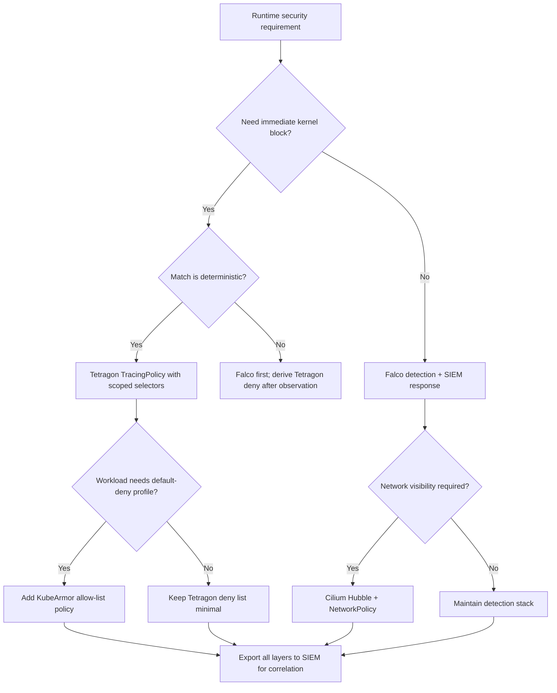

## Complexity: `[MEDIUM]`

This module sits at medium complexity because it combines kernel-level concepts, Kubernetes custom resources, and operational judgment about when to enforce versus observe. You should arrive with working familiarity from [Module 4.3 Falco](../module-4.3-falco/), the [eBPF Fundamentals](/platform/foundations/ebpf/module-1.1-ebpf-fundamentals/) track, Linux syscall behavior, and baseline Kubernetes security primitives such as namespaces, service accounts, and DaemonSets. Plan roughly ninety minutes to read the theory, study the policy examples, and reason through the layered architecture with Falco. The learning path emphasizes design trade-offs—when kernel enforcement helps, when it creates risk, and how to roll out policies without breaking legitimate workloads.

By the end of this module you will understand how eBPF-based runtime security differs from userspace detection and where Tetragon fits in a layered stack, deploy Tetragon on Kubernetes and validate that agents, CRDs, and event export paths are healthy before writing enforcement rules, author TracingPolicy resources that monitor process execution, file access, and network-related kernel activity with appropriate selectors, apply enforcement actions such as Sigkill and Override deliberately with namespace and workload scoping and a staged rollout from observe to block, and compare Tetragon’s in-kernel enforcement model against Falco’s detection-first approach plus adjacent tools such as KubeArmor and Cilium for defense in depth.

---

## What You'll Be Able to Do

After completing this module, you will be able to:

- **Deploy Tetragon for eBPF-based runtime security enforcement with kernel-level visibility**
- **Configure TracingPolicy resources to monitor and block process execution, file access, and network connections**
- **Implement Tetragon's real-time enforcement to kill processes violating security policies at the kernel level**
- **Compare Tetragon's eBPF enforcement approach against Falco's detection-only model for defense-in-depth**


---

## Why This Module Matters

Traditional runtime security tools such as Falco detect threats by observing syscall-related activity and emitting alerts, often from userspace consumers that process kernel events after they occur. That model is mature, portable, and excellent for broad behavioral detection, but it inherently leaves a response gap: by the time an analyst or automated playbook reacts, the suspicious process may already have executed, written files, or opened connections. Tetragon changes the timing of control by operating inside the kernel through verified eBPF programs attached to kprobes, tracepoints, and related hooks, allowing policy to inspect arguments and take action while the kernel operation is still in flight.

The distinction is not merely marketing language about speed. Kernel-adjacent enforcement can prevent entire classes of post-exploitation steps— launching an unexpected interpreter, opening a credential path, or completing a reverse-shell execve chain—before the workload observes success. That capability is powerful and also dangerous when misapplied: an overly broad TracingPolicy can terminate init scripts, health probes, or package managers that legitimate containers rely on. This module therefore treats Tetragon as a precision instrument for high-confidence deny rules and staged enforcement, paired with Falco for wider anomaly detection and with cluster controls such as admission policy and network segmentation for depth.

> **Landscape snapshot — as of 2026-06. This changes fast; verify against vendor docs before relying on specifics.**

---

## Runtime Security Rosetta Stone

Platform teams evaluating eBPF-era runtime tools often conflate “eBPF security” into a single checkbox. In practice, projects differ sharply on whether they prioritize detection, enforcement, identity-aware filtering, and which event classes they expose. The table below compares four commonly deployed options. Falco is a CNCF Graduated detection engine; Cilium is a CNCF Graduated connectivity and observability project whose ecosystem includes Tetragon; KubeArmor is a CNCF Sandbox project focused on least-privilege enforcement via Linux security modules and related backends; Tetragon is Cilium’s Kubernetes-native runtime enforcement layer built on eBPF.

| Capability | Tetragon | Falco | KubeArmor | Cilium (core) |
|---|---|---|---|---|
| Primary posture | Enforcement + observability | Detection (alert-first) | Least-privilege enforcement | Networking + observability |
| Mechanism | eBPF kprobes/tracepoints/uprobes | Kernel module or eBPF probe + userspace rules | AppArmor/SELinux/BPF-LSM-style policies | eBPF datapath for L3–L7 connectivity |
| Process ancestry | Rich parent/ancestor context in events | Strong process metadata via rules fields | Process rules tied to container identity | Indirect via Hubble flow metadata |
| File events | fd_install, open paths via policies | Read/write/symlink rules | Explicit file allow/deny paths | Not a file runtime monitor |
| Network events | Policy-dependent kernel hooks | Connect/accept style rules | Protocol and socket controls | Primary strength: flow logs, policy |
| Kubernetes identity | Namespace, pod, container selectors | K8s metadata in rules via fields | Label/namespace selectors on policies | Endpoint and identity-aware policy |

Use this Rosetta table to assign roles rather than pick a single winner. Cilium’s graduated status reflects widespread production use for networking; Falco’s graduated status reflects a large detection rule ecosystem; KubeArmor’s sandbox status still permits serious production trials but demands closer version tracking; Tetragon inherits Cilium’s operational cadence and fits best when teams already standardize on Cilium agents or want Kubernetes-native TracingPolicy CRDs for kernel enforcement.

When stakeholders ask for a single runtime security product, translate the question into control objectives instead. If the objective is to know when any pod launches a shell, Falco or audit-driven detection may suffice initially. If the objective is to ensure miner binaries never execute in tenant namespaces regardless of alert staffing, Tetragon enforcement belongs in the conversation. If the objective is to constrain an application to an explicit set of binaries and paths, KubeArmor’s allow-list model may reduce ongoing rule churn compared with ever-growing deny lists. If the objective is to understand which services communicate and enforce connectivity policy, Cilium remains the anchor regardless of which runtime security sidecars or agents you add.

---

## The eBPF Substrate: Why Kernel Proximity Changes Outcomes

Extended Berkeley Packet Filter, eBPF, allows sandboxed programs to run in the Linux kernel in response to events such as function entry, tracepoints, and network packets. Modern eBPF verification ensures bounded loops and safe memory access, which makes it suitable for security observability at high event rates. Tetragon compiles policy into eBPF programs that attach to well-defined kernel interfaces— for example, the sys_execve path for process creation or fd_install for file descriptor association— so enforcement logic executes with minimal crossing between kernel and userspace on the hot path.

From a teaching perspective, the important idea is locality. Userspace agents that consume perf buffers or ring buffers still pay deserialization and scheduling costs; they may batch, filter, or drop events under pressure. Tetragon’s design pushes match and action decisions as close to the syscall as the policy allows, which is why actions like Sigkill can take effect before userspace sees the full event narrative. That locality trades flexibility for speed: complex machine-learning scoring still belongs off-node, but deterministic deny rules for known-bad binaries, paths, or namespace combinations are ideal kernel citizens.

eBPF also explains Tetragon’s Kubernetes packaging. A DaemonSet agent on each node loads programs when TracingPolicy objects change, similar to how Cilium compiles network policy into datapath programs. Cluster operators therefore manage runtime enforcement through the API server and GitOps flows they already use for Deployments and NetworkPolicies, rather than by SSHing to nodes to install kernel modules. The cost is kernel version sensitivity: policy features and hook availability depend on the node kernel, and upgrades must be tested because eBPF program loading can fail loudly on unsupported combinations.

Students sometimes ask whether eBPF makes Tetragon identical to Falco when Falco also uses eBPF backends. The difference is not the bytecode technology alone but where policy decisions execute relative to the syscall return path and whether the primary contract is alert or action. Falco’s rule engine evaluates conditions after exporting events to userspace; Tetragon’s TracingPolicy actions can terminate or override before control returns to the calling process. Both may attach at similar hooks in modern deployments, yet the operational contract and failure modes diverge. Falco rule storms increase CPU on the agent and SIEM ingest; Tetragon enforcement mistakes terminate production processes immediately. That asymmetry drives the staged rollout emphasis throughout this module.

Another substrate lesson concerns verifier limits and program complexity. eBPF programs cannot grow unbounded; deep logic must be split across maps, tail calls, or multiple probes. TracingPolicy authors therefore express complexity through declarative selectors rather than arbitrary code, which is a safety feature for platform teams who should not need to maintain hand-written BPF C for each new threat. When vendor documentation references deprecated actions such as UnfollowFd or CopyFd, treat those entries as signals to re-read the current API rather than as stable curriculum anchors.

---

## Observability Versus Enforcement

Not every Tetragon deployment should kill processes on day one. The same TracingPolicy machinery supports observability-only actions such as NotifyEnforcer, which emits structured events without blocking the syscall. Mature rollouts mirror firewall change management: log matches first, measure false-positive rates against realistic workloads, tighten selectors with namespace and binary scope, then enable Sigkill or Override for high-confidence patterns. Teams that skip this sequence often learn harsh lessons when a broad wget block breaks init containers or when a file rule fires on libc opening shared objects under unexpected paths.

Observability mode also feeds downstream analytics. Exported JSON events integrate with Fluent Bit, OpenTelemetry collectors, or SIEM pipelines so detections can be correlated with Falco alerts, Kubernetes audit logs, and cloud control-plane records. Enforcement mode then becomes a surgical layer applied only where the observability window proved stable. Think of observability as building evidence and enforcement as spending organizational trust— each mistaken kill erodes developer confidence faster than a noisy alert.

The Override action illustrates a subtle enforcement variant. Instead of terminating a process, Tetragon can return an error code such as EPERM from the syscall path, causing the application to believe the operation was denied by normal permissions. That stealth can reduce attacker adaptation in some scenarios, but it complicates application debugging because legitimate permission failures and policy blocks look identical in strace. Document Override usage in runbooks and restrict it to paths where developers already expect authorization failures.

Governance teams sometimes mandate a formal observation period before any blocking control ships. Tetragon accommodates that mandate without a separate product: the same TracingPolicy spec toggles between NotifyEnforcer and Sigkill, which simplifies audit evidence because the match criteria remain identical while only the action changes. Capture observation metrics such as match counts per namespace, top binaries matched, and correlation with deployment timestamps. When matches cluster around a new Helm release, fix the release rather than widening the policy. When matches appear only during red-team windows, promote enforcement with confidence.

---

## Falco Versus Tetragon: Complementary Timelines

[Module 4.3 Falco](../module-4.3-falco/) established syscall-driven detection with expressive rules and a large community catalog. Falco excels when behavior is suspicious but not universally malicious— a shell in a frontend pod, an unexpected outbound connection pattern, or drift from a documented baseline. Tetragon excels when the organization is willing to encode a deterministic deny decision at the kernel: block miner binaries, prevent reads of host-mounted credential paths, or stop reverse-shell command lines before the shell attaches to a socket.

```
┌─────────────────────────────────────────────────────────────────────────┐
│                        Falco Architecture                               │
│                                                                         │
│  ┌────────────┐    ┌────────────┐    ┌────────────┐    ┌────────────┐  │
│  │ Application│───▶│   Kernel   │───▶│   Falco    │───▶│   Alert    │  │
│  │ executes   │    │ (syscall)  │    │ (userspace)│    │ (after)    │  │
│  │ malware    │    │            │    │ detects    │    │            │  │
│  └────────────┘    └────────────┘    └────────────┘    └────────────┘  │
│                                                                         │
│  Timeline: [malware executes] ──────▶ [detection] ──────▶ [response]   │
│                                        (response gap)                   │
└─────────────────────────────────────────────────────────────────────────┘

┌─────────────────────────────────────────────────────────────────────────┐
│                       Tetragon Architecture                             │
│                                                                         │
│  ┌────────────┐    ┌────────────────────────────────┐                  │
│  │ Application│───▶│            Kernel              │                  │
│  │ tries to   │    │  ┌─────────────────────────┐   │                  │
│  │ execute    │    │  │  Tetragon eBPF program  │   │                  │
│  │ malware    │    │  │  - Detect pattern       │   │                  │
│  └────────────┘    │  │  - SIGKILL process      │   │                  │
│        ▲           │  │  - Block syscall        │   │                  │
│        │           │  └─────────────────────────┘   │                  │
│        │           └────────────────────────────────┘                  │
│        │                         │                                      │
│        │                         ▼                                      │
│        │ Process killed     ┌────────────┐                             │
│        └───────────────────│   Alert    │                              │
│          before completion  │ (during)   │                             │
│                             └────────────┘                              │
│                                                                         │
│  Timeline: [attempt] ───▶ [blocked + alert] (prevented)                │
└─────────────────────────────────────────────────────────────────────────┘
```

| Aspect | Falco | Tetragon |
|--------|-------|----------|
| Detection location | Userspace rule engine | In-kernel eBPF programs |
| Response capability | Alert-first; external response | Alert, block, kill, override |
| Latency profile | Higher userspace processing | Lower on enforcement hot path |
| Attack prevention | After execution begins | During syscall handling |
| Policy surface | Falco rules YAML | TracingPolicy CRD |
| Best fit | Anomalies and heuristics | High-confidence deny rules |

Neither timeline eliminates the need for vulnerability management, identity controls, or network policy. They change where in the attack chain you spend automation effort. Falco widens visibility; Tetragon shortens attacker dwell time for known techniques. Together they implement defense in depth without duplicating every rule in both engines— Falco carries broad detections; Tetragon carries small, tested enforcement sets derived from incidents or red-team findings.

Duplication still happens in immature programs where every Falco alert spawns a Tetragon kill rule before analysts confirm precision. Resist that reflex. A Falco rule that fires on any outbound connection to rare destinations is a detection problem; translating it directly into connect-time Sigkill would break legitimate SaaS integrations. Instead, use Falco to discover patterns, use Tetragon to codify only the binaries and paths that never appear in benign baselines, and use network policy where the control is really about destination reachability rather than syscall shape.

---

## Tetragon Architecture in Kubernetes

Tetragon installs as a node agent model familiar from other security DaemonSets. The control plane registers TracingPolicy custom resources; each agent watches applicable policies and loads eBPF programs locally. Events and enforcement outcomes surface through the agent and the tetra CLI, with optional export to stdout for log collectors.

```
┌─────────────────────────────────────────────────────────────────────────┐
│                         Kubernetes Cluster                              │
│                                                                         │
│  ┌───────────────────────────────────────────────────────────────────┐ │
│  │                     kube-system namespace                         │ │
│  │  ┌────────────────────┐  ┌────────────────────────────────────┐  │ │
│  │  │  Tetragon Operator │  │  TracingPolicy CRDs                │  │ │
│  │  └────────────────────┘  │  - file-monitoring                 │  │ │
│  │                          │  - process-execution               │  │ │
│  │                          │  - network-connections             │  │ │
│  │                          └────────────────────────────────────┘  │ │
│  └───────────────────────────────────────────────────────────────────┘ │
│                                                                         │
│  ┌───────────────┐  ┌───────────────┐  ┌───────────────┐              │
│  │    Node 1     │  │    Node 2     │  │    Node 3     │              │
│  │  ┌─────────┐  │  │  ┌─────────┐  │  │  ┌─────────┐  │              │
│  │  │Tetragon │  │  │  │Tetragon │  │  │  │Tetragon │  │              │
│  │  │ Agent   │  │  │  │ Agent   │  │  │  │ Agent   │  │              │
│  │  │(DaemonSet│  │  │  │(DaemonSet│  │  │  │(DaemonSet│  │              │
│  │  └────┬────┘  │  │  └────┬────┘  │  │  └────┬────┘  │              │
│  │       │       │  │       │       │  │       │       │              │
│  │  ┌────┴────┐  │  │  ┌────┴────┐  │  │  ┌────┴────┐  │              │
│  │  │  eBPF   │  │  │  │  eBPF   │  │  │  │  eBPF   │  │              │
│  │  │Programs │  │  │  │Programs │  │  │  │Programs │  │              │
│  │  └────┬────┘  │  │  └────┬────┘  │  │  └────┬────┘  │              │
│  │       │       │  │       │       │  │       │       │              │
│  │  ┌────┴────┐  │  │  ┌────┴────┐  │  │  ┌────┴────┐  │              │
│  │  │ Kernel  │  │  │  │ Kernel  │  │  │  │ Kernel  │  │              │
│  │  └─────────┘  │  │  └─────────┘  │  │  └─────────┘  │              │
│  └───────────────┘  └───────────────┘  └───────────────┘              │
└─────────────────────────────────────────────────────────────────────────┘
```

| Component | Role | Description |
|-----------|------|-------------|
| Tetragon Agent | Node enforcement | DaemonSet that loads eBPF programs on each node |
| eBPF Programs | Detection and action | Kernel hooks implementing TracingPolicy selectors |
| TracingPolicy CRD | Policy definition | Kubernetes-native declaration of probes and actions |
| tetra CLI | Operations and debug | Streams and filters events from the local agent |

When troubleshooting, separate API acceptance from node enforcement. A TracingPolicy can exist in etcd while an agent fails to load it because of kernel support, resource limits, or conflicting probes. Agent logs in kube-system are the first hop; tetra getevents on the affected node confirms whether matches appear. If Falco simultaneously monitors the same syscalls, correlate timestamps to determine whether a missed enforcement was a selector mismatch or an ordering issue between tools.

High-availability thinking applies even though agents are node-local. Policy must converge on every node after upgrades, cordons, or autoscaling events. GitOps controllers should reconcile TracingPolicy objects cluster-wide, and node onboarding runbooks must include a Tetragon readiness check alongside CNI and kubelet validation. Drift— where one node lacks a policy load while others enforce— creates asymmetric security that auditors notice quickly and attackers exploit quietly.

---

## Installing Tetragon

Installation paths mirror other Cilium ecosystem components. Helm is preferred for production because it exposes values for process credentials, namespace visibility, and export settings. Quick manifest installs suit lab clusters where operators want a fast proof of concept before wiring GitOps.

### Option 1: Helm (Recommended)

```bash
# Add Cilium Helm repo
helm repo add cilium https://helm.cilium.io
helm repo update

# Install Tetragon
helm install tetragon cilium/tetragon -n kube-system \
  --set tetragon.enableProcessCred=true \
  --set tetragon.enableProcessNs=true

# Verify installation
kubectl -n kube-system get pods -l app.kubernetes.io/name=tetragon
```

Enabling process credentials and namespace visibility aligns with later lessons on ancestry and matchNamespaces selectors. Without these options, policies that assume full process metadata may silently under-match. Treat Helm values as part of the security contract checked into version control alongside TracingPolicy manifests.

### Option 2: Quick Install (Testing)

```bash
# Direct apply
kubectl apply -f https://raw.githubusercontent.com/cilium/tetragon/main/install/kubernetes/tetragon.yaml

# Wait for pods
kubectl -n kube-system wait --for=condition=ready pod -l app.kubernetes.io/name=tetragon --timeout=120s
```

Quick installs pin to upstream defaults that can change between releases; capture the manifest hash or version tag when using this path in shared labs so students do not debug divergent behavior.

### Install Tetragon CLI

```bash
# Install tetra CLI
GOOS=$(go env GOOS)
GOARCH=$(go env GOARCH)
curl -L --remote-name-all https://github.com/cilium/tetragon/releases/latest/download/tetra-${GOOS}-${GOARCH}.tar.gz
sudo tar -C /usr/local/bin -xzvf tetra-${GOOS}-${GOARCH}.tar.gz
```

The tetra binary is the primary interactive tool for validating that policies emit expected events before enforcement is enabled. Platform engineers should prefer exec into the DaemonSet pod in locked-down environments rather than distributing cluster credentials broadly to developer laptops.

### Verify Installation

```bash
# Check Tetragon status
kubectl -n kube-system logs -l app.kubernetes.io/name=tetragon -c tetragon

# Use CLI to see events
kubectl exec -n kube-system -ti ds/tetragon -c tetragon -- tetra getevents
```

Healthy agents log successful program loads without repeated verifier errors. If pods crash loop, check kernel version compatibility and whether another eBPF consumer exhausts program map limits. On Cilium-managed nodes, coordinate upgrades so datapath and security hooks remain within supported resource budgets documented for your release train.

Resource planning should note that enabling richer process metadata increases event volume. Budget for additional log storage when stdout export is enabled on large batch fleets. In multi-tenant platforms, consider per-tenant policy namespaces and RBAC so only designated security roles create cluster-scoped TracingPolicy objects, while application teams receive read-only visibility into policies affecting their namespaces through documentation rather than direct CRD access.

---

## TracingPolicy: The Core Policy Abstraction

TracingPolicy is a Kubernetes CRD that declares which kernel hooks Tetragon attaches to, which arguments to capture, which selectors filter events, and which actions fire on match. It is the primary interface security engineers author; the agent translates spec fields into eBPF program fragments. Understanding the spec hierarchy prevents brittle policies that match too much or fail to match containerized processes due to missing namespace filters.

```yaml
apiVersion: cilium.io/v1alpha1
kind: TracingPolicy
metadata:
  name: example-policy
spec:
  kprobes:
    - call: "sys_execve"           # Which syscall to monitor
      syscall: true
      args:                         # Capture these arguments
        - index: 0
          type: "string"            # Filename being executed
      selectors:
        - matchArgs:
          - index: 0
            operator: "Equal"
            values:
              - "/bin/bash"         # Match specific binaries
          matchActions:
            - action: Sigkill       # Kill the process
```

### TracingPolicy Structure

```
TracingPolicy
├── kprobes[]              # Kernel probe hooks
│   ├── call               # Function name (syscall or kernel function)
│   ├── syscall            # Is this a syscall?
│   ├── args[]             # Arguments to capture
│   └── selectors[]        # Conditions and actions
│       ├── matchArgs[]    # Match on arguments
│       ├── matchPIDs[]    # Match on process IDs
│       ├── matchNamespaces[]  # Match on namespaces
│       └── matchActions[] # What to do on match
│
├── tracepoints[]          # Kernel tracepoint hooks
└── uprobes[]              # Userspace probe hooks
```

Kprobes cover syscalls and kernel helpers such as fd_install; tracepoints attach to stable kernel instrumentation points; uprobes target userspace binaries when kernel-level visibility is insufficient. Most security policies begin with execve and open-family syscalls because they anchor process and file narratives attackers must traverse. Advanced policies combine multiple probes in one TracingPolicy object so related enforcement travels together through Git review.

Selectors compose boolean logic over captured arguments, process IDs, and Linux namespaces such as mount, PID, and network namespaces. matchNamespaces is not optional decoration: host processes, pause containers, and node agents live in different namespace contexts than application containers. Policies copied from blog posts without namespace scoping are a leading cause of production incidents where kubelet or CNI activity is inadvertently matched.

Policy authors should maintain a shared glossary of operators— Equal, Prefix, Postfix, Contains, and others supported by the current API version— so reviewers understand matching semantics without re-reading documentation for every pull request. When multiple selectors appear under one kprobe, treat them as disjunctive branches unless documentation for your pinned version states otherwise; misunderstanding OR versus AND semantics has caused teams to believe they tightened a rule when they actually added a bypass. Version-pin TracingPolicy examples in internal repos the same way you pin application manifests.

---

## Process Ancestry and Kubernetes Identity

Process ancestry answers who spawned whom across fork and exec boundaries, which is essential when blocking shells spawned by compromised interpreters or distinguishing a legitimate package manager from a curl invoked by an exploit payload. Tetragon enriches events with parent process identifiers, binary paths, and— when Helm values enable the features— credential and namespace metadata that maps kernel threads back to Kubernetes pods, containers, and namespaces.

Identity-aware filtering closes the gap between a bare PID and an operational owner. A rule that blocks curl globally is unusable in clusters where init containers download artifacts; the same rule scoped to matchNamespaces on pod cgroup paths or combined with Kubernetes label selectors via exported metadata becomes a targeted control. Operators should design policies assuming ancestry chains will include short-lived intermediaries: shells, interpreters, and entrypoint wrappers all appear in real attack graphs.

When correlating with Falco, ancestry fields allow you to tie a Tetragon enforcement event to a Falco rule that fired on the parent namespace or container image. This cross-signal reduces duplicate paging: Tetragon kills the child attempt while Falco documents the broader pattern for threat hunting. Export JSON preserves nested process objects for SIEM parsers; normalize field names in ingestion pipelines so dashboards remain stable across Tetragon upgrades.

Teaching point: ancestry is not a perfect attribution oracle. Processes can reuse binaries from unexpected paths, and attackers mimic legitimate binary names. Combine ancestry with argument matching and namespace scope rather than relying on a single parent binary equals nginx heuristic. Red-team exercises should attempt bypass via renamed static binaries to validate that policies key off multiple dimensions.

For Kubernetes identity specifically, exported events typically include pod name, namespace, container identifiers, and workload labels when the agent integrates with container runtime metadata. Use these fields in SIEM dashboards to answer which deployment owns a kill event without manually kubectl exec debugging during incidents. When identity fields are missing, the first remediation is verifying Helm values for process credentials and namespace reporting, not rewriting the policy matchers. Identity gaps often indicate agent configuration drift rather than policy logic errors.

Long-running workloads accumulate complex ancestry trees during log rotation, plugin reloads, and sidecar restarts. Baseline observation should capture those trees so policies do not treat normal reload patterns as suspicious fork storms. Automated tests that exec into pods during CI should run against namespaces excluded from enforcement or use dedicated service accounts documented in the policy catalog, preventing pipeline flakes that developers blame on application instability.

---

## Practical Security Policies

The following policies illustrate high-confidence patterns suitable for staged rollout. Test each with NotifyEnforcer before enabling Sigkill in production namespaces, and always validate init container behavior in staging clusters that mirror production scheduling constraints.

### Block Cryptocurrency Miners

```yaml
apiVersion: cilium.io/v1alpha1
kind: TracingPolicy
metadata:
  name: block-crypto-miners
spec:
  kprobes:
    - call: "sys_execve"
      syscall: true
      args:
        - index: 0
          type: "string"
      selectors:
        # Block known mining binaries
        - matchArgs:
          - index: 0
            operator: "Postfix"
            values:
              - "xmrig"
              - "cpuminer"
              - "minerd"
              - "cgminer"
              - "bfgminer"
          matchActions:
            - action: Sigkill
```

Miner binaries often appear with predictable basenames even when attackers rename wrappers, which makes Postfix matching effective as a first enforcement layer. Pair this rule with Falco detections for sustained CPU anomalies so operations receives signal even if attackers drop a custom statically linked miner without a known name.

### Prevent Sensitive File Access

```yaml
apiVersion: cilium.io/v1alpha1
kind: TracingPolicy
metadata:
  name: protect-sensitive-files
spec:
  kprobes:
    - call: "fd_install"
      syscall: false
      args:
        - index: 0
          type: "int"
        - index: 1
          type: "file"
      selectors:
        - matchArgs:
          - index: 1
            operator: "Equal"
            values:
              - "/etc/shadow"
              - "/etc/passwd"
              - "/root/.ssh/id_rsa"
              - "/var/run/secrets/kubernetes.io"
          matchActions:
            - action: Sigkill
            - action: NotifyEnforcer  # Also send alert
```

File-oriented hooks fire when descriptors attach to paths, which catches reads that never appeared as simple open syscalls in userspace-only tooling. Service account token paths under var/run/secrets are high-value targets during lateral movement; blocking them from unexpected containers is reasonable in zero-trust models while still allowing the kubelet and projected volumes for intended service accounts.

### Block Reverse Shells

```yaml
apiVersion: cilium.io/v1alpha1
kind: TracingPolicy
metadata:
  name: block-reverse-shells
spec:
  kprobes:
    # Detect shell with network redirect
    - call: "sys_execve"
      syscall: true
      args:
        - index: 0
          type: "string"
        - index: 1
          type: "string"
      selectors:
        - matchArgs:
          - index: 0
            operator: "Postfix"
            values:
              - "bash"
              - "sh"
              - "zsh"
          - index: 1
            operator: "Contains"
            values:
              - "/dev/tcp"
              - "/dev/udp"
              - "nc -e"
              - "bash -i"
          matchActions:
            - action: Sigkill

    # Also block netcat with execute flag
    - call: "sys_execve"
      syscall: true
      args:
        - index: 0
          type: "string"
      selectors:
        - matchArgs:
          - index: 0
            operator: "Postfix"
            values:
              - "nc"
              - "ncat"
              - "netcat"
          matchActions:
            - action: Sigkill
```

Reverse-shell command lines are classic deterministic matches, but they can overlap debugging playbooks that legitimately use bash with redirects in admin pods. Scope these rules to application namespaces and exclude break-glass tooling namespaces documented in the runbook.

### Detect Container Escape Attempts

```yaml
apiVersion: cilium.io/v1alpha1
kind: TracingPolicy
metadata:
  name: detect-container-escape
spec:
  kprobes:
    # Detect attempts to access host filesystem
    - call: "sys_openat"
      syscall: true
      args:
        - index: 0
          type: "int"
        - index: 1
          type: "string"
      selectors:
        - matchArgs:
          - index: 1
            operator: "Prefix"
            values:
              - "/proc/1/root"      # Host root via PID 1
              - "/host"             # Common host mount path
          matchNamespaces:
            - namespace: Mnt
              operator: NotIn
              values:
                - "4026531840"      # Host mount namespace
          matchActions:
            - action: Sigkill
            - action: NotifyEnforcer
```

Escape attempts often probe proc filesystem paths or host bind mounts left by misconfigured Pods. Namespace predicates reduce false positives from node agents that legitimately operate in host mount contexts. Combine with Pod Security standards that forbid risky hostPath volumes so enforcement and configuration align.

### Block Kubectl Exec from Pods

```yaml
apiVersion: cilium.io/v1alpha1
kind: TracingPolicy
metadata:
  name: block-kubectl-exec
spec:
  kprobes:
    - call: "sys_execve"
      syscall: true
      args:
        - index: 0
          type: "string"
      selectors:
        - matchArgs:
          - index: 0
            operator: "Postfix"
            values:
              - "kubectl"
          matchNamespaces:
            - namespace: Pid
              operator: NotIn
              values:
                - "host"  # Allow from host only
          matchActions:
            - action: Sigkill
```

Blocking kubectl inside application containers limits lateral movement using in-cluster credentials mounted into compromised workloads. Administrative kubectl usage should occur from bastion hosts or CI roles outside application PID namespaces, which the selector encodes explicitly.

When adapting these examples, treat each TracingPolicy as a change record: document the incident or threat model it addresses, the namespaces in scope, the observation window dates, and the rollback command kubectl delete tracingpolicy name. Policies without metadata become orphan kills waiting to happen when the original author changes teams. Store policies alongside Falco rule YAML in the same repository where security engineers already conduct peer review, applying identical pull request templates for risk description and test evidence.

---

## Actions Explained

TracingPolicy actions translate policy intent into kernel outcomes. Choosing the wrong action creates either silent failures or user-visible crashes; document the expected application error for each production rule.

| Action | Effect | Use Case |
|--------|--------|----------|
| Sigkill | Immediately kill the process | Stop high-confidence malicious execution |
| Signal | Send a specific signal | Graduated response or custom handling |
| Override | Override syscall return value | Stealth deny resembling permission errors |
| NotifyEnforcer | Emit event without blocking | Audit mode and staged rollouts |
| UnfollowFd | Deprecated / version-specific | Verify current API docs before use |
| CopyFd | Deprecated / version-specific | Verify current API docs before use |

### Override Example: Fake Permission Denied

```yaml
apiVersion: cilium.io/v1alpha1
kind: TracingPolicy
metadata:
  name: fake-permission-denied
spec:
  kprobes:
    - call: "sys_openat"
      syscall: true
      args:
        - index: 0
          type: "int"
        - index: 1
          type: "string"
      selectors:
        - matchArgs:
          - index: 1
            operator: "Equal"
            values:
              - "/etc/shadow"
          matchActions:
            - action: Override
              argError: -1  # EPERM - Operation not permitted
```

Override returns permission denied without revealing active monitoring, which can slow adaptive attackers but frustrates developers during incident response if they cannot distinguish policy from file ACLs. Restrict Override to sensitive paths with established access controls and log NotifyEnforcer alongside overrides for forensic clarity.

---

## Monitoring Tetragon Events

Operational success depends on observable enforcement. Streams must reach security operations with enough context— pod, namespace, binary, ancestry, action— to decide whether a kill was correct or a policy regression.

### Using the CLI

```bash
# Stream all events
kubectl exec -n kube-system -ti ds/tetragon -c tetragon -- tetra getevents

# Filter by event type
kubectl exec -n kube-system -ti ds/tetragon -c tetragon -- tetra getevents --process-exec

# JSON output for processing
kubectl exec -n kube-system -ti ds/tetragon -c tetragon -- tetra getevents -o json

# Filter by namespace
kubectl exec -n kube-system -ti ds/tetragon -c tetragon -- tetra getevents --namespace production
```

CLI filtering accelerates policy development: authors watch exec events while synthetic tests run in a dedicated namespace before promotion. JSON output should be sampled into schema registries so downstream parsers survive field additions.

### Event Types

```bash
# Process execution events
tetra getevents --process-exec

# Process exit events
tetra getevents --process-exit

# File access events (requires policy)
tetra getevents --process-kprobe

# Network events (requires policy)
tetra getevents --process-kprobe | grep -i "connect"
```

Not every event type is enabled by default; TracingPolicy must attach probes for file and network classes. Training environments should label which policies are required so learners do not conclude Tetragon lacks visibility when no policy is loaded.

### Exporting to SIEM

```yaml
# Enable export to stdout (for log collectors)
helm upgrade tetragon cilium/tetragon -n kube-system \
  --set tetragon.export.stdout.enabled=true \
  --set tetragon.export.stdout.format=json

# Events can be collected by Fluentd/Fluent Bit and sent to:
# - Elasticsearch
# - Splunk
# - CloudWatch
# - Any SIEM
```

Stdout export integrates with node log collectors without opening additional network listeners on agents. Capacity planning must account for exec storms during deployments: temporarily raise collector limits or filter export severity during known rollouts to avoid drowning indexes.

Alert routing should preserve enforcement context: include action type, matched binary, ancestry chain, and Kubernetes identity in pager payloads so on-call engineers need not pivot through three tools during a kill storm. For non-production clusters, mirror production routing at lower severity to train responders on Tetragon-specific fields before production promotion. Structured JSON schemas should be versioned because field additions are frequent in active eBPF projects.

---

## Hypothetical Scenario: Closing the Response Gap

Hypothetical scenario: a multi-tenant platform team runs Falco for broad detection and observes repeated success in red-team exercises where compromised web pods download miners within seconds of initial code execution. Falco alerts fire reliably, but mean time to containment still measures in minutes because automated playbooks must verify the alert, identify the pod, and evict or isolate the workload. During those minutes, miners consume CPU credits and attackers exfiltrate small secrets from mounted volumes.

The team introduces Tetragon with a narrow TracingPolicy aimed at post-exploitation tooling inside application namespaces, beginning in NotifyEnforcer mode for two weeks to catalog legitimate curl and wget usage during deploys. After narrowing selectors to exclude documented init containers and CI namespaces, they enable Sigkill for wget, curl, netcat, and interpreter binaries spawned outside an allow-listed set of paths. Falco remains authoritative for shell-in-container and outbound connection anomalies; Tetragon handles deterministic binary deny lists derived from the red-team playbook.

```yaml
apiVersion: cilium.io/v1alpha1
kind: TracingPolicy
metadata:
  name: block-post-exploit-tools
spec:
  kprobes:
    - call: "sys_execve"
      syscall: true
      args:
        - index: 0
          type: "string"
      selectors:
        # Block common post-exploitation binaries
        - matchArgs:
          - index: 0
            operator: "Postfix"
            values:
              - "wget"
              - "curl"
              - "nc"
              - "ncat"
              - "python"
              - "perl"
              - "ruby"
          matchNamespaces:
            - namespace: Pid
              operator: NotIn
              values:
                - "host"
          matchActions:
            - action: Sigkill
            - action: NotifyEnforcer
```

In subsequent exercises, download attempts terminate before hashes reach disk, while Falco continues to narrate the intrusion path for post-incident review. The team documents that prevention did not replace detection; it reduced blast radius for known tools while Falco still catches novel behavior. Executive reporting shifts from mean time to respond toward mean time to prevent for enumerated techniques, with explicit caveats about unknown binaries.

---

## Tetragon and Falco: Layered Defense in Depth

Treat Tetragon and Falco as adjacent layers rather than interchangeable products. Tetragon spends deterministic kernel budget on small deny sets with measurable false-positive tolerance; Falco spends rule complexity budget on expressive pattern matching across syscalls, Kubernetes metadata, and container properties. SIEM and SOAR layers downstream correlate both signal types with identity and cloud events.

```
┌─────────────────────────────────────────────────────────────────┐
│                    Security Architecture                        │
│                                                                 │
│  ┌─────────────────────────────────────────────────────────┐   │
│  │                Layer 1: Prevention (Tetragon)            │   │
│  │                                                          │   │
│  │  - Block known-bad binaries (miners, exploit tools)      │   │
│  │  - Prevent sensitive file access                         │   │
│  │  - Kill reverse shell attempts                           │   │
│  │                                                          │   │
│  └─────────────────────────────────────────────────────────┘   │
│                           │                                     │
│                           ▼                                     │
│  ┌─────────────────────────────────────────────────────────┐   │
│  │                Layer 2: Detection (Falco)                │   │
│  │                                                          │   │
│  │  - Detect anomalous patterns                             │   │
│  │  - Alert on suspicious behavior                          │   │
│  │  - Rich contextual rules                                 │   │
│  │                                                          │   │
│  └─────────────────────────────────────────────────────────┘   │
│                           │                                     │
│                           ▼                                     │
│  ┌─────────────────────────────────────────────────────────┐   │
│  │                Layer 3: Response (SIEM/SOAR)             │   │
│  │                                                          │   │
│  │  - Correlate events                                      │   │
│  │  - Trigger automated responses                           │   │
│  │  - Incident investigation                                │   │
│  │                                                          │   │
│  └─────────────────────────────────────────────────────────┘   │
└─────────────────────────────────────────────────────────────────┘
```

KubeArmor may enter the same stack when teams want default-deny process and file profiles per workload class; Cilium NetworkPolicy and Hubble flows cover east-west connectivity visibility that neither Falco nor Tetragon replaces. Admission controllers remain upstream: they prevent malicious Pods from scheduling, while runtime tools address what happens when a legitimate image behaves badly after deploy.

Operational ownership should be explicit in RACI charts. Cluster platform teams typically maintain DaemonSet health and CRD lifecycle; application teams supply namespace allow lists; security engineering curates shared TracingPolicy baselines and Falco rules; SOC consumes exported events. Change windows coordinate policy publishes with deployment freezes to avoid misattributing rollout-induced exec spikes to attacks.

Integration testing between layers prevents contradictory outcomes: Falco firing critical on a behavior Tetragon silently kills may desensitize responders if kill events are not equally visible. Configure deduplication in SIEM rules carefully— suppress duplicate pages, not duplicate evidence. Retain both signals in the incident timeline so post-incident reviews can answer whether prevention succeeded and whether detection would have suff alone given staffing levels.

---

## Operational Concerns and Production Discipline

Kernel enforcement magnifies the impact of ordinary change-management mistakes. Capacity planning must include additional eBPF maps and CPU for high exec rate workloads such as build nodes or batch processors. Kernel upgrades require canary nodes because verifier behavior and hook availability shift between versions. Rollback procedures delete or suspend TracingPolicy objects before restarting workloads affected by accidental Sigkill storms.

Policy testing belongs in namespaces that mirror production labels, seccomp profiles, and volume mounts—not in minimal kind clusters with only sleep infinity pods. Init containers, sidecars, and service mesh proxies each introduce exec patterns that naive deny lists break. Maintain a policy catalog with owner, intent, enforcement mode, and last red-team validation date.

Security monitoring of the monitors is mandatory. Tetragon agents run privileged; compromise grants kernel program capability. Restrict who can create TracingPolicy cluster roles, audit CRD changes, and alert on policies that enable Sigkill in kube-system or platform namespaces. Pair with node integrity monitoring and immutable infrastructure practices so agents themselves are rebuilt from known artifacts.

Performance troubleshooting starts with identifying probe fan-out. Each kprobe adds cost proportional to syscall frequency; consolidating selectors reduces duplicate probes. If latency regressions appear, compare p99 application latency before and after policy enablement on canaries, and use NotifyEnforcer sampling to measure match rates without kills. Document known benign matchers and tune them before declaring false-positive victory.

Finally, align expectations with compliance stakeholders. Real-time prevention satisfies some control narratives about malware execution but does not satisfy others about data-at-rest encryption or identity proofing. Position Tetragon as one control among many, with Falco providing detective coverage where prevention rules cannot be justified.

Disaster recovery drills should include reinstalling Tetragon agents and reapplying TracingPolicy manifests from Git after node rebuilds. Because enforcement lives in kernel state on each node, rebuilding a node without policy reconciliation creates a temporary safe harbor for attackers who land there first. Automate policy readiness checks in the same Terraform or cloud-init pipeline that validates kubelet registration.

---

## Policy Design Workflow: From Threat Model to TracingPolicy

A repeatable authoring workflow reduces both false positives and gaps. Begin with a concise threat model statement such as prevent cryptocurrency miners from executing in customer workload namespaces after container compromise. Translate that statement into observables: execve of known miner basenames, unexpected writes to tmp directories, sustained outbound connections on mining pools if network probes exist. Prioritize observables that are cheap to match in kernel space and rare in benign baselines.

Next, inventory benign exec patterns for affected namespaces by running NotifyEnforcer policies or by sampling tetra getevents during two full release cycles including canary deploys and rollback drills. Document every legitimate curl, wget, shell, and interpreter invocation with owning team and justification. Only after that inventory should Sigkill enter scope for binaries absent from the allow inventory. Share the inventory with application teams so policy changes become contractual discussions rather than surprise outages.

Peer review checklists should ask: Are matchNamespaces present and tested? Does an equivalent Falco detection exist for audit narrative? Is there a rollback path? Were init containers and sidecars exercised? Does the policy name reflect intent? Negative tests matter as much as positive ones: attempt to run blocked binaries in scoped namespaces and confirm exit code 137 or EPERM, then attempt the same in excluded namespaces and confirm success. Record results in the pull request so future maintainers inherit evidence instead of folklore.

---


---

## Patterns and Anti-Patterns

Effective Tetragon deployments treat policies as code with lifecycle management, not as one-off YAML pasted during incidents. Patterns below summarize behaviors that repeatedly succeed in platform engineering practice; anti-patterns capture failure modes seen when teams import examples without namespace tuning or staged enforcement.

**Pattern: Staged enforcement with NotifyEnforcer first.** Teams publish new TracingPolicy objects in audit-only mode, collect a week of representative traffic including deploy windows, then promote to Sigkill only for matchers with zero legitimate hits in scoped namespaces. This pattern preserves developer trust and produces evidence for change advisory boards.

**Pattern: Namespace-scoped deny lists for high-confidence tools.** Rather than global blocks on curl, wget, or shells, scope Postfix and Contains matchers to application tiers that never invoke those binaries by design, excluding CI, observability, and break-glass namespaces explicitly in matchNamespaces. This pattern aligns enforcement with workload contracts and reduces emergency rollbacks.

**Pattern: Paired Falco detections for every Tetragon kill rule.** Each enforcement policy links to a Falco rule or SIEM correlation that explains why the binary or path is suspicious, giving analysts narrative context when kills occur and catching variants that rename binaries away from Postfix lists. This pattern closes visibility gaps when enforcement succeeds silently.

**Anti-pattern: Global Sigkill on common utilities.** Blocking curl, wget, or shells cluster-wide without init container analysis breaks health checks, package installs, and mesh bootstrap flows. The failure manifests as flaky deployments mistaken for application bugs until someone correlates exit code 137 with new TracingPolicy objects.

**Anti-pattern: Copy-paste policies without matchNamespaces.** Policies lifted from tutorials that lack mount or PID namespace filters may terminate node-critical processes or CNI hooks. The anti-pattern is especially dangerous on hybrid nodes where host and container namespaces interleave during maintenance.

**Anti-pattern: Using Tetragon as the only runtime control.** Relying solely on kernel kills while ignoring Falco detection, network policy, admission controls, and identity boundaries creates a sieve: novel techniques pass until someone writes a new probe. Defense in depth requires complementary layers with clear ownership.

| Pattern / Anti-Pattern | Symptom | Remediation |
|---|---|---|
| Staged NotifyEnforcer rollout | Low surprise kill rate; documented match volumes | Keep audit window; promote kills via change ticket |
| Namespace-scoped denies | Targeted enforcement; stable deploys | Document excluded namespaces in policy repo README |
| Falco pairing | Kill events include detection narrative | Maintain linked rule IDs in policy annotations |
| Global utility blocks | Exit 137 during rollouts | Remove global scope; allow init containers explicitly |
| Missing matchNamespaces | Host or system pod restarts | Add namespace predicates; test on staging nodes |
| Tetragon-only stack | Novel attacks undetected | Add Falco, network policy, and admission gates |

---

## Decision Framework

Use the following decision framework when choosing among Tetragon, Falco, KubeArmor, and Cilium features for a specific control objective. The matrix is not a replacement for proof-of-concept testing on representative nodes, but it clarifies default starting points before deeper evaluation.

| Requirement | Recommended starting tool | Rationale |
|---|---|---|
| Block known-bad execve binaries quickly | Tetragon TracingPolicy | Deterministic kernel Sigkill on match |
| Detect suspicious shells or drift | Falco rules | Mature rule expressions and community macros |
| Default-deny process/file profile per app | KubeArmor policy | Allow-list model tied to selectors |
| East-west connectivity visibility | Cilium Hubble | Flow metadata integrated with network policy |
| Stealth deny without process death | Tetragon Override | Returns EPERM-like errors on syscalls |
| Audit-only before enforcement | Tetragon NotifyEnforcer or KubeArmor audit mode | Observability without immediate termination |
| CNCF maturity priority for detection | Falco (Graduated) | Broad adoption and audit-friendly alerts |
| Already standardized on Cilium CNI | Tetragon + Cilium | Shared operational model and agents |



Decision checkpoints before production enforcement include: kernel version support on all node pools, Helm values enabling required process metadata, Falco rule mapping for each Sigkill matcher, rollback steps documented in the platform runbook, and red-team validation that renamed binaries still trigger at least one detection layer. When requirements conflict— for example, strict allow-listing plus broad anomaly detection— implement KubeArmor profiles for workload classes and reserve Tetragon for cluster-wide emergency blocks that must propagate faster than profile updates.

Revisit tool choices quarterly because eBPF capabilities, CNCF project maturity, and vendor integrations change frequently. The landscape snapshot at the top of this module applies to mid-2026; confirm TracingPolicy API fields, deprecated actions, and export schemas against current Tetragon documentation before major upgrades.

Cost conversations belong in the same framework. eBPF enforcement can be efficient relative to repeated container restarts triggered by SOAR playbooks, yet it is not free: agent memory, log ingest, and engineer time tuning policies all accumulate. Compare total cost of ownership against alternatives such as tighter admission control, slimmer images without shells, or KubeArmor allow lists when workloads are stable enough to profile. The decision is economic as well as technical: small teams with mature Falco and fast incident response may defer Tetragon enforcement until kill-worthy patterns are proven repetitive; large multi-tenant platforms with slow human response loops often prioritize prevention earlier.

Education completes the loop. Developers who understand why curl is blocked in production namespaces but allowed in CI are allies; developers who only see unexplained SIGKILL become adversaries of the security program. Publish internal docs linking TracingPolicy names to architecture decisions, reference this module’s layered model with [Module 4.3 Falco](../module-4.3-falco/), and invite application teams to observation reviews so enforcement promotion feels like a shared reliability investment rather than a silent kernel veto.
---

## Did You Know?

- [Tetragon enforcement documentation](https://tetragon.io/docs/concepts/enforcement/) describes two synchronous mechanisms: overriding syscall return values and sending signals such as SIGKILL, and notes that combining Signal with Override may be required when you must stop both the process and the operation.
- TracingPolicy objects can be loaded through Kubernetes, the tetra gRPC CLI, or static daemon flags, but [Tetragon domain sharding](https://tetragon.io/docs/concepts/tracing-policy/) keeps each loading method in its own policy domain so operators do not accidentally overwrite policies from another channel.
- [Cilium graduated from CNCF Incubating to Graduated on October 11, 2023](https://www.cncf.io/projects/cilium/); Tetragon is developed within the Cilium ecosystem rather than as a separate CNCF project listing.
- [Falco graduated on February 29, 2024](https://www.cncf.io/projects/falco/) as a detection-first runtime engine, which is why mature platforms pair Falco alerts with optional Tetragon enforcement for high-confidence deny rules.

---

## Common Mistakes

| Mistake | Problem | Solution |
|---------|---------|----------|
| Enabling Sigkill before observation | Legitimate init containers, package managers, or health probes receive SIGKILL during rollouts | Start with NotifyEnforcer, measure matches for a full deploy cycle, then promote only high-confidence selectors |
| Omitting matchNamespaces | Host, CNI, or kubelet processes match global execve rules and destabilize nodes | Scope policies with mount, PID, and pod namespace selectors; test on staging nodes that mirror production |
| Blocking curl, wget, or shells cluster-wide | CI jobs, mesh bootstrap, and artifact downloads fail with exit code 137 | Restrict utility blocks to namespaces where those binaries are never required by design |
| Copying tutorial policies without version checks | Deprecated actions or renamed API fields silently fail or behave differently after upgrades | Pin Tetragon versions, read release notes, and validate policies against the current TracingPolicy API |
| Treating Tetragon as a Falco replacement | Novel attack techniques pass until someone authors a new probe | Keep Falco for broad detection, use Tetragon for tested deny rules, and add network and admission controls |
| Ignoring kernel and Helm prerequisites | Policies under-match because process credential or namespace metadata is disabled | Enable required Helm values such as enableProcessCred and enableProcessNs before enforcing ancestry-aware rules |
| Skipping export and correlation | Kills occur without analyst context, slowing incident response | Export JSON events to your SIEM and link each enforcement policy to a Falco detection or runbook entry |
| Duplicating every Falco alert as a kill rule | Over-enforcement breaks SaaS integrations and erodes developer trust | Derive Tetragon denies only from patterns with zero benign matches in scoped namespaces |

---

## Quiz

### Question 1

A platform team needs to block known cryptocurrency miner binaries in tenant namespaces but wants zero production kills during the first week. Which TracingPolicy action sequence best matches that rollout?

<details>
<summary>Answer</summary>

Begin with NotifyEnforcer (or observability-only export) on sys_execve Postfix matches for miner binary names scoped with matchNamespaces to tenant workloads. Review exported events and Falco correlations for seven days of normal deploy traffic, then add Sigkill only to selectors with no legitimate hits. This staged path implements Tetragon real-time enforcement only after Configure TracingPolicy observation proves precision, and it avoids the common mistake of immediate cluster-wide Sigkill on utility binaries.
</details>

### Question 2

An analyst asks why Tetragon can prevent an execve while Falco still matters in the same cluster. What durable distinction should you explain?

<details>
<summary>Answer</summary>

Tetragon applies in-kernel enforcement during the syscall path, which can terminate or override before the process completes the operation, while Falco evaluates detection rules primarily in userspace after exporting kernel events. Falco excels at suspicious-but-not-universal patterns such as shells in frontend tiers; Tetragon excels at deterministic deny decisions for known-bad binaries or paths. Compare Tetragon enforcement against Falco detection-only models as complementary layers rather than substitutes.
</details>

### Question 3

A TracingPolicy blocks reads of `/etc/shadow` using fd_install with Sigkill, but developers report mysterious exit code 137 during unrelated restarts. What selector dimension should you audit first?

<details>
<summary>Answer</summary>

Audit matchNamespaces and pod or mount namespace scope first, because host processes, pause containers, and platform daemons share kernel hooks with application containers. A file rule without namespace filtering may match legitimate host activity. Narrow the policy to application namespaces, validate with tetra getevents during rollouts, and pair enforcement with NotifyEnforcer in staging before re-enabling Sigkill in production.
</details>

### Question 4

When should Override with argError be preferred over Sigkill for a sensitive file open attempt?

<details>
<summary>Answer</summary>

Use Override when you want the application to receive a permission-denied style error without revealing that a security monitor blocked the syscall, which can reduce attacker adaptation in some scenarios. Sigkill is appropriate when any continuation of the process is unacceptable. Remember that Override complicates debugging because legitimate EPERM failures look identical to policy blocks, so document Override policies in runbooks and restrict them to well-understood paths.
</details>

### Question 5

Your cluster already runs Cilium for networking and Hubble for flow visibility. A stakeholder asks whether Tetragon is redundant. How do you respond using the Rosetta capability map?

<details>
<summary>Answer</summary>

Cilium and Hubble provide connectivity policy and flow observability; they are not a substitute for syscall-level enforcement on execve, fd_install, or selected network hooks. Tetragon adds TracingPolicy-driven kernel enforcement and richer process ancestry for runtime security decisions. Deploy Tetragon when you need in-kernel blocking of high-confidence patterns, not merely visibility into which pods talked to which services.
</details>

### Question 6

After installing Tetragon with Helm, policies that rely on parent process metadata never match. What installation setting should you verify?

<details>
<summary>Answer</summary>

Verify Helm values such as tetragon.enableProcessCred and tetragon.enableProcessNs, because process credential and namespace metadata enriches ancestry and Kubernetes identity fields used by selectors. Without those options, policies appear applied in the API but under-match in the kernel. Redeploy with the correct values, confirm healthy agent logs, and re-run tetra getevents before promoting enforcement actions.
</details>

### Question 7

A red team renames a banned miner binary to `/tmp/update` and execve still succeeds. What layered control closes the gap?

<details>
<summary>Answer</summary>

A renamed binary bypasses Postfix deny lists, which is why Tetragon-only block lists are insufficient. Keep Falco rules that detect anomalous exec patterns, CPU usage, or unexpected outbound connections, and combine with KubeArmor allow-list profiles or admission controls that reduce available tools in the image. Tetragon should enforce high-confidence static denies while Falco and SIEM workflows catch novel variants.
</details>

### Question 8

Which command streams live Tetragon events from a running agent pod for hands-on validation?

<details>
<summary>Answer</summary>

Run `kubectl exec -n kube-system -ti ds/tetragon -c tetragon -- tetra getevents` to stream events from the DaemonSet agent, adding filters such as `--namespace` or JSON output flags as needed. This command is the primary operational check after Deploy Tetragon installation and before you apply TracingPolicy resources, because it confirms probes load and selectors match expected workload activity.
</details>

---

## Hands-On Exercise: Observe, Enforce, and Correlate

**Objective**: Deploy Tetragon policies to observe normal workload activity, enforce a scoped deny rule, and validate enforcement events.

### Setup

```bash
kubectl create namespace tetragon-demo

kubectl apply -n tetragon-demo -f - <<EOF
apiVersion: v1
kind: Pod
metadata:
  name: target-app
  labels:
    app: target
spec:
  containers:
  - name: app
    image: ubuntu:22.04
    command: ["/bin/bash", "-c", "apt-get update && apt-get install -y curl netcat-openbsd && sleep infinity"]
EOF

kubectl wait --for=condition=ready pod -n tetragon-demo target-app --timeout=180s
```

### Task 1: Observe Normal Behavior

```bash
kubectl exec -n kube-system -ti ds/tetragon -c tetragon -- tetra getevents --namespace tetragon-demo

kubectl exec -n tetragon-demo target-app -- ls /
kubectl exec -n tetragon-demo target-app -- cat /etc/hostname
```

### Task 2: Apply a Scoped Enforcement Policy

```bash
kubectl apply -f - <<EOF
apiVersion: cilium.io/v1alpha1
kind: TracingPolicy
metadata:
  name: block-attack-tools
spec:
  kprobes:
    - call: "sys_execve"
      syscall: true
      args:
        - index: 0
          type: "string"
      selectors:
        - matchArgs:
          - index: 0
            operator: "Postfix"
            values:
              - "curl"
              - "wget"
              - "nc"
              - "ncat"
          matchNamespaces:
            - namespace: Pod
              operator: In
              values:
                - "tetragon-demo"
          matchActions:
            - action: Sigkill
            - action: NotifyEnforcer
EOF
```

### Task 3: Validate Enforcement

```bash
kubectl exec -n tetragon-demo target-app -- curl http://example.com
kubectl exec -n tetragon-demo target-app -- nc -h
kubectl exec -n kube-system -ti ds/tetragon -c tetragon -- tetra getevents -o json | grep -A 20 "SIGKILL"
```

### Task 4: Add File Protection

```bash
kubectl apply -f - <<EOF
apiVersion: cilium.io/v1alpha1
kind: TracingPolicy
metadata:
  name: protect-secrets
spec:
  kprobes:
    - call: "fd_install"
      syscall: false
      args:
        - index: 0
          type: "int"
        - index: 1
          type: "file"
      selectors:
        - matchArgs:
          - index: 1
            operator: "Prefix"
            values:
              - "/etc/shadow"
              - "/var/run/secrets"
          matchNamespaces:
            - namespace: Pod
              operator: In
              values:
                - "tetragon-demo"
          matchActions:
            - action: Sigkill
EOF

kubectl exec -n tetragon-demo target-app -- cat /etc/shadow
```

### Success Criteria

- [ ] Observed baseline process events in tetra output for the tetragon-demo namespace
- [ ] Applied block-attack-tools and confirmed curl or nc attempts terminate with exit code 137
- [ ] Captured SIGKILL enforcement events in JSON export from tetra getevents
- [ ] Applied protect-secrets and confirmed sensitive file reads are blocked in the demo namespace

### Cleanup

```bash
kubectl delete namespace tetragon-demo
kubectl delete tracingpolicy block-attack-tools protect-secrets
```

---

## Next Module

Continue to [Module 4.6: KubeArmor](../module-4.6-kubearmor/) to learn about runtime security policies with least-privilege enforcement.

---

## Sources

- [Tetragon Overview](https://tetragon.io/docs/overview/) — Official description of eBPF-based security observability and runtime enforcement with Kubernetes-aware identity.
- [TracingPolicy Concepts](https://tetragon.io/docs/concepts/tracing-policy/) — CRD structure, hook points, selectors, domain sharding, and policy loading methods.
- [Tetragon Enforcement](https://tetragon.io/docs/concepts/enforcement/) — Override return values versus signals, synchronous termination, and combining actions.
- [TracingPolicy Selectors](https://tetragon.io/docs/concepts/tracing-policy/selectors/) — In-kernel filtering, matchActions, and enforcement configuration.
- [TracingPolicy Hooks](https://tetragon.io/docs/concepts/tracing-policy/hooks/) — kprobes, tracepoints, uprobes, and argument capture types.
- [TracingPolicy API Reference](https://tetragon.io/docs/reference/tracing-policy/) — Complete CRD fields for authoring and reviewing policies.
- [Kubernetes Installation Guide](https://tetragon.io/docs/installation/kubernetes/) — Helm and manifest installation paths for cluster deployment.
- [Tetragon Getting Started](https://tetragon.io/docs/getting-started/) — Initial workflows for policies, events, and enforcement mode.
- [Tetragon GitHub Repository](https://github.com/cilium/tetragon) — Upstream source, examples, and release artifacts including the tetra CLI.
- [Cilium CNCF Project Page](https://www.cncf.io/projects/cilium/) — CNCF Graduated status and ecosystem context for Tetragon.
- [Falco CNCF Project Page](https://www.cncf.io/projects/falco/) — CNCF Graduated detection-first runtime security for cross-tool comparison.
- [KubeArmor CNCF Project Page](https://www.cncf.io/projects/kubearmor/) — CNCF Sandbox runtime protection peer for least-privilege enforcement.
- [eBPF.io Security Applications](https://ebpf.io/applications/#security) — Durable background on eBPF for security observability and enforcement.
- [Linux Kernel Security Documentation](https://www.kernel.org/doc/html/latest/security/lsm.html) — LSM framework context for BPF-LSM and enforcement hooks.
- [MITRE ATT&CK Container Technique T1610](https://attack.mitre.org/techniques/T1610/) — Deploy container threat model reference for runtime defense planning.
- [Cilium Hubble Observability](https://docs.cilium.io/en/stable/observability/hubble/) — Network flow visibility layer often paired with Tetragon in Cilium deployments.
