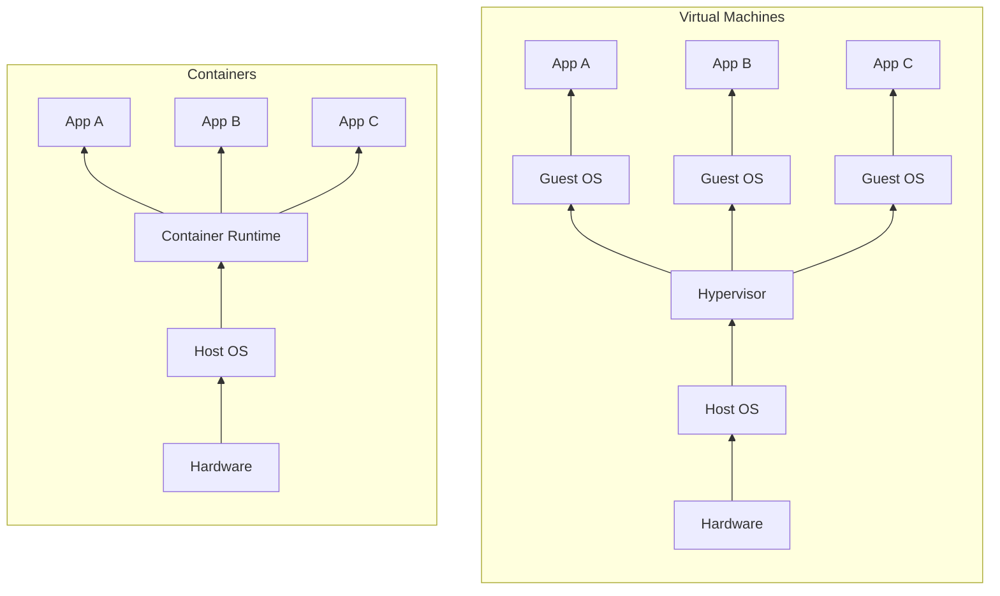
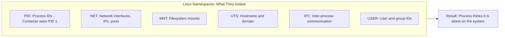
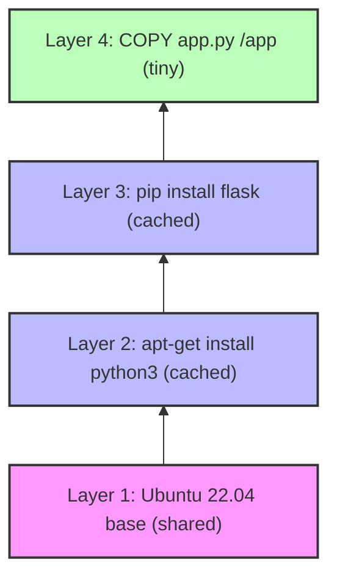
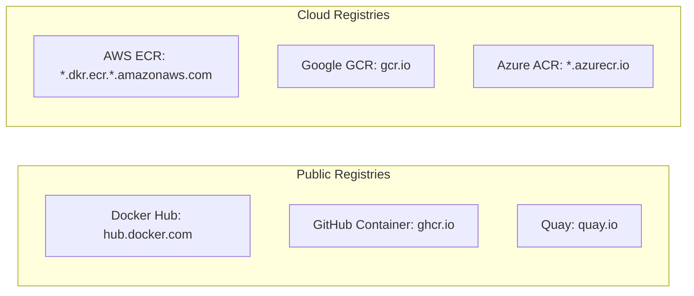

> **Complexity**: `[QUICK]` - Foundational concepts
>
> **Time to Complete**: 30-35 minutes
>
> **Prerequisites**: None

---

## What You'll Be Able to Do

After this module, you will be able to:
- **Explain** what containers are and the specific problem ("works on my machine") they solve
- **Compare** containers to virtual machines and explain when you'd use each
- **Describe** how containers use Linux kernel features (namespaces, cgroups) to isolate applications
- **Predict** what happens when a container is stopped and restarted (what persists, what doesn't)

---

## Why This Module Matters

Containers are the building blocks of modern application deployment. Before you can understand Kubernetes (a container orchestrator), you need to understand what containers are and what problems they solve.

This isn't about memorizing technical details—it's about understanding the "why" that makes everything else make sense.

---

## The Problem Containers Solve

### The Classic Deployment Problem

```
Developer: "It works on my machine!"
Operations: "But it doesn't work in production."
Developer: "My machine has Python 3.9, the right libraries, correct paths..."
Operations: "Production has Python 3.7, different libraries, different paths..."
Everyone: 😤
```

This is the **environment consistency problem**. Applications depend on:
- Operating system version
- Runtime versions (Python, Node, Java)
- Library versions
- Configuration files
- Environment variables
- File paths

When any of these differ between development and production, things break.

### Traditional Solutions (That Didn't Scale)

**Solution 1: Detailed Documentation**
```
README.md:
1. Install Python 3.9.7
2. Run `pip install -r requirements.txt`
3. Set environment variables...
4. Configure paths...
(Nobody reads this. When they do, it's outdated.)
```

**Solution 2: Virtual Machines**
```
Ship the entire operating system:
- Works consistently
- But 10GB+ per application
- Minutes to start
- Heavy resource usage
- Hard to manage at scale
```

### The Container Solution

```
What if we could package:
- The application
- Its dependencies
- Its configuration
- Everything it needs to run

Into a lightweight, portable unit that runs the same everywhere?

That's a container.
```

---

## Containers vs. Virtual Machines



### Key Differences

| Aspect | Virtual Machine | Container |
|--------|-----------------|-----------|
| Size | Gigabytes | Megabytes |
| Startup | Minutes | Seconds |
| OS | Full guest OS per VM | Shared host kernel |
| Isolation | Hardware virtualization | Process isolation |
| Portability | VM image formats vary | Universal container images |
| Density | ~10-20 VMs per server | ~100s of containers per server |

> **Stop and think**: You are tasked with migrating a 15-year-old monolithic application that requires a custom, heavily modified version of the Linux kernel to run properly. Would you choose to containerize this application or run it in a Virtual Machine? (Hint: Think about what containers share vs. what VMs provide).

---

## How Containers Work

> **Stop and think**: If containers aren't virtual machines, how do they isolate applications? A VM creates a completely separate operating system. Containers share the host's OS kernel but trick each process into thinking it has its own filesystem, network, and process tree. The trick is in Linux itself — two kernel features called namespaces (for isolation) and cgroups (for resource limits).

Containers use Linux kernel features to create isolated environments:

### 1. Namespaces (Isolation)

Namespaces make a process think it has its own system:



> **Pause and predict**: Imagine the `NET` (Network) namespace isolation completely failed, but all other namespaces kept working. What specific disaster would happen if you tried to run three separate web server containers on the same host, all configured to listen on port 80?

### 2. Control Groups (Resource Limits)

cgroups limit how much resource a container can use:

```
Container A: max 512MB RAM, 0.5 CPU
Container B: max 1GB RAM, 1 CPU
Container C: max 256MB RAM, 0.25 CPU

Each container is limited, can't starve others
```

### 3. Union Filesystems (Layered Images)

Container images are built in layers:



Benefits:
- Layers are shared between images
- Only changed layers need rebuilding
- Efficient storage and transfer

---

## Container Images and Registries

### What's a Container Image?

A container image is a read-only template containing:
- A minimal operating system (often Alpine Linux, ~5MB)
- Your application code
- Dependencies (libraries, runtimes)
- Configuration

Think of it like a **class** in programming—it's the blueprint.

### What's a Container?

A container is a **running instance** of an image.

Think of it like an **object**—it's the instantiation.

```
Image → Container
(Class → Object)
(Blueprint → Building)
(Recipe → Meal)
```

### Container Registries

Images are stored in registries:



Usage examples:
```bash
docker pull nginx              # From Docker Hub
docker pull gcr.io/project/app # From Google
```

---

## Image Naming

Container images have a specific naming format:

```
[registry/][namespace/]repository[:tag]

Examples:
nginx                           # Docker Hub, library/nginx:latest
nginx:1.25                      # Docker Hub, specific version
mycompany/myapp:v1.0.0         # Docker Hub, custom namespace
gcr.io/myproject/myapp:latest  # Google Container Registry
ghcr.io/username/app:sha-abc123 # GitHub Container Registry
```

### Tags Are Important

```
nginx:latest     # Whatever is newest (unpredictable!)
nginx:1.25       # Specific version (better)
nginx:1.25.3     # Exact version (best for production)

Rule: Never use :latest in production
```

> **War Story**: A startup deployed their database container using `postgres:latest`. It worked flawlessly for six months. One night, the server rebooted, pulling the new `:latest` image—which happened to be a major version upgrade with incompatible file formats. The database refused to start, resulting in 12 hours of downtime while they scrambled to downgrade and recover data. Pin your tags!

---

## Did You Know?

- **Containers aren't new.** Unix had chroot in 1979. FreeBSD Jails came in 2000. Linux Containers (LXC) in 2008. Docker just made it accessible (2013).

- **Most containers use Alpine Linux** as their base. It's only 5MB. Compare to Ubuntu (~70MB) or a full VM (gigabytes).

- **Container images are immutable.** Once built, they never change. This is key to reproducibility.

- **The Docker whale** is named Moby Dock. The whale carries containers (shipping containers) on its back.

---

## Common Misconceptions & Costly Mistakes

| Misconception / Mistake | Reality / Correction |
|-------------------------|----------------------|
| "Containers are lightweight VMs" | Containers share the host kernel. VMs have their own kernel. They are fundamentally different technologies. |
| Treating containers like VMs | SSHing into containers to install updates or tweak configs is an anti-pattern. Containers should be immutable—if you need a change, build a new image. |
| Storing data inside the container | Container filesystems are ephemeral by default. When the container dies, data dies. Always use external volumes for persistent data. |
| "Containers are less secure" | Different threat model, not worse. Properly configured containers are very secure, but running everything as `root` inside a container is a common, dangerous mistake. |

---

## The Analogy: Shipping Containers

> **Pause and predict**: If you write data inside a running container — say, a log file or a database entry — and then the container crashes and restarts, do you think that data survives? This is one of the most important things to understand about containers, and getting it wrong has caused real data loss in production. Containers are *ephemeral* by default — their filesystem is temporary. Anything not stored in a volume disappears when the container dies.

The name "container" comes from shipping containers:

```
Before Shipping Containers (1950s):
- Each product packed differently
- Manual loading/unloading
- Products damaged in transit
- Ships specialized for cargo types
- Slow, expensive, unreliable

After Shipping Containers:
- Standard size for everything
- Automated loading/unloading
- Protected contents
- Any ship can carry any container
- Fast, cheap, reliable

Software Containers:
- Standard format for any application
- Automated deployment
- Protected from environment differences
- Runs anywhere containers run
- Fast, portable, reliable
```

---

## Quiz

1. **Scenario**: A developer's Node.js application works perfectly on their MacOS laptop but crashes on the Ubuntu production server because of a missing C++ compilation library.
   **Question**: How exactly does a container solve this specific issue?
   <details>
   <summary>Answer</summary>
   The container image packages not just the Node.js application code, but also the exact operating system runtime environment (e.g., a specific Debian base) and all system-level dependencies (like the C++ library). Because the container runs the exact same packaged environment on the laptop and the server, the missing library on the host Ubuntu server no longer matters. The application uses the packaged library inside the container, completely ignoring what is installed on the host. This guarantees that if it works on the developer's machine, it will work exactly the same way in production.
   </details>

2. **Scenario**: Your company has merged with another firm and inherited a critical legacy application that only runs on Windows Server 2012. Your infrastructure is entirely Linux-based.
   **Question**: Can you package this Windows application in a standard container and run it on your Linux servers? Why or why not?
   <details>
   <summary>Answer</summary>
   No, you cannot. Containers are not full virtual machines; they inherently share the underlying host operating system's kernel to function. A standard container running on a Linux host relies entirely on the Linux kernel to execute its processes. A Windows application requires a Windows kernel and its specific APIs. To run this legacy application, you would need to either provision a Virtual Machine running a full Windows guest OS, or set up a dedicated Windows server capable of running Windows containers natively.
   </details>

3. **Scenario**: You launch three different web application containers on a single host server. All three applications are hardcoded to listen on port 8080.
   **Question**: Why doesn't the host server throw a "Port already in use" error when the second and third containers start?
   <details>
   <summary>Answer</summary>
   This is due to the Linux `NET` (Network) namespace isolation feature. Each container is provisioned with its own completely isolated network stack, which includes its own virtual IP address and its own independent set of ports. From the perspective of each container, it is the only process running and using port 8080 on its specific isolated network interface. The host machine handles the complexity of routing incoming external traffic to the correct container's internal virtual IP and port, avoiding any conflicts on the host itself.
   </details>

4. **Scenario**: A newly deployed Java application has a severe memory leak. Within minutes, it attempts to allocate 64GB of RAM, which is the entire capacity of the host server.
   **Question**: If this application is running in a properly configured container, what prevents it from crashing the host server, and what Linux feature is responsible?
   <details>
   <summary>Answer</summary>
   The container will be forcefully terminated (OOMKilled - Out Of Memory) by the system before it can consume enough resources to crash the entire host. This protection relies on a Linux kernel feature called `cgroups` (Control Groups). Administrators use cgroups to enforce strict, hard limits on the maximum amount of CPU and memory a specific process or container can consume. By fencing in the memory usage, `cgroups` ensures that a runaway process is killed off, successfully protecting the host operating system and all other containers from resource starvation.
   </details>

5. **Scenario**: An e-commerce site experiences a massive spike in traffic during a flash sale. The single shopping cart container is overwhelmed, and the orchestrator needs to scale up to 10 instances immediately.
   **Question**: Does the system need to build 9 new container images, or launch 9 new containers? Explain the difference.
   <details>
   <summary>Answer</summary>
   The system will instantly launch 9 new containers from the 1 existing container image. A container image serves as a static, immutable, and read-only template or blueprint for your application. A container is simply the running, instantiated object created from that blueprint. Because the underlying image is an immutable template, the container orchestrator can rapidly stamp out as many identical running containers as your underlying hardware can support without needing to rebuild or download the application code again.
   </details>

6. **Scenario**: A junior developer configures a containerized blogging platform to save uploaded user profile pictures directly to the `/var/www/uploads` directory inside the running container. Later that night, the container crashes and is automatically restarted.
   **Question**: What happens to the users' profile pictures, and why?
   <details>
   <summary>Answer</summary>
   The uploaded profile pictures are permanently lost the moment the container crashes. By default, containers are completely ephemeral, meaning any data written to a container's internal, writable filesystem layer only exists for the lifecycle of that specific container instance. When the system restarts the container, a fresh, clean instance is created directly from the original read-only image, discarding all previous state. To ensure data persists across restarts, developers must explicitly configure external storage volumes and mount them into the container's filesystem.
   </details>

7. **Scenario**: You write a deployment script that pulls and runs `my-api:latest`. It works fine on Tuesday. On Thursday, you run the exact same script on a new server, and the application fails to start due to a database schema mismatch.
   **Question**: Assuming the database hasn't changed, what is the most likely cause of this failure?
   <details>
   <summary>Answer</summary>
   The `latest` tag is merely a mutable pointer, and it was highly likely updated to point to a new version of the image by the developers between Tuesday and Thursday. When the script ran on Thursday, it pulled this completely different, newer version of the application code that expected an updated database schema. This scenario directly violates the principle of predictable, repeatable deployments. You should always pin your deployments to specific, immutable version tags (such as `my-api:v1.2.4`) in production environments to mathematically guarantee the exact same code runs every single time.
   </details>

---

## Hands-On Exercise: The Illusion of Isolation

**Task**: Prove that a container is just an isolated process running on your host, not a magical separate machine. 

**Requirements**: A terminal with Docker installed.

**Step 1: Start a long-running container process**
Run a simple Alpine container that sleeps for an hour. Notice we run it in the background (`-d`).
```bash
docker run -d --name isolation-test alpine sleep 3600
```

**Step 2: View the process from inside the container**
Execute a shell command inside the container to list processes.
```bash
docker exec isolation-test ps aux
```
*Observe: The `sleep 3600` process likely has PID (Process ID) 1. It thinks it is the very first process on the entire system.*

**Step 3: Break the illusion (View from the host)**
Now, look for that exact same `sleep 3600` process on your actual host machine.
```bash
ps aux | grep "sleep 3600"
```
*Observe: The process exists on your host! But its PID is NOT 1. It will be a normal, large PID number assigned by your host operating system.*

**Step 4: Prove Ephemerality (The Disappearing Data)**
Create a file inside the running container:
```bash
docker exec isolation-test sh -c "echo 'Important Data' > /secret.txt"
```
Verify it exists:
```bash
docker exec isolation-test cat /secret.txt
```
Now, stop and remove the container, then start a new one with the exact same name:
```bash
docker rm -f isolation-test
docker run -d --name isolation-test alpine sleep 3600
```
Try to read your file again:
```bash
docker exec isolation-test cat /secret.txt
```
*Observe: The file is gone. The new container started fresh from the read-only image.*

**Step 5: Clean up**
```bash
docker rm -f isolation-test
```

### ✅ Success Criteria
- [ ] You verified that the container process believes it is PID 1 (Namespace isolation).
- [ ] You located the exact same process running on your host OS with a different PID (proving it shares the host kernel).
- [ ] You experienced data loss by destroying a container, proving their ephemeral nature.

---

## Summary

Containers solve the environment consistency problem by packaging:
- Application code
- Dependencies
- Configuration
- Everything needed to run

They achieve this through:
- **Namespaces**: Process isolation
- **Control groups**: Resource limits
- **Union filesystems**: Efficient layered images

Containers are:
- **Lightweight**: Megabytes, not gigabytes
- **Fast**: Seconds to start, not minutes
- **Portable**: Run anywhere containers run
- **Immutable**: Built once, unchanged

---

## Next Module

[Module 1.2: Docker Fundamentals](../module-1.2-docker-fundamentals/) - Hands-on with building and running containers.