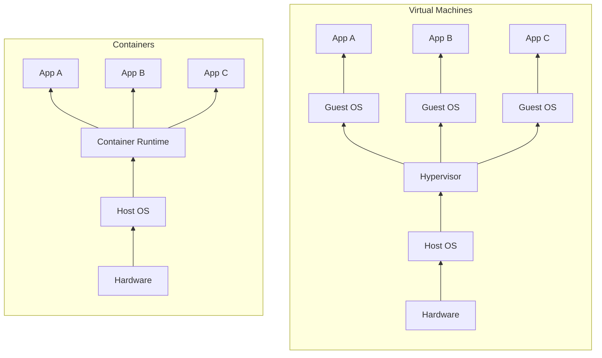
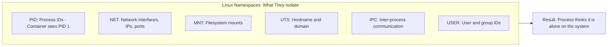
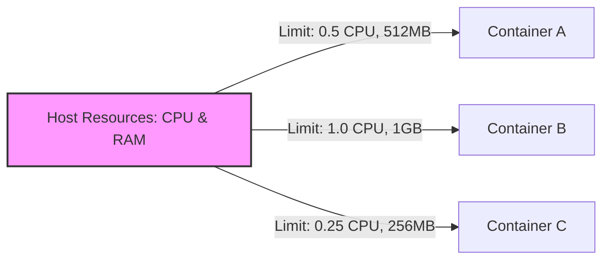
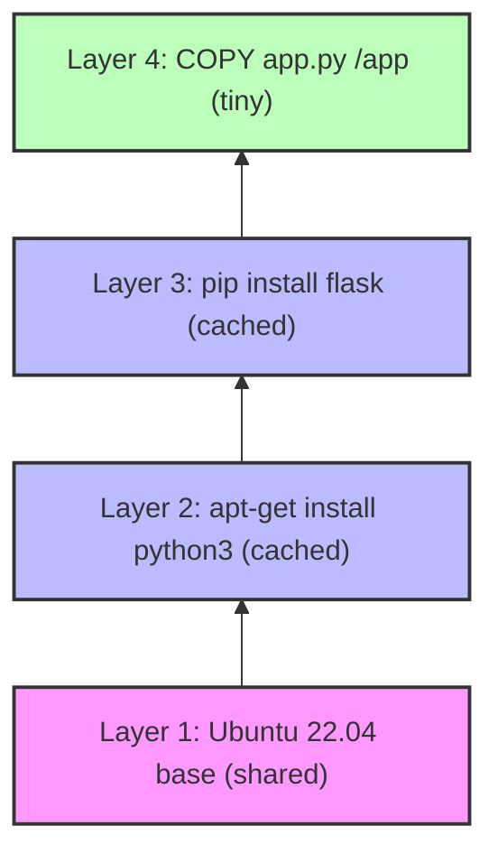
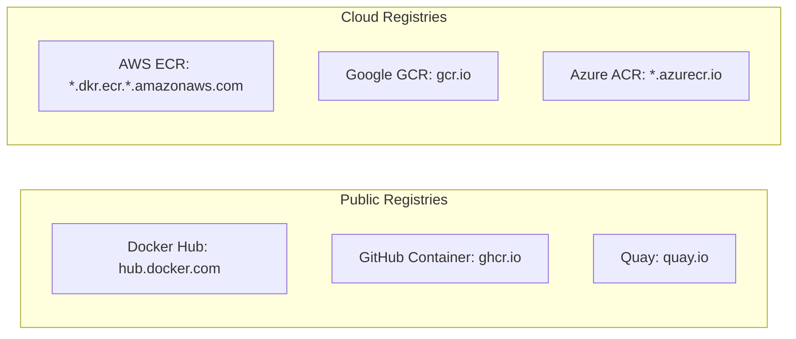

> **Complexity**: `[QUICK]` - Foundational concepts.
>
> **Time to Complete**: 30-35 minutes.
>
> **Prerequisites**: none beyond a terminal for the optional Docker lab and curiosity about why deployment environments drift.

---

## What You'll Be Able to Do

After this module, you will be able to make practical decisions about packaging, isolation, repeatability, and state instead of treating containers as a vague deployment buzzword.

- **Debug** an environment drift failure by separating application code, dependencies, configuration, and host assumptions.
- **Compare** containers with virtual machines and choose the safer packaging model for a given workload.
- **Diagnose** how namespaces, cgroups, and layered filesystems shape container behavior during runtime failures.
- **Evaluate** container image names, registries, and tags for repeatable deployment risk.
- **Design** a simple persistence plan that avoids losing state when a container is replaced.

## Why This Module Matters

At a payments company preparing for a holiday launch, a small Node.js service passed every test on developer laptops and failed only after the release train reached production. The application needed a native library that was present on one engineer's workstation, missing from the production host, and quietly different on the staging machine. The outage window was measured in hours, refunds had to be issued manually, and the postmortem did not blame a single bad line of business logic. It blamed an invisible gap between the application the team thought it had shipped and the environment that actually ran it.

That failure is the reason containers matter before Kubernetes matters. Kubernetes is an orchestrator, which means it schedules, restarts, connects, and scales running containers, but it does not magically make a vague application package precise. If a team cannot explain what is inside a container image, what is borrowed from the host kernel, what disappears when a container is replaced, and what must be pinned for repeatability, Kubernetes turns those misunderstandings into faster-moving production incidents.

This module builds the mental model you will use throughout the cloud native track. You will treat a container as an isolated Linux process with a packaged filesystem, not as a tiny virtual machine or a persistent server. That distinction seems simple, but it explains why containers start quickly, why the same image can run on a laptop and in a cluster, why memory limits matter, why `latest` tags cause surprises, and why storage must be designed deliberately. Later Kubernetes examples assume version 1.35 or newer, and when kubectl appears in those labs you will see the standard shorthand introduced as `alias k=kubectl` before commands use `k`.

## The Problem Containers Solve: Environment Drift

Every useful application depends on more than its source code. It depends on a runtime, system libraries, file paths, environment variables, certificates, startup commands, and small operating-system details that are easy to forget because they sit outside the Git repository. When a developer says, "it works on my machine," they are usually telling the truth, but the statement is incomplete. The application works inside one assembled environment, while production is a different assembled environment with different history.

```text
Developer: "It works on my machine!"
Operations: "But it doesn't work in production."
Developer: "My machine has Python 3.9, the right libraries, correct paths..."
Operations: "Production has Python 3.7, different libraries, different paths..."
Everyone: [Frustrated sigh]
```

The classic response was documentation. A careful team wrote a README that listed every installation step, every package manager command, every environment variable, and every manual tweak needed to prepare a server. That was better than tribal knowledge, but it still relied on humans replaying mutable instructions perfectly against machines that were already drifting. Documentation describes an environment; it does not freeze one.

```text
README.md:
1. Install Python 3.9.7
2. Run `pip install -r requirements.txt`
3. Set environment variables...
4. Configure paths...
(Nobody reads this. When they do, it's outdated.)
```

Virtual machines solved a larger slice of the problem by packaging an entire guest operating system with the application. That gave teams a repeatable server image, strong isolation, and a way to carry custom OS assumptions forward. The tradeoff was weight. A VM image can be large, slow to start, and expensive to multiply across many small services, especially when each service needs only a process, a runtime, and a few libraries rather than a whole independent operating system.

```text
Ship the entire operating system:
- Works consistently
- But 10GB+ per application
- Minutes to start
- Heavy resource usage
- Hard to manage at scale
```

Containers were the practical middle path. Instead of shipping the whole computer, a container image packages the application and the user-space pieces it needs, then runs that package as an isolated process on a shared host kernel. The host still provides the Linux kernel, device access, and low-level scheduling, but the application sees its own filesystem, process tree, network view, and resource boundaries. The result is lighter than a VM and more precise than a README.

```text
What if we could package:
- The application
- Its dependencies
- Its configuration
- Everything it needs to run

Into a lightweight, portable unit that runs the same everywhere?

That's a container.
```

The practical difference is ownership. Without containers, production often owns the runtime environment and application teams negotiate against it. With containers, the application package declares its own runtime, dependencies, and startup command, while the platform provides a compatible kernel and runtime. That boundary does not remove operational responsibility, but it gives both sides a clearer contract: the image says what to run, and the platform decides where and under what limits it can run.

Pause and predict: if a Python service uses a native library installed on the developer laptop but not on the production host, what should change when the service is packaged as a container image? The correct expectation is not that the host suddenly becomes cleaner. The important change is that the service now carries the needed user-space dependency inside the image, so the host's missing package is no longer part of the runtime contract.

This contract is especially useful for teams that deploy many small services. A platform team cannot safely hand-tune every server for every application version, and an application team cannot debug every production host by memory. Containers make the application artifact more complete, which lets automation do repeatable work. A scheduler can pull an image, start a process, enforce limits, restart a failed instance, and repeat the same action across hundreds of machines without reinterpreting a setup guide.

Another way to say this is that containers move deployment knowledge from a human checklist into a machine-readable artifact. The difference is not merely convenience. A checklist can be skipped, interpreted differently, or applied to a server that already has old packages installed. An image records the filesystem and startup metadata that the runtime will use, so the deployment system has a concrete object to fetch, verify, cache, and run.

That machine-readable artifact also changes how teams investigate failures. Instead of asking whether the staging host had the same Python patch level as production, the team can ask which image digest was running in each environment. Instead of comparing manual setup histories, they compare artifacts and runtime settings. This does not make all failures easy, but it removes a whole class of guesswork from the first hour of incident response.

## Containers vs. Virtual Machines

The shortest useful comparison is this: a virtual machine virtualizes hardware and runs its own operating-system kernel, while a container isolates processes that share the host kernel. That difference explains nearly every operational tradeoff. VMs are heavier but can carry a different kernel and provide hardware-level isolation. Containers are lighter but assume kernel compatibility with the host. Neither is universally better; each solves a different packaging and isolation problem.



The diagram shows why startup time and density differ. A VM boots a guest OS before the application can run, so it carries kernel initialization, device models, background services, and a larger image. A container runtime starts a process with isolation already provided by the host kernel, so startup can feel close to launching any other Linux process. That speed matters when a scheduler replaces failed instances or adds capacity during a traffic spike.

| Aspect | Virtual Machine | Container |
|--------|-----------------|-----------|
| Size | Gigabytes | Megabytes |
| Startup | Minutes | Seconds |
| OS | Full guest OS per VM | Shared host kernel |
| Isolation | Hardware virtualization | Process isolation |
| Portability | VM image formats vary | Universal container images |
| Density | ~10-20 VMs per server | ~100s of containers per server |

The table should not be read as a scoreboard where every smaller number wins. Hardware virtualization is the right tool when a workload requires a different operating system kernel, custom kernel modules, or a stronger isolation boundary between tenants. A legacy Windows Server application does not become Linux-compatible because it is packaged in a Linux container. If it needs Windows kernel behavior, it needs a Windows environment, usually a VM or a Windows container on a Windows host.

Containers fit modern services that can share the host kernel and benefit from rapid replacement. A stateless API, background worker, queue consumer, or web frontend usually needs a predictable runtime more than it needs its own guest OS. That is why containers became the default unit for Kubernetes: the cluster can treat applications as disposable, repeatable processes instead of long-lived pets that must be patched and tuned in place.

There is still a security tradeoff. A VM boundary is not invulnerable, but it is a different boundary from a container namespace and cgroup boundary. If a container breakout vulnerability appears in the kernel or runtime, multiple containers on the same host may be in scope. Sensible teams respond by combining controls: minimal images, non-root users, read-only filesystems where possible, runtime profiles, frequent patching, and separate nodes for workloads with different trust levels.

Which approach would you choose here and why: a 15-year-old monolith requires a custom Linux kernel patch, while a new Go API only needs a CA bundle and a configuration file? The monolith is a VM candidate because the kernel assumption is part of the workload. The Go API is a container candidate because its dependencies live comfortably in user space and it benefits from fast, repeatable replacement.

A useful operational test is to ask where the workload's weirdness lives. If the weirdness is in kernel behavior, device access, or a proprietary operating-system dependency, a VM may be the honest package. If the weirdness is in user-space libraries, language runtimes, files, and environment variables, a container is usually a cleaner package. Teams get into trouble when they choose containers because they are fashionable rather than because the workload's assumptions fit the container boundary.

Cost also needs a precise definition. Containers can improve density because many isolated processes share one kernel, but the platform still needs CPU, memory, storage, network bandwidth, logging, monitoring, and patching. A node packed with containers is still a node that can fail. Container density is valuable only when the team also designs limits, health checks, rollout strategy, and failure isolation around that density.

## How Containers Work: Isolation, Limits, and Layers

A container feels like a small machine because the process inside it sees a filtered view of the system. That feeling is useful, but it is also where many beginner mistakes begin. The container is not booting a private Linux kernel. It is a normal process, or a small group of processes, launched with kernel features that give it private names for things like process IDs, network interfaces, mounts, hostnames, and users.

Namespaces provide that private view. A process namespace can make a containerized process appear to be PID 1 inside the container even though the host sees it as a regular process with a regular host PID. A network namespace gives the container its own interfaces, routes, and port space. A mount namespace gives it a filesystem view assembled from image layers and runtime mounts. The application is not alone on the machine, but it is given a convincing local view.



The network namespace example makes the idea concrete. Three containers can each run a web server listening on port 8080 because each container has its own network namespace. Inside each namespace, the port is available. The host or orchestrator then decides which container ports are published, proxied, or connected to a service network. If every process shared the host network namespace by default, the second web server would collide with the first.

Pause and predict: imagine the `NET` namespace isolation failed while the other namespaces kept working. Three web server containers all try to listen on the same port, and only one can bind successfully on the shared host network stack. The failure would look like an ordinary "port already in use" error, but the root cause would be that the platform lost the network illusion containers rely on.

Resource limits come from control groups, usually called cgroups. Namespaces decide what a process can see. Cgroups decide how much CPU, memory, and other resources the process group can consume. This matters because isolation without limits is only a partial defense. A runaway memory leak in one application should not be allowed to starve the database, the node agent, or unrelated containers on the same host.



Cgroups also explain why Kubernetes resource requests and limits are more than scheduling decoration. A memory limit becomes an enforcement boundary, and a container that exceeds it can be killed rather than taking down the node. A CPU limit affects scheduling and throttling behavior. The exact mechanics differ by runtime and cgroup version, but the operational lesson is stable: a container is not inherently polite. You must give the platform enough information to protect neighboring workloads.

The third major idea is the layered filesystem. A container image is built from layers, and each layer records filesystem changes from a build step. Layers can be cached, shared, downloaded once, and reused by many images. When a container starts, the runtime gives it a writable layer on top of the read-only image layers. That writable layer belongs to the container instance, not to the image blueprint.



Layering is why image build order affects performance. If the dependency installation layer changes rarely, it can be reused while small application code changes rebuild only the top layer. If a Dockerfile copies the entire source tree before installing dependencies, a one-line code change may invalidate expensive dependency layers. Even before writing Dockerfiles in the next module, you should recognize layers as a storage, transfer, and build-cache mechanism rather than as a decorative implementation detail.

A useful war story ties these three ideas together. A Java service with a memory leak looked stable in staging because staging had little traffic and no memory limit. In production, the same leak expanded until the host began reclaiming memory aggressively and unrelated services slowed down. After the service was run with a real memory limit, it failed faster and more visibly, but the node survived. That was progress: a contained failure is easier to diagnose than a host-wide brownout.

The container runtime is the component that applies these kernel features and starts the process. Docker made the workflow famous, but the broader ecosystem includes containerd, CRI-O, and OCI specifications that define image and runtime expectations. Kubernetes talks to container runtimes through the Container Runtime Interface, which is why you can learn the container model once and then apply it across different cluster implementations. The names change, but the image, process, namespace, cgroup, and filesystem ideas remain the foundation.

This is also why container debugging often begins by translating a symptom back to ordinary Linux behavior. A permission error may be a user ID, mount, or read-only filesystem issue. A connectivity problem may be a namespace, route, DNS, or port-publishing issue. A sudden restart may be an out-of-memory kill caused by a cgroup limit. Containers add packaging and isolation, but they do not repeal the operating-system rules underneath.

One more detail matters before Kubernetes enters the story: container replacement is normal, not exceptional. The platform is expected to stop old instances and start new ones during rollouts, scaling events, node maintenance, and failure recovery. If the process can only survive by keeping hidden state in its writable layer, the container model will punish that design. If the process can reconstruct itself from image, configuration, and durable services, replacement becomes a routine operation.

## Images, Containers, Registries, and Tags

A container image is a read-only template that contains the filesystem and metadata needed to start a container. It usually includes application code, a runtime, libraries, certificates, default environment values, and a command. A container is a running instance created from that template. The programming analogy is not perfect, but it is useful: an image is like a class or blueprint, while a container is like an object or constructed building.

```text
Image → Container
(Class → Object)
(Blueprint → Building)
(Recipe → Meal)
```

The distinction matters during scaling. If an ecommerce site needs more cart service capacity, the orchestrator does not build new images for each new instance. It starts more containers from an existing image. Building is a supply-chain activity, usually done by CI. Running is a scheduling activity, usually done by a runtime or orchestrator. Confusing those stages leads to slow deployments, unreproducible rollbacks, and mystery differences between instances.

Registries are where images are stored and discovered. Public registries such as Docker Hub are convenient for base images and open-source software. Cloud registries such as ECR, Artifact Registry, and Azure Container Registry are common for private application images near the compute platform. GitHub Container Registry and Quay are also common in open-source and enterprise workflows. The registry is not the runtime; it is the distribution point.



Pulling an image downloads the referenced layers and metadata to a machine that can run containers. These examples are intentionally simple because the next module goes deeper into Docker commands. The important idea is that a pull resolves an image reference, downloads missing content, and prepares the runtime to create containers from that content. A successful pull does not mean the application is healthy; it means the image artifact was retrieved.

```bash
docker pull nginx              # From Docker Hub
docker pull gcr.io/project/app # From Google
```

Image references carry a specific structure. The registry portion is optional because Docker Hub is the default in many tools. A namespace or organization may be present. The repository identifies the image name, and the tag identifies a named version or channel. The danger is that tags are not guaranteed to be immutable unless your registry policy enforces it. A tag is a pointer, and pointers can move.

```text
[registry/][namespace/]repository[:tag]

Examples:
nginx                           # Docker Hub, library/nginx:latest
nginx:1.25                      # Docker Hub, specific version
mycompany/myapp:v1.0.0         # Docker Hub, custom namespace
gcr.io/myproject/myapp:latest  # Google Container Registry
ghcr.io/username/app:sha-abc123 # GitHub Container Registry
```

Production deployments should avoid mutable tags like `latest` because they hide change. Running the same script on Monday and Thursday can produce different software if the tag was retargeted between runs. A version tag is better, and an image digest is stronger because the digest identifies content rather than a human-readable label. As you advance, you will see Kubernetes manifests that pin images carefully so a rollout can be audited and repeated.

```text
nginx:latest     # Whatever is newest (unpredictable!)
nginx:1.25       # Specific version (better)
nginx:1.25.3     # Exact version (best for production)

Rule: Never use :latest in production
```

A startup learned this the painful way after running `postgres:latest` for months. The container started cleanly after each routine restart until a host reboot pulled a newer major image with incompatible expectations for the data directory. The database refused to start, recovery required downgrading and careful data handling, and the team lost most of a night to a deployment choice that had looked harmless. Pinning tags is not bureaucracy; it is how you make time behave.

Before running this in your own environment, what output would you expect if you pulled `nginx:1.25` twice in a row? The second pull should reuse layers already present locally unless the registry metadata has changed. That small observation previews a major operational benefit: layered images make repeated deployments cheaper because unchanged content does not need to move again.

Image naming also becomes a supply-chain control. A registry path can tell you who owns the artifact, a tag can tell you the intended release channel, and a digest can tell you the exact content. Mature teams use all three pieces deliberately. They avoid ambiguous image names, restrict who can push production repositories, scan images before promotion, and record the image reference used in each deployment so an incident can be traced to a precise artifact.

There is a social benefit too. When application teams and platform teams argue about a deployment, an image reference gives them a shared object to inspect. The application team can reproduce the artifact locally, while the platform team can inspect pull events, runtime settings, and node placement. Without that shared object, conversations drift back toward assumptions about which branch, package cache, or server setup was involved. Containers are not just technology; they are a coordination tool.

## The Shipping-Container Analogy and Ephemeral State

The word "container" comes from shipping containers because the software idea borrows the same standardization story. Before standardized cargo containers, freight handling was slow, fragile, and custom. Different goods needed different packing, ports needed specialized labor, and moving cargo between ship, rail, and truck involved repeated manual handling. Standard containers did not make cargo simple, but they made the interface around cargo predictable.

```text
Before Shipping Containers (1950s):
- Each product packed differently
- Manual loading/unloading
- Products damaged in transit
- Ships specialized for cargo types
- Slow, expensive, unreliable

After Shipping Containers:
- Standard size for everything
- Automated loading/unloading
- Protected contents
- Any ship can carry any container
- Fast, cheap, reliable

Software Containers:
- Standard format for any application
- Automated deployment
- Protected from environment differences
- Runs anywhere containers run
- Fast, portable, reliable
```

The analogy is powerful only if you keep its limits in mind. A shipping container standardizes the outside shape and handling equipment, not the value or fragility of what is inside. A software container standardizes packaging and runtime assumptions, not application correctness, schema design, or security posture. You can ship a broken application inside a flawless image just as easily as you can ship damaged goods in a strong steel box.

The most important limit for beginners is persistence. A running container usually has a writable layer, but that layer belongs to that particular container instance. If the instance is removed and replaced, data written only to that layer is gone. This behavior is not a bug; it is what makes containers replaceable. The image remains clean, and a new container starts from the same known template.

Pause and predict: if you write a log file or uploaded profile picture inside a running container and then remove the container, should the data survive? The safest answer is no unless you deliberately wrote it to external storage or a mounted volume. The container's internal filesystem is convenient scratch space, not a persistence plan. Many real outages begin with someone treating it like a small durable server disk.

This is where the container mental model becomes operational rather than philosophical. Stateless processes are easy to replace because their important state lives elsewhere, such as in a database, queue, object store, or mounted volume. Stateful systems can run in containers, but they need explicit storage design, backup strategy, and careful lifecycle management. Kubernetes does not change that law; it gives you primitives such as volumes and StatefulSets, which still require correct design.

A practical engineering habit is to ask, "What must survive replacement?" before choosing where data goes. Application binaries, libraries, and default configuration belong in the image. Temporary cache files may belong in the container filesystem if they can be rebuilt. User uploads, database files, message queues, and audit logs need external persistence. Once you sort data by replacement tolerance, the container lifecycle becomes much less mysterious.

Designing persistence is not the same as refusing containers for stateful workloads. Databases and queues can run in containers when their storage, identity, backup, and recovery rules are designed carefully. The beginner mistake is running stateful software as if the container's writable layer were a durable disk. The professional approach is to separate the process package from the data lifecycle, then decide which platform primitives are responsible for each part.

This separation also helps during local development. A developer may destroy and recreate an application container many times while keeping a local database volume for test data, or they may deliberately remove the volume to reset the environment. Both choices are valid when they are explicit. The danger is not ephemerality itself; the danger is accidental ephemerality where important data disappears because nobody named the boundary.

## Patterns & Anti-Patterns

Good container practice begins with treating images as immutable release artifacts. Build an image once in CI, scan it, tag it clearly, and promote that same artifact across environments. Do not rebuild "the same version" separately for dev, staging, and production because those builds may capture different base images or dependency versions. Promotion should move a known artifact forward, not recreate it and hope it matches.

A second pattern is keeping containers focused on one primary process. This does not mean a container can never have helper processes, but it should have one clear responsibility, one lifecycle, and one health model. When a container behaves like a small general-purpose server with several unrelated daemons, restart behavior becomes confusing. A clean container should be easy to start, stop, observe, and replace.

A third pattern is making state explicit. If data matters, put it in a volume, managed database, object store, or another durable system with a recovery plan. If data does not matter, allow it to disappear and document that expectation. Ambiguity is the risky middle ground, because engineers may assume a file is durable simply because it was visible during a shell session inside a running container.

The common anti-pattern is treating containers like VMs. Teams SSH or exec into a running container, install packages by hand, edit configuration files, and then feel surprised when replacement erases the changes. That habit is understandable because many engineers learned operations on long-lived servers. In container operations, the better response is to modify the image build or deployment configuration, then roll out a new container instance.

Another anti-pattern is trusting defaults as if they were production policy. Default tags, root users, unbounded resources, broad filesystem write access, and missing health checks may all work during a demo. Production turns those defaults into risk because the container is now part of a larger scheduling and failure-recovery system. Defaults are starting points for learning, not proof that a workload is ready.

The final anti-pattern is pretending containers remove the need to understand Linux. Containers hide many details, but the failure modes still come from processes, filesystems, networking, permissions, and kernel resource enforcement. When a container cannot bind a port, cannot write a file, gets killed for memory, or cannot resolve a name, the diagnosis is often a Linux diagnosis through a container lens.

Patterns also become more important as teams move from Docker on one laptop to Kubernetes across many nodes. A weak local habit can become a fleet-wide incident when automation repeats it quickly. Mutable tags, missing limits, root containers, and hidden writable state may all seem harmless in one manual test. In a scheduler, those choices are multiplied across rollouts, restarts, and scale events, so the cost of ambiguity rises sharply.

## When You'd Use This vs Alternatives

Use a container when the workload can share the host kernel, starts from a repeatable user-space package, and benefits from fast replacement. This is the default for most web APIs, workers, scheduled jobs, sidecars, and development environments. The stronger the need for automated rollout and horizontal scaling, the more valuable the container packaging model becomes.

Use a virtual machine when the workload needs a different operating-system kernel, specialized kernel behavior, or a stronger isolation boundary than process isolation provides. VMs also remain useful when a team must run old software with server-level assumptions that would be expensive to untangle immediately. A VM can be a pragmatic bridge while the application is modernized gradually.

Use direct host installation when the software is part of the host itself or when containerizing it would obscure more than it helps. Low-level agents, storage drivers, node bootstrapping tools, and some hardware integrations may need direct host access. Even then, teams often package the surrounding management plane in containers while leaving the host component installed by the operating system or configuration management.

For a quick decision, ask four questions in order. Does the workload require a different kernel? If yes, prefer a VM. Does its important data survive process replacement somewhere explicit? If no, design storage before containerizing. Does it need fast repeatable rollout across environments? If yes, containers fit well. Does it require direct host control? If yes, containerize only the parts that can tolerate the boundary.

The decision is rarely permanent. A team may start by putting a legacy application in a VM, extract a stateless API into containers, and later redesign storage so more components can move into Kubernetes. That staged approach is healthier than forcing every workload through the same packaging model at once. The goal is not to maximize container count; the goal is to make each workload's assumptions visible enough that operations can be automated safely.

When you apply this framework in a real design review, listen for hidden lifecycle words. "Install," "patch," "tune," and "log in to fix" often describe server thinking, while "build," "promote," "replace," and "roll back" describe artifact thinking. Neither vocabulary is morally superior, but mixing them without noticing creates confusion. If the team says it wants containers yet also expects manual changes inside running instances, pause the design and clarify which parts belong in the image, which parts belong in configuration, and which parts belong in persistent services. That conversation is cheaper before the first deployment than during an incident.

The same vocabulary check helps during reviews of learning labs. A command that creates a disposable process should be safe to repeat, while a command that creates durable data should name where that data lives. Beginners build confidence faster when the exercise makes that boundary visible instead of hiding it behind successful output.

## Did You Know?

- **Containers are older than Docker.** Unix had chroot in 1979, FreeBSD Jails arrived in 2000, Linux Containers appeared in 2008, and Docker made the workflow approachable in 2013.
- **Alpine Linux is tiny by design.** A minimal Alpine base image is commonly only a few megabytes, while a general Ubuntu base is much larger and a full VM image can be measured in gigabytes.
- **Container images are intended to be immutable release artifacts.** Once an image is built and identified by digest, changing behavior should mean building a new image rather than editing a running container by hand.
- **The Docker whale is named Moby Dock.** The mascot works because the metaphor connects software containers to standardized shipping containers carried across different transport systems.

## Common Mistakes

| Mistake | Why It Happens | How to Fix It |
|---------|----------------|---------------|
| Calling containers "lightweight VMs" | The container shell feels like a small server, so beginners assume there is a private kernel inside. | Teach the shared-kernel model explicitly and reserve VMs for workloads that need a separate operating system. |
| Treating running containers like pets | Engineers are used to SSHing into servers, installing packages, and preserving manual fixes. | Rebuild the image or change deployment configuration, then replace the container instead of mutating it. |
| Storing durable data inside the container filesystem | Files appear to persist during one running instance, which hides the replacement boundary. | Mount a volume or use an external durable service for data that must survive container removal. |
| Deploying `:latest` in production | The tag is convenient during demos and local experiments, but it is a moving pointer. | Pin a version tag or digest, and promote the same image artifact through environments. |
| Running everything as root | Many base images default to root because it avoids early permission friction. | Create a non-root user where practical and grant only the filesystem and network privileges the process needs. |
| Skipping resource limits | Small tests do not reveal what happens when traffic, leaks, or batch jobs consume the node. | Set memory and CPU boundaries appropriate to the workload, then observe throttling and kill behavior under load. |
| Assuming containers are automatically secure | The packaging boundary feels strong, but vulnerable images, broad permissions, and old kernels still matter. | Patch base images, scan dependencies, reduce privileges, and keep the host runtime updated. |

## Quiz

<details>
<summary>Your team's Node.js application works on a macOS laptop but fails on Ubuntu because a native C++ library is missing. What should containerization change, and what should it not promise?</summary>

A correct container image should package the application with the needed user-space runtime and library so the production host no longer needs that exact library installed globally. The container does not make macOS and Linux kernels interchangeable, and it does not remove the need to build for the target architecture and operating-system family. The win is that the runtime contract becomes part of the image artifact instead of a manual server setup assumption. If the image works in one compatible runtime, the same image should behave consistently in another compatible runtime.
</details>

<details>
<summary>A legacy accounting application requires Windows Server kernel APIs, but your servers run Linux. Should you choose a standard Linux container or a VM?</summary>

Choose a VM, or another environment that provides the Windows kernel APIs the application requires. A Linux container shares the Linux host kernel, so it cannot satisfy a workload whose core assumption is a Windows kernel. This is the practical boundary between containers and VMs: containers package user space around a shared kernel, while VMs can carry a different guest operating system. Containerizing the application without addressing the kernel requirement would only move the failure into a different package.
</details>

<details>
<summary>Three web containers each listen on port 8080, and all start successfully on the same host. What isolation feature explains that result?</summary>

Network namespaces explain why the containers can each use the same internal port without colliding. Each container has its own view of network interfaces, routes, and port bindings, so port 8080 inside one namespace is distinct from port 8080 inside another. The host or orchestrator can then map, proxy, or route external traffic to the intended container. If the containers all shared the host network namespace by default, only the first bind would succeed.
</details>

<details>
<summary>A Java service leaks memory until it tries to consume the whole host. What container mechanism limits the blast radius, and what failure should you expect?</summary>

Cgroups limit the memory available to the container's process group when a memory limit is configured. If the process exceeds that boundary, the runtime or kernel can terminate it instead of allowing it to starve the entire host. In Kubernetes, this often appears as an out-of-memory kill for the container, followed by restart behavior depending on the pod policy. That is still a service failure, but it is a contained service failure rather than a node-wide collapse.
</details>

<details>
<summary>During a flash sale, an orchestrator scales one cart service to ten running instances. Does it need nine new images or nine new containers?</summary>

It needs nine new containers from the existing image, assuming the image is already built and available. The image is the immutable template produced by the build pipeline, while containers are running instances created from that template. This separation is why containers are useful for rapid scaling: the platform can stamp out more identical processes without rebuilding the application. If each scale event required a new image build, deployment speed and repeatability would collapse.
</details>

<details>
<summary>A blogging platform saves uploaded profile photos under `/var/www/uploads` inside the running container, then the container is removed and recreated. What happened to the photos?</summary>

The photos are gone unless that path was backed by a mounted volume or another external storage system. The container's writable layer belongs to the specific container instance, and removing the instance discards that layer. A newly created container starts from the image again, which contains only what was built into the image. Durable user uploads must be stored outside the disposable container filesystem.
</details>

<details>
<summary>A deployment script pulls `my-api:latest` on Tuesday and succeeds, then pulls the same reference on Thursday and fails with a schema mismatch. What is the most likely packaging problem?</summary>

The `latest` tag probably moved to a different image between Tuesday and Thursday. Tags are human-readable pointers, and unless the registry enforces immutability, they can be retargeted to new content. The script looked repeatable because the text was the same, but the artifact behind the text changed. Pinning a version tag or digest gives the deployment a stable reference that can be audited and rolled back.
</details>

## Hands-On Exercise: The Illusion of Isolation

This lab proves that a container is an isolated process, not a magical separate machine. You will start a long-running Alpine container, inspect its process view from inside, compare that with the host view, and then destroy data written only to the container filesystem. The exercise is intentionally small because the goal is not Docker fluency yet. The goal is to make the core mental model visible.

Requirements: use a terminal with Docker installed. On a native Linux host, the process comparison is direct. On macOS or Windows with Docker Desktop, Docker runs a hidden Linux VM, so the host-process observation happens inside that VM rather than on the native desktop operating system. That difference is itself a useful reminder that containers share a compatible kernel somewhere.

**Task 1: Start a long-running container process.** Run a simple Alpine container that sleeps for an hour. The `-d` flag starts it in the background so your terminal returns immediately while the process keeps running.

```bash
docker run -d --name isolation-test alpine sleep 3600
```

Verify the container is running by checking the container list for the name you just assigned to this specific lab process.

```bash
docker ps | grep isolation-test
```

<details>
<summary>Solution notes for Task 1</summary>

You should see a running container named `isolation-test`. If Docker reports that the name is already in use, remove the old container with the cleanup command at the end of the lab and run the task again. At this point you have not created a VM manually; you have asked the container runtime to start one isolated process from the Alpine image.
</details>

**Task 2: View the process from inside the container.** Execute a shell command inside the container to list processes. The key observation is that the sleep process appears to be PID 1 from inside the container's process namespace.

```bash
docker exec isolation-test ps aux
```

<details>
<summary>Solution notes for Task 2</summary>

The process list should be very small, and `sleep 3600` will likely appear as PID 1. That does not mean it is the first process on the physical host. It means the PID namespace presents a private numbering view to the containerized process, which is exactly the isolation concept from the core lesson.
</details>

**Task 3: Break the illusion from the host view.** Now look for the same sleep process on the host. On native Linux, the host will show the process with a different PID because the host is seeing through the namespace boundary.

```bash
ps aux | grep "sleep 3600"
```

<details>
<summary>Solution notes for Task 3</summary>

On native Linux, the process should exist on the host with a normal host PID rather than PID 1. On Docker Desktop, you may not see it from the macOS or Windows host because the compatible Linux kernel is inside Docker's managed VM. In either case, the result supports the same lesson: containers require a Linux process environment, and the apparent machine boundary is built from isolation features.
</details>

**Task 4: Prove ephemerality by losing disposable data.** Create a file inside the running container, verify it exists, then remove and recreate the container with the same name. You are deliberately writing to the container's own filesystem, not to a mounted volume.

```bash
docker exec isolation-test sh -c "echo 'Important Data' > /secret.txt"
```

Verify it exists before removing the container so you can separate successful file creation from the later replacement behavior.

```bash
docker exec isolation-test cat /secret.txt
```

Now stop and remove the container, then start a new one with the exact same name so the replacement boundary is impossible to miss.

```bash
docker rm -f isolation-test
docker run -d --name isolation-test alpine sleep 3600
```

Try to read your file again from the new instance, and connect the expected failure back to the writable container layer.

```bash
docker exec isolation-test cat /secret.txt
```

<details>
<summary>Solution notes for Task 4</summary>

The final read should fail because the new container started from the original Alpine image and did not inherit the removed container's writable layer. This is the same reason uploaded user files, database files, and manual package installs disappear when they live only inside a disposable container instance. If the data matters, it needs a volume or an external durable service.
</details>

**Task 5: Clean up.** Remove the lab container after the evidence is collected so the next experiment starts from a known state instead of inheriting a leftover name.

```bash
docker rm -f isolation-test
```

<details>
<summary>Solution notes for Task 5</summary>

The cleanup command is safe to run even if the container is already stopped because `-f` asks Docker to remove it forcefully. A clean lab environment matters because repeated experiments become confusing when old containers, names, or filesystem layers remain. The habit is the same one you will use later with Kubernetes resources: create deliberately, inspect deliberately, and clean up deliberately.
</details>

### Success Criteria

- [ ] You verified that the container process believes it is PID 1 because of namespace isolation.
- [ ] You located the same process from the host or explained why Docker Desktop hides it inside a Linux VM.
- [ ] You removed a container and observed that data written only inside it disappeared.
- [ ] You can explain the difference between an image, a container, and a writable container layer.
- [ ] You designed a simple persistence plan for data that must avoid losing state when a container is replaced.

## Sources

- [Docker Docs: What is a container?](https://docs.docker.com/get-started/docker-concepts/the-basics/what-is-a-container/)
- [Docker Docs: Understanding image layers](https://docs.docker.com/get-started/docker-concepts/building-images/understanding-image-layers/)
- [Docker CLI: docker container run](https://docs.docker.com/reference/cli/docker/container/run/)
- [Docker CLI: docker container exec](https://docs.docker.com/reference/cli/docker/container/exec/)
- [Docker CLI: docker image pull](https://docs.docker.com/reference/cli/docker/image/pull/)
- [Open Container Initiative](https://opencontainers.org/)
- [OCI Image Format Specification](https://github.com/opencontainers/image-spec)
- [OCI Runtime Specification](https://github.com/opencontainers/runtime-spec)
- [Kubernetes Docs: Containers](https://kubernetes.io/docs/concepts/containers/)
- [Kubernetes Docs: Resource management for pods and containers](https://kubernetes.io/docs/concepts/configuration/manage-resources-containers/)
- [Linux man-pages: namespaces](https://man7.org/linux/man-pages/man7/namespaces.7.html)
- [Linux Kernel Docs: Control Group v2](https://docs.kernel.org/admin-guide/cgroup-v2.html)

## Next Module

[Module 1.2: Docker Fundamentals](../module-1.2-docker-fundamentals/) - Next you will build and run containers directly so the image, container, layer, and tag concepts become commands you can inspect.
