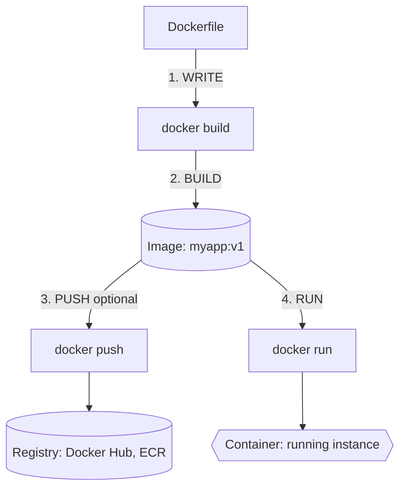
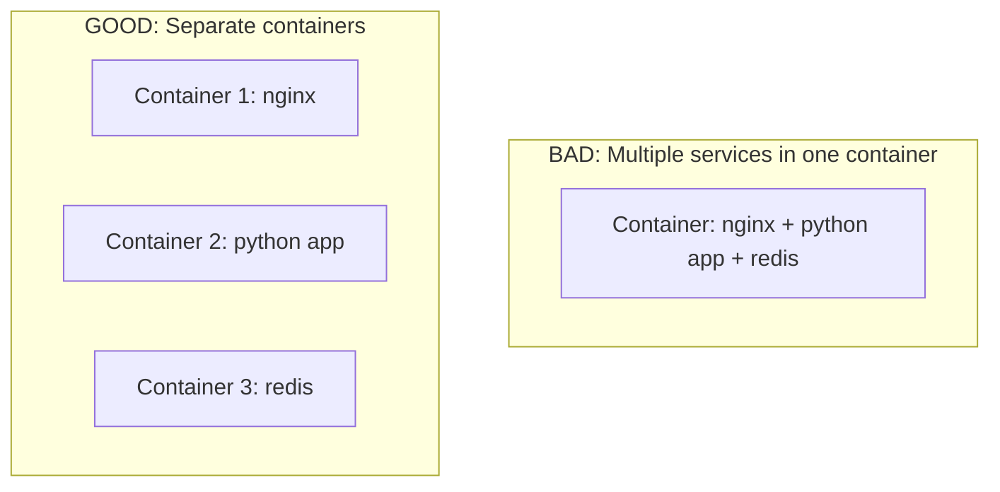

# Module 1.2: Docker Fundamentals

> **Complexity**: `[MEDIUM]` - Hands-on practice required
>
> **Time to Complete**: 50-60 minutes
>
> **Prerequisites**: Module 1.1: What Are Containers?
>
> **Environment**: A workstation with Docker Engine or Docker Desktop, a terminal, and permission to run local containers.

## What You'll Be Able to Do

By the end of this module, you will be able to perform these tasks in a local terminal and explain the operational reason behind each step:

- **Build** a Docker image from a Dockerfile and explain how each instruction affects the final artifact.
- **Run** containers with port mapping, environment variables, named containers, and persistent volume mounts.
- **Debug** a failing container by combining logs, process inspection, exec sessions, and configuration checks.
- **Evaluate** image layer ordering, base image choice, and runtime user settings for speed and security.
- **Compare** Docker Compose workflows with the Kubernetes 1.35+ mental model you will use later in the track.

## Why This Module Matters

In 2017, Equifax disclosed a breach that exposed sensitive data for roughly 143 million people after attackers exploited an unpatched web application component. The incident was not a Docker story, but it is the kind of operational failure containers make painfully visible: an application runs with too much privilege, ships with too much surface area, hides its exact dependency state, and gives responders too little confidence about what is actually deployed. When teams package software into images without understanding build context, layer history, tags, runtime users, and logs, they reproduce those same failure patterns inside a newer delivery pipeline.

Docker became popular because it gave developers a portable way to turn an application and its runtime assumptions into a single image. That image can run on a laptop, in CI, or as input to an orchestrator, and the surrounding command line makes the lifecycle easy enough to practice before Kubernetes enters the picture. Kubernetes no longer uses Docker Engine as its node runtime, but the Docker workflow still teaches the same image, process, filesystem, port, and environment concepts that every container platform builds on.

This module focuses on practical Docker literacy rather than Docker trivia. You will install or verify the tooling, run containers with realistic options, build images from Dockerfiles, observe layer caching, use Compose for a local multi-container stack, and connect the habits back to Kubernetes 1.35+. The goal is not to turn you into a Docker specialist; it is to make sure that when a Pod fails later, you can reason from first principles instead of memorizing commands.

There is also an economic reason to learn these details early. Every unnecessary megabyte in an image is pulled by CI runners, developer laptops, staging clusters, and production nodes. Every vague tag creates work during rollback because no one can prove which bytes were running. Every missing log or hidden environment assumption lengthens an incident. Docker fundamentals look like local commands, but they shape the delivery path long before a container reaches a cluster.

Before you touch Kubernetes commands in this course, set the short alias you will use later. The full command is `kubectl`, but KubeDojo examples use `k` after introducing the alias once, and Kubernetes 1.35+ keeps the same core troubleshooting shape you will practice with Docker here.

```bash
alias k=kubectl
k version --client
```

## Installing Docker

Docker installation looks simple from the outside, but it hides one important architectural detail: Linux can run containers directly through the kernel primitives that containers use, while macOS and Windows need a small Linux virtual machine because their kernels do not expose the same container interfaces. Docker Desktop packages that VM, the Docker Engine, the CLI, credential helpers, networking integration, and a GUI into one product. On a Linux workstation, Docker Engine and the CLI can be installed more directly, and the user permission model becomes more visible because the Docker socket can control containers on the host.

On macOS, Docker Desktop is the normal path because it gives you a supported Linux environment without requiring you to manage the VM yourself. The Homebrew command below installs the desktop application, but you still need to launch it once so the background engine starts. The original module linked the Docker Desktop product page, and that remains the right source for licensing and platform details: https://docker.com/products/docker-desktop.

```bash
# Install Docker Desktop
# Download from https://docker.com/products/docker-desktop
# Or use Homebrew:
brew install --cask docker
```

On Ubuntu or Debian, the convenience script is useful for a learning workstation because it installs the current Docker packages and configures the repository for you. In a production fleet, you would usually prefer a pinned package source and a configuration management tool so every machine is reproducible. Notice the `usermod` line: it adds your account to the `docker` group, which removes the need to prefix every command with `sudo`, but it also grants powerful access because anyone who can talk to the Docker socket can effectively start privileged workloads.

```bash
# Official installation
curl -fsSL https://get.docker.com -o get-docker.sh
sudo sh get-docker.sh
sudo usermod -aG docker $USER
# Log out and back in for group changes
```

Verification should test both the client and the engine. `docker --version` only proves the CLI binary exists, while `docker run hello-world` proves the CLI can contact the engine, pull an image, create a container, start the process, attach to its output, and remove the short-lived workload after it exits. If this command fails, read the error closely before reinstalling anything, because the common causes are an unstarted Docker Desktop VM, a permission issue on the socket, or a blocked registry connection.

```bash
docker --version
# Docker version 29.x.x, build xxxxx

docker run hello-world
# Should show "Hello from Docker!" message
```

The mental model you want is a client-server model. The `docker` command is a client that sends API requests to the Docker daemon, and the daemon coordinates image storage, network setup, container creation, and lower-level runtimes such as containerd and runc. That means most commands are not local file operations, even when they feel instant; they are requests to an engine that owns state, caches image layers, and manages processes on your behalf.

That engine state is why two terminals can affect the same containers. If one terminal starts `my-nginx`, another terminal can stop it because both clients talk to the same daemon. This is convenient on a laptop and dangerous on a shared machine, where an accidental cleanup command can remove someone else's stopped container or unused-looking image. Treat Docker state as shared infrastructure, even when the infrastructure is only your workstation.

```text
+----------------------+        API request        +-----------------------+
| Docker CLI           | -------------------------> | Docker Engine         |
| docker run nginx     |                            | images, networks,     |
| docker build -t app  | <------------------------- | volumes, containers   |
+----------------------+        status/output       +-----------+-----------+
                                                              |
                                                              v
                                                   +-----------------------+
                                                   | containerd + runc     |
                                                   | Linux namespaces,     |
                                                   | cgroups, mounts       |
                                                   +-----------------------+
```

Pause and predict: if the CLI binary is installed but Docker Desktop is not running, which verification command will still work and which one will fail? The version command can succeed because it only reads local client metadata, while `docker run hello-world` needs the daemon. That distinction is useful later when a Kubernetes CLI command works locally but cannot reach the cluster API server.

## Running Your First Container

An image is a packaged filesystem and metadata template; a container is a running instance created from that template. The difference is similar to a class and an object in programming, or a recipe and a cooked meal in a kitchen. You can keep one image and start many containers from it, each with a separate writable layer, process tree, environment, and network endpoint. This is why Docker can make local experiments cheap: destroying a container does not destroy the image you used to create it.

The nginx example is small, but it contains almost every runtime concept you need. Docker pulls the `nginx` image if it is not present, creates a container, starts the default web server process, maps a host port to a container port, assigns the name `my-nginx`, and runs it in detached mode. The host port is the address you visit from your laptop, while the container port is the port the application listens on inside the container network namespace.

> **Pause and predict**: When you run the command below, what happens if port 8080 on your host machine is already in use by another application? The command will fail because Docker cannot bind to an already occupied host port. You would need to choose a different host port, like `-p 8081:80`, while keeping the container-side port at `80` because nginx still listens there.

```bash
# Run nginx (a web server)
docker run -d --name my-nginx -p 8080:80 nginx

# What happened:
# - Pulled nginx image from Docker Hub
# - Created a container from the image
# - Started the container in detached mode (-d)
# - Named the container "my-nginx" (--name)
# - Mapped port 8080 (host) to port 80 (container)
```

After the container starts, test it from outside the container. `curl http://localhost:8080` talks to the host port, Docker forwards the connection through its networking layer, and nginx receives the request on port 80 inside the container. `docker ps` then shows the running container and makes the port translation explicit, which is the first place you should look when a service is alive but unreachable from the host.

```bash
# Test it
curl http://localhost:8080
# Returns nginx welcome page HTML

# View running containers
docker ps
# CONTAINER ID  IMAGE  COMMAND                 STATUS         PORTS                  NAMES
# a1b2c3d4e5f6  nginx  "/docker-entrypoint.…"  Up 10 seconds  0.0.0.0:8080->80/tcp   my-nginx

# Stop the container
docker stop my-nginx

# Remove the container
docker rm my-nginx
```

Stopping and removing are separate operations because Docker preserves stopped containers until you delete them. That design is helpful during debugging because the stopped container still has metadata, exit status, logs, and its final writable layer. It also explains why a developer laptop slowly fills with old containers and images: Docker keeps evidence around until you decide it is safe to discard it.

Containers are intentionally disposable, but not all data should be disposable. If an application writes user uploads, database files, or generated reports into the container filesystem, that data lives in the container writable layer and disappears when the container is removed. Volumes move durable data outside the container lifecycle, while environment variables inject runtime configuration without baking it into the image. Port mappings, environment variables, and volumes are the three runtime options you will use constantly in both Docker and Kubernetes.

Names are another small option with large debugging value. Docker can identify containers by generated IDs, but a meaningful name like `my-nginx` or `db` makes logs, cleanup, and mental mapping easier. The tradeoff is that names must be unique, so a stale stopped container can block a new run until you remove or rename it. When a command fails with a name conflict, Docker is telling you there is old state worth inspecting before deleting.

The essential lifecycle command set is small enough to memorize, but the value comes from understanding when each command asks Docker to create state, inspect state, or destroy state. `docker run` combines image lookup, container creation, and process start. `docker stop` sends a graceful termination signal before killing the process if it does not exit. `docker rm` deletes container state, while image deletion is handled separately with `docker rmi` because many containers can share the same image.

```bash
# Run a container
docker run [OPTIONS] IMAGE [COMMAND]

# Common options:
docker run -d nginx                    # Detached (background)
docker run -it ubuntu bash             # Interactive terminal
docker run -p 8080:80 nginx           # Port mapping
docker run -v /host/path:/container/path nginx  # Volume mount
docker run --name myapp nginx         # Named container
docker run -e MY_VAR=value nginx      # Environment variable
docker run --rm nginx                 # Remove when stopped

# Container management
docker ps                              # List running containers
docker ps -a                           # List all containers
docker stop CONTAINER                  # Stop gracefully
docker kill CONTAINER                  # Force stop
docker rm CONTAINER                    # Remove stopped container
docker rm -f CONTAINER                 # Force remove (stop + rm)
```

In Kubernetes 1.35+, the same concepts appear with different nouns. A Pod is not a Docker container, but it has container images, environment variables, ports, logs, restart behavior, and volumes. When this course later uses `k logs`, `k exec`, and `k describe`, you should recognize them as orchestration-level versions of the Docker inspection habits you are building now.

```yaml
apiVersion: v1
kind: Pod
metadata:
  name: nginx-practice
spec:
  containers:
    - name: nginx
      image: nginx:1.26
      ports:
        - containerPort: 80
```

```bash
k apply -f nginx-pod.yaml
k logs nginx-practice
k exec -it nginx-practice -- sh
```

## Inspecting and Debugging Containers

Debugging a container starts with a discipline: observe before you mutate. Logs tell you what the main process wrote to standard output and standard error. Process listings tell you whether the expected command is still running. Inspect output shows the configuration Docker used when it created the container. Interactive exec sessions are powerful, but they should come after the non-invasive checks because typing commands inside a running container can change the very state you are trying to understand.

> **Stop and think**: When a container is not behaving right, these three commands are your debugging toolkit in this order: `docker logs` asks what happened, `docker exec -it ... bash` lets you look inside, and `docker inspect` shows the full configuration. This same pattern applies in Kubernetes later: `k logs`, `k exec`, and `k describe` give you the equivalent layers of evidence.

```bash
# View logs
docker logs CONTAINER
docker logs -f CONTAINER               # Follow (tail)
docker logs --tail 100 CONTAINER       # Last 100 lines

# Execute command in running container
docker exec -it CONTAINER bash         # Interactive shell
docker exec CONTAINER ls /app          # Run command

# Inspect container details
docker inspect CONTAINER               # Full JSON details
docker stats                           # Resource usage
docker top CONTAINER                   # Running processes
```

The first trap is assuming that `docker exec` works on every container you can see. It only starts a new process inside a running container, so it fails when the container has already exited. For post-mortem analysis, logs and `docker inspect` are often enough, and `docker cp` can extract files from a stopped container if the writable layer still exists. This is different from SSH debugging because a container is not a small virtual machine waiting for remote login; it is a process sandbox with a lifecycle tied to its main command.

The second trap is assuming every image has a shell. Full OS and slim images usually provide `sh` or `bash`, Alpine provides `sh`, and distroless images intentionally provide neither. That is a feature for production hardening but a constraint for debugging. When a team moves from a shell-friendly development image to a distroless runtime image, it needs alternate inspection habits such as logs, metrics, health endpoints, and debug sidecars in Kubernetes.

The third trap is trusting the host browser more than the container evidence. A browser error can be caused by DNS, a host port conflict, a reverse proxy, an application exception, or an internal listener bound to the wrong address. Container debugging works best when you turn the vague symptom into smaller tests: is the process running, did it bind the expected port, did it receive the request, did it log an exception, and did Docker publish the port you thought it published?

A practical debugging sequence should narrow the failure domain. If `docker ps -a` shows `Exited`, inspect the exit code and read logs. If the container is `Up` but the application returns errors, use logs first, then check environment variables, mounted files, and internal connectivity with an exec session. If the host cannot reach the service but the process is healthy inside the container, compare the application listening port with the host-to-container mapping shown by `docker ps`.

Before running this, what output do you expect if a web container listens on port 8000 internally but you mapped `-p 8080:80` by mistake? The container can stay healthy because its own process is running, but host requests to port 8080 will be forwarded to container port 80 where nothing is listening. That failure feels like a networking problem, yet the root cause is a mismatch between application configuration and Docker run options.

Image management has the same evidence-first logic. Tags are human-readable names, while the image digest is the content-addressed identity. Pulling `nginx:1.26` is more repeatable than pulling `nginx:latest`, but even a mutable tag can be moved by the publisher. Production pipelines should eventually record digests or use admission controls, but at this stage the main habit is to avoid floating tags when you need reproducibility.

Registries complete the image story. Your laptop can build an image, but a CI runner or Kubernetes node needs a registry location it can pull from. Public examples often use Docker Hub because it is familiar, while organizations commonly use private registries such as Amazon ECR, Google Artifact Registry, Azure Container Registry, GitHub Container Registry, or an internal registry. The important principle is the same everywhere: tags are pointers, digests identify content, and access control decides who can push or pull.

```bash
# Pull images
docker pull nginx
docker pull nginx:1.26
docker pull gcr.io/project/image:tag

# Note: Docker images are content-addressable. The SHA256 hash of an image is its true identifier. Tags are just human-readable aliases.

# List images
docker images

# Remove images
docker rmi nginx
docker image prune                     # Remove unused images

# Build images (we'll cover this next)
docker build -t myapp:v1 .
```

War story: a payments team once spent an afternoon chasing a "Docker networking" issue after a local test service started returning connection refused. The root cause was a changed environment variable: the application had moved from port 8000 to port 8080 internally, but the run command still mapped the host to the old container port. The fix was a one-character port change, but the lesson was larger: container diagnosis works fastest when you separate process health, internal listening address, host port mapping, and client URL.

## Building Container Images

Building an image means turning a directory of application files and a Dockerfile into a layered artifact. Docker does not send your whole computer to the builder; it sends the build context, which is normally the directory at the end of the `docker build` command. If that context includes `.git`, local virtual environments, downloaded dependencies, screenshots, or secrets, Docker has to scan and transfer them, and a careless `COPY . .` can put them into the image. A good Dockerfile and a good `.dockerignore` work together.

Think of the build context as the sealed envelope you hand to the builder. The Dockerfile can only copy files from that envelope, so a missing file causes a clear build failure, while an oversized envelope causes slow builds and surprising inclusions. This is why `docker build -t app .` should normally be run from the project root or a deliberately chosen subdirectory. The trailing dot is not decoration; it selects the filesystem boundary for the build.

A Dockerfile is a declarative build recipe where each instruction changes the filesystem or metadata of the image. `FROM` chooses the base image, `WORKDIR` sets the default directory for later instructions, `COPY` moves files from the build context, `RUN` executes commands during the build, and `CMD` describes the default command when a container starts. The key distinction is build time versus run time: `RUN` happens while the image is being created, while `CMD` runs when a container starts from that image.

```dockerfile
# Base image
FROM python:3.12-slim

# Set working directory
WORKDIR /app

# Copy dependency file
COPY requirements.txt .

# Install dependencies (use --no-cache-dir to save space by omitting downloaded wheels)
RUN pip install --no-cache-dir -r requirements.txt

# Copy application code
COPY . .

# Expose port (documentation)
EXPOSE 8000

# Default command
CMD ["python", "app.py"]
```

The build command gives the image a name and tag with `-t`, then points Docker at the context with `.`. The run command creates a container from the image and maps a host port to the port the application listens on internally. `EXPOSE` in the Dockerfile is documentation and metadata; it does not publish a port by itself, so you still need `-p` when you want traffic from the host.

```bash
# Build image
docker build -t myapp:v1 .

# Run container from image
docker run -d -p 8000:8000 myapp:v1
```

| Instruction | Purpose |
|-------------|---------|
| `FROM` | Base image to build upon |
| `WORKDIR` | Set working directory |
| `COPY` | Copy files from host to image |
| `ADD` | Like COPY but can extract archives and fetch URLs |
| `RUN` | Execute command during build |
| `ENV` | Set environment variable |
| `EXPOSE` | Document which port the app uses |
| `CMD` | Default command when container starts |
| `ENTRYPOINT` | Command that always runs (CMD becomes arguments) |

Now build a small Flask application. The point is not Flask itself; the point is watching how dependencies, source files, environment variables, and the runtime command relate to one another. The app reads `NAME` from the environment, which means the same image can produce different greetings at run time without rebuilding. That is exactly the pattern you want for containerized software: immutable image, mutable runtime configuration.

Create the application file as `app.py`; it is intentionally small so the container mechanics stay visible rather than buried under framework code.
```python
from flask import Flask
import os

app = Flask(__name__)

@app.route('/')
def hello():
    name = os.getenv('NAME', 'World')
    return f'Hello, {name}!'

if __name__ == '__main__':
    app.run(host='0.0.0.0', port=8000)
```

Record the Python dependency in `requirements.txt` so dependency installation can be cached separately from application source changes.
```text
flask==3.0.0
```

> **Stop and think**: A developer once typed `docker build .` in their home directory instead of the project directory. Because they lacked a `.dockerignore` file, Docker dutifully attempted to copy their entire `Documents`, `Downloads`, and `Pictures` folders into the Docker build context. The build hung for 20 minutes before crashing the machine's memory, which is why build context should be treated as part of the artifact design rather than a harmless default.

Now create the Dockerfile for the application image, keeping the dependency copy before the source copy so normal code edits do not reinstall Flask.
```dockerfile
FROM python:3.12-slim

WORKDIR /app

# Install dependencies first (better caching)
COPY requirements.txt .
# Use --no-cache-dir to prevent pip from storing downloaded packages, keeping the image small
RUN pip install --no-cache-dir -r requirements.txt

# Copy application code
COPY app.py .

EXPOSE 8000

CMD ["python", "app.py"]
```

Build the image, run it with an environment variable, and verify that the same image can produce a different response without being rebuilt.
```bash
# Build
docker build -t hello-flask:v1 .

# Run
docker run -d -p 8000:8000 -e NAME=Docker hello-flask:v1

# Test
curl http://localhost:8000
# Hello, Docker!

# Cleanup
docker rm -f $(docker ps -q --filter ancestor=hello-flask:v1)
```

Add a `.dockerignore` file before you trust `COPY . .` in a real project. The file uses patterns to remove development-only files from the build context, which speeds builds and reduces the chance of accidentally embedding credentials or host-specific artifacts. It is the container equivalent of packing only what you need for a trip instead of dumping your entire apartment into the suitcase.

```gitignore
.git
.venv
node_modules
__pycache__
*.log
.env
dist
coverage
```

Layer caching is where Docker starts to reward careful ordering. Each Dockerfile instruction creates or reuses a layer, and Docker can skip work when the instruction and the files it depends on have not changed. If you copy all source files before installing dependencies, every small code change invalidates the dependency installation layer. If you copy dependency manifests first, install dependencies, and copy application code later, ordinary code edits reuse the expensive dependency layer.

> **Stop and think**: Think about this. If you change one line of Python code, do you want Docker to reinstall all dependencies, which might take 2 minutes, or just copy the changed file, which takes about 1 second? The answer depends entirely on the order of instructions in your Dockerfile, and the bad versus good example below shows why ordering matters.

```dockerfile
# BAD: Code changes invalidate dependency cache
FROM python:3.12-slim
WORKDIR /app
COPY . .                              # Any change busts cache
RUN pip install -r requirements.txt   # Reinstalls every time!
CMD ["python", "app.py"]

# GOOD: Dependencies cached separately
FROM python:3.12-slim
WORKDIR /app
COPY requirements.txt .               # Only changes when deps change
RUN pip install -r requirements.txt   # Cached unless deps change
COPY . .                              # App changes don't bust pip cache
CMD ["python", "app.py"]
```

The same layer rule explains why deleting a large file in a later instruction does not shrink the image as much as people expect. The earlier layer still contains the file; the later layer only hides it from the merged filesystem view. When you need temporary build tools, use a single `RUN` instruction that downloads, uses, and removes temporary files together, or use a multi-stage build so the final runtime image only copies the finished artifact.

Layer history also explains why secrets should not be passed as plain build arguments and then deleted. If a value appears in a build layer, image metadata, shell history, or copied file, later cleanup may hide it from the final filesystem without removing it from the artifact's history. Use BuildKit secret mounts for build-time secrets and runtime secret injection for deployed applications. The safest image is one that never contained the secret in the first place.

Which approach would you choose here and why: a single-stage image that includes a compiler for easier debugging, or a multi-stage image that copies only the compiled binary into a minimal runtime base? For a local learning project, a single-stage image may be acceptable because shell access and build tools make exploration easier. For production, multi-stage builds usually win because they reduce pull time, vulnerability count, and attacker tooling.

## Docker Compose and Local Multi-Container Workflows

Real applications usually need more than one process. A web service might need a database, a cache, a background worker, and a reverse proxy. Docker can run each container manually, but the command lines become brittle because you must remember networks, names, ports, environment variables, and volumes. Docker Compose gives you a small YAML model for the local stack so the team can start the same development environment with one command.

> **Stop and think**: If you have a web application and a database, why is it a bad idea to put them both in the same Dockerfile and container? You would couple their lifecycles, logs, resource usage, storage, and scaling decisions. Compose keeps them separate locally, while Kubernetes later uses Pods, Services, Deployments, and PersistentVolumes for the production version of the same separation.

For local development with multiple services, the Compose file below defines a `web` service built from the current directory and a `db` service using a PostgreSQL image. The `web` service reaches the database by the service name `db`, not by `localhost`, because each container has its own loopback interface. The named volume `db_data` stores database files outside the database container, which lets you replace the container without deleting the data.

Put the local stack definition in `compose.yaml`, where each service owns one process boundary and Docker Compose provides the shared network.
```yaml
# version: '3.8' # Obsolete in modern Compose, left for backward compatibility

services:
  web:
    build: .
    ports:
      - "8000:8000"
    environment:
      - DATABASE_URL=postgres://db:5432/mydb
    depends_on:
      - db

  db:
    image: postgres:16
    environment:
      - POSTGRES_DB=mydb
      - POSTGRES_PASSWORD=secret
    volumes:
      - db_data:/var/lib/postgresql/data

volumes:
  db_data:
```

```bash
# Start all services
docker compose up -d

# View logs
docker compose logs -f

# Stop all services
docker compose down

# Stop and remove volumes
docker compose down -v
```

Compose is a local development tool, not a production orchestrator for this course. That distinction matters because Compose does not replace Kubernetes scheduling, health management, rollout strategy, cluster networking, or policy controls. It does, however, make the transition easier because it teaches service names, persistent volumes, separate containers, and declarative stack configuration before you need to learn cluster objects.

Compose also reveals a common networking misunderstanding. From your host, `localhost` points at your laptop. From inside a container, `localhost` points at that container. From one Compose service to another, the service name is usually the right address because Docker provides DNS on the project network. When a frontend container calls `localhost` expecting a backend container, it is dialing itself, not its neighbor.



The workflow diagram is intentionally linear, but real teams repeat it many times per day. A developer edits code, rebuilds an image, runs it locally, pushes it to a registry, and lets CI or a cluster consume it. Every weak habit in the early steps compounds later: an oversized image slows every pull, a floating tag makes rollbacks ambiguous, and a root process turns an application bug into a larger security event.

## Image Quality, Security, and Runtime Shape

Base image choice is one of the earliest design decisions in a Dockerfile. A full OS image feels comfortable because it has familiar tools, but it also brings packages you do not need. A slim image removes some bulk while keeping mainstream compatibility. Alpine is smaller, but its musl libc can surprise applications or dependencies expecting glibc behavior. Distroless images remove shells and package managers, which is excellent for production hardening but requires more mature observability and build discipline.

| Base Image Type | Example | Size | Security Surface | Best For |
|-----------------|---------|------|------------------|----------|
| Full OS | `ubuntu:24.04` | ~70MB | Large (contains full utilities) | Complex legacy apps needing many system dependencies |
| Slim | `python:3.12-slim` | ~40MB | Medium (stripped down Debian) | Most standard applications, good balance of size and compatibility |
| Alpine | `python:3.12-alpine` | ~15MB | Small (uses musl instead of glibc) | Ultra-small images, but can cause compilation issues with C-extensions |
| Distroless | `gcr.io/distroless/static` | ~2MB | Minimal (no shell or package manager) | Production deployments of compiled languages (Go, Rust) |

The table gives approximate sizes because tags change over time, but the tradeoff is stable. Smaller is not automatically better if it costs hours of debugging native dependencies, and larger is not automatically wrong if an application genuinely needs system libraries. The decision should be explicit: choose the smallest base that supports the application without forcing fragile workarounds, and revisit the choice as the service matures.

Patch strategy belongs in the same conversation as base image choice. A service that builds from `python:3.12-slim` inherits operating system packages from that base image, so rebuilding after the publisher updates the tag can pick up security fixes. A service pinned by digest is more reproducible, but it will not move until you deliberately update the digest. Mature teams combine rebuild automation, vulnerability scanning, and release review rather than relying on either floating tags or permanent pins alone.

> **Pause and predict**: If you use a full OS image like `ubuntu:24.04` just to run a simple Python application, what are two major downsides? You will experience slower image pull times due to the large file size, and you will expose a larger attack surface because unused packages can still contain vulnerabilities.

```dockerfile
# BAD: Full OS, huge image
FROM ubuntu:24.04
RUN apt-get update && apt-get install -y python3 python3-pip
COPY . .
# Note: In Ubuntu 24.04, system-wide pip installs require --break-system-packages
RUN pip3 install --break-system-packages -r requirements.txt

# GOOD: Slim base, smaller image
FROM python:3.12-slim
COPY requirements.txt .
RUN pip install --no-cache-dir -r requirements.txt
COPY . .

# BETTER: Alpine (tiny base)
FROM python:3.12-alpine
# Note: Alpine uses apk, not apt, and musl instead of glibc
```

Running as root inside a container is another default that deserves attention. Containers isolate processes, but root inside the container still has more power than a non-root process, especially when combined with writable filesystems, mounted host paths, extra Linux capabilities, or runtime vulnerabilities. A non-root user is not magic, yet it reduces the damage an attacker can do after exploiting the application.

File ownership is the practical part of non-root images. If you switch to `USER appuser` before copying files or creating writable directories, the application may fail with permission errors. The example uses `COPY --chown=appuser:appuser` so the runtime user owns the application files. In larger images, you should create only the directories the process needs to write, assign ownership deliberately, and leave the rest of the filesystem read-only where your platform allows it.

> **Pause and predict**: What happens if an attacker finds a remote code execution vulnerability in your application and your container is running as root? They immediately gain root privileges inside the container, which makes it easier to modify files, inspect mounted secrets, abuse capabilities, or attempt a container escape through a host or runtime weakness.

```dockerfile
# BAD: Running as root
FROM python:3.12-slim
COPY . .
CMD ["python", "app.py"]  # Runs as root!

# GOOD: Non-root user
FROM python:3.12-slim
RUN useradd -m appuser
WORKDIR /app
COPY --chown=appuser:appuser . .
USER appuser
CMD ["python", "app.py"]
```

One process per container is less about purity and more about operational clarity. If nginx, a Python app, and Redis all run in one container, their logs mix together, restarts affect all of them, resource limits become vague, and scaling the web tier also scales the database or cache by accident. Separate containers let each process own its lifecycle while Compose or Kubernetes manages how the pieces communicate.

There are exceptions, but they should be conscious. A helper process that prepares configuration and exits may belong in an entrypoint script, while a tightly coupled sidecar pattern belongs more naturally in Kubernetes than in a single Docker container. The default stance remains simple: if two processes have different restart needs, different logs, different resource profiles, or different scaling behavior, they should probably be separate containers.


Use Docker Compose or Kubernetes to orchestrate those separate containers, because the orchestrator should manage relationships while each container keeps one clear runtime responsibility.

The strongest production images are boring. They use specific tags or digests, copy only needed files, install dependencies deterministically, run as non-root, expose one main process, and let runtime configuration arrive through environment variables, mounted files, or orchestration primitives. The boring choices pay off during incidents because responders can answer basic questions quickly: what code is running, what user is it running as, what port is it listening on, and where is its durable data stored?

## Patterns & Anti-Patterns

Docker patterns are useful only when they connect to the reason behind the rule. "Use `.dockerignore`" is a slogan until you have watched a build send a huge context or accidentally copy a local secret. "Run as non-root" is a slogan until you trace how a writable mounted path changes the blast radius of a compromised process. The table below summarizes the choices that matter most in day-to-day engineering.

| Pattern | When to Use It | Why It Works | Scaling Consideration |
|---------|----------------|--------------|-----------------------|
| Dependency-first Dockerfile ordering | Applications with package manifests such as `requirements.txt`, `package-lock.json`, or `go.mod` | Expensive install layers stay cached when source files change | CI rebuilds stay fast as the service grows |
| Small, compatible base images | Most production services and CI-built images | Reduces pull time and unused package exposure without sacrificing runtime support | Standardize base families per language to simplify patching |
| Runtime configuration through env or mounts | Values that differ by environment, such as hostnames, feature flags, and credentials | Keeps the image immutable while allowing deployment-specific configuration | Move secrets to secret managers or Kubernetes Secrets later |
| Named volumes for durable local data | Databases, queues, and stateful development services | Data survives container replacement without living inside the image | Map the concept to PersistentVolumes in Kubernetes |

Anti-patterns often come from trying to make containers behave like familiar servers. Developers add SSH, run multiple daemons, bake configuration into the image, or use `latest` because it feels convenient in the moment. Each shortcut removes a property that made containers valuable: reproducibility, isolation, fast replacement, or clear ownership of state.

| Anti-Pattern | What Goes Wrong | Better Alternative |
|--------------|-----------------|--------------------|
| Treating a container like a VM | Teams install extra services, mutate state manually, and depend on snowflake containers | Rebuild the image and replace the container |
| Copying the whole repository blindly | Build contexts grow, local artifacts leak, and cache invalidation becomes constant | Use `.dockerignore` and selective `COPY` instructions |
| Shipping build tools in runtime images | Images become large and expose compilers or package managers to attackers | Use multi-stage builds and copy only runtime artifacts |
| Relying on `latest` in shared environments | Rebuilds become non-reproducible and rollbacks become unclear | Use specific tags and record digests for releases |

The practical test is whether your container can be deleted and recreated without ceremony. If deleting the container loses important data, you need a volume or external service. If recreating the image requires manual steps inside a running container, the Dockerfile is incomplete. If a teammate cannot run the same command and get the same behavior, the configuration boundary is unclear.

A good container review therefore asks operational questions, not just syntax questions. What files enter the build context? Which layer changes most often? What user runs the process? How is configuration injected? What happens if the container is deleted? Where do logs go? These questions turn Docker review from personal preference into an engineering discussion about repeatability, recovery, and blast radius.

## Decision Framework

Use Docker directly when you are practicing a single container, isolating a runtime option, or debugging a small failure. Use Compose when the local development problem involves multiple cooperating services. Use Kubernetes when scheduling, rollout control, service discovery, policy, and cluster-level resilience matter more than the convenience of one workstation. The tools overlap, but the operational questions are different.

| Situation | Best Fit | Tradeoff |
|-----------|----------|----------|
| Build and test one image locally | Docker CLI | Fast and direct, but manual for multiple services |
| Run a web app with a local database | Docker Compose | Declarative local stack, but not a production scheduler |
| Deploy replicas behind a stable service | Kubernetes 1.35+ | Strong orchestration model, but more objects and concepts |
| Harden a production runtime image | Multi-stage Dockerfile with slim or distroless base | Smaller blast radius, but less interactive debugging |

```text
+----------------------------+
| What are you trying to do? |
+-------------+--------------+
              |
              v
+----------------------------+       yes      +-----------------------+
| One container, local test? | --------------> | Use Docker CLI       |
+-------------+--------------+                +-----------------------+
              |
              no
              v
+----------------------------+       yes      +-----------------------+
| Several local services?    | --------------> | Use Docker Compose   |
+-------------+--------------+                +-----------------------+
              |
              no
              v
+----------------------------+       yes      +-----------------------+
| Production orchestration?  | --------------> | Use Kubernetes 1.35+ |
+-------------+--------------+                +-----------------------+
              |
              no
              v
+----------------------------+
| Reframe the problem first  |
+----------------------------+
```

When you are unsure, start with the smallest tool that answers the question. If you need to learn whether an image starts and listens on the right port, Docker CLI is enough. If you need to learn whether the app reaches a database by service name, Compose is enough. If you need to learn whether three replicas roll out safely behind a Service, go to Kubernetes rather than stretching Compose into a cluster simulator.

This decision habit prevents two common wastes of time. One waste is bringing up a whole cluster to debug a broken Dockerfile, when a local `docker run` would show the missing file immediately. The other waste is trying to simulate production rollout behavior with a Compose file, when the real question involves readiness probes, Services, Deployments, or cluster scheduling. Choose the tool that exposes the failure mode you are actually investigating.

## Did You Know?

- **BuildKit became the default builder in Docker Engine 23.0.** It improved cache behavior, parallel build execution, and build secret support compared with the legacy builder.
- **Docker Engine delegates low-level execution to containerd and runc.** Those projects align with the Open Container Initiative runtime model that Kubernetes-compatible runtimes also follow.
- **Kubernetes removed dockershim in version 1.24.** Modern Kubernetes nodes use CRI-compatible runtimes directly, but they still run OCI container images that Docker can build.
- **The `latest` tag is only a tag.** It is not automatically fresher, safer, or pinned, and it can point to different image content over time.

## Common Mistakes

| Mistake | Why It Happens | How to Fix It |
|---------|----------------|---------------|
| Using `latest` tag | It feels convenient during experiments, but it makes builds and rollbacks unpredictable | Use specific tags such as `nginx:1.26` and record digests for releases |
| Running as root | Many base images default to root, and early examples omit users for simplicity | Add a non-root user and set `USER` before `CMD` |
| Ignoring layer order | Developers copy the whole repo before installing dependencies | Copy dependency manifests first, install, then copy changing source files |
| Copying everything | The default build context includes local clutter unless excluded | Add `.dockerignore` and use selective `COPY` paths |
| Not cleaning up | Stopped containers, dangling layers, and unused volumes accumulate silently | Use `docker ps -a`, `docker image prune`, and careful volume cleanup |
| Hardcoding secrets | Local demos blur the line between configuration and image content | Inject values at runtime and use secret managers in real environments |
| Using ADD instead of COPY | `ADD` looks like a more powerful copy instruction | Default to `COPY` unless you explicitly need local archive extraction |
| Ignoring multi-stage builds | Teams optimize for a working first image and forget runtime size | Build in one stage, then copy only artifacts into the final image |

### Exercise: Spot the Bugs

Look at the following Dockerfile as if you were reviewing a teammate's pull request. There are at least three major anti-patterns or bugs, and a strong review should explain both the immediate symptom and the later production risk. Try to identify them before expanding the answer, because this is the same review skill you will use when a Kubernetes Deployment points at an image you did not build yourself.

```dockerfile
FROM node:22
COPY . .
RUN npm install
CMD npm start
```

<details>
<summary>View the answers</summary>

1. **Missing .dockerignore or selective COPY**: Copying `.` to `.` before running `npm install` means the local `node_modules` folder might be copied over, which is bloated and platform-specific. Also, any code change invalidates the `npm install` cache.
2. **Ignoring layer caching**: It should `COPY package*.json ./` first, then `RUN npm install`, and *then* `COPY . .`. This ensures dependencies are only reinstalled when the package.json changes.
3. **Using a full OS base image**: `node:22` is large compared with slim or Alpine variants. It should use `node:22-slim` or `node:22-alpine` when compatibility allows it to reduce attack surface and pull time.
4. **Running as root**: There is no `USER` specified, meaning the Node process runs as the root user inside the container, which is a security risk.

</details>

## Quiz

<details>
<summary>Scenario: You are building a Node.js application. Every time you change a single line of CSS, Docker takes several minutes to rebuild the image because it reinstalls all NPM packages. How can you rewrite your Dockerfile to fix this build time issue?</summary>

You should separate the copying of dependency files from the copying of source files. First copy `package.json` and the lock file, run the package installation, and then copy the rest of the application. Docker can then reuse the dependency layer when only CSS or application code changes. The deeper reason is that the cache key for a layer depends on the instruction and its inputs, so broad early `COPY` instructions make unrelated edits look important to Docker.

</details>

<details>
<summary>Scenario: You have a database container running locally, but when you restart it, all your saved users disappear. Which Docker run option are you missing, and how does it solve the problem?</summary>

You are missing a volume mount, such as `-v db_data:/var/lib/postgresql/data` for PostgreSQL data. The container writable layer is tied to the container lifecycle, so removing the container removes data written there. A named volume stores the database files outside that lifecycle and can be attached to a replacement container. This matches the Kubernetes idea that state should live in a volume or external service rather than inside a replaceable container instance.

</details>

<details>
<summary>Scenario: Your web application container starts successfully, but `localhost:8080` returns a 500 Internal Server Error instead of application content. What are the first two Docker commands you should run, and what are you looking for?</summary>

Start with `docker logs <container>` because the application may already be reporting a stack trace, missing environment variable, failed database connection, or startup warning. If the logs are not enough, use `docker exec -it <container> bash` or `sh` to inspect the runtime environment from inside the container. Inside the container, check environment variables, mounted files, process state, and whether the app responds on its internal port. This sequence avoids guessing from the host side before reading the evidence the process already produced.

</details>

<details>
<summary>Scenario: A developer tries to reduce image size by downloading a large temporary file in one `RUN` instruction and deleting it in the next. The final image size does not shrink. Why?</summary>

Each Dockerfile instruction creates a layer, and layers are immutable once created. The download layer still contains the large file, while the later deletion layer only hides it from the final merged filesystem view. To avoid storing the file, download, use, and remove it in the same `RUN` instruction, or move the temporary work into a build stage that is not copied into the final image. This is why layer design affects both build speed and artifact size.

</details>

<details>
<summary>Scenario: You are deploying a compiled Go binary and the security team says the image must contain no shell utilities or package manager. Which base image type fits best, and what tradeoff does it introduce?</summary>

A distroless base image fits best because it contains the application and required runtime libraries without general shell utilities or package managers. That reduces attacker tooling if the application is compromised and lowers the image surface area. The tradeoff is that interactive debugging becomes harder because you cannot simply exec into the container and run familiar commands. Teams using distroless images need better logs, metrics, health checks, and sometimes Kubernetes debug containers.

</details>

<details>
<summary>Scenario: Your Compose frontend tries to call `http://localhost:5000/api`, but the backend is in a separate container and the connection is refused. Why is `localhost` wrong, and what should the frontend use instead?</summary>

Inside a container, `localhost` means that same container's loopback interface, not the host and not another service. The frontend is therefore looking for a backend process inside itself. In Compose, services share an internal network where service names resolve through Docker DNS, so the frontend should call `http://backend:5000/api` if the service is named `backend`. This distinction becomes important in Kubernetes too, where Services provide stable names for Pod-to-Pod communication.

</details>

<details>
<summary>Scenario: A batch container crashes with an Out of Memory error and is now `Exited`. You want to use `docker exec` to inspect temporary files. What happens, and what is the proper next step?</summary>

`docker exec` fails because it can only start a new process inside a running container. For a stopped container, first use `docker logs` and `docker inspect` to understand the failure, then use `docker cp <container>:/path ./local-dir` if you need files from the writable layer. Another option is to commit the stopped container to a temporary image and run a new interactive container from it, but copying files is usually simpler. The key is to preserve evidence rather than immediately deleting the failed container.

</details>

<details>
<summary>Scenario: A release candidate image works on one developer laptop but fails in CI because the Dockerfile uses `COPY . .` and the two environments have different local files. What review feedback would you give?</summary>

The Dockerfile is depending on an uncontrolled build context. Add a `.dockerignore` file, copy dependency manifests and source directories deliberately, and make sure generated or machine-local files are excluded. This improves reproducibility because the image build inputs become explicit rather than whatever happened to be present in the working directory. It also reduces the risk of accidentally embedding credentials, caches, or platform-specific dependencies.

</details>

## Hands-On Exercise

This lab moves from a single static web container to a failing database container and then to an optimized debugging image. Keep a terminal open for cleanup commands, and read the logs before fixing each failure. The success criteria use checkboxes because the point is not just to run commands; it is to prove that each container behaves the way you intended.

### Level 1: The Basics (Build and Run)

Build and run a custom web server image from a tiny nginx base. This exercise checks whether you can connect a Dockerfile, a build tag, a named container, and a host port mapping without relying on a prebuilt application image.

1. Create a directory and inside it, create an `index.html` file with the text "Hello KubeDojo!".
2. Create a `Dockerfile` that uses `nginx:alpine` as the base image.
3. Copy your `index.html` to `/usr/share/nginx/html/index.html` inside the image.
4. Build the image as `dojo-web:v1`.
5. Run the container in detached mode, mapping port 8080 on your host to port 80 in the container.
6. Verify by running `curl http://localhost:8080`.

<details>
<summary>View Solution</summary>

```bash
mkdir dojo-web && cd dojo-web
echo "Hello KubeDojo!" > index.html

cat <<EOF > Dockerfile
FROM nginx:alpine
COPY index.html /usr/share/nginx/html/index.html
EOF

docker build -t dojo-web:v1 .
docker run -d --name dojo-web-container -p 8080:80 dojo-web:v1

# Checkpoint verification
curl http://localhost:8080
```
</details>

### Level 2: Intermediate (Environment and Logs)

Debug a failing container using logs and environment variables. PostgreSQL intentionally exits when the required password configuration is missing, which makes it a good practice case for reading logs before guessing.

1. Run `docker run -d --name db postgres:16`.
2. Check its status with `docker ps -a`. Notice it exited immediately.
3. Check why it failed using `docker logs db`. The log explains the missing password requirement.
4. Remove the failed container.
5. Run it again, this time passing the required environment variable `POSTGRES_PASSWORD=secret`.
6. Verify it stays running.

<details>
<summary>View Solution</summary>

```bash
docker run -d --name db postgres:16

# Checkpoint: verify it exited
docker ps -a

# View logs to find the error
docker logs db

# Cleanup
docker rm db

# Run with correct environment variable
docker run -d --name db -e POSTGRES_PASSWORD=secret postgres:16

# Checkpoint: verify it stays running
docker ps
```
</details>

### Level 3: Advanced (Optimization and Exec)

Optimize a build and explore the running container. This level is deliberately less polished than a production image because it teaches the mechanics of package installation, interactive containers, and the difference between a foreground shell and a long-running background process.

1. Write a Dockerfile that installs `curl` in an `ubuntu` base image.
2. Ensure you use `apt-get update && apt-get install -y curl` in a single `RUN` instruction. Explain why this is important for layer caching.
3. Build and run the container interactively with `-it` and the `bash` command.
4. Inside the container, prove you are running as root by typing `whoami`.
5. Type `exit` to leave. Notice the container stops.
6. Start a background container and use `docker exec` to enter it later.

<details>
<summary>View Solution</summary>

```bash
cat <<EOF > Dockerfile
FROM ubuntu:24.04
RUN apt-get update && apt-get install -y curl
EOF

docker build -t my-ubuntu-curl .

# Run interactively
docker run -it --name test-curl my-ubuntu-curl bash

# Inside container:
# whoami
# exit

# To run in background and exec later:
docker run -d --name bg-curl my-ubuntu-curl sleep infinity
docker exec -it bg-curl bash
```

Combining `apt-get update` and `apt-get install` ensures that the package index is never cached independently of the packages being installed. If they were separate layers, adding a new package to the install list later could reuse a stale cached update layer and lead to package resolution errors.

</details>

### Success Criteria

- [ ] You built `dojo-web:v1` from a Dockerfile and verified it with `curl http://localhost:8080`.
- [ ] You explained why host port 8080 maps to container port 80 in the nginx example.
- [ ] You used `docker logs db` to diagnose the failed PostgreSQL container before fixing it.
- [ ] You reran PostgreSQL with the required environment variable and confirmed it stayed running.
- [ ] You built `my-ubuntu-curl` and entered it with an interactive shell.
- [ ] You explained why `apt-get update` and `apt-get install` belong in the same `RUN` instruction.
- [ ] You cleaned up containers you created during the lab.

## Sources

- [Docker overview](https://docs.docker.com/get-started/docker-overview/)
- [Docker Desktop product page](https://docker.com/products/docker-desktop)
- [Docker run CLI reference](https://docs.docker.com/reference/cli/docker/container/run/)
- [Dockerfile reference](https://docs.docker.com/reference/dockerfile/)
- [Docker build cache documentation](https://docs.docker.com/build/cache/)
- [Docker build context documentation](https://docs.docker.com/build/concepts/context/)
- [Docker Compose documentation](https://docs.docker.com/compose/)
- [Docker rootless mode documentation](https://docs.docker.com/engine/security/rootless/)
- [Open Container Initiative image specification](https://github.com/opencontainers/image-spec)
- [Open Container Initiative runtime specification](https://github.com/opencontainers/runtime-spec)
- [containerd documentation](https://containerd.io/docs/)
- [Kubernetes container runtimes documentation](https://kubernetes.io/docs/setup/production-environment/container-runtimes/)

## Next Module

[Module 1.3: What Is Kubernetes?](../module-1.3-what-is-kubernetes/) - High-level overview of container orchestration and why Kubernetes exists once one-container workflows are no longer enough.
