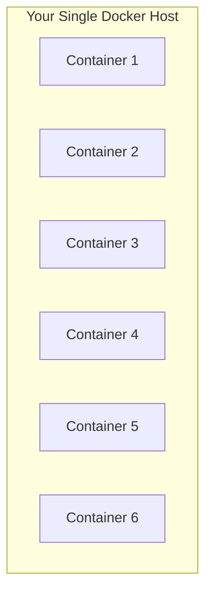
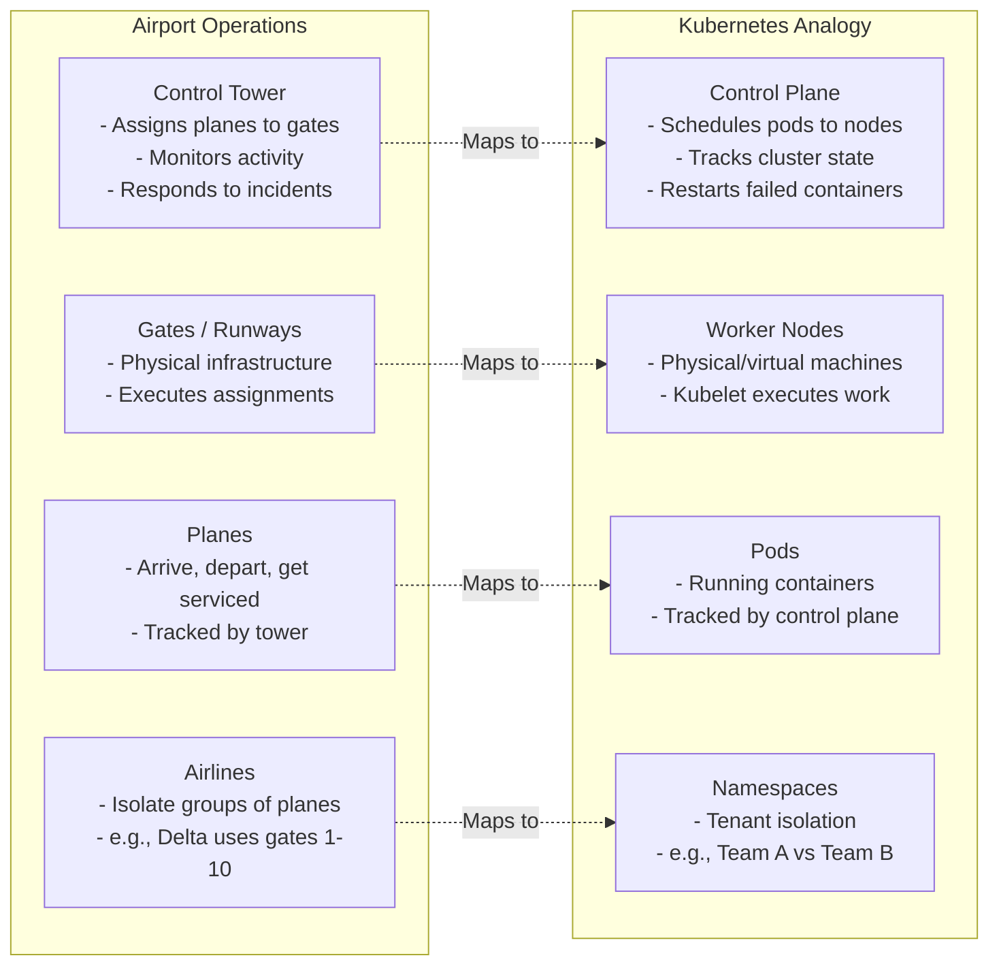
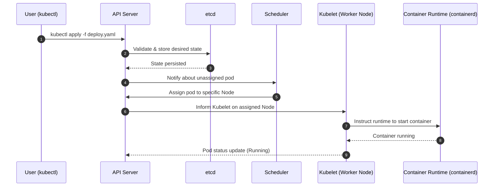

# Module 1.3: What Is Kubernetes?

> **Complexity**: `[QUICK]` - High-level overview
>
> **Time to Complete**: 30-35 minutes
>
> **Prerequisites**: Module 1 (Containers), Module 2 (Docker). This lesson assumes you can explain why teams package applications as containers and can recognize a basic Docker image or container command, but it does not assume previous Kubernetes experience.

## What You'll Be Able to Do

After this module, you will be able to make practical first-pass decisions about Kubernetes rather than treating it as a buzzword or a magic deployment target:

- **Evaluate** whether Kubernetes is justified for a workload by comparing scaling needs, availability requirements, operational cost, and simpler deployment alternatives.
- **Diagnose** which control plane or worker node component is involved when scheduling, API access, networking, or recovery behaves unexpectedly.
- **Predict** how Kubernetes responds to pod crashes, node failures, rolling updates, and changing replica counts.
- **Assess** managed Kubernetes and self-managed Kubernetes trade-offs for production teams, including control plane risk, upgrade work, and cloud provider responsibility.

## Why This Module Matters

In 2017, a large online retailer entered its Black Friday sale with a deployment process that still depended on a few powerful servers and a set of manual recovery runbooks. When traffic jumped faster than the team expected, one overloaded host stopped responding, several checkout containers disappeared with it, and engineers began the familiar emergency routine: SSH into replacement machines, pull container images, update proxy configuration, restart processes, and watch dashboards for the next failure. The business impact was measured in thousands of dollars per minute because the technical system had no reliable way to place work somewhere else when a machine failed.

That incident is not unusual because containers solve only one layer of the production problem. A container gives an application a consistent package, but it does not decide which machine should run the package, replace the package after a crash, expose the package through stable networking, or coordinate a rolling update while customers are still using the service. Docker made it practical to build and run isolated processes; Kubernetes exists because production teams also need a control system that can operate many of those processes across many machines without turning every failure into a midnight manual repair.

This module is the bridge between "I can run a container" and "I can reason about a container platform." You will not become a cluster administrator in one lesson, and that is not the goal. The goal is to build a durable mental model: Kubernetes is a declarative orchestration system that watches the difference between desired state and actual state, then uses specialized components to move the cluster back toward what you asked for.

## The Problem: Containers at Scale

Docker is excellent on a laptop or on one carefully managed server because it gives you a predictable way to package and start processes. The weakness appears when the question changes from "can this container run?" to "can this service stay available while machines fail, traffic changes, and engineers ship updates?" A single Docker host has one failure boundary, one pool of CPU and memory, and one place where networking rules and disks have to be maintained by hand. If that host dies, the containers on it die with the host, even if the application images are perfectly built.



A production service needs a bigger contract than "start these containers on this one machine." It needs placement, recovery, service discovery, load balancing, rollout control, secrets handling, and a way to express the desired shape of the system as data. Without an orchestrator, every one of those responsibilities becomes a script, a wiki page, or a human memory exercise. Scripts can help, but scripts usually react to one known path; an orchestrator continuously observes the whole system and reconciles many paths at once.

Single-machine container operations usually fail in predictable ways. If the machine dies, all containers on that machine disappear together. If demand grows, the only immediate answer is to move to a larger machine or manually add another one. If an app crashes, someone or something outside the container runtime must notice and restart it. If a new version must be deployed, a person has to coordinate which containers stop, which containers start, and how the load balancer follows the live ones.

Kubernetes treats those operational needs as first-class platform behavior. Instead of saying "run this container right here," you usually say "keep three replicas of this application running somewhere healthy, expose them through this stable name, and roll to the next image without dropping all capacity at once." That shift is the reason Kubernetes feels different from Docker Compose or a shell script: you describe the target state, and the platform owns the repeated work of chasing that target state.

Production teams usually adopt orchestration because they need several capabilities at the same time: running containers across multiple machines, restarting failed workloads, choosing placement based on available capacity, balancing traffic between replicas, rolling updates without full downtime, scaling up or down as demand changes, and replacing work after node failures. Any one of those can be built with enough custom glue. Kubernetes became the common answer because it gives teams a shared API and a shared set of controllers for all of them.

The shared API is more important than it first appears. When every team invents its own deployment scripts, the operations model becomes a collection of private languages: one service uses a shell script, another uses a CI job with special environment variables, and a third depends on someone remembering which load balancer target group to edit. Kubernetes gives those teams a common resource vocabulary. A Deployment means rollout management, a Service means stable access, a Namespace means scoped organization, and events provide a common diagnostic trail when something fails.

That common vocabulary also lets platform teams build guardrails without taking over every application. They can define default resource limits, admission checks, network rules, image policies, and observability conventions around Kubernetes resources. Application teams still own their code and manifests, but the platform can enforce baseline safety at the API boundary. This is one reason Kubernetes became more than a scheduler: it is also a policy and integration point for operating many services consistently.

> **Stop and think**: You have 200 containers running across 15 servers. One server's hard drive fails at 3 AM. In a manual setup, someone gets paged, SSHs in, figures out what was running on that server, and manually redeploys those containers elsewhere. With Kubernetes, the system detects the failure, knows exactly what was running, and automatically reschedules those containers to healthy servers, often before your on-call engineer has opened the laptop.

That example also shows the trade-off. Kubernetes is not magic resilience sprinkled over any application; it is a control system with opinions, resource models, and failure modes of its own. You gain a powerful reconciler, but you also agree to learn its API, model your applications as Kubernetes resources, and operate or rent the platform that runs those resources. The right question is not "is Kubernetes powerful?" The right question is "does this workload need the kind of operational contract Kubernetes provides?"

## What Is Kubernetes?

Kubernetes, often shortened to K8s, is an open-source container orchestration platform. The word "orchestration" matters because the platform is not merely a place where containers run. It coordinates many moving parts: a control plane stores desired state, worker nodes run pods, controllers compare desired state with actual state, the scheduler chooses suitable machines, and networking resources give unstable pods stable ways to receive traffic.

The shortest useful definition is this: Kubernetes is a declarative API plus a set of controllers that keep containerized workloads close to the state you requested. You create resources such as Pods, Deployments, and Services. The API server validates and stores those resources. Other components watch the API server and act when reality does not match the declarations. This loop is why Kubernetes can replace a crashed pod without someone typing a restart command.

The airport analogy is useful because airports separate decision-making from execution. A control tower does not personally fuel planes or carry luggage, but it coordinates gate assignments, runway flow, incident response, and the shared truth of what is supposed to happen next. The gates and ground crews do the physical work. Kubernetes uses a similar split: the control plane decides and records, while worker nodes execute container workloads.



Every analogy has limits, but this one helps separate concerns. The control plane is the coordination system, not the place where most business workloads run. Nodes are the machines that provide CPU, memory, disk, and networking. Pods are the scheduled units of application work. Namespaces give teams a way to group resources and apply boundaries, though they are not a complete security boundary by themselves.

When you interact with Kubernetes, you normally use `kubectl`, the official command-line client, and many teams define `alias k=kubectl` to keep commands short. After that alias is set, commands such as `k get pods` and `k describe pod hello` talk to the API server rather than directly to a worker node. This detail is important for diagnosis: if the API server is down, management commands fail even though existing containers may continue running on their assigned nodes.

```bash
alias k=kubectl
k version
k cluster-info
```

Pause and predict: if your laptop cannot reach the API server, but the worker nodes are healthy, what do you expect to happen to applications that are already running? Existing pods usually continue to run because the node-local kubelet and container runtime keep executing their last known assignments. New deployments, scaling changes, and fresh scheduling decisions wait until the control plane becomes reachable again.

## Kubernetes Architecture (Simplified)

The architecture looks large at first, but the beginner model can stay compact. A Kubernetes cluster has a control plane and a set of worker nodes. The control plane exposes the API, stores state, makes scheduling decisions, and runs controllers. Worker nodes run kubelet, a container runtime such as containerd, networking components, and the pods that hold your application containers.


> **Connect to Module 0.1**: Remember the restaurant kitchen from Module 0.1? The control plane is the restaurant management team. The API Server is the front desk where all orders go, the Scheduler is the floor manager deciding which kitchen handles which order, etcd is the order log recording the truth, and the Controller Manager is the shift supervisor checking that the right number of staff are working.

The API server is the front door to the cluster. Every create, update, delete, and read operation goes through it, whether the request came from `k`, a CI pipeline, a controller, or a custom operator. This central entry point gives Kubernetes a consistent place to authenticate users, authorize requests, validate resource shape, and store accepted changes. When the API server is unreachable, the cluster becomes hard to manage even if many workloads are still serving traffic.

etcd is the durable database for cluster state. It stores objects such as Pods, Deployments, Services, ConfigMaps, and Secrets, along with metadata about nodes and controller progress. Because etcd is the source of truth, corrupting it or losing quorum is one of the most serious Kubernetes failures. Managed Kubernetes services spend significant engineering effort protecting this layer because an available API server without reliable state storage is not a reliable control plane.

The scheduler watches for pods that exist in the API but do not yet have a node assignment. It considers constraints such as requested CPU and memory, node labels, taints, affinity rules, and current capacity, then writes a binding decision back through the API server. The scheduler does not start containers itself. It makes the placement decision, and the kubelet on the selected node performs the local execution work.

The controller manager runs loops that compare actual state with desired state. A Deployment controller creates or updates ReplicaSets, a ReplicaSet controller maintains the requested number of pods, and a Node controller watches node health. This controller pattern is the heart of Kubernetes: each controller owns a narrow reconciliation responsibility, and the combined effect is a system that keeps nudging reality toward declarations.

| Component | What It Does |
|-----------|--------------|
| **API Server** | Front door to K8s. All commands go through it. |
| **etcd** | Database storing all cluster state |
| **Scheduler** | Decides which node runs each pod |
| **Controller Manager** | Ensures desired state matches actual state |

Worker nodes are where application containers actually run. The kubelet on each node receives pod assignments from the API server, asks the container runtime to start or stop containers, mounts volumes, reports status, and performs health checks. The container runtime, commonly containerd, handles image pulls and container lifecycle. kube-proxy or an equivalent dataplane component makes Services route traffic to the right pod backends.

| Component | What It Does |
|-----------|--------------|
| **kubelet** | Agent on each node, manages pods |
| **Container Runtime** | Actually runs containers (containerd) |
| **kube-proxy** | Handles networking for services |

Pause and predict: if the scheduler is down but the API server and worker nodes are healthy, which operations still work and which ones stall? Existing pods keep running, and you can often read cluster state through the API server. New pods that need placement remain pending because no component is writing the node assignment that lets kubelet start them.

A practical diagnosis habit follows from this architecture. When a command cannot connect, suspect the API path first. When a pod is pending, inspect scheduling constraints and available node capacity. When a pod is assigned but not starting, inspect kubelet events, image pulls, volume mounts, and runtime errors. Kubernetes feels less mysterious when you map the symptom to the component responsible for that phase of the workflow.

There is another beginner-friendly way to remember the split: the control plane makes promises, and worker nodes keep local promises. The control plane promises that accepted desired state is recorded, watched, and acted on. A worker node promises that assigned Pods are attempted locally, reported honestly, and restarted according to their container-level policy. When those promises break, the fix depends on which side broke. Adding more CPU to a worker node will not repair an unavailable API server, and restarting an API server will not fix an application image that exits immediately after launch.

This split also explains why production Kubernetes monitoring is layered. You monitor the API server because every management workflow depends on it. You monitor etcd because state durability and quorum determine whether the control plane can be trusted. You monitor scheduler and controller activity because pending work and reconciliation lag reveal platform stress. You monitor kubelet, runtime, and node resources because application reliability ultimately depends on machines with enough CPU, memory, disk, and network capacity.

## Core Concepts Preview

Kubernetes has many resource types, but three are enough to understand the first layer of application deployment: Pods, Deployments, and Services. A Pod is the smallest schedulable unit, a Deployment manages replicated pods and rollout behavior, and a Service gives those pods a stable network identity. The key idea is that each resource handles a different part of the production problem instead of forcing one object to do everything.

Pods are often described as "one container," but the more precise definition is "one or more tightly coupled containers that share scheduling, networking, and some storage context." Most beginner examples use one container per Pod because that is the common application pattern. Kubernetes schedules Pods, not raw containers, because the Pod is the unit that receives an IP address, runs on one node, and represents one slice of application capacity.

```yaml
# You don't run containers directly—you create Pods
apiVersion: v1
kind: Pod
metadata:
  name: nginx
spec:
  containers:
  - name: nginx
    image: nginx:1.27
```

A bare Pod is useful for learning, but it is rarely the production abstraction you want. If someone deletes a standalone Pod, there may be no higher-level object responsible for replacing it. That is why applications are commonly declared through a Deployment. The Deployment says how many replicas should exist and how updates should move from one version to another, while lower-level controllers create and maintain the matching pods.

```yaml
# "I want 3 nginx pods, always"
apiVersion: apps/v1
kind: Deployment
metadata:
  name: nginx
spec:
  replicas: 3
  selector:
    matchLabels:
      app: nginx
  template:
    metadata:
      labels:
        app: nginx
    spec:
      containers:
      - name: nginx
        image: nginx:1.27
```

The Deployment example is small, but it contains an important promise. If the desired replica count is three and one pod disappears, the controller creates another pod. If you update the template to a new image, the Deployment controller coordinates a rollout rather than asking you to stop all old pods and start all new pods manually. This is desired-state management applied to application operations.

Services solve a different problem: pods are intentionally replaceable, so their IP addresses are not stable contracts for users or other services. A Service selects pods by label and exposes a stable virtual IP and DNS name that route to the current healthy backends. That is how a frontend can call a backend even while backend pods are being replaced during a rollout or after a node failure.

```yaml
# "Make my nginx pods accessible on port 80"
apiVersion: v1
kind: Service
metadata:
  name: nginx
spec:
  selector:
    app: nginx
  ports:
  - port: 80
    targetPort: 80
```

Pause and predict: if a Deployment keeps three Pods running but those Pods are frequently destroyed and recreated with new IP addresses, how will users reliably reach the app? They should not connect to Pod IPs directly. A Service gives clients a stable name and address while Kubernetes updates the list of live Pod endpoints behind that name.

The relationship among these resources is easier to read as a stack. Users and other services talk to a Service. The Service finds Pods by label. The Deployment owns the template that creates those Pods and the desired replica count that keeps them present. The control plane stores all of that as resource state, and controllers keep updating the cluster when one layer changes.

```text
+-----------------------------+
| Service: stable entry point |
+-------------+---------------+
              |
              v
+-----------------------------+
| Pods: replaceable capacity  |
+-------------+---------------+
              ^
              |
+-----------------------------+
| Deployment: desired replicas|
+-----------------------------+
```

The first trap for beginners is treating Kubernetes objects as isolated commands. A better mental model is to ask what contract each object creates. A Pod creates execution. A Deployment creates continuity and rollout control. A Service creates stable access. When you can name the contract, you can choose the right object and diagnose which contract is broken.

Labels and selectors are the quiet glue behind those contracts. A Service does not usually point to a fixed list of Pod names; it selects Pods whose labels match its selector. A Deployment template gives Pods labels so other resources can find them. This means a typo in a label can be just as damaging as a broken container image, because the Pods may be healthy while the Service has no matching endpoints. When traffic disappears after a rollout, always check the relationship between labels, selectors, and readiness before assuming the network is haunted.

Readiness is another concept worth previewing now because it protects users during change. A Pod can be running from the container runtime's point of view while the application inside it is not ready to accept traffic. Kubernetes lets applications expose readiness checks so Services route only to Pods that are prepared to serve. This is how a rolling update avoids sending customers to a process that has started but has not loaded configuration, warmed caches, or opened its listening socket yet.

## Desired State, Recovery, and Request Flow

Kubernetes works because most important actions flow through a shared API and then through reconciliation loops. When you apply a manifest, you are not telling one worker node to immediately start a container. You are sending desired state to the API server, which validates it, stores it, and lets controllers and node agents converge on that state. That extra indirection is what allows Kubernetes to recover after partial failures.



The sequence diagram preserves a key operational truth: each component has a bounded role. The user submits a request. The API server validates and persists it. The scheduler chooses placement. The kubelet turns that assignment into local container work. The runtime starts the container. The kubelet reports status back, which becomes visible through the same API. If you diagnose an issue, you can follow this path and ask where the expected handoff stopped.

Desired state also explains self-healing. Suppose a junior engineer deletes the only running pod for a payment service, but the service is owned by a Deployment with one desired replica. The API records that the pod is gone. The ReplicaSet controller observes that actual replicas are below desired replicas. It creates a replacement pod, the scheduler places it, and kubelet starts it. No person had to remember the original command because the desired state still existed.

Node failure follows the same pattern with more delay and more caution. If a worker node loses power, the kubelet on that node stops sending heartbeats. The Node controller eventually marks the node unhealthy, and controllers responsible for affected pods create replacements where appropriate. The scheduler then places replacement pods on healthy nodes, subject to available capacity and constraints. Kubernetes can automate the response, but it cannot create capacity from nothing, so cluster sizing still matters.

Rolling updates are another form of controlled reconciliation. A Deployment does not usually destroy all old pods at once and then start all new pods. It creates a new ReplicaSet from the updated template and gradually shifts replicas while respecting availability rules. If the new pods fail readiness checks, the rollout can stall instead of sending traffic to broken instances. This is why health probes and sensible rollout settings matter even in an introductory application.

Before running a rollout in a real environment, ask yourself what output and events you expect to see. If the new image pulls successfully and readiness checks pass, replica counts should move steadily from the old version to the new version. If the image name is wrong, you should expect image pull errors on the assigned nodes. If resource requests are too high, you should expect pending pods and scheduler events rather than container logs.

This is the practical value of learning the architecture early. You do not need to memorize every controller, but you do need to connect symptoms to responsibilities. An API timeout points toward access or API server health. A pending pod points toward scheduling. A crash loop points toward application startup, configuration, probes, or runtime behavior. A Service with no endpoints points toward labels, selectors, readiness, or missing pods.

The same reasoning applies during planned change, not only during outages. Imagine a team raising a Deployment from three replicas to six before a marketing campaign. Kubernetes can create the additional Pods and spread them across suitable nodes, but the outcome still depends on resource requests, cluster autoscaling, image pull speed, readiness checks, and downstream capacity. If the database cannot handle twice the connection count, the application may fail even though Kubernetes did exactly what it was asked to do. Orchestration improves the mechanics of change; it does not replace capacity planning.

Declarative systems also require patience during observation. A command may return quickly because the API accepted the desired state, while the actual cluster takes time to converge. Good operators learn to watch status, events, and rollout progress instead of assuming "apply succeeded" means "the application is healthy." This distinction is especially important in CI pipelines, where a manifest can be syntactically valid but still produce Pods that cannot schedule, pull images, mount storage, pass probes, or receive Service traffic.

## Why Not Just Docker?

Docker and Kubernetes are not enemies, and Kubernetes did not make container images obsolete. Docker popularized the developer workflow for building and running containers, while Kubernetes standardizes the operational workflow for running many containers across a cluster. Modern Kubernetes commonly uses containerd as the runtime, but teams still build OCI-compatible images with Docker or similar tools and then ask Kubernetes to operate those images.

| Feature | Docker (single host) | Kubernetes |
|---------|---------------------|------------|
| Multi-node | No | Yes |
| Auto-scaling | No | Yes |
| Self-healing | No | Yes |
| Rolling updates | Manual | Automatic |
| Load balancing | Manual | Built-in |
| Service discovery | Manual | Built-in |
| Secrets management | No | Yes |
| Resource limits | Per container | Cluster-wide |

The comparison table can look one-sided, but the honest answer is more nuanced. Docker on one host is simpler, cheaper to reason about, and often enough for a small internal tool, a prototype, or a service with modest availability requirements. Kubernetes adds moving parts, YAML resources, cluster upgrades, security policy, monitoring needs, and a new failure vocabulary. You should earn that complexity with real operational needs.

Use Kubernetes when the workload benefits from multiple replicas, frequent deployments, self-healing, consistent environments, platform-level policy, or shared infrastructure across teams. Consider simpler alternatives when the workload is a single process, traffic is low, downtime is acceptable, or the team does not have the capacity to operate the platform responsibly. A virtual machine, a managed app platform, or a small container service may be the better engineering choice.

This evaluate-and-compare habit protects teams from two common mistakes. The first is adopting Kubernetes because it is popular, then discovering that most effort goes into platform maintenance instead of customer value. The second is avoiding Kubernetes too long, then building a fragile pile of custom scripts that recreate weaker versions of scheduling, rollouts, service discovery, and recovery. The better decision is based on workload shape, team maturity, and the cost of downtime.

Cost conversations should include both infrastructure and human time. Kubernetes can improve density because many workloads share a cluster, and autoscaling can reduce waste when configured well. It can also increase costs through managed control plane fees, larger baseline node pools, observability tooling, security review, training, and platform maintenance. A fair evaluation compares the total cost of reliable operations. If Kubernetes prevents repeated incidents and lets teams deploy safely, the cost may be justified; if it mostly creates meetings about YAML, the decision needs revisiting.

Security has a similar trade-off. Kubernetes gives teams strong primitives such as RBAC, Namespaces, NetworkPolicy, Secrets, admission control, and workload identity integrations, but those primitives must be configured. A default learning cluster is often permissive because it is optimized for getting started. A production cluster should be designed around least privilege, restricted network paths, controlled image sources, and auditable access. Kubernetes can support mature security, but it does not guarantee mature security by existing.

## Where Kubernetes Runs

Kubernetes can run in cloud-managed services, self-managed clusters, local development environments, and specialized edge distributions. The API model is portable enough that a Deployment and Service look similar across providers, but the operational responsibility changes dramatically depending on where the control plane lives. That responsibility boundary is one of the most important production decisions a team makes.

Cloud-managed Kubernetes is the usual starting point for production teams because the provider operates much of the control plane. AWS offers Amazon EKS, Google Cloud offers GKE, and Microsoft Azure offers AKS. You still manage your workloads, node pools, network choices, access policy, and upgrade planning, but the provider takes on core control plane availability and a large part of the operational burden.

Self-managed Kubernetes gives more control and often more responsibility than beginners expect. kubeadm can bootstrap conformant clusters, k3s provides a lightweight distribution that is popular for edge and lab environments, and OpenShift packages Kubernetes with additional enterprise platform features. These options can be the right choice for regulated environments, unusual infrastructure, or teams with strong platform engineering expertise, but they are not free just because the software is open source.

> **War Story: The Cost of Doing It Yourself**
> In 2019, a mid-sized fintech company decided to run its own self-managed Kubernetes cluster on bare metal to save managed service costs. Six months later, a botched upgrade to its `etcd` database corrupted cluster state and caused a 14-hour production outage. The team learned that a highly available control plane is a distributed systems responsibility, not a side project, and later moved to a managed service while keeping application deployment patterns mostly unchanged.

Local Kubernetes is for learning, development, and repeatable tests rather than production availability. kind runs Kubernetes nodes as Docker containers, minikube runs a local cluster through a VM or container driver, and Docker Desktop includes a Kubernetes option on developer machines. These tools are valuable because they let you practice the API and resource model without waiting for a cloud account or a shared platform environment.

| Environment | Examples | Best Fit | Main Trade-off |
|-------------|----------|----------|----------------|
| Cloud managed | EKS, GKE, AKS | Production teams that want provider-operated control planes | Less control over some internals and provider-specific integration choices |
| Self-managed | kubeadm, k3s, OpenShift | Specialized infrastructure, edge, regulated environments, platform teams | You own control plane design, upgrades, backup, and incident response |
| Local development | kind, minikube, Docker Desktop | Learning, demos, CI experiments, manifest testing | Not a substitute for production failure domains or cloud networking |

Assessing managed versus self-managed Kubernetes is not only a cost comparison. Managed services charge money, but engineering time, incident risk, upgrade complexity, and compliance evidence also cost money. A two-person operations team may get far more value from a provider-managed control plane than from saving a monthly fee while carrying etcd backup, API server availability, certificate rotation, and version upgrade risk alone.

Managed services still leave important design work for the customer. You choose node sizes, autoscaling behavior, network layout, identity integration, logging, ingress, storage classes, and upgrade timing. You decide how application teams receive access and which guardrails prevent risky workloads from landing in production. The provider may run the API server and etcd, but it will not automatically design your deployment strategy, label taxonomy, incident runbooks, or cost controls. Treat managed Kubernetes as shared responsibility, not outsourced thinking.

Which approach would you choose here and why: a five-person startup running a stateless API with spiky traffic, or a hardware vendor shipping small clusters into factory sites with unreliable connectivity? The startup probably benefits from managed Kubernetes because the business needs application speed and resilience without building a platform team first. The hardware vendor may justify a lightweight self-managed or edge distribution because the cluster must run near equipment even when cloud connectivity is weak.

## When This Doesn't Apply

Kubernetes is a strong fit when you need a shared, declarative platform for many containerized workloads, but it is not the default answer for every deployment. If an application is a single low-traffic service with acceptable downtime, a managed app service or one well-maintained virtual machine can be easier to secure, debug, and pay for. Simplicity is an architecture feature when the operational problem is genuinely simple.

Kubernetes also does not remove the need for application design. A process that takes minutes to start, stores critical state only on local disk, ignores termination signals, or has no useful health checks will behave poorly in a cluster. The platform can restart containers and route traffic, but it cannot make an unsafe application safe by itself. Good Kubernetes outcomes come from both a capable platform and applications designed for replacement, observation, and graceful shutdown.

The main anti-pattern is using Kubernetes as a badge of maturity before the team has the workload pressure to justify it. A healthier pattern is to identify the operational pain first: deployments are risky, traffic spikes overwhelm one host, environments drift, teams need shared policy, or recovery is too manual. Then compare Kubernetes against simpler services and choose it when the platform contract clearly pays for the added complexity.

| Pattern or Anti-pattern | When It Appears | Better Decision |
|-------------------------|-----------------|-----------------|
| Pattern: declarative desired state | Teams need repeatable deployment and recovery behavior | Store manifests, review changes, and let controllers reconcile state |
| Pattern: managed control plane first | Small teams need production reliability without deep cluster operations | Use EKS, GKE, or AKS while learning workload operations carefully |
| Pattern: local cluster for practice | Learners need fast feedback on manifests and commands | Use kind or minikube before touching a shared production cluster |
| Anti-pattern: Kubernetes for one tiny process | The app has low traffic and minimal availability needs | Use a simpler runtime until orchestration solves a real problem |
| Anti-pattern: self-managed control plane by default | Teams underestimate etcd, upgrades, certificates, and incident work | Choose managed Kubernetes unless control requirements justify ownership |
| Anti-pattern: treating Pods as stable servers | Teams SSH into containers or depend on Pod IPs | Use Deployments, Services, logs, metrics, and replacement-friendly design |

## When You'd Use This vs Alternatives

Choose Kubernetes when the workload needs cluster-level orchestration rather than only container execution. The strongest signals are multiple replicas, several services communicating with each other, frequent releases, strict availability targets, autoscaling needs, and a team that wants one platform API for deployment, policy, and operations. Kubernetes is especially compelling when many teams share infrastructure because the same API can support namespaces, quotas, admission policies, and standard deployment patterns.

Choose a simpler container service, virtual machine, or managed app platform when the workload is small, the team is early, or the operational requirements are not yet demanding. Those alternatives may provide enough reliability with far less surface area. A practical decision framework is to compare the cost of Kubernetes complexity against the cost of not having orchestration. If manual deployment mistakes, slow recovery, and inconsistent environments are already expensive, Kubernetes may be justified. If those costs are hypothetical, wait until the evidence is stronger.

| Decision Question | Kubernetes Signal | Simpler Alternative Signal |
|-------------------|-------------------|----------------------------|
| How many workloads are you operating? | Many services or several teams need one platform model | One or two services can be managed cleanly another way |
| What happens when a node fails? | Automatic replacement and scheduling are required | Manual recovery is acceptable for the business |
| How often do you deploy? | Rolling updates and rollback visibility matter | Occasional maintenance windows are acceptable |
| Who owns the control plane? | A managed service or platform team can operate it responsibly | No team has time to secure, monitor, and upgrade it |
| How important is portability? | Standard Kubernetes APIs help across environments | Provider-specific app services are acceptable |

## Did You Know?

- **"Kubernetes" is Greek for "helmsman"** (one who steers a ship). The logo is a ship's wheel with 7 spokes, reflecting the project's early history and steering metaphor.
- **K8s is a numeronym.** The abbreviation keeps the first and last letters of Kubernetes and replaces the middle 8 letters, like i18n for internationalization or a11y for accessibility.
- **Kubernetes was announced by Google in 2014 and joined the CNCF in 2015.** Its design drew heavily from Google's earlier Borg and Omega cluster-management experience.
- **Large clusters can be enormous, but size is not the goal.** Public engineering reports have described clusters with 15,000 nodes and 300,000 or more pods, yet most teams should optimize for reliable operations rather than headline scale.

## Common Mistakes

| Mistake | Why It Happens | How to Fix It |
|---------|----------------|---------------|
| Treating Kubernetes as a direct Docker replacement | Teams learn containers first and assume the next tool merely starts containers in another place | Explain that Kubernetes orchestrates desired state across nodes, while container tools still build and run OCI images underneath |
| Deploying standalone Pods for applications that should survive deletion | Bare Pod examples are short and easy to copy from tutorials | Use a Deployment for replicated stateless applications so controllers can replace Pods and coordinate rollouts |
| Connecting services directly to Pod IP addresses | Pod IPs are visible in command output, so they look like stable endpoints | Put a Service in front of replaceable Pods and route by labels instead of direct Pod addresses |
| Assuming managed Kubernetes means no operations work | Providers run much of the control plane, but workloads, access, nodes, costs, and upgrades still need ownership | Define a platform responsibility matrix that separates provider duties from team duties before production launch |
| Self-managing a control plane to save money without counting risk | The software is open source, so the visible license cost looks lower than a managed service fee | Include etcd backup, high availability, certificates, upgrades, monitoring, and incident response in the cost model |
| Diagnosing every failure from application logs first | Logs are familiar, while Kubernetes events and resource status are new | Start with the resource lifecycle: API access, scheduling events, kubelet status, image pulls, readiness, then application logs |
| Believing Kubernetes makes stateful systems easy by default | The platform supports persistent storage, but data availability has stricter rules than stateless replicas | Use managed databases until you can design storage classes, backups, disruption handling, and recovery tests confidently |

## Quiz

<details>
<summary>Scenario: Your e-commerce site receives a 500% traffic spike, and a Docker Compose setup on one large VM maxes out CPU while dropping checkout connections. How would you evaluate whether Kubernetes is justified instead of simply buying a bigger VM?</summary>

Kubernetes is justified if the real problem is not just today's CPU ceiling but repeated scaling, recovery, and rollout risk across the service. A bigger VM may buy time, but it preserves one large failure boundary and still leaves placement, load balancing, and recovery as manual or custom work. Kubernetes becomes the stronger choice when the site needs multiple replicas across nodes, automated replacement after failure, and a stable Service in front of changing Pods. The reasoning should include cost as well: if traffic spikes are rare and downtime is tolerable, a simpler managed platform may still be better.
</details>

<details>
<summary>Scenario: You apply a Deployment, but the new Pods stay Pending even though the API server is reachable and existing applications are healthy. Which component path do you diagnose first?</summary>

Start with scheduling because Pending usually means the Pod exists in the API but has not been assigned to a node. The scheduler may be unable to place it because resource requests are too high, required labels are missing, taints are not tolerated, or node capacity is exhausted. The API server being reachable tells you that request submission and state storage are probably working. Inspect events on the Pod and node capacity before focusing on application logs, because containers have not started yet.
</details>

<details>
<summary>Scenario: A junior engineer deletes the only running Pod for a payment service managed by a Deployment with one desired replica. Predict what Kubernetes does next and why.</summary>

The API records that the Pod was deleted, and the ReplicaSet controller observes that actual replicas no longer match the desired count. It creates a replacement Pod from the Deployment's template, after which the scheduler assigns that Pod to a suitable node and kubelet starts the container. This happens because the desired state lives in the Deployment and ReplicaSet, not in the deleted Pod. If there is no available capacity or the image cannot be pulled, the replacement may stall, but the control loop still tries to restore the declared state.
</details>

<details>
<summary>Scenario: Worker Node 3 loses power while running several web Pods. Users see a brief capacity drop, but the control plane remains reachable. Which components are involved in recovery?</summary>

The Node controller notices missing heartbeats and marks the node unhealthy after the configured grace period. Controllers responsible for the affected replicated workloads then create replacement Pods if the desired replica count is no longer satisfied. The scheduler chooses healthy nodes with enough capacity, and kubelet on those nodes asks the container runtime to start the containers. This recovery depends on spare cluster capacity; Kubernetes can reschedule work, but it cannot run Pods on resources that do not exist.
</details>

<details>
<summary>Scenario: Your team has two operations engineers and is choosing between Amazon EKS and a self-managed kubeadm cluster. How should you assess the trade-off?</summary>

The safer default is usually managed Kubernetes because the provider carries much of the control plane availability and upgrade burden. A self-managed cluster may offer more control, but the team must own etcd backup, high availability, certificates, monitoring, version upgrades, and incident response. With only two operations engineers, that responsibility can crowd out application support and create avoidable outage risk. The decision should compare total operational risk and engineering time, not only the visible provider fee.
</details>

<details>
<summary>Scenario: A frontend calls backend Pod IPs directly, and every rollout causes intermittent connection failures. What Kubernetes object fixes the design, and what reasoning explains the fix?</summary>

A Service fixes the design by providing a stable virtual IP and DNS name that selects the current backend Pods by label. Pod IPs are intentionally temporary because Pods are replaceable units of capacity; rollouts, crashes, and node failures can all create new Pods with new addresses. The Service keeps the client-facing contract stable while Kubernetes updates the endpoint list behind it. The reasoning matters because the goal is not merely a different address, but a stable abstraction over changing replicas.
</details>

## Hands-On Exercise

**Task**: Explore a Kubernetes cluster and connect each observation to the architecture you just learned. This is a preview exercise, so it is fine if some output still feels unfamiliar. The point is to see that Kubernetes exposes an API for nodes, namespaces, system components, Pods, and events rather than asking you to SSH into machines and manage containers one by one.

**Setup**: Use any disposable Kubernetes cluster such as kind, minikube, Docker Desktop, or a cloud sandbox. Set the common short alias before you begin so the commands match the rest of the track.

```bash
alias k=kubectl
```

### Tasks

- [ ] **Evaluate cluster shape** by listing nodes and deciding whether this environment is a local learning cluster, a managed cloud cluster, or a self-managed cluster.

```bash
k get nodes
```

<details>
<summary>Solution guide</summary>

Look at the node names, roles, versions, and count. A kind cluster often shows names such as `kind-control-plane`, while a managed cloud cluster may show provider-specific node names. The important interpretation is that Kubernetes sees machines as cluster resources, and scheduling decisions depend on those resources being Ready.
</details>

- [ ] **Diagnose control plane and worker support components** by inspecting the system namespace and identifying at least one component related to networking, DNS, or node operation.

```bash
k get pods -n kube-system
```

<details>
<summary>Solution guide</summary>

Expect to see system Pods rather than your application Pods. Depending on the distribution, you may see CoreDNS, kube-proxy or another networking component, and node-level agents. This output reinforces that Kubernetes itself is a set of running components that support the API, networking, and workload execution.
</details>

- [ ] **Compare namespace boundaries** by listing namespaces and explaining why teams use them to organize resources without treating them as complete security isolation.

```bash
k get namespaces
```

<details>
<summary>Solution guide</summary>

Most clusters include namespaces such as `default`, `kube-system`, and `kube-public`, plus distribution-specific namespaces. Namespaces group resource names and policy scopes, which helps teams separate environments or ownership areas. Strong isolation also requires RBAC, network policy, resource quotas, and admission controls.
</details>

- [ ] **Implement a simple Pod** and then predict what information Kubernetes stores about scheduling, image pulling, and container state.

```bash
k run hello --image=nginx:1.27 --restart=Never
k get pods
```

<details>
<summary>Solution guide</summary>

The Pod should move from Pending to Running if the image can be pulled and a node has capacity. If it does not, use the status as a clue rather than a failure of the exercise. Pending points toward scheduling or image preparation, while Running means kubelet and the container runtime completed the local work.
</details>

- [ ] **Diagnose the Pod lifecycle** by describing the Pod and finding the node assignment, container state, and recent events.

```bash
k describe pod hello
```

<details>
<summary>Solution guide</summary>

Read the output from top to bottom and connect it to the request flow. The node name shows the scheduler's placement decision, container state reflects kubelet and runtime progress, and events show handoffs such as scheduling, image pulling, and container start. This is often more useful than application logs when the Pod has not started correctly.
</details>

- [ ] **Clean up and verify desired state** by deleting the standalone Pod, then checking that it does not return because no Deployment owns it.

```bash
k delete pod hello
k get pods
```

<details>
<summary>Solution guide</summary>

The Pod should disappear and stay gone because you created a standalone Pod with no higher-level controller. This is the contrast with a Deployment: a Deployment would notice that its desired replica count was no longer satisfied and create a replacement. That difference is the practical meaning of desired state.
</details>

**Success criteria**: By the end of the exercise, you should be able to connect command output to a specific Kubernetes concept instead of merely copying commands from a tutorial.

- [ ] You can explain why Kubernetes manages containers through an API instead of direct SSH commands.
- [ ] You can name the control plane role involved in API access, scheduling, stored state, and reconciliation.
- [ ] You can distinguish a standalone Pod from a Deployment-managed Pod.
- [ ] You can explain why a Service is needed when Pods are replaceable.
- [ ] You can assess whether this learning cluster resembles managed, self-managed, or local Kubernetes.

## Sources

- [Kubernetes Documentation: What is Kubernetes?](https://kubernetes.io/docs/concepts/overview/)
- [Kubernetes Documentation: Components](https://kubernetes.io/docs/concepts/overview/components/)
- [Kubernetes Documentation: Pods](https://kubernetes.io/docs/concepts/workloads/pods/)
- [Kubernetes Documentation: Deployments](https://kubernetes.io/docs/concepts/workloads/controllers/deployment/)
- [Kubernetes Documentation: Service](https://kubernetes.io/docs/concepts/services-networking/service/)
- [Kubernetes Documentation: Nodes](https://kubernetes.io/docs/concepts/architecture/nodes/)
- [Kubernetes Documentation: Controllers](https://kubernetes.io/docs/concepts/architecture/controller/)
- [Kubernetes Documentation: kube-scheduler](https://kubernetes.io/docs/concepts/scheduling-eviction/kube-scheduler/)
- [Kubernetes Documentation: Using kubectl](https://kubernetes.io/docs/reference/kubectl/)
- [Kubernetes Documentation: Production Environment](https://kubernetes.io/docs/setup/production-environment/)
- [Amazon EKS Documentation: What is Amazon EKS?](https://docs.aws.amazon.com/eks/latest/userguide/what-is-eks.html)
- [Google Kubernetes Engine Documentation: GKE Overview](https://docs.cloud.google.com/kubernetes-engine/docs/concepts/kubernetes-engine-overview)
- [Azure Kubernetes Service Documentation: What is AKS?](https://learn.microsoft.com/en-us/azure/aks/what-is-aks)

## Next Module

[Module 1.4: The Cloud Native Ecosystem](../module-1.4-cloud-native-ecosystem/) - Next you will place Kubernetes inside the broader CNCF ecosystem so platform names, runtime layers, networking projects, and observability tools feel like an organized landscape rather than an endless catalog.
