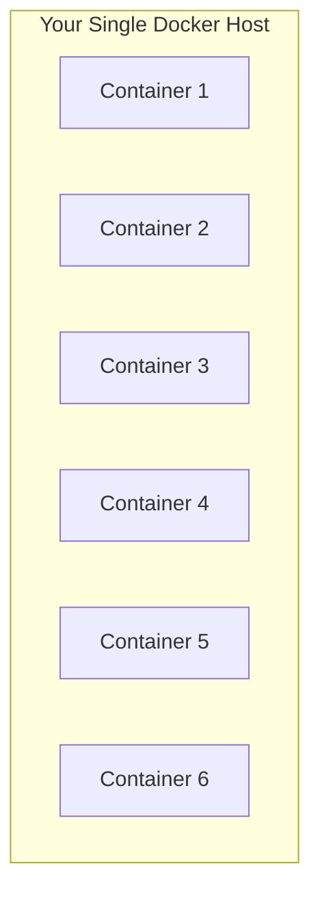
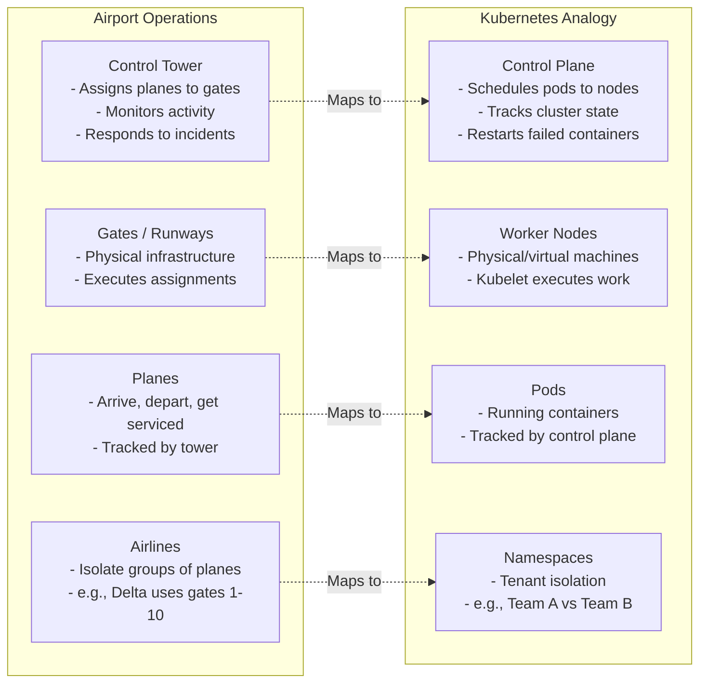
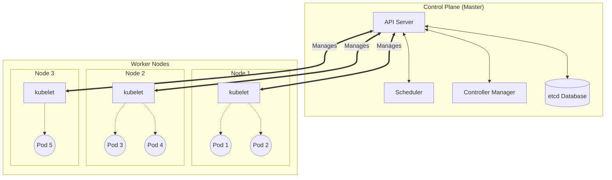
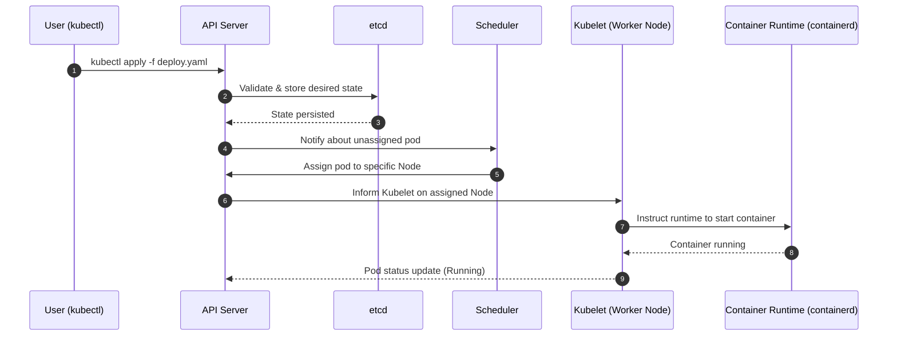

> **Complexity**: `[QUICK]` - High-level overview
>
> **Time to Complete**: 30-35 minutes
>
> **Prerequisites**: Module 1 (Containers), Module 2 (Docker)

---

## What You'll Be Able to Do

After this module, you will be able to:
- **Evaluate** whether a given workload justifies the complexity of Kubernetes over a simpler deployment model
- **Diagnose** which control plane component is failing when cluster operations (like scheduling or scaling) stop working
- **Predict** the impact of a node failure on running workloads and how the control plane responds
- **Assess** the trade-offs between managed Kubernetes (EKS/GKE/AKS) and self-managed clusters for production environments

---

## Why This Module Matters

In 2017, a major e-commerce retailer's single-server deployment crashed under the weight of a sudden Black Friday traffic spike. Because they had no automatic orchestration, on-call engineers had to frantically SSH into backup servers, manually pull Docker images, and restart services while the company bled thousands of dollars per minute in lost sales.

You know what containers are. You can build and run them with Docker. But Docker runs containers on ONE machine. What happens when you need:
- Hundreds of containers?
- High availability (no downtime)?
- Automatic scaling?
- Multiple machines?

That is the exact nightmare Kubernetes was built to prevent. This module gives you the big picture before diving into details.

---

## The Problem: Containers at Scale

Docker is great for running a few containers on your laptop. But production needs more.



**Single Machine Limitations:**
- **Machine dies:** ALL containers die.
- **Need more capacity:** You must buy a bigger machine.
- **No automatic recovery:** Manual intervention is required if an app crashes.
- **Manual load balancing:** You have to configure proxies by hand.
- **Updates require downtime:** No native rolling updates across multiple hosts.

### What Production Needs

- Run containers across multiple machines
- Automatic restart when containers crash
- Automatic placement (which machine has capacity?)
- Load balancing between containers
- Rolling updates without downtime
- Scaling up/down based on demand
- Self-healing when things break

This is **container orchestration**, and Kubernetes is the industry standard.

> **Stop and think**: You have 200 containers running across 15 servers. One server's hard drive fails at 3 AM. In a manual setup, someone gets paged, SSHs in, figures out what was running on that server, and manually redeploys those containers elsewhere. With Kubernetes, the system detects the failure, knows exactly what was running, and automatically reschedules those containers to healthy servers — all before your on-call engineer wakes up. That's the value of orchestration.

---

## What Is Kubernetes?

Kubernetes (K8s) is an open-source container orchestration platform. It:

1. **Manages container deployment** across multiple machines
2. **Ensures desired state** - if something breaks, K8s fixes it
3. **Handles networking** - containers find and talk to each other
4. **Manages storage** - persistent data for stateful apps
5. **Automates operations** - scaling, updates, recovery

### The Analogy: Airport Operations



---

## Kubernetes Architecture (Simplified)



> **Connect to Module 0.1**: Remember the restaurant kitchen from Module 0.1? The control plane is the restaurant management team. The API Server is the front desk (all orders go through it), the Scheduler is the floor manager (decides which kitchen handles which order), etcd is the order log (records everything), and the Controller Manager is the shift supervisor (makes sure the right number of staff are working).

### Control Plane Components

| Component | What It Does |
|-----------|--------------|
| **API Server** | Front door to K8s. All commands go through it. |
| **etcd** | Database storing all cluster state |
| **Scheduler** | Decides which node runs each pod |
| **Controller Manager** | Ensures desired state matches actual state |

> **Pause and predict**: If the entire control plane goes offline (for example, the API server crashes), what happens to the containers already running on your worker nodes?
> *Answer: They keep running! Worker nodes execute their last known instructions. However, you won't be able to deploy updates, and if a pod crashes, it won't be replaced until the control plane recovers.*

### Worker Node Components

| Component | What It Does |
|-----------|--------------|
| **kubelet** | Agent on each node, manages pods |
| **Container Runtime** | Actually runs containers (containerd) |
| **kube-proxy** | Handles networking for services |

---

## Core Concepts Preview

### Pods
The smallest deployable unit. Usually one container, sometimes multiple related containers.

```yaml
# You don't run containers directly—you create Pods
apiVersion: v1
kind: Pod
metadata:
  name: nginx
spec:
  containers:
  - name: nginx
    image: nginx:1.27
```

### Deployments
Manage multiple identical pods. Handle updates and scaling.

```yaml
# "I want 3 nginx pods, always"
apiVersion: apps/v1
kind: Deployment
metadata:
  name: nginx
spec:
  replicas: 3
  selector:
    matchLabels:
      app: nginx
  template:
    metadata:
      labels:
        app: nginx
    spec:
      containers:
      - name: nginx
        image: nginx:1.27
```

> **Pause and predict**: If a Deployment ensures 3 Pods are always running, but those Pods are frequently destroyed and recreated with new IP addresses, how will your users ever reliably connect to the app?
> *Answer: They won't, if they rely on Pod IPs. That is why Kubernetes provides the Service resource, which acts as a stable, unchanging entryway (with a static IP and DNS name) that routes traffic to whichever underlying Pods are currently alive.*

### Services
Stable networking for pods. Pods come and go; Services provide consistent access.

```yaml
# "Make my nginx pods accessible on port 80"
apiVersion: v1
kind: Service
metadata:
  name: nginx
spec:
  selector:
    app: nginx
  ports:
  - port: 80
    targetPort: 80
```

---

## Why Not Just Docker?

| Feature | Docker (single host) | Kubernetes |
|---------|---------------------|------------|
| Multi-node | No | Yes |
| Auto-scaling | No | Yes |
| Self-healing | No | Yes |
| Rolling updates | Manual | Automatic |
| Load balancing | Manual | Built-in |
| Service discovery | Manual | Built-in |
| Secrets management | No | Yes |
| Resource limits | Per container | Cluster-wide |

Docker is for running containers. Kubernetes is for operating containers at scale.

---

## Where Kubernetes Runs

### Cloud Managed (Easiest)
- **AWS**: EKS (Elastic Kubernetes Service)
- **Google Cloud**: GKE (Google Kubernetes Engine)
- **Azure**: AKS (Azure Kubernetes Service)

Cloud providers manage the control plane. You just run workloads.

### Self-Managed
- **kubeadm**: Official K8s installer
- **k3s**: Lightweight K8s (good for edge/IoT)
- **OpenShift**: Red Hat's enterprise K8s

You manage everything.

> **War Story: The Cost of Doing It Yourself**
> In 2019, a mid-sized fintech company decided to run their own self-managed Kubernetes cluster on bare metal to save AWS EKS costs. Six months later, a botched upgrade to their `etcd` database corrupted their cluster state, causing a 14-hour total production outage. They realized that managing a highly available control plane is a full-time job requiring a specialized team. They immediately migrated to Amazon EKS, accepting the managed service fee as a necessary "insurance policy" for their control plane stability.

### Local Development
- **kind**: Kubernetes in Docker
- **minikube**: Local K8s VM/container
- **Docker Desktop**: Includes K8s option

For learning and development.

---

## Visualization: Request Flow



---

## Did You Know?

- **"Kubernetes" is Greek for "helmsman"** (one who steers a ship). The logo is a ship's wheel with 7 spokes—for the 7 original developers.

- **K8s is a numeronym.** K-[8 letters]-s. Like i18n (internationalization) or a11y (accessibility).

- **Google runs everything on Kubernetes.** Gmail, Search, YouTube—all on Borg (K8s's predecessor) or K8s.

- **The largest known K8s cluster** has 15,000 nodes running 300,000+ pods (Alibaba).

---

## Common Misconceptions

| Misconception | Reality |
|---------------|---------|
| "K8s replaces Docker" | K8s orchestrates containers. You still use Docker (or containerd) to build and run container images. |
| "K8s is only for huge companies" | Small startups use K8s too. Managed services make the control plane accessible for small teams. |
| "K8s is complicated" | K8s IS complex, but managed services handle most complexity. You mainly interact with its declarative API. |
| "K8s solves everything" | K8s is infrastructure. You still need to design good applications. A badly written app still crashes in K8s. |
| "Containers in K8s are completely secure by default" | K8s optimizes for ease of networking by default. You must actively configure network policies and RBAC to lock it down. |
| "You should run your database in K8s" | While possible, running stateful data requires deep expertise. Many companies prefer managed databases (like RDS) alongside K8s. |
| "Moving to K8s automatically saves money" | K8s improves resource density, but the control plane has fixed costs and engineering time is expensive. It optimizes scale, not baseline cost. |

---

## Quiz

1. **Scenario**: Your e-commerce site experiences a sudden 500% traffic spike. Your Docker-compose setup on a single massive EC2 instance maxes out its CPU and begins dropping connections. **Why is Kubernetes better suited to handle this specific situation?**
   <details>
   <summary>Answer</summary>
   Kubernetes is designed to orchestrate containers across a distributed cluster, allowing it to automatically provision additional worker nodes and schedule new replica Pods to handle the increased load. Unlike a single-machine Docker setup, which is permanently constrained by the physical limits of that specific machine, Kubernetes distributes the workload dynamically across a scalable fleet. When the capacity of one node is exhausted, the control plane simply places new Pods on other available nodes. Furthermore, once the traffic spike subsides, Kubernetes can automatically scale the infrastructure back down to save costs.
   </details>

2. **Scenario**: You are deploying a 3-tier web application to a Kubernetes cluster. You need to ensure that the frontend containers can always communicate with the backend containers, even if the backend containers crash and are recreated with entirely different IP addresses. **Which Kubernetes concept guarantees this stable communication?**
   <details>
   <summary>Answer</summary>
   The Kubernetes Service concept provides the essential stable networking layer for your ephemeral Pods. Because Pods are constantly created and destroyed by the Deployment controller, they receive new, unpredictable IP addresses every time they start. Relying on direct Pod IP addresses for communication will inevitably cause connection failures as soon as a Pod cycles. By implementing a Service, you create a single, static IP address and reliable DNS name that intelligently load balances incoming traffic across all currently healthy Pods that match its label selector.
   </details>

3. **Scenario**: A junior engineer accidentally deletes the only running Pod for your critical payment processing service. In a pure Docker environment, the service would be down until an engineer manually restarted it. **If this was managed by a Kubernetes Deployment, predict exactly what would happen next.**
   <details>
   <summary>Answer</summary>
   The Kubernetes Controller Manager continuously monitors the cluster to ensure the actual running state matches the desired state declared in your Deployment configuration. The moment the Pod is deleted, the control plane detects that the actual state (0 Pods) has diverged from your desired state (1 Pod). It immediately reacts by instructing the API Server to create a new replacement Pod. The Scheduler then detects this pending Pod and assigns it to an available worker node, automatically restoring your payment processing service without any human intervention.
   </details>

4. **Scenario**: Your team is debating whether to build a self-managed Kubernetes cluster on virtual machines or use Amazon EKS. Your startup has only two DevOps engineers. **Based on typical production requirements, why is the managed service (EKS) the safer choice?**
   <details>
   <summary>Answer</summary>
   Amazon EKS strategically offloads the immense operational burden and risk of managing the critical Kubernetes Control Plane components, such as the API Server and the etcd database. Managing a highly available etcd cluster and performing zero-downtime control plane upgrades requires specialized, full-time distributed systems expertise. With a team of only two engineers, attempting to run a self-managed control plane introduces a massive single point of failure and unacceptable operational overhead. By choosing EKS, your small team benefits from a resilient, vendor-managed control plane out of the box, allowing them to focus entirely on deploying applications rather than maintaining infrastructure.
   </details>

5. **Scenario**: A hardware failure causes Worker Node #3 to suddenly lose power. It was running 5 instances of your web application Pods. **Diagnose which control plane component is responsible for noticing this failure and taking action.**
   <details>
   <summary>Answer</summary>
   The Controller Manager is the specific control plane component responsible for continuously observing node health and taking corrective action when failures occur. Within the Controller Manager, the Node Controller sub-component constantly monitors the heartbeat signals emitted by the kubelet on every worker node. When Worker Node #3 stops sending heartbeats due to the power loss, the Node Controller marks it as unreachable. Consequently, the ReplicaSet controller notices that the desired number of running application Pods has dropped, immediately triggering the creation of five new replacement Pods that the Scheduler will place on the remaining healthy nodes.
   </details>

6. **Scenario**: You run `kubectl apply -f my-app.yaml` to deploy a new feature, but the command times out and returns a "connection refused" error. However, your monitoring dashboards show that the worker nodes and existing applications are perfectly healthy. **Diagnose which specific control plane component is likely down.**
   <details>
   <summary>Answer</summary>
   The Kubernetes API Server is almost certainly offline, crashed, or otherwise unreachable from your network. The API Server functions as the exclusive gateway and central nervous system for all cluster management operations; your local `kubectl` utility communicates strictly with it, never directly with the worker nodes or other control plane components. When the API Server goes down, the control plane becomes unresponsive and cannot accept new configurations or query the current cluster state. However, the existing workloads on the worker nodes continue to function normally because the local kubelet processes simply keep running their last known assignments.
   </details>

---

## Hands-On Exercise

**Task**: Explore a Kubernetes cluster (preview of what's coming).

```bash
# If you have a cluster running (kind, minikube, or other):

# 1. See your cluster nodes
kubectl get nodes
# Output shows the machines in your cluster

# 2. See running system components
kubectl get pods -n kube-system
# These are the components that make K8s work

# 3. See all namespaces (like folders for resources)
kubectl get namespaces

# 4. Create something simple
kubectl run hello --image=nginx --restart=Never
kubectl get pods
# You just created a Pod!

# 5. See what Kubernetes knows about it
kubectl describe pod hello
# Lots of information about scheduling, containers, events

# 6. Clean up
kubectl delete pod hello

# Don't worry if this is confusing now - you'll learn all of it
# The goal is just to see K8s in action
```

**No cluster yet?** That's OK! The Kubernetes Basics track will walk you through setting one up. This is just a preview.

**Success criteria**: See that Kubernetes provides an API to manage containers across machines.

---

## Summary

Kubernetes is a container orchestration platform that:

- **Schedules** containers across multiple machines
- **Self-heals** by restarting failed containers
- **Scales** based on demand
- **Load balances** traffic to containers
- **Updates** without downtime
- **Manages** networking and storage

Key concepts:
- **Cluster**: Control plane + worker nodes
- **Pod**: Smallest deployable unit
- **Deployment**: Manages replicated pods
- **Service**: Stable networking for pods

---

## Next Module

[Module 1.4: The Cloud Native Ecosystem](../module-1.4-cloud-native-ecosystem/) - Understanding the CNCF landscape and where Kubernetes fits.