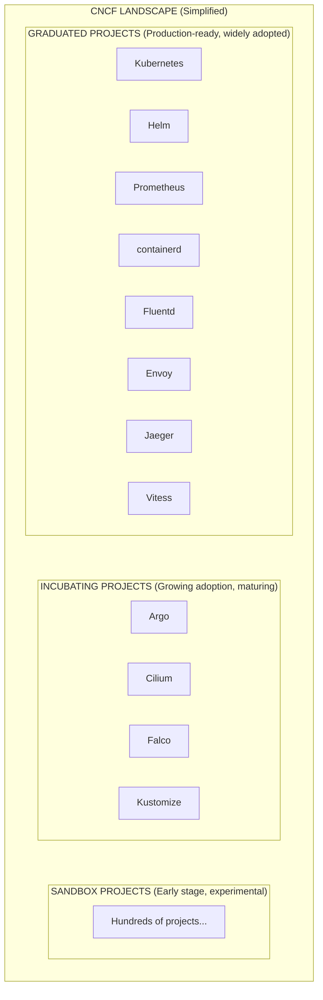
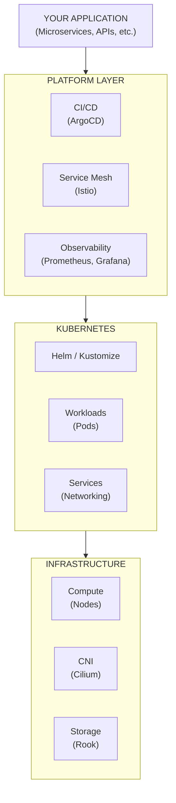
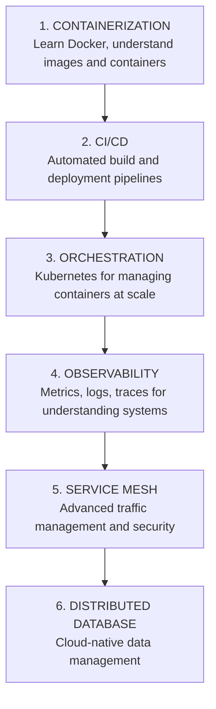
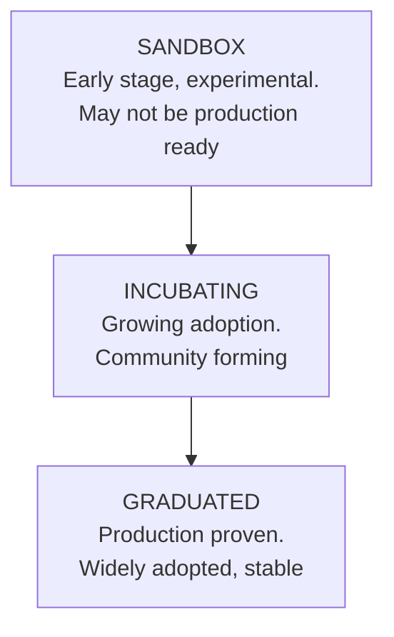

> **Complexity**: `[QUICK]` - Orientation, not deep dives
>
> **Time to Complete**: 25-30 minutes
>
> **Prerequisites**: Module 1.3 (What Is Kubernetes?)

---

## What You'll Be Able to Do

After this module, you will be able to:
- **Navigate** the CNCF landscape and explain what categories of tools exist
- **Match** common problems (observability, security, networking) to the tools that solve them
- **Explain** the CNCF graduation process and what it means for tool maturity
- **Identify** the 5-6 tools you'll encounter most in your first K8s job

---

## Why This Module Matters

Kubernetes doesn't exist in isolation. It's the center of a vast ecosystem of projects, tools, and practices. Understanding this ecosystem helps you:

1. Know what tools exist for different problems
2. Understand job descriptions and team discussions
3. Plan your learning path
4. Avoid reinventing the wheel

You won't learn these tools here—just know they exist and what they're for.

> **Pause and predict**: Before diving in, what categories of tools do you think are absolutely mandatory to run a production cluster, and which do you suspect are optional add-ons?

---

## War Story: The Resume-Driven Development Disaster

A mid-sized e-commerce company decided to migrate their monolithic application to Kubernetes. The lead architect, eager to use cutting-edge technology, mandated the immediate adoption of a complex Service Mesh, a bleeding-edge Sandbox distributed database, and advanced eBPF networking.

**The Result:** The team spent six months fighting the infrastructure instead of migrating the application. The Sandbox database suffered data loss during a minor upgrade, and the service mesh introduced unexplainable latency because no one on the team possessed the operational maturity to tune the proxies.

**The Lesson:** The CNCF landscape is a menu, not a checklist. Adopt tools only when you experience the exact pain point they were designed to solve. 

---

## The CNCF Landscape

The Cloud Native Computing Foundation (CNCF) hosts and governs cloud native projects. Their landscape includes 1000+ projects:

---

## Categories of Tools

> **Stop and think**: The CNCF landscape has 1,000+ projects. You don't need to know them all. In your first Kubernetes job, you'll likely use 5-6 tools daily. The goal here is to know what categories exist so when someone says "we need a service mesh" or "set up observability," you know what they're talking about.

### 1. Orchestration (Core)

| Tool | What It Does |
|------|--------------|
| **Kubernetes** | Container orchestration (the center of everything) |
| **Helm** | Package manager for K8s (like apt/yum for K8s) |
| **Kustomize** | Template-free K8s configuration |

### 2. Container Runtime

> **Stop and think**: If Kubernetes just orchestrates containers, who is actually running the container processes on the worker node?

| Tool | What It Does |
|------|--------------|
| **containerd** | Industry-standard container runtime |
| **CRI-O** | Lightweight runtime for K8s |

### 3. Networking

| Tool | What It Does |
|------|--------------|
| **Cilium** | CNI with eBPF-powered networking and security |
| **Calico** | Popular CNI for network policies |
| **Flannel** | Simple overlay network |
| **Istio** | Service mesh (traffic management, security) |
| **Linkerd** | Lightweight service mesh |
| **Envoy** | Service proxy (powers many service meshes) |

*Trade-off*: Advanced CNIs like Cilium offer incredible performance and security capabilities via eBPF, but they require modern Linux kernels and deeper network debugging skills compared to simpler overlay options like Flannel.

### 4. Observability

| Tool | What It Does |
|------|--------------|
| **Prometheus** | Metrics collection and alerting |
| **Grafana** | Visualization and dashboards |
| **Jaeger** | Distributed tracing |
| **Fluentd/Fluent Bit** | Log collection and forwarding |
| **Loki** | Log aggregation (Prometheus-style) |
| **OpenTelemetry** | Unified observability framework |

*Trade-off*: Running your own open-source Prometheus and Grafana stack gives you ultimate data privacy and avoids vendor data-ingestion costs, but it requires dedicated engineering time to maintain the observability infrastructure itself as you scale.

### 5. CI/CD and GitOps

| Tool | What It Does |
|------|--------------|
| **ArgoCD** | GitOps continuous delivery |
| **Flux** | GitOps toolkit |
| **Tekton** | K8s-native CI/CD pipelines |

*Trade-off*: ArgoCD and GitOps workflows provide excellent security and auditability by dynamically pulling state changes from a repository, but they require a paradigm shift for developers who are accustomed to CI tools (like Jenkins) simply pushing code to a server.

### 6. Security

> **Stop and think**: Notice how security isn't just one tool in one layer. How many different places in the stack might require distinct security tools (like image scanning vs. runtime policy enforcement vs. network encryption)?

| Tool | What It Does |
|------|--------------|
| **Falco** | Runtime security monitoring |
| **Trivy** | Container vulnerability scanning |
| **OPA/Gatekeeper** | Policy enforcement |
| **cert-manager** | Certificate management |

### 7. Storage

| Tool | What It Does |
|------|--------------|
| **Rook** | Storage orchestration (Ceph on K8s) |
| **Longhorn** | Distributed block storage |
| **Velero** | Backup and disaster recovery |

---

## Worked Example: Designing a Basic Stack

Imagine you are hired as the first DevOps engineer at a startup. They have a basic web app, an API, and a database. Here is how you might logically select tools from the ecosystem to build their very first production stack:

1. **Orchestration**: Managed Kubernetes (EKS/GKE) to avoid the operational nightmare of managing the control plane yourself.
2. **Packaging**: Helm. You write a standard Helm chart so developers can deploy new microservices easily without learning Kubernetes internals.
3. **CI/CD**: GitHub Actions building the container image, and ArgoCD pulling changes into the cluster (GitOps).
4. **Observability**: Prometheus for system metrics, Loki for application logs, and Grafana to visualize both in one place.
5. **Security**: Trivy automatically scanning images in GitHub Actions before they are pushed to the registry.

*Notice what is missing:* No complex service mesh, no distributed tracing, no custom storage orchestrator. You kept it simple, focusing entirely on reliable delivery and basic visibility.

> **Pause and predict**: What happens if the team suddenly decides they need to seamlessly encrypt all traffic between internal microservices? Which category of tool would they need to introduce to this basic stack?

---

## How They Fit Together

---

## What You Actually Need to Know

For certification and most jobs, focus on:

### Must Know
- **Kubernetes** - The platform itself
- **Helm** - Package management
- **Kustomize** - Configuration management
- **kubectl** - CLI tool

### Should Know (Conceptually)
- **Prometheus/Grafana** - Monitoring
- **Service mesh concepts** - Traffic management
- **CNI concepts** - How pod networking works
- **Container runtime** - containerd, CRI

### Good to Know About (Not Deep Knowledge)
- **ArgoCD/Flux** - GitOps
- **Istio/Linkerd** - Service mesh implementations
- **OPA/Gatekeeper** - Policy
- **Falco/Trivy** - Security scanning

---

## The Cloud Native Trail Map

CNCF provides an official learning path:

KubeDojo focuses on step 3 (Orchestration) with the depth needed for certification.

---

## Did You Know?

- **The CNCF landscape has over 1,000 projects.** You cannot learn them all. Focus on what your job requires.

- **Most companies use ~10-20 CNCF projects.** Not hundreds. Specialization beats breadth.

- **Kubernetes itself is ~2 million lines of code.** Plus millions more in ecosystem projects. This is why certifications focus on practical use, not internals.

- **New projects join CNCF every month.** The landscape evolves constantly. Core K8s skills remain stable; tooling around it changes.

---

> **Pause and predict**: Why might a company choose an 'Incubating' project over a 'Graduated' one?

## Ecosystem Maturity Levels

For production, prefer **Graduated** projects. For learning and experimentation, explore **Incubating** and even **Sandbox**.

---

## Quick Reference: Tool Categories

| When You Need... | Consider... |
|------------------|-------------|
| Package management | Helm, Kustomize |
| Monitoring | Prometheus + Grafana |
| Logging | Fluentd + Loki |
| Tracing | Jaeger, Tempo |
| Service mesh | Istio, Linkerd |
| GitOps | ArgoCD, Flux |
| Policy enforcement | OPA, Kyverno |
| Security scanning | Trivy, Falco |
| Secrets management | Vault, Sealed Secrets |
| Certificates | cert-manager |
| Backups | Velero |
| Local development | kind, minikube |

---

## Common Mistakes

| Mistake | Why It Happens | How to Avoid It |
|---------|----------------|-----------------|
| **Ignoring CNCF maturity tiers** | Teams see a shiny new tool in the Sandbox phase and deploy it to production, hoping for immediate benefits. | Stick to Graduated or Incubating projects for production workloads. Reserve Sandbox tools for experimental labs. |
| **Skipping observability until after an incident** | Focus is purely on getting the application running. Monitoring and logging are seen as "Phase 2" tasks. | Deploy Prometheus, Grafana, and Fluentd alongside your first production application. You cannot fix what you cannot see. |
| **Choosing tools based on blog hype vs. team capability** | A blog post praises a complex service mesh, and a team adopts it without having the engineering maturity to manage it. | Match the tool to your actual pain points and team skill level. Don't adopt Istio if you only have 3 microservices. |
| **Vendor lock-in from proprietary extensions** | Cloud providers offer "easy buttons" that tightly couple your Kubernetes manifests to their specific infrastructure. | Rely on open CNCF standards and projects (like Helm and standard Ingress) to maintain workload portability across clouds. |
| **Overcomplicating the stack early on** | Attempting to deploy the entire CNCF Trail Map before the first app goes live. | Start simple. Use managed Kubernetes, basic CI/CD, and core observability. Add service meshes or GitOps only when scale demands it. |
| **Neglecting security scanning in CI/CD** | Believing that running containers isolates applications completely, ignoring vulnerabilities within the container image itself. | Integrate tools like Trivy into your build pipeline to block images with critical CVEs from ever reaching the registry. |
| **Forgetting to manage persistent storage backups** | Assuming that because the application is highly available in Kubernetes, the data is automatically backed up. | Implement a cluster-aware backup solution like Velero to take snapshots of both persistent volumes and Kubernetes state. |
| **Treating Kubernetes as a silver bullet** | Assuming Kubernetes will automatically fix bad application architecture. | Ensure the application is actually cloud-native (stateless, horizontally scalable) before migrating. A bad monolith is still a bad monolith on K8s. |

---

## Quiz

### Level 1: Core Concepts

1. **Your company's CTO wants to ensure that the foundational tools for your new platform are governed by a neutral party, not controlled by a single vendor who could suddenly change licensing. She asks you which organization manages Kubernetes and related projects. What should you tell her?**
   

   
Answer

   You should explain that Kubernetes and its surrounding ecosystem are managed by the Cloud Native Computing Foundation (CNCF). The CNCF is a vendor-neutral organization, part of the Linux Foundation, designed specifically to host and govern cloud native open-source projects. This structure ensures that no single company can unilaterally dictate the project's direction or arbitrarily alter its licensing. By relying on CNCF governance, you guarantee long-term stability and a truly open ecosystem for your platform infrastructure.
   

2. **Your team needs to deploy the same application to three different environments (Dev, Staging, Prod). Currently, developers are copying and pasting raw YAML files, leading to configuration drift. You need a way to parameterize these deployments. What two distinct ecosystem approaches solve this?**
   

   
Answer

   You can solve this using either Helm or Kustomize, which take different approaches to the same problem. Helm acts as a package manager that uses a templating engine; you define variables in a `values.yaml` file that render the final manifests. Kustomize, on the other hand, is template-free and relies on patching; you maintain a base set of valid YAML files and apply overlays that mutate the base for each specific environment. Both tools effectively eliminate the need for copying and pasting raw YAML while maintaining clean, environment-specific configurations.
   

3. **You are evaluating a new policy enforcement tool for your cluster. The project website looks incredibly polished, but upon checking the CNCF landscape, you see it is listed as a "Sandbox" project. Your tech lead wants to deploy it to the production cluster tomorrow. What should you advise?**
   

   
Answer

   You should strongly advise against deploying it to production, explaining that "Sandbox" is the CNCF's earliest maturity stage meant for experimental projects. Sandbox projects have not yet demonstrated widespread adoption, production stability, or long-term community governance. Because of this early stage, the project could be abandoned, undergo massive breaking changes, or introduce critical unpatched bugs into your environment. Instead, you should recommend looking for an "Incubating" or "Graduated" project that solves the same problem, or thoroughly testing the Sandbox tool in a development environment first.
   

### Level 2: Applied Ecosystem

4. **Your microservices architecture has grown to 50 different services. You are experiencing random timeouts between services, but because they communicate directly, you have no visibility into where the network traffic is failing or being delayed. What type of tool do you need to introduce?**
   

   
Answer

   You need to introduce a Service Mesh, such as Istio or Linkerd. A service mesh injects a proxy (like Envoy) alongside every application container, intercepting all network traffic between services. This provides transparent observability, allowing you to trace requests, measure latency, and pinpoint exactly which service connection is timing out. Furthermore, a service mesh provides these powerful networking benefits without requiring your developers to make any changes to their application code.
   

5. **A security auditor points out that your container images might contain outdated libraries with known vulnerabilities, but your team currently only scans the source code. You need a way to automatically scan the compiled container images before they are deployed to Kubernetes. Which tool is best suited for this?**
   

   
Answer

   Trivy is the most appropriate ecosystem tool for this scenario. Trivy is a comprehensive and easy-to-use vulnerability scanner specifically designed for container images, file systems, and Git repositories. By integrating Trivy into your CI/CD pipeline, you can automatically fail the build if critical CVEs (Common Vulnerabilities and Exposures) are detected in the container layers. This ensures that vulnerable images are caught and blocked long before they can be pushed to the registry or reach your Kubernetes cluster.
   

6. **Your Kubernetes nodes keep running out of disk space. Upon investigation, you realize that container logs are being written to local disk and never cleared, making troubleshooting difficult since logs are lost if a node crashes. What combination of tools should you implement to fix this?**
   

   
Answer

   You should implement a log aggregation stack using tools like Fluentd (or Fluent Bit) and Loki. Fluent Bit acts as a DaemonSet to efficiently collect logs from every node and container in the cluster, forwarding them to a centralized backend. Loki can then store these logs efficiently, while Grafana provides the interface to query and visualize them. This architecture decouples the logs from the ephemeral nodes, ensuring persistence and centralized troubleshooting even after complete node failures.
   

### Level 3: Architecture Scenarios

7. **Your company has decided to adopt a GitOps approach. The current process involves Jenkins running `kubectl apply` using credentials stored in Jenkins, which has become a security and drift management nightmare. How would an ecosystem tool solve this?**
   

   
Answer

   You should adopt a GitOps continuous delivery tool like ArgoCD or Flux. Instead of pushing changes from an external CI server, these tools run directly inside the Kubernetes cluster and continuously pull the desired state from a Git repository. This fundamentally eliminates the need to store cluster credentials in an external system like Jenkins, drastically improving security. Additionally, if someone manually changes a resource in the cluster, the GitOps controller will detect the drift and automatically revert it back to the state defined in Git.
   

8. **You are deploying a stateful database onto Kubernetes. The pods are running fine, but when a pod gets rescheduled to a different node, all its data is lost because it was using temporary local storage. What CNCF ecosystem component and project type is missing?**
   

   
Answer

   You are missing a cloud-native storage orchestrator, such as Rook or Longhorn. While Kubernetes can attach volumes, it needs a storage backend that can replicate data across nodes and provide persistent block storage regardless of where the pod runs. Tools like Rook (managing Ceph) turn the local disks of your Kubernetes nodes into a resilient, distributed storage cluster. This ensures that when your database pod is rescheduled to a new node, it can immediately reattach to its persistent data over the network without any data loss.
   

---

## Hands-On Exercise: Build Your Stack

**Task**: Design a theoretical cloud native stack for a specific scenario using the CNCF landscape.

**Scenario**: You are architecting the infrastructure for a rapidly growing fintech startup. They need high security, clear audit logs, reliable metrics, and automated deployments.

**Instructions**:
1. Go to [landscape.cncf.io](https://landscape.cncf.io).
2. Select one tool for each category below that you believe fits the scenario.
3. Document your choices and your one-sentence reasoning.

**Success Criteria**:
- [ ] I have selected a Container Runtime.
- [ ] I have chosen an Observability stack (Metrics and Logging).
- [ ] I have selected a GitOps/CI/CD tool.
- [ ] I have identified a Security/Policy enforcement tool.
- [ ] I have verified that at least 3 of my selected tools are "Graduated" status.
- [ ] I have written a one-sentence justification for each choice based on the scenario constraints.

---

## Summary

The cloud native ecosystem includes:

**Core Orchestration**: Kubernetes, Helm, Kustomize
**Observability**: Prometheus, Grafana, Jaeger, Fluentd
**Networking**: Cilium, Calico, Istio, Envoy
**Security**: Falco, Trivy, OPA
**CI/CD**: ArgoCD, Flux, Tekton

Key points:
- The CNCF hosts 1000+ projects
- You don't need to learn them all
- Focus on what your certification/job requires
- Graduated projects are most stable
- Kubernetes is the foundation; everything else builds on it

---

## Next Module

[Module 1.5: From Monolith to Microservices](../module-1.5-monolith-to-microservices/) - Understanding application architecture evolution.