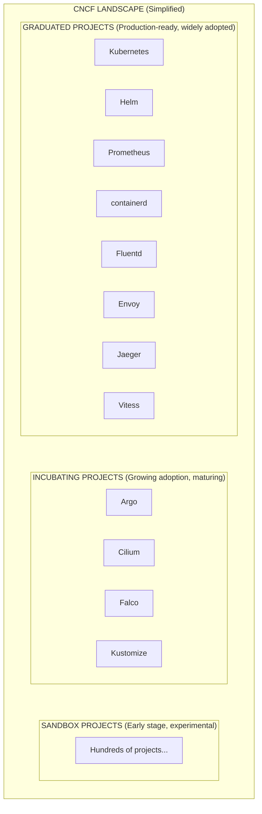
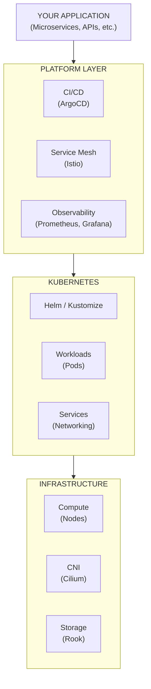
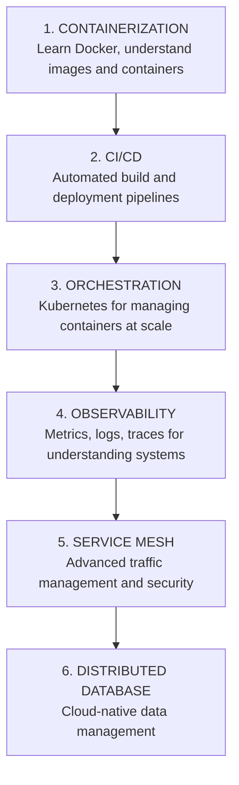
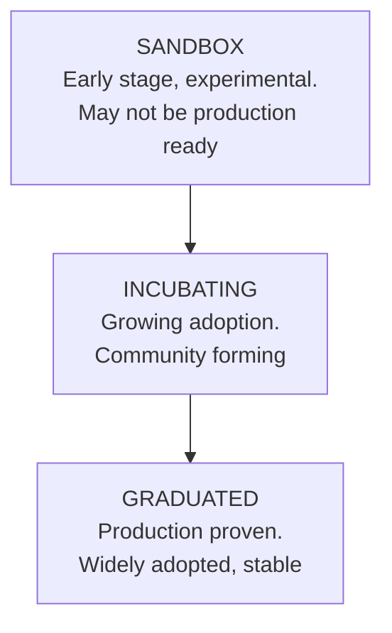

> **Complexity**: `[QUICK]` - Orientation, not deep dives
>
> **Time to Complete**: 40-55 minutes
>
> **Prerequisites**: Module 1.3 (What Is Kubernetes?)
>
> **Kubernetes target**: 1.35+

---

## What You'll Be Able to Do

After this module, you will be able to:

- **Navigate** CNCF landscape maturity categories to choose production-ready cloud native tools for Kubernetes platforms.
- **Match** observability, networking, security, CI/CD, and storage problems to appropriate ecosystem tool categories.
- **Evaluate** graduation, operational complexity, team capability, and vendor neutrality before adopting a new project.
- **Design** a minimal first production stack for a Kubernetes 1.35+ application using Helm, Kustomize, GitOps, and observability tools.

## Why This Module Matters

At 02:18 on a holiday sale weekend, a mid-sized e-commerce company discovered that its Kubernetes migration had not created a platform; it had created a museum of every cloud native project that had impressed someone in a conference talk. The lead architect had mandated a complex service mesh before the team had reliable metrics, selected a sandbox distributed database before the operations team had backup drills, and enabled advanced eBPF networking before anyone could explain the packet path during an outage. When checkout latency spiked, the incident room filled with dashboards, proxy logs, custom resource definitions, and half-remembered architecture diagrams, but no one could tell which layer owned the failure.

The bill was not theoretical. The company lost a full afternoon of peak orders, paid emergency consulting fees, and spent the following quarter unwinding tools that had been adopted before their problem statements were clear. The painful lesson was that the CNCF landscape is a menu, not a checklist. A production platform needs a small set of well-operated tools that solve known problems; it does not need every project that appears near Kubernetes on a landscape map.

This module teaches you how to read that ecosystem without drowning in it. You will learn how CNCF maturity levels signal risk, how tool categories map to real operational problems, and why a beginner should recognize more tools than they can operate deeply. The goal is not to memorize hundreds of logos. The goal is to hear a teammate say "we need policy enforcement," "we need GitOps," or "we need distributed tracing," and know which part of the ecosystem they are reaching for, what trade-off they are accepting, and what question to ask before the tool enters production.

## The Ecosystem Is a Supply Chain, Not a Shopping List

Kubernetes sits at the center of many cloud native platforms, but it is deliberately not a complete platform by itself. It schedules containers, maintains desired state, exposes service abstractions, and gives controllers a common API. It does not decide which container image scanner your team trusts, which dashboard explains latency, which GitOps controller reconciles deployments, which certificate authority issues workload certificates, or which backup tool protects persistent volumes. Those choices live in the wider ecosystem because different organizations have different risk tolerances, cloud providers, team skills, compliance needs, and migration paths.

The Cloud Native Computing Foundation exists partly because no single vendor can credibly own every layer of that operating model. CNCF hosts projects, defines governance expectations, publishes the landscape, and gives communities a neutral home under the Linux Foundation. Vendor neutrality matters when a tool becomes infrastructure. If your cluster networking, metrics, or delivery system depends on one company changing its license or roadmap overnight, the technical architecture has a business dependency hiding inside it.

The current landscape can feel overwhelming because it contains more than one thousand entries across runtime, provisioning, orchestration, networking, observability, security, storage, database, streaming, and delivery categories. That size should not scare you into studying every project. A working engineer treats the landscape like a city map: you need to know the major districts, the roads you use every day, and the warning signs that tell you when you are entering unfamiliar territory.



The maturity labels in that diagram are not decoration. A graduated project has shown broad adoption, healthy governance, documented security processes, and production use across organizations. An incubating project may already be powerful and widely used, but it is still proving some aspects of community maturity. A sandbox project is usually early exploration: useful for learning, prototypes, and future bets, but risky as the foundation of a production control path.

Pause and predict: if your team needs a new policy engine that will block unsafe production deployments, would you accept more feature richness from a sandbox project, or would you prefer fewer features from a graduated or incubating project with a stronger operational record? Write down the risk you are accepting either way, because this is the kind of trade-off platform engineers make constantly.

The important habit is to begin with the problem, then choose the category, then choose a tool. A team that says "we need Cilium" before it says "we need network policy enforcement, service visibility, and eBPF-based packet tracing" has skipped the reasoning step. Sometimes Cilium is exactly the right answer; sometimes Calico or a managed CNI is enough. The tool name should be the conclusion of an evaluation, not the opening sentence.

This is also why Kubernetes certification paths teach the core objects before surrounding products. Pods, Deployments, Services, ConfigMaps, Secrets, probes, NetworkPolicies, and storage claims are the platform grammar. Ecosystem tools extend that grammar, automate parts of it, or enforce rules around it. If you can already reason about what Kubernetes 1.35+ does natively, you can judge whether an ecosystem tool is filling a real gap or merely adding a second way to misunderstand the same system.

## The Core Layers You Will Meet First

The first layer is orchestration, and Kubernetes is the center of it. Kubernetes answers a deceptively simple question: given a desired state, which containers should run where, and what should happen when reality drifts from that desired state? Helm and Kustomize live close to this core because teams need repeatable ways to package and vary Kubernetes manifests. Helm behaves like a package manager with templates and values, while Kustomize starts from valid YAML and applies overlays without a template language.

| Tool | What It Does |
|------|--------------|
| **Kubernetes** | Container orchestration (the center of everything) |
| **Helm** | Package manager for K8s (like apt/yum for K8s) |
| **Kustomize** | Template-free K8s configuration |

For a beginner, the practical distinction is simple. Use Helm when you need to install or distribute an application with many configurable parts, especially when the upstream project already publishes a chart. Use Kustomize when you already have plain manifests and need clean environment overlays for development, staging, and production. Many real teams use both: Helm for third-party packages, Kustomize or GitOps overlays for local policy and environment differences.

The second layer is the container runtime, which is easy to forget because Kubernetes hides it well. Kubernetes does not directly become a Linux process running your application. A node agent called the kubelet talks through the Container Runtime Interface to a runtime such as containerd or CRI-O, and that runtime pulls images, creates containers, attaches storage and networking, and supervises container lifecycle on the node.

| Tool | What It Does |
|------|--------------|
| **containerd** | Industry-standard container runtime |
| **CRI-O** | Lightweight runtime for K8s |

Stop and think: if Kubernetes just orchestrates containers, who is actually running the container processes on the worker node? The answer matters during incidents because a Pod stuck in `ContainerCreating` may involve image pulls, runtime configuration, node disk pressure, or CNI setup rather than a broken Deployment spec. Kubernetes is the control plane, but the node runtime is where your application becomes a process.

The third layer is networking, where many production clusters become interesting and occasionally painful. Kubernetes defines Services, DNS, and network policy concepts, but the actual packet path depends on the Container Network Interface implementation and sometimes on a service mesh or proxy layer. Simple overlay networks optimize for ease of operation. Advanced CNIs can bring high performance, identity-aware policy, encryption, and deep observability, but they also demand stronger Linux and networking skills from the team.

| Tool | What It Does |
|------|--------------|
| **Cilium** | CNI with eBPF-powered networking and security |
| **Calico** | Popular CNI for network policies |
| **Flannel** | Simple overlay network |
| **Istio** | Service mesh (traffic management, security) |
| **Linkerd** | Lightweight service mesh |
| **Envoy** | Service proxy (powers many service meshes) |

Advanced CNIs like Cilium can be excellent when teams need eBPF-powered visibility, identity-aware policy, and efficient datapaths, but those benefits come with a learning curve. Simpler overlay options can be easier to operate for small clusters with modest policy needs. Service meshes such as Istio and Linkerd solve a different networking problem: they control service-to-service traffic behavior, often through proxies, so they can add mutual TLS, retries, traffic splits, and telemetry across many services.

Observability is the fourth layer, and it should not wait until the first outage. Metrics tell you how a system behaves over time, logs explain discrete events, and traces follow one request across service boundaries. Without those signals, a Kubernetes cluster becomes an expensive guessing machine. You can know that a Pod restarted, but not why users saw slow checkout, which dependency was saturated, or whether the change that broke production was deployed by a human or a controller.

| Tool | What It Does |
|------|--------------|
| **Prometheus** | Metrics collection and alerting |
| **Grafana** | Visualization and dashboards |
| **Jaeger** | Distributed tracing |
| **Fluentd/Fluent Bit** | Log collection and forwarding |
| **Loki** | Log aggregation (Prometheus-style) |
| **OpenTelemetry** | Unified observability framework |

Running your own open-source Prometheus and Grafana stack gives strong control over data, costs, retention, and integrations. It also creates an operational responsibility: someone must manage cardinality, storage, alert quality, upgrades, dashboard sprawl, and backup of observability configuration. Managed observability reduces that burden, but it can create data-ingestion costs and vendor dependencies. Neither choice is morally superior; the right choice depends on team capacity and business constraints.

CI/CD and GitOps form the fifth layer because Kubernetes is declarative enough for reconciliation to become a deployment model. Traditional pipelines often build an image and then push manifests into a cluster using credentials stored in the CI system. GitOps reverses that direction: a controller such as Argo CD or Flux runs in the cluster, watches Git for desired state, and reconciles the live cluster toward that state. The security and audit benefits are real, but the workflow requires developers to think in pull-based state reconciliation instead of imperative deployment scripts.

| Tool | What It Does |
|------|--------------|
| **ArgoCD** | GitOps continuous delivery |
| **Flux** | GitOps toolkit |
| **Tekton** | K8s-native CI/CD pipelines |

The sixth layer is security, which is not one product because "security" is not one problem. Image scanning checks what is inside a container before it runs. Admission policy checks whether a manifest should be allowed into the cluster. Runtime detection watches behavior after workloads start. Certificate automation protects service identity and transport security. Network policies limit lateral movement. A mature platform layers these controls because each catches a different class of mistake.

| Tool | What It Does |
|------|--------------|
| **Falco** | Runtime security monitoring |
| **Trivy** | Container vulnerability scanning |
| **OPA/Gatekeeper** | Policy enforcement |
| **cert-manager** | Certificate management |

Pause and predict: how many different places in the stack might need distinct security controls if a vulnerable image reaches production, opens an unexpected outbound connection, and uses an expired certificate? The point is not to buy more tools. The point is to notice that prevention, admission, runtime detection, network boundaries, and certificate management happen at different moments in the workload lifecycle.

The seventh layer is storage and recovery. Kubernetes can request and attach persistent volumes, but that does not automatically make state safe. Teams still need storage classes, replication choices, backup schedules, restore testing, and a plan for cluster metadata. Tools such as Rook and Longhorn operate storage inside or near Kubernetes, while Velero focuses on backup and disaster recovery workflows for cluster resources and persistent volume snapshots.

| Tool | What It Does |
|------|--------------|
| **Rook** | Storage orchestration (Ceph on K8s) |
| **Longhorn** | Distributed block storage |
| **Velero** | Backup and disaster recovery |

The beginner mistake is to classify these categories as optional extras because an application can start without them. In reality, the categories become mandatory at different stages of production maturity. A toy cluster can run with minimal logging, no GitOps, and simple networking. A regulated payment platform needs auditability, policy enforcement, vulnerability management, reliable rollback, backup testing, and enough observability to explain incidents to both engineers and auditors.

## How the Pieces Fit in a Platform

A cloud native platform is easier to reason about when you separate application concerns, platform concerns, Kubernetes concerns, and infrastructure concerns. Your application contains business services and APIs. The platform layer controls how code reaches the cluster, how traffic is managed, how telemetry is collected, and how policy is enforced. Kubernetes provides the shared API and reconciliation model. Infrastructure supplies compute, networking, storage, identity, and load balancing underneath.



The diagram is simplified, but the separation is useful during design reviews. If a team complains that deployments are slow, the answer may belong in CI/CD or GitOps. If Pods cannot reach each other, the answer may involve Services, DNS, NetworkPolicy, or the CNI. If auditors need proof that production changes were reviewed, the answer may involve Git history, admission policy, and controller logs. The same incident can cross layers, so naming the layer prevents random tool selection.

Here is the first command habit to keep: this curriculum introduces `kubectl` once, then uses the shorter alias `k` for examples. In a real shell you can run `alias k=kubectl`, and in later Kubernetes modules you will inspect cluster resources with commands such as `k get pods -A` or `k get svc -A`. This ecosystem module is mostly conceptual, but the alias matters because the verifier expects Kubernetes examples to use the same shorthand after introduction.

```bash
alias k=kubectl
k get pods -A
k get nodes -o wide
```

Those commands do not install ecosystem tools. They simply reinforce the boundary between the core Kubernetes API and the surrounding projects. When you run `k get pods -A`, you are asking the cluster about workloads. When you install Prometheus, Argo CD, Cilium, or cert-manager, you are usually adding controllers, custom resources, agents, webhooks, or dashboards that extend how the platform behaves around those workloads.

Consider a basic request path for a production web service. A developer changes application code, CI builds a container image, a scanner checks the image, Git receives an updated manifest or chart value, a GitOps controller reconciles the cluster, Kubernetes rolls out Pods, the CNI gives those Pods network connectivity, Services route traffic, observability tools collect signals, and security tools enforce or monitor policy. No single project owns the whole chain, which is exactly why ecosystem literacy matters.

The same chain also explains why tool choices compound. If the image scanner produces noisy findings, developers learn to ignore security output. If GitOps reconciliation is poorly understood, engineers may fight the controller with manual `k apply` commands and create drift. If observability storage is underprovisioned, the team loses the data needed to debug the next rollout. A weak tool choice in one layer becomes operational debt in another layer.

Which approach would you choose here and why: a startup with two services, no compliance burden, and one platform engineer could adopt managed Kubernetes, Helm, Prometheus, and basic log shipping first; a bank platform with dozens of teams may need GitOps, admission policy, certificate automation, network policy, backup automation, and audit logging from the beginning. The difference is not that one team is more serious. The difference is the cost of failure and the number of people depending on the platform.

The CNCF trail map captures a common learning sequence: containerization, CI/CD, orchestration, observability, service mesh, and cloud native data management. The sequence is not a law, but it is a useful warning against adopting late-stage tools before early-stage foundations exist. A service mesh cannot compensate for missing deployment discipline. Distributed tracing cannot help if applications do not emit meaningful spans. A distributed database will not rescue a team that has never restored from backup.



KubeDojo focuses heavily on orchestration because that is the foundation you need before ecosystem choices become meaningful. Once you know how Pods, Services, Deployments, probes, ConfigMaps, Secrets, storage claims, and NetworkPolicies behave, you can read ecosystem documentation with better questions. You can ask what controller is installed, what custom resources it adds, what failure it handles, what failure it creates, and how you would remove it if the tool disappointed you.

## Maturity, Graduation, and Adoption Risk

CNCF project maturity is not a guarantee that a tool is perfect, but it is a useful signal for production risk. A sandbox project may be innovative, fast-moving, and exactly where the future is forming. It may also change APIs quickly, lack broad operator experience, or have a smaller security response process. A graduated project may be less exciting, but it usually has more production stories, more integrations, more troubleshooting material, and more people who can operate it when the original champion leaves.



For production systems, prefer graduated projects when they solve the problem well enough. Consider incubating projects when they solve a problem that graduated projects do not solve for your environment, or when the community and vendor support are strong enough for your risk profile. Reserve sandbox projects for labs, prototypes, non-critical workloads, and deliberate innovation bets with rollback plans. The key word is deliberate; experimentation is healthy when the blast radius is honest.

Maturity should be evaluated alongside team capability. A sophisticated service mesh can be safer than hand-written mutual TLS across many languages, but only if the team can operate certificates, proxies, control planes, traffic policies, and debugging workflows. A powerful CNI can improve security and visibility, but only if engineers can interpret datapath behavior. A GitOps controller improves auditability, but only if developers understand reconciliation and stop treating the cluster as the source of truth.

Vendor neutrality is another adoption dimension. CNCF projects often have commercial distributions, managed offerings, and vendor-backed maintainers, which can be a strength. The risk appears when a team depends on provider-specific extensions without understanding the portability cost. A managed add-on can be the right pragmatic choice, but the team should know which manifests, APIs, dashboards, and operational procedures would need to change if the platform moved.

The resume-driven development war story from the opening is common because new tools feel like progress. Engineers enjoy learning, vendors publish persuasive case studies, and architecture diagrams look more impressive when they contain familiar logos. Strong platform teams slow down that impulse by asking boring questions: what pain are we solving, who will operate the tool, what happens during upgrade, how do we observe it, how do we remove it, and what simpler option did we reject?

Before adopting a project, read its release notes, security policy, upgrade guide, community activity, and production references. Check whether it supports your Kubernetes 1.35+ target, whether it relies on kernel or cloud-provider features you do not have, and whether it introduces custom resources that become part of your platform contract. A tool that installs easily in a demo can still be expensive if every application team must now learn its custom vocabulary.

The maturity conversation is not only about avoiding young projects. It is also about avoiding old habits. Some teams cling to familiar proprietary tools because the open ecosystem feels messy, even when CNCF projects would reduce lock-in and improve hiring. Others reject managed services on principle, then quietly spend more engineering time operating commodity infrastructure than building product value. Good platform decisions are sober, not ideological.

## Worked Example: Designing a Basic Stack

Imagine you are hired as the first DevOps engineer at a startup with a web frontend, an API, a worker process, and a managed database. The founders want reliability, but they do not yet have a platform team. The best first stack should reduce operational risk while leaving room to grow. That means choosing boring, well-understood components, using managed services where the team lacks depth, and resisting tools whose main benefit appears only at larger scale.

Start with managed Kubernetes such as EKS, GKE, or AKS so the team does not own the control plane on day one. Use containerd through the managed node runtime rather than customizing runtime behavior. Package internal services with a small Helm chart or a Kustomize base and overlays, depending on which style the team can maintain. Add basic CI that builds images, scans them, and publishes immutable tags. Then use Argo CD or Flux only if the team is ready to make Git the source of truth for deployment state.

Observability should be present from the first production deployment, but it should be proportional. Prometheus, Grafana, and a log collector such as Fluent Bit give enough visibility to answer basic questions about saturation, errors, restarts, and application logs. Distributed tracing may wait until service boundaries and latency problems justify it. A startup with one API and one worker does not need an elaborate tracing strategy before it has meaningful service-to-service calls.

Security should begin with image scanning and least-privilege Kubernetes manifests. Trivy in CI can catch vulnerable packages before images reach the registry. Basic admission policies can prevent privileged containers, missing resource requests, or unsafe host mounts once the team is ready. cert-manager may be worth adding early if the cluster terminates TLS or issues internal certificates. A service mesh for universal mTLS is usually premature unless regulatory or multi-team conditions demand it.

Notice what is missing from this first stack: no complex service mesh, no custom distributed database, no hand-operated storage system, and no experimental policy engine. The missing pieces are not rejected forever. They are deferred until the team can describe the pain they solve. That restraint is what makes the platform maintainable.

Pause and predict: what happens if the same team suddenly needs to encrypt all traffic between internal microservices because a customer contract requires it? The category shifts toward service mesh, certificate automation, and possibly network policy. The decision also shifts from "nice to have" to "contractual requirement," which changes the acceptable complexity budget.

Here is the original quick-reference view, preserved and expanded as a decision aid. Read it left to right, not as a buying list. The phrase "when you need" should always be backed by a concrete incident, compliance requirement, scaling pressure, or developer workflow problem.

| When You Need... | Consider... |
|------------------|-------------|
| Package management | Helm, Kustomize |
| Monitoring | Prometheus + Grafana |
| Logging | Fluentd + Loki |
| Tracing | Jaeger, Tempo |
| Service mesh | Istio, Linkerd |
| GitOps | ArgoCD, Flux |
| Policy enforcement | OPA, Kyverno |
| Security scanning | Trivy, Falco |
| Secrets management | Vault, Sealed Secrets |
| Certificates | cert-manager |
| Backups | Velero |
| Local development | kind, minikube |

The worked example also shows why "minimal" does not mean careless. A minimal platform still needs a path to build images, deploy manifests, observe health, roll back bad changes, and avoid shipping obviously vulnerable containers. It simply avoids adding advanced tools before the team has the operations muscle to benefit from them. The best first platform is one that a tired on-call engineer can understand at 02:18.

If the startup later grows to dozens of services and multiple teams, the stack can evolve. GitOps becomes more valuable as audit and drift control matter. Service mesh becomes more attractive when language diversity, mutual TLS, traffic splitting, and telemetry consistency are real problems. Policy engines become essential when many teams submit manifests. Backup tooling becomes more formal as stateful workloads and compliance grow. The ecosystem is not a one-time selection; it is a sequence of adoption decisions.

## What You Actually Need to Know First

For certification and most first Kubernetes roles, you should separate deep operating knowledge from recognition knowledge. Deep operating knowledge means you can read manifests, run commands, debug common failures, and explain what the object or controller is doing. Recognition knowledge means you can place a tool in the right category, understand why a team might use it, and ask sensible questions without pretending you can operate it alone in production.

Kubernetes itself belongs in the deep knowledge category. You need to know Pods, Deployments, ReplicaSets, Services, ConfigMaps, Secrets, probes, namespaces, labels, selectors, storage claims, and basic RBAC well enough to troubleshoot live behavior. When an application is unavailable, you should be able to inspect Pods with `k get pods -A`, describe a failing workload, read events, and distinguish a scheduling issue from an image pull issue or a readiness issue.

Helm and Kustomize sit near that deep category because they affect how manifests reach the cluster. You do not need to be a chart author on day one, but you should know that Helm renders templates from values and that Kustomize patches valid YAML through bases and overlays. When a production object looks different from the file a developer expected, packaging and overlay tools are often part of the explanation.

Prometheus and Grafana deserve early conceptual fluency because they are common in both learning clusters and production systems. You should understand that Prometheus scrapes metrics from targets, stores time series, and evaluates alert rules, while Grafana visualizes data from Prometheus and other sources. You do not need to tune high-cardinality metrics immediately, but you should know enough to ask whether an alert is based on symptoms, saturation, errors, or a noisy implementation detail.

CNI concepts also deserve early attention even if your cloud provider installs the plugin for you. Pod networking, Services, DNS, and NetworkPolicy feel like Kubernetes concepts, but the implementation depends on the CNI and the cloud network around it. When traffic fails, a good beginner does not simply blame "Kubernetes networking." They ask whether DNS resolved, whether a Service has endpoints, whether policy allows the flow, whether the node route exists, and whether the CNI agent is healthy.

Container runtime knowledge should be practical rather than encyclopedic. You should know that containerd or CRI-O handles image pulls and container lifecycle on the node, and that kubelet reports container states through Kubernetes. You do not need to memorize runtime internals to pass an introductory module. You do need to know that a container image problem, registry authentication failure, or node disk-pressure issue may surface as a Pod problem even though the Deployment object is correct.

GitOps tools such as Argo CD and Flux belong in the recognition-to-working category for many early roles. If your team uses GitOps, you must understand reconciliation, drift, sync status, and the idea that Git is the desired state. If your team does not use GitOps yet, you should still recognize the pattern because job descriptions and platform conversations mention it constantly. The dangerous beginner move is using manual `k apply` commands against resources owned by a GitOps controller without understanding why the controller reverts them.

Service mesh concepts can remain conceptual until the architecture requires them. You should know that Istio and Linkerd can add mutual TLS, traffic policy, telemetry, retries, and traffic splitting by controlling service-to-service communication. You should also know that a mesh is not free reliability. It adds proxies, configuration, certificates, upgrade planning, and a second place where networking behavior can break.

Security tools span multiple levels of depth. Image scanning is usually easy to add early because it fits naturally into CI. Admission policy requires stronger Kubernetes object knowledge because it decides which resources may enter the cluster. Runtime security demands a clear mental model of normal process, file, and network behavior. Certificate automation is operationally valuable but unforgiving when renewals, issuers, or trust chains are misunderstood.

Storage and backup knowledge should begin with one uncomfortable truth: highly available Pods do not equal durable data. Kubernetes can reschedule workloads, but it cannot recreate lost business data from good intentions. Even if a managed database handles most state, the platform may still contain persistent volumes, cluster resources, secrets, custom resources, and application configuration that require backup and restore planning. The first restore test teaches more than a dozen optimistic architecture diagrams.

Local development tools such as kind and minikube are worth recognizing because they shorten the feedback loop. They are not production platforms, and that is exactly their value. A local cluster lets you practice manifests, controllers, networking assumptions, and `k` inspection without waiting for a shared environment. The skill is knowing which results transfer to production and which depend on local simplifications.

The first-job learning path is therefore narrower than the landscape but wider than raw Kubernetes. Learn Kubernetes deeply, learn packaging enough to read what gets deployed, learn observability enough to debug symptoms, learn networking enough to ask layer-specific questions, and learn security categories enough to avoid shipping obvious risk. Everything else can be learned just-in-time when your team has a concrete problem, a chosen tool, and an operator who owns it.

## Operating Questions Before Adoption

Every ecosystem adoption should survive an operations review before it reaches production. The review does not need to be bureaucratic, but it should be explicit. Ask what user-facing failure the tool reduces, what new failure modes it introduces, who receives the alert when it breaks, how upgrades are tested, how configuration is backed up, and what rollback looks like if the tool corrupts state or blocks deployments.

The rollback question is especially revealing. Some tools are easy to remove because they run beside the platform and export data elsewhere. Other tools become part of the application contract through custom resources, injected sidecars, admission webhooks, network policy models, or storage abstractions. The deeper the tool sits in the control path, the more conservative the adoption plan should be. A dashboard outage is annoying; a broken admission webhook can stop every deployment.

Upgrade planning deserves the same seriousness. Kubernetes itself moves through versions, and ecosystem projects must keep up with API removals, security patches, and controller-runtime changes. A project that supports Kubernetes 1.35+ today may still require careful chart upgrades, CRD conversion checks, or feature-gate decisions. Teams that skip upgrade rehearsals often discover during a security emergency that the platform has too many undocumented dependencies to patch quickly.

Observing the tool is part of operating the tool. A GitOps controller needs health, reconciliation, queue, and error metrics. A CNI needs agent health, policy status, and datapath signals. A service mesh needs proxy health, certificate status, control-plane metrics, and traffic telemetry. An image scanner needs feed freshness and failure reporting. If a tool is important enough to protect production, it is important enough to monitor.

Ownership must be named in human terms, not just in architecture diagrams. "The platform team owns it" is too vague if no one knows who reviews upgrades, triages alerts, writes runbooks, handles security advisories, and approves application-team exceptions. A cloud native platform is a shared product. Its dependencies need product management habits: lifecycle, documentation, support boundaries, deprecation plans, and user feedback.

Cost should be measured in engineering time as well as infrastructure or licensing. An open-source tool can be free to download and expensive to operate. A managed service can be expensive on a bill and cheap compared with hiring enough specialists to operate the same capability safely. A commercial platform can be justified when support, governance, and integration reduce delivery risk. The mature conversation compares total cost, not ideology.

The final adoption question is whether the team has a smaller experiment available. Can the tool run in one namespace, one cluster, one non-critical application, or one environment before becoming platform-wide? Can you test an upgrade with real manifests? Can you rehearse removal? Can you prove that the tool solves the original pain? Small pilots turn ecosystem exploration from wishful architecture into evidence.

## Patterns & Anti-Patterns

Because this is a quick orientation module, you do not need a large pattern catalog yet. You do need one durable pattern and one dangerous anti-pattern that will appear again throughout the curriculum. The pattern is problem-first adoption: name the operational pain, choose the category, evaluate maturity and team capability, then pilot the smallest tool that solves the pain. The anti-pattern is logo-first adoption: choose a famous project, then reorganize your platform narrative until the choice sounds inevitable.

| Pattern | When to Use It | Why It Works | Scaling Consideration |
|---|---|---|---|
| Problem-first ecosystem adoption | When a team proposes a new cloud native tool for production | It keeps tool choice connected to a measurable failure, compliance need, or workflow gap | Revisit the decision after the pilot and remove tools that do not earn their operating cost |
| Layered platform ownership | When multiple teams depend on shared Kubernetes services | It assigns clear owners for runtime, networking, observability, delivery, and security layers | Document interfaces between layers so application teams know where to ask for help |
| Maturity-gated experimentation | When a sandbox or early incubating project looks promising | It allows innovation without making the experimental project a critical production dependency | Keep blast radius small, define rollback, and review maturity before expanding use |

| Anti-Pattern | What Goes Wrong | Better Alternative |
|---|---|---|
| Installing the CNCF landscape by logo recognition | Teams accumulate controllers, dashboards, and CRDs that nobody can debug | Start with Kubernetes basics, observability, delivery, and security controls that match current risk |
| Treating managed add-ons as architecture-free decisions | Provider defaults hide portability, upgrade, and debugging assumptions | Use managed services deliberately and document what is provider-specific |
| Adopting service mesh before basic telemetry and ownership | The mesh adds proxies and policies while the team still cannot explain normal traffic | Establish metrics, logs, traces, probes, and service ownership before adding mesh complexity |

The anti-pattern is tempting because every tool can be justified in isolation. Prometheus is useful, Argo CD is useful, cert-manager is useful, Cilium is useful, Falco is useful, and Velero is useful. The platform becomes fragile when nobody prioritizes the order of adoption, trains operators, reviews upgrades, or removes abandoned experiments. Usefulness is not the same as readiness.

## When You'd Use This vs Alternatives

For a quick module, the decision framework is a compact comparison rather than a full architecture review process. You are choosing among "do nothing yet," "use Kubernetes built-ins," "adopt a CNCF project," "use a managed provider feature," and "buy a commercial platform." Each option can be correct. The wrong move is pretending the choice has no trade-off.

| Option | Use It When | Avoid It When | Trade-Off |
|---|---|---|---|
| Do nothing yet | The pain is speculative and no production requirement exists | The absence of the tool blocks reliability, security, or auditability | Lowest complexity, but risks delayed foundations |
| Kubernetes built-ins | Native objects solve the need well enough | You need cross-cluster policy, advanced telemetry, or richer workflows | Strong portability, fewer moving parts |
| CNCF project | You need a capability Kubernetes does not provide directly | The team cannot operate the project or accept its maturity risk | Open ecosystem, community knowledge, operational ownership |
| Managed provider feature | You need speed and provider integration | Portability or deep customization matters more | Lower operating burden, more provider dependency |
| Commercial platform | You need support, governance, and integrated workflows | The team needs full control or cannot justify cost | Faster adoption, licensing and vendor constraints |

Apply the framework by asking five questions. What failure or workflow are we improving? Which ecosystem category owns that problem? What does Kubernetes already provide? What maturity and support level does the proposed tool have? Who will be paged when it breaks? If any question produces hand-waving, the adoption decision is not ready yet.

This framework also keeps certifications in perspective. For your first Kubernetes job, you should deeply know Kubernetes, `k` usage, manifests, Helm or Kustomize basics, and enough observability vocabulary to participate in incidents. You should conceptually recognize service mesh, CNI, GitOps, policy, runtime security, backups, and tracing. You do not need to operate every project on the landscape before you can be useful.

## Did You Know?

- **The CNCF landscape has more than 1,000 entries.** That size is a signal to learn categories first, because even experienced platform engineers specialize in a small slice of the ecosystem.
- **Kubernetes entered CNCF as the first hosted project in 2016.** Its graduation helped make vendor-neutral orchestration a shared foundation rather than a single-provider product strategy.
- **Prometheus became the second CNCF graduated project in 2018.** That history explains why Kubernetes and Prometheus are so often taught together in cloud native operations.
- **The CNCF graduation process requires public evidence of adoption and governance.** Graduation is not a feature checklist; it is a maturity signal about community, maintainers, security practices, and production use.

## Common Mistakes

| Mistake | Why It Happens | How to Fix It |
|---|---|---|
| Ignoring CNCF maturity tiers | Teams see a shiny sandbox tool and deploy it to production because the demo looks polished | Prefer graduated or mature incubating projects for critical paths, and keep sandbox projects in labs unless the blast radius is small |
| Skipping observability until after an incident | The team focuses on getting Pods running and treats metrics, logs, and traces as a later improvement | Add basic metrics, dashboards, and log collection with the first production service so incidents have evidence |
| Choosing tools based on blog hype instead of team capability | A case study from a larger company sounds impressive, so the team copies the stack without the same operators | Match the tool to a real pain point, available skills, upgrade capacity, and on-call ownership |
| Creating vendor lock-in accidentally | Managed add-ons feel easy, and provider-specific APIs enter manifests before anyone notices | Document provider-specific choices and prefer standard Kubernetes or CNCF interfaces where portability matters |
| Overcomplicating the stack early | Teams try to deploy the entire trail map before the first app is stable | Start with managed Kubernetes, packaging, CI/CD, observability, image scanning, and backups, then add advanced layers when pain appears |
| Neglecting security scanning in CI/CD | Developers assume containers isolate applications and forget vulnerable packages inside image layers | Run image scanning before registry push and combine it with admission policy for production enforcement |
| Forgetting persistent storage backups | Kubernetes high availability is mistaken for data durability | Use backup tooling such as Velero where appropriate, and regularly test restore procedures rather than only creating backup schedules |
| Treating Kubernetes as a silver bullet | Migration energy focuses on the platform while application architecture, ownership, and observability remain weak | Fix application readiness, health checks, resource requests, ownership, and operational practices alongside the cluster migration |

## Quiz

<details>
<summary>Scenario: Your team wants to navigate CNCF landscape maturity categories for a new production policy engine. The most exciting option is sandbox, while a graduated option has fewer features. What should you recommend?</summary>

Recommend the graduated or mature incubating option unless the sandbox project is isolated from critical production paths. Policy enforcement can block deployments or accidentally allow unsafe workloads, so maturity, security response, upgrade discipline, and operator knowledge matter more than a long feature list. A sandbox pilot can still run in a non-critical environment if the team wants to learn. The reasoning is to separate experimentation from production control-plane risk.
</details>

<details>
<summary>Scenario: A developer says the platform needs "observability," but the incident review mentions missing metrics, missing request paths, and lost container logs. How would you match those problems to ecosystem tool categories?</summary>

Separate the signals before choosing tools. Metrics and alerting point toward Prometheus, visualization toward Grafana, log collection toward Fluentd or Fluent Bit with a backend such as Loki, and request-path analysis toward tracing with Jaeger or OpenTelemetry. Treating all of that as one vague observability purchase creates gaps because each signal answers a different question. The best answer maps the problem to categories first, then selects tools that fit team capacity.
</details>

<details>
<summary>Scenario: A startup is designing a first Kubernetes 1.35+ production stack with one API, one worker, and a managed database. Which ecosystem pieces would you include first, and which would you defer?</summary>

Include managed Kubernetes, a simple packaging approach with Helm or Kustomize, CI image builds, image scanning, basic metrics, dashboards, logs, and a clear deployment workflow that may include GitOps if the team can operate it. Defer service mesh, custom distributed storage, and experimental databases unless a specific requirement forces them. The reasoning is that the first stack should cover delivery, visibility, rollback, and obvious security controls without overwhelming the only operators. Future growth can add mesh, policy, tracing, and backup sophistication as pain becomes real.
</details>

<details>
<summary>Scenario: Leadership asks why vendor neutrality matters if the cloud provider offers a convenient managed add-on for every platform layer. How would you evaluate the adoption risk?</summary>

Managed add-ons can be the right choice when they reduce undifferentiated operating work, but they still encode provider-specific assumptions. Evaluate which APIs, manifests, dashboards, identity integrations, and upgrade procedures would change if the team moved providers or needed self-managed operation. Vendor neutrality from CNCF projects reduces single-vendor control, while managed services reduce day-to-day burden. The decision should document portability cost instead of pretending convenience is free.
</details>

<details>
<summary>Scenario: A team with three microservices wants to install Istio because another company uses it successfully. What operational complexity should you evaluate before adopting it?</summary>

Evaluate whether the team already has reliable metrics, logs, traces, readiness probes, service ownership, and basic network troubleshooting. A service mesh adds proxies, certificates, traffic policy, control-plane upgrades, and another failure mode in every request path. For three services, simpler Kubernetes Services, Ingress, NetworkPolicy, and application-level telemetry may solve the current problem. Istio becomes more compelling when mutual TLS, traffic splitting, and consistent policy across many services justify the operating cost.
</details>

<details>
<summary>Scenario: During an audit, several production images contain vulnerable OpenSSL packages even though source code scanning passed. Which security category closes this gap, and why?</summary>

The missing category is container image vulnerability scanning, with tools such as Trivy commonly used in CI/CD pipelines. Source scanning examines application code, but container images include operating system packages and language dependencies that may not appear in the repository. Scanning the final image before registry push catches known CVEs in those layers. For production enforcement, the team can combine scanning with admission policy so unapproved images cannot enter the cluster.
</details>

<details>
<summary>Scenario: A team uses Jenkins to run manual `k apply` commands, while Argo CD also reconciles the same namespace from Git. Deployments keep reverting unexpectedly. What is happening?</summary>

The team has two sources of truth fighting each other. GitOps controllers such as Argo CD reconcile the live cluster toward the state declared in Git, so manual `k apply` changes that are not committed to Git are treated as drift. The fix is to make Git the deployment path for resources owned by Argo CD, and reserve manual commands for inspection or documented emergency procedures. This preserves auditability and prevents the controller from looking unpredictable.
</details>

<details>
<summary>Scenario: Your platform review must evaluate graduation, operational complexity, team capability, and vendor neutrality before adopting Cilium. What evidence would you collect?</summary>

Collect the project's CNCF maturity status, Kubernetes version compatibility, kernel requirements, upgrade notes, security policy, production references, and available team expertise in Linux networking and eBPF. Also check whether the managed cloud environment supports the required datapath features and whether provider-specific integrations affect portability. The goal is not to prove Cilium is good or bad in the abstract. The goal is to decide whether its benefits match your network policy, visibility, and operations requirements.
</details>

## Hands-On Exercise: Build Your Stack

This exercise is a design review rather than a cluster lab. You will use the CNCF landscape as a reference, but your deliverable is a reasoned stack proposal for a realistic organization. If you have a local or training cluster available, set `alias k=kubectl` and run `k get pods -A` before you begin so you remember that ecosystem tools ultimately extend or operate around Kubernetes resources.

### Scenario

You are architecting infrastructure for a rapidly growing fintech startup. The company handles sensitive customer data, needs clear audit logs, must deploy several times per week, and cannot afford long blind spots during incidents. The team has enough engineering skill to run a small platform, but not enough people to operate every advanced tool in the CNCF landscape from day one.

### Tasks

- [ ] **Navigate CNCF landscape maturity categories**: Choose one graduated or mature incubating tool for each critical category, and explicitly mark any sandbox project as experimental rather than production-critical.
- [ ] **Match observability, networking, security, CI/CD, and storage problems**: Write one sentence for each category explaining the problem it solves for the fintech scenario.
- [ ] **Evaluate graduation, operational complexity, team capability, and vendor neutrality**: For two tools, document why the team can operate them and what provider-specific assumptions exist.
- [ ] **Design a minimal first production stack for Kubernetes 1.35+**: Include packaging, deployment workflow, metrics, logs, image scanning, policy, certificate management, and backup or restore planning.
- [ ] **Define a deferral list**: Name two attractive tools you would not adopt yet, and explain what future pain would justify revisiting them.
- [ ] **Validate the command habit**: If a cluster is available, run `k get pods -A` and record whether any installed ecosystem controllers are already present.

<details>
<summary>Solution guide: maturity choices</summary>

A strong answer prefers graduated projects or well-established incubating projects for production-critical functions. For example, the team might choose Prometheus and Grafana for metrics and dashboards, Fluent Bit with Loki for logs, Argo CD or Flux for GitOps, Trivy for image scanning, OPA Gatekeeper or Kyverno for policy, cert-manager for certificates, and Velero for backup workflows. The exact choices can vary, but the reasoning should explain maturity and operations risk.
</details>

<details>
<summary>Solution guide: category matching</summary>

Observability should mention metrics, logs, and possibly traces as separate signals. Networking should distinguish CNI capabilities, network policy, ingress, and service mesh rather than treating them as one product. Security should include image scanning, admission policy, runtime detection, and certificate management. CI/CD should explain how code becomes desired cluster state. Storage should discuss persistent volumes, snapshots, restore testing, and cluster resource backups.
</details>

<details>
<summary>Solution guide: minimal stack</summary>

A reasonable first production stack uses managed Kubernetes, Helm or Kustomize for packaging, GitHub Actions or a similar CI system for image builds, Trivy for scanning, Argo CD or Flux for GitOps if the team accepts pull-based reconciliation, Prometheus and Grafana for metrics, Fluent Bit and Loki for logs, cert-manager for certificate automation, and Velero or provider snapshots for restore planning. A service mesh can be deferred until mutual TLS, traffic policy, or multi-team service ownership makes the additional control plane worthwhile.
</details>

<details>
<summary>Solution guide: deferral list</summary>

Good deferrals are not dismissals. A team might defer Istio until it has many services and a firm mTLS or traffic-splitting requirement. It might defer a custom storage orchestrator if the managed database and cloud storage classes meet current needs. It might defer distributed tracing until request paths cross enough services to make trace data valuable. The answer should name the future trigger that would reopen the decision.
</details>

### Success Criteria

- [ ] You selected a Container Runtime or documented the managed runtime used by the provider.
- [ ] You chose an Observability stack with metrics and logging, and you explained whether tracing is included or deferred.
- [ ] You selected a GitOps or CI/CD approach and described how desired state reaches the cluster.
- [ ] You identified a Security or Policy enforcement tool and explained where it acts in the workload lifecycle.
- [ ] You selected a storage backup or restore strategy rather than assuming Kubernetes automatically protects data.
- [ ] You verified that at least three selected tools are graduated or mature enough for the fintech scenario.
- [ ] You wrote one-sentence justifications that connect each tool to scenario constraints instead of to popularity.

## Sources

- [CNCF Landscape](https://landscape.cncf.io)
- [CNCF Project Maturity Levels](https://www.cncf.io/projects/)
- [CNCF Graduation Criteria](https://github.com/cncf/toc/blob/main/process/graduation_criteria.adoc)
- [Kubernetes Documentation - Concepts](https://kubernetes.io/docs/concepts/)
- [Kubernetes Documentation - Command Line Tool kubectl](https://kubernetes.io/docs/reference/kubectl/)
- [Helm Documentation](https://helm.sh/docs/)
- [Kustomize Documentation](https://kubectl.docs.kubernetes.io/references/kustomize/)
- [containerd Documentation](https://containerd.io/docs/)
- [CRI-O Documentation](https://cri-o.io/)
- [Cilium Documentation](https://docs.cilium.io/)
- [Prometheus Documentation](https://prometheus.io/docs/introduction/overview/)
- [Grafana Documentation](https://grafana.com/docs/grafana/latest/)
- [OpenTelemetry Documentation](https://opentelemetry.io/docs/)
- [Argo CD Documentation](https://argo-cd.readthedocs.io/)
- [Flux Documentation](https://fluxcd.io/flux/)
- [Trivy Documentation](https://trivy.dev/latest/)
- [Falco Documentation](https://falco.org/docs/)
- [cert-manager Documentation](https://cert-manager.io/docs/)
- [Velero Documentation](https://velero.io/docs/)

## Next Module

[Module 1.5: From Monolith to Microservices](../module-1.5-monolith-to-microservices/) shows how application architecture changes when teams move from one deployable unit to independently operated services.
