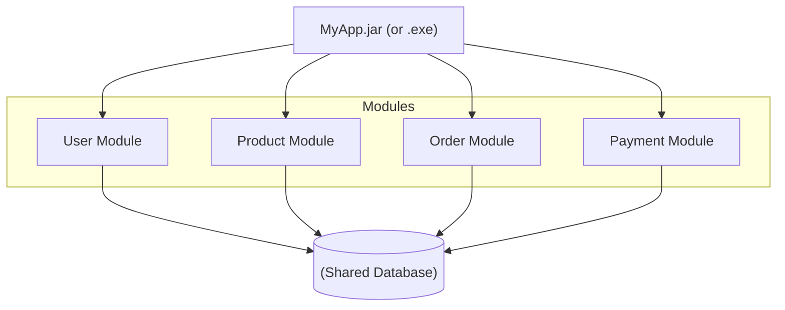
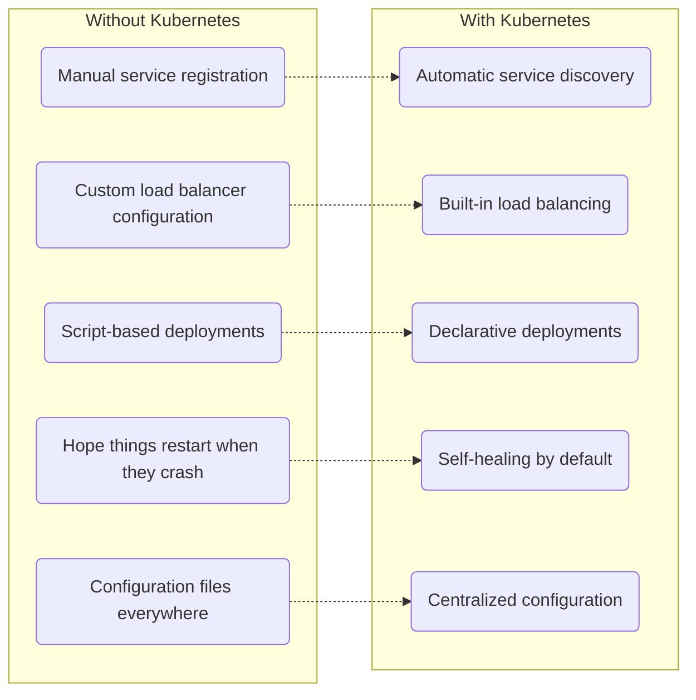
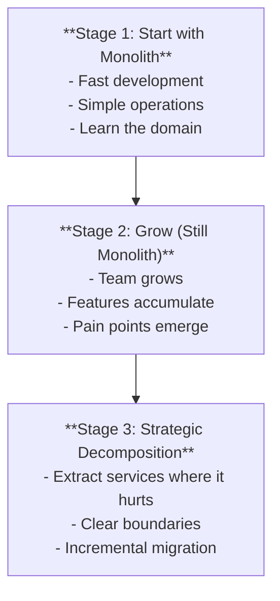
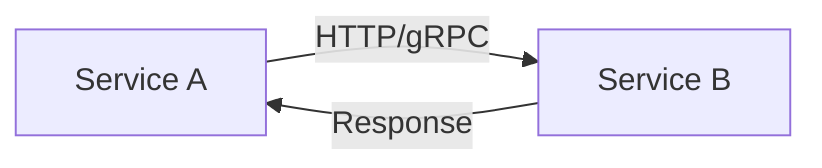
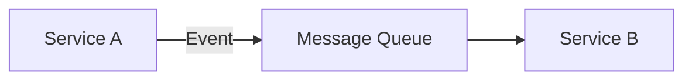
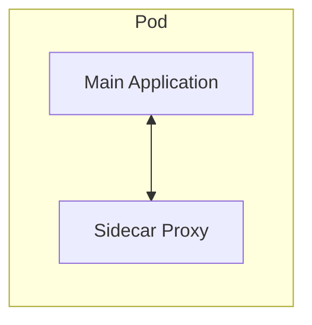
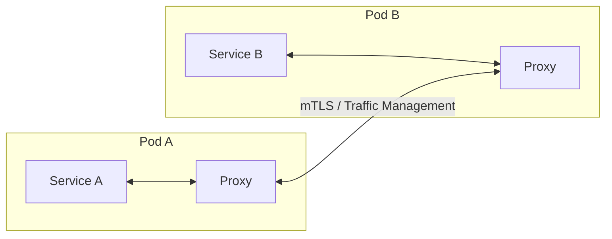
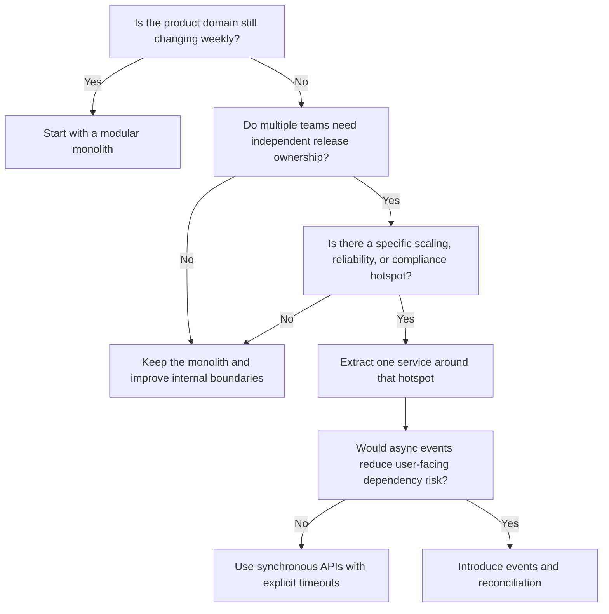

> **Complexity**: `[QUICK]` - Architectural concepts
>
> **Time to Complete**: 40-55 minutes
>
> **Prerequisites**: Module 1.3 (What Is Kubernetes?)
>
> **Kubernetes target**: 1.35+

---

## What You'll Be Able to Do

After this module, you will be able to:

- **Compare** monolithic and microservice architectures by evaluating deployment, scaling, data ownership, and operational trade-offs.
- **Design** a pragmatic migration path that starts with a modular monolith and extracts services only where business or scaling pressure justifies it.
- **Diagnose** which Kubernetes features solve specific microservice operations problems, including service discovery, health checks, configuration, and rolling updates.
- **Evaluate** synchronous, asynchronous, gateway, sidecar, and service mesh patterns for realistic reliability and security constraints.

## Why This Module Matters

In 2001, Amazon's retail platform was straining under the weight of a huge C++ and Perl application called Obidos. Engineers could still ship features, but each change required coordination across teams that shared the same deployment unit, the same assumptions, and often the same failure modes. The famous 2002 API mandate did not happen because network calls were fashionable; it happened because the organization needed stronger boundaries before its own software architecture became the bottleneck for every business decision.

That story is useful because it cuts through the simplistic version of microservices: "split the app and everything gets better." Amazon paid for the split with new operational complexity, stricter interface design, and a culture where teams owned services in production. The benefit was not smaller repositories by themselves; the benefit was that a payment team, catalog team, or fulfillment team could move without waiting for every other part of the company to agree on one giant release.

Kubernetes exists in the shadow of that same trade-off. Services, Deployments, probes, ConfigMaps, Secrets, Ingress, NetworkPolicies, and autoscaling all look ordinary when you see them one at a time, but together they form an operating model for many independently deployed processes. This module helps you judge when that model is worth the cost, when a monolith remains the better engineering choice, and how to connect architecture decisions to the Kubernetes primitives you will use later.

## The Monolith as a Deliberate Architecture

A monolith is a single deployable application that contains multiple pieces of business functionality. It may have clean internal modules, separate packages, and disciplined boundaries, but it still ships as one unit. The important word is "deployable," because architectural arguments become practical only when a team asks what happens during release, rollback, scaling, failure, and debugging.

In the diagram, the user, product, order, and payment modules are separate ideas inside one running application. A developer might keep them in different packages, test them with different fixtures, and enforce code review ownership by directory. None of that changes the deployment model: when the application is built, released, scaled, or restarted, the modules move together.

That togetherness is why a monolith is often the fastest way to build a young product. There is one repository or one primary codebase, one database transaction boundary, one local development command, one test environment, and one deployment artifact. A small team can change a workflow across modules without negotiating a network contract, publishing an API version, or coordinating a distributed rollout.

The same togetherness becomes painful when growth makes local coupling visible. If the order workflow needs ten replicas during a holiday sale but the product catalog needs only two, the monolith usually scales all of it. If a risky payment change must wait for unrelated catalog changes to finish testing, the release process becomes an organizational queue rather than a technical pipeline.

The shared database is the most important hidden boundary in many monoliths. It gives you easy ACID transactions, simple joins, and direct reporting queries, but it also lets unrelated code paths affect one another through locks, slow queries, schema changes, and accidental coupling. A clean code module is not truly independent if every other module can reach into its tables.

> **Pause and predict**: If a monolith shares a single database, what happens when the "Order Module" accidentally executes a poorly written database query that consumes all available database CPU? Think through the user-facing impact before you read further, especially for the "User Module," which may have perfectly healthy application code but depends on the same database resource.

The user module slows down because the shared dependency is saturated. This is the heart of architectural coupling: the failure did not need to cross a function call boundary or a source-code import to hurt another feature. The database was the shared resource, so the blast radius followed that resource instead of following the application package structure.

A good monolith is not a bad architecture waiting to be rescued. Shopify's long-running "majestic monolith" framing is a useful reminder that a carefully maintained monolith can serve very large businesses when teams invest in modularity, testing, observability, and disciplined ownership. The trap is not the monolith itself; the trap is allowing "single deployable unit" to become "single tangled unit."

For Kubernetes learners, a monolith also teaches a useful baseline. You can run a monolith in a container, deploy it with a Deployment, expose it with a Service, configure it with ConfigMaps and Secrets, and restart it with probes. Kubernetes does not require microservices; it manages containers and desired state, which can be useful before an application is decomposed.

The first Kubernetes command you will eventually use in many modules is `kubectl`, and this curriculum uses the shorter alias `k` after introducing it once with `alias k=kubectl`. For example, when you later inspect workloads with `k get pods -A`, you are asking Kubernetes about runtime units, not asking it whether those units contain monolithic or microservice code.

## The Microservices Approach

Microservices split an application into independently deployable services that communicate over explicit interfaces. Each service owns a business capability, exposes a contract, and can be built, deployed, scaled, and operated without redeploying the entire system. That independence is the goal, and it is much more important than a specific line count, framework, or repository layout.

The diagram shows a more explicit architecture than the monolith. The gateway accepts client traffic, then routes requests to user, product, and order services. Each service has its own database, which means the order service cannot quietly join directly against user tables unless the teams intentionally create a contract for that data.

This independence changes how teams work. A user service team can release a profile fix without waiting for the order service team, and the order service can scale based on checkout pressure without scaling the product catalog. A service can also use the language, framework, or storage model that fits its domain, although that flexibility becomes expensive if every team invents a separate operational universe.

The price is the distributed system tax. A function call inside a monolith becomes an HTTP, gRPC, or message-broker interaction across a network. That network call can time out, retry, duplicate, arrive late, return a partial response, or fail because another service is rolling out. The code may still be simple, but the behavior is no longer local.

> **Stop and think**: In a monolith, a function call usually takes microseconds and fails only when the process or called code fails. In microservices, a network call often takes milliseconds and can fail because of timeouts, network partitions, overloaded dependencies, certificate issues, or a remote deployment. How should that change the way you design error handling and user-facing workflows?

The practical answer is that microservice code must assume partial failure as a normal case. Timeouts need budgets, retries need limits, idempotency needs design, and fallbacks need product decisions. Without those habits, splitting the system moves failure from compile-time and test-time into production traffic, where it becomes harder to understand.

The database-per-service pattern is another example of a trade-off rather than a slogan. It improves ownership because one service controls its schema and invariants. It also makes cross-service reporting, transactions, and consistency harder, because you cannot simply wrap a user update, inventory reservation, and payment authorization in one local transaction.

Teams handle that complexity with events, sagas, outbox tables, reconciliation jobs, and careful product semantics. A checkout system may accept an order, publish an event, reserve inventory asynchronously, and later notify the customer if the reservation fails. That feels less tidy than one database transaction, but it can be more resilient when high traffic or temporary dependency failures are expected.

> **Pause and predict**: A five-person startup is building its first product, still changing its user model every week, and has no dedicated platform engineer. Should it begin with separate user, billing, catalog, recommendation, and notification microservices, or should it keep one modular deployable unit until the domain stabilizes? Write down the operational work each choice creates before you continue.

For that startup, a modular monolith is usually the more honest decision. The team needs fast learning, cheap refactoring, and fewer moving parts. Microservices make more sense when boundaries are stable enough to become contracts and when independent deployability solves a real bottleneck rather than satisfying an architectural preference.

Microservices are at their strongest when the organization already has multiple teams with distinct ownership. If one team owns checkout reliability, another owns search relevance, and another owns identity, forcing them through one release train creates friction. Separate services can align the software boundary with the team boundary, which is why Conway's Law appears in nearly every serious discussion of this topic.

They are at their weakest when teams split by technical layer instead of business capability. A "database service," "API service," and "frontend service" may still force every feature to cross every team, which keeps the coordination problem while adding network calls. A useful service boundary lets one team change a business capability with minimal cross-team negotiation.

## Where Kubernetes Fits

Kubernetes does not magically make microservices simple. It gives you reusable machinery for problems that microservices create repeatedly: finding services, routing traffic, rolling out versions, restarting unhealthy instances, injecting configuration, spreading replicas, and describing desired state. That machinery is valuable because it moves common operational concerns out of custom scripts and into a shared control plane.

| Challenge | Kubernetes Solution |
|-----------|---------------------|
| Service discovery | Services, DNS |
| Load balancing | Services, Ingress |
| Scaling | Deployments, HPA |
| Configuration | ConfigMaps, Secrets |
| Health monitoring | Probes |
| Rolling updates | Deployments |
| Fault tolerance | ReplicaSets, self-healing |
| Resource management | Requests/Limits |

The table is short, but every row hides a common production incident. Service discovery matters because Pods get replaced and receive new IP addresses. Health monitoring matters because an instance can be alive as a process while still unable to serve traffic. Rolling updates matter because shipping all replicas at once turns a bad release into a full outage.

Before Kubernetes, many teams solved these problems with a mix of service registries, hand-edited load balancers, process supervisors, shell scripts, shared configuration directories, and tribal knowledge. Those tools can work, but each new service increases the surface area where manual process fails. Kubernetes standardizes the shape of the solution so each team does not rebuild the same platform from scratch.

A Service gives other workloads a stable name and virtual IP even while backing Pods change. A Deployment describes the desired replica count and update strategy. Probes tell Kubernetes when a container is ready for traffic or needs restarting. ConfigMaps and Secrets separate environment-specific configuration from container images, which matters when each service deploys independently.

The important mental model is that Kubernetes manages runtime promises, not business boundaries. If the order service has three replicas and a readiness probe, Kubernetes can keep only ready Pods in the Service endpoints. It cannot decide whether the order service should own inventory reservations, whether an API contract is too chatty, or whether a database boundary is correct.

> **Which approach would you choose here and why?** A retail company has one stable monolith, but the image-resizing path consumes heavy CPU during catalog imports. The rest of the application is healthy and low traffic. Would you scale the whole monolith, extract only image processing, or rewrite the system as many microservices at once?

A pragmatic team would usually extract the image-processing capability first, because the scaling pressure is specific and measurable. The extracted service can have CPU-focused requests and limits, separate replicas, and a queue if catalog imports arrive in bursts. That decision solves the observed pain without forcing the entire organization through a premature rewrite.

Kubernetes also makes a containerized monolith easier to operate, which is often a good intermediate step. A team can standardize deployment manifests, readiness probes, resource requests, and release automation while leaving the application architecture intact. That foundation reduces deployment risk before any service extraction begins.

In Kubernetes 1.35 and later, the broad concepts in this module remain stable: Services provide discovery, Deployments manage replicas and rollouts, probes influence traffic and restarts, and configuration objects decouple environment settings from images. Exact feature maturity changes over time, but the architectural mapping between distributed services and orchestration primitives is the durable lesson.

The subtle Kubernetes lesson is that platform primitives should reduce repeated operational work without hiding responsibility. A Deployment can roll out a new version gradually, but the team still decides whether the application is backward compatible. A readiness probe can remove an unhealthy Pod from traffic, but the team still decides what "ready" means for a dependency-heavy service.

Resource requests and limits are another place where architecture meets operations. A monolith with one container has one resource profile, so CPU-heavy image processing and lightweight profile reads compete inside the same scheduling envelope. After extraction, the image service can request more CPU, the profile service can request modest memory, and autoscaling can follow the behavior of each capability instead of the average behavior of the whole application.

Observability also changes shape after decomposition. In a monolith, one log stream and one stack trace often tell most of the story, even if the codebase is large. In a microservice system, a single user request may cross a gateway, identity service, order service, payment provider adapter, inventory service, and notification worker, so useful debugging depends on correlation IDs, metrics, traces, and consistent error reporting.

This is why Kubernetes alone is never the whole platform. Kubernetes can restart a failed Pod, but it cannot explain whether the failure came from a bad deployment, a slow database migration, a retry storm, or a downstream dependency. Teams need dashboards, alerting, traces, runbooks, and ownership agreements that match the service boundaries they create.

Security boundaries become more explicit too. A monolith often relies on internal function calls and one process boundary, while microservices send traffic across the cluster network. Kubernetes NetworkPolicies, Secrets, service accounts, and admission controls can help reduce blast radius, but only if teams define which services should talk to which dependencies and why those permissions exist.

Configuration management is a common early win. In a monolith, environment-specific settings often accumulate in one large configuration file, and changing a payment provider timeout may require redeploying the whole application. In a service-oriented system, each service can receive only the configuration it needs, which reduces accidental coupling and makes review easier when a sensitive value changes.

The strongest Kubernetes habit is to describe the desired runtime state in version-controlled manifests rather than relying on remembered commands. This does not mean every beginner must master every object immediately. It means you should recognize the pattern: each service becomes a declared workload, exposed by declared networking, configured by declared inputs, and monitored through declared health signals.

## Migration by Pressure, Not Fashion

The safest migration from monolith to microservices is usually incremental. A team starts with a modular monolith, identifies a boundary where pain is concrete, and extracts one service behind a stable interface. This approach is often called the Strangler Fig pattern because the new system gradually grows around the old one until the old responsibilities are reduced or removed.

Stage one is not architectural laziness; it is information gathering. When a product is new, the team often does not yet know which concepts are stable business capabilities and which are temporary guesses. Splitting too early freezes guesses into network contracts, making ordinary product learning feel like a platform migration.

Stage two is where discipline matters. A growing monolith should gain internal boundaries, module ownership, automated tests, observability, database migration practices, and clean interfaces. If the team skips that work, microservices will not fix the design; they will distribute the same confusion across more processes.

Stage three begins when the pain is specific enough to justify a service boundary. Good extraction candidates include high-scale workloads, volatile domains owned by one team, risky integrations, long-running background jobs, or features with different compliance requirements. Poor candidates are vague nouns, technical layers, or code that is merely annoying because no one has refactored it.

A common worked example is checkout in an e-commerce system. At first, checkout, catalog, identity, payment, and notification logic might live in one application because that is easy to reason about. Later, payment may become a strong extraction candidate because it has strict security requirements, external provider dependencies, audit needs, and a release cadence that should be isolated from catalog experiments.

The first extraction should be boring on purpose. Put an API or event contract in front of the chosen capability, route a small amount of traffic, observe latency and error behavior, and keep rollback simple. A team that cannot safely extract one service should not plan a quarter-long rewrite into dozens of services.

Data migration is often harder than code migration. If payment tables are shared with order tables, the team may need to create an API facade, duplicate reads for a while, publish change events, and reconcile differences. This is why "each service owns its data" is a destination, not always the first step.

The migration team should write down invariants before writing service code. For payment, an invariant might be that an order is never marked paid unless the provider authorization is recorded with an idempotency key. For inventory, an invariant might be that reserved stock either expires or becomes part of a completed order. These rules reveal where transactions, events, and reconciliation jobs must be designed carefully.

A useful extraction plan also identifies consumers. If three internal modules read payment status directly from a shared table, the new payment service needs an API, an event stream, or a transitional view that keeps those consumers working while ownership changes. Without that consumer map, teams often discover hidden dependencies only after a deployment fails in production.

Compatibility is the quiet discipline that makes incremental migration possible. The monolith and the new service may run side by side for weeks, and both may need to understand old and new representations. Backward-compatible APIs, additive database changes, versioned events, and dual-write comparisons are less glamorous than a clean architecture diagram, but they are what keep users from becoming migration test cases.

The first service should also have an operational owner before it has a repository. Someone must know who responds to alerts, who approves schema changes, who reviews API compatibility, and who decides when the service can be rolled back. A service without ownership is not autonomous; it is just another component waiting for a meeting.

Teams sometimes underestimate how much a monolith has been doing for them. Local transactions, in-process retries, one deployment dashboard, shared error handling, and a single authentication context may all be implicit. When a service is extracted, each implicit convenience becomes an explicit design decision, and missing one of them can create reliability gaps that look like "microservices are bad" when the real problem is incomplete migration design.

The practical migration question is not "How many services should we have?" A better question is "Which one boundary would reduce the most risk or unblock the most work if it were independently deployable?" That framing keeps the team focused on a business or reliability outcome instead of chasing an arbitrary service count.

You should also budget time for deleting the old path. Many migrations create a new service but leave the old monolith code in place indefinitely because no one owns cleanup. That creates two implementations, two sets of assumptions, and a permanent source of confusing behavior, so the migration plan should include removal criteria as clearly as launch criteria.

War stories often share the same shape. Segment publicly described moving from a small number of services to many destination-specific services, then later consolidating because operational overhead and duplicated work hurt developer productivity. The lesson is not that microservices are wrong; the lesson is that service boundaries must earn their cost continuously.

Another useful example comes from companies that run large monoliths successfully. Their architecture works because they invest in internal modularity, ownership, automated testing, and tooling. A monolith with strong boundaries can outperform a microservice estate with weak boundaries, especially when the team is small or the product is changing quickly.

## Communication and Runtime Patterns

Once a system has more than one service, communication style becomes architecture. A synchronous request asks another service for an immediate answer, which is simple for users and developers when the dependency is fast and reliable. The cost is that the caller now depends on the callee's latency and availability during the request.

Synchronous calls are appropriate when the user genuinely needs the answer before continuing. Logging in, checking whether a username exists, or calculating a price may need immediate feedback. Even then, teams should define timeouts, circuit breakers, retry budgets, and clear error behavior so one slow service does not consume every caller's threads.

Asynchronous communication changes the user and system contract. A service publishes an event or message, and another service consumes it later. The user may receive confirmation that work has been accepted rather than completed, while the backend gains buffering, retry, and isolation from temporary spikes.

This pattern fits workflows where eventual consistency is acceptable. Sending email, updating recommendations, resizing images, and synchronizing analytics rarely need to block the user's request. The trade-off is that the system must handle duplicate messages, out-of-order events, poison messages, and operational visibility into queues.

An API gateway creates a single entry point for client traffic. It can centralize authentication, authorization, rate limiting, request routing, and protocol translation. In Kubernetes, an Ingress controller or a dedicated gateway implementation often plays this role, although the exact product choice depends on traffic needs and organizational standards.

A gateway is useful because clients should not need to understand every internal service boundary. Mobile apps, browsers, and external partners need stable public contracts. Internal services can change behind the gateway more freely, as long as the gateway contract and compatibility rules are managed carefully.

The sidecar pattern adds a helper container beside the main application container. In Kubernetes, this works naturally because a Pod can contain multiple containers that share networking and lifecycle. The helper can collect logs, proxy traffic, handle certificates, or adapt protocols without forcing the application team to rewrite core business code.

A service mesh builds on the sidecar idea by placing proxies around service-to-service traffic and controlling them through a shared control plane. The mesh can provide mutual TLS, traffic splitting, retries, metrics, and policy enforcement across services written in different languages. That power is real, but so is the operational cost.

> **Stop and think**: If your company mandates strict mTLS encryption between 50 different microservices written in three different languages, how would you enforce it without rewriting all 50 codebases? Consider who owns certificates, retries, telemetry, and rollout policy when every team uses a different application framework.

The service mesh answer works because the proxy becomes the consistent network layer. Application code sends and receives traffic as usual, while the proxy handles encryption, policy, telemetry, and sometimes retries. The trade-off is that debugging now includes application behavior, proxy configuration, certificate state, and control-plane health.

Patterns like gateway, sidecar, and mesh are not maturity badges. They are responses to specific forces: public API management, cross-cutting runtime concerns, and fleet-wide network policy. A team should adopt them when the problem is visible enough to justify the extra layer, not because a diagram feels incomplete without them.

Synchronous communication deserves one more practical warning: retries can make an outage worse. If service A retries service B three times for every failed request while traffic is already high, B receives even more load exactly when it is least able to handle it. Mature systems use retry budgets, jitter, deadlines, circuit breakers, and idempotency so recovery behavior does not become a second incident.

Asynchronous communication has its own failure modes. A queue can hide trouble by accepting messages faster than workers can process them, which makes the user-facing path look healthy while the backlog grows. Operators need backlog metrics, processing-age alerts, dead-letter handling, replay procedures, and product rules for what happens when delayed work matters to a customer.

Gateway design is most successful when it stays thin. Authentication, authorization, rate limiting, routing, and response shaping are reasonable edge responsibilities, but deep business workflows should not accumulate there. If every new feature requires a gateway deployment plus several service deployments, the gateway has become a coordination bottleneck that resembles the monolith the team was trying to escape.

The sidecar pattern is powerful because it separates operational concerns from business code, but it also changes the Pod's resource profile. A proxy, log shipper, or policy agent consumes CPU and memory, participates in startup and shutdown timing, and can fail independently from the main application. Production manifests should account for the sidecar as part of the workload, not as invisible plumbing.

Service mesh adoption should begin with a narrow reason and an exit plan for misconfiguration. Mutual TLS, traffic splitting, and uniform telemetry can be worth the cost in a large service fleet, especially when compliance or platform consistency matters. For a small system with simple service-to-service traffic, the same mesh may add more concepts than the team can operate safely.

Communication choices should be made per workflow, not per architecture. A checkout request may synchronously validate the cart, asynchronously reserve downstream capacity, synchronously return an order reference, and asynchronously send email. Real systems mix patterns because user expectations, dependency reliability, and business rules differ across each step.

When evaluating a proposed service boundary, sketch the normal path and the failure path. The normal path explains how data moves when everything is healthy. The failure path explains what happens when a dependency times out, an event is duplicated, a queue is delayed, or a deployment rolls back halfway through the workflow. If the failure path is vague, the design is not ready.

This is where "smart beginner" intuition matters. If a service diagram looks elegant but you cannot explain how a user request is traced, retried, rolled back, or reconciled, the architecture is still incomplete. The best teams make distributed behavior boring through clear contracts and repeatable operations, not through a larger collection of boxes.

## Patterns & Anti-Patterns

For a QUICK introductory module, the main pattern is not "always choose microservices" or "always keep the monolith." The useful pattern is to preserve optionality: keep boundaries clean inside the monolith, collect evidence about scaling and ownership pain, and extract services where independence has a measurable payoff. This creates a path from simple operations to distributed operations without pretending the destination is free.

| Pattern | When to Use It | Why It Works | Scaling Consideration |
|---|---|---|---|
| Modular monolith first | Small teams, new products, unstable domains | It keeps refactoring cheap while preserving internal boundaries | Scale the whole app initially, then extract hot paths later |
| Strangler Fig extraction | Legacy system with one painful capability | It routes one capability through a new interface while the old system keeps running | Extract one boundary at a time and keep rollback obvious |
| Database ownership by service | Stable domain boundaries with clear team ownership | It prevents hidden coupling through shared tables | Use events, reconciliation, and reporting pipelines for cross-service needs |
| Gateway at the edge | Many clients or public APIs need one stable entry point | It hides internal topology and centralizes traffic policy | Avoid turning the gateway into a new monolith of business logic |
| Asynchronous events | Work can finish after user acknowledgement | It buffers spikes and isolates temporary dependency failures | Design idempotency and dead-letter handling before traffic grows |

The most common anti-pattern is splitting a system before the team understands the domain. This creates services that mirror guesses instead of business capabilities, and the result is a chatty network where every user story still requires changes in many places. The system looks distributed, but the work remains tightly coupled.

| Anti-Pattern | What Goes Wrong | Better Alternative |
|---|---|---|
| Microservices from day one | The team spends scarce time on infrastructure, contracts, and debugging instead of learning the product | Start with a modular monolith and keep extraction seams clean |
| Services by technical layer | Every feature crosses many services, so coordination stays high | Split by business capability and team ownership |
| Shared database with no ownership | Services bypass one another and create hidden coupling | Assign table ownership, then move toward APIs or events |
| Gateway contains business rules | The gateway becomes a second monolith with unclear ownership | Keep routing and edge policy in the gateway, business logic in services |
| Service mesh as first platform feature | Teams inherit complex networking before they need fleet-wide policy | Begin with Kubernetes Services, probes, metrics, and clear timeouts |

The original misconceptions are worth preserving because they are still the traps learners hear in real teams:

| Misconception | Reality |
|---------------|---------|
| "Microservices are always better" | They add massive operational complexity. Often a disastrous choice for startups or small teams searching for product-market fit. |
| "Monoliths don't scale" | They do! Shopify handles massive global e-commerce traffic with a monolithic Ruby on Rails application. Stack Overflow runs on a minimal monolithic architecture. |
| "Microservices fix bad code" | They actually amplify it. Distributed bad code across network boundaries is much harder to debug, trace, and fix than bad code contained within a single monolithic process. |
| "Smaller = micro" | Size isn't the point, bounded context is. A service should be exactly as big as its domain requires. Splitting services purely by lines of code creates tightly coupled, chatty networks. |
| "You need a service mesh from day 1" | Service meshes like Istio add immense cognitive and operational load. Start with basic Kubernetes networking and only adopt a mesh when advanced observability or strict mTLS mandates require it. |
| "Microservices mean REST APIs only" | Many high-scale microservices communicate via asynchronous event brokers like Kafka or RabbitMQ, or high-performance binary RPCs such as gRPC, rather than only standard HTTP REST calls. |
| "Microservices = using Kubernetes" | You can run a containerized monolith on Kubernetes as a majestic monolith. Kubernetes is infrastructure orchestration, not an architectural enforcer. |
| "Each microservice needs its own database" | While the database-per-service pattern ensures strong decoupling, it makes distributed transactions hard. Pragmatic teams sometimes start with logically separated schemas inside one shared database. |

## Decision Framework

Use the simplest architecture that lets the team move safely at its current size, then revisit the decision when evidence changes. Architecture is not a personality test; it is an operating model. The right choice depends on team count, domain stability, release pressure, scaling hotspots, compliance needs, and the cost of running more infrastructure.

When you use this framework, avoid asking whether microservices are "modern." Ask whether the system needs independently deployable business capabilities badly enough to pay for service discovery, observability, network failure handling, data duplication, API versioning, and operational ownership. If the answer is unclear, the monolith probably deserves more time.

| Situation | Prefer This | Reason |
|---|---|---|
| Three to eight engineers validating a product | Modular monolith | The team needs fast refactoring and low operational overhead |
| One CPU-heavy or queue-heavy workflow hurts the rest of the app | Extract one service | The scaling pressure is specific enough to isolate |
| Many teams wait on one release train | Microservices by business capability | Independent deployability solves an organizational bottleneck |
| Strict service-to-service encryption is mandated across many languages | Service mesh after baseline maturity | A shared proxy layer can enforce policy consistently |
| Users do not need immediate completion | Asynchronous event workflow | Queues buffer spikes and reduce cascading failures |
| All data is tightly joined and transaction-heavy | Monolith or carefully staged extraction | Distributed data ownership would add significant consistency cost |

The decision should also include a rollback story. If the first extracted service performs poorly, can traffic return to the monolith? If an event workflow duplicates messages, can the consumer safely retry? If a gateway rule is wrong, can operators observe and reverse it quickly? Architecture without reversibility becomes a one-way bet.

Cost should be part of the framework as well, because microservices move spending from one category to another. A team may reduce developer wait time but increase cluster usage, observability storage, on-call load, CI minutes, and platform maintenance. Those costs can be justified when independent delivery protects revenue or reliability, but they should be named before the migration begins.

Team skill is another real constraint. A group that has never operated readiness probes, resource requests, dashboards, or incident reviews should not introduce dozens of independently failing services at once. The better path is to build operational muscle on a small number of workloads, learn how the team responds to incidents, and then expand the architecture when the operating habits are proven.

Finally, the framework should be revisited after each extraction. Did deployment frequency improve, or did teams create a new queue around shared libraries and gateway rules? Did reliability improve, or did user requests now fail in more interesting ways? A migration that does not measure outcomes can keep going long after the original problem has been solved or disproven.

The healthiest architecture reviews therefore end with a small decision and a date to re-evaluate it. The team might choose a monolith for the next two quarters, extract image processing after the next sale, or defer service mesh adoption until there are enough services to justify shared traffic policy. Treating architecture as a sequence of reversible decisions keeps the conversation grounded in evidence.

That habit also prepares you for Kubernetes work. Every manifest you write later represents a decision about ownership, scaling, health, configuration, or exposure. When you can explain the architectural reason behind the object, Kubernetes becomes a tool for operating a design instead of a collection of YAML shapes to memorize.

## Did You Know?

- **Amazon's 2002 Mandate**: Jeff Bezos required teams to communicate through service interfaces, a move that forced decoupling and later influenced the operating model behind AWS.
- **Segment's U-Turn**: In 2018, Segment described moving away from hundreds of small services because operational overhead and duplicated work were hurting engineering velocity.
- **The Term "Microservices"**: The architectural style was discussed at a software architects workshop near Venice in May 2011 and was later popularized by James Lewis and Martin Fowler in their March 25, 2014 article.
- **Conway's Law**: Melvin Conway's 1968 observation still matters because systems often mirror the communication patterns of the organizations that build them.

## Common Mistakes

| Mistake | Why It Happens | How to Fix It |
|---|---|---|
| Splitting a new product into many services before the domain stabilizes | The team wants to appear modern and assumes future scale is guaranteed | Build a modular monolith, name internal boundaries clearly, and extract only after repeated pain appears |
| Treating Kubernetes as proof that the app is now microservices-ready | Containers make deployment cleaner, but they do not create good business boundaries | Use Kubernetes for repeatable operations while separately evaluating service ownership and data ownership |
| Sharing one database across services with no ownership rules | Direct table access feels faster than designing APIs or events | Assign each table to an owner and block new cross-service writes before planning physical separation |
| Using synchronous calls for every workflow | Request-response is easy to understand during development | Identify work that can finish later and move it to events with idempotent consumers |
| Adding a service mesh before basic observability works | Mesh features sound like a shortcut to reliability and security | First establish logs, metrics, traces, readiness probes, timeouts, and ownership for each service |
| Extracting services by nouns in the codebase instead of business capabilities | Class names and folders are easier to see than domain boundaries | Map services to user-visible capabilities and teams that can own them end to end |
| Forgetting rollback and reconciliation during migration | The team focuses on the happy path of the new service | Plan dual reads, event replay, data comparison, and traffic rollback before cutting over |

## Quiz

Scenario: Your department grew from 10 engineers to 150 engineers, and every bug fix waits for a weekly release train plus a long shared test run. What architectural pressure are you seeing, and what would microservices solve?

You are seeing an organizational bottleneck caused by one deployment unit serving too many teams. Microservices can help if they are split by business capability so each team can test, deploy, and roll back its own service independently. The important benefit is not smaller code; it is independent lifecycle ownership. If the split still requires every feature to coordinate across many services, the bottleneck has only moved.

Scenario: A four-person startup has three months to validate an MVP, and its product boundaries change every week. Should it start with microservices or a monolith?

It should usually start with a modular monolith. The team needs cheap refactoring, fast local development, and minimal operational overhead while it discovers the product. Microservices would add CI/CD complexity, contracts, network debugging, and data consistency work before those costs solve a real problem. The team can still design internal modules so later extraction is possible.

Scenario: A monolith has one image-processing path that consumes heavy CPU during catalog imports while the rest of the app is quiet. What migration path would you design first?

Extract the image-processing capability first rather than rewriting the whole application. That service has a clear scaling profile, can run with CPU-focused resource requests, and can accept work through a queue if imports arrive in bursts. This design keeps the migration tied to measured pressure. It also gives the team a small service-extraction practice run with a clear rollback path.

Scenario: After splitting into services, your team sees changing Pod IPs, manual load balancer updates, and unhealthy instances receiving traffic. Which Kubernetes features map to those failures?

Services and cluster DNS solve the changing-IP discovery problem by giving callers stable names. Deployments and ReplicaSets manage desired replicas and replace failed Pods, while readiness probes keep unhealthy instances out of Service endpoints. Ingress or gateway controllers handle external routing without hand-editing load balancers on each release. These features solve runtime operations problems, not domain-design problems.

Scenario: Checkout calls inventory synchronously, inventory slows during a sale, and user requests time out. What communication pattern should you evaluate?

You should evaluate an asynchronous event-driven workflow if the product can accept eventual completion. Checkout can publish an order event and return an accepted response, while inventory consumes messages at a controlled pace. This reduces cascading failure because inventory latency no longer blocks every user request. The design must include idempotency, retry limits, and a user-facing plan for failed reservations.

Scenario: Security requires mTLS across 50 services written in several languages, and rewriting every service would take months. What pattern fits, and what risk comes with it?

A service mesh using sidecar proxies fits because it can enforce mutual TLS and traffic policy outside the application code. The proxy layer gives platform teams consistent encryption, telemetry, and retry behavior across languages. The risk is extra operational complexity: debugging now includes mesh configuration, certificates, proxy health, and control-plane behavior. A mesh should follow, not replace, basic service observability and ownership.

Scenario: A team says each microservice must immediately have a separate physical database. How would you evaluate that claim?

Separate data ownership is a strong long-term pattern, but immediate physical separation can be too expensive during early migration. The key question is whether the team has clear ownership, consistency rules, and reporting needs. A staged approach might begin with owned schemas and blocked cross-service writes before moving to separate databases. That path improves boundaries while reducing migration risk.

## Hands-On Exercise

This module is architectural, so the exercise is a design review rather than a cluster lab. You will analyze a familiar application, choose boundaries, and connect each decision to Kubernetes runtime features. If you have a cluster available, you may also practice the inspection habit by setting `alias k=kubectl` and running `k get pods -A`, but the core deliverable is the reasoning document you create for yourself.

### Setup

Choose one application you know well enough to discuss honestly. It can be a work system, a side project, a learning app, or a hypothetical e-commerce site. Write down its main user workflows, the people or teams that would own them, the data each workflow touches, and the failure that would be most painful during a busy day.

### Tasks

- [ ] **Classify the current architecture**: Decide whether the application is a monolith, modular monolith, distributed monolith, or microservice system, and justify the classification using deployment and data ownership.
- [ ] **Compare scaling pressure**: Identify one workflow that might need more replicas, CPU, queue capacity, or isolation than the rest of the application.
- [ ] **Design one service extraction**: Pick a single capability you would extract first, then define its owner, API or event contract, data ownership, and rollback path.
- [ ] **Diagnose Kubernetes mapping**: Match the extracted service to Kubernetes primitives such as Service, Deployment, readiness probe, ConfigMap, Secret, Ingress, HPA, and NetworkPolicy.
- [ ] **Evaluate communication style**: Decide whether the extracted capability should use synchronous request-response, asynchronous events, or both, and explain the user-facing trade-off.
- [ ] **Review the decision**: State why you are not extracting two additional services yet, using operational cost and domain uncertainty as part of the reasoning.

Solution guide: classification

A strong answer defines architecture by deployment and ownership rather than by code size. A modular monolith has one deployable artifact but meaningful internal boundaries. A distributed monolith has multiple services that still require coordinated releases or shared data writes for most changes. A microservice system has independently deployable services owned around business capabilities.

Solution guide: first extraction

A good first extraction has concrete pressure. Examples include image processing that needs CPU isolation, notification sending that can happen asynchronously, payment integration that needs stricter compliance boundaries, or search indexing that can lag behind writes. Weak choices are vague nouns with no separate scaling, ownership, or reliability reason.

Solution guide: Kubernetes mapping

The extracted service usually needs a Deployment for replica management, a Service for stable discovery, readiness and liveness probes for traffic and restart behavior, ConfigMaps and Secrets for configuration, and possibly an HPA if load varies. Ingress or a gateway applies when clients call the service from outside the cluster. NetworkPolicy applies when the team needs explicit traffic boundaries.

Solution guide: communication style

Use synchronous calls when the user needs an immediate answer, such as authentication or price calculation. Use events when the system can accept work and finish it later, such as email, analytics, image processing, or inventory reconciliation. Many real systems use both: a synchronous API for acceptance and events for follow-up work.

### Success Criteria

- [ ] You compared monolith and microservice trade-offs using deployment, scaling, data ownership, and debugging impact.
- [ ] You designed one migration step with a specific business capability, not a generic rewrite plan.
- [ ] You connected at least five Kubernetes features to the operational problems they solve.
- [ ] You evaluated synchronous and asynchronous communication with failure behavior, not only convenience.
- [ ] You explained why at least two possible services should remain inside the monolith for now.

## Sources

- [Amazon Builders' Library - Going faster with continuous delivery](https://aws.amazon.com/builders-library/going-faster-with-continuous-delivery/)
- [Martin Fowler - Microservices](https://martinfowler.com/articles/microservices.html)
- [Martin Fowler - Strangler Fig Application](https://martinfowler.com/bliki/StranglerFigApplication.html)
- [Martin Fowler - Monolith First](https://martinfowler.com/bliki/MonolithFirst.html)
- [Segment - Goodbye Microservices](https://segment.com/blog/goodbye-microservices/)
- [Shopify Engineering - Deconstructing the Monolith](https://shopify.engineering/deconstructing-monolith-designing-software-maximizes-developer-productivity)
- [Kubernetes Documentation - Services, Load Balancing, and Networking](https://kubernetes.io/docs/concepts/services-networking/)
- [Kubernetes Documentation - Deployments](https://kubernetes.io/docs/concepts/workloads/controllers/deployment/)
- [Kubernetes Documentation - Configure Liveness, Readiness and Startup Probes](https://kubernetes.io/docs/tasks/configure-pod-container/configure-liveness-readiness-startup-probes/)
- [Kubernetes Documentation - ConfigMaps](https://kubernetes.io/docs/concepts/configuration/configmap/)
- [Kubernetes Documentation - Secrets](https://kubernetes.io/docs/concepts/configuration/secret/)
- [Kubernetes Documentation - Ingress](https://kubernetes.io/docs/concepts/services-networking/ingress/)

## Next Module

[Kubernetes Basics: Your First Cluster](/prerequisites/kubernetes-basics/module-1.1-first-cluster/) turns this architecture discussion into hands-on cluster practice, where you will see Pods, Services, and Deployments operating real workloads.
