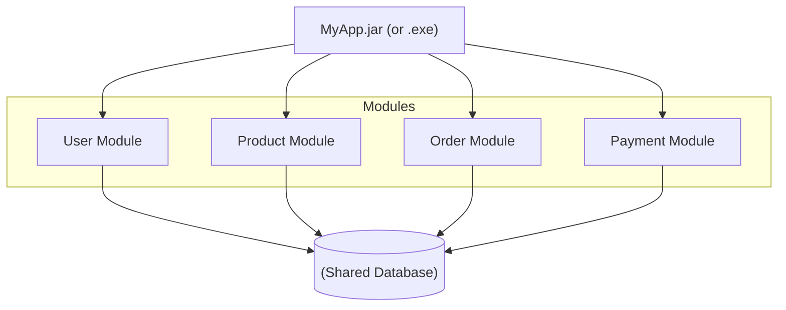
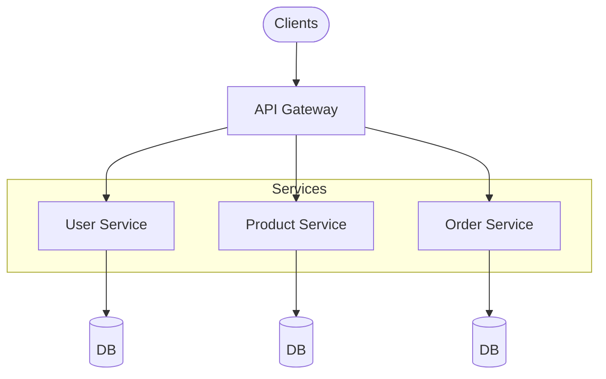
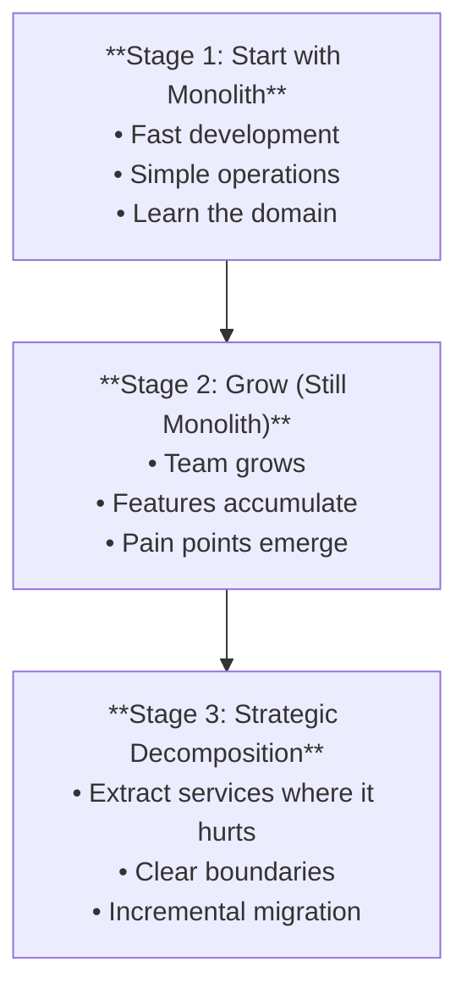
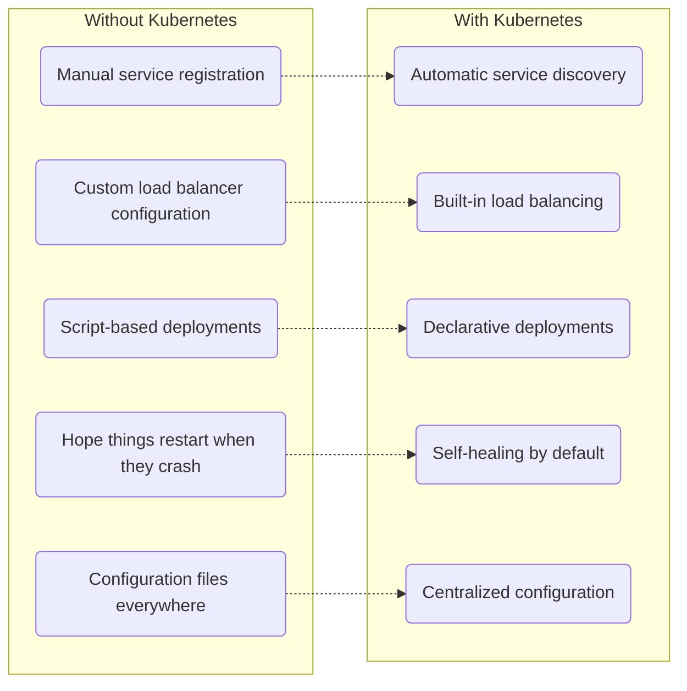
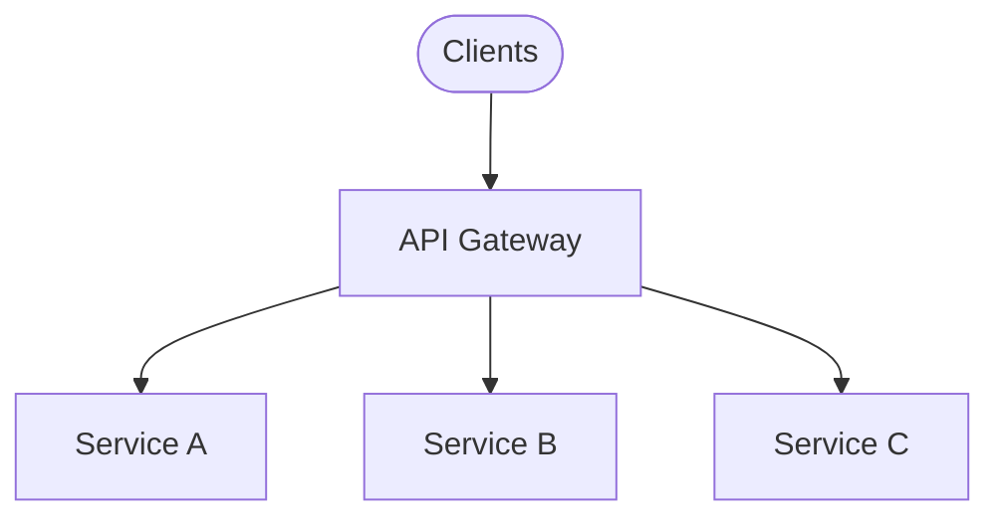
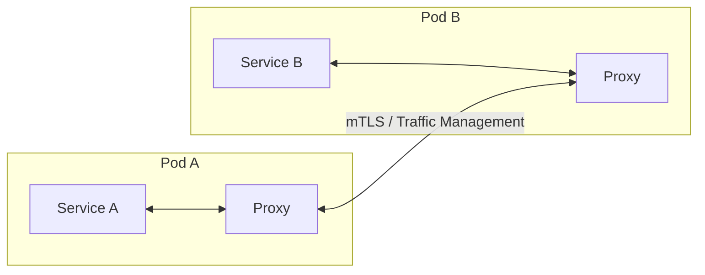
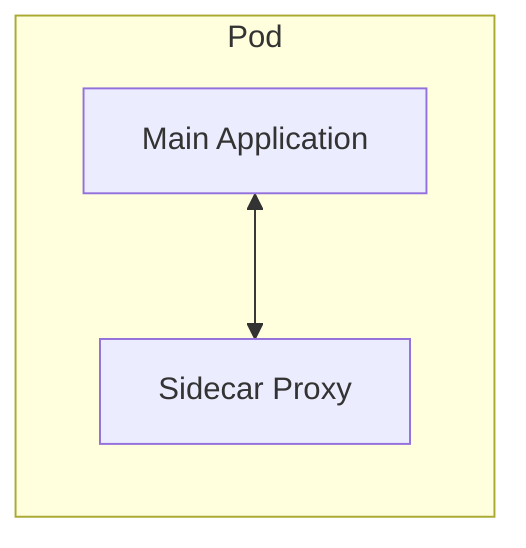
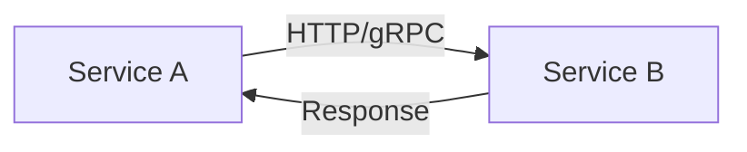
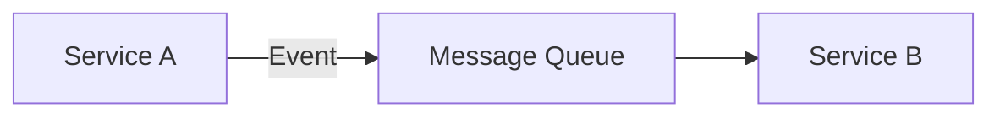

> **Complexity**: `[QUICK]` - Architectural concepts
>
> **Time to Complete**: 30-35 minutes
>
> **Prerequisites**: Module 3 (What Is Kubernetes?)

---

## What You'll Be Able to Do

After this module, you will be able to:
- **Compare** monolithic and microservice architectures with specific trade-offs for each
- **Explain** why Kubernetes features (Services, Deployments, scaling) map to microservice needs
- **Identify** when a monolith is actually the right choice (not everything should be microservices)
- **Describe** the challenges microservices introduce (network complexity, distributed debugging, data consistency)

---

## Why This Module Matters

In 2001, Amazon hit a scaling wall. Their massive monolithic C++ and Perl application, "Obidos," became so complex that simple feature updates required weeks of coordination, and deployments routinely broke the site. This crisis triggered Jeff Bezos's famous 2002 API mandate, forcing all teams to expose their data only through strict network interfaces. This painful transition to what we now call microservices saved their engineering velocity and ultimately birthed AWS.

Kubernetes was purpose-built to solve the exact operational nightmares that companies like Amazon and Google discovered when running thousands of distributed services. Understanding the evolution from monoliths to microservices helps you:

1. Know exactly *why* Kubernetes features (like Services, Ingress, and Probes) exist to solve distributed system problems.
2. Make better architectural decisions based on team size and product maturity.
3. Understand when a monolith is actually the right choice (saving thousands of hours of unnecessary engineering overhead).
4. Speak the language of modern software architecture.

---

## The Monolith

### What Is a Monolith?

A monolithic application is a single deployable unit containing all functionality:

**Key Characteristics**:
- **Deploy**: One unit
- **Scale**: All or nothing
- **Database**: Shared by all modules

### Monolith Advantages

- Simple to develop initially
- Easy to test (one application)
- Simple deployment (one artifact)
- Easy to debug (one process)
- No network latency between components
- ACID transactions are straightforward

### Monolith Challenges (At Scale)

- Changes require full redeploy
- Long build/test cycles
- Scaling means scaling everything
- Technology choices affect entire app
- One bug can crash everything
- Team coordination becomes difficult
- Codebase becomes unwieldy

> **Pause and predict**: If a monolith shares a single database, what happens when the "Order Module" accidentally executes a poorly written database query that consumes 100% of the database CPU? How does this affect the "User Module"?

---

## The Microservices Approach

### What Are Microservices?

Microservices decompose an application into small, independent services:

**Key Characteristics**:
- **Deploy**: Each service independently
- **Scale**: Per service based on need
- **Database**: Each service owns its data

### Microservices Advantages

- Independent deployment
- Scale individual services
- Technology diversity (right tool for job)
- Fault isolation (one service down ≠ all down)
- Team autonomy
- Smaller, focused codebases

### Microservices Challenges

- Network complexity
- Distributed system failures
- Data consistency challenges
- Testing is harder
- Operational complexity
- Debugging across services
- Need for robust infrastructure

> **Stop and think**: In a monolith, a function call takes microseconds and always succeeds unless the app crashes. In microservices, a network call takes milliseconds and can fail due to timeouts, network partitions, or the remote service being down. How does this fundamental shift change the way you write code?

---

> **Pause and predict**: A 5-person startup is building their first product. Should they use microservices from day one? Consider: they have limited engineers, they're still figuring out what their product even is, and every new service means more infrastructure to manage. Read on to see why the answer might surprise you.

## When to Choose What

### Monolith is Often Better When:

- Small team (< 10 developers)
- New product/startup phase
- Simple domain
- Tight deadlines
- Unknown requirements
- Single deployment target

### Microservices Make Sense When:

- Large, multiple teams
- Need independent scaling
- Different technology requirements per component
- High availability requirements
- Frequent releases needed
- Clear domain boundaries

### The Reality

**The "Don'ts" of Microservices**:
- **DON'T**: Start with microservices for a new product
- **DON'T**: Decompose without clear boundaries
- **DON'T**: Use microservices for small teams

---

> **Stop and think**: Each Kubernetes feature you'll learn maps to a microservices challenge. Deployments handle independent scaling. Services handle service discovery. ConfigMaps handle per-service configuration. Network Policies handle service-to-service security. Kubernetes wasn't designed for monoliths — it was designed to solve exactly these distributed system problems.

## How Kubernetes Enables Microservices

Kubernetes solves microservices operational challenges:

| Challenge | Kubernetes Solution |
|-----------|---------------------|
| Service discovery | Services, DNS |
| Load balancing | Services, Ingress |
| Scaling | Deployments, HPA |
| Configuration | ConfigMaps, Secrets |
| Health monitoring | Probes |
| Rolling updates | Deployments |
| Fault tolerance | ReplicaSets, self-healing |
| Resource management | Requests/Limits |

---

## Microservices Patterns

### API Gateway

**Purpose**:
- Single entry point
- Authentication/Authorization
- Rate limiting
- Request routing

**In K8s**: Ingress Controller or dedicated gateway

### Service Mesh

> **Stop and think**: If your company mandates strict mTLS encryption between 50 different microservices written in three different languages, how would you enforce it without rewriting all 50 codebases?

**Purpose**:
- Traffic management
- Security (mTLS)
- Observability

**Examples**: Istio, Linkerd

### Sidecar Pattern

**Purpose**:
- Add functionality without changing app
- Logging, monitoring, security

**In K8s**: Multi-container pods

---

## Visualization: Communication Patterns

### Synchronous (Request/Response)

- **Use**: When you need immediate response
- **Risk**: Tight coupling, cascading failures

### Asynchronous (Events/Messages)

- **Use**: Decoupled systems, eventual consistency
- **Benefit**: Loose coupling, resilience

---

## Did You Know?

- **Amazon's 2002 Mandate**: Jeff Bezos mandated that all teams communicate exclusively via APIs, ending the memo with: "Anyone who doesn't do this will be fired." This forced decoupling laid the groundwork for modern microservices and AWS.
- **Segment's U-Turn**: In 2018, the customer data platform Segment famously migrated *away* from microservices back to a monolith. The operational overhead of maintaining hundreds of repositories and managing cross-service queues destroyed their developer velocity. The migration back saved them hundreds of engineering hours per month.
- **Netflix's Chaos**: Netflix operates over 1000+ microservices. To ensure reliability in such a complex system, they invented "Chaos Monkey," a tool that randomly kills services in production to ensure the overall architecture degrades gracefully rather than crashing completely.
- **The "Two Pizza Rule"**: Amazon's organizational rule suggests teams should be small enough to feed with two pizzas (6-10 people). This perfectly aligns with microservice boundaries—a single, small team owns, builds, and runs a single service autonomously.
- **The Term "Microservices"**: First discussed at a software architects workshop near Venice in May 2011, the architectural style was officially defined by James Lewis and Martin Fowler in their foundational March 25, 2014 article.
- **Conway's Law**: Formulated by Melvin Conway in his 1968 *Datamation* article, it states: "Any organization that designs a system will produce a design whose structure is a copy of the organization's communication structure."
- **Twelve-Factor App**: Authored by Adam Wiggins drawing from Heroku's platform experience, this methodology defines twelve exact factors (from codebase to admin processes) for building modern SaaS applications.
- **Service Mesh Origins**: The term "service mesh" was coined in 2016 by William Morgan of Buoyant with the launch of Linkerd. Linkerd later became the first service mesh to reach CNCF Graduated status. OpenTelemetry, another highly popular project for microservice observability, remains officially Incubating as of April 2026, though secondary sources sometimes informally (and incorrectly) refer to it as graduated.
- **Strangler Fig Pattern**: A popular strategy for migrating from a monolith is the Strangler Fig pattern, coined by Martin Fowler. While often cited as originating in 2004, the primary source date remains unverified on his canonical site, making its exact age slightly disputed.

---

## Common Misconceptions

| Misconception | Reality |
|---------------|---------|
| "Microservices are always better" | They add massive operational complexity. Often a disastrous choice for startups or small teams searching for product-market fit. |
| "Monoliths don't scale" | They do! Shopify handles massive global e-commerce traffic with a monolithic Ruby on Rails application. Stack Overflow runs on a minimal monolithic architecture. |
| "Microservices fix bad code" | They actually amplify it. Distributed bad code across network boundaries is infinitely harder to debug, trace, and fix than bad code contained within a single monolithic process. |
| "Smaller = micro" | Size isn't the point, bounded context is. A service should be exactly as big as its domain requires. Splitting services purely by lines of code creates tightly coupled, chatty networks. |
| "You need a service mesh from day 1" | Service meshes (like Istio) add immense cognitive and operational load. Start with basic Kubernetes networking and only adopt a mesh when advanced observability or strict mTLS mandates require it. |
| "Microservices mean REST APIs only" | Many high-scale microservices communicate via asynchronous event brokers (Kafka, RabbitMQ) or high-performance binary RPCs (gRPC) rather than just standard HTTP REST calls. |
| "Microservices = using Kubernetes" | You can perfectly run a containerized monolith on Kubernetes (a "majestic monolith"). Kubernetes is infrastructure orchestration, not an architectural enforcer. |
| "Each microservice needs its own database" | While the "database per service" pattern ensures absolute decoupling, it makes distributed transactions incredibly hard. Pragmatic teams sometimes start with logically separated schemas within a single shared database. |

---

## Quiz

1. **Scenario**: Your engineering department has grown from 10 to 150 developers. Every time a team wants to release a small bug fix, they must wait for the weekly release train, coordinate with 14 other teams, and run a 6-hour test suite. Why would migrating to microservices solve this specific organizational bottleneck?
   

   
Answer

   The primary advantage in this scenario is independent deployment and lifecycle autonomy. By decoupling the monolithic codebase into microservices, each team can own, test, and deploy their specific service without waiting on others. If the 'Payment' team fixes a bug, they deploy only the 'Payment' service, drastically reducing the blast radius and bypassing the massive 6-hour integration suite. This autonomy restores developer velocity as the organization scales, allowing features to be delivered continuously rather than in batched, risky releases.
   

2. **Scenario**: A 4-person startup has just received seed funding to build a revolutionary AI-powered pet toy marketplace. They have 3 months to launch an MVP and validate their product-market fit, but their domain boundaries are still highly unstable. Why should this team explicitly choose a monolith over microservices?
   

   
Answer

   In this startup scenario, a monolith is superior because the primary goal is rapid iteration and discovering product-market fit, not massive scale. Microservices introduce a severe "distributed system tax"—requiring complex CI/CD pipelines, API contracts, and network debugging—which would quickly drain the small team's limited engineering hours. Furthermore, because their domain boundaries are still shifting, trying to define microservice boundaries now would lead to tightly coupled, chatty services that are incredibly painful to refactor later. A single deployable application allows the team to pivot quickly without coordinating across multiple repositories, preserving their runway and focus on actual business logic.
   

3. **Scenario**: You have successfully split your monolith into 20 microservices. However, you are now struggling with operational nightmares: services constantly change IP addresses when they restart, one failing service causes cascading crashes, and you have to manually update load balancer rules every deployment. How does Kubernetes inherently solve these specific operational challenges?
   

   
Answer

   Kubernetes acts as the automated operating system for your distributed microservices, directly addressing these exact scaling pains. It solves the changing IP problem through its built-in Service discovery and internal DNS, allowing services to find each other via stable names instead of fragile, ephemeral IPs. It prevents cascading crashes by providing health checks (Probes) and automatic restarts (self-healing), ensuring failing instances are quickly replaced before they impact downstream consumers. Finally, its Ingress and Service objects dynamically update load balancing rules whenever a deployment occurs, eliminating the need for manual infrastructure configuration and reducing the risk of human error.
   

4. **Scenario**: Your security compliance team mandates that all traffic between your 50 internal microservices must be encrypted using mutual TLS (mTLS). Additionally, your SRE team needs to implement automatic retries for failed network requests. Updating the application code in all 50 services (written in Node, Python, and Go) would take months. What architectural pattern solves this without changing application code, and how?
   

   
Answer

   The correct architectural approach here is implementing a Service Mesh using the sidecar pattern. A service mesh injects a lightweight proxy container (the sidecar) alongside every application container in a pod, intercepting all inbound and outbound network traffic. Because the proxy handles the network layer entirely, it can transparently enforce mTLS encryption, implement retry logic, and gather telemetry data without the application code ever knowing it exists. This allows platform teams to roll out global security and reliability policies instantly across polyglot microservices, avoiding the massive engineering effort of rewriting and updating fifty disparate codebases.
   

5. **Scenario**: You are architecting a new e-commerce checkout flow. Currently, when a user clicks "Buy", the Order Service makes a synchronous HTTP call to the Inventory Service to reserve the item. During a high-traffic holiday sale, the Inventory Service becomes overwhelmed and takes 30 seconds to respond. Because the Order Service is waiting for this response, the entire checkout process times out and the user gets an error. What communication pattern should you adopt to prevent this, and why?
   

   
Answer

   You should adopt an asynchronous, event-driven communication pattern using a message broker or event queue. Instead of waiting for a direct HTTP response, the Order Service should publish an "Order Placed" event to the queue and immediately return a success message to the user confirming the order is being processed. The Inventory Service can then consume this event at its own pace without blocking the user's checkout experience. This decouples the systems, providing immense fault tolerance and preventing localized slowdowns or temporary outages in one service from causing cascading failures across the entire application.
   

6. **Scenario**: Your company has an older, massive monolithic application running on bare-metal servers. The business wants to modernize and move to the cloud. A junior architect suggests containerizing the entire massive monolith as a single Docker image and running it inside a Kubernetes pod. Is this a valid use case for Kubernetes, or does Kubernetes strictly require microservices?
   

   
Answer

   Containerizing and running a monolith on Kubernetes is a completely valid and very common transitional pattern, often referred to as a "majestic monolith." Kubernetes is an infrastructure orchestrator, not a strict architectural enforcer, meaning it excels at managing any containerized workload regardless of its internal architecture. By running the monolith on Kubernetes, the team immediately gains standardized declarative deployments, automated health checks, self-healing, and much easier configuration management. This approach creates a stable, modernized foundation from which they can later safely and incrementally strangle the monolith into smaller, purpose-built services over time.
   

---

## Reflection Exercise

This module covers architectural concepts that don't have a CLI exercise. Instead, complete the following analysis:

- [ ] **Analyze a past project**: Think about an application you've used or built. Identify whether it was a monolith or microservices based on its deployment frequency, team structure, and scaling patterns.
- [ ] **Design an e-commerce split**: For a hypothetical e-commerce site, list 5 distinct services you would extract from a monolith (e.g., Users, Inventory). Identify which one would require the most independent scaling during a flash sale.
- [ ] **Advise a startup**: Imagine a 3-person startup building a new product who wants to use microservices "to be modern." Formulate a 2-sentence argument recommending they start with a monolith instead, citing the "distributed system tax."
- [ ] **Research an industry failure**: Look up "Segment microservices to monolith migration" and read why they famously abandoned their microservices architecture to regain engineering velocity.

These questions prepare you to make architectural decisions in your career, not just pass exams.

---

## Summary

**Monoliths**:
- Single deployable unit
- Simpler to develop and operate initially
- Scale everything together
- Challenges emerge with growth

**Microservices**:
- Independent services
- Scale and deploy individually
- Technology flexibility
- Operational complexity

**Key Insights**:
- Start simple (often monolith)
- Decompose when pain points emerge
- Kubernetes enables microservices patterns
- Architecture should match team and product needs

---

## Track Complete!

You've finished the **Cloud Native 101** prerequisite track. You now understand:

1. What containers are and why they matter
2. Docker fundamentals for building and running containers
3. What Kubernetes is and why it exists
4. The cloud native ecosystem landscape
5. Monolith vs microservices tradeoffs

**Next Steps**:
- [Kubernetes Basics](/prerequisites/kubernetes-basics/module-1.1-first-cluster/) - Hands-on with your first cluster
- [CKA Curriculum](/k8s/cka/part0-environment/module-0.1-cluster-setup/) - Start certification prep
- [CKAD Curriculum](/k8s/ckad/part0-environment/module-0.1-ckad-overview/) - Developer certification path