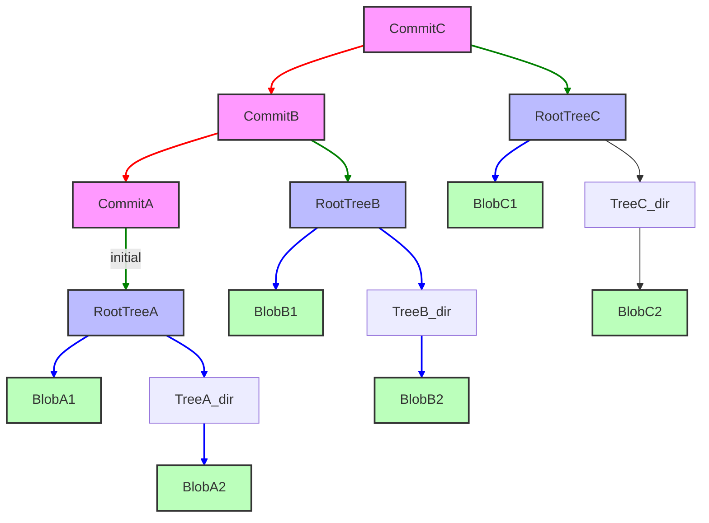

# Module 1: The Ghost in the Machine — Git Internals
**Complexity**: [MEDIUM]
**Time to Complete**: 90 minutes
**Prerequisites**: Zero to Terminal Module 0.6 (Git Basics: init, add, commit, push, pull)
**Next Module**: [Module 2: The Art of the Branch](../module-2-advanced-merging/)

## Learning Outcomes
By the end of this module, you will be able to:
1. **Diagnose** repository state by inspecting the `.git` directory, object database, refs, and index.
2. **Compare** blobs, trees, and commits when reconstructing project history from Git objects.
3. **Implement** staging-area changes with the index and Git plumbing commands.
4. **Evaluate** content-addressable storage for integrity, efficiency, and recovery tradeoffs.
5. **Design** a safe recovery plan for detached `HEAD`, deleted refs, and unreachable objects.

## Why This Module Matters

Most engineers learn Git as a set of porcelain commands — `git add`, `git commit`, `git push`, `git pull` — and rely on muscle memory for everything that does not break. The trouble starts the first time a branch behaves in a way the porcelain cannot explain. A merge appears to lose work that is in fact still recoverable. A reset moves a pointer in a way the engineer assumed would also delete history. A rebase rewrites commits whose original SHAs are still in the reflog, but only for ninety days. Underneath the surface, Git is a small content-addressable database of immutable objects (blobs, trees, commits, tags) plus a set of movable names (refs) that point at those objects. Once that mental model clicks, the porcelain stops being magic and starts being a thin layer over a system that is, by design, hard to permanently destroy.

Platform engineers manage that same content-addressable model at scale every day. A Kubernetes `ConfigMap` that disappears from a release branch is not a mystery; it is either still present in an earlier tree object, still in the working tree, still in the index, or still in a reflog entry on someone's laptop. Knowing how Git stores and references that content is the difference between recovery and panic. Throughout the Kubernetes sections in KubeDojo, the shorthand `k` means `alias k=kubectl`; once configured, commands such as `k get configmap` are read as normal `kubectl` usage.

Git feels mysterious when you only know porcelain commands such as `git add`, `git commit`, and `git push`. Underneath that interface, however, Git is a small database of immutable objects plus a set of movable names that point at those objects. This module takes the black box apart carefully, preserving the beginner-friendly commands while adding the mental model you need for real recovery work. You will inspect the `.git` directory, compare object types, implement staged snapshots, evaluate hash-based storage, and design recovery steps before panic pushes the wrong pointer.

## The `.git` Directory as Repository State
Every time you run `git init`, Git creates a hidden `.git` directory at the root of your project. That directory is not decoration around your code; it is the repository database, configuration store, reference namespace, and recovery workspace. If you copy a project directory without `.git`, you copy files but not history. If you damage `.git`, your working files may still exist, yet Git loses the memory that explains how those files relate to previous snapshots.

The easiest way to diagnose repository state is to start with this directory instead of starting with branch folklore. Think of `.git` as a small warehouse. The `objects/` area stores sealed boxes of content, `refs/` stores labels attached to boxes, `HEAD` says which label you are currently using, and the `index` file records the proposed next shipment. That warehouse analogy is imperfect because Git objects are cryptographically named, but it keeps one important fact visible: deleting a label is different from destroying a box.

That distinction becomes practical when a repository looks broken but still contains recoverable evidence. A missing file in the working tree may be safely present in the index, a commit that no branch displays may still appear in a reflog, and a blob that no path names today may still be stored as a loose object or packed object. Good diagnosis avoids collapsing those cases into one vague phrase such as "Git lost my work." Git usually did something specific, and `.git` gives you the vocabulary to find out which specific thing happened.

You should also notice that `.git` stores local state as well as shared history. The remote repository does not know about your uncommitted index entries, local reflog movements, unpushed branch names, or private hooks. That locality is a strength because it lets you work offline and recover from many mistakes without asking a server for permission. It is also a responsibility because your machine may contain the only reference to a useful commit until you push or create a durable branch.

Let's peek inside a freshly initialized repository.

```bash
# Create a new empty directory
mkdir my-git-repo
cd my-git-repo

# Initialize a Git repository
git init

# List the contents of the .git directory
ls -F .git
```

**Expected Output:**

```
HEAD		config		description	hooks/		info/		objects/	refs/
```

The output is small enough to look harmless, but each entry participates in a separate part of Git's state machine. `HEAD` usually points at a branch, `config` stores repository-specific settings, `hooks/` can run local automation, `info/` can hold local ignore rules, `objects/` contains the object database, and `refs/` contains branch and tag names. A production incident often becomes solvable when you can say which of those parts is wrong instead of saying that Git is confused.

The original module introduced the usual names, and we will keep that coverage while putting the pieces into an operational order. The `objects/` directory is where file contents, directory snapshots, and commit metadata live. The `refs/` directory is where branch names and tag names live. `HEAD` connects your current checkout to one of those names, or sometimes directly to a commit. The index sits beside them as the staging area, which means it can disagree with both your working directory and your last commit.

> **Pause and predict**: What do you think happens inside the `objects/` directory when you `git add` a file for the first time? Will Git store the entire file content, or just a diff?

That prediction matters because many engineers assume Git stores changes as a chain of patches. Git can store compressed deltas inside packfiles later, but the model you should reason with is snapshot-based. When you add a file, Git hashes the file content and writes a blob object for that content if it does not already exist. The index then records that the path should point at that blob in the next snapshot, which is why staged content can survive later edits to the working file.

This separation is the first recovery superpower. If a developer says, "I staged the fix, then my editor corrupted the file," you should not immediately assume the staged fix is gone. The staged version may already be stored as a blob object, and `git diff --staged`, `git ls-files --stage`, or `git cat-file` can help prove what the next commit would contain. You are diagnosing a state split, not a single mutable file.

| Repository area | What it stores | Common diagnostic command | Failure symptom |
|---|---|---|---|
| Working tree | Editable files on disk | `git status --short` | File looks changed, deleted, or untracked |
| Index | Proposed next commit | `git ls-files --stage` | Staged content differs from editor content |
| Object database | Immutable blobs, trees, commits, tags | `git cat-file -t <hash>` | Hash exists, is missing, or has unexpected type |
| Refs | Branch and tag pointers | `cat .git/refs/heads/main` | Branch points at the wrong commit |
| `HEAD` | Current checkout pointer | `cat .git/HEAD` | Detached state or wrong symbolic ref |

### Reading `.git` Without Treating It as a Toy
Inspecting `.git` is safe when you read files and use plumbing commands, but it is risky when you edit internals by hand. A branch ref is just a text file in simple repositories, yet manually overwriting it can bypass reflog entries and surprise collaborators. The disciplined approach is to read internals to build a diagnosis, then use Git commands such as `git branch`, `git update-ref`, `git restore`, or `git switch` to make intentional changes.

A common war-room mistake is to run increasingly dramatic porcelain commands before establishing which layer is wrong. For example, `git reset --hard` changes the index and working tree to match a commit, which is useful only if you already know that the target commit is correct and local edits are disposable. If the real issue is that `HEAD` is detached or a branch ref moved, a hard reset can erase useful evidence. Diagnosis begins by identifying the layer, not by trying commands from memory.

## Git Objects: Blobs, Trees, and Commits
Git is fundamentally a content-addressable object database with version-control behavior built on top. The three object types you will inspect most often are blobs, trees, and commits. A blob stores file content, a tree stores names and modes that connect paths to blobs or other trees, and a commit stores a root tree plus history metadata. Once you can compare those roles, Git history stops looking like magic and starts looking like linked records.

The most important distinction is that filenames do not live in blobs. A blob answers the question, "What bytes did this file content contain?" A tree answers, "Which names existed in this directory, what modes did they have, and which objects did they point to?" A commit answers, "Which root tree represented the project, who recorded it, when, with what message, and which parent commits came before it?" Keeping those questions separate prevents a lot of confusion during recovery.

#### Blobs Store Content, Not Paths
A blob object stores the content of a file. It does not store the filename, path, or commit message, and it does not know whether the content came from a Kubernetes manifest, a JavaScript source file, or a README. If two paths have identical bytes, Git can reuse the same blob for both paths because the object name is derived from the content. That property is why you can sometimes find useful content even after the path that once named it has disappeared.

Let's create a file and see its blob:

```bash
# Create a sample Kubernetes ConfigMap
cat <<EOF > configmap.yaml
apiVersion: v1
kind: ConfigMap
metadata:
  name: my-app-config
data:
  app.properties: |
    environment=dev
    database.url=jdbc:postgresql://localhost:5432/myapp_dev
  log4j.properties: |
    log4j.rootLogger=INFO, stdout
EOF

# Stage the file (this creates the blob object)
git add configmap.yaml

# Inspect the Git object database
find .git/objects -type f
```

You'll see a new file inside `.git/objects/`. Its path uses the first two hexadecimal characters of the object ID as a directory name and the remaining characters as the file name, which keeps huge repositories from placing every loose object into one directory. That storage layout is an implementation detail, but it reinforces the content-addressable model: the location is derived from the object ID, and the object ID is derived from the stored bytes plus a Git object header.

Now, let's use a plumbing command to inspect this blob object. Plumbing commands are low-level commands designed for scripts, diagnostics, and Git's own internals. Porcelain commands, such as `git add` and `git commit`, are the human-friendly layer. A strong engineer can use both layers without pretending one is superior; porcelain is safer for routine work, while plumbing is clearer when you need to prove what exists.

```bash
# Get the SHA-1 hash of the staged file
BLOB_HASH=$(git hash-object -w configmap.yaml)
echo "Blob Hash: $BLOB_HASH"

# Read the content of the blob object
git cat-file -p "$BLOB_HASH"
```

**Expected Output (similar to):**

```
Blob Hash: 9d8c... (your hash will be different)
apiVersion: v1
kind: ConfigMap
metadata:
  name: my-app-config
data:
  app.properties: |
    environment=dev
    database.url=jdbc:postgresql://localhost:5432/myapp_dev
  log4j.properties: |
    log4j.rootLogger=INFO, stdout
```

Notice that `git cat-file -p` printed the exact content of `configmap.yaml`, without any filename information. That absence is not a limitation; it is a deliberate split of responsibilities. The blob can be reused wherever the same content appears, while trees provide the path names for particular snapshots. If you recover a blob by hash, you have recovered content, but you still need tree or commit context to know where that content belonged.

This is why object-level recovery often has two phases. First, you prove that the bytes still exist by inspecting the blob. Second, you rebuild meaning by locating the tree and commit that connected those bytes to a path and a point in history. A raw manifest may tell you what the application needed, but the tree tells you whether it lived under `overlays/prod`, `base`, or a temporary experiment. In platform work, that context can be the difference between restoring the right configuration and reintroducing a test-only setting.

The blob model also explains why Git sometimes feels surprisingly efficient in repositories with repeated generated files, vendored manifests, or copied examples. Identical content can share one object identity even when it appears under multiple names. That does not mean duplicate files are a good design choice, and it does not eliminate review cost, but it does mean Git's storage model separates content identity from human naming. When two paths point at the same blob, Git is telling you those bytes are identical, not that the paths mean the same thing operationally.

#### Trees Store Directory Snapshots
Tree objects are directory entries in Git's object database. They store object type, object ID, file mode, and name for each entry in a directory. A tree can point to blobs for files and to other trees for subdirectories, which lets Git represent an entire project snapshot as one root tree. When a file changes, Git writes a new blob and new tree objects along the path from the changed file to the root, while unchanged subtrees can be reused.

When you `git commit`, Git takes the current state of your staging area and converts it into a hierarchy of tree objects for directories and blob objects for files. The working directory is not committed directly. This is why a file can be staged, changed again, and then committed in its older staged form. The commit uses the index's proposed tree, not whatever your editor happens to show at that second.

Let's commit our `configmap.yaml` and inspect the resulting tree:

```bash
# Commit the file
git commit -m "Add initial ConfigMap"

# Get the SHA-1 hash of the latest commit
COMMIT_HASH=$(git rev-parse HEAD)
echo "Commit Hash: $COMMIT_HASH"

# Read the commit object to find its root tree
git cat-file -p "$COMMIT_HASH"
```

The output of `git cat-file -p "$COMMIT_HASH"` will show a line beginning with `tree`, followed by the object ID of the root tree. Copying that ID by hand is fine for learning, but scripts should use commands such as `git rev-parse HEAD^{tree}` or parse carefully. The important point is conceptual: a commit does not contain every file inline. It points at a tree that names the root of the snapshot.

```bash
# Read the content of the root tree object
TREE_HASH=$(git cat-file -p "$COMMIT_HASH" | grep tree | awk '{print $2}')
git cat-file -p "$TREE_HASH"
```

**Expected Output (similar to):**

```
100644 blob 9d8c...	configmap.yaml
```

This output shows that the root tree contains one entry: a normal file mode, the object type `blob`, the blob ID, and the path name `configmap.yaml`. The mode `100644` means a regular non-executable file, which is what you expect for YAML. If the repository had a `manifests/` directory, the root tree would contain a tree entry for that directory, and the nested tree would contain the manifest names.

#### Commits Tie Snapshots to History
Commit objects tie everything together. A commit contains a pointer to a root tree, zero or more parent commit pointers, author and committer information, and the commit message. The first commit has no parent. A normal follow-up commit has one parent. A merge commit usually has two parents, which is how Git records that two lines of development were combined without copying all file contents into a special merge file.

This chain of commit objects forms the directed acyclic graph that people casually call Git history. It is directed because commits point backward to parents, and it is acyclic because a commit cannot be its own ancestor. Branches are not the graph itself; branches are names that point at commits in the graph. That distinction is the foundation for understanding why branch creation is cheap, why deleting a branch does not immediately delete commits, and why unreachable commits can still be recoverable for a while.

Let's re-inspect our commit object:

```bash
# Read the commit object
git cat-file -p "$COMMIT_HASH"
```

**Expected Output (similar to):**

```
tree 1a2b3c4d5e6f7890abcdef1234567890abcdef
author Your Name <your.email@example.com> 1678886400 +0000
committer Your Name <your.email@example.com> 1678886400 +0000

Add initial ConfigMap
```

Here, the `tree` line points to the root tree object for this commit. If this were not the first commit, you would also see a `parent` line. The author records who originally wrote the change, while the committer records who placed it into this repository history. Those can differ during rebases, cherry-picks, and patch application workflows, which is why incident reviews should avoid assuming that one name explains every action.

> **Stop and think**: Which approach would you choose here: `git log` or `git cat-file -p <commit_hash>` to quickly inspect the commit message of the latest commit, and why?

For everyday work, `git log -1` is the better porcelain command because it formats history for humans and handles common display concerns. For internals work, `git cat-file -p <commit_hash>` proves exactly what object Git stored and makes the tree and parent links visible. The senior habit is not to memorize one "right" command; it is to choose the layer that answers the question with the least ambiguity.

## The Index: Staging as a Proposed Commit
The staging area, also known as the index, is a crucial intermediate step between your working directory and repository history. It is a binary file at `.git/index` that stores the paths, modes, object IDs, and metadata Git will use for the next commit. It is not a copy of your working directory, and it is not the same as `HEAD`. It is a proposed snapshot that can be inspected, updated, and committed.

When you run `git add <file>`, Git computes the object ID for the file content, writes a blob object if needed, and updates the index entry for that path. If you edit the same file afterward, the working tree changes but the index still points at the earlier blob. This is the behavior behind the familiar `git status` message that a file is both staged and modified. Internally, Git is simply comparing three states: `HEAD`, index, and working tree.

> **Stop and think**: If the index is just a binary file storing proposed changes, what happens to the blob objects created by `git add` if you decide to unstage the file using `git restore --staged`? Do the blob objects get immediately deleted?

They do not disappear immediately. Unstaging changes the index pointer, but the blob object may remain in the object database as an unreachable object until Git's housekeeping eventually prunes it according to its safety windows. This is why aggressive cleanup commands should not be part of a recovery reflex. Until garbage collection removes unreachable objects, the database may still contain content that no branch currently names.

Let's modify our `configmap.yaml`, stage it, and see the index:

```bash
# Modify configmap.yaml
cat <<EOF > configmap.yaml
apiVersion: v1
kind: ConfigMap
metadata:
  name: my-app-config
data:
  app.properties: |
    environment=prod
    database.url=jdbc:postgresql://production.db.svc/myapp_prod
  log4j.properties: |
    log4j.rootLogger=WARN, file
EOF

# Stage the modified file
git add configmap.yaml

# Inspect the index
git ls-files --stage
```

**Expected Output (similar to):**

```
100644 2f1a... 0	configmap.yaml
```

The second column is the object ID of the blob currently staged for `configmap.yaml`. If you commit now, Git will create a tree pointing to that blob, then create a commit pointing to the tree, then move the current branch ref to the new commit. If you edit the file again before committing, the index still points at this staged blob until you add the file again. That is the core reason staging supports carefully curated commits.

Before running this in a real repository, what output do you expect from `git diff`, `git diff --staged`, and `git status --short` after you stage a file and then edit it again? The first command compares working tree to index, so it should show the second edit. The staged diff compares index to `HEAD`, so it should show the first edit. Status should reveal both staged and unstaged changes for the same path.

The index also supports advanced workflows such as partial staging, conflict stages during merges, and mode changes. During a merge conflict, `git ls-files --stage` may show multiple entries for the same path with different stage numbers, representing the merge base, "ours," and "theirs." You do not need that detail for every commit, but it explains why the index is more than a clipboard. It is a structured staging database that lets Git model unresolved states before producing a clean tree.

Partial staging deserves special attention because it is one of the places where Git's internal model improves everyday engineering practice. With `git add -p`, you can choose hunks from a working file and place only those hunks into the index. Internally, Git writes a staged blob that may not match any full file you have open in your editor, because it represents a curated version assembled for the next commit. That can be powerful for separating a bug fix from logging cleanup, but it requires discipline because the staged snapshot becomes less visually obvious.

The safest way to use that power is to review the staged snapshot as its own artifact. Before committing a partial change, run the staged diff and read it as if it were a patch from another engineer. If the repository contains deployment manifests, verify that the staged tree contains a coherent release state rather than half of a local experiment. The index lets you make precise commits, but precision only helps when you inspect the proposed commit before writing it into permanent history.

In a Kubernetes workflow, the index can protect you from mixing unrelated operational changes. Suppose you update a Deployment image and also tweak a ConfigMap while debugging a crash. Staging only the Deployment keeps the rollout commit focused, while leaving the ConfigMap edit in the working tree for more testing. If a teammate later asks what was actually shipped, the commit's tree gives a precise answer, not a story about what your editor once displayed.

## Content-Addressable Storage and the DAG
Git's storage is content-addressable, which means object names are derived from object contents rather than assigned by a central server. For historical repositories, that object name is usually a SHA-1 identifier; newer Git versions also support SHA-256 repositories in specific contexts, though SHA-1 remains common in public interoperability. The practical lesson is not that hashes are magical. The lesson is that changing even one byte produces a different object identity.

This has profound implications for integrity, efficiency, and immutability. Integrity improves because Git can detect when stored content no longer matches its object ID. Efficiency improves because identical content can be stored once and referenced from multiple trees. Immutability improves reasoning because an existing object is not edited in place; a change writes a new object and moves references. Those properties are why Git can make local commits quickly without asking a central database for the next revision number.

The way these immutable objects link together forms a directed acyclic graph. Each commit points to its parent commits and to a root tree, each tree points to blobs or nested trees, and branch refs point to selected commits. This structure is what allows Git to implement branching, merging, rebasing, checkout, bisect, and reflog-based recovery as graph operations. When you understand the graph, commands that once seemed unrelated become different ways of moving or reading pointers.



In this preserved diagram, the commit objects point backward through history while also pointing down to root trees. The root trees point to file content directly or to nested directory trees, and those nested trees point to more blobs. The colors are visual aids, but the operational meaning is the arrows: a reachable branch tip keeps its commit reachable, that commit keeps its tree reachable, and the tree keeps its blobs reachable.

Packfiles add an important implementation wrinkle without changing the logical model. Loose objects begin as individual compressed files, but Git later packs many objects together for disk efficiency and transfer speed. Inside a packfile, Git may delta-compress similar objects against each other, which is why someone may say Git stores differences. For diagnosis, keep the logical object model first, then remember that the physical storage may be optimized underneath.

That layered view prevents two opposite mistakes. One mistake is to deny that packfiles store deltas internally, which makes Git's disk usage and network transfer behavior seem mysterious. The other mistake is to reason about history as if commits are patches rather than snapshots, which makes restore operations seem harder than they are. A commit names a complete project tree even if Git stored some underlying bytes efficiently. When you ask for `git show <commit>:configmap.yaml`, Git reconstructs the blob content through the object database and presents the file as it existed in that snapshot.

Hashing also has social consequences in distributed teams. Because object IDs are derived locally from content, two developers can create identical blob objects without coordinating with a server. Because commit objects include parent IDs, author data, committer data, timestamps, tree IDs, and messages, two commits with identical file changes can still have different commit IDs. That is why rebasing changes commit IDs even when the final files look the same. The graph records both content and ancestry, and collaboration tools build their review logic on that graph.

Which approach would you choose here and why: inspect a suspected missing file by searching old commits with porcelain commands, or inspect raw objects with plumbing first? In a normal repository, start with porcelain such as `git log -- path` and `git show <commit>:<path>` because paths and commits preserve meaning. Drop to plumbing when porcelain cannot answer the question, such as when a branch pointer moved, the path name is uncertain, or you only have an object ID from `git fsck` or reflog output.

The integrity tradeoff is also worth stating carefully. Hashes make accidental corruption visible, but they do not replace reviews, backups, signed releases, or protected branches. A valid commit can still delete the wrong file, and a forced push can still move a shared branch to a harmful commit. Git's object model gives you tools for investigation and recovery; it does not make operational discipline optional.

## Refs, `HEAD`, and Recovery Thinking
Branches in Git are lightweight references to commits, not separate copies of your project. A branch name such as `main` usually lives under `.git/refs/heads/` or inside packed refs, and its value is the object ID of the commit at the branch tip. When you create a new branch, Git writes a new name that points to an existing commit. When you commit on that branch, Git writes new objects and moves the branch name to the new commit.

`HEAD` is the special pointer that tells Git what you currently have checked out. In the common case, it is a symbolic reference such as `ref: refs/heads/main`, which means new commits should advance the `main` branch. In detached `HEAD` state, it points directly to a commit instead of to a branch name. Detached `HEAD` is not corruption; it is a normal state for CI builds, tag inspection, and historical debugging, but new commits made there need a branch or tag if you want to keep them.

Let's see our current `HEAD` and branch ref:

```bash
# View what HEAD points to
cat .git/HEAD

# View the main branch ref (assuming 'main' is your default branch)
cat .git/refs/heads/main
```

**Expected Output (similar to):**

```
# cat .git/HEAD
ref: refs/heads/main

# cat .git/refs/heads/main
2f1a... (this will be the hash of your latest commit)
```

This shows that `HEAD` points to the `main` branch, and the `main` branch points to the latest commit. When you make a new commit, Git creates a commit object, points that commit at its parent and tree, and then moves the current branch pointer forward. If `HEAD` is detached, Git can still create the commit, but no branch name moves with it. That is why detached commits feel lost after checkout even though the objects may still exist.

A medium-sized startup, let's call them KubeFlow Inc., struggled with configuration drift across development and staging Kubernetes environments. Their main application relied on a critical `ConfigMap` for database connection strings and feature flags. During cleanup, a developer deleted a local branch after an experimental rebase and believed she was only removing a label. She was technically right about the branch deletion, but she had not checked whether the commits reachable only from that label were still needed for recovery.

The incident was resolved because a senior engineer used `git reflog` to find the object ID that `HEAD` had pointed to before the rebase, then restored the missing manifest from that commit. The deeper lesson is not "never delete branches." The lesson is that Git recovery depends on reachability and time. Reflogs preserve recent movements of refs, unreachable objects may survive until pruning, and a calm investigation can often recover what a rushed force-push would make harder to explain.

Designing a safe recovery plan starts by freezing evidence. Do not run aggressive garbage collection, do not prune immediately, and do not force-push a guessed fix over the top of the shared branch. First, inspect `HEAD`, branch refs, reflog entries, and object existence. Then create a protective branch or tag pointing at any suspicious commit before you continue. A branch name costs almost nothing, and it can preserve a commit long enough for the team to inspect it carefully.

A practical recovery note should record both commands and interpretations. For example, "reflog entry `HEAD@{2}` pointed to the commit before the rebase" is more useful than "I found an old commit," because another engineer can verify the evidence. Likewise, "the branch ref moved from one object ID to another during the force-push" is better than "main changed." Git gives you exact identifiers; use them in incident notes so the team can distinguish facts from guesses and reconstruct the sequence later.

Once the useful commit is protected, repair should be as narrow as the diagnosis allows. Restoring one path from a known commit is narrower than resetting an entire branch. Creating a revert commit is safer for shared history than rewriting a public branch when the bad commit has already reached teammates. Cherry-picking a recovered commit may be appropriate when detached work contains a clean fix, but merging may be better when you need to preserve branch context. The object model does not choose the policy for you; it gives you the evidence needed to choose deliberately.

## Patterns & Anti-Patterns
The patterns below are habits that make Git internals useful without turning daily development into archaeology. You do not need to inspect `.git` for every feature branch, just as you do not need a debugger for every line of code. The goal is to know which layer to inspect when ordinary commands produce surprising output, and to preserve evidence before using commands that rewrite or discard state.

| Pattern | When to use it | Why it works | Scaling consideration |
|---|---|---|---|
| Diagnose by layer | Status, staged content, branch pointer, or object existence is unclear | Separates working tree, index, object database, refs, and `HEAD` | Teach teams a short checklist for incidents |
| Preserve before repairing | A commit may be unreachable or a ref moved unexpectedly | A temporary branch or tag keeps objects reachable | Use names with incident IDs or dates for cleanup later |
| Prefer porcelain for routine changes | You are committing, branching, restoring, or reviewing normal work | Porcelain commands update related state safely | Document exceptions where plumbing is allowed |
| Use plumbing for proof | You need to inspect exact object type, content, or tree linkage | Plumbing exposes the stored database directly | Pair raw commands with written notes in incident review |

Anti-patterns usually come from treating Git as either too magical or too simple. The engineer who fears internals may keep trying random porcelain commands, while the engineer who overtrusts internals may edit `.git/refs` by hand and bypass useful safety rails. Good practice sits between those extremes. Read internals freely, write them cautiously, and prefer Git commands that leave reflog evidence.

| Anti-pattern | What goes wrong | Better alternative |
|---|---|---|
| Running destructive cleanup during recovery | Unreachable but useful objects may be pruned before inspection | Create protective refs, inspect reflog, and delay cleanup |
| Assuming branch deletion deletes code instantly | Teams either panic unnecessarily or ignore reachability risk | Explain that refs move cheaply while objects persist temporarily |
| Treating staged content as identical to the editor | Commits include an older staged version than the developer expects | Compare `git diff`, `git diff --staged`, and `git ls-files --stage` |
| Editing `.git/HEAD` or refs by hand | Reflogs and related invariants can be bypassed | Use `git switch`, `git branch`, or `git update-ref` deliberately |

## Decision Framework
When Git behaves unexpectedly, choose the diagnostic route by asking which layer produced the symptom. If the file on disk is wrong, start with the working tree and index. If the commit history display is wrong, inspect commits and refs. If a branch name seems to have moved, inspect `HEAD`, branch refs, and reflog. If you only have a hash or `git fsck` output, inspect object type and content with plumbing.

| Symptom | First question | Best first tool | Escalate when |
|---|---|---|---|
| File has unexpected edits | Is the change staged, unstaged, or both? | `git status --short` | Use `git diff --staged` and index inspection |
| Commit seems to omit a file | Did the index include the intended blob? | `git show --name-status HEAD` | Inspect the commit tree and staged entries |
| Branch points at the wrong work | Did the ref move, or did `HEAD` detach? | `cat .git/HEAD` and `git reflog` | Create a protective branch before repair |
| Object hash appears in logs | What type of object is this? | `git cat-file -t <hash>` | Pretty-print or recover content by type |
| CI checked out a raw commit | Is new work being created detached? | `git status --branch` | Create a branch before preserving new commits |

Use this flow during incidents: observe, identify the layer, preserve evidence, inspect exact objects, then repair with the narrowest command. The order matters because Git gives you several commands that can make the visible symptom disappear while also erasing useful clues. A narrow repair might be as simple as restaging one file, creating a branch at a reflog entry, or restoring a single path from an older commit. A broad repair, such as resetting a shared branch, should come only after the graph is understood.

The tradeoff is speed versus certainty. During a local typo, speed wins, and porcelain commands are enough. During a production rollback, certainty wins because the team needs to know which tree corresponds to the deployed artifact. Internals do not slow you down when used selectively; they prevent you from making a fast but poorly evidenced change that creates a second incident.

## Did You Know?
1. Git was initially developed by Linus Torvalds in 2005 for Linux kernel development after the kernel community needed a fast distributed system for a very large project.
2. The SHA-1 collision demonstrated by CWI and Google in 2017 pushed Git toward collision-detecting SHA-1 implementations and later experimental SHA-256 repository support.
3. Git's loose objects are compressed individually at first, but housekeeping can store many objects in packfiles with delta compression for efficiency.
4. Before Git hashes an object, it prepends a header in the form `type size` plus a null byte, so the object type participates in the identity.

## Common Mistakes
| Mistake | Why It Happens | How to Fix It |
|---|---|---|
| Assuming a blob contains the filename | `git cat-file -p` prints file content, so it feels like the path must be nearby | Inspect the tree that points to the blob when you need the path |
| Committing without re-adding after an edit | The staged version and working version look similar in the editor | Compare `git diff` and `git diff --staged` before committing |
| Treating detached `HEAD` as repository corruption | CI systems and tag checkouts often show raw commit IDs | Create a branch if you need to keep new commits from that state |
| Deleting a branch before checking reflog | Branches feel like folders, so cleanup feels harmless | Preserve suspicious commits with a temporary branch or tag first |
| Running prune commands during panic | Cleanup commands sound like repair commands | Delay pruning until after recovery and review are complete |
| Reading packfiles as a different Git model | Delta compression makes people think Git is only patch-based | Reason with blobs, trees, commits, and refs; treat packing as storage optimization |
| Editing refs manually to "fix" history | Ref files look simple in small repositories | Use Git commands that update reflogs and related state intentionally |

## Quiz
<details><summary>Scenario: You are investigating a colleague's local repository because a script corrupted their working directory. `git cat-file -p` on an object prints entries like `100644 blob 9d8c... app.js` and `040000 tree 1a2b... src`. What are you inspecting, and how does that help you diagnose repository state?</summary>

You are inspecting a tree object, not a blob or commit. The entries describe a directory snapshot by naming a file blob and a nested tree, so this object helps you diagnose repository state at the directory level. It tells you which object IDs represented particular paths, but it does not contain the file contents or the commit metadata. To continue the investigation, inspect the referenced blob for content or find the commit that points to this tree.
</details>

<details><summary>Scenario: You staged `deployment.yaml`, edited it again, and then noticed that your Kubernetes 1.35+ rollout commit may not include the latest change. How should you compare the working tree, index, and commit before proceeding?</summary>

Start by comparing the three states separately instead of trusting the editor view. `git diff --staged` shows what the index would commit relative to `HEAD`, while `git diff` shows how the working tree differs from the index. `git ls-files --stage deployment.yaml` can confirm the staged blob object ID if you need proof. This implements staging-area discipline because you only commit after the index points at the intended content.
</details>

<details><summary>Scenario: CI checked out a raw commit hash, a developer made a hotfix there, and now `cat .git/HEAD` does not show `ref: refs/heads/main`. What recovery plan keeps the detached `HEAD` work safe?</summary>

This is detached `HEAD`, which is normal but easy to lose track of. The safe recovery plan is to create a branch or tag at the current commit before switching away, then decide whether to merge, cherry-pick, or open a pull request from that branch. New commits made while detached are real commit objects, but no branch ref advances with them. Preserving a ref makes those commits reachable and gives the team a stable name for review.
</details>

<details><summary>Scenario: A teammate says Git stores only diffs, so a missing `ConfigMap` cannot be recovered unless you know the exact patch. How would you evaluate content-addressable storage in your answer?</summary>

Git's logical model is snapshot-based: commits point to trees, and trees point to blobs containing file content. Packfiles may delta-compress objects physically, but that optimization does not change how you reason about recovery. If a commit or tree that referenced the `ConfigMap` is reachable, you can restore the full file content from that snapshot. The content-addressable design also lets Git verify object integrity by comparing stored content to its object ID.
</details>

<details><summary>Scenario: You have a blob hash from `git fsck`, but no path name. Which Git objects must you compare to reconstruct project history around that content?</summary>

A blob alone gives content but not a path, so you need trees that reference the blob and commits that reference those trees. Comparing blobs, trees, and commits lets you reconstruct project history from content up through directory snapshots to named commits. This is why `git cat-file -p <blob>` is only the first step. The useful story appears when you find the tree entry that named the blob and the commit that made that tree reachable.
</details>

<details><summary>Scenario: During incident response, someone proposes `git reset --hard` and `git gc --prune=now` to "clean things up" before investigation. What should you do instead?</summary>

Do not start with cleanup when recovery is still uncertain. First inspect `HEAD`, refs, reflog, the index, and any suspicious object IDs, then create protective branches or tags for commits that might matter. A hard reset can discard working and staged evidence, while immediate pruning can remove unreachable objects that were still recoverable. The better plan is to preserve evidence, diagnose the layer, and then repair narrowly.
</details>

<details><summary>Scenario: You need to teach a junior engineer why branch creation is fast and why deleting a branch is not the same as deleting every file. What explanation should you give?</summary>

A branch is a ref, which is a lightweight name pointing at a commit object. Creating a branch usually writes a small pointer, and deleting one removes that name rather than immediately deleting all objects reachable from the old tip. The commits and their trees and blobs may remain reachable from other refs, reflogs, or temporary unreachable storage windows. This explanation connects branch behavior to the object graph instead of to folder-copy intuition.
</details>

## Hands-On Exercise
This exercise builds a small repository and asks you to inspect each Git layer deliberately. Use a disposable directory, because the point is to experiment without fear. You will diagnose repository state through `.git`, compare blobs, trees, and commits, implement staging-area changes, evaluate content-addressable behavior, and design a safe recovery plan for detached work. If you also have a Kubernetes cluster available, you may apply the sample `ConfigMap` with the `k` alias after defining `alias k=kubectl`, but the Git exercise does not require a cluster.

### Setup
Create a temporary repository and configure an identity if your global Git config is empty. Keep all commands inside the disposable directory. The sample file is a Kubernetes `ConfigMap` because configuration drift is a realistic platform failure, but Git treats it like any other text file. Your job is to observe which Git layer changes after each operation.

### Tasks
- [ ] Diagnose repository state by listing `.git`, reading `HEAD`, and identifying where refs and objects live.
- [ ] Compare blobs, trees, and commits by creating `configmap.yaml`, staging it, committing it, and inspecting each object type.
- [ ] Implement staging-area changes by staging a production edit, editing the file again, and comparing `git diff`, `git diff --staged`, and `git ls-files --stage`.
- [ ] Evaluate content-addressable storage by hashing identical content twice and explaining why the object ID does or does not change.
- [ ] Design a safe recovery plan by creating a detached `HEAD` commit, preserving it with a branch, and verifying the branch ref.
- [ ] Record the commands you used and the evidence each command produced, as if you were writing an incident note for a teammate.

<details><summary>Solution for tasks 1 and 2</summary>

Initialize the repository, create the `ConfigMap`, run `git add`, and inspect `.git/objects` before and after staging. Use `git hash-object -w configmap.yaml` to confirm the blob content, then commit and inspect `git cat-file -p HEAD` to find the root tree. Use `git cat-file -p <tree-id>` to compare the tree entry with the blob content. The success condition is that you can explain why the blob lacks the filename while the tree contains it.
</details>

<details><summary>Solution for task 3</summary>

After staging the production edit, modify the file again without staging. `git diff --staged` should show the staged production edit relative to `HEAD`, while `git diff` should show the later working-tree edit relative to the index. `git ls-files --stage` should show the blob ID currently staged for the path. The success condition is that you can say which version would be committed right now.
</details>

<details><summary>Solution for task 4</summary>

Run `git hash-object configmap.yaml` twice without changing the file and confirm that the object ID is stable. Then change one byte and run it again; the ID should change because Git names objects from their content plus header. If two different paths contain identical bytes, they can share the same blob ID. The success condition is an explanation of integrity and deduplication without claiming that Git only stores patches.
</details>

<details><summary>Solution for task 5</summary>

Check out the previous commit by object ID to enter detached `HEAD`, make a small commit, and inspect `cat .git/HEAD`. Before switching away, create a branch name at the current commit with `git branch recovered-detached-work HEAD`. Then switch back to `main` and verify that `cat .git/refs/heads/recovered-detached-work` contains the preserved commit ID. The success condition is that no useful commit depends only on detached `HEAD`.
</details>

### Success Criteria
- [ ] You can diagnose repository state by naming which layer changed after `git add`, `git commit`, branch creation, and detached checkout.
- [ ] You can compare blobs, trees, and commits using `git cat-file` output rather than vague descriptions.
- [ ] You can implement staging-area changes and predict which file content the next commit will contain.
- [ ] You can evaluate content-addressable storage by explaining object IDs, immutability, and packfile optimization.
- [ ] You can design a safe recovery plan that preserves detached or unreachable work before cleanup.

## Next Module
Next, continue to [Module 2: The Art of the Branch](../module-2-advanced-merging/) to practice branch movement, merge structure, and conflict recovery with the object model you built here.

## Sources
- [Pro Git: Plumbing and Porcelain](https://git-scm.com/book/en/v2/Git-Internals-Plumbing-and-Porcelain)
- [Pro Git: Git Objects](https://git-scm.com/book/en/v2/Git-Internals-Git-Objects)
- [Pro Git: Git References](https://git-scm.com/book/en/v2/Git-Internals-Git-References)
- [Pro Git: Packfiles](https://git-scm.com/book/en/v2/Git-Internals-Packfiles)
- [Git documentation: git-cat-file](https://git-scm.com/docs/git-cat-file)
- [Git documentation: git-hash-object](https://git-scm.com/docs/git-hash-object)
- [Git documentation: git-ls-files](https://git-scm.com/docs/git-ls-files)
- [Git documentation: git-rev-parse](https://git-scm.com/docs/git-rev-parse)
- [Git documentation: gitrevisions](https://git-scm.com/docs/gitrevisions)
- [Git documentation: git-reflog](https://git-scm.com/docs/git-reflog)
- [Git documentation: hash-function-transition (SHA-256)](https://git-scm.com/docs/hash-function-transition)
- [Kubernetes documentation: ConfigMaps](https://kubernetes.io/docs/concepts/configuration/configmap/)
