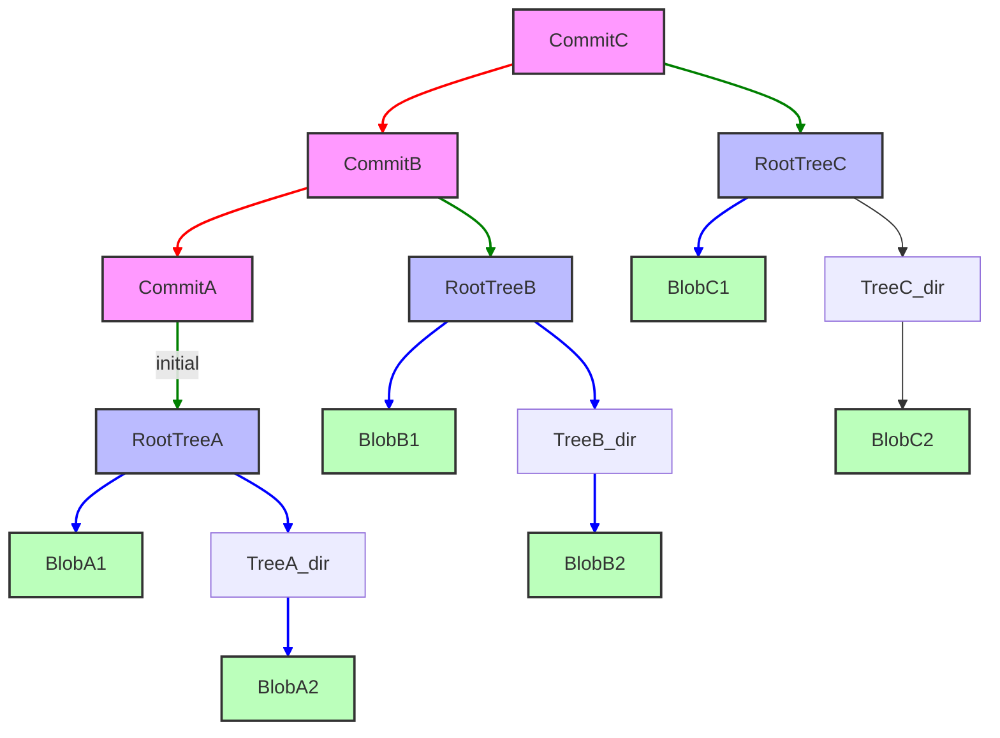

# Module 1: The Ghost in the Machine — Git Internals
**Complexity**: [MEDIUM]
**Time to Complete**: 90 minutes
**Prerequisites**: Zero to Terminal Module 0.6 (Git Basics — init, add, commit, push, pull)
**Next Module**: [Module 2: The Art of the Branch](../module-2-advanced-merging/)

## Learning Outcomes
By the end of this module, you will be able to:
1.  **Diagnose** repository state by inspecting the `.git` directory and its objects.
2.  **Compare** the roles of blobs, trees, and commit objects in representing project history.
3.  **Implement** changes to the staging area (index) and demonstrate its intermediate role in committing.
4.  **Evaluate** the implications of Git's content-addressable storage model on data integrity and history.
5.  **Utilize** Git plumbing commands to manually construct and inspect repository objects.

## Why This Module Matters
Imagine your team is deploying a critical update to a production Kubernetes cluster. It's Friday afternoon, and everyone's looking forward to the weekend. Suddenly, an urgent Slack message flashes: "Production is down! Pods are crashing due to a missing ConfigMap!" Panic ensues. The last deploy was green, but somehow, a vital configuration disappeared. Developers scramble, frantically trying to roll back, but the *exact* previous state seems elusive. Hours later, after much pain, a senior engineer eventually reconstructs the missing piece by painstakingly digging through old logs and local checkouts. It turns out someone, inadvertently, deleted a branch locally, thinking it only removed a pointer, not actual code, and a subsequent force-push propagated the error.

This nightmare scenario, while extreme, highlights a common underlying vulnerability: a lack of deep understanding of how Git actually *works*. Many engineers treat Git as a black box—a magical tool that somehow saves their code. They know `git add`, `git commit`, `git push`, but when things go wrong, when history gets rewritten, or when a critical file mysteriously vanishes, the black box offers no comfort. Without understanding Git's internal mechanics—how it stores data, links history, and manages pointers—you're at the mercy of its defaults. This module will pull back the curtain, demystifying Git's inner ghost. You'll learn the fundamental building blocks of every Git repository, gaining the power to not just *use* Git, but to truly *understand*, *diagnose*, and *recover* from even the most perplexing version control mishaps. By understanding Git at this level, you’ll become a more confident, capable, and resilient engineer, ready to tackle any version control challenge.

## Core Content Sections

### 1. The `.git` Directory: Your Repository's Brain
Every time you run `git init`, Git creates a hidden `.git` directory at the root of your project. This directory is not just a folder; it's the entire brain of your repository. It contains all the information Git needs to manage your project's history, from every file version to every commit message, branch, and tag. If you lose this directory, you lose your project's entire Git history.

Let's peek inside a freshly initialized repository.

```bash
# Create a new empty directory
mkdir my-git-repo
cd my-git-repo

# Initialize a Git repository
git init

# List the contents of the .git directory
ls -F .git
```

**Expected Output:**

```
HEAD		config		description	hooks/		info/		objects/	refs/
```

-   **`HEAD`**: A reference to the currently checked-out commit. It usually points to a branch.
-   **`config`**: Project-specific configuration options.
-   **`description`**: Used by GitWeb (a web interface to Git repositories) for describing the project.
-   **`hooks/`**: Client-side or server-side scripts that Git can execute before or after commands (e.g., pre-commit, post-receive).
-   **`info/`**: Contains the global exclude file for ignored patterns, similar to `.gitignore`.
-   **`objects/`**: This is where Git stores all your data – the actual content of your files, directories, and commit metadata. It's the content-addressable storage.
-   **`refs/`**: Contains pointers to commits, specifically for branches (`heads`) and tags (`tags`).

The `objects/` directory is the most critical. This is where Git's magic truly happens.

> **Pause and predict**: What do you think happens inside the `objects/` directory when you `git add` a file for the first time? Will Git store the *entire* file content, or just a diff?

### 2. Git Objects: Blobs, Trees, and Commits
Git is fundamentally a content management system, not a file management system. It stores your project's history as a series of interconnected objects, each identified by a unique SHA-1 hash. There are four main types of Git objects, but we'll focus on the three core ones: blobs, trees, and commits.

#### 2.1 Blobs (Binary Large Objects)
A blob object stores the content of a file. It doesn't store the filename, path, or any metadata—just the raw data. If two files in your repository (even in different directories) have the exact same content, Git stores only one blob object for both. This is a key part of Git's efficiency.

Let's create a file and see its blob:

```bash
# Create a sample Kubernetes ConfigMap
cat <<EOF > configmap.yaml
apiVersion: v1
kind: ConfigMap
metadata:
  name: my-app-config
data:
  app.properties: |
    environment=dev
    database.url=jdbc:postgresql://localhost:5432/myapp_dev
  log4j.properties: |
    log4j.rootLogger=INFO, stdout
EOF

# Stage the file (this creates the blob object)
git add configmap.yaml

# Inspect the Git object database
find .git/objects -type f
```

You'll see a new file inside `.git/objects/`. Its name will be `xx/xxxxxxxxxxxxxxxxxxxxxxxxxxxxxxxxxxxxxx`, where `xx` are the first two characters of the SHA-1 hash, and the rest are the remaining 38 characters.

Now, let's use a "plumbing" command to inspect this blob object. Plumbing commands are low-level commands designed to be used by scripts or other Git commands. "Porcelain" commands (like `git add`, `git commit`) are the user-friendly, high-level commands.

```bash
# Get the SHA-1 hash of the staged file
BLOB_HASH=$(git hash-object -w configmap.yaml)
echo "Blob Hash: $BLOB_HASH"

# Read the content of the blob object
git cat-file -p "$BLOB_HASH"
```

**Expected Output (similar to):**

```
Blob Hash: 9d8c... (your hash will be different)
apiVersion: v1
kind: ConfigMap
metadata:
  name: my-app-config
data:
  app.properties: |
    environment=dev
    database.url=jdbc:postgresql://localhost:5432/myapp_dev
  log4j.properties: |
    log4j.rootLogger=INFO, stdout
```

Notice that `git cat-file -p` printed the exact content of `configmap.yaml`, without any filename information.

#### 2.2 Trees
Tree objects are like directory entries. They store a list of pointers to blobs and other tree objects, along with the corresponding filenames, file modes (permissions), and object types. This is how Git reconstructs the state of your project at any given commit. A tree object represents a snapshot of a directory at a specific point in time.

When you `git commit`, Git takes the current state of your staging area and converts it into a hierarchy of tree objects (for directories) and blob objects (for files).

Let's commit our `configmap.yaml` and inspect the resulting tree:

```bash
# Commit the file
git commit -m "Add initial ConfigMap"

# Get the SHA-1 hash of the latest commit
COMMIT_HASH=$(git rev-parse HEAD)
echo "Commit Hash: $COMMIT_HASH"

# Read the commit object to find its root tree
git cat-file -p "$COMMIT_HASH"
```

The output of `git cat-file -p "$COMMIT_HASH"` will show something like `tree <tree_hash>`. Copy that `<tree_hash>`.

```bash
# Read the content of the root tree object
TREE_HASH=$(git cat-file -p "$COMMIT_HASH" | grep tree | awk '{print $2}')
git cat-file -p "$TREE_HASH"
```

**Expected Output (similar to):**

```
100644 blob 9d8c...	configmap.yaml
```

This shows that our root tree object contains one entry: a blob object (`9d8c...`) named `configmap.yaml` with file mode `100644`.

#### 2.3 Commits
Commit objects tie everything together. A commit object contains:
-   A pointer to a **root tree** object (the snapshot of your project's files at that commit).
-   Pointers to one or more **parent commit** objects (linking the history).
-   Author and committer information (name, email, timestamp).
-   The commit message.

This chain of commit objects, each pointing to its parent, forms the directed acyclic graph (DAG) that is your project's history.

Let's re-inspect our commit object:

```bash
# Read the commit object
git cat-file -p "$COMMIT_HASH"
```

**Expected Output (similar to):**

```
tree 1a2b3c4d5e6f7890abcdef1234567890abcdef
author Your Name <your.email@example.com> 1678886400 +0000
committer Your Name <your.email@example.com> 1678886400 +0000

Add initial ConfigMap
```

Here, `tree 1a2b3c4d...` points to the root tree object for this commit. If this wasn't the very first commit, you'd also see a `parent <parent_commit_hash>` line.

> **Stop and think**: Which approach would you choose here: `git log` or `git cat-file -p <commit_hash>` to quickly inspect the commit message of the latest commit, and why?

### 3. The Staging Area (Index)
The staging area, also known as the index, is a crucial intermediate step between your working directory and your repository's history. It's a binary file (`.git/index`) that stores information about the files Git will include in the *next* commit. It's not your working directory, nor is it your last commit. It's a proposed next commit.

When you run `git add <file>`, Git computes the SHA-1 hash of the file's content and immediately stores it as a zlib-compressed blob object in the `objects/` database. It then updates the index with information about the file's path, permissions, and a pointer to that new blob object.

> **Stop and think**: If the index is just a binary file storing proposed changes, what happens to the blob objects created by `git add` if you decide to unstage the file using `git restore --staged`? Do the blob objects get immediately deleted?

Let's modify our `configmap.yaml`, stage it, and see the index:

```bash
# Modify configmap.yaml
cat <<EOF > configmap.yaml
apiVersion: v1
kind: ConfigMap
metadata:
  name: my-app-config
data:
  app.properties: |
    environment=prod
    database.url=jdbc:postgresql://production.db.svc/myapp_prod
  log4j.properties: |
    log4j.rootLogger=WARN, file
EOF

# Stage the modified file
git add configmap.yaml

# Inspect the index
git ls-files --stage
```

**Expected Output (similar to):**

```
100644 2f1a... 0	configmap.yaml
```

The second column `2f1a...` is the SHA-1 hash of the *new* blob object for the modified `configmap.yaml`. This confirms the index is now pointing to the updated content. If you were to run `git commit` now, it would create a new commit object pointing to a new tree object, which in turn would point to this new blob.

### 4. Content-Addressable Storage and the DAG
Git's design is revolutionary because it's **content-addressable**. This means that instead of referring to files by their names, Git refers to their content via a cryptographic hash (SHA-1). Every piece of data—blob, tree, commit—is stored as an object whose name is the SHA-1 hash of its content.

This has profound implications:
-   **Integrity:** If even a single bit of a file changes, its SHA-1 hash changes, and Git immediately knows it's a different version. This makes Git incredibly robust against accidental corruption.
-   **Efficiency:** Duplicate files or identical versions of files are stored only once.
-   **Immutability:** Once an object is created in the Git object database, it can never be changed. Any change to content results in a *new* object.

The way these immutable objects link together forms a **Directed Acyclic Graph (DAG)**. Each commit object points to its parent(s), creating a chronological chain. This structure is what allows Git to efficiently track history, branches, merges, and rebases.



In the diagram:
-   Pink rectangles represent **Commit Objects**. Each points to its parent (red arrows) and its root tree (green arrows).
-   Blue rectangles represent **Tree Objects** (directories). Each points to blobs (light blue arrows) or other trees (not shown for simplicity).
-   Green rectangles represent **Blob Objects** (file contents).

### 5. Refs, HEAD, and Branches as Pointers
Branches in Git are not separate copies of your code; they are incredibly lightweight pointers (references, or "refs") to specific commit objects. A branch simply tells Git: "this is the current tip of this line of development."

-   **Refs:** Stored in `.git/refs/`. Specifically, `.git/refs/heads/` contains files named after your branches, and each file contains the SHA-1 hash of the commit that branch points to. Similarly, `.git/refs/tags/` contains pointers for tags.
-   **HEAD:** This special ref is a pointer to the branch you are currently working on. It's usually a symbolic reference, meaning it points to another ref (a branch). When you `git checkout <branch-name>`, you're simply changing what `HEAD` points to. When `HEAD` points directly to a commit (not a branch), you are in a "detached HEAD" state.

Let's see our current `HEAD` and branch ref:

```bash
# View what HEAD points to
cat .git/HEAD

# View the main branch ref (assuming 'main' is your default branch)
cat .git/refs/heads/main
```

**Expected Output (similar to):**

```
# cat .git/HEAD
ref: refs/heads/main

# cat .git/refs/heads/main
2f1a... (this will be the hash of your latest commit)
```

This clearly shows that `HEAD` points to the `main` branch, and the `main` branch points to the SHA-1 hash of your latest commit. When you make a new commit, Git creates a new commit object, and then *moves the branch pointer* (and thus `HEAD`) to this new commit. This is why branches are so cheap and fast in Git.

### War Story: The Disappearing ConfigMap
A medium-sized startup, let's call them "KubeFlow Inc.", was struggling with configuration drift across their development and staging Kubernetes environments. Their main application relied on a critical `ConfigMap` for database connection strings and feature flags. One day, a junior developer, assigned to clean up old feature branches, decided to delete a local branch named `feature/db-migration`. She correctly understood that `git branch -d feature/db-migration` would delete the *pointer* to the branch. However, she had also performed an experimental `git rebase` on that branch earlier, which had inadvertently copied the `main` branch's history, *including a temporary commit that removed the critical ConfigMap for testing purposes*, then immediately undid it. When she deleted the branch, she didn't realize that the *commit object* itself, which was briefly the *only* place that ConfigMap was correctly referenced in her local repository, was then eligible for garbage collection. She thought she was only deleting a label. A day later, her local main branch was force-pushed to the remote. The next deployment from `main` then suddenly omitted the ConfigMap, causing a cascade of failures.

The incident was eventually resolved by a senior engineer who used `git reflog` to find the SHA-1 of the "lost" commit before the rebase and then used `git checkout <sha>` to recover the files. This incident underscores the importance of understanding that `git branch -d` only deletes a *pointer*; the underlying commit objects remain for a time, but if no refs point to them, they can eventually be garbage collected. If that ConfigMap had *only* existed in that rebased, then deleted, branch, the situation would have been far more dire without `reflog`.

## Did You Know?
1.  **Git was initially developed by Linus Torvalds** in 2005 for Linux kernel development. He was dissatisfied with existing SCMs, especially proprietary ones. The first release candidate was announced on April 7, 2005.
2.  **The SHA-1 collision vulnerability** was famously demonstrated by CWI and Google in 2017 with a "shattered" PDF (the SHAttered attack). In response, Git didn't abandon SHA-1 immediately; instead, version 2.13 made a collision-detecting implementation (SHA-1DC) the default. While experimental support for full SHA-256 repositories (`git init --object-format=sha256`) was introduced in Git 2.29 and declared no longer a mere curiosity in Git 2.42, SHA-1 remains the default object hash even in the latest Git 2.53.0 releases. You might see third-party blogs claiming that Git 3.0 will default to SHA-256 and the new `reftable` reference format, but be aware that this is currently unverified—no official Git maintainer announcement or release plan document confirms Git 3.0 feature defaults or timelines. In fact, official documentation still strongly discourages using SHA-256 on public-facing servers until the Git protocol gains wider support. *(Note: As there is no current fact ledger entry confirming exact versions like Git 2.53.0 releases or Git 3.0 timelines, these specific version claims remain unverified. Always consult the official Git documentation for the most accurate and up-to-date information regarding default object hashes and future roadmaps.)*
3.  **Git's `.git/objects` directory uses a "packfile" format** for efficiency. While individual objects are initially stored as loose objects (one file per object), Git periodically "packs" them into single files (with a `.pack` extension) to save disk space and improve performance. This compression technique means that often, only differences between versions are stored inside these packfiles.
4.  **The original design goal for Git** was to support distributed non-linear development, handle large projects (like the Linux kernel), and be extremely fast. Its content-addressable storage model allows operations like branching and committing to be nearly instantaneous, as they primarily involve writing small files (trees, commits) and moving pointers, rather than copying entire project directories.
5.  **Git objects have a specific header.** Before Git compresses an object and stores it, it prepends a header in the format `[type] [size-in-bytes]\0`. The SHA-1 hash is then calculated over this header and the original content. This ensures the hash uniquely identifies both the data and its Git object type.

## Module Quiz

**Question 1**
Scenario: You are investigating a colleague's local repository because they accidentally ran a script that corrupted their working directory. You navigate into `.git/objects` and use `git cat-file -p` on a few recent hashes. You find an object that outputs `100644 blob 9d8c... app.js` and `040000 tree 1a2b... src`.
What type of Git object are you currently inspecting, and what does its presence tell you about the state of the repository at the time this object was created?
A) A commit object, indicating the repository was in a detached HEAD state.
B) A blob object, showing the exact source code of the corrupted `app.js` file.
C) A tree object, representing a directory structure containing a file named `app.js` and a subdirectory named `src`.
D) An index file, showing the files currently staged for the next commit.

<details>
<summary>View Answer</summary>
**Correct Answer: C**

**Explanation:** The object you are inspecting contains references to a blob (with a file mode `100644` and filename `app.js`) and another tree (with mode `040000` and name `src`). This specific hierarchical structure is the defining characteristic of a tree object, which acts like a directory listing within Git's content-addressable storage system. It explicitly tells you that at some point, a snapshot was taken (likely staged or committed) that included this exact directory hierarchy. Crucially, it does not contain the file content itself (that is stored in the referenced blob) nor the commit metadata (which is handled by a commit object). Understanding this distinction helps you diagnose whether you are looking at file contents or directory structures when exploring `.git/objects`.
</details>

**Question 2**
Scenario: You've made several critical fixes to `deployment.yaml` (a Kubernetes v1.35 Deployment manifest) and ran `git add deployment.yaml`. Before committing, you realize you need to test one more change, so you modify the file again in your editor. You then run `git status`.
Given Git's internal architecture, what is the relationship between the `deployment.yaml` file in your working directory and the objects in the `.git` folder right now?
A) The `.git/objects` directory contains a single blob for `deployment.yaml` matching your working directory, because `git add` synchronizes the two.
B) The index points to a blob object representing the first set of fixes, while your working directory contains unhashed, unstaged changes that Git has not yet stored as a blob.
C) Git automatically updated the blob object in `.git/objects` to reflect your latest editor changes, but the index still points to the old version.
D) The staging area contains two separate tree objects for `deployment.yaml`, one for each set of changes you made.

<details>
<summary>View Answer</summary>
**Correct Answer: B**

**Explanation:** When you initially ran `git add`, Git immediately hashed the file's contents, created a new blob object in the `.git/objects` directory, and updated the index to point to that blob. When you subsequently modified the file in your working directory, you altered the local file on disk, but you did not invoke `git add` a second time. Because of this, the index still references the blob of your first set of changes, and Git has not yet created a new blob for your latest unsaved or unstaged edits. This means the working directory and the index are now out of sync, which is exactly why `git status` will show the file as both staged for commit and modified but not updated. This two-step process is a core feature of Git, allowing you to carefully curate exactly what goes into your next commit.
</details>

**Question 3**
Scenario: Your CI/CD pipeline fails because it checked out a specific commit hash instead of a branch name to run a build. A junior developer looks at the server and says, "We've lost our branch! `cat .git/HEAD` just shows a raw SHA-1 hash instead of `ref: refs/heads/main`."
What is the technical term for this state, and how does it impact the creation of new commits?
A) Corrupted HEAD state; any new commits will be rejected by Git until the HEAD file is manually edited to point to a valid branch ref.
B) Detached HEAD state; new commits can be created, but they will not update any branch pointer and may become unreachable if you check out another branch.
C) Unborn branch state; the repository has been initialized but no commits exist yet, so HEAD points to an empty hash.
D) Orphaned tree state; Git has lost the parent commit linking, so new commits will start an entirely new, disconnected history.

<details>
<summary>View Answer</summary>
**Correct Answer: B**

**Explanation:** When `HEAD` points directly to a raw commit hash rather than a symbolic branch reference (like `refs/heads/main`), the repository is in what is known as a "detached HEAD" state. This is a perfectly normal operational state that frequently occurs during CI/CD checkouts, when debugging past commits, or when checking out a specific tag. You can still make new commits while in this state, and Git will simply create new commit objects while moving the `HEAD` pointer to them. However, because no named branch reference is being updated, if you later switch to another branch, those newly created commits will become unreachable and will eventually be garbage collected unless you explicitly create a branch or tag pointing to them. To safely keep work done in a detached HEAD state, you must create a new branch pointing to your current commit before checking out a different branch.
</details>