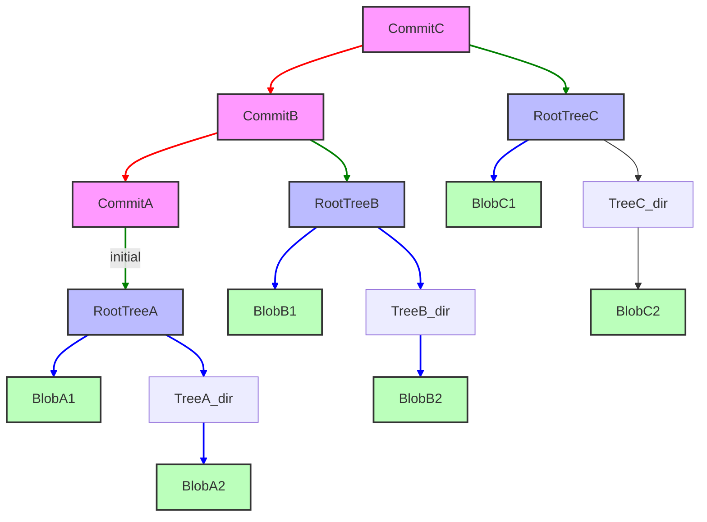

# Module 1: The Ghost in the Machine — Git Internals
**Complexity**: [MEDIUM]
**Time to Complete**: 90 minutes
**Prerequisites**: Zero to Terminal Module 0.6 (Git Basics — init, add, commit, push, pull)
**Next Module**: [Module 2: The Art of the Branch](../module-2-advanced-merging/)

## Learning Outcomes
By the end of this module, you will be able to:
1.  **Diagnose** repository state by inspecting the `.git` directory and its objects.
2.  **Compare** the roles of blobs, trees, and commit objects in representing project history.
3.  **Implement** changes to the staging area (index) and demonstrate its intermediate role in committing.
4.  **Evaluate** the implications of Git's content-addressable storage model on data integrity and history.
5.  **Utilize** Git plumbing commands to manually construct and inspect repository objects.

## Why This Module Matters
Imagine your team is deploying a critical update to a production Kubernetes cluster. It's Friday afternoon, and everyone's looking forward to the weekend. Suddenly, an urgent Slack message flashes: "Production is down! Pods are crashing due to a missing ConfigMap!" Panic ensues. The last deploy was green, but somehow, a vital configuration disappeared. Developers scramble, frantically trying to roll back, but the *exact* previous state seems elusive. Hours later, after much pain, a senior engineer eventually reconstructs the missing piece by painstakingly digging through old logs and local checkouts. It turns out someone, inadvertently, deleted a branch locally, thinking it only removed a pointer, not actual code, and a subsequent force-push propagated the error.

This nightmare scenario, while extreme, highlights a common underlying vulnerability: a lack of deep understanding of how Git actually *works*. Many engineers treat Git as a black box—a magical tool that somehow saves their code. They know `git add`, `git commit`, `git push`, but when things go wrong, when history gets rewritten, or when a critical file mysteriously vanishes, the black box offers no comfort. Without understanding Git's internal mechanics—how it stores data, links history, and manages pointers—you're at the mercy of its defaults. This module will pull back the curtain, demystifying Git's inner ghost. You'll learn the fundamental building blocks of every Git repository, gaining the power to not just *use* Git, but to truly *understand*, *diagnose*, and *recover* from even the most perplexing version control mishaps. By understanding Git at this level, you’ll become a more confident, capable, and resilient engineer, ready to tackle any version control challenge.

## Core Content Sections

### 1. The `.git` Directory: Your Repository's Brain
Every time you run `git init`, Git creates a hidden `.git` directory at the root of your project. This directory is not just a folder; it's the entire brain of your repository. It contains all the information Git needs to manage your project's history, from every file version to every commit message, branch, and tag. If you lose this directory, you lose your project's entire Git history.

Let's peek inside a freshly initialized repository.

```bash
# Create a new empty directory
mkdir my-git-repo
cd my-git-repo

# Initialize a Git repository
git init

# List the contents of the .git directory
ls -F .git
```

**Expected Output:**

```
HEAD		config		description	hooks/		info/		objects/	refs/
```

-   **`HEAD`**: A reference to the currently checked-out commit. It usually points to a branch.
-   **`config`**: Project-specific configuration options.
-   **`description`**: Used by GitWeb (a web interface to Git repositories) for describing the project.
-   **`hooks/`**: Client-side or server-side scripts that Git can execute before or after commands (e.g., pre-commit, post-receive).
-   **`info/`**: Contains the global exclude file for ignored patterns, similar to `.gitignore`.
-   **`objects/`**: This is where Git stores all your data – the actual content of your files, directories, and commit metadata. It's the content-addressable storage.
-   **`refs/`**: Contains pointers to commits, specifically for branches (`heads`) and tags (`tags`).

The `objects/` directory is the most critical. This is where Git's magic truly happens.

> **Pause and predict**: What do you think happens inside the `objects/` directory when you `git add` a file for the first time? Will Git store the *entire* file content, or just a diff?

### 2. Git Objects: Blobs, Trees, and Commits
Git is fundamentally a content management system, not a file management system. It stores your project's history as a series of interconnected objects, each identified by a unique SHA-1 hash. There are four main types of Git objects, but we'll focus on the three core ones: blobs, trees, and commits.

#### 2.1 Blobs (Binary Large Objects)
A blob object stores the content of a file. It doesn't store the filename, path, or any metadata—just the raw data. If two files in your repository (even in different directories) have the exact same content, Git stores only one blob object for both. This is a key part of Git's efficiency.

Let's create a file and see its blob:

```bash
# Create a sample Kubernetes ConfigMap
cat <<EOF > configmap.yaml
apiVersion: v1
kind: ConfigMap
metadata:
  name: my-app-config
data:
  app.properties: |
    environment=dev
    database.url=jdbc:postgresql://localhost:5432/myapp_dev
  log4j.properties: |
    log4j.rootLogger=INFO, stdout
EOF

# Stage the file (this creates the blob object)
git add configmap.yaml

# Inspect the Git object database
find .git/objects -type f
```

You'll see a new file inside `.git/objects/`. Its name will be `xx/xxxxxxxxxxxxxxxxxxxxxxxxxxxxxxxxxxxxxx`, where `xx` are the first two characters of the SHA-1 hash, and the rest are the remaining 38 characters.

Now, let's use a "plumbing" command to inspect this blob object. Plumbing commands are low-level commands designed to be used by scripts or other Git commands. "Porcelain" commands (like `git add`, `git commit`) are the user-friendly, high-level commands.

```bash
# Get the SHA-1 hash of the staged file
BLOB_HASH=$(git hash-object -w configmap.yaml)
echo "Blob Hash: $BLOB_HASH"

# Read the content of the blob object
git cat-file -p "$BLOB_HASH"
```

**Expected Output (similar to):**

```
Blob Hash: 9d8c... (your hash will be different)
apiVersion: v1
kind: ConfigMap
metadata:
  name: my-app-config
data:
  app.properties: |
    environment=dev
    database.url=jdbc:postgresql://localhost:5432/myapp_dev
  log4j.properties: |
    log4j.rootLogger=INFO, stdout
```

Notice that `git cat-file -p` printed the exact content of `configmap.yaml`, without any filename information.

#### 2.2 Trees
Tree objects are like directory entries. They store a list of pointers to blobs and other tree objects, along with the corresponding filenames, file modes (permissions), and object types. This is how Git reconstructs the state of your project at any given commit. A tree object represents a snapshot of a directory at a specific point in time.

When you `git commit`, Git takes the current state of your staging area and converts it into a hierarchy of tree objects (for directories) and blob objects (for files).

Let's commit our `configmap.yaml` and inspect the resulting tree:

```bash
# Commit the file
git commit -m "Add initial ConfigMap"

# Get the SHA-1 hash of the latest commit
COMMIT_HASH=$(git rev-parse HEAD)
echo "Commit Hash: $COMMIT_HASH"

# Read the commit object to find its root tree
git cat-file -p "$COMMIT_HASH"
```

The output of `git cat-file -p "$COMMIT_HASH"` will show something like `tree <tree_hash>`. Copy that `<tree_hash>`.

```bash
# Read the content of the root tree object
TREE_HASH=$(git cat-file -p "$COMMIT_HASH" | grep tree | awk '{print $2}')
git cat-file -p "$TREE_HASH"
```

**Expected Output (similar to):**

```
100644 blob 9d8c...	configmap.yaml
```

This shows that our root tree object contains one entry: a blob object (`9d8c...`) named `configmap.yaml` with file mode `100644`.

#### 2.3 Commits
Commit objects tie everything together. A commit object contains:
-   A pointer to a **root tree** object (the snapshot of your project's files at that commit).
-   Pointers to one or more **parent commit** objects (linking the history).
-   Author and committer information (name, email, timestamp).
-   The commit message.

This chain of commit objects, each pointing to its parent, forms the directed acyclic graph (DAG) that is your project's history.

Let's re-inspect our commit object:

```bash
# Read the commit object
git cat-file -p "$COMMIT_HASH"
```

**Expected Output (similar to):**

```
tree 1a2b3c4d5e6f7890abcdef1234567890abcdef
author Your Name <your.email@example.com> 1678886400 +0000
committer Your Name <your.email@example.com> 1678886400 +0000

Add initial ConfigMap
```

Here, `tree 1a2b3c4d...` points to the root tree object for this commit. If this wasn't the very first commit, you'd also see a `parent <parent_commit_hash>` line.

> **Stop and think**: Which approach would you choose here: `git log` or `git cat-file -p <commit_hash>` to quickly inspect the commit message of the latest commit, and why?

### 3. The Staging Area (Index)
The staging area, also known as the index, is a crucial intermediate step between your working directory and your repository's history. It's a binary file (`.git/index`) that stores information about the files Git will include in the *next* commit. It's not your working directory, nor is it your last commit. It's a proposed next commit.

When you run `git add <file>`, Git computes the SHA-1 hash of the file's content and immediately stores it as a zlib-compressed blob object in the `objects/` database. It then updates the index with information about the file's path, permissions, and a pointer to that new blob object.

> **Stop and think**: If the index is just a binary file storing proposed changes, what happens to the blob objects created by `git add` if you decide to unstage the file using `git restore --staged`? Do the blob objects get immediately deleted?

Let's modify our `configmap.yaml`, stage it, and see the index:

```bash
# Modify configmap.yaml
cat <<EOF > configmap.yaml
apiVersion: v1
kind: ConfigMap
metadata:
  name: my-app-config
data:
  app.properties: |
    environment=prod
    database.url=jdbc:postgresql://production.db.svc/myapp_prod
  log4j.properties: |
    log4j.rootLogger=WARN, file
EOF

# Stage the modified file
git add configmap.yaml

# Inspect the index
git ls-files --stage
```

**Expected Output (similar to):**

```
100644 2f1a... 0	configmap.yaml
```

The second column `2f1a...` is the SHA-1 hash of the *new* blob object for the modified `configmap.yaml`. This confirms the index is now pointing to the updated content. If you were to run `git commit` now, it would create a new commit object pointing to a new tree object, which in turn would point to this new blob.

### 4. Content-Addressable Storage and the DAG
Git's design is revolutionary because it's **content-addressable**. This means that instead of referring to files by their names, Git refers to their content via a cryptographic hash (SHA-1). Every piece of data—blob, tree, commit—is stored as an object whose name is the SHA-1 hash of its content.

This has profound implications:
-   **Integrity:** If even a single bit of a file changes, its SHA-1 hash changes, and Git immediately knows it's a different version. This makes Git incredibly robust against accidental corruption.
-   **Efficiency:** Duplicate files or identical versions of files are stored only once.
-   **Immutability:** Once an object is created in the Git object database, it can never be changed. Any change to content results in a *new* object.

The way these immutable objects link together forms a **Directed Acyclic Graph (DAG)**. Each commit object points to its parent(s), creating a chronological chain. This structure is what allows Git to efficiently track history, branches, merges, and rebases.



In the diagram:
-   Pink rectangles represent **Commit Objects**. Each points to its parent (red arrows) and its root tree (green arrows).
-   Blue rectangles represent **Tree Objects** (directories). Each points to blobs (light blue arrows) or other trees (not shown for simplicity).
-   Green rectangles represent **Blob Objects** (file contents).

### 5. Refs, HEAD, and Branches as Pointers
Branches in Git are not separate copies of your code; they are incredibly lightweight pointers (references, or "refs") to specific commit objects. A branch simply tells Git: "this is the current tip of this line of development."

-   **Refs:** Stored in `.git/refs/`. Specifically, `.git/refs/heads/` contains files named after your branches, and each file contains the SHA-1 hash of the commit that branch points to. Similarly, `.git/refs/tags/` contains pointers for tags.
-   **HEAD:** This special ref is a pointer to the branch you are currently working on. It's usually a symbolic reference, meaning it points to another ref (a branch). When you `git checkout <branch-name>`, you're simply changing what `HEAD` points to. When `HEAD` points directly to a commit (not a branch), you are in a "detached HEAD" state.

Let's see our current `HEAD` and branch ref:

```bash
# View what HEAD points to
cat .git/HEAD

# View the main branch ref (assuming 'main' is your default branch)
cat .git/refs/heads/main
```

**Expected Output (similar to):**

```
# cat .git/HEAD
ref: refs/heads/main

# cat .git/refs/heads/main
2f1a... (this will be the hash of your latest commit)
```

This clearly shows that `HEAD` points to the `main` branch, and the `main` branch points to the SHA-1 hash of your latest commit. When you make a new commit, Git creates a new commit object, and then *moves the branch pointer* (and thus `HEAD`) to this new commit. This is why branches are so cheap and fast in Git.

### War Story: The Disappearing ConfigMap
A medium-sized startup, let's call them "KubeFlow Inc.", was struggling with configuration drift across their development and staging Kubernetes environments. Their main application relied on a critical `ConfigMap` for database connection strings and feature flags. One day, a junior developer, assigned to clean up old feature branches, decided to delete a local branch named `feature/db-migration`. She correctly understood that `git branch -d feature/db-migration` would delete the *pointer* to the branch. However, she had also performed an experimental `git rebase` on that branch earlier, which had inadvertently copied the `main` branch's history, *including a temporary commit that removed the critical ConfigMap for testing purposes*, then immediately undid it. When she deleted the branch, she didn't realize that the *commit object* itself, which was briefly the *only* place that ConfigMap was correctly referenced in her local repository, was then eligible for garbage collection. She thought she was only deleting a label. A day later, her local main branch was force-pushed to the remote. The next deployment from `main` then suddenly omitted the ConfigMap, causing a cascade of failures.

The incident was eventually resolved by a senior engineer who used `git reflog` to find the SHA-1 of the "lost" commit before the rebase and then used `git checkout <sha>` to recover the files. This incident underscores the importance of understanding that `git branch -d` only deletes a *pointer*; the underlying commit objects remain for a time, but if no refs point to them, they can eventually be garbage collected. If that ConfigMap had *only* existed in that rebased, then deleted, branch, the situation would have been far more dire without `reflog`.

## Did You Know?
1.  **Git was initially developed by Linus Torvalds** in 2005 for Linux kernel development. He was dissatisfied with existing SCMs, especially proprietary ones. The first release candidate was announced on April 7, 2005.
2.  **The SHA-1 collision vulnerability** was famously demonstrated by CWI and Google in 2017 with a "shattered" PDF (the SHAttered attack). In response, Git didn't abandon SHA-1 immediately; instead, version 2.13 made a collision-detecting implementation (SHA-1DC) the default. While experimental support for full SHA-256 repositories (`git init --object-format=sha256`) was introduced in Git 2.29 and declared no longer a mere curiosity in Git 2.42, SHA-1 remains the default object hash even in the latest Git 2.53.0 releases. You might see third-party blogs claiming that Git 3.0 will default to SHA-256 and the new `reftable` reference format, but be aware that this is currently unverified—no official Git maintainer announcement or release plan document confirms Git 3.0 feature defaults or timelines. In fact, official documentation still strongly discourages using SHA-256 on public-facing servers until the Git protocol gains wider support.
3.  **Git's `.git/objects` directory uses a "packfile" format** for efficiency. While individual objects are initially stored as loose objects (one file per object), Git periodically "packs" them into single files (with a `.pack` extension) to save disk space and improve performance. This compression technique means that often, only differences between versions are stored inside these packfiles.
4.  **The original design goal for Git** was to support distributed non-linear development, handle large projects (like the Linux kernel), and be extremely fast. Its content-addressable storage model allows operations like branching and committing to be nearly instantaneous, as they primarily involve writing small files (trees, commits) and moving pointers, rather than copying entire project directories.
5.  **Git objects have a specific header.** Before Git compresses an object and stores it, it prepends a header in the format `[type] [size-in-bytes]\0`. The SHA-1 hash is computed over this combined header and content.

## Common Mistakes

| Mistake                        | Why It Happens                                                                         | How to Fix It                                                                                                                                                                                                                                      |
| :----------------------------- | :------------------------------------------------------------------------------------- | :------------------------------------------------------------------------------------------------------------------------------------------------------------------------------------------------------------------------------------------------- |
| Misunderstanding `git add`     | Believing `git add` puts files into the repository's history directly.                 | Remember `git add` stages changes to the index. It creates blob objects but doesn't commit them. Only `git commit` moves staged changes to the repository history.                                                                                      |
| Losing history after `rebase`  | Force-pushing after an ill-advised rebase, overwriting remote history.                 | Understand `rebase` rewrites history. Use `git reflog` to find lost commits if working locally. Never force-push to a shared branch without extreme caution and team coordination.                                                                 |
| Detached HEAD state            | Checking out a specific commit SHA or an old tag directly, not a branch.               | `git status` will warn you. To return to normal, create a new branch from your current detached HEAD (`git branch <new-branch-name>`), then `git checkout <new-branch-name>`.                                                                   |
| Deleting `.git` folder         | Thinking it's just metadata or cache and safe to remove, like `node_modules`.          | **Never delete `.git`!** It contains your entire project history. If you accidentally delete it, your only recourse is to clone the repository again from a remote, losing any uncommitted local history.                                           |
| Not understanding `HEAD`       | Confusing `HEAD` with the current branch or thinking it's always `main`.               | `HEAD` points to your current branch (e.g., `main`), and that branch then points to the latest commit on that branch. `HEAD` is effectively "where you are now" in the commit graph.                                                               |
| Ignoring `.gitignore` issues   | Files still tracked despite being in `.gitignore` due to being added previously.       | `.gitignore` only ignores *untracked* files. If a file was already committed, it won't be ignored. Use `git rm --cached <file>` to untrack it (keeping it in the working directory), then commit the removal.                                  |
| Blindly using `git reset --hard` | Overly aggressive use of `git reset --hard` without understanding its destructive nature. | `git reset --hard` discards changes in the working directory, staging area, *and* moves the branch pointer. Use `git reset --soft` (only moves pointer, keeps changes staged) or `git restore` (discards working directory changes selectively). |

## Quiz

1.  <details><summary>You ran `git gc` to clean up your repository. Now, `git log` still correctly shows all recent commits, but running `git show <hash>:configmap.yaml` mysteriously fails for one specific historical commit. Where would you look to diagnose whether the underlying blob was corrupted versus mistakenly garbage-collected, and what commands would confirm this?</summary>
    You would investigate the `.git/objects/` directory to determine the exact state of the missing data. First, you must find the blob hash associated with that file in the specific commit by running `git ls-tree <hash>`. Once you have the blob's SHA-1 hash, you can check if the object file exists in `.git/objects/<first-two-chars>/<rest-of-hash>` or use `git cat-file -t <blob-hash>`. If the file is missing entirely, it was likely garbage-collected (perhaps because it became unreachable prior to the `gc`); if the file exists but `cat-file` returns an error, the blob was corrupted. This approach isolates whether the pointer (tree) or the data itself (blob) is the root cause.
    </details>

2.  <details><summary>You've made changes to a Kubernetes Deployment manifest (`deployment.yaml`) in your working directory. Before running `git commit`, you execute `git add deployment.yaml`. Describe the state of `deployment.yaml` in relation to the working directory, the staging area (index), and the repository (objects database) after this `git add` command.</summary>
    After executing `git add deployment.yaml`, the working directory retains your modified file exactly as you saved it, but Git's internal state has significantly changed. The staging area (index) is updated with a new entry for `deployment.yaml`, which now points to a newly generated blob object representing the file's current snapshot. Why does Git do this? By creating this blob in the `.git/objects/` database immediately, Git securely caches the exact content you intend to commit. This separation allows you to continue modifying the working file without affecting the staged snapshot, giving you precise control over what goes into the next commit object.
    </details>

3.  <details><summary>A colleague force-pushed a branch to the remote, and now a critical `ServiceAccount` manifest seems to be missing from the latest commit on `main`. You suspect the manifest existed in a commit that was overwritten by the force push. What Git command would you immediately use to try and locate the missing commit's SHA-1 hash in your *local* repository, and why is this command particularly useful in such a scenario?</summary>
    You would use the `git reflog` command to inspect the local history of your branch pointers and `HEAD`. This command is exceptionally useful because it records the chronological history of where your local pointers have been, rather than relying on the commit graph's direct ancestry. When a force push overwrites history, the original commits are typically orphaned but not immediately deleted by the garbage collector. By identifying the previous SHA-1 hash in the reflog, you can safely checkout that detached state and cherry-pick or copy the missing `ServiceAccount` manifest.
    </details>

4.  <details><summary>You need the raw content of `service.yaml` at commit `a1b2c3d4`, but you also want to manually compare it to the version exactly two commits earlier. Describe two different approaches using Git commands to retrieve this data, and explain which approach is more efficient if the file changed in every single commit.</summary>
    One approach is to use `git show a1b2c3d4:service.yaml` and `git show a1b2c3d4~2:service.yaml` to directly stream the content of the files at those specific commits. A second approach using plumbing commands involves first finding the tree hashes via `git cat-file -p a1b2c3d4`, then extracting the blob hashes within those trees using `git ls-tree`, and finally reading the blobs with `git cat-file -p <blob-hash>`. The `git show` approach is significantly more efficient and less error-prone because it automatically resolves the path through the tree objects directly to the blob. The plumbing approach requires manual traversal of the tree graph, which becomes tedious and time-consuming. However, understanding both methods clarifies why porcelain commands like `git show` are vital for daily operations despite the DAG's underlying complexity.
    </details>

5.  <details><summary>You've been asked to review a change that involves a large ConfigMap. The developer insists it's a minor change, but `git diff` shows hundreds of lines. You suspect they might have changed indentation or added comments that are causing the large diff, even if the semantic content is mostly the same. What is the fundamental reason Git tracks content this way (i.e., treating any change as a new blob), and what's the primary benefit?</summary>
    The fundamental reason Git tracks content this way is its content-addressable storage model. Every change, no matter how small (like an indentation change or a new comment), results in a new SHA-1 hash for the file's content, thus creating a new blob object. The primary benefit is data integrity and immutability. By hashing content, Git ensures that once an object is stored, it cannot be altered without changing its hash, providing a robust mechanism to detect corruption or tampering. This also makes operations like checking out different versions extremely fast because Git only needs to retrieve the specific objects, not compute diffs on the fly for every file.
    </details>

6.  <details><summary>Your team is implementing a Git hook to automatically validate Kubernetes manifest YAML files before they are committed. Would you implement this as a `pre-commit` hook or a `post-commit` hook, and why? Refer to the `.git` directory structure in your answer.</summary>
    You would implement this as a `pre-commit` hook. The `hooks/` directory in `.git/` contains scripts that Git can execute at various points in the workflow. A `pre-commit` hook runs before the commit is finalized, meaning it can intercept the process. This allows the hook to inspect the staged changes (which represent the content of the next commit) and, if validation fails (e.g., `kubeval` or `yamllint` finds issues), abort the commit entirely. A `post-commit` hook runs after the commit is successfully created, which would be too late to prevent the invalid YAML from being recorded into the repository history.
    </details>

## Knowledge Check

**Question 1**
Your CI/CD pipeline fails during a build, reporting that a shell script `deploy.sh` is missing executable permissions. You remember running `chmod +x deploy.sh` locally and committing, but the issue persists on the build server. How can you use Git's internal objects to verify if the correct file permissions were actually recorded in the commit?

- A) Run `git cat-file -p HEAD` to view the commit object, then run `git cat-file -p <tree_hash>` to inspect the root tree and check if the mode for `deploy.sh` is `100755`.
- B) Run `git hash-object deploy.sh` and check if the resulting blob hash includes the executable flag in its metadata.
- C) Inspect the `.git/config` file to ensure `core.filemode` is set to true for the repository.
- D) Run `git reflog` to trace the history of the `deploy.sh` file and look for a `chmod` operation.

> [!details] Answer
> **Correct Answer: A**
> **Why:** File permissions (modes) and filenames are not stored in **blob** objects; blobs only store raw file content. Instead, directory structures and metadata like file modes are stored in **tree** objects. Git supports specific modes, such as `100644` for a regular file and `100755` for an executable. By inspecting the commit object to find its root tree, and then inspecting that tree object (`git cat-file -p <tree_hash>`), you can verify the exact file mode Git recorded for `deploy.sh`. If it says `100644`, the executable bit was not committed.

**Question 2**
A new engineer on your team is trying to clean up a repository that has grown massive due to large binary assets being committed and then deleted. They run `git rm --cached large-asset.bin` and make a new commit, but notice the `.git` directory size hasn't decreased at all. They are confused because the file is no longer in the working directory or the latest commit. Why is the repository size unchanged, and what internal mechanism explains this?

- A) The `git rm --cached` command only removes the file from the index, so the file remains in the working directory, taking up space.
- B) Git retains the blob object for `large-asset.bin` in the `.git/objects/` directory because previous commits in the repository's history (the DAG) still point to the tree objects that reference this blob.
- C) Git automatically converts the large binary file into a highly compressed delta inside a packfile, but packfiles never shrink in size once created.
- D) The `.git/index` file permanently caches all binary files ever added to the repository to speed up future checkouts.

> [!details] Answer
> **Correct Answer: B**
> **Why:** Git's **content-addressable storage** is designed to be immutable. Once a file is staged or committed, a blob object is created in `.git/objects/`. Deleting a file in a new commit merely creates a new tree object that no longer references that blob. However, the older commit objects and their associated trees still exist in the repository's history (the DAG) and still point to that original blob object. Because Git must be able to check out any previous state of the repository, those blob objects cannot be deleted as long as they are reachable from any commit in the history. To actually shrink the repository, the object must become unreachable (e.g., rewriting history with tools like `git filter-repo`) and then garbage collected.

**Question 3**
You accidentally ran `git add secret-key.pem` on a highly sensitive file. Realizing your mistake before committing, you run `git restore --staged secret-key.pem`. A colleague panics and says, "But Git already saved it! The content is in the `.git` folder now and someone might find it!" Are they correct, and how does Git's internal architecture handle this?

- A) They are incorrect. `git add` only updates the `.git/index` file with the file path; the content isn't saved to the object database until you run `git commit`.
- B) They are correct. Running `git add` immediately creates a permanent commit object that cannot be erased, even if the file is unstaged.
- C) They are correct that the content is saved. `git add` zlib-compresses the file and creates a permanent **blob** object in `.git/objects/`. Unstaging the file removes the reference from the index, but the unreferenced blob remains in the object database until it is eventually garbage collected.
- D) They are incorrect. `git restore --staged` actively searches the `.git/objects/` directory and securely deletes the blob object associated with the unstaged file.

> [!details] Answer
> **Correct Answer: C**
> **Why:** This is a crucial security detail of Git's architecture. When you run `git add`, Git immediately computes the SHA-1 hash of the file's content and creates a **blob object** in the `.git/objects/` directory. The `.git/index` is simply updated to point to this new blob. When you unstage the file, Git removes the pointer from the index, making the blob a "dangling" or unreferenced object. Git does not immediately delete these dangling objects for performance and safety reasons. The sensitive data *is* physically present in the `.git/objects/` directory until a `git gc` (garbage collection) operation eventually purges unreferenced objects. In an emergency, this means the file could technically be recovered from the local disk using plumbing commands before garbage collection runs.

## Hands-On Exercise: Building a Commit from Scratch

In this exercise, you'll delve into the Git internals by manually creating Git objects (blobs, trees, and a commit) using "plumbing" commands. This will illuminate how Git fundamentally stores your project's history. We'll then verify our manually constructed commit against a porcelain command.

**Setup:**

1.  Make sure you're in the `my-git-repo` directory from the core content, or create a fresh one (move to a neutral directory first):
    ```bash
    cd ..
    rm -rf my-git-repo
    mkdir my-git-repo
    cd my-git-repo
    git init
    ```

**Tasks:**

1.  **Create a Blob Object:**
    Create a `service.yaml` file for a Kubernetes Service and manually add its content as a Git blob object, storing the returned SHA-1 hash.

    ```bash
    # Create the service.yaml file
    cat <<EOF > service.yaml
    apiVersion: v1
    kind: Service
    metadata:
      name: my-webapp-service
    spec:
      selector:
        app: my-webapp
      ports:
        - protocol: TCP
          port: 80
          targetPort: 8080
    EOF

    # Manually create a blob object from service.yaml content
    # The -w flag writes the object to the database
    SERVICE_BLOB_HASH=$(git hash-object -w service.yaml)
    echo "Service Blob Hash: $SERVICE_BLOB_HASH"

    # Verify the object type and content
    git cat-file -t "$SERVICE_BLOB_HASH"
    git cat-file -p "$SERVICE_BLOB_HASH"
    ```
    *   **Success Criteria:**
        -   `service.yaml` exists in your working directory.
        -   `SERVICE_BLOB_HASH` variable contains a valid SHA-1.
        -   `git cat-file -t` outputs `blob`.
        -   `git cat-file -p` outputs the exact content of `service.yaml`.

2.  **Create a Tree Object:**
    Create a tree object that represents a directory containing `service.yaml`. This will involve a "trick" since `mktree` expects a specific input format.

    ```bash
    # Prepare the input for git mktree
    # Format: <mode> <type> <object_hash> <filename>
    # 100644 for a regular file, blob for type
    TREE_INPUT="100644 blob $SERVICE_BLOB_HASH	service.yaml"
    echo "$TREE_INPUT" > tree_input.txt

    # Manually create a tree object
    ROOT_TREE_HASH=$(git mktree < tree_input.txt)
    echo "Root Tree Hash: $ROOT_TREE_HASH"

    # Verify the object type and content
    git cat-file -t "$ROOT_TREE_HASH"
    git cat-file -p "$ROOT_TREE_HASH"
    ```
    *   **Success Criteria:**
        -   `ROOT_TREE_HASH` variable contains a valid SHA-1.
        -   `git cat-file -t` outputs `tree`.
        -   `git cat-file -p` outputs `100644 blob <SERVICE_BLOB_HASH>	service.yaml`.

3.  **Create a Commit Object:**
    Now, create a commit object that points to your newly created tree object.

    ```bash
    # Set up some dummy author/committer info for the commit
    export GIT_AUTHOR_NAME="KubeDojo Learner"
    export GIT_AUTHOR_EMAIL="learner@kubedojo.io"
    export GIT_COMMITTER_NAME="KubeDojo Learner"
    export GIT_COMMITTER_EMAIL="learner@kubedojo.io"

    # Manually create a commit object
    # The tree hash is provided as a positional argument
    # The -m flag provides the commit message
    COMMIT_MESSAGE="Initial commit for service.yaml via plumbing commands"
    INITIAL_COMMIT_HASH=$(git commit-tree "$ROOT_TREE_HASH" -m "$COMMIT_MESSAGE")
    echo "Initial Commit Hash: $INITIAL_COMMIT_HASH"

    # Verify the object type and content
    git cat-file -t "$INITIAL_COMMIT_HASH"
    git cat-file -p "$INITIAL_COMMIT_HASH"
    ```
    *   **Success Criteria:**
        -   `INITIAL_COMMIT_HASH` variable contains a valid SHA-1.
        -   `git cat-file -t` outputs `commit`.
        -   `git cat-file -p` outputs the commit details, including the tree hash and commit message.

4.  **Point HEAD to Your New Commit:**
    For Git to recognize this commit as the "latest," you need to update a branch ref to point to it, and then update `HEAD` to point to that branch.

    ```bash
    # Create or update the 'main' branch ref to point to our new commit
    git update-ref refs/heads/main "$INITIAL_COMMIT_HASH"
    
    # Point HEAD symbolically to the 'main' branch
    git symbolic-ref HEAD refs/heads/main
    
    # Verify the state
    git log --oneline
    git status
    ```
    *   **Success Criteria:**
        -   `git log --oneline` shows your "Initial commit for service.yaml via plumbing commands".
        -   `git status` indicates `On branch main` and shows `service.yaml` as deleted in the staging area but untracked in the working directory (because we bypassed the index completely to create our commit!).

5.  **Verify with Porcelain:**
    Now that your repository is pointing to the manually created commit, use regular "porcelain" commands to verify.

    ```bash
    # Checkout the content of the commit into your working directory
    # Note: `service.yaml` from your working directory was NOT part of this commit,
    # so we need to restore it from the commit itself.
    git restore --source="$INITIAL_COMMIT_HASH" -- service.yaml
    
    # Check the file content
    cat service.yaml

    # Clean up temporary files
    rm tree_input.txt
    ```
    *   **Success Criteria:**
        -   `cat service.yaml` shows the original content of the `service.yaml` you created in Task 1. This demonstrates that Git successfully reconstructed the file from your manually created objects.

**Solutions:**

<details>
<summary>Task 1 Solution: Create a Blob Object</summary>

```bash
cat <<EOF > service.yaml
apiVersion: v1
kind: Service
metadata:
  name: my-webapp-service
spec:
  selector:
    app: my-webapp
  ports:
    - protocol: TCP
      port: 80
      targetPort: 8080
EOF

SERVICE_BLOB_HASH=$(git hash-object -w service.yaml)
echo "Service Blob Hash: $SERVICE_BLOB_HASH"
git cat-file -t "$SERVICE_BLOB_HASH"
git cat-file -p "$SERVICE_BLOB_HASH"
```
</details>

<details>
<summary>Task 2 Solution: Create a Tree Object</summary>

```bash
TREE_INPUT="100644 blob $SERVICE_BLOB_HASH	service.yaml"
echo "$TREE_INPUT" > tree_input.txt
ROOT_TREE_HASH=$(git mktree < tree_input.txt)
echo "Root Tree Hash: $ROOT_TREE_HASH"
git cat-file -t "$ROOT_TREE_HASH"
git cat-file -p "$ROOT_TREE_HASH"
```
</details>

<details>
<summary>Task 3 Solution: Create a Commit Object</summary>

```bash
export GIT_AUTHOR_NAME="KubeDojo Learner"
export GIT_AUTHOR_EMAIL="learner@kubedojo.io"
export GIT_COMMITTER_NAME="KubeDojo Learner"
export GIT_COMMITTER_EMAIL="learner@kubedojo.io"

COMMIT_MESSAGE="Initial commit for service.yaml via plumbing commands"
INITIAL_COMMIT_HASH=$(git commit-tree "$ROOT_TREE_HASH" -m "$COMMIT_MESSAGE")
echo "Initial Commit Hash: $INITIAL_COMMIT_HASH"
git cat-file -t "$INITIAL_COMMIT_HASH"
git cat-file -p "$INITIAL_COMMIT_HASH"
```
</details>

<details>
<summary>Task 4 Solution: Point HEAD to Your New Commit</summary>

```bash
git update-ref refs/heads/main "$INITIAL_COMMIT_HASH"
git symbolic-ref HEAD refs/heads/main

git log --oneline
git status
```
</details>

<details>
<summary>Task 5 Solution: Verify with Porcelain</summary>

```bash
git restore --source="$INITIAL_COMMIT_HASH" -- service.yaml
cat service.yaml
rm tree_input.txt
```
</details>

## Next Module
Ready to move beyond the internal plumbing? In [Module 2: The Art of the Branch](../module-2-advanced-merging/), we'll explore how Git leverages its DAG structure to enable powerful branching and merging strategies, tackling common workflows and advanced techniques like octopus merges.
