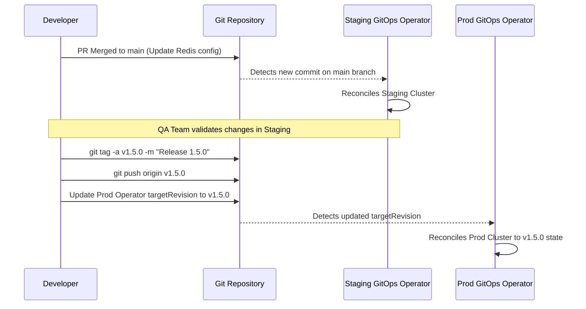

# Module 10: Bridge to GitOps — The Infrastructure Source

**Complexity:** MEDIUM. **Time to complete:** 60 minutes. **Prerequisites:** Modules 1-9 of the Git Deep Dive, basic Kubernetes manifests, pull requests, semantic versioning, and enough command-line comfort to inspect YAML safely.

## Learning Outcomes

- Design a multi-environment infrastructure repository structure using Kustomize overlays to eliminate configuration duplication.
- Implement Git tag-based promotion workflows to transition configurations reliably from staging to production.
- Diagnose state drift between a live Kubernetes cluster and its Git repository source of truth using reconciliation loops.
- Evaluate the security benefits of branch protection and cryptographic commit signing in a zero-trust GitOps supply chain.
- Implement branch protection and directory isolation strategies to prevent unauthorized infrastructure mutations.

## Why This Module Matters

The payment gateway went down at 2:00 PM on the busiest shopping day of the year. Dashboards turned red across the operations room while the checkout API returned HTTP 503 responses to thousands of customers per minute. The first symptom looked ordinary: the `payment-processing` Deployment lacked an environment variable needed to authenticate with a newly provisioned database cluster. The confusing part was that every deployment job had succeeded, the infrastructure repository already contained the variable, and the live pods still did not.

The team reconstructed the incident and found the uncomfortable cause. Three days earlier, an engineer had been chasing a production resource exhaustion problem under intense time pressure. They opened a terminal, edited the live Deployment directly, and accidentally replaced part of the pending database configuration while testing a quick change. They intended to follow up in Git, then moved to the next incident thread and forgot. Because the old push pipeline only touched the cluster after a new commit triggered it, the cluster quietly drifted away from the repository until the legacy database was decommissioned and the missing variable became a customer-facing outage.

That outage was not really caused by one person using the wrong command. It was caused by an operating model that allowed live infrastructure to have multiple competing sources of truth. When Git says one thing, a CI script says another, and a human terminal can say a third, the team has no reliable answer to the question, "What is production supposed to be?" GitOps is the discipline of making that answer boring: the desired state lives in Git, changes are reviewed through Git, and software inside the cluster continuously reconciles the live state back to what Git declares.

This module bridges the Git concepts you have already learned into infrastructure operations. You will not treat Git as a passive storage box for YAML files. You will use it as the control plane for Kubernetes environments, release promotion, drift diagnosis, and zero-trust change authorization. The technical examples use Kubernetes 1.35+ conventions and standard GitOps vocabulary, but the deeper lesson is broader: reliable platforms are easier to operate when the path from intention to runtime state is narrow, reviewed, replayable, and continuously checked.

## The GitOps Paradigm Shift: From Push to Pull

For years, the default deployment pattern was a push pipeline. A developer merged code, a CI system built the artifact, and that same CI system authenticated to the target environment to run deployment commands. In Kubernetes, after defining the normal shortcut with `alias k=kubectl`, that often meant a pipeline step executed `kubectl apply -f deployment.yaml` or a similar wrapper with enough privileges to mutate production. This was a major improvement over undocumented manual releases, yet it still placed cluster credentials outside the cluster and made the CI server a direct production operator.

The security problem is only half of the story. A push pipeline is a moment-in-time actor, not a continuous controller. It applies whatever it was told to apply, checks a rollout, and then exits. If a resource is edited later by a human, deleted by another automation system, or partially changed by a controller with overlapping ownership, the push pipeline does not notice. The repository may contain a pristine desired state while the cluster runs a different reality for days, because nothing is continuously comparing the two.

GitOps changes the direction of authority. Instead of sending a privileged pipeline outward into the cluster, a controller already running inside the cluster pulls the desired state from Git and reconciles the cluster toward it. OpenGitOps describes this model with four principles: the system is declarative, the desired state is versioned and immutable, software agents automatically pull the desired state, and those agents continuously reconcile. In practical Kubernetes terms, tools such as Argo CD or Flux run as controllers, watch repository paths, render manifests, and apply the result from inside the boundary they manage.

This is why GitOps is often described as a pull model, but the more important idea is ownership. In a push model, many actors can mutate the stove while the kitchen is busy: CI, administrators, ad hoc scripts, emergency terminals, and sometimes cloud consoles. In a pull model, the GitOps operator is the chef who reads the ticket rail and owns the stove. Developers still decide what should change, but they express that decision by changing Git. The operator performs the runtime mutation and keeps checking whether the result still matches the ticket.

Before using the examples, remember that this course uses the `k` alias after the first full `kubectl` mention. When you see a command such as `k describe application frontend-production -n gitops-system`, read it as the same Kubernetes client with less typing during an investigation.

The old push pipeline usually mixed build responsibility with cluster mutation responsibility. It authenticated to a cloud provider, fetched kubeconfig material, applied manifests, and then checked whether the rollout completed. The sequence is easy to understand, which is why many teams start here, but its simplicity hides a large blast radius. A leaked CI secret can become a leaked production cluster, and a failed pipeline after a partial apply can leave operators unsure whether Git, CI logs, or live objects should be trusted.

```bash
# A traditional, imperative Push pipeline script
echo "Authenticating to Kubernetes..."
aws eks update-kubeconfig --region us-east-1 --name prod-cluster
echo "Applying manifests..."
kubectl apply -f deployment.yaml
kubectl apply -f service.yaml
echo "Checking deployment status..."
kubectl rollout status deployment/frontend -n production
```

The GitOps pipeline is intentionally less dramatic. It does not need production kubeconfig material, and it does not run apply commands against the cluster. Its job is to change the declarative instruction in the infrastructure repository, usually after building and scanning an image in a separate application pipeline. Once that commit is merged, the GitOps operator detects the new desired state and performs the cluster-side work using its in-cluster permissions.

```bash
# A declarative GitOps CI pipeline script
echo "Updating image tag in deployment manifest..."
sed -i 's/frontend:v1.2.0/frontend:v1.2.1/g' deployment.yaml
git add deployment.yaml
git commit -m "chore: bump frontend image to v1.2.1"
git push origin main
# The pipeline ends here. The cluster operator takes over autonomously.
```

Pause and predict: imagine a developer with cluster access manually deletes the production `frontend` Service after a confusing incident call. In the push model, the Service remains gone until another pipeline run happens to reapply it, and even that only works if the pipeline includes the same manifest path. In the GitOps pull model, the operator sees that the live Service no longer matches the repository and recreates it during reconciliation. The difference is not that GitOps prevents every bad command; it is that GitOps gives the platform a memory and a repair loop.

The repair loop has limits, and recognizing those limits makes you a better operator. If Git itself contains a bad manifest, the operator will faithfully attempt to apply that bad desired state unless validation blocks it first. If the operator lacks RBAC permissions for a resource, reconciliation will fail and report a degraded state. If another Kubernetes controller is supposed to manage a field dynamically, such as replica count under a Horizontal Pod Autoscaler, the GitOps operator must be configured not to fight that controller. GitOps narrows authority, but it does not remove the need for schema validation, policy checks, and clear ownership boundaries.

A practical GitOps rollout often starts by changing permissions before changing tooling. Human users may keep read access and break-glass access, but routine write access to production objects should move away from laptops and CI runners. That cultural change can feel uncomfortable because engineers are used to direct rescue commands. The reward is that every ordinary change now has the same shape: propose it in Git, review it in Git, test it with automation, reconcile it from Git, and audit it later from Git.

## Architecting the Infrastructure Repository

A GitOps operator is only as useful as the repository it watches. If the repository is a pile of copied YAML directories, the operator will still reconcile, but humans will struggle to review the actual difference between environments. The first design task is separating stable common intent from environment-specific variation. In Kubernetes, Kustomize is the standard tool for that job because it builds final manifests from bases and overlays without requiring a separate templating language.

The base directory holds the shared definition of an application. It should describe the object names, labels, container shape, ports, and default values that are true everywhere. Overlay directories then patch the base for environment-specific needs such as replica count, resource limits, feature flags, ingress hosts, or configuration references. This structure keeps the common application contract visible once while forcing each environment difference to be explicit and reviewable.

Consider the repository shape below. It separates platform components from workload definitions, and it keeps environment overlays together on one trunk rather than scattering environments across unrelated branches. That design matters during review. A pull request that changes production resources can be examined beside the staging and development overlays, so reviewers can ask whether the difference is intentional instead of hunting through branch histories.

```text
infrastructure-repo/
├── platform-components/           <-- Core cluster add-ons
│   ├── ingress-nginx/
│   ├── cert-manager/
│   └── external-dns/
└── applications/                  <-- Workload definitions
    └── frontend-service/
        ├── base/                  <-- Common baseline manifests
        │   ├── deployment.yaml
        │   ├── service.yaml
        │   └── kustomization.yaml <-- Declares the base resources
        └── overlays/              <-- Environment-specific patches
            ├── dev/
            │   ├── patch-replicas.yaml
            │   ├── patch-env.yaml
            │   └── kustomization.yaml <-- Points to base, applies dev patches
            ├── staging/
            │   ├── patch-replicas.yaml
            │   └── kustomization.yaml
            └── prod/
                ├── patch-replicas.yaml
                ├── patch-resources.yaml
                └── kustomization.yaml
```

The base Deployment below is deliberately conservative. It uses one replica and a single container port because those defaults are safe for development and simple enough for every environment to inherit. Notice that the base does not know whether it will become staging or production. That ignorance is useful: the base is the application contract, while overlays are deployment context.

```yaml
# applications/frontend-service/base/deployment.yaml
apiVersion: apps/v1
kind: Deployment
metadata:
  name: frontend
spec:
  replicas: 1 # Default conservative baseline
  selector:
    matchLabels:
      app: frontend
  template:
    metadata:
      labels:
        app: frontend
    spec:
      containers:
      - name: web
        image: myregistry.com/frontend:v1.2.0
        ports:
        - containerPort: 8080
```

Production needs a different runtime contract. It may require more replicas, explicit CPU and memory requests, and stricter limits so the scheduler can place pods predictably. A weak repository design would copy the entire Deployment into `prod/` and edit a few lines. The Kustomize design below patches only the fields that differ, which keeps review focused on the production decision rather than forcing reviewers to compare hundreds of repeated YAML lines.

```yaml
# applications/frontend-service/overlays/prod/patch-replicas.yaml
apiVersion: apps/v1
kind: Deployment
metadata:
  name: frontend
spec:
  replicas: 5 # Override the base replica count for production
  template:
    spec:
      containers:
      - name: web
        resources:
          requests:
            cpu: "1000m"
            memory: "2Gi"
          limits:
            cpu: "2000m"
            memory: "4Gi"
```

The production `kustomization.yaml` binds the base and patch into one renderable unit. A GitOps operator pointed at this overlay does not apply the base and patch as separate live objects. It renders the final Deployment in memory, then applies the result. That distinction matters during diagnosis because an error may come from the base, from the patch, or from the way the overlay references both.

```yaml
# applications/frontend-service/overlays/prod/kustomization.yaml
apiVersion: kustomize.config.k8s.io/v1beta1
kind: Kustomization
resources:
  - ../../base
patches:
  - path: patch-replicas.yaml
```

Before running this through an operator, what final Deployment do you expect production to receive: one replica or five, and with which resource settings? The answer should be five replicas with the production resource requests and limits, while the image and container port still come from the base. That mental render is an important review skill. In mature teams, reviewers do not only approve the diff; they ask what the rendered object will look like after Kustomize, Helm, or another config tool finishes.

A common alternative is a branch per environment, such as `dev`, `staging`, and `main` for production. This feels natural to Git users because branches already represent different lines of change, but it works poorly for infrastructure. Environments are not independent product histories. They are coordinated deployments of the same system under different constraints. When each environment lives on its own branch, reviewers lose a single-page view of environment differences, cherry-picks become release management, and merge conflicts can accidentally promote the wrong configuration.

War story: a financial technology startup initially used separate environment branches in its GitOps repository. During a database migration, an engineer cherry-picked a Deployment update into the production branch and hit a merge conflict. While resolving it, they accepted the development database connection string because the branch diff made the surrounding context hard to see. Production then connected to a non-production database, causing privacy exposure and a long forensic cleanup. The root mistake was not only the conflict resolution; it was a repository model that made unsafe differences easy to hide.

Directory isolation also supports authorization. Code owners can require approvals from the platform team for `platform-components/`, service owners for their application overlays, and a smaller release group for production directories. That lets Git permissions become a precise infrastructure boundary rather than a single broad repository permission. The GitOps operator still watches the repository, but the repository itself now carries policy about who may change which part of the platform.

Separate infrastructure repositories from application source repositories unless you have a strong reason not to. Application repositories should build, test, and publish images. Infrastructure repositories should declare which images, policies, and runtime settings each environment should run. Keeping those responsibilities separate prevents loops where a deployment commit triggers a build that triggers another deployment commit, and it gives auditors a cleaner history of infrastructure decisions.

## Release Management and Semantic Versioning

When infrastructure state lives in Git, your Git workflow becomes your release workflow. The simplest setup points every environment at the `main` branch, but that means every merged infrastructure change is immediately eligible for whichever cluster tracks that branch. That may be acceptable for development and sometimes staging. It is rarely appropriate for production systems where release windows, compliance evidence, and rollback expectations require a stable point-in-time reference.

The stronger pattern is to let staging track a moving branch while production tracks immutable release references, usually annotated Git tags. Staging then becomes the place where `main` proves itself under realistic conditions. When the team is satisfied, it creates a tag such as `v1.5.0` at the exact commit that should become production. The production GitOps operator targets that tag, not the branch, so production is pinned to a named snapshot rather than the latest merged commit.

The sequence below shows the protected promotion path. A developer merges a Redis configuration change to `main`, the staging operator reconciles it, the QA team validates it, and only then does the team create a release tag. The production operator moves when its desired `targetRevision` moves to that tag. The cluster is still automated, but the release decision is explicit and inspectable.



Argo CD represents this intent with an `Application` custom resource. The Application tells the controller which repository to read, which path to render, which revision to use, and where the rendered objects should land. In a production setup, the important line is `targetRevision: v1.5.0`. That line converts a broad repository into a narrow release contract.

```yaml
# The ArgoCD Application CRD instructing the GitOps tool to manage the frontend in production
apiVersion: argoproj.io/v1alpha1
kind: Application
metadata:
  name: frontend-production
  namespace: gitops-system
spec:
  project: default
  source:
    repoURL: 'https://github.com/myorg/infrastructure.git'
    path: applications/frontend-service/overlays/prod
    # Target exactly this release tag, not a branch
    targetRevision: v1.5.0
  destination:
    server: 'https://kubernetes.default.svc'
    namespace: production
  syncPolicy:
    automated:
      prune: true
      selfHeal: true
```

Promotion by tag does not remove pull requests from the process. In regulated or high-risk environments, the tag may be created by a release pipeline after checks pass, and the production Application change may be reviewed as a separate pull request. That second review is valuable because it answers a different question from the original feature review. The feature review asks whether the configuration is correct. The promotion review asks whether this exact already-tested snapshot should become production now.

Stop and think: you discover a critical Ingress controller security issue while `main` is carrying a large, unvalidated database upgrade for staging. Would you tag the current `main` commit and send everything to production, or would you branch from the currently deployed production tag, apply only the hotfix, create a new tag, and move production to that tag? The safer choice is to branch from the current production tag. That preserves the emergency fix while excluding the unrelated database work that has not earned production trust.

Semantic versioning gives the release tags a shared language. A patch tag should imply a narrow fix, a minor tag should imply compatible capability, and a major tag should warn reviewers that the release may require coordinated migration work. Infrastructure SemVer is not always as clean as library SemVer because operational effects depend on the environment, but the habit still improves conversation. A reviewer seeing `v2.0.0` should ask harder questions than a reviewer seeing `v1.5.1`.

Rollback also becomes more concrete. In a push system, rollback may mean finding an old pipeline run, hoping the artifact still exists, and re-executing steps that might depend on current external state. In GitOps, rollback can often be expressed as moving the production target revision back to a previous known-good tag. That is not magic, because database migrations and external systems may require careful reversal, but the infrastructure intent itself is clear and replayable.

The promotion model should be tested before a crisis. Teams should rehearse tagging, promoting, and rolling back a low-risk service so that permissions, automation, and operator behavior are understood. The worst time to learn that tags are mutable in your hosting settings, or that the operator cannot read tags because of a credentials mistake, is during a production hotfix. Treat release mechanics as production code, not as ceremony around production code.

## Security and Compliance in the GitOps Pipeline

Moving cluster mutation out of CI reduces one attack path, but it raises the importance of repository security. In a mature GitOps model, whoever can change the trusted infrastructure repository can change the cluster. That means branch protection, signed commits, required reviews, status checks, and directory ownership are not optional governance decorations. They are the new perimeter around the production control plane.

Commit signing is the first part of identity. A normal Git author line is easy to spoof because it is just metadata in a commit object. A signed commit adds cryptographic evidence that the author controlled a private key associated with a trusted identity. Signing does not prove the change is good, but it helps prove who authorized the change and makes impersonation harder when branch protection requires verified signatures.

```bash
# Configuring Git to sign commits using an SSH key
git config --global gpg.format ssh
git config --global user.signingkey ~/.ssh/id_ed25519.pub
git config --global commit.gpgsign true

# Creating a signed commit (Git automatically uses the configured key)
git commit -S -m "feat: enforce network policies in production"
```

Signing by itself is not enough. The central Git platform must reject unsigned commits on protected branches, and it must require pull request review before merge. Required status checks should validate YAML syntax, Kustomize rendering, Kubernetes schemas for 1.35+, policy rules, and secret scanning before the GitOps operator ever sees the commit. The repository becomes a gate where human review and machine validation meet.

Which control would you choose if you could add only one today: signed commits or required pull request review? The best answer depends on your current risk. If direct pushes to production directories are still allowed, required review usually reduces day-one risk faster because it prevents unilateral change. If reviews already exist but identity spoofing or stolen credentials are a concern, signed commits close a different gap. A serious platform eventually needs both because they answer different security questions.

Directory isolation is the practical link between Git structure and authorization. A `CODEOWNERS` rule can require the networking team to review ingress changes, the security team to review policy changes, and service owners to review their own overlays. Production overlays can require additional approvers without blocking development overlays. This model scales better than giving a small central team ownership over every YAML file, and it avoids the opposite failure where every engineer can approve every production mutation.

The trust boundary shift is easier to see visually. In the traditional push model, compromising the CI server may give an attacker a direct route to the cluster. In the zero-trust GitOps pull model, the operator remains inside the cluster and pulls only from a branch that has passed repository protections. Attackers still have targets, but the number of systems allowed to mutate production shrinks.

```mermaid
graph TD
    subgraph Traditional Push Model
        Developer1[Developer] -->|git push| GitRepo1[(Git Repository)]
        GitRepo1 -->|webhook| CIServer[CI Server]
        CIServer -->|kubectl apply| Cluster1((Kubernetes Cluster))
        Attacker1[Attacker] -.->|Compromises| CIServer
    end

    subgraph Zero-Trust GitOps Pull Model
        Developer2[Developer] -->|Signed git push| GitRepo2[(Git Repository)]
        GitRepo2 -.->|Branch Protection| Validated[(Validated Source of Truth)]
        Validated <--|git pull| Operator[GitOps Operator]
        Operator -->|Reconciles| Cluster2((Kubernetes Cluster))
        Attacker2[Attacker] -.->|Cannot access| Operator
    end

    style CIServer fill:#f9a8d4,stroke:#be185d,stroke-width:2px
    style Operator fill:#a7f3d0,stroke:#065f46,stroke-width:2px
```

The operational differences are stark when you compare the two models across common security vectors.

| Security Vector | Traditional CI/CD (Push) | Zero-Trust GitOps (Pull) |
| :--- | :--- | :--- |
| **Cluster Credentials** | Stored externally in CI servers; high risk of exfiltration. | Stored exclusively inside the cluster; never leave the boundary. |
| **Auditability** | Difficult; requires cross-referencing CI logs, Git history, and cluster audit logs. | Absolute; `git log` provides a mathematically proven, exact history of all cluster states. |
| **Drift Prevention** | Weak; manual cluster changes can persist indefinitely until overwritten. | Strong; operator continuously overwrites manual changes with Git truth within minutes. |
| **Authorization** | Relies on complex CI system permissions mapping to Kubernetes RBAC. | Relies entirely on Git repository permissions and branch protection rules. |

Secrets require special treatment because "everything in Git" is not the same as "everything in plaintext Git." Kubernetes Secret manifests are only base64-encoded, not encrypted, and Git history preserves mistakes long after a file is removed. GitOps teams usually choose one of two patterns: encrypted secrets in Git using a tool such as SOPS, or secret references in Git using an operator that fetches values from a managed secret store at runtime. Both patterns keep the deployment declarative without turning the repository into a password archive.

Break-glass access should be explicit and audited. GitOps does not mean nobody can ever touch a cluster in an emergency, but it does mean emergency mutations should be exceptional, time-limited, and followed by a Git correction. If a human patches production to stop an outage, the team should either commit that intended change or let the operator revert it. The dangerous middle ground is pretending a manual patch is now part of the platform contract when Git does not know it exists.

## Diagnosing State Drift and Reconciliation Failures

GitOps does not eliminate diagnosis. It changes where you look first. In a push system, investigators often start with pipeline logs and then compare live objects by hand. In a GitOps system, start with the GitOps resource that represents the application or Kustomization, because it records the controller's view of desired revision, rendered manifests, sync status, health, and errors. The operator is not a black box; it is a Kubernetes controller with status fields, events, and logs.

State drift means the live cluster differs from the desired state in Git. Drift can be harmful, such as a manually exposed Service, or expected, such as an HPA changing replica count. Reconciliation failure means the operator tried to bring the cluster toward Git and could not, often because rendering failed, schema validation failed, permissions were missing, or another controller immediately changed the same field. Good diagnosis separates those categories instead of treating every `OutOfSync` state as the same problem.

A disciplined investigation follows the path of intent. First, confirm which repository revision the operator is watching and whether that revision contains the expected change. Second, render or inspect the overlay that should produce the final object. Third, inspect the GitOps application status and events. Fourth, compare the live object only after you know what the operator believes it should apply. This order prevents a common mistake where engineers stare at the live Deployment for ten minutes while the real error is a broken Kustomize path.

For an Argo CD managed application, the first useful command is a description of the Application resource. The output can show whether the app is synced, out of sync, healthy, degraded, or blocked by a rendering error. With the `k` alias introduced earlier, you might run `k describe application frontend-production -n gitops-system`, then inspect events with `k get events -n gitops-system --field-selector involvedObject.name=frontend-production`, and finally read controller logs with `k logs -n gitops-system deployment/argocd-application-controller`.

Flux exposes similar information through its custom resources and controller logs. A Flux `Kustomization` reports the last attempted revision, conditions, and reconciliation failures. The exact object names differ from Argo CD, but the thinking is the same: inspect the controller resource, inspect its events, and inspect its logs before assuming the cluster object itself is the root cause.

There is a subtle but important distinction between `prune` and `selfHeal`. Pruning removes live resources that were previously managed but have been deleted from Git. Self-healing reverts live changes to resources that still exist in Git. A team can enable one and forget the other, which creates surprising behavior. For example, a manually changed Deployment may be corrected while an obsolete Service remains because pruning was not enabled.

HPA-managed replicas are the classic example of expected drift. If Git says `replicas: 5` and the HPA scales to a higher count during traffic, a naive GitOps operator could keep pushing the Deployment back down. The right configuration tells the operator to ignore the specific field that another controller owns. That does not weaken GitOps; it clarifies which parts of the object are declarative platform intent and which parts are dynamic runtime control.

Before you blame a GitOps tool for failing to reconcile, ask what it is allowed to change. Kubernetes RBAC might let the operator update Deployments but not Ingresses, or let it apply resources in one namespace but not another. Admission controllers may reject a manifest that rendered correctly because it violates a policy. CRDs may not exist yet when custom resources are applied. These are not GitOps failures; they are dependency and permission failures surfaced by the GitOps loop.

The best teams make drift visible before customers notice it. They alert on applications stuck `OutOfSync` or `Degraded` beyond a short grace period, and they include the tracked revision in dashboards. They also rehearse a drift exercise: manually change a harmless field in a non-production environment, watch the operator correct it, then inspect the audit trail. That exercise turns GitOps from a diagram into an operational reflex.

## Patterns & Anti-Patterns

Pattern one is trunk-based infrastructure with directory overlays. Use it when the same application or platform component must run across multiple environments with controlled differences. It works because reviewers can see the base and all overlays in one branch, and because Kustomize keeps repeated YAML out of the review path. At scale, pair this pattern with code owners so production overlays have stricter review than development overlays without fragmenting the repository history.

Pattern two is image promotion through infrastructure commits rather than registry polling. The application pipeline builds `frontend:v1.2.1`, scans it, and publishes it, but the environment changes only after the infrastructure repository references that tag. This pattern works because the deployment event is an auditable Git change, not a side effect of pushing to a registry. It also gives release managers a clean place to approve, revert, or compare the exact image versions assigned to each environment.

Pattern three is immutable production targeting. Let lower environments track a moving branch if the team values rapid feedback, but pin production to reviewed tags or release branches with strict protections. This pattern works because production is tied to a stable snapshot that can be explained to auditors and restored during rollback. Scaling it requires clear tag ownership, release notes, and a policy that prevents silent tag rewriting.

Pattern four is controller ownership mapping. Decide which fields GitOps owns, which fields Kubernetes controllers own, and which fields external systems own. HPA replica counts, certificate status, load balancer addresses, and generated annotations are common examples of fields that should not be treated like ordinary drift. This pattern works because reconciliation succeeds when ownership is explicit and fails noisily when ownership is ambiguous.

Anti-pattern one is storing plaintext secrets in Git because the repository is now the source of truth. Teams fall into it because Kubernetes Secret YAML looks like any other manifest, and base64 values create a false sense of safety. The better alternative is encrypted secret material or declarative references to an external secret manager. The desired state can include the fact that a secret must exist without exposing the secret value to every repository reader.

Anti-pattern two is giving CI cluster-admin credentials "just for bootstrap." Temporary deployment shortcuts often become permanent, and a CI system with cluster-admin power reintroduces the push-model blast radius GitOps was supposed to reduce. The better alternative is a narrow bootstrap process that installs the GitOps operator and then lets it manage ongoing state. CI can still validate manifests and update Git, but it should not be the routine production mutator.

Anti-pattern three is using `latest` tags in manifests. The text in Git does not change when a new image is pushed under the same tag, so the operator may have no clear desired-state change to reconcile. Even when image pull policy hides the issue for a while, rollback and audit become ambiguous because nobody can prove which image digest was intended. Use unique image tags or digests and promote them through Git.

Anti-pattern four is treating `OutOfSync` as a button-click problem. Many tools offer a manual sync button, and it is tempting to press it repeatedly during an incident. If the underlying problem is a rendering error, a policy rejection, or a permission gap, repeated sync attempts only add noise. Diagnose the controller status, fix the desired state or dependency, and let reconciliation converge for the right reason.

## Decision Framework

Start with the question, "Who should be allowed to mutate the live environment during normal operation?" If the answer includes CI runners, engineer laptops, and GitOps operators at the same time, the system has too many writers. Choose a primary writer and make every routine path feed it. For Kubernetes workloads, the primary writer should usually be the GitOps operator, with Git as the reviewed source of desired state.

Next, decide how much release control each environment needs. Development environments often value speed and can track `main` with automated sync. Staging may also track `main`, but it should include validation that resembles production. Production usually needs explicit promotion, immutable tags, required review, and a rollback story. The correct answer is not "tags everywhere"; the correct answer is matching the revision strategy to the environment's risk.

Then choose the repository shape that makes review honest. If an environment differs because it needs three replicas, that difference should appear as a small overlay patch. If an environment differs because it is running a completely different architecture, the repository should make that bigger decision visible instead of hiding it in copied YAML. Reviewers cannot protect what they cannot see, so the best repository design is the one that exposes meaningful differences with minimal duplication.

Finally, decide which drift should be corrected and which drift should be ignored. Unauthorized Services, changed container images, weakened resource limits, and missing NetworkPolicies should be corrected. Replica counts managed by an HPA, status fields written by controllers, generated certificate data, and cloud-assigned load balancer addresses should not be treated as ordinary desired-state drift. A good GitOps design is strict about platform intent and tolerant of dynamic runtime facts.

Use GitOps when your team needs reviewable infrastructure changes, repeatable environment recovery, clear audit trails, and reduced production credential sprawl. Be cautious when an environment is mostly exploratory, when manifests are generated by a system your team does not understand, or when the organization is not ready to remove routine write access from humans and CI. GitOps tools can be installed quickly; the operating model succeeds only when authority, review, and ownership change with the tools.

## Did You Know?

- **The term GitOps was coined in 2017**: Alexis Richardson of Weaveworks used it to describe operating Kubernetes through Git-backed desired state, automated pull, and continuous reconciliation rather than manual cluster mutation.
- **OpenGitOps defines four durable principles**: declarative desired state, versioned immutability, automatic pulling by software agents, and continuous reconciliation are the standards that separate GitOps from simply storing YAML in Git.
- **GitOps can manage more than Kubernetes workloads**: Crossplane and similar controllers can represent cloud resources such as databases and buckets as Kubernetes-style declarative objects that a GitOps operator can reconcile.
- **Polling is not the only trigger**: Flux and Argo CD can poll repositories on intervals, but production systems often add webhooks so a validated merge wakes the controller immediately instead of waiting for the next scheduled check.

## Common Mistakes

| Mistake | Why It Happens | How to Fix It |
| :--- | :--- | :--- |
| **Storing Secrets in Git** | Engineers treat Git as the single source of truth, forgetting that Git history is permanent and readable by anyone with repo access. | Use External Secrets Operator, SOPS, or a managed vault integration so Git stores encrypted material or references rather than plaintext credentials. |
| **Using `latest` Image Tags** | Developers want the convenience of always deploying the newest build without updating manifests. | Use explicit immutable tags or image digests, then promote those values through reviewed infrastructure commits. |
| **Branch per Environment** | Teams map Git branches directly to environments, which creates divergent histories and risky cherry-picks. | Adopt trunk-based infrastructure with environment overlay directories so differences stay visible on one reviewed line of history. |
| **Manual `kubectl` Interventions** | Operations teams bypass Git during emergencies and forget to backfill the intended change. | Limit routine write access, define break-glass procedures, and require every durable emergency change to be committed back to Git. |
| **Ignoring the Prune Setting** | Operators configure sync but forget that removed manifests should delete previously managed resources. | Enable pruning for managed applications after testing ownership boundaries, and monitor deleted resources during rollout. |
| **Mixing App Code and Infra** | A single repository feels simpler until build commits and deployment commits trigger each other. | Separate image-building repositories from infrastructure repositories, or at least isolate pipelines so build and deploy responsibilities do not loop. |
| **Treating Expected Drift as Failure** | Teams forget that HPAs and other controllers legitimately mutate selected fields at runtime. | Configure ignore rules for fields owned by runtime controllers while keeping structural configuration under GitOps control. |

## Quiz

<details>
<summary>1. A developer builds `frontend:v3.0.0` and pushes it to the registry, but production does not update. In a strict GitOps architecture, what missing action should you look for?</summary>

The missing action is a reviewed change to the infrastructure repository that references the new image tag or digest. A registry push creates an available artifact, but it does not change the desired state the cluster operator is watching. The operator reconciles Git, not developer intent in a chat message or the newest registry object. This protects production from accidental image pushes and gives the team an auditable deployment event.

</details>

<details>
<summary>2. A junior engineer accidentally creates a public NodePort Service during an incident. The Service is not declared in Git, pruning is enabled, and the GitOps operator is healthy. What should happen, and what should you verify afterward?</summary>

The operator should delete the unmanaged Service during reconciliation because it does not exist in the desired state. Afterward, you should verify the operator event history, confirm no other public Service remains, and review why the engineer had permission to create it. The technical self-heal is useful, but the durable fix is tightening routine write access and documenting a safer incident path. GitOps corrects drift, while process changes reduce how often drift is introduced.

</details>

<details>
<summary>3. Your team needs to increase memory only for staging while keeping production unchanged. The base Deployment defines the common container shape. Where should the change go, and why?</summary>

The change belongs in a staging overlay patch referenced by the staging `kustomization.yaml`. Editing the base would affect every environment, and copying the whole Deployment into staging would hide the small intended difference inside duplicated YAML. The overlay approach keeps the common contract in one place while making the staging exception explicit. Reviewers can then confirm that production is unaffected.

</details>

<details>
<summary>4. Production is pinned to `v1.5.0`, while `main` contains an unvalidated database migration. How would you implement a Git tag-based promotion workflow to transition configurations reliably from staging to production during this hotfix?</summary>

Branch from the commit behind the current production tag, apply only the hotfix, create a new reviewed tag, and point production to that tag. That implements Git tag-based promotion without pretending the unvalidated staging work is ready for production. Tagging current `main` would bundle the unrelated database migration into the emergency release. The purpose of immutable production tags is to give you a known-good baseline for isolated fixes while preserving a clear audit trail.

</details>

<details>
<summary>5. A production Application is `OutOfSync` for two hours, and the live ConfigMap still has old values. What diagnostic sequence should you follow before pressing any manual sync button?</summary>

First confirm that the tracked repository revision contains the expected ConfigMap change and that the correct overlay renders successfully. Then inspect the GitOps Application or Kustomization status, events, and controller logs to identify rendering, permission, policy, or apply errors. Only after that should you compare the live ConfigMap to the rendered desired object. Pressing sync repeatedly before finding the failed step creates noise and may hide the actual cause.

</details>

<details>
<summary>6. The HPA scales a Deployment from 5 replicas to 50 during a campaign, but Git still says `replicas: 5`. Why might a healthy GitOps operator avoid changing it back?</summary>

A healthy operator may be configured to ignore the replica field when an HPA owns runtime scaling. That ignore rule prevents two controllers from fighting over the same field. Git still owns structural intent such as image, labels, ports, resources, and policies, while the HPA owns dynamic replica count during load changes. Without that ownership split, reconciliation would damage the application's ability to respond to traffic.

</details>

<details>
<summary>7. Compliance requires that no one can unilaterally change production and that every historical production state is verifiable. What repository and operator controls satisfy the requirement?</summary>

Use branch protection with required pull request review, required status checks, code owners for production paths, and required signed commits or tags. Configure the production GitOps operator to track immutable release tags rather than a moving branch. This means production changes require reviewed Git history, and each deployed state maps to a specific commit. Auditors can then inspect the tag and repository history instead of reconstructing state from scattered deployment logs.

</details>

## Hands-On Exercise

In this exercise, you will build a foundational GitOps repository structure from scratch, using Kustomize to manage environment-specific configuration without duplicating YAML. You will then simulate the role of a GitOps operator by rendering final manifests before anything reaches a cluster. The goal is not to install Argo CD or Flux yet; the goal is to prove that the repository can express shared intent, staging variation, and production variation cleanly.

Use Kubernetes 1.35+ tooling if you have it installed. The built-in Kustomize support in `kubectl` is enough for this exercise, although a standalone `kustomize` binary also works. Create a disposable working directory so the repository shape is easy to inspect, delete, and rebuild as you practice.

### Setup Instructions

Create a new working directory for this exercise:

```bash
mkdir -p ~/gitops-dojo && cd ~/gitops-dojo
git init
```

### Task 1: Establish the Base Architecture

Create the directory structure for a `catalog-api` application with a base configuration and two environment overlays: `staging` and `production`. This first step is intentionally small because the directory layout is the design contract that all later patches depend on.

<details>
<summary>Solution</summary>

```bash
mkdir -p catalog-api/base
mkdir -p catalog-api/overlays/staging
mkdir -p catalog-api/overlays/prod
```

</details>

### Task 2: Define the Common Base

In the `catalog-api/base` directory, create two files. The Deployment should use `registry.k8s.io/echoserver:1.10`, expose port 8080, and start with one replica. The base `kustomization.yaml` should declare that Deployment as a resource so overlays can inherit it.

<details>
<summary>Solution</summary>

Create `catalog-api/base/deployment.yaml`:

```yaml
apiVersion: apps/v1
kind: Deployment
metadata:
  name: catalog-api
spec:
  replicas: 1
  selector:
    matchLabels:
      app: catalog-api
  template:
    metadata:
      labels:
        app: catalog-api
    spec:
      containers:
      - name: api
        image: registry.k8s.io/echoserver:1.10
        ports:
        - containerPort: 8080
```

Create `catalog-api/base/kustomization.yaml`:

```yaml
apiVersion: kustomize.config.k8s.io/v1beta1
kind: Kustomization
resources:
  - deployment.yaml
```

</details>

### Task 3: Create the Staging Overlay

Staging should reflect the base while adding an environment marker for diagnostics. In `catalog-api/overlays/staging`, create a patch that adds `ENV_NAME=staging` to the `api` container, then create a `kustomization.yaml` that references the base and applies the patch.

<details>
<summary>Solution</summary>

Create `catalog-api/overlays/staging/patch-env.yaml`:

```yaml
apiVersion: apps/v1
kind: Deployment
metadata:
  name: catalog-api
spec:
  template:
    spec:
      containers:
      - name: api
        env:
        - name: ENV_NAME
          value: "staging"
```

Create `catalog-api/overlays/staging/kustomization.yaml`:

```yaml
apiVersion: kustomize.config.k8s.io/v1beta1
kind: Kustomization
resources:
  - ../../base
patches:
  - path: patch-env.yaml
```

</details>

### Task 4: Create the Production Overlay

Production requires high availability and a basic CPU limit. In `catalog-api/overlays/prod`, create a patch that increases replicas to 3 and sets a CPU limit of `500m`, then create the corresponding `kustomization.yaml` to apply that patch.

<details>
<summary>Solution</summary>

Create `catalog-api/overlays/prod/patch-production.yaml`:

```yaml
apiVersion: apps/v1
kind: Deployment
metadata:
  name: catalog-api
spec:
  replicas: 3
  template:
    spec:
      containers:
      - name: api
        resources:
          limits:
            cpu: "500m"
```

Create `catalog-api/overlays/prod/kustomization.yaml`:

```yaml
apiVersion: kustomize.config.k8s.io/v1beta1
kind: Kustomization
resources:
  - ../../base
patches:
  - path: patch-production.yaml
```

</details>

### Task 5: Simulate the GitOps Operator

A GitOps operator renders the desired state before applying it, so you should practice looking at the rendered YAML. Run the Kustomize build operation for both overlays and compare the final output against your expectations. Staging should contain the environment variable and one replica; production should contain three replicas and the CPU limit without the staging environment variable.

<details>
<summary>Solution</summary>

Run the following commands and inspect the output to ensure the patches were applied correctly:

```bash
# Validate Staging (Should show 1 replica and the ENV_NAME variable)
kubectl kustomize catalog-api/overlays/staging

# Validate Production (Should show 3 replicas and the CPU limit, with no ENV_NAME variable)
kubectl kustomize catalog-api/overlays/prod
```

If the output matches your expectations, your directory structure is mathematically sound and ready to be committed to a Git repository.

</details>

### Success Criteria

- [ ] You have a hierarchical directory structure separating base configurations from environment overlays.
- [ ] You did not duplicate the core container definitions such as image and ports across environments.
- [ ] Running `kubectl kustomize` on the staging overlay produces a manifest with the injected environment variable.
- [ ] Running `kubectl kustomize` on the production overlay produces a manifest with 3 replicas and CPU limits.
- [ ] The base configuration remains pristine and unaltered.

## Sources

- [OpenGitOps principles](https://opengitops.dev/)
- [OpenGitOps documents repository](https://github.com/open-gitops/documents/blob/main/PRINCIPLES.md)
- [Argo CD documentation](https://argo-cd.readthedocs.io/en/stable/)
- [Argo CD declarative setup](https://argo-cd.readthedocs.io/en/stable/operator-manual/declarative-setup/)
- [Argo CD automated sync policy](https://argo-cd.readthedocs.io/en/stable/user-guide/auto_sync/)
- [Flux concepts](https://fluxcd.io/flux/concepts/)
- [Flux Kustomization controller](https://fluxcd.io/flux/components/kustomize/kustomizations/)
- [Kubernetes Kustomize documentation](https://kubernetes.io/docs/tasks/manage-kubernetes-objects/kustomization/)
- [Kubernetes Horizontal Pod Autoscaling](https://kubernetes.io/docs/tasks/run-application/horizontal-pod-autoscale/)
- [GitHub signed commits](https://docs.github.com/en/authentication/managing-commit-signature-verification/signing-commits)
- [GitHub protected branches](https://docs.github.com/en/repositories/configuring-branches-and-merges-in-your-repository/managing-protected-branches/about-protected-branches)
- [CNCF Argo project](https://www.cncf.io/projects/argo/)

## Next Module

[Philosophy and Design course](../../philosophy-design/) — Dive deeper into the architectural principles that govern robust, resilient platform engineering.
