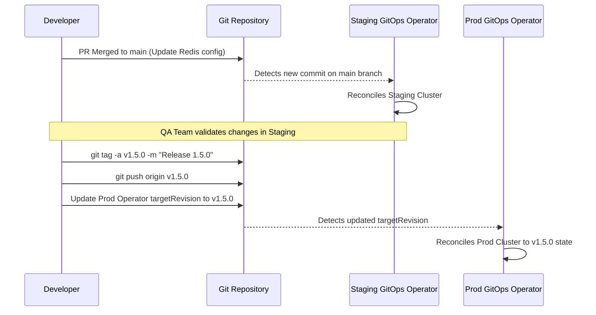

# Module 10: Bridge to GitOps — The Infrastructure Source

## Learning Outcomes

- Design a multi-environment infrastructure repository structure using Kustomize overlays to eliminate configuration duplication.
- Implement Git tag-based promotion workflows to transition configurations reliably from staging to production.
- Diagnose state drift between a live Kubernetes cluster and its Git repository source of truth using reconciliation loops.
- Evaluate the security benefits of branch protection and cryptographic commit signing in a zero-trust GitOps supply chain.
- Implement branch protection and directory isolation strategies to prevent unauthorized infrastructure mutations.

## Why This Module Matters

The payment gateway went down at 2:00 PM on the busiest shopping day of the year. The monitoring dashboards flashed red across the operations center, and the core API began returning HTTP 503 Service Unavailable errors to thousands of customers per minute. The incident response team quickly identified the immediate symptom: the `payment-processing` deployment was missing a critical environment variable required to authenticate with the newly provisioned database cluster. The lead platform engineer checked the continuous integration pipeline logs—every recent deployment job had completed successfully. She checked the infrastructure Git repository—the required environment variable was clearly defined in the Kubernetes manifests. Yet, when she queried the live state using the command line, the variable was entirely absent from the running pods.

What had actually happened? Three days prior, a developer had been urgently troubleshooting a resource exhaustion issue in the production environment. To test a rapid hypothesis, they bypassed the deployment pipeline and manually executed an edit command directly against the live deployment object from their local terminal, inadvertently wiping out the pending database configuration changes in the process. They intended to revert the change but forgot. Because the traditional "push-based" deployment pipeline only interacts with the cluster when a new code commit triggers a run, the cluster quietly drifted from the intended state defined in version control. A ticking time bomb sat unnoticed in production until the legacy database was finally decommissioned, triggering the catastrophic outage.

This scenario illustrates the fundamental flaw of imperative infrastructure management and traditional push-based deployment pipelines. If human operators or external automation systems possess the credentials to mutate cluster state directly, configuration drift is not just a possibility—it is an absolute certainty over a long enough timeline. In this module, you will learn how to bridge the gap between your Git repositories and your Kubernetes environments by adopting the GitOps operating model. You will transition from treating Git as a passive storage mechanism to enforcing it as the active, continuously reconciled single source of truth for your entire platform architecture.

## The GitOps Paradigm Shift: From Push to Pull

For years, the industry standard for delivering software and infrastructure relied on the "Push" model. In a push-based architecture, a developer merges code into a repository, which triggers a Continuous Integration (CI) server. This server builds the artifacts, runs the tests, and then assumes the responsibility of deploying the changes. To do this, the CI server requires highly privileged credentials—often cluster-admin rights—to authenticate with the target Kubernetes cluster and execute commands like `kubectl apply -f manifests/`. 

While this was a significant improvement over manual deployments, it introduces massive security and operational risks. The CI server becomes a high-value target for attackers; compromising the CI system grants the attacker keys to the entire production kingdom. Furthermore, the push model is entirely blind to what happens in the cluster after the deployment finishes. If an administrator manually deletes a resource, the CI pipeline is unaware. The state described in Git and the actual state of the cluster diverge, leading to the dreaded "configuration drift."

GitOps introduces a fundamental paradigm shift by moving to a "Pull" model. According to the OpenGitOps v1.0.0 standards, a true GitOps architecture is built on four core principles: the system must be declarative, the desired state must be versioned and immutable, software agents must automatically pull the desired state, and the state must be continuously reconciled.

In practice, this means the deployment intelligence is moved entirely inside the Kubernetes cluster itself. A specialized software operator—such as ArgoCD (a CNCF graduated project in the v3.x line featuring a built-in web UI) or Flux (a CNCF graduated project utilizing a v2.x modular architecture with five specialized controllers)—runs continuously as a pod within the cluster. This operator is configured with read-only access to your Git repository. Its sole purpose is to constantly compare the desired state (the manifests stored in Git) with the actual live state of the cluster. When it detects a difference, it automatically pulls the changes from Git and applies them locally to synchronize the states.

Think of this transition like a restaurant kitchen. The Push model is akin to a server running into the kitchen and yelling instructions directly at the chef, occasionally moving pans around on the stove themselves to speed things up. It works when it is not busy, but during a dinner rush, it leads to chaos, missed orders, and conflicting actions. The Pull model, conversely, is the standard ticket rail system. The server (the developer) writes the order on a ticket and places it on the rail (the Git repository). The chef (the GitOps operator) continuously watches the rail. When a new ticket appears, the chef pulls it down and executes it exactly as written. The chef is the only person allowed to touch the stove, ensuring a controlled, predictable, and verifiable environment.

Let us examine how this changes our interaction with Kubernetes. In a traditional push environment, a pipeline script might look like this imperative sequence:

```bash
# A traditional, imperative Push pipeline script
echo "Authenticating to Kubernetes..."
aws eks update-kubeconfig --region us-east-1 --name prod-cluster
echo "Applying manifests..."
kubectl apply -f deployment.yaml
kubectl apply -f service.yaml
echo "Checking deployment status..."
kubectl rollout status deployment/frontend -n production
```

In a GitOps environment, the pipeline script does not touch Kubernetes at all. The pipeline simply updates the Git repository, perhaps by altering an image tag in a manifest and committing the change:

```bash
# A declarative GitOps CI pipeline script
echo "Updating image tag in deployment manifest..."
sed -i 's/frontend:v1.2.0/frontend:v1.2.1/g' deployment.yaml
git add deployment.yaml
git commit -m "chore: bump frontend image to v1.2.1"
git push origin main
# The pipeline ends here. The cluster operator takes over autonomously.
```

> **Pause and predict**: Imagine a scenario where a developer with cluster access manually runs `kubectl delete service frontend -n production`. In a traditional Push pipeline, what happens next? In a GitOps Pull architecture, what happens next? Consider the state of the cluster 10 minutes after the manual deletion in both scenarios.

In the push scenario, the service remains deleted until the next time a developer happens to merge code that triggers the CI pipeline to run `kubectl apply` again. The application remains broken for hours or days. In the GitOps scenario, the internal operator detects the missing service during its next reconciliation loop (typically within minutes) and immediately recreates it based on the definition still present in the Git repository, effectively self-healing the cluster and rejecting the manual mutation.

## Architecting the Infrastructure Repository

To leverage GitOps effectively, you must design a repository structure that can accommodate multiple environments—such as Development, Staging, and Production—without duplicating thousands of lines of YAML. If you simply copy and paste your deployment manifests into separate folders for each environment, you create an unmaintainable system. When a new environment variable needs to be added to all environments, an engineer must manually update three or more separate files, practically guaranteeing that an environment will be missed or configured incorrectly.

The industry standard solution for this challenge within the Kubernetes ecosystem is Kustomize (currently in its v5.x stable release line), a template-free configuration management tool natively integrated into `kubectl` via the `-k` flag. Kustomize operates on the concept of "Bases" and "Overlays." The Base directory contains the common, foundational manifests that apply to all environments. The Overlay directories contain only the specific differences, or patches, required for a particular environment, such as varying replica counts, specific resource limits, or environment-specific configuration maps.

When designing your repository, you should separate your application source code from your infrastructure manifests. This prevents CI pipelines that build application binaries from accidentally triggering infrastructure deployment loops, and vice versa. 

Consider the following optimal directory structure for a multi-environment infrastructure repository:

```text
infrastructure-repo/
├── platform-components/           <-- Core cluster add-ons
│   ├── ingress-nginx/
│   ├── cert-manager/
│   └── external-dns/
└── applications/                  <-- Workload definitions
    └── frontend-service/
        ├── base/                  <-- Common baseline manifests
        │   ├── deployment.yaml
        │   ├── service.yaml
        │   └── kustomization.yaml <-- Declares the base resources
        └── overlays/              <-- Environment-specific patches
            ├── dev/
            │   ├── patch-replicas.yaml
            │   ├── patch-env.yaml
            │   └── kustomization.yaml <-- Points to base, applies dev patches
            ├── staging/
            │   ├── patch-replicas.yaml
            │   └── kustomization.yaml
            └── prod/
                ├── patch-replicas.yaml
                ├── patch-resources.yaml
                └── kustomization.yaml
```

Let us examine how Kustomize eliminates duplication. The `base/deployment.yaml` contains the standard definition:

```yaml
# applications/frontend-service/base/deployment.yaml
apiVersion: apps/v1
kind: Deployment
metadata:
  name: frontend
spec:
  replicas: 1 # Default conservative baseline
  selector:
    matchLabels:
      app: frontend
  template:
    metadata:
      labels:
        app: frontend
    spec:
      containers:
      - name: web
        image: myregistry.com/frontend:latest
        ports:
        - containerPort: 8080
```

For the production environment, we need high availability and guaranteed compute resources. Instead of copying the entire file, we create a targeted patch in the production overlay:

```yaml
# applications/frontend-service/overlays/prod/patch-replicas.yaml
apiVersion: apps/v1
kind: Deployment
metadata:
  name: frontend
spec:
  replicas: 5 # Override the base replica count for production
  template:
    spec:
      containers:
      - name: web
        resources:
          requests:
            cpu: "1000m"
            memory: "2Gi"
          limits:
            cpu: "2000m"
            memory: "4Gi"
```

The production `kustomization.yaml` binds them together, ensuring that when the GitOps operator reads the `prod` directory, it dynamically merges the base and the patch in memory before applying the final configuration to the cluster:

```yaml
# applications/frontend-service/overlays/prod/kustomization.yaml
apiVersion: kustomize.config.k8s.io/v1beta1
kind: Kustomization
resources:
  - ../../base
patches:
  - path: patch-replicas.yaml
```

**War Story:** A financial technology startup initially structured their GitOps repository using separate, decoupled branches for environments: a `dev` branch, a `staging` branch, and a `main` branch for production. Developers had to use `git cherry-pick` to move infrastructure changes between branches. During a major database migration, an engineer cherry-picked a deployment update to the `main` branch but encountered a merge conflict. In resolving the conflict, they accidentally accepted the `dev` database connection string. Because there was no unified view of all environments, the error was invisible during the pull request review. Production connected to the development database, corrupting test data and causing a severe privacy incident. This is why the directory-based overlay structure (trunk-based infrastructure) is vastly superior: all environments are visible on the main branch, Kustomize enforces consistency, and differences are explicitly isolated in overlay folders.

## Release Management and Semantic Versioning

When infrastructure is defined entirely in Git, your Git workflows become your release management strategy. How do you safely promote a configuration change from the development environment, through staging, and finally into production? While moving files between overlay directories is one method, the most robust and auditable approach leverages Git tags and Semantic Versioning (SemVer).

In a highly mature GitOps environment, the GitOps operator managing the production cluster is not configured to watch the `main` branch. Watching a moving branch means that any merged pull request immediately impacts production, which violates the principles of controlled release management. Instead, the production operator is configured to watch a specific Git tag, such as `v2.4.1`.

This creates a deliberate, explicit promotion mechanism. When engineers are satisfied with the state of the infrastructure on the `main` branch (which might be continuously deploying to a staging cluster), they create a cryptographic Git tag marking that exact commit. The production GitOps operator is then updated to target the new tag. This ensures that production is always pinned to an immutable, point-in-time snapshot of the repository.

Consider the following Mermaid diagram illustrating this release promotion architecture:



To implement this practically using standard GitOps primitives, you must define an instruction set for the GitOps operator. Tools like ArgoCD extend the Kubernetes API with Custom Resource Definitions (CRDs), introducing new object types that the cluster understands. The most fundamental of these is the `Application` custom resource. Instead of directly applying Deployments and Services, you submit an `Application` manifest to the cluster. This manifest acts as a pointer, instructing the ArgoCD operator exactly which Git repository to watch, which path contains the manifests (e.g., the Kustomize overlay), and which cluster namespace to target for deployment. In a mature setup, you configure this `Application` to strictly target a semantic version tag rather than a moving branch.

```yaml
# The ArgoCD Application CRD instructing the GitOps tool to manage the frontend in production
apiVersion: argoproj.io/v1alpha1
kind: Application
metadata:
  name: frontend-production
  namespace: gitops-system
spec:
  project: default
  source:
    repoURL: 'https://github.com/myorg/infrastructure.git'
    path: applications/frontend-service/overlays/prod
    # Target exactly this release tag, not a branch
    targetRevision: v1.5.0 
  destination:
    server: 'https://kubernetes.default.svc'
    namespace: production
  syncPolicy:
    automated:
      prune: true
      selfHeal: true
```

When it is time to promote the next release, the operational procedure is strictly defined in Git. An engineer cuts the new tag, and then submits a pull request updating the `targetRevision` from `v1.5.0` to `v1.6.0` in the application manifest. 

> **Stop and think**: You have discovered a critical security vulnerability in the production Ingress controller that requires an immediate configuration patch. Your staging environment is currently testing a large, disruptive database upgrade on the `main` branch. Which approach would you choose to deploy the hotfix to production, and why?
> A) Merge the hotfix into `main`, then tag `main` as the new production release.
> B) Checkout the specific Git commit corresponding to the current production tag, branch from it, apply the hotfix, tag the new branch, and point production to the new tag.
> Think about the isolation of changes before continuing.

The correct architectural choice is B. By branching from the current production tag, you isolate the security hotfix from the disruptive, untested database changes currently sitting on the `main` branch. This is the power of immutable Git tags: they provide a known-good baseline that you can return to or branch from at any time, completely independently of ongoing development work.

## Security and Compliance in the GitOps Pipeline

Moving the keys to the kingdom from the CI server into the cluster itself significantly reduces the external attack surface, but it fundamentally shifts the security boundary. The Git repository is now the ultimate control plane for your infrastructure. Whoever controls the repository controls the cluster. Therefore, securing the GitOps pipeline requires applying rigorous access controls and cryptographic verification directly to the version control system.

The most critical security implementation in a GitOps architecture is the requirement for cryptographically signed commits. If an attacker gains access to an engineer's workstation or steals their Git credentials, they could push malicious infrastructure changes (such as opening a NodePort to expose an internal database) while impersonating the legitimate engineer. 

> **Stop and think**: If an attacker compromises a developer's cloud provider credentials (like an AWS access key) but does not have their Git SSH signing key, can they successfully deploy a malicious workload to the production cluster in a Zero-Trust GitOps model?

They cannot. Because the CI pipeline no longer pushes changes and the cluster operator has the sole authority to mutate state, external cloud credentials are useless for deployment. If the attacker attempts to push changes to the repository, branch protection rules will reject the commit because it lacks a valid cryptographic signature. The trust boundary has shifted securely to the version control system.

To prevent this supply chain attack, engineers must sign their commits using GPG keys or SSH keys tied to hardware security modules or strict identity providers. When a commit is signed, Git generates a cryptographic signature proving that the person who authored the commit holds the private key associated with their identity. 

```bash
# Configuring Git to sign commits using an SSH key
git config --global gpg.format ssh
git config --global user.signingkey ~/.ssh/id_ed25519.pub
git config --global commit.gpgsign true

# Creating a signed commit (Git automatically uses the configured key)
git commit -S -m "feat: enforce network policies in production"
```

However, signing commits locally is useless unless the infrastructure enforces the requirement. This is achieved through strict Branch Protection Rules configured on the central Git repository (e.g., GitHub, GitLab). A zero-trust GitOps repository must enforce the following rules on the default branch:

1. **Require signed commits**: The version control system must reject any commit pushed to the repository that lacks a valid cryptographic signature.
2. **Require pull request reviews before merging**: No single engineer can push code directly to the main branch. A minimum of two approvals from designated code owners is required.
3. **Require status checks to pass**: Automated validation scripts (such as YAML linting, Kubernetes schema validation, and security scanning tools like Checkov or KubeLinter) must pass before the merge button is enabled.

Consider how the trust boundary shifts from the CI infrastructure to the Git repository, as illustrated in the following diagram:

```mermaid
graph TD
    subgraph Traditional Push Model
        Developer1[Developer] -->|git push| GitRepo1[(Git Repository)]
        GitRepo1 -->|webhook| CIServer[CI Server]
        CIServer -->|kubectl apply| Cluster1((Kubernetes Cluster))
        Attacker1[Attacker] -.->|Compromises| CIServer
    end

    subgraph Zero-Trust GitOps Pull Model
        Developer2[Developer] -->|Signed git push| GitRepo2[(Git Repository)]
        GitRepo2 -.->|Branch Protection| Validated[(Validated Source of Truth)]
        Validated <--|git pull| Operator[GitOps Operator]
        Operator -->|Reconciles| Cluster2((Kubernetes Cluster))
        Attacker2[Attacker] -.->|Cannot access| Operator
    end

    style CIServer fill:#f9a8d4,stroke:#be185d,stroke-width:2px
    style Operator fill:#a7f3d0,stroke:#047857,stroke-width:2px
```

When these controls are in place, the security posture of the infrastructure changes dramatically. Let us evaluate the differences:

| Security Vector | Traditional CI/CD (Push) | Zero-Trust GitOps (Pull) |
| :--- | :--- | :--- |
| **Cluster Credentials** | Stored externally in CI servers; high risk of exfiltration. | Stored exclusively inside the cluster; never leave the boundary. |
| **Auditability** | Difficult; requires cross-referencing CI logs, Git history, and cluster audit logs. | Absolute; `git log` provides a mathematically proven, exact history of all cluster states. |
| **Drift Prevention** | Weak; manual cluster changes can persist indefinitely until overwritten. | Strong; operator continuously overwrites manual changes with Git truth within minutes. |
| **Authorization** | Relies on complex CI system permissions mapping to Kubernetes RBAC. | Relies entirely on Git repository permissions and branch protection rules. |

By implementing branch protection and signed commits, you ensure that every change applied to your cluster has been intentionally authored by a verified identity, peer-reviewed by authorized personnel, mechanically tested for syntax and security flaws, and permanently recorded in an immutable ledger. The cluster itself becomes a deterministic function of the Git repository.

## Did You Know?

- **The Origin of the Term**: The term "GitOps" was coined in 2017 by Alexis Richardson, the CEO of Weaveworks, to describe the operational patterns they developed to manage their own Kubernetes infrastructure securely.
- **OpenGitOps Standards**: The original CNCF GitOps Working Group was archived in March 2024 to simplify governance, merging its efforts into the OpenGitOps project, which now maintains the official GitOps principles and standards.
- **Beyond Kubernetes**: While popularized by Kubernetes, the GitOps pattern can manage external cloud resources. Projects like Crossplane (a CNCF graduated project currently in its v2.x major release) allow you to define AWS RDS databases or GCP storage buckets as YAML in your Git repo, and the GitOps operator will provision them via cloud APIs.
- **Reconciliation Speed**: Default reconciliation loops for popular GitOps operators typically run every few minutes (for example, Flux defaults to 5 minutes for Kustomization resources). However, they can be configured with webhooks from the Git provider to trigger reconciliation instantaneously the moment a commit is merged, eliminating polling delays.
- **The Empty Cluster Test**: A true test of a mature GitOps implementation is disaster recovery. If a production cluster is entirely destroyed, spinning up a blank Kubernetes cluster, installing the GitOps operator, and pointing it at the repository should result in the complete recreation of the entire platform state without human intervention.

## Common Mistakes

| Mistake | Why It Happens | How to Fix It |
| :--- | :--- | :--- |
| **Storing Secrets in Git** | Engineers treat Git as the single source of truth, forgetting that Git history is permanent and readable by anyone with repo access. | Use tools like External Secrets Operator or Mozilla SOPS to encrypt secrets before committing them, or pull them dynamically from a Vault at runtime. |
| **Using `latest` Image Tags** | Developers want the convenience of always deploying the newest build without updating manifests. | The GitOps operator cannot detect a change if the tag text (`latest`) remains the same. Always use explicit, unique tags (e.g., git commit SHAs or SemVer tags) in manifests. |
| **Branch per Environment** | Trying to map Git branches directly to environments (`dev` branch, `prod` branch), leading to complex merge conflicts and divergent histories. | Adopt a trunk-based infrastructure approach using overlay directories (e.g., Kustomize) on a single `main` branch to ensure all environments share a unified history. |
| **Manual `kubectl` Interventions** | Operations teams bypass the Git workflow during emergencies, creating configuration drift. | Revoke write access to the cluster for all human users. Engineers must be forced to use the Git pipeline, even for hotfixes. |
| **Ignoring the Prune Setting** | Operators configure sync policies but forget to enable automated pruning of resources deleted from Git. | Explicitly enable the `prune: true` setting in your GitOps application manifests so that resources removed from the repo are actively deleted from the cluster. |
| **Mixing App Code and Infra** | Storing application source code and Kubernetes manifests in the exact same repository triggers infinite CI/CD loops. | Decouple your architecture: use one repository for application source code (which builds images) and a separate, dedicated repository exclusively for infrastructure manifests. |

## Quiz

<details>
<summary>1. A developer updates their application code, builds a new container image tagged `v3.0.0`, and pushes it to the registry. They are confused why the production cluster has not updated yet. In a strict GitOps architecture, what missing step must occur before the cluster recognizes the new image?</summary>

The cluster operates strictly on the Pull model based on the infrastructure repository. Pushing a new image to a registry does not change the declarative state in Git. The missing step is that a commit must be made to the infrastructure repository updating the Kubernetes deployment manifest to reference the new `v3.0.0` image tag. Only once that commit is merged into the tracked branch (or a new release tag is cut) will the GitOps operator detect the intended change and pull the new image into the cluster.

</details>

<details>
<summary>2. You receive an alert at 3:00 AM that a production NodePort service was accidentally exposed to the public internet. You quickly identify that a junior engineer ran a manual `kubectl expose` command directly against the cluster. Assuming a fully configured GitOps operator is running, what action do you need to take to restore the service to its secure state?</summary>

You do not need to take any manual action. A core principle of GitOps is continuous reconciliation. The GitOps operator running in the cluster is continuously comparing the live state against the Git repository. When its next reconciliation loop runs (usually within minutes), it will detect that the manually created NodePort service does not exist in the Git repository. Because it is enforcing the declarative truth, the operator will automatically delete or revert the unauthorized service, self-healing the cluster.

</details>

<details>
<summary>3. Your organization uses Kustomize to manage environments. You need to increase the memory limit for the `inventory-service` exclusively in the `staging` environment. The base deployment defines a memory limit of `512Mi`. Where and how do you implement this change?</summary>

You should not touch the `base/deployment.yaml` file, as that would affect all environments. Instead, you must create a patch file in the `overlays/staging/` directory (e.g., `patch-memory.yaml`) that specifically targets the `inventory-service` Deployment and overrides the memory limit to the new value. You then reference this patch file in the `overlays/staging/kustomization.yaml` under the `patches` section. This ensures the change is isolated entirely to the staging environment, preserving the integrity of the base configuration for production. During reconciliation, Kustomize will merge this specific staging patch with the base configuration in memory before applying it to the cluster.

</details>

<details>
<summary>4. Your team is migrating a legacy application to GitOps. The application requires a Kubernetes Secret containing a database password. An engineer suggests putting the plain YAML Secret directly into the infrastructure repository since Git is now the "single source of truth." Why is this a severe security violation, and what should be done instead?</summary>

Git history is immutable and often widely accessible to many engineers in an organization. Committing plaintext secrets exposes them permanently, even if deleted in a later commit. While GitOps demands that all state be declarative, secrets must be handled differently to prevent credential theft. You should use a solution like Mozilla SOPS to encrypt the file before committing, or use the External Secrets Operator to declare a reference in Git that fetches the actual password from a secure vault (like AWS Secrets Manager) at runtime inside the cluster. This maintains the declarative nature of GitOps without compromising sensitive information.

</details>

<details>
<summary>5. You are investigating a staging environment where an application fails to connect to its cache. A developer insists they merged the correct ConfigMap update to the `staging` overlay two hours ago. You query the live cluster and see the old values. Using a GitOps operator, what specific diagnostic steps must you take to determine why the reconciliation loop has failed to synchronize the cluster state?</summary>

First, you must check the GitOps operator's application resource status (e.g., `kubectl describe application frontend-staging -n argocd`) to determine if its sync state is reporting as 'Degraded' or 'OutOfSync'. Next, you must inspect the operator's controller logs or the Application resource events to find the exact error halting the reconciliation. Most commonly, this reveals a schema validation error, a missing Kustomize base reference, or a syntax error in the recently merged YAML patch. Because the GitOps operator validates the entire declarative state before applying it, a single malformed manifest will cause the reconciliation loop to safely abort, preventing the drift correction from reaching the cluster. This fail-safe behavior ensures that broken configurations cannot corrupt the running state of the environment.

</details>

<details>
<summary>6. During a massive marketing campaign, traffic spikes unpredictably. To handle the load, the Horizontal Pod Autoscaler (HPA) automatically scales the frontend deployment from 5 to 50 replicas. The Git repository, however, still specifies `replicas: 5` in the deployment manifest. Why doesn't the GitOps operator immediately scale the deployment back down to 5?</summary>

A properly configured GitOps setup relies on ignoring specific fields that are expected to be mutated by other cluster controllers. In this case, the GitOps operator must be configured to ignore the `spec.replicas` field of the Deployment object when an HPA is present. If it were not configured to ignore this drift, the GitOps operator and the HPA would fight in an infinite loop: the HPA scaling up based on metrics, and the GitOps operator scaling down based on the Git manifest. This conflict would severely degrade cluster performance and prevent the application from scaling out during the traffic spike. By explicitly defining these exceptions, you allow autonomous Kubernetes controllers to manage dynamic runtime state while preserving Git as the source of truth for structural configuration.

</details>

<details>
<summary>7. You are designing the release strategy for a highly regulated financial platform. Compliance requires that no single individual can push a change to production, and the exact state of production must be verifiable at any historical point in time. How do you configure the Git repository and the GitOps operator to satisfy these requirements?</summary>

First, you must enforce strict branch protection rules on the infrastructure repository: require cryptographically signed commits to prove identity, and mandate at least one approving pull request review to prevent unilateral changes. Second, instead of having the production GitOps operator track a moving branch like `main`, you configure its `targetRevision` to track specific immutable Git tags (e.g., `v2.0.1`). To promote a change, engineers create a signed tag and update the operator's target, ensuring explicit, point-in-time traceability. This guarantees that production always matches an audited, approved version of the repository, meeting the compliance requirements. Because Git tags cannot be silently modified like branches, an auditor can trivially prove the exact configuration deployed to the cluster at any given second by inspecting the tagged commit history.

</details>

## Hands-On Exercise

In this exercise, you will build a foundational GitOps repository structure from scratch, utilizing Kustomize to manage environment-specific configurations without duplicating YAML. You will then simulate the role of a GitOps operator by rendering the final configurations to verify exactly what would be applied to the cluster.

### Setup Instructions

Ensure you have a modern terminal, `git`, and the `kustomize` CLI tool installed. Alternatively, if you have `kubectl` installed (version 1.14+), it has Kustomize functionality built-in via the `-k` flag.

Create a new working directory for this exercise:
```bash
mkdir -p ~/gitops-dojo && cd ~/gitops-dojo
git init
```

### Task 1: Establish the Base Architecture
Create the directory structure for a `catalog-api` application with a base configuration and two environment overlays: `staging` and `production`.

<details>
<summary>Solution</summary>

```bash
mkdir -p catalog-api/base
mkdir -p catalog-api/overlays/staging
mkdir -p catalog-api/overlays/prod
```

</details>

### Task 2: Define the Common Base
In the `catalog-api/base` directory, create two files:
1. `deployment.yaml`: A standard Kubernetes Deployment for the `catalog-api` using the image `registry.k8s.io/echoserver:1.10`, port 8080, and specifying 1 replica.
2. `kustomization.yaml`: A file that declares the deployment as a resource.

<details>
<summary>Solution</summary>

Create `catalog-api/base/deployment.yaml`:
```yaml
apiVersion: apps/v1
kind: Deployment
metadata:
  name: catalog-api
spec:
  replicas: 1
  selector:
    matchLabels:
      app: catalog-api
  template:
    metadata:
      labels:
        app: catalog-api
    spec:
      containers:
      - name: api
        image: registry.k8s.io/echoserver:1.10
        ports:
        - containerPort: 8080
```

Create `catalog-api/base/kustomization.yaml`:
```yaml
apiVersion: kustomize.config.k8s.io/v1beta1
kind: Kustomization
resources:
  - deployment.yaml
```

</details>

### Task 3: Create the Staging Overlay
Staging needs to accurately reflect the base, but we want to add a specific environment variable to the container. 
In the `catalog-api/overlays/staging` directory, create a patch file that adds an `ENV_NAME` environment variable with the value `staging` to the `api` container. Then, wire it up with a `kustomization.yaml` that references the base and applies the patch.

<details>
<summary>Solution</summary>

Create `catalog-api/overlays/staging/patch-env.yaml`:
```yaml
apiVersion: apps/v1
kind: Deployment
metadata:
  name: catalog-api
spec:
  template:
    spec:
      containers:
      - name: api
        env:
        - name: ENV_NAME
          value: "staging"
```

Create `catalog-api/overlays/staging/kustomization.yaml`:
```yaml
apiVersion: kustomize.config.k8s.io/v1beta1
kind: Kustomization
resources:
  - ../../base
patches:
  - path: patch-env.yaml
```

</details>

### Task 4: Create the Production Overlay
Production requires high availability. In the `catalog-api/overlays/prod` directory, create a patch file that increases the replicas to 3 and sets a CPU limit of `500m`. Create the corresponding `kustomization.yaml` to apply this patch.

<details>
<summary>Solution</summary>

Create `catalog-api/overlays/prod/patch-production.yaml`:
```yaml
apiVersion: apps/v1
kind: Deployment
metadata:
  name: catalog-api
spec:
  replicas: 3
  template:
    spec:
      containers:
      - name: api
        resources:
          limits:
            cpu: "500m"
```

Create `catalog-api/overlays/prod/kustomization.yaml`:
```yaml
apiVersion: kustomize.config.k8s.io/v1beta1
kind: Kustomization
resources:
  - ../../base
patches:
  - path: patch-production.yaml
```

</details>

### Task 5: Simulate the GitOps Operator (Validation)
A GitOps operator like ArgoCD essentially runs Kustomize build commands behind the scenes before applying them to the cluster. Verify your configuration by running Kustomize build against both overlays and observing the final, merged YAML output.

<details>
<summary>Solution</summary>

Run the following commands and inspect the output to ensure the patches were applied correctly:

```bash
# Validate Staging (Should show 1 replica and the ENV_NAME variable)
kubectl kustomize catalog-api/overlays/staging

# Validate Production (Should show 3 replicas and the CPU limit, with no ENV_NAME variable)
kubectl kustomize catalog-api/overlays/prod
```
If the output matches your expectations, your directory structure is mathematically sound and ready to be committed to a Git repository.

</details>

### Success Criteria
- [ ] You have a hierarchical directory structure separating base configurations from environment overlays.
- [ ] You did not duplicate the core container definitions (image, ports) across environments.
- [ ] Running `kubectl kustomize` on the staging overlay produces a manifest with the injected environment variable.
- [ ] Running `kubectl kustomize` on the production overlay produces a manifest with 3 replicas and CPU limits.
- [ ] The base configuration remains pristine and unaltered.

## Next Module
[Philosophy and Design course](../../philosophy-design/) — Dive deeper into the architectural principles that govern robust, resilient platform engineering.
---