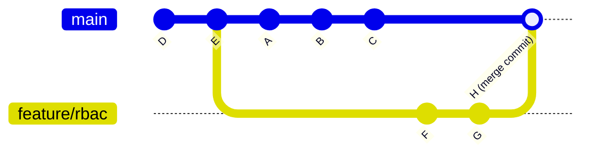
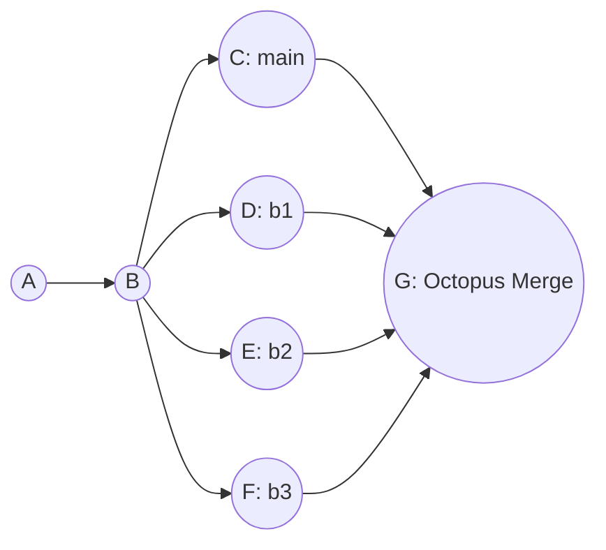
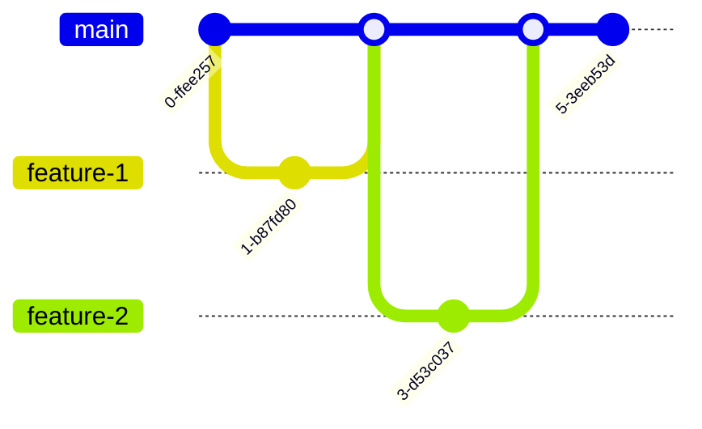

# Module 2: The Art of the Branch — Advanced Merging

**Complexity:** MEDIUM. **Time to complete:** 75 minutes. **Prerequisites:** Module 1, Git Internals. This module assumes you can read a commit graph, create branches, and commit small changes, but it does not assume you have already handled a production-grade Kubernetes merge conflict under pressure.

## Learning Outcomes
- **Diagnose** the root cause of complex merge conflicts within Kubernetes manifest files by analyzing the merge base and divergent commit histories.
- **Implement** fast-forward, three-way, and octopus merges strategically to maintain a clean, navigable project history.
- **Resolve** intricate multi-file conflicts during infrastructure-as-code integration without introducing YAML syntax errors or regression bugs.
- **Evaluate** different branching strategies (Trunk-based, GitFlow, GitHub Flow) to select the optimal workflow for a high-velocity Kubernetes platform team.
- **Compare** the internal diff algorithms of the modern `ort` and legacy `recursive` merge strategies to understand how Git handles file renames and complex tree integrations.

## Why This Module Matters

On October 21, 2018, routine optical hardware maintenance disconnected GitHub's US-East hub from its primary database for 43 seconds. An automated failover promoted the US-West hub to primary, but the US-East hub continued to accept writes. Both sites held authoritative-looking records for the same rows. Recovery required 24 hours of manual reconciliation between two diverged timelines, and approximately 200,000 webhook payloads were permanently dropped. The incident demonstrated that divergent timelines can each appear correct in isolation while creating massive conflict at infrastructure scale. The same problem exists in source control every time long-lived branches are reconciled. Advanced Git merging is the practiced skill that keeps that reconciliation from becoming an outage.

## Core Content

### The Geometry of Integration: Fast-Forward vs. Three-Way Merges

When you issue a `git merge` command, Git does not blindly smash files together line by line. Instead, it performs a rigorous geometric analysis of your repository's commit history graph to determine the safest mathematical way to integrate the disparate changes. Understanding this underlying geometry is the fundamental difference between dictating your project's history and being a victim of it.

#### The Fast-Forward Merge

Imagine you are laying bricks to build a straight wall. You stop to take a break. While you are resting, a colleague continues laying bricks starting exactly where you left off, continuing in the exact same straight line. When you return, integrating their new work into your view of the wall requires no complex decisions or architectural changes; you simply walk to the end of their newly laid bricks and consider that the new end of the wall. 

This conceptual model perfectly describes a **fast-forward merge**. It occurs when the current branch tip is a direct, linear ancestor of the branch you are attempting to merge. Git simply moves your current branch pointer forward to point to the exact same commit as the incoming branch. Because the history is entirely linear and hasn't diverged, no new "merge commit" is created.

```bash
# Setting up a fast-forward scenario
git init cluster-config
cd cluster-config
echo "apiVersion: v1" > config.yaml
git add config.yaml
git commit -m "Initialize cluster config"

# Create a new branch and add a commit
git checkout -b feature/add-metadata
echo "kind: ConfigMap" >> config.yaml
git commit -am "Add ConfigMap kind"

# Switch back to main and merge
git checkout main
git merge feature/add-metadata
```

The command output is intentionally boring, and that boredom is the entire point of a fast-forward integration. Git reports that it updated one commit range to another, then shows only the file-level change summary because no second parent and no merge commit were needed.
```text
Updating a1b2c3d..e4f5g6h
Fast-forward
 config.yaml | 1 +
 1 file changed, 1 insertion(+)
```

Because the `main` branch had not diverged—meaning no new commits were added to `main` while the `feature/add-metadata` branch was being actively developed—Git simply moved the `main` pointer forward to catch up. 

If you want to force Git to create a merge commit anyway (often done to preserve the historical context that a specific feature branch existed at all), you can use the `git merge --no-ff` flag, which always creates a merge commit even when a fast-forward would be perfectly possible. Conversely, running `git merge --ff-only` succeeds only if a clean fast-forward is mathematically possible; otherwise, it exits immediately with a non-zero status and refuses to merge. It is also worth noting a specific edge case: a fast-forward merge is automatically suppressed, and Git behaves as if `--no-ff` was passed, when merging an annotated tag that is not stored within the standard `refs/tags/` hierarchy.

> **Pause and predict**: Before running `git log --oneline --graph` after this merge, sketch out what you think the history graph will look like. Will there be a fork and a merge commit? 
> 
> *Verification*: Because this was a fast-forward merge, `main` simply moved to the tip of `feature/add-metadata`. There is no fork and no merge commit. `git log --oneline --graph` will show a single straight line of commits ending with "Add ConfigMap kind".

#### The Three-Way Merge

Real-world platform development is rarely perfectly linear. While your colleague was extending the brick wall, you started building a completely parallel wall right next to it. Now, you need to architecturally connect them. A **three-way merge** happens when the history of the repository has fundamentally diverged. Both the current branch and the incoming branch share a common ancestor deep in the past, but both have advanced independently since that point.



To resolve this divergence algorithmically, Git looks at the common ancestor (commit `E`), compares it against your current state (`C`) to see exactly what you changed, and then compares the ancestor against the incoming state (`G`) to see exactly what they changed. Git then attempts to synthesize and apply both sets of changes to the baseline `E` simultaneously. If the modifications do not overlap on the exact same lines of code, Git successfully creates a new **merge commit** (represented as `H` in the diagram) that mathematically binds the two parallel timelines together.

> **Pause and predict**: What do you think happens if both branch `main` and branch `feature/rbac` modified the exact same `subjects` list in a RoleBinding manifest, but added different users? How will Git's three-way merge handle this specific scenario?

| Change Type | Branch A (main) vs Base | Branch B (feature) vs Base | Git's Action during Merge |
| :--- | :--- | :--- | :--- |
| File added | Not present | Added | File is added |
| File modified | Unchanged | Modified | Modification applied |
| File deleted | Deleted | Unchanged | File remains deleted |
| File modified | Modified (Line 10) | Modified (Line 50) | Both modifications applied |
| File modified | Modified (Line 20) | Modified (Line 20) | **CONFLICT** |

### Merge Bases, Strategies, and Git's Internal Engines

The true hidden genius of Git's architecture lies in exactly how it calculates and locates the merge base. When branch histories become deeply complex and intertwined with multiple cross-merges, finding the optimal common ancestor is a computationally difficult task. If you ever need to manually verify what commit Git currently considers the merge base before attempting a highly risky or widespread merge, you can invoke the calculation engine directly:

```bash
git merge-base main feature/ingress-update
```

The output of `git merge-base` is the single commit hash that represents the best common ancestor of the two branches, which Git uses as the starting point for its three-way merge calculation. Understanding exactly which commit acts as the base is critical when diagnosing why Git seems to be generating strange or counterintuitive conflicts.

> **Pause and predict**: Look at the following branch topology:
> ```mermaid
> gitGraph
>    commit id: "A"
>    commit id: "B"
>    branch feature/db
>    checkout main
>    commit id: "C"
>    commit id: "D"
>    checkout feature/db
>    commit id: "E"
>    commit id: "F"
>    branch feature/cache
>    checkout feature/cache
>    commit id: "G"
>    commit id: "H"
> ```
> If you are on `main` and run `git merge feature/cache`, which commit is the merge base? 
> 
> *Answer*: The merge base is commit `B`. To find it, trace backwards from `main` (commit D) and `feature/cache` (commit H) until their paths intersect. They first meet at `B`, making it the common ancestor used for the three-way merge.

Git provides six distinct, mathematically specialized merge strategies that govern how files are combined: `ort`, `recursive`, `resolve`, `octopus`, `ours`, and `subtree`. 

For standard two-branch merges, modern Git uses the `ort` strategy as the universal default. Standing for "Ostensibly Recursive's Twin", the `ort` strategy became the default in Git 2.34.0 (released in November 2021) and it defaults to using `diff-algorithm=histogram` internally. This algorithmic choice makes it significantly faster and vastly more accurate at handling massive file renames and complex directory restructurings across diverged branches. The `ort` backend entirely replaced the legacy `recursive` strategy, which was subsequently fully deprecated in Git 2.50.0 and now exists merely as a silent synonym and alias for `ort` to preserve backwards compatibility for old scripts.

The other available strategies serve highly specialized use cases. The `resolve` strategy uses a very traditional three-way merge algorithm but explicitly does NOT handle file renames, whereas `ort` detects and handles renames gracefully. The `ours` strategy (invoked via `git merge -s ours`) aggressively discards ALL changes from the other branch entirely—the resulting tree is always mathematically identical to the current branch's HEAD tree. It is crucial to understand that this is fundamentally different from the strategy option (invoked via `git merge -X ours`), which still performs a standard three-way merge but automatically favors the current branch's code only when resolving overlapping conflicting hunks.

#### The Resolution Process

When Git encounters overlapping changes that it cannot mathematically resolve, it halts the automated merge process. You must manually intervene. The manual resolution process follows five strict, sequential steps:

1. **Identify the Conflict:** Git stops the merge execution and marks the files as conflicted in the index. Run `git status` to see the exact list of files requiring your immediate attention.
2. **Locate the Markers:** Open the conflicted file in your text editor and search for the standard conflict markers: `<<<<<<<` (which marks the beginning of your current branch's changes), `=======` (the dividing line separating the two diverging realities), and `>>>>>>>` (which marks the end of the incoming branch's changes).
3. **Analyze the Divergence:** Carefully read the code within the markers. Understand exactly what the `HEAD` version was trying to accomplish architecturally versus what the incoming branch was attempting to do.
4. **Synthesize the Intent:** Delete the conflict markers entirely and manually edit the raw code so that both intended changes are combined harmoniously, ensuring you do not introduce YAML syntax errors or semantic logical bugs.
5. **Finalize the Resolution:** Save the file, run `git add <file>` to instruct Git that the conflict has been successfully resolved, and finally run `git commit` to securely finalize the overarching merge operation.

### Conflict Resolution in Infrastructure-as-Code: Multi-File Complexity

Conflicts are not compiler errors; they are simply Git pausing its execution to ask for human judgment because its mathematical models cannot safely guess developer intent. When a conflict occurs, Git's internal index becomes a highly complex, multi-dimensional workspace. During a three-way merge, Git physically stores up to three distinct versions of each conflicted file directly within the index structure: stage 1 (the common ancestor base), stage 2 (the current HEAD version), and stage 3 (the incoming MERGE_HEAD version). You can inspect these internal stages directly by running `git ls-files -u`. Furthermore, when using the modern `ort` merge strategy, Git intelligently writes an `AUTO_MERGE` reference pointing to a tree that exactly matches the current working tree content, complete with all the inline conflict markers.

Consider a complex real-world platform scenario. Team Alpha is working on branch `feature/ha-redis` to increase redundancy. Team Beta is simultaneously working on branch `feature/redis-auth` to lock down security. Both teams heavily modify the core `redis-deployment.yaml` and the overarching `kustomization.yaml` file that orchestrates the deployment logic.

Team Alpha's changes on `feature/ha-redis`:
```yaml
spec:
  replicas: 3
  template:
    spec:
      containers:
      - name: redis
        image: redis:7.2.4-alpine
```
```yaml
resources:
- redis-deployment.yaml
commonLabels:
  high-availability: "true"
```

Team Beta's divergent changes on `feature/redis-auth`:
```yaml
spec:
  replicas: 1
  template:
    spec:
      containers:
      - name: redis
        image: redis:7.2.4
        env:
        - name: REDIS_PASSWORD
          valueFrom:
            secretKeyRef:
              name: redis-secret
              key: password
```
```yaml
resources:
- redis-deployment.yaml
secretGenerator:
- name: redis-secret
  literals:
  - password=supersecret
```

When the lead platform engineer attempts to merge `feature/redis-auth` into `feature/ha-redis`, Git evaluates the text, detects the severe overlap, and violently halts the process across multiple files:

```bash
git checkout feature/ha-redis
git merge feature/redis-auth
# Auto-merging redis-deployment.yaml
# CONFLICT (content): Merge conflict in redis-deployment.yaml
# Auto-merging kustomization.yaml
# CONFLICT (content): Merge conflict in kustomization.yaml
# Automatic merge failed; fix conflicts and then commit the result.
```

If you panic upon seeing massive multi-file infrastructure conflicts, remember that running `git merge --abort` is functionally equivalent to running `git reset --merge` when a `MERGE_HEAD` is present. It will safely and immediately return your entire repository to the pristine pre-merge state. If you choose to proceed, you must synthesize the conflicting configurations accurately, ensuring no YAML structures are broken.

To successfully resolve this specific scenario, we must determine the desired outcome across all files: we want High Availability (replicas: 3) AND authentication (env vars). For the infrastructure to actually work, the Kustomization file must include BOTH the `commonLabels` AND the `secretGenerator` so that the `redis-secret` referenced in the deployment actually exists.

The correctly synthesized deployment configuration:
```yaml
spec:
  replicas: 3
  template:
    spec:
      containers:
      - name: redis
        image: redis:7.2.4-alpine
        env:
        - name: REDIS_PASSWORD
          valueFrom:
            secretKeyRef:
              name: redis-secret
              key: password
```

The correctly synthesized kustomization configuration:
```yaml
resources:
- redis-deployment.yaml
commonLabels:
  high-availability: "true"
secretGenerator:
- name: redis-secret
  literals:
  - password=supersecret
```

Always comprehensively validate the structural integrity of your infrastructure-as-code files before committing the final resolution. Once verified, add both files to the index and commit to finalize the complex multi-file merge.

After finalizing a complex merge, you or a reviewer may need to isolate and review only the specific manual conflict resolutions you made, without the noise of unrelated feature changes. You can achieve this by inspecting the merge commit with `git show <merge-commit-hash>`, which displays a specialized "combined diff" that intelligently filters the output to highlight only the lines modified differently from both parent branches.

```bash
# We will use 'k' as an alias for kubectl going forward
alias k=kubectl
kustomize build . | k apply -f - --dry-run=client

# If successful:
git add redis-deployment.yaml kustomization.yaml
git commit -m "Merge redis-auth, resolving multi-file replicas, image, and secret generator conflicts"
```

**War Story:** A junior DevOps engineer once attempted to resolve a shockingly similar multi-file conflict. They perfectly fixed the core Deployment YAML file manually but, feeling overwhelmed, accidentally ran `git checkout --ours kustomization.yaml` to blindly bypass the second, more confusing conflict. Git accepted this command and completed the merge. As a result, the Deployment strictly expected a password secret that the Kustomization file was no longer generating. The Redis pods crash-looped instantly upon deployment in production, causing a complete and total loss of cache availability for the entire user base. You must always resolve and thoroughly validate multi-file infrastructure conflicts holistically.

To aid in visualizing these complex situations, you can utilize `git mergetool`, which launches a specialized external visual diffing tool presenting the BASE, LOCAL, and REMOTE versions side-by-side, and then automatically writes your final resolved result directly to the MERGED file. You can also significantly alter how Git presents conflicts natively in your editor. Three distinct merge conflict styles are available via the `merge.conflictStyle` configuration: `merge` shows only the two diverging sides, `diff3` adds a `|||||||` block showing the original ancestor code to provide critical context on why the conflict happened, and `zdiff3` is functionally identical to diff3 but trims matching, unchanged lines from the outer edges of the conflict block to reduce visual noise. The highly efficient `zdiff3` conflict style was introduced in Git 2.35.0.

If your team constantly encounters the exact same identical conflicts repeatedly due to long-lived branches, Git's `rerere` (Reuse Recorded Resolution) feature is an absolute lifesaver. It is globally enabled by setting the configuration `rerere.enabled = true`. When enabled, Git mathematically fingerprints the conflict and observes your manual resolution, storing the mapping in a hidden cache. If that exact conflict ever arises again during a future merge or rebase, Git automatically applies your previous resolution without halting.

### The Auto-Merge Phenomenon: A Historical Case Study

To deeply understand how Git's context windows operate, it is highly instructive to look at a legacy exercise. In earlier versions of this course, students were given the following exact sequence of commands to intentionally create a merge conflict.

The first part of the legacy exercise created a tiny repository and a Kubernetes Deployment that was deliberately small enough for students to inspect by eye. Notice that the `k` alias is introduced before any Kubernetes validation commands appear; the rest of this module uses `k` as shorthand for `kubectl`, which matches the convention used throughout KubeDojo.
```bash
mkdir k8s-merge-lab && cd k8s-merge-lab
git init --initial-branch=main
alias k=kubectl
```
```yaml
apiVersion: apps/v1
kind: Deployment
metadata:
  name: api-server
spec:
  replicas: 2
  selector:
    matchLabels:
      app: api
  template:
    metadata:
      labels:
        app: api
    spec:
      containers:
      - name: api
        image: nginx:1.27.0
```
```bash
git add deployment.yaml
git commit -m "chore: initial api deployment"
```

The second part created two diverging branches that changed different fields in the same Deployment. One branch changed desired capacity, while the other changed the container image, and the teaching intent was to make those independent intentions collide inside one manifest.
```bash
git checkout -b feature/scale-up
sed -i.bak 's/replicas: 2/replicas: 5/g' deployment.yaml && rm deployment.yaml.bak
git add deployment.yaml
git commit -m "feat: scale api to 5 replicas"
```
```bash
git checkout main
git checkout -b feature/update-image
sed -i.bak 's/image: nginx:1.27.0/image: nginx:1.27.1/g' deployment.yaml && rm deployment.yaml.bak
git add deployment.yaml
git commit -m "chore: update nginx to 1.27.1"
```

The third part asked students to merge the image branch into the scale branch and observe the result. In the original classroom version, the expectation was a visible conflict, which made the next resolution step easy to explain and easy to grade.
```bash
git checkout feature/scale-up
git merge feature/update-image
# Output will show CONFLICT (content)
```

The strict pedagogical expectation was that this sequence would produce the following dramatic conflict markers in the file, because the older exercise treated nearby edits in the same YAML object as though they would always overlap:
```text
apiVersion: apps/v1
kind: Deployment
metadata:
  name: api-server
spec:
<<<<<<< HEAD
  replicas: 5
  selector:
    matchLabels:
      app: api
  template:
    metadata:
      labels:
        app: api
    spec:
      containers:
      - name: api
        image: nginx:1.27.0
=======
  replicas: 2
  selector:
    matchLabels:
      app: api
  template:
    metadata:
      labels:
        app: api
    spec:
      containers:
      - name: api
        image: nginx:1.27.1
>>>>>>> feature/update-image
```

The student would then manually resolve the file to this final state, preserving the scale decision from one branch and the patched image decision from the other branch:
```yaml
apiVersion: apps/v1
kind: Deployment
metadata:
  name: api-server
spec:
  replicas: 5
  selector:
    matchLabels:
      app: api
  template:
    metadata:
      labels:
        app: api
    spec:
      containers:
      - name: api
        image: nginx:1.27.1
```

The exercise then required validation before committing, because a syntactically broken Deployment is still a failed merge even when the Git conflict markers have been removed:
```bash
k apply -f deployment.yaml --dry-run=client
# Expect output: deployment.apps/api-server created (dry run)
```
```bash
git add deployment.yaml
git commit -m "Merge branch 'feature/update-image' into feature/scale-up resolving replicas and image"
```

The legacy solution key provided to students looked exactly like this, and it is worth preserving because it shows the intended operational sequence even though modern Git usually handles this particular example automatically:
<details>
<summary>View Solutions</summary>

**Task 1: Create the Scale Branch**
```bash
git checkout -b feature/scale-up
sed -i.bak 's/replicas: 2/replicas: 5/g' deployment.yaml && rm deployment.yaml.bak
git add deployment.yaml
git commit -m "feat: scale api to 5 replicas"
```

**Task 2: Create the Image Update Branch**
```bash
git checkout main
git checkout -b feature/update-image
sed -i.bak 's/image: nginx:1.27.0/image: nginx:1.27.1/g' deployment.yaml && rm deployment.yaml.bak
git add deployment.yaml
git commit -m "chore: update nginx to 1.27.1"
```

**Task 3: Trigger the Conflict**
```bash
git checkout feature/scale-up
git merge feature/update-image
# Output will show CONFLICT (content)
```

**Task 4: Resolve the Conflict**
Open `deployment.yaml` in your editor. It will look similar to this:
```text
apiVersion: apps/v1
kind: Deployment
metadata:
  name: api-server
spec:
<<<<<<< HEAD
  replicas: 5
  selector:
    matchLabels:
      app: api
  template:
    metadata:
      labels:
        app: api
    spec:
      containers:
      - name: api
        image: nginx:1.27.0
=======
  replicas: 2
  selector:
    matchLabels:
      app: api
  template:
    metadata:
      labels:
        app: api
    spec:
      containers:
      - name: api
        image: nginx:1.27.1
>>>>>>> feature/update-image
```

Edit the file to remove markers and combine the desired state:
```yaml
apiVersion: apps/v1
kind: Deployment
metadata:
  name: api-server
spec:
  replicas: 5
  selector:
    matchLabels:
      app: api
  template:
    metadata:
      labels:
        app: api
    spec:
      containers:
      - name: api
        image: nginx:1.27.1
```

**Task 5: Validate the YAML**
```bash
k apply -f deployment.yaml --dry-run=client
# Expect output: deployment.apps/api-server created (dry run)
```

**Task 6: Finalize the Merge**
```bash
git add deployment.yaml
git commit -m "Merge branch 'feature/update-image' into feature/scale-up resolving replicas and image"
```

</details>

However, if you attempt to run this legacy exercise today using a modern Git version equipped with the highly optimized `ort` strategy, it seamlessly auto-merges without generating any conflict whatsoever. This fascinating phenomenon occurs because the modifications to `replicas` (line 6) and `image` (line 17) are separated by exactly ten unchanged lines. This gap provides Git's internal algorithms with just enough unambiguous textual context to safely apply both discrete hunks independently. The "overlapping context illusion" in older tutorials often fails to account for the increasing sophistication of modern Git diff engines.

### The Octopus Merge: Taming Multiple Branches

Occasionally, a Kubernetes platform team needs to orchestrate a massive integration of several entirely independent feature branches into a final release candidate branch all at the exact same time. Attempting to do this sequentially through a long chain of individual two-branch merges creates an unnecessarily messy, stair-stepped history. Git provides the powerful `octopus` strategy specifically for this scenario. It is automatically selected as the default strategy when you instruct Git to merge more than two branches simultaneously.



```bash
git checkout release-v1.35
git merge feature/ingress feature/autoscaling feature/network-policies
```

> **Pause and predict**: What do you think happens if Git successfully merges `feature/ingress` and `feature/autoscaling`, but then detects a complex conflict when attempting to merge `feature/network-policies`? Will it pause and ask you to resolve it like a standard three-way merge?

**The All-or-Nothing Rule:** Unlike a standard two-branch three-way merge which politely pauses mid-flight and leaves interactive conflict markers directly in your working directory, an octopus merge is an inherently brittle operation. It will categorically refuse to complete and will immediately abort the entire transaction if it encounters *any* conflict requiring manual resolution across any of the branches involved.

> **Stop and think**: If an octopus merge fails due to a conflict between `feature/autoscaling` and `feature/network-policies`, which approach would you choose:
> A) Abandon the octopus merge entirely and merge all three sequentially.
> B) Merge the two conflicting branches into each other first, resolve the conflict, and then retry the octopus merge with the updated branches.
> Why is your chosen approach safer for maintaining a clean history?

### Advanced History Rewriting and Cherry-Picking

Before integrating branches, many high-performing platform teams require developers to surgically clean up their messy, WIP-filled commit histories. 

The `git rebase --interactive` command is the ultimate tool for historical surgery. It supports a wide array of powerful commit-editing commands, including `pick`, `edit`, `reword` (to change a message without altering code), `drop` (to erase a commit entirely), `squash` (to meld a commit into the previous one while combining messages), `fixup`, `fixup -c/-C`, `break`, and `exec` (which runs a shell script against every commit to ensure tests pass). By default, `git rebase --interactive` strictly excludes merge commits from the generated instruction list to flatten the history.

Additionally, you can use `git rebase --onto <newbase>` to physically transplant a sequence of commits onto a completely different base than their original upstream, allowing a topic branch to be detached and moved to a different parent entirely.

When practicing Trunk-Based Development, if your push to the remote trunk is rejected because it contains new work, you can safely integrate those remote changes without creating unnecessary merge commits by running `git pull --rebase origin main`. This fetches the remote changes and replays your local work cleanly on top of them.

If you only need to integrate a single, highly specific commit from another divergent branch without merging the whole timeline, use `git cherry-pick`. Running `git cherry-pick -x` automatically appends a highly useful '(cherry picked from commit ...)' traceability line directly to the commit message. Running `git cherry-pick -n` (or `--no-commit`) applies the underlying changes to the working tree and index without actually creating a new commit, allowing you to manually tweak the code before committing.

Another powerful mechanism is `git merge --squash`. This command executes the integration logic of a merge but deliberately does not create a commit and does not record the `MERGE_HEAD` pointer, leaving the heavily combined result purely staged in your index for a subsequent, manually crafted mega-commit.

To effectively audit how merges have structurally impacted your repository over time, you can query the timeline using `git log --merges` (which prints only merge commits and is functionally equivalent to passing `--min-parents=2`) or use `git log --no-merges` (which completely excludes all merge commits and is equivalent to passing `--max-parents=1`).

### Branching Strategies & Platform Configurations

A Git merge strategy is ultimately only as effective as the overarching human branching model that dictates precisely when, where, and how often merges happen. Different models solve entirely different organizational scaling problems.

> **Stop and think**: Imagine you are advising a new platform team. They have 12 engineers, deploy to production twice a week, and have automated test coverage but it sometimes produces false positives. Which branching strategy would you recommend and why? Keep your answer in mind as you read the following models.

#### 1. GitFlow: The Legacy Enterprise Model
GitFlow relies on extreme isolation and long-lived timelines. It maintains an eternal `main` branch (which represents the exact state of production) and a parallel `develop` branch (used for continuous integration). Features exclusively branch off `develop` and must merge back into it. When a release is triggered, release branches fork off `develop`, undergo manual QA stabilization, and finally merge to both `main` and `develop`.

- **Pros:** Provides extremely rigid, explicit, and gated phases for manual QA testing and pre-release stabilization.
- **Cons:** Inevitably produces catastrophic "merge hell." Feature branches live far too long and drift from reality. It is fundamentally incompatible with true Continuous Integration and Continuous Deployment (CI/CD) principles, as functional code sits rotting unintegrated for weeks.

#### 2. GitHub Flow: The Web Application Standard
In this model, absolutely everything branches directly off `main`. When a feature is ready for integration, a developer opens a formal Pull Request against `main`. Once it is thoroughly reviewed and passes all automated tests, it merges seamlessly back into `main` and is deployed to production immediately.

- **Pros:** Exceedingly simple, aggressively encourages small, short-lived branches, and is architecturally perfect for rapid CI/CD pipelines.
- **Cons:** Requires completely infallible, rigorous automated testing. If your pipeline isn't rock-solid, a bad merge will break the production cluster instantly.

#### 3. Trunk-Based Development: The Elite Standard
This is the defining characteristic of high-performing, elite DevOps teams. Developers commit and push their raw code directly into `main` (the trunk) multiple times a single day. Divergent branches are either entirely non-existent or are strictly engineered to last only a few hours at most.



- **Pros:** Mathematically eliminates merge hell entirely. Integration is truly continuous. Forces the implementation of extensive feature flags to dynamically hide incomplete features in production.
- **Cons:** Possesses an extremely high barrier to entry. Requires ultra-advanced testing, a sophisticated feature flagging architecture, and ruthless team discipline.

For modern Kubernetes platform teams building critical internal platforms via GitOps (like ArgoCD or Flux), **Trunk-Based Development** is the absolute gold standard. Long-lived feature branches containing infrastructure changes inevitably rot, because the underlying cluster's live state continually evolves out from under them. 

#### Platform Merge Methods

To strictly enforce these various strategies, modern platforms offer highly configurable merge restrictions at the repository level. 

GitHub offers three distinct pull request merge methods: 'Create a merge commit' (which forces `--no-ff`), 'Squash and merge', and 'Rebase and merge'. It is critical to understand that GitHub's 'Rebase and merge' feature does not operate exactly like a local rebase; it always aggressively updates the committer information and creates entirely new commit SHAs, which can confuse local clients if not managed properly.

GitLab similarly offers three formal merge request methods: 'Merge commit' (the `--no-ff` equivalent), 'Merge commit with semi-linear history', and 'Fast-forward merge'. As platforms evolve to enforce Trunk-based principles more heavily, they introduce new guardrails; for example, GitLab added a highly requested automatic rebase before merge feature for both the semi-linear and fast-forward methods starting in GitLab 18.0.

## Patterns & Anti-Patterns

Advanced merging becomes safer when a team treats every integration as a design decision instead of a keyboard shortcut. The Git command is only the last visible action; the real work is deciding whether the branch is fresh enough to merge, whether the affected files are schema-sensitive, whether the review surface can be understood by another engineer, and whether the resulting history will help the next incident responder reconstruct intent. A platform repository is not a scrapbook of commits, because every merge can become an input to a controller, an audit trail for a production incident, or a rollback boundary during a failed release.

The most reliable pattern is small, frequent integration against a protected trunk. A developer can still use a short-lived branch for review, but the branch should be measured in hours or a small number of days rather than weeks. This cadence keeps the merge base close to current reality, which means Git compares each branch against a recent ancestor and produces smaller, more intelligible conflict regions. For Kubernetes manifests, that difference is practical rather than aesthetic: a small conflict might ask whether `replicas` should be three or five, while a stale branch may force the resolver to reconcile probes, selectors, container names, generated Secrets, and network policy labels all at once.

Another durable pattern is schema-aware validation immediately after conflict resolution. Git knows that two lines of YAML text differ, but it does not know whether a `secretKeyRef` points at a Secret that Kustomize still generates, whether a selector matches the labels inside a Pod template, or whether an API field is valid in Kubernetes 1.35. The resolver therefore has to move from text reconciliation to platform reconciliation. Running `k apply --dry-run=client`, `kustomize build`, or an admission-style validation tool is the engineering step that converts "Git accepted the file" into "this configuration still represents a coherent cluster object."

A third pattern is reviewable merge commits. When a merge commit exists only because two timelines were joined, it should contain only the conflict synthesis required to join them. That discipline makes `git show <merge-commit>` useful during review because the combined diff can focus on the lines changed differently from both parents. If the resolver also folds in refactors, formatting changes, or unrelated policy edits, the merge commit becomes an opaque bundle, and reviewers lose the ability to distinguish conflict resolution from opportunistic feature work. This is how teams accidentally bless an "evil merge" that introduces behavior neither parent branch intended.

| Pattern | Use When | Why It Works | Scaling Consideration |
| :--- | :--- | :--- | :--- |
| **Short-lived integration branches** | Platform engineers need review but still deploy frequently from `main`. | The merge base stays recent, conflict regions stay small, and rollback boundaries remain clear. | Requires automated tests and feature flags so unfinished work can be hidden safely. |
| **Schema-aware conflict validation** | The merge touches Kubernetes YAML, Helm output, Kustomize overlays, or policy-as-code. | Git validates text ancestry, while Kubernetes tooling validates object shape and API compatibility. | Validation must be fast enough to run locally and in CI, or engineers will skip it under pressure. |
| **Resolution-only merge commits** | A three-way merge needed manual synthesis. | Reviewers can audit the combined diff and see exactly what the human resolver changed. | Teams need a norm that unrelated cleanup waits for a separate commit. |
| **Recorded recurring resolutions** | The same branch family repeatedly conflicts during release preparation. | `rerere` can reuse a previously accepted resolution, reducing repeated manual work. | The cache should be trusted only after the team has validated the first resolution carefully. |

The corresponding anti-patterns usually arise from understandable pressure. A release is late, an environment is unhealthy, or a senior engineer is away, so someone chooses the fastest-looking button in an IDE. The problem is that Git conflict tools optimize for completing the merge operation, while production safety depends on preserving both branches' intent. Accepting "ours" across an entire file may remove conflict markers quickly, but it also discards the incoming branch's design without forcing the resolver to state that decision explicitly. If a security branch added a NetworkPolicy and the release branch changed only image tags, a blind "ours" resolution can silently erase the control that mattered most.

Long-lived release branches are the second common trap. They feel safe because they isolate instability away from production, but they also accumulate distance from the source of truth. In a GitOps repository, every day of isolation increases the gap between the branch's mental model and the cluster model that controllers are actually applying. Teams often discover the cost only at the end, when the release branch must absorb weeks of hotfixes, controller annotation changes, chart updates, and policy exceptions in one intimidating merge. At that point the conflict is no longer a local text issue; it is a delayed architecture review with deployment pressure attached.

The third anti-pattern is treating automatic merge success as proof of semantic correctness. The auto-merge case study above demonstrates why this is dangerous. Modern `ort` can correctly combine far-apart hunks, and that is usually a benefit, but a clean merge can still produce a Deployment whose labels no longer match its selector or an overlay whose generated Secret name changed while the consuming environment variable stayed fixed. Before running this in your own repository, pause and predict: if Git reports "Automatic merge went well" on a Kubernetes manifest, what separate validations would prove that the cluster object is still meaningful rather than merely parseable?

## Decision Framework

Choosing a merge approach starts with the shape of the graph, but it should not end there. First ask whether your current branch tip is an ancestor of the incoming branch tip. If it is, a fast-forward or `--ff-only` merge preserves the cleanest history and avoids inventing a merge commit that does not carry extra information. If the graph has diverged, ask whether the branch is fresh enough for a normal three-way merge and whether the files are simple enough for line-based resolution. If the branch is stale, the safer move may be to abandon the old branch shape, inspect its intent with `git diff <merge-base>..branch`, and transplant selected commits onto a fresh branch.

The next decision is whether history shape or review shape matters more for this change. A merge commit preserves the fact that a feature branch existed and can make release audits easier when a branch represents a coherent body of work. Squash merge creates a cleaner linear history, but it erases internal commit boundaries and can make `git bisect` less precise if the squashed branch mixed unrelated changes. Rebase and merge creates a linear story with individual commits preserved, yet it rewrites commit identities and can confuse collaborators who have based work on the old branch. None of these choices is universally correct; the right answer depends on how your team debugs incidents, reviews changes, and rolls back failed releases.

Use the following decision matrix as a practical guide when you are under pressure. It deliberately combines graph facts with operational facts, because a Kubernetes platform repository is judged by the behavior it produces after merge, not by the elegance of its commit graph alone.

| Situation | Preferred Move | Why | Validation Before Commit |
| :--- | :--- | :--- | :--- |
| Current branch is behind and has no unique commits | `git merge --ff-only incoming` | The branch pointer can move without creating a synthetic merge commit. | Run the relevant tests or render manifests if the incoming branch was not already validated. |
| Two fresh branches touched different files | Normal three-way merge with `ort` | Git can synthesize independent file changes cleanly while preserving both parents. | Review the merge commit and run targeted CI for changed areas. |
| Two branches touched the same Kubernetes manifest | Manual conflict resolution with schema validation | Human intent matters more than text adjacency when selectors, probes, and generated resources interact. | Run `k apply --dry-run=client`, `kustomize build`, and any policy checks your repo requires. |
| Several independent branches need one release branch | Octopus merge only if conflicts are unlikely | The history stays compact, but the operation refuses manual conflicts. | Pre-merge each branch against trunk and retry only when every pair is clean. |
| Old branch has a stale merge base | Recreate from current `main` and cherry-pick intent | The old graph encodes obsolete assumptions about the platform. | Test each selected commit after replay, especially migrations and API changes. |
| Pull request contains noisy local commits | Interactive rebase before review | Reviewers see a coherent story instead of temporary savepoints. | Re-run tests after rewriting and force-push only to branches you own. |

There is one final question that experienced maintainers ask before approving any non-trivial merge: "Could I explain this result to the on-call engineer at 3 a.m.?" If the answer is no, the branch is too large, the resolution is too clever, or the validation evidence is too thin. That question is especially useful for GitOps work because the repository is both documentation and control plane input. A reviewer who can trace the merge base, the conflicting intent, the chosen resolution, and the validation command has enough context to trust the change or reject it with specifics.

For day-to-day work, a compact flow helps prevent panic decisions. Start with `git status` to make sure your workspace is clean, inspect the graph with `git log --oneline --graph --decorate --all`, identify the merge base when the branch has been alive for more than a short review cycle, then choose the least surprising integration method that preserves the information your team will need later. After resolution, validate the rendered platform object and inspect the merge commit rather than only the final file. This sequence is slower than clicking a button, but it is much faster than debugging a cluster that accepted a syntactically valid yet semantically broken configuration.

## Did You Know?

1. The `ort` merge strategy, short for Ostensibly Recursive's Twin, became the default two-head merge engine in Git 2.34.0 in November 2021 and uses the histogram diff algorithm internally for many merge comparisons.
2. Running the maintenance command `git rerere gc` prunes unresolved conflict records older than 15 days and resolved conflict records older than 60 days, which keeps repeated-resolution caches from growing without bound.
3. Linus Torvalds designed Git's octopus merge for the Linux kernel workflow, where subsystem maintainer branches often needed to be joined into a single integration history without a long sequence of two-parent merge commits.
4. The conflict marker symbols (`<<<<<<<`, `=======`, `>>>>>>>`) predate Git by decades and were established by earlier merge tooling in the RCS era, which is why they appear familiar across many version control systems.

## Common Mistakes

| Mistake | Why It Happens | How to Fix It |
| :--- | :--- | :--- |
| **Panic committing unresolved markers** | Engineer feels overwhelmed, attempts to save work mid-conflict by running `git commit -a`, thereby committing `<<<<<<<` directly into the codebase. | Run `git merge --abort` immediately to reset the working directory to the pre-merge state, take a breath, and start over. |
| **Breaking YAML indentation** | Manually deleting conflict markers and inadvertently shifting blocks of YAML, creating invalid structural relationships. | Always use `kubectl diff` or `kubectl apply --dry-run=client` on the modified file before finalizing the merge commit. |
| **"Ostrich merging" (ignoring upstream)** | Keeping a feature branch alive for 6 weeks without pulling from main, resulting in a monolithic, unresolvable conflict later. | Merge `main` into your feature branch (or rebase against it) daily. Conflict resolution should be a continuous, small-scale tax, not a massive end-of-project penalty. |
| **Resolving logic, breaking syntax** | Focusing so hard on getting both sets of configuration into the file that you create duplicate keys (e.g., two `spec` blocks in a pod definition). | Understand the schema of the file you are editing. Use IDE plugins with Kubernetes schema validation enabled during conflict resolution. |
| **Accidental "Evil Merges"** | While resolving a conflict, the engineer sneaks in an unrelated fix or typo correction that was not part of either branch. | A merge commit should *only* contain the resolution of the conflict. Make unrelated fixes in a separate, discrete commit afterward. |
| **Deleting the wrong side** | Misunderstanding `HEAD` vs the incoming branch, and blindly choosing "Accept Current Change" when the incoming branch contained critical security patches. | Read the code inside the markers. Never trust automated UI buttons in IDEs without verifying what exact lines will survive the merge. |

> **Stop and think**: Review the mistakes in the table above. Which of these would cause the most catastrophic failure in your current team's specific context? Rank them by potential severity based on your deployment pipeline's safeguards (or lack thereof).

## Quiz

<details>
<summary>Question 1: Your team is practicing Trunk-Based Development. You have been working on a new Kubernetes network policy for about 4 hours on a local branch. When you attempt to push to main, Git rejects it, stating the remote contains work you do not have. What is the safest sequence of actions to integrate your work?</summary>
To safely integrate your work without creating a messy history, you should fetch the remote changes and perform a rebase by running `git pull --rebase origin main`. This command first fetches the new commits from the remote `main` branch and temporarily rewinds your local network policy commits. It then applies the incoming commits from your team, and finally replays your 4 hours of work on top of the newly updated history. Doing this maintains a strictly linear and clean project history, which is critical in Trunk-Based Development to avoid unnecessary and confusing merge commits for short-lived local changes.
</details>

<details>
<summary>Question 2: You trigger an automated pipeline that attempts an octopus merge, integrating four different microservice deployment updates into a staging branch. Git halts and reports a conflict between two of the branches. What happens to the staging branch in this exact moment, and how is the pipeline affected?</summary>
In this exact moment, nothing happens to the staging branch because an octopus merge is an all-or-nothing operation designed for independent branches. Unlike a standard two-branch merge that pauses mid-flight and leaves conflict markers in your working directory, Git will completely abort the octopus merge automatically upon detecting any conflict. It immediately resets your working directory and staging branch back to their exact pre-merge state. This built-in safety mechanism is highly beneficial for automated pipelines, as it prevents CI/CD systems from becoming trapped in complex, multi-dimensional conflict states that require manual human intervention.
</details>

<details>
<summary>Question 3: A junior engineer just resolved a massive 500-line multi-file conflict involving a StatefulSet and a ConfigMap, and you need to review their work. Looking at the standard full file diff is overwhelming and includes unrelated changes. How can you, as a reviewer, isolate and view *only* the specific manual conflict resolutions the engineer made?</summary>
You can isolate the manual conflict resolutions by inspecting the merge commit itself using the `git show <merge-commit-hash>` command. When you run this on a merge commit, Git displays a specialized "combined diff" instead of a standard linear diff. This combined diff intelligently filters the output to only show the specific lines that were modified differently from *both* parent branches, highlighting exactly where the engineer's manual resolution deviated from what Git's automatic merge would have attempted. This provides the precise, surgical view required to audit complex manual conflict resolutions without being drowned in the noise of unrelated feature changes.
</details>

<details>
<summary>Question 4: An incident occurs in production because a `ConfigMap` update was inexplicably lost during a recent deployment. Looking at the Git history, you see a merge commit connecting a feature branch to main. The file changed on both branches, but the feature branch's changes are completely missing in the final merge commit. What likely happened during the conflict resolution?</summary>
The engineer performing the merge likely encountered a complex conflict within the `ConfigMap`, became overwhelmed, and mistakenly opted to completely overwrite the incoming changes. They probably used a command like `git checkout --ours configmap.yaml` or blindly clicked "Accept Current Changes" in their IDE's conflict resolution interface. By doing so, they entirely discarded the valid configuration updates from the feature branch while keeping their own, and then finalized the merge commit without realizing the loss of data. This scenario underscores exactly why a visual inspection and validation of the final merged files (such as using `kubectl diff`) is absolutely mandatory before committing a resolved conflict.
</details>

<details>
<summary>Question 5: Your organization is adopting GitOps with ArgoCD to manage Kubernetes clusters, but the QA team insists on keeping the legacy GitFlow branching model with long-lived `develop` and release branches. Why will this combination inevitably lead to deployment failures and configuration drift?</summary>
This combination will fail because GitFlow isolates infrastructure changes in long-lived branches for extended periods, which fundamentally violates the core philosophy of GitOps. In a proper GitOps architecture, the main branch of the Git repository must serve as the absolute, real-time source of truth for the cluster's state. When changes sit unmerged in a `develop` branch for weeks, the actual cluster state inevitably drifts as other hotfixes or updates are applied directly to the mainline. This severe divergence makes rapid, predictable iteration impossible and practically guarantees massive, unresolvable merge conflicts when the long-lived branches are finally integrated.
</details>

<details>
<summary>Question 6: You are tasked with taking over a legacy `feature/database-migration` branch that was abandoned by a former employee. Before attempting to integrate it, you run `git merge-base main feature/database-migration` and find that the common ancestor is a commit from over a year ago. What is the safest sequence of actions to rescue this work without breaking the current cluster state, and why?</summary>
Attempting a direct three-way merge with a year-old base is extremely dangerous, as Git will try to mathematically reconcile hundreds of conflicting architectural changes simultaneously. Instead, you should first examine the original intent by running `git diff <merge-base-hash>..feature/database-migration` to isolate exactly what the former employee changed. Once the isolated logic is understood, the safest approach is to create a fresh branch off the current `main` and use `git cherry-pick` to selectively bring over only the relevant database migration commits. This strategy completely abandons the deeply diverged history and ensures you are manually adapting the legacy logic to the modern, real-time state of the infrastructure.
</details>

## Hands-On Exercise

In this lab you will create a small Kubernetes manifest repository, force a real conflict that modern Git cannot safely auto-merge, inspect the merge base, resolve the conflict by synthesizing intent, and validate the final object before committing. The exercise uses a Deployment and a ConfigMap because they reveal the two failure modes you will see in platform work: one conflict is about competing runtime behavior, while the other is about a dependency between files. The goal is not to memorize conflict markers; the goal is to practice slowing down enough to identify what each branch was trying to accomplish.

Work in a scratch directory outside any production repository. The commands below assume a Unix-like shell and Git with the default `ort` merge engine. They also assume `kubectl` is installed; the lab defines `alias k=kubectl` and uses `k` for validation so the command style matches the rest of the module. If you do not have a live cluster context, `--dry-run=client` still validates local object structure, which is enough for this exercise.

- [ ] Create the repository, add the baseline Deployment and ConfigMap, and commit the initial state.
- [ ] Create `feature/harden-api` to add a health probe and stricter ConfigMap setting.
- [ ] Create `feature/scale-api` to change replicas and a competing ConfigMap setting.
- [ ] Merge `feature/scale-api` into `feature/harden-api`, inspect the merge base, and resolve both conflicted files.
- [ ] Validate the resolved manifests with `k apply --dry-run=client` before committing the merge.
- [ ] Inspect the final merge commit with `git show` and explain which lines were human conflict resolutions.

<details>
<summary>Setup and task solutions</summary>

Create the repository and baseline files:

```bash
mkdir k8s-advanced-merge-lab
cd k8s-advanced-merge-lab
git init --initial-branch=main
alias k=kubectl
```

```yaml
apiVersion: v1
kind: ConfigMap
metadata:
  name: api-settings
data:
  LOG_LEVEL: "info"
  FEATURE_MODE: "standard"
```

Save that YAML as `configmap.yaml`, then create the Deployment:

```yaml
apiVersion: apps/v1
kind: Deployment
metadata:
  name: api-server
spec:
  replicas: 2
  selector:
    matchLabels:
      app: api
  template:
    metadata:
      labels:
        app: api
    spec:
      containers:
      - name: api
        image: nginx:1.27.1
        envFrom:
        - configMapRef:
            name: api-settings
```

Save that YAML as `deployment.yaml`, then commit:

```bash
git add configmap.yaml deployment.yaml
git commit -m "chore: add baseline api manifests"
```

Create the hardening branch:

```bash
git checkout -b feature/harden-api
perl -0pi -e 's/FEATURE_MODE: "standard"/FEATURE_MODE: "strict"/' configmap.yaml
perl -0pi -e 's/image: nginx:1.27.1/image: nginx:1.27.1\n        readinessProbe:\n          httpGet:\n            path: \\/\n            port: 80\n          initialDelaySeconds: 5\n          periodSeconds: 10/' deployment.yaml
git add configmap.yaml deployment.yaml
git commit -m "feat: harden api readiness behavior"
```

Create the scale branch from `main`:

```bash
git checkout main
git checkout -b feature/scale-api
perl -0pi -e 's/replicas: 2/replicas: 5/' deployment.yaml
perl -0pi -e 's/FEATURE_MODE: "standard"/FEATURE_MODE: "burst"/' configmap.yaml
git add configmap.yaml deployment.yaml
git commit -m "feat: scale api for burst traffic"
```

Merge and inspect the merge base:

```bash
git checkout feature/harden-api
git merge-base main feature/scale-api
git merge feature/scale-api
git status
```

Resolve `deployment.yaml` by keeping both the readiness probe and the scaled replica count:

```yaml
apiVersion: apps/v1
kind: Deployment
metadata:
  name: api-server
spec:
  replicas: 5
  selector:
    matchLabels:
      app: api
  template:
    metadata:
      labels:
        app: api
    spec:
      containers:
      - name: api
        image: nginx:1.27.1
        readinessProbe:
          httpGet:
            path: /
            port: 80
          initialDelaySeconds: 5
          periodSeconds: 10
        envFrom:
        - configMapRef:
            name: api-settings
```

Resolve `configmap.yaml` by making an explicit product decision. In this example, the release owner chooses strict mode because hardening matters more than burst behavior until the feature flag is redesigned:

```yaml
apiVersion: v1
kind: ConfigMap
metadata:
  name: api-settings
data:
  LOG_LEVEL: "info"
  FEATURE_MODE: "strict"
```

Validate and commit:

```bash
k apply -f configmap.yaml --dry-run=client
k apply -f deployment.yaml --dry-run=client
git add configmap.yaml deployment.yaml
git commit -m "Merge scale-api into harden-api resolving replicas and feature mode"
git show --stat --summary HEAD
git show HEAD
```

</details>

The success criteria are intentionally broader than "Git says the merge is complete." You should be able to point to the merge base, describe each branch's intent, explain why one ConfigMap value survived, show that the Deployment still references an existing ConfigMap, and demonstrate that Kubernetes 1.35-compatible client validation accepts both objects. If you cannot explain those facts from the final commit, the merge may be mechanically complete but operationally unreviewable.

## Sources

- [Git merge documentation](https://git-scm.com/docs/git-merge)
- [Git merge-base documentation](https://git-scm.com/docs/git-merge-base)
- [Git rerere documentation](https://git-scm.com/docs/git-rerere)
- [Git rebase documentation](https://git-scm.com/docs/git-rebase)
- [Git cherry-pick documentation](https://git-scm.com/docs/git-cherry-pick)
- [Git log documentation](https://git-scm.com/docs/git-log)
- [Git attributes documentation for merge drivers](https://git-scm.com/docs/gitattributes)
- [Kubernetes kubectl apply reference](https://kubernetes.io/docs/reference/kubectl/generated/kubectl_apply/)
- [Kubernetes Kustomize documentation](https://kubernetes.io/docs/tasks/manage-kubernetes-objects/kustomization/)
- [GitHub pull request merge methods](https://docs.github.com/en/repositories/configuring-branches-and-merges-in-your-repository/configuring-pull-request-merges/about-merge-methods-on-github)
- [GitLab merge request methods](https://docs.gitlab.com/user/project/merge_requests/methods/)

## Next Module

Continue to [Module 3: History as a Choice](../module-3-interactive-rebasing/) to practice interactive rebasing, commit surgery, and deliberate history design before changes reach shared branches.
