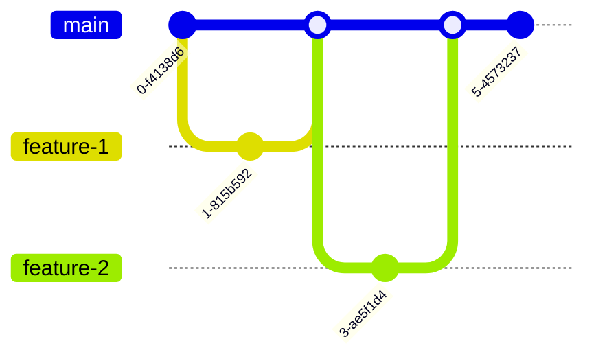

# Module 2: The Art of the Branch — Advanced Merging

## Learning Outcomes
- **Diagnose** the root cause of complex merge conflicts within Kubernetes manifest files by analyzing the merge base and divergent commit histories.
- **Implement** three-way and fast-forward merges strategically to maintain a clean, navigable project history.
- **Resolve** intricate multi-file conflicts during infrastructure-as-code integration without introducing YAML syntax errors or regression bugs.
- **Evaluate** different branching strategies (Trunk-based, GitFlow, GitHub Flow) to select the optimal workflow for a high-velocity Kubernetes platform team.
- **Execute** octopus merges to integrate multiple independent feature branches into a single integration or release branch simultaneously.

## Why This Module Matters
In late 2022, a major fintech company experienced a catastrophic deployment failure that took down their core payment processing API for over six hours. The root cause was not a flaw in the application logic, nor was it a misconfigured load balancer. The outage stemmed entirely from a botched Git merge. Two separate platform teams had been working on long-lived feature branches for months, modifying the same set of Kubernetes deployment manifests to introduce different auto-scaling behaviors and resource requests. When the time came for the release, the resulting merge conflict spanned hundreds of lines across dozens of YAML files.

The engineer assigned to resolve the conflict, under immense pressure and fatigued, accidentally accepted incoming changes that overwrote the liveness probe configurations while simultaneously corrupting the YAML indentation of the resource limits. The merged code passed a superficial review because the diff was simply too massive to parse effectively. Once deployed, the Kubernetes scheduler immediately began crash-looping the pods due to the malformed probes, while the cluster autoscaler went rogue based on the broken resource definitions. The financial impact was measured in the millions, but the cultural impact was worse: developers became terrified of merging.

Merging branches in Git is not merely a mechanical process of combining text files; it is the act of reconciling parallel timelines of human intent. In infrastructure-as-code environments, where a single misaligned space in a YAML file can tear down a production cluster, mastering the mechanics of the merge is a non-negotiable survival skill. This module takes you deep into the heart of Git's merge engines. You will learn how Git mathematically determines what changed, why conflicts actually happen, and how to resolve them with surgical precision rather than panic. You will move beyond typing `git merge` and hoping for the best, evolving into an engineer who orchestrates integration with absolute confidence.

## Core Content

### The Geometry of Integration: Fast-Forward vs. Three-Way Merges

When you issue a `git merge` command, Git does not blindly smash files together. It performs a geometric analysis of your commit history to determine the safest way to integrate changes. Understanding this geometry is the difference between controlling your project's history and being a victim of it.

#### The Fast-Forward Merge
Imagine you are laying bricks in a straight line. You stop to take a break. While you are resting, a colleague continues laying bricks starting exactly where you left off, continuing in the same straight line. When you return, integrating their work into your view of the wall requires no complex decisions; you simply walk to the end of their newly laid bricks.

This is a **fast-forward merge**. It occurs when the current branch tip is a direct ancestor of the branch you are trying to merge. Git simply moves your branch pointer forward to point to the same commit as the incoming branch. No new "merge commit" is created because the history is entirely linear.

```bash
# Setting up a fast-forward scenario
git init cluster-config
cd cluster-config
echo "apiVersion: v1" > config.yaml
git add config.yaml
git commit -m "Initialize cluster config"

# Create a new branch and add a commit
git checkout -b feature/add-metadata
echo "kind: ConfigMap" >> config.yaml
git commit -am "Add ConfigMap kind"

# Switch back to main and merge
git checkout main
git merge feature/add-metadata
```

Output of the merge:
```text
Updating a1b2c3d..e4f5g6h
Fast-forward
 config.yaml | 1 +
 1 file changed, 1 insertion(+)
```

Because `main` had not diverged—no new commits were added to `main` while `feature/add-metadata` was being developed—Git just moved the `main` pointer forward.

> **Pause and predict**: Before running `git log --oneline --graph` after this merge, sketch out what you think the history graph will look like. Will there be a fork and a merge commit? 
> 
> *Verification*: Because this was a fast-forward merge, `main` simply moved to the tip of `feature/add-metadata`. There is no fork and no merge commit. `git log --oneline --graph` will show a single straight line of commits ending with "Add ConfigMap kind".

#### The Three-Way Merge
Real-world development is rarely linear. While your colleague was extending the brick wall, you started building a parallel wall right next to it. Now, you need to connect them. This requires actual construction work.

A **three-way merge** happens when the history has diverged. The current branch and the incoming branch have a common ancestor (the merge base), but both have advanced independently.

```ascii
      A---B---C (main)
     /         \
D---E           H (merge commit)
     \         /
      F-------G (feature/rbac)
```

To resolve this, Git uses three points of reference:
1. The tip of your current branch (`C`)
2. The tip of the incoming branch (`G`)
3. The common ancestor of both branches (`E`) — the **merge base**.

Git compares `C` against `E` to see what you changed, and `G` against `E` to see what they changed. It then attempts to apply both sets of changes to `E` simultaneously. If the changes do not overlap on the same lines, Git successfully creates a new **merge commit** (`H`). This commit is unique: it has two parents.

> **Pause and predict**: What do you think happens if both branch `main` and branch `feature/rbac` modified the exact same `subjects` list in a RoleBinding manifest, but added different users? How will Git's three-way merge handle this specific scenario?

### The Merge Base and Recursive Strategies

The true genius of Git lies in how it finds the merge base. When histories are complex, with branches crossing and merging multiple times, finding the optimal common ancestor is computationally difficult.

By default, Git uses the **recursive** strategy (specifically, the `ort` strategy in modern Git versions, which stands for "Ostensibly Recursive's Twin"). If Git finds multiple potential common ancestors, it creates a temporary, virtual merge commit of those ancestors, and uses *that* as the merge base for your actual merge.

Let's look at how Git analyzes changes.

| Change Type | Branch A (main) vs Base | Branch B (feature) vs Base | Git's Action during Merge |
| :--- | :--- | :--- | :--- |
| File added | Not present | Added | File is added |
| File modified | Unchanged | Modified | Modification applied |
| File deleted | Deleted | Unchanged | File remains deleted |
| File modified | Modified (Line 10) | Modified (Line 50) | Both modifications applied |
| File modified | Modified (Line 20) | Modified (Line 20) | **CONFLICT** |

If you ever need to manually verify what Git considers the merge base before attempting a risky merge, you can use:

```bash
git merge-base main feature/ingress-update
```
This returns the commit hash of the optimal common ancestor.

> **Pause and predict**: Look at the following branch topology:
> ```ascii
>       A---B---C---D (main)
>            \
>             E---F (feature/db)
>                  \
>                   G---H (feature/cache)
> ```
> If you are on `main` and run `git merge feature/cache`, which commit is the merge base? 
> 
> *Answer*: The merge base is commit `B`. To find it, trace backwards from `main` (commit D) and `feature/cache` (commit H) until their paths intersect. They first meet at `B`, making it the common ancestor used for the three-way merge.

### Conflict Resolution in Infrastructure-as-Code

Conflicts are not errors; they are Git asking for human judgment because its mathematical models cannot safely guess your intent.

In Kubernetes infrastructure, conflicts are particularly dangerous because YAML relies on semantic indentation. Resolving a conflict incorrectly can result in valid Git history but invalid YAML architecture.

Let's walk through a complex conflict scenario.

#### The Scenario
Team Alpha is working on branch `feature/ha-redis`. Team Beta is working on branch `feature/redis-auth`.
Both teams modify `redis-deployment.yaml`.

Team Alpha's change (`feature/ha-redis`):
```yaml
spec:
  replicas: 3
  template:
    spec:
      containers:
      - name: redis
        image: redis:7.0.11-alpine
```

Team Beta's change (`feature/redis-auth`):
```yaml
spec:
  replicas: 1
  template:
    spec:
      containers:
      - name: redis
        image: redis:7.0.11
        env:
        - name: REDIS_PASSWORD
          valueFrom:
            secretKeyRef:
              name: redis-secret
              key: password
```

When you attempt to merge `feature/redis-auth` into `feature/ha-redis`, Git halts.

```bash
git checkout feature/ha-redis
git merge feature/redis-auth
# Auto-merging redis-deployment.yaml
# CONFLICT (content): Merge conflict in redis-deployment.yaml
# Automatic merge failed; fix conflicts and then commit the result.
```

If you open `redis-deployment.yaml`, you will see conflict markers:

```yaml
<<<<<<< HEAD
spec:
  replicas: 3
  template:
    spec:
      containers:
      - name: redis
        image: redis:7.0.11-alpine
=======
spec:
  replicas: 1
  template:
    spec:
      containers:
      - name: redis
        image: redis:7.0.11
        env:
        - name: REDIS_PASSWORD
          valueFrom:
            secretKeyRef:
              name: redis-secret
              key: password
>>>>>>> feature/redis-auth
```

#### The Resolution Process

1. **Understand the markers:**
   - `<<<<<<< HEAD`: The start of your current branch's changes.
   - `=======`: The separator between the two conflicting changes.
   - `>>>>>>> feature/redis-auth`: The end of the incoming branch's changes.

2. **Determine the desired outcome:**
   We want High Availability (replicas: 3) AND authentication (env vars), and we should probably stick to the alpine image for security/size.

3. **Edit the file:**
   Remove the markers and manually weave the YAML back together, paying extreme attention to the 2-space indentation rule.

```yaml
spec:
  replicas: 3
  template:
    spec:
      containers:
      - name: redis
        image: redis:7.0.11-alpine
        env:
        - name: REDIS_PASSWORD
          valueFrom:
            secretKeyRef:
              name: redis-secret
              key: password
```

4. **Verify and Commit:**
   Never assume your manual YAML edit is valid. Always validate before committing. You can use tools like `yq` or `kubectl`'s dry-run feature. Once verified, add and commit to finalize the merge.

```bash
# We will use 'k' as an alias for kubectl going forward
alias k=kubectl
k apply -f redis-deployment.yaml --dry-run=client

# If successful:
git add redis-deployment.yaml
git commit -m "Merge redis-auth, resolving replicas and image conflicts"
```

**War Story:** A junior DevOps engineer once resolved a similar conflict by keeping the incoming `env` block but accidentally shifting the indentation left by two spaces, placing `env` at the same level as `containers` instead of inside it. Git accepted the merge. CI/CD deployed it. Kubernetes rejected the manifest, but because the deployment pipeline lacked a strict pre-flight validation check, the previous replicaset was scaled down while the new one failed to create, causing a complete loss of cache availability. Always validate YAML after a conflict resolution.

### The Octopus Merge: Taming Multiple Branches

Occasionally, a platform team needs to integrate several independent feature branches into a release candidate branch all at once. Doing this sequentially creates a messy, ladder-like history of merge commits.

Git provides a strategy called the **Octopus Merge**, which allows merging more than two branches into a single commit.

```ascii
      A---B---C (main)
     /    |    \
    D     E     F
   (b1)  (b2)  (b3)

After Octopus Merge:

      A---B-------C---G (main)
     /    |      /   /
    D     |     /   /
     \    E    /   /
      \    \  /   /
       \------F--/
```

To perform an octopus merge:

```bash
git checkout release-v1.5
git merge feature/ingress feature/autoscaling feature/network-policies
```

> **Pause and predict**: What do you think happens if Git successfully merges `feature/ingress` and `feature/autoscaling`, but then detects a complex conflict when attempting to merge `feature/network-policies`? Will it pause and ask you to resolve it like a standard three-way merge?

**The All-or-Nothing Rule:** Unlike a standard two-branch merge which pauses mid-flight and leaves conflict markers in your working directory, an octopus merge will categorically refuse to complete if it encounters a conflict requiring manual resolution. It does not pause. If it fails, Git aborts the entire octopus merge automatically, leaving your working directory exactly as it was. It is designed solely for cleanly combining independent, non-overlapping development efforts. If it fails, you must fall back to sequential merging or resolve the conflicts between the specific branches before attempting again.

> **Stop and think**: If an octopus merge fails due to a conflict between `feature/autoscaling` and `feature/network-policies`, which approach would you choose:
A) Abandon the octopus merge entirely and merge all three sequentially.
B) Merge the two conflicting branches into each other first, resolve the conflict, and then retry the octopus merge with the updated branches.
Why is your chosen approach safer for maintaining a clean history?

### Branching Strategies for High-Velocity Teams

A merge strategy is only as good as the branching model that dictates when and where merges happen. Different models solve different organizational problems.

> **Stop and think**: Imagine you are advising a new platform team. They have 12 engineers, deploy to production twice a week, and have automated test coverage but it sometimes produces false positives. Which branching strategy would you recommend and why? Keep your answer in mind as you read the following models.

#### 1. GitFlow: The Legacy Enterprise Model
GitFlow uses strict isolation. It maintains a `main` branch (always production-ready) and a `develop` branch (integration). Features branch off `develop` and merge back. Releases branch off `develop`, undergo stabilization, and merge to both `main` and `develop`.

- **Pros:** Extremely rigid, explicit phases for QA and stabilization.
- **Cons:** Produces "merge hell." Feature branches live too long. It is fundamentally incompatible with Continuous Integration and Continuous Deployment (CI/CD) principles, as code sits unintegrated for weeks.

#### 2. GitHub Flow: The Web Application Standard
Everything branches off `main`. When a feature is ready, you open a Pull Request against `main`. Once reviewed and passing tests, it merges into `main` and deploys immediately.

- **Pros:** Simple, encourages small, short-lived branches, perfect for CI/CD.
- **Cons:** Requires rigorous automated testing. If your pipeline isn't rock-solid, a bad merge breaks production instantly.

#### 3. Trunk-Based Development: The Elite Standard
The defining characteristic of high-performing DevOps teams. Developers merge their code into `main` (the trunk) multiple times a day. Branches are either non-existent or last only a few hours.



- **Pros:** Eliminates merge hell entirely. Integration is continuous. Requires extensive use of feature flags to hide incomplete work in production.
- **Cons:** Extremely high barrier to entry. Requires advanced testing, feature flagging architecture, and high team discipline.

For Kubernetes platform teams building internal platforms, **Trunk-Based Development** paired with GitOps (like ArgoCD or Flux) is the gold standard. Long-lived feature branches containing infrastructure changes inevitably rot, because the underlying cluster state evolves out from under them.

## Did You Know?

1. Linus Torvalds originally designed Git's octopus merge specifically because he grew frustrated merging dozens of separate Linux kernel subsystem maintainer branches sequentially.
2. In Git version 2.33 (released August 2021), a completely new merge backend called `ort` (Ostensibly Recursive's Twin) was introduced, which mathematically processes large renames and complex merges up to 500x faster than the old recursive strategy.
3. The conflict marker symbols (`<<<<<<<`, `=======`, `>>>>>>>`) predate Git by decades. They were established by the `merge` program developed at Bell Labs in the late 1980s for the RCS version control system.
4. Git allows you to configure specific merge drivers for different file types via `.gitattributes`. You could theoretically write a custom merge driver specifically designed to intelligently merge Kubernetes YAML files without breaking indentation, though maintaining it is notoriously difficult.

## Common Mistakes

| Mistake | Why It Happens | How to Fix It |
| :--- | :--- | :--- |
| **Panic committing unresolved markers** | Engineer feels overwhelmed, attempts to save work mid-conflict by running `git commit -a`, thereby committing `<<<<<<<` directly into the codebase. | Run `git merge --abort` immediately to reset the working directory to the pre-merge state, take a breath, and start over. |
| **Breaking YAML indentation** | Manually deleting conflict markers and inadvertently shifting blocks of YAML, creating invalid structural relationships. | Always use `kubectl diff` or `kubectl apply --dry-run=client` on the modified file before finalizing the merge commit. |
| **"Ostrich merging" (ignoring upstream)** | Keeping a feature branch alive for 6 weeks without pulling from main, resulting in a monolithic, unresolvable conflict later. | Merge `main` into your feature branch (or rebase against it) daily. Conflict resolution should be a continuous, small-scale tax, not a massive end-of-project penalty. |
| **Resolving logic, breaking syntax** | Focusing so hard on getting both sets of configuration into the file that you create duplicate keys (e.g., two `spec` blocks in a pod definition). | Understand the schema of the file you are editing. Use IDE plugins with Kubernetes schema validation enabled during conflict resolution. |
| **Accidental "Evil Merges"** | While resolving a conflict, the engineer sneaks in an unrelated fix or typo correction that was not part of either branch. | A merge commit should *only* contain the resolution of the conflict. Make unrelated fixes in a separate, discrete commit afterward. |
| **Deleting the wrong side** | Misunderstanding `HEAD` vs the incoming branch, and blindly choosing "Accept Current Change" when the incoming branch contained critical security patches. | Read the code inside the markers. Never trust automated UI buttons in IDEs without verifying what exact lines will survive the merge. |

> **Stop and think**: Review the mistakes in the table above. Which of these would cause the most catastrophic failure in your current team's specific context? Rank them by potential severity based on your deployment pipeline's safeguards (or lack thereof).

## Quiz

<details>
<summary>Question 1: Your team is practicing Trunk-Based Development. You have been working on a new Kubernetes network policy for about 4 hours on a local branch. When you attempt to push to main, Git rejects it, stating the remote contains work you do not have. What is the safest sequence of actions to integrate your work?</summary>
Fetch the remote changes and perform a merge or rebase. Because you are aiming for continuous integration and the work is short-lived, running `git pull --rebase origin main` is optimal. It fetches the new commits from main, temporarily rewinds your 4 hours of work, applies the incoming main commits, and then replays your network policy commits on top. This maintains a clean, linear history, avoiding unnecessary merge commits for short-lived local work.
</details>

<details>
<summary>Question 2: You trigger an automated pipeline that attempts an octopus merge, integrating four different microservice deployment updates into a staging branch. Git halts and reports a conflict between two of the branches. What happens to the staging branch in this exact moment, and how is the pipeline affected?</summary>
Nothing happens to the staging branch. Unlike a standard two-branch merge which pauses mid-flight and leaves conflict markers in your working directory, an octopus merge is an all-or-nothing operation. If Git detects a conflict, it aborts the entire octopus merge automatically, leaving your working directory and staging branch exactly as they were before you ran the command. This safety mechanism prevents automated pipelines from being trapped in multi-dimensional conflict resolutions that are nearly impossible to untangle automatically.
</details>

<details>
<summary>Question 3: A junior engineer just resolved a massive 500-line conflict in a StatefulSet YAML file, and you need to review their work. Looking at the full file diff is overwhelming. How can you, as a reviewer, isolate and view *only* the specific manual conflict resolutions the engineer made?</summary>
You need to inspect the merge commit itself, not just the file. By running `git show <merge-commit-hash>`, Git will display a "combined diff" specifically designed for analyzing conflict resolutions. This specialized output only shows the lines that were modified from *both* parents, highlighting exactly how the manual conflict resolution differs from what Git's automatic merge would have attempted. It is the precise surgical view needed to audit a manual conflict resolution without noise.
</details>

<details>
<summary>Question 4: An incident occurs in production because a `ConfigMap` update was inexplicably lost. Looking at the Git history, you see a merge commit connecting a feature branch to main. The file changed on both branches, but the feature branch's changes are completely missing in the final merge commit. What likely happened during the conflict resolution?</summary>
The engineer performing the merge encountered a conflict in the `ConfigMap`, became confused, and likely used a command like `git checkout --ours configmap.yaml` or clicked "Accept Current Changes" in their IDE, completely overwriting the incoming changes from the feature branch. They then committed the resolution without realizing they were discarding valid code. The history shows a merge, but the data from one side was entirely discarded through human error during resolution. This highlights why visual inspection of the final merged file is mandatory before finalizing the commit.
</details>

<details>
<summary>Question 5: Your organization is adopting GitOps with ArgoCD to manage Kubernetes clusters, but the QA team insists on keeping the legacy GitFlow branching model with long-lived `develop` and release branches. Why will this combination inevitably lead to deployment failures and configuration drift?</summary>
GitFlow isolates code in long-lived `develop` and release branches for extended periods, which fundamentally contradicts the core philosophy of GitOps. In a GitOps model, the Git repository must act as the absolute, real-time source of truth for the cluster state. If infrastructure changes are siloed in unmerged branches for weeks, the cluster state inevitably drifts as other updates are applied. This divergence makes rapid iteration impossible and practically guarantees massive conflicts when the delayed branches finally merge. Therefore, GitOps requires the continuous integration provided by Trunk-Based Development or GitHub Flow.
</details>

<details>
<summary>Question 6: You are tasked with taking over a legacy `feature/database-migration` branch that was abandoned by a former employee. Before attempting to integrate it, you run `git merge-base main feature/database-migration` and it returns a commit hash from 8 months ago. What does this immediately tell you about the risk profile of this impending merge, and how should you proceed?</summary>
The risk profile is exceptionally high because the mathematical distance between the branches practically guarantees massive, systemic conflicts. A merge base that old means the feature branch has been completely isolated from the mainline for 8 months. During that time, `main` has evolved significantly, meaning the semantic logic of the old branch is highly likely to be incompatible with the current architecture even if it merges cleanly at a text level. You should abandon a direct merge and instead deeply analyze the old branch's intent, likely cherry-picking only the relevant parts or rebuilding the feature against the modern trunk.
</details>

## Hands-On Exercise

In this exercise, you will intentionally create a complex three-way conflict within a Kubernetes deployment manifest, resolve it manually ensuring structural integrity, and validate the result.

### Setup Instructions

1. Create a fresh Git repository and initialize a baseline manifest.
   ```bash
   mkdir k8s-merge-lab && cd k8s-merge-lab
   git init
   ```

2. Create the baseline `deployment.yaml`.
   ```yaml
   apiVersion: apps/v1
   kind: Deployment
   metadata:
     name: api-server
   spec:
     replicas: 2
     template:
       spec:
         containers:
         - name: api
           image: nginx:1.20
   ```

3. Commit the baseline.
   ```bash
   git add deployment.yaml
   git commit -m "chore: initial api deployment"
   ```

### Tasks

1. **Create the Scale Branch:** Create a branch named `feature/scale-up`. Modify the `replicas` count to `5` and commit the change.
2. **Create the Image Update Branch:** Switch back to `main`. Create a new branch named `feature/update-image`. Modify the `image` to `nginx:1.24` and commit the change.
3. **Trigger the Conflict:** Switch back to the `feature/scale-up` branch. Attempt to merge `feature/update-image` into your current branch.
4. **Resolve the Conflict:** Open `deployment.yaml`. You will see conflict markers. Manually resolve the file so that the final state has BOTH `replicas: 5` and `image: nginx:1.24`.
5. **Validate the YAML:** Use the Kubernetes client dry-run feature to ensure your resolved YAML is valid before committing.
6. **Finalize the Merge:** Add the resolved file and finalize the merge commit.

### Solutions and Success Criteria

<details>
<summary>View Solutions</summary>

**Task 1: Create the Scale Branch**
```bash
git checkout -b feature/scale-up
sed -i.bak 's/replicas: 2/replicas: 5/g' deployment.yaml && rm deployment.yaml.bak
git add deployment.yaml
git commit -m "feat: scale api to 5 replicas"
```

**Task 2: Create the Image Update Branch**
```bash
git checkout main
git checkout -b feature/update-image
sed -i.bak 's/image: nginx:1.20/image: nginx:1.24/g' deployment.yaml && rm deployment.yaml.bak
git add deployment.yaml
git commit -m "chore: update nginx to 1.24"
```

**Task 3: Trigger the Conflict**
```bash
git checkout feature/scale-up
git merge feature/update-image
# Output will show CONFLICT (content)
```

**Task 4: Resolve the Conflict**
Open `deployment.yaml` in your editor. It will look similar to this:
```yaml
apiVersion: apps/v1
kind: Deployment
metadata:
  name: api-server
spec:
<<<<<<< HEAD
  replicas: 5
  template:
    spec:
      containers:
      - name: api
        image: nginx:1.20
=======
  replicas: 2
  template:
    spec:
      containers:
      - name: api
        image: nginx:1.24
>>>>>>> feature/update-image
```

Edit the file to remove markers and combine the desired state:
```yaml
apiVersion: apps/v1
kind: Deployment
metadata:
  name: api-server
spec:
  replicas: 5
  template:
    spec:
      containers:
      - name: api
        image: nginx:1.24
```

**Task 5: Validate the YAML**
```bash
k apply -f deployment.yaml --dry-run=client
# Expect output: deployment.apps/api-server created (dry run)
```

**Task 6: Finalize the Merge**
```bash
git add deployment.yaml
git commit -m "Merge branch 'feature/update-image' into feature/scale-up resolving replicas and image"
```

</details>

**Success Criteria:**
- [ ] Running `git log --graph --oneline` shows a branching path that converges with a merge commit.
- [ ] `cat deployment.yaml` shows no `<<<<<<<` markers.
- [ ] The file contains exactly `replicas: 5` and `image: nginx:1.24`.
- [ ] The YAML indentation is perfectly aligned (2 spaces per level).
- [ ] Running `kubectl apply -f deployment.yaml --dry-run=client` reports success.

## Next Module