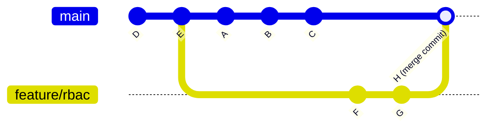
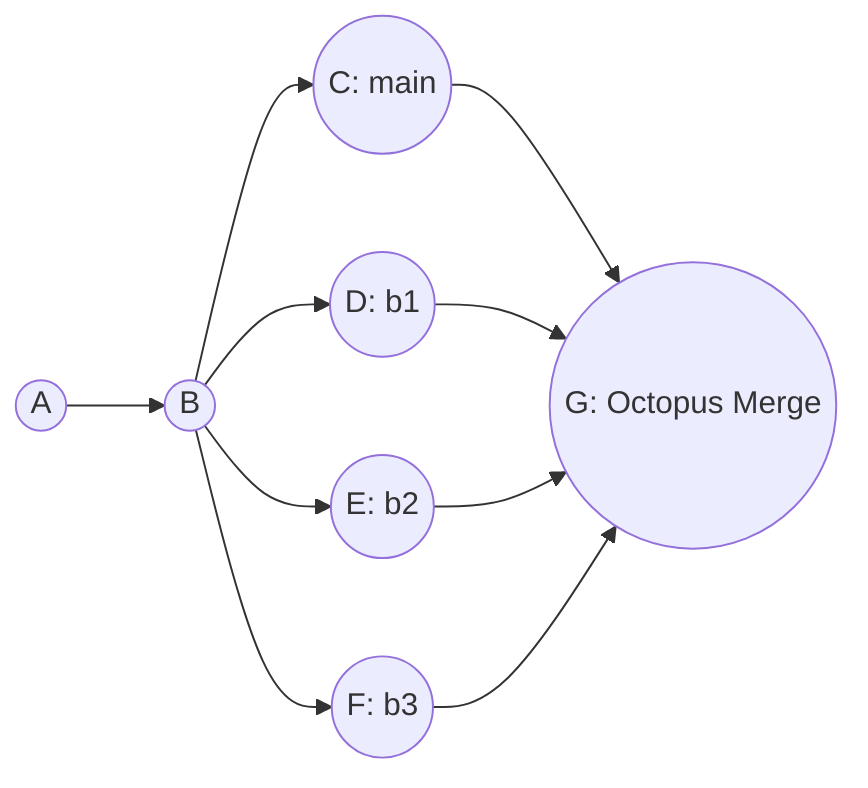

# Module 2: The Art of the Branch — Advanced Merging

## Learning Outcomes
- **Diagnose** the root cause of complex merge conflicts within Kubernetes manifest files by analyzing the merge base and divergent commit histories.
- **Implement** three-way and fast-forward merges strategically to maintain a clean, navigable project history.
- **Resolve** intricate multi-file conflicts during infrastructure-as-code integration without introducing YAML syntax errors or regression bugs.
- **Evaluate** different branching strategies (Trunk-based, GitFlow, GitHub Flow) to select the optimal workflow for a high-velocity Kubernetes platform team.
- **Execute** octopus merges to integrate multiple independent feature branches into a single integration or release branch simultaneously.
- **Compare** the internal diff algorithms of the modern `ort` and legacy `recursive` merge strategies to understand how Git handles file renames and complex tree integrations.

## Why This Module Matters

In 2012, Knight Capital Group, a major financial services firm, suffered one of the most catastrophic deployment failures in history, losing $460 million in just 45 minutes. The root cause was a disastrously managed configuration state and a repurposed deployment flag that activated dormant, eight-year-old testing code on one of their production servers. While Knight Capital's specific failure predated the widespread adoption of modern GitOps workflows, it vividly illustrates the exact class of catastrophic infrastructure drift that occurs when teams mismanage configuration merging, branching, and state synchronization. In a modern Kubernetes environment, Git is your deployment mechanism; an unresolvable branch or a botched merge is mathematically equivalent to manually pushing broken configuration directly to your production clusters.

In late 2022, a prominent fintech company experienced a similarly devastating deployment failure that took down their core payment processing API for over six hours. Two separate platform teams had been working on long-lived feature branches for months, modifying the exact same set of Kubernetes deployment manifests to introduce entirely different auto-scaling behaviors, liveness probes, and resource requests. Because the branches had been isolated from the mainline for so long, when the time finally came for the release, the resulting text-level merge conflict spanned hundreds of lines across dozens of critical YAML files. 

The engineer assigned to resolve the conflict, operating under immense release-day pressure and fatigue, accidentally accepted incoming changes that completely overwrote the liveness probe configurations while simultaneously corrupting the strict YAML indentation of the resource limits. The merged code passed a superficial peer review because the diff was simply too massive and noisy to parse effectively. Once deployed, the Kubernetes scheduler immediately began crash-looping the payment pods due to the malformed probes, while the cluster autoscaler went rogue based on the broken resource definitions. Merging branches in Git is never merely a mechanical process of combining text files; it is the delicate, high-stakes act of reconciling parallel timelines of human intent.

## Core Content

### The Geometry of Integration: Fast-Forward vs. Three-Way Merges

When you issue a `git merge` command, Git does not blindly smash files together line by line. Instead, it performs a rigorous geometric analysis of your repository's commit history graph to determine the safest mathematical way to integrate the disparate changes. Understanding this underlying geometry is the fundamental difference between dictating your project's history and being a victim of it.

#### The Fast-Forward Merge

Imagine you are laying bricks to build a straight wall. You stop to take a break. While you are resting, a colleague continues laying bricks starting exactly where you left off, continuing in the exact same straight line. When you return, integrating their new work into your view of the wall requires no complex decisions or architectural changes; you simply walk to the end of their newly laid bricks and consider that the new end of the wall. 

This conceptual model perfectly describes a **fast-forward merge**. It occurs when the current branch tip is a direct, linear ancestor of the branch you are attempting to merge. Git simply moves your current branch pointer forward to point to the exact same commit as the incoming branch. Because the history is entirely linear and hasn't diverged, no new "merge commit" is created.

```bash
# Setting up a fast-forward scenario
git init cluster-config
cd cluster-config
echo "apiVersion: v1" > config.yaml
git add config.yaml
git commit -m "Initialize cluster config"

# Create a new branch and add a commit
git checkout -b feature/add-metadata
echo "kind: ConfigMap" >> config.yaml
git commit -am "Add ConfigMap kind"

# Switch back to main and merge
git checkout main
git merge feature/add-metadata
```

Output of the merge:
```text
Updating a1b2c3d..e4f5g6h
Fast-forward
 config.yaml | 1 +
 1 file changed, 1 insertion(+)
```

Because the `main` branch had not diverged—meaning no new commits were added to `main` while the `feature/add-metadata` branch was being actively developed—Git simply moved the `main` pointer forward to catch up. 

If you want to force Git to create a merge commit anyway (often done to preserve the historical context that a specific feature branch existed at all), you can use the `git merge --no-ff` flag, which always creates a merge commit even when a fast-forward would be perfectly possible. Conversely, running `git merge --ff-only` succeeds only if a clean fast-forward is mathematically possible; otherwise, it exits immediately with a non-zero status and refuses to merge. It is also worth noting a specific edge case: a fast-forward merge is automatically suppressed, and Git behaves as if `--no-ff` was passed, when merging an annotated tag that is not stored within the standard `refs/tags/` hierarchy.

> **Pause and predict**: Before running `git log --oneline --graph` after this merge, sketch out what you think the history graph will look like. Will there be a fork and a merge commit? 
> 
> *Verification*: Because this was a fast-forward merge, `main` simply moved to the tip of `feature/add-metadata`. There is no fork and no merge commit. `git log --oneline --graph` will show a single straight line of commits ending with "Add ConfigMap kind".

#### The Three-Way Merge

Real-world platform development is rarely perfectly linear. While your colleague was extending the brick wall, you started building a completely parallel wall right next to it. Now, you need to architecturally connect them. A **three-way merge** happens when the history of the repository has fundamentally diverged. Both the current branch and the incoming branch share a common ancestor deep in the past, but both have advanced independently since that point.



To resolve this divergence algorithmically, Git looks at the common ancestor (commit `E`), compares it against your current state (`C`) to see exactly what you changed, and then compares the ancestor against the incoming state (`G`) to see exactly what they changed. Git then attempts to synthesize and apply both sets of changes to the baseline `E` simultaneously. If the modifications do not overlap on the exact same lines of code, Git successfully creates a new **merge commit** (represented as `H` in the diagram) that mathematically binds the two parallel timelines together.

> **Pause and predict**: What do you think happens if both branch `main` and branch `feature/rbac` modified the exact same `subjects` list in a RoleBinding manifest, but added different users? How will Git's three-way merge handle this specific scenario?

| Change Type | Branch A (main) vs Base | Branch B (feature) vs Base | Git's Action during Merge |
| :--- | :--- | :--- | :--- |
| File added | Not present | Added | File is added |
| File modified | Unchanged | Modified | Modification applied |
| File deleted | Deleted | Unchanged | File remains deleted |
| File modified | Modified (Line 10) | Modified (Line 50) | Both modifications applied |
| File modified | Modified (Line 20) | Modified (Line 20) | **CONFLICT** |

### Merge Bases, Strategies, and Git's Internal Engines

The true hidden genius of Git's architecture lies in exactly how it calculates and locates the merge base. When branch histories become deeply complex and intertwined with multiple cross-merges, finding the optimal common ancestor is a computationally difficult task. If you ever need to manually verify what commit Git currently considers the merge base before attempting a highly risky or widespread merge, you can invoke the calculation engine directly:

```bash
git merge-base main feature/ingress-update
```

The output of `git merge-base` is the single commit hash that represents the best common ancestor of the two branches, which Git uses as the starting point for its three-way merge calculation. Understanding exactly which commit acts as the base is critical when diagnosing why Git seems to be generating strange or counterintuitive conflicts.

> **Pause and predict**: Look at the following branch topology:
> ```mermaid
> gitGraph
>    commit id: "A"
>    commit id: "B"
>    branch feature/db
>    checkout main
>    commit id: "C"
>    commit id: "D"
>    checkout feature/db
>    commit id: "E"
>    commit id: "F"
>    branch feature/cache
>    checkout feature/cache
>    commit id: "G"
>    commit id: "H"
> ```
> If you are on `main` and run `git merge feature/cache`, which commit is the merge base? 
> 
> *Answer*: The merge base is commit `B`. To find it, trace backwards from `main` (commit D) and `feature/cache` (commit H) until their paths intersect. They first meet at `B`, making it the common ancestor used for the three-way merge.

Git provides six distinct, mathematically specialized merge strategies that govern how files are combined: `ort`, `recursive`, `resolve`, `octopus`, `ours`, and `subtree`. 

For standard two-branch merges, modern Git uses the `ort` strategy as the universal default. Standing for "Ostensibly Recursive's Twin", the `ort` strategy became the default in Git 2.34.0 (released in November 2021) and it defaults to using `diff-algorithm=histogram` internally. This algorithmic choice makes it significantly faster and vastly more accurate at handling massive file renames and complex directory restructurings across diverged branches. The `ort` backend entirely replaced the legacy `recursive` strategy, which was subsequently fully deprecated in Git 2.50.0 and now exists merely as a silent synonym and alias for `ort` to preserve backwards compatibility for old scripts.

The other available strategies serve highly specialized use cases. The `resolve` strategy uses a very traditional three-way merge algorithm but explicitly does NOT handle file renames, whereas `ort` detects and handles renames gracefully. The `ours` strategy (invoked via `git merge -s ours`) aggressively discards ALL changes from the other branch entirely—the resulting tree is always mathematically identical to the current branch's HEAD tree. It is crucial to understand that this is fundamentally different from the strategy option (invoked via `git merge -X ours`), which still performs a standard three-way merge but automatically favors the current branch's code only when resolving overlapping conflicting hunks.

#### The Resolution Process

When Git encounters overlapping changes that it cannot mathematically resolve, it halts the automated merge process. You must manually intervene. The manual resolution process follows five strict, sequential steps:

1. **Identify the Conflict:** Git stops the merge execution and marks the files as conflicted in the index. Run `git status` to see the exact list of files requiring your immediate attention.
2. **Locate the Markers:** Open the conflicted file in your text editor and search for the standard conflict markers: `<<<<<<<` (which marks the beginning of your current branch's changes), `=======` (the dividing line separating the two diverging realities), and `>>>>>>>` (which marks the end of the incoming branch's changes).
3. **Analyze the Divergence:** Carefully read the code within the markers. Understand exactly what the `HEAD` version was trying to accomplish architecturally versus what the incoming branch was attempting to do.
4. **Synthesize the Intent:** Delete the conflict markers entirely and manually edit the raw code so that both intended changes are combined harmoniously, ensuring you do not introduce YAML syntax errors or semantic logical bugs.
5. **Finalize the Resolution:** Save the file, run `git add <file>` to instruct Git that the conflict has been successfully resolved, and finally run `git commit` to securely finalize the overarching merge operation.

### Conflict Resolution in Infrastructure-as-Code: Multi-File Complexity

Conflicts are not compiler errors; they are simply Git pausing its execution to ask for human judgment because its mathematical models cannot safely guess developer intent. When a conflict occurs, Git's internal index becomes a highly complex, multi-dimensional workspace. During a three-way merge, Git physically stores up to three distinct versions of each conflicted file directly within the index structure: stage 1 (the common ancestor base), stage 2 (the current HEAD version), and stage 3 (the incoming MERGE_HEAD version). You can inspect these internal stages directly by running `git ls-files -u`. Furthermore, when using the modern `ort` merge strategy, Git intelligently writes an `AUTO_MERGE` reference pointing to a tree that exactly matches the current working tree content, complete with all the inline conflict markers.

Consider a complex real-world platform scenario. Team Alpha is working on branch `feature/ha-redis` to increase redundancy. Team Beta is simultaneously working on branch `feature/redis-auth` to lock down security. Both teams heavily modify the core `redis-deployment.yaml` and the overarching `kustomization.yaml` file that orchestrates the deployment logic.

Team Alpha's changes on `feature/ha-redis`:
```yaml
spec:
  replicas: 3
  template:
    spec:
      containers:
      - name: redis
        image: redis:7.0.11-alpine
```
```yaml
resources:
- redis-deployment.yaml
commonLabels:
  high-availability: "true"
```

Team Beta's divergent changes on `feature/redis-auth`:
```yaml
spec:
  replicas: 1
  template:
    spec:
      containers:
      - name: redis
        image: redis:7.0.11
        env:
        - name: REDIS_PASSWORD
          valueFrom:
            secretKeyRef:
              name: redis-secret
              key: password
```
```yaml
resources:
- redis-deployment.yaml
secretGenerator:
- name: redis-secret
  literals:
  - password=supersecret
```

When the lead platform engineer attempts to merge `feature/redis-auth` into `feature/ha-redis`, Git evaluates the text, detects the severe overlap, and violently halts the process across multiple files:

```bash
git checkout feature/ha-redis
git merge feature/redis-auth
# Auto-merging redis-deployment.yaml
# CONFLICT (content): Merge conflict in redis-deployment.yaml
# Auto-merging kustomization.yaml
# CONFLICT (content): Merge conflict in kustomization.yaml
# Automatic merge failed; fix conflicts and then commit the result.
```

If you panic upon seeing massive multi-file infrastructure conflicts, remember that running `git merge --abort` is functionally equivalent to running `git reset --merge` when a `MERGE_HEAD` is present. It will safely and immediately return your entire repository to the pristine pre-merge state. If you choose to proceed, you must synthesize the conflicting configurations accurately, ensuring no YAML structures are broken.

To successfully resolve this specific scenario, we must determine the desired outcome across all files: we want High Availability (replicas: 3) AND authentication (env vars). For the infrastructure to actually work, the Kustomization file must include BOTH the `commonLabels` AND the `secretGenerator` so that the `redis-secret` referenced in the deployment actually exists.

The correctly synthesized deployment configuration:
```yaml
spec:
  replicas: 3
  template:
    spec:
      containers:
      - name: redis
        image: redis:7.0.11-alpine
        env:
        - name: REDIS_PASSWORD
          valueFrom:
            secretKeyRef:
              name: redis-secret
              key: password
```

The correctly synthesized kustomization configuration:
```yaml
resources:
- redis-deployment.yaml
commonLabels:
  high-availability: "true"
secretGenerator:
- name: redis-secret
  literals:
  - password=supersecret
```

Always comprehensively validate the structural integrity of your infrastructure-as-code files before committing the final resolution. Once verified, add both files to the index and commit to finalize the complex multi-file merge.

After finalizing a complex merge, you or a reviewer may need to isolate and review only the specific manual conflict resolutions you made, without the noise of unrelated feature changes. You can achieve this by inspecting the merge commit with `git show <merge-commit-hash>`, which displays a specialized "combined diff" that intelligently filters the output to highlight only the lines modified differently from both parent branches.

```bash
# We will use 'k' as an alias for kubectl going forward
alias k=kubectl
kustomize build . | k apply -f - --dry-run=client

# If successful:
git add redis-deployment.yaml kustomization.yaml
git commit -m "Merge redis-auth, resolving multi-file replicas, image, and secret generator conflicts"
```

**War Story:** A junior DevOps engineer once attempted to resolve a shockingly similar multi-file conflict. They perfectly fixed the core Deployment YAML file manually but, feeling overwhelmed, accidentally ran `git checkout --ours kustomization.yaml` to blindly bypass the second, more confusing conflict. Git accepted this command and completed the merge. As a result, the Deployment strictly expected a password secret that the Kustomization file was no longer generating. The Redis pods crash-looped instantly upon deployment in production, causing a complete and total loss of cache availability for the entire user base. You must always resolve and thoroughly validate multi-file infrastructure conflicts holistically.

To aid in visualizing these complex situations, you can utilize `git mergetool`, which launches a specialized external visual diffing tool presenting the BASE, LOCAL, and REMOTE versions side-by-side, and then automatically writes your final resolved result directly to the MERGED file. You can also significantly alter how Git presents conflicts natively in your editor. Three distinct merge conflict styles are available via the `merge.conflictStyle` configuration: `merge` (the default, showing only the two diverging sides), `diff3` (which adds a `|||||||` block showing the original ancestor code to provide critical context on *why* the conflict happened), and `zdiff3` (which is functionally identical to diff3 but aggressively trims matching, unchanged lines from the outer edges of the conflict block to reduce visual noise). The highly efficient `zdiff3` conflict style was introduced in Git 2.35.0.

If your team constantly encounters the exact same identical conflicts repeatedly due to long-lived branches, Git's `rerere` (Reuse Recorded Resolution) feature is an absolute lifesaver. It is globally enabled by setting the configuration `rerere.enabled = true`. When enabled, Git mathematically fingerprints the conflict and observes your manual resolution, storing the mapping in a hidden cache. If that exact conflict ever arises again during a future merge or rebase, Git automatically applies your previous resolution without halting.

### The Auto-Merge Phenomenon: A Historical Case Study

To deeply understand how Git's context windows operate, it is highly instructive to look at a legacy exercise. In earlier versions of this course, students were given the following exact sequence of commands to intentionally create a merge conflict.

Step 1: Setup
```bash
mkdir k8s-merge-lab && cd k8s-merge-lab
git init --initial-branch=main
alias k=kubectl
```
```yaml
apiVersion: apps/v1
kind: Deployment
metadata:
  name: api-server
spec:
  replicas: 2
  template:
    spec:
      containers:
      - name: api
        image: nginx:1.30
```
```bash
git add deployment.yaml
git commit -m "chore: initial api deployment"
```

Step 2: Creating the diverging branches
```bash
git checkout -b feature/scale-up
sed -i.bak 's/replicas: 2/replicas: 5/g' deployment.yaml && rm deployment.yaml.bak
git add deployment.yaml
git commit -m "feat: scale api to 5 replicas"
```
```bash
git checkout main
git checkout -b feature/update-image
sed -i.bak 's/image: nginx:1.30/image: nginx:1.34/g' deployment.yaml && rm deployment.yaml.bak
git add deployment.yaml
git commit -m "chore: update nginx to 1.34"
```

Step 3: Executing the merge
```bash
git checkout feature/scale-up
git merge feature/update-image
# Output will show CONFLICT (content)
```

The strict pedagogical expectation was that this sequence would produce the following dramatic conflict markers in the file:
```text
apiVersion: apps/v1
kind: Deployment
metadata:
  name: api-server
spec:
<<<<<<< HEAD
  replicas: 5
  template:
    spec:
      containers:
      - name: api
        image: nginx:1.30
=======
  replicas: 2
  template:
    spec:
      containers:
      - name: api
        image: nginx:1.34
>>>>>>> feature/update-image
```

Which the student would then manually resolve to this final state:
```yaml
apiVersion: apps/v1
kind: Deployment
metadata:
  name: api-server
spec:
  replicas: 5
  template:
    spec:
      containers:
      - name: api
        image: nginx:1.34
```

And validate before committing:
```bash
k apply -f deployment.yaml --dry-run=client
# Expect output: deployment.apps/api-server created (dry run)
```
```bash
git add deployment.yaml
git commit -m "Merge branch 'feature/update-image' into feature/scale-up resolving replicas and image"
```

And the legacy solution key provided to students looked exactly like this:
<details>
<summary>View Solutions</summary>

**Task 1: Create the Scale Branch**
```bash
git checkout -b feature/scale-up
sed -i.bak 's/replicas: 2/replicas: 5/g' deployment.yaml && rm deployment.yaml.bak
git add deployment.yaml
git commit -m "feat: scale api to 5 replicas"
```

**Task 2: Create the Image Update Branch**
```bash
git checkout main
git checkout -b feature/update-image
sed -i.bak 's/image: nginx:1.30/image: nginx:1.34/g' deployment.yaml && rm deployment.yaml.bak
git add deployment.yaml
git commit -m "chore: update nginx to 1.34"
```

**Task 3: Trigger the Conflict**
```bash
git checkout feature/scale-up
git merge feature/update-image
# Output will show CONFLICT (content)
```

**Task 4: Resolve the Conflict**
Open `deployment.yaml` in your editor. It will look similar to this:
```text
apiVersion: apps/v1
kind: Deployment
metadata:
  name: api-server
spec:
<<<<<<< HEAD
  replicas: 5
  template:
    spec:
      containers:
      - name: api
        image: nginx:1.30
=======
  replicas: 2
  template:
    spec:
      containers:
      - name: api
        image: nginx:1.34
>>>>>>> feature/update-image
```

Edit the file to remove markers and combine the desired state:
```yaml
apiVersion: apps/v1
kind: Deployment
metadata:
  name: api-server
spec:
  replicas: 5
  template:
    spec:
      containers:
      - name: api
        image: nginx:1.34
```

**Task 5: Validate the YAML**
```bash
k apply -f deployment.yaml --dry-run=client
# Expect output: deployment.apps/api-server created (dry run)
```

**Task 6: Finalize the Merge**
```bash
git add deployment.yaml
git commit -m "Merge branch 'feature/update-image' into feature/scale-up resolving replicas and image"
```

</details>

However, if you attempt to run this legacy exercise today using a modern Git version equipped with the highly optimized `ort` strategy, it seamlessly auto-merges without generating any conflict whatsoever. This fascinating phenomenon occurs because the modifications to `replicas` (line 6) and `image` (line 12) are separated by exactly five unchanged lines. This gap provides Git's internal algorithms with just enough unambiguous textual context to safely apply both discrete hunks independently. The "overlapping context illusion" in older tutorials often fails to account for the increasing sophistication of modern Git diff engines.

### The Octopus Merge: Taming Multiple Branches

Occasionally, a Kubernetes platform team needs to orchestrate a massive integration of several entirely independent feature branches into a final release candidate branch all at the exact same time. Attempting to do this sequentially through a long chain of individual two-branch merges creates an unnecessarily messy, stair-stepped history. Git provides the powerful `octopus` strategy specifically for this scenario. It is automatically selected as the default strategy when you instruct Git to merge more than two branches simultaneously.



```bash
git checkout release-v1.30
git merge feature/ingress feature/autoscaling feature/network-policies
```

> **Pause and predict**: What do you think happens if Git successfully merges `feature/ingress` and `feature/autoscaling`, but then detects a complex conflict when attempting to merge `feature/network-policies`? Will it pause and ask you to resolve it like a standard three-way merge?

**The All-or-Nothing Rule:** Unlike a standard two-branch three-way merge which politely pauses mid-flight and leaves interactive conflict markers directly in your working directory, an octopus merge is an inherently brittle operation. It will categorically refuse to complete and will immediately abort the entire transaction if it encounters *any* conflict requiring manual resolution across any of the branches involved.

> **Stop and think**: If an octopus merge fails due to a conflict between `feature/autoscaling` and `feature/network-policies`, which approach would you choose:
> A) Abandon the octopus merge entirely and merge all three sequentially.
> B) Merge the two conflicting branches into each other first, resolve the conflict, and then retry the octopus merge with the updated branches.
> Why is your chosen approach safer for maintaining a clean history?

### Advanced History Rewriting and Cherry-Picking

Before integrating branches, many high-performing platform teams require developers to surgically clean up their messy, WIP-filled commit histories. 

The `git rebase --interactive` command is the ultimate tool for historical surgery. It supports a wide array of powerful commit-editing commands, including `pick`, `edit`, `reword` (to change a message without altering code), `drop` (to erase a commit entirely), `squash` (to meld a commit into the previous one while combining messages), `fixup`, `fixup -c/-C`, `break`, and `exec` (which runs a shell script against every commit to ensure tests pass). By default, `git rebase --interactive` strictly excludes merge commits from the generated todo list to flatten the history.

Additionally, you can use `git rebase --onto <newbase>` to physically transplant a sequence of commits onto a completely different base than their original upstream, allowing a topic branch to be detached and moved to a different parent entirely.

When practicing Trunk-Based Development, if your push to the remote trunk is rejected because it contains new work, you can safely integrate those remote changes without creating unnecessary merge commits by running `git pull --rebase origin main`. This fetches the remote changes and replays your local work cleanly on top of them.

If you only need to integrate a single, highly specific commit from another divergent branch without merging the whole timeline, use `git cherry-pick`. Running `git cherry-pick -x` automatically appends a highly useful '(cherry picked from commit ...)' traceability line directly to the commit message. Running `git cherry-pick -n` (or `--no-commit`) applies the underlying changes to the working tree and index without actually creating a new commit, allowing you to manually tweak the code before committing.

Another powerful mechanism is `git merge --squash`. This command executes the integration logic of a merge but deliberately does not create a commit and does not record the `MERGE_HEAD` pointer, leaving the heavily combined result purely staged in your index for a subsequent, manually crafted mega-commit.

To effectively audit how merges have structurally impacted your repository over time, you can query the timeline using `git log --merges` (which prints only merge commits and is functionally equivalent to passing `--min-parents=2`) or use `git log --no-merges` (which completely excludes all merge commits and is equivalent to passing `--max-parents=1`).

### Branching Strategies & Platform Configurations

A Git merge strategy is ultimately only as effective as the overarching human branching model that dictates precisely when, where, and how often merges happen. Different models solve entirely different organizational scaling problems.

> **Stop and think**: Imagine you are advising a new platform team. They have 12 engineers, deploy to production twice a week, and have automated test coverage but it sometimes produces false positives. Which branching strategy would you recommend and why? Keep your answer in mind as you read the following models.

#### 1. GitFlow: The Legacy Enterprise Model
GitFlow relies on extreme isolation and long-lived timelines. It maintains an eternal `main` branch (which represents the exact state of production) and a parallel `develop` branch (used for continuous integration). Features exclusively branch off `develop` and must merge back into it. When a release is triggered, release branches fork off `develop`, undergo manual QA stabilization, and finally merge to both `main` and `develop`.

- **Pros:** Provides extremely rigid, explicit, and gated phases for manual QA testing and pre-release stabilization.
- **Cons:** Inevitably produces catastrophic "merge hell." Feature branches live far too long and drift from reality. It is fundamentally incompatible with true Continuous Integration and Continuous Deployment (CI/CD) principles, as functional code sits rotting unintegrated for weeks.

#### 2. GitHub Flow: The Web Application Standard
In this model, absolutely everything branches directly off `main`. When a feature is ready for integration, a developer opens a formal Pull Request against `main`. Once it is thoroughly reviewed and passes all automated tests, it merges seamlessly back into `main` and is deployed to production immediately.

- **Pros:** Exceedingly simple, aggressively encourages small, short-lived branches, and is architecturally perfect for rapid CI/CD pipelines.
- **Cons:** Requires completely infallible, rigorous automated testing. If your pipeline isn't rock-solid, a bad merge will break the production cluster instantly.

#### 3. Trunk-Based Development: The Elite Standard
This is the defining characteristic of high-performing, elite DevOps teams. Developers commit and push their raw code directly into `main` (the trunk) multiple times a single day. Divergent branches are either entirely non-existent or are strictly engineered to last only a few hours at most.


- **Pros:** Mathematically eliminates merge hell entirely. Integration is truly continuous. Forces the implementation of extensive feature flags to dynamically hide incomplete features in production.
- **Cons:** Possesses an extremely high barrier to entry. Requires ultra-advanced testing, a sophisticated feature flagging architecture, and ruthless team discipline.

For modern Kubernetes platform teams building critical internal platforms via GitOps (like ArgoCD or Flux), **Trunk-Based Development** is the absolute gold standard. Long-lived feature branches containing infrastructure changes inevitably rot, because the underlying cluster's live state continually evolves out from under them. 

#### Platform Merge Methods

To strictly enforce these various strategies, modern platforms offer highly configurable merge restrictions at the repository level. 

GitHub offers three distinct pull request merge methods: 'Create a merge commit' (which forces `--no-ff`), 'Squash and merge', and 'Rebase and merge'. It is critical to understand that GitHub's 'Rebase and merge' feature does not operate exactly like a local rebase; it always aggressively updates the committer information and creates entirely new commit SHAs, which can confuse local clients if not managed properly.

GitLab similarly offers three formal merge request methods: 'Merge commit' (the `--no-ff` equivalent), 'Merge commit with semi-linear history', and 'Fast-forward merge'. As platforms evolve to enforce Trunk-based principles more heavily, they introduce new guardrails; for example, GitLab added a highly requested automatic rebase before merge feature for both the semi-linear and fast-forward methods starting in GitLab 18.0.

## Did You Know?

1. Git 2.53.0 is the current stable release as of April 2026, with the 2.54.0-rc1 candidate tagged precisely on April 8, 2026.
2. The `ort` merge strategy (Ostensibly Recursive's Twin) was introduced in Git 2.33 to mathematically process large renames up to 500x faster. It officially became the default engine for all two-branch merges in Git 2.34.0 (November 2021) and defaults to using the highly optimized `diff-algorithm=histogram` internally.
3. Running the maintenance command `git rerere gc` systematically prunes unresolved conflict records that are older than 15 days, and clears out successfully resolved records older than 60 days, preventing cache bloat.
4. GitLab officially added a powerful automatic rebase before merge feature for semi-linear and fast-forward repository methods beginning in the major GitLab 18.0 release.
5. Linus Torvalds originally designed Git's octopus merge specifically because he grew frustrated merging dozens of separate Linux kernel subsystem maintainer branches sequentially.
6. The conflict marker symbols (`<<<<<<<`, `=======`, `>>>>>>>`) predate Git by decades. They were established by the `merge` program developed at Bell Labs in the late 1980s for the RCS version control system.
7. Git allows you to configure specific merge drivers for different file types via `.gitattributes`. You could theoretically write a custom merge driver specifically designed to intelligently merge Kubernetes YAML files without breaking indentation, though maintaining it is notoriously difficult.

## Common Mistakes

| Mistake | Why It Happens | How to Fix It |
| :--- | :--- | :--- |
| **Panic committing unresolved markers** | Engineer feels overwhelmed, attempts to save work mid-conflict by running `git commit -a`, thereby committing `<<<<<<<` directly into the codebase. | Run `git merge --abort` immediately to reset the working directory to the pre-merge state, take a breath, and start over. |
| **Breaking YAML indentation** | Manually deleting conflict markers and inadvertently shifting blocks of YAML, creating invalid structural relationships. | Always use `kubectl diff` or `kubectl apply --dry-run=client` on the modified file before finalizing the merge commit. |
| **"Ostrich merging" (ignoring upstream)** | Keeping a feature branch alive for 6 weeks without pulling from main, resulting in a monolithic, unresolvable conflict later. | Merge `main` into your feature branch (or rebase against it) daily. Conflict resolution should be a continuous, small-scale tax, not a massive end-of-project penalty. |
| **Resolving logic, breaking syntax** | Focusing so hard on getting both sets of configuration into the file that you create duplicate keys (e.g., two `spec` blocks in a pod definition). | Understand the schema of the file you are editing. Use IDE plugins with Kubernetes schema validation enabled during conflict resolution. |
| **Accidental "Evil Merges"** | While resolving a conflict, the engineer sneaks in an unrelated fix or typo correction that was not part of either branch. | A merge commit should *only* contain the resolution of the conflict. Make unrelated fixes in a separate, discrete commit afterward. |
| **Deleting the wrong side** | Misunderstanding `HEAD` vs the incoming branch, and blindly choosing "Accept Current Change" when the incoming branch contained critical security patches. | Read the code inside the markers. Never trust automated UI buttons in IDEs without verifying what exact lines will survive the merge. |

> **Stop and think**: Review the mistakes in the table above. Which of these would cause the most catastrophic failure in your current team's specific context? Rank them by potential severity based on your deployment pipeline's safeguards (or lack thereof).

## Quiz

<details>
<summary>Question 1: Your team is practicing Trunk-Based Development. You have been working on a new Kubernetes network policy for about 4 hours on a local branch. When you attempt to push to main, Git rejects it, stating the remote contains work you do not have. What is the safest sequence of actions to integrate your work?</summary>
To safely integrate your work without creating a messy history, you should fetch the remote changes and perform a rebase by running `git pull --rebase origin main`. This command first fetches the new commits from the remote `main` branch and temporarily rewinds your local network policy commits. It then applies the incoming commits from your team, and finally replays your 4 hours of work on top of the newly updated history. Doing this maintains a strictly linear and clean project history, which is critical in Trunk-Based Development to avoid unnecessary and confusing merge commits for short-lived local changes.
</details>

<details>
<summary>Question 2: You trigger an automated pipeline that attempts an octopus merge, integrating four different microservice deployment updates into a staging branch. Git halts and reports a conflict between two of the branches. What happens to the staging branch in this exact moment, and how is the pipeline affected?</summary>
In this exact moment, nothing happens to the staging branch because an octopus merge is an all-or-nothing operation designed for independent branches. Unlike a standard two-branch merge that pauses mid-flight and leaves conflict markers in your working directory, Git will completely abort the octopus merge automatically upon detecting any conflict. It immediately resets your working directory and staging branch back to their exact pre-merge state. This built-in safety mechanism is highly beneficial for automated pipelines, as it prevents CI/CD systems from becoming trapped in complex, multi-dimensional conflict states that require manual human intervention.
</details>

<details>
<summary>Question 3: A junior engineer just resolved a massive 500-line multi-file conflict involving a StatefulSet and a ConfigMap, and you need to review their work. Looking at the standard full file diff is overwhelming and includes unrelated changes. How can you, as a reviewer, isolate and view *only* the specific manual conflict resolutions the engineer made?</summary>
You can isolate the manual conflict resolutions by inspecting the merge commit itself using the `git show <merge-commit-hash>` command. When you run this on a merge commit, Git displays a specialized "combined diff" instead of a standard linear diff. This combined diff intelligently filters the output to only show the specific lines that were modified differently from *both* parent branches, highlighting exactly where the engineer's manual resolution deviated from what Git's automatic merge would have attempted. This provides the precise, surgical view required to audit complex manual conflict resolutions without being drowned in the noise of unrelated feature changes.
</details>

<details>
<summary>Question 4: An incident occurs in production because a `ConfigMap` update was inexplicably lost during a recent deployment. Looking at the Git history, you see a merge commit connecting a feature branch to main. The file changed on both branches, but the feature branch's changes are completely missing in the final merge commit. What likely happened during the conflict resolution?</summary>
The engineer performing the merge likely encountered a complex conflict within the `ConfigMap`, became overwhelmed, and mistakenly opted to completely overwrite the incoming changes. They probably used a command like `git checkout --ours configmap.yaml` or blindly clicked "Accept Current Changes" in their IDE's conflict resolution interface. By doing so, they entirely discarded the valid configuration updates from the feature branch while keeping their own, and then finalized the merge commit without realizing the loss of data. This scenario underscores exactly why a visual inspection and validation of the final merged files (such as using `kubectl diff`) is absolutely mandatory before committing a resolved conflict.
</details>

<details>
<summary>Question 5: Your organization is adopting GitOps with ArgoCD to manage Kubernetes clusters, but the QA team insists on keeping the legacy GitFlow branching model with long-lived `develop` and release branches. Why will this combination inevitably lead to deployment failures and configuration drift?</summary>
This combination will fail because GitFlow isolates infrastructure changes in long-lived branches for extended periods, which fundamentally violates the core philosophy of GitOps. In a proper GitOps architecture, the main branch of the Git repository must serve as the absolute, real-time source of truth for the cluster's state. When changes sit unmerged in a `develop` branch for weeks, the actual cluster state inevitably drifts as other hotfixes or updates are applied directly to the mainline. This severe divergence makes rapid, predictable iteration impossible and practically guarantees massive, unresolvable merge conflicts when the long-lived branches are finally integrated.
</details>

<details>
<summary>Question 6: You are tasked with taking over a legacy `feature/database-migration` branch that was abandoned by a former employee. Before attempting to integrate it, you run `git merge-base main feature/database-migration` and it returns a commit hash from 8 months ago. What does this immediately tell you about the risk profile of this impending merge, and how should you proceed?</summary>
The exceptionally old merge base immediately tells you that the risk profile for this integration is critically high, as the mathematical distance between the two branches almost guarantees massive, systemic conflicts. Because the feature branch has been completely isolated from the mainline for 8 months, the semantic logic and underlying architecture of the project have likely evolved significantly, rendering the old code incompatible even if it merges cleanly at a text level. Instead of attempting a direct three-way merge, you should abandon that approach and deeply analyze the legacy branch's intent. The safest path forward is to either cherry-pick the relevant functional commits or rebuild the migration logic from scratch against the modern trunk.
</details>

## Hands-On Exercise

In this redesigned exercise, you will intentionally force a genuine, unavoidable three-way conflict within a Kubernetes deployment manifest by modifying the exact same line of code in two divergent branches. You will then manually resolve the conflict, ensure structural YAML integrity, and completely validate the result.

### Setup Instructions

1. **Initialize the Cluster Repository:** Create a fresh Git repository and initialize a baseline manifest containing a specific Redis image version.
   ```bash
   mkdir k8s-true-conflict-lab && cd k8s-true-conflict-lab
   git init --initial-branch=main
   alias k=kubectl
   ```

2. **Create the Baseline Manifest:** We will place our target collision point directly on the `image` declaration.
   ```bash
   cat << 'EOF' > deployment.yaml
   apiVersion: apps/v1
   kind: Deployment
   metadata:
     name: cache-server
   spec:
     replicas: 1
     selector:
       matchLabels:
         app: cache
     template:
       metadata:
         labels:
           app: cache
       spec:
         containers:
         - name: redis
           image: redis:7.0
   EOF
   ```

3. **Commit the Baseline:**
   ```bash
   git add deployment.yaml
   git commit -m "chore: initial cache deployment with redis 7.0"
   ```

### Tasks

1. **Create the Alpine Branch:** Create a branch named `feature/redis-alpine`. Modify the `image` exactly on line 17 to `redis:7.0-alpine` and commit the change.
2. **Create the Debian Branch:** Switch back to `main`. Create a new divergent branch named `feature/redis-debian`. Modify the exact same `image` line to `redis:7.0-debian` and commit the change. Run a checkpoint verification: `git log --oneline --all --graph` to confirm the two divergent branches exist before proceeding.
3. **Force the Collision:** Switch back to the `feature/redis-alpine` branch. Attempt to merge the `feature/redis-debian` branch into your current workspace. You will now experience a genuine `CONFLICT (content)`.
4. **Resolve the Conflict:** Open `deployment.yaml`. You will see the standard Git conflict markers highlighting the exact line collision. Manually resolve the file so that the final state utilizes the `redis:7.0-alpine` image, discarding the debian variant entirely.
5. **Validate the YAML:** Use the Kubernetes client dry-run feature (`k apply -f deployment.yaml --dry-run=client`) to meticulously ensure your resolved YAML is valid before committing.
6. **Finalize the Merge:** Add the thoroughly resolved file to the index and finalize the merge commit.

### Solutions and Success Criteria

<details>
<summary>View Lab Solutions</summary>

**Task 1: Create the Alpine Branch**
```bash
git checkout -b feature/redis-alpine
sed -i.bak 's/image: redis:7.0/image: redis:7.0-alpine/g' deployment.yaml && rm deployment.yaml.bak
git add deployment.yaml
git commit -m "feat: switch cache to alpine variant"
```

**Task 2: Create the Debian Branch**
```bash
git checkout main
git checkout -b feature/redis-debian
sed -i.bak 's/image: redis:7.0/image: redis:7.0-debian/g' deployment.yaml && rm deployment.yaml.bak
git add deployment.yaml
git commit -m "feat: switch cache to debian variant"
git log --oneline --all --graph
```

**Task 3: Force the Collision**
```bash
git checkout feature/redis-alpine
git merge feature/redis-debian
# Output will definitively show CONFLICT (content) in deployment.yaml
```

**Task 4: Resolve the Conflict**
Open `deployment.yaml` in your text editor. It will forcefully display the textual collision on the exact same line:
```text
apiVersion: apps/v1
kind: Deployment
metadata:
  name: cache-server
spec:
  replicas: 1
  selector:
    matchLabels:
      app: cache
  template:
    metadata:
      labels:
        app: cache
    spec:
      containers:
      - name: redis
<<<<<<< HEAD
        image: redis:7.0-alpine
=======
        image: redis:7.0-debian
>>>>>>> feature/redis-debian
```

Edit the file to completely remove the Git markers and firmly establish the desired Alpine state:
```yaml
apiVersion: apps/v1
kind: Deployment
metadata:
  name: cache-server
spec:
  replicas: 1
  selector:
    matchLabels:
      app: cache
  template:
    metadata:
      labels:
        app: cache
    spec:
      containers:
      - name: redis
        image: redis:7.0-alpine
```

**Task 5: Validate the YAML**
```bash
k apply -f deployment.yaml --dry-run=client
# Expect output: deployment.apps/cache-server created (dry run)
```

**Task 6: Finalize the Merge**
```bash
git add deployment.yaml
git commit -m "Merge branch 'feature/redis-debian' into feature/redis-alpine resolving image collision"
```

</details>

**Success Criteria:**
- [ ] Running `git log --graph --oneline` clearly displays a divergent branching path that successfully converges with a formalized merge commit.
- [ ] Running `cat deployment.yaml` shows absolutely no `<<<<<<<` conflict markers remaining.
- [ ] The file contains the precise configuration `image: redis:7.0-alpine` on line 17.
- [ ] The YAML structural indentation is perfectly aligned according to standard Kubernetes specifications (2 spaces per level).
- [ ] Executing `kubectl apply -f deployment.yaml --dry-run=client` reports an unmitigated success.

## Next Module

Ready to dive deeper into the mutable history of your infrastructure and learn how to bend timelines to your will? Proceed to [Module 3: History as a Choice](../module-3-interactive-rebasing/) to discover exactly how to wield the immense power of the interactive rebase, effectively allowing you to surgically alter and perfect Git timelines before they are ever submitted for integration.