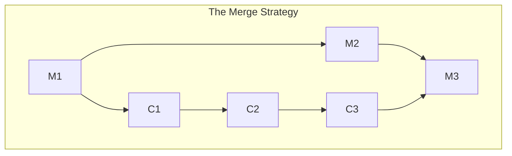
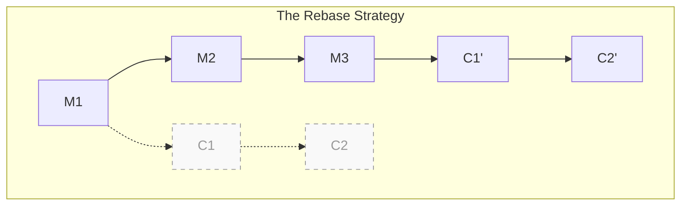
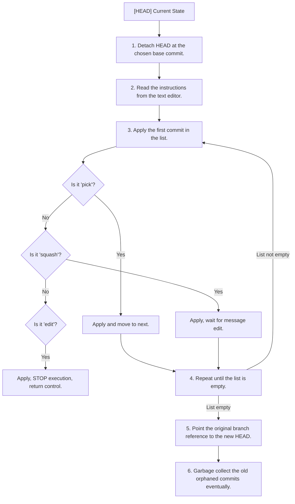
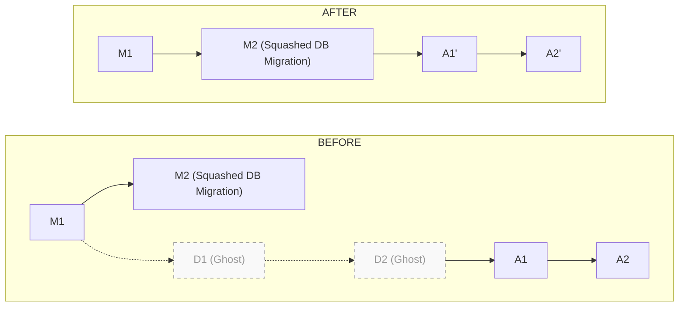
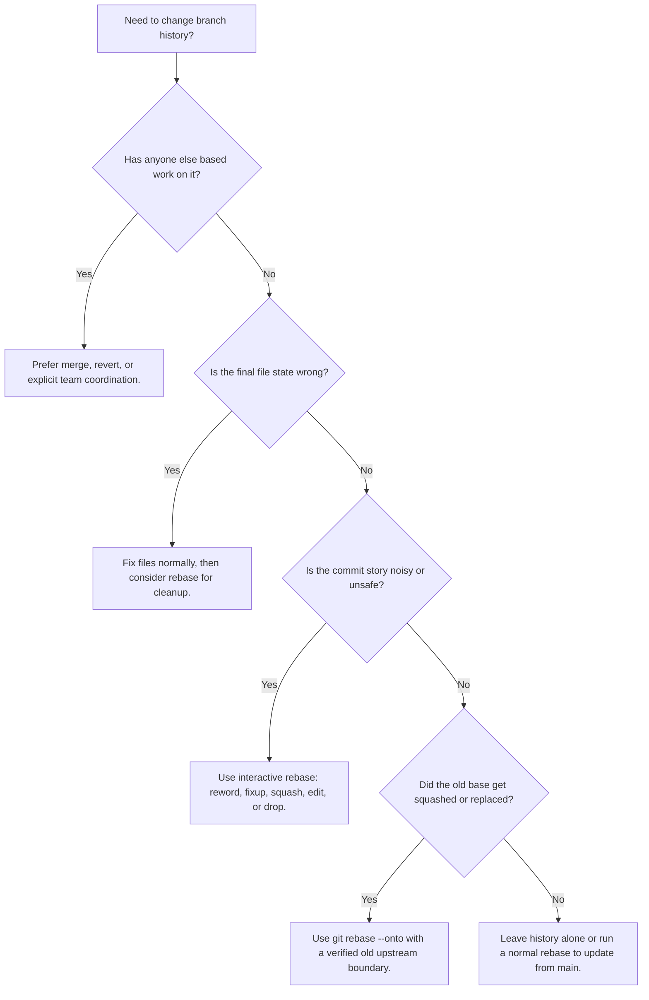

# Module 3: History as a Choice — Interactive Rebasing

**Complexity**: [MEDIUM]
**Time to Complete**: 90 minutes
**Prerequisites**: Module 2 of Git Deep Dive

## Learning Outcomes

- Reconstruct fragmented commit history into a logical narrative using interactive rebase operations such as squash, reword, fixup, drop, and edit.
- Diagnose and resolve iterative rebase conflicts without creating duplicate commits or breaking the rebase sequence.
- Formulate a safe strategy for removing accidentally committed sensitive data from an unpublished branch's permanent history.
- Compare and evaluate merging, rebasing, and `git rebase --onto` when synchronizing feature work with upstream branches.
- Implement a branch transplant that moves active work away from obsolete base commits after a squash merge.

## Why This Module Matters

An infrastructure engineer at a mid-sized e-commerce platform was migrating a legacy authentication service onto Kubernetes 1.35+ while also preparing a pull request for a platform team review. For local testing, they added a `configmap.yaml` file and temporarily placed an AWS IAM access key with broad database permissions into the file. The key was removed three commits later, the final manifest used a Secret reference, and the pull request looked clean in the web interface. Two weeks after the branch merged, a credential scanner found the original historical commit, attackers used the exposed key to launch expensive compute in several regions, and the team spent the weekend containing a cloud bill of about eighty thousand dollars.

The engineer made a common but dangerous assumption: deleting a line and committing the deletion does not erase the line from the branch's earlier commits. Git stores snapshots connected by immutable object identifiers, so the final tree can be correct while the old history still carries a secret, a broken manifest, or a misleading explanation of why a change exists. Reviewers also pay for messy history even when no secret is involved. A pull request made of "WIP", "fix tests", and "try again" commits forces every future maintainer to reconstruct the author's thinking from noise instead of reading a small sequence of purposeful changes.

Interactive rebasing is the editorial tool that closes that gap between how people develop and how teams review. You still commit early while exploring, because local commits are useful checkpoints. Before sharing the branch, however, you can rewrite those checkpoints into a durable narrative: one commit introduces the Deployment with probes, another adds service routing and configuration, and no commit ever contains the discarded password. This module teaches the mechanics, the safety boundaries, and the decision-making needed to rewrite local history without confusing collaborators or losing work.

## The Philosophy of History Rewriting

Git encourages frequent local commits because they create reliable save points during uncertain work. That local stream of consciousness is often the right way to solve a problem: you try one readiness probe, discover the container starts slowly, adjust the threshold, and commit again before touching service routing. The reviewer needs something different. They need to see the final argument for the change, not every stumble on the way there, because history becomes documentation once a branch leaves your machine.

That difference is why rebasing feels more like editing a technical design document than running a synchronization command. A first draft contains paragraphs that repeat themselves, notes that belong in another section, and sentences that are true but distracting. A polished draft preserves the real decisions while removing noise. Interactive rebase does the same for commits by letting you reorder related changes, combine fixups into their parent commits, reword vague messages, drop abandoned experiments, and pause at historical commits that need content changes.

Rewriting history works by creating new commits rather than changing old commits in place. A commit's SHA is derived from its content, metadata, parent reference, author data, and message, so even a message-only change produces a different identifier. The old commit usually remains reachable through the reflog for a while, but the branch name moves to the newly created sequence. That detail matters because two developers who share an old sequence and a rewritten sequence are no longer looking at the same lineage, even if the final files appear identical.

The Golden Rule follows directly from that model: never rebase commits that other people already depend on unless the team deliberately coordinates the rewrite. A private feature branch is your notebook, and interactive rebase is fair game. A shared integration branch is a public record, and force-pushing rewritten commits makes everyone else's local clones point at abandoned history. When in doubt, ask whether another person, CI system, release process, or deployment automation could have based work on the current branch tip; if the answer is yes, prefer a merge or a revert unless you have explicit agreement.

Pause and predict: if a branch contains five unpublished commits and you reword only the oldest commit message, how many commit SHAs after that point should you expect to change? The answer is all five, because every later commit names the rewritten commit as an ancestor, directly or indirectly. That cascading effect is the reason a small local edit can be safe before sharing and disruptive after sharing.

## Merging, Rebasing, and the Shape of Review

When a feature branch falls behind `main`, Git gives you two ordinary ways to integrate upstream changes. A merge preserves the exact historical topology by creating a new commit with two parents. That is valuable when you need an auditable record of when two lines of development were joined, especially on long-lived release branches or shared integration branches. The cost is that repeated merges can create a graph full of diamonds, making it harder to answer simple questions such as "which commit introduced this regression?"



A rebase takes the commits that are unique to your branch, temporarily sets them aside, advances the branch base to the target commit, and replays your work one commit at a time. The result is a linear history where your feature appears to have started from the current `main`. That shape makes `git log`, `git bisect`, release note generation, and code review easier because each commit can be inspected without detouring through merge commits that only synchronize branches.



The tradeoff is that rebasing converts a historical fact into a reviewed story. The original chronological order may have been "ConfigMap, Deployment, service, fix Deployment", while the reviewed order should probably be "Deployment, service, configuration". That is acceptable when the branch is private because no one else has relied on the discarded chronology. It is not acceptable when the branch has become a collaboration point, because the rewritten commits will not match the commits your teammates have already fetched.

In Kubernetes work, this distinction is especially practical. A reviewer looking at a Deployment commit wants to evaluate selectors, labels, probes, resources, and rollout behavior as one coherent unit. If the liveness probe lands three commits later with a message like "fix stuff", the reviewer has to jump through history to decide whether the Deployment was ever intentionally incomplete. Before running Kubernetes examples in this module, define the conventional shortcut `alias k=kubectl`; after that, commands like `k apply -f deployment.yaml` and `k get deploy web-app` refer to the same `kubectl` client, targeting Kubernetes 1.35+ clusters.

Pause and predict: what do you think happens if a merge conflict occurs during a rebase? It does not wait until the end like a single final reconciliation. Because Git replays commits one by one, it can pause on the first conflicting commit, ask you to resolve that exact historical step, continue, and then pause again if a later commit touches the same region differently. That iterative conflict model is the main pain point of rebasing and the main reason a tidy local history lowers review risk.

| Approach | What Git Preserves | Best Fit | Main Tradeoff |
| :--- | :--- | :--- | :--- |
| Merge | Original branch topology and both parent lines. | Shared branches, release branches, or integration points where topology matters. | History can become visually noisy and harder to bisect. |
| Rebase | A linear sequence replayed onto a new base. | Private feature branches being prepared for review. | Commit SHAs change, so shared work can diverge if force-pushed. |
| Interactive rebase | A deliberately edited sequence of commits. | Cleaning local history, removing mistakes, and writing reviewable commits. | Requires careful command selection and conflict handling. |
| `rebase --onto` | Only commits after a specified old base. | Moving dependent work after a base branch was squashed or replaced. | Easy to choose the wrong old upstream if you have not inspected the graph. |

## The Interactive Rebase Interface

The standard `git rebase main` command performs an automatic replay, but interactive rebase lets you edit the replay plan before Git starts. You invoke it with `-i` or `--interactive`, and Git opens a text editor containing an instruction sheet. Each line names one commit and one action. By changing the actions and the order of the lines, you decide which commits survive, which messages change, which commits merge together, and where Git should stop for manual surgery.

```bash
git rebase -i main
```

Sometimes the branch's upstream is not the range you want to edit. If you only need to rewrite the most recent five commits, use a relative reference so Git builds the instruction sheet from that local window. This is useful when `main` is far behind or when you are polishing the top of a stack before pushing a review update.

```bash
git rebase -i HEAD~5
```

When the editor opens, the oldest commit appears at the top and the newest appears at the bottom, which is the reverse of the default `git log` view many engineers know. Git reads the sheet from top to bottom, so moving a line changes the order in which that commit is replayed. This small interface detail carries a lot of power. A fixup commit must sit immediately under the commit it should be absorbed into, and a squash command always combines with the commit directly above it.

```text
pick 3a2b1c4 Add initial deployment.yaml
pick 9f8e7d6 Fix YAML indentation in deployment
pick 5c4b3a2 Add service.yaml
pick 1d2c3b4 Add configmap.yaml with hardcoded db password
pick 7e6d5c4 Remove password, use secret reference
pick 8a9b0c1 Add liveness and readiness probes

# Rebase 8273645..8a9b0c1 onto 8273645 (6 commands)
#
# Commands:
# p, pick <commit> = use commit
# r, reword <commit> = use commit, but edit the commit message
# e, edit <commit> = use commit, but stop for amending
# s, squash <commit> = use commit, but meld into previous commit
# f, fixup <commit> = like "squash", but discard this commit's log message
# x, exec <command> = run command (the rest of the line) using shell
# d, drop <commit> = remove commit
```

The command vocabulary is small, but the differences matter. `squash` and `fixup` both combine content, yet `squash` asks you to reconcile messages while `fixup` discards the lower commit's message. `edit` does not mean "open this commit in an editor"; it means "apply this commit, stop the replay, and let me change the index and working tree before continuing." `drop` is final for the rewritten branch, although the reflog can usually rescue you soon after a mistake.

| Command | Action | Primary Use Case |
| :--- | :--- | :--- |
| `pick` | Applies the commit exactly as it is. | Default action. Leaves the commit untouched. |
| `reword` | Applies the commit, but pauses to open an editor so you can change the message. | Fixing a typo in a commit message or adding more descriptive context. |
| `edit` | Applies the commit, then completely stops the rebase process, returning control to the terminal. | Splitting a large commit into smaller ones, or modifying the actual file contents of a historical commit. |
| `squash` | Melds the contents of this commit into the commit immediately above it. Pauses to let you combine their commit messages. | Combining related changes (e.g., a feature and its corresponding unit tests) into one logical unit. |
| `fixup` | Melds the contents into the commit above it, but entirely discards this commit's message. | Absorbing "fix typo" or "WIP" commits into the main feature commit without cluttering the final message. |
| `drop` | Completely ignores the commit. It will not be replayed. | Deleting experimental code or accidental commits entirely. (You can also just delete the line in the editor). |
| `exec` | Runs an arbitrary shell command after the previous line is applied. | Running a test suite or linter automatically after every commit to ensure the build isn't broken mid-history. |

The replay loop is simple once you separate the plan from the execution. Git detaches `HEAD` at the chosen base, reads the first instruction, creates a replacement commit for that instruction, and advances through the list. If an instruction requires human input, Git pauses. If the list finishes successfully, Git moves the original branch name to the new final commit and leaves the old commits unreferenced except through safety mechanisms such as the reflog.



Before running an interactive rebase on meaningful work, check three things. First, make sure the branch is private or explicitly coordinated. Second, make sure your working tree is clean, because unrelated unstaged edits complicate conflict recovery. Third, inspect the branch range with `git log --oneline --decorate main..HEAD` so you know which commits will appear. That quick inspection prevents the classic mistake of rebasing the wrong side of the relationship.

## Crafting a Reviewable Pull Request

Consider a branch that introduces a Kubernetes application tier. The final files are acceptable, but the history is noisy: one commit creates `deployment.yaml`, another fixes indentation, another adds `service.yaml`, another commits a ConfigMap with a password, a later commit removes the password, and the last commit adds health probes. If you opened that pull request unchanged, the reviewer would need to inspect both the flawed intermediate state and the corrected final state. Interactive rebase lets you submit the logical version instead.

The goals for this rewrite are concrete. The indentation fix belongs inside the initial Deployment commit because the reviewer does not need a separate record of broken YAML. The liveness and readiness probes also belong with the Deployment because they are part of the workload contract. The ConfigMap password addition and removal should collapse so the rewritten branch never contains the plaintext value at all. The remaining messages should explain intent rather than development sequence.

```text
reword 3a2b1c4 Add initial deployment.yaml
fixup 9f8e7d6 Fix YAML indentation in deployment
fixup 8a9b0c1 Add liveness and readiness probes
pick 5c4b3a2 Add service.yaml
pick 1d2c3b4 Add configmap.yaml with hardcoded db password
fixup 7e6d5c4 Remove password, use secret reference
```

Look carefully at the first block. Because the first line is `reword`, Git applies that commit and asks for a new message. Because the next two lines are `fixup`, their file changes are folded into that replacement commit and their messages are discarded. The resulting commit can be named something like `feat: implement application Deployment with health checks`, which is much more useful than preserving a three-step record of adding, fixing, and then completing the same manifest.

The secret cleanup requires a sharper mental model. If the password was added in one commit and removed in the next, fixing up the removal into the addition makes the combined patch represent the net effect. In the rewritten history, the ConfigMap commit contains the secure final state and no intermediate plaintext password. This is valuable for an unpublished branch, but it is not a complete incident response procedure for a secret that has already been pushed or exposed; in that case, rotate the credential immediately and treat history rewriting as only one containment step.

To formulate a safe strategy for removing accidentally committed sensitive data, separate the repository cleanup problem from the credential exposure problem. Repository cleanup asks whether the sensitive data can be removed from every surviving commit before anyone else depends on the branch. Credential exposure asks whether the value might already have been copied to a remote, a log, a pull request diff, a CI cache, a notification, or another developer's machine. Interactive rebase can solve the first problem on a private branch, but it cannot prove the second problem is harmless. A careful engineer rewrites the unpublished branch, verifies the sensitive string is absent from `git log -p`, rotates the credential if exposure is possible, and documents the incident path so the same class of mistake is less likely next time.

This distinction also changes how you talk about the pull request. Do not write "removed secret" in a public commit message if that message itself advertises a security event that needs a quieter response path. Prefer a normal functional message such as `feat: configure application environment from Secret reference`, and handle the exposure discussion in the team's security process. The history should reveal the intended architecture, not the discarded accident. If you need a reviewer to pay special attention to a sensitive cleanup, coordinate directly rather than relying on a commit message that may be indexed, mirrored, or copied into external tooling.

When Git executes the plan, it starts at the chosen base and works through the reordered list. It applies `3a2b1c4`, pauses for the new Deployment message, absorbs the indentation fix, absorbs the probes, applies the Service commit, applies the ConfigMap commit, and then absorbs the password-removal commit. If a conflict appears, Git stops at the exact replay step that failed, which means the conflict is interpreted in the context of that historical commit rather than the branch's final state.

Pause and predict: if you used `squash` instead of `fixup` for the two Deployment follow-up commits, what would change? The file content would end up the same, but Git would open a message editor containing the original messages from the squashed commits. That can be useful when multiple commits contain meaningful explanations, but it is noise when the lower commits are "fix typo" or "try probe again."

A professional pull request history is not necessarily one commit. It is a sequence where each commit builds, each message explains a reviewable decision, and each commit boundary matches a concept the team might later revert or inspect. For this example, two clean commits may be better than one: one for the Deployment and one for Service plus configuration. In a larger change, you might keep manifests, tests, and documentation separate if those boundaries help review and future recovery.

The reviewer experience is the best test of whether the rewrite went far enough. Imagine opening the pull request in six months while diagnosing why a rollout policy was chosen. If the Deployment commit includes health checks, labels, and resource intent, the reviewer can evaluate the workload as a complete operating unit. If the Service and ConfigMap commit shows only the secure final environment contract, the reviewer does not waste time on a secret that should never have been part of the branch. Good history compresses development noise without compressing the reasoning that future engineers need.

There is also a testing reason to keep commit boundaries coherent. When `git bisect` lands on a commit that introduces only a half-finished manifest, the tool may report a failure that has nothing to do with the regression being hunted. When every surviving commit represents a buildable or at least reviewable state, debugging tools become more reliable. This is why `exec` checks pair naturally with interactive rebase: they help enforce that your cleaned-up story is not merely tidy but operationally useful.

## Surgical Edits, Splits, and Conflict Recovery

The `edit` command is the right tool when combining commits is not enough. Suppose you made one large commit called "Add service and ingress manifests", but the Service and Ingress should be reviewed separately. During interactive rebase, mark that commit with `edit`. Git will apply it, stop, and return you to a shell with the large commit as `HEAD`. Your job is to replace that commit with a better sequence before telling the rebase engine to continue.

```bash
Stopped at 5c4b3a2... Add service and ingress manifests
You can amend the commit now, with
  git commit --amend
Once you are satisfied with your changes, run
  git rebase --continue
```

To split the commit, reset the branch pointer back one commit while leaving the files modified in the working tree. Then stage and commit the Service, stage and commit the Ingress, and continue the rebase. The key is that you are replacing the paused commit, not adding unrelated commits after it. If you skip the reset and simply start committing, the original large commit remains in history and your new commits sit on top of it, creating the duplication you were trying to avoid.

```bash
# Reset HEAD to the previous commit, leaving files modified in the working tree
git reset HEAD~1

# Now stage only the service file
git add service.yaml
git commit -m "feat: Add internal routing Service"

# Next, stage the ingress file
git add ingress.yaml
git commit -m "feat: Expose application via Ingress"

# Resume the rebase operation
git rebase --continue
```

The same pause mechanism helps when you need to remove a secret from the exact commit that introduced it. Mark the offending commit with `edit`, let Git stop, modify the file so the credential is gone, stage the corrected file, and run `git commit --amend`. That amendment creates a replacement commit at the same position in the rewritten sequence. Then `git rebase --continue` replays the remaining commits on top of the sanitized history.

When you amend a paused commit, verify the result before continuing if the change is security-sensitive. `git show --stat` tells you which files the replacement commit touches, while `git show --patch` lets you inspect the exact diff that will become part of the rewritten sequence. For a secret-removal edit, search for the sensitive string before and after continuing, because later commits can accidentally reintroduce a value or move it into another file. That extra inspection takes seconds on a small branch and prevents the false confidence that comes from fixing only the first visible occurrence.

Splitting commits deserves the same discipline. After `git reset HEAD~1`, the working tree contains every change from the paused commit, so your staging choices define the replacement history. Use `git diff` to inspect unstaged changes and `git diff --cached` to inspect the commit you are about to create. If the Service commit accidentally includes an Ingress annotation, stop and adjust the index before committing. Interactive rebase is powerful because it lets you revise history, but it rewards engineers who treat the index as a precise staging area rather than a dumping ground.

Conflict recovery during a rebase has a strict rhythm. Read `git status`, open the files containing conflict markers, resolve the content, stage the resolved files, and run `git rebase --continue`. Do not run `git commit` unless Git specifically tells you the current pause is an `edit` step where you are intentionally amending or replacing a commit. In ordinary conflict resolution, the rebase engine is already constructing the commit that failed, and `--continue` hands the corrected index back to that engine.

```bash
CONFLICT (content): Merge conflict in deployment.yaml
error: could not apply 3a2b1c4... Add memory limits
```

When this happens, you are in a detached `HEAD` state at the specific historical step that could not be replayed. That state is expected, not a sign that your branch disappeared. Resolve the conflict markers, stage the result, and continue. If the same conflict appears several times because several commits touched the same block, consider enabling recorded resolutions with `git rerere` before future long rebases so Git can reuse a conflict solution it has already seen.

```bash
git rebase --abort
```

The abort command is the emergency exit. It terminates the rebase operation and returns the branch, index, and working tree to the state they had before the rebase started. Use it when you chose the wrong range, conflict resolution is going badly, or you discover the branch is not actually private. Aborting is not failure; it is a controlled rollback that protects your work while you reassess the plan.

Before running this on your own branch, what output do you expect from `git status` after a conflict is resolved and staged but before `git rebase --continue`? You should expect Git to report that all conflicts are fixed while the rebase is still in progress. That message is your cue that the index is ready and the rebase engine is waiting for permission to create the replacement commit.

If conflicts repeat across several commits, pause and ask whether the current commit sequence is too fragmented. Sometimes the right move is to abort, run a smaller interactive rebase that squashes related commits together, and then rebase the simpler sequence onto `main`. A conflict repeated five times is often a signal that five local commits are all editing the same conceptual change. Reducing that noise before the upstream replay can turn an exhausting conflict session into one deliberate resolution.

Recorded conflict resolutions can help, but they are not a substitute for understanding. `git rerere` stores how you resolved a conflict and can apply the same resolution when Git sees the same conflict shape again. That is useful on long-running branches, yet it can also reuse a stale resolution if the surrounding intent changed. Treat rerere as a memory aid rather than an autopilot: inspect the result, run the relevant checks, and continue only when the resolved file still matches the design you want.

## Transplanting Work with `git rebase --onto`

The most confusing rebase failures often happen after a dependent branch is merged with a squash strategy. Imagine `feature-api-update` was branched from `feature-db-migration` because the API work needed the new schema. Later, `feature-db-migration` is approved and merged into `main` using Squash and Merge. The final changes are on `main`, but the original migration commit SHAs are not, because the platform replaced them with one new commit during the squash.

If you run a plain `git rebase main` from `feature-api-update`, Git compares commit identities, not just patch intent. It sees the old migration commits in your branch and does not recognize them as the same as the squashed commit on `main`. As a result, it may try to replay migration work that already exists in a different form, producing large conflicts and making the API commits harder to isolate.



The `--onto` form solves the problem by naming three things: the new base, the old upstream boundary, and the branch to move. You are telling Git to take commits reachable from the branch but not reachable from the old upstream, then replay only those commits onto the new base. In the dependent-branch example, that means "take the API commits that came after `feature-db-migration`, and move them directly onto `main`."

The syntax is:
`git rebase --onto <new-base> <old-upstream> <branch-to-move>`

In our scenario:

```bash
git rebase --onto main feature-db-migration feature-api-update
```

This command translates to: "Take all the commits on `feature-api-update` that are NOT on `feature-db-migration`, and replay them on top of `main`." The wording is worth memorizing because it prevents the most common `--onto` mistake. The second argument is not the branch you want to land on; it is the boundary that marks what should be excluded from the replay.

Use `git log --oneline --graph --decorate --all` before a transplant if the topology is unclear. You are looking for the first commit that belongs to the dependent work and the last commit that belongs to the old base. In a high-pressure incident branch, write the command in a scratch note before executing it, because reversing the second and third arguments can move a much larger range than intended.

A reliable transplant workflow starts with naming the old boundary in plain language. For example, "everything up to `feature-db-migration` is already represented by the squashed commit on `main`; everything after that boundary is API work that still needs review." Once you can say that sentence, the command becomes less mysterious. The new base is `main`, the old upstream boundary is `feature-db-migration`, and the branch to move is `feature-api-update`. If you cannot say the sentence confidently, inspect the graph again before running the command.

After a successful `--onto`, review the resulting history from two angles. First, check the graph to confirm the dependent commits now sit directly on the intended base. Second, inspect the diff between the new branch and `main` to confirm it contains only the active work, not a replay of the old base branch. This second check catches a surprisingly common mistake: the command may succeed mechanically while moving too much history because the old upstream boundary was chosen one commit too early.

The same idea appears outside squash merges. You may use `--onto` to move a patch series from a release branch to `main`, to detach an experimental feature from another engineer's abandoned branch, or to recover a stack after the lower layer was replaced by a cleaner implementation. In every case, the operation is safer when you think in sets: commits reachable from the branch, minus commits reachable from the old upstream, replayed onto the new base. That set-based model is more dependable than memorizing a command shape.

## Patterns & Anti-Patterns

Interactive rebase scales well when teams treat it as a private-branch polishing step with explicit review goals. The best pattern is to commit freely while developing, then rewrite only the commits that explain the final change. In Kubernetes curriculum or platform work, that often means one commit for workload manifests, one for service exposure, one for policy or RBAC, and one for tests or documentation. Each commit should represent a meaningful unit that can be reviewed, bisected, or reverted without dragging along unrelated edits.

A second strong pattern is to preserve buildability across the rewritten sequence. The `exec` command can run a fast test, linter, or manifest validation command after selected commits, stopping the rebase when a commit breaks the repository. That makes history more than pretty; it makes history useful for future debugging. If every commit builds, a future `git bisect` session can identify regressions without landing on half-assembled checkpoints.

A third pattern is to pair history rewriting with credential discipline. If a secret was committed locally, rewrite the branch so the secret never appears in any surviving commit, then rotate the secret anyway if it was ever pushed, copied, logged, or exposed to a remote scanner. History rewriting changes repository evidence; it does not prove the credential was never observed. Mature teams combine rebasing, secret scanning, token rotation, and post-incident review rather than treating Git cleanup as the entire fix.

| Pattern | When to Use It | Why It Works | Scaling Consideration |
| :--- | :--- | :--- | :--- |
| Private polish before PR | Your branch has not been pulled by collaborators. | Reviewers see purposeful commits rather than development noise. | Coordinate before force-pushing if CI or preview environments already track the branch. |
| Fixup-driven cleanup | Follow-up commits only repair or complete an earlier idea. | The final commit contains the complete concept with one message. | Keep related fixups adjacent so reviewers can inspect the final patch cleanly. |
| `edit` for commit surgery | One historical commit contains unrelated changes or a local secret. | You can amend, split, or replace the commit at its original position. | Use a clean working tree and check `git status` at each pause. |
| `exec` for buildable history | Each commit should pass a fast validation command. | Rebase stops at the first broken step instead of hiding breakage in the middle. | Choose quick checks; slow full suites make interactive editing painful. |

The dangerous anti-pattern is treating rebase as a magic cleanup button after work is already shared. A force-push to a branch another engineer has pulled can invalidate their local base, duplicate commits, and create conflicts that appear unrelated to the original change. Another anti-pattern is squashing everything into one commit by habit. A single commit can be appropriate for a tiny change, but it becomes a liability when reviewers need to evaluate independent decisions or when operators may later need to revert one part without losing another.

A subtler anti-pattern is using `drop` or line deletion as a casual cleanup mechanism. Dropping an experiment is fine when you truly want it gone, but accidentally deleting a line in the instruction sheet removes the commit from the rewritten branch. If you complete the rebase and notice missing work, use the reflog promptly to find the pre-rebase branch tip. The old commits are usually recoverable for a while, but recovery is easier when you stop immediately instead of piling new changes onto the rewritten branch.

Another anti-pattern is polishing history so aggressively that the review loses useful context. If a commit changes a Deployment probe because production traffic showed slow startup, the message should say why the threshold changed. Hiding that reasoning inside a giant squash commit may make the log shorter, but it makes operations harder later. The goal is not the fewest possible commits; the goal is the most useful sequence of commits for review, rollback, and diagnosis.

Teams should also avoid making rebase policy implicit. Some teams welcome force-pushed updates to draft pull requests, while others treat any remote branch as shared once CI has built it. Both policies can work if they are stated clearly. Trouble starts when one engineer assumes a remote branch is private and another engineer assumes it is safe to base follow-up work on it. A short team convention such as "interactive rebase before review, no history rewrite after review starts" prevents most of that confusion.

## Decision Framework

Choose the history operation by asking who depends on the branch, what shape the reviewer needs, and whether the problem is content, order, or base topology. If the branch is public and actively used, prefer merge or revert because those operations add history instead of replacing it. If the branch is private and the final pull request would be easier to review with cleaner commits, use interactive rebase. If the branch depends on an old base that was squashed or replaced, use `git rebase --onto` after confirming the old upstream boundary.



| Situation | Recommended Operation | Why | Check Before Proceeding |
| :--- | :--- | :--- | :--- |
| Private branch has noisy WIP commits | `git rebase -i main` | Produces reviewable commits before sharing. | Confirm no teammate has pulled the branch. |
| Shared branch needs upstream changes | `git merge main` or coordinated rebase | Avoids surprising collaborators with new SHAs. | Ask whether CI, preview deploys, or teammates depend on the current tip. |
| Old commit contains a local-only secret | `git rebase -i`, mark commit `edit`, amend | Removes the secret from surviving branch history. | Rotate the credential if exposure could have happened outside your machine. |
| Dependent branch follows a squashed base | `git rebase --onto main old-base branch` | Moves only dependent commits onto the new base. | Inspect the graph and identify the exact old upstream. |
| One commit mixes unrelated changes | `edit`, `git reset HEAD~1`, recommit pieces | Replaces one confusing commit with several logical commits. | Verify each new commit builds or at least has a coherent patch. |

Which approach would you choose here and why: your feature branch has ten messy commits, CI has run on the remote branch, but no teammate has pulled it and the PR is still a draft? A coordinated interactive rebase is reasonable if your team accepts force-push updates to draft PRs, but you should still mention the rewrite in the PR conversation. The key decision is not whether the branch exists remotely; it is whether anyone or anything important depends on the current commit identities.

When the decision involves sensitive data, add one more question: has the value escaped the local repository? If the answer is definitely no, interactive rebase can be the right repository cleanup. If the answer is yes or unknown, formulate a safe strategy that includes rotation, notification, and audit steps in addition to rewriting unpublished commits. This layered response keeps the Git technique in its proper place. History editing can remove evidence from the branch you will submit, but security recovery must assume copied credentials remain usable until they are revoked.

## Did You Know?

- Git 1.7.0, released in 2010, added autosquash support with `--fixup` and `--squash` workflows that later became central to fast interactive cleanup.
- Git stores rewritten commits as new objects, and the default reflog expiration policy often keeps reachable reflog entries for 90 days, giving you a recovery window after many local mistakes.
- The Linux kernel workflow strongly favors linear, reviewable patch series from contributors, which is one reason rebasing and patch cleanup are treated as everyday engineering skills in that ecosystem.
- `git rebase --exec` can run a command after each replayed commit, so a fast manifest check can catch the exact commit that first breaks a Kubernetes 1.35+ deployment example.

## Common Mistakes

| Mistake | Why It Happens | How to Fix It |
| :--- | :--- | :--- |
| **Force pushing a shared branch** | You rebased a branch that others are already working on, rewriting the history they depend on. | Communicate immediately. If others have no local work, they can fetch and reset deliberately. If they do, coordinate a recovery plan instead of pushing again. |
| **Using squash when fixup was intended** | Misunderstanding the difference leaves you in an editor full of low-value messages such as "fixed typo" and "try again". | Abort if you are still early, restart with `fixup`, or carefully edit the combined message so only the meaningful explanation remains. |
| **Getting stuck in an edit loop** | You mark a commit with `edit`, make changes, and create new commits without replacing the paused commit. | Use `git reset HEAD~1` when splitting, or `git commit --amend` when changing the paused commit, then continue the rebase. |
| **Resolving the same conflict repeatedly** | Several commits touch the same lines that changed on the new base, so each replay step conflicts. | Consider enabling `git rerere`, but also ask whether those commits should be squashed before rebasing to reduce repeated conflict surfaces. |
| **Dropping commits unintentionally** | Deleting a line in the instruction sheet feels like deleting text, but it removes that commit from the replay. | Abort immediately if still in progress. If completed, inspect `git reflog` and recover the pre-rebase branch tip before doing more work. |
| **Rebasing in the wrong direction** | You run a rebase while checked out on the wrong branch, moving `main` or another base instead of your feature branch. | Stop, inspect `git status` and `git branch --show-current`, then abort or recover with the reflog if the operation already completed. |
| **Treating secret cleanup as incident response** | Rewriting local history feels decisive, so teams forget that exposed credentials may already be copied elsewhere. | Rewrite unpublished history for cleanliness, but rotate the credential and follow the security process if the secret ever left your machine. |

## Quiz

<details><summary>Question 1: Your team is reviewing a private branch with six commits: a Deployment, an indentation fix, probes, a Service, a ConfigMap with a temporary password, and a password removal. How would you reconstruct the history so the reviewer sees the final intent and the password never appears in a surviving commit?</summary>
Use interactive rebase and group each repair directly under the commit it completes. The Deployment should be marked `reword`, with the indentation fix and probe commit marked `fixup` below it so the final Deployment commit is coherent. The ConfigMap password addition and removal should be adjacent, with the removal fixed up into the addition so the net surviving commit never contains the password. This tests whether you can reconstruct fragmented commit history into a logical narrative while preserving the secure final state.
</details>

<details><summary>Question 2: Midway through a rebase, Git reports a conflict in `service.yaml`. You resolve the markers and save the file. What should you do next, and why should you avoid a normal commit?</summary>
Stage the resolved file with `git add service.yaml`, check `git status`, and run `git rebase --continue`. A normal `git commit` is wrong because the rebase engine is already in the middle of creating the replacement commit for the failed replay step. Manual commits can add an extra commit outside the planned sequence, which makes the rewritten history harder to reason about. `--continue` tells Git that the index now contains the resolved version for the commit it was applying.
</details>

<details><summary>Question 3: A local-only commit three steps back introduced an API token, and a later commit removed it. How do you formulate a safe strategy for removing accidentally committed sensitive data from this unpublished branch?</summary>
Leaving both commits preserves the token in the earlier snapshot, even though the final file no longer contains it. Fixing up the removal into the addition makes the rewritten commit represent the secure net result, so the token is absent from surviving branch history. Because the branch has not been pushed, rewriting the commits does not disrupt collaborators, but the strategy is only safe if you also ask whether the sensitive data escaped through logs, remotes, screenshots, or CI. If there is any chance the token left your machine, rotate it because Git cleanup does not undo external exposure.
</details>

<details><summary>Question 4: You marked a large "service and ingress" commit with `edit`, and Git stopped at that commit. You want two commits instead of one. What sequence replaces the original commit without duplicating it?</summary>
Run `git reset HEAD~1` so the large commit is undone while its file changes remain in the working tree. Then stage only the Service files and commit them with a focused message, stage only the Ingress files and commit them with a separate focused message, and run `git rebase --continue`. This replaces the paused commit with two better commits at the same historical position. If you skip the reset, the original large commit remains and your new commits merely add more history after it.
</details>

<details><summary>Question 5: Your colleague pulled your branch yesterday to test authentication flows. Today you want to clean up five WIP commits before opening the pull request. Should you interactive rebase and force-push?</summary>
Not without explicit coordination. Once your colleague has based work on the branch, rewriting the commit SHAs will make their local history diverge from the remote branch. The safer default is to keep the shared history and use a merge or follow the team's agreed recovery process. If the team decides the cleanup is worth it, coordinate a planned force-push and tell your colleague exactly how to reset or rebase their local work.
</details>

<details><summary>Question 6: A dependent branch was based on `feature-db-migration`, but that base branch was squash-merged into `main`. A normal `git rebase main` now tries to replay old database commits and creates conflicts. Which operation should you use?</summary>
Use `git rebase --onto main feature-db-migration feature-api-update`, substituting the real branch names from your repository. The old upstream argument marks the commits that should be excluded from the replay, while `main` is the new base. This moves only the commits unique to the dependent branch onto the squashed result. The command is correct because it compares reachability boundaries rather than assuming the old commit SHAs still exist on `main`.
</details>

<details><summary>Question 7: During a complex rebase, you realize the instruction sheet selected the wrong range and conflict resolution is becoming unsafe. What is the safest recovery action, and what should you inspect before trying again?</summary>
Run `git rebase --abort` to return the branch, index, and working tree to the state they had before the rebase started. After aborting, inspect `git status`, confirm the current branch, and review the intended range with a log command such as `git log --oneline main..HEAD`. That inspection helps you identify whether the problem was the wrong base, the wrong branch, or an overly large rewrite. Retrying after a clean abort is much safer than improvising through conflicts you no longer trust.
</details>

## Hands-On Exercise

In this exercise, you will create a messy commit history containing Kubernetes manifests and a leaked secret, then use interactive rebasing to sculpt it into a clean, professional history. Work in a safe empty directory because the lab intentionally creates and rewrites commits. The manifests are deliberately small so you can focus on Git behavior instead of Kubernetes syntax, but the workflow mirrors real Kubernetes 1.35+ pull request cleanup.

### Setup

Run the following bash script in a safe, empty directory to generate the repository and the messy history.

```bash
mkdir k8s-rebase-lab && cd k8s-rebase-lab
git init
git branch -M main
echo "# K8s Application" > README.md
git add README.md && git commit -m "Initial commit"
git checkout -b feature-web-app

# Commit 1
cat <<EOF > deployment.yaml
apiVersion: apps/v1
kind: Deployment
metadata:
  name: web-app
EOF
git add deployment.yaml && git commit -m "add deployment"

# Commit 2
cat <<EOF > configmap.yaml
apiVersion: v1
kind: ConfigMap
metadata:
  name: app-config
data:
  DB_PASSWORD: "super-secret-admin-pass"
EOF
git add configmap.yaml && git commit -m "wip: add configmap for db"

# Commit 3
echo "  labels: {app: web}" >> deployment.yaml
git add deployment.yaml && git commit -m "fix typo in deployment labels"

# Commit 4
cat <<EOF > service.yaml
apiVersion: v1
kind: Service
metadata:
  name: web-svc
EOF
git add service.yaml && git commit -m "add service"

# Commit 5
sed -i.bak 's/super-secret-admin-pass/REDACTED/' configmap.yaml && rm configmap.yaml.bak
git add configmap.yaml && git commit -m "remove password from configmap"

# Commit 6
echo "  ports: [{port: 80}]" >> service.yaml
git add service.yaml && git commit -m "finish service ports"
```

### Tasks

You currently have six messy commits on the `feature-web-app` branch. Your goal is to use `git rebase -i main` to reduce this history to exactly two clean commits after the initial README commit. The first clean commit should contain the Deployment with its label repair, and the second clean commit should contain the Service plus the ConfigMap in its secure final state.

1. **Start the Rebase**: Initiate an interactive rebase against the `main` branch and confirm the editor shows the six feature commits in oldest-to-newest order.
2. **Consolidate the Deployment**: Reorder the instructions so the deployment typo fix immediately follows the initial deployment commit, then use `fixup` to meld it into the Deployment commit.
3. **Consolidate the Service**: Reorder the instructions so the service port addition immediately follows the initial service commit, then use `fixup` to meld it into the Service commit.
4. **Purge the Secret**: Reorder the ConfigMap commits so the removal immediately follows the addition, then use `fixup` so the plaintext password never appears in the final rewritten history.
5. **Rename the Commits**: Use `reword` on the remaining primary commits so the two surviving feature messages are `feat: Add Web Application Deployment` and `feat: Configure Application Services and Environment`.

### Success Criteria

- [ ] Run `git log --oneline`. You should see exactly three commits total: the initial README commit, the Deployment commit, and the Service/ConfigMap commit.
- [ ] Run `git log -p`. Verify that the string `super-secret-admin-pass` does not appear anywhere in the diff history.
- [ ] There should be no commits containing the messages "fix typo", "wip", or "finish service".
- [ ] `git status` should report a clean working tree on `feature-web-app`.

<details><summary>Solution Guide</summary>

1. Run `git rebase -i main`.
2. The initial text editor will look like this, with abbreviated hashes:

```text
pick 1111111 add deployment
pick 2222222 wip: add configmap for db
pick 3333333 fix typo in deployment labels
pick 4444444 add service
pick 5555555 remove password from configmap
pick 6666666 finish service ports
```

3. Edit the file to reorder and change commands. Move related items together. Use `reword` for the base items and `fixup` for the modifications.

```text
reword 1111111 add deployment
fixup 3333333 fix typo in deployment labels
reword 4444444 add service
fixup 6666666 finish service ports
pick 2222222 wip: add configmap for db
fixup 5555555 remove password from configmap
```

To combine the Service and ConfigMap into one commit as requested, change the `pick` on the ConfigMap to a `fixup` attached to the service commit.

```text
reword 1111111 add deployment
fixup 3333333 fix typo in deployment labels
reword 4444444 add service
fixup 6666666 finish service ports
fixup 2222222 wip: add configmap for db
fixup 5555555 remove password from configmap
```

4. Save and close the editor.
5. Git will pause twice to let you edit the commit messages for the two items you marked with `reword`.
6. Enter `feat: Add Web Application Deployment` for the first message and `feat: Configure Application Services and Environment` for the second.
7. Verify success with `git log --oneline`, `git log -p`, and `git status`.

</details>

## Sources

- [Git documentation: git-rebase](https://git-scm.com/docs/git-rebase)
- [Git documentation: git-commit](https://git-scm.com/docs/git-commit)
- [Git documentation: git-reset](https://git-scm.com/docs/git-reset)
- [Git documentation: git-reflog](https://git-scm.com/docs/git-reflog)
- [Git documentation: git-config, rerere.enabled](https://git-scm.com/docs/git-config)
- [Git book: Rewriting History](https://git-scm.com/book/en/v2/Git-Tools-Rewriting-History)
- [GitHub Docs: About pull request merges](https://docs.github.com/en/repositories/configuring-branches-and-merges-in-your-repository/configuring-pull-request-merges/about-merge-methods-on-github)
- [GitHub Docs: Removing sensitive data from a repository](https://docs.github.com/en/authentication/keeping-your-account-and-data-secure/removing-sensitive-data-from-a-repository)
- [Kubernetes Docs: ConfigMaps](https://kubernetes.io/docs/concepts/configuration/configmap/)
- [Kubernetes Docs: Secrets](https://kubernetes.io/docs/concepts/configuration/secret/)
- [Kubernetes Docs: Configure liveness, readiness, and startup probes](https://kubernetes.io/docs/tasks/configure-pod-container/configure-liveness-readiness-startup-probes/)

## Next Module

Now that you can sculpt a perfect history, it is time to learn how to recover when things go wrong in [Module 4: The Safety Net](../module-4-undo-recovery/).
