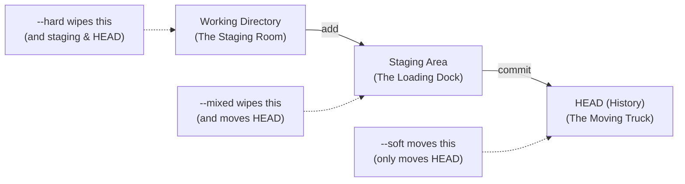
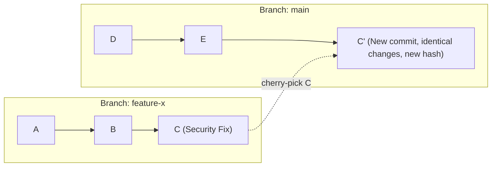

# Module 4: The Safety Net — Undo and Recovery

**Complexity**: [MEDIUM]  
**Time to Complete**: 60 minutes  
**Prerequisites**: Module 3 of Git Deep Dive

## Learning Outcomes

- Implement `git reset` with `--soft`, `--mixed`, and `--hard` flags to intentionally manipulate the working directory, staging area, and commit history in order to correct architectural mistakes.
- Diagnose and recover from catastrophic Git mistakes (like a botched interactive rebase or an accidental hard reset) using `git reflog` to trace and restore orphaned commits.
- Evaluate when to use `git revert` versus `git reset` based on branch protection rules, collaboration constraints, and the need to preserve an immutable audit trail.
- Execute surgical file-level recovery operations using `git restore` and `git checkout` to retrieve specific file states from past commits without disrupting the overall branch history.
- Transplant specific commits across branches using `git cherry-pick` to resolve misaligned feature branches and backport critical security patches.

## Why This Module Matters

It was 2:00 AM on a Friday, and the lead DevOps engineer at a major fintech startup was attempting to clean up the commit history on the `main` branch before a critical production release. The release included weeks of complex Kubernetes manifest updates—new ConfigMaps, ingress routing rules, and tightened NetworkPolicies designed to satisfy a new compliance audit. In an attempt to squash a few messy commits and make the history look pristine, the engineer ran an interactive rebase, got confused by a merge conflict involving the ingress controller, panicked, and ran `git reset --hard HEAD~5`. Instantly, five crucial commits representing three days of collective team effort vanished. The local working directory updated, wiping out the new manifests. The engineer broke out in a cold sweat, staring at a terminal that offered no immediate undo button.

This scenario plays out in engineering teams across the world every single day. Git is incredibly powerful, fundamentally designed as a distributed graph database for your code. However, its commands can feel like loaded weapons when you are under pressure. The fear of "breaking the repo" or permanently losing work is one of the most common anxieties among developers and platform engineers alike. When you do not deeply understand Git's recovery mechanisms, every destructive command feels permanent, leading to a culture of hesitation, overly defensive version control practices, and a reliance on copying folders as ".bak" backups.

In this module, we will strip away that fear completely. You will learn that in Git, almost nothing is truly lost unless you go out of your way to permanently delete it or wait months for the garbage collector. We will dive deep into the mechanics of undoing mistakes, from the nuanced differences between reset flags to the ultimate, hidden safety net: the reflog. By the end of this session, you will possess the precise mental models and practical command-line skills to confidently navigate and recover from even the most terrifying Git disasters. You will transform from hoping you do not break things to knowing exactly how to diagnose and fix them when you inevitably do.

## 1. The Three Trees of Git and `git reset`

To truly master the `git reset` command and use it predictably, you must first understand the "Three Trees" architecture that Git uses to manage the state of your files. Think of these trees as three distinct layers of state that your code passes through on its way into permanent history.

1.  **The Working Directory**: This is the file system you see and edit in your IDE or terminal. It is your scratchpad. It represents the current state of the files on your disk.
2.  **The Staging Area (Index)**: This is the loading dock. You selectively move files here (using `git add`) to prepare them for the next commit. It is a precise snapshot of what the next commit will look like.
3.  **The HEAD (Commit History)**: This is the permanent record. It is a pointer to the last commit in your current branch. It represents the state of your repository the last time you ran `git commit`.

When you use `git reset`, you are explicitly telling Git to move the `HEAD` pointer to a different, usually older, commit. But the crucial part—and the source of most confusion—is what happens to the Staging Area and the Working Directory during this move. This behavior is controlled by the flags: `--soft`, `--mixed`, and `--hard`.

### The Mental Model

Imagine you are packing boxes for a move to a new data center.
- **HEAD**: The boxes already loaded and secured onto the moving truck.
- **Staging Area**: The boxes taped up, labeled, and sitting on the loading dock, ready to be loaded.
- **Working Directory**: The loose servers, cables, and components scattered around your staging room.



### `git reset --soft`

A soft reset only moves `HEAD` to a previous commit. It completely ignores your Staging Area and your Working Directory.

**Analogy**: You take boxes off the moving truck and put them back onto the loading dock. The items are still packed, taped, and ready to go. You haven't unpacked anything; you just decided they aren't ready to leave yet.

**Use Case**: You made a commit containing a Kubernetes `Deployment` and a `Service`, but you realized you forgot to add a crucial environment variable to the container spec. You want to undo the commit, but you absolutely want to keep all the changes staged so you can quickly fix the file, re-add it, and commit again.

```bash
# View current log to see the commit we want to undo
git log --oneline
# 3a2b1c4 (HEAD -> main) Deploy backend services and DB
# 9f8e7d2 Base project setup

# Oops, forgot the DB_PASSWORD env var. 
# Undo the commit, but keep changes in the staging area.
git reset --soft HEAD~1

# Check status. The changes from 3a2b1c4 are sitting in the staging area, exactly as they were.
git status
# On branch main
# Changes to be committed:
#   (use "git restore --staged <file>..." to unstage)
#   new file:   deployment.yaml
#   new file:   service.yaml
```

> **Pause and predict**: What do you think happens if you run `git commit -m "Same thing"` immediately after a `git reset --soft HEAD~1`?
> *Prediction*: You would recreate the exact same commit you just undid, containing the exact same file states. Because `--soft` leaves the staging area untouched, the snapshot ready for the next commit is identical to one you just rolled back.

### `git reset --mixed` (The Default)

A mixed reset (which is what runs if you simply type `git reset HEAD~1` without a flag) moves `HEAD` and also clears the Staging Area. However, it leaves your Working Directory completely untouched.

**Analogy**: You take boxes off the truck, bring them all the way back into the staging room, and rip them open. The items are all still there on the floor, but they need to be sorted and packed into new boxes.

**Use Case**: You committed a massive chunk of YAML files together—a `Deployment`, a `ConfigMap`, an `Ingress`, and a `Secret`. During code review, a senior engineer tells you these need to be logically separated into four atomic commits.

```bash
# We have a monolithic commit we want to break apart into smaller pieces
git reset HEAD~1

# The files are now modified in your working directory, but they are no longer staged.
git status
# Changes not staged for commit:
#   (use "git add <file>..." to update what will be committed)
#   (use "git restore <file>..." to discard changes in working directory)
#   modified:   deployment.yaml
#   modified:   configmap.yaml
#   modified:   ingress.yaml
#   modified:   secret.yaml

# Now you can add them individually and create clean, atomic commits
git add deployment.yaml
git commit -m "Configure backend deployment"
git add configmap.yaml
git commit -m "Add backend environment configuration"
```

### `git reset --hard`

A hard reset is the nuclear option. It moves `HEAD`, clears the Staging Area, and violently overwrites your Working Directory to make it exactly match the target commit. Any uncommitted changes in tracked files are permanently destroyed.

**Analogy**: You back the truck into the staging room, dump everything out, and set the building on fire. Only what was originally packed in the truck remains. Everything else is ash.

**Use Case**: You spent two hours experimenting with a highly complex Istio `VirtualService` configuration. It is completely broken, the syntax is a mess, routing is failing, and you just want to return to a known good clean slate.

```bash
# WARNING: This will destroy all uncommitted changes in tracked files
git reset --hard HEAD

# Or, discard the last commit AND all working directory changes simultaneously
git reset --hard HEAD~1
```

### War Story: The Accidental Nuke

A junior platform engineer was tasked with updating CPU and memory resource requests in all Kubernetes namespaces. They wrote a complex `sed` script that made sweeping changes across 50 different manifests. Before committing, they ran `git status` and saw a massive list of modifications. Overwhelmed, worried about a typo in their script, and unsure if the changes were safe, they typed `git reset --hard`, intending to just clear the staging area (which would have required `--mixed`). The `--hard` flag instantly obliterated all 50 uncommitted file changes. Because the changes were never committed, Git had no record of them. The engineer lost hours of careful script tuning and had to start from scratch.

## 2. `git reflog`: The Safety Net Under the Safety Net

When you perform a destructive command like `git reset --hard HEAD~3`, it feels like those three commits are gone forever. If you type `git log`, they are nowhere to be seen. The history looks as if they never existed. But Git is inherently lazy and non-destructive behind the scenes. It rarely deletes data immediately. It just removes the pointers to that data.

Enter the Reference Log, universally known as the `reflog`.

The reflog is a chronologically ordered, hidden diary of every single time the tip of a branch (`HEAD`) was updated in your local repository. Every commit you make, every branch you check out, every reset you execute, every merge, and every rebase is recorded here, regardless of whether it shows up in `git log`.

```text
HEAD@{0}: reset: moving to HEAD~2                           
HEAD@{1}: commit: Add horizontal pod autoscaler             
HEAD@{2}: commit: Update readiness probes                   
HEAD@{3}: checkout: moving from feature-auth to main        
HEAD@{4}: pull origin main: Fast-forward                    
```

### Recovering a Lost Commit

Let us simulate a terrifying disaster. You make a crucial commit containing sensitive infrastructure configurations, and then accidentally destroy it with a hard reset.

```bash
# Create and commit the critical file
echo "apiVersion: v1" > secret-config.yaml
git add secret-config.yaml
git commit -m "Add critical database credentials template"
# Output: [main 7a8b9c0] Add critical database credentials template

# DISASTER STRIKES: You meant to reset a different branch, but you were on main
git reset --hard HEAD~1
# Output: HEAD is now at 1d2e3f4 Previous stable state

# The commit is completely gone from the standard history
git log --oneline
# 1d2e3f4 (HEAD -> main) Previous stable state
```

At this point, most beginners panic. But as a KubeDojo engineer, you consult the diary.

```bash
git reflog
# 1d2e3f4 (HEAD -> main) HEAD@{0}: reset: moving to HEAD~1
# 7a8b9c0 HEAD@{1}: commit: Add critical database credentials template
# 1d2e3f4 HEAD@{2}: commit: Previous stable state
```

Look closely at the output. You can see that `7a8b9c0` is the commit we lost. It still exists perfectly intact in Git's object database; it just lacks a branch pointer indicating where it belongs. To get it back, we simply reset our current branch to point at that orphaned hash.

```bash
# Rescue the orphaned commit
git reset --hard 7a8b9c0
# Output: HEAD is now at 7a8b9c0 Add critical database credentials template
```

The commit, the `secret-config.yaml` file, and the entire history are fully restored. You have cheated death.

> **Pause and predict**: Before running this, what output do you expect if you run `git reflog` again immediately after the recovery?
> *Prediction*: The reflog will have a brand new entry at the very top (`HEAD@{0}`) recording the recovery action: `reset: moving to 7a8b9c0`. The older entries will be pushed down to `HEAD@{1}`, `HEAD@{2}`, etc. The reflog always appends; it never deletes its own history (until it expires).

## 3. `git revert`: Safe Undos for Shared History

`git reset` is an incredibly powerful tool for local history manipulation. It literally rewrites time, pretending the future never happened. This is perfectly fine, and even encouraged, for local feature branches that only exist on your laptop.

However, `git reset` is catastrophic for shared branches like `main`, `develop`, or `production`. If you reset a commit that your colleagues have already pulled down to their machines, their local histories will suddenly diverge from the remote repository. When they try to pull or push, they will face chaotic, confusing merge conflicts, and the team's continuous deployment pipeline will likely break.

When a bad commit has already been pushed to a remote server and shared with others, you must never use `git reset`. You must use `git revert`.

Instead of erasing a commit, `git revert` creates a *new* commit that introduces the exact opposite changes of the target commit. It is an "undo" that rolls forward, preserving the immutable audit trail of what happened.


### Reverting a Bad Configuration

Imagine a developer merges a pull request that accidentally routes all production web traffic to the staging backend API. The site is down.

```bash
# Identify the bad commit hash causing the outage
git log --oneline
# 5f6g7h8 (HEAD -> main) Merge pull request #102
# 9a8b7c6 Update ingress routing rules (THE BAD COMMIT)
# 1d2e3f4 Add new payment gateway service
```

> **Pause and predict**: If you run `git revert 9a8b7c6` on the `main` branch, what will `git log --oneline` show immediately afterward?
> *Prediction*: The log will show a new commit at the tip of the branch with a message like "Revert 'Update ingress routing rules'". The original bad commit `9a8b7c6` will remain completely intact in the history directly below it.

```bash
# Revert the specific bad commit to restore service
git revert 9a8b7c6
```

When you run this command, Git will calculate the inverse patch of commit `9a8b7c6`. If lines were added, it will delete them. If lines were deleted, it will restore them. Git will then open your default text editor to finalize the commit message (which defaults to "Revert 'Update ingress routing rules'"). Once saved, a new commit is added to the tip of `main`.

The history remains perfectly intact, the audit trail shows exactly who made the mistake and who fixed it, and the production system is safely restored to its previous state without disrupting anyone else's local repository.

### War Story: The Un-Revertable Merge

A team merged a massive, multi-month feature branch into `main`. Almost immediately after deployment, the feature caused cascading database locks in production, taking down the primary application. In a panic, the tech lead ran `git revert -m 1 <merge-commit-hash>`. The revert successfully worked, the bad code was removed, and production stabilized. 

Two weeks later, the team painstakingly debugged and fixed the locking issue on their local branch. They tried to merge the feature branch into `main` again. To their horror, Git reported "Already up to date." No changes were merged. Why? Because the original commits were still technically in the history of `main` (they had just been counteracted by the revert commit). Git saw the commit hashes and thought, "I already have these." The team had to execute a highly confusing maneuver: they had to revert the revert commit to reintroduce the original broken code, and then apply their new fixes on top. 

## 4. File-Level Recovery: `git restore` and `git checkout`

Often, you do not want to manipulate entire commits. You just want to discard local, messy changes to a single file, or you need to grab an old, working version of a file from a past commit because you accidentally deleted a crucial block of code.

### Discarding Local Changes

You have been hacking on a complex Kubernetes `statefulset.yaml` file for an hour, adding volume claim templates and affinity rules. You realize your architectural approach is entirely flawed. You want to throw away your work and revert the file to exactly how it looks in your last commit (`HEAD`).

Historically, developers were taught to use `git checkout` for this:
```bash
git checkout -- statefulset.yaml
```

While this works, it is semantically confusing because `checkout` is also used for switching branches. To solve this, Git 2.23 introduced a clearer, dedicated command specifically for manipulating files: `git restore`. While initially labeled experimental in 2.23, `git restore` (along with `git switch`) is now a fully stable, standard command in modern Git.

```bash
# Discard all changes in the working directory for a specific file
git restore statefulset.yaml
```

> **Pause and predict**: If `statefulset.yaml` is currently modified and staged, what will `git status` show immediately after you run `git restore --staged statefulset.yaml`?
> *Prediction*: The `git status` output will move `statefulset.yaml` from the "Changes to be committed" section down to the "Changes not staged for commit" section. The actual modifications in the file will remain untouched in your working directory.

```bash
# What if you already added the file to the staging area?
# You can unstage the file (similar to what reset --mixed does to the whole repo)
git restore --staged statefulset.yaml
```

### Retrieving a File from the Past

What if someone accidentally deleted a crucial Grafana dashboard JSON configuration three commits ago, and you need it back without reverting the entire commit and disrupting other changes? You can target that specific file at a specific point in time.

```bash
# First, find the commit where the file still existed and was working
git log --oneline -- dashboard.json
# Output:
# a1b2c3d Update dashboard layout
# 8f7e6d5 Initial dashboard creation

# Retrieve the file from that specific commit hash
git checkout a1b2c3d -- dashboard.json
```

The `dashboard.json` file is now instantly placed in your working directory and automatically staged, ready to be committed back into the current history.

## 5. `git cherry-pick`: Surgical Precision

Sometimes you find yourself needing a specific commit from another branch, but you absolutely do not want to merge the entire branch. 

Perhaps a colleague fixed a critical, zero-day security vulnerability on a sprawling, unstable feature branch. You need that security fix on the `main` branch immediately to deploy a hotfix, but the rest of their feature is broken and cannot be merged.

`git cherry-pick` is the surgeon's scalpel of Git. It takes the exact changeset (the diff) from a specific commit on any branch and applies it as a brand new commit on your current branch.



### Applying a Fix Across Branches

```bash
# Ensure you are on the target branch
git branch
# * main
#   feature-x

# You need the security patch, which is commit C (hash 8f9g0h1) from feature-x
git cherry-pick 8f9g0h1
```

If the surrounding file context matches closely enough, Git will seamlessly create a new commit on `main` containing the changes. 

However, if the context has diverged too much (for example, if the file was heavily refactored on `main` since `feature-x` diverged), Git will pause the cherry-pick and present you with a merge conflict. You must resolve the conflict manually in your editor, run `git add` to mark it resolved, and then run `git cherry-pick --continue` to finalize the operation.

> **Stop and think**: Which approach would you choose here and why?
> Scenario: You have 10 messy, experimental commits on a feature branch. You only want to keep 3 of them and bring them over to `main` for a clean pull request.
> *Approach*: You should check out `main` and run `git cherry-pick <hash>` three times, sequentially, for each specific commit hash you want to keep. This is vastly cleaner, safer, and easier to comprehend than attempting a complex interactive rebase and dropping 7 commits.

## Did You Know?

1.  **Reflogs Expire Automatically**: The `git reflog` is a safety net, but it is not permanent. By default, unreachable commits (those not part of any branch history, like the ones you dropped during a reset) expire and are deleted by the garbage collector after 30 days. Reachable commits expire after 90 days. Furthermore, `git gc` only prunes loose unreachable objects older than 2 weeks by default. You are not safe forever!
2.  **Branches are Just Tiny Text Files**: In Git, a branch is not a folder or a complex structure. It is literally just a text file containing 40 characters—the SHA-1 hash of the commit it points to. When you delete a branch, you are only deleting that tiny text file, not the commits themselves.
3.  **The Origin of Cherry-Pick**: The command name comes directly from the English idiom "cherry-picking," which means selecting only the best, most desirable items from a group, much like picking the ripest cherries from a tree while leaving the sour ones behind.
4.  **Revert Can Target Merges**: `git revert` can undo merge commits, but you must specify the `-m` flag (mainline). A merge commit has two parent commits. You must tell Git which parent branch should be considered the "mainline" to keep (`-m 1`), and which branch's changes should be reversed.
5.  **Dangling Object Recovery**: If your reflog has already expired, you might still have a chance. You can use the `git fsck --full` utility, which checks your database for integrity and shows all dangling or unreachable commit objects before they are permanently garbage-collected.

## Common Mistakes

| Mistake | Why It Happens | How to Fix It |
| :--- | :--- | :--- |
| Running `git reset --hard` on uncommitted work | Misunderstanding that `--hard` violently wipes the working directory, not just the staging area. | You cannot easily fix this using Git. Uncommitted, unstaged work is gone. Rely on IDE local history or file system backups if available. |
| Reverting a commit instead of resetting locally | Thinking `revert` is the only way to undo, creating messy, cluttered histories on local, unshared feature branches. | Use `git reset` while the branch is local and unpushed. Only use `git revert` after pushing to a shared remote like GitHub. |
| Losing a branch after accidental deletion | Deleting an unmerged branch with `git branch -D` and panicking because `git log` no longer shows the work. | Run `git reflog`, find the hash where the branch was last checked out, and recreate it with `git branch <name> <hash>`. |
| Cherry-picking a commit multiple times | Running cherry-pick on a commit that was already merged, leading to empty commits or bizarre, confusing conflicts. | Use `git log --cherry-mark` to see which commits have already been applied, or check commit messages carefully before cherry-picking. |
| Thinking the reflog is a remote backup | Assuming `git reflog` on GitHub or a coworker's machine will miraculously show your local mistakes. | Understand that the reflog is strictly local to your specific `.git` directory on your laptop. It never syncs over the network. |
| Using `git checkout` for files, causing detached HEAD confusion | Forgetting the `--` separator when checking out files, sometimes accidentally checking out a similarly named branch and detaching HEAD. | Adopt the modern `git restore` command for all file-level manipulations to avoid overloading the checkout command. |

## Quiz

<details>
<summary>Question 1: You just committed three YAML manifests, but realized you forgot to include a crucial ConfigMap in the same commit. You want to undo the commit, but keep all the previously committed changes exactly as they are in the staging area, so you can just add the ConfigMap and re-commit. Which reset flag should you use and why?</summary>
You should use `git reset --soft`. The crucial difference between the flags lies entirely in how they handle the Staging Area. `git reset --soft` moves the HEAD pointer backward but leaves the Staging Area completely intact, meaning all previously committed changes are now staged and ready to be committed again immediately. Conversely, `git reset --mixed` moves the HEAD pointer AND forcefully clears the Staging Area, placing those changes back into the Working Directory as unstaged modifications that you must manually `git add` again. Using the correct flag prevents accidental omission of files during a rapid rollback and re-commit cycle.
</details>

<details>
<summary>Question 2: You are working on a massive `deployment.yaml` file. You make several changes over an hour, realize they are fundamentally wrong, and want to return the file to the exact state of your last commit. What command should you use?</summary>
You should use `git restore deployment.yaml`. This command specifically targets the working directory and replaces the file with the pristine version from the current HEAD. Alternatively, `git checkout -- deployment.yaml` achieves the exact same result, but `restore` is the modern, preferred method specifically designed for file-level actions. Unlike `git reset --hard` which would wipe out all uncommitted changes across the entire repository, this command provides surgical precision. It ensures that only the target file is reverted while leaving any other experimental files you might be working on completely untouched.
</details>

<details>
<summary>Question 3: Your team just deployed a new release to production. Immediately, Datadog alerts start firing because a database migration script introduced in the last merge commit has a severe syntax error. The branch was heavily shared and other teams have pulled from it. What do you do?</summary>
You must use `git revert -m 1 <commit-hash>`. Because the bad changes were introduced in a merge commit, you must specify the mainline parent using the `-m` flag to tell Git which history to preserve. Furthermore, because the commit has already been pushed to a shared remote and deployed to production, using `git reset` would rewrite history and cause synchronization chaos for the rest of the engineering team. `git revert` creates a safe, rolling-forward undo commit that counteracts the bug without rewriting history. This approach preserves an immutable audit trail, ensuring that when your colleagues pull the latest `main` branch, Git can seamlessly fast-forward their local histories without triggering complex merge conflicts.
</details>

<details>
<summary>Question 4: You intended to clear your staging area with `git reset --mixed`, but your finger slipped and you accidentally typed `git reset --hard HEAD~2`. Two very important commits are now completely missing from your history. How do you recover them?</summary>
You need to use the `git reflog`. First, run `git reflog` to view your local, chronological diary of HEAD movements. Locate the hash of the commit right before you executed the hard reset (it will likely be at index `HEAD@{1}` or `HEAD@{2}`). Then, execute `git reset --hard <that-hash>` to forcefully restore your branch pointer and working directory to that safe state. Git rarely deletes actual commit objects immediately, so the data is still safely stored within your local `.git` directory's object database. By resetting back to the orphaned hash found in the reflog, you effectively undo the disastrous hard reset and instantly bring your branch back to its pristine condition.
</details>

<details>
<summary>Question 5: You have a long-running feature branch with 5 commits. You realize that commit number 3 actually contains a critical memory leak fix that needs to go to the `main` branch immediately, ahead of the rest of the unfinished feature. How do you isolate and move it?</summary>
You should use `git cherry-pick`. First, find the specific hash of commit number 3 using `git log` on the feature branch. Next, check out the `main` branch so it becomes your current active branch. Finally, run `git cherry-pick <hash>` to apply the fix. This command duplicates the exact changes from that specific commit onto `main` as a brand new commit, without bringing along the rest of the unstable feature branch. This technique isolates the emergency fix from unrelated, potentially broken feature code, allowing for a rapid and targeted hotfix deployment while the larger feature branch continues its normal development lifecycle independently.
</details>

<details>
<summary>Question 6: You run `git branch -D feature-ingress` and instantly regret it because you had three days of unmerged Kubernetes manifests in there. Can `git reflog` save you? If so, exactly how?</summary>
Yes, `git reflog` can easily save you. The reflog tracks where the HEAD pointer has been over time, completely independent of branch labels. Even though the branch label `feature-ingress` is deleted, the actual commits still exist in the Git database. You run `git reflog` to find the exact hash of the last commit you made while you were on that branch. Once you find the hash, you can recreate the branch pointing to that exact commit using the command `git branch feature-ingress <hash>`. Since a Git branch is fundamentally just a lightweight movable pointer to a specific commit, deleting a branch only destroys the pointer, not the underlying snapshot data. By recreating the branch label and attaching it to the recovered hash, you seamlessly restore your access to all the previously unreachable commits in that history.
</details>

## Hands-On Exercise

In this exercise, we will simulate a catastrophic workflow error and use advanced Git recovery techniques to rescue the project from the brink of disaster.

### Step 1: Scenario Setup

Let's build our environment, create some infrastructure code, and set up a simulated disaster.

```bash
# 1. Create a fresh repository
mkdir k8s-disaster-recovery
cd k8s-disaster-recovery
git init -b main

# 2. Create the initial stable state
echo "apiVersion: apps/v1" > deployment.yaml
git add deployment.yaml
git commit -m "Init: Base deployment manifest"

# 3. Create a feature branch and do some good work
git checkout -b feature-scaling
echo "replicas: 3" >> deployment.yaml
git commit -am "Feature: Increase replicas to 3"
echo "kind: HorizontalPodAutoscaler" > hpa.yaml
git add hpa.yaml
git commit -m "Feature: Add HPA manifest"

# 4. Create one more crucial commit
echo "cpu: 80%" >> hpa.yaml
git commit -am "Feature: Set HPA CPU threshold"

# Look at your beautiful, linear history
git log --oneline
```

### Step 2: The Disaster

You meant to switch back to `main`, but you get distracted, confused, and accidentally perform a hard reset, violently wiping out the last three commits on your feature branch.

```bash
# THE MISTAKE: You thought you were resetting a single file, but you nuked the branch history
git reset --hard HEAD~3

# Verify the absolute destruction. The feature commits are gone, hpa.yaml is missing from the directory.
git log --oneline
ls -la
```

### Step 3: The Rescue Mission

Your task is to find the lost commits and restore the branch to its correct, fully featured state.

- [ ] Run the command that shows the hidden diary of HEAD movements.
- [ ] Identify the exact commit hash associated with the message "Feature: Set HPA CPU threshold".
- [ ] Use a reset command to force the branch pointer back to that lost commit hash.

<details>
<summary>Solution for Step 3</summary>

```bash
# View the reflog to find the lost history
git reflog

# You should see output similar to this:
# 1a2b3c4 (HEAD -> feature-scaling) HEAD@{0}: reset: moving to HEAD~3
# 9d8e7f6 HEAD@{1}: commit: Feature: Set HPA CPU threshold
# 5c4b3a2 HEAD@{2}: commit: Feature: Add HPA manifest
# ...

# Reset hard to the state right before the disastrous reset (which is at HEAD@{1})
# Alternatively, you could substitute the actual hash from your reflog output.
git reset --hard HEAD@{1}

# Verify the files are back in your working directory
ls -la
cat hpa.yaml
```
</details>

### Step 4: The Surgical Transplant

Now that you recovered the branch, your tech lead messages you on Slack. The HPA manifests (`Feature: Add HPA manifest` and `Feature: Set HPA CPU threshold`) must be moved to `main` immediately to handle an incoming traffic spike, but the replica change (`Feature: Increase replicas to 3`) is buggy and not approved yet.

- [ ] Check out the `main` branch.
- [ ] View the log of the `feature-scaling` branch to get the hashes of the two specific HPA commits.
- [ ] Use a specific command to apply *only* those two commits to the `main` branch, ensuring you apply the oldest one first.
- [ ] Verify that `hpa.yaml` exists on `main`, but `deployment.yaml` does not have the `replicas: 3` line.

<details>
<summary>Solution for Step 4</summary>

```bash
# Switch to the target branch
git checkout main

# View the feature branch history to grab the required hashes
git log --oneline feature-scaling
# In a real scenario, you would substitute the actual hashes you see in your log.
# Here, we can deterministically use relative references based on their position:
# feature-scaling~1 = Feature: Add HPA manifest
# feature-scaling   = Feature: Set HPA CPU threshold

# Cherry-pick the two specific commits (oldest first to prevent structural conflicts!)
git cherry-pick feature-scaling~1
git cherry-pick feature-scaling

# Verify the precise state of the repository
git log --oneline
ls -la
cat hpa.yaml
cat deployment.yaml # Should NOT contain the "replicas: 3" line
```
</details>

## Next Module

Now that you know how to reliably recover from disasters and manipulate history with surgical precision, it is time to master working on multiple features simultaneously without losing your mind in [Module 5: Multi-Tasking Mastery](../module-5-worktrees-stashing/).