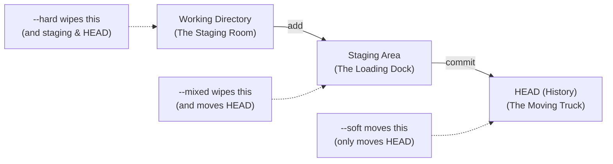
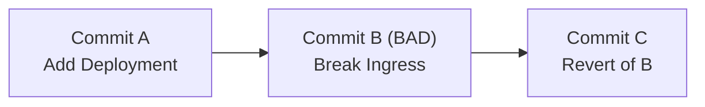
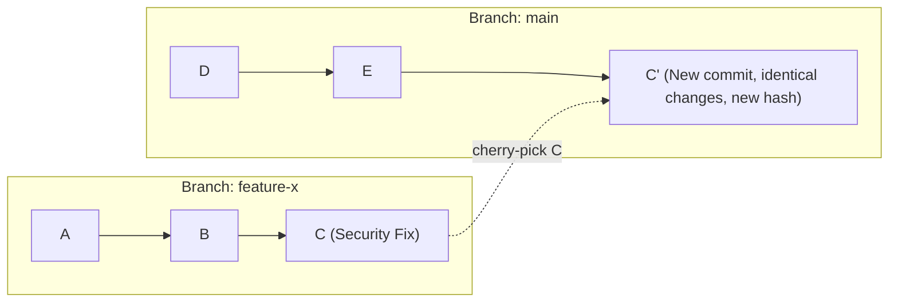

# Module 4: The Safety Net — Undo and Recovery

**Complexity**: [MEDIUM]  
**Time to Complete**: 60 minutes  
**Prerequisites**: Module 3 of Git Deep Dive

## Learning Outcomes

- Implement `git reset` with `--soft`, `--mixed`, and `--hard` flags to intentionally manipulate the working directory, staging area, and commit history in order to correct architectural mistakes.
- Diagnose and recover from catastrophic Git mistakes, including botched rebases and accidental hard resets, using `git reflog` to trace and restore orphaned commits.
- Evaluate when to use `git revert` versus `git reset` based on branch protection rules, collaboration constraints, and the need to preserve an immutable audit trail.
- Execute surgical file-level recovery operations using `git restore` and `git checkout` to retrieve specific file states from past commits without disrupting the overall branch history.
- Transplant specific commits across branches using `git cherry-pick` to resolve misaligned feature branches and backport critical security patches.

## Why This Module Matters

On April 5, 2022, starting at 7:38 UTC, an Atlassian maintenance script ran the "delete site" path against 775 customer sites that should have been left alone. Backups existed. Restoration still took up to 14 days for the longest-affected sites. The gap between recoverable and recovered was paid in human-hours, lost trust, and operational lag — a backup is not the same as a restored service. The personal-scale version of that gap sits in every engineer's terminal: knowing exactly which Git commands undo a mistake, which ones move a pointer that can be moved back, and which ones quietly destroy work that no remote ever saw. Git's recovery model is what closes that gap on the engineer's own laptop.

This module turns Git undo from superstition into engineering judgment. You will learn why `reset`, `restore`, `revert`, `reflog`, and `cherry-pick` are not interchangeable synonyms for "go back." Each command edits a different part of Git's state model, and each has a different collaboration contract. By the end, you should be able to look at a broken branch, decide whether you need to move a pointer, create an inverse commit, restore one file, or copy a patch across histories, and then explain that decision to a teammate under incident pressure.

Before the commands begin, anchor the operational context. Kubernetes examples in this module target Kubernetes 1.35 or later, and when cluster validation appears we use the common shell alias `k` for `kubectl` after defining it once. The Git recovery workflow itself works without a cluster, but platform engineers usually recover code that will eventually become cluster state, so the lesson keeps the repository mechanics connected to deployment risk.

```bash
alias k=kubectl
```

## 1. The Three Trees of Git and `git reset`

`git reset` is frightening when it is treated as a single dangerous command, but it becomes predictable when you see the three pieces of repository state it can touch. Git keeps your current files in the working directory, the proposed next snapshot in the staging area, and the current branch tip in `HEAD`. Those three areas are often called Git's three trees, even though the working directory is normal files on disk and the staging area is Git's index. Reset moves `HEAD` first, then optionally rewrites the index and working directory to match that new point in history.

Think of the working directory as the room where parts are scattered, the staging area as the loading dock where finished boxes are labeled for shipment, and `HEAD` as the truck already carrying the last accepted shipment. When you run `git add`, you are not saving work permanently; you are choosing which current file snapshots should go on the loading dock. When you run `git commit`, Git records the staged snapshot as a durable commit and moves the branch pointer to that new object. A reset command moves the truck label backward or sideways, then decides whether the loading dock and room should be left alone, unpacked, or overwritten.

1. **The Working Directory**: This is the file system you see and edit in your IDE or terminal. It is your scratchpad. It represents the current state of the files on your disk.
2. **The Staging Area (Index)**: This is the loading dock. You selectively move files here, using `git add`, to prepare them for the next commit. It is a precise snapshot of what the next commit will look like.
3. **The HEAD (Commit History)**: This is the permanent record. It is a pointer to the last commit in your current branch. It represents the state of your repository the last time you ran `git commit`.

The important lesson is that reset does not mean "delete my work" by default. It means "move my current branch reference to another commit, then reconcile some local state with that target." If you know which layers are rewritten, you can use reset to reshape local history without losing useful edits. If you guess, the same command can erase an uncommitted manifest rewrite that Git never had a chance to protect.



`git reset --soft` only moves the branch tip. The index and working directory remain exactly as they were before the command, which means the changes from the commits you backed out are still staged and ready to be committed again. This is useful when the commit boundary was wrong but the staged content was mostly right. You might have committed a Deployment and Service together, then realized one environment variable belongs in the same logical change because reviewers need to inspect the application rollout as a single unit.

The soft reset is a history-editing tool, not a file-editing tool. It is the Git equivalent of saying, "I want the last commit message and object hash to stop existing on this local branch, but I still want the exact proposed snapshot on the loading dock." Because the index remains populated, an immediate `git commit` after a soft reset recreates a commit with the same file state. The hash will differ because commit metadata changes, but the content snapshot can be identical.

```bash
# View current log to see the commit we want to undo
git log --oneline
# 3a2b1c4 (HEAD -> main) Deploy backend services and DB
# 9f8e7d2 Base project setup

# Oops, forgot the DB_PASSWORD env var. 
# Undo the commit, but keep changes in the staging area.
git reset --soft HEAD~1

# Check status. The changes from 3a2b1c4 are sitting in the staging area, exactly as they were.
git status
# On branch main
# Changes to be committed:
#   (use "git restore --staged <file>..." to unstage)
#   new file:   deployment.yaml
#   new file:   service.yaml
```

Pause and predict: what do you think happens if you run `git commit -m "Same thing"` immediately after a `git reset --soft HEAD~1`? You would recreate the same file snapshot you just removed from the branch tip, because `--soft` leaves the staging area untouched. The new commit may have a different hash, author timestamp, or message, but the tree recorded by the commit will match unless you edit or restage something first. That is why `--soft` is excellent for fixing commit messages, adding one missed file, or combining the last local commit with an adjacent change before publication.

`git reset --mixed` is the default reset mode, so `git reset HEAD~1` behaves like `git reset --mixed HEAD~1`. It moves `HEAD` and rewrites the staging area to match the target commit, but it leaves the working directory files alone. In practical terms, the content from the removed commits becomes unstaged local modifications. You have not lost the YAML, scripts, or docs; you have only unpacked them from the index so you can sort them into better commits.

Mixed reset is the safest everyday command for reshaping local commits because it gives you another chance to choose boundaries. Suppose a review points out that one commit changed a Deployment, ConfigMap, Ingress, and Secret all at once. That commit is difficult to review because each file carries a different operational risk. A mixed reset lets you take the combined patch back into the working directory, then restage one intent at a time so reviewers can validate the rollout plan, configuration surface, routing rule, and secret handling separately.

```bash
# We have a monolithic commit we want to break apart into smaller pieces
git reset HEAD~1

# The files are now modified in your working directory, but they are no longer staged.
git status
# Changes not staged for commit:
#   (use "git add <file>..." to update what will be committed)
#   (use "git restore <file>..." to discard changes in working directory)
#   modified:   deployment.yaml
#   modified:   configmap.yaml
#   modified:   ingress.yaml
#   modified:   secret.yaml

# Now you can add them individually and create clean, atomic commits
git add deployment.yaml
git commit -m "Configure backend deployment"
git add configmap.yaml
git commit -m "Add backend environment configuration"
```

`git reset --hard` moves `HEAD`, resets the index, and overwrites tracked files in the working directory to match the target commit. It is not evil, but it is absolute about tracked file state. If the only changes you care about are already committed somewhere, hard reset can be a fast way to return to a known clean state. If your valuable work is uncommitted, a hard reset can destroy it because Git has no commit object that records those file contents.

The word "tracked" matters here. A hard reset overwrites tracked files that Git knows about, but it does not remove untracked files by itself. That distinction sometimes misleads beginners into thinking the command is safer than it is, because a newly created untracked file may survive while a heavily edited tracked manifest is wiped clean. For a platform repository, that can mean a scratch note survives while the important Deployment patch disappears. Before using `--hard`, run `git status --short` and decide whether every tracked modification is truly disposable.

```bash
# WARNING: This will destroy all uncommitted changes in tracked files
git reset --hard HEAD

# Or, discard the last commit AND all working directory changes simultaneously
git reset --hard HEAD~1
```

The war story behind this warning is painfully common. A junior platform engineer was asked to update CPU and memory resource requests across dozens of Kubernetes manifests. They wrote a shell script, saw a huge `git status`, became uncertain about one substitution, and ran `git reset --hard` because they thought it would merely unstage files. The command erased all tracked file edits, and because the edits had never been committed, the best remaining recovery options were IDE local history and shell scrollback. Git could recover the branch pointer, but it could not resurrect content it had never stored.

Use reset as a deliberate state operation. Ask which tree contains the work you want to preserve, then choose the reset mode that leaves that tree intact. If the valuable state is already committed, `--hard` may be acceptable. If it is staged, `--soft` preserves it. If it is in the working directory, `--mixed` generally keeps it available for reorganization. That decision process is slower than muscle memory, but it is much faster than explaining to a team why a production fix vanished.

## 2. `git reflog`: The Safety Net Under the Safety Net

When a commit disappears from `git log`, it has usually disappeared from the visible branch path, not from Git's object database. Git stores commits as objects and uses references, such as branch names and tags, to decide which objects are easy to reach. A destructive-looking reset often just moves a reference away from a commit. The commit becomes orphaned from normal history, but the object remains present until Git's expiration and garbage collection rules eventually remove unreachable data.

The reflog, short for reference log, is the local diary that records where references have pointed over time. Every commit, checkout, merge, rebase, and reset that updates `HEAD` can leave a reflog entry. This diary is local to one repository clone; it is not pushed to GitHub, GitLab, or a teammate's machine. That locality is both its strength and its limit. It can save you from your own mistake on your laptop, but it is not a substitute for pushing important work or maintaining backups.

```text
HEAD@{0}: reset: moving to HEAD~2                           
HEAD@{1}: commit: Add horizontal pod autoscaler             
HEAD@{2}: commit: Update readiness probes                   
HEAD@{3}: checkout: moving from feature-auth to main        
HEAD@{4}: pull origin main: Fast-forward                    
```

Read reflog output as a timeline where `HEAD@{0}` is the latest recorded movement and larger numbers go backward in time. The commit hash at the left is the place `HEAD` ended up after that movement. If you reset away from useful commits, the entry immediately before the reset often points at the last good branch state. Recovery usually means selecting that hash or reflog selector and moving a branch reference back to it. The skill is not memorizing `HEAD@{1}`; the skill is reading the messages and confirming the target before moving anything.

Let us simulate a disaster with a committed file. The word "committed" is doing the heavy lifting here, because committed content has an object hash that the reflog can help you find. In a real infrastructure repository, the file might be a template for a Secret, a HorizontalPodAutoscaler, or a migration script that needs careful review before deployment. The exact content is less important than the fact that Git recorded it before the reset.

```bash
# Create and commit the critical file
echo "apiVersion: v1" > secret-config.yaml
git add secret-config.yaml
git commit -m "Add critical database credentials template"
# Output: [main 7a8b9c0] Add critical database credentials template

# DISASTER STRIKES: You meant to reset a different branch, but you were on main
git reset --hard HEAD~1
# Output: HEAD is now at 1d2e3f4 Previous stable state

# The commit is completely gone from the standard history
git log --oneline
# 1d2e3f4 (HEAD -> main) Previous stable state
```

At this point, beginners often assume the commit is gone because `git log` cannot see it. That is a reasonable interpretation if you think `git log` shows everything Git knows, but it actually shows commits reachable from the current starting point. The reflog gives you another starting point. It tells you where `HEAD` used to be, so you can inspect or restore commits that are no longer reachable from the current branch tip.

```bash
git reflog
# 1d2e3f4 (HEAD -> main) HEAD@{0}: reset: moving to HEAD~1
# 7a8b9c0 HEAD@{1}: commit: Add critical database credentials template
# 1d2e3f4 HEAD@{2}: commit: Previous stable state
```

The lost commit hash is visible as `7a8b9c0`. You can recover by moving the current branch back to that hash with a hard reset, because in this scenario you want the branch, index, and working directory to exactly match the recovered commit. You could also create a branch at the lost hash first if you want a safer inspection step. In incident work, that temporary branch is often the calmer choice because it lets you examine the recovered state before changing the branch you are standing on.

```bash
# Rescue the orphaned commit
git reset --hard 7a8b9c0
# Output: HEAD is now at 7a8b9c0 Add critical database credentials template
```

Pause and predict: before running another command, what output do you expect if you run `git reflog` immediately after the recovery? The reflog will have a new entry at the top recording the recovery action, usually something like `reset: moving to 7a8b9c0`. Older entries will move down one position. The reflog appends movements instead of pretending the mistake never happened, which is exactly why it can function as an audit trail for local repair.

There is one subtle decision to make during reflog recovery: whether to reset the current branch, branch from the lost commit, or cherry-pick the lost commit onto the current branch. Reset is appropriate when the branch pointer itself went to the wrong place and you want to put it back. Creating a branch is appropriate when you are unsure what the recovered commit contains or you need to preserve the current branch state for comparison. Cherry-pick is appropriate when the current branch has legitimately moved on, but one lost changeset should be reapplied as a new commit.

Reflog recovery has an expiration window. Default Git configuration keeps reflog entries for reachable commits longer than unreachable ones, and garbage collection eventually prunes unreachable objects after grace periods. The exact timing can be configured, so you should not rely on a vague promise that reflog can save anything forever. The operational habit is simple: when you realize a destructive command happened, stop making unnecessary moves, run `git reflog`, create a safety branch at the promising hash, and only then perform more invasive repair.

## 3. `git revert`: Safe Undos for Shared History

`git reset` changes where a branch points. That is powerful on a private branch and dangerous on a shared branch because other people may already have based work on the commits you want to remove. If you rewrite a published branch, teammates can end up with histories that no longer agree with the remote. Their next pull may require confusing reconciliation, and their next push may be rejected or, worse, may reintroduce commits you thought you had removed.

`git revert` solves a different problem. Instead of erasing a commit from history, it creates a new commit whose patch is the inverse of the target commit. The old commit remains visible, the new commit records the rollback, and collaborators can fast-forward normally. That makes revert the right command for production branches, protected branches, release branches, and any history that has been pulled by other people or automation. Revert does not make the original mistake disappear; it makes the repair explicit.



The audit trail matters for platform work. If a bad ingress route sends production traffic to a staging backend, you do not want to hide the mistake by rewriting `main`. You want the incident timeline to show the bad change, the rollback, and the later corrected implementation. That record helps incident review, compliance review, and future debugging. It also protects every developer and deployment job that already saw the original commit, because their histories remain compatible with the remote branch.

```bash
# Identify the bad commit hash causing the outage
git log --oneline
# 5f6g7h8 (HEAD -> main) Merge pull request #102
# 9a8b7c6 Update ingress routing rules (THE BAD COMMIT)
# 1d2e3f4 Add new payment gateway service
```

Pause and predict: if you run `git revert 9a8b7c6` on `main`, what will `git log --oneline` show immediately afterward? You should expect a new commit at the tip with a message like `Revert "Update ingress routing rules"`, while the original bad commit remains below it. The branch moves forward, not backward. That distinction is the entire collaboration contract: everyone can pull the new rollback commit without being asked to pretend the old commit never existed.

```bash
# Revert the specific bad commit to restore service
git revert 9a8b7c6
```

Revert is not magic; it calculates an inverse patch using the current file context. If later commits have changed the same lines, Git may stop for conflicts, just as it would during a merge or cherry-pick. That conflict is not a reason to switch to reset on a shared branch. It is a signal that the rollback needs human judgment because the bad change and later changes are entangled. Resolve the conflict, stage the corrected files, and continue the revert so the public history remains honest.

Merge commits require extra care because a merge has more than one parent. To revert a merge, Git needs to know which parent is the mainline that should be preserved. The common command is `git revert -m 1 <merge-commit>`, but you should not type it blindly. Parent one is usually the branch you merged into, yet workflows differ, and the wrong mainline can reverse the wrong side of the merge. Inspect the merge commit with `git show --summary <hash>` before deciding.

The classic war story is the "un-revertable" merge. A team merged a large feature into `main`, discovered database lock problems, and reverted the merge with `git revert -m 1`. Production stabilized, but two weeks later Git reported "Already up to date" when the team tried to merge the fixed feature branch again. Git was technically correct: the original feature commits were already in `main`'s history, even though their effects had been counteracted by a revert commit. The team had to revert the revert, then apply new fixes on top.

That story does not mean merge reverts are bad. It means rollback strategy should include a reintroduction plan. If you revert a feature merge, write down whether the future fix will revert the revert, rebuild the feature on a new branch with new commits, or cherry-pick a smaller corrected patch. Without that plan, the emergency rollback can become a confusing historical knot long after the incident is over.

## 4. File-Level Recovery: `git restore` and `git checkout`

Many recovery tasks are smaller than a commit. You may have ruined one file while leaving five others in useful shape, or you may need an old version of a dashboard JSON without reverting the commit that also changed unrelated application code. File-level recovery exists for that reason. It lets you copy a file state from `HEAD`, from another commit, or from the index without moving the branch pointer or rewriting unrelated files.

Historically, Git taught developers to use `git checkout` for both branch switching and file restoration. That overloading created a lot of accidental confusion, especially around the `--` separator. Modern Git provides `git restore` for file restoration and `git switch` for branch switching, which makes commands easier to read during stressful repair work. You can still understand legacy examples that use checkout, but for day-to-day file recovery, prefer `restore` when it fits.

You have been hacking on a complex Kubernetes `statefulset.yaml` file for an hour, adding volume claim templates and affinity rules. The approach now looks wrong because the storage class differs across environments and your anti-affinity rules would strand pods during node maintenance. You do not want to rewrite branch history, and you do not want to disturb unrelated files. You only want this one tracked file to match the last commit.

```bash
git checkout -- statefulset.yaml
```

The checkout form works because the `--` tells Git that `statefulset.yaml` is a path, not a branch name. Without that separator, old command habits can become ambiguous when a branch and a file have similar names. `git restore statefulset.yaml` expresses the same intent more directly: restore this file in the working directory from the default source, which is `HEAD`. For a learner, the command name maps to the operation better than checkout does.

```bash
# Discard all changes in the working directory for a specific file
git restore statefulset.yaml
```

Pause and predict: if `statefulset.yaml` is currently modified and staged, what will `git status` show immediately after you run `git restore --staged statefulset.yaml`? The file will move out of the "Changes to be committed" section and into the unstaged section, while the actual file contents in your working directory remain modified. That command changes the index, not the working file. If you also want to discard the working directory changes, you need a separate restore without `--staged`.

```bash
# What if you already added the file to the staging area?
# You can unstage the file (similar to what reset --mixed does to the whole repo)
git restore --staged statefulset.yaml
```

File-level recovery also works in the other direction: retrieve an old version of a file and bring it into the current branch. Imagine someone deleted a Grafana dashboard JSON while cleaning a directory, and you need that file back without reverting the entire cleanup commit. Reverting the whole commit could restore unrelated files or undo useful cleanup. Pulling just the dashboard file from the last good commit is more precise.

```bash
# First, find the commit where the file still existed and was working
git log --oneline -- dashboard.json
# Output:
# a1b2c3d Update dashboard layout
# 8f7e6d5 Initial dashboard creation

# Retrieve the file from that specific commit hash
git checkout a1b2c3d -- dashboard.json
```

After this command, `dashboard.json` appears in the working directory and is staged for commit. That staging behavior surprises some people, but it is useful because Git has copied a specific historical snapshot into the proposed next commit. Review it before committing, especially if the file contains environment-specific URLs, dashboard data source names, or alert thresholds. A recovered file can be syntactically correct and still operationally stale.

For Kubernetes manifests, pair file recovery with validation. If a restored object will be applied to a cluster, run the repository's usual validation path before opening a pull request. At minimum, a platform engineer should be comfortable checking client-side syntax against the current Kubernetes command surface. With the alias defined earlier, a simple local validation command might look like this when a real cluster context and manifest are available.

```bash
k apply --dry-run=client -f deployment.yaml
```

File-level commands are safest when you name both the source and the target in your head. "Restore `statefulset.yaml` from `HEAD` into my working directory" is a clear operation. "Checkout something" is vague. During recovery, vague commands invite mistakes because Git has multiple places it can read from and multiple places it can write to. If you cannot say the source and destination out loud, inspect with `git status`, `git diff`, and `git diff --staged` before changing state.

## 5. `git cherry-pick`: Surgical Precision

`git cherry-pick` copies the changes introduced by an existing commit and applies them as a new commit on the current branch. It does not move the source branch, and it does not merge every commit from that branch. This makes it valuable when one changeset is ready but its surrounding branch is not. In platform work, that often happens when a security patch, resource limit correction, or deployment safety fix sits inside a broader feature branch that still contains unfinished experiments.

The key tradeoff is that cherry-pick duplicates the patch, not the identity of the commit. The new commit usually has a different hash because it has a different parent and possibly different metadata. That is fine when your goal is to move a fix across release lines, but it can complicate later merges if teams cherry-pick casually without tracking what moved. Use it deliberately, write clear commit messages, and prefer a normal merge when you actually want the whole branch relationship preserved.



Consider a colleague's feature branch that contains ten commits. One commit updates an image tag to a patched base image and adjusts the Deployment resource requests to avoid throttling. The rest of the branch changes a controller interface and is not ready for production. A merge would bring too much risk. A revert would require the bad change to already be on the target branch. A reset would rewrite local history. Cherry-pick is the command that matches the problem: copy this one patch here.

```bash
# Ensure you are on the target branch
git branch
# * main
#   feature-x

# You need the security patch, which is commit C (hash 8f9g0h1) from feature-x
git cherry-pick 8f9g0h1
```

If the surrounding file context is close enough, Git creates a new commit automatically. If the target branch has changed the same lines, Git stops with a conflict and asks you to reconcile the patch manually. That pause is helpful, not annoying. It means Git cannot safely infer whether the source branch's edit still makes sense in the target branch's current architecture. Resolve the conflict, run the relevant tests or manifest validation, stage the files, and continue with `git cherry-pick --continue`.

```bash
# After resolving conflicts in your editor
git status
git add deployment.yaml
git cherry-pick --continue
```

Before running this, what output do you expect from `git log --oneline -3` after a clean cherry-pick? You should expect the current branch tip to be a new commit with the cherry-picked message, followed by the previous commits from the target branch. You should not expect the source branch's earlier commits to appear. That absence is the point of the operation, and it is also why cherry-picking a stack of dependent commits must be done in dependency order.

When several commits are required, apply the oldest necessary commit first. Later commits may depend on files, functions, or manifests introduced by earlier commits. Cherry-picking newest first can create avoidable conflicts or even produce a build that appears to pass while missing a prerequisite. If you need three commits from a messy branch, identify their hashes with `git log --oneline --reverse feature-x`, then apply the selected commits in the order they originally built on each other.

Stop and think: which approach would you choose if you have ten messy experimental commits on a feature branch, but only three should become a clean pull request on `main`? Check out `main` or a new branch from `main`, then cherry-pick the three desired commit hashes in chronological order. That approach is usually easier to review than attempting a complicated interactive rebase that drops seven commits from the original branch, especially when the original branch still belongs to ongoing experimentation.

Cherry-pick is also a common release maintenance tool. A fix may land on `main`, then need to be backported to a supported release branch without bringing the next version's features along. In that case, the destination branch's tests matter more than the source branch's tests. A patch that was correct on `main` can be incomplete on an older release because APIs, manifest layouts, or dependency versions differ. Treat every cherry-pick as a new integration event, not as a free copy.

## Patterns & Anti-Patterns

Experienced teams build recovery habits that reduce both data loss and social confusion. The first pattern is to classify the scope before choosing a command. Local, unpublished mistakes are candidates for reset, restore, and rebase because nobody else has built on them. Published mistakes are candidates for revert because the team needs a forward-moving public history. Cross-branch patches are candidates for cherry-pick when the target branch should receive only selected commits. This classification takes seconds and prevents most dangerous misuse.

The second pattern is to create a temporary safety branch before invasive repair. If reflog shows a promising lost hash, `git branch rescue/<short-name> <hash>` gives that object a durable reference while you inspect it. You can delete the rescue branch later, but during recovery it prevents a second mistake from making the first one harder to diagnose. This pattern scales well in incident response because one engineer can preserve the state while another reviews the diff and tests the restored files.

The third pattern is to inspect before and after every state-changing operation. `git status --short`, `git log --oneline --decorate -n 8`, `git diff`, and `git diff --staged` are not ceremony; they are instruments. Before a reset, they tell you where valuable work lives. After a revert or cherry-pick, they confirm whether Git stopped for conflicts or produced the commit you expected. Teams that normalize this inspection have fewer mystery fixes because every command is paired with evidence.

| Pattern or Anti-Pattern | When It Appears | Better Operational Habit |
| :--- | :--- | :--- |
| Pattern: soft reset to amend local intent | The last local commit is almost right, but one file or message is missing. | Move `HEAD` back with `git reset --soft`, adjust the staged snapshot, then recommit before pushing. |
| Pattern: rescue branch from reflog | A reset, rebase, or branch deletion hid useful committed work. | Create `rescue/<name>` at the reflog hash before doing further repair. |
| Pattern: revert shared outages | A bad commit reached `main`, a release branch, or a protected branch. | Use `git revert` so collaborators receive a normal forward-moving commit. |
| Anti-pattern: hard reset as cleanup | The working tree looks messy and the engineer wants a blank slate quickly. | Inspect tracked and untracked changes first; stash, commit, restore selected files, or reset only when disposable work is confirmed. |
| Anti-pattern: cherry-pick without dependency order | A team grabs a later commit without the earlier commit it assumes exists. | Review the source branch graph and apply required commits oldest first. |
| Anti-pattern: treating reflog as a backup service | Work remains local for days because the engineer assumes Git can always recover it. | Push important branches, create reviewable commits, and remember reflog is local and expires. |

One anti-pattern deserves special attention: using reset to hide mistakes after a branch is shared. The temptation is understandable because the cleaned history looks simpler, but the simplification is local and deceptive. Everyone else now has a different version of history, and the team spends energy reconciling Git state instead of fixing the actual defect. If the branch has crossed a collaboration boundary, prefer a visible repair commit and explain it in the pull request or incident notes.

Another anti-pattern is overusing cherry-pick as a substitute for small, coherent branches. If every release requires several hand-picked commits from a sprawling feature branch, the source workflow is carrying too much mixed intent. Cherry-pick can rescue you from schedule mismatch, but it should not become the normal way to assemble a release. A better long-term pattern is to keep fixes, refactors, and features in separate branches so ordinary merges carry understandable units of change.

## Decision Framework

The recovery decision starts with two questions: has the work been committed, and has the history been shared? If the work has never been committed, Git recovery commands have limited power because there may be no object to recover. If the work has been committed locally, reflog and reset can usually find it. If the work has been pushed or pulled by others, the social contract changes, and preserving shared history becomes more important than making the graph look tidy.

Use `restore` when the branch is correct but one file or staged state is wrong. Use `reset --soft` when the last local commit boundary is wrong and the staged snapshot should remain ready. Use `reset --mixed` when local commits should be unpacked for restaging. Use `reset --hard` only when committed state elsewhere is the source of truth and tracked working changes are confirmed disposable. Use `revert` when the bad change is public. Use `cherry-pick` when a specific commit belongs on another branch without the rest of its source history.

```text
Need to undo or recover?
|
+-- Is the problem one file or staging state?
|   +-- Yes: use git restore or checkout with an explicit path
|
+-- Is the bad change already shared?
|   +-- Yes: use git revert, including -m for merge commits when needed
|
+-- Did committed work disappear locally?
|   +-- Yes: inspect git reflog, then branch, reset, or cherry-pick the lost hash
|
+-- Is the last local commit shaped wrong?
|   +-- Keep staged snapshot: git reset --soft
|   +-- Keep working files only: git reset --mixed
|   +-- Discard tracked file changes too: git reset --hard after inspection
|
+-- Need one commit from another branch?
    +-- Use git cherry-pick on the target branch, oldest dependency first
```

A decision framework is only useful if it includes the cost of being wrong. The cost of using `restore` too narrowly is low; you can inspect and repeat with another file. The cost of using `reset --hard` too broadly can be high if valuable tracked work is uncommitted. The cost of using `reset` on shared history is social and operational because teammates and automation must reconcile divergent graphs. The cost of using `revert` locally is usually clutter, not disaster. When uncertain, choose the command that preserves more evidence and creates fewer surprises for other people.

For incident work, write down the chosen command before running it. A short note such as "public `main`, revert bad ingress commit, do not reset" forces the team to agree on the collaboration boundary. In a solo learning repository this may feel excessive, but production pressure changes behavior. Naming the intent turns recovery from reflex into reviewable action. It also gives the person at the keyboard permission to pause when a proposed command does not match the written plan.

## Did You Know?

1. **Reflogs Expire Automatically**: The `git reflog` is a safety net, but it is not permanent. By default, unreachable reflog entries expire sooner than reachable ones, and garbage collection eventually prunes unreachable objects after grace periods. You are not safe forever.
2. **Branches are Tiny References**: In Git, a branch is a reference that points to a commit hash. Deleting a branch removes the reference, not necessarily the commits, which is why reflog-based recovery can recreate a branch after an accidental deletion.
3. **Cherry-Pick Copies a Patch, Not a Hash**: A cherry-picked commit usually gets a new hash because its parent history differs on the target branch. The changes can be identical while the commit identity is different.
4. **Revert Can Target Merges**: `git revert` can undo merge commits, but you must specify the mainline parent with `-m`. That flag tells Git which side of the merge should be treated as the history to keep.

## Common Mistakes

| Mistake | Why It Happens | How to Fix It |
| :--- | :--- | :--- |
| Running `git reset --hard` on uncommitted work | Misunderstanding that `--hard` wipes tracked working-directory changes, not just the staging area. | Stop and inspect `git status --short`; if the reset already happened, check IDE local history or backups because Git may not have stored unstaged content. |
| Reverting a commit instead of resetting locally | Treating every undo as a public rollback, even when the branch has never left the laptop. | Use `git reset --soft` or `git reset --mixed` for local commit reshaping, then use `git revert` after publication. |
| Losing a branch after accidental deletion | Deleting an unmerged branch with `git branch -D` and assuming the commits vanished with the name. | Run `git reflog`, find the last useful hash, and recreate the branch with `git branch <name> <hash>`. |
| Cherry-picking a commit multiple times | Applying a patch that was already merged or previously backported, which creates empty picks or confusing conflicts. | Check the target history with `git log --cherry-mark` or compare pull request references before applying the patch again. |
| Thinking the reflog is a remote backup | Assuming GitHub, GitLab, or a coworker's clone will show your local reflog entries. | Remember that reflog is local to one `.git` directory; push important branches and create durable references for valuable work. |
| Using `git checkout` for files without the separator | Forgetting `--` and accidentally asking Git to switch branches or interpret an ambiguous name. | Prefer `git restore` for file recovery, or use `git checkout <commit> -- <path>` when reading older documentation. |
| Reverting a merge without checking parents | Copying `git revert -m 1` from memory without confirming which parent is the mainline. | Inspect the merge with `git show --summary <hash>` and choose the parent that represents the history you intend to keep. |

## Quiz

<details>
<summary>Question 1: You just committed three YAML manifests, but realized you forgot to include a crucial ConfigMap in the same commit. You want to undo the commit, keep all previously committed changes staged, add the ConfigMap, and commit again. Which reset flag should you use and why?</summary>

Use `git reset --soft HEAD~1`. The soft reset moves `HEAD` back but leaves the staging area exactly as the removed commit prepared it, so the Deployment, Service, and other manifest changes are still ready for the next commit. After adding the missing ConfigMap, the next commit records the corrected logical snapshot. A mixed reset would also preserve the file contents, but it would unstage everything and create unnecessary restaging work during a quick correction.

</details>

<details>
<summary>Question 2: You are working on a massive `deployment.yaml` file. After an hour, you realize the approach is wrong and want only that file to return to the exact state of your last commit while leaving other files alone. What command should you use?</summary>

Use `git restore deployment.yaml`. That command restores the working-directory copy of the named file from `HEAD` without moving the branch pointer or touching unrelated files. The older `git checkout -- deployment.yaml` form also works, but `restore` is clearer because it is dedicated to file-level state changes. Avoid `git reset --hard` for this scenario because it would discard tracked changes across the whole repository, not just the one mistaken file.

</details>

<details>
<summary>Question 3: Your team deployed a release from a shared branch, and alerts show that a merge commit introduced a broken database migration. Other teams have already pulled the branch. What should you do first, and why?</summary>

Use `git revert -m 1 <merge-commit-hash>` after confirming the merge parents. Because the branch is shared, reset would rewrite public history and force collaborators to reconcile divergent graphs during an incident. Revert creates a new commit that counteracts the bad merge while preserving the audit trail and allowing normal pulls. The `-m` flag is necessary for a merge commit because Git needs to know which parent represents the mainline history to keep.

</details>

<details>
<summary>Question 4: You meant to clear your staging area with a mixed reset, but accidentally typed `git reset --hard HEAD~2`. Two important commits are missing from `git log`. How do you recover them?</summary>

Run `git reflog` and identify the entry just before the hard reset moved `HEAD`. The lost commits are likely still present as objects because Git does not immediately delete them when a branch reference moves away. Once you find the last good hash, either create a rescue branch at that hash or reset the current branch back to it with `git reset --hard <hash>`. Creating the rescue branch first is safer if you want to inspect the recovered state before moving the current branch again.

</details>

<details>
<summary>Question 5: A long-running feature branch has five commits, and the third commit contains a critical memory leak fix that must reach `main` immediately. The rest of the branch is unfinished. How do you isolate and move the fix?</summary>

Check out `main` or a new branch from `main`, then run `git cherry-pick <hash-of-the-fix>`. Cherry-pick copies the patch from that one commit and creates a new commit on the target branch without merging the unfinished feature branch. After the pick, run the target branch's tests because the fix is now integrated with a different parent history. If the commit depends on earlier commits, cherry-pick those dependencies first in chronological order.

</details>

<details>
<summary>Question 6: You deleted `feature-ingress` with `git branch -D` and then remembered it contained three days of unmerged Kubernetes manifests. Can reflog save you, and what exact recovery shape should you prefer?</summary>

Yes, reflog can usually save committed branch work because deleting the branch removes a reference, not the underlying commit objects. Run `git reflog` and look for the last checkout or commit entry that points to the old branch tip. Prefer `git branch feature-ingress <hash>` to recreate the branch at that commit, because it restores the label without disturbing your current branch. After recreating it, inspect the log and manifests before continuing development or opening a pull request.

</details>

<details>
<summary>Question 7: A teammate suggests using `git reset --hard` on `main` to remove a bad ingress commit because "the history will look cleaner." The commit has already been pushed and reviewed. How do you respond?</summary>

Reject the reset and use `git revert <bad-hash>` instead. Clean-looking history is not worth breaking every clone, deployment job, and pull request that already knows about the pushed commit. A revert records the rollback as a new commit and keeps the branch fast-forwardable for everyone else. If the team later reintroduces the change, they can do so intentionally with a follow-up commit or by reverting the revert after the corrected fix is ready.

</details>

## Hands-On Exercise

In this exercise, you will simulate a catastrophic workflow error and recover the project using the same decision framework you would use during a real platform incident. The repository is local, so you can practice destructive commands without risking shared history. The goal is not to memorize a happy path; it is to observe which Git state changes, inspect the evidence, and choose the repair command that matches that state.

### Step 1: Scenario Setup

Create a fresh repository, add a stable Kubernetes-style manifest, and build a feature branch with three commits. The feature intentionally mixes one questionable Deployment change with two useful autoscaling changes so you can practice recovering a branch and then transplanting only the approved commits.

```bash
# 1. Create a fresh repository
mkdir k8s-disaster-recovery
cd k8s-disaster-recovery
git init -b main

# 2. Create the initial stable state
echo "apiVersion: apps/v1" > deployment.yaml
git add deployment.yaml
git commit -m "Init: Base deployment manifest"

# 3. Create a feature branch and do some good work
git checkout -b feature-scaling
echo "replicas: 3" >> deployment.yaml
git commit -am "Feature: Increase replicas to 3"
echo "apiVersion: autoscaling/v2" > hpa.yaml
echo "kind: HorizontalPodAutoscaler" >> hpa.yaml
git add hpa.yaml
git commit -m "Feature: Add HPA manifest"

# 4. Create one more crucial commit
echo "cpu: 80%" >> hpa.yaml
git commit -am "Feature: Set HPA CPU threshold"

# Look at your beautiful, linear history
git log --oneline
```

### Step 2: The Disaster

You meant to switch back to `main`, but you get distracted and perform a hard reset on the feature branch. This is the important distinction from a purely staged mistake: the useful work had been committed, so the reflog has something to find. After the reset, inspect the log and directory so you can see what normal history no longer shows.

```bash
# THE MISTAKE: You thought you were resetting a single file, but you nuked the branch history
git reset --hard HEAD~3

# Verify the absolute destruction. The feature commits are gone, hpa.yaml is missing from the directory.
git log --oneline
ls -la
```

### Step 3: The Rescue Mission

Your task is to find the lost commits and restore the branch to its correct, fully featured state. Do not guess at the hash. Read the reflog message, identify the commit that represents the last good state, and then choose the reset target deliberately.

- [ ] Run the command that shows the hidden diary of HEAD movements.
- [ ] Identify the exact commit hash associated with the message "Feature: Set HPA CPU threshold".
- [ ] Use a reset command to force the branch pointer back to that lost commit hash.

<details>
<summary>Solution for Step 3</summary>

```bash
# View the reflog to find the lost history
git reflog

# You should see output similar to this:
# 1a2b3c4 (HEAD -> feature-scaling) HEAD@{0}: reset: moving to HEAD~3
# 9d8e7f6 HEAD@{1}: commit: Feature: Set HPA CPU threshold
# 5c4b3a2 HEAD@{2}: commit: Feature: Add HPA manifest
# ...

# Reset hard to the state right before the disastrous reset (which is at HEAD@{1})
# Alternatively, you could substitute the actual hash from your reflog output.
git reset --hard HEAD@{1}

# Verify the files are back in your working directory
ls -la
cat hpa.yaml
```

</details>

### Step 4: The Surgical Transplant

Now that you recovered the branch, your tech lead messages you. The HPA manifests must move to `main` immediately to handle an incoming traffic spike, but the replica change is buggy and not approved yet. This is a cherry-pick problem because you want selected commits from the feature branch, not the entire branch history.

- [ ] Check out the `main` branch.
- [ ] View the log of the `feature-scaling` branch to get the hashes of the two specific HPA commits.
- [ ] Use a specific command to apply *only* those two commits to the `main` branch, ensuring you apply the oldest one first.
- [ ] Verify that `hpa.yaml` exists on `main`, but `deployment.yaml` does not have the `replicas: 3` line.

<details>
<summary>Solution for Step 4</summary>

```bash
# Switch to the target branch
git checkout main

# View the feature branch history to grab the required hashes
git log --oneline feature-scaling
# In a real scenario, you would substitute the actual hashes you see in your log.
# Here, we can deterministically use relative references based on their position:
# feature-scaling~1 = Feature: Add HPA manifest
# feature-scaling   = Feature: Set HPA CPU threshold

# Cherry-pick the two specific commits (oldest first to prevent structural conflicts!)
git cherry-pick feature-scaling~1
git cherry-pick feature-scaling

# Verify the precise state of the repository
git log --oneline
ls -la
cat hpa.yaml
cat deployment.yaml # Should NOT contain the "replicas: 3" line
```

</details>

Success criteria:

- [ ] The `feature-scaling` branch contains the recovered HPA commits again.
- [ ] `main` contains the two HPA commits after cherry-pick.
- [ ] `deployment.yaml` on `main` does not contain the unapproved `replicas: 3` line.
- [ ] You can explain why reflog was appropriate for recovery and cherry-pick was appropriate for transplanting the approved changes.

## Next Module

Now that you know how to reliably recover from disasters and manipulate history with surgical precision, it is time to master working on multiple features simultaneously without losing your mind in [Module 5: Multi-Tasking Mastery](../module-5-worktrees-stashing/).

## Sources

- [Git documentation: git-reset](https://git-scm.com/docs/git-reset)
- [Git documentation: git-reflog](https://git-scm.com/docs/git-reflog)
- [Git documentation: git-revert](https://git-scm.com/docs/git-revert)
- [Git documentation: git-restore](https://git-scm.com/docs/git-restore)
- [Git documentation: git-checkout](https://git-scm.com/docs/git-checkout)
- [Git documentation: git-cherry-pick](https://git-scm.com/docs/git-cherry-pick)
- [Git documentation: git-gc](https://git-scm.com/docs/git-gc)
- [Git documentation: git-fsck](https://git-scm.com/docs/git-fsck)
- [Pro Git book: Reset Demystified](https://git-scm.com/book/en/v2/Git-Tools-Reset-Demystified)
- [Pro Git book: Revision Selection](https://git-scm.com/book/en/v2/Git-Tools-Revision-Selection)
- [Pro Git book: Git References](https://git-scm.com/book/en/v2/Git-Internals-Git-References)
- [Kubernetes documentation: kubectl apply](https://kubernetes.io/docs/reference/kubectl/generated/kubectl_apply/)
